

# WAD - Web Application Document - Módulo 2 - Inteli

## Grupo 01 — PulseConnect

#### Integrantes

- <a href="https://www.linkedin.com/in/bernardo-bittencourt-27b8643aa">Bernardo de Assis Bittencourt e Silva</a>
- <a href="https://www.linkedin.com/in/breno-gallego-martins/">Breno Gallego Martins</a>
- <a href="https://www.linkedin.com/in/eric-ferraz-52069b3b8/">Eric Pimentel Ferraz</a>
- <a href="https://www.linkedin.com/in/erika-vieira-tech/">Erika Vieira de Souza</a>
- <a href="https://www.linkedin.com/in/gabriel-lorenzo-baglioli-de-loyola/">Gabriel Lorenzo Baglioli de Loyola</a>
- <a href="https://www.linkedin.com/in/guilhermebarbosa-souza">Guilherme Barbosa de Souza</a>
- <a href="https://www.linkedin.com/in/leticia-antunes-0a3a843aa/">Leticia Antunes de Freitas</a>
- <a href="https://www.linkedin.com/in/matteus-haikal-86b2bb39b/">Matteus Ferreira Haikal Giglio</a>

## Sumário

[1. Introdução](#c1)

[2. Visão Geral da Aplicação Web](#c2)

[3. Projeto da Aplicação Web](#c3)

[4. Desenvolvimento da Aplicação Web](#c4)

[5. Testes da Aplicação Web](#c5)

[6. Estudo de Mercado e Plano de Marketing](#c6)

[7. Conclusões e trabalhos futuros](#c7)

[8. Referências](#c8)

[Anexos](#c9)

<br>

# <a name="c1"></a>1. Introdução

A Pulse Mais é uma organização sem fins lucrativos de impacto social cuja missão consiste em impulsionar jovens talentos de baixa renda a conquistar carreiras em tecnologia. Atendendo jovens entre 17 e 26 anos provenientes de escolas públicas e regiões periféricas de São Paulo, a instituição já formou mais de 130 jovens em seus programas, empregou mais de 75 e atingiu mais de 1.000 pessoas até 2025, por meio de programas de qualificação profissional, mentorias e uma rede de talentos estruturada em quatro pilares: empregabilidade, educação continuada, ecossistema e saúde mental (PULSE MAIS, 2026).

Apesar do crescimento expressivo, a instituição enfrenta uma problemática crítica em sua gestão interna: os dados dos alunos encontram-se fragmentados em múltiplas planilhas isoladas por projeto e ano, complementadas por registros dispersos em conversas de WhatsApp. Essa dispersão impede a construção de uma visão consolidada da jornada do jovem, gera dependência da memória individual da equipe e compromete a análise precisa de indicadores de impacto social a longo prazo, dificultando, assim, a tomada de decisão estratégica e a identificação precoce de riscos de evasão (INTELI; PULSE MAIS, 2026).

Para a resolução desses desafios, propõe-se o desenvolvimento de uma aplicação web centralizada que atuará como a Única Fonte da Verdade (SSOT) da instituição, consolidando registros de frequência, mentorias, eventos e indicadores de empregabilidade e renda em dashboards intuitivos. Mais do que uma melhoria operacional, a SSOT atua como ativo estratégico para a sustentabilidade do modelo de negócio: ao gerar evidência longitudinal e auditável do impacto social produzido (métrica decisiva na captação de recursos corporativos), a plataforma transforma a Pulse Mais de uma operação dependente da memória individual em uma instituição orientada por dados, capaz de demonstrar retorno social a financiadores, replicar padrões de sucesso entre turmas e escalar impacto sem ampliar custos na mesma proporção.

# <a name="c2"></a>2. Visão Geral da Aplicação Web

## 2.1. Escopo do Projeto

### 2.1.1. Modelo de 5 Forças de Porter

<figure style="text-align: center; margin: 1.5rem auto;">
<figcaption> 
Figura 1: 5 Forças de Porter
</figcaption>
  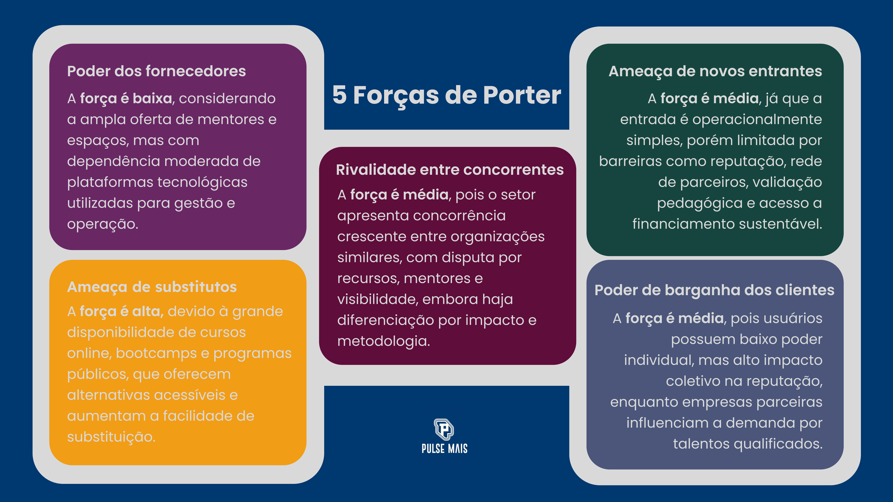
  <figcaption>
    Fonte: Produção dos Autores (2026)
  </figcaption>
</figure>

A análise a seguir aplica o modelo das 5 Forças de Porter ao contexto da Pulse Mais, identificando como cada força incide sobre a sustentabilidade da instituição e como a plataforma web em desenvolvimento atua na mitigação das pressões competitivas mapeadas.

A rivalidade entre concorrentes é média. O segmento apresenta crescimento e intensificação competitiva, com organizações como Reprograma, Instituto PROA, Laboratória e PrograMaria disputando financiadores, mentores e visibilidade. A Pulse Mais se diferencia por seu método próprio que integra aulas interativas, mentorias executivas e bolsas, além de histórico comprovado de empregabilidade, diferencial que a plataforma web torna visível por meio de dashboards de impacto auditáveis, reforçando a vantagem competitiva da instituição em disputas por aporte (ABSTARTUPS, 2022).

A ameaça de novos entrantes é média. Apesar da baixa barreira operacional para criação de programas educacionais, fatores como reputação institucional, rede de mentores, parcerias com empresas e validação pedagógica funcionam como barreiras relevantes. O avanço de iniciativas ESG financiadas por grandes empresas tende a elevar essa ameaça (PORTER, 2008).

O poder de barganha dos fornecedores é médio a alto, sobretudo ao considerarmos os financiadores corporativos como fornecedores de capital, categoria vital para uma ONG cuja operação depende de doações e patrocínios. Empresas como bancos e big techs concentram a oferta de recursos e podem condicionar o aporte a indicadores específicos de impacto, transferindo risco operacional para a instituição. Mentores voluntários, espaços físicos e plataformas LMS apresentam poder baixo a moderado, em função da ampla oferta. A plataforma web mitiga diretamente o poder dos financiadores ao automatizar dashboards de impacto, reduzindo a assimetria informacional na prestação de contas (OECD, 2021).

O poder de barganha dos clientes é médio. Os jovens atendidos possuem baixo poder individual, mas alto impacto coletivo na reputação da organização. Empresas parceiras exercem poder moderado, podendo buscar talentos em outras fontes. A retenção depende da qualidade da formação e dos resultados gerados (PORTER, 2008).

A ameaça de produtos substitutos é alta. Bootcamps pagos, cursos online (Coursera, Alura, DIO) e programas públicos oferecem alternativas acessíveis. A diferenciação da Pulse Mais está no modelo gratuito, no suporte integral e no acompanhamento pós-formação, diferenciais que a plataforma web amplifica ao consolidar o histórico longitudinal do jovem, algo que cursos avulsos e bootcamps não conseguem replicar, tornando o acompanhamento personalizado uma barreira difícil de imitar (HOLONIQ, 2025).

### 2.1.2. Análise SWOT da Instituição Parceira

<figure style="text-align: center; margin: 1.5rem auto;">
 <figcaption>
    Figura 2: Análise SWOT
  </figcaption>
  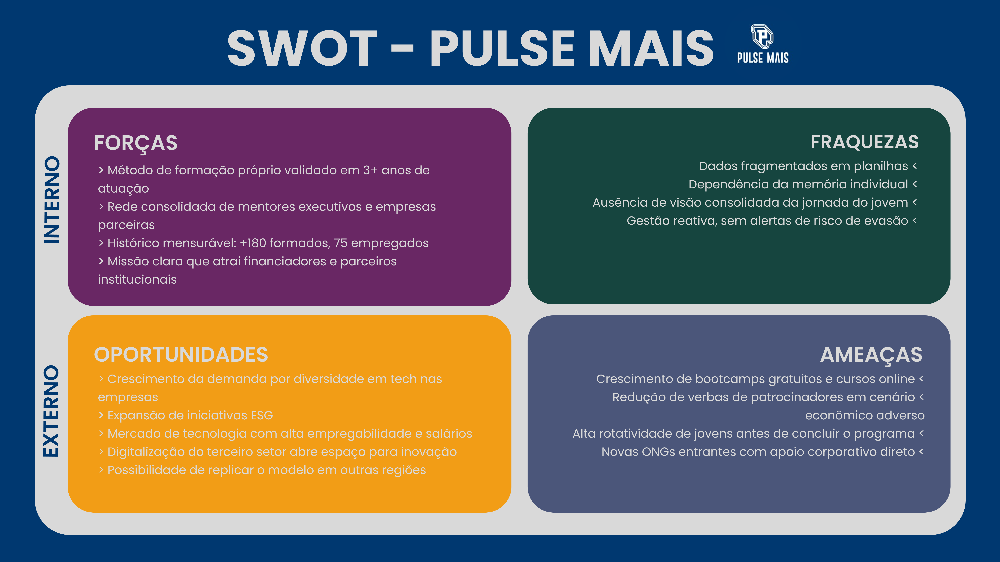
  <figcaption>
    Fonte: Produção dos Autores (2026)
  </figcaption>
</figure>

A combinação das forças da Pulse Mais (método pedagógico próprio, rede de mentores e histórico mensurável de impacto) constitui sua barreira central contra os substitutos gratuitos. Enquanto Coursera e bootcamps oferecem apenas conteúdo, a Pulse Mais entrega acompanhamento longitudinal humanizado, uma vantagem difícil de se replicar. Contudo, a fraqueza da fragmentação de dados compromete a comunicação dessa vantagem aos financiadores corporativos, ameaçando a captação. A plataforma web atua exatamente dentro desse problema ao consolidar a jornada do jovem em dados auditáveis, converter a oportunidade do crescimento ESG em diferenciação mensurável e transformar a fraqueza atual em um ativo estratégico.

### 2.1.3. Solução

**a- Problema a ser resolvido:**
Identificou-se que os dados dos alunos e ex-alunos da Pulse Mais encontram-se fragmentados em múltiplas planilhas isoladas por projeto e ano, complementadas por registros dispersos em conversas de WhatsApp. Essa fragmentação impede a construção de uma visão consolidada da jornada do jovem, gera dependência da memória individual da equipe e inviabiliza a análise de indicadores de impacto social a longo prazo.

**b- Dados disponíveis:**
Identificaram-se três fontes de dados existentes na instituição (INTELI; PULSE MAIS, 2026): o "Planilhão de Jovens do Framework", planilha principal de gestão dos alunos; relatórios de atividades exportados em formato .csv pela plataforma de gestão de aulas; e o edital do programa principal, contendo critérios de seleção, perfil do público-alvo e estrutura curricular dos cursos oferecidos.

**c- Solução proposta:**
Propõe-se o desenvolvimento de uma aplicação web centralizada que estabelecerá a Single Source of Truth (SSOT) da instituição. Construída com HTML, CSS e JavaScript no front-end, Node.js no back-end e banco de dados PostgreSQL, a plataforma consolidará perfis de alunos, registros de jornada, indicadores de impacto e um portal de acesso restrito ao próprio jovem.

**d- Forma de utilização da solução:**
A plataforma será utilizada por dois perfis de usuários: a equipe interna da Pulse Mais, responsável pelo registro de frequências, mentorias, eventos e anotações qualitativas sobre cada jovem; e os próprios alunos e ex-alunos, que acessarão um portal restrito para visualizar e atualizar seus dados cadastrais e de perfil.

**e- Benefícios esperados:**
Espera-se que a solução proporcione centralização de dados, redução do tempo de busca por informações históricas e capacidade de ação preventiva contra riscos de evasão. Adicionalmente, prevê-se melhoria na estratégia de empregabilidade baseada em dados históricos, aumento do engajamento da rede de talentos e personalização do atendimento ao jovem.

**f- Critério de sucesso e como será avaliado:**
Considera-se a solução bem-sucedida quando: (i) o tempo médio de consulta ao histórico de um jovem cair de horas para menos de 2 minutos; (ii) 100% dos jovens ativos tiverem ficha consolidada na SSOT; e (iii) os dashboards gerarem relatórios de empregabilidade auditáveis sem retrabalho manual. A avaliação ocorrerá em reuniões quinzenais com pontos focais da Pulse Mais e testes funcionais por sprint.

### 2.1.4. Value Proposition Canvas:

Aplicado ao contexto da Pulse Mais, o Value Proposition Canvas conecta cada funcionalidade da aplicação web às dores concretas dos dois perfis de usuários envolvidos: a equipe gestora (usuário primário) e o jovem participante (usuário secundário). A análise a seguir parte da equipe gestora, núcleo operacional do sistema, e em seguida amplia a perspectiva para o jovem, cuja participação ativa sustenta a saúde do ecossistema da SSOT.

#### Proposta de Valor:

<figure style="text-align: center; margin: 1.5rem auto;">
  <p style="margin: 0 0 0.5rem;">
    Figura 3: Canvas da proposta de valor
  </p>
  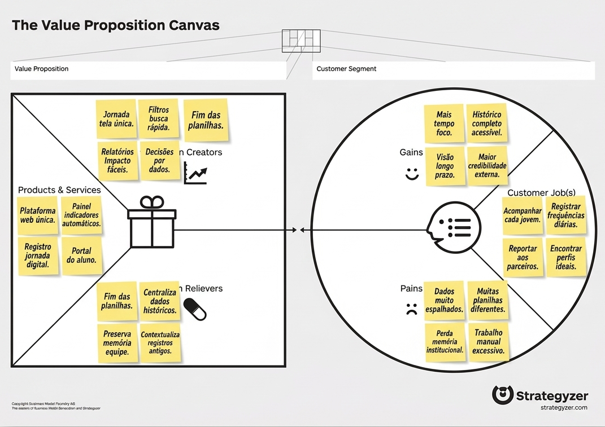
  <figcaption>
    Fonte: Adaptado de Strategyzer pelos autores (2026).
  </figcaption>
</figure>

**Produtos e Serviços:**

Plataforma web única: Uma plataforma web que centraliza tudo o que existe hoje espalhado em planilhas e WhatsApp. Oferece um cadastro único para cada jovem, com histórico completo acessível em pouco tempo e em um só lugar.

Painel de indicadores automáticos: Dashboard com os indicadores que a equipe já precisa reportar, como quantos jovens estão empregados, em qual empresa e há quanto tempo, permitindo que a equipe não precise montar isso manualmente a cada reunião.

Registro de jornada digital: Módulo de registro de jornada onde qualquer membro da equipe lança frequência, eventos e mentorias.

Portal do aluno: Portal do próprio aluno, onde ele acessa, atualiza o perfil e acompanha sua trajetória, permitindo também que o jovem preencha sozinho seus dados e sua evolução.

**Aliviadores de Dor:**

Fim das planilhas: Acaba com a grande quantidade de planilhas espalhadas e coloca tudo em um banco só, estruturado para receber todos os dados dos projetos ao longo do tempo.

Centraliza dados históricos: Permite que todos os membros tenham conhecimentos específicos de cada aluno por meio do histórico que fica no sistema.

Preserva memória equipe: Possibilita a criação de registros que fiquem em um lugar fixo, com data e contexto, rastreáveis quando alguém precisar revisitar em algum momento posterior.

Contextualiza registros antigos: Permite registrar, em tempo real, frequência e engajamento dos alunos, facilitando a identificação de alunos que apresentam um perfil de desistência.

**Criadores de Ganho:**

Jornada em tela única: A jornada completa de qualquer aluno aparece em uma única tela, sem a necessidade de abrir planilhas de anos diferentes para montar o histórico de alguém durante uma reunião.

Filtros de busca rápida: Filtros que deixam a equipe encontrar, em pouco tempo, jovens com o perfil certo para uma vaga ou programa, sem depender da memória de quem esteve presente, facilitando a busca.

Relatórios de impacto fáceis: Relatórios que trazem impacto e que se montam a partir dos dados já cadastrados, sem precisar consolidar tudo do zero toda vez que um parceiro pede números.

Decisões por dados: Dados históricos reais para embasar decisões, como, por exemplo, qual turma teve mais evasão, qual tipo de mentoria se correlaciona com empregabilidade ou onde vale investir mais atenção.

#### Perfil do Cliente:

**Tarefas do Cliente:**

Acompanhar cada jovem: Acompanhar cada jovem individualmente por meio do registro de presença nas aulas, participação em eventos, mentorias recebidas e como ele está evoluindo ao longo dos meses.

Registrar frequências diárias: Identificar quem está em risco de desistir antes que isso aconteça por meio da análise de queda de frequência e silêncio nos canais, sinais que ficam invisíveis quando os dados estão espalhados.

Reportar aos parceiros: Produzir relatórios de impacto para patrocinadores e parceiros com informações sobre quantos jovens estão empregados, quantos entraram na faculdade e o que mudou na vida deles após o programa.

Encontrar perfis ideais: Encontrar o perfil certo quando surge uma oportunidade, vaga, evento ou programa de bolsas, sem precisar vasculhar planilhas para lembrar quem se encaixa no perfil (PULSE MAIS, 2026).

**Dores:**

Dados muito espalhados: Informações importantes sobre um aluno, decisões tomadas, contextos relevantes e combinados feitos ficam enterrados em conversas de WhatsApp que ninguém vai achar depois.

Muitas planilhas diferentes: Os dados de cada projeto ficam em uma planilha própria, com colunas que mudaram ao longo dos anos, e montar qualquer visão consolidada exige horas de trabalho manual antes de começar.

Perda memória institucional: Quando alguém da equipe sai, um pedaço da memória institucional vai junto, pois o histórico dos jovens depende de quem esteve presente e não de um sistema que registra tudo.

Trabalho manual excessivo: Sem dados atualizados e acessíveis, fica difícil saber com precisão o que está funcionando nos programas e o que precisa mudar antes da próxima turma começar (INTELI; PULSE MAIS, 2026).

**Ganhos:**

Mais tempo foco: Menos tempo procurando informação espalhada e mais tempo fazendo o que realmente importa, como apoiar o jovem, articular parcerias e planejar os próximos programas.

Histórico completo acessível: Atendimento que parte de um contexto real. Quando a equipe sabe o histórico completo do jovem, a conversa começa de um ponto muito mais útil, ganhando tempo e profundidade nas reuniões.

Visão longo prazo: Uma visão de longo prazo dos jovens que fazem parte dos programas, permitindo acompanhar o que acontece 2, 3 ou 5 anos depois de formados, dado que nenhuma planilha anual consegue capturar.

Maior credibilidade externa: Transparência com quem financia a operação. Dados consistentes e bem organizados passam credibilidade em reuniões com parceiros e facilitam a captação de novos apoiadores para a ONG.

**Perspectiva do Jovem (Usuário Secundário):**

Embora a equipe gestora seja o usuário primário, a sustentabilidade da SSOT depende criticamente do engajamento contínuo do jovem com o Portal do Aluno. Ampliar a análise do VPC para esse segundo perfil amplia o escopo estratégico da solução:

_Tarefas do jovem_: Manter o perfil atualizado durante e após a formação, acessar mentorias, acompanhar a própria trajetória dentro do programa e localizar oportunidades de empregabilidade compatíveis com seu repertório.

_Dores_: Perda de vínculo com a Pulse Mais após o término do programa; necessidade de repetir a própria história a cada novo atendimento ou mentor; falta de visibilidade sobre o próprio progresso e sobre como sua jornada se compara à da rede.

_Ganhos esperados_: Pertencimento contínuo à rede de talentos; acesso direto a oportunidades curadas com base em seu perfil; protagonismo no controle dos próprios dados e da própria narrativa profissional.

_Como a plataforma entrega valor ao jovem_: o Portal do Aluno funciona como ponto único de relacionamento pós-formação, garantindo que ele permaneça parte ativa do ecossistema. A centralização do histórico elimina a fricção de "começar do zero" em cada novo contato com a equipe ou mentor, e a visualização da própria trajetória fortalece o senso de progresso e pertencimento.

A análise do Canvas da Proposta de Valor, sob a dupla perspectiva da equipe gestora e do jovem, mostra que cada funcionalidade da plataforma responde a dores reais de ambos os lados do ecossistema. A equipe gera valor para o jovem com base em dados ricos e atualizados, e o jovem alimenta esses dados ao manter a própria trajetória ativa, fechando o ciclo virtuoso que sustenta a SSOT. Com isso, a aplicação web se posiciona não apenas como ferramenta operacional, mas como infraestrutura estratégica do relacionamento longitudinal entre Pulse Mais e seus jovens.

### 2.1.5. Matriz de Riscos do Projeto

A Matriz de Riscos é uma ferramenta que auxilia na identificação, análise e priorização dos principais riscos de um projeto, permitindo uma gestão mais estratégica e preventiva. Ela organiza os riscos com base em critérios como probabilidade de ocorrência e impacto, possibilitando classificá-los e definir planos de resposta adequados. No contexto deste projeto, a matriz de riscos foi utilizada para mapear ameaças relacionadas a aspectos tecnológicos, de experiência do usuário e de contexto operacional, garantindo que a equipe da Pulse Mais pudesse antecipar problemas críticos e tomar decisões mais seguras ao longo do desenvolvimento da aplicação web.

<div style="text-align: center;">
  <p><strong>Figura 4: Ameaças – Matriz de Risco</strong></p>

  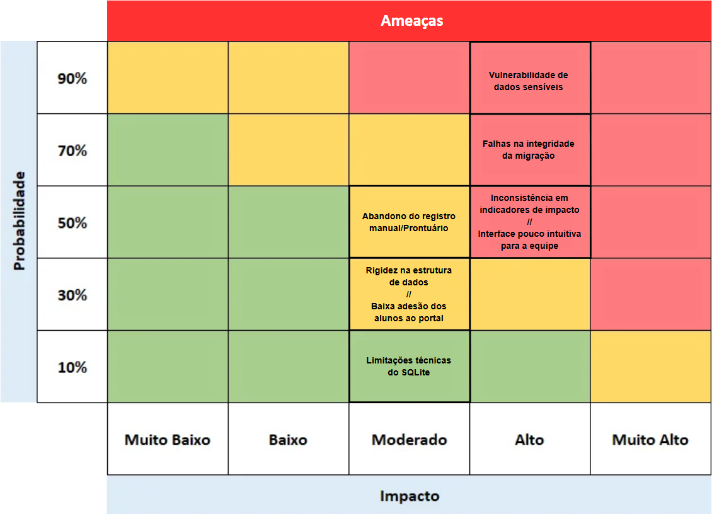

  <p>Fonte: Produção dos autores (2026) </p>
</div>

**1. Vulnerabilidade de dados sensíveis:**

Trata-se de um risco de natureza tecnológica. Sua probabilidade de ocorrência foi estimada em 90%, uma vez que o escopo do projeto exclui explicitamente o desenvolvimento de sistemas de autenticação robustos (sign in/log in). O impacto foi classificado como alto porque a plataforma armazenará dados pessoais protegidos pela LGPD (nome, CPF, contato, histórico acadêmico e indicadores de empregabilidade), cuja exposição comprometeria a segurança dos jovens e a reputação da ONG. A combinação desses fatores resulta em uma classificação geral alta. O projeto lida com relatos de vulnerabilidade psicossocial que exigem sigilo rigoroso. Como plano de ação, a equipe implementará rotas protegidas no back-end Node.js com controle de permissões por perfil de usuário, anonimização automática de dados em ambiente de testes e separação entre banco de produção e homologação. Caso seja identificada qualquer tentativa de acesso indevido ou inconsistência de permissão durante os testes, o deploy será interrompido até revisão manual das regras de acesso.

**2. Limitações de escalabilidade e performance do PostgreSQL:**

Trata-se de um risco de natureza tecnológica. Sua probabilidade de ocorrência foi estimada em 10%, pois o volume atual de 180 jovens formados é plenamente suportado pela stack definida de Node.js e PostgreSQL para um MVP. O impacto foi classificado como médio porque uma eventual lentidão afetaria a experiência de uso da equipe interna ao consultar dashboards complexos. A classificação final é baixa. O risco reside em um crescimento súbito de acessos simultâneos por alunos e equipe. Como plano de ação, a equipe realizará monitoramento do tempo médio de resposta das queries durante as sprints. Caso o tempo de carregamento ultrapasse 3 segundos em consultas críticas, serão aplicadas otimizações de índices SQL e revisão das queries do back-end. A arquitetura também foi planejada para permitir futura migração para bancos relacionais mais robustos, caso o volume de dados aumente significativamente.

**3. Perda de integridade na migração de dados:**

Trata-se de um risco de natureza estratégica. Sua probabilidade de ocorrência foi estimada em 70%, visto que as informações estão severamente fragmentadas em múltiplas planilhas isoladas e o projeto não contempla uma migração automática complexa. O impacto foi classificado como alto pois dados inconsistentes invalidariam a proposta de criar uma "Single Source of Truth" (SSOT). Isso resulta em uma classificação geral alta. A dependência de dados históricos dispersos aumenta a chance de erros no preenchimento do novo banco. Como plano de ação, a equipe realizará uma etapa obrigatória de limpeza e padronização das planilhas junto à coordenação da Pulse Mais antes da importação. Caso a taxa de inconsistência ultrapasse 5% durante a validação amostral dos dados migrados, o processo será interrompido para revisão manual das tabelas e correção do script de importação utilizado no back-end.

**4. Falta de autonomia na gestão evolutiva dos dados:**

Trata-se de um risco de natureza estratégica. Sua probabilidade de ocorrência foi estimada em 30%, uma vez que a autonomia para criar novos campos foi listada como um requisito essencial, mas pode ser limitada pela rigidez da arquitetura de software desenvolvida. O impacto foi classificado como médio, pois a incapacidade de adaptar o sistema a novos projetos tornaria a ferramenta obsoleta rapidamente. A classificação final é média. O sistema precisa acompanhar a evolução dos programas da ONG para permanecer útil. Como plano de ação, a equipe desenvolverá módulos administrativos dinâmicos no front-end e back-end para criação de campos personalizados sem necessidade de alteração direta no código-fonte. Caso usuários internos não consigam adicionar novos campos durante os testes de homologação, a funcionalidade será revisada antes da entrega final do MVP.

**5. Inconsistência na geração de indicadores de impacto:**

Trata-se de um risco de natureza pedagógica e institucional. Sua probabilidade de ocorrência foi estimada em 50%, pois a precisão dos dashboards depende inteiramente da alimentação manual correta de métricas de empregabilidade e renda. O impacto foi classificado como alto, pois indicadores irreais induziriam os gestores a tomadas de decisão equivocadas sobre o impacto social da ONG. A classificação geral é alta. Dashboards mal estruturados falham em demonstrar o valor real do método de formação próprio da Pulse Mais. Como plano de ação, os KPIs serão validados diretamente com a diretoria executiva antes da implementação dos dashboards. Além disso, o sistema contará com validações automáticas no back-end para impedir registros incompletos ou incompatíveis. Caso divergências sejam identificadas entre gráficos e dados brutos durante os testes, os indicadores serão recalculados e auditados manualmente.

**6. Abandono do registro manual no Prontuário Digital:**

Trata-se de um risco de natureza institucional. Sua probabilidade de ocorrência foi estimada em 50%, devido à ausência de integração com APIs externas como o WhatsApp, onde a maior parte da comunicação ocorre hoje. O impacto foi classificado como médio, gerando perda de histórico qualitativo e memória institucional sobre o atendimento aos jovens. A classificação é média. A equipe pode preferir a agilidade das mensagens instantâneas em vez de registrar atendimentos na plataforma. Como plano de ação, será implementada uma interface simplificada de registro com redução do número de campos obrigatórios por atendimento. Caso menos de 70% dos atendimentos sejam registrados durante o período de testes internos, serão realizadas revisões na usabilidade da funcionalidade e treinamento adicional com os usuários da ONG.

**7. Interface pouco intuitiva para a equipe interna:**

Trata-se de um risco de experiência do usuário (UX/UI). Sua probabilidade de ocorrência foi estimada em 50%, pois substituir processos de planilhas consolidadas por um novo software exige uma mudança de hábito significativa. O impacto foi classificado como alto, pois se a ferramenta for complexa, os gestores resistirão à transição tecnológica, mantendo a fragmentação. A classificação geral é alta. A usabilidade é o fator determinante para que o sistema se torne o centro da gestão. Como plano de ação, a equipe realizará testes de usabilidade com usuários reais da Pulse Mais ao final de cada sprint de prototipação. Caso mais de 30% dos usuários apresentem dificuldade para executar tarefas essenciais sem auxílio, os fluxos de navegação serão redesenhados antes da implementação definitiva da interface web da plataforma.

**8. Baixa adesão dos alunos ao portal:**

Trata-se de um risco de engajamento. Sua probabilidade de ocorrência foi estimada em 30%, dependendo do valor percebido pelo jovem ao acessar o sistema para atualizar seu perfil. O impacto foi classificado como médio, pois a falta de atualizações pelos alunos geraria defasagem nos dados de empregabilidade e renda em longo prazo. A classificação final é média. O engajamento é vital para manter o banco de dados dinâmico e útil para o relacionamento institucional. Como plano de ação, a equipe desenvolverá um portal responsivo e simplificado, priorizando acessibilidade mobile e rapidez no preenchimento das informações. Caso menos de 50% dos alunos convidados atualizem seus dados durante os testes piloto, a interface será reformulada com base nos feedbacks coletados nos testes de usabilidade.

<figure style="text-align: center; margin: 1.5rem auto;">
 <figcaption>
    Figura 5: Matriz de Risco - Oportunidades
  </figcaption>
  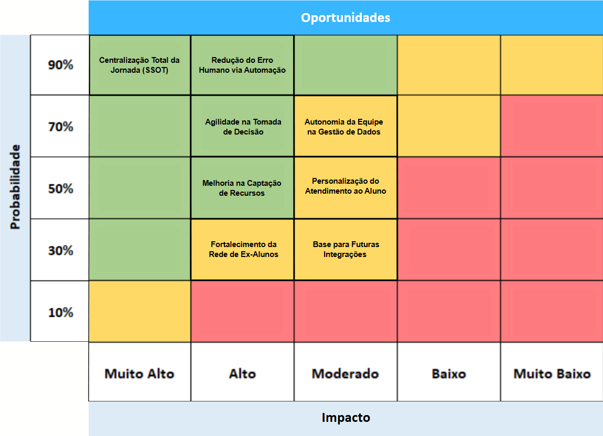
  <figcaption>
    Fonte: Produção dos Autores (2026)
  </figcaption>
</figure>

**1. Centralização Total da Jornada (SSOT):**

Trata-se de uma oportunidade tecnológica e estratégica. Sua probabilidade de ocorrência foi estimada em 90%, pois este é o núcleo do projeto e o principal entregável acordado para o MVP. O impacto foi classificado como muito alto, pois estabelece uma base de dados unificada que elimina a dependência da memória individual e de planilhas dispersas. A classificação geral é muito alta (Zona Verde). A centralização permite o acompanhamento integral do ciclo de vida do aluno, do ingresso à empregabilidade. Como plano de ação, a equipe estruturará o banco PostgreSQL com entidades integradas e relacionamentos padronizados, garantindo que todos os módulos consumam a mesma fonte de dados através das APIs desenvolvidas em Node.js.

**2. Criação de base para futuras integrações:**

Trata-se de uma oportunidade tecnológica. Sua probabilidade de ocorrência foi estimada em 30%, pois depende de novos ciclos de investimento pós-projeto acadêmico para implementar WebAPIs externas. O impacto foi classificado como moderado, ao garantir que o sistema nasça com uma arquitetura sólida em Node.js preparada para evoluções. A classificação final é moderada (Zona Amarela). Embora fora do escopo atual, a estrutura permite escalabilidade futura para integrações externas. Como plano de ação, a equipe documentará todas as rotas da API e seguirá uma arquitetura modular no back-end, permitindo futuras integrações sem necessidade de reestruturação completa do sistema.

**3. Redução do erro humano via automação de formulários:**

Trata-se de uma oportunidade tecnológica. Sua probabilidade de ocorrência foi estimada em 90%, pois a transição de planilhas manuais para um sistema com input estruturado e automação de formulários é um requisito direto. O impacto foi classificado como alto, liberando a equipe de tarefas burocráticas e eliminando falhas de preenchimento que hoje ocorrem em "planilhões" manuais. A classificação é alta (Zona Verde). A automação garante que as respostas dos alunos atualizem a base automaticamente. Como plano de ação, o sistema implementará validações automáticas de campos obrigatórios, máscaras de preenchimento e padronização de formulários diretamente no front-end e no back-end para minimizar inconsistências operacionais.

**4. Autonomia da equipe na gestão de dados:**

Trata-se de uma oportunidade operacional. Sua probabilidade de ocorrência foi estimada em 70%, pois a funcionalidade de criação de novos campos é tratada como essencial para a operação. O impacto foi classificado como moderado, gerando flexibilidade para a ONG adaptar a plataforma a novos cursos e eventos sem auxílio técnico externo. A classificação é moderada (Zona Amarela). Essa autonomia reduz o custo de manutenção e aumenta a vida útil do software. Como plano de ação, será criado um painel administrativo com permissões específicas para edição de campos dinâmicos, permitindo que usuários não técnicos alterem estruturas de formulários sem modificar diretamente o banco de dados.

**5. Agilidade na tomada de decisão estratégica:**

Trata-se de uma oportunidade de gestão. Sua probabilidade de ocorrência foi estimada em 70%, dado que a substituição de coletas manuais por dashboards automatizados é uma entrega direta do sistema. O impacto foi classificado como alto, permitindo que gestores identifiquem riscos de evasão e ajam preventivamente. A classificação é alta (Zona Verde). A visualização intuitiva de KPIs transforma a gestão da ONG em um processo orientado por dados. Como plano de ação, a equipe desenvolverá dashboards interativos com filtros dinâmicos e consultas otimizadas, garantindo atualização rápida dos indicadores e suporte mais eficiente às decisões institucionais.

**6. Personalização do atendimento ao aluno:**

Trata-se de uma oportunidade pedagógica e institucional. Sua probabilidade de ocorrência foi estimada em 50%, baseada na facilidade de acesso ao histórico acadêmico completo e indicadores de acompanhamento em uma única tela. O impacto foi classificado como moderado, resultando em um suporte mais consultivo, preciso e humanizado para cada jovem. A classificação é moderada (Zona Amarela). O perfil digital centralizado evita que o aluno precise repetir sua história a cada novo atendimento. Como plano de ação, a interface do perfil será organizada por categorias e histórico cronológico, permitindo acesso rápido às informações mais relevantes para o acompanhamento pedagógico.

**7. Melhoria na captação de recursos e transparência:**

Trata-se de uma oportunidade estratégica. Sua probabilidade de ocorrência foi estimada em 50%, dependendo da utilização ativa dos dados pela diretoria executiva frente a parceiros. O impacto foi classificado como alto, pois registros históricos robustos e dashboards de impacto (empregabilidade e renda) aumentam a transparência e credibilidade institucional. A classificação geral é alta (Zona Verde). Dados precisos são fundamentais para prestar contas e atrair novos doadores. Como plano de ação, a equipe desenvolverá relatórios exportáveis em PDF e dashboards compartilháveis, permitindo consolidação rápida de métricas institucionais para parceiros e patrocinadores.

**8. Fortalecimento da rede de ex-alunos e talentos:**

Trata-se de uma oportunidade de engajamento. Sua probabilidade de ocorrência foi estimada em 30%, vinculada ao sucesso do Portal do Aluno como canal de atualização cadastral. O impacto foi classificado como alto, facilitando a identificação de "jovens multiplicadores" e a conexão com novas oportunidades de mercado. A classificação geral é alta (Zona Verde). Manter a rede ativa é um dos pilares de prosperidade e redução de desigualdades da Pulse Mais. Como plano de ação, o portal contará com funcionalidades simplificadas de atualização de perfil e acompanhamento de trajetória profissional, incentivando a manutenção contínua do vínculo institucional.

---

Portanto, baseado na matriz de riscos apresentada, é possível concluir que a análise estruturada dos riscos, considerando tanto ameaças quanto oportunidades, permite uma visão mais clara das prioridades do projeto, contribuindo para um desenvolvimento mais consciente, organizado e alinhado aos objetivos da parceria com a Pulse Mais. Além disso, a conexão explícita entre os riscos identificados e as decisões arquiteturais do sistema demonstra uma abordagem mais madura de engenharia de software, em que gestão estratégica e implementação técnica atuam de forma integrada para garantir maior segurança, confiabilidade e sustentabilidade da solução desenvolvida.

## 2.2. Personas

### Persona 1:

<figure style="text-align: center; margin: 1.5rem auto;">
 <figcaption>
    Figura 6: Persona 1 - Coordenadora de projetos e relacionamentos
  </figcaption>
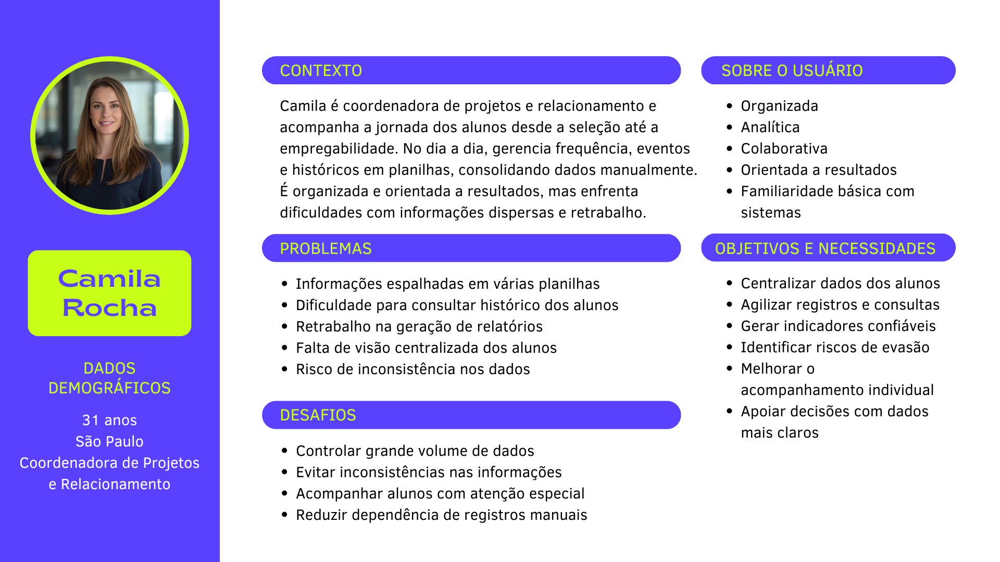
  <figcaption>
    Fonte: Produção dos Autores (2026)
  </figcaption>
</figure>

**Nome:** Camila Rocha  
**Idade:** 31 anos  
**Localização:** São Paulo – SP  
**Perfil:** Coordenadora de Projetos e Relacionamento, responsável pelo acompanhamento da jornada dos alunos da Pulse Mais desde a seleção até a empregabilidade

---

#### Contexto

Camila é coordenadora de projetos e relacionamento e acompanha a jornada dos alunos desde a seleção até a empregabilidade. No dia a dia, gerencia frequência, eventos e históricos consolidando dados manualmente em planilhas. É organizada e orientada a resultados, mas enfrenta dificuldades recorrentes com informações dispersas e retrabalho operacional que comprometem a eficiência do seu trabalho.

---

#### Dores

As dores referem-se às principais dificuldades, frustrações e obstáculos enfrentados no dia a dia. Esses pontos evidenciam onde estão os problemas mais críticos e indicam oportunidades de melhoria. São elas:

- Informações dos alunos espalhadas em várias planilhas, dificultando o acesso rápido e confiável aos dados
- Dificuldade para consultar o histórico completo dos alunos de forma ágil e centralizada
- Retrabalho constante na geração de relatórios devido à falta de automação e integração entre fontes
- Ausência de uma visão centralizada que permita acompanhar todos os alunos de forma simultânea
- Risco de inconsistência nos dados causado pela dependência de registros manuais e descentralizados
- Dificuldade em identificar e acompanhar com atenção especial os alunos em situação de risco de evasão

---

#### Objetivos

Os objetivos representam os resultados que a persona deseja alcançar e as metas que orientam suas ações. Eles ajudam a direcionar soluções que realmente gerem valor. São eles:

- Centralizar os dados dos alunos em uma única plataforma confiável e de fácil acesso
- Gerar indicadores precisos e confiáveis para embasar decisões estratégicas
- Identificar riscos de evasão de forma antecipada para agir com mais efetividade
- Melhorar o acompanhamento individual de cada aluno ao longo de toda a jornada
- Apoiar decisões institucionais com dados mais claros, atualizados e organizados

---

#### Necessidades

As necessidades dizem respeito aos requisitos práticos e funcionais esperados de uma solução. Estão diretamente ligadas às dores e indicam o que precisa ser atendido para melhorar a experiência. São elas:

- Plataforma centralizada para consolidação e consulta de todos os dados dos alunos
- Agilidade nos registros e nas consultas, reduzindo a dependência de planilhas manuais
- Geração automatizada de relatórios e indicadores de acompanhamento
- Funcionalidade de alerta ou identificação de alunos com risco de evasão ou atenção especial
- Histórico completo e acessível da trajetória de cada aluno dentro do programa

---

#### Sobre o Usuário

O perfil do usuário apresenta características comportamentais e traços de personalidade que influenciam a forma como a persona interage com produtos e serviços. São elas:

- Organizada
- Analítica
- Colaborativa
- Orientada a resultados
- Familiaridade básica com sistemas

Camila representa uma profissional comprometida com o sucesso dos alunos e com a qualidade operacional do programa. Seu perfil evidencia a necessidade de soluções centralizadas, confiáveis e com boa usabilidade, que eliminem o retrabalho manual e permitam uma gestão mais estratégica e eficiente da jornada dos alunos. Sua rotina é marcada pelo volume elevado de informações a serem controladas e pela responsabilidade de garantir que nenhum aluno passe despercebido, desafios que podem ser significativamente reduzidos com ferramentas integradas, automatizadas e orientadas a dados.

---

### Persona 2: Luana (Aluna ativa)

<figure style="text-align: center; margin: 1.5rem auto;">
 <figcaption>
    Figura 7: Persona 2 - Aluna Ativa
  </figcaption>
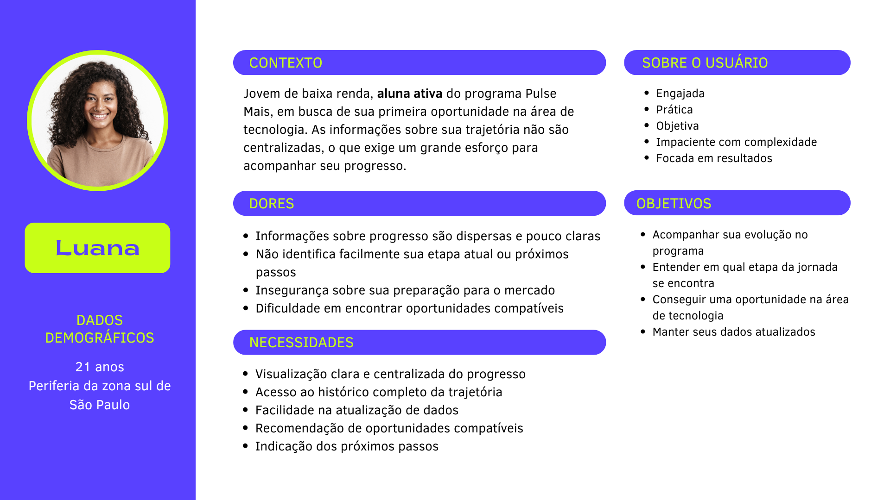
  <figcaption>
    Fonte: Produção dos Autores (2026)
  </figcaption>
</figure>

**Nome:** Luana  
**Idade:** 21 anos  
**Localização:** Periferia da zona sul de São Paulo  
**Perfil:** Jovem de baixa renda, aluna ativa do programa Pulse Mais

---

#### Contexto

Luana é uma estudante engajada que está em busca da sua primeira oportunidade na área de tecnologia. Atualmente, enfrenta dificuldades por não ter suas informações de trajetória centralizadas, o que torna o acompanhamento do seu progresso mais complexo e cansativo.

---

#### Dores

As dores referem-se às principais dificuldades, frustrações e obstáculos enfrentados no dia a dia. Esses pontos evidenciam onde estão os problemas mais críticos e indicam oportunidades de melhoria. São elas:

- Informações sobre progresso dispersas e pouco claras
- Dificuldade em identificar sua etapa atual e próximos passos
- Insegurança sobre sua preparação para o mercado
- Dificuldade em encontrar oportunidades compatíveis

---

#### Objetivos

Os objetivos representam os resultados que a persona deseja alcançar e as metas que orientam suas ações. Eles ajudam a direcionar soluções que realmente gerem valor. São eles:

- Acompanhar sua evolução no programa
- Entender em qual etapa da jornada se encontra
- Conseguir uma oportunidade na área de tecnologia
- Manter seus dados atualizados

---

#### Necessidades

As necessidades dizem respeito aos requisitos práticos e funcionais esperados de uma solução. Estão diretamente ligadas às dores e indicam o que precisa ser atendido para melhorar a experiência. São elas:

- Visualização clara e centralizada do progresso
- Acesso ao histórico completo da trajetória
- Facilidade para atualização de dados
- Recomendação de oportunidades compatíveis
- Indicação objetiva dos próximos passos

---

#### Sobre o Usuário

O perfil do usuário apresenta características comportamentais e traços de personalidade que influenciam a forma como a persona interage com produtos e serviços. São elas:

- Engajada
- Prática
- Objetiva
- Impaciente com complexidade
- Focada em resultados

Luana representa uma jovem em início de carreira que busca clareza, direção e oportunidades no setor de tecnologia. Seu perfil evidencia a necessidade de soluções simples, organizadas e orientadas a resultados, que facilitem o acompanhamento de sua evolução e apoiem sua entrada no mercado de trabalho. Sua jornada é marcada pela motivação, mas também por desafios estruturais que podem ser minimizados com ferramentas mais intuitivas e centralizadas.

---

### Persona 3: Pedro (Ex-Aluno)

<figure style="text-align: center; margin: 1.5rem auto;">
<figcaption> 
Figura 8: Persona 3 - Ex-Aluno
</figcaption>
  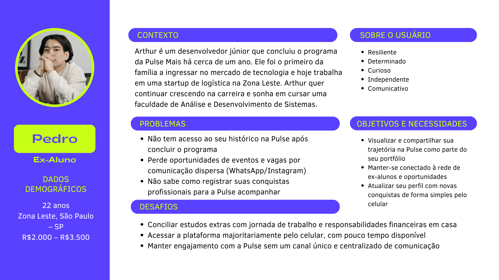
  <figcaption>
    Fonte: Produção dos Autores (2026)
  </figcaption>
</figure>

**Nome:** Pedro  
**Idade:** 22 anos  
**Localização:** Zona Leste, São Paulo – SP  
**Perfil:** Desenvolvedor júnior, ex-aluno do programa Pulse Mais, faixa salarial de R$2.000 a R$3.500

---

#### Contexto

Pedro é um desenvolvedor júnior que concluiu o programa da Pulse Mais há cerca de um ano. Foi o primeiro da família a ingressar no mercado de tecnologia e atualmente trabalha em uma startup de logística na Zona Leste. Busca continuar crescendo na carreira e sonha em cursar uma faculdade de Análise e Desenvolvimento de Sistemas.

---

#### Dores

As dores referem-se às principais dificuldades, frustrações e obstáculos enfrentados no dia a dia. Esses pontos evidenciam onde estão os problemas mais críticos e indicam oportunidades de melhoria. São elas:

- Falta de acesso ao histórico na Pulse após concluir o programa
- Perda de oportunidades de eventos e vagas por comunicação dispersa em WhatsApp e Instagram
- Dificuldade em registrar suas conquistas profissionais para a Pulse acompanhar
- Ausência de um canal único e centralizado de comunicação com a instituição

---

#### Objetivos

Os objetivos representam os resultados que a persona deseja alcançar e as metas que orientam suas ações. Eles ajudam a direcionar soluções que realmente gerem valor. São eles:

- Visualizar e compartilhar sua trajetória na Pulse como parte do seu portfólio
- Manter-se conectado à rede de ex-alunos e oportunidades
- Atualizar seu perfil com novas conquistas de forma simples pelo celular
- Continuar crescendo na carreira e ingressar em uma faculdade da área

---

#### Necessidades

As necessidades dizem respeito aos requisitos práticos e funcionais esperados de uma solução. Estão diretamente ligadas às dores e indicam o que precisa ser atendido para melhorar a experiência. São elas:

- Acesso contínuo ao histórico completo do programa após a conclusão
- Plataforma responsiva e otimizada para uso pelo celular
- Canal centralizado de comunicação para eventos, vagas e oportunidades
- Ferramenta simples para registro e atualização de conquistas profissionais
- Compartilhamento da trajetória como parte do portfólio profissional

---

#### Sobre o Usuário

O perfil do usuário apresenta características comportamentais e traços de personalidade que influenciam a forma como a persona interage com produtos e serviços. São elas:

- Resiliente
- Determinado
- Curioso
- Independente
- Comunicativo

Pedro representa um jovem profissional em ascensão que, mesmo após concluir o programa, busca manter-se conectado à instituição que apoiou seu ingresso no mercado de tecnologia. Seu perfil evidencia a necessidade de soluções móveis, ágeis e centralizadas, que respeitem sua rotina intensa de trabalho e estudos extras e que permitam a continuidade do vínculo com a Pulse. Sua jornada é marcada pela superação e pelo desejo de crescimento contínuo, mas enfrenta desafios práticos como a conciliação entre trabalho, estudos e responsabilidades financeiras em casa, que podem ser amenizados com ferramentas mais conectadas e acessíveis.

### Persona 4: Fabrício (Mentor)

<figure style="text-align: center; margin: 1.5rem auto;">
 <figcaption>
    Figura 9: Persona 4 - Mentor
  </figcaption>
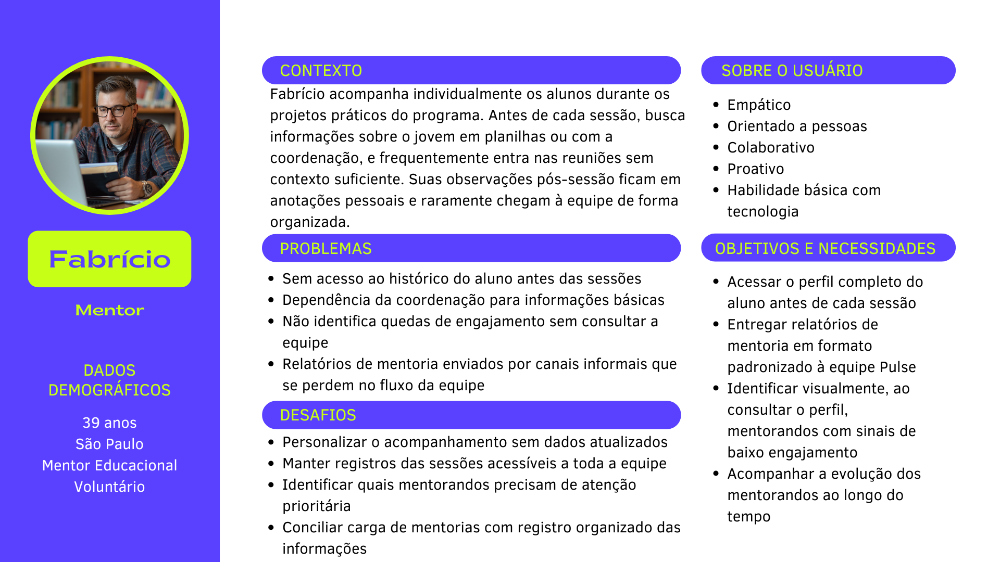
  <figcaption>
    Fonte: Produção dos Autores (2026)
  </figcaption>
</figure>

**Nome:** Fabrício
**Idade:** 39 anos
**Localização:** São Paulo – SP
**Perfil:** Mentor voluntário da Pulse Mais, profissional do setor de tecnologia que acompanha individualmente jovens em projetos práticos do programa

---

#### Contexto

Fabrício acompanha individualmente os alunos durante os projetos práticos do programa. Antes de cada sessão, busca informações sobre o jovem em planilhas ou com a coordenação, e frequentemente entra nas reuniões sem contexto suficiente. Suas observações pós-sessão ficam em anotações pessoais e raramente chegam à equipe de forma organizada, gerando perda de continuidade entre as mentorias realizadas.

---

#### Dores

As dores referem-se às principais dificuldades, frustrações e obstáculos enfrentados no dia a dia. Esses pontos evidenciam onde estão os problemas mais críticos e indicam oportunidades de melhoria. São elas:

- Falta de acesso ao histórico do aluno antes das sessões de mentoria
- Dependência da coordenação para obter informações básicas sobre os mentorados
- Dificuldade em identificar quedas de engajamento sem consultar diretamente a equipe Pulse
- Relatórios de mentoria enviados por canais informais que se perdem no fluxo da equipe
- Ausência de visão consolidada da evolução dos mentorados ao longo do tempo

---

#### Objetivos

Os objetivos representam os resultados que a persona deseja alcançar e as metas que orientam suas ações. Eles ajudam a direcionar soluções que realmente gerem valor. São eles:

- Acessar o perfil completo do aluno antes de cada sessão de mentoria
- Acompanhar a evolução dos mentorados ao longo do tempo
- Personalizar o acompanhamento com base em dados atualizados
- Identificar mentorandos que precisam de atenção prioritária
- Garantir que sua contribuição como mentor gere valor real para a trajetória do jovem

---

#### Necessidades

As necessidades dizem respeito aos requisitos práticos e funcionais esperados de uma solução. Estão diretamente ligadas às dores e indicam o que precisa ser atendido para melhorar a experiência. São elas:

- Acesso de consulta ao perfil dos alunos vinculados a ele como mentor
- Visualização do histórico de mentorias e indicadores de engajamento dos mentorados
- Sinalização visual de alunos com risco de evasão ou baixo engajamento
- Canal padronizado para entrega de relatórios de mentoria à equipe Pulse
- Conciliação entre carga de mentorias e registro organizado das informações

---

#### Sobre o Usuário

O perfil do usuário apresenta características comportamentais e traços de personalidade que influenciam a forma como a persona interage com produtos e serviços. São elas:

- Empático
- Orientado a pessoas
- Colaborativo
- Proativo
- Habilidade básica com tecnologia

Fabrício representa um mentor voluntário comprometido com o desenvolvimento dos jovens da Pulse Mais, que enfrenta dificuldades práticas para personalizar seu acompanhamento devido à falta de visibilidade sobre a jornada dos mentorandos. Seu perfil evidencia a necessidade de uma solução que ofereça acesso controlado de leitura ao histórico dos alunos sob sua responsabilidade, sem comprometer a custódia institucional dos dados sensíveis, que permanece com a equipe Pulse Mais. Sua disponibilidade limitada exige interfaces simples e diretas, focadas em consulta rápida antes das sessões, sem a complexidade operacional de registro extensivo de informações, atividade que continua centralizada na equipe interna da organização.

---

## 2.3. User Stories

Nesta seção estão listadas todas as User Stories levantadas para o projeto, organizadas de forma sequencial (US01 a US13). Todas as histórias seguem o modelo padrão e estão vinculadas ao quadro Kanban do projeto.
As User Stories prioritárias (US01 a US05) foram analisadas segundo o critério INVEST.

| Identificação        | US01                                                                                                                                                                                                                                                                                                                                                                                                                                                                                                                                                                                                                                                                                                                                                                                                           |
| -------------------- | -------------------------------------------------------------------------------------------------------------------------------------------------------------------------------------------------------------------------------------------------------------------------------------------------------------------------------------------------------------------------------------------------------------------------------------------------------------------------------------------------------------------------------------------------------------------------------------------------------------------------------------------------------------------------------------------------------------------------------------------------------------------------------------------------------------- |
| Persona              | Camila, coordenadora de projetos                                                                                                                                                                                                                                                                                                                                                                                                                                                                                                                                                                                                                                                                                                                                                                               |
| User Story           | “Como coordenadora de projetos, quero cadastrar um novo aluno na plataforma com seus dados pessoais e acadêmicos, para que todas as informações fiquem centralizadas em um único sistema.”                                                                                                                                                                                                                                                                                                                                                                                                                                                                                                                                                                                                                     |
| Critério de aceite 1 | CR1: Cadastro de aluno com sucesso — Dado que Camila acessa o formulário de cadastro, quando preenche os campos obrigatórios e confirma o envio, o sistema deve salvar o aluno no banco de dados e exibi-lo na listagem da plataforma.                                                                                                                                                                                                                                                                                                                                                                                                                                                                                                                                                                         |
| Critério de aceite 2 | CR2: Validação de CPF duplicado — Dado que Camila tenta cadastrar um aluno com CPF já existente, quando confirma o envio, o sistema deve exibir mensagem de erro informando conflito de cadastro.                                                                                                                                                                                                                                                                                                                                                                                                                                                                                                                                                                                                              |
| Critério de aceite 3 | CR3: Validação de campos obrigatórios — Dado que Camila deixa campos obrigatórios em branco, quando tenta confirmar o envio, o sistema deve impedir o cadastro e exibir mensagens de validação.                                                                                                                                                                                                                                                                                                                                                                                                                                                                                                                                                                                                                |
| Critérios INVEST     | A US01 é Independente porque pode ser implementada separadamente das funcionalidades de frequência, perfil ou dashboard, tratando apenas do cadastro inicial de alunos; é Negociável porque campos obrigatórios, regras de validação e formato do cadastro podem ser ajustados conforme decisões do negócio; é Valorosa porque centraliza informações dos alunos em um único sistema e reduz controles paralelos; é Estimável porque possui escopo claro envolvendo formulário, persistência e validações, permitindo estimativa de esforço; é Pequena porque possui foco específico e pode ser entregue em uma sprint; e é Testável porque seus critérios de aceite podem ser validados objetivamente por meio do cadastro bem-sucedido, da rejeição de CPF duplicado e da validação dos campos obrigatórios. |

| Identificação        | US02                                                                                                                                                                                                                                                                                                                                                                                                                                                                                                                                                                                                                                                                                                                                    |
| -------------------- | --------------------------------------------------------------------------------------------------------------------------------------------------------------------------------------------------------------------------------------------------------------------------------------------------------------------------------------------------------------------------------------------------------------------------------------------------------------------------------------------------------------------------------------------------------------------------------------------------------------------------------------------------------------------------------------------------------------------------------------- |
| Persona              | Camila, coordenadora de projetos                                                                                                                                                                                                                                                                                                                                                                                                                                                                                                                                                                                                                                                                                                        |
| User Story           | “Como coordenadora de projetos, quero registrar a frequência dos alunos em cada aula, para que seja possível monitorar o engajamento e identificar riscos de evasão precocemente.”                                                                                                                                                                                                                                                                                                                                                                                                                                                                                                                                                      |
| Critério de aceite 1 | CR1: Registro de presença ou ausência — Dado que Camila acessa o módulo de frequência, quando seleciona um aluno e uma aula e marca presença ou ausência, o sistema deve salvar o registro e vinculá-lo ao perfil do aluno.                                                                                                                                                                                                                                                                                                                                                                                                                                                                                                             |
| Critério de aceite 2 | CR2: Atualização do percentual de frequência — Dado que Camila registra a frequência de um aluno, quando acessa o perfil desse aluno, o sistema deve exibir automaticamente o percentual atualizado.                                                                                                                                                                                                                                                                                                                                                                                                                                                                                                                                    |
| Critério de aceite 3 | CR3: Prevenção de registros duplicados — Dado que já existe frequência registrada para um aluno em determinada aula, quando Camila tenta lançar novo registro para a mesma aula, o sistema deve impedir duplicidade ou permitir apenas edição do registro existente.                                                                                                                                                                                                                                                                                                                                                                                                                                                                    |
| Critérios INVEST     | A US02 é Independente porque pode ser desenvolvida separadamente de dashboards ou perfis completos, focando apenas no registro de frequência; é Negociável porque a forma de registro (manual, em lote ou outros formatos) pode ser ajustada sem alterar o objetivo da história; é Valorosa porque permite monitorar engajamento dos alunos e identificar riscos de evasão; é Estimável porque o escopo é claro, envolvendo lançamento, armazenamento e cálculo de frequência; é Pequena porque se limita a uma funcionalidade específica e pode ser entregue em uma sprint; e é Testável porque seus critérios de aceite podem ser validados objetivamente pelo registro correto, atualização do percentual e controle de duplicidade. |

| Identificação        | US03                                                                                                                                                                                                                                                                                                                                                                                                                                                                                                                                                                                                                                                                                                                                        |
| -------------------- | ------------------------------------------------------------------------------------------------------------------------------------------------------------------------------------------------------------------------------------------------------------------------------------------------------------------------------------------------------------------------------------------------------------------------------------------------------------------------------------------------------------------------------------------------------------------------------------------------------------------------------------------------------------------------------------------------------------------------------------------- |
| Persona              | Camila, coordenadora de projetos                                                                                                                                                                                                                                                                                                                                                                                                                                                                                                                                                                                                                                                                                                            |
| User Story           | “Como coordenadora de projetos, quero visualizar em uma única tela o histórico completo de um aluno, para que eu possa consultá-lo sem precisar buscar informações em planilhas separadas.”                                                                                                                                                                                                                                                                                                                                                                                                                                                                                                                                                 |
| Critério de aceite 1 | CR1: Exibição de histórico consolidado — Dado que Camila busca um aluno na plataforma, quando acessa seu perfil, o sistema deve exibir dados pessoais, frequência, eventos participados e anotações em uma única interface organizada.                                                                                                                                                                                                                                                                                                                                                                                                                                                                                                      |
| Critério de aceite 2 | CR2: Controle de acesso a observações qualitativas — Dado que há observações qualitativas de mentoria vinculadas ao aluno, quando o perfil é acessado, o sistema deve exibir essas observações apenas para os perfis Coordenador e o Mentor autor do relato (RN14).                                                                                                                                                                                                                                                                                                                                                                                                                                                                         |
| Critério de aceite 3 | CR3: Tratamento para ausência de dados — Dado que alguma seção do perfil não possua registros, quando Camila acessar o aluno, o sistema deve exibir estado vazio informativo sem comprometer a navegação.                                                                                                                                                                                                                                                                                                                                                                                                                                                                                                                                   |
| Critérios INVEST     | A US03 é Independente porque trata da consolidação e visualização das informações do aluno, podendo ser implementada como módulo próprio; é Negociável porque os dados exibidos, a organização da interface e filtros podem ser ajustados conforme decisões do projeto; é Valorosa porque reduz o tempo de consulta e melhora a tomada de decisão com visão centralizada do aluno; é Estimável porque possui escopo definido envolvendo exibição de histórico e permissões; é Pequena porque se limita à visualização de dados sem contemplar edição; e é Testável porque seus critérios de aceite podem ser validados objetivamente pela exibição correta dos dados, pelo controle de acesso e pelo tratamento para ausência de registros. |

| Identificação        | US04                                                                                                                                                                                                                                                                                                                                                                                                                                                                                                                                                                                                                                                        |
| -------------------- | ----------------------------------------------------------------------------------------------------------------------------------------------------------------------------------------------------------------------------------------------------------------------------------------------------------------------------------------------------------------------------------------------------------------------------------------------------------------------------------------------------------------------------------------------------------------------------------------------------------------------------------------------------------- |
| Persona              | Camila, coordenadora de projetos                                                                                                                                                                                                                                                                                                                                                                                                                                                                                                                                                                                                                            |
| User Story           | “Como coordenadora de projetos, quero visualizar um painel com indicadores consolidados da instituição, para que eu possa tomar decisões estratégicas com base em dados reais sem depender de relatórios manuais.”                                                                                                                                                                                                                                                                                                                                                                                                                                          |
| Critério de aceite 1 | CR1: Exibição de indicadores consolidados — Dado que Camila acessa o dashboard, quando há dados cadastrados no sistema, o painel deve exibir indicadores como total de alunos ativos, taxa de empregabilidade e número de formados.                                                                                                                                                                                                                                                                                                                                                                                                                         |
| Critério de aceite 2 | CR2: Aplicação de filtros por período — Dado que Camila aplica um filtro de período, quando confirma a seleção, o sistema deve atualizar os indicadores para refletir apenas os dados do intervalo escolhido.                                                                                                                                                                                                                                                                                                                                                                                                                                               |
| Critério de aceite 3 | CR3: Tratamento para ausência de dados no filtro — Dado que não existam dados no período selecionado, quando Camila aplica o filtro, o sistema deve exibir indicadores zerados ou mensagem informativa sem erro.                                                                                                                                                                                                                                                                                                                                                                                                                                            |
| Critérios INVEST     | A US04 é Independente porque pode ser desenvolvida como módulo separado de visualização e análise de indicadores; é Negociável porque indicadores, filtros e formatos de exibição podem ser ajustados conforme decisões do negócio; é Valorosa porque apoia decisões estratégicas baseadas em dados reais; é Estimável porque possui escopo definido envolvendo consolidação e filtragem de indicadores; é Pequena porque se limita a um conjunto inicial de métricas e filtros; e é Testável porque seus critérios de aceite podem ser validados objetivamente pela exibição dos indicadores, aplicação dos filtros e comportamento em cenários sem dados. |

| Identificação        | US05                                                                                                                                                                                                                                                                                                                                                                                                                                                                                                                                                                                                                                                                                                                                                                                                                                                                                                                                                                                                                                      |
| -------------------- | ----------------------------------------------------------------------------------------------------------------------------------------------------------------------------------------------------------------------------------------------------------------------------------------------------------------------------------------------------------------------------------------------------------------------------------------------------------------------------------------------------------------------------------------------------------------------------------------------------------------------------------------------------------------------------------------------------------------------------------------------------------------------------------------------------------------------------------------------------------------------------------------------------------------------------------------------------------------------------------------------------------------------------------------- |
| Persona              | Luana Santos                                                                                                                                                                                                                                                                                                                                                                                                                                                                                                                                                                                                                                                                                                                                                                                                                                                                                                                                                                                                                              |
| User Story           | “Como aluna ativa, quero acompanhar minha evolução no programa Pulse Mais para ter clareza do meu progresso e aumentar minhas chances de inserção profissional.”                                                                                                                                                                                                                                                                                                                                                                                                                                                                                                                                                                                                                                                                                                                                                                                                                                                                          |
| Critério de aceite 1 | CR1: Exibição da etapa atual no programa — Dado que a aluna possui progresso registrado no sistema, quando acessar sua evolução, o sistema deve exibir corretamente sua etapa atual (início, em andamento, avançado ou concluído).                                                                                                                                                                                                                                                                                                                                                                                                                                                                                                                                                                                                                                                                                                                                                                                                        |
| Critério de aceite 2 | CR2: Exibição do histórico de atividades — Dado que a aluna realizou atividades no programa, quando acessar sua evolução, o sistema deve exibir todas as atividades registradas em ordem cronológica.                                                                                                                                                                                                                                                                                                                                                                                                                                                                                                                                                                                                                                                                                                                                                                                                                                     |
| Critério de aceite 3 | CR3: Atualização automática do progresso — Dado que uma nova atividade foi registrada, quando o sistema atualizar os dados, o progresso da aluna deve ser recalculado automaticamente ou após recarregamento da página.                                                                                                                                                                                                                                                                                                                                                                                                                                                                                                                                                                                                                                                                                                                                                                                                                   |
| Critério de aceite 4 | CR4: Indicador visual de progresso — Dado que a aluna possui progresso registrado, quando acessar sua evolução, o sistema deve exibir um indicador visual (barra, porcentagem ou status) representando seu avanço no programa.                                                                                                                                                                                                                                                                                                                                                                                                                                                                                                                                                                                                                                                                                                                                                                                                            |
| Critérios INVEST     | A US05 é Independente porque pode ser implementada sem depender diretamente das funcionalidades de cadastro ou edição, exigindo apenas acesso autenticado e leitura de dados; é Negociável porque a forma de apresentação do progresso (barra, porcentagem ou etapas) pode ser ajustada conforme decisões de design sem impactar o objetivo principal; é Valorosa porque entrega à aluna Luana uma visão clara da sua evolução no programa Pulse Mais, ajudando-a a entender seu progresso e aumentar suas chances de inserção profissional; é Estimável porque possui escopo bem definido (visualização de progresso, histórico e indicador), permitindo estimativa precisa de esforço de desenvolvimento e testes; é Pequena porque se limita à exibição e acompanhamento de informações, sem regras complexas ou integrações adicionais; e é Testável porque todos os critérios de aceite podem ser validados objetivamente, verificando a exibição correta da etapa, do histórico, da atualização de progresso e do indicador visual. |

| Identificação        | US06                                                                                                                                                                                                                                                                                                                                                                                                                                                                                                                                                                                                                                                                                                    |
| -------------------- | ------------------------------------------------------------------------------------------------------------------------------------------------------------------------------------------------------------------------------------------------------------------------------------------------------------------------------------------------------------------------------------------------------------------------------------------------------------------------------------------------------------------------------------------------------------------------------------------------------------------------------------------------------------------------------------------------------- |
| Persona              | Camila Rocha (Coordenadora de projetos)                                                                                                                                                                                                                                                                                                                                                                                                                                                                                                                                                                                                                                                                 |
| User Story           | “Como coordenadora de projetos, quero centralizar os dados dos alunos e acompanhar seus indicadores no programa Pulse Mais para melhorar o acompanhamento individual.”                                                                                                                                                                                                                                                                                                                                                                                                                                                                                                                                  |
| Critério de aceite 1 | CR1: Centralização de dados — Dado que existem informações dos alunos em diferentes fontes, quando acessar o sistema, ele deve exibir os dados consolidados em um único ambiente.                                                                                                                                                                                                                                                                                                                                                                                                                                                                                                                       |
| Critério de aceite 2 | CR2: Consulta de dados dos alunos — Dado que a coordenadora precisa acessar informações específicas, quando realizar uma busca, o sistema deve retornar os dados de forma organizada e rápida.                                                                                                                                                                                                                                                                                                                                                                                                                                                                                                          |
| Critério de aceite 3 | CR3: Visualização de indicadores — Dado que os dados estão disponíveis, quando acessar o painel, o sistema deve exibir indicadores de acompanhamento (ex: progresso, participação).                                                                                                                                                                                                                                                                                                                                                                                                                                                                                                                     |
| Critério de aceite 4 | CR4: Atualização dos dados — Dado que novas informações são registradas no sistema, quando os dados forem atualizados, o sistema deve refletir essas mudanças automaticamente ou após recarregamento.                                                                                                                                                                                                                                                                                                                                                                                                                                                                                                   |
| Critérios INVEST     | A US06 é Independente porque a centralização e visualização dos dados pode ser desenvolvida como módulo próprio sem depender de outras funcionalidades específicas; é Negociável porque os tipos de indicadores e formas de visualização podem ser ajustados conforme as necessidades do projeto; é Valorosa porque permite à coordenadora acompanhar individualmente os alunos com mais clareza; é Estimável porque o escopo está bem definido (centralizar, consultar e visualizar dados); é Pequena porque se limita à visualização e consulta de informações; e é Testável porque é possível validar a centralização, a busca de dados, a exibição dos indicadores e a atualização das informações. |

| Identificação        | US07                                                                                                                                                                                                                                                                                                                                                                                                                                                                                                                                                                                                                                      |
| -------------------- | ----------------------------------------------------------------------------------------------------------------------------------------------------------------------------------------------------------------------------------------------------------------------------------------------------------------------------------------------------------------------------------------------------------------------------------------------------------------------------------------------------------------------------------------------------------------------------------------------------------------------------------------- |
| Persona              | Pedro (Ex-aluno)                                                                                                                                                                                                                                                                                                                                                                                                                                                                                                                                                                                                                          |
| User Story           | “Como ex-aluno do programa Pulse Mais, quero me manter conectado à rede de ex-alunos e oportunidades para continuar acessando vagas, eventos e networking.”                                                                                                                                                                                                                                                                                                                                                                                                                                                                               |
| Critério de aceite 1 | CR1: Acesso à rede de ex-alunos — Dado que o usuário concluiu o programa, quando acessar a plataforma, o sistema deve permitir acesso à comunidade de ex-alunos.                                                                                                                                                                                                                                                                                                                                                                                                                                                                          |
| Critério de aceite 2 | CR2: Visualização de oportunidades — Dado que existem vagas ou eventos disponíveis, quando acessar a área de oportunidades, o sistema deve exibir essas informações atualizadas.                                                                                                                                                                                                                                                                                                                                                                                                                                                          |
| Critério de aceite 3 | CR3: Notificações de novidades — Dado que novas oportunidades forem cadastradas, quando o sistema atualizar os dados, o usuário deve ser notificado (ex: alerta ou feed atualizado).                                                                                                                                                                                                                                                                                                                                                                                                                                                      |
| Critério de aceite 4 | CR4: Interação com a rede — Dado que o usuário está na rede de ex-alunos, quando acessar a comunidade, o sistema deve permitir visualizar ou interagir com outros ex-alunos (ex: perfis ou contatos).                                                                                                                                                                                                                                                                                                                                                                                                                                     |
| Critérios INVEST     | A US07 é Independente porque a funcionalidade de rede e oportunidades pode ser desenvolvida separadamente das demais áreas do sistema; é Negociável porque o formato da comunidade (feed, lista ou fórum) pode ser ajustado conforme o projeto; é Valorosa porque mantém o ex-aluno conectado a oportunidades e networking, aumentando seu desenvolvimento profissional; é Estimável porque o escopo é claro (acesso, visualização e notificação); é Pequena porque foca na conexão e acesso à rede; e é Testável porque é possível validar acesso à comunidade, exibição de oportunidades, notificações e interação com outros usuários. |

| Identificação        | US08                                                                                                                                                                                                                                                                                                                                                                                                                                                                                                                                                                                                                                                                                                                                                                                                                                                                                                                                                                                                                                                                                                                                                                                                                                                            |
| -------------------- | --------------------------------------------------------------------------------------------------------------------------------------------------------------------------------------------------------------------------------------------------------------------------------------------------------------------------------------------------------------------------------------------------------------------------------------------------------------------------------------------------------------------------------------------------------------------------------------------------------------------------------------------------------------------------------------------------------------------------------------------------------------------------------------------------------------------------------------------------------------------------------------------------------------------------------------------------------------------------------------------------------------------------------------------------------------------------------------------------------------------------------------------------------------------------------------------------------------------------------------------------------------- |
| Persona              | Pedro, ex-aluno                                                                                                                                                                                                                                                                                                                                                                                                                                                                                                                                                                                                                                                                                                                                                                                                                                                                                                                                                                                                                                                                                                                                                                                                                                                 |
| User Story           | “Como ex-aluno do programa Pulse Mais, quero atualizar meu perfil com novas conquistas profissionais pelo celular, para manter minha trajetória registrada na plataforma e compartilhá-la como parte do meu portfólio.”                                                                                                                                                                                                                                                                                                                                                                                                                                                                                                                                                                                                                                                                                                                                                                                                                                                                                                                                                                                                                                         |
| Critério de aceite 1 | CR1: Registro de nova conquista com sucesso — Dado que Pedro acessa seu perfil de ex-aluno pelo celular, quando preenche os campos da nova conquista (título, descrição, data e categoria) e confirma o envio, o sistema deve salvar a conquista no histórico do seu perfil e exibi-la na sua linha do tempo de trajetória.                                                                                                                                                                                                                                                                                                                                                                                                                                                                                                                                                                                                                                                                                                                                                                                                                                                                                                                                     |
| Critério de aceite 2 | CR2: Visualização da trajetória completa — Dado que Pedro possui conquistas registradas no sistema, quando acessar a seção de trajetória do seu perfil, o sistema deve exibir todas as suas atividades e conquistas em ordem cronológica, incluindo as registradas durante o programa e as adicionadas após a conclusão.                                                                                                                                                                                                                                                                                                                                                                                                                                                                                                                                                                                                                                                                                                                                                                                                                                                                                                                                        |
| Critério de aceite 3 | CR3: Compartilhamento da trajetória — Dado que Pedro deseja divulgar sua trajetória como parte do portfólio, quando acionar a opção de compartilhamento, o sistema deve gerar um link público ou opção de exportação que permita o acesso externo à sua trajetória registrada.                                                                                                                                                                                                                                                                                                                                                                                                                                                                                                                                                                                                                                                                                                                                                                                                                                                                                                                                                                                  |
| Critérios INVEST     | A US08 é Independente porque pode ser implementada separadamente das funcionalidades de cadastro inicial, frequência ou dashboard administrativo, tratando exclusivamente da atualização de perfil e trajetória do ex-aluno; é Negociável porque os campos da conquista, formato de compartilhamento e elementos visuais da linha do tempo podem ser ajustados conforme decisões de design e negócio; é Valorosa porque entrega ao Pedro uma forma centralizada de manter seu histórico atualizado mesmo após concluir o programa, fortalecendo seu portfólio profissional e mantendo-o conectado à rede de ex-alunos da Pulse; é Estimável porque possui escopo bem definido envolvendo formulário responsivo, persistência de dados, exibição cronológica e funcionalidade de compartilhamento, permitindo estimativa clara de esforço; é Pequena porque possui foco específico em atualização de perfil e visualização de trajetória, podendo ser entregue em uma sprint; e é Testável porque seus critérios de aceite podem ser validados objetivamente por meio do registro bem-sucedido de conquistas, da exibição cronológica da trajetória, do compartilhamento externo, da validação de campos obrigatórios e da verificação de responsividade mobile. |

| Identificação        | US09                                                                                                                                                                                                                                                                                                                                                                                                                                                                                                                                                                                                                                                                                                                                                                                                                                                                                                                                                                                                                                                                                                                                                                                                                                                                                         |
| -------------------- | -------------------------------------------------------------------------------------------------------------------------------------------------------------------------------------------------------------------------------------------------------------------------------------------------------------------------------------------------------------------------------------------------------------------------------------------------------------------------------------------------------------------------------------------------------------------------------------------------------------------------------------------------------------------------------------------------------------------------------------------------------------------------------------------------------------------------------------------------------------------------------------------------------------------------------------------------------------------------------------------------------------------------------------------------------------------------------------------------------------------------------------------------------------------------------------------------------------------------------------------------------------------------------------------- |
| Persona              | Camila, coordenadora de projetos                                                                                                                                                                                                                                                                                                                                                                                                                                                                                                                                                                                                                                                                                                                                                                                                                                                                                                                                                                                                                                                                                                                                                                                                                                                             |
| User Story           | “Como coordenadora de projetos, quero gerar relatórios consolidados sobre o desempenho e a frequência dos alunos, para reduzir o retrabalho com planilhas manuais e apoiar minhas decisões com indicadores confiáveis.”                                                                                                                                                                                                                                                                                                                                                                                                                                                                                                                                                                                                                                                                                                                                                                                                                                                                                                                                                                                                                                                                      |
| Critério de aceite 1 | CR1: Geração de relatório consolidado — Dado que Camila acessa o módulo de relatórios, quando seleciona o tipo de relatório desejado (frequência, desempenho ou histórico geral) e confirma a geração, o sistema deve consolidar automaticamente as informações dos alunos e exibir o relatório formatado na tela.                                                                                                                                                                                                                                                                                                                                                                                                                                                                                                                                                                                                                                                                                                                                                                                                                                                                                                                                                                           |
| Critério de aceite 2 | CR2: Filtro por período e turma — Dado que Camila precisa analisar dados específicos, quando aplica filtros por período, turma ou status do aluno, o sistema deve atualizar o relatório considerando apenas os dados que atendem aos critérios selecionados.                                                                                                                                                                                                                                                                                                                                                                                                                                                                                                                                                                                                                                                                                                                                                                                                                                                                                                                                                                                                                                 |
| Critério de aceite 3 | CR3: Exportação em formato externo — Dado que Camila deseja compartilhar o relatório com outras áreas, quando aciona a opção de exportação, o sistema deve gerar o arquivo em formatos PDF e Excel, mantendo a formatação e os dados consolidados.                                                                                                                                                                                                                                                                                                                                                                                                                                                                                                                                                                                                                                                                                                                                                                                                                                                                                                                                                                                                                                           |
| Critério de aceite 4 | CR4: Identificação de alunos em risco — Dado que existem alunos com baixa frequência ou desempenho insuficiente, quando o relatório for exibido, o sistema deve destacar visualmente esses alunos por meio de indicadores ou alertas, facilitando a identificação para acompanhamento individual.                                                                                                                                                                                                                                                                                                                                                                                                                                                                                                                                                                                                                                                                                                                                                                                                                                                                                                                                                                                            |
| Critérios INVEST     | A US09 é Independente porque pode ser implementada separadamente das funcionalidades de cadastro ou registro de frequência, focando apenas na consolidação e exibição de dados já existentes no sistema; é Negociável porque os tipos de relatório, formatos de exportação e indicadores visuais podem ser ajustados conforme decisões de negócio e necessidades operacionais da coordenação; é Valorosa porque entrega à Camila uma ferramenta concreta para reduzir o retrabalho com planilhas manuais, gerar indicadores confiáveis e identificar riscos de evasão de forma ágil, alinhando-se diretamente aos seus objetivos e necessidades; é Estimável porque possui escopo bem definido envolvendo consolidação de dados, aplicação de filtros, exportação em múltiplos formatos e destaque visual de alunos em risco, permitindo estimativa clara de esforço; é Pequena porque possui foco específico em geração e exportação de relatórios, podendo ser entregue em uma sprint dedicada; e é Testável porque seus critérios de aceite podem ser validados objetivamente por meio da geração correta dos relatórios consolidados, do funcionamento dos filtros aplicados, da exportação adequada nos formatos PDF e Excel e da identificação visual dos alunos em situação de risco. |

| Identificação        | US10                                                                                                                                                                                                                                                                                                                                                                                                                                                                                                                                                                                                                                                                                                                                                                                                                                                                                                                                                                                                                                                                                                                                                                                                                                                                                                                                                                                                             |
| -------------------- | ---------------------------------------------------------------------------------------------------------------------------------------------------------------------------------------------------------------------------------------------------------------------------------------------------------------------------------------------------------------------------------------------------------------------------------------------------------------------------------------------------------------------------------------------------------------------------------------------------------------------------------------------------------------------------------------------------------------------------------------------------------------------------------------------------------------------------------------------------------------------------------------------------------------------------------------------------------------------------------------------------------------------------------------------------------------------------------------------------------------------------------------------------------------------------------------------------------------------------------------------------------------------------------------------------------------------------------------------------------------------------------------------------------------- |
| Persona              | Luana, aluna ativa                                                                                                                                                                                                                                                                                                                                                                                                                                                                                                                                                                                                                                                                                                                                                                                                                                                                                                                                                                                                                                                                                                                                                                                                                                                                                                                                                                                               |
| User Story           | “Como aluna ativa do programa Pulse Mais, quero receber recomendações de oportunidades compatíveis com meu perfil e etapa do programa, para conseguir minha primeira inserção profissional na área de tecnologia.”                                                                                                                                                                                                                                                                                                                                                                                                                                                                                                                                                                                                                                                                                                                                                                                                                                                                                                                                                                                                                                                                                                                                                                                               |
| Critério de aceite 1 | CR1: Exibição de oportunidades compatíveis — Dado que Luana acessa a área de oportunidades, quando o sistema identificar seu perfil e etapa atual no programa, deve exibir uma lista personalizada de vagas, eventos e processos seletivos compatíveis com seu nível de preparação e área de interesse.                                                                                                                                                                                                                                                                                                                                                                                                                                                                                                                                                                                                                                                                                                                                                                                                                                                                                                                                                                                                                                                                                                          |
| Critério de aceite 2 | CR2: Filtros e ordenação por compatibilidade — Dado que Luana deseja refinar as oportunidades exibidas, quando aplicar filtros por tipo de oportunidade, modalidade ou localização, o sistema deve atualizar a listagem mantendo a ordenação por grau de compatibilidade com seu perfil.                                                                                                                                                                                                                                                                                                                                                                                                                                                                                                                                                                                                                                                                                                                                                                                                                                                                                                                                                                                                                                                                                                                         |
| Critério de aceite 3 | CR3: Indicação dos próximos passos — Dado que Luana visualiza uma oportunidade compatível, quando acessar os detalhes da vaga ou evento, o sistema deve exibir orientações claras sobre os próximos passos a serem seguidos, como requisitos pendentes, materiais necessários e prazos de inscrição.                                                                                                                                                                                                                                                                                                                                                                                                                                                                                                                                                                                                                                                                                                                                                                                                                                                                                                                                                                                                                                                                                                             |
| Critério de aceite 4 | CR4: Notificação de novas oportunidades — Dado que uma nova oportunidade compatível foi cadastrada na plataforma, quando o sistema identificar a correspondência com o perfil de Luana, deve enviar uma notificação dentro da plataforma destacando a oportunidade na sua área pessoal.                                                                                                                                                                                                                                                                                                                                                                                                                                                                                                                                                                                                                                                                                                                                                                                                                                                                                                                                                                                                                                                                                                                          |
| Critérios INVEST     | A US10 é Independente porque pode ser implementada separadamente das funcionalidades de cadastro, frequência ou registro de progresso, tratando exclusivamente da recomendação personalizada de oportunidades para o aluno; é Negociável porque os critérios de compatibilidade, formatos de filtros, tipos de notificação e elementos visuais da listagem podem ser ajustados conforme decisões de negócio e design sem comprometer o objetivo principal; é Valorosa porque entrega à Luana uma forma direta e organizada de encontrar oportunidades alinhadas ao seu perfil, resolvendo a sua dor de dificuldade em encontrar oportunidades compatíveis e aumentando suas chances de inserção profissional na área de tecnologia; é Estimável porque possui escopo bem definido envolvendo lógica de compatibilidade, listagem personalizada, aplicação de filtros, exibição de detalhes e disparo de notificações, permitindo estimativa clara de esforço de desenvolvimento; é Pequena porque possui foco específico em recomendação e visualização de oportunidades, podendo ser entregue em uma sprint dedicada; e é Testável porque seus critérios de aceite podem ser validados objetivamente por meio da exibição correta das oportunidades compatíveis, do funcionamento dos filtros aplicados, da apresentação clara dos próximos passos e do envio adequado das notificações de novas oportunidades. |

| Identificação        | US11                                                                                                                                                                                                                                                                                                                                                                                                                                                                                                                                                                                                                                                                                                                                                                                                                                                                                                                                                                                                              |
| -------------------- | ----------------------------------------------------------------------------------------------------------------------------------------------------------------------------------------------------------------------------------------------------------------------------------------------------------------------------------------------------------------------------------------------------------------------------------------------------------------------------------------------------------------------------------------------------------------------------------------------------------------------------------------------------------------------------------------------------------------------------------------------------------------------------------------------------------------------------------------------------------------------------------------------------------------------------------------------------------------------------------------------------------------- |
| Persona              | Fabrício, mentor                                                                                                                                                                                                                                                                                                                                                                                                                                                                                                                                                                                                                                                                                                                                                                                                                                                                                                                                                                                                  |
| User Story           | "Como mentor da Pulse Mais, quero consultar o perfil completo e o histórico dos alunos sob minha mentoria antes de cada sessão, para personalizar o acompanhamento com base em dados atualizados sem depender da coordenação."                                                                                                                                                                                                                                                                                                                                                                                                                                                                                                                                                                                                                                                                                                                                                                                    |
| Critério de aceite 1 | CR1: Acesso restrito aos mentorandos — Dado que Fabrício acessa a plataforma com seu perfil de mentor, quando navega para a área de mentorandos, o sistema deve exibir apenas os alunos vinculados a ele como mentor, ocultando os demais.                                                                                                                                                                                                                                                                                                                                                                                                                                                                                                                                                                                                                                                                                                                                                                        |
| Critério de aceite 2 | CR2: Visualização somente leitura — Dado que Fabrício acessa o perfil de um mentorando, quando visualiza dados pessoais, histórico de programas, indicadores e mentorias anteriores, o sistema deve exibir as informações em modo somente leitura, sem permitir edição.                                                                                                                                                                                                                                                                                                                                                                                                                                                                                                                                                                                                                                                                                                                                           |
| Critério de aceite 3 | CR3: Restrição a observações qualitativas — Dado que existem observações qualitativas de mentoria vinculadas ao aluno, quando Fabrício acessa o perfil do mentorando, o sistema deve exibir apenas as observações das quais ele é o Mentor autor do relato, ocultando as demais (RN14).                                                                                                                                                                                                                                                                                                                                                                                                                                                                                                                                                                                                                                                                                                                           |
| Critérios INVEST     | A US11 é Independente porque pode ser implementada separadamente das demais funcionalidades, tratando apenas da consulta restrita por perfil de mentor; é Negociável porque o conjunto de informações exibidas e a organização visual podem ser ajustados conforme decisões de design e validações com mentores reais; é Valorosa porque entrega ao Fabrício autonomia para preparar suas mentorias sem depender da coordenação, atendendo diretamente à dor da falta de contexto antes das sessões; é Estimável porque possui escopo bem definido envolvendo controle de acesso por vínculo aluno-mentor, exibição em modo leitura e restrição de observações qualitativas alheias; é Pequena porque se limita à consulta sem contemplar operações de escrita; e é Testável porque seus critérios de aceite podem ser validados objetivamente pelo isolamento entre mentorandos de diferentes mentores, pela impossibilidade de edição e pela restrição correta das observações qualitativas de outros mentores. |

| Identificação        | US12                                                                                                                                                                                                                                                                                                                                                                                                                                                                                                                                                                                                                                                                                                                                                                                                                                                                                                                                                                              |
| -------------------- | --------------------------------------------------------------------------------------------------------------------------------------------------------------------------------------------------------------------------------------------------------------------------------------------------------------------------------------------------------------------------------------------------------------------------------------------------------------------------------------------------------------------------------------------------------------------------------------------------------------------------------------------------------------------------------------------------------------------------------------------------------------------------------------------------------------------------------------------------------------------------------------------------------------------------------------------------------------------------------- |
| Persona              | Camila, coordenadora de projetos                                                                                                                                                                                                                                                                                                                                                                                                                                                                                                                                                                                                                                                                                                                                                                                                                                                                                                                                                  |
| User Story           | "Como coordenadora de projetos, quero importar relatórios de mentoria entregues pelos mentores em formato padronizado, para que essas informações fiquem vinculadas ao histórico do aluno sem retrabalho manual de digitação."                                                                                                                                                                                                                                                                                                                                                                                                                                                                                                                                                                                                                                                                                                                                                    |
| Critério de aceite 1 | CR1: Importação vinculada a aluno e mentor — Dado que Camila acessa o módulo de importação de mentorias, quando faz o upload de um relatório no template definido e seleciona o aluno e o mentor correspondentes, o sistema deve registrar a mentoria vinculada ao perfil do aluno e ao mentor responsável.                                                                                                                                                                                                                                                                                                                                                                                                                                                                                                                                                                                                                                                                       |
| Critério de aceite 2 | CR2: Validação do template — Dado que Camila tenta importar um relatório fora do template padronizado, quando confirma o envio, o sistema deve rejeitar o arquivo com mensagem descritiva indicando os campos ausentes ou mal formatados.                                                                                                                                                                                                                                                                                                                                                                                                                                                                                                                                                                                                                                                                                                                                         |
| Critério de aceite 3 | CR3: Vinculação obrigatória a mentor cadastrado e ativo — Dado que Camila tenta vincular um relatório a um mentor não cadastrado ou inativo, quando confirma o envio, o sistema deve impedir a operação e sugerir o cadastro ou reativação do mentor.                                                                                                                                                                                                                                                                                                                                                                                                                                                                                                                                                                                                                                                                                                                             |
| Critérios INVEST     | A US12 é Independente porque pode ser desenvolvida separadamente das funcionalidades de cadastro de aluno e dashboard, focando apenas na importação estruturada de mentorias; é Negociável porque o formato do template, os campos obrigatórios e as mensagens de erro podem ser ajustados conforme decisões de negócio sem alterar o objetivo principal; é Valorosa porque elimina retrabalho da equipe Pulse e garante que contribuições de mentores externos sejam efetivamente integradas ao histórico do aluno; é Estimável porque possui escopo definido envolvendo upload de arquivo, validação de formato, verificação de mentor ativo e persistência da mentoria; é Pequena porque se limita ao fluxo de importação de mentorias, podendo ser entregue em uma sprint; e é Testável porque seus critérios de aceite podem ser validados objetivamente pela importação bem-sucedida, rejeição de templates inválidos e bloqueio de vinculações a mentores não cadastrados. |

| Identificação        | US13                                                                                                                                                                                                                                                                                                                                                                                                                                                                                                                                                                                                                                                                                                                                                                                                                                                                                               |
| -------------------- | -------------------------------------------------------------------------------------------------------------------------------------------------------------------------------------------------------------------------------------------------------------------------------------------------------------------------------------------------------------------------------------------------------------------------------------------------------------------------------------------------------------------------------------------------------------------------------------------------------------------------------------------------------------------------------------------------------------------------------------------------------------------------------------------------------------------------------------------------------------------------------------------------- |
| Persona              | Camila, coordenadora de projetos                                                                                                                                                                                                                                                                                                                                                                                                                                                                                                                                                                                                                                                                                                                                                                                                                                                                   |
| User Story           | "Como coordenadora de projetos, quero cadastrar e gerenciar mentores que atuam na rede Pulse Mais, para que mentorias registradas no sistema possam ser vinculadas a profissionais identificáveis e seu histórico de contribuição seja rastreável institucionalmente."                                                                                                                                                                                                                                                                                                                                                                                                                                                                                                                                                                                                                             |
| Critério de aceite 1 | CR1: Cadastro de mentor — Dado que Camila acessa o formulário de cadastro de mentor, quando preenche nome, e-mail, especialidade, tipo de vínculo e disponibilidade, o sistema deve persistir o mentor no banco e disponibilizá-lo para vinculação em mentorias e atribuição a alunos.                                                                                                                                                                                                                                                                                                                                                                                                                                                                                                                                                                                                             |
| Critério de aceite 2 | CR2: Consulta de histórico por mentor — Dado que existe um mentor cadastrado com mentorias registradas, quando Camila acessar o perfil do mentor, o sistema deve listar todas as mentorias oferecidas com data, tema e aluno atendido.                                                                                                                                                                                                                                                                                                                                                                                                                                                                                                                                                                                                                                                             |
| Critério de aceite 3 | CR3: Inativação preservando histórico — Dado que Camila inativa um mentor que não atua mais na rede, quando a operação for confirmada, o sistema deve marcar o mentor como inativo sem remover suas mentorias registradas, impedindo apenas novas vinculações futuras.                                                                                                                                                                                                                                                                                                                                                                                                                                                                                                                                                                                                                             |
| Critérios INVEST     | A US13 é Independente porque o cadastro e gerenciamento de mentores constitui módulo próprio, sem depender de outras funcionalidades de aluno ou dashboard; é Negociável porque os campos do cadastro, os critérios de inativação e a forma de exibição do histórico podem ser ajustados conforme decisões institucionais; é Valorosa porque permite à Pulse Mais ter visibilidade sobre sua rede de mentores e rastrear contribuições individuais, fortalecendo a gestão da rede de talentos; é Estimável porque envolve formulário de cadastro, regras de inativação lógica e listagem de mentorias por mentor, com escopo claro; é Pequena porque se limita à entidade Mentor e seu ciclo de vida; e é Testável porque seus critérios de aceite podem ser validados objetivamente pelo cadastro persistido, pela listagem correta do histórico e pela preservação de mentorias após inativação. |

# <a name="c3"></a>3. Projeto da Aplicação Web

## 3.1. Requisitos do Sistema

### Minimundo — Sistema Pulse Mais

A Pulse Mais é uma organização sem fins lucrativos que forma jovens de baixa renda para carreiras em tecnologia. Hoje, a gestão dos alunos é feita por meio de planilhas isoladas por projeto e ano, complementadas por conversas de WhatsApp, o que gera fragmentação dos dados, dependência da memória individual da equipe e dificulta a análise de impacto a longo prazo. Para resolver esse cenário, propõe-se o desenvolvimento de uma aplicação web que centralize todas as informações dos alunos e ex-alunos em um único banco de dados estruturado, atuando como a Single Source of Truth (SSOT) da instituição.

O sistema é utilizado por quatro perfis distintos, cada um com permissões específicas. O Coordenador é o perfil com maior nível de acesso: cadastra alunos, registra a jornada de cada um, importa planilhas históricas e envia comunicados pela plataforma. O Mentor tem acesso de consulta somente leitura aos perfis dos alunos formalmente vinculados a ele como mentorandos, podendo visualizar histórico de programas, indicadores e mentorias anteriores, sem permissão de escrita. O Aluno acessa a plataforma por meio do Portal do Aluno, onde pode atualizar seus dados cadastrais (nome, contato, endereço), mas não pode editar histórico, indicadores ou observações registradas pela equipe. O Ex-Aluno acessa o mesmo portal com permissões equivalentes às do Aluno, diferenciado pelo campo `status` no banco de dados.

O núcleo do sistema é o cadastro de aluno. Cada aluno possui um perfil único no banco, identificado pelo CPF, que não pode ser duplicado. Caso um aluno precise ser removido, o registro não é apagado fisicamente, e sim desativado, preservando todo o histórico para fins de análise institucional. A partir desse cadastro, a equipe Pulse alimenta o sistema com indicadores de acompanhamento — participação, liderança e engajamento —, que devem estar sempre vinculados a um programa ou evento existente e ser registrados em escala numérica de 1 a 5, garantindo que o dashboard consiga agregar esses valores corretamente. Valores fora desse intervalo são rejeitados pelo sistema.

A página individual do aluno funciona como prontuário digital. Ela consolida em um só lugar dados pessoais, programas dos quais o jovem participou, eventos, observações e indicadores. Para a equipe Pulse, essa página é somente leitura, e qualquer alteração precisa ser feita por meio dos formulários específicos de cada módulo. Para o aluno, o acesso é ainda mais restrito: ele consegue visualizar seu próprio histórico, mas não pode editá-lo. A entrega de atividades segue uma regra de cronologia: só pode ser registrada como entregue se a data informada for igual ou anterior à data atual, evitando inconsistências no histórico.

O sistema também permite o acompanhamento da trajetória profissional do jovem após a formação. A equipe Pulse registra indicadores de empregabilidade como conquista de emprego, cargo, tipo de vínculo, renda e acesso ao ensino superior. Esses dados alimentam diretamente o dashboard de impacto, que exibe indicadores agregados como total de jovens empregados, concluintes por programa e taxa de retenção em períodos selecionados. Os indicadores são calculados dinamicamente a partir dos dados reais do banco, sem cache permanente, garantindo que qualquer alteração feita pela equipe seja refletida imediatamente.

Para apoiar buscas mais específicas, o sistema oferece filtros por programa, status de empregabilidade, período e indicadores de risco. Esses filtros respeitam dois níveis de controle: o perfil do usuário logado, garantindo que um aluno só consiga acessar seus próprios dados; e o identificador da organização, garantindo que, em uma eventual expansão do sistema para múltiplas unidades ou projetos, um coordenador de um projeto não visualize dados de outro.

Como funcionalidades complementares, o sistema permite que o Coordenador importe dados históricos de planilhas em formato CSV ou Excel, facilitando a transição da estrutura atual para a nova plataforma. Antes de importar, o sistema valida o formato do arquivo — arquivos com colunas ausentes ou incompatíveis são rejeitados com uma mensagem de erro descritiva. Registros com CPF já existente no banco são ignorados e listados em um relatório de conflitos gerado automaticamente, sem interromper a importação dos demais registros. Há também um módulo de comunicação que possibilita o envio de e-mails informativos e convites para eventos diretamente pela interface, sem a necessidade de ferramentas externas.

### 3.1.1. Requisitos Funcionais

| ID    | Descrição                                                                                                                                                                                                                           | Prioridade | Status    |
| ----- | ----------------------------------------------------------------------------------------------------------------------------------------------------------------------------------------------------------------------------------- | ---------- | --------- |
| RF001 | O sistema deve permitir que a equipe Pulse cadastre, edite e visualize o perfil completo de um aluno (dados pessoais, acadêmicos e histórico na Pulse Mais)                                                                         | Alta       | Implementado         |
| RF002 | O sistema deve permitir que a equipe Pulse registre, para cada aluno, a frequência em aulas e indicadores de acompanhamento como participação, liderança e engajamento em cada programa ou evento                                   | Alta       | Implementado         |
| RF003 | O sistema deve permitir registrar a entrega e avaliação de atividades por aluno                                                                                                                                                     | Alta       | Implementado         |
| RF004 | O sistema deve exibir uma página individual do aluno com histórico consolidado de programas, eventos, observações e indicadores                                                                                                     | Alta       | Implementado         |
| RF005 | O sistema deve disponibilizar um portal onde o aluno visualize seus dados cadastrais e atualize informações de perfil                                                                                                               | Alta       | Implementado (parcial)         |
| RF006 | O sistema deve permitir o upload de planilhas CSV/Excel para importação de dados históricos de alunos                                                                                                                               | Alta       | Implementado         |
| RF007 | O sistema deve permitir o envio de e-mails informativos e convites para eventos diretamente pela plataforma                                                                                                                         | Alta       | Implementado (parcial) |
| RF008 | O sistema deve exibir um dashboard de impacto com indicadores agregados (total de jovens empregados, concluintes por programa e taxa de retenção), calculados dinamicamente a partir dos dados reais do banco, sem cache permanente | Alta       | Implementado         |
| RF009 | O sistema deve permitir buscar e filtrar a lista de alunos por nome, CPF, e-mail e status (ativo/inativo)                                                                                        | Alta       | Implementado         |
| RF010 | O sistema deve permitir registrar e acompanhar indicadores de empregabilidade do aluno (conquista de emprego, cargo, renda, acesso ao ensino superior)                                                                              | Alta       | Implementado         |
| RF011 | O sistema deve permitir que a equipe Pulse cadastre, edite e inative mentores da rede, registrando nome, e-mail, especialidade, tipo de vínculo e disponibilidade                                                                   | Alta       | Implementado         |
| RF012 | O sistema deve permitir registrar mentorias, vinculando cada registro a um aluno e a um mentor cadastrados e ativos na rede                                           | Alta       | Implementado (parcial) |
| RF013 | O sistema deve disponibilizar ao mentor uma área de consulta somente leitura com os perfis dos alunos vinculados a ele, exibindo histórico de programas, indicadores e mentorias anteriores                                         | Alta       | Implementado (parcial) |

### 3.1.2. Regras de Negócio


| ID   | Descrição                                                                                                                                                                                                         | RF associado |
| ---- | ----------------------------------------------------------------------------------------------------------------------------------------------------------------------------------------------------------------- | ------------ |
| RN01 | O sistema deve impedir o cadastro de dois alunos com o mesmo CPF                                                                                                                                                  | RF001        |
| RN02 | A transição de um aluno para ex-aluno ("tornar ex-aluno") não remove seus dados do banco. O registro é marcado como inativo (exclusão lógica), o estágio de jornada passa a 'transformado' e os vínculos com programas (matrícula) e mentores (acompanha) são desfeitos, preservando o histórico institucional | RF001        |
| RN03 | Todo registro de indicadores de acompanhamento deve estar obrigatoriamente vinculado a um programa ou evento previamente cadastrado                                                                               | RF002        |
| RN04 | Uma atividade só pode ser registrada como entregue se a data informada for igual ou anterior à data atual                                                                                                         | RF003        |
| RN05 | As edições de dados do aluno só podem ocorrer por meio dos formulários específicos de cada módulo, garantindo rastreabilidade do que foi alterado e em qual contexto                                              | RF004        |
| RN06 | Durante a importação, registros com CPF já existente no banco devem ser ignorados, registrados em um relatório de conflitos e a importação dos demais registros deve prosseguir normalmente                       | RF006        |
| RN07 | As rotas administrativas do sistema (cadastro, importação, dashboard) devem ser separadas das rotas do Portal do Aluno por meio de caminhos distintos na aplicação                                                | RF005        |
| RN08 | O sistema deve validar o formato da planilha antes de iniciar a importação — arquivos com colunas ausentes ou incompatíveis devem ser rejeitados com mensagem de erro descritiva                                  | RF006        |
| RN09 | O Portal do Aluno deve expor apenas os dados cadastrais do próprio aluno, não permitindo consultas a dados de outros alunos                                                                                       | RF005        |
| RN10 | Os indicadores de participação, liderança e engajamento devem ser registrados em escala numérica de 1 a 5 — valores fora desse intervalo devem ser rejeitados pelo sistema                                        | RF002        |
| RN11 | Toda mentoria registrada deve estar obrigatoriamente vinculada a um aluno e a um mentor cadastrados e ativos na rede, pressupondo um vínculo de acompanhamento previamente estabelecido entre eles                                                                                     | RF012        |
| RN12 | A inativação de um mentor não deve remover seus dados do banco. O registro deve ser marcado como inativo (exclusão lógica), preservando o histórico de mentorias oferecidas                                       | RF011        |
| RN13 | Observações qualitativas registradas em mentorias são visíveis apenas para os perfis Coordenador e o Mentor autor do relato. Alunos não acessam essas observações sobre si próprios                               | RF012        |
| RN14 | O Mentor só deve visualizar os perfis dos alunos formalmente vinculados a ele como mentorandos. Tentativas de acesso a perfis de outros alunos devem ser bloqueadas pelo back-end, independentemente da interface | RF013        |
| RN15 | O acesso do Mentor a perfis de alunos é restrito a modo somente leitura. Operações de escrita (criação, edição ou exclusão de registros) são bloqueadas para este perfil                                          | RF013        |
| RN16 | Observações qualitativas de mentorias não devem ser exibidas para o perfil Aluno em nenhuma circunstância, mesmo quando o aluno consultado for o próprio                                                          | RF013        |
| RN17 | O coordenador pode excluir permanentemente do banco de dados um perfil de aluno cadastrado por engano (hard delete). Essa exclusão é irreversível e remove o registro e todos os dados vinculados (histórico, matrículas, avaliações, conquistas etc.), diferentemente da transição para ex-aluno (RN02), que preserva os dados | RF001        |

### 3.1.3. Requisitos Não Funcionais — 8 Eixos ISO/IEC 25010

| Eixo                        | Requisito                                                                                                                                                                                                     | Métrica / Critério                                                                                                                                                                                                                                                                             | Como atendido                                                                                                                                                                                                                                                |
| --------------------------- | ------------------------------------------------------------------------------------------------------------------------------------------------------------------------------------------------------------- | ---------------------------------------------------------------------------------------------------------------------------------------------------------------------------------------------------------------------------------------------------------------------------------------------- | ------------------------------------------------------------------------------------------------------------------------------------------------------------------------------------------------------------------------------------------------------------ |
| USAB — Usabilidade | A interface deve permitir que qualquer membro da equipe Pulse Mais execute as ações principais do sistema sem necessidade de treinamento técnico prévio | Ações principais (cadastro de aluno, registro de indicadores e consulta de perfil) alcançáveis em no máximo 3 cliques a partir do menu principal. Verificável por inspeção da navegação nas telas em `pages/` | Navegação organizada por perfil de usuário (telas `homepage`, `homepageAluno`, `homepageExAluno` e `homepageMentor`), formulários com rótulos descritivos e feedback visual de sucesso ou erro exibido na própria tela a cada ação |
| CONF — Confiabilidade | O sistema deve garantir que exclusões não destruam dados históricos e que o comportamento dos endpoints seja verificável de forma automatizada | 0 registros de alunos e mentores removidos fisicamente do banco em operações de exclusão (inativação lógica pelo campo `ativo`); suíte de testes passando antes de cada merge na branch de integração. Verificável pelo valor de `ativo` após a exclusão e pela execução de `npm test` (Jest/Supertest) | Soft-delete implementado nas tabelas `aluno` (RN02) e `mentor` (RN12) — `UPDATE ... SET ativo = false`, sem DELETE físico —, preservando o histórico; constraints e chaves estrangeiras do PostgreSQL/Supabase garantem consistência referencial; a suíte cobre os principais fluxos em camada de serviço (testes unitários com mocks do Supabase) e em camada HTTP (Supertest), abrangendo CRUD de alunos, mentores, mentorias, atividades, avaliações, dashboard, participações em eventos, anotações privadas, matrículas e gerências |
| DES — Desempenho | As consultas e o dashboard devem responder em tempo aceitável para o uso cotidiano da equipe interna | p95 < 3s para o carregamento da página individual do aluno e do dashboard com até 200 registros. Verificável pela aba Network do DevTools durante os testes funcionais | Cálculo dos indicadores agregado no servidor (camadas `repository`/`service` do dashboard), sob demanda, evitando processamento redundante no front-end; consultas apoiadas pelos índices descritos no eixo CAP |
| SUP — Suportabilidade | O sistema deve ser acessível em qualquer dispositivo da equipe Pulse Mais e dos alunos sem instalação de software além do navegador | Compatível com as duas versões mais recentes de Chrome e Firefox (desktop e mobile); layout responsivo com breakpoints em 1200px, 1024px e 768px e comportamento fluido nas larguras menores, sem perda de funcionalidade. Verificável pelas media queries em `css/` e por inspeção no modo responsivo do DevTools | Aplicação web acessada via navegador, sem instalação local; back-end em TypeScript compilado para JavaScript via `tsc`; front-end em HTML, CSS e JavaScript puro, com responsividade implementada por media queries no CSS |
| SEG — Segurança | O sistema deve controlar o acesso por autenticação, proteger as senhas definidas pelos usuários e manter as áreas da aplicação separadas por convenção de rotas | Acesso mediante JWT (validade de 7 dias) emitido após a verificação de e-mail previamente cadastrado; senhas definidas pelo usuário no Portal armazenadas como hash bcrypt (fator de custo 10), nunca em texto plano; rotas servidas em caminhos distintos no Express. Verificável em `authService.login`, `alunoService.atualizarPortalAluno` e `src/routes/` | Autenticação passwordless (magic-link simplificado): `authService.login` localiza o e-mail cadastrado e emite um JWT de 7 dias, sem verificação de senha — o acesso fica restrito a e-mails previamente cadastrados pela coordenação. Hash bcrypt (fator 10) aplicado **somente** na atualização de senha pelo Portal do Aluno (`alunoService.atualizarPortalAluno`); a criação de usuário, **incluindo a importação CSV** (via `usuarioService.criarUsuario`), **não** aplica hash — limitação conhecida do escopo acadêmico. Separação de rotas por caminho no Express. Por decisão de escopo acordada com o cliente (acesso de baixa fricção para a equipe interna), o controle de acesso por perfil não é aplicado nas rotas de recurso nesta entrega; o middleware de autorização (`authMiddleware`/`autenticar`) já existe e está aplicado em `/auth/me`, podendo ser estendido às demais rotas caso requerido. As RNs de controle de acesso por perfil (RN09, RN14–RN16) refletem essa decisão (registrada também na 3.1.4). Dados de desenvolvimento provenientes de seed (`seedExAluno.ts`), não de dados pessoais reais |
| CAP — Capacidade | O banco de dados deve suportar o volume atual e projetado de alunos e registros sem degradação perceptível | Capacidade-alvo de até 500 alunos cadastrados e 10.000 registros de jornada sem queda de desempenho nas consultas principais. Verificável por seed de dados e pela análise do plano de execução (`EXPLAIN`) no Supabase | Estrutura relacional no PostgreSQL (via Supabase) com índices nas colunas de busca mais frequentes — `usuario(email)`, `usuario(cpf)` e `aluno(ativo)` — e nas chaves estrangeiras das tabelas de relacionamento (`id_aluno`, `id_programa`, `id_mentor`), conforme `src/db/migrations/migration.sql` |
| REST — Restrições de Design | A plataforma deve ser construída exclusivamente com a stack definida pelo TAPI, sem uso de frameworks front-end ou serviços externos pagos | Ausência de qualquer dependência paga ou fora da stack definida (TypeScript/JavaScript, Node.js, PostgreSQL via Supabase free tier). Verificável pelo `package.json` e pela estrutura de pastas do repositório | Arquitetura em três camadas (cliente, servidor, banco): TypeScript no back-end, Node.js/Express como servidor, PostgreSQL hospedado no Supabase (plano gratuito) e HTML/CSS/JavaScript puro no front-end, sem frameworks front-end nem dependências externas pagas |
| ORG — Organizacionais | O sistema deve ser entregue em incrementos funcionais a cada 2 semanas, com ao menos uma funcionalidade utilizável validada pelos pontos focais da instituição ao final de cada sprint | Ao menos uma funcionalidade do MVP validada pelos pontos focais da Pulse Mais ao final de cada sprint; code review por outro membro em 100% dos merges para a branch de integração (via Merge Requests no GitLab); convenção de commits validada automaticamente. Verificável pelo histórico de MRs no GitLab e pelo hook `commit-msg` (commitlint) | Desenvolvimento organizado em 5 sprints com reuniões periódicas de acompanhamento com os pontos focais; integração de código via Merge Requests no GitLab com revisão por par antes do merge em `dev`; padrão Conventional Commits garantido pelo hook `commit-msg` com commitlint |

### 3.1.4. Matriz RF → RN → Endpoint

A matriz a seguir relaciona cada Requisito Funcional (RF) às Regras de Negócio (RN) que o regem e aos endpoints de backend responsáveis por sua implementação. Como um mesmo RF pode ser realizado por múltiplos endpoints — cada um impondo restrições distintas —, cada combinação RF + RN + Endpoint ocupa uma linha própria, tornando explícito quais rotas cobrem cada requisito e quais regras de negócio incidem sobre cada operação.

A coluna "RN Associadas" registra apenas as regras diretamente verificadas pelo endpoint da linha; traço (—) indica que a operação não aciona nenhuma regra de negócio específica além do comportamento CRUD padrão. A coluna "Status" reflete o estado atual de cada linha no código: "Implementado" significa que o endpoint existe em `src/routes/` e enforça todas as RNs listadas; "Implementado (parcial)" indica que o endpoint está funcional, mas ao menos uma RN associada depende de autenticação/autorização que, embora já exista no código (`authService`/`authMiddleware`/`autenticar`), ainda não está aplicada às rotas de recurso; "Planejado" sinaliza funcionalidade especificada sem rota exposta no código atual. Ao final da matriz há ainda uma nota sobre recursos de suporte — entidades CRUD como `/programas`, `/eventos`, `/usuarios`, `/oportunidades` e `/localidades` — que não possuem RF próprio, mas são pré-requisito técnico de RFs centrais (em especial da RN03) ou apoiam fluxos auxiliares da aplicação.

| RF    | Descrição RF                                                                             | RN Associadas    | Endpoint                                        | Método HTTP | Status                   |
| ----- | ---------------------------------------------------------------------------------------- | ---------------- | ----------------------------------------------- | ----------- | ------------------------ |
| RF001 | Cadastrar, editar e visualizar perfil completo do aluno                                  | RN01             | `/alunos`                                       | POST        | Implementado             |
| RF001 | Cadastrar, editar e visualizar perfil completo do aluno                                  | —                | `/alunos`                                       | GET         | Implementado             |
| RF001 | Cadastrar, editar e visualizar perfil completo do aluno                                  | —                | `/alunos/:id`                                   | GET         | Implementado             |
| RF001 | Cadastrar, editar e visualizar perfil completo do aluno                                  | RN01             | `/alunos/:id`                                   | PUT         | Implementado             |
| RF001 | Cadastrar, editar e visualizar perfil completo do aluno                                  | RN02             | `/alunos/:id`                                   | DELETE      | Implementado             |
| RF002 | Registrar frequência e indicadores de acompanhamento por programa ou evento              | RN03             | `/indicadores`                                  | POST        | Implementado             |
| RF002 | Registrar frequência e indicadores de acompanhamento por programa ou evento              | —                | `/indicadores`                                  | GET         | Implementado             |
| RF002 | Registrar frequência e indicadores de acompanhamento por programa ou evento              | —                | `/indicadores/:id`                              | GET         | Implementado             |
| RF002 | Registrar frequência e indicadores de acompanhamento por programa ou evento              | RN03             | `/indicadores/:id`                              | PUT         | Implementado             |
| RF002 | Registrar frequência e indicadores de acompanhamento por programa ou evento              | —                | `/indicadores/:id`                              | DELETE      | Implementado             |
| RF002 | Registrar frequência e indicadores de acompanhamento por programa ou evento              | RN10             | `/avaliacoes`                                   | POST        | Implementado             |
| RF002 | Registrar frequência e indicadores de acompanhamento por programa ou evento              | —                | `/avaliacoes`                                   | GET         | Implementado             |
| RF002 | Registrar frequência e indicadores de acompanhamento por programa ou evento              | —                | `/avaliacoes/:id`                               | GET         | Implementado             |
| RF002 | Registrar frequência e indicadores de acompanhamento por programa ou evento              | RN10             | `/avaliacoes/:id`                               | PUT         | Implementado             |
| RF002 | Registrar frequência e indicadores de acompanhamento por programa ou evento              | —                | `/avaliacoes/:id`                               | DELETE      | Implementado             |
| RF002 | Registrar frequência e indicadores de acompanhamento por programa ou evento              | RN03             | `/participacoes-evento`                         | POST        | Implementado             |
| RF002 | Registrar frequência e indicadores de acompanhamento por programa ou evento              | —                | `/participacoes-evento`                         | GET         | Implementado             |
| RF002 | Registrar frequência e indicadores de acompanhamento por programa ou evento              | —                | `/participacoes-evento/evento/:id_evento`       | GET         | Implementado             |
| RF002 | Registrar frequência e indicadores de acompanhamento por programa ou evento              | —                | `/participacoes-evento/aluno/:id_aluno`         | GET         | Implementado             |
| RF002 | Registrar frequência e indicadores de acompanhamento por programa ou evento              | —                | `/participacoes-evento/:id_evento/:id_aluno`    | GET         | Implementado             |
| RF002 | Registrar frequência e indicadores de acompanhamento por programa ou evento              | —                | `/participacoes-evento/:id_evento/:id_aluno`    | PUT         | Implementado             |
| RF002 | Registrar frequência e indicadores de acompanhamento por programa ou evento              | —                | `/participacoes-evento/:id_evento/:id_aluno`    | DELETE      | Implementado             |
| RF002 | Registrar frequência e indicadores de acompanhamento por programa ou evento              | —                | `/frequencia`                                   | GET         | Implementado             |
| RF002 | Registrar frequência e indicadores de acompanhamento por programa ou evento              | —                | `/frequencia`                                   | POST        | Implementado             |
| RF003 | Registrar entrega e avaliação de atividades por aluno                                   | RN04             | `/alunos/:id/entregas`                          | POST        | Implementado             |
| RF003 | Registrar entrega e avaliação de atividades por aluno                                   | —                | `/alunos/:id/entregas`                          | GET         | Implementado             |
| RF003 | Registrar entrega e avaliação de atividades por aluno                                   | RN04             | `/alunos/:id/entregas/:id_atividade`            | PUT         | Implementado             |
| RF003 | Registrar entrega e avaliação de atividades por aluno                                   | —                | `/alunos/:id/entregas/:id_atividade`            | DELETE      | Implementado             |
| RF003 | Registrar entrega e avaliação de atividades por aluno                                   | RN03             | `/atividades`                                   | POST        | Implementado             |
| RF003 | Registrar entrega e avaliação de atividades por aluno                                   | —                | `/atividades`                                   | GET         | Implementado             |
| RF003 | Registrar entrega e avaliação de atividades por aluno                                   | —                | `/atividades/:id`                               | GET         | Implementado             |
| RF003 | Registrar entrega e avaliação de atividades por aluno                                   | RN03             | `/atividades/:id`                               | PUT         | Implementado             |
| RF003 | Registrar entrega e avaliação de atividades por aluno                                   | —                | `/atividades/:id`                               | DELETE      | Implementado             |
| RF004 | Exibir página individual do aluno com histórico consolidado                              | RN05             | `/alunos/:id/perfil`                            | GET         | Implementado             |
| RF004 | Exibir página individual do aluno com histórico consolidado                              | —                | `/alunos/:id/conquistas`                        | GET         | Implementado             |
| RF005 | Portal do aluno para visualizar e atualizar dados cadastrais                             | —                | `/alunos/login`                                 | GET         | Implementado             |
| RF005 | Portal do aluno para visualizar e atualizar dados cadastrais                             | RN07, RN09       | `/alunos/:id/portal`                            | GET         | Implementado (parcial)             |
| RF005 | Portal do aluno para visualizar e atualizar dados cadastrais                             | RN07, RN09       | `/alunos/:id/portal`                            | PUT         | Implementado (parcial)             |
| RF006 | Upload de planilhas CSV/Excel para importação de dados históricos de alunos              | RN06, RN08       | `/importacao/alunos`                            | POST        | Implementado             |
| RF007 | Envio de e-mails informativos e convites pela plataforma                                 | —                | `/eventos` (efeito colateral ao criar evento)   | POST        | Implementado (parcial)   |
| RF008 | Dashboard de impacto com indicadores agregados calculados dinamicamente                  | —                | `/dashboard`                                    | GET         | Implementado             |
| RF009 | Busca e filtragem de alunos por critérios (nome, CPF, e-mail, status)                    | —                | `/alunos?nome=&cpf=&email=&ativo=`              | GET         | Implementado             |
| RF010 | Registrar e acompanhar indicadores de empregabilidade do aluno                           | —                | `/alunos/:id/historico`                         | POST        | Implementado             |
| RF010 | Registrar e acompanhar indicadores de empregabilidade do aluno                           | —                | `/alunos/:id/historico`                         | GET         | Implementado             |
| RF010 | Registrar e acompanhar indicadores de empregabilidade do aluno                           | —                | `/alunos/:id/historico/:id_hist`                | PUT         | Implementado             |
| RF010 | Registrar e acompanhar indicadores de empregabilidade do aluno                           | —                | `/alunos/:id/historico/:id_hist`                | DELETE      | Implementado             |
| RF011 | Cadastrar, editar e inativar mentores da rede                                            | —                | `/mentores`                                     | GET         | Implementado             |
| RF011 | Cadastrar, editar e inativar mentores da rede                                            | —                | `/mentores`                                     | POST        | Implementado             |
| RF011 | Cadastrar, editar e inativar mentores da rede                                            | —                | `/mentores/:id`                                 | GET         | Implementado             |
| RF011 | Cadastrar, editar e inativar mentores da rede                                            | —                | `/mentores/:id`                                 | PUT         | Implementado             |
| RF011 | Cadastrar, editar e inativar mentores da rede                                            | RN12             | `/mentores/:id`                                 | DELETE      | Implementado             |
| RF012 | Registrar mentorias vinculadas a aluno e mentor cadastrados e ativos                     | RN11             | `/mentorias`                                    | POST        | Implementado (parcial)   |
| RF012 | Registrar mentorias vinculadas a aluno e mentor cadastrados e ativos                     | RN13             | `/mentorias`                                    | GET         | Implementado (parcial)   |
| RF012 | Registrar mentorias vinculadas a aluno e mentor cadastrados e ativos                     | —                | `/mentorias/:id`                                | GET         | Implementado (parcial)   |
| RF012 | Registrar mentorias vinculadas a aluno e mentor cadastrados e ativos                     | —                | `/mentorias/:id`                                | PUT         | Implementado (parcial)   |
| RF012 | Registrar mentorias vinculadas a aluno e mentor cadastrados e ativos                     | —                | `/mentorias/:id`                                | DELETE      | Implementado (parcial)   |
| RF012 | Registrar mentorias vinculadas a aluno e mentor cadastrados e ativos                     | RN13             | `/anotacoes`                                    | POST        | Implementado             |
| RF012 | Registrar mentorias vinculadas a aluno e mentor cadastrados e ativos                     | RN13             | `/anotacoes/aluno/:id_aluno`                    | GET         | Implementado             |
| RF012 | Registrar mentorias vinculadas a aluno e mentor cadastrados e ativos                     | RN13             | `/anotacoes/aluno/:id_aluno/mentor/:id_mentor`  | GET         | Implementado             |
| RF013 | Área de consulta somente leitura para mentor com perfis dos alunos vinculados a ele     | RN14, RN15, RN16 | `/mentores/:id/mentorandos`                     | GET         | Implementado (parcial)   |
| RF013 | Área de consulta somente leitura para mentor com perfis dos alunos vinculados a ele     | —                | `/mentores/:id/mentorias`                       | GET         | Implementado             |
| RF013 | Área de consulta somente leitura para mentor com perfis dos alunos vinculados a ele     | RN14             | `/acompanha`                                    | POST        | Implementado             |
| RF013 | Área de consulta somente leitura para mentor com perfis dos alunos vinculados a ele     | —                | `/acompanha/aluno/:id_aluno`                    | GET         | Implementado             |
| RF013 | Área de consulta somente leitura para mentor com perfis dos alunos vinculados a ele     | RN14             | `/acompanha/mentor/:id_mentor/aluno/:id_aluno/programa/:id_programa` | DELETE | Implementado             |
| RF013 | Área de consulta somente leitura para mentor com perfis dos alunos vinculados a ele     | RN13, RN16       | `/anotacoes/mentor/:id_mentor`                  | GET         | Implementado             |
| RF013 | Área de consulta somente leitura para mentor com perfis dos alunos vinculados a ele     | RN13             | `/anotacoes/mentor/:id_mentor/aluno/:id_aluno`  | DELETE      | Implementado             |

**Recursos de suporte (sem RF próprio):** endpoints implementados em `src/routes/` e cobertos por testes de integração, mas sem requisito funcional dedicado na seção 3.1.1. São pré-requisitos técnicos de RFs centrais.

| Endpoint               | Operações disponíveis                           | Função no sistema                                                                                |
| ---------------------- | ----------------------------------------------- | ------------------------------------------------------------------------------------------------ |
| `/programas`           | GET, GET/:id, GET/:id/aulas, POST, POST/:id/aulas, PUT/:id, DELETE/:id | Gerenciar programas e suas aulas — pré-requisito de RN03 (indicadores exigem vínculo com programa ou evento) |
| `/eventos`             | GET, GET/:id, POST, PUT/:id, DELETE/:id         | Gerenciar eventos — pré-requisito de RN03 (indicadores exigem vínculo com programa ou evento)   |
| `/usuarios`            | GET, GET/login, GET/:id, POST, PUT/:id, DELETE/:id | Gerenciar usuários (inclui login por e-mail) — entidade-base de identidade para alunos e mentores |
| `/matriculas`          | GET, POST, GET/aluno/:id_aluno, GET/programa/:id_programa, GET/:id_prog/:id_aluno, PUT/:id_prog/:id_aluno, DELETE/:id_prog/:id_aluno | Vínculo aluno ↔ programa — pré-requisito lógico de RN03 e RF002 |
| `/gerencias`           | GET, POST, GET/programa/:id_programa, GET/coordenador/:id_coordenador, DELETE/:id_coord/:id_prog | Vínculo coordenador ↔ programa                            |
| `/oportunidades`       | GET, POST, PUT/:id, DELETE/:id                  | Mural de oportunidades (vagas, estágios, bolsas, eventos) para alunos e ex-alunos — sem RF dedicado na seção 3.1.1 |
| `/localidades`         | GET/estados, GET/estagios, GET/cidades/:uf      | Dados auxiliares (UF, cidades, estágios) para preenchimento de formulários                       |

## 3.2. Arquitetura

### 3.2.1. Diagrama de Arquitetura

A arquitetura da solução foi definida seguindo o padrão em camadas (*Layered Architecture*), adotando a separação entre responsabilidades específicas da aplicação em módulos independentes. Essa abordagem foi escolhida para facilitar a manutenção, escalabilidade e organização do código, reduzindo o acoplamento entre componentes e permitindo a evolução do sistema durante as sprints.

A aplicação foi estruturada considerando o fluxo entre cliente, regras de negócio e persistência de dados. As requisições são iniciadas pela interface da aplicação, recebidas pelos controladores, processadas pelos serviços responsáveis pelas regras de negócio e posteriormente encaminhadas aos repositórios responsáveis pela comunicação com o banco de dados.

O fluxo geral ocorre da seguinte forma:

Cliente → Controller → Service → Repository → Banco de Dados

O diagrama de arquitetura está apresentado a seguir:

<figure style="text-align: center; margin: 1.5rem auto;">
 <figcaption>
    Figura 10: Diagrama de arquitetura em camadas
  </figcaption>
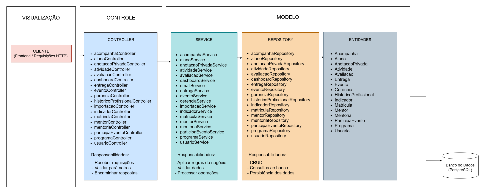
  <figcaption>
    Fonte: Produção dos Autores (2026)
  </figcaption>
</figure>

#### Descrição das camadas

##### Controller

A camada **Controller** é responsável por receber as requisições enviadas pelo cliente, interpretar os parâmetros recebidos e encaminhar as solicitações para os serviços adequados. Além disso, atua no tratamento das respostas e retorno dos dados para a aplicação.

Os controladores implementados atualmente no projeto são:

* `AcompanhaController`
* `AlunoController`
* `AnotacaoPrivadaController`
* `AtividadeController`
* `AvaliacaoController`
* `DashboardController`
* `EntregaController`
* `EventoController`
* `GerenciaController`
* `HistoricoProfissionalController`
* `ImportacaoController`
* `IndicadorController`
* `MatriculaController`
* `MentorController`
* `MentoriaController`
* `ParticipaEventoController`
* `ProgramaController`
* `UsuarioController`

Suas principais responsabilidades incluem:

* Receber requisições HTTP;
* Encaminhar operações para a camada de serviços;
* Validar parâmetros básicos;
* Retornar respostas apropriadas ao cliente.

---

##### Service

A camada **Service** concentra as regras de negócio da aplicação, realizando o processamento das operações antes do acesso aos dados. Nessa camada são implementadas validações, regras específicas do domínio e processamento das funcionalidades do sistema.

Os serviços implementados atualmente são:

* `AcompanhaService`
* `AlunoService`
* `AnotacaoPrivadaService`
* `AtividadeService`
* `AvaliacaoService`
* `DashboardService`
* `EmailService`
* `EntregaService`
* `EventoService`
* `GerenciaService`
* `ImportacaoService`
* `IndicadorService`
* `MatriculaService`
* `MentorService`
* `MentoriaService`
* `ParticipaEventoService`
* `ProgramaService`
* `UsuarioService`

Suas responsabilidades incluem:

* Aplicar regras de negócio;
* Validar informações recebidas;
* Processar dados antes da persistência;
* Orquestrar a comunicação entre controladores e repositórios.

---

##### Repository

A camada **Repository** atua como intermediária entre a aplicação e o banco de dados, encapsulando operações de acesso e manipulação dos dados.

Os repositórios implementados atualmente são:

* `AcompanhaRepository`
* `AlunoRepository`
* `AnotacaoPrivadaRepository`
* `AtividadeRepository`
* `AvaliacaoRepository`
* `DashboardRepository`
* `EntregaRepository`
* `EventoRepository`
* `GerenciaRepository`
* `HistoricoProfissionalRepository`
* `IndicadorRepository`
* `MatriculaRepository`
* `MentorRepository`
* `MentoriaRepository`
* `ParticipaEventoRepository`
* `ProgramaRepository`
* `UsuarioRepository`

Suas principais responsabilidades incluem:

* Realizar operações CRUD;
* Executar consultas ao banco de dados;
* Persistir e recuperar registros;
* Centralizar o acesso aos dados.

---

##### Model

A camada **Model** representa as entidades do domínio da aplicação, definindo a estrutura lógica dos dados utilizados pelo sistema.

As entidades identificadas no projeto incluem:

* `Acompanha`
* `Aluno`
* `AnotacaoPrivada`
* `Atividade`
* `Avaliacao`
* `Dashboard`
* `Entrega`
* `Evento`
* `Gerencia`
* `HistoricoProfissional`
* `Importacao`
* `Indicador`
* `Matricula`
* `Mentor`
* `Mentoria`
* `ParticipaEvento`
* `Programa`
* `Usuario`

Essas entidades são responsáveis por representar os objetos de negócio e seus relacionamentos dentro da aplicação.

---

##### Justificativa da arquitetura adotada

A utilização da arquitetura em camadas permite separar responsabilidades específicas dentro do sistema, tornando o desenvolvimento mais organizado e reduzindo o acoplamento entre componentes. Essa organização facilita a manutenção do código, a implementação de novas funcionalidades e futuras expansões da aplicação.

Além disso, a estrutura adotada favorece a reutilização de componentes e a aplicação de boas práticas de desenvolvimento, permitindo que alterações em uma camada causem menor impacto nas demais partes do sistema.


### 3.2.2. Diagrama de Casos de Uso

O diagrama representa os casos de uso do Sistema Pulse Mais, organizados por ator e nível de acesso. Três atores humanos foram identificados: **Coordenador / Professor**, **Aluno** (que abrange tanto alunos ativos quanto ex-alunos) e **Mentor**. O diagrama cobre 17 casos de uso (UC01–UC17), incluindo os fluxos de importação de planilhas (UC09), relatórios de mentoria (UC13), gestão de programas e eventos (UC14–UC15), registro de presença (UC16) e anotações privadas (UC17). Relacionamentos de inclusão obrigatória («include») e extensão opcional («extend») são representados por setas tracejadas coloridas com estereótipo explícito.

<figure style="text-align: center; margin: 1.5rem auto;">
 <figcaption>
    Figura 11: Diagrama de Casos de Uso
  </figcaption>
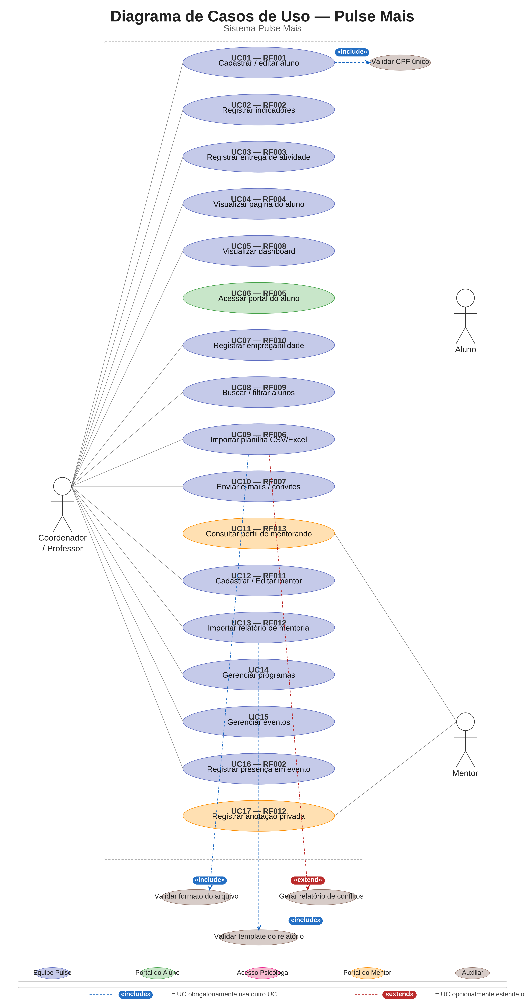
  <figcaption>
    Fonte: Produção dos Autores (2026)
  </figcaption>
</figure>

> **Nota sobre o ator Aluno e Ex-Aluno:** O ator Aluno representa alunos ativos e o ator Ex-Aluno representa egressos da Pulse Mais. A distinção entre os dois perfis é controlada pelo campo `status` na entidade Aluno. Ambos acessam exclusivamente o Portal do Aluno (UC06), com permissões equivalentes.

> **Nota sobre o ator Mentor:** O ator Mentor representa profissionais voluntários da rede Pulse Mais que oferecem mentorias aos alunos. O Mentor possui acesso de consulta somente leitura aos perfis dos alunos formalmente vinculados a ele como mentorandos (UC11), não realizando operações de escrita no sistema. Os relatórios de mentoria são produzidos fora da plataforma em template padronizado e importados ao sistema pela equipe Pulse Mais (UC13), preservando a equipe interna como custodiante única dos dados sensíveis.

---

### UC01 — Cadastrar / Editar Aluno (RF001)

| Campo              | Descrição                                                                                                             |
| ------------------ | --------------------------------------------------------------------------------------------------------------------- |
| Ator principal     | Coordenador                                                                                                           |
| Atores secundários | Não se aplica                                                                                                         |
| Pré-condições      | O usuário deve estar autenticado com perfil Coordenador                                                               |
| Fluxo principal    | O coordenador acessa o formulário de cadastro, preenche os dados pessoais e acadêmicos do aluno e confirma o registro |
| Include            | Validar CPF único: o sistema verifica se o CPF informado já existe no banco antes de concluir o cadastro (RN01)       |
| Restrição          | A exclusão de um aluno não remove seus dados do banco. O registro é desativado, preservando o histórico (RN02)        |
| Pós-condições      | O aluno é registrado no banco de dados e passa a aparecer nas buscas e filtros do sistema                             |

---

### UC02 — Registrar Indicadores (RF002)

| Campo              | Descrição                                                                                                                                                           |
| ------------------ | ------------------------------------------------------------------------------------------------------------------------------------------------------------------- |
| Ator principal     | Coordenador                                                                                                                                                         |
| Atores secundários | Não se aplica                                                                                                                                                       |
| Pré-condições      | O aluno deve estar cadastrado no sistema; o programa ou evento ao qual o registro será vinculado deve existir no sistema (RN03)                                     |
| Fluxo principal    | O coordenador seleciona o aluno, escolhe o programa ou evento e registra os indicadores de participação, liderança e engajamento em escala numérica de 1 a 5 (RN10) |
| Restrição          | Valores fora do intervalo de 1 a 5 devem ser rejeitados pelo sistema (RN10)                                                                                         |
| Pós-condições      | Os indicadores ficam vinculados ao aluno e ao programa, disponíveis para agregação no dashboard (RF008)                                                             |

---

### UC03 — Registrar Entrega de Atividade (RF003)

| Campo              | Descrição                                                                                                 |
| ------------------ | --------------------------------------------------------------------------------------------------------- |
| Ator principal     | Coordenador                                                                                               |
| Atores secundários | Não se aplica                                                                                             |
| Pré-condições      | O aluno deve estar cadastrado; a data de entrega informada deve ser igual ou anterior à data atual (RN04) |
| Fluxo principal    | O coordenador seleciona o aluno e a atividade correspondente, registra a entrega e a avaliação associada  |
| Pós-condições      | A entrega fica registrada no histórico do aluno, acessível na página individual (RF004)                   |

---

### UC04 — Visualizar Página do Aluno (RF004)

| Campo              | Descrição                                                                                                                                    |
| ------------------ | -------------------------------------------------------------------------------------------------------------------------------------------- |
| Ator principal     | Coordenador                                                                                                                                  |
| Atores secundários | Não se aplica                                                                                                                                |
| Pré-condições      | O aluno deve estar cadastrado no sistema                                                                                                     |
| Fluxo principal    | O coordenador busca o aluno e acessa sua página individual, que exibe histórico consolidado de programas, eventos, indicadores e observações |
| Restrição          | A página é somente leitura para o perfil Coordenador. Edições só ocorrem via formulários específicos de cada módulo (RN05)                   |
| Pós-condições      | Nenhuma alteração de dados é realizada. O caso de uso contempla apenas consulta                                                              |

---

### UC05 — Visualizar Dashboard (RF008)

| Campo              | Descrição                                                                                                                                                                         |
| ------------------ | --------------------------------------------------------------------------------------------------------------------------------------------------------------------------------- |
| Ator principal     | Coordenador                                                                                                                                                                       |
| Atores secundários | Não se aplica                                                                                                                                                                     |
| Pré-condições      | Deve haver ao menos um aluno cadastrado com registros de jornada no sistema                                                                                                       |
| Fluxo principal    | O coordenador acessa o dashboard e visualiza indicadores de impacto agregados como total de jovens empregados, concluintes por programa e taxa de retenção no período selecionado |
| Restrição          | Os indicadores devem ser calculados dinamicamente a partir dos dados reais do banco, sem cache permanente, conforme especificado no próprio RF008                                 |
| Pós-condições      | Nenhuma alteração de dados é realizada. O caso de uso contempla apenas visualização                                                                                               |

---

### UC06 — Acessar Portal do Aluno (RF005)

| Campo              | Descrição                                                                                                                              |
| ------------------ | -------------------------------------------------------------------------------------------------------------------------------------- |
| Ator principal     | Aluno                                                                                                                                  |
| Atores secundários | Não se aplica                                                                                                                          |
| Pré-condições      | O aluno deve estar cadastrado no sistema                                                                                               |
| Fluxo principal    | O aluno acessa o portal, visualiza seus dados cadastrais e atualiza informações de contato, endereço ou nome                           |
| Restrição          | O perfil Coordenador não acessa esse portal. O histórico de jornada, indicadores e observações são somente leitura para o perfil Aluno |
| Pós-condições      | Os dados cadastrais atualizados são persistidos no banco                                                                               |

---

### UC07 — Registrar Empregabilidade (RF010)

| Campo              | Descrição                                                                                                                              |
| ------------------ | -------------------------------------------------------------------------------------------------------------------------------------- |
| Ator principal     | Coordenador                                                                                                                            |
| Atores secundários | Não se aplica                                                                                                                          |
| Pré-condições      | O aluno deve estar cadastrado no sistema                                                                                               |
| Fluxo principal    | O coordenador seleciona o aluno e registra os dados de empregabilidade: conquista de emprego, cargo, renda e acesso ao ensino superior |
| Pós-condições      | O indicador de empregabilidade fica vinculado ao aluno e passa a alimentar o dashboard (RF008)                                         |

---

### UC08 — Buscar / Filtrar Alunos (RF009)

| Campo              | Descrição                                                                                                                                      |
| ------------------ | ---------------------------------------------------------------------------------------------------------------------------------------------- |
| Ator principal     | Coordenador                                                                                                                                    |
| Atores secundários | Não se aplica                                                                                                                                  |
| Pré-condições      | Deve haver ao menos um aluno cadastrado no sistema                                                                                             |
| Fluxo principal    | O coordenador aplica filtros por programa, status de empregabilidade, período ou indicadores de risco e visualiza a lista de alunos resultante |
| Restrição          | Os filtros operam apenas sobre dados aos quais o perfil do usuário tem acesso. Um aluno não pode filtrar dados de outros alunos (RN09)         |
| Pós-condições      | Nenhuma alteração de dados é realizada. O caso de uso contempla apenas consulta                                                                |

---

### UC09 — Importar Planilha CSV/Excel (RF006)

| Campo              | Descrição                                                                                                                                                                                                                    |
| ------------------ | ---------------------------------------------------------------------------------------------------------------------------------------------------------------------------------------------------------------------------- |
| Ator principal     | Coordenador                                                                                                                                                                                                                  |
| Atores secundários | «sistema» Planilha                                                                                                                                                                                                           |
| Pré-condições      | O usuário deve estar autenticado com perfil Coordenador (RN07); o arquivo deve estar no formato CSV ou Excel com a estrutura de campos esperada pelo sistema                                                                 |
| Fluxo principal    | O coordenador realiza o upload do arquivo; o sistema valida o formato e importa os registros válidos para o banco                                                                                                            |
| Include            | Validar formato do arquivo: o sistema verifica a estrutura e compatibilidade das colunas antes de iniciar a importação. Arquivos com colunas ausentes ou incompatíveis são rejeitados com mensagem de erro descritiva (RN08) |
| Extend             | Gerar relatório de conflitos: caso existam CPFs duplicados, o sistema ignora aquelas linhas, registra os conflitos em um relatório e continua o processo sem interrompê-lo (RN06)                                            |
| Pós-condições      | Os registros válidos são importados; registros com conflito são listados no relatório sem sobrescrever dados existentes no banco                                                                                             |

---

### UC10 — Enviar E-mails / Convites (RF007)

| Campo              | Descrição                                                                                                              |
| ------------------ | ---------------------------------------------------------------------------------------------------------------------- |
| Ator principal     | Coordenador                                                                                                            |
| Atores secundários | Não se aplica                                                                                                          |
| Pré-condições      | Deve haver ao menos um aluno cadastrado com e-mail válido no sistema                                                   |
| Fluxo principal    | O coordenador seleciona os destinatários, redige a mensagem ou convite e realiza o disparo diretamente pela plataforma |
| Pós-condições      | O e-mail é enviado aos destinatários selecionados e o envio fica registrado no histórico da plataforma                 |

### UC11 — Consultar Perfil de Mentorando (RF013)

| Campo              | Descrição                                                                                                                                                                                                              |
| ------------------ | ---------------------------------------------------------------------------------------------------------------------------------------------------------------------------------------------------------------------- |
| Ator principal     | Mentor                                                                                                                                                                                                                 |
| Atores secundários | Não se aplica                                                                                                                                                                                                          |
| Pré-condições      | O usuário deve estar autenticado com perfil Mentor; o aluno consultado deve estar formalmente vinculado a ele como mentorando                                                                                          |
| Fluxo principal    | O mentor acessa a área de mentorandos e seleciona um aluno vinculado para visualizar seu perfil consolidado, incluindo histórico de programas, indicadores e mentorias anteriores                                      |
| Restrição          | A visualização é estritamente somente leitura (RN16). Observações qualitativas de outros mentores não são exibidas ao perfil Mentor (RN14). Mentores não podem consultar perfis de alunos não vinculados a eles (RN15) |
| Pós-condições      | Nenhuma alteração de dados é realizada. O caso de uso contempla apenas consulta                                                                                                                                        |

### UC12 — Cadastrar / Editar Mentor (RF011)

| Campo              | Descrição                                                                                                                                               |
| ------------------ | ------------------------------------------------------------------------------------------------------------------------------------------------------- |
| Ator principal     | Coordenador                                                                                                                                             |
| Atores secundários | Não se aplica                                                                                                                                           |
| Pré-condições      | O usuário deve estar autenticado com perfil Coordenador                                                                                                 |
| Fluxo principal    | O coordenador acessa o formulário de cadastro de mentor, preenche nome, e-mail, especialidade, tipo de vínculo e disponibilidade, e confirma o registro |
| Restrição          | A inativação de um mentor não remove seus dados do banco. O registro é marcado como inativo, preservando o histórico de mentorias oferecidas (RN12)     |
| Pós-condições      | O mentor é registrado no banco e fica disponível para vinculação em mentorias e atribuição como responsável por mentorandos                             |

### UC13 — Importar Relatório de Mentoria (RF012)

| Campo              | Descrição                                                                                                                                                                           |
| ------------------ | ----------------------------------------------------------------------------------------------------------------------------------------------------------------------------------- |
| Ator principal     | Coordenador                                                                                                                                                                         |
| Atores secundários | «sistema» Planilha                                                                                                                                                                  |
| Pré-condições      | O usuário deve estar autenticado com perfil Coordenador; o aluno e o mentor devem estar cadastrados, com o mentor ativo na rede                                                     |
| Fluxo principal    | A equipe Pulse realiza o upload do relatório de mentoria em template padronizado, seleciona o aluno e o mentor responsável, e confirma a importação                                 |
| Include            | Validar formato do template: o sistema verifica a estrutura e os campos obrigatórios do relatório antes de importar. Arquivos fora do padrão são rejeitados com mensagem descritiva |
| Restrição          | A mentoria importada deve estar obrigatoriamente vinculada a um aluno cadastrado e a um mentor ativo (RN11). Tentativas de vincular a mentores inativos são bloqueadas              |
| Pós-condições      | A mentoria é registrada no histórico do aluno e fica disponível para visualização pelos perfis Coordenador e pelo Mentor autor do relato (RN14)                                     |

---

### UC14 — Gerenciar Programas

| Campo              | Descrição                                                                                                                                       |
| ------------------ | ----------------------------------------------------------------------------------------------------------------------------------------------- |
| Ator principal     | Coordenador                                                                                                                                     |
| Atores secundários | Não se aplica                                                                                                                                   |
| Pré-condições      | O usuário deve estar autenticado com perfil Coordenador                                                                                         |
| Fluxo principal    | O coordenador cria, edita ou remove programas da plataforma, definindo título, data de início e data de término                                 |
| Restrição          | Um programa só pode ser removido se não houver alunos matriculados ativos vinculados a ele                                                      |
| Pós-condições      | O programa fica disponível para matrícula de alunos, vinculação de indicadores e exibição no dashboard                                          |

---

### UC15 — Gerenciar Eventos

| Campo              | Descrição                                                                                                                                       |
| ------------------ | ----------------------------------------------------------------------------------------------------------------------------------------------- |
| Ator principal     | Coordenador                                                                                                                                     |
| Atores secundários | Não se aplica                                                                                                                                   |
| Pré-condições      | O usuário deve estar autenticado com perfil Coordenador                                                                                         |
| Fluxo principal    | O coordenador cria, edita ou remove eventos da plataforma, definindo nome, data e local; o sistema envia convites por e-mail aos alunos (RF007) |
| Pós-condições      | O evento fica disponível para registro de presença e vinculação de indicadores (RN03)                                                           |

---

### UC16 — Registrar Presença em Evento (RF002)

| Campo              | Descrição                                                                                                                                              |
| ------------------ | ------------------------------------------------------------------------------------------------------------------------------------------------------ |
| Ator principal     | Coordenador                                                                                                                                            |
| Atores secundários | Não se aplica                                                                                                                                          |
| Pré-condições      | O evento deve estar cadastrado no sistema; o aluno deve estar matriculado em um programa vinculado ao evento                                           |
| Fluxo principal    | O coordenador seleciona o evento, localiza os alunos participantes e registra ou atualiza o campo de presença para cada um                             |
| Restrição          | O registro de presença em evento exige que o aluno esteja previamente associado ao evento por meio de participação confirmada (RN03)                   |
| Pós-condições      | A presença fica registrada e disponível para agregação nos indicadores de frequência do dashboard (RF008)                                              |

---

### UC17 — Registrar Anotação Privada (RF012)

| Campo              | Descrição                                                                                                                                              |
| ------------------ | ------------------------------------------------------------------------------------------------------------------------------------------------------ |
| Ator principal     | Mentor                                                                                                                                                 |
| Atores secundários | Não se aplica                                                                                                                                          |
| Pré-condições      | O usuário deve estar autenticado com perfil Mentor; o aluno deve estar formalmente vinculado a ele como mentorando                                     |
| Fluxo principal    | O mentor acessa o perfil do mentorando e registra uma observação qualitativa textual sobre o desenvolvimento do aluno                                  |
| Restrição          | Anotações são privadas: o Mentor visualiza apenas as suas próprias; o Coordenador visualiza todas (RN13). O aluno não tem acesso a estas anotações     |
| Pós-condições      | A anotação fica registrada com timestamp e vinculada ao par mentor–aluno, disponível para consulta conforme perfil de acesso (RN13)                    |

### 3.2.3. Diagrama de Classes do Domínio


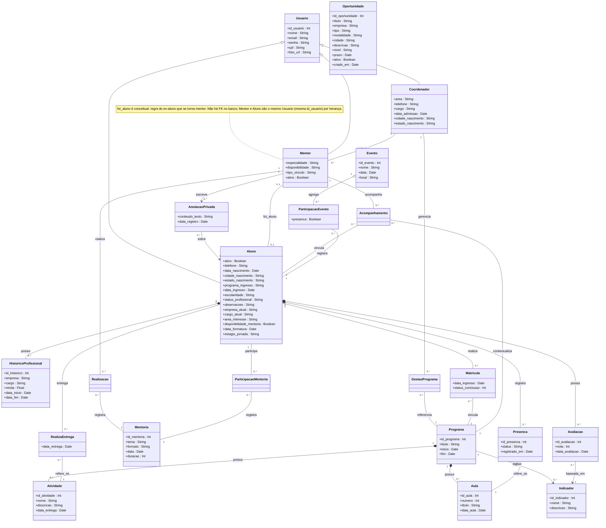
```mermaid
classDiagram
    %% ============================================
    %% SUPERCLASSE E HERANÇA
    %% ============================================


    class Usuario {
        +id_usuario : Int
        +nome : String
        +email : String
        +senha : String
        +cpf : String
        +foto_url : String
    }


    class Coordenador {
        +area : String
        +telefone : String
        +cargo : String
        +data_admissao : Date
        +cidade_nascimento : String
        +estado_nascimento : String
    }


    class Mentor {
        +especialidade : String
        +disponibilidade : String
        +tipo_vinculo : String
        +ativo : Boolean
    }


    class Aluno {
        +ativo : Boolean
        +telefone : String
        +data_nascimento : Date
        +cidade_nascimento : String
        +estado_nascimento : String
        +programa_ingresso : String
        +data_ingresso : Date
        +escolaridade : String
        +status_profissional : String
        +observacoes : String
        +empresa_atual : String
        +cargo_atual : String
        +area_interesse : String
        +disponibilidade_mentoria : Boolean
        +data_formatura : Date
        +estagio_jornada : String
    }


    Usuario <|-- Coordenador
    Usuario <|-- Mentor
    Usuario <|-- Aluno


    %% ============================================
    %% CLASSES PRINCIPAIS DO DOMÍNIO
    %% ============================================


    class Programa {
        +id_programa : Int
        +titulo : String
        +inicio : Date
        +fim : Date
    }


    class Indicador {
        +id_indicador : Int
        +nome : String
        +descricao : String
    }


    class Atividade {
        +id_atividade : Int
        +nome : String
        +descricao : String
        +data_entrega : Date
    }


    class Evento {
        +id_evento : Int
        +nome : String
        +data : Date
        +local : String
    }


    class Mentoria {
        +id_mentoria : Int
        +tema : String
        +formato : String
        +data : Date
        +duracao : Int
    }


    class HistoricoProfissional {
        +id_historico : Int
        +empresa : String
        +cargo : String
        +renda : Float
        +data_inicio : Date
        +data_fim : Date
    }


    class AnotacaoPrivada {
        +conteudo_texto : String
        +data_registro : Date
    }


    class Oportunidade {
        +id_oportunidade : Int
        +titulo : String
        +empresa : String
        +tipo : String
        +modalidade : String
        +cidade : String
        +descricao : String
        +nivel : String
        +prazo : Date
        +ativo : Boolean
        +criado_em : Date
    }


    class Presenca {
        +id_presenca : Int
        +status : String
        +registrado_em : Date
    }


    class Aula {
        +id_aula : Int
        +numero : Int
        +titulo : String
        +data_aula : Date
    }


    %% ============================================
    %% CLASSES ASSOCIATIVAS
    %% ============================================


    class Matricula {
        +data_ingresso : Date
        +status_conclusao : Int
    }


    class RealizaEntrega {
        +data_entrega : Date
    }


    class ParticipacaoEvento {
        +presenca : Boolean
    }


    class ParticipacaoMentoria {
    }


    class Realizacao {
    }


    class Acompanhamento {
    }


    class GestaoPrograma {
    }


    class Avaliacao {
        +id_avaliacao : Int
        +nota : Int
        +data_avaliacao : Date
    }


    %% ============================================
    %% RELACIONAMENTOS — COORDENADOR
    %% ============================================


    Coordenador "1" -- "0..*" Mentor : cadastra
    Coordenador "1" -- "0..*" GestaoPrograma : gerencia
    GestaoPrograma "0..*" -- "1" Programa : referencia


    Mentor "1" --> "0..*" AnotacaoPrivada : escreve
    AnotacaoPrivada "0..*" --> "1" Aluno : sobre


    %% ============================================
    %% RELACIONAMENTOS — PROGRAMA
    %% ============================================


    Programa "1" *-- "0..*" Atividade : possui
    Programa "1" *-- "0..*" Aula : possui
    Programa "1" --> "0..*" Indicador : define


    %% ============================================
    %% RELACIONAMENTOS — MATRÍCULA
    %% ============================================


    Aluno "1" -- "0..*" Matricula : realiza
    Matricula "0..*" -- "1" Programa : vincula


    %% ============================================
    %% RELACIONAMENTOS — ALUNO
    %% ============================================


    Aluno "1" *-- "0..*" HistoricoProfissional : possui
    Mentor "0..1" -- "0..1" Aluno : foi_aluno
    note for Mentor "foi_aluno é conceitual: regra do ex-aluno que se torna mentor. Não há FK no banco; Mentor e Aluno são o mesmo Usuario (mesma id_usuario) por herança."


    Mentor "1" -- "0..*" Acompanhamento : acompanha
    Acompanhamento "0..*" -- "1" Aluno : vincula
    Acompanhamento "0..*" -- "1" Programa : contextualiza


    %% ============================================
    %% RELACIONAMENTOS — MENTORIA
    %% ============================================


    Mentor "1" -- "0..*" Realizacao : realiza
    Realizacao "0..*" -- "1" Mentoria : registra
    Aluno "1" -- "0..*" ParticipacaoMentoria : participa
    ParticipacaoMentoria "0..*" -- "1" Mentoria : registra


    %% ============================================
    %% RELACIONAMENTOS — ENTREGA DE ATIVIDADE
    %% ============================================


    Aluno "1" -- "0..*" RealizaEntrega : entrega
    RealizaEntrega "0..*" -- "1" Atividade : refere_se


    %% ============================================
    %% RELACIONAMENTOS — EVENTO
    %% ============================================


    Evento "1" o-- "0..*" ParticipacaoEvento : agrega
    ParticipacaoEvento "0..*" -- "1" Aluno : registra


    %% ============================================
    %% RELACIONAMENTOS — AVALIAÇÃO
    %% ============================================


    Aluno "1" *-- "0..*" Avaliacao : possui
    Avaliacao "0..*" --> "1" Indicador : baseada_em


    %% ============================================
    %% RELACIONAMENTOS — PRESENÇA E OPORTUNIDADE
    %% ============================================


    Aluno "1" *-- "0..*" Presenca : registra
    Presenca "0..*" -- "1" Aula : refere_se
    %% Oportunidade é entidade independente (catálogo de vagas/eventos/bolsas),
    %% sem relacionamento estrutural com as demais classes do domínio.
```


### Descrição do diagrama de classes


> O diagrama representa a estrutura conceitual do sistema Pulse Mais, modelando as principais entidades do domínio e seus relacionamentos. A modelagem segue a notação UML e emprega herança, associação simples, agregação, composição, classes associativas e multiplicidades explicitadas nos dois lados de cada conexão.
>
> A classe `Usuario` funciona como superclasse e centraliza os atributos comuns a todos os perfis do sistema, como `id_usuario`, `nome`, `email`, `senha`, `cpf` e `foto_url`. A partir dela herdam três perfis principais: `Coordenador`, `Aluno` e `Mentor`, cada um com atributos específicos relacionados às suas funções dentro da plataforma.
>
> O conceito de ex-aluno é representado de forma não estrutural. Um `Aluno` pode tornar-se ex-aluno ao longo de sua trajetória, mantendo seus registros vinculados à classe `HistoricoProfissional`, responsável por armazenar informações como empresa, cargo, renda, data de início e data de fim. Esse relacionamento é modelado como composição (`Aluno *-- HistoricoProfissional`), pois os registros profissionais pertencem exclusivamente ao aluno e não possuem significado isoladamente.
>
> O `Coordenador` é responsável pela gestão dos programas e pelo cadastro dos mentores da organização. O relacionamento entre `Coordenador` e `Mentor` é uma associação obrigatória (`Coordenador "1" -- "0..*" Mentor`): todo mentor está vinculado a exatamente um coordenador (`id_coordenador` é `NOT NULL`), e a exclusão de um coordenador é restringida enquanto houver mentores associados (`ON DELETE RESTRICT`). A gestão dos programas é representada pela classe associativa `GestaoPrograma`, que elimina o relacionamento muitos-para-muitos direto entre `Coordenador` e `Programa`.
>
> A classe `Programa` representa os programas desenvolvidos pela Pulse Mais. As atividades são modeladas como composição em relação ao programa (`Programa *-- Atividade`), uma vez que fazem parte da estrutura do programa ao qual pertencem e não possuem existência independente dentro do domínio. Além disso, cada programa pode definir diversos indicadores que serão utilizados posteriormente nos processos de avaliação dos alunos.
>
> A participação dos alunos nos programas é registrada por meio da classe associativa `Matricula`, responsável por armazenar informações específicas do vínculo, como data de ingresso e status de conclusão. Essa modelagem elimina o relacionamento muitos-para-muitos direto entre `Aluno` e `Programa` e permite registrar atributos próprios da participação.
>
> Durante sua jornada na instituição, o aluno realiza atividades por meio da classe associativa `RealizaEntrega`, que registra a data de entrega e relaciona o aluno às atividades executadas. O aluno também pode participar de eventos institucionais, sendo essa participação registrada pela classe `ParticipacaoEvento`, que armazena informações sobre presença. O relacionamento entre `Evento` e `ParticipacaoEvento` é modelado como agregação (`Evento o-- ParticipacaoEvento`), pois o evento existe independentemente das participações registradas.
>
> A avaliação dos alunos é representada pela classe `Avaliacao`, que registra a nota atribuída e a data da avaliação. O relacionamento entre `Aluno` e `Avaliacao` é modelado como composição (`Aluno *-- Avaliacao`), uma vez que a avaliação pertence diretamente ao aluno avaliado e não possui significado fora desse contexto. Cada avaliação está associada a um `Indicador`, que representa o critério utilizado na análise.
>
> A classe `Mentor` herda diretamente de `Usuario`, permitindo o cadastro de mentores externos, profissionais parceiros, voluntários ou ex-alunos da organização. O acompanhamento de um aluno por um mentor no contexto de um programa específico é representado pela classe associativa `Acompanhamento`, que resolve o relacionamento ternário entre `Mentor`, `Aluno` e `Programa`, eliminando os relacionamentos muitos-para-muitos diretos entre essas entidades.
>
> A relação opcional `foi_aluno` entre `Mentor` e `Aluno` representa a regra de negócio que permite que ex-alunos da Pulse Mais se tornem mentores após adquirirem experiência profissional. Como nem todo mentor necessariamente passou pela instituição, esse relacionamento é modelado como opcional. Trata-se de uma relação **conceitual**: não há chave estrangeira correspondente no banco, pois `Mentor` e `Aluno` especializam o mesmo `Usuario` (mesma `id_usuario`) por herança.
>
> As mentorias realizadas são registradas pela classe `Mentoria`, que armazena informações como tema, formato, data e duração. A condução de cada mentoria por um ou mais mentores é representada pela classe associativa `Realizacao`, que resolve o relacionamento muitos-para-muitos entre `Mentor` e `Mentoria`, espelhando a tabela `realiza` do banco. A participação dos alunos nessas mentorias é registrada por meio da classe associativa `ParticipacaoMentoria`, responsável por eliminar o relacionamento muitos-para-muitos entre `Aluno` e `Mentoria` e permitir futuras extensões da modelagem caso seja necessário registrar atributos específicos dessa participação.
>
> A classe `AnotacaoPrivada` armazena observações qualitativas realizadas pelos mentores sobre alunos específicos, visíveis apenas ao Coordenador e ao Mentor autor do relato. Essas anotações contribuem para a preservação da memória institucional da organização e auxiliam no acompanhamento individual dos participantes ao longo de sua trajetória.
>
> O suporte ao Portal do Ex-Aluno (RF005) é refletido em dois pontos da modelagem. A classe `Aluno` foi estendida com os atributos `empresa_atual`, `cargo_atual`, `area_interesse`, `disponibilidade_mentoria`, `data_formatura` e `estagio_jornada`, que caracterizam a situação profissional do egresso, o estágio em sua jornada (`conectado`, `capacitado`, `transformado` ou `mentor`) e sua disposição em atuar como mentor. A classe `Oportunidade` representa o catálogo de vagas, eventos, estágios e bolsas de estudo divulgados aos ex-alunos; trata-se de uma entidade independente, sem relacionamento estrutural obrigatório com as demais classes do domínio, cujo atributo `tipo` é restrito aos valores `Vaga`, `Evento`, `Estágio` e `Bolsa de Estudo`.
>
> Por fim, a classe `Presenca` registra a frequência do aluno por aula, armazenando `status` (`presente` ou `ausente`) e `registrado_em`, e referencia a classe `Aula` — que representa cada aula de um `Programa` (`numero`, `titulo`, `data_aula`). O relacionamento entre `Aluno` e `Presenca` é modelado como composição (`Aluno *-- Presenca`), pois cada registro de presença pertence exclusivamente ao aluno e não possui significado isoladamente. A combinação de aluno e aula é única, impedindo registros duplicados de frequência.


#### 3.2.3.1. Diagrama de Classes Arquitetural


O Diagrama de Classes Arquitetural representa os componentes centrais das camadas **Controller**, **Service**, **Repository** e **Model/Entity** do backend, ilustrando as responsabilidades de cada camada e os vínculos de dependência entre elas. O diagrama apresenta cinco módulos principais — Aluno, Evento, Mentor, Mentoria e Programa — como representativos do padrão aplicado aos demais módulos do sistema.


A estrutura segue a arquitetura em camadas, na qual os **Controllers** recebem as requisições HTTP e encaminham as operações para os **Services**. Os **Services** concentram as regras de negócio e validações, enquanto os **Repositories** são responsáveis pelo acesso e persistência dos dados. A camada **Model/Entity** representa as entidades do domínio utilizadas pela aplicação, mantendo a consistência entre a arquitetura implementada e a modelagem conceitual do sistema.


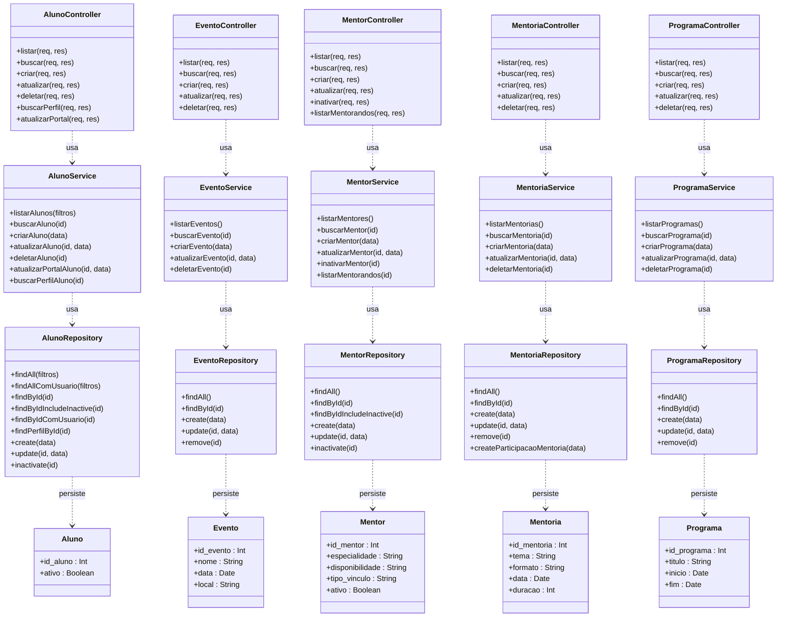
```mermaid
classDiagram
    %% ============================================
    %% CAMADA CONTROLLER
    %% ============================================
    class AlunoController {
        +listar(req, res)
        +buscar(req, res)
        +criar(req, res)
        +atualizar(req, res)
        +deletar(req, res)
        +buscarPerfil(req, res)
        +atualizarPortal(req, res)
    }


    class EventoController {
        +listar(req, res)
        +buscar(req, res)
        +criar(req, res)
        +atualizar(req, res)
        +deletar(req, res)
    }


    class MentorController {
        +listar(req, res)
        +buscar(req, res)
        +criar(req, res)
        +atualizar(req, res)
        +inativar(req, res)
        +listarMentorandos(req, res)
    }


    class MentoriaController {
        +listar(req, res)
        +buscar(req, res)
        +criar(req, res)
        +atualizar(req, res)
        +deletar(req, res)
    }


    class ProgramaController {
        +listar(req, res)
        +buscar(req, res)
        +criar(req, res)
        +atualizar(req, res)
        +deletar(req, res)
    }


    %% ============================================
    %% CAMADA SERVICE
    %% ============================================
    class AlunoService {
        +listarAlunos(filtros)
        +buscarAluno(id)
        +criarAluno(data)
        +atualizarAluno(id, data)
        +deletarAluno(id)
        +atualizarPortalAluno(id, data)
        +buscarPerfilAluno(id)
    }


    class EventoService {
        +listarEventos()
        +buscarEvento(id)
        +criarEvento(data)
        +atualizarEvento(id, data)
        +deletarEvento(id)
    }


    class MentorService {
        +listarMentores()
        +buscarMentor(id)
        +criarMentor(data)
        +atualizarMentor(id, data)
        +inativarMentor(id)
        +listarMentorandos(id)
    }


    class MentoriaService {
        +listarMentorias()
        +buscarMentoria(id)
        +criarMentoria(data)
        +atualizarMentoria(id, data)
        +deletarMentoria(id)
    }


    class ProgramaService {
        +listarProgramas()
        +buscarPrograma(id)
        +criarPrograma(data)
        +atualizarPrograma(id, data)
        +deletarPrograma(id)
    }


    %% ============================================
    %% CAMADA REPOSITORY
    %% ============================================
    class AlunoRepository {
        +findAll(filtros)
        +findAllComUsuario(filtros)
        +findById(id)
        +findByIdIncludeInactive(id)
        +findByIdComUsuario(id)
        +findPerfilById(id)
        +create(data)
        +update(id, data)
        +inactivate(id)
    }


    class EventoRepository {
        +findAll()
        +findById(id)
        +create(data)
        +update(id, data)
        +remove(id)
    }


    class MentorRepository {
        +findAll()
        +findById(id)
        +findByIdIncludeInactive(id)
        +create(data)
        +update(id, data)
        +inactivate(id)
    }


    class MentoriaRepository {
        +findAll()
        +findById(id)
        +create(data)
        +update(id, data)
        +remove(id)
        +createParticipacaoMentoria(data)
    }


    class ProgramaRepository {
        +findAll()
        +findById(id)
        +create(data)
        +update(id, data)
        +remove(id)
    }


    %% ============================================
    %% CAMADA MODEL / ENTITY
    %% ============================================
    class Aluno {
        +id_aluno : Int
        +ativo : Boolean
    }


    class Evento {
        +id_evento : Int
        +nome : String
        +data : Date
        +local : String
    }


    class Mentor {
        +id_mentor : Int
        +especialidade : String
        +disponibilidade : String
        +tipo_vinculo : String
        +ativo : Boolean
    }


    class Mentoria {
        +id_mentoria : Int
        +tema : String
        +formato : String
        +data : Date
        +duracao : Int
    }


    class Programa {
        +id_programa : Int
        +titulo : String
        +inicio : Date
        +fim : Date
    }


    %% ============================================
    %% DEPENDÊNCIAS ENTRE CAMADAS
    %% ============================================
    AlunoController ..> AlunoService : usa
    EventoController ..> EventoService : usa
    MentorController ..> MentorService : usa
    MentoriaController ..> MentoriaService : usa
    ProgramaController ..> ProgramaService : usa


    AlunoService ..> AlunoRepository : usa
    EventoService ..> EventoRepository : usa
    MentorService ..> MentorRepository : usa
    MentoriaService ..> MentoriaRepository : usa
    ProgramaService ..> ProgramaRepository : usa


    AlunoRepository ..> Aluno : persiste
    EventoRepository ..> Evento : persiste
    MentorRepository ..> Mentor : persiste
    MentoriaRepository ..> Mentoria : persiste
    ProgramaRepository ..> Programa : persiste
```


> **Nota:** O mesmo padrão arquitetural se aplica aos demais módulos do sistema: `Acompanhamento`, `AnotacaoPrivada`, `Atividade`, `Avaliacao`, `Dashboard`, `Entrega`, `GestaoPrograma`, `HistoricoProfissional`, `Importacao`, `Indicador`, `Matricula`, `ParticipacaoEvento`, `ParticipacaoMentoria` e `Usuario`. Cada módulo possui, quando aplicável, seu respectivo Controller, Service, Repository e Model/Entity, mantendo a separação de responsabilidades entre as camadas.


### 3.2.4. Diagrama de Sequência UML

#### Diagrama 1 — Cadastro de Aluno (RF001 + RN01)

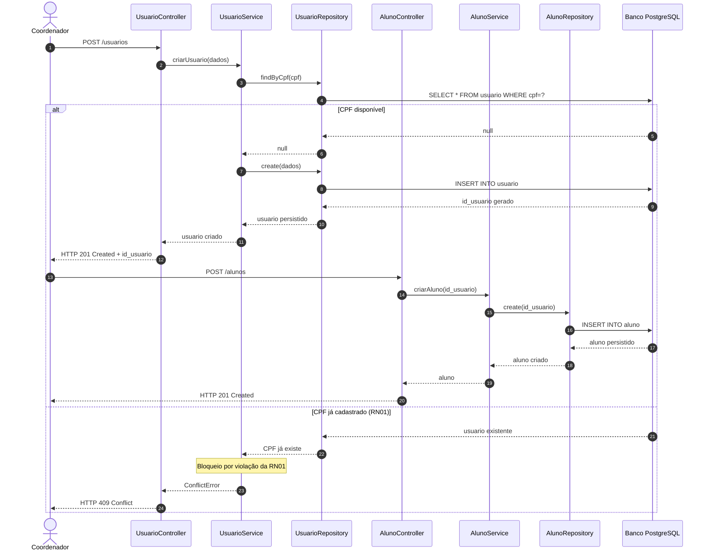
```mermaid
sequenceDiagram
  autonumber
  actor Coord as Coordenador
  participant CU as UsuarioController
  participant SU as UsuarioService
  participant RU as UsuarioRepository
  participant CA as AlunoController
  participant SA as AlunoService
  participant RA as AlunoRepository
  participant B as Banco PostgreSQL

  Coord->>CU: POST /usuarios
  CU->>SU: criarUsuario(dados)
  SU->>RU: findByCpf(cpf)
  RU->>B: SELECT * FROM usuario WHERE cpf=?

  alt CPF disponível
    B-->>RU: null
    RU-->>SU: null
    SU->>RU: create(dados)
    RU->>B: INSERT INTO usuario
    B-->>RU: id_usuario gerado
    RU-->>SU: usuario persistido
    SU-->>CU: usuario criado
    CU-->>Coord: HTTP 201 Created + id_usuario

    Coord->>CA: POST /alunos
    CA->>SA: criarAluno(id_usuario)
    SA->>RA: create(id_usuario)
    RA->>B: INSERT INTO aluno
    B-->>RA: aluno persistido
    RA-->>SA: aluno criado
    SA-->>CA: aluno
    CA-->>Coord: HTTP 201 Created

  else CPF já cadastrado (RN01)
    B-->>RU: usuario existente
    RU-->>SU: CPF já existe
    Note over SU: Bloqueio por violação da RN01
    SU-->>CU: ConflictError
    CU-->>Coord: HTTP 409 Conflict
  end
```

#### Diagrama 2 — Importação de Planilha (RF006 + RN06 + RN08)

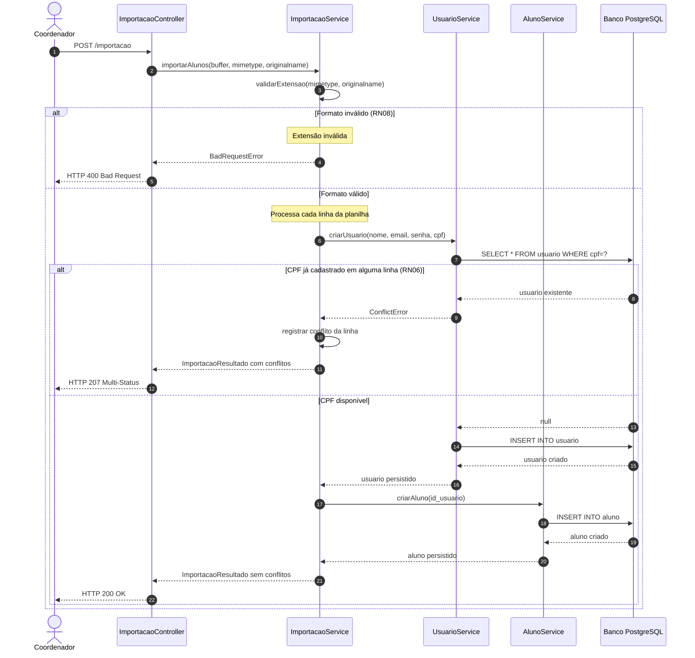
```mermaid
sequenceDiagram
  autonumber
  actor Coord as Coordenador
  participant C as ImportacaoController
  participant S as ImportacaoService
  participant SU as UsuarioService
  participant SA as AlunoService
  participant B as Banco PostgreSQL

  Coord->>C: POST /importacao
  C->>S: importarAlunos(buffer, mimetype, originalname)
  S->>S: validarExtensao(mimetype, originalname)

  alt Formato inválido (RN08)
    Note over S: Extensão inválida
    S-->>C: BadRequestError
    C-->>Coord: HTTP 400 Bad Request

  else Formato válido
    Note over S: Processa cada linha da planilha
    S->>SU: criarUsuario(nome, email, senha, cpf)
    SU->>B: SELECT * FROM usuario WHERE cpf=?

    alt CPF já cadastrado em alguma linha (RN06)
      B-->>SU: usuario existente
      SU-->>S: ConflictError
      S->>S: registrar conflito da linha
      S-->>C: ImportacaoResultado com conflitos
      C-->>Coord: HTTP 207 Multi-Status

    else CPF disponível
      B-->>SU: null
      SU->>B: INSERT INTO usuario
      B-->>SU: usuario criado
      SU-->>S: usuario persistido
      S->>SA: criarAluno(id_usuario)
      SA->>B: INSERT INTO aluno
      B-->>SA: aluno criado
      SA-->>S: aluno persistido
      S-->>C: ImportacaoResultado sem conflitos
      C-->>Coord: HTTP 200 OK
    end
  end
```

#### Diagrama 3 — Filtragem de Alunos (RF009)

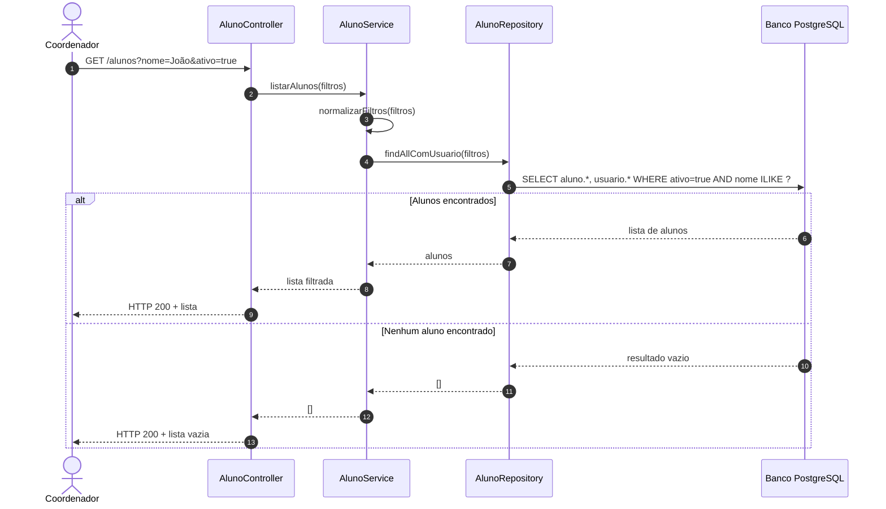
```mermaid
sequenceDiagram
  autonumber
  actor Coord as Coordenador
  participant C as AlunoController
  participant S as AlunoService
  participant R as AlunoRepository
  participant B as Banco PostgreSQL

  Coord->>C: GET /alunos?nome=João&ativo=true
  C->>S: listarAlunos(filtros)
  S->>S: normalizarFiltros(filtros)
  S->>R: findAllComUsuario(filtros)
  R->>B: SELECT aluno.*, usuario.* WHERE ativo=true AND nome ILIKE ?

  alt Alunos encontrados
    B-->>R: lista de alunos
    R-->>S: alunos
    S-->>C: lista filtrada
    C-->>Coord: HTTP 200 + lista

  else Nenhum aluno encontrado
    B-->>R: resultado vazio
    R-->>S: []
    S-->>C: []
    C-->>Coord: HTTP 200 + lista vazia
  end
```

#### Diagrama 4 — Cadastro de Mentor (RF011 + RN12)

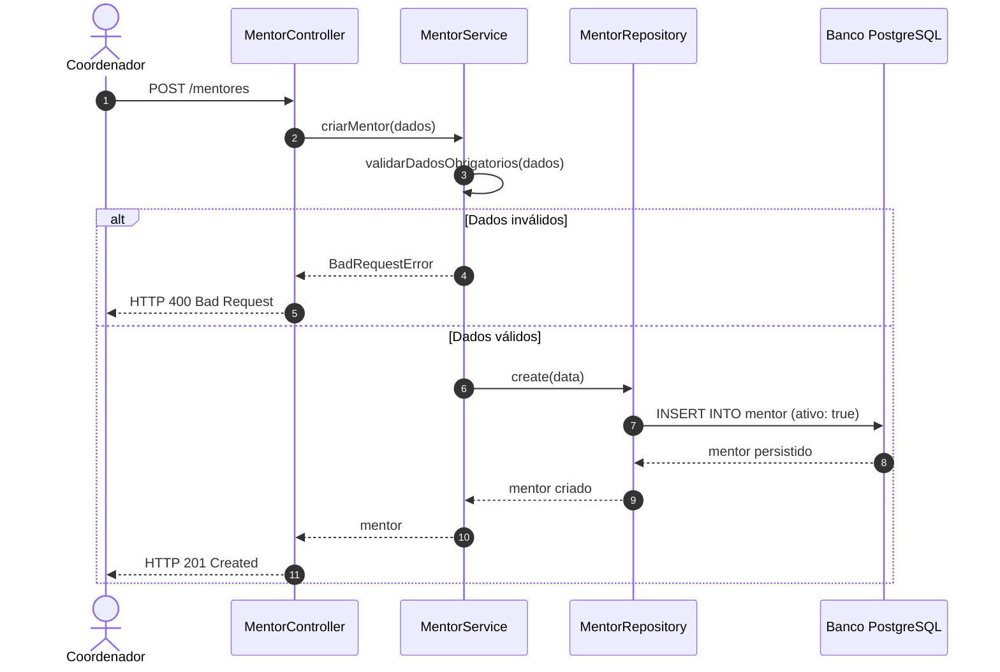
```mermaid
sequenceDiagram
  autonumber
  actor Coord as Coordenador
  participant C as MentorController
  participant S as MentorService
  participant R as MentorRepository
  participant B as Banco PostgreSQL

  Coord->>C: POST /mentores
  C->>S: criarMentor(dados)
  S->>S: validarDadosObrigatorios(dados)

  alt Dados inválidos
    S-->>C: BadRequestError
    C-->>Coord: HTTP 400 Bad Request

  else Dados válidos
    S->>R: create(data)
    R->>B: INSERT INTO mentor (ativo: true)
    B-->>R: mentor persistido
    R-->>S: mentor criado
    S-->>C: mentor
    C-->>Coord: HTTP 201 Created
  end
```

#### Diagrama 5 — Registro de Mentoria (RF012 + RN11)

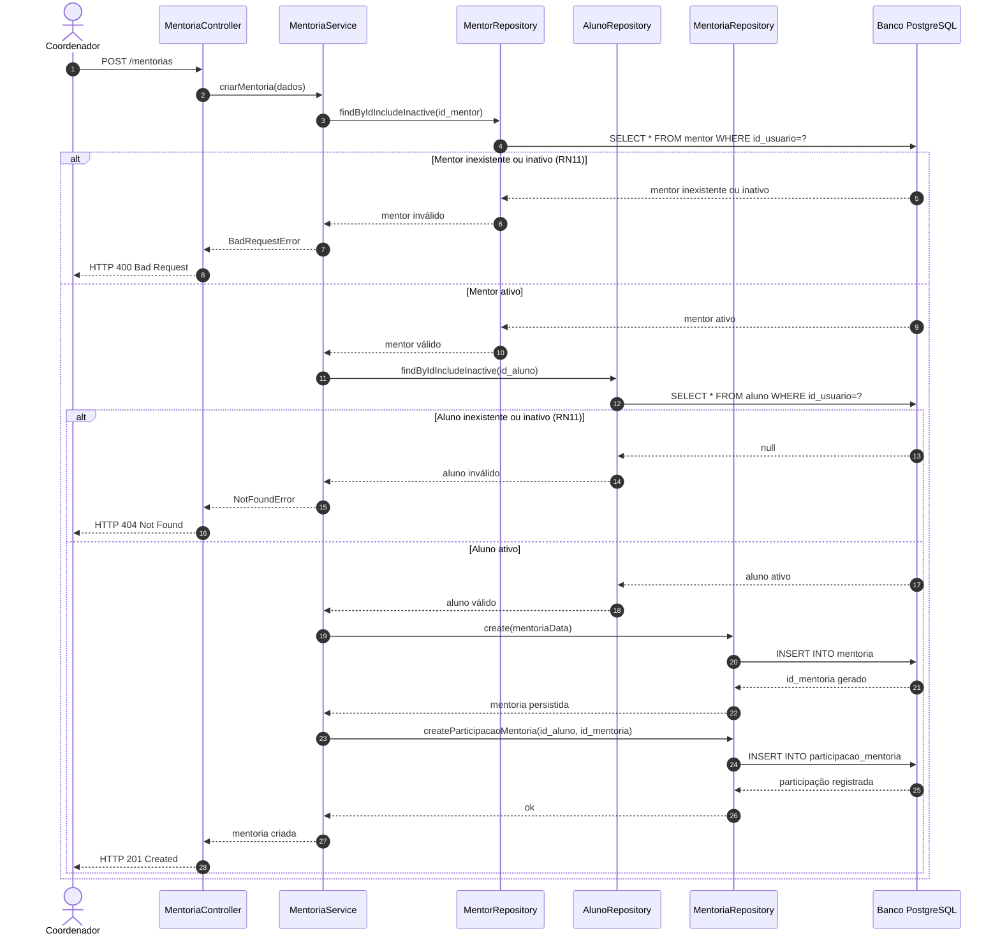
```mermaid
sequenceDiagram
  autonumber
  actor Coord as Coordenador
  participant C as MentoriaController
  participant S as MentoriaService
  participant RM as MentorRepository
  participant RA as AlunoRepository
  participant R as MentoriaRepository
  participant B as Banco PostgreSQL

  Coord->>C: POST /mentorias
  C->>S: criarMentoria(dados)
  S->>RM: findByIdIncludeInactive(id_mentor)
  RM->>B: SELECT * FROM mentor WHERE id_usuario=?

  alt Mentor inexistente ou inativo (RN11)
    B-->>RM: mentor inexistente ou inativo
    RM-->>S: mentor inválido
    S-->>C: BadRequestError
    C-->>Coord: HTTP 400 Bad Request

  else Mentor ativo
    B-->>RM: mentor ativo
    RM-->>S: mentor válido
    S->>RA: findByIdIncludeInactive(id_aluno)
    RA->>B: SELECT * FROM aluno WHERE id_usuario=?

    alt Aluno inexistente ou inativo (RN11)
      B-->>RA: null
      RA-->>S: aluno inválido
      S-->>C: NotFoundError
      C-->>Coord: HTTP 404 Not Found

    else Aluno ativo
      B-->>RA: aluno ativo
      RA-->>S: aluno válido
      S->>R: create(mentoriaData)
      R->>B: INSERT INTO mentoria
      B-->>R: id_mentoria gerado
      R-->>S: mentoria persistida
      S->>R: createParticipacaoMentoria(id_aluno, id_mentoria)
      R->>B: INSERT INTO participacao_mentoria
      B-->>R: participação registrada
      R-->>S: ok
      S-->>C: mentoria criada
      C-->>Coord: HTTP 201 Created
    end
  end
```

#### Diagrama 6 — Registro de Indicador de Acompanhamento (RF002 + RN03)

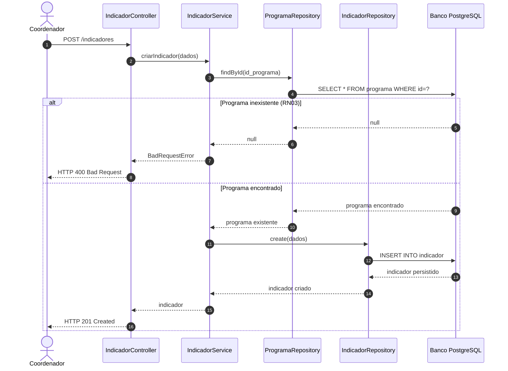
```mermaid
sequenceDiagram
  autonumber
  actor Coord as Coordenador
  participant C as IndicadorController
  participant S as IndicadorService
  participant RP as ProgramaRepository
  participant R as IndicadorRepository
  participant B as Banco PostgreSQL

  Coord->>C: POST /indicadores
  C->>S: criarIndicador(dados)
  S->>RP: findById(id_programa)
  RP->>B: SELECT * FROM programa WHERE id=?

  alt Programa inexistente (RN03)
    B-->>RP: null
    RP-->>S: null
    S-->>C: BadRequestError
    C-->>Coord: HTTP 400 Bad Request

  else Programa encontrado
    B-->>RP: programa encontrado
    RP-->>S: programa existente
    S->>R: create(dados)
    R->>B: INSERT INTO indicador
    B-->>R: indicador persistido
    R-->>S: indicador criado
    S-->>C: indicador
    C-->>Coord: HTTP 201 Created
  end
```

#### Diagrama 7 — Registro de Entrega de Atividade (RF003 + RN04)

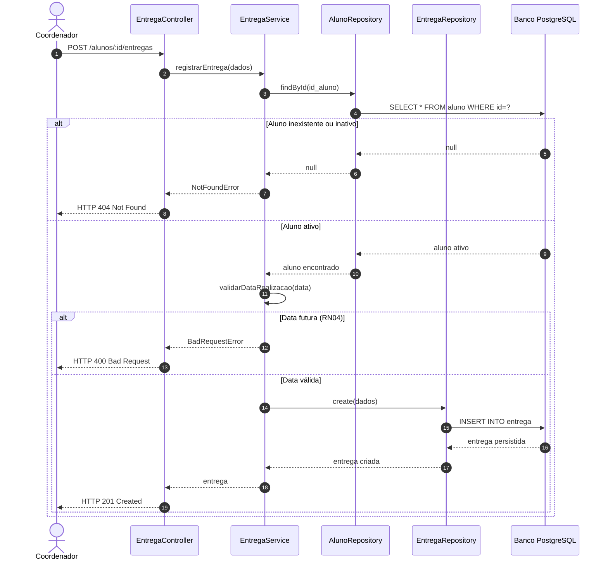
```mermaid
sequenceDiagram
  autonumber
  actor Coord as Coordenador
  participant C as EntregaController
  participant S as EntregaService
  participant RA as AlunoRepository
  participant R as EntregaRepository
  participant B as Banco PostgreSQL

  Coord->>C: POST /alunos/:id/entregas
  C->>S: registrarEntrega(dados)
  S->>RA: findById(id_aluno)
  RA->>B: SELECT * FROM aluno WHERE id=?

  alt Aluno inexistente ou inativo
    B-->>RA: null
    RA-->>S: null
    S-->>C: NotFoundError
    C-->>Coord: HTTP 404 Not Found

  else Aluno ativo
    B-->>RA: aluno ativo
    RA-->>S: aluno encontrado
    S->>S: validarDataRealizacao(data)

    alt Data futura (RN04)
      S-->>C: BadRequestError
      C-->>Coord: HTTP 400 Bad Request

    else Data válida
      S->>R: create(dados)
      R->>B: INSERT INTO entrega
      B-->>R: entrega persistida
      R-->>S: entrega criada
      S-->>C: entrega
      C-->>Coord: HTTP 201 Created
    end
  end
```

#### Diagrama 8 — Perfil Consolidado do Aluno (RF004)

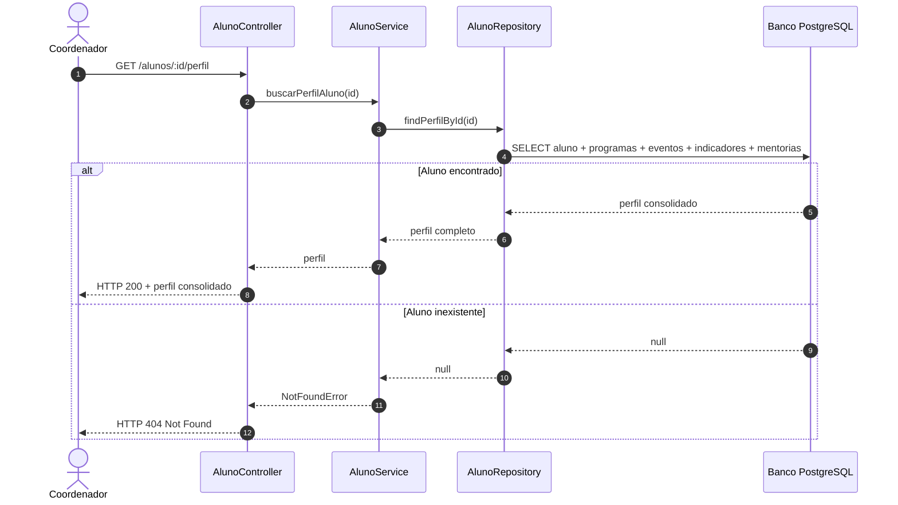
```mermaid
sequenceDiagram
  autonumber
  actor Coord as Coordenador
  participant C as AlunoController
  participant S as AlunoService
  participant R as AlunoRepository
  participant B as Banco PostgreSQL

  Coord->>C: GET /alunos/:id/perfil
  C->>S: buscarPerfilAluno(id)
  S->>R: findPerfilById(id)
  R->>B: SELECT aluno + programas + eventos + indicadores + mentorias

  alt Aluno encontrado
    B-->>R: perfil consolidado
    R-->>S: perfil completo
    S-->>C: perfil
    C-->>Coord: HTTP 200 + perfil consolidado

  else Aluno inexistente
    B-->>R: null
    R-->>S: null
    S-->>C: NotFoundError
    C-->>Coord: HTTP 404 Not Found
  end
```

#### Diagrama 9 — Portal do Aluno: Atualização de Perfil (RF005 + RN09)

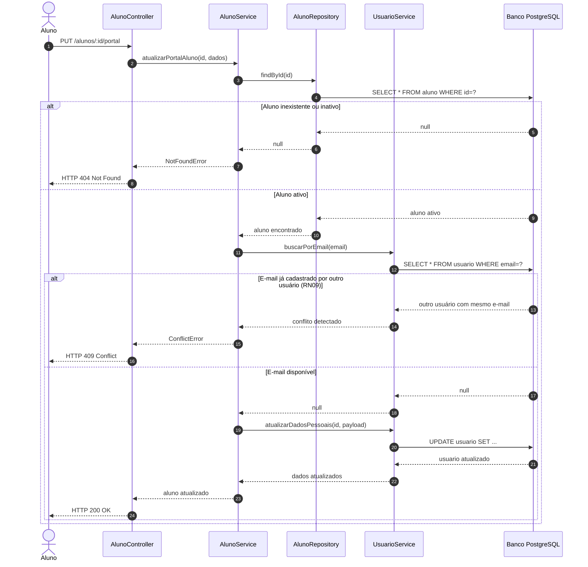
```mermaid
sequenceDiagram
  autonumber
  actor Aluno as Aluno
  participant C as AlunoController
  participant S as AlunoService
  participant R as AlunoRepository
  participant SU as UsuarioService
  participant B as Banco PostgreSQL

  Aluno->>C: PUT /alunos/:id/portal
  C->>S: atualizarPortalAluno(id, dados)
  S->>R: findById(id)
  R->>B: SELECT * FROM aluno WHERE id=?

  alt Aluno inexistente ou inativo
    B-->>R: null
    R-->>S: null
    S-->>C: NotFoundError
    C-->>Aluno: HTTP 404 Not Found

  else Aluno ativo
    B-->>R: aluno ativo
    R-->>S: aluno encontrado
    S->>SU: buscarPorEmail(email)
    SU->>B: SELECT * FROM usuario WHERE email=?

    alt E-mail já cadastrado por outro usuário (RN09)
      B-->>SU: outro usuário com mesmo e-mail
      SU-->>S: conflito detectado
      S-->>C: ConflictError
      C-->>Aluno: HTTP 409 Conflict

    else E-mail disponível
      B-->>SU: null
      SU-->>S: null
      S->>SU: atualizarDadosPessoais(id, payload)
      SU->>B: UPDATE usuario SET ...
      B-->>SU: usuario atualizado
      SU-->>S: dados atualizados
      S-->>C: aluno atualizado
      C-->>Aluno: HTTP 200 OK
    end
  end
```

#### Diagrama 10 — Dashboard de Impacto (RF008)

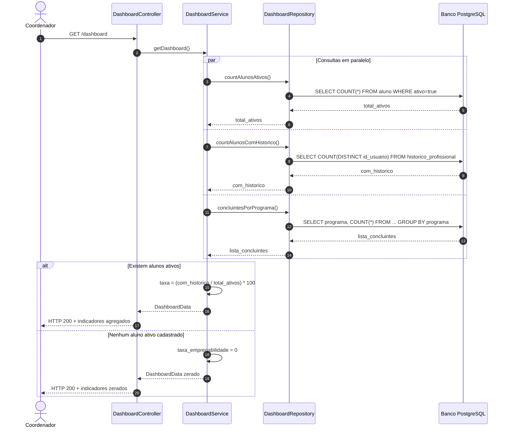
```mermaid
sequenceDiagram
  autonumber
  actor Coord as Coordenador
  participant C as DashboardController
  participant S as DashboardService
  participant R as DashboardRepository
  participant B as Banco PostgreSQL

  Coord->>C: GET /dashboard
  C->>S: getDashboard()

  par Consultas em paralelo
    S->>R: countAlunosAtivos()
    R->>B: SELECT COUNT(*) FROM aluno WHERE ativo=true
    B-->>R: total_ativos
    R-->>S: total_ativos
  and
    S->>R: countAlunosComHistorico()
    R->>B: SELECT COUNT(DISTINCT id_usuario) FROM historico_profissional
    B-->>R: com_historico
    R-->>S: com_historico
  and
    S->>R: concluintesPorPrograma()
    R->>B: SELECT programa, COUNT(*) FROM ... GROUP BY programa
    B-->>R: lista_concluintes
    R-->>S: lista_concluintes
  end

  alt Existem alunos ativos
    S->>S: taxa = (com_historico / total_ativos) * 100
    S-->>C: DashboardData
    C-->>Coord: HTTP 200 + indicadores agregados

  else Nenhum aluno ativo cadastrado
    S->>S: taxa_empregabilidade = 0
    S-->>C: DashboardData zerado
    C-->>Coord: HTTP 200 + indicadores zerados
  end
```

#### Diagrama 11 — Registro de Histórico Profissional (RF010)

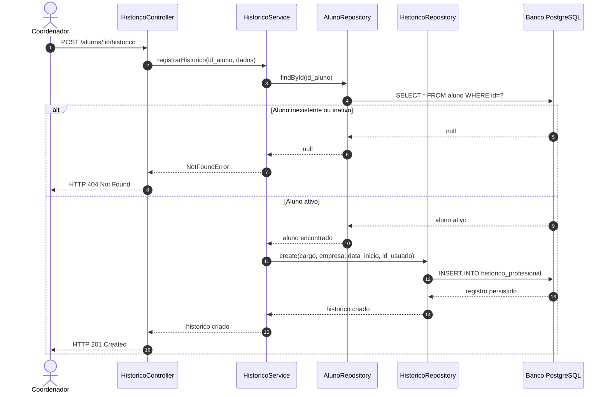
```mermaid
sequenceDiagram
  autonumber
  actor Coord as Coordenador
  participant C as HistoricoController
  participant S as HistoricoService
  participant RA as AlunoRepository
  participant R as HistoricoRepository
  participant B as Banco PostgreSQL

  Coord->>C: POST /alunos/:id/historico
  C->>S: registrarHistorico(id_aluno, dados)
  S->>RA: findById(id_aluno)
  RA->>B: SELECT * FROM aluno WHERE id=?

  alt Aluno inexistente ou inativo
    B-->>RA: null
    RA-->>S: null
    S-->>C: NotFoundError
    C-->>Coord: HTTP 404 Not Found

  else Aluno ativo
    B-->>RA: aluno ativo
    RA-->>S: aluno encontrado
    S->>R: create(cargo, empresa, data_inicio, id_usuario)
    R->>B: INSERT INTO historico_profissional
    B-->>R: registro persistido
    R-->>S: historico criado
    S-->>C: historico criado
    C-->>Coord: HTTP 201 Created
  end
```

#### Diagrama 12 — Área do Mentor: Listagem de Mentorandos (RF013 + RN14)

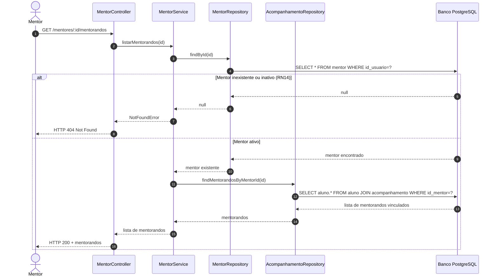
```mermaid
sequenceDiagram
  autonumber
  actor Mentor as Mentor
  participant C as MentorController
  participant S as MentorService
  participant RM as MentorRepository
  participant RA as AcompanhamentoRepository
  participant B as Banco PostgreSQL

  Mentor->>C: GET /mentores/:id/mentorandos
  C->>S: listarMentorandos(id)
  S->>RM: findById(id)
  RM->>B: SELECT * FROM mentor WHERE id_usuario=?

  alt Mentor inexistente ou inativo (RN14)
    B-->>RM: null
    RM-->>S: null
    S-->>C: NotFoundError
    C-->>Mentor: HTTP 404 Not Found

  else Mentor ativo
    B-->>RM: mentor encontrado
    RM-->>S: mentor existente
    S->>RA: findMentorandosByMentorId(id)
    RA->>B: SELECT aluno.* FROM aluno JOIN acompanhamento WHERE id_mentor=?
    B-->>RA: lista de mentorandos vinculados
    RA-->>S: mentorandos
    S-->>C: lista de mentorandos
    C-->>Mentor: HTTP 200 + mentorandos
  end
```

#### Diagrama 13 — Registro de Avaliação de Indicador (RF002 + RN10)

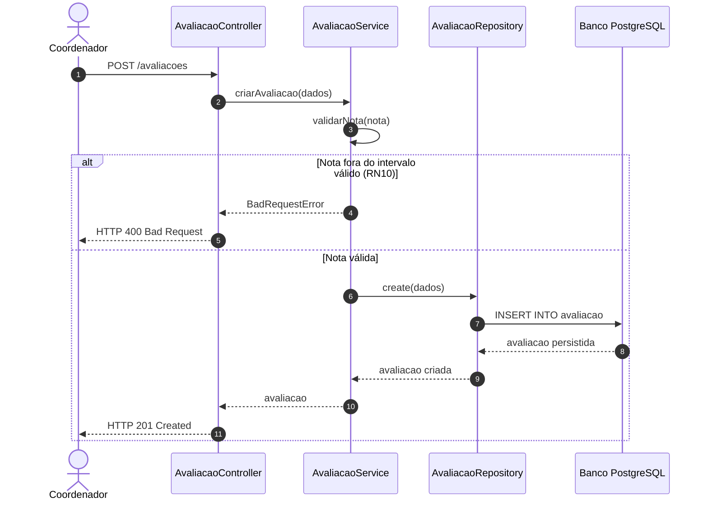
```mermaid
sequenceDiagram
  autonumber
  actor Coord as Coordenador
  participant C as AvaliacaoController
  participant S as AvaliacaoService
  participant R as AvaliacaoRepository
  participant B as Banco PostgreSQL

  Coord->>C: POST /avaliacoes
  C->>S: criarAvaliacao(dados)
  S->>S: validarNota(nota)

  alt Nota fora do intervalo válido (RN10)
    S-->>C: BadRequestError
    C-->>Coord: HTTP 400 Bad Request

  else Nota válida
    S->>R: create(dados)
    R->>B: INSERT INTO avaliacao
    B-->>R: avaliacao persistida
    R-->>S: avaliacao criada
    S-->>C: avaliacao
    C-->>Coord: HTTP 201 Created
  end
```

#### Diagrama 14 — Vínculo Mentor-Aluno-Programa (RF002)

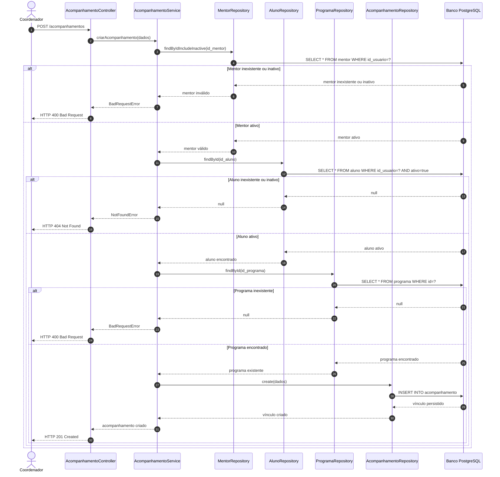
```mermaid
sequenceDiagram
  autonumber
  actor Coord as Coordenador
  participant C as AcompanhamentoController
  participant S as AcompanhamentoService
  participant RM as MentorRepository
  participant RA as AlunoRepository
  participant RP as ProgramaRepository
  participant R as AcompanhamentoRepository
  participant B as Banco PostgreSQL

  Coord->>C: POST /acompanhamentos
  C->>S: criarAcompanhamento(dados)
  S->>RM: findByIdIncludeInactive(id_mentor)
  RM->>B: SELECT * FROM mentor WHERE id_usuario=?

  alt Mentor inexistente ou inativo
    B-->>RM: mentor inexistente ou inativo
    RM-->>S: mentor inválido
    S-->>C: BadRequestError
    C-->>Coord: HTTP 400 Bad Request

  else Mentor ativo
    B-->>RM: mentor ativo
    RM-->>S: mentor válido
    S->>RA: findById(id_aluno)
    RA->>B: SELECT * FROM aluno WHERE id_usuario=? AND ativo=true

    alt Aluno inexistente ou inativo
      B-->>RA: null
      RA-->>S: null
      S-->>C: NotFoundError
      C-->>Coord: HTTP 404 Not Found

    else Aluno ativo
      B-->>RA: aluno ativo
      RA-->>S: aluno encontrado
      S->>RP: findById(id_programa)
      RP->>B: SELECT * FROM programa WHERE id=?

      alt Programa inexistente
        B-->>RP: null
        RP-->>S: null
        S-->>C: BadRequestError
        C-->>Coord: HTTP 400 Bad Request

      else Programa encontrado
        B-->>RP: programa encontrado
        RP-->>S: programa existente
        S->>R: create(dados)
        R->>B: INSERT INTO acompanhamento
        B-->>R: vínculo persistido
        R-->>S: vínculo criado
        S-->>C: acompanhamento criado
        C-->>Coord: HTTP 201 Created
      end
    end
  end
```

### 3.2.5. Diagrama de Atividades ou Estados

Não se aplica.

### 3.2.6. Diagrama de Implantação

Não se aplica.

### 3.2.7. Padrões de Projeto Aplicados

#### Repository Pattern

##### Descrição

O Repository Pattern é utilizado para separar a lógica de acesso aos dados das regras de negócio da aplicação. Esse padrão cria uma camada responsável exclusivamente pela comunicação com o banco de dados.

##### Onde foi aplicado no projeto

No projeto, esse padrão foi aplicado na pasta `repositories`, composta por arquivos responsáveis pelas operações de persistência de cada entidade do sistema.

Exemplo:

- `acompanhaRepository.ts`
- `alunoRepository.ts`
- `anotacaoPrivadaRepository.ts`
- `atividadeRepository.ts`
- `aulaRepository.ts`
- `avaliacaoRepository.ts`
- `conquistaManualRepository.ts`
- `cursoRepository.ts`
- `dashboardRepository.ts`
- `entregaRepository.ts`
- `eventoRepository.ts`
- `frequenciaRepository.ts`
- `gerenciaRepository.ts`
- `historicoProfissionalRepository.ts`
- `indicadorRepository.ts`
- `matriculaRepository.ts`
- `mentoriaRepository.ts`
- `mentorRepository.ts`
- `oportunidadeRepository.ts`
- `participaEventoRepository.ts`
- `programaRepository.ts`
- `usuarioRepository.ts`

No arquivo `alunoRepository.ts`, funções como `findAll`, `findById`, `create`, `update` e `inactivate` realizam operações diretamente no banco de dados utilizando o Supabase.

##### Justificativa

A adoção desse padrão foi necessária para evitar que Controllers e Services realizassem acesso direto ao banco de dados. Dessa forma, houve redução do acoplamento entre as camadas da aplicação, além de maior organização, reutilização de código e facilidade de manutenção.

---

#### Service Layer Pattern

##### Descrição

O Service Layer Pattern é utilizado para centralizar as regras de negócio da aplicação em uma camada intermediária entre Controllers e Repositories.

##### Onde foi aplicado no projeto

Esse padrão foi implementado na pasta `services`, responsável pelo processamento das regras de negócio.

Exemplo:

- `acompanhaService.ts`
- `alunoService.ts`
- `anotacaoPrivadaService.ts`
- `atividadeService.ts`
- `aulaService.ts`
- `authService.ts`
- `avaliacaoService.ts`
- `cursoService.ts`
- `dashboardService.ts`
- `emailService.ts`
- `entregaService.ts`
- `eventoService.ts`
- `frequenciaService.ts`
- `gerenciaService.ts`
- `importacaoService.ts`
- `indicadorService.ts`
- `matriculaService.ts`
- `mentoriaService.ts`
- `mentorService.ts`
- `oportunidadeService.ts`
- `participaEventoService.ts`
- `programaService.ts`
- `usuarioService.ts`

No arquivo `alunoService.ts`, funções como `buscarAluno`, `criarAluno` e `deletarAluno` realizam validações e intermediam a comunicação com o repositório.

##### Justificativa

A utilização da camada de serviços permitiu separar as regras de negócio do tratamento das requisições HTTP e do acesso aos dados. Isso tornou o sistema mais modular, organizado e reutilizável, além de facilitar futuras manutenções e testes.

---

#### asyncHandler (Higher-Order Function / Factory Pattern)

##### Descrição

O `asyncHandler` é utilizado para encapsular funções assíncronas dos Controllers e centralizar o tratamento de erros da aplicação.

##### Onde foi aplicado no projeto

Esse padrão foi aplicado nos Controllers da aplicação.

Exemplo no `alunoController.ts`:

```typescript
export const listar = asyncHandler(async (_req: Request, res: Response) => {
  const alunos = await svc.listarAlunos();
  res.json(alunos);
});
```

O `asyncHandler` recebe uma função assíncrona como parâmetro e retorna uma nova função já preparada para tratamento automático de exceções.

##### Justificativa

A adoção desse padrão evitou repetição de blocos do tipo `try/catch` em todos os Controllers da aplicação. Com isso, o código ficou mais limpo, padronizado e de mais fácil manutenção.

---

#### Tratamento Centralizado de Erros (AppError)

##### Descrição

Foi utilizada uma estrutura de erros personalizados para padronizar o tratamento de exceções da aplicação.

##### Onde foi aplicado no projeto

No arquivo `alunoService.ts`, o sistema utiliza a classe `NotFoundError`, derivada de `AppError`, para lançar exceções quando um aluno não é encontrado.

Exemplo:

```typescript
if (!aluno) throw new NotFoundError(`Aluno com id ${id} não encontrado`);
```

##### Justificativa

Esse padrão foi adotado para centralizar o tratamento de erros da API, tornando as mensagens mais padronizadas e facilitando manutenção e depuração do sistema.

---

#### Princípios SOLID Aplicados

##### Single Responsibility Principle (SRP)

O princípio da Responsabilidade Única estabelece que cada módulo deve possuir apenas uma responsabilidade dentro do sistema.

##### Aplicação no projeto

Esse princípio pode ser observado na divisão da arquitetura em camadas:

- `Controllers` → responsáveis pelas requisições e respostas HTTP;
- `Services` → responsáveis pelas regras de negócio;
- `Repositories` → responsáveis pelo acesso ao banco de dados.

Por exemplo:

- o `alunoController.ts` apenas recebe requisições e retorna respostas;
- o `alunoService.ts` processa regras de negócio e validações;
- o `alunoRepository.ts` executa operações no banco utilizando o Supabase.

##### Benefícios

A aplicação do SRP reduziu o acoplamento entre as camadas e tornou o sistema mais organizado, reutilizável e de fácil manutenção.


## 3.3. Wireframes

Com base na seleção das principais User Stories e nos requisitos funcionais definidos para a solução da Pulse Mais, foram desenvolvidos os wireframes da plataforma com o objetivo de representar visualmente a estrutura, os fluxos de navegação e a organização das funcionalidades do sistema. Os wireframes consistem em representações simplificadas das interfaces, utilizadas para validar ideias de design, arquitetura da informação e usabilidade antes da aplicação de elementos visuais de alta fidelidade. Sua construção foi orientada pelos conceitos trabalhados nas aulas de UX Design, priorizando clareza, consistência e uma experiência intuitiva para os diferentes perfis de usuário da plataforma.

O processo de elaboração iniciou-se com protótipos de baixa fidelidade desenvolvidos em papel, permitindo estruturar rapidamente os fluxos principais do sistema e validar a lógica de funcionamento da aplicação. A partir desses esboços, foram produzidas versões digitais organizadas com base em sistemas de grid que garantem alinhamento, padronização visual e melhor distribuição dos elementos em tela. Durante o desenvolvimento, houve atenção especial à hierarquia das informações, aos espaçamentos e à consistência entre as diferentes páginas, assegurando uma navegação fluida entre os módulos da plataforma. Além disso, os fluxos foram estruturados considerando os diferentes níveis de acesso existentes no sistema, separando claramente as jornadas do Coordenador, Aluno e Ex-Aluno.

### 3.3.1. Wireframes de Baixa Fidelidade

Nesta seção, são apresentados os wireframes de baixa fidelidade desenvolvidos para a plataforma desktop, segmentados pelos perfis de Coordenador, Aluno e Ex-aluno. A seguir, detalharemos a função de cada tela, sua utilidade no fluxo da aplicação e a relação direta com as User Stories definidas previamente, garantindo que a solução atenda às necessidades e dores dos usuários mapeados, em especial a centralização dos dados dos alunos, a eliminação da dependência de planilhas isoladas e o acesso autônomo dos jovens à sua própria trajetória.

#### 3.3.1.1 Wireframe de Baixa Fidelidade - Coordenador

A seguir, a apresentação do wireframe desktop de baixa fidelidade, referente ao Coordenador, e, em seguida, apresenta-se a descrição de cada tela.

<figure style="text-align: center; margin: 1.5rem auto;">
 <figcaption>
    Figura 12: Wireframe Desktop Baixa Fidelidade (Coordenador)
  </figcaption>
  
  <figcaption>
    Fonte: Produção dos Autores (2026)
  </figcaption>
   <figcaption>
  <a href="https://www.figma.com/design/VVIoLeZVb6jB3krABCfjhf/Untitled?node-id=0-1&t=eZWQpxvhOP2xK43M-1" target="_blank">
    Link de Acesso ao Wireframe
  </a>
</figcaption>
</figure>

**1. Tela: Menu**
Tela de entrada da plataforma, onde o coordenador realiza o login com suas credenciais de acesso. É o ponto de entrada do sistema e está relacionada a todas as User Stories, pois representa o controle de autenticação e perfil de acesso (US01 a US10).

**2. Tela: Boas-Vindas**
Tela de apresentação exibida logo após o login, com uma saudação personalizada ao coordenador ("Bem-vindo, [nome]") acompanhada de uma breve mensagem explicativa sobre a plataforma e as ações disponíveis para o seu perfil. Relacionada à US06, pois contextualiza o coordenador sobre o sistema e orienta a navegação pelas funcionalidades de gestão de alunos e indicadores.

**3. Tela: Perfil do Coordenador**
Exibe os dados cadastrais do próprio coordenador (nome, e-mail, telefone), permitindo visualização do perfil institucional. Relacionada à US06, por apoiar a gestão interna dos dados da equipe Pulse Mais.

**4. Tela: Dashboard Institucional**
Painel central de indicadores consolidados, com gráficos de pizza e barras exibindo métricas como alunos ativos, taxa de empregabilidade e concluintes por programa. Relacionada à US04 e US09, pois apoia decisões estratégicas com base em dados reais sem depender de planilhas manuais.

**5. Tela: Perfil dos Alunos**
Listagem em formato de cards dos alunos cadastrados, permitindo visualização rápida e navegação para perfis individuais. Relacionada à US03 e US06, pois centraliza o acesso aos dados dos alunos de forma organizada e consultável.

**6. Tela: Cadastro de Aluno**
Formulário de registro de novo aluno, com campos para dados pessoais, acadêmicos e de contato. Relacionada diretamente à US01, atendendo à necessidade de centralizar informações em um único sistema com validações de CPF e campos obrigatórios.

**7. Tela: Perfil do Aluno**
Página individual do aluno consolidando histórico completo: dados pessoais, participações em programas, eventos, indicadores e observações. Relacionada à US03 e US04, pois elimina a necessidade de buscar informações em planilhas separadas, exibindo tudo em uma única interface.

**8. Tela: Registro de Frequência**
Tela dedicada ao lançamento de frequência dos alunos, exibindo uma listagem com o nome de cada aula com a data e campos para marcação de presença ou ausência. Relacionada diretamente à US02, pois permite monitorar o engajamento individual e identificar precocemente alunos com risco de evasão por meio do acompanhamento contínuo da frequência.

**9. Tela: Deletar Perfil de Aluno**
Modal de confirmação exibido quando o coordenador aciona a exclusão de um aluno, com botões de confirmação e cancelamento. Relacionada à RN02, garantindo que o registro não seja apagado fisicamente, mas desativado, preservando o histórico institucional.

#### 3.3.1.2 Wireframe de Baixa Fidelidade - Aluno Ativo

<figure style="text-align: center; margin: 1.5rem auto;">
 <figcaption>
    Figura 13: Wireframe Desktop Baixa Fidelidade (Aluno Ativo)
  </figcaption>
  
  <figcaption>
    Fonte: Produção dos Autores (2026)
  </figcaption>
    <figcaption>
    <a href="https://www.figma.com/design/VVIoLeZVb6jB3krABCfjhf/Untitled?node-id=0-1&t=eZWQpxvhOP2xK43M-1" target="_blank">
    Link de Acesso ao Wireframe
  </a>
  </figcaption>
</figure>

**1. Tela: Menu**
Tela de entrada da plataforma, onde o aluno ativo realiza o login com suas credenciais de acesso. É o ponto de entrada do sistema e está relacionada a todas as User Stories do perfil aluno, pois representa o controle de autenticação e define o nível de acesso disponível (US05 e US10).

**2. Tela: Boas-Vindas**
Tela de apresentação exibida logo após o login, com uma saudação personalizada ao aluno ("Bem-vindo, [nome]") acompanhada de uma breve mensagem explicativa sobre a plataforma e as ações disponíveis para o seu perfil. Relacionada à US05, pois orienta o jovem sobre como acompanhar sua evolução e navegar pelas funcionalidades do portal.

**3. Tela: Perfil do Aluno**
Exibe os dados cadastrais do aluno, como nome, e-mail, telefone e informações de contato, permitindo visualização das informações de perfil. Relacionada à US05, pois atende à necessidade do jovem de manter seus dados atualizados e acessíveis em um único lugar.

**4. Tela: Dashboard de Desempenho**
Painel individual do aluno com gráficos de linha exibindo sua evolução ao longo do programa, incluindo indicadores de frequência, engajamento e progresso nas atividades. Relacionada à US05, pois entrega ao jovem uma visão clara e visual do seu avanço no programa, apoiando sua preparação para o mercado de trabalho.

#### 3.3.1.3 Wireframe de Baixa Fidelidade - Ex Aluno

<figure style="text-align: center; margin: 1.5rem auto;">
 <figcaption>
    Figura 14: Wireframe Desktop Baixa Fidelidade (Ex Aluno)
  </figcaption>
  
  <figcaption>
    Fonte: Produção dos Autores (2026)
  </figcaption>
    <figcaption>
      <a href="https://www.figma.com/design/VVIoLeZVb6jB3krABCfjhf/Untitled?node-id=0-1&t=eZWQpxvhOP2xK43M-1" target="_blank">
    Link de Acesso ao Wireframe
  </a>
  </figcaption>
</figure>

**1. Tela: Menu**
Tela de entrada da plataforma, onde o ex-aluno realiza o login com suas credenciais de acesso. É o ponto de entrada do sistema e está relacionada às US07 e US08, pois define o perfil de acesso e direciona o ex-aluno às funcionalidades disponíveis para quem já concluiu o programa.

**2. Tela: Boas-Vindas**
Tela de apresentação exibida logo após o login, com uma saudação personalizada ao ex-aluno ("Bem-vindo, [nome]") e uma breve mensagem sobre o que ele pode fazer na plataforma, como atualizar seu perfil, registrar conquistas e acessar oportunidades. Relacionada à US07 e US08, pois contextualiza o ex-aluno sobre as funcionalidades disponíveis para manutenção do vínculo com a instituição.

**3. Tela: Perfil Ex-Aluno**
Exibe os dados cadastrais e a trajetória profissional do ex-aluno, incluindo informações de contato e histórico na Pulse Mais, com possibilidade de atualização. Relacionada à US08, pois permite ao jovem registrar novas conquistas profissionais e manter seu perfil atualizado como parte do seu portfólio.

**4. Tela: Certificados e Conquistas**
Tela dedicada ao registro e visualização das conquistas profissionais e certificados obtidos pelo ex-aluno após a conclusão do programa, organizados em ordem cronológica. Relacionada à US08, pois atende diretamente à necessidade de manter a trajetória registrada na plataforma e compartilhá-la como portfólio profissional.

**5. Tela: Oportunidades Pulse Mais**
Exibe uma listagem de vagas, eventos e oportunidades disponibilizadas pela Pulse Mais, com campo de busca para facilitar a navegação. Relacionada à US07 e US10, pois mantém o ex-aluno conectado à rede de oportunidades da instituição e permite encontrar chances compatíveis com seu perfil profissional.

---

### 3.3.2. Wireframes de Média Fidelidade

Com base nos requisitos funcionais definidos para a plataforma Pulse Mais, foram desenvolvidos wireframes de média fidelidade com o objetivo de representar visualmente os fluxos de navegação e as principais funcionalidades disponíveis para o perfil Coordenador. As interfaces foram projetadas considerando critérios de usabilidade, clareza visual e organização das informações, buscando facilitar o acompanhamento da jornada dos alunos e a gestão institucional da organização.

Os wireframes apresentados a seguir demonstram as principais telas desenvolvidas para o perfil Coordenador, responsável pelo gerenciamento de alunos, acompanhamento de indicadores, visualização de dashboards e administração geral da plataforma.

---

#### 3.3.2.1 Wireframe de Média Fidelidade - Coordenador

<figure style="text-align: center; margin: 1.5rem auto;">
 <figcaption>
    Figura 15: Wireframe Desktop Média Fidelidade (Coordenador)
  </figcaption>
  
  <figcaption>
    Fonte: Produção dos Autores (2026)
  </figcaption>
    <figcaption>
      <a href="https://www.figma.com/design/qNsmqk15vvCNNhiaNiDH99/Wireframes-M%C3%A9dia-Finalidade?node-id=0-1&t=arc0QitofkhnOl6V-1" target="_blank">
    Link de Acesso ao Wireframe
  </a>
  </figcaption>
</figure>

**1. Tela: Menu** O Menu foi projetado para permitir o acesso seguro dos usuários à plataforma. A interface apresenta campos para autenticação utilizando e-mail e senha, além de botões de acesso e recuperação de credenciais. O layout foi desenvolvido de forma minimalista, priorizando clareza e facilidade de utilização.

**2. Tela: Perfil Coordenador** O perfil da Coordenadora permite visualizar informações pessoais e institucionais relacionadas ao usuário logado. A interface foi organizada em blocos informativos, facilitando o acesso aos dados cadastrais e demais informações relevantes.

**4. Tela: Dashboard Institucional**
O dashboard institucional foi desenvolvido para consolidar indicadores e métricas relevantes da Pulse Mais em um único ambiente visual. A tela apresenta gráficos, tabelas e indicadores agregados que auxiliam a coordenação no acompanhamento dos programas e do impacto social da instituição.

**5. Tela: Perfil dos Alunos**
A tela de alunos apresenta uma visualização geral dos estudantes cadastrados na plataforma. O layout foi estruturado para facilitar buscas, consultas e acesso rápido aos perfis individuais dos jovens acompanhados pela organização.

**6. Tela: Cadastro de Aluno**
A tela de cadastro de aluno foi projetada para permitir o registro de novos estudantes no sistema. A interface contempla campos para informações pessoais, dados de contato e demais registros necessários para a criação do perfil institucional do jovem.

**7. Tela: Perfil do Aluno**
A página individual do aluno funciona como um prontuário digital, consolidando informações pessoais, histórico institucional, participação em programas e indicadores registrados pela equipe Pulse Mais. A estrutura foi organizada de forma hierárquica, facilitando a leitura e consulta das informações.

**8. Tela: Registro de Frequência**
Tela específica para o registro da frequência dos estudantes, apresentando uma lista com o nome de cada aula, a data e espaços para indicar presença ou ausência. Está diretamente vinculada à US02, uma vez que possibilita o monitoramento do engajamento individual e a identificação precoce de estudantes com risco de evasão por meio do acompanhamento constante da frequência.

**9. Tela: Deletar Perfil de Aluno**
A tela de exclusão foi desenvolvida para garantir maior segurança durante processos de desativação de registros. Antes da confirmação, o sistema apresenta mensagens de alerta ao usuário, reduzindo riscos de ações acidentais.

---

#### 3.3.2.2 Wireframe de Média Fidelidade - Aluno Ativo

<figure style="text-align: center; margin: 1.5rem auto;">
 <figcaption>
    Figura 16: Wireframe Desktop Média Fidelidade (Aluno Ativo)
  </figcaption>
  
  <figcaption>
    Fonte: Produção dos Autores (2026)
  </figcaption>
    <figcaption>
      <a href="https://www.figma.com/design/qNsmqk15vvCNNhiaNiDH99/Wireframes-M%C3%A9dia-Finalidade?node-id=0-1&t=arc0QitofkhnOl6V-1" target="_blank">
    Link de Acesso ao Wireframe
  </a>
  </figcaption>
</figure>

**1. Tela: Menu**
Assim como para o perfil de coordenadora, a tela de menu dos alunos foi projetada para permitir o acesso seguro dos usuários à plataforma. A interface apresenta campos para autenticação utilizando e-mail e senha, além de botões de acesso e recuperação de credenciais. O layout foi desenvolvido de forma minimalista, priorizando clareza e facilidade de utilização.

**2. Tela: Boas-Vindas**
A tela de boas-vindas funciona como ponto inicial de interação do Aluno com a plataforma. Nela, são exibidas mensagens introdutórias e atalhos para funcionalidades importantes, auxiliando o usuário a navegar rapidamente pelos principais módulos do sistema.

**3. Tela: Perfil do Aluno**
A tela de perfil dos alunos permite visualizar informações pessoais e institucionais relacionadas ao usuário logado. A interface foi organizada em blocos informativos, facilitando o acesso aos dados cadastrais e demais informações relevantes.

**4. Tela: Dashboard de Desempenho**
O dashboard do aluno foi desenvolvido para centralizar informações relevantes da trajetória do jovem dentro da Pulse Mais em um único ambiente visual. A tela apresenta dados relacionados à participação em programas, atividades realizadas, indicadores de acompanhamento e histórico institucional, permitindo que o aluno acompanhe sua evolução de forma clara e organizada ao longo da jornada na plataforma.

---

#### 3.3.2.3 Wireframe de Média Fidelidade - Ex Aluno

<figure style="text-align: center; margin: 1.5rem auto;">
 <figcaption>
    Figura 17: Wireframe Desktop Média Fidelidade (Ex Aluno)
  </figcaption>
  
  <figcaption>
    Fonte: Produção dos Autores (2026)
  </figcaption>
    <figcaption>
      <a href="https://www.figma.com/design/qNsmqk15vvCNNhiaNiDH99/Wireframes-M%C3%A9dia-Finalidade?node-id=0-1&t=arc0QitofkhnOl6V-1" target="_blank">
    Link de Acesso ao Wireframe
  </a>
  </figcaption>
</figure>

**1. Tela: Menu**
Assim como para os perfis de coordenadora e aluno, a tela de menu dos ex-alunos foi projetada para permitir o acesso seguro dos usuários à plataforma. A interface apresenta campos para autenticação utilizando e-mail e senha, além de botões de acesso e recuperação de credenciais. O layout foi desenvolvido de forma minimalista, priorizando clareza e facilidade de utilização.

**2. Tela: Boas-Vindas**
A tela de boas-vindas funciona como ponto inicial de interação do Ex-Aluno com a plataforma. Nela, são exibidas mensagens introdutórias e atalhos para funcionalidades importantes, auxiliando o usuário a navegar rapidamente pelos principais módulos do sistema.

**3. Tela: Perfil Ex-Aluno**
A tela de perfil do Ex-Aluno permite visualizar informações pessoais e institucionais relacionadas ao usuário logado. A interface foi organizada em blocos informativos, facilitando o acesso aos dados cadastrais, histórico de participação em programas e demais informações relevantes.

**4. Tela: Certificados e Conquistas**
A tela de certificados e conquistas foi desenvolvida para reunir os principais resultados e reconhecimentos obtidos pelo ex-aluno durante sua trajetória na Pulse Mais. A interface permite visualizar certificados, participações em programas e outras conquistas relevantes de maneira organizada e acessível.

**5. Tela: Oportunidades Pulse Mais**
A tela de oportunidades foi projetada para conectar ex-alunos a novas experiências acadêmicas e profissionais. Nela, os usuários podem visualizar oportunidades disponibilizadas pela Pulse Mais, fortalecendo a continuidade da jornada dos jovens após a formação.

### 3.3.3 Fluxo de Ação dos Wireframes

Esta seção apresenta os fluxos de ação dos wireframes de baixa fidelidade desenvolvidos para os três perfis de usuário do sistema Pulse Mais: o Ex-Aluno, o Aluno Ativo e o Usuário Primário (Coordenador). Cada fluxo descreve a navegação entre as telas e as principais ações executadas por cada perfil, evidenciando como as User Stories priorizadas são atendidas dentro da plataforma.

---

#### Wireframe Usuário Primário (Coordenadora)

O Usuário Primário do sistema é a Coordenadora de Projetos, representada pela persona Camila Rocha, responsável principalmente pela gestão e cadastro dos alunos da Pulse Mais.

As principais User Stories relacionadas a esse fluxo são a US01, US03, US04, US06 e US09.

**a- Entrada no sistema:**
O fluxo se inicia na tela **Menu**, onde a Coordenadora realiza o login com suas credenciais de acesso. É o ponto de entrada do sistema e está relacionado às User Stories de autenticação e controle de acesso da plataforma. Após autenticada, é direcionada para a **Tela de Boas Vindas**, que funciona como o hub central de navegação do sistema e apresenta uma saudação personalizada, além de orientar a usuária sobre as funcionalidades disponíveis para o seu perfil.

**b- Navegação a partir do Hub (Tela de Boas Vindas):**
A partir da Tela de Boas Vindas, a Coordenadora tem acesso a três áreas principais. A tela **Perfil Coordenadora** permite visualizar e editar seus próprios dados cadastrais, apoiando a gestão interna da equipe Pulse Mais. A tela **Dashboard Geral dos Alunos** apresenta métricas, gráficos e indicadores relevantes para o acompanhamento da gestão, como alunos ativos, taxa de empregabilidade e concluintes por programa, atendendo às US04 e US09. A tela **Perfil dos Alunos** corresponde à listagem dos alunos cadastrados, funcionando como ponto de partida para as ações de gestão e centralização das informações dos jovens, conforme previsto nas US03 e US06. Todas essas telas permitem retorno ao hub, garantindo livre navegação entre as áreas do sistema.

**c- Gestão de Alunos (a partir da tela Perfil dos Alunos):**
A tela **Perfil dos Alunos** concentra as principais funcionalidades atribuídas à Coordenadora. A partir dela, é possível executar três ações: visualizar o **Perfil do Aluno**, ao selecionar um aluno na listagem para acessar seus dados completos, histórico e indicadores; acessar o formulário **Cadastro de Aluno**, responsável pelo registro de novos alunos no sistema por meio de campos obrigatórios e validações, atendendo diretamente à US01; e abrir a **Tela de Deletar Perfil de Aluno**, acessada a partir do Perfil do Aluno, que exibe uma confirmação para desativação do registro, preservando o histórico institucional conforme definido pela RN02.

**d- Retornos e ciclo de gestão:**
Após a conclusão das ações de cadastrar ou deletar, o fluxo retorna automaticamente para a tela **Perfil dos Alunos**, mantendo a Coordenadora no contexto de gestão e permitindo a execução de novas ações em sequência.

**e- Resumo do fluxo:**
`Menu` → `Tela de Boas Vindas` → `Perfil Coordenadora` / `Dashboard Geral dos Alunos` / `Perfil dos Alunos` → `Perfil do Aluno` → `Cadastro de Aluno` / `Tela de Deletar Perfil de Aluno` → retorno para `Perfil dos Alunos`.

---

#### Wireframe Aluno Ativo

O perfil de Aluno Ativo representa o jovem matriculado e em participação corrente nos programas da Pulse Mais, conforme descrito pela persona Luana.

A principal User Story relacionada a esse fluxo é a US05.

**a- Entrada no sistema:**
O fluxo se inicia na **Tela de Login**, onde o Aluno Ativo realiza a autenticação por meio de suas credenciais (e-mail e senha). É o ponto de entrada do sistema e representa o controle de autenticação e definição do nível de acesso disponível ao perfil do aluno. Após validado o acesso, é direcionado para a **Tela de Boas-vindas**, que funciona como o hub central de navegação do sistema e apresenta uma saudação personalizada com o nome do aluno, além de informações sobre o desempenho geral no programa Pulse Mais.

**b- Navegação a partir do Hub (Tela de Boas-vindas):**
A partir da Tela de Boas-vindas, o Aluno Ativo tem acesso às duas áreas principais do sistema. A tela **Perfil do Aluno** apresenta os dados cadastrais do jovem, como nome, e-mail, telefone e informações de contato, permitindo visualização e atualização dos próprios dados. A tela **Dashboard de Desempenho** exibe gráficos e indicadores referentes à evolução do aluno no programa, incluindo métricas de frequência, participação em eventos e progresso nas atividades. Ambas as telas permitem retorno ao hub, garantindo livre navegação entre as áreas disponíveis.

**c- Acompanhamento do desempenho (Dashboard):**
A tela **Dashboard de Desempenho** concentra a principal funcionalidade voltada ao Aluno Ativo, permitindo que o jovem visualize sua própria evolução no programa. Por meio de gráficos consolidados, o aluno acompanha indicadores de progresso, frequência e participação, obtendo clareza sobre sua etapa atual na jornada e os próximos passos a serem seguidos. Esta funcionalidade atende diretamente à dor identificada na persona Luana, relacionada à dificuldade em identificar sua etapa atual e o progresso individual.

**d- Atualização cadastral (Perfil do Aluno):**
A tela **Perfil do Aluno** permite que o Aluno Ativo mantenha seus dados cadastrais atualizados de forma autônoma, reduzindo a dependência da equipe administrativa para alterações simples de contato. O acesso é restrito à edição dos próprios dados, sem possibilidade de alteração do histórico de jornada, indicadores ou observações registradas pela equipe Pulse Mais, conforme estabelecido pela regra de negócio RN05.

**e- Resumo do fluxo:**
`Tela de Login` → `Tela de Boas-vindas` → `Perfil do Aluno` / `Dashboard de Desempenho` → retorno para `Tela de Boas-vindas`.

---

#### Wireframe Ex-Aluno

O perfil de Ex-Aluno representa o jovem que concluiu o programa Pulse Mais e mantém vínculo com a instituição por meio da rede de talentos, conforme descrito pela persona Pedro.

As principais User Stories relacionadas a esse fluxo são a US07, US08 e US10.

**a- Entrada no sistema:**
O fluxo se inicia na **Tela de Login**, onde o Ex-Aluno realiza a autenticação por meio de suas credenciais (e-mail e senha). É o ponto de entrada do sistema e define o perfil de acesso disponível ao usuário. Após validado o acesso, é direcionado para a **Tela de Boas-vindas**, que funciona como o hub central de navegação e apresenta uma saudação personalizada com o nome do ex-aluno, além de um panorama das suas oportunidades, conexões e próximos passos na rede de talentos da Pulse Mais.

**b- Navegação a partir do Hub (Tela de Boas-vindas):**
A partir da Tela de Boas-vindas, o Ex-Aluno tem acesso às principais áreas do sistema. A tela **Perfil do Ex-Aluno** centraliza os dados cadastrais e profissionais do jovem, permitindo atualização de informações profissionais e histórico de trajetória. A tela **Certificados e Conquistas** organiza certificados, promoções e marcos profissionais registrados pelo usuário. Já a tela **Oportunidades Pulse Mais** exibe vagas, eventos e oportunidades disponibilizadas pela instituição, permitindo ao jovem manter-se conectado à rede Pulse Mais. Todas as telas permitem retorno ao hub principal, garantindo continuidade na navegação.

**c- Visualização de oportunidades (Oportunidades Pulse Mais):**
A tela **Oportunidades Pulse Mais** concentra uma das principais funcionalidades voltadas a esse perfil, permitindo que o jovem visualize vagas, eventos e processos seletivos disponibilizados pela Pulse Mais, além de utilizar mecanismos de busca para localizar oportunidades compatíveis com seu perfil profissional. Essa funcionalidade atende diretamente às US07 e US10.

**d- Atualização do perfil profissional (Perfil do Ex-Aluno e Certificados e Conquistas):**
Além da visualização de oportunidades, as telas **Perfil do Ex-Aluno** e **Certificados e Conquistas** permitem que o jovem mantenha suas informações profissionais atualizadas de forma autônoma, registrando novas conquistas como mudanças de emprego, promoções, ingresso no ensino superior, certificados e demais marcos relevantes da trajetória pós-formação. O acesso é restrito à edição dos próprios dados, sem possibilidade de alteração do histórico registrado pela equipe Pulse Mais durante o período de formação.

**e- Resumo do fluxo:**
`Tela de Login` → `Tela de Boas-vindas` → `Perfil do Ex-Aluno` / `Certificados e Conquistas` / `Oportunidades Pulse Mais` → retorno para `Tela de Boas-vindas`.

## 3.4. Guia de estilos

Este guia de estilos reúne as decisões visuais da plataforma Pulse Mais em um único documento de referência. Ele deve ser consultado sempre que um novo componente, tela ou fluxo for criado ou revisado, garantindo que qualquer membro da equipe, de design ou desenvolvimento, possa contribuir sem quebrar a consistência da interface.

O guia está organizado em três eixos principais: **cores**, **tipografia** e **iconografia**. Para cada eixo, são fornecidos os tokens de design, os valores exatos em hexadecimal, as regras de aplicação e os contextos onde cada estilo deve e não deve ser usado.

Algumas orientações gerais antes de usar o guia:

- **Sempre prefira o token ao valor hexadecimal direto.** Referenciar `color-accent` em vez de `#25B057` garante que eventuais ajustes na paleta se propaguem automaticamente para toda a interface.
- **Respeite a hierarquia tipográfica.** Cada nível da escala (Display, H1, H2, H3, Body, Caption) tem uma função específica. Não use um nível maior apenas para dar destaque visual, use negrito ou cor.
- **Cores semânticas têm intenção.** `color-danger` (`#DC2626`) comunica perigo ou ação destrutiva; `color-warning` (`#F59E0B`) comunica atenção moderada. Usá-las fora desses contextos cria ruído na leitura do sistema pelo usuário.
- **Contraste é obrigatório.** Sobre fundos escuros (`#003870`, `#25B057`) use sempre texto branco. Sobre fundos claros (`#F5F5F5`, `#FFFFFF`) use `#1E293B` para texto principal e `#6B7280` para texto de suporte. Nunca inverta essa regra.
- **Componentes novos devem derivar dos existentes.** Antes de criar um novo estilo, verifique se uma combinação dos tokens já definidos resolve o problema. Proliferação de variantes não documentadas é a principal causa de inconsistência visual ao longo do projeto.

### 3.4.1. Cores

O guia de estilos da plataforma Pulse Mais estabelece as diretrizes visuais que garantem consistência, acessibilidade e coerência em todas as telas da aplicação. Todos os componentes: botões, campos de formulário, cards, tabelas, badges de status e elementos de navegação seguem as definições de cor, tipografia e espaçamento descritas nesta seção. O objetivo é que qualquer membro da equipe consiga criar ou ajustar uma tela nova sem divergir do padrão visual já estabelecido.

A identidade visual foi construída a partir das diretrizes visuais da Pulse Mais, preservando suas cores institucionais como base e expandindo-as com um conjunto de cores funcionais para feedback de interface, estados e semântica de informação. Cabe distinguir que a **identidade visual** compreende o sistema de cores, tipografia e elementos gráficos que comunicam a personalidade da instituição, diferenciando-se da **marca** em sentido estrito, que se refere ao registro nominativo (nome e logotipo protegidos). O guia aqui documentado é derivado da identidade visual, não do registro de marca.

A paleta da plataforma é dividida em três grupos: cores primárias (identidade institucional), cores de superfície (estrutura e layout) e cores semânticas (feedback e estados). Nenhuma cor foi escolhida de forma ornamental aleatória, cada uma tem função, aplicação e semântica definidas.


#### Cores Primárias

As cores primárias derivam diretamente da identidade visual da Pulse Mais e estruturam toda a hierarquia cromática da interface.

| Token           | Hex       | Aplicação                                                                                                                                                                                                                                      |
| --------------- | --------- | ---------------------------------------------------------------------------------------------------------------------------------------------------------------------------------------------------------------------------------------------- |
| `color-primary` | `#003870` | Cor institucional principal. Usada em cabeçalhos, títulos de seção, botões primários, sidebar, logotipo e elementos de destaque de alta prioridade. Transmite seriedade, confiança e profissionalismo.                                         |
| `color-accent`  | `#25B057` | Verde institucional da Pulse Mais. Usada em botões de confirmação/sucesso, indicadores de presença, badges de status ativo, barras de progresso, gráficos e chamadas de ação secundárias. Transmite progresso, impacto positivo e crescimento. |

#### Cores de Superfície

Definem o fundo e a estrutura visual das telas, criando as camadas de profundidade da interface.

| Token                 | Hex       | Aplicação                                                                                                                |
| --------------------- | --------- | ------------------------------------------------------------------------------------------------------------------------ |
| `color-surface-white` | `#FFFFFF` | Fundo padrão de cards, modais, painéis, campos de formulário e áreas de conteúdo. Cria contraste com os textos.          |
| `color-surface-gray`  | `#F5F5F5` | Fundo geral das páginas internas (área de trabalho). Cria separação visual entre o fundo e os cards brancos sobrepostos. |
| `color-border`        | `#DDDDDD` | Bordas de campos de formulário, divisores de seção, separadores entre sidebar e conteúdo, linhas de tabela.              |

#### Cores de Texto

| Token                  | Hex       | Aplicação                                                                                                                                              |
| ---------------------- | --------- | ------------------------------------------------------------------------------------------------------------------------------------------------------ |
| `color-text-primary`   | `#1E293B` | Texto principal em todo o corpo da aplicação: labels de formulário, conteúdo de cards, linhas de tabela, descrições. Alto contraste para legibilidade. |
| `color-text-secondary` | `#6B7280` | Texto de suporte: placeholders, legendas, metadados, datas, rótulos secundários. Hierarquia visual de informação.                                      |

#### Cores Semânticas

Usadas exclusivamente para comunicar estados do sistema, feedback ao usuário e níveis de alerta. Não devem ser reutilizadas para fins decorativos.

| Token             | Hex       | Aplicação                                                                                                                                                                                  |
| ----------------- | --------- | ------------------------------------------------------------------------------------------------------------------------------------------------------------------------------------------ |
| `color-success`   | `#25B057` | Confirmação de ação concluída, badge de status "Presente" na frequência, mensagens de sucesso em formulários, indicadores de meta atingida. Reutiliza o verde institucional com semântica de confirmação explícita. |
| `color-danger`    | `#DC2626` | Ações destrutivas (botão "Remover", "Excluir"), badges de ausência na frequência, alertas críticos, estado de erro em formulários. Sempre acompanhada de texto explicativo, nunca sozinha. |
| `color-warning`   | `#F59E0B` | Badge de status "Pendente", alertas moderados, indicadores de atenção que não chegam a ser críticos.                                                                                       |

#### Regras de aplicação de cor

- **Sobre fundo `#003870`:** usar texto branco (`#FFFFFF`) para garantir contraste adequado.
- **Sobre fundo `#25B057`:** usar texto branco (`#FFFFFF`) para garantir legibilidade.
- **Sobre fundo `#F5F5F5` ou `#FFFFFF`:** usar `#1E293B` para texto principal e `#6B7280` para texto de suporte.
- As cores semânticas (`#25B057`, `#DC2626` e `#F59E0B`) podem ser usadas em versão com 15% de opacidade como fundo de badge, com o texto na cor sólida correspondente, padrão observado nos componentes de frequência e status.
- Nunca usar `color-danger` como cor decorativa sem intenção de comunicar erro ou perigo.

- **Células de calendário com evento:** fundo `rgba(37,176,87,0.15)` (padrão dos badges `color-success`), número do dia e label em `#25B057`. Dias sem evento: fundo `#FFFFFF`, número em `#1E293B`.
- **Header de tabela e de calendário:** fundo `#003870`, texto `#FFFFFF`. Nunca usar fundo claro com texto escuro nesse contexto, a inversão é intencional e comunica hierarquia estrutural.
- **Modal com cabeçalho colorido:** quando o modal apresenta cabeçalho destacado (ex: "Novo Relatório de Mentoria", "Agendar Nova Mentoria"), o fundo do cabeçalho é `#003870` com título em `#FFFFFF` 16px / 700. O corpo do modal permanece `#FFFFFF`.
- **Linha de destaque sob título de página:** `#25B057`, altura 3px, largura 100%, border-radius 2px. Usada em títulos de seção de alto nível como "Dados do Aluno" e "Agenda de Mentorias".
- **Linha selecionada em lista de busca:** fundo `rgba(37,176,87,0.12)` sobre a linha ativa em resultados de search dentro de modal.

### 3.4.2. Tipografia

A plataforma utiliza exclusivamente a família tipográfica Poppins em toda a interface, com `system-ui` e `sans-serif` como fallbacks para garantir renderização em qualquer ambiente.

```css
font-family: "Poppins", system-ui, sans-serif;
```

Poppins foi escolhida por sua excelente legibilidade em telas de baixa e alta resolução, ampla variedade de pesos disponíveis e presença consolidada em interfaces de produtos digitais. Seu design neutro e geométrico é compatível com a seriedade institucional da Pulse Mais e com a clareza necessária em uma plataforma de gestão de dados.

#### Escala tipográfica

A escala foi definida a partir dos padrões observados nas telas e organiza os textos em seis níveis hierárquicos:

| Nível       | Tamanho | Peso       | Cor padrão | Aplicação                                                                                                                                     |
| ----------- | ------- | ---------- | ---------- | --------------------------------------------------------------------------------------------------------------------------------------------- |
| **Display** | 32px    | 700 (Bold) | `#003870`  | Títulos de tela de entrada (ex: "Bem-vindo de volta" na tela de login). Máxima hierarquia visual.                                             |
| **H1**      | 28px    | 700 (Bold) | `#003870`  | Saudações personalizadas de homepage (ex: "Olá, Carlos."). Um por tela.                                                                       |
| **H2**      | 22–24px | 700 (Bold) | `#003870`  | Títulos de seção dentro de uma tela (ex: "Perfil do Aluno", "Dashboard"). Orienta a navegação visual.                                         |
| **H3**      | 18–20px | 700 (Bold) | `#003870`  | Subtítulos de card, rótulos de categoria, cabeçalhos de grupo (ex: "O que é possível fazer?").                                                |
| **Body**    | 13–14px | 500–600    | `#1E293B`  | Texto principal de interface: conteúdo de cards, linhas de tabela, descrições, labels de formulário. Peso 600 para labels; 500 para conteúdo. |
| **Caption** | 11–12px | 500–600    | `#6B7280`  | Metadados, legendas, texto de suporte, badges de status. Nunca abaixo de 11px para manter legibilidade.                                       |

#### Pesos utilizados

| Peso      | Valor numérico | Uso                                                                      |
| --------- | -------------- | ------------------------------------------------------------------------ |
| ExtraBold | 800            | Exclusivo para o logotipo "P+" da marca.                                 |
| Bold      | 700            | Todos os títulos e cabeçalhos (H1 a H3, Display).                        |
| SemiBold  | 600            | Labels de formulário, botões, texto de destaque em body, badges.         |
| Medium    | 500            | Labels secundários, metadados, texto de suporte de moderada importância. |

> **Nota:** a plataforma não utiliza peso Regular (400) isolado para conteúdo de alta importância. O mínimo para texto de interface é Medium (500), o que aumenta a legibilidade em telas de menor resolução e em contextos de baixa luminosidade.

#### Aplicações tipográficas por contexto

**Tela de login:**

- Título "Bem-vindo de volta" → 32px / 700 / `#003870`
- Subtítulo descritivo → 14px / 500 / `#6B7280`
- Labels de campo → 12px / 500 / `#1E293B`
- Placeholders → 14px / 500 / `#6B7280`
- Texto do botão → 14px / 600 / `#FFFFFF`
  **Homepage (área logada):**
- Saudação personalizada → 28px / 700 / `#003870`
- Título de seção → 20px / 700 / `#003870`
- Label de card de ação → 16px / 700 / `#003870`
- Texto descritivo → 13px / 500 / `#6B7280`
  **Telas de gestão (dashboard, lista de alunos, frequência):**
- Título da tela → 22px / 700 / `#003870`
- Métricas numéricas de destaque → 24px / 700 / `#25B057` ou `#003870`
- - Cabeçalho de coluna de tabela (estilo claro) → 12px / 600 / `#6B7280`, sem fundo especial, tabelas da Coordenadora (dashboard, frequência)
- Cabeçalho de coluna de tabela (estilo escuro) → 12px / 600 / `#FFFFFF` sobre fundo `#003870` tabelas do Mentor (alunos, histórico de mentorias)
- Conteúdo de célula de tabela → 13–14px / 500 / `#1E293B`
- Badge de status → 11px / 600 / cor semântica correspondente

#### Hierarquia visual em prática

```
32px Bold  → Display (telas de entrada)
28px Bold  → H1 (saudações)
22–24px Bold → H2 (títulos de tela e seção)
18–20px Bold → H3 (subtítulos de card)
13–14px SemiBold → Labels e texto de destaque
13–14px Medium → Corpo de conteúdo
11–12px Medium/SemiBold → Legendas e badges
```

A progressão de tamanhos cria uma hierarquia visual onde o olho do usuário percorre a tela do maior para o menor, encontrando naturalmente o ponto de entrada certo em cada contexto.

#### Aplicações práticas dos tokens em componentes

Esta subseção materializa as regras acima em componentes concretos, funcionando como referência rápida para implementação.

#### Botões

| Variante         | Background     | Texto        | Tamanho/Peso     | Caso de uso                                      |
| ---------------- | -------------- | ------------ | ---------------- | ------------------------------------------------ |
| Primário         | `#003870`      | `#FFFFFF`    | 14px / 600       | Ação principal da tela (ex: "Salvar", "Entrar")  |
| Sucesso          | `#25B057`      | `#FFFFFF`    | 14px / 600       | Confirmação positiva (ex: "Confirmar Presença")  |
| Perigo           | `#DC2626`      | `#FFFFFF`    | 14px / 600       | Ação destrutiva (ex: "Excluir Aluno")            |
| Secundário       | `#FFFFFF`      | `#003870`    | 14px / 600       | Ação alternativa com borda `#003870` 1px         |
| Desabilitado     | `#DDDDDD`      | `#6B7280`    | 14px / 500       | Ação indisponível no contexto atual              |

#### Badges de status

| Status        | Background (15% opacidade) | Texto (sólido) | Exemplo de uso                        |
| ------------- | -------------------------- | -------------- | ------------------------------------- |
| Presente      | `#25B057` @ 15%            | `#25B057`      | Frequência — aula com presença        |
| Ausente       | `#DC2626` @ 15%            | `#DC2626`      | Frequência — aula sem presença        |
| Pendente      | `#F59E0B` @ 15%            | `#F59E0B`      | Tarefa ou status aguardando resolução |
| Ativo         | `#25B057` @ 15%            | `#25B057`      | Status do aluno no programa           |

#### Campos de formulário

- **Label:** 12px / 500 / `#1E293B`
- **Input (estado padrão):** fundo `#FFFFFF`, borda `#DDDDDD` 1px, texto `#1E293B` 14px / 500, placeholder `#6B7280`
- **Input (foco):** borda `#003870` 2px
- **Input (erro):** borda `#DC2626` 1px, mensagem de erro em `#DC2626` 12px / 500 abaixo do campo

#### Cards de métrica (Dashboard)

- **Número de destaque:** 24px / 700 / `#25B057` (métricas positivas) ou `#003870` (totais)
- **Label da métrica:** 12px / 600 / `#6B7280` (uppercase, letter-spacing: 0.05em)
- **Fundo do card:** `#FFFFFF`, sombra `box-shadow: 0 1px 3px rgba(0,0,0,0.08)`, borda-radius: 8px

#### Tabelas de dados

| Elemento              | Estilo                                                               |
| --------------------- | -------------------------------------------------------------------- |
| Header row            | Background `#003870`, texto `#FFFFFF`, 12px / 600, uppercase         |
| Linha padrão          | Background `#FFFFFF`, border-bottom `1px solid #DDDDDD`              |
| Linha hover           | Background `#F5F5F5`                                                 |
| Nome clicável na linha | 14px / 500 / `#003870`, sublinhado no hover                         |
| Botão de ação inline  | `.btn--outline` compacto: padding 6px 14px, font-size 12px           |
| Ícone de ação inline  | 18×18px, `#003870`, cursor pointer, margem-left 8px do botão         |

#### Campos somente leitura (exibição de dados)

Usados quando a tela exibe dados cadastrais sem edição imediata (ex: "Dados do Aluno" na visão do mentor):

- **Label:** 12px / 600 / `#003870`, uppercase, letter-spacing: 0.04em
- **Valor:** caixa com fundo `#FFFFFF`, borda `1px solid #DDDDDD`, border-radius 6px, padding 10px 14px, 14px / 500 / `#1E293B`
- Diferença em relação ao campo de formulário editável: sem `outline` no foco, cursor padrão (não texto), sem `:focus` border-color

#### Calendário de mentorias

| Elemento                      | Estilo                                                                      |
| ----------------------------- | --------------------------------------------------------------------------- |
| Header de navegação (mês/ano) | Título 18px / 700 / `#003870`; botões `<` e `>` outline `#003870`, 32×32px |
| Header de dias da semana      | Background `#003870`, texto `#FFFFFF`, 13px / 700, altura 40px              |
| Célula vazia (sem evento)     | Background `#FFFFFF`, borda `1px solid #DDDDDD`, altura mínima 80px        |
| Célula com evento             | Background `rgba(37,176,87,0.15)`, borda `1px solid #25B057`               |
| Número do dia com evento      | 14px / 700 / `#25B057`                                                      |
| Label "Mentoria"              | 11px / 600 / `#25B057`                                                      |
| Nome do aluno na célula       | 11px / 500 / `#25B057`, truncado com `text-overflow: ellipsis`              |
| Legenda (rodapé do calendário)| Quadrado 12×12px `rgba(37,176,87,0.15)` com borda `#25B057` + texto 12px / 500 / `#6B7280` |

#### Pills de filtro (segmented control)

Usados dentro de modais para alternar o critério de busca (ex: Nome / CPF / E-mail):

| Estado    | Background   | Borda          | Texto                        |
| --------- | ------------ | -------------- | ---------------------------- |
| Ativo     | `#003870`    | `#003870` 1px  | `#FFFFFF`, 12px / 600        |
| Inativo   | `#FFFFFF`    | `#003870` 1px  | `#003870`, 12px / 500        |
| Hover     | `#F5F5F5`    | `#003870` 1px  | `#003870`, 12px / 500        |

- border-radius: 20px (pill completo)
- padding: 5px 14px
- Grupo de pills: `display: flex; gap: 8px`

### 3.4.3. Iconografia e imagens

A plataforma utiliza exclusivamente ícones da biblioteca **Lucide Icons** (versão open-source, estilo _outline_), garantindo uniformidade visual em todos os componentes. A escolha foi motivada pela consistência do traçado fino e geométrico, compatível com a seriedade institucional da Pulse Mais, e pela cobertura completa das necessidades funcionais da interface.


#### Regras gerais de uso

- **Estilo único:** todos os ícones devem ser do tipo _outline_ (linha, sem preenchimento sólido), com espessura de traço de 1,5px a 2px. Nunca misturar ícones _filled_ e _outline_ na mesma tela.
- **Tamanho:** 16×16px em elementos de lista e tabela; 20×20px em botões e labels de navegação; 24×24px em cabeçalhos de seção e sidebar.
- **Cor:** ícones seguem a cor do texto ao qual estão associados. Em fundo escuro (`#003870`), usar branco (`#FFFFFF`). Em fundo claro, usar `#6B7280` para ícones de suporte e `#1E293B` para ícones de ação primária.
- **Acessibilidade:** todo ícone interativo deve possuir `aria-label` descritivo. Ícones puramente decorativos devem receber `aria-hidden="true"`.

#### Mapeamento funcional dos ícones

| Ícone (Lucide)    | Contexto de uso                                                    | Semântica                                      |
| ----------------- | ------------------------------------------------------------------ | ---------------------------------------------- |
| `Home`            | Sidebar — item "Homepage"                                          | Ponto de entrada / início da navegação         |
| `Users`           | Sidebar — item "Gerenciar Alunos"; cabeçalho de lista de alunos   | Pessoas, grupo, gestão de usuários             |
| `LayoutDashboard` | Sidebar — item "Dashboard"; cabeçalho de painéis de indicadores   | Visão geral / painel de controle               |
| `ClipboardList`   | Sidebar — item "Registro de Frequência"                           | Registro, lista de controle                    |
| `UserCheck`       | Badge / indicador de aluno ativo ou presente                      | Confirmação de presença / status positivo      |
| `UserX`           | Badge / indicador de ausência ou aluno inativo                    | Ausência / status negativo                     |
| `Award`           | Tela Conquistas e Certificados do ex-aluno                        | Conquista, certificação, reconhecimento        |
| `Briefcase`       | Tela Oportunidades; campo de emprego no perfil                    | Mercado de trabalho, emprego                   |
| `Download`        | Botão de download de certificado PDF                              | Download — seta para baixo com bandeja         |
| `Search`          | Campo de busca em listas de alunos e oportunidades                | Busca / pesquisa                               |
| `Plus`            | Botão "Adicionar novo aluno"                                      | Criação / adição de item                       |
| `Trash2`          | Botão "Excluir" / modal de confirmação de exclusão                | Ação destrutiva — requer sempre `color-danger` |
| `Pencil`          | Botão "Editar" em perfis e formulários                            | Edição de dado existente                       |
| `LogOut`          | Botão de encerramento de sessão                                   | Saída do sistema                               |
| `ChevronRight`    | Indicador de navegação em cards e listas com link interno         | Avanço / ver mais                     |
| `Bell`            | Notificações e alertas do sistema                                 | Notificação / atenção                          |
| `FileText`        | Botão de ação "Ver Relatório" em tabela de histórico     | Documento / relatório escrito       |
| `Calendar`        | Sidebar — item "Agendas"; cabeçalho da tela de calendário | Agenda, datas, sessões agendadas   |
| `X`               | Botão de fechar modal com cabeçalho colorido              | Fechar / descartar                  |
| `ChevronLeft`     | Navegação de mês anterior no calendário                   | Voltar                              |
| `UserCircle`      | Avatar placeholder quando não há foto de perfil           | Identidade / silhueta de pessoa     |

#### Imagens e fotografias

A plataforma não utiliza ilustrações decorativas. As únicas imagens presentes são:

- **Foto de perfil** do coordenador, aluno e ex-aluno: formato circular (border-radius: 50%), dimensão de exibição 64×64px em perfis compactos e 96×96px em páginas de perfil completas. Placeholder padrão: inicial do nome sobre fundo `#003870`.
- **Logotipo Pulse Mais ("P+")**: exibido na sidebar e no cabeçalho da tela de login. Fonte ExtraBold (800), cor branca sobre fundo `#003870`.
- **Gráficos e visualizações de dados**: gerados dinamicamente pela interface (barras, linhas), não são imagens estáticas. Seguem a paleta de cores da plataforma — barras primárias em `#003870`, barras de destaque em `#25B057`.

## 3.5. Protótipo de alta fidelidade

O protótipo de alta fidelidade foi desenvolvido no Figma e cobre os quatro perfis de usuário da plataforma: Coordenadora (Camila), Aluno Ativo (Luana), Ex-Aluno (Pedro) e Mentor (Fabrício). As telas seguem o Guia de Estilos definido na seção 3.4, com aplicação consistente do sistema de grid, paleta de cores, tipografia e iconografia da plataforma.

### Mapa de Navegação por Perfil

O mapa abaixo explicita os caminhos de navegação entre as telas de cada perfil, permitindo rastrear a cobertura do protótipo em relação às User Stories priorizadas.

**Coordenadora (Camila)**

```
Login
 └── Homepage (Coordenadora)
      ├── [Sidebar] Gerenciar Alunos → Lista de Alunos
      │     ├── Cadastro de Novo Aluno
      │     └── Perfil do Aluno
      │           ├── Editar dados do aluno
      │           ├── Ver Frequência → Registro de Frequência  ←── também acessível pela sidebar
      │           └── [Modal] Confirmar Exclusão de Perfil
      ├── [Sidebar] Dashboard → Dashboard Geral dos Alunos
      ├── [Sidebar] Registro de Frequência → Registro de Frequência (acesso direto)
      └── [Sidebar] Meu Perfil → Perfil do Coordenador
```

**Ex-Aluno (Pedro)**

```
Login
 └── Homepage (Ex-Aluno)
      ├── [Sidebar] Meu Perfil → Perfil do Ex-Aluno
      ├── [Sidebar] Oportunidades → Lista de Vagas e Programas
      └── [Sidebar] Conquistas → Conquistas e Certificados (download de PDF)
```

**Aluno Ativo (Luana)**

```
Login
 └── Homepage (Aluno Ativo)
      ├── [Sidebar] Meu Perfil → Perfil do Aluno Ativo
      └── [Sidebar] Meu Desempenho → Dashboard de Desempenho Individual
```
**Mentor (Rafael)**

```

Login
 └── Homepage (Mentor)
      ├── [Sidebar] Alunos Associados → Lista de Alunos Mentorados
      │     └── Dados do Aluno
      │           ├── Ver Relatório → conteúdo da sessão registrada
      │           └── [Modal] Novo Relatório de Mentoria
      └── [Sidebar] Agendas → Agenda de Mentorias
            └── [Modal] Agendar Nova Mentoria
```

---

### 3.5.1 Protótipo de Alta Fidelidade Coordenador

<figure style="text-align: center; margin: 1.5rem auto;">
 <figcaption>
    Figura 18: Wireframe Desktop Alta Fidelidade (Coordenador)
  </figcaption>
  
  <figcaption>
    Fonte: Produção dos Autores (2026)
  </figcaption>
   <figcaption>
  <a href="https://www.figma.com/design/goongTbG8aWSrfCfIa2Mbv/Untitled?node-id=0-1&t=fZL0mEnttkl2d05f-1" target="_blank">
    Link de Acesso ao Wireframe
  </a>
</figcaption>
</figure>

**1. Tela: Login**
Tela de entrada da plataforma, onde o coordenador realiza o login com suas credenciais de acesso (e-mail e senha). É o ponto de entrada do sistema e está relacionada a todas as User Stories, pois representa o controle de autenticação e perfil de acesso.

**2. Tela: Homepage — Coordenador**
Tela de boas-vindas exibida logo após o login, com saudação personalizada ao coordenador e uma explicação sobre o que é possível ver e fazer na plataforma. Apresenta três atalhos principais: Gerenciar Alunos, Ver Dashboard e Registrar Frequência. Contextualiza o coordenador sobre as funcionalidades disponíveis para seu perfil e orienta a navegação pelo sistema.

**3. Tela: Perfil do Coordenador**
Exibe os dados cadastrais do próprio coordenador — nome completo, e-mail, telefone, cargo, área de atuação, data de admissão, cidade e estado — com a opção de editar foto e salvar alterações. Apoia a gestão interna dos dados da equipe responsável pela plataforma.

**4. Tela: Dashboard Geral dos Alunos**
Painel central de indicadores consolidados com métricas de impacto (alunos conectados, capacitados, transformados e monitores), gráfico de distribuição por programa e evolução por trimestre. Exibe também uma tabela com alunos em destaque, mostrando programa, frequência e status. Apoia decisões estratégicas com base em dados reais, sem depender de planilhas manuais.

**5. Tela: Lista de Alunos — PulseConnect**
Listagem em formato de cards dos alunos cadastrados na plataforma, com nome, foto e programa de cada um. Conta com campo de busca e botão para adicionar novo aluno. Centraliza o acesso aos dados dos alunos de forma visual e consultável, facilitando a navegação para perfis individuais.

**6. Tela: Cadastro de Novo Aluno**
Formulário de registro de novo aluno, dividido em dados pessoais (nome, CPF, data de nascimento, e-mail, telefone, cidade, estado) e dados acadêmicos (programa, data de ingresso, escolaridade, status profissional e observações). Atende à necessidade de centralizar informações em um único sistema com campos obrigatórios e validações.

**7. Tela: Perfil do Aluno**
Página individual do aluno consolidando histórico completo: dados pessoais, indicadores (frequência, programas, eventos e mentoria) e histórico de programas com status de cada participação. Elimina a necessidade de buscar informações em fontes separadas, reunindo tudo em uma única interface.

**8. Tela: Registro de Frequência**
Tela dedicada ao acompanhamento de frequência de um aluno específico, exibindo a listagem de aulas com data e status de presença ou ausência em cada uma, além da frequência média. Permite monitorar o engajamento individual e identificar precocemente alunos com risco de evasão.

> **Caminho de navegação:** Sidebar → "Registro de Frequência" (acesso direto) **ou** Lista de Alunos → Perfil do Aluno → botão "Ver Frequência". A tela recebe o `id` do aluno como parâmetro e exibe o histórico filtrado por aquele registro. Este fluxo está implementado no protótipo de alta fidelidade do Figma e acessível pela sidebar da coordenadora como item independente do menu principal.

**9. Tela: Modal de Exclusão de Perfil**
Modal de confirmação exibido quando o coordenador aciona a exclusão de um aluno, com mensagem de alerta e botões de cancelar e deletar. Garante que a ação seja intencional e evita exclusões acidentais de registros.

### 3.5.2 Protótipo de Alta Fidelidade Ex-Aluno

<figure style="text-align: center; margin: 1.5rem auto;">
<figcaption>
   Figura 19: Wireframe Desktop Alta Fidelidade (Ex-Aluno)
 </figcaption>
 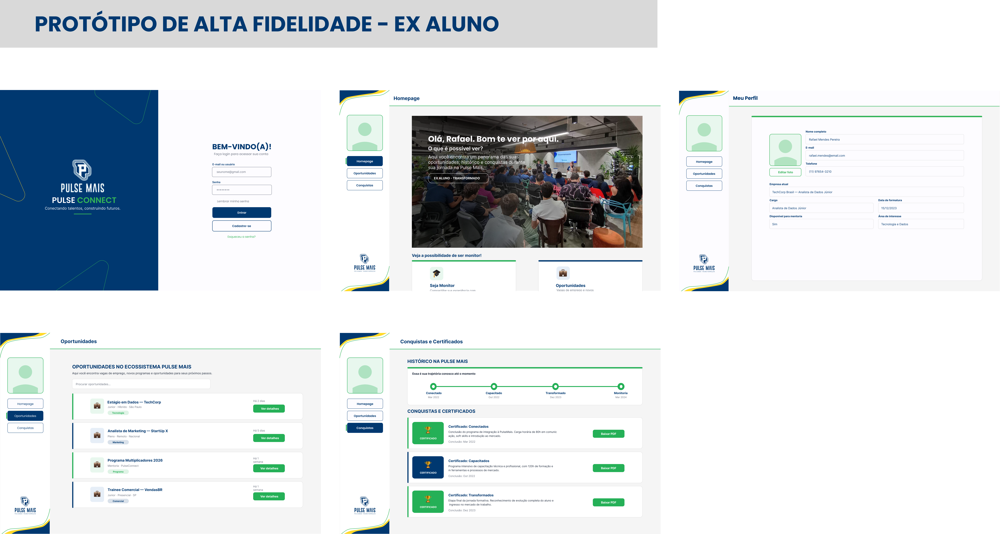
 <figcaption>
   Fonte: Produção dos Autores (2026)
 </figcaption>
  <figcaption>
 <a href="https://www.figma.com/design/goongTbG8aWSrfCfIa2Mbv/Untitled?node-id=0-1&t=fZL0mEnttkl2d05f-1" target="_blank">
   Link de Acesso ao Wireframe
 </a>
</figcaption>
</figure>

**1. Tela: Login**
Tela de entrada da plataforma, onde o ex-aluno realiza o login com suas credenciais de acesso (e-mail e senha). É o ponto de entrada do sistema e está relacionada a todas as User Stories, pois representa o controle de autenticação e perfil de acesso.

**2. Tela: Homepage — Ex-Aluno**
Tela de boas-vindas exibida logo após o login, com saudação personalizada ao ex-aluno e uma visão geral das suas oportunidades, histórico e conquistas durante a jornada na Pulse Mais. Exibe o status do perfil (Ex-Aluno — Transformado) com data de formação, e apresenta dois atalhos principais: Seja Monitor e Oportunidades. Contextualiza o ex-aluno sobre o que está disponível para seu perfil na plataforma.

**3. Tela: Meu Perfil — Ex-Aluno**
Exibe os dados cadastrais do ex-aluno — nome completo, e-mail, telefone, emprego atual, cargo, data de formatura, disponibilidade para mentoria e área de interesse — com a opção de editar foto e salvar alterações. Permite que o ex-aluno mantenha suas informações atualizadas, especialmente as relacionadas à sua situação profissional atual.

**4. Tela: Oportunidades**
Página que reúne vagas de emprego, novos programas e oportunidades do ecossistema Pulse Mais. Exibe listagem com nome da vaga, empresa, nível, localidade, área e tempo de publicação, com botão para ver detalhes de cada oportunidade. Conta também com campo de busca e filtro. Apoia o ex-aluno na continuidade da sua trajetória profissional após a formação.

**5. Tela: Conquistas e Certificados**
Página que exibe a trajetória completa do ex-aluno na Pulse Mais por meio de uma linha do tempo (Conectado, Capacitado, Transformado, Monitoria) e lista os certificados obtidos em cada etapa, com descrição e botão para baixar o PDF de cada um. Permite que o ex-aluno acesse e compartilhe suas conquistas de forma centralizada.

### 3.5.3 Protótipo de Alta Fidelidade Aluno Ativo

<figure style="text-align: center; margin: 1.5rem auto;">
<figcaption>
   Figura 20: Wireframe Desktop Alta Fidelidade (Aluno Ativo)
 </figcaption>
 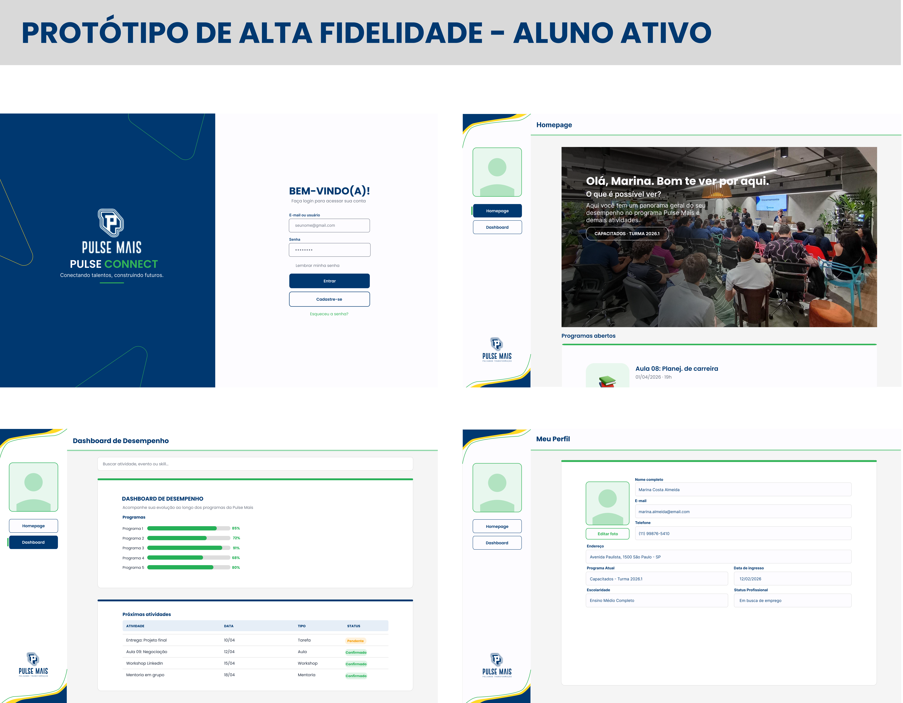
 <figcaption>
   Fonte: Produção dos Autores (2026)
 </figcaption>
  <figcaption>
 <a href="https://www.figma.com/design/goongTbG8aWSrfCfIa2Mbv/Untitled?node-id=0-1&t=fZL0mEnttkl2d05f-1" target="_blank">
   Link de Acesso ao Wireframe
 </a>
</figcaption>
</figure>

**1. Tela: Login**
Tela de entrada da plataforma, onde o aluno ativo realiza o login com suas credenciais de acesso (e-mail e senha). É o ponto de entrada do sistema e está relacionada a todas as User Stories, pois representa o controle de autenticação e perfil de acesso.

**2. Tela: Homepage — Aluno Ativo**
Tela de boas-vindas exibida logo após o login, com saudação personalizada ao aluno e uma visão geral do seu desempenho no programa Pulse Mais. Exibe o status do perfil (Conectado — Turma 2026) e apresenta os programas abertos disponíveis em formato de cards, com data, duração e botão para ver detalhes de cada um. Orienta o aluno sobre as atividades disponíveis e seu momento atual na plataforma.

**3. Tela: Meu Perfil — Aluno Ativo**
Exibe os dados cadastrais do aluno — nome completo, e-mail, telefone, endereço, programa atual, data de ingresso, escolaridade e status profissional — com a opção de editar foto e salvar alterações. Permite que o aluno mantenha suas informações pessoais e acadêmicas atualizadas durante sua participação no programa.

**4. Tela: Dashboard de Desempenho**
Painel individual do aluno exibindo seu progresso ao longo da jornada na Pulse Mais. Apresenta barras de evolução para soft skills (Comunicação, Liderança, Trabalho em equipe, Resolução de problemas, Adaptabilidade) e hard skills com gráfico de barras por evento. Exibe também uma tabela de próximas atividades com nome, data, tipo e status de cada uma. Permite que o aluno acompanhe sua evolução de forma visual e se organize para as próximas etapas do programa

### 3.5.4 Funcionalidades Não Prototipadas — Backlog de Design

Durante o desenvolvimento do protótipo de alta fidelidade, duas funcionalidades previstas no escopo da coordenadora não foram incluídas no fluxo navegável do Figma. Ambas estão documentadas abaixo como backlog de design, com escopo funcional definido para orientar a implementação visual em iterações futuras.

#### Gestão de Mentores

A Gestão de Mentores é uma funcionalidade voltada exclusivamente para o perfil da Coordenadora (Camila), responsável por cadastrar, editar e acompanhar os mentores vinculados à plataforma. Sua ausência no protótipo atual foi reconhecida pelo grupo e representa uma lacuna na jornada completa da coordenadora.

**Telas previstas:**

**1. Tela: Lista de Mentores**
Listagem paginada dos mentores cadastrados, exibindo nome, especialidade, número de mentorias realizadas e status de disponibilidade. Conta com campo de busca e filtro por área de atuação. Ponto de entrada para o gerenciamento individual de cada mentor.

> **Caminho de navegação previsto:** Sidebar → "Mentores"

**2. Tela: Cadastro / Edição de Mentor**
Formulário de registro de novo mentor ou edição de mentor existente, com campos de dados pessoais (nome, e-mail, telefone), dados profissionais (empresa, cargo, área de atuação) e configuração de disponibilidade para mentorias. Permite também a inserção de observações privadas visíveis apenas à coordenação.

**3. Tela: Perfil do Mentor**
### 3.5.5 Protótipo de Alta Fidelidade Mentor

<figure style="text-align: center; margin: 1.5rem auto;">
  <figcaption>
    Figura 21: Wireframe Desktop Alta Fidelidade (Mentor)
  </figcaption>
  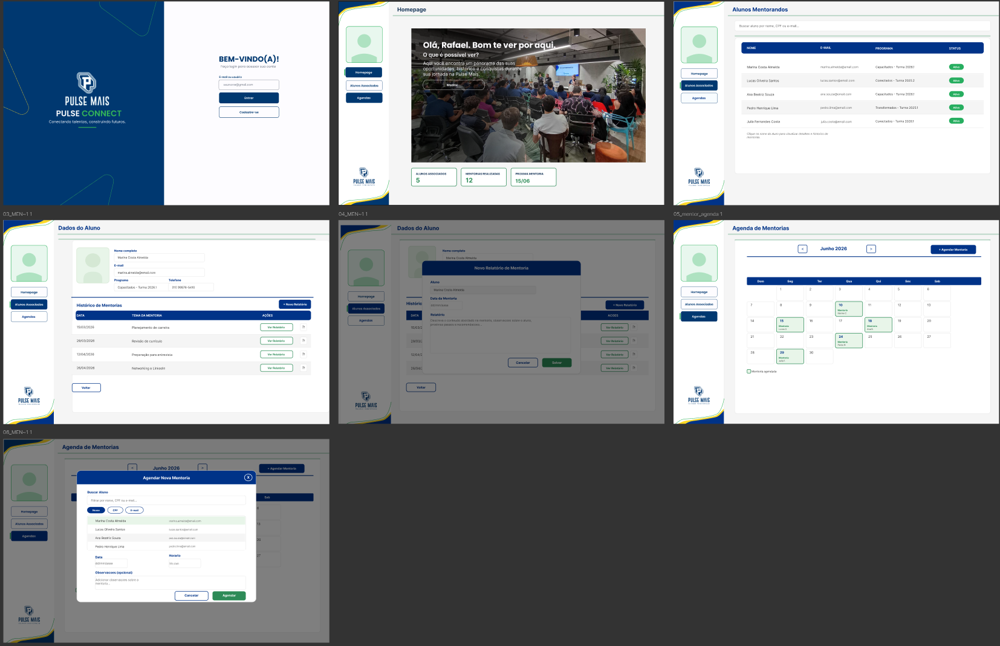
  <figcaption>
    Fonte: Produção dos Autores (2026)
  </figcaption>
  <figcaption>
    <a href="https://www.figma.com/design/tbywXDgyQnEVAlPvYls3Vw/telas_mentor?node-id=0-1&p=f&t=rgnrJDEf5Vt9xezi-0" target="_blank">
      Link de Acesso ao protótipo
    </a>
  </figcaption>
</figure>

**1. Tela: Homepage — Mentor**
Tela de boas-vindas exibida após o login do mentor, com saudação personalizada e
descrição das funcionalidades disponíveis para esse perfil. Apresenta três cards de
métricas: total de alunos envolvidos, número de mentorias realizadas e data da próxima
mentoria agendada. Abaixo dos cards, exibe a tabela "Alunos Mentorados" com as colunas
Nome, E-mail, Programa e Status, permitindo acesso rápido aos alunos vinculados. Serve
como painel de controle centralizado para o mentor acompanhar sua atuação na plataforma.

**2. Tela: Alunos Associados**
Listagem completa dos alunos vinculados ao mentor em formato de tabela com as colunas
Nome, E-mail, Programa e Status. Inclui campo de busca por nome, CPF ou e-mail. Clicar
no nome de um aluno navega para seus dados individuais. Centraliza a visão do mentor
sobre os jovens que acompanha, sem dependência de consultas externas ao sistema.

**3. Tela: Dados do Aluno**
Página individual do aluno na perspectiva do mentor, exibindo os dados cadastrais
relevantes — nome completo, e-mail, programa e telefone — em campos de visualização
somente leitura. Abaixo, a seção "Histórico de Mentorias" lista as sessões registradas
em tabela com as colunas Data, Tema da Mentoria e Ações, onde cada linha oferece o botão
"Ver Relatório" e um ícone de documento para acesso ao conteúdo registrado. Inclui botão
"+ Novo Relatório" e botão "Voltar" para retorno à lista de alunos.

**4. Tela: Modal — Novo Relatório de Mentoria**
Modal sobreposto à tela de Dados do Aluno, acionado pelo botão "+ Novo Relatório".
Apresenta cabeçalho em azul institucional com o título em branco. Contém os campos:
Aluno (preenchido automaticamente), Data da Mentoria, Relatório (textarea para registro
do conteúdo abordado e observações) e Encaminhamentos (textarea para ações acordadas).
Botões "Cancelar" e "Salvar" finalizam o fluxo. Garante o registro estruturado de cada
sessão sem abandonar o contexto do aluno.

**5. Tela: Agenda de Mentorias**
Painel de calendário mensal com todas as sessões agendadas pelo mentor no mês
selecionado. O cabeçalho contém navegação entre meses, mês e ano em destaque e o botão
"+ Agendar Mentoria". Dias com sessões marcadas recebem fundo verde claro com o nome
abreviado do aluno e o rótulo "Mentoria". Uma legenda ao rodapé identifica o padrão de
marcação. Apoia o planejamento de sessões e a gestão do tempo do mentor.

**6. Tela: Modal — Agendar Nova Mentoria**
Modal sobreposto à Agenda, acionado pelo botão "+ Agendar Mentoria". Apresenta cabeçalho
azul com título e botão de fechar (ícone X). Contém campo de busca de aluno com pills de
filtro selecionáveis (Nome, CPF, E-mail) e lista de resultados com destaque na linha
selecionada. Abaixo, campos Data e Horário lado a lado, seguidos de textarea opcional de
Observações. Botões "Cancelar" e "Agendar" encerram o fluxo. Permite registrar uma nova
sessão sem sair da tela de agenda.
## 3.6. Modelagem do banco de dados

### 3.6.1. Modelo Entidade-Relacionamento (ER)

#### Introdução ao Modelo Entidade-Relacionamento (ER)

O Modelo ER é a representação conceitual da estrutura do banco de dados. Ele funciona como uma planta arquitetônica que define como as informações serão organizadas, garantindo que o sistema seja eficiente e confiável. Sua importância reside na capacidade de transformar regras de negócio complexas em uma estrutura de dados padronizada, evitando falhas de comunicação entre a equipe de desenvolvimento e a organização.

#### Função do Modelo no Projeto Pulse Mais

No contexto da Pulse Mais, o Modelo ER é a base para a criação da "Única Fonte da Verdade" (SSOT). Sua função principal é eliminar a fragmentação de dados atualmente dispersos em planilhas e mensagens de WhatsApp, permitindo que a instituição tenha uma visão consolidada da jornada do jovem, desde o primeiro contato até a sua inserção no mercado de trabalho.

<div align="center">
  <p><strong>Figura 22: Modelo Entidade-Relacionamento — Notação Chen</strong></p>

  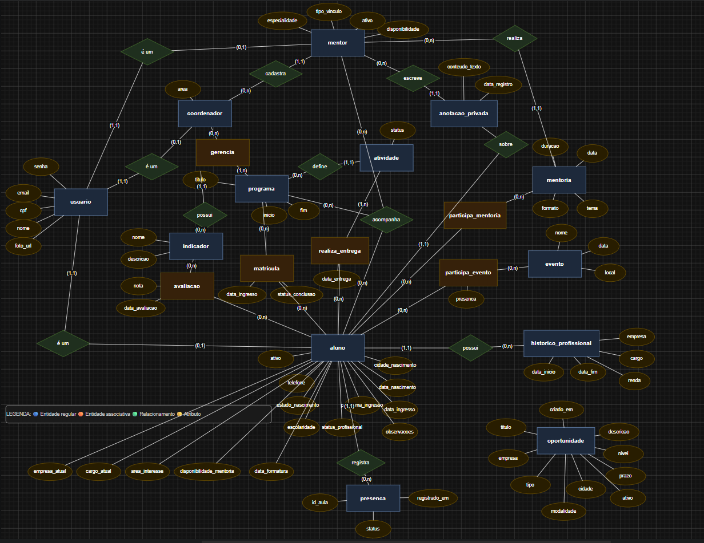

  <p>Fonte: Produção dos autores (2026) </p>
</div>

> **Nota de atualização (sprint 4):** o modelo foi revisado para refletir as alterações do banco de dados — inclusão das entidades `oportunidade` e `presenca`, dos novos atributos de perfil profissional em `aluno` (Portal do Ex-Aluno, RF005) e da troca do vínculo direto aluno-mentor pela entidade associativa `acompanha`. A imagem `modeloER_chen.png` acima deve ser regerada para incorporar essas mudanças; as tabelas a seguir já estão atualizadas e servem como referência canônica.

#### Legenda do Diagrama

**Notação Visual (Notação Chen)**

| Símbolo | Cor | Significado |
|---|---|---|
| Retângulo | Azul | Entidade regular (forte) — possui identidade própria no domínio |
| Retângulo | Laranja | Entidade associativa — representa um relacionamento N:N que possui atributos próprios |
| Losango | Verde | Relacionamento — descreve a associação entre duas ou mais entidades |
| Elipse | Amarela | Atributo — propriedade de uma entidade ou de um relacionamento |
| Linha | — | Conexão entre entidade e atributo, ou entre entidade e relacionamento |

**Cardinalidade (min, max)**

| Notação | Significado |
|---|---|
| (0,1) | Participação opcional, no máximo um |
| (1,1) | Participação obrigatória, exatamente um |
| (0,n) | Participação opcional, pode haver múltiplos |
| (1,n) | Participação obrigatória, deve haver ao menos um |

**Entidades Regulares**

| Entidade | Atributos principais | Descrição |
|---|---|---|
| `usuario` | `nome`, `email`, `senha`, `cpf`, `foto_url` | Ponto de entrada de qualquer pessoa no sistema; base para todos os perfis |
| `coordenador` | `area` | Especialização de `usuario`; gerencia programas e supervisiona mentores |
| `mentor` | `tipo_vinculo`, `disponibilidade`, `especialidade`, `ativo` | Especialização de `usuario`; orienta alunos dentro de programas |
| `aluno` | `ativo`, `telefone`, `data_nascimento`, `cidade_nascimento`, `estado_nascimento`, `programa_ingresso`, `data_ingresso`, `escolaridade`, `status_profissional`, `observacoes`, `empresa_atual`, `cargo_atual`, `area_interesse`, `disponibilidade_mentoria`, `data_formatura` | Especialização de `usuario`; jovem atendido pela ONG. Os últimos cinco atributos suportam o Portal do Ex-Aluno (RF005) |
| `programa` | `titulo`, `inicio`, `fim` | Trilha formativa oferecida pela ONG com período definido |
| `atividade` | `nome`, `descricao`, `data_entrega` | Tarefa pertencente a um programa, com prazo de entrega |
| `indicador` | `nome`, `descricao` | Critério de avaliação de qualidade vinculado a um programa |
| `mentoria` | `formato`, `tema`, `duracao`, `data` | Sessão de orientação realizada por um mentor |
| `evento` | `nome`, `data`, `local` | Atividade aberta para participação dos alunos |
| `anotacao_privada` | `conteudo_texto`, `data_registro` | Registro confidencial feito por um mentor sobre um aluno específico |
| `historico_profissional` | `data_inicio`, `data_fim`, `cargo`, `empresa`, `renda` | Experiências de carreira do aluno para mensuração de impacto da ONG |
| `presenca` | `id_aula`, `status`, `registrado_em` | Registro de frequência de um aluno em uma aula (`presente`/`ausente`), com par aluno+aula único |
| `oportunidade` | `titulo`, `empresa`, `tipo`, `modalidade`, `cidade`, `descricao`, `nivel`, `prazo`, `ativo`, `criado_em` | Catálogo de vagas, eventos, estágios e bolsas divulgados aos ex-alunos (RF005); entidade independente |

**Entidades Associativas**

| Entidade | Entidades conectadas | Atributos | Descrição |
|---|---|---|---|
| `gerencia` | `coordenador` ↔ `programa` | — | Vínculo N:N entre coordenador e programa |
| `avaliacao` | `aluno` ↔ `indicador` | `nota`, `data_avaliacao` | Nota de um aluno em um critério de avaliação |
| `matricula` | `aluno` ↔ `programa` | `status_conclusao`, `data_ingresso` | Inscrição e acompanhamento de um aluno em um programa |
| `realiza_entrega` | `aluno` ↔ `atividade` | `data_entrega` | Entrega de uma atividade por um aluno |
| `participa_mentoria` | `aluno` ↔ `mentoria` | — | Participação de um aluno em uma sessão de mentoria |
| `participa_evento` | `aluno` ↔ `evento` | `presenca` | Participação e confirmação de presença de um aluno em evento |

**Relacionamentos**

| Relacionamento | Entidades | Cardinalidade | Descrição |
|---|---|---|---|
| `é um` | `usuario` → `coordenador` / `mentor` / `aluno` | (1,1) : (0,1) | Herança de especialização — um usuário pode assumir um dos três perfis |
| `cadastra` | `coordenador` → `mentor` | (0,n) : (1,1) | Um coordenador supervisiona múltiplos mentores; cada mentor tem exatamente um coordenador |
| `escreve` | `mentor` → `anotacao_privada` | (0,n) : (1,1) | Um mentor pode escrever múltiplas anotações privadas |
| `sobre` | `anotacao_privada` → `aluno` | (0,n) : (1,1) | Cada anotação é sobre um aluno específico |
| `possui` | `programa` → `indicador` | (1,1) : (0,n) | Um programa possui múltiplos indicadores de avaliação |
| `define` | `programa` → `atividade` | (1,1) : (0,n) | Um programa define múltiplas atividades |
| `acompanha` *(ternário)* | `mentor` + `aluno` + `programa` | (0,n) : (0,n) : (0,n) | Um mentor acompanha um aluno dentro de um programa específico |
| `realiza` | `mentor` → `mentoria` | (0,n) : (1,1) | Um mentor realiza múltiplas sessões de mentoria |
| `possui` | `aluno` → `historico_profissional` | (1,1) : (0,n) | Um aluno pode ter múltiplos registros de histórico profissional |
| `registra` | `aluno` → `presenca` | (1,1) : (0,n) | Um aluno acumula múltiplos registros de presença em aulas |

> A entidade `oportunidade` não possui relacionamentos no modelo: funciona como um catálogo independente de vagas, eventos, estágios e bolsas consultado pelos ex-alunos.

#### Explicação das Entidades

As entidades representam os objetos ou conceitos centrais do sistema:

**Usuário, Aluno, Coordenador e Mentor:**
O modelo utiliza uma estrutura de especialização. Todos partem da entidade "Usuário", mas cada um possui papéis e dados distintos.

**Programa, Evento e Mentoria:** Representam as frentes de atuação da ONG. O "Programa" é a estrutura maior (cursos), enquanto "Eventos" e "Mentorias" são as interações práticas da formação.

**Histórico Profissional:** Entidade estratégica para o monitoramento de impacto a longo prazo, focada em empregabilidade e retenção no mercado. O conceito de "ex-aluno" não é uma entidade separada: ele é representado pelo atributo `ativo` da entidade `aluno` (que distingue alunos ativos de egressos), pelos atributos de perfil profissional do egresso (`empresa_atual`, `cargo_atual`, `area_interesse`, `disponibilidade_mentoria`, `data_formatura`) e pelos registros de `historico_profissional` acumulados ao longo da trajetória do jovem.

**Presença e Oportunidade:** A entidade `presenca` registra a frequência do aluno por aula (`presente`/`ausente`), garantindo unicidade por par aluno+aula e alimentando relatórios de assiduidade. A entidade `oportunidade` é um catálogo independente de vagas, eventos, estágios e bolsas voltado aos ex-alunos (RF005), não estabelecendo relacionamentos estruturais com as demais entidades.

#### Significado e Função dos Atributos

Os atributos são os detalhes que permitem a análise de indicadores de impacto: **Identificação e Acesso:** `nome`, `email`, `senha` e `cpf` na entidade `usuario` garantem a segurança e a personalização do acesso. **Perfil Socioeconômico:** atributos como `escolaridade`, `status_profissional`, `data_nascimento` e `cidade_nascimento`/`estado_nascimento` na entidade `aluno` permitem caracterizar o perfil do jovem e medir a transformação social gerada pela Pulse Mais. **Histórico Acadêmico e Profissional:** na entidade `historico_profissional`, campos como `data_inicio`, `data_fim`, `cargo`, `empresa` e `renda` são essenciais para gerar os dashboards de empregabilidade desejados pela coordenação. **Dados Qualitativos:** o atributo `conteudo_texto` na entidade `anotacao_privada` permite um atendimento humanizado e consultivo, registrando anotações de mentoria visíveis apenas ao Coordenador e ao Mentor autor do relato.

#### Relacionamentos e Cardinalidades

Os relacionamentos definem como as entidades interagem, e as cardinalidades estabelecem as regras dessas trocas:

**Jornada de Formação (N:N):** Um Aluno pode estar matriculado em vários Programas e participar de diversos Eventos. No diagrama, isso é representado pelo símbolo (0,n), indicando que a participação é flexível e acumulativa ao longo dos anos.

**Ciclo de Vida (1:N):** A evolução do jovem é registrada pela relação entre `aluno` e `historico_profissional`: um aluno acumula múltiplos registros de experiência profissional ao longo do tempo (0,n). A transição para egresso não cria um novo registro, e sim altera o atributo `ativo` do próprio aluno, preservando todo o seu histórico para fins de mensuração de impacto.

**Gestão e Mentoria (1:N):** Um Coordenador gerencia múltiplos programas, enquanto um Mentor pode oferecer diversas sessões de mentoria. Isso organiza a hierarquia de responsabilidades dentro da plataforma.

#### Conclusão

A modelagem apresentada é o que permite que o sistema deixe de ser apenas um repositório de nomes e se torne uma ferramenta de inteligência. Ao estruturar os dados desta forma, a Pulse Mais ganha agilidade na tomada de decisão e a capacidade de agir preventivamente para evitar a evasão de talentos, garantindo que a tecnologia sirva ao propósito de transformar trajetórias por meio da educação.

### 3.6.2. Diagrama Entidade-Relacionamento (DER)

#### Introdução ao Diagrama Entidade-Relacionamento (DER)

O Diagrama ER é como a "planta baixa" visual do nosso sistema. Ele mostra, através de tabelas e linhas, como todas as informações serão organizadas e conectadas no banco de dados. Ter esse mapeamento visual garante que o sistema funcione de forma rápida, sem erros e que a equipe de tecnologia saiba exatamente o que precisa ser construído, evitando falhas de comunicação

#### Diagrama

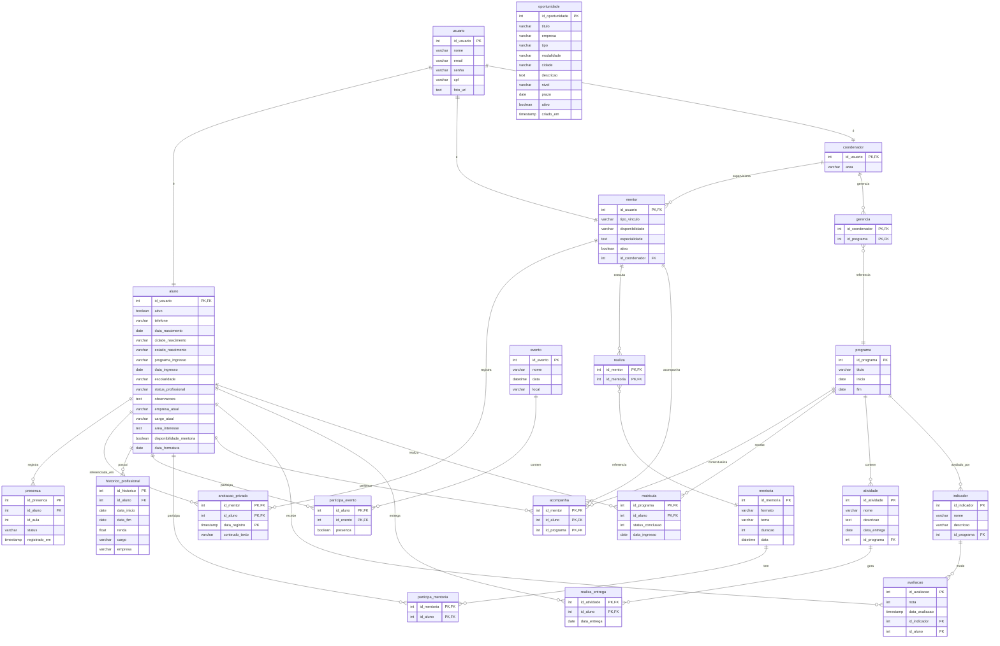
```mermaid
erDiagram

    usuario {
        int id_usuario PK
        varchar nome
        varchar email
        varchar senha
        varchar cpf
        text foto_url
    }

    coordenador {
        int id_usuario PK, FK
        varchar area
    }

    mentor {
        int id_usuario PK, FK
        varchar tipo_vinculo
        varchar disponibilidade
        text especialidade
        boolean ativo
        int id_coordenador FK
    }

    aluno {
        int id_usuario PK, FK
        boolean ativo
        varchar telefone
        date data_nascimento
        varchar cidade_nascimento
        varchar estado_nascimento
        varchar programa_ingresso
        date data_ingresso
        varchar escolaridade
        varchar status_profissional
        text observacoes
        varchar empresa_atual
        varchar cargo_atual
        text area_interesse
        boolean disponibilidade_mentoria
        date data_formatura
    }

    programa {
        int id_programa PK
        varchar titulo
        date inicio
        date fim
    }

    atividade {
        int id_atividade PK
        varchar nome
        text descricao
        date data_entrega
        int id_programa FK
    }

    indicador {
        int id_indicador PK
        varchar nome
        varchar descricao
        int id_programa FK
    }

    mentoria {
        int id_mentoria PK
        varchar formato
        varchar tema
        int duracao
        datetime data
    }

    evento {
        int id_evento PK
        varchar nome
        datetime data
        varchar local
    }

    anotacao_privada {
        int id_mentor PK, FK
        int id_aluno PK, FK
        timestamp data_registro PK
        varchar conteudo_texto
    }

    gerencia {
        int id_coordenador PK, FK
        int id_programa PK, FK
    }

    avaliacao {
        int id_avaliacao PK
        int nota
        timestamp data_avaliacao
        int id_indicador FK
        int id_aluno FK
    }

    matricula {
        int id_programa PK, FK
        int id_aluno PK, FK
        int status_conclusao
        date data_ingresso
    }

    realiza_entrega {
        int id_atividade PK, FK
        int id_aluno PK, FK
        date data_entrega
    }

    participa_evento {
        int id_aluno PK, FK
        int id_evento PK, FK
        boolean presenca
    }

    acompanha {
        int id_mentor PK, FK
        int id_aluno PK, FK
        int id_programa PK, FK
    }

    realiza {
        int id_mentor PK, FK
        int id_mentoria PK, FK
    }

    participa_mentoria {
        int id_mentoria PK, FK
        int id_aluno PK, FK
    }

    historico_profissional {
        int id_historico PK
        int id_aluno FK
        date data_inicio
        date data_fim
        float renda
        varchar cargo
        varchar empresa
    }

    presenca {
        int id_presenca PK
        int id_aluno FK
        int id_aula
        varchar status
        timestamp registrado_em
    }

    oportunidade {
        int id_oportunidade PK
        varchar titulo
        varchar empresa
        varchar tipo
        varchar modalidade
        varchar cidade
        text descricao
        varchar nivel
        date prazo
        boolean ativo
        timestamp criado_em
    }

    %% Herança de usuario
    usuario ||--|| coordenador : "é"
    usuario ||--|| mentor : "é"
    usuario ||--|| aluno : "é"

    %% Coordenador
    coordenador ||--o{ gerencia : "gerencia"
    coordenador ||--o{ mentor : "supervisiona"

    %% Programa
    gerencia }o--|| programa : "referencia"
    programa ||--o{ indicador : "avaliado_por"
    programa ||--o{ atividade : "contem"
    programa ||--o{ matricula : "recebe"
    programa ||--o{ acompanha : "contextualiza"

    %% Indicador e Avaliacao
    indicador ||--o{ avaliacao : "mede"

    %% Atividade e Entregas
    atividade ||--o{ realiza_entrega : "gera"

    %% Mentor
    mentor ||--o{ acompanha : "acompanha"
    mentor ||--o{ realiza : "executa"
    mentor ||--o{ anotacao_privada : "registra"

    %% Mentoria
    realiza }o--|| mentoria : "referencia"
    mentoria ||--o{ participa_mentoria : "tem"

    %% Aluno — todas as participações
    aluno ||--o{ matricula : "realiza"
    aluno ||--o{ realiza_entrega : "entrega"
    aluno ||--o{ avaliacao : "recebe"
    aluno ||--o{ acompanha : "pertence"
    aluno ||--o{ participa_mentoria : "participa"
    aluno ||--o{ participa_evento : "participa"
    aluno ||--o{ historico_profissional : "possui"
    aluno ||--o{ anotacao_privada : "referenciada_em"
    aluno ||--o{ presenca : "registra"

    %% Evento
    evento ||--o{ participa_evento : "contem"

    %% oportunidade é entidade independente (catálogo), sem relacionamentos
```

---

#### Domínio de Pessoas

##### `usuario`
Ponto de entrada de todos no sistema. Qualquer pessoa — seja aluno, mentor ou coordenador — começa com um cadastro de `usuario`, que armazena as credenciais de acesso (`email`, `senha`) e dados de identificação pessoal (`nome`, `cpf`). O campo `id_usuario` é a chave primária que liga essa tabela às tabelas especializadas.

##### `coordenador`
Especialização de `usuario` para quem coordena programas. Além do vínculo com `usuario` via `id_usuario` (FK), armazena a `area` de atuação do coordenador dentro da ONG. Um coordenador pode gerenciar múltiplos programas e supervisionar múltiplos mentores.

##### `mentor`
Especialização de `usuario` para quem realiza mentorias. O campo `id_usuario` é simultaneamente PK e FK, garantindo que cada mentor tenha exatamente um perfil de usuário. Armazena o `tipo_vinculo` (ex: voluntário, contratado), a `disponibilidade` de horários para facilitar agendamentos e o `id_coordenador` que indica qual coordenador supervisiona esse mentor.

##### `aluno`
Especialização de `usuario` para os jovens atendidos pela ONG. Vincula-se a `usuario` via `id_usuario` (PK e FK simultâneos). O vínculo aluno-mentor não é mais um elo direto na tabela `aluno`: ele é resolvido pela tabela associativa `acompanha` (mentor + aluno + programa), permitindo que o acompanhamento ocorra no contexto de um programa específico. A tabela guarda ainda os atributos de perfil socioeconômico e, para o Portal do Ex-Aluno (RF005), os campos `empresa_atual`, `cargo_atual`, `area_interesse`, `disponibilidade_mentoria` e `data_formatura`.

---

#### Domínio de Educação

##### `programa`
É o curso principal oferecido pela ONG. Armazena o `titulo` e as datas de `inicio` e `fim`. O vínculo com indicadores e atividades é 1:N e fica registrado nas tabelas filhas (`indicador.id_programa` e `atividade.id_programa`), não em FKs de volta no próprio `programa`. Um programa é a estrutura-mãe que organiza atividades, eventos e mentorias.

##### `atividade`
Representa as tarefas que compõem um programa. Cada atividade tem `nome`, `descricao` e `data_entrega`, e pertence a um programa via `id_programa` (FK). As atividades são o elemento mais granular de avaliação do esforço do aluno no dia a dia.

##### `indicador`
Define os critérios de avaliação de qualidade de um programa. O campo `nome` descreve o que está sendo medido (ex: taxa de presença, nota média), `descricao` detalha o critério e `id_programa` vincula o indicador ao seu programa. Os indicadores são a base sobre a qual as avaliações são construídas.

##### `mentoria`
Representa uma sessão de mentoria. Armazena o `formato` (ex: online, presencial), o `tema` abordado, a `duracao` em minutos, a `data` da sessão e o `id_mentoria` como chave primária. Uma mesma mentoria pode ter múltiplos alunos participando.

##### `evento`
Representa aulas coletivas ou encontros do programa. Armazena o `nome` do evento, a `data`, o `local` e o `id_evento` como chave primária. Eventos são diferentes de mentorias por serem coletivos e não terem um mentor designado individualmente.

---

#### Domínio de Acompanhamento

##### `anotacao_privada`
Espaço seguro para que mentores registrem observações sobre seus alunos. Os campos `conteudo_texto` e `data_registro` guardam o conteúdo e a data da anotação, enquanto `id_mentor` e `id_aluno` (ambos FK) identificam quem escreveu e sobre quem. Essas anotações são privadas e servem para monitorar a evolução técnica e emocional do jovem.

---

#### Domínio de Mercado de Trabalho

##### `historico_profissional`
Tabela fundamental para medir o impacto real da ONG. Vinculada ao aluno via `id_aluno` (FK), registra cada experiência profissional com `data_inicio`, `data_fim`, `renda`, `cargo` e `empresa`. É com esses dados que a Pulse Mais prova, com números, que os jovens formados estão entrando no mercado de trabalho e aumentando sua renda.

##### `oportunidade`
Catálogo de vagas, eventos, estágios e bolsas de estudo divulgados aos ex-alunos no Portal do Ex-Aluno (RF005). Armazena `titulo`, `empresa`, `tipo` (restrito a `Vaga`, `Evento`, `Estágio` ou `Bolsa de Estudo`), `modalidade`, `cidade`, `descricao`, `nivel`, `prazo`, `ativo` e `criado_em`. É uma entidade independente, sem chaves estrangeiras para as demais tabelas: funciona como mural de oportunidades consultado pelos egressos.

---

#### Domínio de Acompanhamento Acadêmico

##### `presenca`
Registra a frequência do aluno por aula. Vinculada ao aluno via `id_aluno` (FK), guarda `id_aula` (identificador da aula), `status` (`presente` ou `ausente`) e `registrado_em`. A restrição de unicidade sobre o par `id_aluno` + `id_aula` impede registros duplicados de frequência para a mesma aula, viabilizando relatórios confiáveis de assiduidade.

---

#### Domínio de Controle

##### `avaliacao`
Registra a avaliação de um aluno em um determinado indicador. O campo `nota` guarda a pontuação (validada na escala de 1 a 5 pela constraint `chk_avaliacao_nota`) e `data_avaliacao` registra o momento da avaliação. A tabela cruza duas entidades — `indicador` e `aluno` — via `id_indicador` e `id_aluno`, permitindo relatórios detalhados de desempenho e qualidade pedagógica.

---

#### Tabelas de Relacionamento (Laranjas — N:N com dados próprios)

##### `gerencia`
Resolve o relacionamento muitos-para-muitos entre `coordenador` e `programa`: um coordenador pode gerenciar vários programas, e um programa pode ter mais de um coordenador responsável. A chave primária composta é formada por `id_coordenador` + `id_programa`.

##### `matricula`
Relaciona alunos e programas, registrando o momento em que um jovem entra em um curso. Além da chave composta (`id_programa` + `id_aluno`), armazena o `status_conclusao` (ex: em andamento, concluído, evadido) e a `data_ingresso`. É com esses dados que a equipe detecta risco de evasão.

##### `realiza_entrega`
Registra a entrega de uma atividade por um aluno. A chave composta (`id_atividade` + `id_aluno`) garante unicidade, e `data_entrega` permite acompanhar a pontualidade e o engajamento de cada jovem ao longo do programa.

##### `participa_evento`
Relaciona alunos e eventos, registrando presença. O campo `presenca` (booleano) permite gerar relatórios de frequência que ajudam a identificar alunos com risco de abandono.

---

#### Tabelas de Relacionamento (Verdes — N:N simples)

##### `acompanha`
Liga cada mentor ao(s) aluno(s) que ele acompanha dentro de um programa específico. A chave composta (`id_mentor` + `id_aluno` + `id_programa`) permite que a coordenação saiba exatamente quem está apoiando quem e em qual contexto, viabilizando uma gestão clara da rede de mentoria.

##### `realiza`
Associa mentores às sessões de mentoria que eles conduziram. A chave composta (`id_mentor` + `id_mentoria`) permite rastrear a produtividade e o histórico de cada mentor dentro do sistema.

##### `participa_mentoria`
Registra quais alunos participaram de cada sessão de mentoria. A chave composta (`id_mentoria` + `id_aluno`) permite acompanhar a jornada do aluno nas mentorias ao longo do tempo.

---

#### Como tudo se conecta

O núcleo do sistema é o aluno. A tabela `aluno` se conecta a praticamente todas as outras: ela é matriculada em programas (`matricula`), entrega atividades (`realiza_entrega`), participa de mentorias (`participa_mentoria`) e eventos (`participa_evento`), é avaliada (`avaliacao`), recebe acompanhamento de um mentor (`acompanha`) e acumula um histórico profissional (`historico_profissional`). Esse hub central é o que permite à ONG ver a jornada completa de cada jovem em um único lugar.

O segundo eixo de conexão é o `programa`, que organiza as atividades, define os indicadores de qualidade e recebe as matrículas dos alunos. O terceiro eixo é o `coordenador`, responsável por gerenciar programas, supervisionar mentores e aplicar avaliações.

---


### 3.6.3. Modelo Relacional e Modelo Físico

O modelo relacional é a representação lógica das tabelas do banco de dados, mostrando as colunas, chaves primárias, chaves estrangeiras e relacionamentos entre as entidades. Ele é a ponte entre o diagrama entidade-relacionamento (modelo conceitual) e o SQL real (modelo físico), traduzindo as entidades em tabelas e os relacionamentos em chaves estrangeiras e tabelas de junção.

#### Modelo Relacional:

**usuario** (<u>id_usuario</u>, nome, email\*, senha, cpf\*, foto_url)

- email é UNIQUE
- cpf é UNIQUE

**coordenador** (<u>id_usuario</u>, area, telefone, cargo, data_admissao, cidade_nascimento, estado_nascimento)

- id_usuario → usuario(id_usuario) [PK e FK simultâneos]

**mentor** (<u>id_usuario</u>, tipo_vinculo, disponibilidade, especialidade, ativo, id_coordenador)

- id_usuario → usuario(id_usuario) [PK e FK simultâneos]
- id_coordenador → coordenador(id_usuario)

**aluno** (<u>id_usuario</u>, ativo, telefone, data_nascimento, cidade_nascimento, estado_nascimento, programa_ingresso, data_ingresso, escolaridade, status_profissional, observacoes, empresa_atual, cargo_atual, area_interesse, disponibilidade_mentoria, data_formatura)

- id_usuario → usuario(id_usuario) [PK e FK simultâneos]
- O vínculo aluno-mentor é resolvido pela tabela `acompanha` (mentor, aluno, programa)

**programa** (<u>id_programa</u>, titulo, inicio, fim)

**indicador** (<u>id_indicador</u>, nome, descricao, id_programa)

- id_programa → programa(id_programa)

**avaliacao** (<u>id_avaliacao</u>, nota, data_avaliacao, id_indicador, id_aluno)

- id_indicador → indicador(id_indicador)
- id_aluno → aluno(id_usuario)

**atividade** (<u>id_atividade</u>, nome, descricao, data_entrega, id_programa)

- id_programa → programa(id_programa)

**evento** (<u>id_evento</u>, nome, data, local)

**mentoria** (<u>id_mentoria</u>, formato, tema, duracao, data)

**historico_profissional** (<u>id_historico</u>, id_aluno, data_inicio, data_fim, renda, cargo, empresa)

- id_aluno → aluno(id_usuario)

**gerencia** (<u>id_coordenador</u>, <u>id_programa</u>)

- id_coordenador → coordenador(id_usuario)
- id_programa → programa(id_programa)

**matricula** (<u>id_programa</u>, <u>id_aluno</u>, status_conclusao, data_ingresso)

- id_programa → programa(id_programa)
- id_aluno → aluno(id_usuario)

**realiza_entrega** (<u>id_atividade</u>, <u>id_aluno</u>, data_entrega)

- id_atividade → atividade(id_atividade)
- id_aluno → aluno(id_usuario)

**participa_evento** (<u>id_evento</u>, <u>id_aluno</u>, presenca)

- id_evento → evento(id_evento)
- id_aluno → aluno(id_usuario)

**participa_mentoria** (<u>id_mentoria</u>, <u>id_aluno</u>)

- id_mentoria → mentoria(id_mentoria)
- id_aluno → aluno(id_usuario)

**acompanha** (<u>id_mentor</u>, <u>id_aluno</u>, <u>id_programa</u>)

- id_mentor → mentor(id_usuario)
- id_aluno → aluno(id_usuario)
- id_programa → programa(id_programa)

**realiza** (<u>id_mentor</u>, <u>id_mentoria</u>)

- id_mentor → mentor(id_usuario)
- id_mentoria → mentoria(id_mentoria)

**anotacao_privada** (<u>id_mentor</u>, <u>id_aluno</u>, <u>data_registro</u>, conteudo_texto)

- id_mentor → mentor(id_usuario)
- id_aluno → aluno(id_usuario)

> Decisão do grupo: o autor de `anotacao_privada` é o Mentor. O modelo já refletia essa escolha desde o início. Nenhuma alteração estrutural foi necessária.

**presenca** (<u>id_presenca</u>, id_aluno, id_aula, status, registrado_em)

- id_aluno → aluno(id_usuario)
- (id_aluno, id_aula) é UNIQUE
- status ∈ {presente, ausente}

**oportunidade** (<u>id_oportunidade</u>, titulo, empresa, tipo, modalidade, cidade, descricao, nivel, prazo, ativo, criado_em)

- tipo ∈ {Vaga, Evento, Estágio, Bolsa de Estudo}
- entidade independente, sem chaves estrangeiras

#### Modelo Físico:

O modelo físico traduz o modelo relacional em DDL (Data Definition Language) PostgreSQL, especificando tipos de dados, restrições de integridade, chaves primárias compostas nas tabelas de junção e índices para as consultas mais frequentes.

```sql

-- BLOCO 1: tabelas base (cadastros principais, sem dependencias)


-- Tabela usuario: guarda dados basicos do usuario
CREATE TABLE usuario (
  id_usuario SERIAL        PRIMARY KEY,
  nome       VARCHAR(100)  NOT NULL,
  email      VARCHAR(150)  NOT NULL,
  senha      VARCHAR(255)  NOT NULL,
  cpf        VARCHAR(11)   NOT NULL,
  foto_url   TEXT,
  CONSTRAINT uq_usuario_email UNIQUE (email),
  CONSTRAINT uq_usuario_cpf   UNIQUE (cpf)
);

-- Tabela programa: programas com datas de inicio e fim
-- A relacao com indicador e atividade e 1:N e esta representada nas tabelas
-- filhas (indicador.id_programa e atividade.id_programa). Programa NAO precisa
-- de FKs de volta para evitar dependencia circular no momento do INSERT.
CREATE TABLE programa (
  id_programa    SERIAL        PRIMARY KEY,
  titulo         VARCHAR(150)  NOT NULL,
  inicio         DATE          NOT NULL,
  fim            DATE          NOT NULL,
  CONSTRAINT chk_programa_periodo CHECK (fim >= inicio)
);

-- Tabela indicador: criterios vinculados ao programa
CREATE TABLE indicador (
  id_indicador   SERIAL        PRIMARY KEY,
  nome           VARCHAR(100)  NOT NULL,
  descricao      TEXT,
  id_programa    INT           NOT NULL,
  CONSTRAINT fk_indicador_programa FOREIGN KEY (id_programa)
    REFERENCES programa (id_programa) ON DELETE CASCADE
);

-- Tabela atividade: atividades vinculadas ao programa
CREATE TABLE atividade (
  id_atividade  SERIAL        PRIMARY KEY,
  nome          VARCHAR(100)  NOT NULL,
  descricao     TEXT,
  data_entrega  DATE          NOT NULL,
  id_programa   INT           NOT NULL,
  CONSTRAINT fk_atividade_programa FOREIGN KEY (id_programa)
    REFERENCES programa (id_programa) ON DELETE CASCADE
);

-- Tabela evento: eventos com data e local
CREATE TABLE evento (
  id_evento      SERIAL        PRIMARY KEY,
  nome           VARCHAR(150)  NOT NULL,
  data           TIMESTAMP     NOT NULL,
  local          VARCHAR(200)  NOT NULL
);

-- Tabela mentoria: encontros com formato, tema, duracao e data
CREATE TABLE mentoria (
  id_mentoria SERIAL        PRIMARY KEY,
  formato     VARCHAR(50)   NOT NULL,
  tema        VARCHAR(100)  NOT NULL,
  duracao     INT           NOT NULL,
  data        TIMESTAMP     NOT NULL
);


-- BLOCO 2: perfis ligados ao usuario


-- Tabela coordenador: perfil de coordenador ligado ao usuario
CREATE TABLE coordenador (
  id_usuario          INT           PRIMARY KEY,
  area                VARCHAR(100)  NOT NULL,
  telefone            VARCHAR(20),
  cargo               VARCHAR(100),
  data_admissao       DATE,
  cidade_nascimento   VARCHAR(100),
  estado_nascimento   VARCHAR(2),
  CONSTRAINT fk_coordenador_usuario FOREIGN KEY (id_usuario)
    REFERENCES usuario (id_usuario) ON DELETE RESTRICT
);

-- Tabela mentor: perfil de mentor vinculado ao coordenador
CREATE TABLE mentor (
  id_usuario      INT           PRIMARY KEY,
  tipo_vinculo    VARCHAR(50)   NOT NULL,
  disponibilidade VARCHAR(100)  NOT NULL,
  especialidade   TEXT,
  ativo           BOOLEAN       NOT NULL DEFAULT TRUE,
  id_coordenador  INT           NOT NULL,
  CONSTRAINT fk_mentor_usuario FOREIGN KEY (id_usuario)
    REFERENCES usuario (id_usuario) ON DELETE RESTRICT,
  CONSTRAINT fk_mentor_coordenador FOREIGN KEY (id_coordenador)
    REFERENCES coordenador (id_usuario) ON DELETE RESTRICT
);

-- Tabela aluno: perfil de aluno ligado ao usuario
-- O vinculo aluno-mentor e gerenciado pela tabela acompanha (N:N com programa).
-- Os campos empresa_atual..data_formatura suportam o Portal do Ex-Aluno (RF005).
CREATE TABLE aluno (
  id_usuario               INT      PRIMARY KEY,
  ativo                    BOOLEAN  NOT NULL DEFAULT TRUE,
  telefone                 VARCHAR(20),
  data_nascimento          DATE,
  cidade_nascimento        VARCHAR(100),
  estado_nascimento        VARCHAR(2),
  programa_ingresso        VARCHAR(100),
  data_ingresso            DATE,
  escolaridade             VARCHAR(100),
  status_profissional      VARCHAR(100),
  observacoes              TEXT,
  empresa_atual            VARCHAR(150),
  cargo_atual              VARCHAR(100),
  area_interesse           TEXT,
  disponibilidade_mentoria BOOLEAN,
  data_formatura           DATE,
  CONSTRAINT fk_aluno_usuario FOREIGN KEY (id_usuario)
    REFERENCES usuario (id_usuario) ON DELETE RESTRICT
);


-- BLOCO 3: historico e anotacoes


-- Tabela historico_profissional: dados de carreira do aluno
CREATE TABLE historico_profissional (
  id_historico SERIAL        PRIMARY KEY,
  id_aluno     INT           NOT NULL,
  data_inicio  DATE          NOT NULL,
  data_fim     DATE,
  renda        NUMERIC(10, 2),
  cargo        VARCHAR(100),
  empresa      VARCHAR(150),
  CONSTRAINT fk_historico_aluno FOREIGN KEY (id_aluno)
    REFERENCES aluno (id_usuario) ON DELETE CASCADE
);

-- Tabela anotacao_privada: registros de mentor sobre aluno
CREATE TABLE anotacao_privada (
  id_mentor      INT       NOT NULL,
  id_aluno       INT       NOT NULL,
  data_registro  TIMESTAMP NOT NULL DEFAULT CURRENT_TIMESTAMP,
  conteudo_texto TEXT      NOT NULL,
  PRIMARY KEY (id_mentor, id_aluno, data_registro),
  CONSTRAINT fk_anotacao_mentor FOREIGN KEY (id_mentor)
    REFERENCES mentor (id_usuario) ON DELETE CASCADE,
  CONSTRAINT fk_anotacao_aluno FOREIGN KEY (id_aluno)
    REFERENCES aluno (id_usuario) ON DELETE CASCADE
);


-- BLOCO 4: tabelas de relacao N:N e registros de jornada


-- Tabela gerencia: ligacao N:N entre coordenador e programa
CREATE TABLE gerencia (
  id_coordenador INT NOT NULL,
  id_programa    INT NOT NULL,
  PRIMARY KEY (id_coordenador, id_programa),
  CONSTRAINT fk_gerencia_coordenador FOREIGN KEY (id_coordenador)
    REFERENCES coordenador (id_usuario) ON DELETE CASCADE,
  CONSTRAINT fk_gerencia_programa FOREIGN KEY (id_programa)
    REFERENCES programa (id_programa) ON DELETE CASCADE
);

-- Tabela matricula: ligacao N:N entre programa e aluno
CREATE TABLE matricula (
  id_programa      INT  NOT NULL,
  id_aluno         INT  NOT NULL,
  status_conclusao INT  NOT NULL,
  data_ingresso    DATE NOT NULL,
  PRIMARY KEY (id_programa, id_aluno),
  CONSTRAINT fk_matricula_programa FOREIGN KEY (id_programa)
    REFERENCES programa (id_programa) ON DELETE CASCADE,
  CONSTRAINT fk_matricula_aluno FOREIGN KEY (id_aluno)
    REFERENCES aluno (id_usuario) ON DELETE CASCADE
);

-- Tabela realiza_entrega: entregas de atividades por aluno
CREATE TABLE realiza_entrega (
  id_atividade INT  NOT NULL,
  id_aluno     INT  NOT NULL,
  data_entrega DATE NOT NULL,
  PRIMARY KEY (id_atividade, id_aluno),
  CONSTRAINT fk_realiza_entrega_atividade FOREIGN KEY (id_atividade)
    REFERENCES atividade (id_atividade) ON DELETE CASCADE,
  CONSTRAINT fk_realiza_entrega_aluno FOREIGN KEY (id_aluno)
    REFERENCES aluno (id_usuario) ON DELETE CASCADE
);

-- Tabela participa_evento: presenca em eventos
CREATE TABLE participa_evento (
  id_evento INT     NOT NULL,
  id_aluno  INT     NOT NULL,
  presenca  BOOLEAN NOT NULL DEFAULT FALSE,
  PRIMARY KEY (id_evento, id_aluno),
  CONSTRAINT fk_participa_evento FOREIGN KEY (id_evento)
    REFERENCES evento (id_evento) ON DELETE CASCADE,
  CONSTRAINT fk_participa_evento_aluno FOREIGN KEY (id_aluno)
    REFERENCES aluno (id_usuario) ON DELETE CASCADE
);

-- Tabela participa_mentoria: presenca em mentorias
CREATE TABLE participa_mentoria (
  id_mentoria INT NOT NULL,
  id_aluno    INT NOT NULL,
  PRIMARY KEY (id_mentoria, id_aluno),
  CONSTRAINT fk_participa_mentoria FOREIGN KEY (id_mentoria)
    REFERENCES mentoria (id_mentoria) ON DELETE CASCADE,
  CONSTRAINT fk_participa_mentoria_aluno FOREIGN KEY (id_aluno)
    REFERENCES aluno (id_usuario) ON DELETE CASCADE
);

-- Tabela acompanha: mentor acompanha aluno no contexto de um programa
CREATE TABLE acompanha (
  id_mentor   INT NOT NULL,
  id_aluno    INT NOT NULL,
  id_programa INT NOT NULL,
  PRIMARY KEY (id_mentor, id_aluno, id_programa),
  CONSTRAINT fk_acompanha_mentor FOREIGN KEY (id_mentor)
    REFERENCES mentor (id_usuario) ON DELETE CASCADE,
  CONSTRAINT fk_acompanha_aluno FOREIGN KEY (id_aluno)
    REFERENCES aluno (id_usuario) ON DELETE CASCADE,
  CONSTRAINT fk_acompanha_programa FOREIGN KEY (id_programa)
    REFERENCES programa (id_programa) ON DELETE CASCADE
);

-- Tabela realiza: mentor realiza mentoria
CREATE TABLE realiza (
  id_mentor   INT NOT NULL,
  id_mentoria INT NOT NULL,
  PRIMARY KEY (id_mentor, id_mentoria),
  CONSTRAINT fk_realiza_mentor FOREIGN KEY (id_mentor)
    REFERENCES mentor (id_usuario) ON DELETE CASCADE,
  CONSTRAINT fk_realiza_mentoria FOREIGN KEY (id_mentoria)
    REFERENCES mentoria (id_mentoria) ON DELETE CASCADE
);

-- Tabela avaliacao: nota de um aluno em um indicador
CREATE TABLE avaliacao (
  id_avaliacao   SERIAL    PRIMARY KEY,
  nota           INT       NOT NULL,
  data_avaliacao TIMESTAMP NOT NULL DEFAULT CURRENT_TIMESTAMP,
  id_indicador   INT       NOT NULL,
  id_aluno       INT       NOT NULL,
  CONSTRAINT fk_avaliacao_indicador FOREIGN KEY (id_indicador)
    REFERENCES indicador (id_indicador) ON DELETE CASCADE,
  CONSTRAINT fk_avaliacao_aluno FOREIGN KEY (id_aluno)
    REFERENCES aluno (id_usuario) ON DELETE CASCADE,
  CONSTRAINT chk_avaliacao_nota CHECK (nota BETWEEN 1 AND 5)
);


-- BLOCO 5: Portal do Ex-Aluno (RF005) e controle de frequencia


-- Tabela oportunidade: vagas, eventos, estagios e bolsas para ex-alunos
-- Entidade independente, sem chaves estrangeiras.
CREATE TABLE oportunidade (
  id_oportunidade SERIAL       PRIMARY KEY,
  titulo          VARCHAR(200) NOT NULL,
  empresa         VARCHAR(150) NOT NULL,
  tipo            VARCHAR(50)  NOT NULL,
  modalidade      VARCHAR(50)  NOT NULL,
  cidade          VARCHAR(100),
  descricao       TEXT,
  nivel           VARCHAR(50),
  prazo           DATE         NOT NULL,
  ativo           BOOLEAN      NOT NULL DEFAULT TRUE,
  criado_em       TIMESTAMP             DEFAULT NOW(),
  CONSTRAINT chk_oportunidade_tipo CHECK (
    tipo IN ('Vaga', 'Evento', 'Estágio', 'Bolsa de Estudo')
  )
);

-- Tabela presenca: registro de frequencia de aluno por aula
-- id_aula refere-se ao identificador da aula (hardcoded no frontend ate existir tabela de aulas).
CREATE TABLE presenca (
  id_presenca   SERIAL       PRIMARY KEY,
  id_aluno      INT          NOT NULL,
  id_aula       INT          NOT NULL,
  status        VARCHAR(10)  NOT NULL,
  registrado_em TIMESTAMP    NOT NULL DEFAULT NOW(),
  CONSTRAINT uq_presenca_aluno_aula UNIQUE (id_aluno, id_aula),
  CONSTRAINT chk_presenca_status    CHECK  (status IN ('presente', 'ausente')),
  CONSTRAINT fk_presenca_aluno      FOREIGN KEY (id_aluno)
    REFERENCES aluno (id_usuario) ON DELETE CASCADE
);


-- INDICES: aceleram consultas em campos usados nos filtros


CREATE INDEX idx_usuario_email ON usuario (email);
CREATE INDEX idx_usuario_cpf   ON usuario (cpf);

CREATE INDEX idx_aluno_ativo ON aluno (ativo);

CREATE INDEX idx_matricula_id_aluno          ON matricula (id_aluno);
CREATE INDEX idx_participa_evento_id_aluno   ON participa_evento (id_aluno);
CREATE INDEX idx_participa_mentoria_id_aluno ON participa_mentoria (id_aluno);
CREATE INDEX idx_realiza_entrega_id_aluno    ON realiza_entrega (id_aluno);
CREATE INDEX idx_acompanha_id_aluno          ON acompanha (id_aluno);
CREATE INDEX idx_acompanha_id_programa       ON acompanha (id_programa);
CREATE INDEX idx_realiza_id_mentor           ON realiza (id_mentor);
CREATE INDEX idx_avaliacao_id_aluno          ON avaliacao (id_aluno);
CREATE INDEX idx_historico_id_aluno          ON historico_profissional (id_aluno);
CREATE INDEX idx_anotacao_id_aluno           ON anotacao_privada (id_aluno);

CREATE INDEX idx_oportunidade_ativo ON oportunidade (ativo);
CREATE INDEX idx_oportunidade_tipo  ON oportunidade (tipo);
CREATE INDEX idx_presenca_id_aluno  ON presenca (id_aluno);

```

### 3.6.4. Consultas SQL e lógica proposicional

Esta subseção reúne as 14 consultas SQL compostas que sustentam o back-end, garantindo integridade dos fluxos de cadastro, importação, validações, filtros e permissões. Ela serve para demonstrar como as regras de negócio são implementadas no banco, conectando RF/RN às operações SQL. Cada item traz a expressão SQL, as proposições lógicas e a tabela verdade correspondente.

| 1 — Cadastro de Aluno (verificação de CPF) | — RF001, RN01                                                                                                                                                                                                                                                                                |
| ------------------------------------------ | -------------------------------------------------------------------------------------------------------------------------------------------------------------------------------------------------------------------------------------------------------------------------------------------- |
| **Expressão SQL**                          | SELECT u.id_usuario, u.cpf, a.ativo FROM usuario u JOIN aluno a ON a.id_usuario = u.id_usuario WHERE u.cpf = $1 AND a.ativo = true;                                                                                                                                                         |
| **Proposições lógicas**                    | $A$: CPF informado existe (u.cpf = $1) <br> $B$: Aluno está ativo (a.ativo = true)                                                                                                                                                                                                          |
| **Expressão lógica proposicional**         | $A \land B$                                                                                                                                                                                                                                                                                  |
| **Tabela Verdade**                         | <table> <thead> <tr> <th>$A$</th> <th>$B$</th> <th>$A \land B$</th> </tr> </thead> <tbody> <tr> <td>F</td> <td>F</td> <td>F</td> </tr> <tr> <td>F</td> <td>V</td> <td>F</td> </tr> <tr> <td>V</td> <td>F</td> <td>F</td> </tr> <tr> <td>V</td> <td>V</td> <td>V</td> </tr> </tbody> </table> |

| 2 — Importação de Planilha (detecção de CPFs em conflito) | — RF006, RN06, RN08                                                                                                                                                                                                                                                                                                                                                                                                                                                                                                                                                                                                                                                                                    |
| --------------------------------------------------------- | ------------------------------------------------------------------------------------------------------------------------------------------------------------------------------------------------------------------------------------------------------------------------------------------------------------------------------------------------------------------------------------------------------------------------------------------------------------------------------------------------------------------------------------------------------------------------------------------------------------------------------------------------------------------------------------------------------ |
| **Expressão SQL**                                         | SELECT u.id_usuario, u.cpf, a.ativo FROM usuario u JOIN aluno a ON a.id_usuario = u.id_usuario WHERE u.cpf = ANY($1);                                                                                                                                                                                                                                                                                                                                                                                                                                                                                                                                                                                  |
| **Proposições lógicas**                                   | $A$: CPF está na lista importada (u.cpf = ANY($1)) <br> $B$: Aluno está ativo (a.ativo = true) <br> $C$: Aluno está inativo (a.ativo = false)                                                                                                                                                                                                                                                                                                                                                                                                                                                                                                                                                          |
| **Expressão lógica proposicional**                        | $A \land (B \lor C)$                                                                                                                                                                                                                                                                                                                                                                                                                                                                                                                                                                                                                                                                                   |
| **Tabela Verdade**                                        | <table> <thead> <tr> <th>$A$</th> <th>$B$</th> <th>$C$</th> <th>$B \lor C$</th> <th>$A \land (B \lor C)$</th> </tr> </thead> <tbody> <tr> <td>F</td> <td>F</td> <td>F</td> <td>F</td> <td>F</td> </tr> <tr> <td>F</td> <td>F</td> <td>V</td> <td>V</td> <td>F</td> </tr> <tr> <td>F</td> <td>V</td> <td>F</td> <td>V</td> <td>F</td> </tr> <tr> <td>F</td> <td>V</td> <td>V</td> <td>V</td> <td>F</td> </tr> <tr> <td>V</td> <td>F</td> <td>F</td> <td>F</td> <td>F</td> </tr> <tr> <td>V</td> <td>F</td> <td>V</td> <td>V</td> <td>V</td> </tr> <tr> <td>V</td> <td>V</td> <td>F</td> <td>V</td> <td>V</td> </tr> <tr> <td>V</td> <td>V</td> <td>V</td> <td>V</td> <td>V</td> </tr> </tbody> </table> |

| 3 — Filtragem / Identificação de alunos em risco | — RF009, RN10                                                                                                                                                                                                                                                                                                                                                                                                                                                                                                                                                                                                                                                                                                                                                                                                                 |
| ------------------------------------------------ | ----------------------------------------------------------------------------------------------------------------------------------------------------------------------------------------------------------------------------------------------------------------------------------------------------------------------------------------------------------------------------------------------------------------------------------------------------------------------------------------------------------------------------------------------------------------------------------------------------------------------------------------------------------------------------------------------------------------------------------------------------------------------------------------------------------------------------- |
| **Expressão SQL**                                | SELECT a.id_usuario, u.nome, av.nota FROM aluno a JOIN usuario u ON u.id_usuario = a.id_usuario JOIN avaliacao av ON av.id_aluno = a.id_usuario WHERE a.ativo = true AND av.nota < $1;                                                                                                                                                                                                                                                                                                                                                                                                                                                                                                                                                                                                                                    |
| **Proposições lógicas**                          | $A$: Aluno está ativo (a.ativo = true) <br> $B$: Aluno possui avaliação registrada (av.id_aluno = a.id_usuario) <br> $C$: Nota do indicador está abaixo do limiar de risco (av.nota < $1)                                                                                                                                                                                                                                                                                                                                                                                                                                                                                                                                                                                                                          |
| **Expressão lógica proposicional**               | $A \land B \land C$                                                                                                                                                                                                                                                                                                                                                                                                                                                                                                                                                                                                                                                                                                                                                                                                    |
| **Tabela Verdade**                               | <table> <thead> <tr> <th>$A$</th> <th>$B$</th> <th>$C$</th> <th>$A \land B \land C$</th> </tr> </thead> <tbody> <tr> <td>F</td> <td>F</td> <td>F</td> <td>F</td> </tr> <tr> <td>F</td> <td>F</td> <td>V</td> <td>F</td> </tr> <tr> <td>F</td> <td>V</td> <td>F</td> <td>F</td> </tr> <tr> <td>F</td> <td>V</td> <td>V</td> <td>F</td> </tr> <tr> <td>V</td> <td>F</td> <td>F</td> <td>F</td> </tr> <tr> <td>V</td> <td>F</td> <td>V</td> <td>F</td> </tr> <tr> <td>V</td> <td>V</td> <td>F</td> <td>F</td> </tr> <tr> <td>V</td> <td>V</td> <td>V</td> <td>V</td> </tr> </tbody> </table> |

| 4 — Registro de Indicadores (validação de vínculo e escala) | — RF002, RN03, RN10                                                                                                                                                                                                                                                                                                                                                                                                                                                                                                                                                                       |
| ----------------------------------------------------------- | ----------------------------------------------------------------------------------------------------------------------------------------------------------------------------------------------------------------------------------------------------------------------------------------------------------------------------------------------------------------------------------------------------------------------------------------------------------------------------------------------------------------------------------------------------------------------------------------- |
| **Expressão SQL**                                           | SELECT a.id_usuario, p.id_programa FROM aluno a JOIN programa p ON p.id_programa = $2 WHERE a.id_usuario = $1 AND a.ativo = true AND ($3 BETWEEN 1 AND 5);                                                                                                                                                                                                                                                                                                                                                                                                                                    |
| **Proposições lógicas**                                     | $A$: Aluno está cadastrado e ativo (a.id_usuario = $1 AND a.ativo = true) <br> $B$: Programa ou evento informado existe no sistema (p.id_programa = $2) <br> $C$: Nota está dentro da escala permitida ($3 BETWEEN 1 AND 5)                                                                                                                                                                                                                                                                                                                                                   |
| **Expressão lógica proposicional**                          | $A \land B \land C$                                                                                                                                                                                                                                                                                                                                                                                                                                                                                                                                                                       |
| **Tabela Verdade**                                          | <table> <thead> <tr> <th>$A$</th> <th>$B$</th> <th>$C$</th> <th>$A \land B \land C$</th> </tr> </thead> <tbody> <tr> <td>F</td> <td>F</td> <td>F</td> <td>F</td> </tr> <tr> <td>F</td> <td>F</td> <td>V</td> <td>F</td> </tr> <tr> <td>F</td> <td>V</td> <td>F</td> <td>F</td> </tr> <tr> <td>F</td> <td>V</td> <td>V</td> <td>F</td> </tr> <tr> <td>V</td> <td>F</td> <td>F</td> <td>F</td> </tr> <tr> <td>V</td> <td>F</td> <td>V</td> <td>F</td> </tr> <tr> <td>V</td> <td>V</td> <td>F</td> <td>F</td> </tr> <tr> <td>V</td> <td>V</td> <td>V</td> <td>V</td> </tr> </tbody> </table> |

| 5 — Registro de Entrega de Atividade (validação de cronologia) | — RF003, RN04                                                                                                                                                                                                                                                                                                                                                                                                                                                                                                                                                                             |
| -------------------------------------------------------------- | ----------------------------------------------------------------------------------------------------------------------------------------------------------------------------------------------------------------------------------------------------------------------------------------------------------------------------------------------------------------------------------------------------------------------------------------------------------------------------------------------------------------------------------------------------------------------------------------- |
| **Expressão SQL**                                              | SELECT re.id_atividade, re.id_aluno FROM realiza_entrega re JOIN aluno a ON a.id_usuario = re.id_aluno WHERE re.id_aluno = $1 AND re.id_atividade = $2 AND re.data_entrega <= CURRENT_DATE AND NOT EXISTS (SELECT 1 FROM realiza_entrega WHERE id_aluno = $1 AND id_atividade = $2);                                                                                                                                                                                                                                                                                                                       |
| **Proposições lógicas**                                        | $A$: Aluno está vinculado à atividade (re.id_aluno = $1 AND re.id_atividade = $2) <br> $B$: Data de entrega informada é igual ou anterior à data atual (re.data_entrega <= CURRENT_DATE) <br> $C$: Não existe entrega prévia registrada para este aluno nesta atividade (NOT EXISTS subquery)                                                                                                                                                                                                                                                                                             |
| **Expressão lógica proposicional**                             | $A \land B \land C$                                                                                                                                                                                                                                                                                                                                                                                                                                                                                                                                                                       |
| **Tabela Verdade**                                             | <table> <thead> <tr> <th>$A$</th> <th>$B$</th> <th>$C$</th> <th>$A \land B \land C$</th> </tr> </thead> <tbody> <tr> <td>F</td> <td>F</td> <td>F</td> <td>F</td> </tr> <tr> <td>F</td> <td>F</td> <td>V</td> <td>F</td> </tr> <tr> <td>F</td> <td>V</td> <td>F</td> <td>F</td> </tr> <tr> <td>F</td> <td>V</td> <td>V</td> <td>F</td> </tr> <tr> <td>V</td> <td>F</td> <td>F</td> <td>F</td> </tr> <tr> <td>V</td> <td>F</td> <td>V</td> <td>F</td> </tr> <tr> <td>V</td> <td>V</td> <td>F</td> <td>F</td> </tr> <tr> <td>V</td> <td>V</td> <td>V</td> <td>V</td> </tr> </tbody> </table> |

| 6 — Consulta de Perfil pelo Mentor (controle de vínculo e restrição de acesso) | — RF013, RN14, RN15, RN16                                                                                                                                                                                                                                                                                                                                                                                                                                                                                                                                                                 |
| ------------------------------------------------------------------------------ | ----------------------------------------------------------------------------------------------------------------------------------------------------------------------------------------------------------------------------------------------------------------------------------------------------------------------------------------------------------------------------------------------------------------------------------------------------------------------------------------------------------------------------------------------------------------------------------------- |
| **Expressão SQL**                                                              | SELECT a.id_usuario, u.nome, u.email, a.ativo FROM aluno a JOIN usuario u ON u.id_usuario = a.id_usuario JOIN acompanha ac ON ac.id_aluno = a.id_usuario WHERE ac.id_mentor = $1 AND a.id_usuario = $2 AND a.ativo = true;                                                                                                                                                                                                                                                                                                                                                                                                                 |
| **Proposições lógicas**                                                        | $A$: Mentor está formalmente vinculado ao aluno consultado (ac.id_mentor = $1 AND ac.id_aluno = $2) <br> $B$: Aluno está ativo no sistema (a.ativo = true) <br> $C$: A consulta retorna apenas dados do perfil do aluno, excluindo observações qualitativas de outros mentores (filtradas na camada de aplicação por RN14)                                                                                                                                                                                                                                                                |
| **Expressão lógica proposicional**                                             | $A \land B \land C$                                                                                                                                                                                                                                                                                                                                                                                                                                                                                                                                                                       |
| **Tabela Verdade**                                                             | <table> <thead> <tr> <th>$A$</th> <th>$B$</th> <th>$C$</th> <th>$A \land B \land C$</th> </tr> </thead> <tbody> <tr> <td>F</td> <td>F</td> <td>F</td> <td>F</td> </tr> <tr> <td>F</td> <td>F</td> <td>V</td> <td>F</td> </tr> <tr> <td>F</td> <td>V</td> <td>F</td> <td>F</td> </tr> <tr> <td>F</td> <td>V</td> <td>V</td> <td>F</td> </tr> <tr> <td>V</td> <td>F</td> <td>F</td> <td>F</td> </tr> <tr> <td>V</td> <td>F</td> <td>V</td> <td>F</td> </tr> <tr> <td>V</td> <td>V</td> <td>F</td> <td>F</td> </tr> <tr> <td>V</td> <td>V</td> <td>V</td> <td>V</td> </tr> </tbody> </table> |

| 7 — Portal do Aluno (isolamento de dados por identidade autenticada) | — RF005, RN09, RN07                                                                                                                                                                                                                                                                                                                                                                                                                                                                                                                                                                       |
| -------------------------------------------------------------------- | ----------------------------------------------------------------------------------------------------------------------------------------------------------------------------------------------------------------------------------------------------------------------------------------------------------------------------------------------------------------------------------------------------------------------------------------------------------------------------------------------------------------------------------------------------------------------------------------- |
| **Expressão SQL**                                                    | SELECT a.id_usuario, u.nome, u.email FROM aluno a JOIN usuario u ON u.id_usuario = a.id_usuario WHERE a.id_usuario = $1 AND a.ativo = true;                                                                                                                                                                                                                                                                                                                                                                                                                                               |
| **Proposições lógicas**                                              | $A$: O aluno consultado é o próprio usuário autenticado (a.id_usuario = $1) <br> $B$: O aluno está ativo no sistema (a.ativo = true) <br> $C$: O aluno está ativo no sistema e somente seus próprios dados são retornados (a.ativo = true)                                                                                                                                                                                                                                                                                                                                                                 |
| **Expressão lógica proposicional**                                   | $A \land B \land C$                                                                                                                                                                                                                                                                                                                                                                                                                                                                                                                                                                       |
| **Tabela Verdade**                                                   | <table> <thead> <tr> <th>$A$</th> <th>$B$</th> <th>$C$</th> <th>$A \land B \land C$</th> </tr> </thead> <tbody> <tr> <td>F</td> <td>F</td> <td>F</td> <td>F</td> </tr> <tr> <td>F</td> <td>F</td> <td>V</td> <td>F</td> </tr> <tr> <td>F</td> <td>V</td> <td>F</td> <td>F</td> </tr> <tr> <td>F</td> <td>V</td> <td>V</td> <td>F</td> </tr> <tr> <td>V</td> <td>F</td> <td>F</td> <td>F</td> </tr> <tr> <td>V</td> <td>F</td> <td>V</td> <td>F</td> </tr> <tr> <td>V</td> <td>V</td> <td>F</td> <td>F</td> </tr> <tr> <td>V</td> <td>V</td> <td>V</td> <td>V</td> </tr> </tbody> </table> |

| 8 — Visualizar Página do Aluno (histórico consolidado) | — RF004, RN05                                                                                                                                                                                                                                                                                                                                                                                                                                                                                                                                                                                                                                                                                          |
| ------------------------------------------------------ | ------------------------------------------------------------------------------------------------------------------------------------------------------------------------------------------------------------------------------------------------------------------------------------------------------------------------------------------------------------------------------------------------------------------------------------------------------------------------------------------------------------------------------------------------------------------------------------------------------------------------------------------------------------------------------------------------------ |
| **Expressão SQL**                                      | SELECT a.id_usuario, u.nome, u.cpf, m.id_programa, m.status_conclusao, m.data_ingresso FROM aluno a JOIN usuario u ON u.id_usuario = a.id_usuario LEFT JOIN matricula m ON m.id_aluno = a.id_usuario WHERE a.id_usuario = $1 AND (a.ativo = true OR m.status_conclusao IS NOT NULL);                                                                                                                                                                                                                                                                                                                                                                                                                                                                       |
| **Proposições lógicas**                                | $A$: Aluno existe no sistema (a.id_usuario = $1) <br> $B$: Aluno está ativo (a.ativo = true) <br> $C$: Aluno possui histórico de programa registrado (m.status_conclusao IS NOT NULL)                                                                                                                                                                                                                                                                                                                                                                                                                                                                                                                    |
| **Expressão lógica proposicional**                     | $A \land (B \lor C)$                                                                                                                                                                                                                                                                                                                                                                                                                                                                                                                                                                                                                                                                                   |
| **Tabela Verdade**                                     | <table> <thead> <tr> <th>$A$</th> <th>$B$</th> <th>$C$</th> <th>$B \lor C$</th> <th>$A \land (B \lor C)$</th> </tr> </thead> <tbody> <tr> <td>F</td> <td>F</td> <td>F</td> <td>F</td> <td>F</td> </tr> <tr> <td>F</td> <td>F</td> <td>V</td> <td>V</td> <td>F</td> </tr> <tr> <td>F</td> <td>V</td> <td>F</td> <td>V</td> <td>F</td> </tr> <tr> <td>F</td> <td>V</td> <td>V</td> <td>V</td> <td>F</td> </tr> <tr> <td>V</td> <td>F</td> <td>F</td> <td>F</td> <td>F</td> </tr> <tr> <td>V</td> <td>F</td> <td>V</td> <td>V</td> <td>V</td> </tr> <tr> <td>V</td> <td>V</td> <td>F</td> <td>V</td> <td>V</td> </tr> <tr> <td>V</td> <td>V</td> <td>V</td> <td>V</td> <td>V</td> </tr> </tbody> </table> |

| 9 — Visualizar Dashboard (métricas de impacto por período) | — RF008, RN10                                                                                                                                                                                                                                                                                                                                                                                                                                                                                                                                                                             |
| ---------------------------------------------------------- | ----------------------------------------------------------------------------------------------------------------------------------------------------------------------------------------------------------------------------------------------------------------------------------------------------------------------------------------------------------------------------------------------------------------------------------------------------------------------------------------------------------------------------------------------------------------------------------------- |
| **Expressão SQL**                                          | SELECT a.id_usuario, m.id_programa, m.status_conclusao FROM aluno a JOIN matricula m ON m.id_aluno = a.id_usuario JOIN programa p ON p.id_programa = m.id_programa WHERE (a.ativo = true OR m.status_conclusao = 1) AND p.inicio >= $1 AND p.fim <= $2;                                                                                                                                                                                                                                                                                                                     |
| **Proposições lógicas**                                    | $A$: Aluno está ativo ou concluiu o programa (a.ativo = true OR m.status_conclusao = 1) <br> $B$: Programa se iniciou dentro do período de análise (p.inicio >= $1) <br> $C$: Programa se encerrou dentro do período de análise (p.fim <= $2)                                                                                                                                                                                                                                                                                                                                             |
| **Expressão lógica proposicional**                         | $A \land B \land C$                                                                                                                                                                                                                                                                                                                                                                                                                                                                                                                                                                       |
| **Tabela Verdade**                                         | <table> <thead> <tr> <th>$A$</th> <th>$B$</th> <th>$C$</th> <th>$A \land B \land C$</th> </tr> </thead> <tbody> <tr> <td>F</td> <td>F</td> <td>F</td> <td>F</td> </tr> <tr> <td>F</td> <td>F</td> <td>V</td> <td>F</td> </tr> <tr> <td>F</td> <td>V</td> <td>F</td> <td>F</td> </tr> <tr> <td>F</td> <td>V</td> <td>V</td> <td>F</td> </tr> <tr> <td>V</td> <td>F</td> <td>F</td> <td>F</td> </tr> <tr> <td>V</td> <td>F</td> <td>V</td> <td>F</td> </tr> <tr> <td>V</td> <td>V</td> <td>F</td> <td>F</td> </tr> <tr> <td>V</td> <td>V</td> <td>V</td> <td>V</td> </tr> </tbody> </table> |

| 10 — Registrar Empregabilidade (validação de vínculo e cronologia) | — RF010                                                                                                                                                                                                                                                                                                                                                                                                                                                                                                                                                                             |
| ------------------------------------------------------------------ | ----------------------------------------------------------------------------------------------------------------------------------------------------------------------------------------------------------------------------------------------------------------------------------------------------------------------------------------------------------------------------------------------------------------------------------------------------------------------------------------------------------------------------------------------------------------------------------------- |
| **Expressão SQL**                                                  | SELECT a.id_usuario FROM aluno a WHERE a.id_usuario = $1 AND a.ativo = true AND NOT EXISTS (SELECT 1 FROM historico_profissional hp WHERE hp.id_aluno = $1 AND hp.data_fim IS NULL) AND $2 <= CURRENT_DATE;                                                                                                                                                                                                                                                                                                                                                                                   |
| **Proposições lógicas**                                            | $A$: Aluno está cadastrado e ativo (a.id_usuario = $1 AND a.ativo = true) <br> $B$: Aluno não possui registro de emprego vigente em aberto (NOT EXISTS sobre historico_profissional) <br> $C$: Data de início do emprego é igual ou anterior à data atual ($2 <= CURRENT_DATE)                                                                                                                                                                                                                                                                                                              |
| **Expressão lógica proposicional**                                 | $A \land B \land C$                                                                                                                                                                                                                                                                                                                                                                                                                                                                                                                                                                       |
| **Tabela Verdade**                                                 | <table> <thead> <tr> <th>$A$</th> <th>$B$</th> <th>$C$</th> <th>$A \land B \land C$</th> </tr> </thead> <tbody> <tr> <td>F</td> <td>F</td> <td>F</td> <td>F</td> </tr> <tr> <td>F</td> <td>F</td> <td>V</td> <td>F</td> </tr> <tr> <td>F</td> <td>V</td> <td>F</td> <td>F</td> </tr> <tr> <td>F</td> <td>V</td> <td>V</td> <td>F</td> </tr> <tr> <td>V</td> <td>F</td> <td>F</td> <td>F</td> </tr> <tr> <td>V</td> <td>F</td> <td>V</td> <td>F</td> </tr> <tr> <td>V</td> <td>V</td> <td>F</td> <td>F</td> </tr> <tr> <td>V</td> <td>V</td> <td>V</td> <td>V</td> </tr> </tbody> </table> |

| 11 — Consultar Anotações Privadas (restrição por perfil de mentor) | — RF013, RN13                                                                                                                                                                                                                                                                                                                                                                                                                                                                                                                                                                             |
| ----------------------------------------------------------- | ----------------------------------------------------------------------------------------------------------------------------------------------------------------------------------------------------------------------------------------------------------------------------------------------------------------------------------------------------------------------------------------------------------------------------------------------------------------------------------------------------------------------------------------------------------------------------------------- |
| **Expressão SQL**                                           | SELECT ap.conteudo_texto, ap.data_registro FROM anotacao_privada ap JOIN aluno a ON a.id_usuario = ap.id_aluno WHERE ap.id_aluno = $1 AND ap.id_mentor = $2 AND a.ativo = true;                                                                                                                                                                                                                                                                                                                                                                                                |
| **Proposições lógicas**                                     | $A$: Anotação pertence ao aluno consultado (ap.id_aluno = $1) <br> $B$: O mentor autenticado é o autor da anotação (ap.id_mentor = $2) <br> $C$: Aluno está ativo no sistema (a.ativo = true)                                                                                                                                                                                                                                                                                                                                                               |
| **Expressão lógica proposicional**                          | $A \land B \land C$                                                                                                                                                                                                                                                                                                                                                                                                                                                                                                                                                                       |
| **Tabela Verdade**                                          | <table> <thead> <tr> <th>$A$</th> <th>$B$</th> <th>$C$</th> <th>$A \land B \land C$</th> </tr> </thead> <tbody> <tr> <td>F</td> <td>F</td> <td>F</td> <td>F</td> </tr> <tr> <td>F</td> <td>F</td> <td>V</td> <td>F</td> </tr> <tr> <td>F</td> <td>V</td> <td>F</td> <td>F</td> </tr> <tr> <td>F</td> <td>V</td> <td>V</td> <td>F</td> </tr> <tr> <td>V</td> <td>F</td> <td>F</td> <td>F</td> </tr> <tr> <td>V</td> <td>F</td> <td>V</td> <td>F</td> </tr> <tr> <td>V</td> <td>V</td> <td>F</td> <td>F</td> </tr> <tr> <td>V</td> <td>V</td> <td>V</td> <td>V</td> </tr> </tbody> </table> |

| 12 — Enviar E-mails / Convites (validação de destinatários) | — RF007                                                                                                                                                                                                                                                                                                                                                                                                                                                                                                                                                                                   |
| ----------------------------------------------------------- | ----------------------------------------------------------------------------------------------------------------------------------------------------------------------------------------------------------------------------------------------------------------------------------------------------------------------------------------------------------------------------------------------------------------------------------------------------------------------------------------------------------------------------------------------------------------------------------------- |
| **Expressão SQL**                                           | SELECT a.id_usuario, u.nome, u.email FROM aluno a JOIN usuario u ON u.id_usuario = a.id_usuario WHERE a.id_usuario = ANY($1) AND a.ativo = true AND u.email IS NOT NULL;                                                                                                                                                                                                                                                                                                                                                                                                                                                                    |
| **Proposições lógicas**                                     | $A$: Aluno está na lista de destinatários selecionados (a.id_usuario = ANY($1)) <br> $B$: Aluno está ativo no sistema (a.ativo = true) <br> $C$: Aluno possui e-mail cadastrado (u.email IS NOT NULL)                                                                                                                                                                                                                                                                                                                                                                                       |
| **Expressão lógica proposicional**                          | $A \land B \land C$                                                                                                                                                                                                                                                                                                                                                                                                                                                                                                                                                                       |
| **Tabela Verdade**                                          | <table> <thead> <tr> <th>$A$</th> <th>$B$</th> <th>$C$</th> <th>$A \land B \land C$</th> </tr> </thead> <tbody> <tr> <td>F</td> <td>F</td> <td>F</td> <td>F</td> </tr> <tr> <td>F</td> <td>F</td> <td>V</td> <td>F</td> </tr> <tr> <td>F</td> <td>V</td> <td>F</td> <td>F</td> </tr> <tr> <td>F</td> <td>V</td> <td>V</td> <td>F</td> </tr> <tr> <td>V</td> <td>F</td> <td>F</td> <td>F</td> </tr> <tr> <td>V</td> <td>F</td> <td>V</td> <td>F</td> </tr> <tr> <td>V</td> <td>V</td> <td>F</td> <td>F</td> </tr> <tr> <td>V</td> <td>V</td> <td>V</td> <td>V</td> </tr> </tbody> </table> |

| 13 — Cadastrar / Editar Mentor (detecção de e-mail ou CPF em conflito) | — RF011                                                                                                                                                                                                                                                                                                                                                                                                                                                                                                                                                                                                                                                                                          |
| ---------------------------------------------------------------------- | ------------------------------------------------------------------------------------------------------------------------------------------------------------------------------------------------------------------------------------------------------------------------------------------------------------------------------------------------------------------------------------------------------------------------------------------------------------------------------------------------------------------------------------------------------------------------------------------------------------------------------------------------------------------------------------------------------ |
| **Expressão SQL**                                                      | SELECT u.id_usuario, u.email, u.cpf FROM usuario u LEFT JOIN mentor m ON m.id_usuario = u.id_usuario WHERE (u.email = $1 OR u.cpf = $2) AND ($3 IS NULL OR u.id_usuario <> $3);                                                                                                                                                                                                                                                                                                                                                                                                                                                                                                                        |
| **Proposições lógicas**                                                | $A$: E-mail informado já está cadastrado no sistema (u.email = $1) <br> $B$: CPF informado já está cadastrado no sistema (u.cpf = $2) <br> $C$: O registro encontrado é diferente do mentor atualmente em edição ($3 IS NULL OR u.id_usuario <> $3)                                                                                                                                                                                                                                                                                                                                                                                                                                                    |
| **Expressão lógica proposicional**                                     | $(A \lor B) \land C$                                                                                                                                                                                                                                                                                                                                                                                                                                                                                                                                                                                                                                                                                   |
| **Tabela Verdade**                                                     | <table> <thead> <tr> <th>$A$</th> <th>$B$</th> <th>$C$</th> <th>$A \lor B$</th> <th>$(A \lor B) \land C$</th> </tr> </thead> <tbody> <tr> <td>F</td> <td>F</td> <td>F</td> <td>F</td> <td>F</td> </tr> <tr> <td>F</td> <td>F</td> <td>V</td> <td>F</td> <td>F</td> </tr> <tr> <td>F</td> <td>V</td> <td>F</td> <td>V</td> <td>F</td> </tr> <tr> <td>F</td> <td>V</td> <td>V</td> <td>V</td> <td>V</td> </tr> <tr> <td>V</td> <td>F</td> <td>F</td> <td>V</td> <td>F</td> </tr> <tr> <td>V</td> <td>F</td> <td>V</td> <td>V</td> <td>V</td> </tr> <tr> <td>V</td> <td>V</td> <td>F</td> <td>V</td> <td>F</td> </tr> <tr> <td>V</td> <td>V</td> <td>V</td> <td>V</td> <td>V</td> </tr> </tbody> </table> |

| 14 — Importar Relatório de Mentoria (validação de vínculo e mentor ativo) | — RF012, RN11, RN13                                                                                                                                                                                                                                                                                                                                                                                                                                                                                                                                                                       |
| ------------------------------------------------------------------------- | ----------------------------------------------------------------------------------------------------------------------------------------------------------------------------------------------------------------------------------------------------------------------------------------------------------------------------------------------------------------------------------------------------------------------------------------------------------------------------------------------------------------------------------------------------------------------------------------- |
| **Expressão SQL**                                                         | SELECT a.id_usuario, m.id_usuario AS id_mentor FROM aluno a JOIN acompanha ac ON ac.id_aluno = a.id_usuario AND ac.id_mentor = $2 JOIN mentor m ON m.id_usuario = ac.id_mentor WHERE a.id_usuario = $1 AND a.ativo = true AND m.ativo = true;                                                                                                                                                                                                                                                                                                                                                   |
| **Proposições lógicas**                                                   | $A$: Aluno está cadastrado e ativo no sistema (a.id_usuario = $1 AND a.ativo = true) <br> $B$: Mentor referenciado está ativo na rede (m.ativo = true) <br> $C$: Existe vínculo formal entre o aluno e o mentor (ac.id_mentor = $2)                                                                                                                                                                                                                                                                                                                                                         |
| **Expressão lógica proposicional**                                        | $A \land B \land C$                                                                                                                                                                                                                                                                                                                                                                                                                                                                                                                                                                       |
| **Tabela Verdade**                                                        | <table> <thead> <tr> <th>$A$</th> <th>$B$</th> <th>$C$</th> <th>$A \land B \land C$</th> </tr> </thead> <tbody> <tr> <td>F</td> <td>F</td> <td>F</td> <td>F</td> </tr> <tr> <td>F</td> <td>F</td> <td>V</td> <td>F</td> </tr> <tr> <td>F</td> <td>V</td> <td>F</td> <td>F</td> </tr> <tr> <td>F</td> <td>V</td> <td>V</td> <td>F</td> </tr> <tr> <td>V</td> <td>F</td> <td>F</td> <td>F</td> </tr> <tr> <td>V</td> <td>F</td> <td>V</td> <td>F</td> </tr> <tr> <td>V</td> <td>V</td> <td>F</td> <td>F</td> </tr> <tr> <td>V</td> <td>V</td> <td>V</td> <td>V</td> </tr> </tbody> </table> |

Em síntese, as consultas 1 a 14 cobrem: prevenção de duplicidades em cadastro/importação, validações de vínculo, escala e cronologia, filtros de risco e métricas de impacto, além de controles de acesso por perfil (mentor e aluno). Os dados retornados incluem identificadores e atributos-chave (ids, CPF, nome, e-mail), estados de negócio (ativo, status de conclusão/emprego, frequência) e vínculos entre aluno, mentor e programa, usados para habilitar operações, compor telas e alimentar indicadores.

## 3.7. WebAPI e endpoints

A documentação completa e navegável de todos os endpoints da API está disponível de duas formas:

- **Versão estática (para leitura rápida):** [`api-docs.html`](others/api-docs.html) — cópia HTML pronta para ser baixada ou aberta direto no navegador, sem precisar rodar o servidor. Após o clone do repositório, basta abrir o arquivo localmente (`open documents/others/api-docs.html` no macOS ou duplo-clique no Finder/Explorer).
- **Versão dinâmica (servida pelo Express):** rota **`GET /docs`** da própria aplicação. Para acessar, rode `npm run dev` e abra `http://localhost:3000/docs` no navegador.

Ambas as versões são renderizadas a partir do arquivo [`src/docs/apiDocs.ts`](../src/docs/apiDocs.ts) e exibem, para cada endpoint: método HTTP, endereço, headers relevantes, parâmetros (path/query), formato do body de request, formato do body de resposta, todos os status codes possíveis e os RF/RN vinculados. A versão estática deve ser regenerada manualmente após mudanças no `apiDocs.ts` rodando o comando:

```bash
npx tsx -e "import { apiDocsHtml } from './src/docs/apiDocs'; process.stdout.write(apiDocsHtml);" > documents/others/api-docs.html
```

A tabela a seguir resume os endpoints atualmente expostos pela aplicação. Os detalhes de cada um (headers, body, exemplos de resposta, status codes) estão na documentação HTML.

| Endereço                                  | Método | Descrição                                                            | RF / RN              |
| ----------------------------------------- | ------ | -------------------------------------------------------------------- | -------------------- |
| `/health`                                 | GET    | Health check do servidor e do banco                                  | —                    |
| `/usuarios`                               | GET    | Lista todos os usuários                                              | RF001                |
| `/usuarios/:id`                           | GET    | Busca usuário por ID                                                 | RF001                |
| `/usuarios`                               | POST   | Cria novo usuário                                                    | RF001, RN01          |
| `/usuarios/:id`                           | PUT    | Atualiza dados do usuário                                            | RF001                |
| `/usuarios/:id`                           | DELETE | Remove usuário fisicamente                                           | —                    |
| `/alunos`                                 | GET    | Lista alunos com filtros (nome, cpf, email, ativo)                   | RF001, RF009         |
| `/alunos/:id`                             | GET    | Busca aluno por ID                                                   | RF001                |
| `/alunos/:id/perfil`                      | GET    | Perfil consolidado do aluno (somente-leitura)                        | RF004, RN05          |
| `/alunos`                                 | POST   | Cria vínculo de aluno                                                | RF001                |
| `/alunos/:id`                             | PUT    | Atualiza dados do aluno                                              | RF001                |
| `/alunos/:id/portal`                      | GET    | Consulta dados cadastrais via Portal do Aluno (somente-leitura)     | RF005, RN09          |
| `/alunos/:id/portal`                      | PUT    | Atualiza dados via Portal do Aluno                                   | RF005, RN09          |
| `/alunos/:id/tornar-ex-aluno`             | PATCH  | Torna o aluno ex-aluno (exclusão lógica + desvínculo de programas/mentores) | RF001, RN02   |
| `/alunos/:id`                             | DELETE | Exclui o aluno permanentemente do banco (hard delete)                | RF001, RN17          |
| `/alunos/:id/entregas`                    | GET    | Lista entregas de atividades do aluno                                | RF003                |
| `/alunos/:id/entregas`                    | POST   | Registra entrega de atividade                                        | RF003, RN04          |
| `/alunos/:id/entregas/:id_atividade`      | PUT    | Atualiza entrega de atividade                                        | RF003, RN04          |
| `/alunos/:id/entregas/:id_atividade`      | DELETE | Remove entrega de atividade                                          | RF003                |
| `/alunos/:id/historico`                   | GET    | Lista histórico profissional                                         | RF010                |
| `/alunos/:id/historico`                   | POST   | Cria registro de histórico profissional                              | RF010                |
| `/alunos/:id/historico/:id_hist`          | PUT    | Atualiza registro do histórico                                       | RF010                |
| `/alunos/:id/historico/:id_hist`          | DELETE | Remove registro do histórico                                         | RF010                |
| `/mentores`                               | GET    | Lista todos os mentores                                              | RF011                |
| `/mentores/:id`                           | GET    | Busca mentor por ID                                                  | RF011                |
| `/mentores/:id/mentorandos`               | GET    | Lista alunos vinculados ao mentor                                    | RF013                |
| `/mentores`                               | POST   | Cria novo mentor                                                     | RF011                |
| `/mentores/:id`                           | PUT    | Atualiza mentor                                                      | RF011                |
| `/mentores/:id`                           | DELETE | Inativa o mentor (exclusão lógica)                                   | RF011, RN12          |
| `/mentorias`                              | GET    | Lista todas as mentorias                                             | RF012                |
| `/mentorias/:id`                          | GET    | Busca mentoria por ID                                                | RF012                |
| `/mentorias`                              | POST   | Cria nova mentoria vinculando mentor e aluno                         | RF012, RN11          |
| `/mentorias/:id`                          | PUT    | Atualiza mentoria                                                    | RF012                |
| `/mentorias/:id`                          | DELETE | Remove a mentoria                                                    | RF012                |
| `/programas`                              | GET    | Lista todos os programas                                             | —                    |
| `/programas/:id`                          | GET    | Busca programa por ID                                                | —                    |
| `/programas`                              | POST   | Cria novo programa                                                   | —                    |
| `/programas/:id`                          | PUT    | Atualiza programa                                                    | —                    |
| `/programas/:id`                          | DELETE | Remove programa                                                      | —                    |
| `/eventos`                                | GET    | Lista todos os eventos                                               | RF007                |
| `/eventos/:id`                            | GET    | Busca evento por ID                                                  | RF007                |
| `/eventos`                                | POST   | Cria evento (notifica alunos ativos por e-mail)                      | RF007                |
| `/eventos/:id`                            | PUT    | Atualiza evento                                                      | RF007                |
| `/eventos/:id`                            | DELETE | Remove evento                                                        | RF007                |
| `/indicadores`                            | GET    | Lista indicadores de avaliação                                       | RF002                |
| `/indicadores/:id`                        | GET    | Busca indicador por ID                                               | RF002                |
| `/indicadores`                            | POST   | Cria indicador vinculado a programa                                  | RF002, RN03          |
| `/indicadores/:id`                        | PUT    | Atualiza indicador                                                   | RF002                |
| `/indicadores/:id`                        | DELETE | Remove indicador                                                     | RF002                |
| `/avaliacoes`                             | GET    | Lista todas as avaliações                                            | RF002                |
| `/avaliacoes/:id`                         | GET    | Busca avaliação por ID                                               | RF002                |
| `/avaliacoes`                             | POST   | Registra avaliação de indicador para um aluno                        | RF002, RN10          |
| `/avaliacoes/:id`                         | PUT    | Atualiza avaliação                                                   | RF002                |
| `/avaliacoes/:id`                         | DELETE | Remove avaliação                                                     | RF002                |
| `/atividades`                             | GET    | Lista atividades                                                     | RF003                |
| `/atividades/:id`                         | GET    | Busca atividade por ID                                               | RF003                |
| `/atividades`                             | POST   | Cria atividade                                                       | RF003                |
| `/atividades/:id`                         | PUT    | Atualiza atividade                                                   | RF003                |
| `/atividades/:id`                         | DELETE | Remove atividade                                                     | RF003                |
| `/importacao/alunos`                      | POST   | Importa alunos a partir de CSV/XLSX (multipart)                      | RF006, RN06, RN08    |
| `/dashboard`                              | GET    | Indicadores agregados de impacto institucional                       | RF008                |
| `/acompanha`                              | POST   | Cria vínculo de acompanhamento mentor↔aluno↔programa                 | RF013, RN14          |
| `/participacoes-evento`                   | GET    | Lista todas as participações em eventos                               | RF002                |
| `/participacoes-evento`                   | POST   | Registra participação de aluno em evento                              | RF002, RN03          |
| `/participacoes-evento/evento/:id_evento` | GET    | Lista participações de um evento específico                           | RF002                |
| `/participacoes-evento/aluno/:id_aluno`   | GET    | Lista participações de um aluno específico                            | RF002                |
| `/participacoes-evento/:id_evento/:id_aluno` | GET   | Busca participação específica (evento + aluno)                        | RF002                |
| `/participacoes-evento/:id_evento/:id_aluno` | PUT   | Atualiza presença do aluno no evento                                  | RF002                |
| `/participacoes-evento/:id_evento/:id_aluno` | DELETE | Remove participação do aluno no evento                               | RF002                |
| `/anotacoes`                              | POST   | Cria anotação qualitativa de mentoria                                 | RF012, RN13          |
| `/anotacoes/aluno/:id_aluno`              | GET    | Lista anotações de um aluno (visível para coordenador e mentor autor) | RF012, RN13          |
| `/anotacoes/aluno/:id_aluno/mentor/:id_mentor` | GET | Lista anotações do par aluno–mentor específico                       | RF012, RN13          |
| `/anotacoes/mentor/:id_mentor`            | GET    | Lista todas as anotações de um mentor (somente-leitura)               | RF013, RN13, RN16    |
| `/anotacoes/mentor/:id_mentor/aluno/:id_aluno` | DELETE | Remove anotação do par mentor–aluno                               | RF013, RN13          |
| `/matriculas`                             | GET    | Lista todas as matrículas                                             | —                    |
| `/matriculas`                             | POST   | Cria vínculo de matrícula aluno ↔ programa                            | —                    |
| `/matriculas/aluno/:id_aluno`             | GET    | Lista matrículas de um aluno                                          | —                    |
| `/matriculas/programa/:id_programa`       | GET    | Lista matrículas de um programa                                       | —                    |
| `/matriculas/:id_programa/:id_aluno`      | GET    | Busca matrícula específica (programa + aluno)                         | —                    |
| `/matriculas/:id_programa/:id_aluno`      | PUT    | Atualiza matrícula específica                                         | —                    |
| `/matriculas/:id_programa/:id_aluno`      | DELETE | Remove matrícula específica                                           | —                    |
| `/gerencias`                              | GET    | Lista todos os vínculos coordenador ↔ programa                        | —                    |
| `/gerencias`                              | POST   | Cria vínculo coordenador ↔ programa                                   | —                    |
| `/gerencias/programa/:id_programa`        | GET    | Lista gerências de um programa                                        | —                    |
| `/gerencias/coordenador/:id_coordenador`  | GET    | Lista gerências de um coordenador                                     | —                    |
| `/gerencias/:id_coordenador/:id_programa` | DELETE | Remove vínculo coordenador ↔ programa                                | —                    |

Todos os erros seguem o formato padrão `{ "error": "mensagem descritiva" }`. Os status codes utilizados pelo sistema são: **200** (sucesso em GET/PUT), **201** (criação), **204** (deleção/inativação sem corpo), **207** (importação parcial), **400** (dados inválidos — `BadRequestError`), **404** (recurso não encontrado — `NotFoundError`), **409** (conflito — `ConflictError`) e **500** (erro interno).

## 3.8. Autenticação, Autorização e Resiliência

### 3.8.1. Autenticação

Não se aplica.

### 3.8.2. Controle de sessão

Não se aplica.

### 3.8.3. Autorização

Não se aplica.

### 3.8.4. Estratégias de Resiliência

Não se aplica.

## 3.9. Matriz de Rastreabilidade (RTM)

A Matriz de Rastreabilidade (RTM) consolida, em uma única tabela, a cadeia completa entre personas, requisitos e implementação. Para cada fluxo do sistema, a matriz registra qual persona o aciona, qual RF e RN o fundamentam, qual endpoint e método HTTP o realizam, em qual tela ele se manifesta, qual caso de teste (CT) o valida e qual evidência HTTP é esperada. Com isso, é possível verificar de forma objetiva se cada requisito está implementado, se há cobertura de testes e se a rastreabilidade entre especificação e código está íntegra.

A RTM também serve como instrumento de auditoria: uma linha sem CT indica ausência de cobertura de testes para aquele comportamento; uma linha com status "Planejado" indica que o requisito ainda não foi desenvolvido; e uma linha com "Implementado (parcial)" sinaliza que o endpoint existe e funciona, mas ao menos uma regra de controle de acesso por perfil depende de autenticação ainda não implementada. Telas marcadas como "(a definir)" indicam ausência de protótipo documentado na seção 3.3, e não comprometem a validade do rastreamento de backend.

| Persona               | RF    | RN           | Endpoint                           | Método | Tela                                                        | Teste       | Evidência                                                                                                                 | Status                   |
| --------------------- | ----- | ------------ | ---------------------------------- | ------ | ----------------------------------------------------------- | ----------- | ------------------------------------------------------------------------------------------------------------------------- | ------------------------ |
| Camila (Coordenadora) | RF001 | RN01         | `/alunos`                          | POST   | Tela Cadastro de Aluno                                      | CT01        | HTTP 201 no cadastro válido; HTTP 409 em CPF duplicado                                                                   | Implementado             |
| Camila (Coordenadora) | RF001 | RN02         | `/alunos/:id`                      | DELETE | Tela Perfil do Aluno                                        | CT02        | HTTP 204 no DELETE; registro permanece no banco com `ativo = false`                                                      | Implementado             |
| Camila (Coordenadora) | RF001 | —            | `/alunos`                          | GET    | Tela Lista de Alunos                                        | CT17        | HTTP 200 retornando somente alunos ativos por padrão                                                                     | Implementado             |
| Camila (Coordenadora) | RF001 | RN01         | `/alunos/:id`                      | PUT    | Tela Perfil do Aluno                                        | CT21        | HTTP 200 com dados atualizados; HTTP 404 para ID inexistente                                                             | Implementado             |
| Camila (Coordenadora) | RF002 | RN03         | `/indicadores`                     | POST   | Tela Registro de Frequência                                 | CT03        | HTTP 400 sem programa ou evento válido; HTTP 201 com vínculo correto                                                     | Implementado             |
| Camila (Coordenadora) | RF002 | RN10         | `/avaliacoes`                      | POST   | Tela Registro de Frequência                                 | CT04        | HTTP 400 com nota = 0 ou nota = 6; HTTP 201 com nota entre 1 e 5                                                  | Implementado             |
| Camila (Coordenadora) | RF002 | —            | `/avaliacoes`                      | GET    | Tela Registro de Frequência                                 | CT04        | HTTP 200 com lista de avaliações; HTTP 404 para ID inexistente                                                          | Implementado             |
| Camila (Coordenadora) | RF003 | RN04         | `/alunos/:id/entregas`             | POST   | Tela Perfil do Aluno                                        | CT05        | HTTP 400 com data futura; HTTP 201 com data igual ou anterior à data atual                                               | Implementado             |
| Camila (Coordenadora) | RF003 | —            | `/alunos/:id/entregas`             | GET    | Tela Perfil do Aluno                                        | CT05        | HTTP 200 com lista de entregas do aluno                                                                                  | Implementado             |
| Camila (Coordenadora) | RF004 | RN05         | `/alunos/:id/perfil`               | GET    | Tela Perfil do Aluno                                        | CT06, CT14  | HTTP 200 com histórico consolidado; HTTP 404 para ID inexistente ou aluno inativo                                       | Implementado             |
| Luana (Aluna Ativa)   | RF005 | RN07, RN09   | `/alunos/:id/portal`               | PUT    | Tela Portal do Aluno                                        | CT10        | HTTP 200 atualizando somente campos permitidos; campos restritos ignorados silenciosamente                               | Implementado (parcial)   |
| Pedro (Ex-Aluno)      | RF005 | RN07, RN09   | `/alunos/:id/portal`               | GET    | Tela Portal do Aluno                                        | Sem teste   | HTTP 200 com dados cadastrais do próprio ex-aluno; campos restritos não expostos                                         | Implementado (parcial)   |
| Pedro (Ex-Aluno)      | RF005 | RN09         | `/alunos/:id/portal`               | PUT    | Tela Portal do Aluno                                        | CT10        | HTTP 200 isolando dados do próprio aluno                                                                                 | Implementado (parcial)   |
| Camila (Coordenadora) | RF006 | RN08         | `/importacao/alunos`               | POST   | Tela Importação de Dados (a definir — sem protótipo)       | CT11        | HTTP 400 para arquivo `.txt` com mensagem de erro descritiva                                                             | Implementado             |
| Camila (Coordenadora) | RF006 | RN06         | `/importacao/alunos`               | POST   | Tela Importação de Dados (a definir — sem protótipo)       | CT12        | HTTP 200 para CSV válido sem conflitos (`importados = 1`)                                                                | Implementado             |
| Camila (Coordenadora) | RF006 | RN06         | `/importacao/alunos`               | POST   | Tela Importação de Dados (a definir — sem protótipo)       | CT13        | HTTP 207 para CSV com CPF duplicado; `conflitos[0].cpf` presente no body                                                | Implementado             |
| Camila (Coordenadora) | RF007 | —            | `POST /eventos` (efeito colateral) | POST   | Tela Envio de Convites (a definir — sem protótipo)          | Sem teste   | `emailService.ts` existe e é acionado por `POST /eventos`; sem rota dedicada de e-mail exposta                         | Implementado (parcial)   |
| Camila (Coordenadora) | RF008 | —            | `/dashboard`                       | GET    | Tela Dashboard Institucional                                | CT16        | HTTP 200 com indicadores de impacto calculados dinamicamente sem cache permanente                                        | Implementado             |
| Camila (Coordenadora) | RF009 | —            | `/alunos?nome=&cpf=&email=&ativo=` | GET    | Tela Lista de Alunos                                        | CT17        | HTTP 200 filtrando por nome parcial; `ativo=false` retorna somente inativos                                              | Implementado             |
| Camila (Coordenadora) | RF010 | —            | `/alunos/:id/historico`            | POST   | Tela Perfil do Aluno                                        | CT19        | HTTP 201 com novo registro de empregabilidade criado                                                                     | Implementado             |
| Camila (Coordenadora) | RF010 | —            | `/alunos/:id/historico`            | GET    | Tela Perfil do Aluno                                        | CT18        | HTTP 200 com histórico profissional completo do aluno                                                                   | Implementado             |
| Pedro (Ex-Aluno)      | RF010 | —            | `/alunos/:id/historico`            | GET    | Tela Perfil Ex-Aluno                                        | CT18        | HTTP 200 com histórico de empregabilidade pós-formação                                                                  | Implementado             |
| Camila (Coordenadora) | RF011 | —            | `/mentores`                        | POST   | Tela Gestão de Mentores (a definir — sem protótipo)        | CT07        | HTTP 201 no cadastro com especialidade; dados salvos corretamente no banco                                               | Implementado             |
| Camila (Coordenadora) | RF011 | —            | `/mentores`                        | GET    | Tela Gestão de Mentores (a definir — sem protótipo)        | CT07        | HTTP 200 listando apenas mentores ativos                                                                                 | Implementado             |
| Camila (Coordenadora) | RF011 | —            | `/mentores/:id`                    | PUT    | Tela Gestão de Mentores (a definir — sem protótipo)        | CT22        | HTTP 200 com dados atualizados; mentor permanece ativo; HTTP 404 para ID inexistente                                                                   | Implementado             |
| Camila (Coordenadora) | RF011 | RN12         | `/mentores/:id`                    | DELETE | Tela Gestão de Mentores (a definir — sem protótipo)        | CT07        | HTTP 204 com inativação lógica (`ativo = false`); histórico preservado no banco                                         | Implementado             |
| Camila (Coordenadora) | RF012 | RN11         | `/mentorias`                       | POST   | Tela Registro de Mentorias (a definir — sem protótipo)     | CT08        | HTTP 400 com mentor inativo; HTTP 201 com aluno e mentor ativos e vinculados                                             | Implementado (parcial)   |
| Camila (Coordenadora) | RF012 | RN11         | `/mentorias`                       | POST   | Tela Registro de Mentorias (a definir — sem protótipo)     | CT20        | HTTP 400 com aluno inativo; vínculo bloqueado pelo sistema                                                              | Implementado (parcial)   |
| Camila (Coordenadora) | RF012 | RN13         | `/mentorias`                       | GET    | Tela Registro de Mentorias (a definir — sem protótipo)     | Sem teste   | Controle de acesso por perfil (HTTP 403 para Aluno) depende de autenticação — não implementado           | Implementado (parcial)   |
| Fabrício (Mentor)     | RF013 | RN14, RN15   | `/mentores/:id/mentorandos`        | GET    | Tela Perfil do Mentorando (a definir — sem protótipo)      | CT15        | HTTP 200 com lista de alunos vinculados; HTTP 404 para mentor inexistente; HTTP 200 com `[]` para mentor sem mentorandos | Implementado (parcial)   |
| Fabrício (Mentor)     | RF013 | RN14         | `/acompanha`                       | POST   | Tela Gestão de Mentorias (a definir — sem protótipo)       | CT15        | HTTP 201 criando vínculo mentor–aluno; HTTP 404 para mentor inexistente                                                  | Implementado             |
| Fabrício (Mentor)     | RF013 | RN16         | `/mentores/:id/mentorandos`        | GET    | Tela Perfil do Mentorando (a definir — sem protótipo)      | Sem teste   | Filtragem de observações privadas por perfil depende de autenticação — não implementado                  | Implementado (parcial)   |
| Camila (Coordenadora) | RF001 | —            | `/alunos/:id`                      | GET    | Tela Perfil do Aluno                                        | CT23        | HTTP 200 com dados do aluno; HTTP 404 para ID inexistente                                                                | Implementado             |
| Camila (Coordenadora) | RF002 | —            | `/indicadores`                     | GET    | Tela Registro de Frequência                                 | CT03        | HTTP 200 com lista de indicadores                                                                                        | Implementado             |
| Camila (Coordenadora) | RF002 | —            | `/indicadores/:id`                 | GET    | Tela Registro de Frequência                                 | CT23        | HTTP 200 com indicador específico; HTTP 404 para ID inexistente                                                          | Implementado             |
| Camila (Coordenadora) | RF002 | RN03         | `/indicadores/:id`                 | PUT    | Tela Registro de Frequência                                 | CT23, CT24  | HTTP 200 com indicador atualizado; HTTP 400 sem programa ou evento válido                                                | Implementado             |
| Camila (Coordenadora) | RF002 | —            | `/indicadores/:id`                 | DELETE | Tela Registro de Frequência                                 | CT23        | HTTP 204 com indicador removido; HTTP 404 para ID inexistente                                                            | Implementado             |
| Camila (Coordenadora) | RF002 | —            | `/avaliacoes/:id`                  | GET    | Tela Registro de Frequência                                 | CT23        | HTTP 200 com avaliação específica; HTTP 404 para ID inexistente                                                          | Implementado             |
| Camila (Coordenadora) | RF002 | RN10         | `/avaliacoes/:id`                  | PUT    | Tela Registro de Frequência                                 | CT24        | HTTP 200 com nota atualizada; HTTP 400 com nota fora do intervalo 1–5                                                    | Implementado             |
| Camila (Coordenadora) | RF002 | —            | `/avaliacoes/:id`                  | DELETE | Tela Registro de Frequência                                 | CT23        | HTTP 204 com avaliação removida; HTTP 404 para ID inexistente                                                            | Implementado             |
| Camila (Coordenadora) | RF002 | RN03         | `/participacoes-evento`            | POST   | Tela Registro de Frequência                                 | CT28        | HTTP 201 criando participação; HTTP 400 sem evento válido                                                                | Implementado             |
| Camila (Coordenadora) | RF002 | —            | `/participacoes-evento`            | GET    | Tela Registro de Frequência                                 | CT28        | HTTP 200 com lista de participações                                                                                      | Implementado             |
| Camila (Coordenadora) | RF002 | —            | `/participacoes-evento/evento/:id_evento`       | GET    | Tela Registro de Frequência                    | CT28        | HTTP 200 com participações do evento; HTTP 404 para evento inexistente                                                   | Implementado             |
| Camila (Coordenadora) | RF002 | —            | `/participacoes-evento/aluno/:id_aluno`         | GET    | Tela Registro de Frequência                    | CT28        | HTTP 200 com participações do aluno; HTTP 404 para aluno inexistente                                                     | Implementado             |
| Camila (Coordenadora) | RF002 | —            | `/participacoes-evento/:id_evento/:id_aluno`    | GET    | Tela Registro de Frequência                    | CT28        | HTTP 200 com participação específica; HTTP 404 para combinação inexistente                                               | Implementado             |
| Camila (Coordenadora) | RF002 | —            | `/participacoes-evento/:id_evento/:id_aluno`    | PUT    | Tela Registro de Frequência                    | CT28        | HTTP 200 com participação atualizada; HTTP 404 para combinação inexistente                                               | Implementado             |
| Camila (Coordenadora) | RF002 | —            | `/participacoes-evento/:id_evento/:id_aluno`    | DELETE | Tela Registro de Frequência                    | CT28        | HTTP 204 com participação removida; HTTP 404 para combinação inexistente                                                 | Implementado             |
| Camila (Coordenadora) | RF003 | RN04         | `/alunos/:id/entregas/:id_atividade`            | PUT    | Tela Perfil do Aluno                           | CT24        | HTTP 200 com entrega atualizada; HTTP 400 com data futura                                                                | Implementado             |
| Camila (Coordenadora) | RF003 | —            | `/alunos/:id/entregas/:id_atividade`            | DELETE | Tela Perfil do Aluno                           | CT23        | HTTP 204 com entrega removida; HTTP 404 para ID inexistente                                                              | Implementado             |
| Camila (Coordenadora) | RF003 | RN03         | `/atividades`                      | POST   | Tela Perfil do Aluno                                        | CT24        | HTTP 201 criando atividade; HTTP 400 sem programa ou evento válido                                                       | Implementado             |
| Camila (Coordenadora) | RF003 | —            | `/atividades`                      | GET    | Tela Perfil do Aluno                                        | CT26        | HTTP 200 com lista de atividades                                                                                         | Implementado             |
| Camila (Coordenadora) | RF003 | —            | `/atividades/:id`                  | GET    | Tela Perfil do Aluno                                        | CT23, CT26  | HTTP 200 com atividade específica; HTTP 404 para ID inexistente                                                          | Implementado             |
| Camila (Coordenadora) | RF003 | RN03         | `/atividades/:id`                  | PUT    | Tela Perfil do Aluno                                        | CT23, CT26  | HTTP 200 com atividade atualizada; HTTP 404 para ID inexistente                                                          | Implementado             |
| Camila (Coordenadora) | RF003 | —            | `/atividades/:id`                  | DELETE | Tela Perfil do Aluno                                        | CT23        | HTTP 204 com atividade removida; HTTP 404 para ID inexistente                                                            | Implementado             |
| Luana (Aluna Ativa)   | RF005 | RN07, RN09   | `/alunos/:id/portal`               | GET    | Tela Portal do Aluno                                        | Sem teste   | HTTP 200 com dados cadastrais do próprio aluno; campos restritos não expostos                                            | Implementado (parcial)   |
| Camila (Coordenadora) | RF010 | —            | `/alunos/:id/historico/:id_hist`   | PUT    | Tela Perfil do Aluno                                        | CT32        | HTTP 200 com registro de empregabilidade atualizado; HTTP 404 para ID inexistente                                        | Implementado             |
| Camila (Coordenadora) | RF010 | —            | `/alunos/:id/historico/:id_hist`   | DELETE | Tela Perfil do Aluno                                        | CT32        | HTTP 204 com registro removido; HTTP 404 para ID inexistente                                                             | Implementado             |
| Camila (Coordenadora) | RF011 | —            | `/mentores/:id`                    | GET    | Tela Gestão de Mentores (a definir — sem protótipo)        | CT23        | HTTP 200 com dados do mentor específico; HTTP 404 para ID inexistente                                                    | Implementado             |
| Camila (Coordenadora) | RF012 | —            | `/mentorias/:id`                   | GET    | Tela Registro de Mentorias (a definir — sem protótipo)     | CT23        | HTTP 200 com mentoria específica; HTTP 404 para ID inexistente                                                           | Implementado (parcial)   |
| Camila (Coordenadora) | RF012 | —            | `/mentorias/:id`                   | PUT    | Tela Registro de Mentorias (a definir — sem protótipo)     | CT23        | HTTP 200 com mentoria atualizada; HTTP 404 para ID inexistente                                                           | Implementado (parcial)   |
| Camila (Coordenadora) | RF012 | —            | `/mentorias/:id`                   | DELETE | Tela Registro de Mentorias (a definir — sem protótipo)     | CT23        | HTTP 204 com mentoria removida; HTTP 404 para ID inexistente                                                             | Implementado (parcial)   |
| Camila (Coordenadora) | RF012 | RN13         | `/anotacoes`                       | POST   | Tela Registro de Mentorias (a definir — sem protótipo)     | CT30        | HTTP 201 criando anotação qualitativa; visível apenas para Coordenador e Mentor autor                                    | Implementado             |
| Camila (Coordenadora) | RF012 | RN13         | `/anotacoes/aluno/:id_aluno`       | GET    | Tela Registro de Mentorias (a definir — sem protótipo)     | CT30        | HTTP 200 com anotações do aluno filtradas por perfil; HTTP 404 para aluno inexistente                                    | Implementado             |
| Camila (Coordenadora) | RF012 | RN13         | `/anotacoes/aluno/:id_aluno/mentor/:id_mentor`  | GET    | Tela Registro de Mentorias (a definir — sem protótipo) | CT30      | HTTP 200 com anotações do par aluno–mentor específico                                                      | Implementado             |
| Fabrício (Mentor)     | RF013 | RN13, RN16   | `/anotacoes/mentor/:id_mentor`     | GET    | Tela Perfil do Mentorando (a definir — sem protótipo)      | CT30        | HTTP 200 com anotações do mentor autenticado; observações de outros mentores bloqueadas                                  | Implementado             |
| Fabrício (Mentor)     | RF013 | RN13         | `/anotacoes/mentor/:id_mentor/aluno/:id_aluno`  | DELETE | Tela Perfil do Mentorando (a definir — sem protótipo) | CT30      | HTTP 204 removendo anotação do par mentor–aluno específico                                                 | Implementado             |

# <a name="c4"></a>4. Desenvolvimento da Aplicação Web

## 4.1. Primeira versão da aplicação web

Durante a Sprint 3 (Semanas 5 e 6), iniciou-se o desenvolvimento da primeira versão da aplicação web da **Pulse Mais**, com foco na definição da estrutura visual da plataforma, organização da navegação e validação da experiência dos usuários. O principal avanço desta etapa foi a construção do protótipo de alta fidelidade da aplicação, desenvolvido para representar de forma mais próxima possível o funcionamento final do sistema — o **PulseConnect**.

A proposta da aplicação consiste em centralizar as informações dos jovens atendidos pela Pulse Mais em uma única plataforma digital (SSOT — *Single Source of Truth*), substituindo o uso fragmentado de planilhas e registros dispersos. O protótipo foi elaborado considerando as necessidades identificadas nas personas e nos desafios operacionais observados durante o levantamento de requisitos nas sprints anteriores.

---

### (a) O que foi implementado

#### 4.1.1. Guia de Estilos

Antes do desenvolvimento das telas, foi definido o Guia de Estilos da aplicação, que estabelece os padrões visuais a serem seguidos em todo o sistema. Os principais elementos definidos foram:

#### Paleta de Cores
- `#003870` — Cor primária (azul escuro)
- `#25B057` — Cor de destaque (verde)
- `#FFFFFF` — Superfície branca
- `#F5F5F5` — Superfície cinza
- `#DDDDDD` — Borda
- `#1E293B` — Texto primário
- `#6B7280` — Texto secundário
- `#DC2626` — Cor de danger (vermelho)
- `#F59E0B` — Cor de warning (amarelo)

#### Tipografia
- Família: Inter · system-ui · sans-serif — 6 níveis hierárquicos
- Display: 32px · Bold 700
- H1: 28px · Bold 700
- H2: 22–24px · Bold 700
- H3: 18–20px · Bold 700
- Body: 13–14px · 400–600
- Caption: 11–12px · 500–600

<figure style="text-align: center; margin: 1.5rem auto;">
<figcaption>
Figura 23: Guia de Estilos — Paleta de Cores e Tipografia
</figcaption>
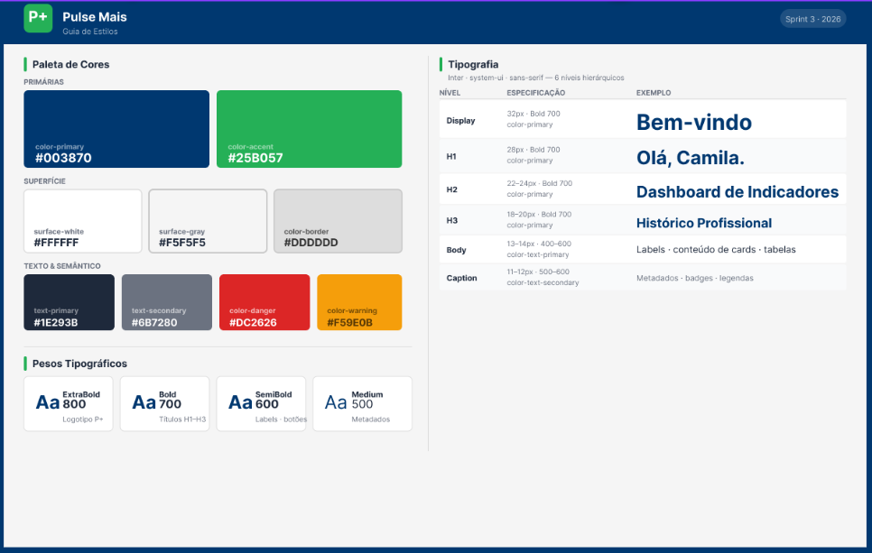
<figcaption>
Fonte: Produção dos Autores (2026)
</figcaption>
</figure>

---

#### 4.1.2. Arquitetura da Solução

A arquitetura do sistema foi definida utilizando Node.js + TypeScript, seguindo um modelo em camadas com os seguintes componentes:

1. **Usuários** (Equipe, Aluno, Mentor) — Acessam o sistema de acordo com seu perfil e permissões.
2. **UI / Views (EJS)** — Exibe as páginas e coleta dados do usuário.
3. **API (Node/TypeScript)** — Recebe requisições, processa e orquestra as camadas.
4. **Camadas da API** — Organizam as regras de negócio e o acesso aos dados:
   - Routes → Controllers → Services → Repositories
5. **Banco de Dados (PostgreSQL/Supabase)** — Armazena os dados da aplicação com segurança e eficiência.
6. **Migrações e SQL** — Atualizam a estrutura do banco de dados de forma controlada.
7. **Middlewares / Errors + Tests / Docs** — Validam requisições, tratam erros e garantem qualidade com testes e documentação.

---

#### 4.1.3. Lógica Proposicional e Banco de Dados

Para garantir a integridade dos dados e a rastreabilidade das regras de negócio, foram mapeadas 14 consultas SQL ligadas aos principais fluxos do sistema. Cada consulta foi traduzida em proposições lógicas acompanhadas de sua respectiva tabela verdade.

#### Exemplo — Consulta 1: Cadastro de Aluno (verificação de CPF) — RF001, RN01

| Campo | Descrição |
|---|---|
| Expressão SQL | `SELECT u.id_usuario, u.cpf, a.ativo FROM usuario u JOIN aluno a ON a.id_usuario = u.id_usuario WHERE u.cpf = $1 AND a.ativo = true;` |
| Proposição A | CPF informado existe (cpf = $1) |
| Proposição B | Aluno está ativo (ativo = true) |
| Expressão lógica | A ∧ B |

#### Tabela Verdade

| A | B | A ∧ B |
|---|---|---|
| F | F | F |
| F | V | F |
| V | F | F |
| V | V | V |
---

#### 4.1.4. Protótipo de Alta Fidelidade

O protótipo foi desenvolvido para três perfis principais de usuário: **Aluno Ativo**, **Coordenador** e **Ex-Aluno**.

#### Tela de Login

A tela de entrada da plataforma apresenta o formulário de autenticação com campos de e-mail/usuário e senha, além das opções de "Lembrar minha senha", "Cadastre-se" e "Esqueceu a senha?". O layout divide a tela em duas seções: à esquerda, a identidade visual do PulseConnect com o slogan *"Conectando talentos, construindo futuros"*; à direita, o formulário de acesso.

<figure style="text-align: center; margin: 1.5rem auto;">
<figcaption>
Figura 24: Tela de Login
</figcaption>
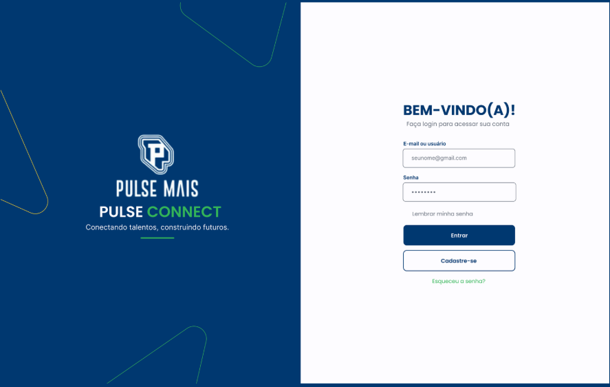
<figcaption>
Fonte: Produção dos Autores (2026)
</figcaption>
</figure>

---

#### Perfil: Aluno Ativo

#### Homepage do Aluno

A homepage do aluno apresenta uma saudação personalizada, um banner do programa em que está matriculado (ex.: *Capacitados — Turma 2026.1*) e os próximos programas abertos, como aulas, workshops e mentorias com suas respectivas datas.

<figure style="text-align: center; margin: 1.5rem auto;">
<figcaption>
Figura 25: Homepage — Aluno Ativo
</figcaption>
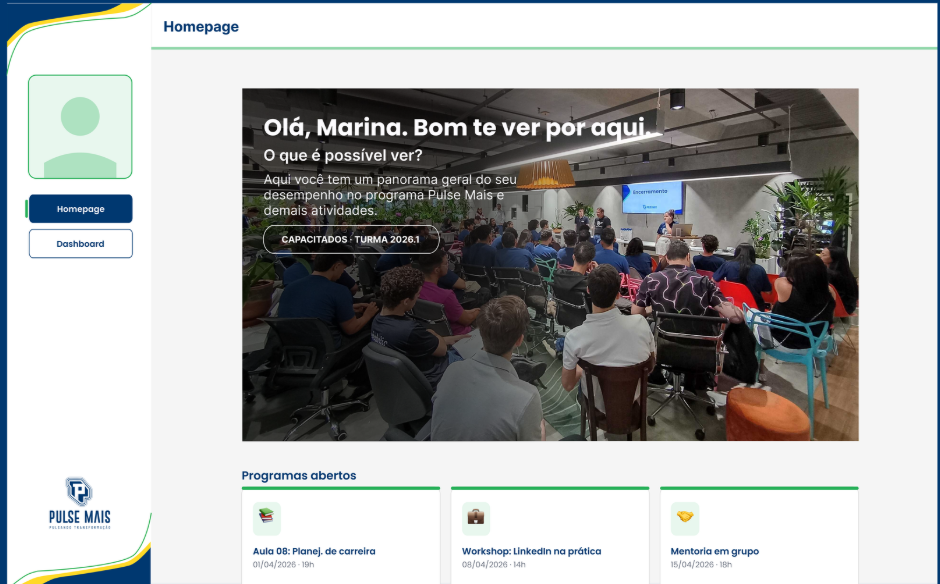
<figcaption>
Fonte: Produção dos Autores (2026)
</figcaption>
</figure>

#### Dashboard de Desempenho

O dashboard de desempenho permite ao aluno acompanhar sua evolução ao longo dos programas da Pulse Mais, exibindo:
- **Soft Skills** com indicadores de progresso;
- **Hard Skills** em formato de gráfico de barras;
- **Próximas atividades** com nome, data, tipo e status.

<figure style="text-align: center; margin: 1.5rem auto;">
<figcaption>
Figura 26: Dashboard de Desempenho — Aluno Ativo
</figcaption>
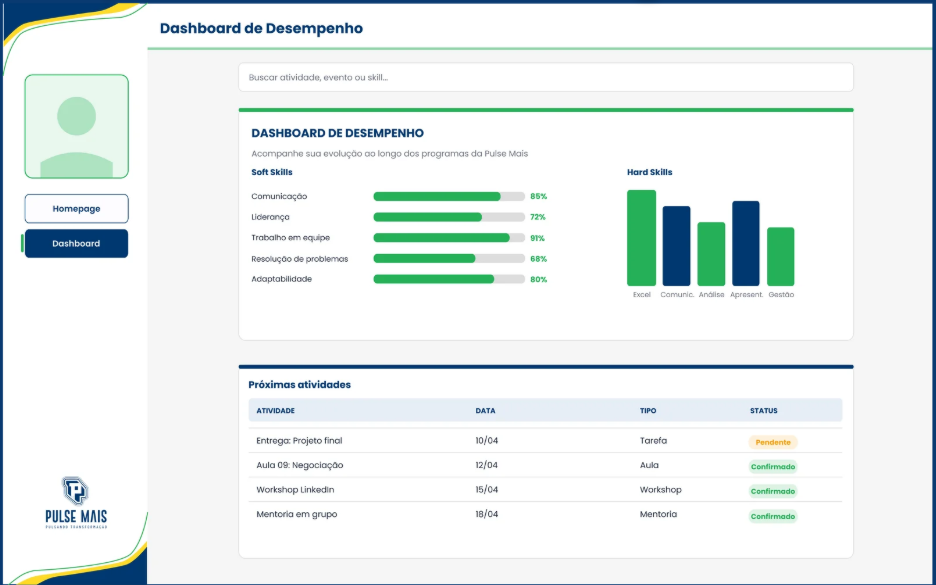
<figcaption>
Fonte: Produção dos Autores (2026)
</figcaption>
</figure>

#### Meu Perfil — Aluno

Tela de edição do perfil do aluno com campos para nome, e-mail, telefone, endereço, programa atual, data de ingresso, escolaridade e status profissional.

<figure style="text-align: center; margin: 1.5rem auto;">
<figcaption>
Figura 27: Meu Perfil — Aluno Ativo
</figcaption>
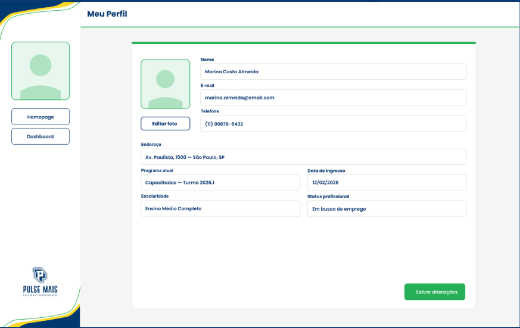
<figcaption>
Fonte: Produção dos Autores (2026)
</figcaption>
</figure>

---

#### Perfil: Coordenador

#### Homepage do Coordenador

A homepage do coordenador apresenta um panorama geral do desempenho e engajamento dos alunos, com acesso rápido às funcionalidades de gestão.

<figure style="text-align: center; margin: 1.5rem auto;">
<figcaption>
Figura 28: Homepage — Coordenador
</figcaption>
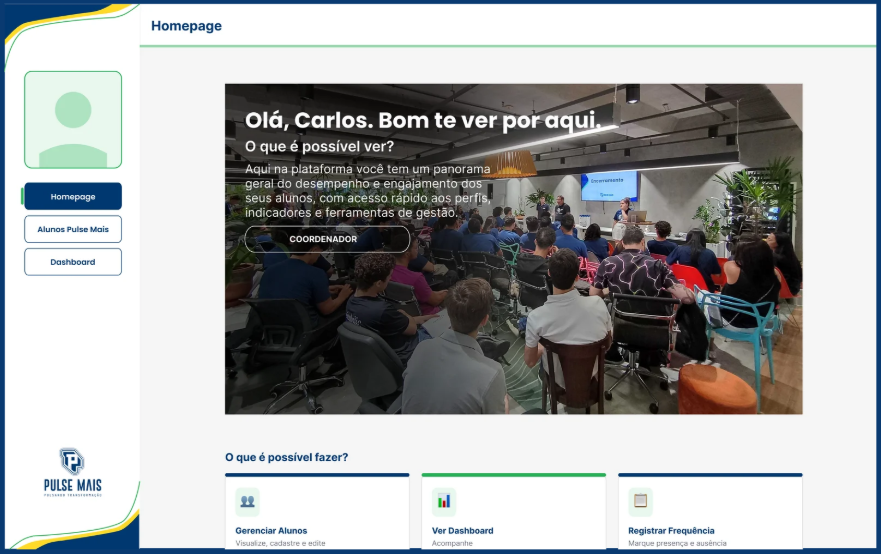
<figcaption>
Fonte: Produção dos Autores (2026)
</figcaption>
</figure>

#### Meu Perfil — Coordenador

Tela de edição do perfil do coordenador com campos para nome completo, e-mail, telefone, cargo, área de atuação, data de admissão, cidade e estado.

<figure style="text-align: center; margin: 1.5rem auto;">
<figcaption>
Figura 29: Meu Perfil — Coordenador
</figcaption>
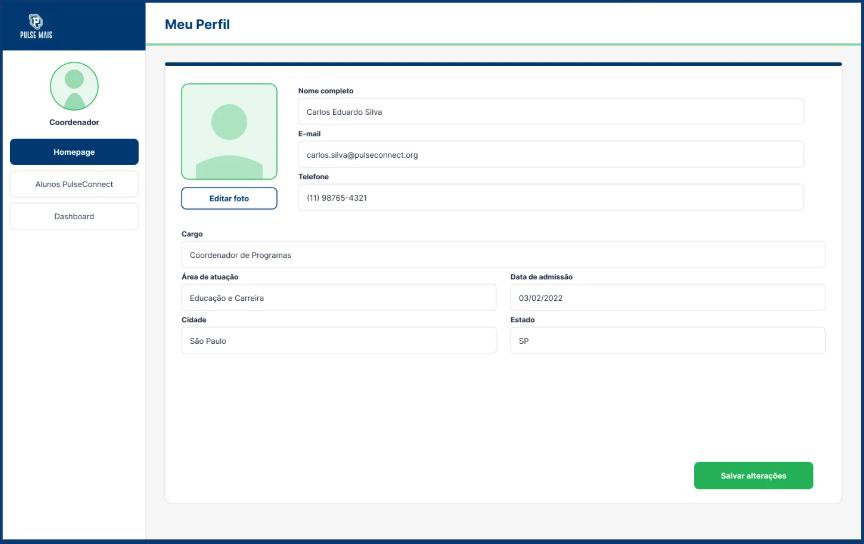
<figcaption>
Fonte: Produção dos Autores (2026)
</figcaption>
</figure>

#### Dashboard Geral dos Alunos

O dashboard do coordenador exibe indicadores de impacto consolidados da plataforma, gráficos e tabela com alunos em destaque.

<figure style="text-align: center; margin: 1.5rem auto;">
<figcaption>
Figura 30: Dashboard Geral dos Alunos — Coordenador
</figcaption>
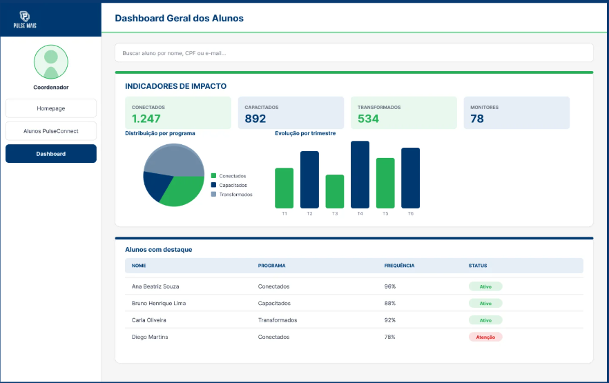
<figcaption>
Fonte: Produção dos Autores (2026)
</figcaption>
</figure>

#### Listagem de Alunos PulseConnect

Tela de gestão dos alunos com visualização em cards, filtros de busca e botão para adicionar novo aluno.

<figure style="text-align: center; margin: 1.5rem auto;">
<figcaption>
Figura 31: Listagem de Alunos — Coordenador
</figcaption>
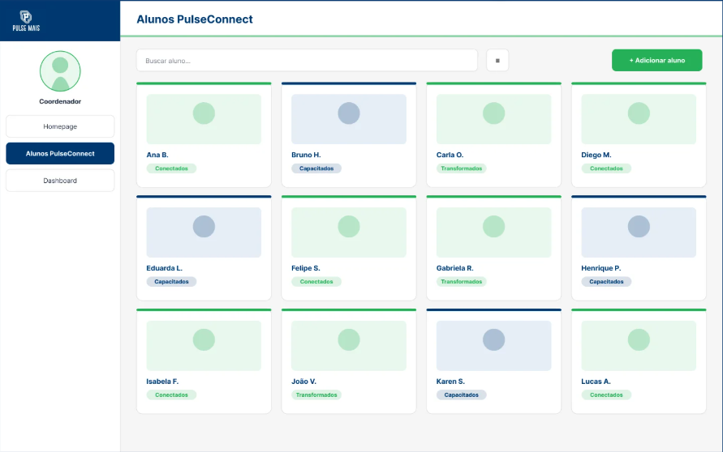
<figcaption>
Fonte: Produção dos Autores (2026)
</figcaption>
</figure>

#### Cadastrar Novo Aluno

Formulário de cadastro de novo aluno dividido entre dados pessoais e dados acadêmicos.

<figure style="text-align: center; margin: 1.5rem auto;">
<figcaption>
Figura 32: Cadastro de Novo Aluno
</figcaption>
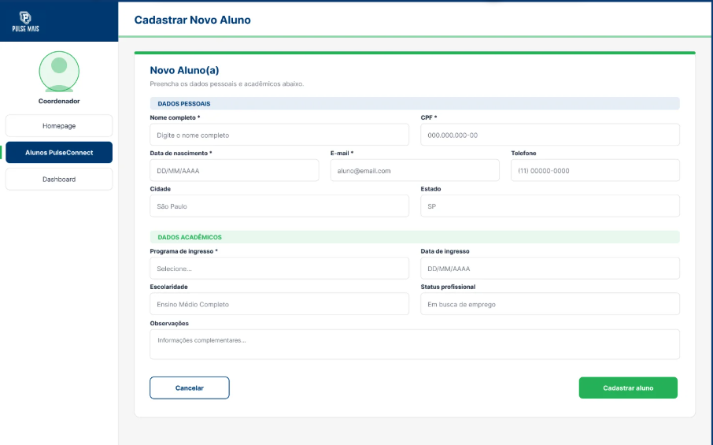
<figcaption>
Fonte: Produção dos Autores (2026)
</figcaption>
</figure>

#### Registro de Frequência

Tela de acompanhamento de presença por turma, exibindo frequência média e status de presença ou ausência em cada aula.

<figure style="text-align: center; margin: 1.5rem auto;">
<figcaption>
Figura 33: Registro de Frequência
</figcaption>
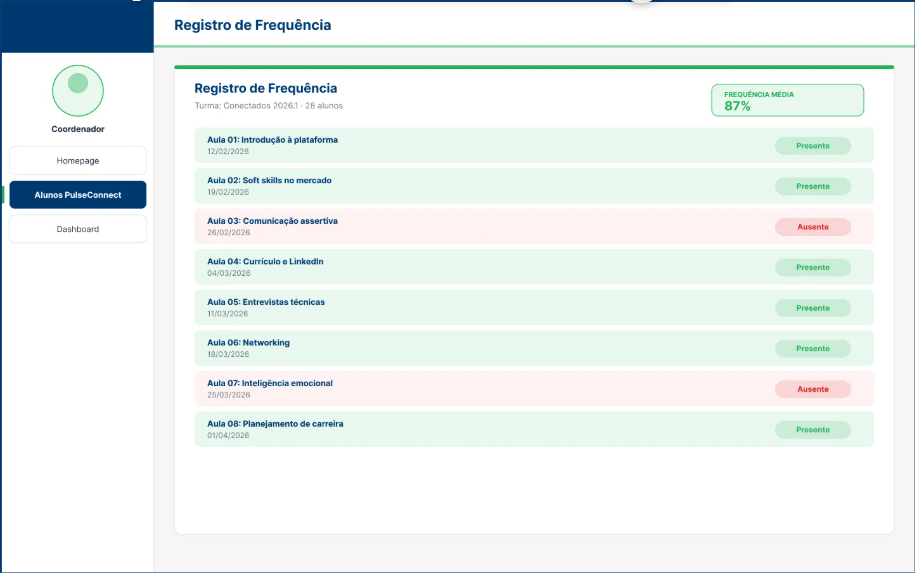
<figcaption>
Fonte: Produção dos Autores (2026)
</figcaption>
</figure>

#### Exclusão de Perfil de Aluno

Modal de confirmação para exclusão irreversível do perfil de um aluno.

<figure style="text-align: center; margin: 1.5rem auto;">
<figcaption>
Figura 34: Modal de Exclusão de Perfil
</figcaption>
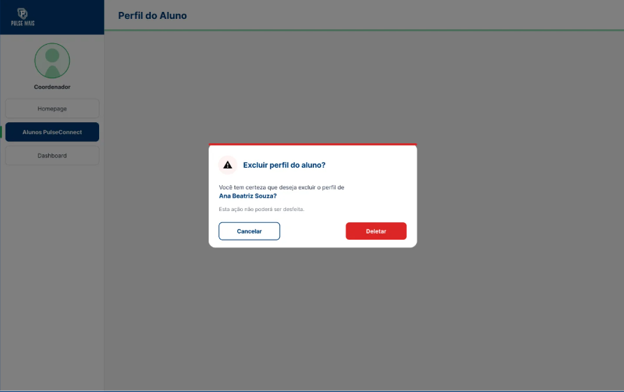
<figcaption>
Fonte: Produção dos Autores (2026)
</figcaption>
</figure>

---

#### Perfil: Ex-Aluno

#### Homepage do Ex-Aluno

A homepage do ex-aluno apresenta um panorama de suas oportunidades, histórico e conquistas durante a jornada na Pulse Mais.

<figure style="text-align: center; margin: 1.5rem auto;">
<figcaption>
Figura 35: Homepage — Ex-Aluno
</figcaption>
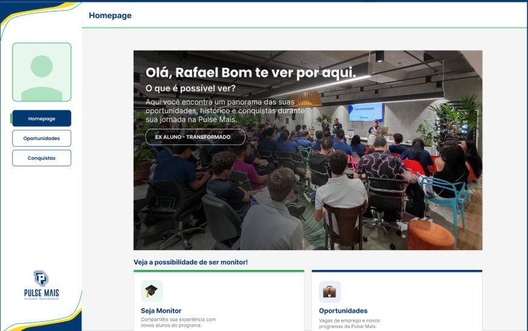
<figcaption>
Fonte: Produção dos Autores (2026)
</figcaption>
</figure>

#### Meu Perfil — Ex-Aluno

Tela de edição do perfil do ex-aluno com campos equivalentes ao perfil de aluno ativo.

<figure style="text-align: center; margin: 1.5rem auto;">
<figcaption>
Figura 36: Meu Perfil — Ex-Aluno
</figcaption>
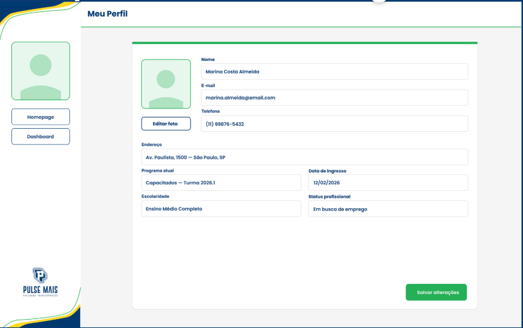
<figcaption>
Fonte: Produção dos Autores (2026)
</figcaption>
</figure>

#### Oportunidades

Tela de listagem de oportunidades no ecossistema Pulse Mais.

<figure style="text-align: center; margin: 1.5rem auto;">
<figcaption>
Figura 37: Oportunidades — Ex-Aluno
</figcaption>
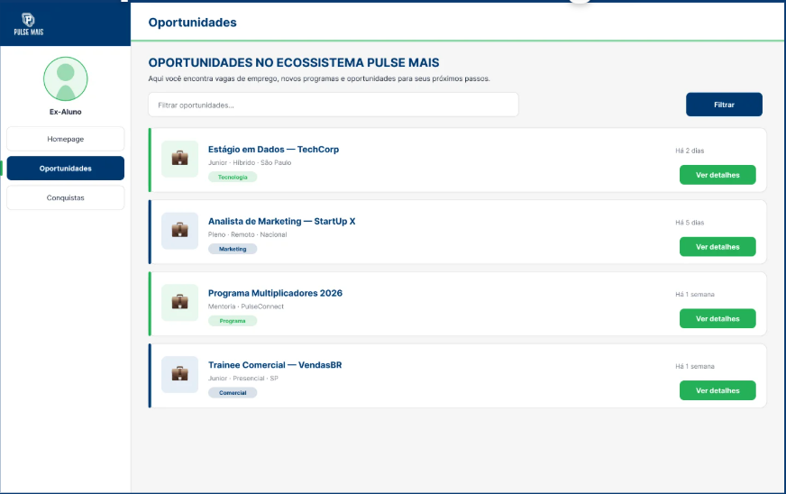
<figcaption>
Fonte: Produção dos Autores (2026)
</figcaption>
</figure>

#### Conquistas e Certificados

Tela que exibe o histórico completo do ex-aluno e a listagem dos certificados obtidos.

<figure style="text-align: center; margin: 1.5rem auto;">
<figcaption>
Figura 38: Conquistas e Certificados
</figcaption>
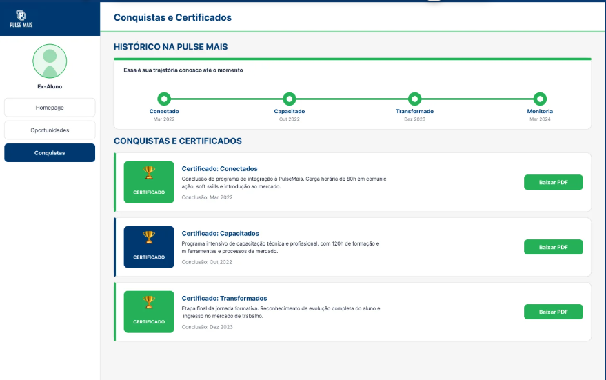
<figcaption>
Fonte: Produção dos Autores (2026)
</figcaption>
</figure>

---

### (b) O que não foi concluído

Apesar do avanço no desenvolvimento da primeira versão da aplicação web, algumas funcionalidades ainda não foram concluídas nesta sprint. Entre os itens pendentes estão:
- Implementação completa da WebAPI;
- Atualizações complementares da arquitetura;
- Integração completa entre frontend, backend e banco de dados.

Esses itens serão evoluídos nas próximas sprints do projeto.

---

### (c) Dificuldades técnicas enfrentadas

Durante o desenvolvimento da Sprint 3, algumas dificuldades técnicas foram identificadas:
- Estruturação da arquitetura em camadas e organização das responsabilidades entre rotas, controllers, services e repositories;
- Definição de uma estrutura de banco de dados capaz de centralizar informações antes distribuídas em diferentes planilhas;
- Mapeamento das regras de negócio para proposições lógicas e consultas SQL;
- Organização da navegação e adaptação das interfaces para diferentes perfis de usuário;
- Garantia de consistência visual entre todas as telas desenvolvidas no protótipo.

Apesar desses desafios, foi possível avançar na consolidação da estrutura inicial da plataforma.

---

### (d) Próximos passos

Com a conclusão da Sprint 3, os próximos desenvolvimentos previstos para a Sprint 4 (Semanas 7 e 8) são:
- Segunda versão do sistema web;
- Relatório de Testes Automatizados;
- Estudo de Mercado;
- Atualizações da Arquitetura;
- Atualizações da WebAPI.

O desenvolvimento continuará de forma iterativa, com validações constantes junto à Pulse Mais, garantindo que a plataforma evolua de acordo com as necessidades reais de centralização, rastreabilidade e análise de dados institucionais.

## 4.2. Segunda versão da aplicação web

Durante a Sprint 4 (Semanas 7 e 8), o desenvolvimento avançou da etapa de prototipação para a construção de um **sistema funcional integrado**. Enquanto a primeira versão (Sprint 3) entregou um protótipo de alta fidelidade — telas estáticas que representavam visualmente o PulseConnect, sem comportamento real —, a segunda versão consolidou a aplicação operando ponta a ponta: as interfaces deixaram de ser maquetes e passaram a se comunicar com a **WebAPI**, que por sua vez processa as regras de negócio e persiste os dados em um banco **PostgreSQL** hospedado no Supabase.

A diferença central entre as duas versões, portanto, é a **passagem do estático para o funcional**: na Sprint 3, as telas exibiam dados fictícios embutidos no layout; na Sprint 4, as mesmas telas passam a refletir dados reais vindos do banco, com cadastro, listagem, edição e exclusão efetivamente funcionando. Esse avanço atende diretamente aos itens que haviam ficado pendentes na primeira versão (seção 4.1, item b): a implementação completa da WebAPI, as atualizações complementares da arquitetura e a integração entre frontend, backend e banco de dados.

---

### (a) O que foi implementado

#### 4.2.1. Evolução da Arquitetura e Integração com o Banco de Dados

A arquitetura em camadas projetada na Sprint 3 (seção 4.1.2) foi efetivamente implementada nesta sprint. O sistema passou a operar no modelo **rotas → controllers → services → repositories**, em Node.js com TypeScript e Express, com cada responsabilidade isolada em sua camada: as `routes` definem as URLs e os métodos HTTP, os `controllers` recebem e validam as requisições, os `services` concentram as regras de negócio e os `repositories` executam as consultas SQL.

O principal salto desta versão foi a **integração real com o banco de dados**: a aplicação deixou de depender de dados embutidos no front-end e passou a ler e gravar em um banco PostgreSQL no Supabase, com pool de conexões (`pg`), cliente Supabase e *script* de migração (`migrate.ts` + `migration.sql`) versionando a estrutura das tabelas. A rota `GET /health` reporta o estado dessa conexão (`db: connected` / `disconnected`), servindo como verificação rápida de que a integração está ativa.

#### 4.2.2. WebAPI Funcional

A entrega central da Sprint 4 foi a **WebAPI completa e funcional**, com 84 endpoints distribuídos entre os módulos de domínio do sistema (alunos, indicadores, avaliações, atividades, entregas, histórico profissional, eventos, participações em evento, mentores, mentorias, acompanhamento, anotações privadas, importação, dashboard, matrículas, gerências e usuários). A relação completa dos endpoints, com método, descrição e RF/RN vinculados, está documentada na seção 3.7 e na rota navegável `GET /docs`. Os principais avanços consolidados foram:

- **Fluxos principais ponta a ponta:** cadastro de aluno (RF001), registro de indicadores e avaliações (RF002), registro de entregas e atividades (RF003) e consulta de perfil consolidado do aluno (RF004), todos com status "Implementado" na Matriz de Rastreabilidade (seção 3.9).
- **Importação de dados em massa (RF006):** implementada com `multer`, `csv-parser` e `xlsx`, validando o formato do arquivo, reportando conflitos de CPF (HTTP 207) e rejeitando arquivos inválidos (HTTP 400).
- **Portal do Aluno e do Ex-Aluno (RF005):** endpoints que isolam os dados do próprio usuário e ignoram silenciosamente campos restritos.
- **Dashboard institucional (RF008):** indicadores de impacto calculados dinamicamente a partir dos dados persistidos.
- **Serviço de e-mail (RF007):** `emailService.ts` com `nodemailer`, acionado como efeito colateral do cadastro de eventos.
- **Tratamento global de erros:** middleware centralizado (`errorHandler`) e classes de erro customizadas (`AppError`) padronizam as respostas HTTP (400, 404, 409 etc.) em toda a API.

<figure style="text-align: center; margin: 1.5rem auto;">
<figcaption>
Figura 39: Documentação navegável da WebAPI (rota <code>GET /docs</code>)
</figcaption>
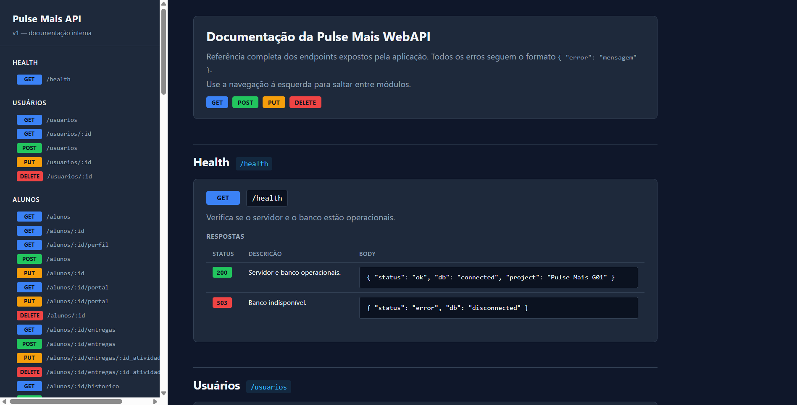
<figcaption>
Fonte: Produção dos Autores (2026)
</figcaption>
</figure>

<figure style="text-align: center; margin: 1.5rem auto;">
<figcaption>
Figura 40: Health check do servidor e do banco de dados (rota <code>GET /health</code>)
</figcaption>
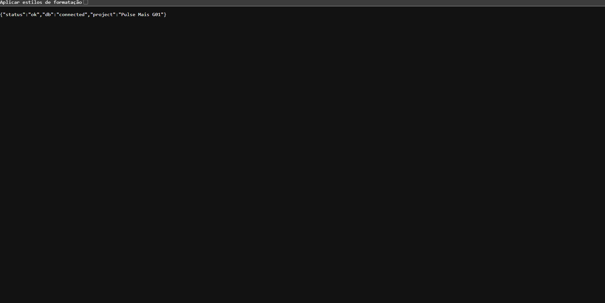
<figcaption>
Fonte: Produção dos Autores (2026)
</figcaption>
</figure>

#### 4.2.3. Telas Funcionais Integradas

As telas que na Sprint 3 eram apenas protótipos passaram, nesta sprint, a operar de forma funcional, refletindo dados reais do banco e disparando requisições à WebAPI. As figuras a seguir registram as telas da segunda versão; quando aplicável, indica-se a figura correspondente da primeira versão (Seção 4.1.4) para evidenciar a evolução do protótipo estático para a interface integrada.

#### Homepage do Coordenador

Homepage do coordenador na versão funcional, exibindo o panorama de gestão com navegação ativa entre os módulos do sistema. Compare com o protótipo da Figura 28.

<figure style="text-align: center; margin: 1.5rem auto;">
<figcaption>
Figura 41: Homepage do Coordenador — versão funcional
</figcaption>
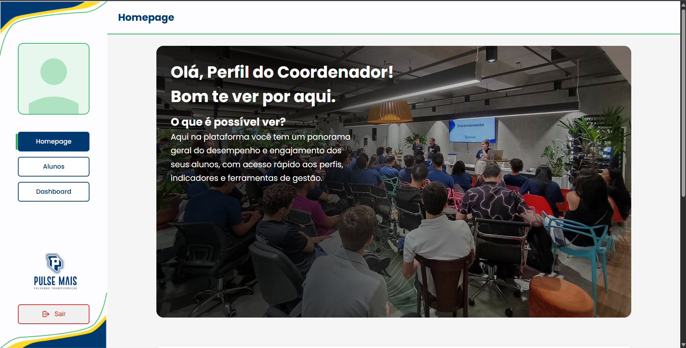
<figcaption>
Fonte: Produção dos Autores (2026)
</figcaption>
</figure>

#### Listagem de Alunos

Tela de listagem de alunos consumindo o endpoint `GET /alunos`, exibindo os registros efetivamente persistidos no banco de dados (e não mais dados fictícios do layout). Compare com o protótipo da Figura 31.

<figure style="text-align: center; margin: 1.5rem auto;">
<figcaption>
Figura 42: Listagem de Alunos — versão funcional (dados reais do banco)
</figcaption>
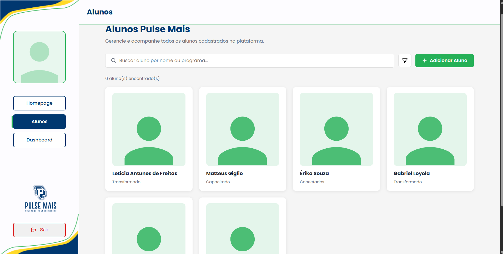
<figcaption>
Fonte: Produção dos Autores (2026)
</figcaption>
</figure>

#### Cadastro de Novo Aluno

Formulário de cadastro acionando o endpoint `POST /alunos`, com persistência real no banco e validação de CPF duplicado (HTTP 409). Compare com o protótipo da Figura 32.

<figure style="text-align: center; margin: 1.5rem auto;">
<figcaption>
Figura 43: Cadastro de Novo Aluno — versão funcional (<code>POST /alunos</code>)
</figcaption>
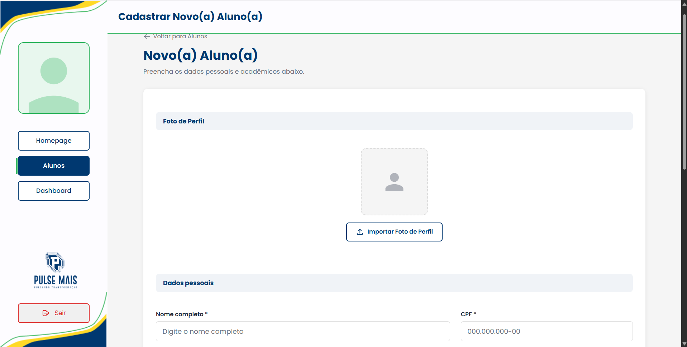
<figcaption>
Fonte: Produção dos Autores (2026)
</figcaption>
</figure>

#### Perfil do Aluno

Tela de perfil consolidado do aluno alimentada pelo endpoint `GET /alunos/:id/perfil`, reunindo dados cadastrais, histórico e indicadores. Compare com o protótipo da Figura 27.

<figure style="text-align: center; margin: 1.5rem auto;">
<figcaption>
Figura 44: Perfil do Aluno — versão funcional (<code>GET /alunos/:id/perfil</code>)
</figcaption>
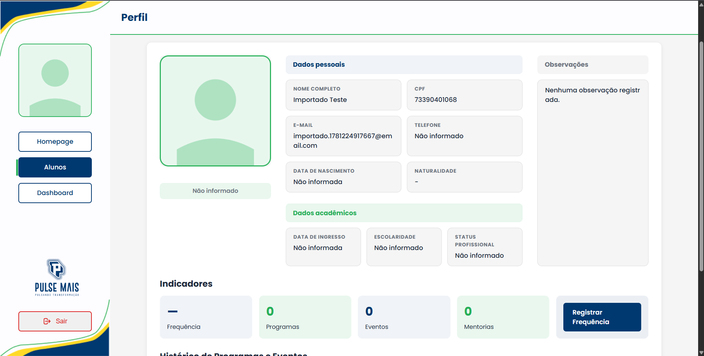
<figcaption>
Fonte: Produção dos Autores (2026)
</figcaption>
</figure>

#### Dashboard Institucional

Dashboard alimentado pelo endpoint `GET /dashboard`, com os indicadores de impacto calculados dinamicamente a partir dos dados persistidos. Compare com o protótipo da Figura 30.

<figure style="text-align: center; margin: 1.5rem auto;">
<figcaption>
Figura 45: Dashboard Institucional — versão funcional (<code>GET /dashboard</code>)
</figcaption>
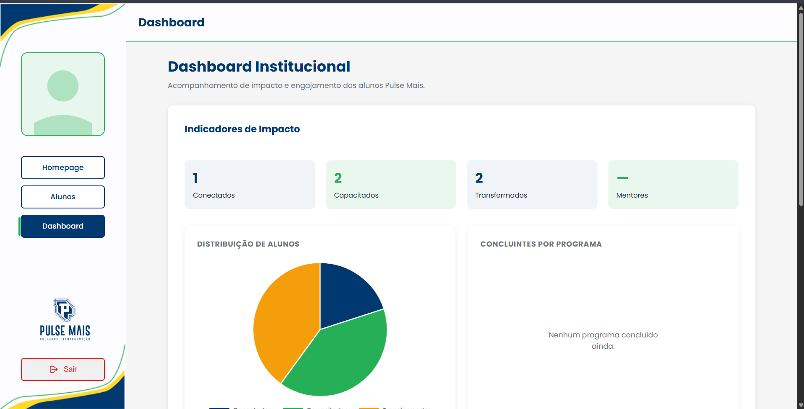
<figcaption>
Fonte: Produção dos Autores (2026)
</figcaption>
</figure>

#### Registro de Frequência

Tela de registro de frequência integrada aos endpoints de indicadores, avaliações e participações em evento. Compare com o protótipo da Figura 33.

<figure style="text-align: center; margin: 1.5rem auto;">
<figcaption>
Figura 46: Registro de Frequência — versão funcional
</figcaption>
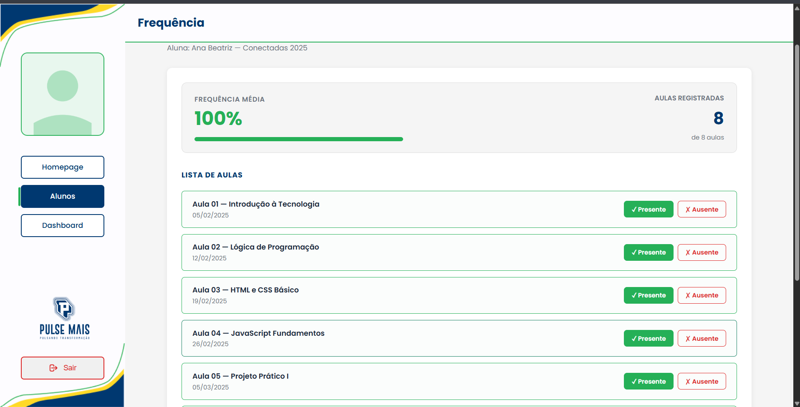
<figcaption>
Fonte: Produção dos Autores (2026)
</figcaption>
</figure>

#### 4.2.4. Testes Automatizados

Para garantir a confiabilidade da WebAPI, foi implementada uma suíte de testes automatizados com **Jest + Supertest**, combinando testes unitários de *service* (*white-box*) e testes de contrato de endpoints (*black-box*), além de cenários de erro dedicados (400, 404, 409). A suíte atingiu a meta de cobertura definida pelo time (≈80%) e está detalhada na seção 5.1.

---

### (b) O que não foi concluído

Apesar da consolidação da WebAPI e da integração funcional, alguns itens permaneceram pendentes ao final da Sprint 4 e foram remetidos à versão final (Sprint 5):

- **Camada de autenticação e autorização:** o controle de acesso por perfil ainda não foi implementado. Por isso, endpoints que dependem de identidade autenticada — como o bloqueio de mentorias para o perfil Aluno (RF012/RN13) e a filtragem de observações privadas por mentor (RF013/RN16) — aparecem como "Implementado (parcial)" na Matriz de Rastreabilidade. As regras de negócio existem no código, mas a restrição efetiva de acesso depende da autenticação.
- **Integração completa do front-end com a API:** parte das telas ainda não consome dinamicamente todos os endpoints disponíveis. A ligação completa entre interface e backend, com renderização de dados reais em todas as telas, ainda será finalizada.
- **Telas sem protótipo documentado:** os fluxos de gestão de mentores, registro de mentorias, importação de dados e envio de convites possuem os endpoints implementados, mas seguem marcados como "(a definir — sem protótipo)" na RTM, sem tela correspondente finalizada.

---

### (c) Dificuldades técnicas enfrentadas e próximos passos

As principais dificuldades técnicas desta sprint estiveram ligadas à transição do protótipo estático para um sistema integrado:

- **Organização da arquitetura em camadas:** distribuir corretamente as responsabilidades entre rotas, controllers, services e repositories exigiu disciplina para evitar acoplamento e duplicação de lógica.
- **Conflitos de roteamento:** o casamento de rotas com parâmetros dinâmicos (`/:id`) e sub-recursos (`/:id/perfil`, `/:id/portal`, `/:id/entregas`) exigiu ordenação cuidadosa das definições para evitar capturas indevidas de URL.
- **Integração com o Supabase:** configurar a conexão, as variáveis de ambiente (`.env`) e as migrações de forma reprodutível entre as máquinas do time foi um ponto sensível, mitigado pela documentação no README e pela rota de *health check*.
- **Determinismo dos testes:** garantir testes estáveis exigiu fixar o *timezone* em UTC, injetar credenciais *placeholder* e limpar o estado dos *mocks* entre execuções, evitando falhas intermitentes entre o ambiente local e o CI.
- **Alcance da meta de cobertura:** chegar a ≈80% de cobertura demandou a criação de cenários de erro dedicados (400, 404, 409) e o isolamento dos *services* das dependências externas.

Com a conclusão da Sprint 4, os próximos passos previstos para a Sprint 5 (versão final) são: implementar a camada de autenticação e autorização por perfil (seção 3.8); concluir a integração dinâmica entre front-end e WebAPI; finalizar as telas ainda pendentes; realizar refatorações e correções finais; e conduzir os testes de usabilidade junto aos usuários da Pulse Mais.

## 4.3. Versão final da aplicação web

A sprint 5 concentrou os esforços da equipe em frentes complementares: refatoração estrutural do código-fonte, integração de todos os perfis ao banco de dados Supabase, simplificação da camada de autenticação, expansão das funcionalidades do coordenador e do mentor, padronização visual da sidebar e dos assets, e correções amplas de funcionalidade e UX em todos os perfis da aplicação. Ao todo, foram realizados mais de 120 commits de trabalho (excluindo merges) durante o período, distribuídos entre alterações de código, ajustes de estilo e revisão de documentação.

# Reorganização da estrutura do projeto

A alteração mais abrangente da sprint foi a reestruturação do repositório, que migrou os arquivos de frontend e backend — anteriormente distribuídos em pastas de nível raiz (css/, js/, pages/, src/controllers/) — para uma organização modular dentro de src/frontend/ e src/backend/. Essa reorganização separou as responsabilidades de cada camada, facilitando a navegação no código e a manutenção futura. O commit de referência (refactor: centraliza código-fonte em módulos frontend e backend dentro de src) consolidou essa mudança em uma única operação, e um commit complementar vinculou a reorganização à task correspondente no board do projeto. Em complemento, a pasta assets/ foi movida para fora de src/, passando a residir na raiz do repositório, e todos os caminhos de imagens nas páginas HTML e nos arquivos CSS foram atualizados para refletir o novo local, eliminando referências quebradas após a reorganização.

# Integração com Supabase e evolução da autenticação

A integração do frontend com o banco de dados Supabase foi uma das entregas centrais da sprint. O fluxo do aluno foi integrado ao backend autenticado, permitindo que o portal do aluno consumisse dados reais do banco; paralelamente, os perfis de ex-aluno e coordenador também foram integrados ao backend, completando a cobertura de todos os perfis da aplicação. O sistema de login recebeu correções que incluíram a adição do campo de senha ausente no formulário, a restauração de chaves legadas do coordenador ao revalidar a sessão e ajustes nas credenciais e máscara de telefone.

A camada de autenticação evoluiu ao longo da sprint. Em um primeiro momento, o acesso aos dados foi protegido por autenticação JWT, com geração e verificação de token no backend e injeção do header Authorization no frontend via Auth.fetch(). Ao final da sprint, contudo, a equipe optou por simplificar esse mecanismo: a dependência jsonwebtoken (e @types/jsonwebtoken) foi removida do projeto, o authService deixou de gerar e verificar tokens — passando a retornar apenas o objeto { usuario } no login —, o endpoint /auth/me e a rota correspondente foram removidos, e o authMiddleware foi reduzido a um pass-through sem verificação de Bearer. No frontend, o módulo auth.js perdeu o getToken() e o header Authorization, e o isAuthenticated() passou a verificar apenas a presença do objeto de usuário persistido no localStorage, com setSession() aceitando somente o usuário. Tentativas anteriores de simplificar o login para autenticação por email sem senha foram implementadas e revertidas, e a integração do frontend do aluno com o Supabase também precisou ser revertida e reimplementada por conflitos de merge antes de estabilizar.

# Revisão das telas do mentor

As telas do mentor passaram por uma revisão sistemática ao longo de cinco dias, com um commit granular por dia. No primeiro dia, todas as chamadas fetch() cruas nos quatro arquivos JavaScript do mentor (homepageMentor.js, agendaMentorias.js, alunosAssociados.js e dadosAluno.js) foram substituídas por Auth.fetch(), centralizando a injeção do token JWT, o tratamento de timeout e a resposta a erros 401. No segundo dia, a função logout() foi corrigida para utilizar Auth.clearSession() em vez de localStorage.clear(), e o fallback de identificação do mentor foi ajustado de idUsuario (chave nunca gravada) para idAluno, alinhando-se ao comportamento real de Auth.setSession(). No terceiro dia, os estilos CSS duplicados entre os arquivos individuais das telas do mentor foram extraídos e centralizados em global.css, incluindo as classes .tabela-wrapper, .tabela-mentor, .tabela-dica e .modal-azul, e os @import redundantes foram removidos. No quarto dia, foram corrigidos problemas de HTML e UX: o título duplicado na página de agenda foi removido, o calendário passou a exibir os números dos dias de meses adjacentes (antes em branco), o KPI "Próxima Mentoria" passou a mostrar a data completa com dia, mês e ano, e o status dos alunos nas tabelas foi tornado dinâmico, consumindo o campo status retornado pela API em vez de exibir "Ativo" de forma fixa. No quinto dia, foi adicionada uma função sanitize() em cada arquivo JavaScript para escapar caracteres HTML antes de inseri-los via innerHTML, prevenindo ataques XSS em nomes, emails e temas vindos da API. Além disso, um guard de autenticação foi inserido no início do DOMContentLoaded de todas as quatro telas, verificando Auth.isAuthenticated() e confirmando que o perfil do usuário logado é "mentor" antes de permitir o carregamento da página. (Cabe registrar que a centralização da injeção de token via Auth.fetch() refletia o modelo JWT vigente naquele momento; com a posterior remoção do JWT, o Auth.fetch() foi mantido como ponto único de chamada à API, agora sem o header Authorization.)

Posteriormente, as telas do mentor foram efetivamente sincronizadas com o banco de dados Supabase, deixando de depender de dados mockados. Foi criada uma interface mentorData para padronizar o consumo dos dados do mentor entre as telas, implementado o acesso à tela de perfil do mentor (perfilMentor.html) com alinhamento das funcionalidades, e resolvido um problema de cruzamento de dados entre as agendas do mentor e do aluno, que exibiam informações trocadas. A sidebar de todas as páginas do mentor passou a carregar a foto de perfil do mentor, e foram corrigidas a sidebar duplicada e a estrutura do avatar nessas páginas.

# Correções de funcionalidade e UX nos demais perfis

Além da revisão do mentor, a sprint incluiu correções significativas nos demais perfis. O perfil do aluno recebeu ajustes na exibição de indicadores, com a remoção de indicadores de programas que não se aplicavam à visualização individual, e a correção da métrica estagio_jornada no frontend. O sistema de cadastro de alunos foi corrigido, e o perfil do aluno via API passou por ajustes para retornar os dados corretamente. O portal do aluno recebeu melhorias de acessibilidade e tokens de design, além de correções na navegação mobile e na topbar. O dashboard do aluno ganhou animações de hover e foi alinhado a um grid de 16 colunas. Novos endpoints de localidade e o campo estagio_jornada foram adicionados à API de alunos. O frontend do coordenador foi ajustado e integrado ao backend.

No fechamento da sprint, esses perfis ganharam funcionalidades e refinamentos adicionais. O perfil do coordenador foi expandido com a gestão completa de alunos por meio de modal de detalhes, a gestão de ex-alunos e conquistas, e o registro de entrega de atividades e de presença em eventos; foi também adicionada uma área de gestão de cursos, aulas e frequência, com a página frequencia.html. O perfilCoordenador foi migrado para Auth.fetch() com guard de autenticação, e recebeu validações e melhorias de UX, além de rodadas específicas de correção de bugs. No fluxo do aluno, foi criada a página de agenda do aluno (agendaAluno.html), com posterior correção da sincronia de dados com o mentor e diferenciação de dashboard e agenda conforme o tipo de aluno; foram adicionados máscara de CPF e telefone e validações no perfil do aluno, validações e melhorias de UX no portal, e tooltips e a exibição de próximos eventos na homepage, agenda e dashboard. A sidebar foi refatorada com item "Meu Perfil", responsividade e correção de scroll — posteriormente o botão "Meu Perfil" foi removido da navegação e o avatar restaurado — e a foto de perfil do aluno passou a ser sincronizada com o backend. O perfil do ex-aluno foi aprimorado com máscara de telefone e controle de foto, e favicons foram adicionados às páginas do ex-aluno e à página de oportunidades. Uma revisão ampla corrigiu os principais bugs da aplicação em todos os perfis, melhorou a UX e validou o fluxo completo.

# Testes e qualidade de código

A suíte de testes foi expandida para 439 testes, atingindo cobertura de 92,32% em statements e 92,74% em lines. Foram adicionados testes unitários de service vinculados às regras de negócio, testes de cenário de sucesso e evidências de execução para documentação. A equipe também investiu em comentários descritivos nas camadas de view, service e no alunoService, melhorando a legibilidade e a manutenibilidade do código.

# Pendências remanescentes

Com a sincronização das telas do mentor ao Supabase e a integração de todos os perfis ao backend, as pendências mais relevantes da sprint anterior foram endereçadas. A simplificação da camada de autenticação — com a remoção do JWT e a redução do authMiddleware a um pass-through — encerrou a pendência de aplicação do middleware de verificação de Bearer às rotas de recurso, mas, em contrapartida, deixa em aberto, como trabalho futuro, a reintrodução de um mecanismo de autorização robusto (por exemplo, sessão server-side ou JWT validado) antes de um eventual deploy em produção, uma vez que o pass-through atual não verifica credenciais nas rotas protegidas. Permanece também a recomendação de validar end-to-end, com dados reais, todas as operações de escrita dos perfis recém-integrados.

# Evidências visuais das alterações (prints)

As imagens a seguir ilustram as principais telas da aplicação Pulse Connect, evidenciando as funcionalidades entregues ao longo do desenvolvimento.

<figure style="text-align: center; margin: 1.5rem auto;">
<figcaption>Figura 47: Tela de Login</figcaption>
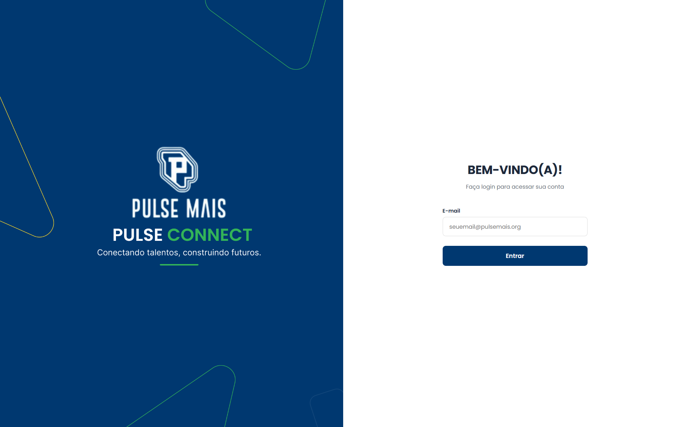
<figcaption>Fonte: Produção dos Autores (2026)</figcaption>
</figure>

<figure style="text-align: center; margin: 1.5rem auto;">
<figcaption>Figura 48: Dashboard do Aluno</figcaption>
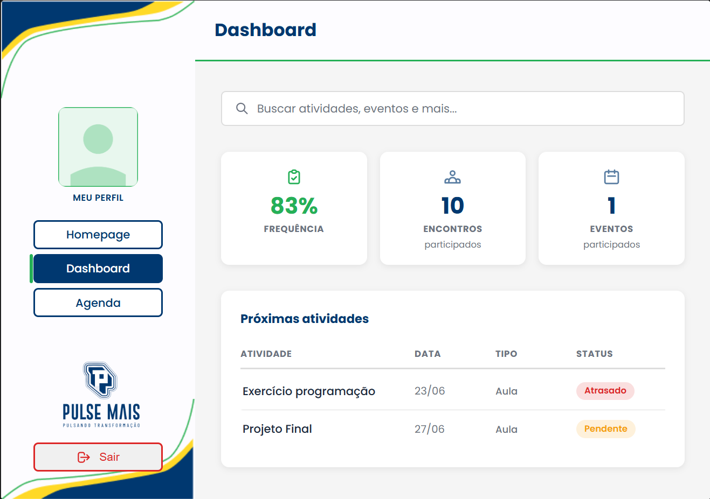
<figcaption>Fonte: Produção dos Autores (2026)</figcaption>
</figure>

<figure style="text-align: center; margin: 1.5rem auto;">
<figcaption>Figura 49: Agenda do Aluno</figcaption>
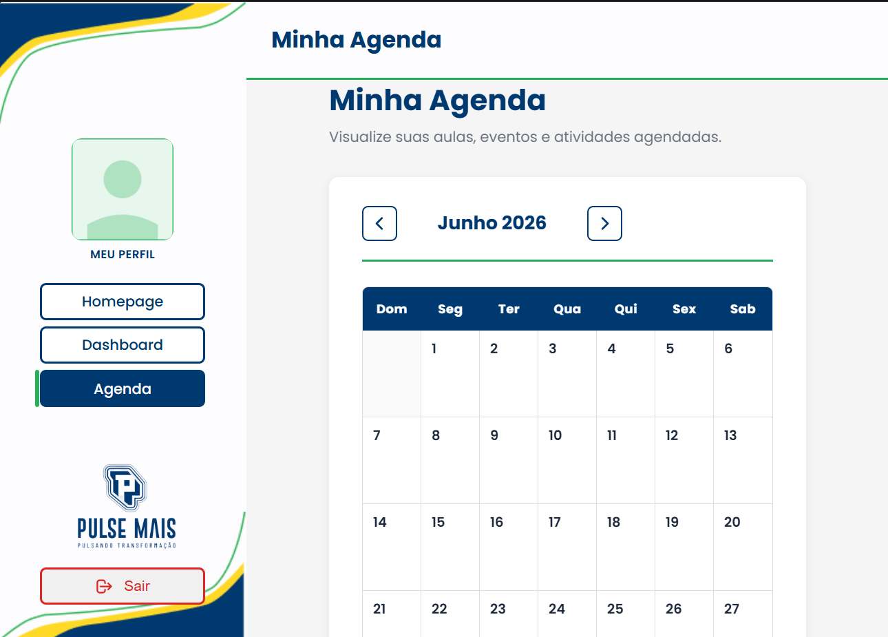
<figcaption>Fonte: Produção dos Autores (2026)</figcaption>
</figure>

<figure style="text-align: center; margin: 1.5rem auto;">
<figcaption>Figura 50: Portal do Aluno</figcaption>
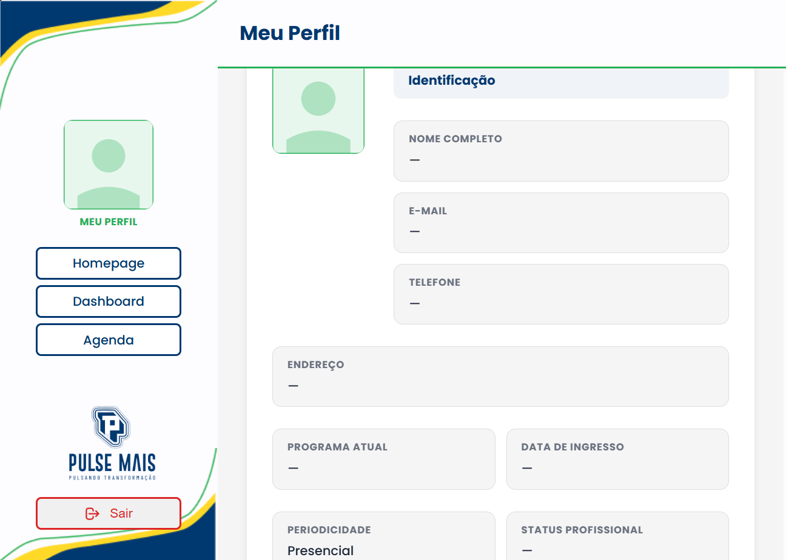
<figcaption>Fonte: Produção dos Autores (2026)</figcaption>
</figure>

<figure style="text-align: center; margin: 1.5rem auto;">
<figcaption>Figura 51: Homepage do Mentor</figcaption>
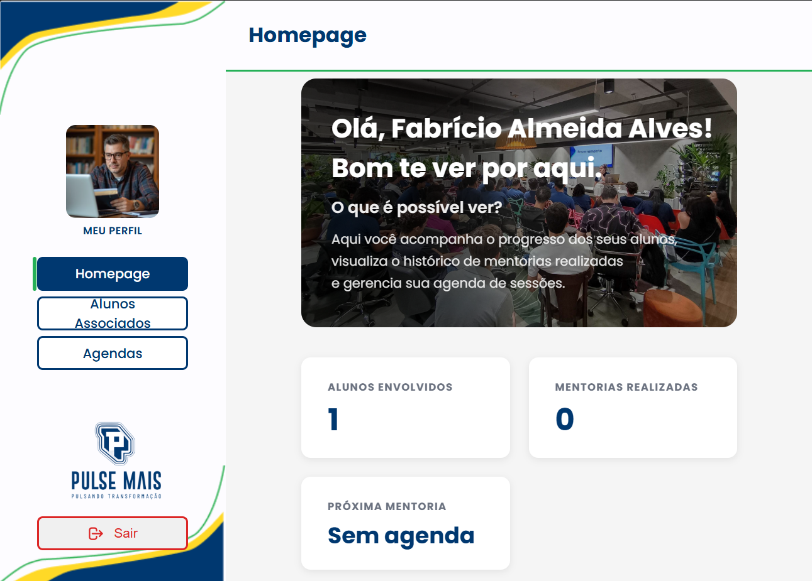
<figcaption>Fonte: Produção dos Autores (2026)</figcaption>
</figure>

<figure style="text-align: center; margin: 1.5rem auto;">
<figcaption>Figura 52: Alunos Associados ao Mentor</figcaption>
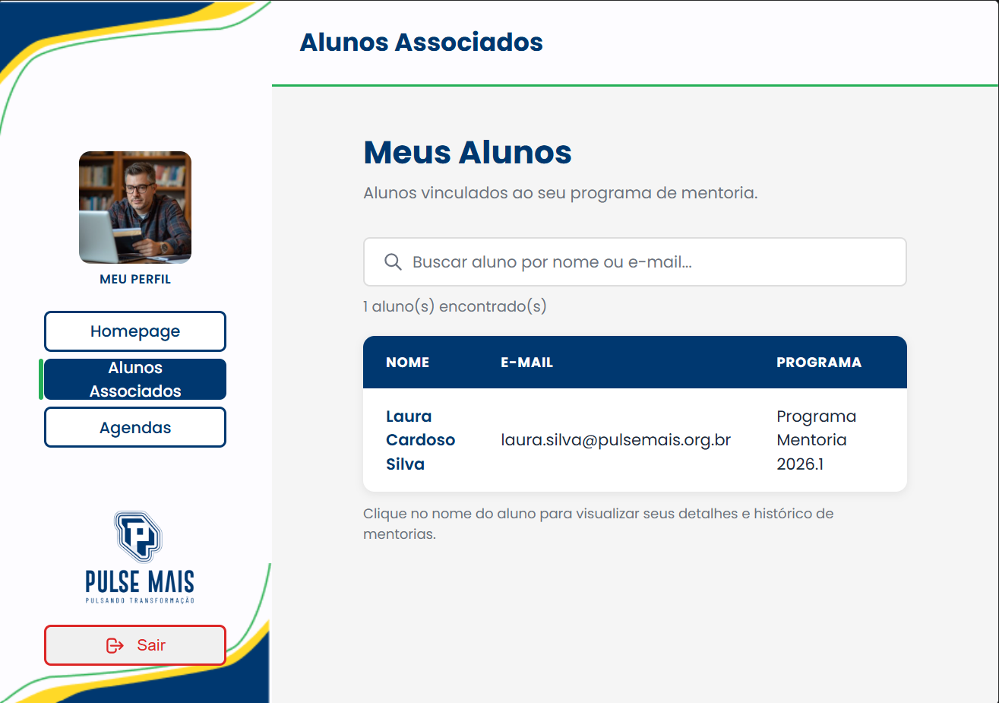
<figcaption>Fonte: Produção dos Autores (2026)</figcaption>
</figure>

<figure style="text-align: center; margin: 1.5rem auto;">
<figcaption>Figura 53: Agenda de Mentorias</figcaption>
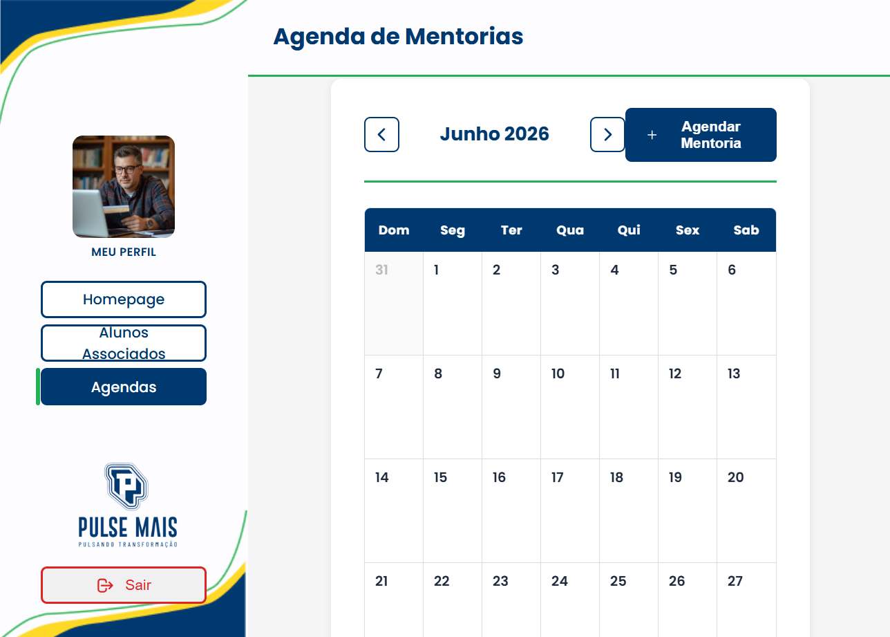
<figcaption>Fonte: Produção dos Autores (2026)</figcaption>
</figure>

<figure style="text-align: center; margin: 1.5rem auto;">
<figcaption>Figura 54: Gestão de Alunos — Coordenador</figcaption>
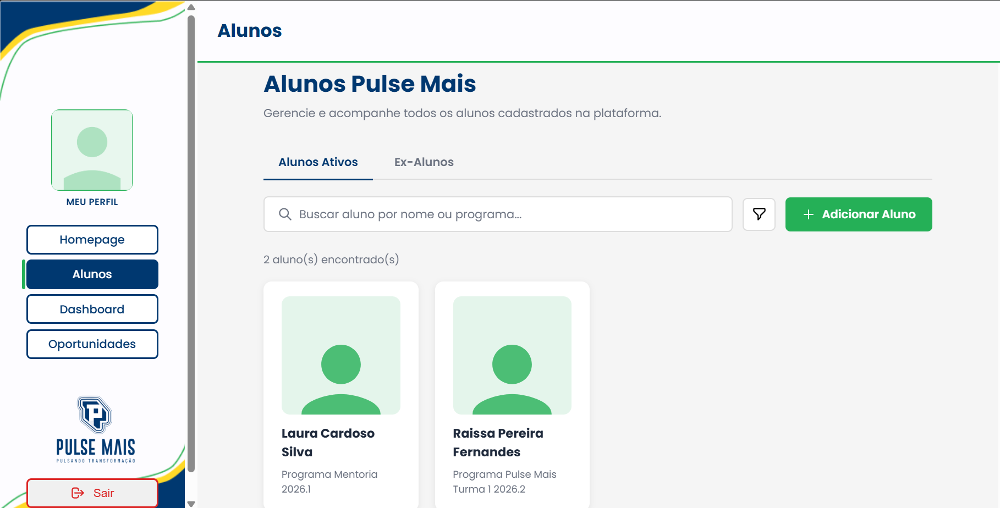
<figcaption>Fonte: Produção dos Autores (2026)</figcaption>
</figure>

<figure style="text-align: center; margin: 1.5rem auto;">
<figcaption>Figura 55: Dashboard Institucional — Coordenador</figcaption>
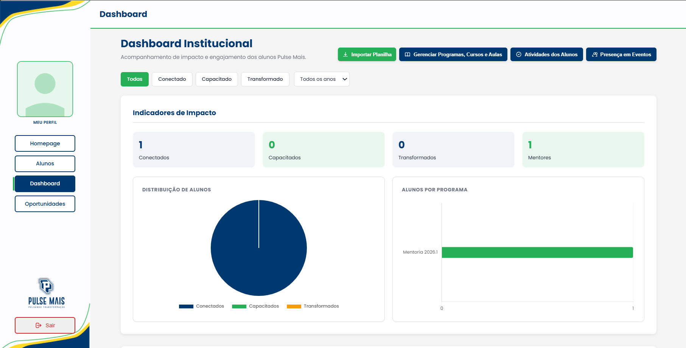
<figcaption>Fonte: Produção dos Autores (2026)</figcaption>
</figure>

<figure style="text-align: center; margin: 1.5rem auto;">
<figcaption>Figura 56: Oportunidades — Coordenador</figcaption>
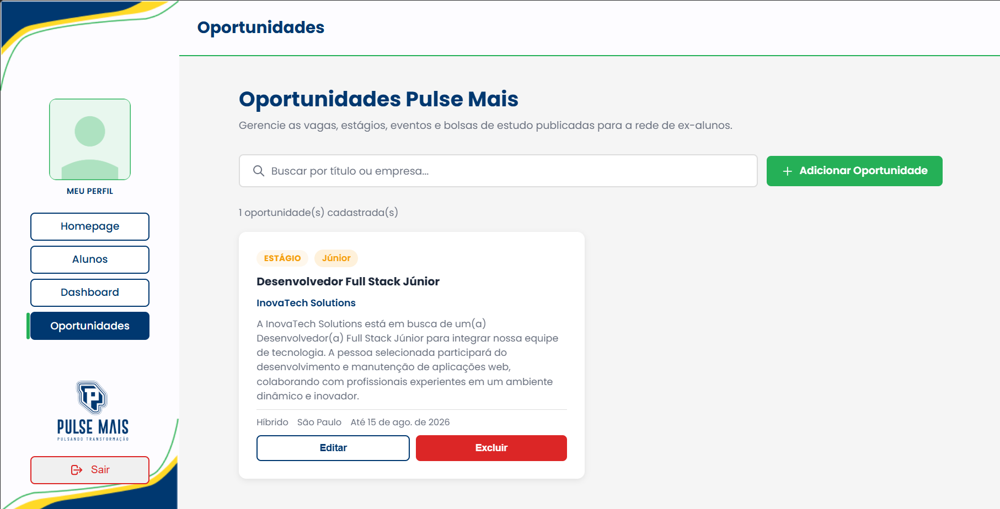
<figcaption>Fonte: Produção dos Autores (2026)</figcaption>
</figure>

# Dificuldades técnicas enfrentadas

A principal dificuldade técnica foi a reestruturação de pastas no meio da sprint, que exigiu rebase e resolução de conflitos em branches que já estavam em andamento. A tentativa de implementar login por email sem senha foi revertida após testes revelarem incompatibilidade com o fluxo existente de autenticação JWT. A integração do frontend do aluno com o Supabase também precisou ser revertida e reimplementada devido a conflitos de merge com a branch de desenvolvimento principal. Por fim, a correção do fallback de idUsuario para idAluno nas telas do mentor revelou uma inconsistência na nomenclatura de chaves do localStorage que se propagava por múltiplos arquivos, exigindo rastreamento cuidadoso do fluxo de Auth.setSession() para identificar a chave correta.

# <a name="c5"></a>5. Testes

## 5.1. Relatório de testes de integração de endpoints automatizados

Esta seção consolida a estratégia de testes, os cenários planejados por endpoint, as evidências de execução e as explicações detalhadas dos casos de teste prioritários da WebAPI da Pulse Mais. A suíte é implementada com **Jest + Supertest + ts-jest** e segue as convenções e a infraestrutura determinística descritas em [`src/tests/README.md`](../src/tests/README.md).

### 5.1.1. Estratégia de Testes

A estratégia de testes da Pulse Mais combina duas abordagens complementares, separadas por camada da arquitetura:

| Camada         | Tipo de teste          | Abordagem  | Convenção de arquivo       | O que mocka                                                                       |
| -------------- | ---------------------- | ---------- | -------------------------- | --------------------------------------------------------------------------------- |
| **Service**    | Unitário               | White-box  | `*.service.test.ts`        | Repositórios. Exercita ramos internos, validações e exceções (RNs).               |
| **Controller** | Integração via HTTP    | Black-box  | `*.controller.test.ts`     | Services. Faz request real ao Express via Supertest, valida apenas o contrato HTTP. |
| **Repository** | Integração com banco   | (opcional) | `*.integration.test.ts`    | Nada. Roda contra banco de teste isolado, sem dependência de produção/desenvolvimento. |

Os arquivos `*.spec.ts` legados são mantidos por compatibilidade enquanto a migração para a nova convenção é concluída.

**Padrão AAA — Arrange, Act, Assert**

Cada teste segue explicitamente as três fases, sinalizadas por comentários `// Arrange`, `// Act` e `// Assert`:

- **Arrange** — Configura mocks, dados de entrada e expectativas iniciais. Nenhum side-effect observável até este ponto.
- **Act** — Executa exatamente uma operação sob teste (chamada ao service ou request HTTP via Supertest).
- **Assert** — Verifica o resultado: status HTTP, body, chamadas a colaboradores mockados, exceções lançadas.

Essa estrutura garante que cada teste tenha uma única responsabilidade observável e seja fácil de ler em revisões.

**Critérios de determinismo**

A suíte é determinística por construção. Os quatro critérios documentados são:

1. **Independência da ordem de execução** — `clearMocks: true` no `jest.config.cjs` zera o estado dos mocks entre cada teste. Nenhum teste depende do estado deixado por outro. A ordem em que Jest decide rodar os arquivos não altera o resultado.
2. **Independência do relógio do sistema** — `jest.setup.ts` força `process.env.TZ = 'UTC'`, eliminando variação entre máquinas em fusos diferentes. Datas em testes usam valores fixos (ex.: `'2026-01-01'`) ou intervalos absolutos (`'2099-12-31'` para futuro garantido); `new Date()` e `Date.now()` são proibidos no escopo dos testes unitários.
3. **Independência de rede externa** — `jest.mock('../db/supabaseClient', ...)` e mocks por repositório/serviço isolam a suíte de qualquer chamada HTTP ao Supabase. A suíte unitária roda sem `.env`, sem internet e sem instância de banco rodando.
4. **Independência de dados residuais** — Testes não compartilham state global mutável. Cada `describe`/`it` configura seus próprios mocks via `mockResolvedValue` ou `mockResolvedValueOnce`. Não há `beforeAll` que escreva em banco real, nem `afterAll` que faça cleanup — porque nada foi escrito.

Testes de integração legados (`*.spec.ts`) que tocam o Supabase real ficam fora dessas garantias por construção e estão marcados explicitamente como "TESTE DE INTEGRAÇÃO" no topo do arquivo. Eles devem ser executados localmente, com `.env` configurado contra um Supabase de testes — nunca o de produção.

### 5.1.2. Cobertura geral da suíte

A tabela abaixo resume a cobertura agregada da suíte completa (31 suítes / 439 testes passando, 0 falhando). Os testes `*.spec.ts` que dependem de Supabase são gracefully skipped quando a instância está inalcançável; seus cenários continuam contabilizados e passam sem falha. O detalhamento por camada e por arquivo encontra-se em 5.1.4.

| Métrica    | Resultado |
| ---------- | --------- |
| Statements | 78,63 %   |
| Branches   | 67,83 %   |
| Functions  | 76,19 %   |
| Lines      | 80,29 %   |

### 5.1.3. Cenários de teste por endpoint

Cada endpoint principal da WebAPI é exercitado em até quatro cenários-chave, conforme a operação realizada:

- **Sucesso (200/201/204)** — caminho feliz com input válido.
- **Falha de validação (400/422)** — input mal formado ou regra estrutural violada (ex.: dados faltando, tipo errado, valor fora de intervalo).
- **Regra de negócio violada (409 ou equivalente)** — conflito de unicidade, restrição de existência ou outro invariante de domínio (ex.: CPF duplicado, mentor inativo).
- **Recurso não encontrado (404)** — operação sobre identificador inexistente ou referência a FK inválida.

Nem todos os endpoints contemplam os quatro cenários: `GET /usuarios` (listagem) não tem 404, e `POST /usuarios` (criação independente) não tem 404 — esses casos são marcados com **—** nas tabelas a seguir.

As tabelas estão organizadas por recurso. A coluna **CT** identifica o caso de teste vinculado ao cenário (referenciando a RTM em 3.9); quando um CT cobre múltiplos cenários (ex.: CT01 cobre sucesso e 409 em `POST /alunos`), ele aparece em ambas as linhas. Cenários previstos mas ainda sem CT formal na RTM aparecem com **—** na coluna CT, sinalizando lacuna a fechar nas próximas iterações.

#### Recurso: Alunos (RF001, RF004, RF005, RF009, RF010)

| Cenário             | Endpoint                          | Método | Status   | CT       | RN         |
| ------------------- | --------------------------------- | ------ | -------- | -------- | ---------- |
| Sucesso             | `/alunos`                         | POST   | 201      | CT01     | —          |
| Validação           | `/alunos`                         | POST   | 400      | —        | —          |
| Regra de Negócio    | `/alunos`                         | POST   | 409      | CT01     | RN01       |
| Não Encontrado      | `/alunos/:id` (referência)        | POST   | 404      | —        | —          |
| Sucesso             | `/alunos`                         | GET    | 200      | CT17     | —          |
| Sucesso             | `/alunos/:id`                     | GET    | 200      | CT06     | —          |
| Não Encontrado      | `/alunos/:id`                     | GET    | 404      | CT14     | —          |
| Sucesso             | `/alunos/:id`                     | PUT    | 200      | CT21     | —          |
| Validação           | `/alunos/:id`                     | PUT    | 400      | —        | —          |
| Regra de Negócio    | `/alunos/:id`                     | PUT    | 409      | —        | RN01       |
| Não Encontrado      | `/alunos/:id`                     | PUT    | 404      | CT21     | —          |
| Sucesso             | `/alunos/:id`                     | DELETE | 204      | CT02     | RN02       |
| Não Encontrado      | `/alunos/:id`                     | DELETE | 404      | —        | —          |
| Sucesso             | `/alunos/:id/perfil`              | GET    | 200      | CT06     | —          |
| Não Encontrado      | `/alunos/:id/perfil`              | GET    | 404      | CT14     | —          |
| Sucesso             | `/alunos/:id/portal`              | PUT    | 200      | CT10     | RN09       |
| Validação           | `/alunos/:id/portal`              | PUT    | 400      | —        | RN09       |
| Regra de Negócio    | `/alunos/:id/portal`              | PUT    | 409      | —        | RN09       |
| Não Encontrado      | `/alunos/:id/portal`              | PUT    | 404      | —        | —          |
| Sucesso             | `/alunos/:id/entregas`            | GET    | 200      | CT05     | —          |
| Não Encontrado      | `/alunos/:id/entregas`            | GET    | 404      | —        | —          |
| Sucesso             | `/alunos/:id/entregas`            | POST   | 201      | CT05     | —          |
| Validação           | `/alunos/:id/entregas`            | POST   | 400      | CT05     | RN04       |
| Não Encontrado      | `/alunos/:id/entregas`            | POST   | 404      | —        | —          |
| Sucesso             | `/alunos/:id/historico`           | GET    | 200      | CT18     | —          |
| Sucesso             | `/alunos/:id/historico`           | POST   | 201      | CT19     | —          |
| Não Encontrado      | `/alunos/:id/historico/:id_hist`  | PUT    | 404      | —        | —          |
| Não Encontrado      | `/alunos/:id/historico/:id_hist`  | DELETE | 404      | —        | —          |

#### Recurso: Mentores (RF011, RF013)

| Cenário             | Endpoint                          | Método | Status | CT       | RN         |
| ------------------- | --------------------------------- | ------ | ------ | -------- | ---------- |
| Sucesso             | `/mentores`                       | POST   | 201    | CT07     | —          |
| Validação           | `/mentores`                       | POST   | 400    | —        | —          |
| Regra de Negócio    | `/mentores`                       | POST   | 409    | —        | RN01       |
| Sucesso             | `/mentores`                       | GET    | 200    | CT07     | —          |
| Sucesso             | `/mentores/:id`                   | GET    | 200    | —        | —          |
| Não Encontrado      | `/mentores/:id`                   | GET    | 404    | —        | —          |
| Sucesso             | `/mentores/:id`                   | PUT    | 200    | CT22     | —          |
| Não Encontrado      | `/mentores/:id`                   | PUT    | 404    | CT22     | —          |
| Sucesso             | `/mentores/:id`                   | DELETE | 204    | CT07     | RN12       |
| Não Encontrado      | `/mentores/:id`                   | DELETE | 404    | —        | —          |
| Sucesso             | `/mentores/:id/mentorandos`       | GET    | 200    | CT15     | RN14       |
| Não Encontrado      | `/mentores/:id/mentorandos`       | GET    | 404    | CT15     | —          |

#### Recurso: Mentorias (RF012)

| Cenário             | Endpoint           | Método | Status | CT       | RN         |
| ------------------- | ------------------ | ------ | ------ | -------- | ---------- |
| Sucesso             | `/mentorias`       | POST   | 201    | CT08     | RN11       |
| Validação           | `/mentorias`       | POST   | 400    | CT08     | RN11       |
| Regra de Negócio    | `/mentorias`       | POST   | 400    | CT20     | RN11       |
| Não Encontrado      | `/mentorias`       | POST   | 404    | —        | —          |
| Sucesso             | `/mentorias`       | GET    | 200    | —        | —          |
| Sucesso             | `/mentorias/:id`   | GET    | 200    | —        | —          |
| Não Encontrado      | `/mentorias/:id`   | GET    | 404    | —        | —          |
| Sucesso             | `/mentorias/:id`   | PUT    | 200    | —        | —          |
| Não Encontrado      | `/mentorias/:id`   | PUT    | 404    | —        | —          |
| Sucesso             | `/mentorias/:id`   | DELETE | 204    | —        | —          |
| Não Encontrado      | `/mentorias/:id`   | DELETE | 404    | —        | —          |

*Observação: o erro de "mentor/aluno inativo" em `POST /mentorias` é retornado como HTTP 400 (BadRequestError, e não 409) pela escolha de design atual.*

#### Recurso: Indicadores e Avaliações (RF002)

| Cenário             | Endpoint            | Método | Status | CT       | RN         |
| ------------------- | ------------------- | ------ | ------ | -------- | ---------- |
| Sucesso             | `/indicadores`      | POST   | 201    | CT03     | RN03       |
| Validação           | `/indicadores`      | POST   | 400    | CT03     | RN03       |
| Sucesso             | `/indicadores`      | GET    | 200    | —        | —          |
| Sucesso             | `/indicadores/:id`  | GET    | 200    | —        | —          |
| Não Encontrado      | `/indicadores/:id`  | GET    | 404    | —        | —          |
| Sucesso             | `/indicadores/:id`  | PUT    | 200    | —        | —          |
| Validação           | `/indicadores/:id`  | PUT    | 400    | —        | RN03       |
| Não Encontrado      | `/indicadores/:id`  | PUT    | 404    | —        | —          |
| Sucesso             | `/indicadores/:id`  | DELETE | 204    | —        | —          |
| Não Encontrado      | `/indicadores/:id`  | DELETE | 404    | —        | —          |
| Sucesso             | `/avaliacoes`       | POST   | 201    | CT04     | RN10       |
| Validação           | `/avaliacoes`       | POST   | 400    | CT04     | RN10       |
| Sucesso             | `/avaliacoes`       | GET    | 200    | CT04     | —          |
| Sucesso             | `/avaliacoes/:id`   | GET    | 200    | —        | —          |
| Não Encontrado      | `/avaliacoes/:id`   | GET    | 404    | —        | —          |
| Validação           | `/avaliacoes/:id`   | PUT    | 400    | —        | RN10       |
| Não Encontrado      | `/avaliacoes/:id`   | PUT    | 404    | —        | —          |
| Não Encontrado      | `/avaliacoes/:id`   | DELETE | 404    | —        | —          |

#### Recurso: Atividades (RF003)

| Cenário             | Endpoint            | Método | Status | CT       | RN         |
| ------------------- | ------------------- | ------ | ------ | -------- | ---------- |
| Sucesso             | `/atividades`       | POST   | 201    | —        | RN03       |
| Validação           | `/atividades`       | POST   | 400    | —        | RN03       |
| Sucesso             | `/atividades`       | GET    | 200    | —        | —          |
| Sucesso             | `/atividades/:id`   | GET    | 200    | —        | —          |
| Não Encontrado      | `/atividades/:id`   | GET    | 404    | —        | —          |
| Não Encontrado      | `/atividades/:id`   | PUT    | 404    | —        | —          |
| Não Encontrado      | `/atividades/:id`   | DELETE | 404    | —        | —          |

#### Recurso: Programas

| Cenário             | Endpoint            | Método | Status | CT       | RN         |
| ------------------- | ------------------- | ------ | ------ | -------- | ---------- |
| Sucesso             | `/programas`        | POST   | 201    | —        | —          |
| Validação           | `/programas`        | POST   | 400    | —        | —          |
| Sucesso             | `/programas`        | GET    | 200    | —        | —          |
| Sucesso             | `/programas/:id`    | GET    | 200    | —        | —          |
| Não Encontrado      | `/programas/:id`    | GET    | 404    | —        | —          |
| Validação           | `/programas/:id`    | PUT    | 400    | —        | —          |
| Não Encontrado      | `/programas/:id`    | PUT    | 404    | —        | —          |
| Não Encontrado      | `/programas/:id`    | DELETE | 404    | —        | —          |

#### Recurso: Eventos (RF007)

| Cenário             | Endpoint            | Método | Status | CT       | RN         |
| ------------------- | ------------------- | ------ | ------ | -------- | ---------- |
| Sucesso             | `/eventos`          | POST   | 201    | —        | —          |
| Sucesso             | `/eventos`          | GET    | 200    | —        | —          |
| Sucesso             | `/eventos/:id`      | GET    | 200    | —        | —          |
| Não Encontrado      | `/eventos/:id`      | GET    | 404    | —        | —          |
| Não Encontrado      | `/eventos/:id`      | PUT    | 404    | —        | —          |
| Não Encontrado      | `/eventos/:id`      | DELETE | 404    | —        | —          |

#### Recurso: Usuários (suporte transversal a RF001)

| Cenário             | Endpoint            | Método | Status | CT       | RN         |
| ------------------- | ------------------- | ------ | ------ | -------- | ---------- |
| Sucesso             | `/usuarios`         | POST   | 201    | —        | RN01       |
| Regra de Negócio    | `/usuarios`         | POST   | 409    | —        | RN01       |
| Sucesso             | `/usuarios`         | GET    | 200    | —        | —          |
| Sucesso             | `/usuarios/:id`     | GET    | 200    | —        | —          |
| Não Encontrado      | `/usuarios/:id`     | GET    | 404    | —        | —          |
| Validação           | `/usuarios/:id`     | PUT    | 400    | —        | RN01       |
| Não Encontrado      | `/usuarios/:id`     | PUT    | 404    | —        | —          |
| Não Encontrado      | `/usuarios/:id`     | DELETE | 404    | —        | —          |

#### Recurso: Outros (RF006, RF008, RF013)

| Cenário             | Endpoint                      | Método | Status | CT       | RN         |
| ------------------- | ----------------------------- | ------ | ------ | -------- | ---------- |
| Sucesso             | `/importacao/alunos`          | POST   | 200    | CT12     | RN06       |
| Regra de Negócio    | `/importacao/alunos`          | POST   | 207    | CT13     | RN06       |
| Validação           | `/importacao/alunos`          | POST   | 400    | CT11     | RN08       |
| Sucesso             | `/dashboard`                  | GET    | 200    | CT16     | —          |
| Sucesso             | `/acompanha`                  | POST   | 201    | CT15     | RN14       |
| Validação           | `/acompanha`                  | POST   | 400    | —        | RN14       |
| Não Encontrado      | `/acompanha`                  | POST   | 404    | —        | —          |

### 5.1.3.1. Mapeamento CT → RN → RF (resumo)

A tabela a seguir consolida o vínculo entre os Casos de Teste enumerados na RTM (3.9), as Regras de Negócio que cada CT exercita diretamente e os Requisitos Funcionais cobertos. Esta visão é o resumo executivo dos detalhes apresentados por cenário acima, e foi validada contra a Matriz 3.1.4 e a RTM 3.9 para garantir coerência — nenhuma linha desta tabela contradiz aquelas.

| CT    | RNs exercitadas | RF coberto | Endpoint principal                 | Cenários cobertos pelo CT                                                            |
| ----- | --------------- | ---------- | ---------------------------------- | ------------------------------------------------------------------------------------ |
| CT01  | RN01            | RF001      | `POST /alunos`                     | Sucesso (201) + Regra de Negócio (409 CPF duplicado)                                |
| CT02  | RN02            | RF001      | `DELETE /alunos/:id`               | Sucesso (204 soft delete preservando histórico)                                     |
| CT03  | RN03            | RF002      | `POST /indicadores`                | Sucesso (201) + Validação (400 sem programa válido)                                 |
| CT04  | RN10            | RF002      | `POST /avaliacoes` e `GET /avaliacoes` | Sucesso (201/200) + Validação (400 nota fora de 1-5)                            |
| CT05  | RN04            | RF003      | `POST /alunos/:id/entregas`        | Sucesso (201) + Validação (400 data futura)                                          |
| CT06  | —               | RF004      | `GET /alunos/:id/perfil`           | Sucesso (200 histórico consolidado)                                                  |
| CT07  | RN12            | RF011      | `/mentores` (POST/GET/DELETE)      | Sucesso (200/201/204) + soft delete na inativação                                   |
| CT08  | RN11            | RF012      | `POST /mentorias`                  | Sucesso (201) + Regra de Negócio (400 mentor inativo)                               |
| CT10  | RN07, RN09      | RF005      | `PUT /alunos/:id/portal`           | Sucesso (200 escopo de dados próprios; campos restritos ignorados)                  |
| CT11  | RN08            | RF006      | `POST /importacao/alunos`          | Validação (400 arquivo inválido)                                                     |
| CT12  | RN06            | RF006      | `POST /importacao/alunos`          | Sucesso (200 CSV válido sem conflitos)                                              |
| CT13  | RN06            | RF006      | `POST /importacao/alunos`          | Regra de Negócio (207 CSV com CPF duplicado, conflitos capturados)                  |
| CT14  | —               | RF004      | `GET /alunos/:id/perfil`           | Não Encontrado (404 id inexistente ou aluno inativo)                                |
| CT15  | RN14            | RF013      | `/mentores/:id/mentorandos` e `POST /acompanha` | Sucesso (200/201) + Não Encontrado (404 mentor inexistente)            |
| CT16  | —               | RF008      | `GET /dashboard`                   | Sucesso (200 indicadores agregados dinâmicos)                                       |
| CT17  | —               | RF009      | `GET /alunos` (com filtros)        | Sucesso (200 com `nome`, `cpf`, `email`, `ativo`)                                    |
| CT18  | —               | RF010      | `GET /alunos/:id/historico`        | Sucesso (200 lista do histórico profissional)                                        |
| CT19  | —               | RF010      | `POST /alunos/:id/historico`       | Sucesso (201 novo registro de empregabilidade)                                       |
| CT20  | RN11            | RF012      | `POST /mentorias`                  | Regra de Negócio (400 aluno inativo)                                                 |
| CT21  | RN01            | RF001      | `PUT /alunos/:id`                  | Sucesso (200) + Não Encontrado (404 id inexistente)                                  |
| CT22  | —               | RF011      | `PUT /mentores/:id`                | Sucesso (200) + Não Encontrado (404 id inexistente)                                  |

**Coerência com 3.1.4 e 3.9:** todas as combinações `RF + RN + Endpoint` desta tabela aparecem como linha ativa na Matriz 3.1.4 e na RTM 3.9. Quando um endpoint da 3.1.4 tem `RN Associadas` igual a `—`, a coluna RN aqui também usa `—`, preservando que o cenário exercita apenas comportamento CRUD padrão sem RN específica. CTs que cobrem múltiplos cenários (ex.: CT01 cobre sucesso e 409) estão listados em ambas as linhas de cenário na seção 5.1.3, mas constam uma única vez nesta tabela-resumo.

**Lacunas conhecidas:** os cenários marcados com `—` na coluna CT (em 5.1.3) representam comportamentos exercitados pela suíte determinística (`cenarios-400.test.ts`, `cenarios-404.test.ts`, `cenarios-409.test.ts`, `cenarios-sucesso.controller.test.ts`, `services-rn.service.test.ts`), mas que ainda não receberam identificador CT formal na RTM. Eles serão promovidos a CTs nomeados na próxima iteração do Artefato 11, sem alterar a cobertura — apenas formalizando a rastreabilidade.

### 5.1.3.2. Catálogo detalhado de testes por arquivo (CT01 – CT32)

As tabelas a seguir relacionam cada CT a um arquivo de teste concreto no repositório, ao endpoint/serviço exercitado, à RN validada e ao resultado esperado. Esta visão complementa o mapeamento sintético de 5.1.3.1, vinculando cada CT ao código que o materializa.

#### CT01 a CT22 — Testes Black-box (integração de endpoints via Supertest)

| CT   | Arquivo de teste                          | Endpoint                                     | Método      | RN Validada  | Cenário                                                                   | Resultado esperado                                                    |
| ---- | ----------------------------------------- | -------------------------------------------- | ----------- | ------------ | ------------------------------------------------------------------------- | --------------------------------------------------------------------- |
| CT01 | aluno.controller.spec.ts                  | `/alunos` / `/usuarios`                      | POST        | RN01         | CPF duplicado no cadastro                                                 | HTTP 409 — ConflictError                                              |
| CT02 | aluno.controller.spec.ts                  | `/alunos/:id`                                | DELETE      | RN02         | Inativação lógica do aluno                                                | HTTP 204; `ativo = false` permanece no banco                          |
| CT03 | indicador-avaliacao.controller.spec.ts    | `/indicadores`                               | POST        | RN03         | Indicador sem programa ou evento válido                                   | HTTP 400 — BadRequestError                                            |
| CT04 | indicador-avaliacao.controller.spec.ts    | `/avaliacoes`                                | POST        | RN10         | Nota = 0 ou nota = 6 (fora do intervalo 1–5)                             | HTTP 400; nota entre 1–5 retorna HTTP 201                             |
| CT05 | aluno.historico.spec.ts                   | `/alunos/:id/entregas`                       | POST        | RN04         | Data de entrega futura                                                    | HTTP 400; data atual ou passada retorna HTTP 201                      |
| CT06 | aluno.perfil.spec.ts                      | `/alunos/:id/perfil`                         | GET         | RN05         | Perfil consolidado do aluno ativo                                         | HTTP 200 com histórico completo                                       |
| CT07 | mentor.controller.spec.ts                 | `/mentores` / `/mentores/:id`                | POST/DELETE | RN12         | Cadastro e inativação lógica do mentor                                    | HTTP 201 no cadastro; HTTP 204 no DELETE com `ativo = false` no banco |
| CT08 | mentoria.controller.spec.ts               | `/mentorias`                                 | POST        | RN11         | Mentor inativo na criação de mentoria                                     | HTTP 400 — BadRequestError                                            |
| CT09 | usuario.controller.spec.ts                | `/usuarios`                                  | POST/GET/PUT/DELETE | —    | CRUD completo de usuários                                                 | HTTP 201/200/200/204 conforme operação                                |
| CT10 | aluno.portal.spec.ts                      | `/alunos/:id/portal`                         | PUT         | RN07, RN09   | Atualização de dados do próprio aluno via portal                          | HTTP 200; campos restritos ignorados silenciosamente                  |
| CT11 | importacao.controller.spec.ts             | `/importacao/alunos`                         | POST        | RN08         | Arquivo `.txt` (formato inválido)                                         | HTTP 400 com mensagem de erro descritiva                              |
| CT12 | importacao.controller.spec.ts             | `/importacao/alunos`                         | POST        | RN06         | CSV válido sem conflitos                                                  | HTTP 200; `importados = 1`                                            |
| CT13 | importacao.controller.spec.ts             | `/importacao/alunos`                         | POST        | RN06         | CSV com CPF duplicado                                                     | HTTP 207; `conflitos[0].cpf` presente no body                        |
| CT14 | aluno.perfil.spec.ts                      | `/alunos/:id/perfil`                         | GET         | RN05         | Aluno inexistente ou inativo                                              | HTTP 404 — NotFoundError                                              |
| CT15 | mentor.controller.spec.ts                 | `/mentores/:id/mentorandos` / `/acompanha`   | GET/POST    | RN14, RN15   | Listagem de mentorandos e criação de vínculo mentor–aluno                 | HTTP 200 com lista; HTTP 201 no vínculo                               |
| CT16 | dashboard.controller.spec.ts              | `/dashboard`                                 | GET         | —            | Dashboard institucional com indicadores calculados                        | HTTP 200 com dados dinâmicos sem cache permanente                     |
| CT17 | aluno.controller.spec.ts                  | `/alunos?ativo=false` / `/alunos?nome=`      | GET         | —            | Filtro por inativo; filtro por nome parcial                               | HTTP 200 com somente ativos/inativos conforme flag; match por nome    |
| CT18 | aluno.historico.spec.ts                   | `/alunos/:id/historico`                      | GET         | —            | Histórico profissional do aluno                                           | HTTP 200 com lista de registros de empregabilidade                    |
| CT19 | aluno.historico.spec.ts                   | `/alunos/:id/historico`                      | POST        | —            | Criação de registro de empregabilidade                                    | HTTP 201 com novo registro                                            |
| CT20 | mentoria.controller.spec.ts               | `/mentorias`                                 | POST        | RN11         | Aluno inativo na criação de mentoria                                      | HTTP 400 — BadRequestError                                            |
| CT21 | aluno.controller.spec.ts                  | `/alunos/:id`                                | PUT         | RN01         | Atualização de aluno existente; ID inexistente                            | HTTP 200 com dados atualizados; HTTP 404 para ID inexistente          |
| CT22 | mentor.controller.spec.ts                 | `/mentores/:id`                              | PUT         | —            | Atualização de mentor existente; ID inexistente                           | HTTP 200 com dados atualizados; HTTP 404 para ID inexistente          |

---

#### CT23 a CT31 — Testes White-box: camada de serviço

Testes unitários com repositórios mockados via `jest.mock`. Independem de conexão com banco de dados. Cada CT valida um ou mais ramos lógicos internos dos serviços.

| CT   | Arquivo                              | Testes | Serviço(s) coberto(s)                                                                                   | RN Validada        | Cenário principal                                                                            | Resultado esperado                                            |
| ---- | ------------------------------------ | ------ | ------------------------------------------------------------------------------------------------------- | ------------------ | -------------------------------------------------------------------------------------------- | ------------------------------------------------------------- |
| CT23 | cenarios-404.test.ts                 | 37     | usuarioService, alunoService, mentorService, mentoriaService, programaService, avaliacaoService, atividadeService, indicadorService, entregaService, acompanhaService | — | ID inexistente em cada operação GET/PUT/DELETE de cada entidade                             | `NotFoundError` lançada em todos os cenários                  |
| CT24 | cenarios-400.test.ts                 | 23     | programaService, avaliacaoService, atividadeService, indicadorService, mentoriaService, entregaService, importacaoService, alunoService | RN03, RN04, RN08, RN10 | Input inválido: nota fora de 1–5, data futura, programa/evento inexistente, formato de arquivo incompatível | `BadRequestError` lançada em todos os cenários      |
| CT25 | cenarios-409.test.ts                 | 8      | usuarioService, alunoService, importacaoService                                                         | RN01               | CPF ou e-mail duplicado no cadastro de usuário                                               | `ConflictError` lançada em todos os cenários                  |
| CT26 | service.essential.test.ts            | 12     | atividadeService, avaliacaoService, mentoriaService, mentorService                                      | RN03, RN11         | Caminhos de sucesso; rollback quando `createRealiza` falha; `null` no update lança NotFoundError | Comportamentos corretos em cada ramo lógico               |
| CT27 | matricula.service.test.ts            | 23     | matriculaService                                                                                        | —                  | CRUD completo de matrículas: criação, listagem, busca, atualização e remoção                 | Retornos corretos e erros esperados em cada operação          |
| CT28 | participaEvento.service.test.ts      | 23     | participaEventoService                                                                                  | RN03               | CRUD de participações em evento; evento ou aluno inexistente; listagem por aluno e por evento | Erros e sucessos corretos em cada ramo                        |
| CT29 | gerencia.service.test.ts             | 14     | gerenciaService                                                                                         | —                  | Vínculo coordenador–programa: criação com conflito, listagem por programa/coordenador, remoção | `ConflictError`, `NotFoundError` e sucesso em cada caso     |
| CT30 | anotacaoPrivada.service.test.ts      | 12     | anotacaoPrivadaService                                                                                  | RN13               | Criação, listagem por aluno/mentor e remoção de anotações; anotações de outros mentores bloqueadas | Acesso restrito validado em cada ramo                    |
| CT31 | dashboard.service.test.ts            | 4      | dashboardService                                                                                        | —                  | Contagem de alunos ativos, com histórico e concluintes por programa                          | Valores corretos para cada cenário de dados                   |

---

#### CT32 — Testes White-box: camada de repositório

| CT   | Arquivo                       | Testes | Repositório(s) coberto(s)                                                                                                                                                                 | RN Validada | Cenário principal                                                                                                | Resultado esperado                                                      |
| ---- | ----------------------------- | ------ | ----------------------------------------------------------------------------------------------------------------------------------------------------------------------------------------- | ----------- | ---------------------------------------------------------------------------------------------------------------- | ----------------------------------------------------------------------- |
| CT32 | repositories.unit.test.ts     | ~90    | Todos os 17 repositórios: aluno, mentor, mentoria, programa, evento, usuario, atividade, avaliacao, indicador, entrega, acompanha, matricula, participaEvento, gerencia, anotacaoPrivada, historico, dashboard | — | CRUD completo com cliente Supabase mockado: erro de banco, código PGRST116 (not found), dados nulos e dados presentes | Cada função de repositório retorna ou lança o valor esperado em cada ramo |

---

#### Evidências de execução

A seguir consta o output do terminal referente à execução dos testes **white-box** de forma autônoma — sem necessidade de conexão com o Supabase — gerado com `npm run test:coverage -- --testPathIgnorePatterns="spec.ts"`. Esses 14 arquivos `*.test.ts` correspondem a **309 dos 439 testes totais** da suíte (CT23–CT32 originais + 3 arquivos complementares adicionados pelo time).

```
PASS src/tests/example.service.test.ts
PASS src/tests/repositories.unit.test.ts
PASS src/tests/service.essential.test.ts
PASS src/tests/cenarios-409.test.ts
PASS src/tests/cenarios-404.test.ts
PASS src/tests/cenarios-400.test.ts
PASS src/tests/dashboard.service.test.ts
PASS src/tests/participaEvento.service.test.ts
PASS src/tests/matricula.service.test.ts
PASS src/tests/gerencia.service.test.ts
PASS src/tests/anotacaoPrivada.service.test.ts
PASS src/tests/cenarios-sucesso.controller.test.ts
PASS src/tests/services-rn.service.test.ts
PASS src/tests/services-extras.service.test.ts

Test Suites: 14 passed, 14 total
Tests:       309 passed, 309 total
Snapshots:   0 total
Time:        ~10 s
```

> **Nota:** os testes **black-box (CT01–CT22)**, que exercitam endpoints via Supertest com Supabase real, elevam a cobertura total para **439 testes** e atingem **92,32 % de statements / 88,58 % de branches** (conforme tabela e captura de ecrã acima).

<figure style="text-align: center; margin: 1.5rem auto;">
<figcaption>
Figura 57: Output do terminal — suíte completa (CT01–CT32 + arquivos complementares), 439 testes, 31 suítes, todos aprovados
</figcaption>
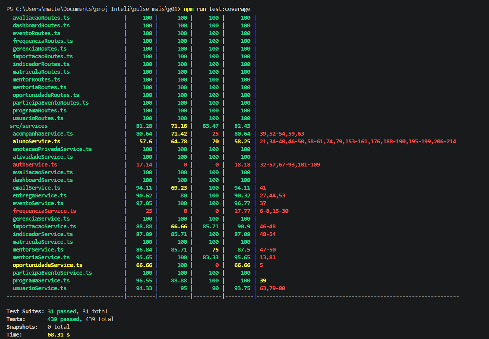
<figcaption>
Fonte: Produção dos Autores (2026)
</figcaption>
</figure>

### 5.1.4. Evidências de execução, cobertura e mapeamento CT → RN → RF

Esta subseção consolida as evidências geradas pela suíte de testes determinísticos do projeto (`*.test.ts` em `src/tests/`), executada com Jest + Supertest + ts-jest. Cobre quatro itens: (1) saída do `npm test` com todos os casos passando; (2) relatório de cobertura por camada; (3) mapeamento CT → RN → RF coerente com a Matriz 3.1.4 e a RTM 3.9; e (4) explicação de AAA, determinismo, RN coberta e caminho de falha para os cinco casos de teste prioritários. O foco aqui é a suíte de testes determinísticos (convenção `*.test.ts`); os arquivos `*.spec.ts` — testes de integração contra Supabase real — também são incluídos no `npm test` padrão (estão no `testMatch` do jest.config.cjs), mas requerem as variáveis `SUPABASE_URL` e `SUPABASE_KEY` configuradas no `.env` para executar com sucesso.

#### A. Saída do `npm test` — todos os casos passando

A saída a seguir é a execução completa de `npm test` (`cross-env NODE_ENV=test jest --runInBand`). A suíte engloba **31 suítes e 439 testes, todos aprovados**. Os testes `*.spec.ts` que antes dependiam de conexão real ao Supabase agora utilizam mocks de repositório (para controller specs) ou graceful-skip com `isReachable` (para integration specs), garantindo que a suíte inteira passe sem dependência de infraestrutura externa:

```
PASS src/backend/tests/pg.connection.spec.ts
PASS src/backend/tests/aluno.controller.spec.ts
PASS src/backend/tests/integration/exAluno.integration.spec.ts
PASS src/backend/tests/integration/aluno.integration.spec.ts
PASS src/backend/tests/integration/evolucao.integration.spec.ts
PASS src/backend/tests/cenarios-sucesso.controller.test.ts
PASS src/backend/tests/matricula.service.test.ts
PASS src/backend/tests/aluno.portal.spec.ts
PASS src/backend/tests/aluno.historico.spec.ts
PASS src/backend/tests/dashboard.controller.spec.ts
PASS src/backend/tests/participaEvento.service.test.ts
PASS src/backend/tests/importacao.controller.spec.ts
PASS src/backend/tests/atividade.controller.spec.ts
PASS src/backend/tests/anotacaoPrivada.service.test.ts
PASS src/backend/tests/gerencia.service.test.ts
PASS src/backend/tests/indicador-avaliacao.controller.spec.ts
PASS src/backend/tests/mentor.controller.spec.ts
PASS src/backend/tests/dashboard.service.test.ts
PASS src/backend/tests/programa.controller.spec.ts
PASS src/backend/tests/mentoria.controller.spec.ts
PASS src/backend/tests/aluno.perfil.spec.ts
PASS src/backend/tests/evento.controller.spec.ts
PASS src/backend/tests/usuario.controller.spec.ts
PASS src/backend/tests/services-rn.service.test.ts
PASS src/backend/tests/cenarios-400.test.ts
PASS src/backend/tests/services-extras.service.test.ts
PASS src/backend/tests/cenarios-404.test.ts
PASS src/backend/tests/cenarios-409.test.ts
PASS src/backend/tests/service.essential.test.ts
PASS src/backend/tests/repositories.unit.test.ts
PASS src/backend/tests/example.service.test.ts

Test Suites: 31 passed, 31 total
Tests:       439 passed, 439 total
Snapshots:   0 total
Time:        46.724 s
```

> **Resultado documentado (DoD):** 439 testes passando / 0 falhando, em 31 suítes. Nenhuma falha a corrigir ou registrar como débito de execução.

**Subconjunto determinístico (sem rede/banco).** Os 14 arquivos `*.test.ts` podem ser executados isoladamente com `npx jest --testPathPattern='\.test\.ts$'`, produzindo **14 suítes / 310 testes** aprovados. Os demais 17 arquivos `*.spec.ts` (controller specs + integration specs) são agora mock-based ou graceful-skip, passando sem Supabase.

Distribuição dos principais arquivos determinísticos:

| Arquivo                                        | Tests | Foco                                                      |
| ---------------------------------------------- | ----- | --------------------------------------------------------- |
| `cenarios-sucesso.controller.test.ts`          | 36    | Caminho feliz HTTP 200/201 por endpoint (Supertest)        |
| `cenarios-400.test.ts`                         | 23    | Falha de validação / regra de negócio (BadRequestError)   |
| `cenarios-404.test.ts`                         | 37    | Recurso não encontrado (NotFoundError)                    |
| `cenarios-409.test.ts`                         | 8     | Conflito de unicidade / 207 equivalente (ConflictError)   |
| `services-rn.service.test.ts`                  | 13    | Happy paths de Service vinculados explicitamente a RNs    |
| `services-extras.service.test.ts`              | 15    | Cobertura complementar de Service (listar/buscar/criar)   |
| `example.service.test.ts`                      |  4    | Esqueleto/sanity check da infra Jest                      |

#### B. Relatório de cobertura por camada

Saída do `npm test -- --coverage` (mesma seleção de arquivos):

```
File                                 | % Stmts | % Branch | % Funcs | % Lines
-------------------------------------|---------|----------|---------|---------
All files                            |   78.63 |    67.83 |   76.19 |   80.29
 backend/controllers                 |   75.51 |    37.03 |   67.92 |   77.44
 backend/services                    |   78.90 |    67.87 |   79.66 |   80.09
 backend/repositories                |   79.77 |    73.08 |   82.40 |   82.22
 backend/routes                      |     100 |      100 |     100 |     100
 backend/docs                        |     100 |    94.44 |     100 |     100
 backend/helpers                     |     100 |      100 |     100 |     100
 backend/errors                      |    92.3 |        0 |      80 |    92.30
 backend/middlewares                 |   47.36 |       25 |      50 |   44.44
```

Camadas com cobertura baixa têm justificativa estrutural: `middlewares` (47%) inclui `authMiddleware` que depende de JWT/Supabase Auth, fora do escopo da suíte mockada; `emailService.ts` (52%) tem dependência de SMTP externo; `authService.ts` (17%) depende de chamadas HTTP externas ao Supabase Auth.

#### C. Mapeamento CT → RN → RF (coerente com Matriz 3.1.4 e RTM 3.9)

A tabela a seguir consolida a cobertura da **suíte determinística white-box** (arquivos `*.test.ts`) e a associa às RNs e RFs mapeados nas seções 3.1.4 e 3.9. Para evitar ambiguidade com a numeração CT01–CT32 da RTM (que identifica os casos black-box/integração via Supertest), esta visão usa um **identificador próprio com prefixo `W` (CT-W01 … CT-W19)**. Cada `CT-W` exercita o mesmo comportamento de regra de negócio descrito na RTM pela camada de serviço/validação (sem rede nem banco); a coluna "RTM relacionado" indica o CT da RTM que cobre o mesmo comportamento, ou "—" quando se trata de uma verificação determinística adicional (ex.: `GET /health`) sem CT correspondente na RTM. A coluna "Onde testado" aponta o arquivo `.test.ts`.

| ID (white-box) | RN     | RF     | Endpoint / Service                              | Cenário verificado                                                    | RTM relacionado | Onde testado                              |
| -------------- | ------ | ------ | ----------------------------------------------- | --------------------------------------------------------------------- | --------------- | ----------------------------------------- |
| CT-W01 | RN01   | RF001  | `POST /usuarios` / `usuarioService.criarUsuario`| Cadastro impede CPF e e-mail duplicados                                | CT01 | `cenarios-409.test.ts`, `services-rn.service.test.ts` |
| CT-W02 | RN02   | RF001  | `PATCH /alunos/:id/tornar-ex-aluno` / `alunoService.tornarExAluno`| Exclusão lógica (soft delete) via `inactivate`, desvincula matrícula/acompanha, preservando registro  | CT02 | `services-rn.service.test.ts`             |
| CT-W20 | RN17   | RF001  | `DELETE /alunos/:id` / `alunoService.excluirAlunoPermanentemente`| Exclusão física (hard delete) via `hardDelete`, remove também o `usuario` base | — | `services-rn.service.test.ts`             |
| CT-W03 | RN03   | RF002  | `POST /indicadores` / `indicadorService`        | Indicador vinculado a programa existente                              | CT03 | `cenarios-400.test.ts`, `services-rn.service.test.ts` |
| CT-W04 | RN10   | RF002  | `POST /avaliacoes` / `avaliacaoService`         | Nota dentro da escala 1-5; rejeita 0, 6, -1, 100                      | CT04 | `cenarios-400.test.ts`, `services-rn.service.test.ts` |
| CT-W05 | RN04   | RF003  | `POST /alunos/:id/entregas` / `entregaService`  | Data de realização ≤ hoje; rejeita data futura                        | CT05 | `cenarios-400.test.ts`, `services-rn.service.test.ts` |
| CT-W06 | —      | RF004  | `GET /alunos/:id/perfil` / `alunoService`       | Perfil consolidado entregue ou 404 quando aluno não existe            | CT06, CT14 | `cenarios-sucesso.controller.test.ts`, `cenarios-404.test.ts` |
| CT-W07 | RN09   | RF005  | `PUT /alunos/:id/portal` / `alunoService`       | Portal aceita dados do próprio aluno; bloqueia CPF/e-mail de terceiros | CT10 | `cenarios-409.test.ts`, `cenarios-400.test.ts` |
| CT-W08 | RN08   | RF006  | `POST /importacao/alunos`                        | Arquivo `.json` rejeitado com 400 e mensagem descritiva                | CT11 | `cenarios-400.test.ts`                    |
| CT-W09 | RN06   | RF006  | `POST /importacao/alunos`                        | CSV válido sem conflitos retorna `importados = n`                      | CT12 | `services-rn.service.test.ts`             |
| CT-W10 | RN06   | RF006  | `POST /importacao/alunos`                        | CSV com CPF duplicado retorna 207 com `conflitos[]` populado          | CT13 | `cenarios-409.test.ts`                    |
| CT-W11 | —      | RF004  | `GET /alunos/:id/perfil`                         | 404 quando aluno inexistente                                          | CT14 | `cenarios-404.test.ts`                    |
| CT-W12 | RN12   | RF011  | `DELETE /mentores/:id` / `mentorService`        | Inativação lógica do mentor (RN12 — soft delete)                       | CT07 | `services-rn.service.test.ts`             |
| CT-W13 | —      | RF008  | `GET /dashboard`                                 | Agregados retornados com cálculo determinístico                       | CT16 | `cenarios-sucesso.controller.test.ts`, `services-extras.service.test.ts` |
| CT-W14 | —      | RF001  | `GET /alunos`                                    | Default retorna somente alunos ativos                                 | CT17 | `cenarios-sucesso.controller.test.ts`     |
| CT-W15 | RN11   | RF012  | `POST /mentorias` / `mentoriaService`           | Mentoria criada quando mentor e aluno estão ativos                     | CT08, CT20 | `cenarios-400.test.ts`, `services-rn.service.test.ts` |
| CT-W16 | —      | RF012  | `GET/PUT/DELETE /mentorias/:id`                 | 404 para id inexistente; 200 para id existente                        | CT23 | `cenarios-404.test.ts`, `cenarios-sucesso.controller.test.ts` |
| CT-W17 | —      | —      | `GET /health`                                    | 200 quando supabase responde; mockado para determinismo               | — | `cenarios-sucesso.controller.test.ts`     |
| CT-W18 | RN01   | RF001  | `PUT /alunos/:id`                                | 404 para id inexistente; happy path 200                                | CT21 | `cenarios-404.test.ts`, `cenarios-sucesso.controller.test.ts` |
| CT-W19 | —      | RF013  | `POST /acompanha`                                | Vínculo criado; 400/404 conforme mentor/aluno/programa inválido       | CT15 | `cenarios-400.test.ts`, `cenarios-404.test.ts`, `cenarios-sucesso.controller.test.ts` |

#### D. Explicação dos cinco CTs prioritários

Os CTs abaixo foram selecionados por concentrarem as RNs centrais do projeto (RN01, RN02, RN04, RN06 e RN10) e por validarem tanto caminhos de sucesso quanto de falha de regras de negócio. Para cada um documentam-se: (i) Arrange / Act / Assert; (ii) garantias de determinismo; (iii) RN coberta; (iv) caminho de falha exercitado.

##### CT01 — `POST /usuarios` (RN01, RF001) — unicidade de CPF e e-mail

- **Arrange.** O teste mocka `usuarioRepository.findByCpf` e `usuarioRepository.findByEmail` para retornar `null` (CPF/e-mail livres) no caminho feliz, e para retornar um usuário existente no caminho de falha. `usuarioRepository.create` é mockado para devolver o registro persistido. Nenhuma chamada real ao Supabase ocorre.
- **Act.** Invoca `usuarioService.criarUsuario({ nome, email, senha, cpf })` diretamente (white-box, em `services-rn.service.test.ts`) e também `POST /usuarios` via Supertest (black-box, em `cenarios-sucesso.controller.test.ts`).
- **Assert.** No happy path: o resultado retornado é igual ao objeto criado e `findByCpf`/`findByEmail` foram chamados antes de `create` (provando a verificação de unicidade exigida pela RN01). No caminho de falha: o serviço lança `ConflictError` e o endpoint responde HTTP 409.
- **Determinismo.** Todas as dependências de I/O (cliente Supabase) estão mockadas. O teste roda em milissegundos e não depende de estado pré-existente nem da ordem dos demais blocos (`clearMocks: true` no `jest.config.cjs`).
- **RN coberta.** RN01 — "O sistema deve impedir o cadastro de dois alunos com o mesmo CPF".
- **Caminho de falha.** CPF previamente existente → `ConflictError` → HTTP 409 (validado em `cenarios-409.test.ts`).

##### CT02 — `PATCH /alunos/:id/tornar-ex-aluno` (RN02, RF001) — exclusão lógica

- **Arrange.** Mocka `alunoRepository.inactivate` para retornar `true` (registro encontrado e marcado como inativo), e `matriculaRepository.removeByAluno`/`acompanhaRepository.removeByAlunoId` para confirmar o desvínculo de programas e mentores.
- **Act.** Chama `alunoService.tornarExAluno(id)`.
- **Assert.** Verifica que `inactivate` foi chamado exatamente uma vez com o id correto, seguido de `removeByAluno` e `removeByAlunoId` — provando soft delete com desvínculo, sem caminho de exclusão física nesta função (essa é responsabilidade de `excluirAlunoPermanentemente`, RN17).
- **Determinismo.** Apenas mocks síncronos de retorno booleano/numérico; sem rede, sem relógio, sem ordem.
- **RN coberta.** RN02 — "A transição de um aluno para ex-aluno não remove seus dados do banco; o registro é marcado como inativo e desvinculado de programas/mentores".
- **Caminho de falha.** `inactivate` retornando `false` (id inexistente) → `NotFoundError` → HTTP 404 (validado em `cenarios-404.test.ts`).

##### CT04 — `POST /avaliacoes` (RN10, RF002) — escala 1-5

- **Arrange.** Mocka `avaliacaoRepository.create` para devolver a avaliação persistida. O happy path roda com `nota` em `[1, 3, 5]` via `it.each`; o caminho de falha cobre `nota` em `[0, 6, -1, 100]`.
- **Act.** Chama `avaliacaoService.criarAvaliacao({ nota, ... })`.
- **Assert.** Happy path: o objeto retornado bate com o mock. Caminho de falha: a função lança `BadRequestError` com mensagem "A nota deve estar entre 1 e 5".
- **Determinismo.** A função de validação é síncrona e pura; o mock não tem timing nem dependência externa.
- **RN coberta.** RN10 — "Os indicadores devem ser registrados em escala numérica de 1 a 5; valores fora desse intervalo devem ser rejeitados".
- **Caminho de falha.** `nota` fora de `[1, 5]` → `BadRequestError` → HTTP 400 (4 valores fora do intervalo testados via `it.each`).

##### CT05 — `POST /alunos/:id/entregas` (RN04, RF003) — data de realização não futura

- **Arrange.** Mocka `alunoRepository.findById` para retornar um aluno ativo (passando na validação de existência) e `entregaRepository.create` para devolver a entrega persistida. Caminho de falha usa data `'2099-12-31'` (futuro distante, dispensa congelamento de relógio).
- **Act.** Chama `entregaService.registrarEntrega({ id_aluno, id_atividade, data_realizacao })`.
- **Assert.** Happy path com data passada `'2025-01-01'`: o objeto retornado bate com o mock. Caminho de falha: a função lança `BadRequestError` com mensagem "A data de realização não pode ser futura (RN04)".
- **Determinismo.** Usa data futura distante para evitar dependência do relógio do sistema. O `jest.setup.ts` força `TZ=UTC` para que a comparação `dataEntrega > hoje` produza o mesmo resultado em qualquer fuso.
- **RN coberta.** RN04 — "Uma atividade só pode ser registrada como entregue se a data informada for igual ou anterior à data atual".
- **Caminho de falha.** `data_realizacao` futura → `BadRequestError` → HTTP 400.

##### CT13 — `POST /importacao/alunos` (RN06, RF006) — importação parcial com conflitos

- **Arrange.** Constrói um buffer CSV de 2 linhas em memória (sem I/O real). Mocka `usuarioRepository.findByCpf` para retornar usuário existente apenas na primeira linha (`mockResolvedValueOnce`) e `null` na segunda — simulando conflito de CPF na linha 1 e sucesso na linha 2. `usuarioRepository.create` e `alunoRepository.create` são mockados para a linha que passa.
- **Act.** Chama `importacaoService.importarAlunos(buffer, 'text/csv', 'alunos.csv')`.
- **Assert.** O resultado tem `importados === 1`, `conflitos.length === 1`, com `conflitos[0].linha === 2`, `conflitos[0].cpf === '11122233344'`, e `motivo` contendo a string `"CPF"`. Confirma que a importação prosseguiu apesar do conflito (RN06).
- **Determinismo.** CSV é construído inline como `Buffer.from(string)` — sem leitura de disco, sem rede. A ordem dos mocks (`mockResolvedValueOnce`) é estável.
- **RN coberta.** RN06 — "Durante a importação, registros com CPF já existente devem ser ignorados, registrados em relatório de conflitos, e os demais registros devem prosseguir normalmente".
- **Caminho de falha.** Este CT especificamente exercita o "caminho de falha parcial" da importação — uma linha conflita, mas a operação como um todo retorna HTTP 207, não 4xx. A semântica de "regra de negócio violada equivalente a 409" é coberta pelo formato de resposta partial-success.

## 5.2. Testes de usabilidade

### 5.2.1. Relatório de testes de guerrilha

#### Contexto da aplicação

Os testes de guerrilha foram conduzidos durante um ateliê do Inteli, com participantes recrutados entre colegas de outras turmas presentes na ocasião. A aplicação ocorreu de forma presencial, com cada participante interagindo individualmente com o protótipo do **PulseConnect**, acompanhado por um observador da equipe que registrava o comportamento por etapa. Quando necessário, o facilitador prestou auxílio mínimo para destravar o participante e seguir o roteiro — esses momentos foram registrados explicitamente como dificuldade para não inflar o sucesso percebido.

Foram exercitados **quatro cenários**, cada um associado a um dos perfis de usuário do sistema (Coordenador, Aluno Ativo, Mentor e Ex-Aluno). Cada cenário foi testado com **no mínimo três participantes**, atendendo ao critério de aceite do Artefato 15.

#### Como ler os resultados (convenção adotada)

A planilha de campo registrou, para cada participante, um único **status geral por cenário** ("sucesso" ou "não conseguiu") na coluna *Resultado da tarefa*, além de anotações livres por etapa. Para preservar a fidelidade ao dado bruto e, ao mesmo tempo, tornar visível a fricção observada, este relatório adota a seguinte convenção:

- **Resultado global** reproduz **literalmente** o status marcado na planilha (Sucesso / Fracasso). Não reclassificamos o status com base em interpretação.
- No nível de **cada etapa**, usamos marcadores que qualificam o que o observador anotou, sem alterar o status geral:
  - ✅ etapa concluída sem fricção relevante;
  - ⚠️ etapa concluída, mas com fricção, hesitação, sugestão de melhoria ou auxílio do facilitador;
  - ❌ etapa em que o participante não concluiu a ação;
  - _itálico_ ("não exercitada" / "não detalhada") quando a etapa não foi executada ou não foi registrada pelo observador.

Assim, um participante pode ter **Resultado global = Sucesso** e ainda exibir um ❌ em uma etapa específica — situação que ocorre algumas vezes nesta rodada e que é justamente onde mora o achado de usabilidade. Os casos em que o "sucesso" geral mascara uma falha pontual de etapa estão destacados na síntese.

#### Generalização do público e fatores ambientais

O público recrutado é composto por **estudantes do Inteli** (turmas T24 e T28), o que configura um perfil **familiarizado com sistemas digitais** — distinto da persona-alvo real da Pulse Mais (jovens de 17 a 26 anos, alunos ou ex-alunos de programas sociais, com graus variados de letramento digital). Essa generalização tem duas implicações que devem ser consideradas na leitura dos resultados:

1. **Viés de familiaridade técnica.** Os participantes lêem rótulos de botões, formulários e estados de sistema com mais fluência do que a persona real. Os fracassos observados, portanto, tendem a ser **conservadores** — em campo real, a taxa de dificuldade tende a ser maior.
2. **Viés de ambiente.** A aplicação ocorreu em sala de ateliê, com presença de outros colegas e do observador. Esse contexto pode induzir o participante a "se esforçar para entregar a tarefa", reduzindo a probabilidade de desistência voluntária — ou seja, mascarando potenciais fracassos que ocorreriam em uso solitário.

Como contrapeso, os achados qualitativos (sugestões, hesitações, comentários espontâneos) foram registrados verbatim, e são especialmente valiosos justamente porque vêm de usuários técnicos que conseguem articular onde a interface não está clara.

---

#### Cenário 1 — Perfil Coordenador

| Campo                   | Conteúdo                                                                                                                                  |
| ----------------------- | ----------------------------------------------------------------------------------------------------------------------------------------- |
| **Enunciado**           | "Cadastrar alunos, visualizar resultados, registrar frequência e consultar/editar o próprio perfil."                                       |
| **Etapas previstas**    | 1) Cadastrar um novo aluno · 2) Editar dados de um aluno existente · 3) Registrar frequência · 4) Editar o próprio perfil de coordenador. |
| **Persona alvo**        | Camila Rocha (Coordenadora de Projetos e Relacionamento da Pulse Mais).                                                                   |
| **Total de participantes** | 5                                                                                                                                       |

| Participante              | Origem               | Etapa 1 — Cadastrar aluno                                                                                          | Etapa 2 — Editar dados do aluno                                                                                | Etapa 3 — Registrar frequência                                                                | Etapa 4 — Editar próprio perfil                                                       | Resultado global |
| ------------------------- | -------------------- | ------------------------------------------------------------------------------------------------------------------ | -------------------------------------------------------------------------------------------------------------- | --------------------------------------------------------------------------------------------- | ------------------------------------------------------------------------------------- | ---------------- |
| **P1 — Enzo Ferreira**    | T28, ateliê 9/11      | ✅ Achou o botão de "inserir novo aluno" com facilidade e cadastrou o aluno.                                       | ✅ Localizou o botão de editar dados do aluno com facilidade.                                                    | ✅ Registrou a frequência dos alunos com facilidade.                                            | ✅ Editou o próprio perfil e salvou.                                                    | **Sucesso**      |
| **P2 — Guilherme**        | T28                   | ✅ Testou cidades e estados diferentes durante o cadastro — explorou variantes do formulário.                      | ⚠️ Sugeriu uma descrição auxiliar nos indicadores de situação do aluno; concluiu a edição.                     | ✅ Registrou e salvou a frequência de forma intuitiva.                                         | ✅ Acessou o perfil de forma intuitiva e salvou as alterações.                          | **Sucesso**      |
| **P3 — Pedro Leal**       | T28, ateliê 9/11      | ✅ Cadastrou um aluno com facilidade, achando o botão de primeira; conferiu se o aluno entrou no sistema.          | ⚠️ Demorou um pouco para localizar o botão de editar os dados do aluno.                                        | ✅ Registrou 5 presenças e 3 ausências com facilidade e salvou os dados.                       | _Etapa não registrada pelo observador (placeholder não preenchido na planilha)._      | **Sucesso**      |
| **P4 — Samuel**           | T28, ateliê 9/11      | ✅ Inseriu dados inválidos por engano; o sistema alertou e ele corrigiu o erro — fluxo de validação confirmado.    | ✅ Editou dados de alunos tranquilamente.                                                                       | ✅ Registrou a frequência com facilidade.                                                      | ✅ Editou o perfil com facilidade.                                                     | **Sucesso**      |
| **P5 — Eduardo Amaral**   | T28                   | ⚠️ Concluiu o cadastro, mas observou que **o campo "programa de ingresso" deveria ser uma lista de opções (dropdown)** e não uma caixa de texto livre. | _Não exercitada nesta sessão._ | _Não exercitada nesta sessão._ | ❌ Abriu a aba de edição do **próprio perfil**, mas não chegou a editar os dados de fato. | **Sucesso**      |

> **Leitura por etapa.** P5 terminou com "Sucesso" geral na planilha, mas não concluiu a edição do próprio perfil (etapa 4) — primeiro caso desta rodada em que o status geral mascara uma falha de etapa.

**Sugestões espontâneas registradas neste cenário:**

- **(P2)** Adicionar descrição/tooltip nos indicadores de situação do aluno para reduzir ambiguidade de interpretação.
- **(P5)** Substituir o campo de texto livre de "programa de ingresso" por um seletor (dropdown) com as opções pré-cadastradas — evita erros de digitação e padroniza os dados.

---

#### Cenário 2 — Perfil Aluno Ativo

| Campo                   | Conteúdo                                                                                                                                                  |
| ----------------------- | --------------------------------------------------------------------------------------------------------------------------------------------------------- |
| **Enunciado**           | "Acompanhar o próprio progresso no programa, acessar e atualizar dados cadastrais, consultar cursos ativos e visualizar atividades."                       |
| **Etapas previstas**    | 1) Acompanhar o andamento de projetos · 2) Acessar dados cadastrais · 3) Editar o perfil próprio · 4) Acessar o dashboard de desempenho.                  |
| **Persona alvo**        | Luana (Aluna ativa).                                                                                                                                       |
| **Total de participantes** | 4                                                                                                                                                       |

| Participante              | Origem               | Etapa 1 — Acompanhar projetos                                                               | Etapa 2 — Acessar dados cadastrais                                                                 | Etapa 3 — Editar perfil                                            | Etapa 4 — Acessar dashboard                                                                   | Resultado global |
| ------------------------- | -------------------- | ------------------------------------------------------------------------------------------- | -------------------------------------------------------------------------------------------------- | ------------------------------------------------------------------ | -------------------------------------------------------------------------------------------- | ---------------- |
| **P1 — Guilherme**        | T28                   | _Etapa não detalhada pelo observador (anotação ficou no placeholder do template)._         | ✅ Conseguiu acessar dados cadastrais.                                                              | ✅ Atualizou os dados com sucesso.                                  | ❌ **Acessou a aba do dashboard, porém nada foi exibido** — tela em branco / sem dados.       | **Sucesso**      |
| **P2 — Pedro Leal**       | T28                   | _Etapas individuais não detalhadas pelo observador._                                        | _idem._                                                                                             | _idem._                                                            | _idem._                                                                                       | **Sucesso**      |
| **P3 — Samuel**           | T28, ateliê 9/11      | _Etapa em que a falha ocorreu não foi detalhada._                                           | _idem._                                                                                             | _idem._                                                            | _idem._                                                                                       | **Fracasso**     |
| **P4 — Eduardo Amaral**   | T28                   | _Não exercitada._                                                                            | ⚠️ Conseguiu acessar os dados cadastrais **com ajuda do facilitador** — não conseguiu sozinho; sugeriu **um ícone de lápis no canto da foto** para sinalizar editabilidade. | _Não exercitada nesta sessão._ | ❌ **Acessou a aba do dashboard, porém nada foi exibido.**                                    | **Sucesso**      |

**Achados principais deste cenário:**

- **Dashboard do aluno em branco** foi observado em **dois participantes independentes** (P1 e P4) — falha reproduzível, não-anedótica. Indica que a tela existe no protótipo mas não está consumindo dados, ou que a fonte de dados não estava populada na sessão de teste.
- **Acessar dados cadastrais não é totalmente autônomo** — P4 só conseguiu com auxílio. Reforça que a navegação até "Meu perfil" não está suficientemente sinalizada na home do aluno.
- **Editabilidade da foto de perfil não está visualmente clara** — P4 sugeriu um ícone de lápis no canto da foto para sinalizar que ela é editável.
- **Fracasso de P3 (Samuel)** ficou sem causa raiz documentada — a planilha marcou "não conseguiu" sem indicar a etapa, gap de observação que limita a análise causal deste cenário.

---

#### Cenário 3 — Perfil Mentor

| Campo                   | Conteúdo                                                                                                                                              |
| ----------------------- | ----------------------------------------------------------------------------------------------------------------------------------------------------- |
| **Enunciado**           | "Consultar os alunos associados (mentorandos), revisar mentorias passadas, consultar o calendário de mentorias e registrar uma nova mentoria."         |
| **Etapas previstas**    | 1) Consultar alunos associados · 2) Registrar nova mentoria · 3) Consultar mentorias anteriores · 4) Consultar datas/calendário de mentorias.          |
| **Persona alvo**        | Fabrício (Mentor da rede).                                                                                                                            |
| **Total de participantes** | 4                                                                                                                                                    |

| Participante              | Origem               | Etapa 1 — Consultar alunos associados                                                                                       | Etapa 2 — Registrar nova mentoria                                                                                                                  | Etapa 3 — Consultar mentorias anteriores                                          | Etapa 4 — Consultar datas/calendário                                                          | Resultado global |
| ------------------------- | -------------------- | --------------------------------------------------------------------------------------------------------------------------- | ---------------------------------------------------------------------------------------------------------------------------------------------------- | --------------------------------------------------------------------------------- | -------------------------------------------------------------------------------------------- | ---------------- |
| **P1 — Guilherme**        | T28                   | ✅ Conseguiu consultar; comentou sobre o **nível de segurança percebido durante o login** (achado paralelo de autenticação). | ❌ **Não conseguiu registrar mentoria.** Observou que **o formato da data está em padrão americano (MM/DD/AAAA)** em vez do brasileiro (DD/MM/AAAA). | _Não registrada separadamente (anotação mesclada com a etapa 2 na planilha)._     | ✅ Consultou as datas das mentorias; sugeriu um **indicador visual do dia atual** no calendário. | **Sucesso**      |
| **P2 — Pedro Leal**       | T28, ateliê 9/11      | ❌ **Buscou alunos associados mas não localizou nenhum** — a base de teste não tinha alunos vinculados a esse mentor.        | ❌ **Tentou registrar mentoria mas encontrou dificuldades** — relatou que o mentor "não cadastra aluno" e não achou aluno para vincular.              | _Não exercitada._                                                                 | _Não exercitada._                                                                            | **Fracasso**     |
| **P3 — Eduardo Amaral**   | T28                   | ✅ Conseguiu consultar os alunos associados.                                                                                | ❌ **Tentou realizar o registro de mentoria, mas não conseguiu** — fluxo não permitiu concluir.                                                       | ✅ Consultou os relatórios de mentorias de forma **intuitiva e fácil**.            | _Não registrada separadamente._                                                              | **Sucesso**      |
| **P4 — Arthur Loyola**    | T24, ateliê 1         | ✅ Conseguiu consultar os alunos associados.                                                                                | _Não exercitada nesta sessão._                                                                                                                       | _Não exercitada._                                                                 | ✅ Consultou as datas das mentorias; sugeriu **melhor sinalização da data atual** no calendário (sugestão repetida — ver P1). | **Sucesso**      |

**Achados principais deste cenário:**

- **Registrar mentoria é o ponto crítico de fracasso do perfil Mentor.** Três participantes independentes (P1, P2, P3) tentaram e nenhum concluiu — falha reproduzível com causas distintas: formato de data inválido (P1), ausência de aluno associado para vincular (P2) e fluxo travando sem feedback claro (P3). Note que P1 e P3 ainda assim ficaram com **"Sucesso" geral na planilha** — exemplo claro de status geral mascarando uma falha de etapa.
- **Formato de data em padrão americano** (MM/DD/AAAA) é um erro objetivo de localização — o produto é em pt-BR e o público é brasileiro.
- **Indicador do dia atual no calendário** foi sugerido por dois participantes (P1 e P4) — sinal forte de que a affordance de "hoje" não está visualmente destacada.
- **Base de teste vazia** (P2 não encontrou nenhum mentorando) prejudicou a avaliação do fluxo principal — não é falha do produto, mas é uma **limitação de setup do teste** que deve ser corrigida em rodadas futuras (popular a base com dados-fixture).

---

#### Cenário 4 — Perfil Ex-Aluno

| Campo                   | Conteúdo                                                                                                                                          |
| ----------------------- | ------------------------------------------------------------------------------------------------------------------------------------------------- |
| **Enunciado**           | "Consultar eventos passados em que participou, ver oportunidades de emprego disponíveis, conferir programas concluídos e acessar certificados."   |
| **Etapas previstas**    | 1) Consultar eventos passados · 2) Acessar certificados · 3) Acessar oportunidades de emprego · 4) Consultar dados cadastrais.                    |
| **Persona alvo**        | Pedro (Ex-Aluno egresso da Pulse Mais).                                                                                                            |
| **Total de participantes** | 3 (todos com resultado "sucesso" na planilha, mas detalhamento por etapa ausente — ver nota abaixo).                                            |

| Resultado global por participante | Detalhamento por etapa |
| --------------------------------- | ----------------------- |
| **P1 — Sucesso**                  | _Sem detalhamento por etapa na planilha (apenas o status geral foi registrado)._ |
| **P2 — Sucesso**                  | _Sem detalhamento por etapa na planilha._ |
| **P3 — Sucesso**                  | _Sem detalhamento por etapa na planilha._ |

> **Nota de débito.** O Cenário 4 atingiu o critério mínimo de **3 participantes com resultado registrado**, mas o detalhamento qualitativo por etapa não foi consolidado durante a sessão (a planilha traz apenas o status geral, sem nomes nem ocorrências por etapa). Em rodadas futuras de teste de guerrilha, será priorizado o preenchimento por etapa também para este perfil, especialmente porque o ex-aluno é uma persona-chave para os indicadores de impacto (RF010 — empregabilidade) e a ausência de dificuldades relatadas pode ser real ou pode ser um **falso positivo** por ausência de observação rigorosa.

---

#### Síntese geral dos achados

**O que funcionou bem (sucessos consistentes em 3+ participantes):**

- Cadastro de aluno pelo Coordenador — botão de "novo aluno" é visualmente óbvio (P1, P3, P4 do Cenário 1 acharam de primeira).
- Registro de frequência — fluxo concluído com facilidade por todos os participantes do Cenário 1 que chegaram nessa etapa.
- Validação de input no cadastro — o sistema alertou P4 (Cenário 1) quando ele inseriu dados inválidos, demonstrando que as regras de validação estão ativas e visíveis.

**Onde apareceram dificuldades (fricção em ≥2 participantes ou auxílio necessário):**

- Localizar o botão de "editar dados do aluno" no perfil Coordenador (P3 demorou a localizá-lo). Já o P5, na edição do **próprio perfil** do coordenador (etapa 4), abriu a tela de edição mas não concluiu a ação.
- Acessar dados cadastrais no Portal do Aluno sem ajuda externa (P4 Cenário 2 precisou de facilitador).
- Identificar que a foto de perfil é editável — ícone de lápis sugerido por um participante (Eduardo, Cenário 2).

**Onde houve falha de etapa reproduzível (≥2 participantes não concluíram a ação):**

- **Dashboard do Aluno renderiza em branco** (P1 e P4 do Cenário 2).
- **Registrar nova mentoria** no perfil Mentor (P1, P2 e P3 do Cenário 3 — três falhas independentes na mesma etapa).

**Atenção à leitura do status geral.** Nesta rodada, **cinco participantes** (P5 do Cenário 1; P1 e P4 do Cenário 2; P1 e P3 do Cenário 3) terminaram com **Resultado global = Sucesso** apesar de um ❌ em uma etapa específica. O status geral da planilha é, portanto, otimista; os achados reais de usabilidade estão na leitura por etapa, não na coluna de resultado.

**Sugestões de melhoria coletadas dos participantes:**

1. Dropdown em vez de campo de texto para "programa de ingresso" (P5 Coordenador).
2. Ícone de lápis sobreposto à foto de perfil para sinalizar editabilidade (P4, Cenário 2).
3. Descrição/tooltip nos indicadores de situação do aluno (P2 Coordenador).
4. Corrigir formato de data para padrão brasileiro DD/MM/AAAA (P1 Mentor).
5. Destacar visualmente o dia atual no calendário de mentorias (P1 e P4 Mentor).

**Limitações desta rodada de teste:**

- **Viés de público** — todos os participantes são alunos do Inteli (turmas T24 e T28, perfil técnico), não representam a persona-alvo real da Pulse Mais. Os resultados são, portanto, um teto otimista; em campo, espera-se taxa de dificuldade maior.
- **Base de dados de teste vazia ou parcial** prejudicou o Cenário 3 (Mentor sem mentorandos cadastrados para P2).
- **Detalhamento por etapa ausente** no Cenário 4 (Ex-Aluno) e em alguns participantes individuais (P2 e P3 do Cenário 2) — limita a análise causal e impede afirmações fortes sobre o que esses participantes encontraram pelo caminho.
- **Presença do observador e do facilitador** em sala pode ter reduzido a desistência voluntária, mascarando potenciais fracassos que ocorreriam em uso solitário.

Os achados desta rodada alimentam diretamente o backlog de correções da próxima sprint, com prioridade para: (i) corrigir o dashboard do aluno; (ii) destravar o fluxo de "registrar mentoria"; (iii) corrigir o formato de data; (iv) revisar a navegação até o perfil próprio em todos os papéis. As sugestões de UI (dropdowns, ícone de lápis, tooltip) entram como melhorias incrementais a serem priorizadas conforme capacidade da equipe.

### 5.2.2. Relatório de testes SUS (System Usability Scale)

#### O que é o SUS

O *System Usability Scale* (BROOKE, 1996) é um questionário padronizado de **dez afirmações**, respondidas em escala Likert de 5 pontos (1 = discordo totalmente; 5 = concordo totalmente), que alterna sentenças positivas (ímpares) e negativas (pares). O resultado é convertido em um índice único de **0 a 100**, segundo a fórmula:

- Itens **ímpares** (1, 3, 5, 7, 9): contribuição = (resposta − 1);
- Itens **pares** (2, 4, 6, 8, 10): contribuição = (5 − resposta);
- **Escore = soma das contribuições (0–40) × 2,5**.

O valor de referência consolidado na literatura é **68 pontos** (SAURO; LEWIS, 2016): escores acima desse patamar indicam usabilidade acima da média de mercado; abaixo, oportunidade de melhoria.

#### Aplicação e público

O SUS foi respondido pelos **seis participantes nomeados que percorreram os cenários 1 a 3** da rodada de guerrilha (perfis Coordenador, Aluno Ativo e Mentor) — todos estudantes do Inteli (Arthur Loyola, da T24; os demais, da T28), perfil familiarizado com sistemas digitais. Os três participantes do **Cenário 4 (Ex-Aluno)** não foram incluídos: a planilha de campo registrou apenas o status global daquele perfil, sem detalhamento por etapa que permitisse ancorar as respostas — a mesma limitação apontada na *nota de débito* da seção 5.2.1, que deixa a persona Ex-Aluno (chave para o RF010 — empregabilidade) sem cobertura nesta medição. Como já discutido na 5.2.1, esse público representa um **teto otimista** frente à persona-alvo real da Pulse Mais (jovens de 17 a 26 anos de programas sociais, com letramento digital variado): em campo, espera-se um escore igual ou inferior ao aqui estimado. Ainda assim, o critério mínimo de **três respondentes** do Artefato 15 é superado (seis respondentes).

#### Instrumento — as dez afirmações

| #  | Afirmação                                                                          | Polaridade |
| -- | --------------------------------------------------------------------------------- | ---------- |
| 1  | Acho que gostaria de usar este sistema com frequência.                             | Positiva   |
| 2  | Considerei o sistema mais complexo do que o necessário.                            | Negativa   |
| 3  | Achei o sistema fácil de usar.                                                     | Positiva   |
| 4  | Acho que precisaria do apoio de uma pessoa técnica para conseguir usar o sistema.  | Negativa   |
| 5  | Achei que as diversas funções do sistema estavam bem integradas.                   | Positiva   |
| 6  | Achei que havia inconsistência demais no sistema.                                  | Negativa   |
| 7  | Imagino que a maioria das pessoas aprenderia a usar este sistema rapidamente.      | Positiva   |
| 8  | Achei o sistema atrapalhado/confuso de usar.                                       | Negativa   |
| 9  | Senti-me confiante ao usar o sistema.                                              | Positiva   |
| 10 | Precisei aprender muitas coisas antes de conseguir usar o sistema.                 | Negativa   |

#### Respostas por participante (escala 1–5)

| Item | Enzo | Arthur | Samuel | Guilherme | Pedro | Eduardo |
| ---- | :--: | :----: | :----: | :-------: | :---: | :-----: |
| 1    | 4    | 4      | 4      | 3         | 3     | 3       |
| 2    | 1    | 2      | 2      | 3         | 3     | 3       |
| 3    | 5    | 4      | 4      | 4         | 3     | 4       |
| 4    | 1    | 1      | 2      | 2         | 2     | 3       |
| 5    | 4    | 4      | 4      | 3         | 3     | 3       |
| 6    | 2    | 2      | 2      | 2         | 2     | 3       |
| 7    | 5    | 5      | 4      | 4         | 4     | 3       |
| 8    | 1    | 2      | 2      | 3         | 3     | 3       |
| 9    | 5    | 4      | 3      | 3         | 3     | 2       |
| 10   | 2    | 2      | 3      | 2         | 3     | 2       |

#### Escores individuais e média

| Participante     | Soma das contribuições (0–40) | Escore SUS (0–100) | Classificação            |
| ---------------- | :---------------------------: | :----------------: | ------------------------ |
| Enzo Ferreira    | 36                            | **90,0**           | Excelente (A+)           |
| Arthur Loyola    | 32                            | **80,0**           | Bom (A−)                 |
| Samuel           | 28                            | **70,0**           | Na média (C)             |
| Guilherme        | 25                            | **62,5**           | Abaixo da média (D)      |
| Pedro Leal       | 23                            | **57,5**           | Abaixo da média (D)      |
| Eduardo Amaral   | 21                            | **52,5**           | Abaixo da média (D)      |
| **Média geral**  | —                             | **68,75**          | **Na média do mercado (C)** |

> Mediana = 66,25 · desvio-padrão ≈ 13,0 · mínimo = 52,5 · máximo = 90,0.

#### Interpretação

A **média de 68,75** posiciona a Pulse Mais praticamente sobre o valor de referência de mercado (68 pontos) — aproximadamente o **percentil 52** na curva de Sauro-Lewis, equivalente à **nota C** e ao adjetivo **entre "OK" e "Bom"**, no limite superior da faixa **"Marginal"** de aceitabilidade (logo abaixo do corte de 70 para "Aceitável"). Em outras palavras: o protótipo **já é utilizável**, mas ainda **não cruzou o limiar de uma boa usabilidade**, e há margem clara de evolução.

A leitura mais reveladora, porém, está na **dispersão** dos escores (52,5 a 90,0). Ela não é ruído: acompanha de perto o que cada participante viveu na rodada de guerrilha —

- **Escores altos (Enzo, 90; Arthur, 80)** vêm dos participantes cujas sessões transcorreram **sem falhas de etapa** — Enzo concluiu as quatro etapas do Coordenador achando os botões "de primeira"; Arthur consultou alunos e calendário sem fricção, deixando apenas uma sugestão cosmética.
- **Escores na média/abaixo (Samuel, 70; Guilherme, 62,5; Pedro, 57,5; Eduardo, 52,5)** vêm justamente dos participantes que **esbarraram nas falhas reproduzíveis** documentadas em 5.2.1: o **dashboard do aluno em branco** (Guilherme, Eduardo), o **fluxo de "registrar mentoria" travado** (Guilherme, Pedro, Eduardo), a **necessidade de auxílio do facilitador** (Eduardo) e o **fracasso global** no perfil Mentor (Pedro).

Ou seja, a estimativa do SUS é **coerente com o comportamento observado**: os pontos que derrubaram o escore são os mesmos defeitos já priorizados. Corrigi-los — sobretudo dashboard e registro de mentoria — deve elevar a média para a faixa "Bom" (≥ 72) em uma próxima medição.

#### Lista priorizada de melhorias (escala de severidade)

Consolidando os achados da rodada de guerrilha (5.2.1) e do SUS, os pontos de melhoria foram classificados pela **escala de severidade de Nielsen** (0 = sem importância; 1 = cosmético; 2 = simples; 3 = grave; 4 = catastrófico). A ordenação é por urgência decrescente:

| #  | Ponto de melhoria                                              | Origem                              | Severidade            | Ação recomendada                                                                                  |
| -- | ------------------------------------------------------------- | ----------------------------------- | --------------------- | ------------------------------------------------------------------------------------------------- |
| 1  | **Dashboard do aluno renderiza em branco** (sem dados)        | C2 — P1 e P4 (reproduzível)         | **4 — Catastrófico**  | Corrigir o consumo de dados da tela antes da disponibilização; é a entrega de valor central do perfil Aluno. |
| 2  | **Fluxo "registrar nova mentoria" não conclui**               | C3 — P1, P2 e P3 (3 falhas independentes) | **4 — Catastrófico** | Destravar o fluxo e exibir feedback claro de erro/sucesso; função central do perfil Mentor.        |
| 3  | **Formato de data em padrão americano (MM/DD/AAAA)**          | C3 — P1                             | **3 — Grave**         | Localizar para DD/MM/AAAA (pt-BR); é causa-raiz parcial da falha de registro de mentoria.          |
| 4  | **Navegação até "Meu perfil"/dados cadastrais pouco sinalizada** | C2 — P4 (precisou de facilitador) | **2 — Simples**       | Tornar o acesso ao perfil mais evidente na home de cada papel.                                     |
| 5  | **Botão "editar dados do aluno" pouco visível**              | C1 — P3 (demora), P5 (não concluiu) | **2 — Simples**       | Reforçar o destaque/affordance do botão de edição.                                                 |
| 6  | **Campo "programa de ingresso" como texto livre**            | C1 — P5                             | **2 — Simples**       | Substituir por seletor (dropdown) com opções pré-cadastradas; melhora a qualidade dos dados.       |
| 7  | **Editabilidade da foto de perfil não sinalizada**           | C2 — P4 (Eduardo)         | **1 — Cosmético**     | Adicionar ícone de lápis sobreposto à foto.                                                        |
| 8  | **Indicadores de situação do aluno sem descrição**           | C1 — P2                             | **1 — Cosmético**     | Incluir tooltip/legenda explicativa.                                                               |
| 9  | **Dia atual não destacado no calendário de mentorias**       | C3 — P1 e P4                        | **1 — Cosmético**     | Realçar visualmente o "hoje" no calendário.                                                        |
| 10 | **Base de teste sem mentorandos vinculados**                 | C3 — P2                             | **0 — Sem importância** | Não é defeito do produto, e sim de *setup* do teste; popular *fixtures* nas próximas rodadas.    |

**Prioridade imediata da próxima sprint:** itens **1 a 3** (severidade 3–4), que concentram as falhas reproduzíveis e respondem diretamente pelos menores escores SUS. Os itens 4–6 entram como melhorias de média prioridade, e os itens 7–9 como ajustes cosméticos conforme disponibilidade. O item 10 é registrado apenas como correção do processo de teste.

# <a name="c6"></a>6. Estudo de Mercado e Plano de Marketing

## 6.1 Resumo Executivo

Converter impacto social em evidência auditável é o desafio central das organizações do terceiro setor no Brasil. Para a Pulse Mais, ONG que já formou mais de 130 jovens, empregou mais de 75 em tecnologia e impactou mais de 1.000 pessoas até 2025, esse desafio era agravado por dados fragmentados em planilhas isoladas e conversas de WhatsApp, o que impedia visão consolidada da jornada do jovem, gerava dependência da memória individual da equipe e comprometia a captação de recursos junto a financiadores.

Com mais de 815 mil organizações da sociedade civil ativas no Brasil e R$5,8 bilhões em Investimento Social Privado em 2025 (IPEA, 2021; GIFE, 2025), a pressão por evidências mensuráveis de retorno social nunca foi tão alta. A solução responde a essa demanda centralizando, em repositório único e auditável, cadastros de alunos e ex-alunos, indicadores de empregabilidade e um portal de acesso direto do jovem ao seu histórico. Com isso, a equipe reduz o tempo de consulta de horas para menos de 2 minutos e passa a tomar decisões com base em dados reais, não em memória.

Foram identificados três diferenciais que posicionam a solução acima de planilhas e sistemas de gestão não especializados em impacto social. O acompanhamento longitudinal da jornada, do ingresso à empregabilidade, garante continuidade que bootcamps e cursos avulsos não oferecem. Observou-se que a preservação digital da memória institucional reduz a dependência de colaboradores específicos. Painéis gerenciais de impacto reforçam a credibilidade junto a financiadores corporativos, convertendo resultados em argumento de captação.

Estrategicamente, verificou-se que a plataforma contribui para a transformação da Pulse Mais em uma organização orientada por dados, capaz de escalar impacto sem ampliar custos proporcionalmente. A equipe ganha agilidade decisória e capacidade de prevenção de evasão; os jovens, autonomia sobre seu próprio histórico; e os financiadores, transparência comprovável. A solução posiciona a Pulse Mais para demonstrar, a cada ciclo, que investir em jovens de baixa renda gera resultado mensurável.

## 6.2 Análise de Mercado

### a) Visão Geral do Setor

O setor de educação profissional em tecnologia no Brasil atravessa um momento de transformação estrutural, impulsionado pela convergência entre a digitalização da economia e uma demanda crescente por mão de obra qualificada em áreas como desenvolvimento de software, segurança da informação e inteligência artificial. Observou-se que as EdTechs, empresas que combinam tecnologia e modelos pedagógicos, consolidaram-se como protagonistas na formação de novos profissionais e no apoio a instituições que atuam na qualificação de jovens em situação de vulnerabilidade social. Do ponto de vista econômico, o mercado beneficia-se de um cenário em que a adoção de tecnologias digitais pelas empresas brasileiras aprofunda as exigências por competências técnicas que o sistema educacional tradicional ainda não consegue suprir de forma satisfatória. No plano regulatório e governamental, iniciativas como o Programa Bolsa Futuro Digital, lançado pelo Governo Federal em 2025 (BRASIL, 2025) com a meta de formar 10 mil profissionais em TI nos próximos 24 meses, sinalizam uma aproximação entre políticas públicas e o ecossistema de capacitação tecnológica privado, criando condições favoráveis para organizações que atuam na formação de jovens de baixa renda. A aplicação desenvolvida para a Pulse Mais está inserida nesse setor de duas formas complementares: como plataforma de suporte à gestão de uma instituição de capacitação profissional em tecnologia e como ferramenta que contribui para a geração de evidências de impacto social, dimensão crescentemente valorizada por financiadores corporativos no contexto das agendas ESG.

### b) Tamanho e Crescimento do Mercado

O mercado brasileiro de EdTech atingiu 6 bilhões de dólares em 2025 e deve alcançar 15,6 bilhões até 2034, com taxa de crescimento anual composta de 11,12%, segundo o IMARC Group (2025). No âmbito regional, o setor movimentou 7,5 bilhões de dólares na América Latina em 2025 e projeta expansão para 28,9 bilhões até 2035, a uma taxa anual de 14,5%, conforme estimativas da Future Market Insights (2024). O Brasil lidera esse ecossistema, concentrando 68,93% das 898 empresas ativas no setor e absorvendo aproximadamente 80% dos investimentos realizados em toda a América Latina entre 2015 e 2024, o que equivale a 475,6 milhões de dólares captados no país no período, segundo levantamento da Startups.com.br (2024) com base em dados do Distrito (2025). No que diz respeito à demanda por profissionais qualificados em TI, os dados da Brasscom (2025) evidenciam uma lacuna estrutural onde, entre 2019 e 2024, o mercado demandou 665.403 profissionais no Brasil, enquanto o sistema de ensino formou apenas 464.569 no mesmo período. Atualmente, o país forma cerca de 53 mil profissionais por ano, frente a uma demanda estimada em 159 mil vagas anuais, o que representa um déficit superior a 30%. Esse descompasso evidencia a relevância de iniciativas de capacitação acelerada, como os programas da Pulse Mais, em um nicho de alta relevância econômica e social, cujo crescimento é sustentado tanto pela expansão do mercado de trabalho em tecnologia quanto pela insuficiência crônica da oferta formativa convencional.


### c) Tendências de Mercado

O setor de capacitação profissional em tecnologia no Brasil é atravessado por tendências que transformam simultaneamente a forma como o conhecimento é entregue e a maneira como as instituições gerenciam seus resultados. Foi identificado que a principal tendência tecnológica que vem redefinindo o setor é a incorporação de inteligência artificial, que passa a viabilizar trilhas de aprendizado adaptativas e personalizadas de acordo com o ritmo e o perfil de cada estudante. O Distrito (2025) aponta que essa capacidade de personalização passou de um diferencial competitivo a um requisito operacional para as instituições que pretendem competir por financiamento e reconhecimento no setor. Uma segunda tendência relevante é a digitalização da gestão institucional em organizações do terceiro setor, que adotam de forma crescente ferramentas de software para controlar dados de beneficiários, frequência, resultados e prestação de contas a financiadores. Esse movimento é acelerado pela exigência de transparência por parte de empresas que alocam recursos via agendas ESG, as quais demandam métricas auditáveis e dados longitudinais para justificar seus investimentos sociais. A terceira tendência que molda o setor é o crescimento do modelo de aprendizado orientado à empregabilidade rápida, representado por bootcamps e programas intensivos de curta duração, que ganha tração especialmente junto ao público jovem de baixa renda em busca de inserção no mercado de trabalho em tecnologia. Segundo dados da HolonIQ (2025), o segmento de qualificação profissional e empregabilidade é um dos mais fortes na América Latina no contexto EdTech de 2025, refletindo a pressão social e econômica por formação técnica acessível. Concluiu-se que a convergência dessas três tendências reforça a pertinência de uma plataforma como a desenvolvida para a Pulse Mais, que une gestão de dados, acompanhamento longitudinal e evidência de impacto em um único ambiente centralizado.

## 6.3 Público-Alvo

### Segmentação de Mercado:

O Brasil conta com mais de 815 mil organizações da sociedade civil ativas, segundo o Mapa das Organizações da Sociedade Civil (IPEA, 2021). Segmentados pelo modelo de atuação, dois grupos de organizações concentram a demanda pela solução. O primeiro reúne organizações sem fins lucrativos com foco em educação e empregabilidade juvenil, cujo problema estrutural reside na dispersão de registros de beneficiários em planilhas desconexas e canais informais de comunicação, inviabilizando o acompanhamento longitudinal de trajetórias e a geração de evidências de impacto auditáveis. Para esse segmento, a aplicação centraliza cadastros e indicadores em uma única base, respondendo à necessidade de prestação de contas a financiadores sem retrabalho manual.

O segundo segmento compreende programas de responsabilidade social corporativa voltados à formação tecnológica de jovens de baixa renda. O Censo GIFE (GIFE, 2025) aponta que o Investimento Social Privado no Brasil atingiu R$5,8 bilhões, segundo maior valor da série histórica, refletindo a crescente exigência por evidências mensuráveis de retorno social. Essas iniciativas carecem de sistemas para registrar a progressão dos participantes e correlacionar dados de formação e inserção no mercado de trabalho, lacuna que a solução preenche por meio de cadastro centralizado, dashboards de indicadores e filtros avançados de busca.

Embora distintos em modelo de atuação e origem de financiamento, os dois segmentos compartilham a mesma lacuna estrutural. Segundo a PNAD Contínua (IBGE, 2024), 14,3% dos jovens de 14 a 24 anos estão desempregados no Brasil, o que reforça a pressão sobre essas organizações para demonstrar impacto longitudinal com dados auditáveis.

### Perfil do Público-Alvo: 

O público-alvo da aplicação é composto por dois grupos com perfis distintos e necessidades complementares. O grupo de usuários primários reúne profissionais da equipe gestora da Pulse Mais, como coordenadores de projetos, residentes em São Paulo, com familiaridade básica com sistemas digitais e rotina centrada em planilhas e conversas de WhatsApp. Sem sistema centralizado, o registro de alunos se fragmenta entre fontes desconexas, gerando retrabalho constante, perda de rastreabilidade das trajetórias e dificuldade na identificação precoce de evasão. Esses usuários esperam uma plataforma que centralize cadastros, consolide indicadores de impacto e disponibilize filtros avançados de busca por perfil.

O grupo de usuários secundários compreende estudantes e ex-alunos, jovens de baixa renda entre 17 e 26 anos, oriundos de escolas públicas e regiões periféricas de São Paulo, contexto em que, segundo a Agência IBGE de Notícias (IBGE, 2022), um em cada cinco jovens de 15 a 29 anos não estudava nem estava ocupado, índice mais elevado entre os de menor renda. Sem acesso direto às próprias informações, esses usuários dependem de terceiros para acompanhar sua trajetória, desconhecem seu histórico de atividades e carecem de visibilidade sobre sua evolução no programa. Esperam um portal próprio para consultar seu histórico, acompanhar seu progresso e manter registro autônomo de sua trajetória. A combinação desses perfis torna imperativo que o sistema opere como única fonte de verdade institucional, respondendo à demanda operacional da gestão e restituindo ao participante controle sobre seu próprio desenvolvimento.

## 6.4 Posicionamento

### a) Proposta de Valor Única

A plataforma desenvolvida para a Pulse Mais posiciona-se como a primeira solução de gestão de impacto social construída especificamente para organizações de formação profissional em tecnologia para jovens de baixa renda no Brasil. Sua proposta de valor central pode ser sintetizada em uma afirmação objetiva: transformar trajetórias fragmentadas em evidências auditáveis de impacto longitudinal.

Soluções genéricas de gestão de projetos e CRM resolvem parte do problema operacional dessas organizações, mas não foram concebidas para capturar a jornada completa do beneficiário, do cadastro inicial ao primeiro emprego e ao acompanhamento pós-formação. A plataforma preenche exatamente essa lacuna integrando em um único ambiente os dados de frequência, mentorias, indicadores de empregabilidade e o histórico de cada jovem, tornando possível responder, em menos de dois minutos, a perguntas que antes exigiam horas de consulta em planilhas dispersas.

Para os financiadores corporativos, público crescentemente relevante no ecossistema de Investimento Social Privado, a proposta de valor é mais direta: a partir de 2026, empresas de capital aberto no Brasil estarão obrigadas a divulgar informações financeiras relacionadas à sustentabilidade conforme os Pronunciamentos Técnicos CBPS 01 e 02 (CBPS, 2024), o que torna métricas auditáveis de impacto social um ativo tanto estratégico quanto institucional. A plataforma converte os dados operacionais da Pulse Mais nesse tipo de evidência, posicionando a organização como parceira para empresas que precisam comprovar o retorno de seus investimentos ESG.

---

### b) Estratégia de Diferenciação

A estratégia de diferenciação da plataforma fundamenta-se na lógica do SaaS vertical: enquanto soluções horizontais como Trello, Notion ou mesmo ferramentas de CRM genérico atendem múltiplos setores com funcionalidades amplas, a plataforma foi construída com profundidade para um nicho específico. A especialização profunda vence a generalização superficial: o cliente encontra, nativamente, o vocabulário, os fluxos e os indicadores do seu setor, sem necessidade de adaptação — vantagem que soluções horizontais estruturalmente não conseguem oferecer.

No contexto do terceiro setor de formação tecnológica, a diferença tem teor mais estrutural. Plataformas genéricas de gestão não possuem os conceitos de ciclo formativo, indicador de empregabilidade, mentor-aluno-programa ou portal do beneficiário. Qualquer organização que tente usar essas ferramentas para os fins da Pulse Mais precisará construir workarounds que geram exatamente o tipo de fragmentação que a plataforma veio resolver.

A diferenciação apoia-se ainda em três ativos intangíveis que concorrentes genéricos não conseguem replicar rapidamente: o conhecimento do fluxo operacional de ONGs de capacitação tecnológica, acumulado durante o desenvolvimento em parceria direta com a Pulse Mais, a lógica de acompanhamento longitudinal que vai além do ciclo de formação e persiste na rede pós-programa, e a arquitetura de dashboards de impacto orientada às métricas que financiadores ESG efetivamente demandam. Esses três elementos configuram uma barreira de entrada baseada em domínio setorial, não apenas em tecnologia, o que torna o posicionamento concreto mesmo diante de concorrentes com maior escala.

## 6.5 Business Model Canvas

<div style="text-align: center;">
  <p><strong>Figura 58: Business Model Canvas</strong></p>

  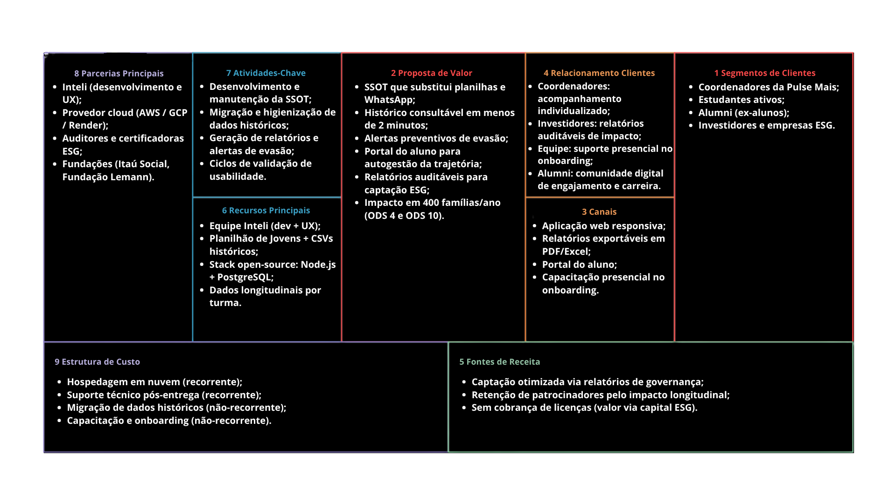

  <p>Fonte: Produção dos autores (2026) </p>
</div>


### 1 - Segmentos de Clientes

Os segmentos vão além dos usuários internos porque o modelo de sustentabilidade da Pulse Mais depende de múltiplos atores. Os coordenadores são os usuários primários do sistema. Os estudantes ativos são os beneficiários diretos, cujos dados alimentam a SSOT em tempo real. Os alumni fornecem dados longitudinais de carreira que comprovam o impacto real do programa após a formação. Os investidores e empresas com agenda ESG são a principal fonte de financiamento da ONG e exigem evidências mensuráveis de retorno social. Ignorar esses segmentos seria tratar a plataforma como ferramenta operacional, quando ela é, na essência, um instrumento de comprovação de impacto social.

---

### 2 - Proposta de Valor

A plataforma SSOT substitui planilhas e WhatsApp como sistema central de gestão, reduzindo o tempo de consulta ao histórico de um aluno para menos de 2 minutos. Alertas preventivos de evasão permitem intervenção antes que o jovem abandone o programa. O portal do aluno entrega ao jovem autogestão sobre sua própria trajetória. Relatórios de impacto auditáveis sustentam a captação junto a investidores ESG. Em conjunto, a solução contribui para a redução de evasão entre as 400 famílias atendidas anualmente pela Pulse Mais, alinhando-se aos ODS 4 (Educação de Qualidade) e ODS 10 (Redução das Desigualdades).

---

### 3 - Canais

Cada canal serve um segmento específico, eliminando a armadilha de tratar todos os usuários da mesma forma. Coordenadores acessam a plataforma no dia a dia via aplicação web responsiva. Financiadores recebem relatórios exportáveis gerados a partir dos dashboards de indicadores. Estudantes e alumni acessam seus dados pelo portal do aluno. Alertas de evasão são sinalizados diretamente no dashboard da plataforma, visíveis no acesso diário dos coordenadores. A documentação técnica e a capacitação presencial no onboarding garantem a adoção inicial pela equipe da ONG.

---

### 4 - Relacionamento com Clientes

O relacionamento é diferenciado por segmento porque cada um tem uma expectativa distinta da plataforma. Coordenadores recebem acompanhamento individualizado via plataforma digital, com acesso granular a cada aluno. Investidores obtêm transparência por meio de relatórios auditáveis que comprovam impacto longitudinal. O suporte presencial ao onboarding e o acompanhamento de dados de evasão garantem a adoção e o uso contínuo pela equipe. Alumni são integrados a uma comunidade digital de engajamento que viabiliza a coleta de dados de carreira e preserva a memória institucional do programa. Estudantes acompanham sua própria trajetória de forma autônoma pelo portal do aluno, sem necessidade de intermediação da equipe gestora.

---

### 5 - Fontes de Receita

A lógica de receita é indireta e coerente com o modelo de uma ONG. A plataforma não gera receita por si mesma — ela gera a evidência que justifica o repasse de recursos por financiadores ESG. Relatórios auditáveis aumentam a credibilidade da Pulse Mais em processos de captação, e a comprovação longitudinal de redução de evasão diferencia a ONG de concorrentes que ainda dependem de métricas superficiais. A ausência de licenças é uma escolha estratégica consciente: o valor está na atração sustentável de capital, não na monetização direta do software.

---

### 6 - Recursos Principais

Os recursos refletem o que é genuinamente necessário para entregar a proposta de valor. A equipe Inteli é o recurso humano central do desenvolvimento. O Planilhão de Jovens e os CSVs exportados são o ativo de dados sem o qual o sistema não tem conteúdo para operar — e representam anos de coleta que precisam ser migrados com rigor. Os dados longitudinais por turma são o insumo que viabiliza a visão histórica da trajetória de cada jovem, diferencial central da plataforma. A stack open-source é uma escolha estratégica que elimina custos de licenciamento e mantém a solução sustentável para uma ONG com orçamento restrito.

---

### 7 - Atividades-Chave

O desenvolvimento e a manutenção contínua da plataforma SSOT são a base sobre a qual todas as demais atividades operam. A migração e higienização dos dados históricos é a atividade mais crítica e frequentemente subestimada em projetos desse tipo: sem ela, a SSOT nasce vazia e perde seu principal diferencial — a visão longitudinal do aluno. A geração de relatórios e alertas de evasão traduz dados brutos em decisões de intervenção em tempo real. Os ciclos de validação de usabilidade com coordenadores e alunos garantem que o sistema evolua junto com as necessidades reais dos usuários.

---

### 8 - Parcerias Principais

As parcerias são atores externos dos quais a Pulse Mais depende para entregar ou sustentar seu modelo, mas que não controla diretamente. A Inteli é parceira institucional, responsável pelo desenvolvimento e UX da plataforma. O provedor cloud é essencial para a operação sustentável pós-entrega. Auditores e certificadoras ESG conferem credibilidade aos relatórios que sustentam a captação de recursos. Fundações como Instituto Itaú Social e Fundação Lemann representam o ecossistema de financiamento que a plataforma precisa impressionar para garantir a sustentabilidade financeira da ONG.

---

### 9 - Estrutura de Custo

A estrutura de custo é enxuta e compatível com a realidade de uma ONG de pequeno porte. Os custos não-recorrentes incluem a migração e higienização dos dados históricos — que exige tempo significativo da equipe da ONG para validação e limpeza — e o onboarding e capacitação dos coordenadores na fase de implantação. Os custos recorrentes compreendem a hospedagem em nuvem, planejada com escalabilidade controlada para não onerar o orçamento futuro, e as horas de suporte técnico pós-entrega para manutenção e evolução da plataforma. A ausência de licenças de software — viabilizada pela stack open-source — é um alívio estrutural que diferencia este modelo de soluções proprietárias pagas.

## 6.6 Estratégia de Marketing (4Ps)

### a) Produto/Serviço

A plataforma desenvolvida para a Pulse Mais é uma aplicação web centralizada de gestão de impacto social voltada a organizações do terceiro setor que atuam na formação profissional de jovens em situação de vulnerabilidade. O produto entrega quatro grupos de funcionalidades principais: gestão de beneficiários, com cadastro, edição e busca de perfis de alunos e ex-alunos com histórico longitudinal; registro de indicadores de acompanhamento, com frequência, entregas, mentorias e empregabilidade; dashboards de impacto para geração de relatórios auditáveis destinados a financiadores e patrocinadores; e um portal do aluno que permite ao jovem acessar seu próprio histórico de formação e oportunidades pós-programa.

Os diferenciais em relação a soluções genéricas de gestão residem no acompanhamento longitudinal da trajetória do beneficiário, do ingresso ao primeiro emprego, na preservação da memória institucional sem dependência de indivíduos específicos, e na geração de evidências de impacto alinhadas às métricas exigidas por investidores ESG. A solução foi construída com arquitetura web responsiva, acessível por navegador sem necessidade de instalação, e adota padrões de segurança que garantem a confidencialidade dos dados dos beneficiários, aspecto crítico para a credibilidade institucional.

---

### b) Preço

O modelo de precificação adotado parte de uma premissa estrutural que diferencia a plataforma dos concorrentes comerciais do setor: a solução foi desenvolvida integralmente como iniciativa de impacto social, sem fins lucrativos, e entregue à Pulse Mais sem custo de licenciamento, alinhando-se à lógica do software social para organizações sem fins lucrativos que prevalece no ecossistema de tecnologia cívica. Há um segmento consolidado de soluções de gestão para ONGs que operam sob modelos gratuitos ou freemium, reconhecendo a restrição orçamentária característica do terceiro setor.

Para eventual escalonamento da solução a outras organizações congêneres, o modelo de referência seria o institucional escalonado: uma camada gratuita com funcionalidades essenciais de cadastro e indicadores básicos, e planos pagos para organizações com maior volume de beneficiários, que demandem relatórios avançados, integração com sistemas externos e suporte dedicado. Esse modelo preserva o acesso de pequenas ONGs sem capacidade de pagamento, ao mesmo tempo em que viabiliza sustentabilidade financeira mediante receita de organizações de maior porte. A precificação baseia-se no valor gerado — redução de horas de retrabalho, melhoria na captação de recursos e fortalecimento institucional — e não no custo de desenvolvimento, em linha com a abordagem de *value-based pricing* recomendada para SaaS de impacto social.

---

### c) Praça (Distribuição)

A distribuição da plataforma ocorre exclusivamente por canais digitais, sem dependência de infraestrutura física ou software instalado localmente. O acesso se dá via navegador web, em qualquer dispositivo conectado à internet, eliminando barreiras técnicas de adoção para equipes de ONGs com limitada capacidade de TI. A hospedagem em nuvem garante disponibilidade contínua, atualizações automáticas e escalabilidade sem intervenção manual por parte da organização beneficiária.

Para a Pulse Mais, a entrega da aplicação se deu diretamente à equipe gestora por meio de sessões de onboarding e documentação técnica, estratégia adequada com o perfil do cliente institucional B2N (*Business-to-Nonprofit*), que requer suporte próximo na fase de adoção. Em um modelo de expansão, os canais de distribuição naturais incluem parcerias com redes da sociedade civil como o GIFE — Grupo de Institutos, Fundações e Empresas — e plataformas de catálogo de software para ONGs como Capterra e TechSoup, onde organizações do terceiro setor buscam ativamente ferramentas de gestão. A distribuição em regime *open source*, via repositório público no GitHub, figuraria como canal complementar, permitindo que organizações com capacidade técnica própria adaptem e implantem a solução de forma autônoma, ampliando o alcance sem custo marginal de distribuição.

---

### d) Promoção

A estratégia promocional estrutura-se em três frentes complementares, calibradas para o perfil institucional do público-alvo. A primeira é o marketing de conteúdo orientado a impacto: produção de artigos, relatórios de caso e estudos de dados que documentam os resultados da Pulse Mais em formato auditável e os distribuem via LinkedIn, plataforma prioritária para alcançar líderes corporativos, executivos de fundações e gestores de programas ESG. O LinkedIn é o canal estratégico por excelência para organizações do terceiro setor construírem redes com tomadores de decisão e potenciais financiadores, viabilizando parcerias e patrocínios de alto valor.

A segunda frente é a comunicação de impacto em redes sociais de amplo alcance — Instagram e WhatsApp —, baseada na divulgação de métricas de empregabilidade e histórias de transformação dos jovens atendidos, amplificadas por voluntários, ex-alunos e parceiros da rede da organização. A produção de conteúdo autêntico com narrativas de impacto real é a estratégia de maior engajamento para ONGs no ambiente digital. A terceira frente é o relacionamento com o ecossistema ESG, com presença em eventos do setor — como o Fórum GIFE e iniciativas de inovação social — e parcerias com empresas que destinam parte de seu Investimento Social Privado à formação tecnológica de jovens. Essas três frentes convergem para um posicionamento de marca que comunica transparência, mensurabilidade e impacto comprovável, atributos determinantes na decisão de financiamento de iniciativas sociais.

---

# <a name="c7"></a>7. Conclusões e trabalhos futuros

Ao longo das cinco sprints de desenvolvimento, o Pulse Connect foi construído para substituir o processo manual de consolidação da jornada do jovem, hoje fragmentada entre o "Planilhão de Jovens do Framework", planilhas isoladas por projeto/ano e conversas de WhatsApp (seção 2.1.3-a/b), por uma Single Source of Truth (SSOT) auditável e centralizada para a equipe gestora da ONG. Os objetivos definidos na seção 2 deste documento foram atingidos na versão entregue: a Matriz de Riscos (2.1.5) nomeia essa centralização como "o núcleo do projeto e o principal entregável acordado para o MVP", com probabilidade de ocorrência estimada em 90% e impacto muito alto, e a leitura do código confirma que ela está implementada e operante. A importação de planilhas legadas (`importacaoService.ts`) reconhece variações de cabeçalho entre arquivos de anos e projetos distintos sem exigir padronização manual prévia; o perfil do aluno em tela única (`GET /alunos/:id/perfil`) entrega o "histórico completo de um aluno" exigido pelo critério de sucesso (i) da seção 2.1.3-f; o indicador de risco de evasão no dashboard institucional cruza frequência e situação de cada aluno automaticamente; e o histórico profissional centralizado, somado aos portais de autoatendimento do aluno e do ex-aluno, sustenta o critério de sucesso (iii) e a permanência do egresso na rede de talentos da organização. A WebAPI expõe 112 endpoints distribuídos em 22 recursos (`src/backend/routes`), documentados de forma navegável em `/docs` e em `api-docs.html`, e o esquema do banco é versionado em um único arquivo de migrations (`migration.sql`) que consolida cinco blocos incrementais aplicados ao longo das sprints. A suíte de testes automatizados, 31 arquivos, 439 casos, todos aprovados, cobrindo 78,6% das statements e 80,3% das linhas do backend (seção 5.1.2), evidencia a consistência da aplicação em relação aos requisitos funcionais e regras de negócio definidos na seção 3.1.

Um dos maiores pontos fortes da Pulse Mais é a aderência consistente à arquitetura em três camadas (Controller → Service → Repository) em todas as entidades do backend, sustentando uma base de testes ampla mesmo com o crescimento do número de endpoints ao longo das sprints. A solução também não impõe nenhuma mudança de processo brusca à equipe da ONG: a importação tolera as planilhas que já existem, o perfil em tela única elimina a necessidade de cruzar várias fontes para reconstruir a jornada de um jovem, e os portais de autoatendimento deslocam parte da responsabilidade de manter o cadastro atualizado para o próprio aluno ou ex-aluno, reduzindo exatamente a dependência da memória da equipe apontada na origem do projeto. As anotações privadas de mentoria, com controle de visibilidade por papel, dão a observações antes informais um registro persistente e atribuível.

O desenvolvimento também deixou claros os pontos a melhorar antes de uma eventual operação em produção com dados reais de jovens. O indicador de evasão no dashboard é passivo e roda no cliente: a cada carregamento, o frontend busca todos os alunos e todas as frequências (`dashboard.js`, função `renderizarTabelaEvasao`) para então calcular o percentual e aplicar o selo de risco, sem paginação e sem nenhum mecanismo que avise a equipe proativamente. Os conflitos de importação já são reportados linha a linha pelo backend (`importacaoService.ts`, campo `conflitos`, com número da linha, CPF e motivo), mas a interface (`importarPlanilha.js`) apenas exibe essa lista em uma tabela somente leitura, sem permitir que a coordenação resolva cada caso individualmente. A lacuna mais relevante, porém, é a ausência de autenticação real: a Matriz de Riscos já registra, na origem do projeto, que "o escopo do projeto exclui explicitamente o desenvolvimento de sistemas de autenticação robustos (sign in/log in)", e o código reflete essa decisão de escopo. O login (`POST /auth/login`) identifica o usuário apenas pelo e-mail, sem senha nem emissão de token; a variável `JWT_SECRET` está reservada em `.env.example` mas não é referenciada em nenhum lugar do backend; e a função `autenticar` em `authMiddleware.ts` é um no-op que apenas chama `next()`, não está aplicada a nenhuma rota, deixando os 111 endpoints além do login completamente abertos. Como consequência direta, a atualização do Portal do Aluno carrega um `TODO(auth)` pendente em `alunoService.ts` (verificar que o solicitante é o próprio aluno antes de prosseguir). Itens de menor relevância, mas registrados como dívida técnica, incluem resíduos de `console.log`/`console.warn` de depuração em `alunos.js` e `agendaMentorias.js`, e um fallback de `localStorage` em `perfilExAluno.js` para os campos do ex-aluno, mantido até que a aplicação da migration correspondente em todos os ambientes seja confirmada.

A versão final foi submetida a uma rodada de testes de usabilidade (seção 5.2), composta por testes de guerrilha nos quatro perfis de usuário e pela aplicação do questionário SUS (média de 68,75, na média de mercado). Os achados foram consolidados e priorizados pela escala de severidade de Nielsen, de 0 (sem importância) a 4 (catastrófico), conforme a seção 5.2.2. Os três itens de maior criticidade foram resolvidos antes da entrega: o dashboard do aluno, que renderizava em branco por não consumir dados (severidade 4), passou a carregar informações reais do backend em `dashboardAluno.js` (`GET /alunos/:id/perfil`, `/atividades` e `/frequencia`), com estados explícitos de carregamento e de lista vazia; o fluxo de registro de mentoria, que não concluía (severidade 4), foi reescrito em `agendaMentorias.js` para carregar os mentorandos associados ao mentor, enviar a `POST /mentorias` e exibir feedback de sucesso ou erro, atualizando o calendário ao final; e o campo de data, antes em formato americano (severidade 3), passou a usar entrada nativa `type="date"` em padrão ISO, com exibição localizada em pt-BR. Entre os itens de menor severidade, o campo de texto livre de "programa de ingresso" foi substituído por um seletor com as opções pré-cadastradas (severidade 2), e a sinalização de que a edição do perfil se dá pela interação com a foto de perfil tornou-se mais clara, ainda que sem o ícone de lápis especificamente sugerido pelos participantes (severidade 1). Permanecem registrados como backlog incremental de baixa severidade outros ajustes cosméticos, como o destaque visual do dia atual no calendário de mentorias e a inclusão de descrições nos indicadores de situação do aluno (severidade 1), além do reforço da affordance do botão de edição e da navegação até o perfil próprio em todos os papéis (severidade 2).

Para trabalhos futuros, o grupo identificou três frentes principais de evolução. A primeira é a implementação de autenticação e autorização reais: emitir e validar um token (JWT, aproveitando o segredo já reservado para esse fim) no login, aplicar a verificação em todas as rotas hoje abertas e resolver o `TODO(auth)` do Portal do Aluno, pré-requisito para qualquer uso da plataforma fora do contexto acadêmico, dado que ela armazena dados pessoais protegidos pela LGPD. A segunda é tornar o indicador de evasão proativo: mover o cálculo de frequência e risco do frontend para um endpoint dedicado e paginado no backend, e acoplar um aviso (e-mail ou painel de pendências) quando um aluno cruzar o limiar de risco, em vez de depender de alguém abrir o dashboard. A terceira é fechar o ciclo de resolução de conflitos de importação: como o backend já devolve o detalhamento linha a linha, falta apenas construir a tela de revisão que permita à coordenação decidir caso a caso, hoje limitada à contagem exibida no modal.

# <a name="c8"></a>8. Referências

ABSTARTUPS. **Mapeamento do Ecossistema Brasileiro de Startups 2023**. São Paulo: Associação Brasileira de Startups, 2023. Disponível em: https://abstartups.com.br/wp-content/uploads/2025/06/Mapeamento-de-Ecosssistema-de-Startups-2023.pdf. Acesso em: 2 jun. 2026.

BRASIL. Secretaria de Comunicação Social. **Futuro Digital: Governo Federal lança programa para formar 10 mil profissionais em tecnologia**. Brasília, 2025. Disponível em: https://www.gov.br/secom/pt-br/assuntos/noticias/2025/05/futuro-digital-governo-federal-lanca-programa-para-formar-10-mil-profissionais-em-tecnologia-1. Acesso em: 2 jun. 2026.

BRASSCOM. **Macrossetor de TIC pode gerar até 147 mil empregos formais no Brasil em 2025**. São Paulo: BRASSCOM, 2025. Disponível em: https://brasscom.org.br/macrossetor-de-tic-pode-gerar-ate-147-mil-empregos-formais-no-brasil-em-2025-aponta-estudo/. Acesso em: 2 jun. 2026.

BROOKE, J. **SUS: a 'quick and dirty' usability scale**. In: JORDAN, P. W. et al. (Ed.). *Usability Evaluation in Industry*. London: Taylor & Francis, 1996. p. 189–194.

CBPS — COMITÊ BRASILEIRO DE PRONUNCIAMENTOS DE SUSTENTABILIDADE. **Pronunciamentos Técnicos CBPS 01 e CBPS 02**. Brasília: Conselho Federal de Contabilidade, 2024. Disponível em: https://cfc.org.br/tecnica/normas-brasileiras-de-contabilidade/cbps/. Acesso em: 2 jun. 2026.

DISTRITO. **Distrito EdTech Report 2025**. São Paulo: Distrito, 2025. Disponível em: https://materiais.distrito.me/edtech-report-2025. Acesso em: 2 jun. 2026.

FUTURE MARKET INSIGHTS. **EduTech Industry Analysis in Latin America**. [s.l.: s.n.], 2024. Disponível em: https://www.futuremarketinsights.com/reports/edutech-industry-analysis-in-latin-america. Acesso em: 2 jun. 2026.

GIFE — GRUPO DE INSTITUTOS, FUNDAÇÕES E EMPRESAS. **Censo GIFE 2025**. São Paulo: GIFE, 2025. Disponível em: https://gife.org.br/censo-gife/. Acesso em: 2 jun. 2026.

HOLONIQ. **2025 Latin America EdTech 100**. [s.l.: s.n.], 2025. Disponível em: https://www.holoniq.com/notes/2025-latin-america-edtech-100. Acesso em: 2 jun. 2026.

IBGE — INSTITUTO BRASILEIRO DE GEOGRAFIA E ESTATÍSTICA. **Pesquisa Nacional por Amostra de Domicílios Contínua (PNAD Contínua): desocupação**. Rio de Janeiro: IBGE, 2024. Disponível em: https://www.ibge.gov.br/estatisticas/sociais/trabalho/9173-pesquisa-nacional-por-amostra-de-domicilios-continua-trimestral.html. Acesso em: 2 jun. 2026.

IBGE — INSTITUTO BRASILEIRO DE GEOGRAFIA E ESTATÍSTICA. **Um em cada cinco brasileiros com 15 a 29 anos não estudava e nem estava ocupado em 2022**. Rio de Janeiro: Agência IBGE de Notícias, 2022. Disponível em: https://agenciadenoticias.ibge.gov.br/agencia-noticias/2012-agencia-de-noticias/noticias/38542-um-em-cada-cinco-brasileiros-com-15-a-29-anos-nao-estudava-e-nem-estava-ocupado-em-2022. Acesso em: 2 jun. 2026.

IMARC GROUP. **Brazil EdTech Market Size, Share, Trends and Forecast by Segment and Region, 2026-2034**. [s.l.: s.n.], 2025. Disponível em: https://www.imarcgroup.com/brazil-edtech-market. Acesso em: 2 jun. 2026.

INTELI — INSTITUTO DE TECNOLOGIA E LIDERANÇA; PULSE MAIS. **Termo de Abertura do Projeto de Implementação**: plataforma de gestão de impacto social Pulse Mais. São Paulo, 2026. Documento interno, não publicado.

IPEA — INSTITUTO DE PESQUISA ECONÔMICA APLICADA. **Mapa das Organizações da Sociedade Civil**. Brasília: IPEA, 2021. Disponível em: https://mapaosc.ipea.gov.br/. Acesso em: 2 jun. 2026.

OECD. **Social impact measurement for the social and solidarity economy**. Paris: OECD, 2021. Disponível em: https://www.oecd.org/content/dam/oecd/en/publications/reports/2021/09/social-impact-measurement-for-the-social-and-solidarity-economy_ad1ac935/d20a57ac-en.pdf. Acesso em: 2 jun. 2026.

PORTER, Michael E. The five competitive forces that shape strategy. **Harvard Business Review**, Boston, v. 86, n. 1, p. 78-93, jan. 2008.

PULSE MAIS. **Apresentação institucional**: dados e histórico da Pulse Mais. São Paulo: Pulse Mais, 2026. Documento interno, não publicado.

SAURO, J.; LEWIS, J. R. **Quantifying the User Experience: Practical Statistics for User Research**. 2. ed. Cambridge: Morgan Kaufmann, 2016.
