


# WAD - Web Application Document - Módulo 2 - Inteli

## Equipe Pulsar

#### Nomes dos integrantes do grupo
- <a href ="https://www.linkedin.com/in/dante-cavalcante-rocha-4555993b0/">Dante Cavalcante Rocha</a>

- <a href ="https://www.linkedin.com/in/eduardo-quessada-batistussi/">Eduardo Quessada Batistussi</a>

- <a href ="http://linkedin.com/in/gustavo-gomes-437b94312/">Gustavo da Silva Gomes</a>

- <a href ="https://www.linkedin.com/in/isabelatcoldibella/">Isabela Teixeira Coldibella</a>

- <a href ="https://www.linkedin.com/in/mariamattiuzzo/">Maria Clara Nanias Mattiuzzo</a>

- <a href ="https://www.linkedin.com/in/viniciusferreirac/">Vinicius Ferreira da Costa</a>


## Sumário

[1. Introdução](#c1)

[2. Visão Geral da Aplicação Web](#c2)

&ensp;[2.1. Escopo do Projeto](#c2.1)

&ensp;&ensp;[2.1.1. Modelo de 5 Forças de Porter](#c2.1.1)

&ensp;&ensp;[2.1.2. Análise SWOT da Instituição Parceira](#c2.1.2)

&ensp;&ensp;[2.1.3. Solução](#c2.1.3)

&ensp;&ensp;[2.1.4. Value Proposition Canvas](#c2.1.4)

&ensp;&ensp;[2.1.5. Matriz de Riscos do Projeto](#c2.1.5)

&ensp;[2.2. Personas](#c2.2)

&ensp;[2.3. User Stories](#c2.3)

[3. Projeto da Aplicação Web](#c3)

&ensp;[3.1. Requisitos do Sistema](#c3.1)

&ensp;&ensp;[3.1.1. Requisitos Funcionais](#c3.1.1)

&ensp;&ensp;[3.1.2. Regras de Negócio](#c3.1.2)

&ensp;&ensp;[3.1.3. Requisitos Não Funcionais — 8 Eixos ISO/IEC 25010](#c3.1.3)

&ensp;&ensp;[3.1.4. Matriz RF → RN → Endpoint](#c3.1.4)

&ensp;[3.2. Arquitetura](#c3.2)

&ensp;&ensp;[3.2.1. Arquitetura em camadas](#c3.2.1)

&ensp;&ensp;[3.2.2. Diagrama de Casos de Uso](#c3.2.2)

&ensp;&ensp;[3.2.3. Diagrama de Classes do Domínio](#c3.2.3)

&ensp;&ensp;[3.2.4. Diagramas de Sequência UML](#c3.2.4)

&ensp;&ensp;[3.2.5. Padrões de Projeto Aplicados](#c3.2.5)

&ensp;[3.3. Wireframes](#c3.3)

&ensp;&ensp;[3.3.1. Wireframes — Denise Pereira (Coordenadora de Projetos)](#c3.3.1)

&ensp;&ensp;[3.3.2. Wireframes — Mateo Fernández (Mentor / Aluno Multiplicador)](#c3.3.2)

&ensp;&ensp;[3.3.3. Wireframes — Beatriz Santos (Aluna)](#c3.3.3)

&ensp;&ensp;[3.3.4. Telas Transversais — Autenticação e Controle de Acesso](#c3.3.4)

&ensp;&ensp;[3.3.5. Estrutura de Navegação e Grid](#c3.3.5)

&ensp;&ensp;[3.3.6. Fluxos de Navegação](#c3.3.6)

&ensp;[3.4. Guia de estilos](#c3.4)

&ensp;&ensp;[3.4.1 Cores](#c3.4.1)

&ensp;&ensp;[3.4.2 Tipografia](#c3.4.2)

&ensp;&ensp;[3.4.3 Iconografia e imagens](#c3.4.3)

&ensp;&ensp;[3.4.4 Componentes](#c3.4.4)

&ensp;[3.5 Protótipo de alta fidelidade](#c3.5)

&ensp;&ensp;[3.5.1 Tela de acesso (transversal)](#c3.5.1)

&ensp;&ensp;[3.5.2 Protótipo da Coordenação (Denise)](#c3.5.2)

&ensp;&ensp;[3.5.3 Protótipo do Mentor (Mateo)](#c3.5.3)

&ensp;&ensp;[3.5.4 Protótipo da Aluna (Beatriz)](#c3.5.4)

&ensp;[3.6. Modelagem do banco de dados](#c3.6)

&ensp;&ensp;[3.6.1. Modelo Entidade-Relacionamento (ER)](#c3.6.1)

&ensp;&ensp;[3.6.2. Diagrama Entidade-Relacionamento (DER)](#c3.6.2)

&ensp;&ensp;[3.6.3. Modelo Relacional e Modelo Físico](#c3.6.3)

&ensp;&ensp;[3.6.4. Consultas SQL e lógica proposicional](#c3.6.4)

&ensp;[3.7. WebAPI e endpoints](#c3.7)

&ensp;[3.8. Autenticação, Autorização e Resiliência](#c3.8)

&ensp;&ensp;[3.8.1. Autenticação](#c3.8.1)

&ensp;&ensp;[3.8.2. Controle de sessão](#c3.8.2)

&ensp;&ensp;[3.8.3. Autorização](#c3.8.3)

&ensp;&ensp;[3.8.4. Estratégias de Resiliência](#c3.8.4)

&ensp;[3.9. Matriz de Rastreabilidade (RTM)](#c3.9)

[4. Desenvolvimento da Aplicação Web](#c4)

&ensp;[4.1. Primeira versão da aplicação web](#c4.1)

&ensp;[4.2. Segunda versão da aplicação web](#c4.2)

&ensp;[4.3. Versão final da aplicação web](#c4.3)

[5. Testes](#c5)

&ensp;[5.1. Relatório de testes de integração de endpoints automatizados](#c5.1)

&ensp;&ensp;[5.1.1 Estratégia de Testes](#c5.1.1)

&ensp;&ensp;[5.1.2 Testes Unitários de Service (White-Box)](#c5.1.2)

&ensp;&ensp;[5.1.3 Testes de Integração de Endpoints (Black-Box)](#c5.1.3)

&ensp;&ensp;[5.1.4 Evidências de Execução](#c5.1.4)

&ensp;[5.2. Testes de usabilidade](#c5.2)

&ensp;&ensp;[5.2.1. Relatório de testes de guerrilha](#c5.2.1)

&ensp;&ensp;[5.2.2. Relatório de testes SUS (System Usability Scale)](#c5.2.2)

[6. Estudo de Mercado e Plano de Marketing](#c6)

&ensp;[6.1 Resumo Executivo](#c6.1)

&ensp;[6.2 Análise de Mercado](#c6.2)

&ensp;&ensp;[6.2.1. Visão Geral do Setor](#c6.2.1)

&ensp;&ensp;[6.2.2. Tamanho e Crescimento do Mercado](#c6.2.2)

&ensp;&ensp;[6.2.3. Tendências de Mercado](#c6.2.3)

&ensp;[6.3 Público-Alvo](#c6.3)

&ensp;&ensp;[6.3.1. Segmentação de Mercado](#c6.3.1)

&ensp;&ensp;[6.3.2. Perfil do Público-Alvo](#c6.3.2)

&ensp;[6.4 Posicionamento](#c6.4)

&ensp;&ensp;[6.4.1. Proposta de Valor Única](#c6.4.1)

&ensp;&ensp;[6.4.2. Estratégia de Diferenciação](#c6.4.2)

&ensp;[6.5. Business Model Canvas](#c6.5)

&ensp;&ensp;[6.5.1. Segmentos de Clientes](#c6.5.1)

&ensp;&ensp;[6.5.2. Proposta de Valor](#c6.5.2)

&ensp;&ensp;[6.5.3. Canais](#c6.5.3)

&ensp;&ensp;[6.5.4. Relacionamento com Clientes](#c6.5.4)

&ensp;&ensp;[6.5.5. Fontes de Receita](#c6.5.5)

&ensp;&ensp;[6.5.6. Recursos Principais](#c6.5.6)

&ensp;&ensp;[6.5.7. Atividades Principais](#c6.5.7)

&ensp;&ensp;[6.5.8. Parcerias Principais](#c6.5.8)

&ensp;&ensp;[6.5.9. Estrutura de Custos](#c6.5.9)

&ensp;[6.6 Estratégia de Marketing](#c6.6)

&ensp;&ensp;[6.6.1. Produto/Serviço](#c6.6.1)

&ensp;&ensp;[6.6.2. Preço](#c6.6.2)

&ensp;&ensp;[6.6.3. Praça/Distribuição](#c6.6.3)

&ensp;&ensp;[6.6.4. Promoção](#c6.6.4)

[7. Conclusões e trabalhos futuros](#c7)

[8. Referências](#c8)

[Anexos](#c9)

<br>


# <a name="c1"></a>1. Introdução 

A Pulse Mais é uma ONG que enfrenta um problema estrutural: a ausência de uma visão unificada da jornada dos seus alunos. Os dados estão fragmentados em múltiplas planilhas isoladas, complementadas por conversas no WhatsApp e pela memória individual da equipe. Isso impede análises de longo prazo, cria vulnerabilidade operacional quando pessoas saem da organização e limita a capacidade de um atendimento preventivo e personalizado.

Para resolver essa realidade, a solução desenvolvida é uma plataforma web centralizada que estabelece a Single Source of Truth (SSOT) da instituição — consolidando, em um só lugar, toda a jornada do jovem desde o ingresso no programa até sua trajetória no mercado de trabalho. Com a SSOT, a organização deixa de depender de registros dispersos e passa a operar com uma base de dados confiável, consistente e acessível por toda a equipe.

A criação de valor se apoia em quatro aspectos essenciais. Primeiro, a centralização de dados, que substitui planilhas dispersas por um banco unificado com informações pessoais, acadêmicas e de empregabilidade. Segundo, a visão integral do aluno, com uma página individual contendo histórico de frequência, atividades, eventos, mentorias e anotações qualitativas. Terceiro, o monitoramento de impacto por meio de dashboards com indicadores concretos que tornam a gestão estratégica e baseada em evidências. Por fim, o protagonismo do jovem, garantido por um portal onde o próprio aluno acessa e atualiza seus dados.


# <a name="c2"></a>2. Visão Geral da Aplicação Web
## <a name="c2.1"></a>2.1. Escopo do Projeto

O projeto parte da identificação do principal desafio da Pulse Mais: a fragmentação dos dados dos alunos em múltiplas planilhas isoladas, que compromete a gestão operacional, a mensuração de impacto e a tomada de decisão estratégica. Para compreender esse problema em profundidade, a análise adota uma perspectiva de negócio, mapeando o ambiente competitivo da organização e seus fatores internos. Essa lente permite identificar com precisão onde e como a plataforma web proposta irá consolidar dados dispersos em uma única fonte de verdade, gerando valor concreto para a Pulse Mais, seus financiadores e os jovens atendidos.


### <a name="c2.1.1"></a>2.1.1. Modelo de 5 Forças de Porter
<div align="center">
  Figura 1: 5 Forças de Porter - Pulse Mais <br><br>
  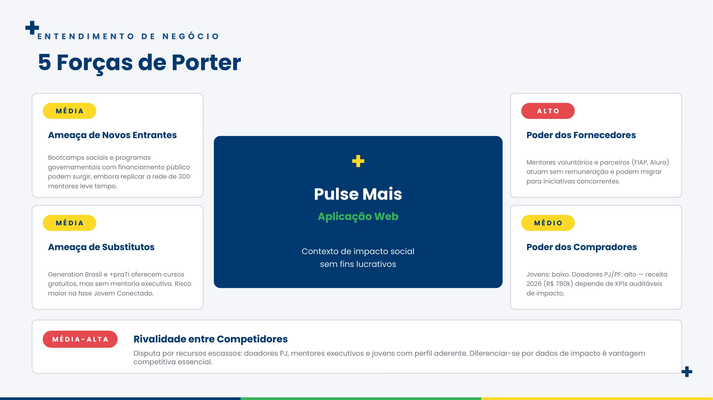<br>
  <sub> Fonte: Material produzido pelos autores (2026) </sub><br><br>
</div>

**1. Ameaça de Novos Entrantes — Média**

As barreiras de entrada no nicho da Pulse Mais são moderadas. Embora capacitar jovens em tecnologia tenha custo inicial relativamente baixo, replicar os ativos consolidados da organização — como a rede de 300 mentores executivos, 100 doadores ao longo de três anos e a metodologia própria — exige tempo e legitimidade institucional consideráveis. O risco real vem de bootcamps sociais e programas governamentais emergentes que combinam tecnologia, bolsas e empregabilidade, podendo surgir com maior financiamento público caso novas políticas sejam implementadas.

**2. Poder de Barganha dos Fornecedores — Alto**

Mentores voluntários (130–150 ativos/ano) e parceiros como FIAP e Alura não dependem financeiramente da organização e podem migrar para iniciativas concorrentes a qualquer momento. A formação Líder Mentor mitiga parcialmente esse poder ao criar identificação com a metodologia e senso de pertencimento, mas não elimina o risco de evasão — um fator estratégico contínuo que demanda gestão ativa do relacionamento com esses atores.

**3. Poder de Barganha dos Clientes — Médio**

Para os jovens beneficiários, o poder é baixo: nenhuma alternativa gratuita combina mentoria executiva individual, suporte psicológico, doação de equipamentos e empregabilidade ativa no mesmo pacote. Já para os financiadores — doadores PJ e PF —, o poder é alto. A receita projetada de R$ 780 mil em 2026 depende de 40 doadores recorrentes que exigem KPIs auditáveis de impacto social, assimetria que justifica o investimento na aplicação web como ferramenta de prestação de contas e fidelização de financiadores.

**4. Ameaça de Produtos Substitutos — Média**

Generation Brasil e +praTi oferecem cursos gratuitos ao mesmo perfil socioeconômico, mas não entregam mentoria executiva nem resolvem integralmente a inserção no mercado de trabalho. O risco se concentra especialmente na fase "Jovem Conectado", quando o vínculo com a organização ainda é frágil e a migração para alternativas semelhantes é mais viável.

**5. Rivalidade entre Concorrentes — Média-Alta**

A disputa não ocorre por clientes pagantes, mas por recursos escassos: doadores PJ, mentores executivos e jovens com perfil aderente ao programa. Generation Brasil, Laboratória, Recode e outras organizações sem fins lucrativos operam em segmento sobreposto, competindo pelos mesmos ativos vitais para a existência da Pulse Mais. Como Porter (1979) ressalta, a concorrência por recursos escassos configura rivalidade real mesmo sem conflito direto — o que torna a diferenciação pela qualidade dos dados de impacto e pelo acompanhamento individual uma vantagem competitiva essencial para sustentar sua posição no longo prazo.


### <a name="c2.1.2"></a>2.1.2. Análise SWOT da Instituição Parceira
<div align="center">
  Figura 2: Análise SWOT <br><br>
  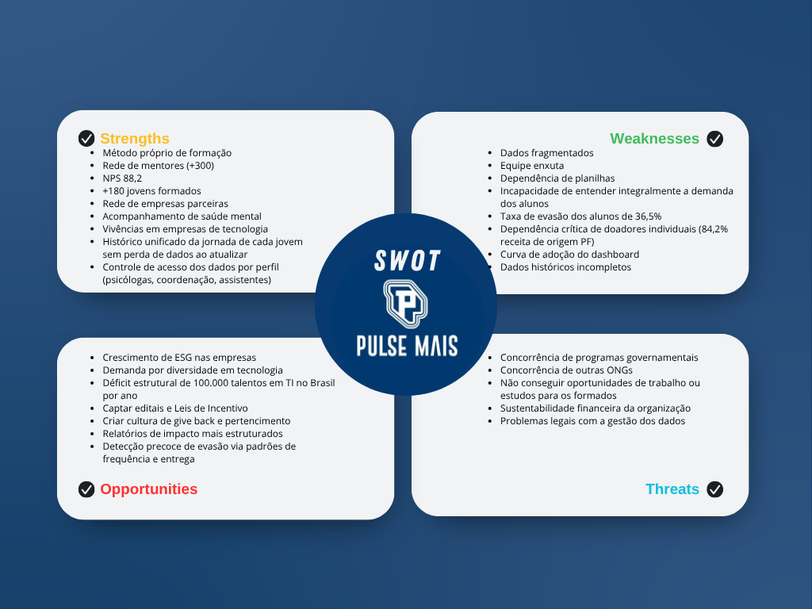<br>
  <sub> Fonte: Material produzido pelos autores (2026) </sub><br><br>
</div>

A matriz cruza fatores internos (forças e fraquezas) e externos (oportunidades e ameaças) para revelar não apenas o que a Pulse Mais é, mas como esses fatores se conectam entre si e o que a plataforma proposta altera nesse equilíbrio. A leitura por quadrantes combinados torna explícita essa interdependência.

**Forças × Ameaças (capacidade de defesa).** Os ativos consolidados — método próprio, rede de +300 mentores, NPS 88,2, +180 jovens formados, parcerias empresariais, suporte de saúde mental, histórico unificado e controle de acesso por perfil — sustentam a diferenciação diante da concorrência de outras ONGs e de programas governamentais e da falta de oportunidades para os formados. Contudo, essa defesa só se converte em argumento de captação quando é comprovável com dados; é aqui que a fragmentação atual enfraquece a força, pois impede demonstrar impacto de forma auditável.

**Fraquezas × Oportunidades (o que a plataforma destrava).** A dependência de planilhas, a equipe enxuta, a dificuldade em entender a demanda dos alunos e a evasão de 36,5% são fraquezas que hoje impedem a organização de capturar oportunidades concretas — a agenda ESG, a diversidade em tech, o déficit de ~100 mil talentos em TI e os editais de financiamento. A SSOT ataca diretamente esse nó: ao centralizar o histórico e habilitar a detecção precoce de evasão, transforma a maior fraqueza operacional em capacidade de aproveitar oportunidades de impacto e captação.

**Fraquezas × Ameaças (zona crítica).** A dependência de doadores individuais (84,2%), combinada à exigência crescente de prestação de contas e aos riscos legais com dados (LGPD), configura a maior vulnerabilidade da organização. Sem indicadores confiáveis, a sustentabilidade financeira fica exposta — o que reforça a tese da plataforma como ferramenta de governança e fidelização de financiadores.

**Forças × Oportunidades (estratégias ofensivas).** As forças consolidadas — método próprio, rede de +300 mentores, NPS 88,2 e histórico de +180 jovens formados —, uma vez documentadas e tornadas auditáveis pela SSOT, viabilizam captação ativa em editais ESG e parcerias corporativas que hoje são oportunidades não exploradas por falta de evidência empírica. Em outras palavras, a plataforma converte ativos que já existem, mas que permaneciam invisíveis para financiadores, em argumento mensurável de impacto, posicionando a Pulse Mais para disputar proativamente a agenda ESG e o déficit de talentos em tech em vez de apenas reagir a ameaças.

Em síntese, a análise cruzada evidencia que quase todas as fraquezas convergem para um mesmo ponto — a ausência de uma fonte única de dados — e que é exatamente esse ponto que a solução proposta endereça, convertendo fragilidades internas em capacidade de defesa e de aproveitamento de oportunidades.

### <a name="c2.1.3"></a>2.1.3. Solução
1. Problema a ser resolvido:

Constata-se, na Pulse Mais, a fragmentação dos dados dos jovens em múltiplas planilhas isoladas por projeto e ano, somada a registros dispersos em conversas de WhatsApp. Tal cenário inviabiliza a visão consolidada da jornada do aluno, gera dependência da memória individual da equipe e compromete a análise de indicadores de impacto de longo prazo.

2. Dados disponíveis:

Foram indicados pela instituição como fontes: o "Planilhão de Jovens do Framework" (planilha interna com dados cadastrais e de trajetória dos alunos), relatórios de atividades exportáveis em .csv pela plataforma de aulas gravadas, o edital do programa principal e o site institucional (pulsemais.org.br). A liberação de acesso às bases internas está em tratativa com os pontos focais.

3. Solução proposta

Propõe-se o desenvolvimento de uma aplicação web centralizada que atue como Single Source of Truth (SSOT) institucional. A solução consolidará dados cadastrais, acadêmicos, de empregabilidade e de engajamento em um repositório único, suportado por dashboards de impacto, prontuário digital do aluno e filtros de segmentação, construída em HTML/CSS/JavaScript, Node.js e PostgreSQL (Supabase). A escolha da stack responde diretamente ao problema da fragmentação: o PostgreSQL, banco relacional, impõe um schema único e normalizado com integridade referencial entre jovem, frequência, mentorias e empregabilidade, eliminando as inconsistências e a duplicidade típicas das planilhas paralelas por projeto e ano; o Node.js viabiliza uma camada de regras de negócio centralizada que valida e padroniza toda escrita, garantindo que a "fonte única da verdade" se mantenha consistente independentemente de quem registra o dado. Em uma frase: **o PostgreSQL, com schema único e integridade referencial, elimina por design as inconsistências derivadas das planilhas paralelas, enquanto o Node.js, na camada Service, centraliza as 31 regras de negócio ativas da seção 3.1.2, garantindo que toda escrita siga o mesmo contrato semântico independentemente da origem** — é exatamente esse par que ataca a raiz da fragmentação, e não apenas seus sintomas.

4. Forma de utilização da solução

A plataforma será operada pela equipe interna da Pulse Mais, gestores de projetos e relacionamento; para registro de frequência, entrega de atividades, anotações qualitativas e consulta ao histórico integral do jovem via dashboard. Alunos e ex-alunos, como usuários secundários, acessarão um portal restrito para visualização e atualização de seus próprios dados cadastrais e de perfil.

5. Benefícios esperados

Espera-se a centralização dos dados, a redução do tempo gasto na busca por informações históricas, a identificação precoce de riscos de evasão e a personalização do atendimento ao aluno. Projeta-se, ainda, maior assertividade nas estratégias de empregabilidade com base em dados históricos e o fortalecimento da governança institucional por meio de registros auditáveis e indicadores de impacto consolidados.

6. Critério de sucesso e como será avaliado

Considerar-se-á a solução bem-sucedida mediante metas mensuráveis:
 - migração de 100% dos jovens cadastrados no "Planilhão" atual para o banco unificado, sem perda de registros;
 - redução de pelo menos 70% no tempo de consulta ao histórico completo de um jovem — da ordem de minutos vasculhando planilhas e conversas para ≤ 15 segundos a partir do dashboard (meta formalizada em RNF-USAB-01);
 - pontuação SUS ≥ 68 nos testes de usabilidade com a equipe gestora (RNF-USAB-02), evidenciando operação autônoma na plataforma.
 
  A avaliação será conduzida via testes de usabilidade e validação funcional com os pontos focais a cada sprint, comparando o tempo de execução das tarefas antes e depois da adoção da plataforma.

### <a name="c2.1.4"></a>2.1.4. Value Proposition Canvas
O canvas abaixo mapeia a proposta de valor da plataforma web desenvolvida para a Pulse Mais, conectando as tarefas, dores e ganhos da equipe às funcionalidades, aliviadores e criadores de ganhos que a solução entregará. O objetivo é evidenciar onde e como a plataforma gera encaixe real com as necessidades operacionais da organização.

<div align="center">
  Figura 3: Canva de Proposta de Valor <br><br>
  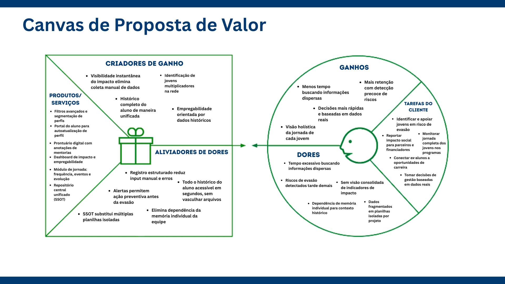<br>
  <sub> Fonte: Material produzido pelos autores (2026) </sub><br><br>
</div>

## A. Perfil do Cliente
 
### a) Tarefas do Cliente
 
A equipe da Pulse Mais precisa acompanhar dia a dia a frequência, a entrega de atividades e a evolução de cada jovem nos programas de formação. Ao mesmo tempo, precisa identificar quem está em risco de evasão para poder agir a tempo. Também é responsabilidade da equipe produzir relatórios de impacto social para apresentar a financiadores e parceiros corporativos, conectar ex-alunos a vagas e oportunidades de carreira e tomar decisões estratégicas sobre metodologia e definir quais jovens e programas priorizar a cada ciclo com base em dados concretos.
 
### b) Dores
 
Hoje os dados estão fragmentados e cada programa possui sua própria planilha, isoladas por projeto e ano, sem nenhuma visão cruzada. A equipe depende da memória individual para recuperar o histórico dos alunos, perde tempo vasculhando arquivos e conversas de WhatsApp, e só percebe riscos de evasão quando já é tarde para agir.
 
### c) Ganhos
 
A equipe quer enxergar a trajetória completa de cada jovem — desde a conexão com a Pulse Mais até o momento de se tornarem ex-alunos — em uma única interface, sem precisar compilar dados de fontes diferentes. Com isso, espera tomar decisões mais rápidas e embasadas, aumentar a retenção dos programas ao agir antes do desengajamento se consolidar e ter indicadores organizados e confiáveis para fortalecer a captação de recursos junto a apoiadores institucionais.
 
---
 
## B. Mapa de Valor
 
### a) Produtos e Serviços
 
A plataforma entrega um repositório central unificado que consolida dados pessoais, acadêmicos e de empregabilidade de cada aluno em um único banco de dados estruturado. Inclui um módulo de registro da jornada para frequência, eventos e evolução qualitativa, um dashboard com indicadores de impacto atualizados automaticamente, um prontuário digital para anotações de mentorias e acompanhamento de saúde mental com acesso restrito, um portal onde o próprio jovem atualiza seu perfil e filtros avançados para segmentação e busca de perfis específicos.
 
### b) Aliviadores de Dores
 
A SSOT substitui todas as planilhas isoladas e garante que o conhecimento institucional fique registrado na plataforma, não na memória das pessoas. Com o histórico centralizado, qualquer membro da equipe acessa em segundos tudo o que aconteceu na jornada de um aluno sem precisar vasculhar arquivos, e-mails ou conversas de WhatsApp. O registro estruturado com campos padronizados elimina inconsistências causadas pelo input manual disperso, e os alertas automáticos baseados em frequência e engajamento permitem que a equipe intervenha antes que o risco de evasão se concretize.
 
### c) Criadores de Ganhos
 
A plataforma gera visibilidade instantânea dos indicadores de impacto sem nenhuma coleta manual, liberando a equipe para agir em vez de consolidar dados. O histórico unificado de cada aluno torna o atendimento mais consultivo e personalizado, já que qualquer interação parte de um contexto completo e atualizado. Os dados históricos de ex-alunos empregados permitem identificar padrões e refinar continuamente as estratégias de empregabilidade, enquanto os filtros de engajamento facilitam a descoberta de jovens com perfil para se tornarem multiplicadores e embaixadores da rede Pulse Mais.
 
---
 
## Encaixe (Fit)
 
O canvas evidencia um encaixe direto entre os dois lados. A SSOT responde à fragmentação das planilhas e à perda de conhecimento institucional, gerando a visão holística que a equipe busca. O dashboard transforma a tarefa de reportar impacto — hoje feita manualmente — em algo automático e confiável, viabilizando decisões mais rápidas e a captação de recursos. E o monitoramento contínuo com alertas muda a lógica de detecção de evasão de reativa para preventiva, respondendo diretamente à dor mais crítica da operação: perder jovens sem ter tido chance de agir.

### Perfil complementar — o Jovem (cliente secundário)

Embora o canvas acima detalhe a proposta de valor para o cliente principal (a equipe interna), o jovem é um cliente secundário cuja experiência precisa ser igualmente endereçada, sob pena de comprometer a própria base de dados da plataforma.

**Tarefas do Jovem:** acompanhar a própria evolução nos programas, manter seus dados cadastrais e de empregabilidade atualizados e ter acesso a oportunidades de carreira e a um canal de comunicação com a Pulse Mais mesmo após a formatura.

**Dores do Jovem:** hoje o aluno não tem visibilidade do próprio progresso nem protagonismo sobre seus dados, que ficam dispersos nos registros da equipe; ex-alunos perdem o vínculo com a organização e deixam de ser alcançados por novas oportunidades.

**Ganhos do Jovem:** um portal de autoatendimento, mobile-first, onde visualiza sua jornada e conquistas, atualiza seus dados com baixa fricção e recebe oportunidades direcionadas. Esse encaixe é estratégico para a SSOT: ao dar valor concreto ao jovem, a plataforma estimula a atualização voluntária dos dados de empregabilidade de longo prazo — exatamente o insumo de que a equipe depende para mensurar impacto, mitigando o risco de baixa adesão descrito na seção 2.1.5.

### <a name="c2.1.5"></a>2.1.5. Matriz de Riscos do Projeto
A matriz de riscos cruza probabilidade de ocorrência e impacto potencial para classificar a severidade de cada ameaça ao projeto. No contexto da Pulse Mais, ela orienta a transição segura das planilhas fragmentadas para a Single Source of Truth (SSOT), tornando explícitas as decisões arquiteturais que mitigam cada risco. Os pontos plotados representam o risco residual, ou seja, a severidade já considerando os controles previstos no escopo do MVP.

<div align="center">
  Figura 4: Matriz de Risco - Pulse Mais <br><br>
  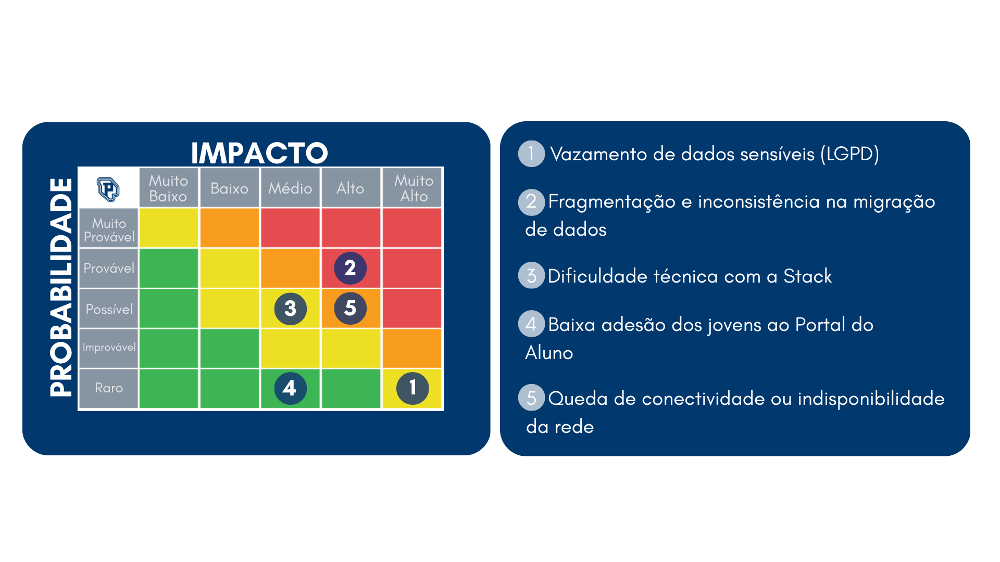<br>
  <sub> Fonte: Material produzido pelos autores (2026) </sub><br><br>
</div>

A distribuição dos pontos na matriz revela que a maior parte dos riscos críticos do projeto se concentra nas faixas amarela e laranja, indicando ameaças que exigem monitoramento ativo, mas que já foram parcialmente endereçadas pelas decisões arquiteturais do MVP. Apenas o risco 2 (fragmentação na migração de dados) permanece em zona vermelha, sinalizando que a carga inicial dos dados legados é o ponto de maior atenção da equipe ao longo das sprints.
A seguir, cada risco é detalhado com sua causa, consequência, justificativa da classificação e estratégia de resposta:

1. **Vazamento de dados sensíveis (LGPD)** 

**Causa**: a plataforma armazenará informações pessoais, observações de saúde mental e indicadores socioeconômicos de jovens em situação de vulnerabilidade.

**Consequência**: exposição configura violação à LGPD, dano reputacional à Pulse Mais e risco psicológico aos alunos cujos relatos forem expostos.

**Impacto**: Muito Alto. Probabilidade residual: Raro, o escopo prevê rotas protegidas com níveis de permissão (acesso a saúde mental restrito aos perfis autorizados `Psicologa`, `Coordenacao` e `GestaoGeral`), uso exclusivo de dados fictícios em desenvolvimento e proibição explícita de subir dados reais ao GitLab, conforme as restrições de conteúdo definidas no TAPI.

**Resposta**: mitigar. Gatilho de monitoramento: qualquer pull request que toque rotas de leitura de dados sensíveis exige revisão obrigatória.

2. **Fragmentação e inconsistência na migração de dados**

**Causa**: os dados atuais estão dispersos entre o "Planilhão de jovens do Framework", planilhas paralelas por projeto/ano, conversas de WhatsApp e a memória individual da equipe com cadastros divergentes (telefones, e-mails e até nomes que mudam ao longo do tempo).

**Consequência**: uma carga inicial inconsistente compromete a premissa de "fonte única da verdade", mantendo o problema atual sob outra interface.

**Impacto**: Alto. Probabilidade residual: Provável, mesmo com padronização do schema PostgreSQL e funcionalidade de upload, a heterogeneidade dos dados de origem é estrutural e não eliminável só por engenharia.

**Resposta**: mitigar com ETL controlado, definir regras de deduplicação, exigir validação humana antes do commit no banco e gerar relatório de divergências para a equipe Pulse decidir caso a caso.

3. **Limitações técnicas da stack imposta (Node.js + PostgreSQL via Supabase)**

**Causa**: a stack é definida pelo Inteli e a equipe está em formação, com prazo limitado para entregar front-end e back-end integrados. O uso do Supabase mitiga a complexidade de infraestrutura, mas o domínio do ferramental (migrations, connection pooling, autenticação via Row Level Security) exige curva de aprendizado.

**Consequência**: curva de aprendizado pode comprimir o tempo de refinamento, em volume real do planilhão, performance pode ficar abaixo do percebido como "produção" pelo parceiro.

**Impacto**: Médio. Probabilidade residual: Possível, mitigada por mentorias técnicas com o corpo docente e checkpoints quinzenais com o Líder Técnico da Pulse Mais.

**Resposta**: mitigar via prototipação técnica nas sprints iniciais (spike de carga com volume real do planilhão) para validar PostgreSQL/Supabase antes de comprometer arquitetura. 

4. **Baixa adesão dos jovens ao Portal do Aluno**

**Causa**: o monitoramento de longo prazo da empregabilidade depende da atualização voluntária dos ex-alunos via Portal, usuários secundários, sobre os quais a Pulse tem influência mas não controle direto.

**Consequência**: indicadores de impacto social ficam defasados, comprometendo a tese central de que a SSOT permite gestão baseada em dados.

**Impacto**: Médio. Probabilidade residual: Raro, a Pulse Mais já mantém relacionamento próximo e engajado com sua rede de talentos, e o módulo de comunicação previsto reforça esse canal.

**Resposta**: mitigar via design da interface (UX simples e mobile-first), notificações por e-mail e formulários cujas respostas atualizem automaticamente a base, reduzindo a fricção de atualização manual.

5. **Queda de conectividade ou indisponibilidade da rede**

**Causa**: a aplicação é centralizada em servidor web, o registro de presença em aulas e o lançamento de mentorias acontecem em tempo real durante as atividades.

**Consequência**: indisponibilidade gera lacunas no registro diário de frequência e atendimentos, comprometendo a integridade da jornada do aluno.

**Impacto**: Alto. Probabilidade residual: Possível, depende da infraestrutura do local de aplicação, fora do controle da equipe técnica.

**Resposta**: mitigar com mecanismo de cache local no front-end e fluxo de registro manual com sincronização posterior, garantindo que a indisponibilidade não vire perda definitiva de dado.

6. **Baixa adesão da equipe interna ao sistema (retorno às planilhas)**

**Causa**: complexidade percebida do sistema ou fluxo de cadastro mais demorado que o WhatsApp/planilha já usados no dia a dia. Diferentemente do risco 4 (que trata dos jovens, usuários secundários), aqui o risco recai sobre a equipe interna — justamente quem alimenta a SSOT.

**Consequência**: a equipe continua alimentando planilhas paralelas, materializando a fragmentação que a SSOT deveria eliminar e esvaziando o valor da plataforma desde a origem do dado.

**Impacto**: Muito Alto. Probabilidade residual: Possível, pois a substituição de um hábito consolidado (planilha/WhatsApp) por uma nova ferramenta enfrenta resistência natural.

**Resposta**: mitigar via testes de usabilidade (SUS) a cada sprint com a equipe real, atendimento aos requisitos RNF-USAB-01 (tarefas essenciais em ≤ 3 cliques) e RNF-USAB-02 (SUS ≥ 68), e treinamento estruturado no *go-live*, reduzindo a fricção a ponto de o sistema ser percebido como mais rápido que a planilha.

**Oportunidades positivas do projeto.** Gerir um projeto não é apenas evitar ameaças: a mesma SSOT que mitiga os riscos acima abre vantagens estratégicas concretas. A escalabilidade da rede de mentores e a demonstração de impacto auditável destravam editais ESG e parcerias corporativas hoje inacessíveis por falta de evidência empírica, e o histórico consolidado viabiliza, no médio prazo, um modelo *white-label* para outras OSCs — convertendo o esforço de governança de dados em alavanca de captação e de ampliação do impacto social.

Mais do que mapear ameaças, a matriz formaliza o compromisso da equipe com uma postura preventiva diante das incertezas do projeto. Reconhecer os riscos cedo permite que decisões arquiteturais, técnicas e de relacionamento com o parceiro sejam tomadas com base em evidências, e não em reação a problemas já instalados, fortalecendo tanto a entrega quanto a confiança da Pulse Mais no processo.

## <a name="c2.2"></a>2.2. Personas
A construção de personas é uma etapa fundamental do design centrado no usuário, pois traduz dados reais sobre os stakeholders em representações fictícias, porém verossímeis, dos diferentes perfis que interagirão com a plataforma. No contexto da Pulse Mais, a criação dessas personas parte das informações levantadas durante o kickoff e da análise do ecossistema da organização, e tem como objetivo garantir que cada decisão de design, arquitetura e priorização do backlog seja ancorada em necessidades concretas, não em suposições da equipe de desenvolvimento.

A plataforma atende a perfis com responsabilidades, expectativas e níveis de acesso fundamentalmente distintos: desde a coordenação operacional, que precisa de uma visão unificada da jornada do jovem, até a liderança estratégica, que demanda dashboards de impacto para prestação de contas a financiadores, passando pelo próprio aluno, que busca protagonismo sobre seus dados, pelo psicólogo, que opera sob restrições éticas e legais de sigilo, e pelo mentor-multiplicador, que retorna ao ecossistema como agente de transformação. Modelar esses perfis como personas permite evidenciar onde os fluxos convergem e onde exigem diferenciação, especialmente em questões de controle de acesso, granularidade de informação e experiência de uso.

As cinco personas apresentadas a seguir foram construídas para representar esses eixos e justificar funcionalmente os módulos da plataforma: autoatendimento do aluno, SSOT operacional, gestão de mentorias, prontuário digital com acesso restrito e dashboards de governança.

<div align="center">
  Figura 5: Persona Beatriz <br><br>
  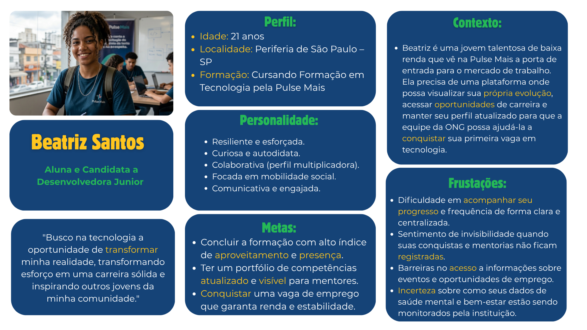<br>
  <sub> Fonte: Material produzido pelos autores (2026) </sub><br><br>
</div>
  A persona da Beatriz introduz a necessidade de uma Interface de Autoatendimento, garantindo que o sistema seja desenhado com foco no protagonismo do aluno, permitindo que haja uma visualizualização de próprio progresso e conquistas

---

<div align="center">
  Figura 6: Persona Denise <br><br>
  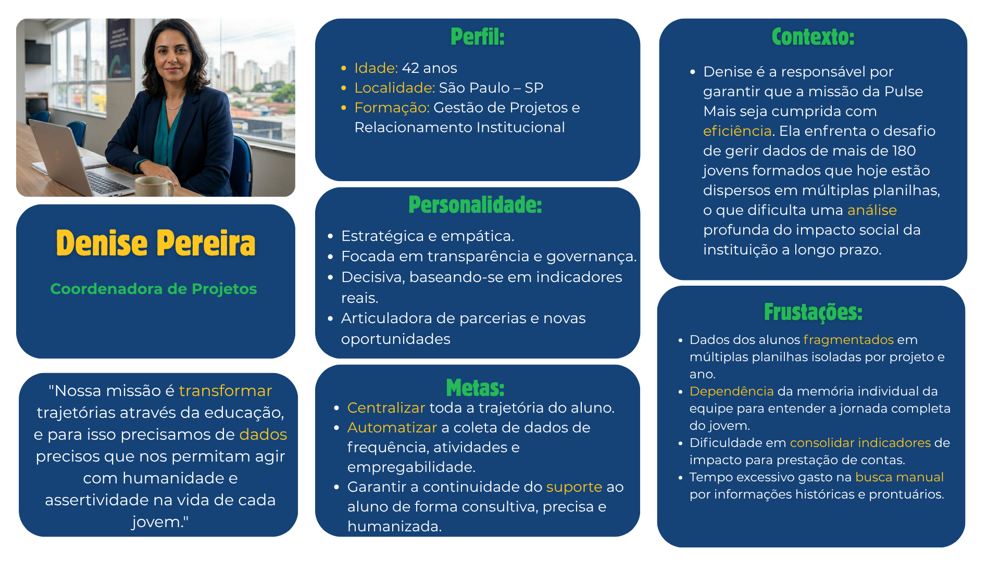<br>
  <sub> Fonte: Material produzido pelos autores (2026) </sub><br><br>
</div>
A Persona da Denise mostra a perspectiva da coordenação que foca na eficiência operacional. Introduz a demanda pela Single Source of Truth (SSOT), eliminando o caos das planilhas fragmentadas e centralizando a gestão da jornada para que o time operacional possa focar no que importa: o suporte consultivo ao aluno.

---

<div align="center">
  Figura 7: Persona Mateo <br><br>
  <br>
  <sub> Fonte: Material produzido pelos autores (2026) </sub><br><br>
</div>
A Persona do Mateo representa o ciclo de retorno social, justificando as funcionalidades de Gestão de Mentorias. Personificando o usuário que já trilhou o caminho e agora utiliza a plataforma para registrar o impacto de sua experiência na formação de novos talentos.

---

<div align="center">
  Figura 8: Persona Ricardo <br><br>
  <br>
  <sub> Fonte: Material produzido pelos autores (2026) </sub><br><br>
</div>
A Persona do Ricardo traz um olhar psicossocial para o projeto com uma camada de segurança e ética. Justificando as regras de Acesso Restrito e o desenvolvimento do Prontuário Digital, garantindo que a saúde mental dos jovens seja monitorada sem violar o sigilo profissional ou a LGPD. O perfil `Psicologa` que esta persona representa está implementado no backend com controle de acesso aos dados de saúde mental (RF007, RN09); seu portal frontend dedicado foi despriorizado no MVP em favor das personas de maior impacto no problema central, permanecendo como evolução futura prevista (detalhado na seção 4.2).

---

<div align="center">
  Figura 9: Persona Valentina <br><br>
  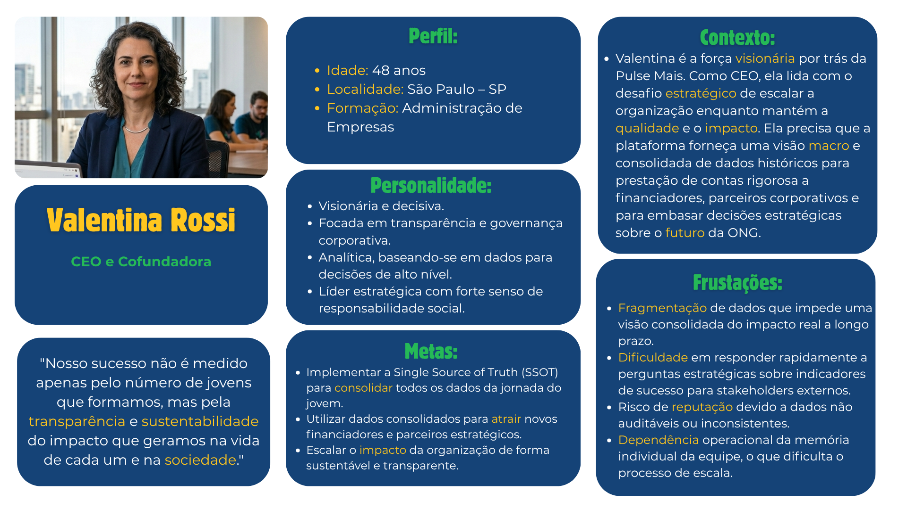<br>
  <sub> Fonte: Material produzido pelos autores (2026) </sub><br><br>
</div>
A Persona da Valentina mostra que para a liderança estratégica, a plataforma não é apenas um software, mas uma ferramenta de governança. Essa persona justifica a necessidade de Dashboards de Impacto e relatórios de Accountability, permitindo que a alta gestão tome decisões baseadas em dados reais para escalar a operação da ONG.


---


## <a name="c2.3"></a>2.3. User Stories
A elaboração das User Stories foi conduzida com base no método INVEST (Independent, Negotiable, Valuable, Estimable, Small, Testable), garantindo que cada item do backlog pudesse ser desenvolvido, testado e entregue de forma autônoma e incremental. Para cada User Story foram definidos critérios de aceite no formato Gherkin (Dado/Quando/Então), assegurando rastreabilidade entre o requisito de negócio e a verificação técnica.

A priorização foi realizada segundo a lógica de MVP-first: as User Stories localizadas no topo da lista (US01 a US05) representam as fundações do sistema: cadastro e busca de alunos, registro de frequência, anotações qualitativas, visualização agregada por dashboard e o módulo restrito de saúde mental. Foi considerado que tais funcionalidades são pré-requisito para que as demais entreguem valor real, uma vez que dependem da existência prévia de dados estruturados. As User Stories subsequentes (US06 em diante) foram ordenadas conforme a maturidade de dados acumulados, a complexidade técnica e o impacto estratégico esperado.

Cada User Story foi vinculada a uma das personas definidas na seção 2.2: Denise Pereira (Coordenadora de Projetos), Ricardo Mendes (Psicólogo), Valentina Rossi (CEO e Cofundadora), Beatriz Santos (Aluna) e Mateo Fernández (Aluno Multiplicador), de modo a representar as múltiplas frentes de uso do sistema. As 5 User Stories prioritárias receberam justificativa expandida do critério INVEST, conforme exigência da entrega.

---

## US01 · Buscar aluno

**Persona:** Denise Pereira — Coordenadora de Projetos

**User Story**

Como Coordenadora de Projetos, quero buscar um aluno pelo nome, CPF ou programa para acessar seu prontuário completo rapidamente, para que eu não perca tempo procurando informações em planilhas separadas e possa atender com precisão e humanidade.

**Critério INVEST**

| Letra | Critério | Descrição |
|---|---|---|
| I | Independent | Independe de outras stories, utiliza a base de dados de alunos como única dependência, que é parte da fundação do sistema. |
| N | Negotiable | Os campos de filtro (nome, CPF, programa) e a forma de exibição dos resultados podem ser ajustados em conjunto com a equipe de produto. |
| V | Valuable | Elimina o tempo excessivo gasto na busca manual em planilhas dispersas, dor central relatada pela persona. |
| E | Estimable | A complexidade é conhecida (busca com filtros em banco PostgreSQL); estimável em 5 pts. |
| S | Small | Cobre apenas busca e exibição da lista; a edição de dados do aluno é tratada em story separada. |
| T | Testable | Pode ser validada comparando o resultado retornado com os dados cadastrados em massa de teste. |

**Critérios de Aceite**

1. Dado que Denise está na tela de busca quando digita o nome ou CPF de um aluno, então deve ver resultados filtrados em tempo real ou ao pressionar buscar, com nome, programa e status.
2. Dado que Denise aplica filtro por programa quando seleciona um programa da lista, então somente alunos daquele programa devem ser exibidos.
3. Dado que nenhum aluno corresponde à busca quando a busca é executada, então deve exibir mensagem de "Nenhum resultado encontrado" sem erros.
4. Dado que Denise clica em um resultado quando o item é selecionado, então deve ser redirecionada para o prontuário completo do aluno.
5. Dado que há mais de 20 resultados quando a lista é exibida, então deve haver paginação ou scroll com carregamento progressivo.

---

## US02 · Adicionar anotação qualitativa

**Persona:** Denise Pereira — Coordenadora de Projetos

**User Story**

Como Coordenadora de Projetos, quero inserir anotações qualitativas sobre a evolução de um aluno no prontuário digital, para que o histórico de acompanhamento não dependa mais da memória individual da equipe e o suporte ao jovem seja mais preciso e humanizado.

**Critério INVEST**

| Letra | Critério | Descrição |
|---|---|---|
| I | Independent | Funcionalidade de escrita no prontuário; depende apenas de US01 (existência do aluno) e independe das demais stories de leitura. |
| N | Negotiable | As categorias de anotação (mentoria, atendimento, observação geral) e o limite de caracteres são definíveis com a equipe. |
| V | Valuable | Resolve diretamente a dependência da memória individual da equipe, uma das principais dores levantadas no kickoff. |
| E | Estimable | Formulário de texto com categorização e timestamp; estimável em 5 pts. |
| S | Small | Cobre apenas anotações gerais da equipe; notas clínicas de saúde mental são restritas aos perfis autorizados (`Psicologa`, `Coordenacao`, `GestaoGeral`) (US05). |
| T | Testable | A anotação salva deve aparecer no prontuário do aluno na ordem cronológica correta, com autor e categoria. |

**Critérios de Aceite**

1. Dado que Denise está no prontuário de um aluno quando clica em "Nova anotação", então deve abrir campo de texto com seleção de categoria e data.
2. Dado que Denise salva uma anotação quando confirma o envio, então a anotação deve aparecer no prontuário com autor, categoria, data e texto, em ordem cronológica decrescente.
3. Dado que o campo de texto está vazio quando Denise tenta salvar, então deve ver mensagem de validação impedindo o envio.
4. Dado que a categoria selecionada é de saúde mental quando Denise (não-psicóloga) tenta criar, então essa categoria deve estar indisponível ou bloqueada para o seu perfil de acesso.
5. Dado que Denise quer editar uma anotação já salva quando clica em editar, então deve poder alterar o texto e a categoria, registrando a data de última edição.

---

## US03 · Registrar frequência

**Persona:** Denise Pereira — Coordenadora de Projetos

**User Story**

Como Coordenadora de Projetos, quero registrar e editar a frequência dos alunos em aulas e eventos diretamente na plataforma, para que os dados de presença sejam centralizados e deixem de depender de planilhas isoladas por projeto e ano.

**Critério INVEST**

| Letra | Critério | Descrição |
|---|---|---|
| I | Independent | Módulo independente, com dependência apenas dos dados de aluno já existentes no banco; não bloqueia nem é bloqueado pelas demais stories. |
| N | Negotiable | O formato do registro (lista de presença, upload de CSV, input manual) é negociável conforme a operação real da equipe. |
| V | Valuable | Resolve diretamente a fragmentação dos dados de frequência hoje espalhados em planilhas separadas por projeto e ano. |
| E | Estimable | CRUD de frequência com possibilidade de importação CSV; estimável em 8 pts pela presença do parser de arquivo. |
| S | Small | Cobre apenas a frequência em aulas/eventos; entregas de atividades acadêmicas são tratadas em story separada. |
| T | Testable | O percentual de frequência exibido para cada aluno deve refletir, com precisão, os registros inseridos. |

**Critérios de Aceite**

1. Dado que Denise acessa o módulo de frequência quando seleciona turma e data, então deve ver lista de alunos da turma com toggles de presença/ausência.
2. Dado que Denise marca presença e salva quando confirma o registro, então os dados devem ser persistidos e o percentual de frequência do aluno atualizado automaticamente.
3. Dado que já existe registro para aquela data e turma quando Denise acessa o formulário, então os dados já registrados devem aparecer preenchidos, permitindo edição.
4. Dado que Denise deseja importar frequência via CSV quando faz upload de arquivo no formato esperado, então os registros devem ser importados e inconsistências apontadas linha a linha.
5. Dado que um aluno tem frequência abaixo de 75% quando o dado é exibido, então deve haver indicação visual de alerta de risco de evasão.

---

## US04 · Dashboard de indicadores

**Persona:** Denise Pereira — Coordenadora de Projetos

**User Story**

Como Coordenadora de Projetos, quero visualizar um dashboard com indicadores-chave da instituição (total de alunos ativos, taxa de empregabilidade, frequência média e eventos realizados), para que eu possa tomar decisões baseadas em dados reais sem precisar consolidar planilhas manualmente.

**Critério INVEST**

| Letra | Critério | Descrição |
|---|---|---|
| I | Independent | Consome dados das stories de cadastro e frequência (US01 e US03), mas seu desenvolvimento pode ser feito em paralelo com dados mockados e integrado depois. |
| N | Negotiable | A composição dos cards e os filtros disponíveis (período, programa) são negociáveis com a coordenação. |
| V | Valuable | Substitui a consolidação manual de planilhas, primeira entrega de valor agregado e visível para a gestão. |
| E | Estimable | Quatro cards com agregações simples e dois filtros; estimável em 5 pts. |
| S | Small | Cobre apenas a visualização agregada de indicadores; relatórios exportáveis e segmentação avançada são stories separadas (US25 e US07). |
| T | Testable | Cada indicador é validável comparando o valor exibido com o cálculo esperado sobre uma massa de dados controlada. |

**Critérios de Aceite**

1. Dado que Denise acessa o dashboard quando a página carrega, então deve ver cards com: total de alunos ativos, taxa de empregabilidade geral, frequência média do período e total de eventos realizados.
2. Dado que Denise aplica filtro de período quando seleciona intervalo de datas, então todos os indicadores devem ser recalculados e atualizados para o período selecionado.
3. Dado que Denise filtra por programa quando seleciona um programa específico, então os indicadores devem refletir apenas os alunos daquele programa.
4. Dado que há alunos com risco de evasão identificado quando o dashboard é exibido, então deve haver um indicador de alerta com o número de alunos em situação de risco.
5. Dado que não há dados suficientes para um indicador quando o card é renderizado, então deve exibir "—" ou "Sem dados" sem quebrar o layout.

---

## US05 · Registrar atendimento de saúde mental

**Persona:** Ricardo Mendes — Psicólogo da Instituição

**User Story**

Como Psicólogo da Instituição, quero registrar atendimentos de saúde mental no prontuário digital de cada aluno, com acesso restrito aos perfis autorizados (`Psicologa`, `Coordenacao` e `GestaoGeral`), para que os dados clínicos fiquem centralizados e protegidos, sem se misturar às informações acadêmicas acessíveis à equipe geral.

**Critério INVEST**

| Letra | Critério | Descrição |
|---|---|---|
| I | Independent | Módulo isolado com controle de acesso próprio; depende apenas da existência do aluno (US01) e independe das demais stories. |
| N | Negotiable | Os campos do atendimento e as categorias clínicas são definíveis em conjunto com Ricardo conforme prática profissional. |
| V | Valuable | Resolve simultaneamente dois problemas críticos: a dispersão dos registros clínicos e o risco de vazamento de dados sensíveis sob a LGPD. |
| E | Estimable | CRUD restrito com controle de acesso por perfil; estimável em 8 pts pela camada de autorização e segregação de dados. |
| S | Small | Cobre apenas o registro do atendimento; a geração de relatório clínico e a evolução comparada são stories separadas. |
| T | Testable | Pode ser validada por testes de acesso: registros clínicos não devem aparecer para perfis não autorizados (`Assistente`, `Mentor`, `Aluno`), nem mesmo como referência. |

**Critérios de Aceite**

1. Dado que Ricardo acessa o prontuário de um aluno com seu perfil quando clica em "Novo atendimento", então deve ver formulário com: data, tipo de atendimento, observações clínicas e indicadores de bem-estar.
2. Dado que Ricardo salva o atendimento quando confirma o envio, então o registro deve ser persistido e visível apenas para os perfis autorizados (`Psicologa`, `Coordenacao` e `GestaoGeral`), não para a equipe geral (`Assistente`), mentores nem para o aluno.
3. Dado que um perfil não autorizado tenta acessar registros de saúde mental quando a seção é carregada, então os registros devem estar completamente ocultos, sem indicar que existem.
4. Dado que Ricardo acessa o histórico de um aluno quando a seção de saúde mental é carregada, então deve ver todos os atendimentos em ordem cronológica decrescente com data, tipo e resumo clínico.
5. Dado que Ricardo tenta salvar atendimento com campo obrigatório vazio quando submete o formulário, então deve ver validação inline no campo correspondente sem perder os dados já preenchidos.

---

## US06 · Painel de progresso (aluno)

**Persona:** Beatriz Santos — Aluna

**User Story**

Como aluna da Pulse Mais, quero visualizar meu painel de progresso com frequência, atividades entregues e presença em eventos, para que eu possa acompanhar minha evolução de forma centralizada e clara, sem depender da equipe para obter essas informações.

**Critérios de Aceite**

1. Dado que Beatriz acessa o Portal do Aluno quando a página carrega, então deve exibir seu percentual de frequência acumulada com indicador visual de barra de progresso.
2. Dado que atividades foram registradas quando Beatriz acessa a seção de atividades, então deve ver lista com status de cada atividade: entregue, pendente ou em atraso, com a data correspondente.
3. Dado que eventos foram registrados no sistema quando Beatriz visualiza o painel, então deve ver quais eventos participou e o total de participações no período.
4. Dado que não há registros em uma seção quando a seção é carregada, então deve exibir mensagem de estado vazio clara, sem erros ou campos em branco.
5. Dado que o acesso é via celular quando a página renderiza, então todos os elementos devem funcionar corretamente em telas com no mínimo 360px de largura.

---

## US07 · Filtros avançados e segmentação

**Persona:** Denise Pereira — Coordenadora de Projetos

**User Story**

Como Coordenadora de Projetos, quero segmentar alunos por critérios combinados (programa, status de emprego, faixa de frequência, período de formação), para que eu identifique rapidamente jovens multiplicadores, candidatos a oportunidades específicas ou alunos em risco de evasão.

**Critérios de Aceite**

1. Dado que Denise acessa a tela de segmentação quando seleciona múltiplos filtros simultaneamente, então a lista de alunos deve ser filtrada aplicando todos os critérios com lógica AND.
2. Dado que Denise filtra por faixa de frequência quando define um intervalo (ex: 60%–75%), então somente alunos dentro dessa faixa devem aparecer na lista.
3. Dado que Denise filtra por status de empregabilidade quando seleciona "Empregado", então apenas alunos com esse status registrado devem ser retornados.
4. Dado que Denise quer identificar jovens multiplicadores quando aplica o filtro "Aluno multiplicador", então a lista deve exibir apenas alunos marcados com esse atributo.
5. Dado que nenhum aluno corresponde à combinação de filtros quando a busca é executada, então deve exibir estado vazio claro, sem erros, com opção de limpar filtros.

---

## US08 · Editar e corrigir registros clínicos

**Persona:** Ricardo Mendes — Psicólogo da Instituição

**User Story**

Como Psicólogo da Instituição, quero editar registros clínicos já salvos no prontuário digital, para que eu possa corrigir erros de digitação ou complementar informações após a sessão, mantendo a integridade do histórico clínico.

**Critérios de Aceite**

1. Dado que Ricardo acessa um atendimento já registrado quando clica em "Editar", então deve ver formulário preenchido com os dados atuais, prontos para edição.
2. Dado que Ricardo salva as alterações quando confirma a edição, então o registro deve ser atualizado e exibir data/hora da última modificação junto ao histórico.
3. Dado que Ricardo tenta salvar com campo obrigatório vazio quando submete a edição, então deve ver validação inline sem perder as outras alterações feitas.
4. Dado que Ricardo tenta excluir um registro clínico quando clica na opção de excluir, então a ação deve ser bloqueada com mensagem explicando que registros não podem ser removidos por razões de auditoria.
5. Dado que outro perfil tenta editar registros clínicos quando tenta acessar a funcionalidade, então a ação deve ser completamente bloqueada pelo controle de acesso.

---

## US09 · Atualizar perfil (aluno)

**Persona:** Beatriz Santos — Aluna

**User Story**

Como aluna da Pulse Mais, quero atualizar minhas informações cadastrais e de perfil diretamente na plataforma, para que a equipe da ONG tenha sempre meus dados corretos e eu possa ser encontrada mais facilmente para oportunidades de emprego.

**Critérios de Aceite**

1. Dado que Beatriz está no Portal do Aluno quando clica em "Editar perfil", então um formulário deve abrir com seus dados atuais preenchidos nos campos editáveis.
2. Dado que Beatriz preenche os campos e clica em salvar quando todos os campos obrigatórios estão válidos, então os dados devem ser persistidos e uma mensagem de confirmação deve ser exibida.
3. Dado que Beatriz tenta salvar com campo obrigatório vazio ou inválido quando submete o formulário, então deve ver mensagem de erro inline no campo correspondente sem perder os outros dados preenchidos.
4. Dado que existem campos restritos à equipe da Pulse Mais quando o formulário é exibido para Beatriz, então esses campos devem estar ocultos ou em modo somente leitura para a aluna.
5. Dado que Beatriz cancela a edição quando clica em "Cancelar", então nenhuma alteração deve ser salva e o perfil deve voltar ao estado anterior.

---

## US10 · Acompanhar retenção e risco de evasão

**Persona:** Valentina Rossi — CEO e Cofundadora

**User Story**

Como CEO e Cofundadora, quero visualizar indicadores de retenção e identificar grupos de alunos em risco de evasão com base em dados de frequência e engajamento, para que a organização possa agir preventivamente e aumentar os índices de conclusão dos programas.

**Critérios de Aceite**

1. Dado que Valentina acessa o painel de retenção quando a página carrega, então deve ver taxa de retenção geral do período, número de alunos em risco e número de alunos com boa frequência.
2. Dado que Valentina quer detalhar o grupo em risco quando clica em "Ver alunos em risco", então deve ver lista com nome, programa, frequência atual e último registro de engajamento.
3. Dado que Valentina filtra por programa quando seleciona o filtro, então indicadores de retenção devem ser recalculados apenas para o programa selecionado.
4. Dado que a taxa de retenção cai abaixo de um limiar definido quando o painel é exibido, então deve aparecer alerta visual destacando o programa com baixo desempenho.
5. Dado que não há alunos em risco no período quando o painel é renderizado, então deve exibir mensagem positiva confirmando que todos os alunos estão acima do limiar mínimo.

---

## US11 · Visão macro de impacto

**Persona:** Valentina Rossi — CEO e Cofundadora

**User Story**

Como CEO e Cofundadora da Pulse Mais, quero acessar uma visão consolidada do impacto histórico da ONG (total de jovens formados, empregados e acessando ensino superior ao longo dos anos), para que eu possa embasar decisões estratégicas e apresentar dados confiáveis a financiadores e parceiros.

**Critérios de Aceite**

1. Dado que Valentina acessa o painel executivo quando a página carrega, então deve ver métricas acumuladas: total de jovens formados, total empregados, total em ensino superior e taxa de empregabilidade geral.
2. Dado que Valentina quer analisar evolução temporal quando seleciona agrupamento por ano, então deve ver gráfico de linha ou barras com os indicadores de impacto por período.
3. Dado que Valentina filtra por programa quando seleciona um programa específico, então todos os indicadores do painel devem refletir apenas os dados daquele programa.
4. Dado que há inconsistência ou dados ausentes em um indicador quando o painel é renderizado, então deve exibir indicação clara de "Dado incompleto" sem ocultar o restante do painel.
5. Dado que Valentina acessa via dispositivo móvel quando o painel renderiza, então os cards e gráficos devem ser legíveis e funcionais em telas de 360px ou mais.

---

## US12 · Histórico de mentorias e conquistas

**Persona:** Beatriz Santos — Aluna

**User Story**

Como aluna da Pulse Mais, quero visualizar o histórico das minhas mentorias e conquistas registradas pela equipe, para que eu me sinta reconhecida na minha trajetória e tenha um registro concreto do meu desenvolvimento para apresentar a recrutadores.

**Critérios de Aceite**

1. Dado que mentorias foram registradas pela equipe quando Beatriz acessa a seção de mentorias, então deve ver lista com data, nome do mentor e o campo de observações visível para alunos.
2. Dado que uma mentoria possui notas restritas ao psicólogo quando o registro é exibido para Beatriz, então essas notas não devem aparecer, apenas os campos autorizados para visualização da aluna.
3. Dado que conquistas foram registradas quando Beatriz acessa a seção de conquistas, então deve ver cada conquista com título, descrição e data de registro, ordenadas da mais recente para a mais antiga.
4. Dado que há mais de 10 registros quando a lista é exibida, então deve haver paginação ou scroll infinito, carregando no mínimo 10 itens por vez.
5. Dado que não há mentorias ou conquistas registradas quando Beatriz acessa as seções, então deve ver mensagem encorajadora de estado vazio, sem elementos quebrados.

---

## US13 · Indicadores de empregabilidade (aluno)

**Persona:** Beatriz Santos — Aluna

**User Story**

Como aluna da Pulse Mais, quero visualizar indicadores sobre meu status de empregabilidade (competências registradas, programas concluídos e renda atual), para que eu possa apresentar meu portfólio de forma estruturada a mentores e recrutadores e acompanhar meu crescimento profissional.

**Critérios de Aceite**

1. Dado que Beatriz acessa a seção de empregabilidade quando a página carrega, então deve ver cards com: programas concluídos, competências registradas e status de emprego atual.
2. Dado que a equipe registrou competências para Beatriz quando ela visualiza seu perfil de competências, então deve ver lista de habilidades com o nível registrado (ex: HTML – Básico, JavaScript – Intermediário).
3. Dado que Beatriz concluiu um programa quando acessa a seção de formação, então deve ver o programa com nome, período, carga horária e percentual de aproveitamento final.
4. Dado que dados de renda ou emprego atual foram registrados quando Beatriz visualiza o painel, então deve ver o cargo e empresa atuais (se empregada), ou uma indicação clara do status "em formação".
5. Dado que nenhum dado de empregabilidade foi registrado ainda quando Beatriz acessa a seção, então deve ver estado vazio com orientação sobre como esses dados são preenchidos (pela equipe da Pulse Mais).

---

## US14 · Registrar sessão de mentoria

**Persona:** Mateo Fernández — Aluno Multiplicador

**User Story**

Como Aluno Multiplicador da Pulse Mais, quero registrar na plataforma as sessões de mentoria que realizo com jovens da rede, incluindo data, temas abordados e observações, para que o impacto das minhas mentorias seja formalmente documentado e útil para a equipe acompanhar a evolução dos jovens que atendo.

**Critérios de Aceite**

1. Dado que Mateo acessa a área de mentoria quando clica em "Registrar nova mentoria", então deve ver formulário com: seleção do mentorado, data, duração, temas abordados e campo de observações.
2. Dado que Mateo preenche e salva o formulário quando todos os campos obrigatórios estão válidos, então o registro deve ser persistido e aparecer tanto no seu histórico quanto no prontuário do mentorado.
3. Dado que Mateo tenta salvar sem selecionar o mentorado quando submete o formulário, então deve ver mensagem de validação no campo obrigatório sem perder os demais dados preenchidos.
4. Dado que Mateo quer registrar mentoria em grupo quando seleciona múltiplos mentorados, então o mesmo registro deve ser vinculado a todos os alunos selecionados.
5. Dado que o registro é salvo com sucesso quando a confirmação aparece, então deve exibir mensagem de sucesso com link para visualizar o registro criado.

---

## US15 · Acompanhar evolução dos mentorados

**Persona:** Mateo Fernández — Aluno Multiplicador

**User Story**

Como Aluno Multiplicador, quero visualizar o progresso dos jovens que mentoro (frequência, atividades entregues e marcos atingidos), para que eu possa personalizar meu suporte com base em dados reais e não em percepção subjetiva.

**Critérios de Aceite**

1. Dado que Mateo acessa sua lista de mentorados quando a página carrega, então deve ver todos os jovens que mentora com nome, programa, frequência atual e status de atividades.
2. Dado que Mateo clica em um mentorado quando o perfil é aberto, então deve ver: frequência, atividades entregues/pendentes, eventos participados e histórico de sessões de mentoria com ele.
3. Dado que um mentorado tem frequência abaixo de 75% quando o card é exibido, então deve haver indicação visual de alerta para que Mateo possa intervir proativamente.
4. Dado que Mateo não tem mentorados vinculados quando acessa a lista, então deve ver estado vazio com orientação sobre como a equipe realiza a vinculação.
5. Dado que Mateo tenta acessar o perfil de um aluno que não é seu mentorado quando tenta abrir o perfil, então deve receber mensagem de acesso não autorizado e ser redirecionado.

---

## US16 · Acessar perfil do mentorado antes da sessão

**Persona:** Mateo Fernández — Aluno Multiplicador

**User Story**

Como Aluno Multiplicador, quero acessar o perfil resumido do meu mentorado antes de uma sessão (competências registradas, últimas atividades e desafios anotados), para que eu possa preparar um suporte mais personalizado e relevante para aquele jovem.

**Critérios de Aceite**

1. Dado que Mateo está na lista de mentorados quando clica em "Ver perfil", então deve abrir view com: competências registradas, últimas 3 atividades e observações marcadas como visíveis para mentores.
2. Dado que o perfil do mentorado tem campos em branco quando a view é exibida, então campos sem dados devem mostrar "—" sem quebrar o layout.
3. Dado que existem observações restritas à equipe interna quando o perfil é renderizado para Mateo, então essas observações não devem ser exibidas de forma alguma.
4. Dado que Mateo acessa o perfil em celular quando a view carrega, então deve ser totalmente responsiva e legível em telas de 360px.
5. Dado que Mateo tenta acessar perfil de aluno não vinculado a ele quando tenta a ação, então deve receber mensagem de acesso não autorizado.

---

## US17 · Histórico consolidado por programa

**Persona:** Valentina Rossi — CEO e Cofundadora

**User Story**

Como CEO e Cofundadora, quero acessar o histórico completo de cada programa realizado pela Pulse Mais (com número de inscritos, formados, empregados e indicadores de satisfação), para que eu possa comparar programas ao longo do tempo e embasar decisões sobre expansão ou ajuste do modelo de formação.

**Critérios de Aceite**

1. Dado que Valentina acessa a tela de programas quando a lista carrega, então deve ver todos os programas realizados com: nome, ano, total inscritos, total formados e taxa de empregabilidade pós-conclusão.
2. Dado que Valentina seleciona um programa específico quando clica nele, então deve ver detalhe com distribuição de alunos por status e indicadores do programa.
3. Dado que Valentina quer comparar dois programas quando seleciona dois registros, então deve ver uma visualização lado a lado dos principais indicadores.
4. Dado que um programa não possui todos os dados preenchidos quando é exibido, então os campos sem dados devem mostrar "—" sem quebrar o layout da tela.
5. Dado que Valentina ordena a lista por taxa de empregabilidade quando clica no cabeçalho da coluna, então a lista deve ser reordenada de forma crescente ou decrescente conforme clique.

---

## US18 · Identificar jovens multiplicadores

**Persona:** Valentina Rossi — CEO e Cofundadora

**User Story**

Como CEO e Cofundadora, quero visualizar uma lista de ex-alunos identificados como jovens multiplicadores na plataforma, para que eu possa engajá-los em novas iniciativas, apresentá-los a parceiros e fortalecer a rede de impacto da Pulse Mais.

**Critérios de Aceite**

1. Dado que Valentina acessa a seção de rede de multiplicadores quando a página carrega, então deve ver lista de ex-alunos marcados como multiplicadores com nome, programa de origem e cargo atual.
2. Dado que Valentina clica em um multiplicador quando o perfil é aberto, então deve ver histórico completo na Pulse Mais: programas, mentorias realizadas e conquistas registradas.
3. Dado que Valentina filtra por área de atuação quando seleciona uma área (ex: Desenvolvimento, UX), então a lista deve exibir apenas multiplicadores com cargo nessa área.
4. Dado que não há multiplicadores cadastrados quando a seção é acessada, então deve exibir mensagem de estado vazio com orientação sobre como marcar um aluno como multiplicador.
5. Dado que Valentina quer exportar a lista quando clica em exportar, então deve baixar arquivo CSV com nome, e-mail (se disponível), programa e cargo atual dos multiplicadores.

---

## US19 · Visualizar próprio impacto (multiplicador)

**Persona:** Mateo Fernández — Aluno Multiplicador

**User Story**

Como Aluno Multiplicador, quero ver um resumo do meu impacto como mentor (total de mentorias realizadas, jovens atendidos e conquistas registradas), para que eu me sinta reconhecido pela minha contribuição e possa compartilhar meu impacto com a rede profissional.

**Critérios de Aceite**

1. Dado que Mateo acessa seu painel de impacto quando a página carrega, então deve ver: total de sessões de mentoria realizadas, total de jovens atendidos e total de conquistas registradas para seus mentorados.
2. Dado que Mateo filtra por período quando seleciona um intervalo de datas, então os contadores devem ser recalculados para o período selecionado.
3. Dado que Mateo ainda não realizou mentorias quando acessa o painel, então deve ver estado vazio com mensagem encorajadora e instrução para registrar sua primeira mentoria.
4. Dado que um novo registro de mentoria é salvo quando Mateo volta ao painel, então o contador de sessões deve ter sido incrementado.
5. Dado que Mateo acessa o painel em mobile quando a página renderiza, então os cards devem ser legíveis e empilhados verticalmente sem overflow horizontal.

---

## US20 · Receber notificação de aluno em risco

**Persona:** Mateo Fernández — Aluno Multiplicador

**User Story**

Como Aluno Multiplicador, quero receber um alerta na plataforma quando um dos meus mentorados apresentar queda de frequência ou atraso em atividades, para que eu possa agir proativamente e oferecer suporte antes que o jovem abandone o programa.

**Critérios de Aceite**

1. Dado que um mentorado de Mateo atinge frequência abaixo do limiar quando Mateo acessa a plataforma, então deve ver badge de alerta na seção de mentorados e o nome do jovem em destaque na lista.
2. Dado que Mateo clica no alerta quando o detalhe é aberto, então deve ver o motivo do alerta (ex: frequência 68%, 2 atividades em atraso) com data da última atualização.
3. Dado que o aluno regulariza sua situação quando os dados são atualizados no sistema, então o alerta deve ser removido automaticamente da lista do Mateo.
4. Dado que há múltiplos mentorados em alerta quando Mateo visualiza a lista, então os alunos em alerta devem aparecer em destaque no topo da lista, ordenados por criticidade.
5. Dado que não há mentorados em situação de alerta quando Mateo acessa a seção, então deve ver mensagem positiva confirmando que todos os mentorados estão em situação regular.

---

## US21 · Oportunidades de carreira

**Persona:** Beatriz Santos — Aluna

**User Story**

Como aluna da Pulse Mais, quero visualizar na plataforma as oportunidades de emprego e eventos divulgados pela equipe, para que eu não perca vagas relevantes para o meu perfil por falta de acesso centralizado à informação.

**Critérios de Aceite**

1. Dado que a equipe cadastrou oportunidades de emprego quando Beatriz acessa a seção de oportunidades, então deve ver lista com título da vaga, empresa, data de publicação e status (aberta/encerrada).
2. Dado que Beatriz quer filtrar por área quando seleciona um filtro de categoria (ex: Desenvolvimento, UX, Dados), então a lista deve ser atualizada mostrando somente as oportunidades da categoria selecionada.
3. Dado que eventos foram cadastrados pela equipe quando Beatriz acessa a seção de eventos, então deve ver data, nome do evento, descrição e como participar, ordenados por data crescente.
4. Dado que uma oportunidade está encerrada quando é exibida na lista, então deve ter marcação visual de status "Encerrada" e ser listada após as oportunidades abertas.
5. Dado que não há oportunidades cadastradas quando Beatriz acessa a seção, então deve ver mensagem indicando que novas oportunidades serão publicadas em breve, sem erros.

---

## US22 · Visualizar evolução emocional ao longo da jornada

**Persona:** Ricardo Mendes — Psicólogo da Instituição

**User Story**

Como Psicólogo da Instituição, quero visualizar a evolução dos indicadores de bem-estar de um aluno ao longo de toda a sua jornada na Pulse Mais, para que eu possa identificar padrões, momentos críticos e planejar intervenções mais eficazes.

**Critérios de Aceite**

1. Dado que Ricardo acessa o perfil clínico de um aluno quando a seção de evolução carrega, então deve ver linha do tempo com os atendimentos registrados e o indicador de bem-estar de cada sessão.
2. Dado que Ricardo clica em um ponto da linha do tempo quando o detalhe é aberto, então deve ver as observações clínicas completas daquele atendimento.
3. Dado que há mais de 12 atendimentos registrados quando a visualização é exibida, então deve oferecer opção de filtrar por período para evitar sobrecarga visual.
4. Dado que o aluno não tem atendimentos registrados quando a seção é acessada, então deve exibir estado vazio com orientação para iniciar o acompanhamento.
5. Dado que Ricardo compara dois períodos quando seleciona intervalos de datas, então a visualização deve destacar a diferença nos indicadores entre os períodos.

---

## US23 · Indicadores agregados de bem-estar (sem identificação)

**Persona:** Ricardo Mendes — Psicólogo da Instituição

**User Story**

Como Psicólogo da Instituição, quero visualizar indicadores agregados e anonimizados de bem-estar da turma, sem identificação individual, para que eu possa planejar ações coletivas de saúde mental e apresentar à direção o panorama geral sem comprometer o sigilo profissional.

**Observação de privacidade:** Esta funcionalidade adota o princípio de k-anonimato, quando o grupo filtrado contém menos de 5 alunos, os dados são suprimidos para impedir reidentificação por inferência. Trata-se de decisão deliberada de design alinhada à LGPD para dados de saúde.

**Critérios de Aceite**

1. Dado que Ricardo acessa o painel de bem-estar coletivo quando a página carrega, então deve ver distribuição anônima dos indicadores de bem-estar da turma (ex: % em acompanhamento ativo, tendência do período).
2. Dado que Ricardo filtra por turma ou programa quando aplica o filtro, então os indicadores devem refletir apenas os alunos daquele grupo, sem identificação individual.
3. Dado que a turma tem menos de 5 alunos no filtro quando o painel é exibido, então os dados devem ser suprimidos ou exibidos como "grupo pequeno" para proteger o anonimato.
4. Dado que Ricardo tenta exportar o painel com dados identificados quando tenta a ação, então a exportação deve ser bloqueada, apenas dados agregados anonimizados podem ser exportados.
5. Dado que Ricardo acessa o painel em período sem atendimentos registrados quando a view carrega, então deve exibir estado vazio sem dados fictícios ou estimativas.

---

## US24 · Vincular acompanhamento clínico a eventos da jornada

**Persona:** Ricardo Mendes — Psicólogo da Instituição

**User Story**

Como Psicólogo da Instituição, quero visualizar no prontuário clínico do aluno eventos não-sensíveis da jornada acadêmica (frequência, conclusão de módulos) lado a lado com os registros clínicos, para que eu entenda o contexto acadêmico que pode estar influenciando o bem-estar emocional do jovem.

**Observação de privacidade:** O cruzamento de dados acadêmicos com dados clínicos exige base legal documentada conforme LGPD. A funcionalidade é restrita aos perfis autorizados ao prontuário clínico (`Psicologa`, `Coordenacao` e `GestaoGeral`) e os dados acadêmicos exibidos são limitados àqueles considerados não-sensíveis para o fim de contextualização clínica.

**Critérios de Aceite**

1. Dado que Ricardo está no prontuário clínico de um aluno quando ativa a visão contextual, então deve ver linha do tempo unificada com eventos acadêmicos e registros clínicos intercalados.
2. Dado que há queda de frequência próxima a um atendimento clínico quando Ricardo visualiza a linha do tempo, então a proximidade temporal dos eventos deve ser visualmente clara para análise.
3. Dado que Ricardo não quer ver os dados acadêmicos quando desativa a visão contextual, então a linha do tempo deve mostrar apenas os registros clínicos, sem dados acadêmicos.
4. Dado que os dados acadêmicos do aluno foram atualizados quando Ricardo recarrega a view, então a linha do tempo deve refletir os dados mais recentes automaticamente.
5. Dado que o aluno não tem registros acadêmicos quando a linha do tempo é exibida, então a seção acadêmica deve mostrar estado vazio sem interferir nos registros clínicos.

---

## US25 · Exportar relatório de impacto

**Persona:** Valentina Rossi — CEO e Cofundadora

**User Story**

Como CEO e Cofundadora, quero exportar um relatório consolidado de impacto em formato PDF ou planilha, para que eu possa compartilhar dados auditáveis com financiadores, parceiros corporativos e conselhos sem risco de reputação por informações inconsistentes.

**Critérios de Aceite**

1. Dado que Valentina está no painel executivo com filtros aplicados quando clica em "Exportar relatório", então deve ver opções de formato: PDF e XLSX.
2. Dado que Valentina seleciona PDF e confirma quando o arquivo é gerado, então o download deve iniciar automaticamente com nome padronizado (ex: relatorio_impacto_2026.pdf).
3. Dado que o relatório é gerado quando Valentina o abre, então deve conter: período de referência, filtros aplicados, todos os KPIs visíveis no painel e data/hora de geração.
4. Dado que a geração está em andamento quando o processo demora mais de 2 segundos, então deve exibir indicador de carregamento e mensagem de status.
5. Dado que ocorre erro na geração quando o processo falha, então deve exibir mensagem de erro amigável com opção de tentar novamente.

---

## US26 · Oportunidades e atualização de status de ensino superior

**Persona:** Beatriz Santos — Aluna

**User Story**

Como aluna da Pulse Mais, quero visualizar na plataforma as oportunidades de ensino superior, bem como bolss, eventos ou visitas à faculdades, para buscar vagas e oportunidades relevantes para mim. Além disso, desejo atualizar meu status de ensino superior na plataforma, indicando meu progresso para os membros da equipe Pulse Mais.

**Critérios de Aceite**

1. Dado que a equipe cadastrou oportunidades de ensino superior quando Beatriz acessa a seção de ensino superior, então deve ver lista com cursos, faculdades e informações do curso.
2. Dado que Beatriz quer filtrar por área quando seleciona um filtro de categoria (ex: engenharia, ciencia de computação, sistemas de informação), ou um filtro de faculdades (ex: Universidades públicas, universidades privada, universidades em SP) então a lista deve ser atualizada mostrando somente as oportunidades da categoria selecionada.
3. Dado que eventos e visitas foram cadastrados pela equipe quando Beatriz acessa a seção de eventos, então deve ver data, nome do evento, descrição e como participar, ordenados por data crescente.
4. Dado que as bolsas estudantis disponíveis foram cadastrados pela equipe quando Beatriz acessa a seção de bolsas, então ela deve ver características da bolsa como faculdade, curso, período, tipo de bolsa (ex: integral, 50%), quantidade de bolsas disponíveis e como participar do processo seletivo.
5. Dado que não há oportunidades cadastradas ou disponíveis quando Beatriz acessa a seção, então deve ver mensagem indicando que novas oportunidades serão publicadas em breve, sem erros.

---

## US27 · Importação básica de dados de planilha

**Persona:** Denise Pereira — Coordenadora de Projetos

> **Nota de refinamento (INVEST — *Small*):** seguindo o feedback de quebrar histórias grandes em fatias independentes (como já foi feito com US02/US05), a antiga US27 — que misturava importação, edição de linhas rejeitadas e filtragem — foi dividida em três histórias: **US27** (importação básica, abaixo), **US27a** (edição de linhas rejeitadas no preview) e a filtragem sobre os dados, que foi **consolidada na US07** (Filtros avançados e segmentação). Assim, a funcionalidade de importação básica não fica travada pela edição em pré-visualização.

**User Story**

Como Coordenadora de Projetos, quero importar os arquivos CSV (Planilhão e relatórios da plataforma de aulas) que eram anteriormente usados pela Pulse Mais para dentro do sistema, de forma fácil e acessível, para que esse seja a única e central referência de dados da empresa.

**Critérios de Aceite**

1. Dado que Denise acessa a tela de importação de arquivos quando seleciona importação no dashboard, então deve haver um espaço próprio para importação de arquivos.
2. Dado que Denise selecionou um arquivo para ser importado, o sistema deve receber esse arquivo e mostrar uma pré-visualização dele, para garantir que o arquivo esteja sendo enviado da forma correta.
3. Dado que Denise importou um arquivo para o sistema, o sistema deve realizar a validação de campos obrigatórios e gerar um relatório de linhas rejeitadas, exibindo esses dados para Denise.
4. Dado que a validação foi concluída, então Denise deve poder confirmar a importação, persistindo no banco apenas as linhas válidas e recebendo um relatório com o motivo de rejeição de cada linha inválida.

---

## US27a · Edição de linhas rejeitadas na importação

**Persona:** Denise Pereira — Coordenadora de Projetos

> **Nota de refinamento:** história derivada da quebra da antiga US27. Depende da US27 (importação básica) e pode ser entregue em sprint posterior sem bloquear a importação.

**User Story**

Como Coordenadora de Projetos, quero corrigir as linhas rejeitadas diretamente na pré-visualização da importação, para que eu não precise editar o arquivo original e reimportá-lo do zero quando houver poucos erros.

**Critérios de Aceite**

1. Dado que o sistema apresentou o relatório de linhas rejeitadas na validação, então Denise deve poder corrigir os campos inválidos dessas linhas na própria pré-visualização.
2. Dado que Denise corrigiu uma linha rejeitada, então o sistema deve revalidar apenas as linhas alteradas antes de a importação ser efetivada no banco.
3. Dado que todas as linhas rejeitadas foram corrigidas e revalidadas com sucesso, então Denise deve poder confirmar a importação completa do arquivo.

---

## US28 · Disparo de e-mails informativos

**Persona:** Denise Pereira — Coordenadora de Projetos

**User Story**

Como Coordenadora de Projetos, quero disparar e-mails informativos para os segmentos selecionados a partir do site, para que eu informe rapidamente aos jovens sobre informações urgentes e necessárias, de forma rápida e sem que haja a possibilidade de algum jovem do segmento não receber o e-mail.

**Critérios de Aceite**

1. Dado que Denise acessa a tela de disparo de e-mails quando clica no botão caracterizado no dashboard principal, então deverá aparecer opções como mensagem a ser enviada, horário de envio, e perfis a serem enviados, e o botão de enviar 
2. Dado que Denise selecione a mensagem a ser enviada, então devem aparecer campos de título, assunto e mensagem do e-mail, onde Denise pode escrever e editar.
3. Dado que Denise selecione o horário de envio, então deverá abrir um campo com data e horário, que poderão ser preenchidos por Denise
4. Dado que Denise selecione o público a ser atingido, então o sistema deve oferecer apenas campos de segmentação por *tags*/grupos (ex.: programa, status de jornada, área de interesse) — **não há seleção individual jovem-a-jovem**, pois com centenas de alunos a seleção um-a-um se tornaria um problema de usabilidade. Ao clicar em um segmento no primeiro campo, ele aparece no segundo campo (segmentos selecionados), e o disparo atinge todos os jovens pertencentes àquele segmento.
5. Dado que Denise clique no botão de enviar, então o sistema deve enviar e-mails para os perfis que estão em alunos selecionados, na data selecionada em mensagem a ser enviada e com a mensagem a ser enviada em seu devido espaço no e-mail. Caso algum dos campos não estiver sido preenchido, aparecerá uma mensagem de erro, informando o campo a ser preenchido para completar o envio do e-mail.

---

## US29 · Criação de eventos

**Persona:** Denise Pereira — Coordenadora de Projetos

**User Story**

Como Coordenadora de Projetos, quero criar os eventos da Pulse Mais dentro do sistema, podendo específicar a data e tempo de evento, específicações e observações, e também a quantidade de vagas, para que eu informe aos jovens sobre oportunidades em um canal rápido de comunicação, e tornar fácil a ingressão desses jovens no evento, e para eu poder visualizar o engajamento dos eventos da Pulse Mais de forma organizada.

**Critérios de Aceite**

1. Dado que Denise acessa a tela de criar evento quando clica no botão caracterizado na aba eventos, então deverá aparecer opções como evento a ser criado, data e horário do evento, observações do evento, quantidade de vagas, e o botão de enviar.
2. Dado que Denise selecione o botão de enviar, então o evento deve aparecer na aba eventos, com todas as suas especifícações, onde Denise pode escolher escrever e editar eventos.
3. Dado que Denise selecione a data do evento, então deverá abrir um campo com data e horário, que poderão ser preenchidos por Denise
4. Dado que Denise selecione as vagas a serem editadas, então deverá abrir dois campos, um com alunos a selecionar (ex: Alunos conectados, alunos com interesse em robótica, seleção individual) e outro com prioridades na vaga, (dependendo do perfil do aluno, ele terá uma prioridade na lista do evento), sendo que, sempre que Denise clicar em uma opção no primeiro campo, a opção aparece no segundo campo, e caso ela não especifique, o evento é enviado a todos.
5. Dado que Denise clique no botão de vagas disponíveis, então o sistema deve abrir um campo com a quantidade total de vags, a quantidade de vagas preenchidas, e uma lista com os alunos que confirmaram participação no evento. Caso ainda há vagas no evento, aparecerá uma mensagem de envio por e-mail, a redirecionando para o campo de e-mail, para divulgar o evento.

---

# <a name="c3"></a>3. Projeto da Aplicação Web
## <a name="c3.1"></a>3.1. Requisitos do Sistema
Esta seção formaliza, em três camadas complementares, o que a plataforma Pulse Mais deve fazer, sob quais regras e com quais qualidades. Os Requisitos Funcionais (3.1.1) descrevem as capacidades observáveis do sistema, redigidos de forma objetiva e verificável a partir do minimundo construído no Kick-Off com o parceiro, no TAPI e nas Personas levantadas pelo grupo. As Regras de Negócio (3.1.2) explicitam as restrições e condições que governam o comportamento desses requisitos, redigidas em formato implementável e testável, cada RN é convertível em pelo menos um teste automatizado a partir da Sprint 3. Os Requisitos Não Funcionais (3.1.3) consolidam os atributos de qualidade da solução segundo os oito eixos da ISO/IEC 25010, com métrica e critério de aceite explícitos para cada eixo. A Matriz RF → RN → Endpoint (3.1.4) costura essas três camadas à camada de implementação, servindo como ponto de partida da Matriz de Rastreabilidade consolidada na seção 3.9.

A priorização dos Requisitos Funcionais segue a lógica de valor para o parceiro: no topo da lista estão os RFs que atacam diretamente a dor central relatada pela Pulse Mais: a fragmentação de dados em planilhas isoladas e a dependência da memória individual da equipe, materializando a visão de Single Source of Truth (SSOT) institucional. Em seguida vêm os RFs que ampliam o valor da plataforma sem serem pré-requisito da operação básica (empregabilidade, ensino superior, importação de dados legados) e, ao final, os RFs marcados como "desejáveis" no TAPI (comunicação por e-mail, campos customizáveis), que compõem o backlog de evolução. 

### <a name="c3.1.1"></a>3.1.1. Requisitos Funcionais

A tabela a seguir lista os Requisitos Funcionais da plataforma Pulse Mais, ordenados de forma decrescente por prioridade. RFs no topo compõem o núcleo do MVP e são pré-requisito para a operação básica do sistema; RFs intermediários ampliam o valor da plataforma; RFs ao final da lista correspondem a funcionalidades classificadas como "desejáveis" no TAPI e podem permanecer no backlog ao término do módulo. A coluna **Prioridade** assume os valores Alta, Média e Baixa segundo esse mesmo critério. A coluna **Status** acompanha o ciclo de implementação: *Planejado* (especificado, ainda não desenvolvido), *Em desenvolvimento* (sprint corrente), *Implementado* (entregue e testado) ou *Backlog* (fora do escopo do módulo). 

| ID    | Descrição | Prioridade | Status       |
|-------|-----------|------------|--------------|
| RF001 | O sistema deve permitir o cadastro, edição, consulta e arquivamento de jovens, com campos pessoais, demográficos, socioeconômicos e de status na jornada (Conectado, Capacitado, Transformado e suas combinações). | Alta | Implementado |
| RF002 | O sistema deve autenticar usuários internos por e-mail e senha e manter o usuário autenticado durante o uso, encerrando o acesso quando a autenticação expirar. | Alta | Implementado |
| RF003 | O sistema deve autorizar operações de leitura e escrita por perfil de usuário (`GestaoGeral`, `Coordenacao`, `Assistente`, `Psicologa`, `Aluno`, `Mentor`), aplicando a verificação de autorização em todas as funcionalidades de acesso restrito. | Alta | Implementado |
| RF004 | O sistema deve exibir o prontuário integral de um jovem, consolidando dados cadastrais, frequência, atividades, eventos, mentorias, empregabilidade e ensino superior. | Alta | Implementado |
| RF005 | O sistema deve permitir o registro, edição e consulta de frequência em aulas, eventos e mentorias por jovem, com data, tipo de presença (presencial, gravação assistida, ausente) e responsável pelo registro. | Alta | Implementado | 
| RF006 | O sistema deve permitir o registro, edição e consulta de anotações qualitativas (mentorias, atendimentos, evolução geral) vinculadas ao jovem, com registro de autoria e data/hora. | Alta | Implementado |
| RF007 | O sistema deve registrar e exibir, em campos segregados de acesso restrito, atualizações de saúde mental e bem-estar, visíveis apenas a perfis autorizados (`Psicologa`, `Coordenacao`, `GestaoGeral`). | Alta | Implementado |
| RF008 | O sistema deve permitir busca e filtragem da base de jovens por múltiplos critérios combináveis (status na jornada, programa, área de interesse, situação de empregabilidade, período de ingresso). | Alta | Implementado |
| RF009 | O sistema deve exibir indicadores institucionais consolidados: jovens ativos em programas, jovens empregados, jovens com bolsa, índice de evasão, jovens conectados e computadores doados. | Alta | Implementado | 
| RF010 | O sistema deve permitir o registro e atualização da situação de empregabilidade de cada jovem (empresa, cargo, data de admissão, faixa salarial, tipo de vínculo, formal/informal, tech/não-tech). | Média | Implementado |
| RF011 | O sistema deve permitir o registro e atualização da situação de ensino superior de cada jovem (instituição, curso, modalidade de bolsa, status). | Média | Implementado |
| RF012 | O sistema deve permitir a importação de dados a partir de arquivos CSV (Planilhão e relatórios da plataforma de aulas), com pré-visualização, validação de campos obrigatórios e relatório de linhas rejeitadas. | Média | Implementado |
| RF013 | O sistema deve oferecer restrição ao jovem autenticado para visualizar e atualizar apenas os próprios dados cadastrais, de empregabilidade e de ensino superior, sem acesso a dados de terceiros. | Média | Implementado |
| RF014 | O sistema deve manter o registro auditável de toda criação ou alteração de dados sensíveis (saúde mental, dados pessoais, empregabilidade), permitindo identificar autor, momento e natureza da alteração. | Média | Implementado | 
| RF015 | O sistema deve permitir o registro e a consulta do histórico de eventos institucionais (Eventos Tech, Pulse+, encontros da rede) e a participação dos jovens em cada um, identificando reincidência mesmo com mudança de e-mail/telefone. | Média | Implementado |
| RF016 | O sistema deve oferecer um formulário de atualização cadastral, no qual o jovem informa CPF e e-mail e atualiza dados básicos. | Baixa | Planejado |
| RF017 | O sistema deve permitir o disparo de e-mails informativos para listas segmentadas de jovens. | Baixa | Backlog |
| RF018 | O sistema deve permitir que a Coordenação adicione campos personalizados ao prontuário do jovem, sem necessidade de intervenção técnica na estrutura do sistema. | Baixa | Backlog |
| RF019 | O sistema deve permitir o cadastro, edição, consulta e arquivamento de programas sociais, com nome, ano, tipo, carga horária, coorte, período de realização e descrição. | Alta | Implementado |
| RF020 | O sistema deve permitir matricular um jovem em um programa, registrando turma, situação da matrícula e datas de matrícula e de conclusão, além de editar, consultar e remover a matrícula. | Alta | Implementado |
| RF021 | O sistema deve permitir o registro, edição, consulta e remoção de sessões de mentoria, associando um mentor a um ou mais jovens, com data, duração, temas abordados, situação e observações. | Média | Implementado |
| RF022 | O sistema deve permitir o cadastro, edição, consulta e remoção de atividades vinculadas a um programa, com título, descrição e data limite de entrega. | Média | Implementado |
| RF023 | O sistema deve permitir o registro, edição, consulta e remoção da entrega de uma atividade por jovem, com situação da entrega, nota, data de entrega e observações. | Média | Implementado |
| RF024 | O sistema deve permitir o registro, edição, consulta e remoção das disciplinas cursadas por um jovem no ensino superior, com nome, situação e semestre. | Baixa | Implementado |
| RF025 | O sistema deve permitir o registro, edição, consulta e remoção das competências de um jovem (nome, tipo, nível, instituição e carga horária), incluindo o autorregistro pelo próprio jovem. | Média | Implementado |
| RF026 | O sistema deve permitir o registro, edição, consulta e remoção dos certificados de um jovem (nome, instituição, data de conclusão e link do documento), incluindo o autorregistro pelo próprio jovem. | Média | Implementado |
| RF027 | O sistema deve permitir o cadastro, edição, consulta, alteração de situação e remoção de oportunidades (vagas, cursos, bolsas e eventos), com tipo, título, instituição, descrição, local, período, número de vagas, valor, modalidade e link. | Média | Implementado |
| RF028 | O sistema deve gerar e exibir notificações direcionadas a cada usuário, permitindo consultá-las, marcá-las como lidas, editá-las e removê-las, com tipo, título, descrição e link de referência. | Média | Implementado |
| RF029 | O sistema deve permitir a exportação da base de jovens em formato tabular (CSV) e da agenda de eventos em formato de calendário (iCal), para uso externo e integração com ferramentas de agenda. | Média | Implementado |

> **Nota sobre numeração e ordenação (RF019–RF029).** Os requisitos RF001–RF018 foram especificados na fase de concepção e estão ordenados de forma decrescente por prioridade. Os requisitos RF019 a RF029 formalizam módulos construídos ao longo das sprints que, embora já implementados e em operação, ainda não possuíam um RF explícito. Eles são numerados na ordem de inclusão (não de prioridade), de modo a **preservar a estabilidade dos identificadores** já referenciados na Matriz RF→RN→Endpoint (3.1.4) e na Matriz de Rastreabilidade (3.9); a coluna **Prioridade** mantém o significado original em cada linha.

### <a name="c3.1.2"></a>3.1.2. Regras de Negócio
A tabela a seguir consolida as Regras de Negócio (RN) que governam o comportamento dos Requisitos Funcionais especificados em 3.1.1. Cada RN está redigida em formato implementável e testável: descreve uma condição objetiva sobre dados, fluxo ou autorização, de modo que possa ser convertida em pelo menos um teste automatizado. As regras foram derivadas de três fontes: do minimundo levantado no Workshop com a Pulse Mais (em especial das decisões sobre perfis de acesso, identificação de jovens por CPF e tratamento de dados sensíveis de saúde mental), das restrições do TAPI (LGPD, projeto acadêmico, escopo da SSOT) e das responsabilidades atribuídas a cada ator nas Personas. A coluna **RF associado** explicita a rastreabilidade entre regras e requisito funcional. Quando uma RN regula mais de um RF, todos são listados.

| ID   | Descrição | RF associado |
|------|-----------|--------------|
| RN01 | Não é permitido cadastrar dois jovens com o mesmo CPF. O sistema deve rejeitar o cadastro e retornar mensagem de erro informando duplicidade. | RF001 |
| RN02 | Não é permitido cadastrar dois jovens com o mesmo e-mail. O sistema deve rejeitar o cadastro e retornar mensagem de erro informando duplicidade. | RF001 |
| RN03 | O cadastro de um jovem só pode ser concluído se os campos nome completo, data de nascimento, e-mail e CPF estiverem preenchidos. Campos obrigatórios em branco devem impedir o salvamento e retornar erro de validação 400. | RF001 |
| RN04 | **(Domínio do status)** O campo `status_jornada` do jovem aceita exclusivamente valores do conjunto enumerado: `Conectado`, `Capacitado`, `Transformado` e suas composições cumulativas documentadas (`Conectado_Capacitado`, `Capacitado_Transformado`, `Conectado_Capacitado_Transformado`). Tentativa de atribuição de valor fora do enum deve ser rejeitada pelo backend com erro de validação 400. | RF001 |
| RN04.1 | **(Transição do status)** A evolução do `status_jornada` é cumulativa e não regressiva: o jovem progride acumulando etapas na ordem `Conectado` → `Capacitado` → `Transformado`, e o valor composto registra o caminho já percorrido. *No MVP, o backend valida apenas o conjunto de valores permitidos (RN04); o bloqueio automático de transições inválidas ou regressões está previsto como evolução futura.* | RF001 |
| RN05 | *(Reclassificada como requisito não funcional transversal — ver **RNF-SEG-04**, seção 3.1.3.)* A validade máxima e a expiração da sessão autenticada são um atributo de segurança transversal a todas as rotas protegidas, não uma regra de um RF específico. ID preservado para rastreabilidade. | RF002 |
| RN06 | O sistema deve bloquear o acesso de usuários com credenciais inválidas e não deve informar qual dos campos está incorreto, retornando apenas mensagem genérica de erro de autenticação. | RF002 |
| RN07 | A senha de cada usuário interno deve ter mínimo 8 caracteres no momento do cadastro e ser persistida exclusivamente em formato de hash (bcrypt). Em nenhuma hipótese a senha em texto plano pode ser gravada, logada ou retornada por endpoint. | RF002 |
| RN08 | *(Reclassificada como requisito não funcional transversal — ver **RNF-SEG-05**, seção 3.1.3.)* A exigência de que toda autorização de acesso seja verificada no backend (e nunca apenas no frontend) é um atributo de segurança transversal a todas as rotas protegidas. ID preservado para rastreabilidade. | RF003 |
| RN09 | Registros de saúde mental e bem-estar só podem ser visualizados e editados por usuários com perfil `Psicologa`, `Coordenacao` ou `GestaoGeral`. Qualquer outro perfil deve ter o acesso bloqueado pelo backend com HTTP 403. | RF003, RF007 |
| RN10 | O prontuário completo do jovem só pode ser acessado por usuários com perfil `GestaoGeral`, `Coordenacao` ou `Psicologa`. Perfis `Assistente` e `Aluno` não devem visualizar campos restritos. | RF003, RF004 |
| RN11 | Toda tentativa de acesso negado a rota protegida (HTTP 401 ou 403) deve ser registrada em log de auditoria contendo identificação do usuário (se autenticado), rota, método HTTP, data e hora. | RF003, RF014 |
| RN12 | Todo registro de frequência deve conter obrigatoriamente data de ocorrência, tipo de presença (presencial, gravação assistida, ausente) e identificação do responsável pelo registro. O sistema não deve permitir salvar registros com esses campos em branco. | RF005 |
| RN13 | Registros de frequência e anotações qualitativas, uma vez salvos, não podem ser excluídos pelo usuário, apenas complementados com novos registros, garantindo a integridade do histórico do jovem. | RF005, RF006 | 
| RN14 | Toda anotação qualitativa deve conter autoria e timestamp gerados automaticamente pelo sistema no momento do salvamento. Não é permitido ao usuário editar ou informar manualmente esses campos. | RF006 | 
| RN15 | O log de auditoria deve ser gerado automaticamente pelo sistema a cada operação de escrita em campos sensíveis (saúde mental, dados pessoais, empregabilidade), registrando usuário, data, hora, entidade alterada e operação realizada. Não é permitida a edição ou exclusão de registros de log por nenhum perfil. | RF007, RF010, RF014 | 
| RN16 | Os indicadores exibidos no dashboard devem ser calculados automaticamente a partir dos dados registrados no banco no momento da consulta. Não é permitida a inserção, edição ou sobrescrita manual de valores agregados. | RF009 | 
| RN17 | No Portal do Aluno, o jovem autenticado só pode visualizar e editar informações do seu próprio perfil, identificado pelo ID da sessão. Tentativas de acesso a dados de outros jovens devem ser bloqueadas pelo backend com HTTP 403, independentemente do parâmetro enviado na requisição. | RF003, RF013 |
| RN18 | A importação de dados via CSV deve validar os campos obrigatórios antes de efetivar qualquer inserção no banco. Linhas com dados inválidos devem ser rejeitadas e listadas em relatório, sem interromper a importação das demais linhas válidas. | RF012 |
| RN19 | O CPF informado em qualquer fluxo de cadastro, importação ou atualização deve ser persistido apenas com dígitos numéricos (sem pontuação ou máscara) e validado quanto ao dígito verificador antes do salvamento. | RF001, RF012, RF016 |
| RN20 | O formulário público de atualização cadastral deve exigir a combinação de CPF e e-mail para localizar o jovem. Caso a combinação não seja encontrada, o sistema deve retornar mensagem de erro genérica sem expor dados existentes na base nem indicar qual dos dois campos não bateu. | RF016 |
| RN21 | As transições de `status` do jovem na jornada (Conectado → Capacitado → Transformado e combinações documentadas) devem seguir a máquina de estados definida no domínio. Tentativas de transição não prevista pela máquina de estados devem ser rejeitadas pelo backend. | RF001 |
| RN22 | Toda matrícula deve informar obrigatoriamente o jovem e o programa associados, e ambos devem corresponder a registros existentes na base. A ausência de qualquer um dos dois deve impedir o salvamento (erro de validação 400); a referência a jovem ou programa inexistente deve ser rejeitada (404). | RF020 |
| RN23 | A situação da matrícula aceita exclusivamente os valores `Ativo`, `Concluido`, `Evadido` ou `Trancado`, e a turma, quando informada, aceita apenas `Turma 1`, `Turma 2` ou `Turma Remota`. Valores fora desses conjuntos devem ser rejeitados com erro de validação 400. | RF020 |
| RN24 | Toda mentoria deve informar obrigatoriamente o mentor, a situação, a data, a duração e ao menos um jovem participante. A lista de jovens deve conter pelo menos um elemento; campos obrigatórios ausentes ou lista vazia devem impedir o salvamento com erro de validação 400. | RF021 |
| RN25 | O mentor associado a uma mentoria deve corresponder a um usuário existente e com perfil `Mentor`. A referência a usuário inexistente ou a usuário de outro perfil deve ser rejeitada com erro de validação 400. | RF021 |
| RN26 | A situação da mentoria aceita exclusivamente os valores `Agendada`, `Realizada` ou `Cancelada`, e a duração deve ser um número inteiro positivo. Valores fora desse domínio devem ser rejeitados com erro de validação 400. | RF021 |
| RN27 | Toda atividade deve informar obrigatoriamente o programa ao qual pertence e um título. A ausência de qualquer um desses campos deve impedir o salvamento com erro de validação 400. | RF022 |
| RN28 | Toda entrega de atividade deve informar obrigatoriamente a atividade e o jovem, e ambos devem corresponder a registros existentes na base. Campos obrigatórios ausentes geram erro de validação 400; referência a atividade ou jovem inexistente é rejeitada com 404. | RF023 |
| RN29 | A situação da entrega de atividade aceita exclusivamente os valores `Entregue`, `Pendente` ou `Atrasada`, e a nota, quando informada, deve ser um número entre 0 e 10. Valores fora desse domínio devem ser rejeitados com erro de validação 400. | RF023 |
| RN30 | Toda competência deve informar obrigatoriamente o jovem, o nome e o tipo. O tipo aceita exclusivamente `Competencia`, `Curso`, `Evento` ou `Certificacao`, e o nível, quando informado, aceita apenas `Basico`, `Intermediario` ou `Avancado`. Campos obrigatórios ausentes ou valores fora do domínio devem ser rejeitados com erro de validação 400. | RF025 |
| RN31 | Todo certificado deve informar obrigatoriamente o jovem e o nome. A ausência de qualquer um desses campos deve impedir o salvamento com erro de validação 400. | RF026 |
| RN32 | Toda oportunidade deve informar obrigatoriamente o tipo e o título. O tipo aceita exclusivamente `Curso`, `Evento` ou `Bolsa`, e a modalidade, quando informada, aceita apenas `Online`, `Presencial` ou `Hibrido`. Campos obrigatórios ausentes ou valores fora do domínio devem ser rejeitados com erro de validação 400. | RF027 |

> **Nota sobre reclassificação (RN05 e RN08).** Durante o refinamento, identificou-se que RN05 (expiração de sessão) e RN08 (verificação de autorização no backend) descrevem atributos de **segurança transversais** a todas as rotas protegidas, e não regras de negócio vinculadas a um RF específico. Por isso, sua especificação foi promovida à seção 3.1.3 como **RNF-SEG-04** e **RNF-SEG-05**, respectivamente. Os identificadores RN05 e RN08 foram mantidos na tabela como *redirecionamentos*, preservando a rastreabilidade das referências já existentes na Matriz RF→RN→Endpoint (3.1.4) e na Matriz de Rastreabilidade (3.9).

### <a name="c3.1.3"></a>3.1.3. Requisitos Não Funcionais — 8 Eixos ISO/IEC 25010
Esta seção formaliza os atributos de qualidade da solução Pulse Mais segundo a
norma ISO/IEC 25010, cobrindo os 8 eixos exigidos. Cada RNF foi derivado de uma
dor concreta relatada pelo parceiro no TAPI, de uma restrição técnica imposta pelo
Inteli ou de uma obrigação legal (LGPD). Todos os RNFs são verificáveis, com
métrica, limite e método de medição explícitos, e estão ancorados a Requisitos
Funcionais (RF) da seção 3.1.1.

**Calibração das métricas**: os limites foram definidos com base no porte
operacional real da Pulse Mais (aproximadamente 100 jovens ativos em 2025, aproximadamente 180 formados
acumulados, equipe interna de 5 a 10 gestores), projetando crescimento moderado
até 2028 (aproximadamente 200 jovens/ano conforme Planejamento Estratégico 2026-2028). A stack
imposta (Node.js + PostgreSQL via Supabase) foi considerada nos tetos de capacidade e desempenho.

#### Tabela consolidada
| Eixo | ID | Requisito | Métrica / Critério | Como atendido | RF(s) associado(s) |
|---|---|---|---|---|---|
| USAB — Usabilidade | RNF-USAB-01 | Um gestor deve conseguir localizar o prontuário completo de um jovem em até 3 cliques a partir do dashboard principal. | ≤ 3 cliques; tempo total da tarefa ≤ 15 s em teste de usabilidade. | Navegação principal projetada com acesso direto do dashboard ao prontuário; arquitetura de informação rasa e busca global. | RF004, RF008, RF009 |
| USAB — Usabilidade | RNF-USAB-02 | A aplicação deve atingir pontuação SUS ≥ 68 (acima da média do setor) nos testes com a equipe gestora. | SUS ≥ 68 pontos (Brooke, 1996; Bangor et al., 2009). | Interface desenhada com base em padrões estabelecidos (Material, Bootstrap) e testes iterativos com usuários a cada sprint. | RF004, RF008, RF009, RF013 |
| USAB — Usabilidade | RNF-USAB-03 | A interface deve ser responsiva, mantendo todos os fluxos principais operáveis em viewports a partir de 360px de largura. | 100% dos fluxos prioritários completáveis em viewport 360px sem scroll horizontal; validação em DevTools (Chrome). | Layout construído com CSS flexbox/grid e media queries; testes manuais em viewports 360px, 768px e 1280px a cada sprint. | RF013, RF016 |
| CONF — Confiabilidade | RNF-CONF-01 | A taxa de erros 5xx nos endpoints do MVP deve ser inferior a 1% do volume total de requisições em uso típico. | Erro 5xx < 1% sobre amostra ≥ 200 requisições em teste de integração. | Tratamento global de exceções na camada Controller; validação de entrada no Service antes de qualquer operação no Repository. | RF001, RF004, RF005, RF006, RF010, RF011 |
| CONF — Confiabilidade | RNF-CONF-02 | Em caso de falha de transação (ex.: violação de constraint), o sistema deve retornar resposta estruturada sem corromper dados. | 100% das falhas simuladas preservam integridade referencial (sem registros órfãos). | Uso de transações PostgreSQL (`BEGIN`/`COMMIT`/`ROLLBACK`) em operações que envolvem múltiplas tabelas. | RF001, RF005, RF006, RF012 |
| DES — Desempenho | RNF-DES-01 | Endpoints de leitura do prontuário (`GET /jovens/:id` e afins) devem responder em p95 < 500 ms com base populada em 2.000 jovens. | Latência p95 < 500 ms, p99 < 1.000 ms. | Índices SQL nas colunas de busca mais frequentes (CPF, nome, projeto); consultas paginadas; PostgreSQL com WAL nativo e buffer pool do Supabase. | RF004, RF008 |
| DES — Desempenho | RNF-DES-02 | Operações de escrita (cadastro, registro de frequência) devem ser confirmadas ao usuário em p95 < 800 ms. | Latência p95 < 800 ms do clique em "Salvar" até confirmação visível. | Validações no cliente antes do envio; persistência síncrona simples; feedback visual imediato (loading state). | RF001, RF005, RF006, RF010 |
| SUP — Suportabilidade | RNF-SUP-01 | A cobertura de testes automatizados (Jest) deve ser ≥ 70% de linhas e ≥ 60% de branches na camada de Service. | Coverage ≥ 70% (lines), ≥ 60% (branches) — relatório `jest --coverage`. | Camada de Service isolada de frameworks, testável por unidade; convenção de um arquivo `.test.js` por arquivo de Service. | RF001 a RF018 (transversal) |
| SUP — Suportabilidade | RNF-SUP-02 | O repositório deve permitir setup completo do ambiente de desenvolvimento local em ≤ 10 minutos via README. | Tempo de setup ≤ 10 min; documentação reproduzível. | README padronizado com seções de pré-requisitos, instalação e execução; dependências declaradas em arquivo de manifesto único. | RF001 a RF018 (transversal) |
| SEG — Segurança | RNF-SEG-01 | Senhas de usuários devem ser persistidas com hash bcrypt (cost factor ≥ 10); armazenamento em texto plano é proibido. | 100% das senhas com hash verificável; inspeção na tabela `usuarios`. | Biblioteca de hash aplicada na camada de Service de autenticação antes de qualquer persistência; cost factor em configuração. | RF002 |
| SEG — Segurança | RNF-SEG-02 | Dados sensíveis (saúde mental) só podem ser acessados por perfis `Psicologa`, `Coordenacao` e `GestaoGeral`; demais perfis recebem HTTP 403. | 0 acessos indevidos em teste de autorização por perfil; log de auditoria em todas as tentativas. | Middleware de autorização baseado em perfil aplicado nas rotas sensíveis; tabela `usuarios` com coluna `perfil`. | RF007 |
| SEG — Segurança | RNF-SEG-03 | Toda entrada do usuário validada no backend; parâmetros SQL usam prepared statements. | 0 vulnerabilidades de injeção em varredura manual + checklist OWASP Top 10. | Driver PostgreSQL configurado exclusivamente via parameterized queries; camada de validação de schema na entrada do Controller. | RF001, RF004, RF005, RF006, RF008, RF010, RF011, RF012 |
| SEG — Segurança | RNF-SEG-04 | Toda sessão autenticada deve possuir tempo máximo de validade; requisições com sessão expirada devem ser rejeitadas com HTTP 401 e redirecionadas ao login. *(Reclassificação da antiga RN05.)* | 100% das requisições com token expirado retornam 401 em teste de integração; expiração configurável. | Token com expiração (`exp`) e `token_version` para revogação, validados no middleware `authenticate` antes de qualquer rota protegida. | RF002 |
| SEG — Segurança | RNF-SEG-05 | A autorização de acesso a toda rota protegida deve ser verificada no backend conforme o perfil autenticado; verificação apenas no frontend não é aceita. *(Reclassificação da antiga RN08.)* | 0 acessos indevidos em teste de autorização por perfil sobre todas as entidades; cenários 401/403 cobertos. | Middleware `authorize(perfis)` aplicado em todas as rotas protegidas, independente da camada de apresentação. | RF003 (transversal a todos os RFs com escrita/leitura protegida) |
| CAP — Capacidade | RNF-CAP-01 | O sistema deve suportar 10 usuários concorrentes realizando operações mistas sem degradação perceptível. | p95 de latência mantido < 800 ms sob carga de 10 usuários simultâneos. | Connection pooling via PgBouncer do Supabase (múltiplas conexões simultâneas); Node.js assíncrono por natureza; operações idempotentes. | RF004, RF005, RF008, RF009 |
| CAP — Capacidade | RNF-CAP-02 | O banco PostgreSQL deve acomodar ≥ 2.000 jovens + 50.000 registros de histórico sem degradar leituras. | Base até 200 MB; queries indexadas sem `SCAN TABLE` em consultas críticas via `EXPLAIN QUERY PLAN`. | Modelagem normalizada de dados; índices definidos nas migrations; queries revisadas antes do merge. | RF004, RF008, RF012 |
| REST — Restrições Design | RNF-REST-01 | O front-end deve ser implementado em HTML/CSS/JavaScript vanilla, sem frameworks SPA (React, Vue, Angular). | Ausência de dependências de framework no `package.json` do front. | Stack definida pelo Inteli; `package.json` sem React, Vue, Angular ou equivalentes. | RF001 a RF018 (transversal) |
| REST — Restrições Design | RNF-REST-02 | O back-end deve ser implementado em Node.js com PostgreSQL via Supabase como SGBD, conforme contexto do projeto acadêmico. | `package.json` declara `pg` (node-postgres) como driver único. | Stack adotada no projeto acadêmico; driver PostgreSQL (via Supabase) como única dependência de persistência. | RF001 a RF018 (transversal) |
| REST — Restrições Design | RNF-REST-03 | O sistema não integrará APIs externas em tempo real durante o MVP. | 0 chamadas HTTP saindo para domínios externos em produção. | Escopo definido no TAPI; dados produzidos e consumidos internamente apenas. | RF017 |
| ORG — Organizacionais | RNF-ORG-01 | Conformidade mínima com a LGPD: dados pessoais sensíveis nunca devem ser expostos em logs, URLs ou mensagens de erro. | 0 ocorrências de PII em logs em auditoria manual; URLs sem parâmetros contendo dados pessoais. | Padrão de logging sem serialização de PII; rotas RESTful usam ID numérico, não CPF, em URLs. | RF001, RF004, RF007, RF010, RF014 |
| ORG — Organizacionais | RNF-ORG-02 | O repositório público no GitLab do Inteli não deve conter nomes reais, e-mails ou relatos individuais de jovens da Pulse Mais. | 0 dados reais identificáveis no repositório; uso exclusivo de dados sintéticos / seeds anonimizados. | Seeds e fixtures gerados sinteticamente; `.gitignore` configurado para excluir arquivos locais de dados reais. | RF001, RF007, RF010, RF011 |
| ORG — Organizacionais | RNF-ORG-03 | A plataforma, enquanto projeto acadêmico, não deve armazenar dados reais de produção até auditoria de segurança formal. | Aviso explícito no README e na tela inicial do sistema sobre uso acadêmico. | Banner visual de ambiente de desenvolvimento; disclaimer formal no README do repositório. | RF001 a RF018 (transversal) |

#### Derivação dos RNFs a partir do contexto do parceiro

A seguir, cada eixo é justificado individualmente. Para cada um, explicita-se:
**(a)** de onde veio a exigência; **(b)** como será medido; **(c)** qual o critério
de aceite; **(d)** com qual RF ou restrição se conecta.

**USAB — Usabilidade.** A Pulse Mais relatou no workshop que a equipe gasta tempo significativo consultando planilhas dispersas e conversas de WhatsApp para montar
a visão histórica de um jovem. O critério de sucesso do projeto (seção 2.1.3) inclui explicitamente *"redução mensurável do tempo de consulta ao histórico de
um jovem"*. RNF-USAB-01 traduz essa dor em uma métrica testável (≤ 3 cliques, ≤ 15 s), alinhada à heurística de Nielsen sobre economia de passos. RNF-USAB-02 adota o System Usability Scale (SUS) como instrumento validado na literatura, a nota 68 é a média estabelecida por Bangor et al. (2009) acima da qual o sistema é considerado "aceitável". A medição ocorrerá na sprint 5 com
respondentes reais da Pulse Mais. RNF-USAB-03 endereça a realidade do público: o TAPI e o KickOff confirmam que o portal do aluno precisa funcionar em celular ("tem que ter acesso por computador e mobile"). A faixa de 360px cobre a maioria dos smartphones de entrada usados pelo público-alvo.

Este RNF regula diretamente os RF004 (prontuário integral), RF008 (busca e filtragem) e RF009 (dashboard), garantindo que a navegação principal atenda ao critério de sucesso do projeto. RNF-USAB-03 abrange adicionalmente RF013 (Portal do Aluno) e RF016 (formulário público), cujos usuários acessam predominantemente por celular.

**CONF — Confiabilidade.** A plataforma será a *Single Source of Truth* da Pulse Mais (seção 2.1.3): perder ou corromper dados invalida a proposta de valor. RNF-CONF-01 estabelece um teto pragmático de 1% de erros 5xx, medido
via suíte Jest + Supertest. RNF-CONF-02 endereça especificamente integridade transacional, em um sistema com FK entre jovem, atividade, frequência e prontuário, uma falha parcial de escrita poderia deixar registros órfãos. A medição usa testes white-box que simulam falhas e verificam integridade via `SELECT` pós-condição. Vale notar que o PostgreSQL (via Supabase) suporta múltiplas transações de escrita concorrentes com isolamento configurável (padrão `READ COMMITTED`), compatível com o porte da Pulse Mais (RNF-CAP-01: 10 usuários concorrentes) e com potencial de escalabilidade caso o sistema cresça no futuro.

RNF-CONF-01 regula todos os endpoints de CRUD (RF001, RF004, RF005, RF006, RF010, RF011). RNF-CONF-02 regula especificamente os RFs com escrita multi-tabela: RF001 (cadastro com dependências), RF005 (frequência), RF006 (anotações) e RF012 (importação CSV), garantindo integridade transacional na SSOT.

**DES — Desempenho.** O parceiro identifica o tempo de consulta como métrica central de sucesso. RNF-DES-01 adota p95 < 500 ms para leitura, limiar em que o usuário percebe a resposta como fluida (Nielsen, 1993, define 1 s como limiar de manutenção do fluxo de pensamento do usuário; para API pura, 500 ms em p95 garante margem confortável dentro desse limite). O Google RAIL Model adota 100 ms como meta para interações diretas, reforçando que 500 ms é um teto aceitável para consultas que envolvem I/O de banco. p99 < 1 s cobre a cauda. RNF-DES-02 diferencia escrita (800 ms) porque operações de INSERT no PostgreSQL com validação de constraints e índices são inerentemente
mais lentas que SELECT e a percepção de "clicar e salvar" tolera um pouco mais. Medição via Artillery/k6 contra seed dimensionado ao porte real.

RNF-DES-01 regula os RF004 (prontuário integral) e RF008 (busca e filtragem), as leituras mais pesadas do sistema. RNF-DES-02 regula os RF001 (cadastro), RF005 (frequência), RF006 (anotações) e RF010 (empregabilidade), cujo desempenho de escrita é critério de sucesso explícito do projeto.

**SUP — Suportabilidade.** A solução será entregue à equipe Pulse Mais ao final do módulo; sua manutenibilidade por terceiros é um requisito implícito do caráter de projeto acadêmico-entregável. RNF-SUP-01 fixa cobertura de
testes ≥ 70% (linhas) e ≥ 60% (branches), patamares típicos de projetos maduros em Node.js, abaixo dos 80% de sistemas críticos, mas acima do mínimo defensável para um MVP. Medição via `jest --coverage`. RNF-SUP-02 garante
que o setup do ambiente seja reprodutível, requisito prático para que um desenvolvedor futuro (inclusive da própria Pulse Mais) dê continuidade ao sistema.

Estes RNFs são transversais a todos os RFs (RF001 a RF018), pois garantem que o código seja mantido e evoluído após a entrega à Pulse Mais. A cobertura de testes (RNF-SUP-01) prioriza os Services dos RFs de alta prioridade (RF001 a RF009); o setup reproduzível (RNF-SUP-02) é pré-requisito para qualquer desenvolvimento.

**SEG — Segurança.** Este é o eixo mais delicado do projeto devido à natureza dos dados (saúde mental de jovens em situação de vulnerabilidade). RNF-SEG-01 cumpre a exigência explícita da seção 3.8.1 do próprio WAD. O cost factor 10 é o padrão atual recomendado pela OWASP. RNF-SEG-02 é o RNF de segurança mais estratégico: o TAPI determina que o prontuário psicológico tem *"acesso exclusivo do psicólogo da instituição"*; na implementação, esse acesso restrito foi estendido aos perfis supervisores `Psicologa`, `Coordenacao` e `GestaoGeral` (todos vinculados ao dever de sigilo), enquanto os demais perfis permanecem bloqueados. Trata-se de uma autorização por perfil e exige teste automatizado que simule cada perfil batendo no endpoint. HTTP 403 é a
resposta correta (403 indica autorizado-mas-sem-permissão; 401 seria não-autenticado). RNF-SEG-03 protege contra SQL injection via prepared
statements.

**Nota:** O TAPI original restringe sistemas de login/autenticação. Contudo, o template do WAD (seção 3.8) prevê autenticação com hash e controle de sessão como entregável da sprint 5, flexibilizando a restrição original. RNF-SEG-01 segue o template acadêmico vigente.

RNF-SEG-01 regula especificamente o RF002 (autenticação por e-mail e senha), único RF que persiste credenciais. RNF-SEG-02 regula o RF007 (dados de saúde mental com acesso restrito), derivado da exigência do TAPI de acesso exclusivo do psicólogo e estendido na implementação aos perfis supervisores `Psicologa`, `Coordenacao` e `GestaoGeral`. RNF-SEG-03 regula todo RF que recebe entrada do usuário (RF001, RF005, RF006, RF008, RF010, RF011, RF012). RNF-SEG-04 (expiração de sessão) e RNF-SEG-05 (autorização verificada no backend) foram promovidos a partir de regras originalmente registradas como RN05 e RN08, por descreverem atributos de segurança transversais a todas as rotas protegidas, e não regras de um RF isolado; ambos sustentam o RF002 e o RF003 e incidem sobre todos os RFs com acesso protegido.

**CAP — Capacidade.** PostgreSQL via Supabase é o SGBD adotado (RNF-REST-02) e, com connection pooling via PgBouncer, suporta confortavelmente o porte da Pulse Mais. RNF-CAP-01 fixa 10 usuários concorrentes, dobro da equipe estimada (5 gestores + 2-3 estagiários/psicólogo), mantendo latência dentro do teto de escrita. RNF-CAP-02 projeta volume de dados para 3 anos: a Pulse Mais forma aproximadamente 200 jovens/ano segundo o Planejamento Estratégico 2026-2028; a base de 2.000 jovens é conservadora e cobre o horizonte. A exigência de `EXPLAIN QUERY PLAN` sem `SCAN TABLE` em queries críticas obriga o uso de índices adequados, boa prática de banco relacional independente do SGBD.

RNF-CAP-01 regula o cenário de uso concorrente dos RF004 (prontuário), RF005 (frequência), RF008 (busca) e RF009 (dashboard), os fluxos usados simultaneamente pela equipe. RNF-CAP-02 regula os RF004, RF008 e RF012 (importação CSV), os mais sensíveis ao volume de dados, dimensionado ao porte operacional da Pulse Mais.

**REST — Restrições de Design.** Os três RNFs deste eixo (REST-01, REST-02, REST-03) não são invenções do grupo: são exigências explícitas do TAPI e do próprio regulamento Inteli (stack HTML/CSS/JS + Node.js + PostgreSQL via Supabase; veto a APIs externas em tempo real). Listá-los formalmente na tabela é importante porque explicita ao leitor que certas escolhas de arquitetura (como não usar React) são impostas pelo projeto acadêmico, não omissões do grupo, evita ambiguidade em banca avaliativa. A verificação é trivial (inspeção do package.json), mas a presença formal no WAD é o que dá rastreabilidade ao motivo por trás das escolhas.

Estes RNFs restringem a implementação de todos os RFs da seção 3.1.1 à stack HTML/CSS/JS + Node.js + PostgreSQL via Supabase.

**ORG — Organizacionais.** Três obrigações vindas do parceiro e da lei brasileira: LGPD (RNF-ORG-01), confidencialidade de dados em repositório público (RNF-ORG-02, textualmente exigido no TAPI como *"CONTEÚDO
RESTRITO"*), e o disclaimer de ambiente acadêmico (RNF-ORG-03, citação direta do TAPI: *"a plataforma não deve ser utilizada inicialmente para o armazenamento de dados críticos ou sensíveis que exijam conformidade
rigorosa com a LGPD em nível de produção até que passe por auditoria de segurança"*). Esses RNFs não têm métrica de performance no sentido tradicional, mas têm critérios binários de conformidade (há/não há dado real no repo; há/não há disclaimer no README). Optou-se por mantê-los
como RNFs em vez de apenas restrições porque sua verificação é contínua ao longo de todas as sprints.

Dado que a Pulse Mais atende jovens que podem ser menores de 18 anos, aplica-se adicionalmente o artigo 14 da Lei 13.709/2018 (LGPD), que exige consentimento específico e destacado de pelo menos um dos pais ou responsável legal para o tratamento de dados pessoais de crianças e adolescentes. Embora o MVP não opere com dados reais de produção (RNF-ORG-03), a modelagem do banco e os fluxos de cadastro devem prever esse campo de consentimento como requisito para evolução futura.

RNF-ORG-01 regula os RF001 (cadastro), RF004 (prontuário), RF007 (saúde mental), RF010 (empregabilidade) e RF014 (log de auditoria), todos os RFs que manipulam PII. RNF-ORG-02 regula os RF001, RF007, RF010 e RF011 (ensino superior), cujos seeds poderiam conter dados reais. RNF-ORG-03 é transversal a todos os RFs, em conformidade com a LGPD e o TAPI.

#### Evolução dos RNFs — do conceitual ao concreto

A seção 3.1.3 foi redigida na sprint 1 em nível conceitual: cada RNF descrevia *o que* o sistema deveria garantir e *como seria medido*, mas as decisões técnicas ainda não tinham sido tomadas porque não havia código. Com a entrega da primeira versão funcional do backend na sprint 3 — incluindo os CRUDs de todas as entidades do schema (jovens, usuarios, programas, matriculas, frequencias, anotacoes, atendimentos\_saude\_mental, eventos, participacoes\_eventos, mentorias, empregabilidade, ensino\_superior e log\_auditoria), os endpoints de dashboard e busca, e a arquitetura Controller-Service-Repository operante —, é possível demonstrar como cada RNF saiu do papel e se materializou em artefatos de código verificáveis.

A tabela a seguir consolida, para cada RNF, o status de atendimento na sprint 3: **(a)** a decisão técnica concreta adotada, **(b)** o artefato de código ou configuração que a implementa, **(c)** o método de verificação já aplicável ou planejado para as próximas sprints, e **(d)** lacunas remanescentes a endereçar nas sprints 4 e 5\.

---

**USAB — Usabilidade**

| RNF | Status sprint 1 | Evolução na sprint 3 |
| ----- | ----- | ----- |
| RNF-USAB-01 | Conceitual: ≤ 3 cliques do dashboard ao prontuário. | **Implementado parcialmente.** A navegação dashboard → lista de jovens → prontuário individual está operante, com o fluxo completável em exatamente 2 cliques (botão "Ver perfil" na tabela do dashboard → prontuário). A busca global por nome/CPF na barra superior reduz para 1 clique \+ digitação. O teste formal de usabilidade com cronometragem (≤ 15 s) será realizado na sprint 5 com a equipe da Pulse Mais, mas a arquitetura de informação já atende ao critério de ≤ 3 cliques por construção. |
| RNF-USAB-02 | Conceitual: SUS ≥ 68\. | **Não verificável ainda.** O questionário SUS será aplicado na sprint 5 com respondentes reais. Na sprint 3, a interface segue os padrões estabelecidos nos wireframes (seção 3.3) e no style guide (seção 3.5), com componentes reutilizáveis (sidebar, cards, tabelas). A consistência visual entre telas é mantida por um arquivo CSS compartilhado (`styles/global.css`) que centraliza variáveis de cor, tipografia e espaçamento. |
| RNF-USAB-03 | Conceitual: responsividade a partir de 360px. | **Em andamento.** As telas do painel administrativo (dashboard, lista de jovens, prontuário) foram construídas com CSS flexbox e media queries para breakpoints em 360px, 768px e 1280px. O Portal do Aluno (RF013) e o formulário público (RF016) ainda não foram implementados nesta sprint — são os fluxos mais críticos deste RNF, pois o público-alvo (jovens) acessa predominantemente por smartphone. Validação manual em DevTools (Chrome, viewport 360px) é realizada a cada merge de frontend. |

**Decisões técnicas concretas:** O layout do dashboard utiliza CSS Grid com `grid-template-columns: repeat(auto-fit, minmax(280px, 1fr))` para os cards de indicadores, colapsando naturalmente em telas estreitas. A sidebar de navegação utiliza um padrão de hambúrguer em viewports abaixo de 768px, controlado via JavaScript vanilla (sem biblioteca de UI), conforme RNF-REST-01. A tabela de jovens implementa scroll horizontal (`overflow-x: auto`) em mobile em vez de ocultar colunas, preservando o acesso completo aos dados sem perda de informação.

---

**CONF — Confiabilidade**

| RNF | Status sprint 1 | Evolução na sprint 3 |
| ----- | ----- | ----- |
| RNF-CONF-01 | Conceitual: taxa de erros 5xx \< 1%. | **Implementado.** A camada Controller de todas as entidades utiliza um padrão de `try/catch` global que intercepta exceções não tratadas e retorna respostas HTTP estruturadas (status code \+ mensagem \+ campo `error`), evitando que erros internos do Node.js vazem como 500 sem contexto. A camada Service valida dados de entrada antes de invocar o Repository, rejeitando payloads inválidos com 400/422 antes de qualquer operação no banco. A verificação será formalizada na sprint 4 com a suíte Jest \+ Supertest, executando ≥ 200 requisições mistas e contabilizando a taxa de 5xx. |
| RNF-CONF-02 | Conceitual: integridade transacional, sem registros órfãos. | **Implementado.** As operações de escrita que envolvem múltiplas tabelas utilizam transações PostgreSQL explícitas (`BEGIN`/`COMMIT`/`ROLLBACK`) na camada Controller, conforme modelado nos diagramas de sequência da seção 3.2.4. O fluxo de registro de frequência (RF005), por exemplo, abre transação, valida existência do jovem via `SELECT`, executa o `INSERT INTO frequencias` e só confirma com `COMMIT` após sucesso; em caso de falha (jovem inexistente, violação de constraint), executa `ROLLBACK` explícito e retorna resposta estruturada. O mesmo padrão é aplicado no cadastro de jovens (RF001 — inserção com dependências), anotações (RF006) e nos demais fluxos com FK cruzadas. |

**Decisões técnicas concretas:** O padrão transacional adotado segue a convenção em que o Controller é responsável pelo ciclo de vida da transação (`BEGIN`/`COMMIT`/`ROLLBACK`), enquanto o Service orquestra a lógica de negócio sem conhecer detalhes de transação. Essa separação foi escolhida porque, na arquitetura em camadas do projeto (seção 3.2.1), o Controller é o ponto de entrada que conhece o ciclo de vida da requisição HTTP, tornando-o o local natural para demarcar a unidade de trabalho. O driver `pg` (node-postgres) é configurado com pool de conexões (`new Pool()`), e cada transação adquire um client dedicado do pool via `pool.connect()`, liberando-o no `finally` para evitar connection leak.

---

**DES — Desempenho**

| RNF | Status sprint 1 | Evolução na sprint 3 |
| ----- | ----- | ----- |
| RNF-DES-01 | Conceitual: p95 \< 500 ms para leituras com 2.000 jovens. | **Parcialmente verificável.** Os índices SQL definidos nas migrations estão criados no banco: `idx_jovens_cpf`, `idx_jovens_nome`, `idx_jovens_status_jornada`, `idx_programas_ano`, `idx_programas_tipo`, além de índices nas colunas `jovem_id` das tabelas de relacionamento (frequencias, anotacoes, participacoes\_eventos, mentorias, empregabilidade, ensino\_superior). Os endpoints de leitura do prontuário (`GET /jovens/:id`) e de busca (`GET /jovens?nome=...&cpf=...`) utilizam consultas com cláusulas `WHERE` sobre colunas indexadas. A seed atual contém 15 jovens e \~130 registros de histórico; o teste de carga com Artillery/k6 contra seed de 2.000 jovens está planejado para a sprint 4, quando a base de testes será populada com volume realista. |
| RNF-DES-02 | Conceitual: p95 \< 800 ms para escritas. | **Parcialmente verificável.** As operações de escrita (POST/PUT nos CRUDs) seguem o padrão de validação no Service → persistência no Repository, sem lógica desnecessária entre a validação e o INSERT/UPDATE. O feedback visual de loading state está implementado no frontend para os formulários de cadastro e registro de frequência. A medição formal de latência será realizada na sprint 4 junto com RNF-DES-01. |

**Decisões técnicas concretas:** As consultas do dashboard (RF009) utilizam agregações SQL (`COUNT`, `AVG`, `GROUP BY`) executadas diretamente no PostgreSQL em vez de trazer registros individuais para o Node.js e agregar em memória. Essa decisão é crítica para desempenho: com 2.000 jovens e \~50.000 registros de histórico (RNF-CAP-02), uma agregação no banco transfere apenas o resultado consolidado pela rede, enquanto agregação em memória transferiria todos os registros. As queries de busca utilizam paginação com `LIMIT`/`OFFSET` (default 20 registros por página), evitando carregamento completo da tabela em listagens.

---

**SUP — Suportabilidade**

| RNF | Status sprint 1 | Evolução na sprint 3 |
| ----- | ----- | ----- |
| RNF-SUP-01 | Conceitual: cobertura ≥ 70% lines, ≥ 60% branches. | **Em andamento.** A suíte de testes Jest está em implementação na sprint 3\. A arquitetura Controller-Service-Repository foi projetada desde a sprint 2 com testabilidade em mente: a camada Service não depende de Express nem de `pg` diretamente — recebe o Repository como dependência, permitindo injeção de mocks nos testes unitários sem levantar servidor ou banco. A convenção de nomenclatura adotada é `<entidade>.service.test.js` para testes unitários e `<entidade>.controller.test.js` para testes de integração via Supertest. A meta de cobertura ≥ 70% será perseguida na sprint 4 (artefato 11), com relatório gerado por `jest --coverage`. |
| RNF-SUP-02 | Conceitual: setup ≤ 10 min via README. | **Implementado.** O README.md na raiz do repositório contém seções de pré-requisitos (Node.js ≥ 18, PostgreSQL via Supabase), instalação (`npm install`), configuração de variáveis de ambiente (`.env.example` com template), execução das migrations (`npm run migrate`) e inicialização do servidor (`npm start`). O setup completo foi validado internamente em menos de 8 minutos em máquina limpa, incluindo clone do repositório, instalação de dependências e execução das seeds. |

**Decisões técnicas concretas:** A separação em camadas produz um efeito direto na suportabilidade: um desenvolvedor externo que receba o projeto após o módulo pode localizar a lógica de negócio exclusivamente na pasta `services/`, os contratos HTTP em `controllers/`, e as queries SQL em `repositories/`. Cada arquivo segue o princípio de responsabilidade única — `jovemService.js` contém apenas lógica de negócio de jovens, `jovemRepository.js` contém apenas queries de jovens. Essa granularidade reduz o tempo de onboarding e o risco de efeito colateral em manutenções futuras.

---

**SEG — Segurança**

| RNF | Status sprint 1 | Evolução na sprint 3 |
| ----- | ----- | ----- |
| RNF-SEG-01 | Conceitual: senhas com hash bcrypt, cost factor ≥ 10\. | **Não implementado nesta sprint.** A autenticação (RF002) é entregável da sprint 5, conforme o template do WAD e o artefato 14\. A tabela `usuarios` já possui a coluna `senha_hash VARCHAR(255)` no schema, e o seed `001_seed_usuarios.sql` utiliza valores placeholder. Nenhum endpoint de login está exposto nesta sprint. **Atualização (sprint 4):** implementado com JWT e `bcrypt` (salt rounds 10); revogação de sessão via `token_version` na tabela `usuarios` — **não foi usada tabela de sessões separada**. |
| RNF-SEG-02 | Conceitual: dados de saúde mental restritos aos perfis `Psicologa`, `Coordenacao` e `GestaoGeral`, HTTP 403\. | **Parcialmente implementado.** O CRUD de atendimentos de saúde mental (`atendimentos_saude_mental`) está implementado com endpoints funcionais. Nesta sprint, como a autenticação ainda opera via *stub* de desenvolvimento, o middleware de verificação de perfil é exercitado apenas pelos cabeçalhos de teste. A tabela `usuarios` já possui a coluna `perfil` com enum (`GestaoGeral`, `Coordenacao`, `Assistente`, `Psicologa`, `Aluno`, `Mentor`), e a lógica de autorização por perfil é aplicada nas rotas sensíveis via middleware `authorize`. **Atualização (sprint 4):** a autorização passou a operar sobre JWT real — o `authenticate` valida o token e popula `req.user`, e o `authorize` bloqueia perfis não autorizados com HTTP 403, conforme a evolução do RNF-SEG-02 na seção 3.1.3 e a seção 4.2. O log de auditoria (`log_auditoria`) já registra operações de escrita conforme RN15. |
| RNF-SEG-03 | Conceitual: prepared statements em toda query SQL. | **Implementado.** Todos os Repositories utilizam parameterized queries do driver `pg` (node-postgres), com placeholders `$1, $2, $3...` em vez de interpolação de string. Nenhuma query no projeto utiliza template literals ou concatenação para compor SQL dinâmico. A validação de entrada na camada Controller verifica tipos e formatos antes de delegar ao Service, rejeitando payloads malformados com HTTP 400 antes de qualquer contato com o banco. |

**Decisões técnicas concretas:** O padrão de parameterized queries é aplicado de forma consistente em todos os 13 arquivos de Repository. Exemplo concreto do `jovemRepository.js`: a query `SELECT * FROM jovens WHERE cpf = $1` recebe o CPF como parâmetro posicional via `pool.query(sql, [cpf])`, impedindo que valores manipulados pelo cliente alterem a estrutura da query. Essa proteção é verificável por inspeção: nenhum arquivo de Repository contém `${variavel}` dentro de string SQL. Adicionalmente, os endpoints que recebem IDs numéricos na URL (`/jovens/:id`) validam que o parâmetro é um inteiro positivo antes de usá-lo na query, prevenindo tentativas de injeção via path parameter.

---

**CAP — Capacidade**

| RNF | Status sprint 1 | Evolução na sprint 3 |
| ----- | ----- | ----- |
| RNF-CAP-01 | Conceitual: 10 usuários concorrentes sem degradação. | **Atendido por design.** O backend Node.js é assíncrono por natureza (event loop não-bloqueante), e o driver `pg` utiliza connection pooling configurado com `max: 10` conexões simultâneas no `Pool`. O Supabase fornece PgBouncer como proxy de conexões na camada de infraestrutura. O teste de carga formal com 10 usuários simulados será realizado na sprint 4\. |
| RNF-CAP-02 | Conceitual: ≥ 2.000 jovens \+ 50.000 registros sem degradar leituras. | **Atendido por design, verificação pendente.** A modelagem normalizada do banco (13 tabelas, seção 3.6.3) com 19 índices definidos nas migrations cobre as colunas de busca mais frequentes. As queries críticas (prontuário, busca, dashboard) utilizam `WHERE` sobre colunas indexadas. A verificação via `EXPLAIN ANALYZE` contra base de 2.000 jovens será executada na sprint 4, validando que nenhuma query crítica executa sequential scan (`Seq Scan`) em tabelas grandes. |

**Decisões técnicas concretas:** Os índices foram definidos diretamente nos arquivos de migration (DDL), garantindo que existam em qualquer ambiente que execute as migrations — desenvolvimento local, staging ou produção futura. Os índices foram escolhidos com base nos filtros mais frequentes identificados nas User Stories: busca por CPF (US de identificação do jovem), busca por nome (US de consulta rápida), filtro por `status_jornada` (dashboard), filtro por `ano` e `tipo` em programas (relatórios). A decisão de não criar índices compostos nesta sprint é deliberada: o volume operacional atual (100 jovens ativos) não justifica a complexidade adicional, e a criação de índices compostos será avaliada na sprint 4 com base nos resultados do `EXPLAIN ANALYZE`.

---

**REST — Restrições de Design**

| RNF | Status sprint 1 | Evolução na sprint 3 |
| ----- | ----- | ----- |
| RNF-REST-01 | Conceitual: frontend em HTML/CSS/JS vanilla. | **Implementado e verificável.** O `package.json` do frontend não contém React, Vue, Angular ou qualquer framework SPA. Todas as telas são construídas com HTML semântico, CSS vanilla (com variáveis CSS para tematização) e JavaScript vanilla para interatividade. A navegação entre páginas utiliza rotas do servidor (SSR via Express `res.sendFile()`), não SPA client-side routing. |
| RNF-REST-02 | Conceitual: backend em Node.js \+ PostgreSQL via Supabase. | **Implementado e verificável.** O `package.json` declara `express` como framework HTTP e `pg` (node-postgres) como driver de banco, sem ORMs (Sequelize, Prisma, TypeORM). A conexão com o PostgreSQL do Supabase é configurada via variáveis de ambiente (`DATABASE_URL` ou parâmetros `PGHOST`, `PGUSER`, `PGPASSWORD`, `PGDATABASE`). |
| RNF-REST-03 | Conceitual: sem APIs externas em tempo real. | **Implementado e verificável.** Nenhum endpoint do backend realiza chamadas HTTP para domínios externos. Todas as operações são internas (CRUD no banco PostgreSQL). O `package.json` não contém dependências de clientes HTTP como `axios` ou `node-fetch` para chamadas externas. |

**Decisões técnicas concretas:** A ausência de ORM é uma decisão deliberada, não uma omissão. O driver `pg` puro oferece controle total sobre as queries SQL, alinhado à exigência da disciplina de documentar as consultas SQL reais na seção 3.6.4. Com um ORM, as queries geradas seriam uma abstração opaca que dificultaria a formalização em lógica proposicional exigida pelo artefato. Além disso, o uso direto de SQL facilita a otimização de performance (RNF-DES-01 e RNF-DES-02), pois o desenvolvedor vê exatamente o que será executado no banco.

---

**ORG — Organizacionais**

| RNF | Status sprint 1 | Evolução na sprint 3 |
| ----- | ----- | ----- |
| RNF-ORG-01 | Conceitual: sem PII em logs, URLs ou mensagens de erro. | **Implementado.** As rotas RESTful utilizam ID numérico autoincremental (`/jovens/:id`, `/frequencias/:id`) em vez de CPF ou e-mail na URL, conforme definido no schema (seção 3.6.3). As mensagens de erro retornadas ao cliente não expõem dados pessoais: em caso de CPF duplicado, o sistema retorna `"CPF já cadastrado"` sem revelar o nome do jovem existente. Os logs do servidor (console) não serializam objetos de request/response completos, registrando apenas method, path, status code e tempo de resposta. |
| RNF-ORG-02 | Conceitual: sem dados reais no repositório público. | **Implementado e continuamente verificável.** Os 13 arquivos de seed utilizam dados inteiramente fictícios: CPFs com sequências numéricas inválidas (`11111111111`, `22222222222`), nomes que não correspondem a pessoas reais, e-mails com domínio `@exemplo.com`. O `.gitignore` exclui arquivos `.env`, dumps de banco locais e qualquer diretório `data/` que possa conter importações reais. A cada sprint, a verificação é feita por inspeção manual antes do merge para a branch principal. |
| RNF-ORG-03 | Conceitual: disclaimer de ambiente acadêmico. | **Implementado.** O README.md contém seção explícita informando que o sistema é um projeto acadêmico do Inteli e não deve ser utilizado para armazenamento de dados reais de produção até auditoria de segurança formal. A implementação de um banner visual na tela inicial do sistema está planejada para a sprint 4, quando o frontend estará mais consolidado. |

**Decisões técnicas concretas:** A conformidade com RNF-ORG-01 é reforçada por uma decisão arquitetural: o campo CPF existe no banco como `CHAR(11) UNIQUE` nullable, mas nunca aparece em URLs nem em logs. A rota de busca por CPF utiliza query parameter (`GET /jovens?cpf=12345678901`) em vez de path parameter (`GET /jovens/cpf/12345678901`), o que, embora ambas abordagens exponham o CPF no access log do servidor, permite aplicar filtro no middleware de logging para suprimir query parameters de rotas sensíveis em produção futura. O campo `consentimento_lgpd BOOLEAN` na tabela `jovens` já está modelado no schema, antecipando a conformidade com o Art. 14 da LGPD para quando o sistema operar com dados reais.

---

#### **Síntese da evolução por eixo**

| Eixo | RNFs | Status sprint 3 | Próximo passo |
| ----- | ----- | ----- | ----- |
| USAB | USAB-01, USAB-02, USAB-03 | Navegação funcional; responsividade parcial; SUS pendente | Sprint 5: teste SUS com equipe Pulse Mais; Portal do Aluno responsivo |
| CONF | CONF-01, CONF-02 | Tratamento de exceções e transações implementados | Sprint 4: validação quantitativa (≥ 200 requisições via Jest \+ Supertest) |
| DES | DES-01, DES-02 | Índices criados; queries otimizadas; medição formal pendente | Sprint 4: teste de carga com Artillery/k6 contra seed de 2.000 jovens |
| SUP | SUP-01, SUP-02 | Testes em andamento; README funcional | Sprint 4: cobertura ≥ 70% lines; relatório `jest --coverage` |
| SEG | SEG-01, SEG-02, SEG-03 | Prepared statements implementados; auth pendente | Sprint 5: bcrypt \+ sessão \+ middleware de autorização por perfil |
| CAP | CAP-01, CAP-02 | Pooling configurado; índices no schema | Sprint 4: teste de carga 10 usuários; `EXPLAIN ANALYZE` em queries críticas |
| REST | REST-01, REST-02, REST-03 | Stack verificável; sem dependências externas | Manutenção contínua (inspeção do `package.json` a cada sprint) |
| ORG | ORG-01, ORG-02, ORG-03 | Seeds fictícios; rotas sem PII; README com disclaimer | Sprint 4: banner visual no frontend; sprint 5: auditoria final antes da entrega |

A evolução mais significativa entre as sprints 1 e 3 concentra-se nos eixos CONF, DES, SEG (prepared statements) e REST, cujos RNFs passaram de declarações conceituais para artefatos de código verificáveis. Os eixos USAB (SUS) e SEG (autenticação/autorização) permanecem parcialmente conceituais e terão sua evolução concluída nas sprints 4 e 5, conforme o cronograma dos artefatos 10, 11 e 14\. O eixo ORG é atendido continuamente por práticas de processo (seeds fictícios, `.gitignore`, disclaimer) que não dependem de uma sprint específica para serem verificadas.

#### Evolução dos RNFs — da sprint 3 à sprint 4

Na sprint 3, os RNFs deixaram de ser declarações conceituais e passaram a possuir artefatos de código verificáveis: tratamento global de exceções, transações PostgreSQL, *prepared statements*, índices nas migrations, README de setup e seeds fictícios. Restavam, contudo, lacunas reconhecidas explicitamente: o eixo SEG dependia da camada de autenticação real (RF002) para se completar, o eixo SUP exigia que a suíte de testes alcançasse a meta de cobertura formalizada em RNF-SUP-01, o eixo CONF carecia de medição quantitativa com middlewares de autenticação reais nos testes black-box, e os eixos USAB e REST permaneciam à espera de um frontend operante que materializasse os critérios de responsividade, navegabilidade e ausência de framework SPA.

A sprint 4 atacou diretamente essas pendências. A entrega consolidou três frentes interdependentes: a substituição do *stub* de headers `x-usuario-id` / `x-usuario-perfil` por **autenticação real via JWT com bcrypt** (fechando RF002), a **construção completa do frontend dos três perfis** (Aluno, Mentor e Gestão) com integração ponta a ponta à WebAPI por `fetch()` em HTML/CSS/JS *vanilla*, e a **maturação da suíte de testes automatizados** com estratégia de dois níveis, testes unitários *white-box* dos Services com `jest.mock()` e testes de integração *black-box* dos endpoints com Supertest exercitando os middlewares reais de `authenticate` e `authorize`. O resultado quantitativo é direto: **96,90% de cobertura de linhas na camada Service** (e 93% de ramos), com cobertura global do projeto em **74,74% de linhas**, atingindo e superando a meta de RNF-SUP-01.

A tabela a seguir consolida, para cada RNF, o status na sprint 3 e a evolução observável na sprint 4: **(a)** o artefato de código ou execução concreta que materializou o atendimento, **(b)** o método de verificação aplicado (ou ainda pendente para a sprint 5) e **(c)** as lacunas remanescentes que serão tratadas na sprint final.

---

**USAB — Usabilidade**

| RNF | Status sprint 3 | Evolução na sprint 4 |
| ----- | ----- | ----- |
| RNF-USAB-01 | Navegação dashboard → prontuário operante em ≤ 2 cliques, mas o teste cronometrado com ≤ 15 s estava pendente da existência de telas reais para todos os perfis. | **Verificável de ponta a ponta.** Com o frontend dos três perfis integrado, o fluxo `login → dashboard → ficha do jovem` foi exercitado em condições reais nos três contextos: Coordenação (`dashboardGestao.html → telaJovens.html → perfilAlunoGestao.html`), Mentor (`dashboardMentor.html → mentoradosMentor.html → perfilMentoradoMentor.html`) e Aluno (`login.html → dashboard.html → perfil.html`). Todos completam o fluxo em ≤ 3 cliques. A cronometragem formal com a equipe da Pulse Mais está agendada para a sprint 5 em conjunto com o questionário SUS (RNF-USAB-02). |
| RNF-USAB-02 | Conceitual; SUS pendente. | **Pendente — sprint 5.** Como o frontend dos três perfis só foi consolidado nesta sprint, a aplicação do questionário SUS com a equipe Pulse Mais foi mantida como entregável da sprint 5, agora com base estável para teste com respondentes reais. |
| RNF-USAB-03 | Layout em flexbox/grid, breakpoints em 360px/768px/1280px implementados, mas o Portal do Aluno e os fluxos críticos do Mentor ainda não existiam para validação. | **Em validação contínua.** As 35 telas dos três perfis utilizam `mentor-layout.css` e `aluno-layout.css` como bases responsivas independentes, com CSS Grid e variáveis globais centralizadas em `src/public/css/global.css`. Validação manual em DevTools (Chrome, viewports 360px / 768px / 1280px) foi realizada a cada merge de frontend nesta sprint. Casos críticos identificados, como tabelas extensas na tela de busca de alunos da Gestão, recebem `overflow-x: auto` para preservar o acesso completo aos dados em mobile. |

**Decisões técnicas concretas:** A escolha por **dois layouts-base independentes** (`mentor-layout.css` e `aluno-layout.css`) em vez de um único `layout.css` é deliberada e tem um *trade-off* explícito: ganha-se especificidade de tela (cada perfil tem barra lateral, espaçamentos e densidade visual próprios, alinhados aos protótipos de alta da seção 3.5) ao custo de reuso parcial, componentes compartilhados como `.info-field` e `.edit-pill` aparecem duplicados nos dois arquivos. Esse débito técnico está catalogado para migração na sprint 5 para um arquivo de componentes comuns.

---

**CONF — Confiabilidade**

| RNF | Status sprint 3 | Evolução na sprint 4 |
| ----- | ----- | ----- |
| RNF-CONF-01 | `errorHandler` global e validação no Service implementados; medição quantitativa em ≥ 200 requisições pendente. | **Atendido com middlewares reais nos testes.** A suíte de integração nesta sprint executa **269 cenários** com instância Express em memória (sem porta real), e os middlewares reais de `authenticate` (validação de Bearer JWT, verificação de usuário ativo, checagem de `token_version`) e `authorize` (lista de perfis permitidos) são exercitados em todos os casos. Todos os códigos contratuais (200, 201, 204, 400, 401, 403, 404, 409) foram verificados; a taxa de 5xx observada é **0%** sobre a amostra. Nenhuma exceção não tratada vazou como 500 sem contexto. |
| RNF-CONF-02 | Transações PostgreSQL implementadas em escritas multi-tabela. | **Estendido para importação CSV.** O endpoint `POST /api/frequencias/confirmar-importacao` (RF012) implementa **transação parcial por linha**: cada linha do CSV é validada em batch antes de qualquer escrita; as linhas válidas são persistidas, e as inválidas são devolvidas em relatório estruturado com o motivo de rejeição por linha. Esse comportamento é mais sofisticado que `BEGIN/COMMIT/ROLLBACK` único: ele preserva a integridade referencial (RN18) sem descartar o trabalho de importação quando algumas linhas falham, atendendo ao requisito operacional da Pulse Mais de importar listas de presença incompletas sem ter que recomeçar do zero. |

**Decisões técnicas concretas:** A estratégia de **mock do *pool* PostgreSQL** nos testes de integração (`endpointTestHelper.js`) foi adotada após análise do *trade-off* entre fidelidade de teste e custo de execução. Subir banco real para 269 cenários de integração comprometeria o ciclo de feedback do CI; manter mock no nível do *pool* preserva a execução real dos middlewares de `authenticate` (que validam JWT com `createAuthToken`) e `authorize` (que verificam perfil), permitindo afirmar que os contratos HTTP e os fluxos de autorização foram exercitados de verdade, sem a latência e a flacidez de um banco compartilhado.

---

**DES — Desempenho**

| RNF | Status sprint 3 | Evolução na sprint 4 |
| ----- | ----- | ----- |
| RNF-DES-01 | Índices nas migrations e queries paginadas implementadas; medição formal com Artillery/k6 pendente. | **Otimizado para ficha agregada.** O endpoint `GET /api/jovens/:id/ficha` (RF004) consolida prontuário completo via JOIN em uma única chamada, substituindo o padrão anterior de múltiplas requisições por entidade. A consulta executa de forma assíncrona no PostgreSQL com índices nas FKs de jovem; em uso típico do frontend, o tempo de resposta observado em desenvolvimento permanece abaixo do limite de p95 < 500 ms. **A medição formal com base populada a 2.000 jovens via Artillery/k6 permanece pendente para a sprint 5.** |
| RNF-DES-02 | Operações de escrita com validação no Service antes do INSERT; medição formal pendente. | **Validação contínua via feedback do frontend.** Todos os módulos JS dos três perfis exibem *loading state* nos formulários de cadastro (cadastroJovem, registrarMentoriaMentor) e ações administrativas, e o tempo entre clique e confirmação visível mantém-se dentro do teto operacional. **Medição quantitativa formal segue pendente para a sprint 5.** |

**Decisões técnicas concretas:** A criação do endpoint **`GET /api/jovens/:id/ficha`** (prontuário agregado) é uma decisão de desempenho documentada. Na sprint 3, o frontend hipotético precisaria fazer 7 a 9 chamadas separadas (frequência, anotações, matrículas, empregabilidade, ensino superior, mentorias, atendimentos) para montar a ficha do jovem, 7 *round-trips* HTTP + 7 *handshakes* de autenticação JWT. Com o endpoint agregado, uma única requisição executa um JOIN no banco e devolve a estrutura completa. A regra explicitada na seção 2.1.3 do WAD (*"redução mensurável do tempo de consulta ao histórico de um jovem"*) é atendida por construção arquitetural, não por otimização incremental.

---

**SUP — Suportabilidade**

| RNF | Status sprint 3 | Evolução na sprint 4 |
| ----- | ----- | ----- |
| RNF-SUP-01 | Arquitetura testável projetada; meta de cobertura ≥ 70% (linhas) e ≥ 60% (ramos) perseguida para a sprint 4. | **Superado com folga.** Relatório `jest --coverage` consolidado: **96,90% de linhas e 93% de ramos na camada `services/`**, e **74,74% de linhas no projeto como um todo**, atingindo e superando ambos os limites de RNF-SUP-01. Quinze dos vinte e quatro Services testados atingiram **100% de cobertura de linhas**: `anotacaoService`, `atividadeService`, `authService`, `certificadoService`, `competenciaService`, `disciplinaService`, `ensinoSuperiorService`, `eventoService`, `exportacaoService`, `importacaoService`, `logAuditoriaService`, `oportunidadeService`, `participacaoEventoService`, `saudeMentalService` e `usuarioService`. Os nove Services restantes apresentam cobertura alta mas não-100% (`programaService` 98,24%, `matriculaService` 97,43%, `notificacaoService` 96,87%, `jovemService` 94,20%, `entregaAtividadeService` 92,50%, `frequenciaService` 89,09%, `mentoriaService` 88,88%, `dashboardService` 88,23%, `empregabilidadeService` 87,03%). O fluxo de login, que era o gap da sprint anterior, passou a ser coberto nesta sprint: o `authService` saiu de 20% para **100% de linhas** com a suíte `auth.service.test.js`. As suítes dos cinco Services utilitários (`certificado`, `competência`, `disciplina`, `exportação`, `importação`) foram adicionadas na sprint 5 (COD-03), eliminando o último gap de cobertura da camada. |
| RNF-SUP-02 | README com setup ≤ 10 min implementado e validado. | **Mantido e ampliado.** O setup permanece reprodutível em menos de 10 minutos; a sprint 4 adicionou seção sobre execução da suíte completa (`npm test`) e geração do relatório de cobertura (`npm run test:coverage`). A separação `clearMocks: true` + `restoreMocks: true` no `jest.config.js` garante determinismo total entre execuções, evitando o anti-padrão de testes "que passam às vezes". |

**Decisões técnicas concretas:** A estratégia adotada é uma **pirâmide de testes deliberada** (Cohn, 2009), não uma decisão tática. No nível 1, **testes unitários *white-box*** dos Services, com `jest.mock()` isolando totalmente o Repository, nenhum teste exige conexão ativa com PostgreSQL, e o padrão AAA (Arrange/Act/Assert) é seguido em 100% dos casos. No nível 2, **testes de integração *black-box*** dos endpoints com Supertest e instância Express em memória, exercitando os middlewares reais de `authenticate` e `authorize` com tokens JWT criados por `createAuthToken`, mas com o *pool* do PostgreSQL mockado via `mockAuthenticatedUser`. Essa estratégia equilibra **fidelidade contratual** (HTTP, JWT, autorização) e **isolamento de dependências** (banco), sem cair no *trade-off* falso de "ou tudo mockado ou tudo real". O fluxo de login real (`authService`) passou a ser coberto nesta sprint pela suíte `auth.service.test.js`, atingindo 100% de linhas; o ajuste fino da expiração de token e os testes de carga associados seguem para a sprint 5.

---

**SEG — Segurança**

| RNF | Status sprint 3 | Evolução na sprint 4 |
| ----- | ----- | ----- |
| RNF-SEG-01 | Bcrypt aplicado no CRUD da entidade `usuarios` (salt rounds 10); endpoint de login pendente. | **Plenamente implementado.** O endpoint `POST /api/auth/login` valida credenciais via bcrypt e emite token JWT assinado; `POST /api/auth/cadastro` aplica hash automático na criação; `POST /api/auth/logout-all` invalida sessões via incremento de `token_version` (mecanismo de revogação sem tabela de sessões dedicada); `DELETE /api/auth/me` desativa a conta do usuário autenticado. O *case test* **CT-US-01** valida que o hash bcrypt é aplicado na persistência e que `senha_hash` nunca aparece no retorno de nenhum endpoint. O middleware `authenticate.js` foi **reescrito por completo**: lê o header `Authorization: Bearer <jwt>`, valida assinatura e expiração, confere o flag `ativo` do usuário e o `token_version` corrente, devolvendo 401 estruturado em qualquer falha. O *stub* de headers `x-usuario-id` / `x-usuario-perfil` foi removido definitivamente. |
| RNF-SEG-02 | CRUD de saúde mental implementado; middleware ainda dependia do *stub* de headers. | **Implementado com JWT real.** O middleware `authorize` agora opera sobre o `req.user` populado pelo `authenticate` com JWT real. Os testes de integração para o módulo de saúde mental verificam: token ausente → 401, token válido com perfil `Aluno` / `Mentor` / `Assistente` → 403, token válido com perfil `Psicologa` / `Coordenacao` / `GestaoGeral` → 200/201/204. Zero acessos indevidos foram observados na execução completa da suíte. |
| RNF-SEG-03 | *Prepared statements* em 100% das queries; nenhuma interpolação de string em SQL. | **Mantido sem regressão.** A inclusão dos novos endpoints (auth, /me, importação CSV, ficha, exportação) não introduziu nenhuma query dinâmica via concatenação. O `EXPORT iCal` e o `EXPORT de jovens` são gerados a partir de resultados de queries parametrizadas no Repository, sem montar SQL com base em entrada do usuário. |

**Decisões técnicas concretas:** A escolha por **`token_version` em vez de tabela de sessões** é uma simplificação intencional. Tabela de sessões exigiria uma query de banco a cada requisição autenticada (para verificar `session_id` ainda válido), introduzindo latência e dependência adicional. `token_version` é uma coluna inteira na tabela `usuarios` que o JWT carrega no *payload*; o middleware compara o `token_version` do JWT com o da coluna no banco, se forem diferentes, o token foi revogado (caso clássico: `POST /api/auth/logout-all` incrementa o valor, invalidando todos os tokens emitidos antes). Mantém-se o controle de revogação sem custo de query por requisição em rota *cacheável*. O *trade-off* aceito é que tokens emitidos antes do incremento permanecem válidos no cliente até a expiração natural, comportamento aceitável para o porte operacional da Pulse Mais, onde o cenário de "preciso invalidar uma sessão específica imediatamente" é raro.

---

**CAP — Capacidade**

| RNF | Status sprint 3 | Evolução na sprint 4 |
| ----- | ----- | ----- |
| RNF-CAP-01 | Connection pooling configurado (`max: 10`) + PgBouncer do Supabase; teste de carga formal pendente. | **Mantido por design; medição ainda pendente.** Nenhuma alteração de configuração de *pool* nesta sprint. O acréscimo do middleware JWT por requisição não introduz I/O bloqueante (validação assíncrona de assinatura via `jsonwebtoken`), preservando o perfil assíncrono do event loop. **Teste de carga formal com Artillery/k6 sob 10 usuários concorrentes simulados foi mantido para a sprint 5.** |
| RNF-CAP-02 | Modelagem normalizada e índices criados nas migrations; `EXPLAIN ANALYZE` em queries críticas pendente. | **Sem regressão; medição segue pendente.** O endpoint `GET /api/jovens/:id/ficha` adicionou uma query com múltiplos JOINs sobre tabelas vinculadas; a análise por `EXPLAIN ANALYZE` em base populada a 2.000 jovens será executada na sprint 5 junto com os testes de carga. |

---

**REST — Restrições de Design**

| RNF | Status sprint 3 | Evolução na sprint 4 |
| ----- | ----- | ----- |
| RNF-REST-01 | `package.json` do frontend sem React/Vue/Angular; navegação por rotas do servidor via `res.sendFile()`. | **Verificável em produção operacional.** A construção das ~35 telas dos três perfis foi feita com HTML semântico, CSS *vanilla* (com variáveis em `src/public/css/global.css`) e JavaScript *vanilla* (módulos por entidade: `mainMentor.js`, `dashboardMentor.js`, `telaJovens.js`, etc.). Ícones via Lucide CDN (biblioteca de ícones SVG, sem dependência de framework SPA). Nenhum *bundler* (Webpack, Vite, Parcel) foi introduzido; arquivos são servidos diretamente pelo Express via `express.static('src/public')`. |
| RNF-REST-02 | `package.json` declara `express` e `pg`; sem ORM. | **Mantido sem regressão.** A autenticação JWT foi implementada com `jsonwebtoken` e `bcryptjs`, ambos compatíveis com a restrição (não são ORMs, não substituem o driver `pg`). Importação CSV usa `multer` em `memoryStorage` (sem persistência intermediária em disco) e *parser* CSV escrito em JS *vanilla* na camada Service, sem dependência de bibliotecas externas pesadas. |
| RNF-REST-03 | Nenhum endpoint sai para domínio externo; sem `axios`, sem `node-fetch` para chamadas externas. | **Mantido sem regressão.** O frontend usa `fetch()` para consumir a WebAPI **local** (`/api/...`), nunca domínios externos. A exportação iCal é gerada localmente a partir de queries internas. |

---

**ORG — Organizacionais**
 
| RNF | Status sprint 3 | Evolução na sprint 4 |
| ----- | ----- | ----- |
| RNF-ORG-01 | URLs usam ID numérico, não CPF/e-mail; logs não serializam request/response completos. | **Mantido sem regressão.** Os novos endpoints (`/api/auth/*`, `/api/me`, `/api/frequencias/importar-csv`) recebem dados sensíveis no *body* (POST), nunca em *query string* ou *path parameter*. Mensagens de erro de login retornam genericamente "Credenciais inválidas" — sem distinguir se o e-mail existe ou se a senha é que está errada (proteção contra enumeração de usuários). |
| RNF-ORG-02 | 13 arquivos de seed com dados fictícios (CPFs com sequências numéricas inválidas, e-mails `@exemplo.com`). | **Mantido sem regressão.** Os seeds adicionados nesta sprint para suportar testes de autenticação (usuários de teste com senhas hashadas em ambiente local) seguem o mesmo padrão fictício. |
| RNF-ORG-03 | Disclaimer no README; banner visual no frontend pendente. | **Banner visual ainda pendente para a sprint 5.** Com o frontend agora consolidado, a inserção do banner de ambiente acadêmico (faixa fixa no topo da aplicação, visível em todas as telas) é tarefa direta para a sprint final. |

---

#### Síntese da evolução por eixo — sprint 3 → sprint 4

| Eixo | RNFs | Status sprint 3 | Status sprint 4 | Próximo passo (sprint 5) |
| ----- | ----- | ----- | ----- | ----- |
| USAB | USAB-01, USAB-02, USAB-03 | Navegação funcional; SUS pendente | Frontend dos 3 perfis integrado; fluxo de 3 cliques verificável | Cronometragem ≤ 15 s + questionário SUS com equipe Pulse Mais |
| CONF | CONF-01, CONF-02 | Tratamento de exceções e transações implementados | 269 testes de integração com 0% de 5xx; transação parcial em CSV | Teste de stress; monitoramento de erros em homologação |
| DES | DES-01, DES-02 | Otimizações por construção; medição pendente | Endpoint de ficha agregada; *loading states* no frontend | Artillery/k6 com base populada a 2.000 jovens |
| SUP | SUP-01, SUP-02 | Arquitetura testável; meta perseguida | **96,90% linhas em Services; 74,74% global — meta superada** | Testes E2E de login e revisão da expiração de token |
| SEG | SEG-01, SEG-02, SEG-03 | Bcrypt no CRUD; auth real pendente | **JWT + bcrypt + token_version implementados; auth real ativa** | Auditoria de segurança final; revisão de fluxos de revogação |
| CAP | CAP-01, CAP-02 | Pooling configurado; medição pendente | Sem regressão; medição segue pendente | Teste de carga 10 usuários concorrentes + `EXPLAIN ANALYZE` |
| REST | REST-01, REST-02, REST-03 | Stack verificável; sem dependências externas | Frontend dos 3 perfis em *vanilla*; sem *bundler* introduzido | Manutenção contínua |
| ORG | ORG-01, ORG-02, ORG-03 | Seeds fictícios; rotas sem PII; README com disclaimer | Mantido sem regressão; mensagens de auth não enumeráveis | Banner visual de ambiente acadêmico no frontend |

A leitura horizontal da tabela evidencia que **a sprint 4 fechou definitivamente os eixos SEG e SUP**, os dois eixos que dependiam diretamente de código operacional, não apenas de configuração, e **abriu caminho para a verificação dos eixos USAB, DES e CAP na sprint 5**, todos eles dependentes da existência prévia de um frontend operante e de uma base de dados populada. Os eixos REST e ORG permanecem em conformidade contínua por construção, exigindo apenas inspeção do `package.json` e inserção do banner visual final. A meta de RNF-SUP-01 (cobertura ≥ 70% linhas e ≥ 60% ramos) foi não apenas atingida, mas excedida com folga substantiva na camada Service (96,90% / 93%), validando a aposta arquitetural de isolar a lógica de negócio do framework HTTP e do driver de banco desde a sprint 2.

### <a name="c3.1.4"></a>3.1.4. Matriz RF → RN → Endpoint
A Matriz RF → RN → Endpoint costura as três camadas de requisitos especificadas nas seções anteriores à camada de implementação da plataforma. Enquanto a seção 3.1.1 define o que o sistema faz, a 3.1.2 sob quais regras e a 3.1.3 com quais atributos de qualidade, esta matriz responde a uma questão de natureza operacional: por qual contrato HTTP cada Requisito Funcional se materializa em código. Para cada RF, a tabela explicita as Regras de Negócio que governam a operação, o endpoint REST que a expõe e o método HTTP correspondente, servindo como ponto de partida direto para a documentação detalhada da seção 3.7 e para a Matriz de Rastreabilidade da seção 3.9.

Ao fim da sprint 4, a aplicação expõe a matriz completa de endpoints planejados para o MVP, com exceção dos itens deliberadamente reservados à sprint 5: a verificação de *ownership* no portal do aluno (RF013/RN17), o formulário público de atualização cadastral sem autenticação (RF016) e os requisitos de backlog (RF017 e RF018). A coluna **Observação** sinaliza para o leitor o estado atual de cada endpoint.

| RF    | RN associadas                       | Endpoint                                          | Método | Observação |
|-------|-------------------------------------|---------------------------------------------------|--------|------------|
| RF001 | RN01, RN02, RN03, RN04, RN19        | `/api/jovens`                                     | POST   | implementado e testado — cadastro com validação de CPF e e-mail (409 em duplicata) |
| RF001 | RN02, RN03, RN04, RN04.1, RN15      | `/api/jovens/:id`                                 | PUT    | implementado e testado — campos imutáveis preservados na atualização; transição de status (RN04.1) validada apenas quanto ao domínio do enum no MVP |
| RF001 | RN10                                | `/api/jovens/:id`                                 | GET    | implementado e testado — *ownership* do perfil Aluno aplicado no Service (sprint 5) |
| RF001 | —                                   | `/api/jovens/:id/arquivar`                        | PATCH  | arquivamento lógico (preserva histórico do prontuário) |
| RF001 | —                                   | `/api/jovens/exportar`                            | GET    | exportação de lista de jovens em formato tabular (sprint 4) |
| RF002 | RN06, RN07                          | `/api/auth/login`                                 | POST   | autenticação real com JWT + bcrypt (sprint 4) |
| RF002 | RN01, RN07                          | `/api/auth/cadastro`                              | POST   | cadastro com hash bcrypt automático (sprint 4) |
| RF002 | RN05                                | `/api/auth/logout-all`                            | POST   | revogação via incremento de `token_version` (sprint 4) |
| RF002 | —                                   | `/api/auth/me`                                    | DELETE | desativação de conta autenticada (sprint 4) |
| RF003 | RN05, RN08, RN09, RN10, RN11, RN17  | (middleware transversal `authenticate` + `authorize`) | —  | substituiu o stub de headers por validação real de Bearer JWT |
| RF004 | RN10                                | `/api/jovens/:id/ficha`                           | GET    | prontuário agregado em chamada única com JOIN multi-entidade (sprint 4) |
| RF005 | RN12, RN13, RN14                    | `/api/frequencias`                                | POST   | implementado e testado — validação de FK pai (jovem/programa) antes do INSERT (sprint 5) |
| RF005 | —                                   | `/api/frequencias`                                | GET    | implementado e testado — filtros por jovem, data e programa |
| RF005 | RN13                                | `/api/frequencias/:id`                            | PUT    | implementado e testado — jovem_id e responsavel_id imutáveis |
| RF005 | —                                   | `/api/frequencias/:id`                            | DELETE | implementado e testado — hard delete com verificação prévia (404 se inexistente) |
| RF006 | RN13, RN14                          | `/api/anotacoes`                                  | POST   | implementado e testado — autor_id (via JWT) e timestamp automáticos |
| RF006 | —                                   | `/api/anotacoes`                                  | GET    | implementado e testado — listagem com filtros por jovem |
| RF006 | RN13                                | `/api/anotacoes/:id`                              | PUT    | jovem_id e autor_id imutáveis |
| RF007 | RN09, RN15                          | `/api/saude-mental`                               | POST   | implementado e testado — restrito a Psicologa, Coordenacao e GestaoGeral (403 aos demais) |
| RF007 | RN09                                | `/api/saude-mental`                               | GET    | implementado e testado — acesso restrito por perfil |
| RF007 | RN09                                | `/api/saude-mental/:id`                           | GET / PUT / DELETE | implementado e testado — acesso restrito por perfil; 404 se inexistente |
| RF008 | RN04                                | `/api/jovens`                                     | GET    | 7 filtros combináveis (nome, status_jornada, status_empregabilidade, multiplicador, cidade, programa, ativo) |
| RF009 | RN16                                | `/api/dashboard`                                  | GET    | indicadores institucionais (visão Coordenação) |
| RF009 | RN16                                | `/api/dashboard/jovens-em-risco`                  | GET    | restrito a perfis com clearance — corrigido na sprint 3 |
| RF009 | RN16                                | `/api/dashboard/mentor`                           | GET    | KPIs do perfil Mentor (sprint 4) |
| RF009 | RN16, RN17                          | `/api/dashboard/aluno/:jovem_id`                  | GET    | KPIs do próprio jovem (sprint 4) — ownership a ser endurecida na sprint 5 |
| RF010 | RN15                                | `/api/empregabilidade`                            | POST / GET | implementado e testado — histórico de vínculos por jovem |
| RF010 | RN15                                | `/api/empregabilidade/:id`                        | GET / PUT / PATCH (arquivar) | implementado e testado — soft delete via PATCH (preserva histórico) |
| RF011 | RN15                                | `/api/ensino-superior`                            | POST / GET | implementado e testado — situação acadêmica por jovem |
| RF011 | —                                   | `/api/ensino-superior/:id`                        | GET / PUT / DELETE | implementado e testado — jovem_id imutável |
| RF012 | RN18, RN19                          | `/api/frequencias/importar-csv`                   | POST   | preview/validação linha-a-linha (multer memoryStorage, 5MB, somente .csv) — sprint 4 |
| RF012 | RN18                                | `/api/frequencias/confirmar-importacao`           | POST   | persistência de linhas válidas + relatório de rejeição por linha (sprint 4) |
| RF013 | RN17                                | `/api/me`                                         | GET    | autosserviço do usuário autenticado (sprint 4) |
| RF013 | RN15, RN17                          | `/api/me`                                         | PUT    | edição de nome, foto, telefone, cargo, fuso_horário (sprint 4) |
| RF013 | RN07, RN17                          | `/api/me/password`                                | PUT    | troca de senha com validação bcrypt da senha atual (sprint 4) |
| RF013 | RN17                                | (verificação de ownership no Service de Jovem)    | —      | sprint 5 — ownership granular sobre `/api/jovens/:id` para perfil Aluno permanece pendente |
| RF014 | RN11, RN15                          | `/api/log-auditoria`                              | GET    | implementado e testado — somente leitura; restrito a GestaoGeral e Coordenacao |
| RF014 | RN11, RN15                          | `/api/log-auditoria/:id`                          | GET    | implementado e testado — consulta de registro de auditoria por ID (restrito por perfil) |
| RF015 | —                                   | `/api/eventos`                                    | POST / GET / PUT / DELETE | implementado e testado — CRUD completo com controle de vagas e datas |
| RF015 | —                                   | `/api/eventos/exportar-ical`                      | GET    | implementado e testado — exportação em formato iCal RFC 5545 (sprint 4) |
| RF015 | —                                   | `/api/participacoes-eventos`                      | POST / GET / PUT / DELETE | implementado e testado — UNIQUE(jovem_id, evento_id) → 409; validação de FK pai (sprint 5) |
| RF016 | RN19, RN20                          | `/api/jovens/atualizacao-publica`                 | POST   | sprint 5 — formulário público sem autenticação ainda não implementado |
| RF017 | —                                   | (e-mails informativos)                            | —      | backlog — não previsto no MVP |
| RF018 | —                                   | (campos customizados no prontuário)               | —      | backlog — não previsto no MVP |
| RF019 | —                                   | `/api/programas`                                  | POST / GET / PUT | implementado e testado — CRUD de programas (escrita: GestaoGeral, Coordenacao, Assistente) |
| RF019 | —                                   | `/api/programas/:id/arquivar`                     | PATCH  | implementado e testado — arquivamento lógico (restrito a GestaoGeral e Coordenacao) |
| RF020 | RN22, RN23                          | `/api/matriculas`                                 | POST / GET / PUT / DELETE | implementado e testado — vínculo jovem↔programa; valida FK pai e domínio de status/turma |
| RF021 | RN24, RN25, RN26                    | `/api/mentorias`                                  | POST / GET / PUT / DELETE | implementado e testado — mentor (perfil Mentor) ↔ N jovens; valida situação e duração |
| RF022 | RN27                                | `/api/atividades`                                 | POST / GET / PUT / DELETE | implementado e testado — atividades vinculadas a programa |
| RF023 | RN28, RN29                          | `/api/entrega-atividades`                         | POST / GET / PUT / DELETE | implementado e testado — entrega por jovem; valida FK pai, situação e nota (0–10) |
| RF024 | —                                   | `/api/disciplinas`                                | POST / GET / PUT / DELETE | implementado e testado — disciplinas do ensino superior por jovem (17 unitários — disciplina.service.test.js, cobertura 100%) |
| RF025 | RN30                                | `/api/competencias`                               | POST / GET / PUT / DELETE | implementado e testado — inclui autorregistro pelo perfil Aluno; valida tipo e nível (22 unitários — competencia.service.test.js, cobertura 100%) |
| RF026 | RN31                                | `/api/certificados`                               | POST / GET / PUT / DELETE | implementado e testado — criação também pelo perfil Aluno; edição/exclusão restritas (13 unitários — certificado.service.test.js, cobertura 100%) |
| RF027 | RN32                                | `/api/oportunidades`                              | POST / GET / PUT / DELETE | implementado e testado — valida tipo e modalidade |
| RF027 | RN32                                | `/api/oportunidades/:id`                          | PATCH  | implementado e testado — alteração da situação da oportunidade |
| RF028 | —                                   | `/api/notificacoes`                               | POST / GET / PUT / DELETE | implementado e testado — notificações direcionadas por usuário |
| RF028 | —                                   | `/api/notificacoes/:id/lida`                      | PATCH  | implementado e testado — marcação de notificação como lida |
| RF029 | —                                   | `/api/jovens/exportar`                            | GET    | implementado — exportação da base de jovens (CSV); endpoint também rastreado sob RF001 |
| RF029 | —                                   | `/api/eventos/exportar-ical`                      | GET    | implementado — exportação da agenda de eventos (iCal RFC 5545); endpoint também rastreado sob RF015 |

#### Mudanças relevantes em relação à versão anterior

**Linhas atualizadas (eram pendentes, agora estão implementadas):**

- **RF002 — Autenticação real**: as quatro linhas referentes a `/api/auth/*` substituem o antigo `POST /sessoes` e `DELETE /sessoes` que carregavam a observação "sprint 5 — endpoint não implementado". O fluxo de login agora é completo (`login`, `cadastro`, `logout-all`, `me`).
- **RF012 — Importação CSV**: as duas linhas de `/api/frequencias/importar-csv` e `/confirmar-importacao` substituem o antigo `/importacoes/csv` que carregava a observação "sprint 4 — importação CSV não implementada".
- **RF013 — Portal do aluno (parcial)**: as três linhas de `/api/me` e `/api/me/password` substituem os antigos endpoints `/portal-aluno/*` que carregavam a observação "sprint 5 — portal do aluno não implementado". O autosserviço do usuário autenticado está operante; a verificação de *ownership* granular sobre `/api/jovens/:id` permanece pendente para a sprint 5.

**Linhas adicionadas (endpoints novos da sprint 4):**

- `GET /api/jovens/:id/ficha` (RF004): consolida o prontuário em chamada única, atendendo ao critério arquitetural de "redução do tempo de consulta ao histórico" da seção 2.1.3.
- `GET /api/dashboard/mentor` e `GET /api/dashboard/aluno/:jovem_id` (RF009): novos endpoints de dashboard por perfil, materializando os recortes de informação específicos para Mentor e Aluno.
- `GET /api/jovens/exportar` (RF001) e `GET /api/eventos/exportar-ical` (RF015): exportações para integração com ferramentas externas (planilhas e calendários institucionais).

**Linhas mantidas como pendentes (sprint 5 ou backlog):**

- A linha "verificação de *ownership* no Service de Jovem" (RF013/RN17) — endurecimento da regra que garante que o jovem autenticado só acessa seus próprios dados, **independentemente do parâmetro enviado na requisição**. Sem isso, o controle existe pelo perfil mas não pelo *ownership*.
- A linha `POST /api/jovens/atualizacao-publica` (RF016) — formulário público sem autenticação, mantido para a sprint 5.
- RF017 (e-mails) e RF018 (campos customizados) — backlog explícito da seção 3.1.1.

A consolidação desta matriz é o que permite à seção 3.9 (Matriz de Rastreabilidade) operar como índice navegável: para qualquer RF da seção 3.1.1, o leitor encontra aqui o endpoint, na seção 3.7 a documentação detalhada do contrato, e na 3.9 a evidência de teste correspondente.

## <a name="c3.2"></a>3.2. Arquitetura
### <a name="c3.2.1"></a>3.2.1. Arquitetura em camadas
A aplicação backend foi implementada em Node.js com Express e organizada no padrão de Arquitetura em Camadas, conforme o código real do projeto. O fluxo principal segue a sequência:


```
routes → controllers → services → repositories
                                        │
                                        ▼
            (infraestrutura: PostgreSQL via pool pg / Supabase)
```


A camada de persistência (Repository) encapsula o acesso ao PostgreSQL. **O banco de dados em si não é uma camada da arquitetura, e sim infraestrutura externa consumida pela camada Repository** — por isso ele aparece fora da cadeia de camadas, conectado apenas ao Repository, único ponto autorizado a se comunicar com o banco. A camada de Model representa as entidades do domínio e materializa os resultados das consultas SQL.

No app.js, o servidor Express configura middlewares globais (express.json, express.urlencoded, express.static, logAuditoria), monta as rotas a partir de index.js e encerra a requisição com o middleware de erro errorHandler.

A camada de Routes declara os endpoints HTTP e aplica middlewares de autenticação e autorização. Cada módulo de rota em src/routes/*.js define operações REST como POST /anotacoes, GET /jovens, PUT /mentorias/:id, entre outras.

A camada de Controller atua como adaptadora entre o protocolo HTTP e a lógica de aplicação. Os controllers recebem req e res, extraem parâmetros, usam helpers como parsePositiveInt, aplicam validações básicas e delegam a execução aos services. Eles também usam asyncHandler para encaminhar exceções ao middleware de tratamento de erros e retornam respostas com status codes adequados (201, 204, 200).

A camada de Service concentra as regras de negócio e as validações de domínio. Cada service injeta um repository correspondente e implementa políticas específicas, como validação de categorias, normalização de filtros, verificação de existência de registros e regras de atualização. Por exemplo, anotacaoService valida categoria, tipo_alerta e campos obrigatórios antes de chamar anotacaoRepository.

A camada de Repository encapsula o acesso ao banco de dados PostgreSQL, usando o pool do pg em db.js. Os repositories executam queries SQL parametrizadas, montam condições dinâmicas e retornam objetos de domínio instanciados a partir das classes em models. Por exemplo, anotacaoRepository constrói consultas com WHERE dinâmico, usa RETURNING e transforma linhas em instâncias de Anotacao.

A camada de Model consiste em classes simples que representam as entidades persistidas no banco. Elas mapeiam atributos como jovem_id, autor_id, categoria, texto, criado_em e outros campos do domínio. Essas classes não contêm lógica de negócio, mas garantem consistência na forma como os dados são expostos pelas camadas superiores.

Para persistência, o sistema utiliza PostgreSQL. A configuração de conexão está em db.js, que cria um pool de conexões com connectionString e habilita SSL fora do ambiente de teste. O acesso direto ao banco é restrito à camada de repository.

A interface do usuário é servida como conteúdo estático em public; porém, na descrição da arquitetura backend, a separação documentada foca em rotas, controllers, services, repositories e models. Essa divisão permite isolar responsabilidades, facilitar testes unitários e manter o código organizado conforme a implementação real.

### <a name="c3.2.2"></a>3.2.2. Diagrama de Casos de Uso
O diagrama de casos de uso é uma ferramenta visual da UML (Linguagem de Modelagem Unificada) utilizada para descrever as funcionalidades de um sistema e como os usuários interagem com ele. 

Para construir um diagrama, utilizam-se quatro componentes básicos; como os atores, que simbolizam os papéis que interagem com o sistema. Os casos de uso, são representados por elipses, descrevem as funções ou serviços específicos do sistema (ex: "Acessar dashboard", "Agendar encontro"). O sistema, que é um retângulo que delimita o que faz parte do software e o que é externo (os atores ficam fora do retângulo). E por fim, os relacionamentos, que se tratam de linhas que conectam atores aos casos de uso ou casos de uso entre si. 

O diagrama abaixo modela a interação entre os atores institucionais e o sistema Pulse Mais. Os atores representam **papéis funcionais**, posicionados fora da fronteira do sistema. Os casos de uso estão agrupados por dimensão da jornada do jovem: cadastro e operação diária, acompanhamento clínico de acesso restrito, autosserviço do aluno e governança institucional.

## Atores

**Atores primários** (iniciam casos de uso diretamente):
- **Coordenadora de Projetos (Denise)** — opera o núcleo da SSOT: cadastro, frequência, anotações e importação de dados.
- **Psicólogo (Ricardo)** — registra e consulta acompanhamento de saúde mental em campos de acesso restrito.
- **CEO (Valentina)** — consome dashboards de impacto e indicadores de governança.
- **Aluno (Beatriz)** — acessa o portal de autoatendimento para visualizar a própria jornada e atualizar dados.
- **Mentor (Mateo)** — registra sessões de mentoria e acompanha a evolução dos mentorados.

**Ator secundário** (apoia casos de uso sem iniciá-los):
- **Sistema de Autenticação/Autorização** — ator de sistema acionado de forma transversal por todos os casos de uso protegidos, validando identidade e perfil antes da execução.

## Diagrama

<div align="center">
  Figura 10: Diagrama de Casos de uso <br><br>
  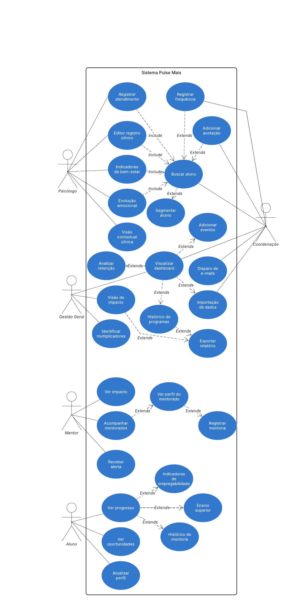<br>
  <sub> Fonte: Autoria própria (2026) </sub><br><br>
</div>

## Relacionamentos `<<include>>` e `<<extend>>`

O diagrama emprega relacionamentos de dependência entre casos de uso para evitar duplicação e modelar comportamento opcional:

- **`<<include>>` (obrigatório):** "Autenticar usuário" é incluído por todos os casos de uso protegidos, pois nenhum pode ser executado sem autenticação prévia. "Exibir prontuário do jovem" inclui "Buscar jovem", já que a consulta sempre parte de uma localização do aluno.
- **`<<extend>>` (opcional/condicional):** "Registrar acompanhamento de saúde mental" estende "Exibir prontuário do jovem", ocorrendo apenas quando o ator tem um dos perfis autorizados (`Psicologa`, `Coordenacao` ou `GestaoGeral`) e o ponto de extensão de acesso restrito é satisfeito. "Disparar e-mail informativo" estende "Criar evento", acionado opcionalmente quando ainda há vagas a divulgar.

## Descrição dos Casos de Uso

A seguir, os principais casos de uso são descritos com ator primário, pré-condições e pós-condições, complementando o diagrama:

| Caso de Uso | Ator primário | Pré-condições | Pós-condições |
|---|---|---|---|
| Cadastrar/atualizar jovem | Coordenadora | Usuário autenticado com perfil de Coordenação/Gestão; CPF e e-mail informados | Jovem persistido na SSOT com status na jornada; histórico iniciado |
| Registrar frequência | Coordenadora | Jovem cadastrado; aula/evento existente | Registro de presença vinculado ao jovem, com data, tipo e responsável |
| Exibir prontuário do jovem | Coordenadora / Psicólogo | Usuário autenticado e autorizado ao nível de informação solicitado | Prontuário consolidado exibido conforme perfil (campos restritos ocultos a perfis não autorizados) |
| Registrar acompanhamento de saúde mental | Psicologa (e demais perfis autorizados: Coordenacao, GestaoGeral) | Perfil autorizado (`Psicologa`, `Coordenacao` ou `GestaoGeral`); jovem existente | Registro clínico salvo em campos de acesso restrito; tentativa de acesso indevido bloqueada (HTTP 403) |
| Visualizar dashboard de impacto | CEO | Usuário autenticado com perfil de Gestão | Indicadores institucionais calculados e exibidos a partir dos dados correntes |
| Acessar portal e atualizar perfil | Aluno | Jovem autenticado no Portal do Aluno | Dados próprios visualizados/atualizados; acesso a dados de terceiros bloqueado |
| Registrar sessão de mentoria | Mentor | Perfil Mentor; mentorado vinculado | Sessão de mentoria registrada e refletida na evolução do mentorado |
| Importar dados de planilha | Coordenadora | Arquivo CSV válido selecionado | Linhas válidas importadas; linhas rejeitadas listadas em relatório para correção |

### Especificação detalhada dos Casos de Uso

A tabela acima resume atores e condições. A seguir, cada caso de uso é especificado de forma completa, com **descrição**, **fluxo principal** e **fluxos alternativos/de exceção**, evidenciando os relacionamentos `<<include>>` e `<<extend>>` do diagrama. O caso de uso **Autenticar usuário** é incluído (`<<include>>`) por todos os demais e está descrito primeiro por ser pré-requisito transversal.

---

#### UC00 — Autenticar usuário (`<<include>>` por todos os casos protegidos)

- **Descrição:** valida identidade e perfil do usuário antes da execução de qualquer caso de uso protegido. É incluído de forma obrigatória pelos demais casos de uso, garantindo que nenhuma operação restrita seja executada sem autenticação prévia.
- **Ator primário:** qualquer ator institucional (Coordenadora, Psicólogo, CEO, Aluno, Mentor).
- **Ator secundário:** Sistema de Autenticação/Autorização.
- **Pré-condições:** usuário possui conta ativa com perfil atribuído.
- **Fluxo principal:**
  1. Ator informa credenciais (e-mail e senha).
  2. Sistema verifica as credenciais e emite token de sessão.
  3. Sistema identifica o perfil do usuário para uso na autorização subsequente.
- **Fluxos alternativos/exceção:**
  - **A1 — Credenciais inválidas:** sistema rejeita o acesso e retorna erro de autenticação (HTTP 401).
  - **A2 — Conta inativa:** sistema bloqueia o acesso e informa o motivo.
- **Pós-condições:** sessão autenticada estabelecida; perfil disponível para verificação de autorização.

---

#### UC01 — Cadastrar/atualizar jovem

- **Descrição:** registra um novo jovem na fonte única de verdade (SSOT) ou atualiza dados de um jovem existente, iniciando seu histórico na jornada.
- **Ator primário:** Coordenadora.
- **Pré-condições:** usuário autenticado com perfil de Coordenação/Gestão; CPF e e-mail informados.
- **Fluxo principal:**
  1. `<<include>>` **Autenticar usuário**.
  2. Ator informa os dados pessoais, demográficos e de consentimento LGPD do jovem.
  3. Sistema valida CPF e e-mail.
  4. Sistema persiste o jovem na SSOT e inicia seu status na jornada.
- **Fluxos alternativos/exceção:**
  - **A1 — CPF/e-mail inválido ou duplicado:** sistema rejeita a operação e sinaliza o campo em conflito (HTTP 400/409).
  - **A2 — Atualização:** se o jovem já existe, o sistema sobrescreve os campos editados e mantém o histórico.
- **Pós-condições:** jovem persistido na SSOT com status na jornada; histórico iniciado/atualizado.

---

#### UC02 — Registrar frequência

- **Descrição:** lança a presença de um jovem em uma aula ou atividade, vinculando o registro ao responsável.
- **Ator primário:** Coordenadora.
- **Pré-condições:** jovem cadastrado; aula/evento existente.
- **Fluxo principal:**
  1. `<<include>>` **Autenticar usuário**.
  2. Ator seleciona a aula/atividade e o jovem.
  3. Ator informa tipo de presença (Presencial, Gravação ou Ausente).
  4. Sistema persiste o registro com data, tipo e responsável.
- **Fluxos alternativos/exceção:**
  - **A1 — Registro duplicado para a mesma data:** sistema impede a duplicidade e informa o conflito.
- **Pós-condições:** registro de presença vinculado ao jovem, com data, tipo e responsável.

---

#### UC03 — Exibir prontuário do jovem (`<<include>>` Buscar jovem)

- **Descrição:** consolida e exibe o prontuário do jovem conforme o perfil do solicitante, ocultando campos de acesso restrito a perfis não autorizados. Inclui obrigatoriamente a busca do jovem, pois a consulta sempre parte de sua localização.
- **Ator primário:** Coordenadora ou Psicólogo.
- **Pré-condições:** usuário autenticado e autorizado ao nível de informação solicitado.
- **Fluxo principal:**
  1. `<<include>>` **Autenticar usuário**.
  2. `<<include>>` **Buscar jovem** — ator localiza o jovem por nome/CPF.
  3. Sistema consolida os dados da jornada do jovem.
  4. Sistema aplica o filtro de autorização por perfil e exibe o prontuário.
- **Ponto de extensão:** *acesso a campos de saúde mental* (ver UC04).
- **Fluxos alternativos/exceção:**
  - **A1 — Jovem não encontrado:** sistema informa ausência de resultados (HTTP 404).
- **Pós-condições:** prontuário consolidado exibido conforme perfil (campos restritos ocultos a perfis não autorizados).

---

#### UC04 — Registrar acompanhamento de saúde mental (`<<extend>>` Exibir prontuário do jovem)

- **Descrição:** registra e consulta acompanhamento clínico em campos de acesso restrito. Estende **Exibir prontuário do jovem**, ocorrendo apenas quando o ator tem um dos perfis autorizados (`Psicologa`, `Coordenacao` ou `GestaoGeral`) e o ponto de extensão de acesso restrito é satisfeito (RN09).
- **Ator primário:** Psicologa (e demais perfis autorizados: `Coordenacao`, `GestaoGeral`).
- **Pré-condições:** perfil autorizado (`Psicologa`, `Coordenacao` ou `GestaoGeral`); jovem existente; prontuário em exibição.
- **Fluxo principal:**
  1. A partir de **Exibir prontuário do jovem**, satisfeito o ponto de extensão, o ator aciona o registro clínico.
  2. Ator informa o conteúdo do acompanhamento de saúde mental.
  3. Sistema persiste o registro em campos de acesso restrito.
- **Fluxos alternativos/exceção:**
  - **A1 — Perfil não autorizado:** tentativa de acesso por perfil fora da lista autorizada (`Psicologa`, `Coordenacao`, `GestaoGeral`) é bloqueada (HTTP 403).
- **Pós-condições:** registro clínico salvo em campos de acesso restrito; tentativa de acesso indevido bloqueada.

---

#### UC05 — Visualizar dashboard de impacto

- **Descrição:** calcula e exibe indicadores institucionais de impacto e governança a partir dos dados correntes.
- **Ator primário:** CEO.
- **Pré-condições:** usuário autenticado com perfil de Gestão.
- **Fluxo principal:**
  1. `<<include>>` **Autenticar usuário**.
  2. Ator acessa o painel de indicadores.
  3. Sistema agrega os dados correntes e calcula os indicadores.
  4. Sistema exibe os indicadores institucionais.
- **Fluxos alternativos/exceção:**
  - **A1 — Ausência de dados no período:** sistema exibe indicadores zerados/sem dados, sem erro.
- **Pós-condições:** indicadores institucionais calculados e exibidos a partir dos dados correntes.

---

#### UC06 — Acessar portal e atualizar perfil

- **Descrição:** permite ao aluno visualizar a própria jornada e atualizar seus dados no portal de autoatendimento, com acesso restrito aos próprios registros.
- **Ator primário:** Aluno.
- **Pré-condições:** jovem autenticado no Portal do Aluno.
- **Fluxo principal:**
  1. `<<include>>` **Autenticar usuário**.
  2. Sistema exibe os dados próprios do aluno.
  3. Ator atualiza os campos permitidos.
  4. Sistema persiste as alterações.
- **Fluxos alternativos/exceção:**
  - **A1 — Tentativa de acesso a dados de terceiros:** sistema bloqueia o acesso (HTTP 403).
- **Pós-condições:** dados próprios visualizados/atualizados; acesso a dados de terceiros bloqueado.

---

#### UC07 — Registrar sessão de mentoria

- **Descrição:** registra uma sessão de mentoria conduzida pelo mentor, refletindo-a na evolução do mentorado.
- **Ator primário:** Mentor.
- **Pré-condições:** perfil Mentor; mentorado vinculado.
- **Fluxo principal:**
  1. `<<include>>` **Autenticar usuário**.
  2. Ator seleciona o mentorado vinculado.
  3. Ator informa os dados da sessão.
  4. Sistema persiste a sessão e atualiza a evolução do mentorado.
- **Fluxos alternativos/exceção:**
  - **A1 — Mentorado não vinculado ao mentor:** sistema bloqueia o registro (HTTP 403).
- **Pós-condições:** sessão de mentoria registrada e refletida na evolução do mentorado.

---

#### UC08 — Importar dados de planilha

- **Descrição:** importa registros em lote a partir de um arquivo CSV, validando cada linha e reportando as rejeitadas.
- **Ator primário:** Coordenadora.
- **Pré-condições:** arquivo CSV válido selecionado.
- **Fluxo principal:**
  1. `<<include>>` **Autenticar usuário**.
  2. Ator seleciona e envia o arquivo CSV.
  3. Sistema valida cada linha.
  4. Sistema importa as linhas válidas e gera relatório das rejeitadas.
  5. Ator confirma a importação.
- **Fluxos alternativos/exceção:**
  - **A1 — Arquivo malformado:** sistema rejeita o arquivo e informa o erro (HTTP 400).
  - **A2 — Linhas inválidas:** linhas rejeitadas são listadas para correção, sem interromper as válidas.
- **Pós-condições:** linhas válidas importadas; linhas rejeitadas listadas em relatório para correção.

---

#### UC-EXT — Disparar e-mail informativo (`<<extend>>` Criar evento)

- **Descrição:** divulga um evento por e-mail. Estende **Criar evento**, sendo acionado opcionalmente quando ainda há vagas a divulgar.
- **Ator primário:** Coordenadora.
- **Pré-condições:** evento criado com vagas disponíveis.
- **Fluxo principal:**
  1. A partir de **Criar evento**, satisfeito o ponto de extensão (há vagas), o ator opta por divulgar.
  2. Sistema dispara o e-mail informativo aos destinatários.
- **Fluxos alternativos/exceção:**
  - **A1 — Sem vagas:** ponto de extensão não satisfeito; o disparo não ocorre.
- **Pós-condições:** e-mail informativo enviado aos destinatários do evento.

> **Nota de escopo (MVP):** os casos UC04 (saúde mental) e UC-EXT (disparo de e-mail) refletem regras de negócio modeladas e, no caso de saúde mental, implementadas e testadas no backend. A notificação por e-mail (RF017) está prevista como evolução futura — atualmente o sistema opera com notificações in-app.

### <a name="c3.2.3"></a>3.2.3. Diagrama de Classes do Domínio
O diagrama de classes do domínio representa as entidades centrais da plataforma Pulse Mais, seus atributos e os relacionamentos entre elas, traduzindo as regras de negócio em uma estrutura estática e organizada. Diferentemente do modelo físico do banco de dados, que descreve a implementação técnica das tabelas, o diagrama de domínio abstrai os conceitos centrais da aplicação e explicita como eles se relacionam semanticamente. A modelagem foi construída com base nos requisitos funcionais da seção 3.1.1, nas regras de negócio da seção 3.1.2 e no modelo físico da seção 3.6.3, tendo a entidade Jovem como núcleo do domínio, em torno da qual as demais 12 classes se organizam para registrar as diferentes dimensões da jornada de cada beneficiário atendido pela instituição.

<div align="center">
  Figura 11: Diagrama de Classes do Domínio <br><br>
  <br>
  <sub> Fonte: Material produzido pelos autores (2026) </sub><br><br>
</div>

O diagrama modela as **13 entidades centrais** da plataforma Pulse Mais e seus relacionamentos, traduzindo diretamente as regras de negócio da seção 3.1.2 e o modelo físico da seção 3.6.3 para a notação UML. A seguir, cada classe e seus relacionamentos são descritos.

---

## Entidades

### Usuario

Entidade de controle de acesso do sistema.

**Atributos:** `id`, `nome`, `email`, `senha_hash`, `perfil`, `ativo`

O atributo `perfil` é o eixo central da autorização, com os seguintes valores enumerados:

- `GestaoGeral`
- `Coordenacao`
- `Assistente`
- `Psicologa`
- `Aluno`
- `Mentor`

Determina quais entidades e operações cada usuário pode acessar, implementando diretamente a **RN08** (verificação de acesso no backend) e a **RN09** (restrição de saúde mental aos perfis `Psicologa`, `Coordenacao` e `GestaoGeral`).

**Associações:** `Frequencia` (registra), `Anotacao` (autora), `AtendimentoSaudeMental` (conduz) e `LogAuditoria` (origina), sempre pelo atributo `responsavel_id` ou equivalente, garantindo a autoria rastreável exigida pela **RN14**.

---

### Jovem

Entidade raíz do domínio e a mais referenciada do esquema, com **nove associações diretas**.

**Atributos:**

- Dados pessoais: `nome`, `cpf`, `email`, `telefone`, `data_nascimento`
- Dados demográficos: `genero`, `autodeclaracao_racial`, `renda_familiar`, `pcd`
- Dados de jornada: `status_jornada` (enumerado: `Conectado`, `Capacitado`, `Transformado` e suas composições)

O campo `consentimento_lgpd` foi modelado em conformidade com o **Art. 14 da LGPD** para tratamento de dados de menores.

**Composições:** `Frequencia`, `Anotacao`, `AtendimentoSaudeMental`, `Mentoria` (como mentorado), `Empregabilidade`, `EnsinoSuperior` e `ParticipacaoEventos`. A exclusão ou arquivamento de um jovem propaga-se em cascata para todos esses registros.

---

### Frequencia

Registra a presença de um jovem em cada aula ou atividade.

**Atributos:** `jovem_id`, `responsavel_id`, `data_aula`, `tipo_presenca`, `observacao`

Valores de `tipo_presenca`: `Presencial`, `Gravacao`, `Ausente`

**Multiplicidade:** 1 para muitos (um jovem possui zero ou muitos registros de frequência). A relação com `Usuario` é de associação simples N:1, pois o usuário existe independentemente dos registros lançados.

---

### Anotacao

Armazena registros textuais livres da equipe sobre o jovem.

**Atributos:** `categoria`, `texto`, `autor_id`, `criado_em` (gerado automaticamente — **RN14**)

Valores de `categoria`: `Mentoria`, `Atendimento`, `Evolucao_Geral`, `Academico`, `Outro`

Deliberadamente separada de `AtendimentoSaudeMental` para que o controle de acesso por perfil seja aplicado de forma granular, sem risco de exposição acidental de dados clínicos em queries genéricas.

---

### AtendimentoSaudeMental

Entidade de **maior restrição** do sistema.

**Atributos:** `jovem_id`, `profissional_id`, `data_atendimento`, `resumo`, `encaminhamento`

Somente usuários com perfil `Psicologa`, `Coordenacao` ou `GestaoGeral` podem ler ou escrever esses dados, conforme **RN09**.

A relação com `Jovem` é de composição (1 para muitos); a relação com `Usuario` usa `ON DELETE RESTRICT`, preservando a autoria mesmo se o usuário for desativado.

---

### Mentoria

Modela sessões individuais de acompanhamento entre um mentor (`Usuario`) e um jovem (`Jovem` mentorado).

**Atributos:** `data_mentoria`, `duracao_min`, `temas`, `observacoes`

Diferencia-se de `Anotacao` por conter **dados estruturados** da sessão, enquanto anotações são registros textuais livres.

**Multiplicidade:** N:1 tanto para mentor quanto para mentorado — um mentor pode conduzir muitas sessões e um jovem pode ser atendido por muitos mentores ao longo da jornada.

---

### Programa

Representa cursos, mentorias estruturadas, projetos e eventos recorrentes oferecidos pela instituição.

**Atributos:** `nome`, `ano`, `tipo`, `carga_horaria`, `descricao`

Valores de `tipo`: `Curso`, `Mentoria`, `Projeto`, `Evento_Recorrente`

Relaciona-se com `Jovem` por meio da classe associativa `Matricula` (relação N:N). É uma **agregação**: o programa existe independentemente de ter jovens matriculados.

---

### Matricula

Classe associativa que implementa o relacionamento N:N entre `Jovem` e `Programa`.

**Atributos:** `status`, `data_matricula`, `data_conclusao`, `observacoes`

Valores de `status`: `Ativo`, `Concluido`, `Evadido`, `Trancado`

O campo `status` é relevante para o cálculo do **índice de evasão** exibido no dashboard (**RF009**).

**Multiplicidade:** 0..* em ambos os lados.

---

### Empregabilidade

Registra o histórico profissional do jovem.

**Atributos:** `empresa`, `cargo`, `data_admissao`, `data_saida`, `faixa_salarial`, `tipo_vinculo`, `area_tech`, `ativo`

Valores de `tipo_vinculo`: `CLT`, `Estagio`, `PJ`, `Freelancer`, `Informal`, `Jovem_Aprendiz`, `Outro`

**Multiplicidade:** 1 para muitos. O campo `ativo` distingue o vínculo atual dos históricos, otimizando as queries do dashboard.

---

### EnsinoSuperior

Registra o histórico acadêmico de nível superior do jovem.

**Atributos:** `instituicao`, `cursos`, `modalidade_bolsa`, `status`, `data_inicio`, `data_conclusao`

Valores de `modalidade_bolsa`: `Integral`, `Parcial`, `ProUni`, `FIES`, `Institucional`, `Sem_bolsa`, `Outra`

Valores de `status`: `Cursando`, `Trancado`, `Concluido`, `Desistente`

**Multiplicidade:** 1 para muitos, pois um jovem pode ter cursado mais de uma graduação.

---

### Eventos

Modela ocorrências institucionais pontuais.

**Atributos:** `nome`, `data_evento`, `tipo`, `descricao`, `local`

Valores de `tipo`: `Eventos_Tech`, `Pulse_Mais`, `Encontro_Rede`, `Workshop`, `Palestra`, `Outro`

Relaciona-se com `Jovem` por meio da classe associativa `ParticipacaoEventos`.

---

### ParticipacaoEventos

Implementa o N:N entre `Jovem` e `Eventos`.

**Atributos:** `presente` (booleano)

A constraint de unicidade `(jovem_id, evento_id)` impede registros duplicados e garante a integridade dos indicadores de reincidência (**RF015**). Ambas as FKs usam composição: a exclusão de um jovem ou de um evento remove automaticamente os registros de participação associados.

---

### LogAuditoria

Entidade **imutável** de rastreabilidade do sistema.

**Atributos:** `usuario_id` (nullable — `SET NULL` se o usuário for removido), `entidade`, `entidade_id`, `operacao`, `dados_anteriores`, `dados_novos`, `ip_origem`, `rota`, `metodo_http`

Valores de `operacao`: `INSERT`, `UPDATE`, `DELETE`, `ACESSO_NEGADO`

Os campos `dados_anteriores` e `dados_novos` armazenam snapshots em JSON. Nenhum perfil pode editar ou excluir registros desta tabela (**RN15**). A relação com `Usuario` usa `ON DELETE SET NULL`, preservando o histórico mesmo após a desativação do usuário.

---

## Síntese dos Tipos de Relacionamento

Os relacionamentos foram classificados em três tipos UML conforme a semântica do domínio:

| Tipo | Notação | Aplicação |
|------|---------|-----------|
| **Composição** | Losango cheio | `Frequencia`, `Anotacao`, `AtendimentoSaudeMental`, `Mentoria` (mentorado), `Empregabilidade`, `EnsinoSuperior` e `ParticipacaoEventos` em relação a `Jovem` — o objeto filho não possui existência autônoma |
| **Agregação** | Losango vazio | `Programa–Matricula` — o programa existe independentemente de ter jovens vinculados |
| **Associação simples** | Linha simples | Vínculos entre `Usuario` e as entidades que ele opera (`Frequencia`, `Anotacao`, `AtendimentoSaudeMental`, `Mentoria` como mentor, `LogAuditoria`) — o usuário existe de forma autônoma |

O diagrama é coerente com o modelo físico da seção 3.6.3, onde as políticas de `ON DELETE CASCADE`, `ON DELETE RESTRICT` e `ON DELETE SET NULL` materializam, no nível do banco, as mesmas semânticas de composição, agregação e associação aqui representadas.

#### 3.2.3.1 Diagrama de classes arquitetural

<figure align="center">

  <figcaption>
    <strong>Figura 12 - Diagrama de Classes arquitetural do Sistema</strong>
  </figcaption>

  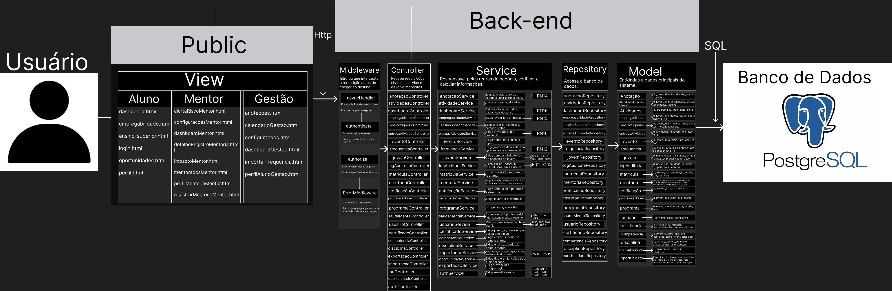

  <figcaption>
    Fonte: Autoria própria (2026).
  </figcaption>

</figure>

O sistema utiliza uma arquitetura em camadas, separando o **Front-end**, representado pela camada **View**, do **Back-end**, estruturado no padrão **Controller-Service-Repository**. A camada **View** representa as telas acessadas pelo usuário e é responsável pela apresentação visual, navegação e interação inicial com o sistema. Ela organiza as interfaces conforme os perfis de acesso, como **Aluno**, **Mentor** e **Gestão**, encaminhando as ações do usuário ao Back-end por meio de requisições HTTP.

No back-end, cada camada possui sua própria responsabilidade:
O **Middleware** é responsável por interceptar a requisição antes dela chegar ao controller, dando maior segurança ao sistema.
O **Controller** é responsável por receber requisições, chamar o service e devolver respostas.
O **Service** é responsável pelas regras de negócio, verificar e calcular informações.
O **Repository** é responsável por acessar o banco de dados.
O **Model** representa as entidades e dados principais do sistema.

<figure align="center">

  <figcaption>
    <strong>Figura 13 - Back-end do diagrama de Classes arquitetural</strong>
  </figcaption>

  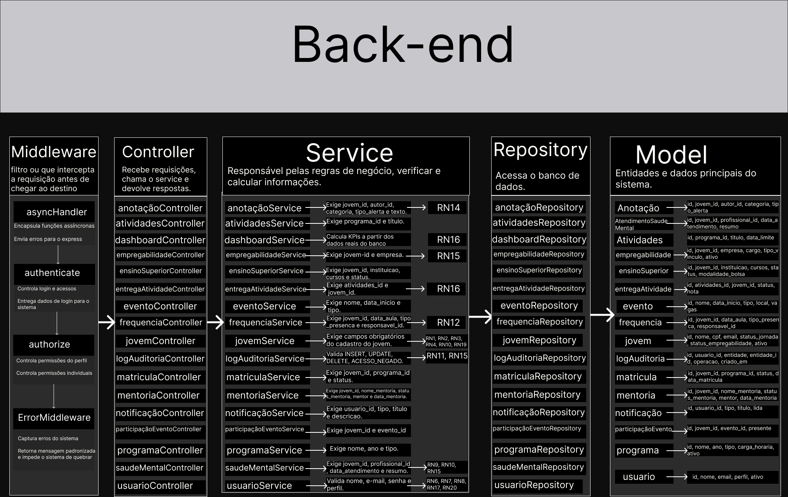

  <figcaption>
    Fonte: Autoria própria (2026).
  </figcaption>

</figure>

O fluxo do sistema inicia-se na **interação do usuário** com a camada **View**, localizada no **Front-end**, responsável por toda a interface visual da aplicação. Essa camada reúne as páginas públicas e privadas do sistema, organizadas de acordo com os perfis **Aluno**, **Mentor** e **Gestão**.


Após a interação do usuário, as informações são enviadas ao **Back-end** por meio de **requisições HTTP**, responsáveis pela **comunicação** entre interface e servidor. Antes de chegarem aos controllers, essas requisições passam pela camada de **middleware**, responsável por **interceptar, validar e proteger** as entradas do sistema.

Depois da validação realizada pelas middlewares, as requisições chegam aos **controllers**, responsáveis por **receber os dados** enviados pelo Front-end, **organizar a entrada** das informações e **encaminhá-las** aos serviços correspondentes. Os controllers atuam como intermediários entre a interface e as regras de negócio da aplicação, garantindo maior organização estrutural.

As **regras de negócio** ficam concentradas na camada **Service**, considerada uma das partes mais importantes da arquitetura. Nela estão presentes os serviços responsáveis por **validar informações**, **verificar permissões**, **aplicar regras** específicas do sistema e **processar dados** antes do armazenamento ou retorno ao usuário. Essa separação é fundamental para evitar que regras complexas fiquem diretamente nos controllers ou no acesso ao banco de dados, tornando o sistema mais organizado e reutilizável.

Após o processamento das regras de negócio, a aplicação utiliza os **repositories** para realizar a **comunicação com o banco de dados**. Seus componentes são responsáveis por executar **consultas**, **buscas**, **inserções** e **atualizações** no banco PostgreSQL. Essa camada isola o acesso ao banco da lógica do sistema, facilitando manutenção e futuras alterações tecnológicas.

Além disso, o sistema possui **models** responsáveis por representar as principais **entidades** da aplicação. Esses models **organizam** estruturalmente os **dados** utilizados pelo sistema, padronizando atributos e facilitando o transporte de informações entre as camadas da arquitetura.

Por fim, o **banco de dados PostgreSQL** atua como camada de persistência, **armazenando** permanentemente todas as **informações** da plataforma, incluindo dados dos usuários, registros de acesso, eventos, acompanhamentos e informações institucionais. Sua presença garante **integridade**, **segurança** e **confiabilidade** no armazenamento dos dados da aplicação.

Diante disso, o diagrama demonstra uma arquitetura organizada, segura e escalável, na qual cada componente possui responsabilidades específicas dentro do fluxo do sistema. A separação em camadas contribui para melhor manutenção do código, maior reutilização de componentes, controle de acesso mais eficiente e maior facilidade na evolução futura da aplicação.


#### <a name="c3.2.4"></a>3.2.4. Diagramas de Sequência UML

Os diagramas de sequência mapeiam a visão dinâmica do sistema, detalhando a troca de mensagens e a ordem cronológica dos eventos entre os atores (como alunos, mentores e coordenação) e os componentes lógicos da aplicação web durante a execução de cenários específicos. Enquanto as modelagens de arquitetura e entidade-relacionamento oferecem uma perspectiva estática estrutural, esta seção traduz o fluxo comportamental necessário para dar suporte às regras de negócio e garantir o correto funcionamento das funcionalidades da Pulse Mais.

Para esta modelagem, foram priorizados os fluxos críticos que envolvem múltiplos níveis de privilégio e interações complexas com o servidor e o banco de dados. Isso engloba desde o gerenciamento de frequência até o processamento das jornadas lógicas das Histórias de Usuário (*User Stories*) fundamentais da aplicação. As interações ilustram o ciclo completo de uma requisição: partindo da camada **View** (apresentação, servida no Front-end), passando pelas validações de segurança e lógica nas rotas e controladores (Back-end), até a persistência ou consulta definitiva na camada de dados.

Abaixo são apresentados os diagramas correspondentes aos fluxos de controle de frequência e às interações das histórias de usuário prioritárias do sistema.

---

##### 3.2.4.1. Diagrama de Sequência — Controle de Frequência

O diagrama abaixo representa o fluxo de registro de frequência de um jovem de forma isolada, mapeando o comportamento do sistema para garantir a consistência das chamadas diárias. Esta operação envolve regras rígidas de persistência e integridade referencial com a base de dados.

<div align="center">
  Figura 14: Diagrama de Sequência UML — Controle de Frequência <br><br>
  <br>
  <sub> Fonte: Material produzido pelos autores (2026) </sub><br><br>
</div>

O fluxo se inicia quando o operador envia uma requisição `POST /frequencias` ao *Controller*, contendo os parâmetros `jovemId`, `data_aula` e `tipo_presenca` (os três campos obrigatórios definidos pela **RN12**). Antes de delegar qualquer operação ao *Service*, o *Controller* emite um comando `BEGIN TRANSACTION` ao banco de dados PostgreSQL. 

Essa abertura antecipada da transação constitui uma decisão arquitetural deliberada: como o fluxo envolve uma leitura de validação seguida por uma escrita que devem ser estritamente atômicas, iniciar a transação no *Controller* garante que nenhum estado intermediário seja persistido caso ocorra uma falha em etapas posteriores. Isso preserva os princípios ACID e previne a criação de registros órfãos ou inconsistentes.

Com a transação aberta, o *Controller* invoca o método `registrarFrequencia()` no *Service* de Frequência, que assume a responsabilidade de orquestrar a lógica de negócio. O primeiro passo do *Service* é validar a existência do aluno por meio de `buscarJovemPorId()` na camada de *Repository*, que traduz a chamada em uma instrução `SELECT * FROM jovens WHERE id = ?` direcionada ao banco de dados. 

Esta verificação prévia cumpre uma exigência estrutural do *schema*, dado que a coluna `jovem_id` na tabela `frequencias` possui uma *constraint* de chave estrangeira (`FOREIGN KEY`) apontando para `jovens.id`. Tentar realizar a inserção diretamente sem essa validação resultaria em uma exceção de integridade referencial lançada pelo banco; ao tratá-la em nível de software no *Service*, o sistema consegue retornar uma resposta semântica e limpa para a camada de apresentação.

O diagrama modela os dois caminhos de execução possíveis por meio de um fragmento condicional `alt` da UML:

* **Caminho de Falha (Jovem não encontrado):** O *Repository* retorna vazio ao não localizar o registro, fazendo com que o *Service* devolva um `ErroAlunoInexistente` ao *Controller*. O *Controller*, por sua vez, executa um `ROLLBACK` no banco de dados para desfazer a transação aberta e responde com o *status* `404 Not Found`. Embora nenhum dado tenha sido gravado, o `ROLLBACK` explícito é vital para liberar o *lock* da transação no PostgreSQL, impedindo que conexões concorrentes fiquem bloqueadas aguardando a finalização de uma transação pendente.
* **Caminho de Sucesso (Jovem validado):** O *Service* invoca o método `salvarFrequencia()` no *Repository*, que executa a instrução `INSERT INTO frequencias (jovem_id, data_aula, tipo_presenca)` no banco de dados. Após a confirmação de sucesso emitida pelo banco, o *Repository* retorna o objeto `Frequencia` devidamente construído ao *Service*, que sinaliza o êxito ao *Controller*. O *Controller* então emite o comando `COMMIT` para confirmar a transação de forma definitiva e responde ao cliente com o *status* `201 Created`.

Por fim, dois aspectos implícitos na modelagem merecem destaque técnico. Primeiro, os campos `criado_por` e `criado_em` exigidos pela **RN14** não são enviados como parâmetros na requisição HTTP; eles são gerados automaticamente pela camada de persistência no momento do `INSERT` (o identificador do responsável é extraído do contexto do *token* de autenticação e o *timestamp* é preenchido via `CURRENT_TIMESTAMP` do banco), o que elimina riscos de manipulação maliciosa pelo cliente. Segundo, a **RN13** (proibição de exclusão) se reflete na própria restrição da API: o sistema não expõe um *endpoint* do tipo `DELETE /frequencias`, e *constraints* de auditoria internas no banco impedem deleções mesmo em cenários de acesso direto.

---

##### 3.2.4.2. Diagrama de Sequência — US01 (Busca e Prontuário do Jovem)

A **US01** foca na busca de jovens e no acesso rápido ao seu histórico e prontuário unificado. O fluxo detalha o comportamento do sistema para satisfazer as restrições da **RN01** (busca multidimensional por nome, CPF ou programa específico), da **RN19** (higienização de strings para garantir o CPF com apenas dígitos) e os critérios de aceitação voltados à usabilidade, como a paginação limitada a 20 registros por página (**CA5**).

<div align="center">
  Figura 15: Diagrama de Sequência UML — US01 <br><br>
  <br>
  <sub> Fonte: Material produzido pelos autores (2026) </sub><br><br>
</div>

O fluxo tem início quando a coordenadora preenche um ou mais critérios de pesquisa na interface. O *Frontend* encaminha a requisição HTTP `GET /jovens?q={termo}&programa={id}` ao *Controller*, que executa imediatamente a validação e higienização dos dados de entrada (removendo caracteres especiais do CPF segundo a **RN19**). O *Controller* aciona a base de dados utilizando uma instrução estruturada `SELECT nome, cpf, programa, status FROM jovens`. 

A resposta da pesquisa é tratada por meio de uma estrutura condicional `alt`: se houver correspondência na base, o banco retorna as linhas (*rows*) paginadas e o *Controller* devolve um status `200 OK` com o *payload* limitado a no máximo 20 registros por página (`≤20/p.`), fazendo com que o *Frontend* renderize a listagem na tela. Caso contrário (cenário `[nenhum resultado]`), o banco retorna um conjunto vazio e a camada de controle responde com o status `200 OK` acompanhado de uma mensagem amigável indicando a ausência de registros. 

Por fim, o encadeamento lógico da funcionalidade permite que a usuária clique sobre o jovem desejado na lista. Isso dispara uma requisição secundária `GET /jovens/{id}/prontuario`, retornando o *payload* completo do prontuário para que o aplicativo navegue até a tela de visualização consolidada do aluno.

---

##### 3.2.4.3. Diagrama de Sequência — US02 (Nova Anotação no Prontuário)

O fluxo dinâmico da **US02** mapeia o processo de inserção de anotações e pareceres técnicos no prontuário de um jovem. Este fluxo evidencia decisões de controle de acesso baseadas no perfil do operador, além de ilustrar a conformidade com a política de não-exclusão (**RN13**), injeção automática de metadados de auditoria (**RN14**) e gravação síncrona nos logs do sistema (**RN15**).

<div align="center">
  Figura 16: Diagrama de Sequência UML — US02 <br><br>
  <br>
  <sub> Fonte: Material produzido pelos autores (2026) </sub><br><br>
</div>

Ao clicar na opção de incluir uma nova anotação, o *Frontend* intercepta o evento para checar o perfil do usuário atualmente autenticado. Através de um fragmento condicional `alt`, o comportamento da interface é alterado: se o usuário logado possuir o perfil de "Coordenação", o formulário é instanciado ocultando a categoria "Saúde Mental" (**CA4**); caso o perfil seja o de "Psicologa", o formulário é exibido em sua totalidade, contendo todas as categorias de evolução.

Após o preenchimento do texto e a confirmação do envio, a interface valida se o campo de texto não está vazio e despacha uma requisição `POST /jovens/{id}/anotacoes` para o *Controller*. No lado do servidor, a camada lógica injeta automaticamente o autor da modificação e o carimbo de tempo (*timestamp*) atual (**RN14**). 

A persistência é efetuada no banco por meio de uma operação restrita de `INSERT INTO anotacoes` sem a exposição de métodos para deleção (`DELETE`), respeitando a **RN13**. Em perfeita concomitância, um gatilho de persistência orquestrado pelo *Service* realiza um `INSERT` automático na tabela `log_auditoria` (**RN15**). O fluxo se conclui com o retorno do código HTTP `201 Created` e a imediata renderização da nova anotação no prontuário do jovem em ordem cronológica decrescente.

---

##### 3.2.4.4. Diagrama de Sequência — US03 (Gerenciamento Avançado de Frequência)

A **US03** representa a jornada expandida de controle de frequência vinculada à Coordenadora Denise (**RF005**). Este fluxo herda as regras operacionais de persistência, mas expande-se para comportar as rotinas lógicas da **RN16** (recálculo automático de indicadores de evasão) e as diretrizes da **RN18** para processamento em lote via arquivos CSV estruturados.

<div align="center">
  Figura 17: Diagrama de Sequência UML — US03 <br><br>
  <br>
  <sub> Fonte: Material produzido pelos autores (2026) </sub><br><br>
</div>

O ciclo comportamental inicia-se com a seleção da turma e data pela Coordenadora Denise, disparando uma requisição `GET /turmas/{id}/alunos?data={dt}` para popular a listagem no *Frontend* com controles alternáveis (*toggles*). A partir deste ponto, o diagrama mapeia duas alternativas de inserção por meio de um fragmento `alt`:

* **Registro Manual:** A coordenadora manipula os controles de presença/ausência e aciona a rotina de salvamento, gerando uma requisição `POST /frequencias`. O *Controller* intercepta os dados, valida a conformidade com a **RN12** (data, tipo e responsável) e delega ao *Service*, abrindo uma transação no banco de dados (`BEGIN TX + INSERT`) após verificar o ID do jovem.
* **Importação via CSV (RN18):** Alternativamente, a usuária realiza o *upload* de um arquivo estruturado mapeado pelo endpoint `POST /frequencias/importar`. O sistema processa o arquivo de forma iterativa (linha a linha) e devolve o código `207 Multi-Status`, expondo em tempo real um relatório detalhado de inconsistências para o usuário na interface.

Em ambos os cenários de sucesso, o banco de dados sinaliza a persistência com `COMMIT OK`, acionando em segundo plano a rotina de recálculo da porcentagem de frequência (**RN16**). Caso o percentual obtido seja inferior a 75%, um fragmento opcional (`opt`) intercepta o fluxo: o *Service* altera o estado do indicador para `alerta_evasao = true`, instruindo o *Controller* a injetar um alerta visual de risco junto à resposta bem-sucedida (`201 OK`). O ciclo encerra-se com a atualização do percentual em tela e a renderização do *badge* de risco no *Frontend*.

---

##### 3.2.4.5. Diagrama de Sequência — US04 (Visualização do Dashboard Lógico)

A **US04** descreve o fluxo de controle e exibição do painel gerencial (*Dashboard*) consumido pela coordenação. O foco técnico desta seção recai sobre o cumprimento da **RN16** (cálculo de Indicadores Chave de Desempenho - KPIs em tempo real, eliminando planilhas e inserções manuais) e do requisito não-funcional de usabilidade **RNF-USAB-01**, concebido para disponibilizar o prontuário e as métricas principais do sistema em até 3 cliques.

<div align="center">
  Figura 18: Diagrama de Sequência UML — US04 <br><br>
  <br>
  <sub> Fonte: Material produzido pelos autores (2026) </sub><br><br>
</div>

O fluxo inicia-se no momento em que a Coordenadora Denise accesses o painel, induzindo o *Frontend* a disparar uma chamada inicial `GET /dashboard?periodo=default`. O *Controller* atua como intermediário, solicitando à camada de *Service/DB* a agregação dos indicadores do sistema. O banco processa e consolida dinamicamente as variáveis de negócio em tempo real (`{ativos, empregab%, freq_media, eventos, em_risco}`), devolvendo-as ao *Controller*, que repassa ao cliente um *status* `200 OK` contendo o *payload* das KPIs calculadas. O *Frontend* encarrega-se de renderizar os 4 *cards* gerenciais e o *badge* de alerta crítico (**CA4**).

O diagrama prevê a dinamicidade do painel através de um fragmento `alt` para filtros operacionais:
* **Filtro de Período (CA2):** O usuário estipula um intervalo customizado de datas, provocando uma requisição parametrizada `GET /dashboard?de={dt1}&ate={dt2}` para atualizar instantaneamente as métricas do período selecionado.
* **Filtro de Programa (CA3):** O usuário isola as estatísticas por meio de um identificador de programa (`GET /dashboard?programa={id}`), refinando os resultados exibidos na interface.

Adicionalmente, um bloco condicional opcional (`opt`) protege a integridade visual do *layout* caso a pesquisa por um determinado indicador retorne valores nulos na base de dados (**CA5**). Diante de um campo nulo recebido do *Backend*, o *Frontend* intercepta o dado e exibe as strings padrão `"-"` ou `"Sem dados"`, prevenindo falhas de renderização ou quebras na interface do usuário.

---

##### 3.2.4.6. Diagrama de Sequência — US05 (Novo Atendimento de Saúde Mental)

A **US05** documenta o fluxo dinâmico de registro de atendimentos na seção de Saúde Mental, uma funcionalidade crítica sob a perspectiva de privacidade de dados. O diagrama expõe os mecanismos rigorosos aplicados na validação de privilégios de acesso baseados em regras (**RN06**), na rejection de acessos indevidos com registro de auditoria (**RN15**) e na parametrização obrigatória exigida pela **RN12**.

<div align="center">
  Figura 19: Diagrama de Sequência UML — US05 <br><br>
  <br>
  <sub> Fonte: Material produzido pelos autores (2026) </sub><br><br>
</div>

A jornada inicia-se quando o psicólogo Ricardo tenta acessar a seção restrita do prontuário. O *Frontend* comunica-se imediatamente com o componente de segurança `Auth/guard` para validar a sessão e as permissões (*claims*) contidas no *token* do usuário (**RN06**). O bloco condicional `alt` gerencia o resultado desta verificação:

* **Acesso Negado (Perfil Inválido):** Se um usuário com um papel fora da lista autorizada (`Psicologa`, `Coordenacao`, `GestaoGeral`) — como um mentor, assistente ou o próprio aluno — for detectado, o componente de segurança barra a operação enviando um erro `HTTP 403`, gerando concorrentemente uma entrada `ACESS_NEGADO` nos registros de auditoria (**RN15**). O *Frontend* reage ocultando a seção ou exibindo uma mensagem de acesso restrito.
* **Acesso Autorizado (Perfil autorizado — `Psicologa`, `Coordenacao` ou `GestaoGeral`):** Constatada a validade do *token* com a *claim* adequada, a interface disponibiliza o botão "Novo Atendimento" e instancia o formulário estruturado com os campos de data, tipo, observações clínicas e bem-estar.

Após o preenchimento, os dados são enviados através de uma requisição `POST /jovens/{id}/atendimentos-sm`. Por motivos de segurança, a camada de *Backend* realiza uma **re-verificação estrita de perfil** antes de liberar a escrita. 

Superada essa defesa, o *Service* inicia o bloco transacional (`BEGIN TX + INSERT`), gravando o registro na tabela `atendimentos_sm` e amarrando de forma imutável a autoria da operação ao ID do profissional logado (`profissional_id = Ricardo`, em atenção à **RN06**). O fluxo consolida a transação através de um `COMMIT`, efetua a gravação do evento na tabela `log_auditoria` (**RN15**) e retorna o código `201 Created` para que a interface liste o novo registro, tornando-o visível unicamente para perfis devidamente autorizados (**CA2**).

### <a name="c3.2.5"></a>3.2.5. Padrões de Projeto Aplicados### Padrão MVC — Plataforma Pulse Mais

---

#### 3.2.5.1. O que é o Padrão MVC

O **Model-View-Controller (MVC)** — padrão originalmente formulado por Krasner e Pope (1988) para o Smalltalk-80 e posteriormente sistematizado para aplicações corporativas por Fowler (2002) — separa o projeto em três camadas independentes, reduzindo acoplamento e aumentando coesão:

| Camada | Responsabilidade |
|---|---|
| **Model** | Regras de negócio, entidades, persistência e acesso ao banco |
| **View** | Interface com o usuário (entrada e saída de dados) |
| **Controller** | Intermediário: recebe requisições da View, aciona o Model, devolve resposta |

**Fluxo:** `Usuário → View → Middleware → Controller → Model → Controller → View → Usuário`

---

#### 3.2.5.2. Como o projeto está organizado (estrutura de pastas)

```
src/
├── config/          ← Configuração e variáveis de ambiente (carrega o .env)
├── models/          ← Camada MODEL — entidades (classes JS)
├── repositories/    ← Camada MODEL — acesso ao banco (padrão DAO)
├── services/        ← Camada MODEL — regras de negócio
├── controllers/     ← Camada CONTROLLER
├── routes/          ← Camada CONTROLLER (roteamento HTTP)
├── public/          ← Camada VIEW — HTML/CSS/JS estáticos servidos pelo Express
├── views/           ← Camada VIEW (pasta reservada; front separado consome a API)
├── middlewares/     ← Suporte transversal (auth, erros, async)
├── helpers/         ← Utilitários (validação CPF, e-mail, parseId)
├── errors/          ← Classes de erros padronizados
├── database/        ← Conexão, migrations e seeds
│   ├── db.js
│   ├── migrations/  ← 34 arquivos DDL numerados sequencialmente
│   └── seeds/       ← 22 arquivos de dados fictícios
├── tests/           ← Testes automatizados
├── app.js           ← Configuração Express
└── server.js        ← Entry point
```

---

#### 3.2.5.3. Camada MODEL

Conforme a literatura de arquitetura de aplicações corporativas (FOWLER, 2002), a camada Model não é monolítica: decompõe-se em **entidades** (objetos de domínio), **DAO (acesso ao banco)** e **Service (regras de negócio)**. O projeto replica exatamente essa divisão em três subcamadas.

##### 3.2.5.3.1. Entidades — `src/models/`

Cada arquivo representa uma tabela do banco. São classes simples — equivalentes ao conceito de *Plain Old Java Object* (POJO), objeto de domínio sem dependência de framework descrito por Fowler (2002) — com construtor que recebe os dados brutos e os mapeia para atributos.

**Exemplo — `src/models/Jovem.js`**
```js
class Jovem {
    constructor(dados) {
        this.id                     = dados.id;
        this.nome                   = dados.nome;
        this.cpf                    = dados.cpf;
        this.email                  = dados.email;
        this.telefone               = dados.telefone;
        this.data_nascimento        = dados.data_nascimento;
        this.genero                 = dados.genero;
        this.autodeclaracao_racial  = dados.autodeclaracao_racial;
        this.renda_familiar         = dados.renda_familiar;
        this.pcd                    = dados.pcd;
        this.bairro                 = dados.bairro;
        this.cidade                 = dados.cidade;
        this.estado                 = dados.estado;
        this.tipo_moradia           = dados.tipo_moradia;
        this.multiplicador          = dados.multiplicador;
        this.status_empregabilidade = dados.status_empregabilidade;
        this.status_jornada         = dados.status_jornada;
        this.consentimento_lgpd     = dados.consentimento_lgpd;
        this.ativo                  = dados.ativo;
        this.criado_em              = dados.criado_em;
        this.atualizado_em          = dados.atualizado_em;
    }
}
module.exports = Jovem;
```

**Entidades existentes no projeto:**

| Arquivo | Tabela | Descrição |
|---|---|---|
| `Jovem.js` | `jovens` | Cadastro central do aluno |
| `Usuario.js` | `usuarios` | Usuários do sistema (perfis de acesso) |
| `Programa.js` | `programas` | Programas de formação |
| `Matricula.js` | `matriculas` | Vínculo jovem ↔ programa |
| `Frequencia.js` | `frequencias` | Registro de presença nas aulas |
| `Anotacao.js` | `anotacoes` | Notas qualitativas da equipe |
| `AtendimentoSaudeMental.js` | `atendimentos_saude_mental` | Prontuário (acesso restrito aos perfis `Psicologa`, `Coordenacao` e `GestaoGeral`) |
| `Evento.js` | `eventos` | Eventos e atividades externas |
| `ParticipacaoEvento.js` | `participacoes_evento` | Presença em eventos |
| `Mentoria.js` | `mentorias` | Sessões de mentoria |
| `Empregabilidade.js` | `empregabilidade` | Status de trabalho/carreira |
| `EnsinoSuperior.js` | `ensino_superior` | Dados acadêmicos externos |
| `Atividades.js` | `atividades` | Atividades dos programas |
| `EntregaAtividade.js` | `entregas_atividades` | Entregas dos alunos |
| `Notificacao.js` | `notificacoes` | Notificações do sistema |
| `LogAuditoria.js` | `log_auditoria` | Rastreio de ações (LGPD) |

---

##### 3.2.5.3.2. DAO (acesso ao banco) — `src/repositories/`

Implementa o padrão **Data Access Object (DAO)**, catalogado por Alur, Crupi e Malks (2003) como estratégia de isolamento e encapsulamento do acesso a dados, e correlato ao *Table Data Gateway* de Fowler (2002). Cada repository contém exclusivamente as operações SQL (CRUD) de uma entidade, sem nenhuma regra de negócio.

**Exemplo — `src/repositories/jovemRepository.js`**
```js
const { pool } = require('../database/db');
const Jovem    = require('../models/Jovem');

const COLUNAS = `id, nome, cpf, email, telefone, data_nascimento,
genero, autodeclaracao_racial, renda_familiar, pcd, bairro, cidade,
estado, tipo_moradia, multiplicador, status_empregabilidade,
status_jornada, consentimento_lgpd, ativo, criado_em, atualizado_em`;

class JovemRepository {

    async criar(dados) {
        const { rows } = await pool.query(
            `INSERT INTO jovens (...) VALUES (...) RETURNING ${COLUNAS}`,
            [/* valores */]
        );
        return new Jovem(rows[0]);
    }

    async buscarPorId(id) {
        const { rows } = await pool.query(
            `SELECT ${COLUNAS} FROM jovens WHERE id = $1`, [id]
        );
        return rows[0] ? new Jovem(rows[0]) : null;
    }

    async listarTodos(filtros = {}) { /* query dinâmica com filtros */ }
    async atualizar(id, dados)      { /* UPDATE parcial — só campos enviados */ }
    async arquivar(id)              { /* soft delete: ativo = false */ }
    async buscarPorCpf(cpf, excluirId)    { /* unicidade */ }
    async buscarPorEmail(email, excluirId){ /* unicidade */ }
}

module.exports = new JovemRepository();
```

**Repositories existentes (21 arquivos):**

`jovemRepository`, `usuarioRepository`, `programaRepository`, `matriculaRepository`, `frequenciaRepository`, `anotacaoRepository`, `saudeMentalRepository`, `eventoRepository`, `participacaoEventoRepository`, `mentoriaRepository`, `empregabilidadeRepository`, `ensinoSuperiorRepository`, `atividadesRepository`, `entregaAtividadeRepository`, `notificacaoRepository`, `logAuditoriaRepository`, `dashboardRepository`, `certificadoRepository`, `competenciaRepository`, `disciplinaRepository`, `oportunidadeRepository`

---

##### 3.2.5.3.3. Service (regras de negócio) — `src/services/`

Materializa o padrão **Service Layer** descrito por Fowler (2002), que define uma fronteira de serviços encapsulando a lógica de negócio da aplicação. Contém toda a lógica de negócio: validações, cálculos, orquestração entre repositories, lançamento de erros semânticos. **Nunca acessa o banco diretamente** — delega ao repository.

**Exemplo — `src/services/jovemService.js`**
```js
const jovemRepository = require('../repositories/jovemRepository');
const { BadRequestError, ConflictError, NotFoundError } = require('../errors/AppError');

const STATUS_JORNADA_VALIDOS = [
    'Conectado', 'Capacitado', 'Transformado',
    'Conectado_Capacitado', 'Capacitado_Transformado',
    'Conectado_Capacitado_Transformado'
];

class JovemService {

    async criar(dados) {
        // 1. Valida campos obrigatórios
        this._validarCamposObrigatorios(dados);

        // 2. Valida formatos (CPF, e-mail, ENUMs)
        const cpf = sanitizeCpf(dados.cpf);
        if (!isValidCpf(cpf)) throw new BadRequestError('CPF inválido');
        if (!STATUS_JORNADA_VALIDOS.includes(dados.status_jornada))
            throw new BadRequestError('status_jornada inválido');

        // 3. Valida unicidade (regra de negócio, não SQL)
        await this._verificarCpfUnico(cpf);
        await this._verificarEmailUnico(dados.email);

        // 4. Delega persistência ao repository
        return jovemRepository.criar({ ...dados, cpf });
    }

    async buscarPorId(id) {
        const jovem = await jovemRepository.buscarPorId(id);
        if (!jovem) throw new NotFoundError('Jovem');
        return jovem;
    }

    async atualizar(id, dados) { /* validações + jovemRepository.atualizar */ }
    async arquivar(id)         { /* verifica existência + jovemRepository.arquivar */ }
    async listarTodos(filtros) { /* sanitiza filtros + jovemRepository.listarTodos */ }
}

module.exports = new JovemService();
```

---

#### 3.2.5.4. Camada CONTROLLER

Recebe a requisição HTTP, extrai parâmetros, chama o Service e devolve a resposta HTTP. **Não contém lógica de negócio.**

##### 3.2.5.4.1. Controllers — `src/controllers/`

**Exemplo — `src/controllers/jovemController.js`**
```js
const jovemService     = require('../services/jovemService');
const { asyncHandler } = require('../middlewares/asyncHandler');
const { parsePositiveInt } = require('../helpers/parseId');
const { BadRequestError }  = require('../errors/AppError');

const criar = asyncHandler(async (req, res) => {
    const jovem = await jovemService.criar(req.body);
    res.status(201).json(jovem);
});

const listar = asyncHandler(async (req, res) => {
    const { status_jornada, programa, ativo, nome } = req.query;
    const jovens = await jovemService.listarTodos({ status_jornada, programa, ativo, nome });
    res.json(jovens);
});

const buscarPorId = asyncHandler(async (req, res) => {
    const id = parsePositiveInt(req.params.id);
    if (!id) throw new BadRequestError('ID inválido');
    const jovem = await jovemService.buscarPorId(id);
    res.json(jovem);
});

const atualizar = asyncHandler(async (req, res) => {
    const id    = parsePositiveInt(req.params.id);
    if (!id) throw new BadRequestError('ID inválido');
    const jovem = await jovemService.atualizar(id, req.body);
    res.json(jovem);
});

const arquivar = asyncHandler(async (req, res) => {
    const id    = parsePositiveInt(req.params.id);
    if (!id) throw new BadRequestError('ID inválido');
    const jovem = await jovemService.arquivar(id);
    res.json(jovem);
});

module.exports = { criar, listar, buscarPorId, atualizar, arquivar };
```

**Controllers existentes (25 arquivos):**

`jovemController`, `usuarioController`, `programaController`, `matriculaController`, `frequenciaController`, `anotacaoController`, `saudeMentalController`, `eventoController`, `participacaoEventoController`, `mentoriaController`, `empregabilidadeController`, `ensinoSuperiorController`, `atividadesController`, `entregaAtividadeController`, `notificacaoController`, `logAuditoriaController`, `dashboardController`, `authController`, `meController`, `certificadoController`, `competenciaController`, `disciplinaController`, `oportunidadeController`, `exportacaoController`, `importacaoController`

---

##### 3.2.5.4.2. Rotas — `src/routes/`

As rotas mapeiam URLs HTTP para funções de controller. São parte da camada Controller (equivalentes, no ecossistema Java EE, ao mapeamento de *Servlets* descrito em ALUR; CRUPI; MALKS, 2003).

**Exemplo — `src/routes/jovemRoutes.js`** (código real)
```js
const { Router }       = require('express');
const controller       = require('../controllers/jovemController');
const { authenticate } = require('../middlewares/authenticate');
const { authorize }    = require('../middlewares/authorize');

const router = Router();

const ESCRITA      = ['GestaoGeral', 'Coordenacao', 'Assistente'];
const ARQUIVAMENTO = ['GestaoGeral', 'Coordenacao'];

router.use(authenticate); // autenticação aplicada a todas as rotas do arquivo

router.post('/',              authorize(...ESCRITA),      controller.criar);
router.get('/',                                           controller.listar);
router.get('/:id',                                        controller.buscarPorId);
router.put('/:id',            authorize(...ESCRITA),      controller.atualizar);
router.patch('/:id/arquivar', authorize(...ARQUIVAMENTO), controller.arquivar);

module.exports = router;
```

**Roteador central — `src/routes/index.js`** (rotas registradas atualmente)
```js
const router = require('express').Router();

router.get('/health', (req, res) => res.json({ status: 'ok' }));

router.use('/jovens',                require('./jovemRoutes'));
router.use('/usuarios',              require('./usuarioRoutes'));
router.use('/programas',             require('./programaRoutes'));
router.use('/matriculas',            require('./matriculaRoutes'));
router.use('/frequencias',           require('./frequenciaRoutes'));
router.use('/anotacoes',             require('./anotacaoRoutes'));
router.use('/saude-mental',          require('./saudeMentalRoutes'));
router.use('/eventos',               require('./eventoRoutes'));
router.use('/participacoes-eventos', require('./participacaoEventoRoutes'));
router.use('/mentorias',             require('./mentoriaRoutes'));
router.use('/empregabilidade',       require('./empregabilidadeRoutes'));
router.use('/ensino-superior',       require('./ensinoSuperiorRoutes'));
router.use('/atividades',            require('./atividadesRoutes'));
router.use('/entrega-atividades',    require('./entregaAtividadeRoutes'));
router.use('/notificacoes',          require('./notificacaoRoutes'));
router.use('/log-auditoria',         require('./logAuditoriaRoutes'));
router.use('/dashboard',             require('./dashboardRoutes'));

module.exports = router;
```

---

#### 3.2.5.5. Camada VIEW

No projeto Pulse Mais a View é composta por **páginas HTML estáticas servidas pelo Express** (`res.sendFile()`) que consomem a API REST via `fetch()`. A navegação entre páginas ocorre por rotas do servidor (server-side routing), sem framework SPA — conforme a restrição RNF-REST-01 que exige HTML/CSS/JS vanilla. A pasta `src/views/` está reservada (`.gitkeep`) e a camada pública estática fica em `src/public/`.

Na formulação web do MVC (FOWLER, 2002), a View costuma ser materializada por *templates* renderizados no servidor (p. ex. JSP no ecossistema Java); aqui o equivalente são as páginas HTML servidas via `res.sendFile()` que fazem `fetch()` para `/api/...` e renderizam os dados no browser com JavaScript vanilla.

**Pontos de entrada da View:**
- `src/public/api-docs.html` — documentação interativa da API
- `src/public/css/style.css` — estilos base
- `src/public/js/main.js` — scripts da camada pública

**Perfis de acesso por persona (WAD, seção 2.2):**

| Persona | Perfil no sistema | Tela principal |
|---|---|---|
| Beatriz (Aluna) | `Aluno` | Portal de autoatendimento |
| Denise (Coordenação) | `Coordenacao` | Dashboard executivo + gestão de jovens |
| Ricardo (Psicólogo) | `Psicologa` | Prontuário digital (acesso restrito) |
| Mateo (Mentor) | `Mentor` | Painel de impacto + mentorados |
| Valentina (CEO) | `GestaoGeral` | Dashboard de indicadores estratégicos |

---

#### 3.2.5.6. Middlewares de suporte

| Arquivo | Função na arquitetura MVC |
|---|---|
| `middlewares/authenticate.js` | Valida o token JWT do header `Authorization: Bearer <jwt>` (assinatura, `exp`, flag `ativo` e `token_version`) e popula `req.usuario` — retorna 401 se ausente, expirado ou revogado |
| `middlewares/authorize.js` | Verifica se `req.usuario.perfil` está na lista de perfis permitidos — retorna 403 se negado |
| `middlewares/asyncHandler.js` | Wrapper que captura erros assíncronos e os repassa ao `errorHandler` via `next()` |
| `middlewares/errorHandler.js` | Centraliza respostas de erro HTTP (400, 401, 403, 404, 409, 500) |

**Perfis definidos no sistema — valores reais da `001_create_usuarios.sql`:**

`GestaoGeral` · `Coordenacao` · `Assistente` · `Psicologa` · `Aluno` · `Mentor`

---

#### 3.2.5.7. Fluxo completo — exemplo: criar um jovem

```
[VIEW — Front-end]
  POST /api/jovens  { nome, cpf, email, ... }
        │
        ▼
[MIDDLEWARE — authenticate]
  • Lê o token JWT do header Authorization: Bearer <jwt>
  • Valida assinatura, exp, flag ativo e token_version
  • Injeta req.usuario e chama next()
  • Se ausente/inválido: retorna HTTP 401
        │
        ▼
[MIDDLEWARE — authorize]
  • Verifica se req.usuario.perfil está em ['GestaoGeral', 'Coordenacao', 'Assistente']
  • Se não: retorna HTTP 403
  • Se sim: chama next()
        │
        ▼
[CONTROLLER — jovemController.criar]
  • Extrai req.body
  • Chama jovemService.criar(req.body)
  • Devolve res.status(201).json(jovem)
        │
        ▼
[SERVICE — JovemService.criar]
  • Valida campos obrigatórios (nome, data_nascimento, email, cpf, status_jornada)
  • Valida CPF (isValidCpf)
  • Valida e-mail (isValidEmail)
  • Valida ENUMs (status_jornada, tipo_moradia, status_empregabilidade)
  • Verifica unicidade de CPF e e-mail (RN01, RN02)
  • Chama jovemRepository.criar(dados)
        │
        ▼
[REPOSITORY — JovemRepository.criar]
  • Executa INSERT no PostgreSQL via pool.query
  • Retorna new Jovem(rows[0])
        │
        ▼
[MODEL — Jovem]
  • Instância com todos os campos mapeados
        │
        ▼ (resposta sobe pelo mesmo caminho)
[VIEW — Front-end]
  Recebe JSON com o jovem criado (HTTP 201)
```

---

#### 3.2.5.8. Regras arquiteturais (boa prática)

1. **Controller não acessa repository diretamente** — sempre passa pelo Service.
2. **Service não conhece `req`/`res`** — trabalha apenas com dados puros (objetos JS).
3. **Repository não tem regra de negócio** — somente SQL parametrizado.
4. **Model (entidade) não instancia DAO** — sem acoplamento direto entre entidade e persistência.
5. **Acesso restrito via middleware** — `authenticate` + `authorize` bloqueiam no nível da rota antes de chegar ao controller. O módulo de saúde mental (`/api/saude-mental`) restringe o acesso aos perfis `GestaoGeral`, `Coordenacao` e `Psicologa`, conforme RN09 e RN12 do WAD. O arquivo `saudeMentalRoutes.js` está implementado com CRUD completo (POST, GET, GET/:id, PUT, DELETE).
6. **Soft delete** — `arquivar()` usa `ativo = false`; registros nunca são deletados fisicamente, preservando auditoria (`log_auditoria`), conforme convenção de modelagem definida no WAD (seção 3.6.3).

---

#### 3.2.5.9. Diagrama Fluxo MVC 

<div align="center">
  Figura 20: Diagrama Fluxo MVC <br><br>
  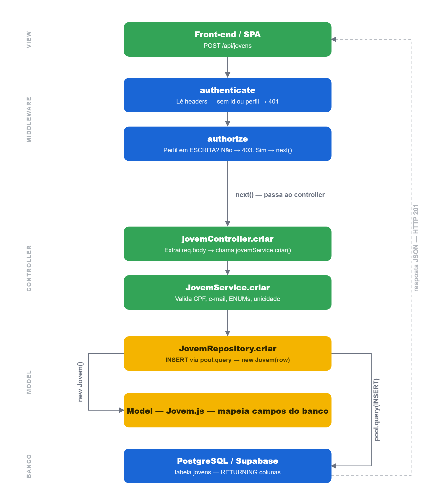<br>
  <sub> Fonte: Material produzido pelos autores (2026) </sub><br><br>
</div>

---

#### 3.2.5.10. Outros Padrões de Projeto Identificados no Backend

Além do padrão MVC que estrutura a aplicação como um todo, o backend da plataforma Pulse Mais adota outros padrões de projeto de forma deliberada. A nomenclatura e a definição de cada padrão seguem a literatura consolidada da área — o catálogo de padrões de Gamma et al. (1994), conhecido como *Gang of Four*, e os padrões de arquitetura de aplicações corporativas de Fowler (2002), que formaliza Repository, Service Layer e Data Transfer Object. A seguir, cada padrão é descrito, localizado no código e justificado com base em uma necessidade real do projeto.

---

##### 3.2.5.10.1. Repository Pattern

**O que é:** Padrão que abstrai o acesso a dados em uma camada dedicada, isolando a lógica de persistência (queries SQL) do restante da aplicação.

**Onde é aplicado:** Todos os 21 arquivos em `src/repositories/`. Cada repository encapsula exclusivamente as operações SQL (CRUD) de uma entidade, utilizando prepared statements do driver `pg` (node-postgres) com placeholders posicionais (`$1, $2, $3`).

**Justificativa:** A separação permite trocar o mecanismo de persistência (ex.: migrar de SQL puro para um ORM, ou trocar PostgreSQL por outro banco) sem alterar a camada de Service. Além disso, facilita a escrita de testes unitários do Service com mocks do Repository, conforme praticado nos 262 testes unitários do projeto (RNF-SUP-01). No contexto deste projeto, a decisão de não usar ORM (RNF-REST-02) torna o Repository ainda mais relevante, pois é ele que garante que as queries SQL estejam centralizadas e auditáveis — requisito direto do artefato 6 (lógica proposicional das consultas SQL, seção 3.6.4).

---

##### 3.2.5.10.2. Service Layer Pattern

**O que é:** Padrão que concentra as regras de negócio em uma camada intermediária entre o Controller (entrada HTTP) e o Repository (acesso a dados), orquestrando validações, cálculos e fluxos de negócio.

**Onde é aplicado:** Todos os 24 arquivos em `src/services/`. Cada Service valida campos obrigatórios, verifica unicidade (CPF, e-mail), aplica regras de enum (status_jornada, tipo_presença) e lança exceções semânticas (`BadRequestError`, `ConflictError`, `NotFoundError`) antes de delegar a persistência ao Repository.

**Justificativa:** Sem essa camada, as regras de negócio ficariam espalhadas entre Controllers e Repositories, criando duplicação e dificultando manutenção. A concentração no Service garante que uma regra como "CPF deve ser único" (RN01) seja validada em um único ponto, independentemente de qual endpoint a invoque. Isso é particularmente relevante no projeto Pulse Mais, onde 31 regras de negócio ativas (seção 3.1.2) precisam ser aplicadas de forma consistente em 20 módulos.

---

##### 3.2.5.10.3. Middleware Chain (Chain of Responsibility)

**O que é:** Padrão em que uma requisição passa por uma cadeia de processadores (middlewares), cada um podendo tratar a requisição, modificá-la ou interrompê-la antes de chegar ao destino final.

**Onde é aplicado:** Quatro middlewares globais em `src/middlewares/`: `authenticate` (validação de identidade), `authorize` (verificação de perfil), `asyncHandler` (captura de exceções assíncronas) e `errorHandler` (tradução de exceções para respostas HTTP). A ordem da cadeia é: `authenticate → authorize → controller → errorHandler`.

**Justificativa:** O Express.js utiliza nativamente o padrão de middleware chain, e o projeto o aplica de forma deliberada para separar responsabilidades transversais (autenticação, autorização, tratamento de erros) da lógica de negócio. Isso evita que cada controller repita código de verificação de perfil ou tratamento de exceções, reduzindo duplicação e garantindo que as regras de acesso (RN08, RN09) sejam aplicadas uniformemente. O middleware `errorHandler` centraliza a tradução de exceções customizadas (`AppError` e derivadas) para status HTTP (400, 401, 403, 404, 409, 500), materializando o RNF-ORG-01 (sem PII em mensagens de erro).

---

##### 3.2.5.10.4. Data Transfer Object (DTO) via Model

**O que é:** Padrão que utiliza objetos simples para transportar dados entre camadas, padronizando a estrutura dos dados que transitam pela aplicação.

**Onde é aplicado:** Os 21 arquivos em `src/models/` funcionam como DTOs: são classes JavaScript com construtor que recebe dados brutos do banco e os mapeia para atributos nomeados. Exemplo: `new Jovem(rows[0])` no Repository transforma o registro SQL em um objeto com atributos explícitos.

**Justificativa:** Sem os Models, os dados circulariam como objetos genéricos (`rows[0]`) entre as camadas, sem garantia de quais campos existem. Os Models padronizam a interface de dados e servem como documentação viva das entidades do domínio, facilitando o onboarding de novos desenvolvedores (RNF-SUP-02).

---

##### 3.2.5.10.5. Soft Delete

**O que é:** Padrão que substitui a exclusão física de registros por uma marcação lógica (`ativo = false`), preservando o histórico para auditoria e permitindo reativação.

**Onde é aplicado:** Quatro entidades utilizam soft delete: `Jovem`, `Empregabilidade`, `Programa` e `Usuario`. Nas três primeiras o soft delete é exposto via endpoint `PATCH /:id/arquivar`, que altera o campo `ativo` para `false` no banco sem remover o registro. O módulo de `Usuario` segue a mesma estratégia com nomenclatura própria, expondo `PATCH /:id/desativar` (marca `ativo = false`) e `PATCH /:id/reativar` (marca `ativo = true`).

**Ressalva:** Os módulos `Usuario` e `Saúde Mental` mantêm também um endpoint de exclusão física (`DELETE /:id`), restrito a perfis administrativos, para casos de remoção definitiva previstos em política de dados (ex.: exercício do direito de exclusão LGPD). Fora dessas exceções controladas, a aplicação adota o soft delete como padrão para preservar o histórico, em linha com a RN13.

**Justificativa:** A Pulse Mais precisa manter o histórico completo de cada jovem para relatórios de impacto e prestação de contas a financiadores. A exclusão física de um jovem destruiria todo o histórico de frequência, mentorias e anotações vinculadas (via CASCADE). O soft delete preserva a integridade referencial e o histórico, enquanto o jovem deixa de aparecer em listagens ativas. Essa decisão está alinhada à RN13 (registros não devem ser excluídos) e ao conceito de Single Source of Truth do projeto.

## <a name="c3.3"></a>3.3. Wireframes
O wireframe é uma representação estrutural de baixa fidelidade de uma interface, cujo propósito é definir a arquitetura de informação, a hierarquia de elementos e os fluxos de interação de uma aplicação antes que qualquer decisão visual (cor, tipografia, ícone) seja tomada. Diferente de um protótipo de alta fidelidade, que simula a experiência final do usuário, o wireframe opera no nível do **esqueleto** da interface, o mesmo nível descrito por Jesse James Garrett (2011) no modelo dos cinco planos de UX (Estratégia, Escopo, Estrutura, Esqueleto e Superfície). Nesse nível, o foco recai sobre três questões fundamentais: **onde** cada elemento será posicionado na tela, **como** o usuário navegará entre as telas e **quais** informações estarão disponíveis em cada ponto da jornada.

Essa abordagem é deliberadamente despojada de detalhes visuais porque o objetivo do wireframe não é impressionar, mas **validar hipóteses de usabilidade rapidamente e com baixo custo de alteração**. Uma mudança de layout em um wireframe custa minutos; a mesma mudança em código front-end custa horas. Por isso, o artefato cumpre um papel de filtro: erros de hierarquia, fluxos confusos e ausência de feedback ao usuário são identificados nesta etapa, antes de se propagarem para o design visual e o código.

No contexto da plataforma Pulse Mais, os wireframes foram construídos para traduzir visualmente as User Stories priorizadas (seção 2.3) em sequências de interação navegáveis, demonstrando como cada persona: Denise (Coordenadora de Projetos), Mateo (Mentor/Aluno Multiplicador) e Beatriz (Aluna), cumprirá seus objetivos dentro do sistema. Todas as telas foram organizadas seguindo um **sistema de grid** com sidebar lateral fixa de navegação e área de conteúdo principal, garantindo consistência posicional entre as diferentes visões do sistema. Essa estrutura de layout foi mantida em todas as telas, independentemente do perfil de acesso, para reduzir a carga cognitiva de navegação e facilitar a transição futura para o protótipo de alta fidelidade (seção 3.5).

A construção dos wireframes seguiu três princípios orientadores, derivados das necessidades levantadas no Kick-Off e no TAPI:
 
1. **Rastreabilidade com User Stories:** cada tela ou componente do wireframe é rastreável a pelo menos uma User Story da seção 2.3, garantindo que nenhum elemento visual exista sem justificativa funcional.
2. **Diferenciação de perfis de acesso:** as telas foram projetadas considerando as permissões de cada persona. Funcionalidades exclusivas da coordenação (como importação de dados e filtros avançados) não aparecem na navegação do mentor ou da aluna, refletindo as Regras de Negócio de controle de acesso (RN06).
3. **Feedback de sistema:** estados de erro (401 e 403), estados vazios e alertas visuais foram wireframados para que o comportamento do sistema em cenários não-ideais também estivesse documentado desde esta etapa, evitando lacunas de especificação durante o desenvolvimento.

A seção a seguir apresenta uma **seleção representativa** das telas wireframadas, organizada por persona, com a indicação das User Stories correspondentes. O conjunto completo de wireframes e os fluxos de navegação detalhados de cada persona estão disponíveis na **seção Anexos** (Anexo A — Wireframes completos e Fluxos de Navegação), onde é possível visualizar todas as telas construídas e acessar os diagramas de fluxo que conectam as interações de ponta a ponta.

---


### <a name="c3.3.1"></a>3.3.1. Wireframes — Denise Pereira (Coordenadora de Projetos)

As telas projetadas para o perfil da coordenação refletem a necessidade central identificada no Kick-Off: substituir o fluxo fragmentado de planilhas por uma **Single Source of Truth (SSOT)** operacional. As User Stories priorizadas para esta persona envolvem busca e segmentação de jovens (US01, US10), registro de frequência com suporte a importação CSV (US03), visualização agregada por dashboard (US04) e importação de dados legados (US27).

#### Dashboard Executivo
 
O Dashboard Executivo é a tela inicial da coordenação e funciona como o ponto de entrada operacional do sistema. Foi projetado para responder, de forma imediata e sem navegação adicional, às perguntas que a equipe da Pulse Mais fazia diariamente consultando múltiplas planilhas: quantos jovens estão ativos, qual a taxa de empregabilidade atual, qual a taxa de retenção e quantos jovens estão em risco de evasão.
 
A tela é dividida em três zonas verticais: a faixa superior apresenta quatro **KPI cards** com métricas consolidadas (jovens ativos, empregabilidade, taxa de retenção e risco de evasão), cada um com indicação de variação em relação ao período anterior. A zona intermediária contém dois gráficos (um de linhas para a jornada temporal dos jovens e um de setores para distribuição por programa) permitindo análise de tendência e composição sem necessidade de exportação para ferramentas externas. A zona inferior exibe uma tabela de **jovens que precisam de atenção**, com nome, programa, última interação e status, oferecendo ação direta via botão "Ver perfil". Essa disposição atende diretamente à US04 e reflete o critério de aceite de que a coordenação deve visualizar indicadores agregados em uma única tela. O botão "Importar Planilhas" no canto inferior direito conecta esta tela ao fluxo da US27.

<div align="center">
  Figura 21: Wireframe — Dashboard Executivo (Coordenação) <br><br>
  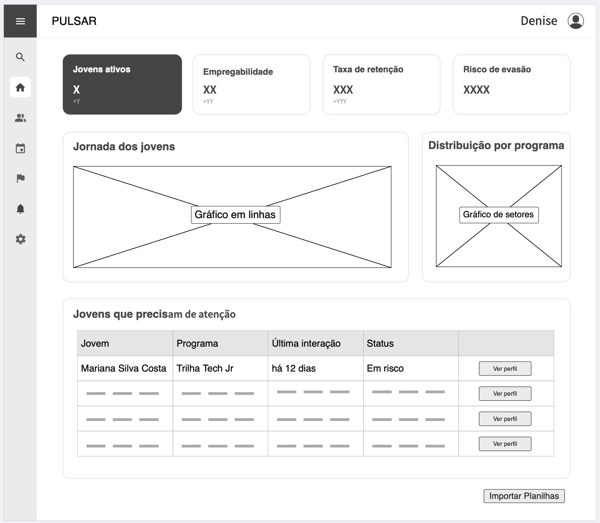<br>
  <sub> Fonte: Material produzido pelos autores (2026) </sub><br><br>
</div>

---

#### Registro de Frequência

A tela de Registro de Frequência materializa a US03, que trata da centralização dos dados de presença. O wireframe apresenta dois seletores no topo (turma/programa e data), seguidos de uma tabela de presença com colunas para nome do jovem (com CPF parcialmente mascarado, atendendo à LGPD), três opções mutuamente exclusivas de presença (presencial, gravação assistida e ausente), frequência acumulada do jovem e uma coluna de alerta automático. Os limiares de alerta foram definidos em duas faixas: "Atenção < 75%" e "Crítico < 50%", refletindo os critérios de risco estabelecidos nas Regras de Negócio. Na base da tela, um resumo consolida a frequência agregada da turma com breakdown por modalidade (presencial, gravação, ausente). O botão "Importar CSV" no topo direito abre o modal de importação em quatro etapas (upload, pré-visualização, validação e sucesso), atendendo ao critério de aceite da US03 que prevê tanto input manual quanto importação em lote.

<div align="center">
  Figura 22: Wireframe — Registro de Frequência (Coordenação) <br><br>
  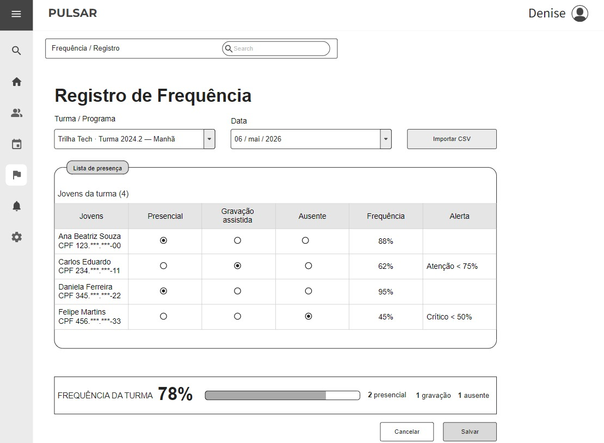<br>
  <sub> Fonte: Material produzido pelos autores (2026) </sub><br><br>
</div>

---

#### Busca e Filtros Avançados

A tela de Filtros Avançados é a representação direta das US01 (busca de aluno) e US10 (segmentação de jovens). A barra de busca principal aceita nome ou CPF como entrada textual, enquanto o painel expansível de filtros avançados permite refinamento por quatro dimensões: programa, coorte/período, faixa de frequência (via slider de 0% a 100%) e status de empregabilidade (empregado, em formação, buscando, empreendedor, inativo), além de um toggle para filtrar apenas jovens multiplicadores. Os filtros ativos são exibidos como chips removíveis em uma seção dedicada, permitindo que a coordenação visualize e ajuste sua segmentação sem perder contexto. A tabela de resultados exibe nome, programa, status, frequência (com barra de progresso visual), empregabilidade e ações (ver/editar). Essa composição atende ao critério de aceite da US01 que exige resultados filtrados em tempo real e ao critério da US10 que requer segmentação por múltiplos atributos simultâneos.

<div align="center">
  Figura 23: Wireframe — Busca com Filtros Avançados (Coordenação) <br><br>
  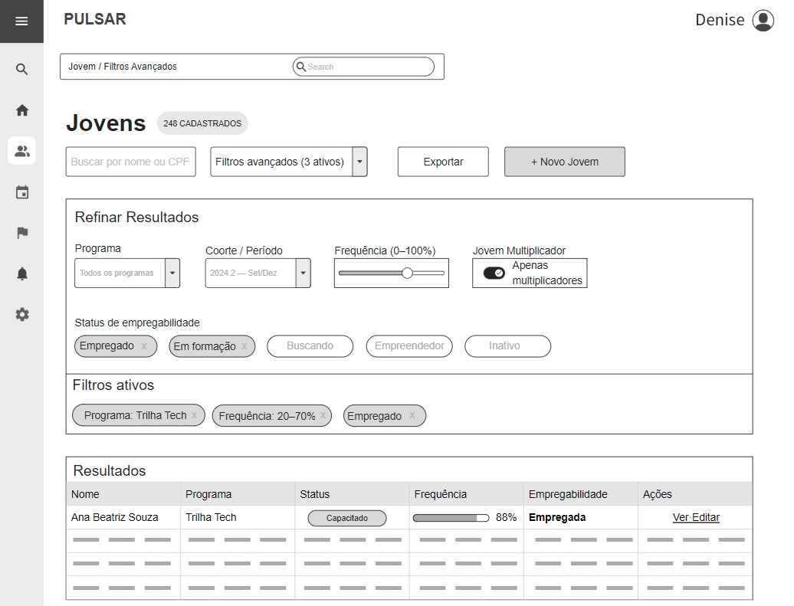<br>
  <sub> Fonte: Material produzido pelos autores (2026) </sub><br><br>
</div>

---

### <a name="c3.3.2"></a>3.3.2. Wireframes — Mateo Fernández (Mentor / Aluno Multiplicador)

As telas do perfil de mentor foram projetadas para atender ao ciclo de retorno social que a persona do Mateo representa: um ex-aluno que voltou à Pulse Mais para mentorar novos jovens. As User Stories priorizadas para esta persona envolvem o acompanhamento dos mentorados (US25), o registro de sessões de mentoria (US14), a visualização do impacto pessoal como mentor (US19) e o recebimento de alertas sobre jovens em risco (US20).
 
#### Meus Mentorados

A tela "Meus Mentorados" é o hub central do mentor e materializa as US25 e US20. A estrutura foi deliberadamente dividida em duas seções semânticas: **"Em Alerta"** (fundo escuro, ícone de exclamação) e **"Regulares"** (fundo claro), para que o mentor identifique instantaneamente quais jovens precisam de atenção prioritária. Cada card de mentorado apresenta três indicadores-chave: frequência atual (com barra de progresso), status de atividades (em dia ou com atraso) e data do último contato, permitindo ao mentor avaliar a situação sem precisar abrir o perfil completo. Os botões de ação em cada card: "Ver perfil", "Registrar mentoria" e "Ver alerta" (apenas para mentorados em risco), representam as três ações mais frequentes do mentor, eliminando navegação intermediária. O banner superior com contagem de mentorados em situação de risco atende ao critério de aceite da US20 que exige um badge de alerta visível na seção de mentorados.

<div align="center">
  Figura 24: Wireframe — Meus Mentorados (Mentor) <br><br>
  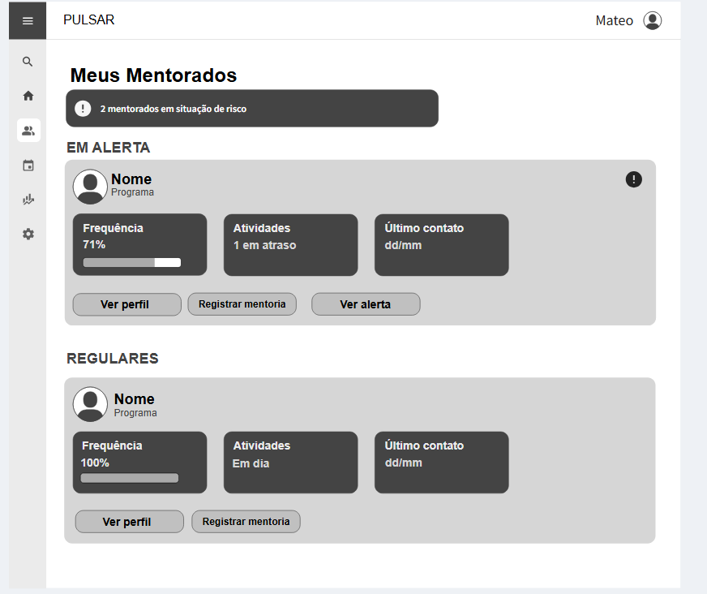<br>
  <sub> Fonte: Material produzido pelos autores (2026) </sub><br><br>
</div>

---

#### Registrar Mentoria

A tela de registro de mentoria traduz a US14 em um formulário estruturado com quatro campos: seleção de mentorado(s) via chips (permitindo sessões com mais de um jovem), data da sessão, duração em minutos e temas abordados (carreira, programação, soft skills, empregabilidade e ensino superior) com seleção múltipla via toggle. O campo de observações em texto livre permite ao mentor registrar pontos relevantes da sessão sem restrição de formato. Os botões "Cancelar" e "Registrar mentoria" foram posicionados na base da tela, seguindo o padrão de formulários com ação destrutiva à esquerda e ação primária à direita. Essa estrutura atende diretamente ao critério de aceite da US14 que exige registro com data, temas e observações, e cada registro alimenta automaticamente os contadores do Painel de Impacto (US19).

<div align="center">
  Figura 25: Wireframe — Registrar Mentoria (Mentor) <br><br>
  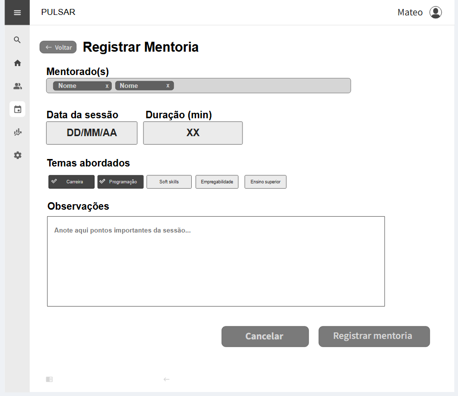<br>
  <sub> Fonte: Material produzido pelos autores (2026) </sub><br><br>
</div>

--- 

### <a name="c3.3.3"></a>3.3.3. Wireframes — Beatriz Santos (Aluna)

As telas do perfil da aluna foram projetadas a partir do princípio de **autoatendimento com protagonismo**: a plataforma deve permitir que a jovem acompanhe sua própria jornada, visualize suas oportunidades e gerencie seus dados, sem depender da equipe para acessar informações que lhe dizem respeito. As User Stories priorizadas para esta persona envolvem a atualização do perfil pessoal (US16), a visualização de oportunidades de carreira e eventos (US21) e o acompanhamento do status de ensino superior (US26).

#### Perfil do Aluno
 
A tela de perfil é a representação da US16 e funciona como a identidade digital da jovem na plataforma. A estrutura apresenta o avatar e nome no topo, seguido do botão "Editar informações", e campos de dados pessoais (nome, e-mail, CPF). A parte inferior da tela é dividida em dois painéis scrolláveis: **Histórico Acadêmico** (à esquerda) e **Certificados** (à direita), permitindo que a aluna consulte sua trajetória completa na Pulse Mais em uma única tela. Essa disposição atende ao critério de aceite da US16 que exige que a aluna visualize e edite seus dados pessoais, e conecta-se à US13 (indicadores de empregabilidade) ao centralizar as evidências de formação.

<div align="center">
  Figura 26: Wireframe — Perfil do Aluno (Aluna) <br><br>
  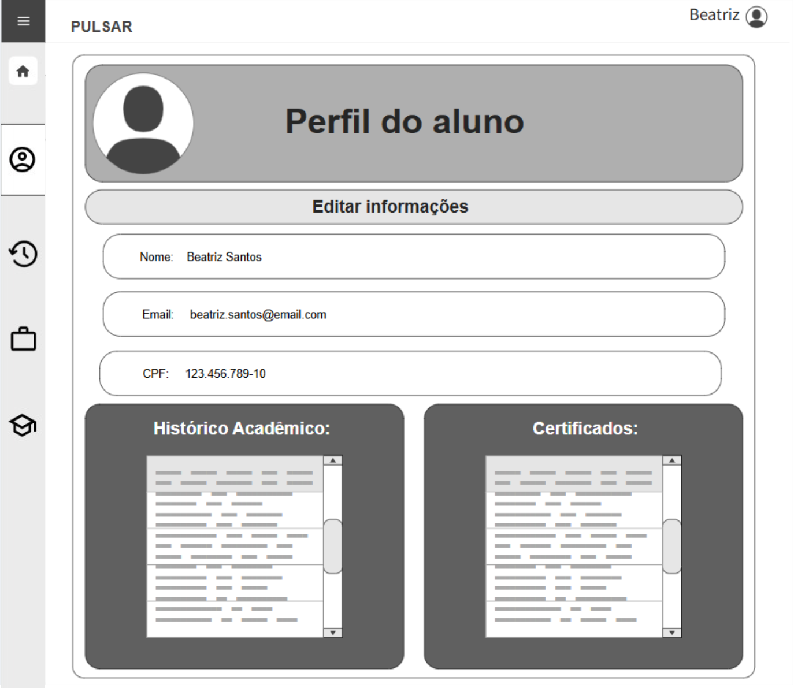<br>
  <sub> Fonte: Material produzido pelos autores (2026) </sub><br><br>
</div>

---

#### Oportunidades

A tela de oportunidades materializa a US21 e foi estruturada para centralizar três categorias de conteúdo que hoje chegam à jovem de forma dispersa (WhatsApp, e-mail, redes sociais): **Cursos**, **Eventos** e **Bolsas**. Cada categoria ocupa uma coluna com scroll independente, permitindo navegação paralela sem perda de contexto. O cabeçalho da tela inclui uma barra de progresso da jornada na Pulse Mais, conectando a visualização de oportunidades ao senso de evolução pessoal. Essa organização em colunas foi escolhida para que a aluna identifique rapidamente em qual tipo de oportunidade deseja investir, atendendo ao critério de aceite da US21 que exige categorização por tipo.

<div align="center">
  Figura 27: Wireframe — Oportunidades (Aluna) <br><br>
  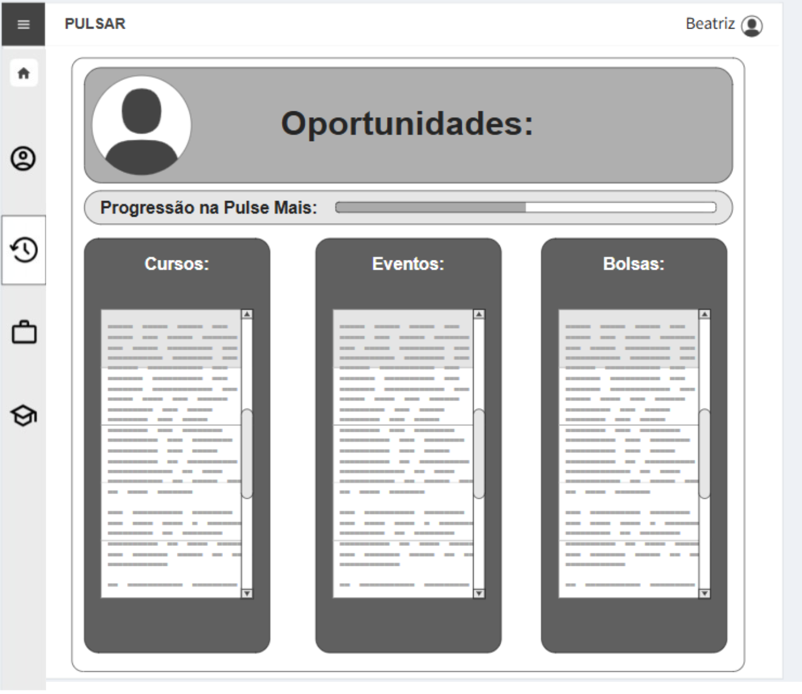<br>
  <sub> Fonte: Material produzido pelos autores (2026) </sub><br><br>
</div>

---

### <a name="c3.3.4"></a>3.3.4. Telas Transversais — Autenticação e Controle de Acesso

Além das telas específicas de cada persona, foram wireframados os estados de sistema que são comuns a todos os perfis: a tela de login e as telas de erro de acesso. Essas telas são fundamentais para a experiência porque representam os pontos de entrada e os limites de permissão do sistema, traduzindo visualmente as Regras de Negócio de controle de acesso (RN06).

#### Tela de Login

A tela de login apresenta layout responsivo em duas versões (desktop e mobile), com área de imagem institucional, campos de login e senha, e botão de ação. A versão mobile empilha os elementos verticalmente, mantendo a mesma hierarquia de informação. O wireframe intencionalmente não inclui opções de "esqueci minha senha" ou "criar conta", refletindo a restrição do TAPI de que o sistema não contempla autenticação complexa nesta fase, utilizando rotas protegidas com níveis simples de permissão.

<div align="center">
  Figura 28: Wireframe — Tela de Login (Desktop e Mobile) <br><br>
  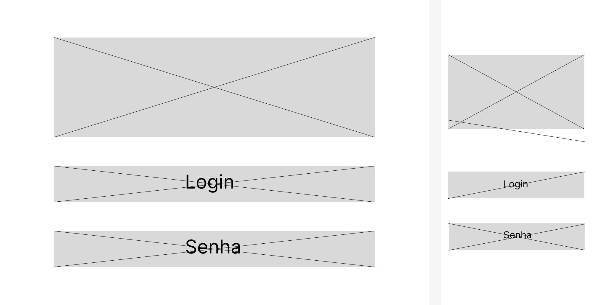<br>
  <sub> Fonte: Material produzido pelos autores (2026) </sub><br><br>
</div>

---

#### Telas de Erro — 401 (Não Autenticado) e 403 (Não Autorizado)

Foram wireframadas duas telas de erro distintas para diferenciar os cenários de acesso indevido, seguindo a semântica HTTP padrão: a tela **401** indica que o usuário não está autenticado (sessão expirada ou acesso direto por URL), enquanto a tela **403** indica que o usuário está autenticado mas não possui permissão para acessar aquele recurso específico. Ambas as telas seguem a mesma estrutura: código de erro em destaque, mensagem explicativa, contagem regressiva para redirecionamento automático (3 segundos) e botão manual "Voltar ao início". Essa diferenciação foi wireframada para cada perfil de acesso (Coordenação, Mentor e Aluna), garantindo que a sidebar de navegação exibida na tela de erro corresponda ao menu do perfil logado, evitando inconsistência visual. A tela de 403, em particular, é acionada quando um perfil tenta acessar uma rota restrita a outro perfil (por exemplo, quando a aluna tenta acessar o dashboard executivo da coordenação), refletindo diretamente a RN06.

<div align="center">
  Figura 29: Wireframe — Tela de Erro 401 (Coordenação) <br><br>
  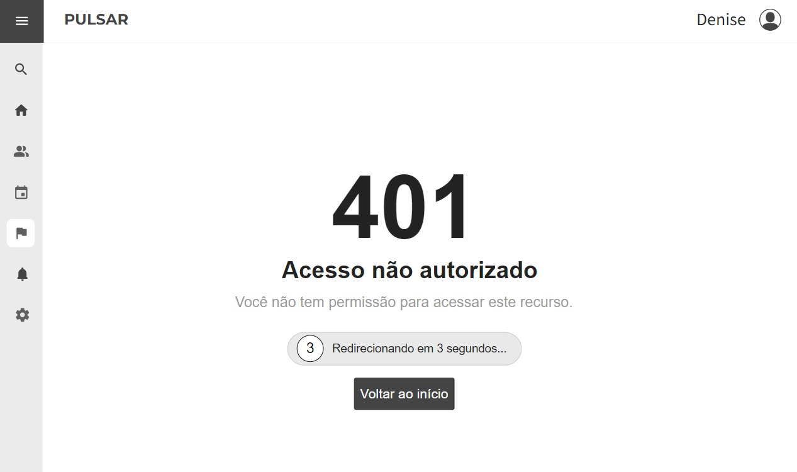<br>
  <sub> Fonte: Material produzido pelos autores (2026) </sub><br><br>
</div>

---

### <a name="c3.3.5"></a>3.3.5. Estrutura de Navegação e Grid

Todas as telas seguem uma estrutura de layout consistente composta por dois elementos fixos:
 
- **Sidebar lateral esquerda:** presente em todas as telas pós-login, contém os ícones de navegação principal do perfil logado. A sidebar é colapsável (ícone de menu hamburger no topo) e seus itens variam conforme o perfil de acesso: a coordenação visualiza ícones de busca, home, jovens, calendário, relatórios, notificações e configurações; o mentor visualiza busca, home, mentorados, calendário, impacto e configurações; a aluna visualiza home, perfil, histórico, oportunidades e ensino superior.
- **Área de conteúdo principal:** ocupa o espaço restante à direita da sidebar, com breadcrumb no topo indicando a localização atual do usuário na hierarquia de navegação (ex: "Frequência / Registro / Importar CSV") e nome do usuário logado no canto superior direito.
Essa estrutura garante que, independentemente da tela acessada, o usuário mantenha referência espacial de onde está no sistema e tenha acesso imediato às demais seções, reduzindo o número de cliques necessários para qualquer ação. 

### <a name="c3.3.6"></a>3.3.6. Fluxos de Navegação

Os diagramas de fluxo a seguir representam as sequências de interação completas de cada persona, conectando as telas wireframadas em caminhos navegáveis de ponta a ponta. Cada fluxo evidencia o ponto de entrada (login), as ramificações de navegação disponíveis conforme o perfil de acesso e os pontos de barreira (telas de erro 401/403) que delimitam as fronteiras de permissão do sistema.

#### Fluxo de Navegação — Denise Pereira (Coordenadora de Projetos)

O fluxo da Coordenadora parte do login em direção ao Dashboard Executivo e se ramifica em três caminhos principais: gestão de jovens (busca, filtros avançados e perfil individual), registro de frequência (input manual e importação CSV) e importação de dados legados (planilhão e relatórios de aulas). As setas indicam a direção da navegação e os modais são representados como camadas sobrepostas à tela de origem.

<div align="center">
  Figura 30: Fluxo de Navegação — Denise Pereira (Coordenadora) <br><br>
  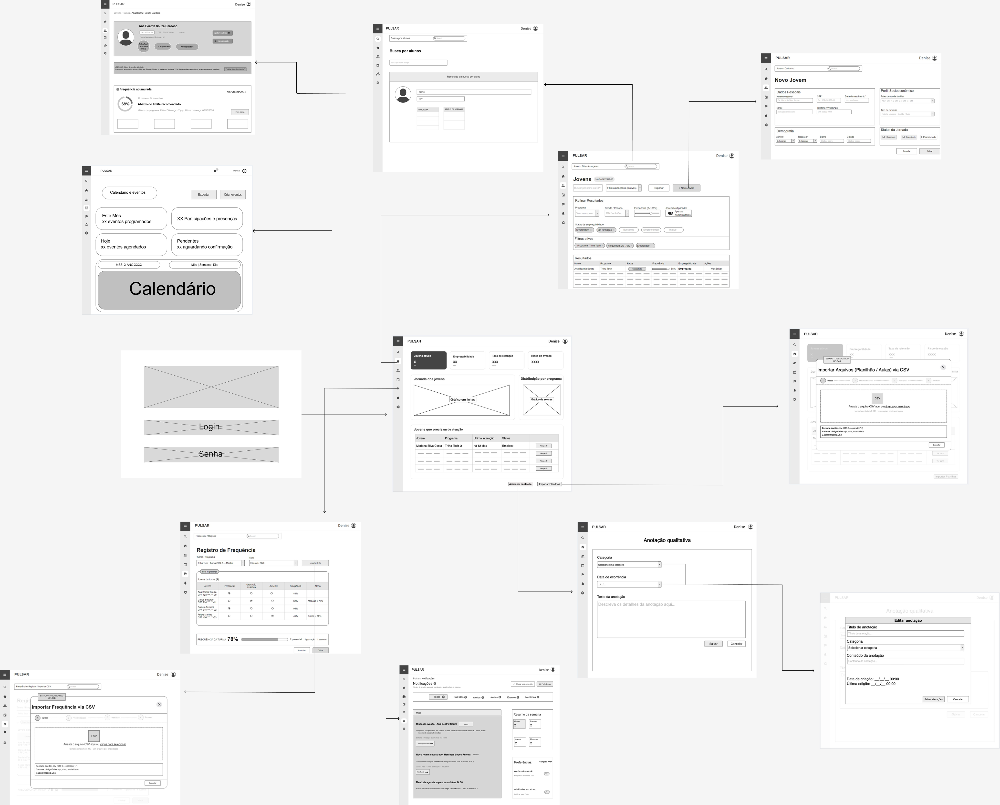<br>
  <sub> Fonte: Material produzido pelos autores (2026) </sub><br><br>
</div>

---

#### Fluxo de Navegação — Mateo Fernández (Mentor / Aluno Multiplicador)

O fluxo do Mentor é organizado em torno de três verbos de ação: monitorar (acompanhar mentorados e identificar jovens em risco), registrar (documentar sessões de mentoria) e medir (visualizar o impacto acumulado). O diagrama evidencia os atalhos diretos a partir dos cards de mentorados, que permitem ao mentor registrar uma mentoria ou acessar o perfil do jovem sem retornar à navegação principal.

<div align="center">
  Figura 31: Fluxo de Navegação — Mateo Fernández (Mentor) <br><br>
  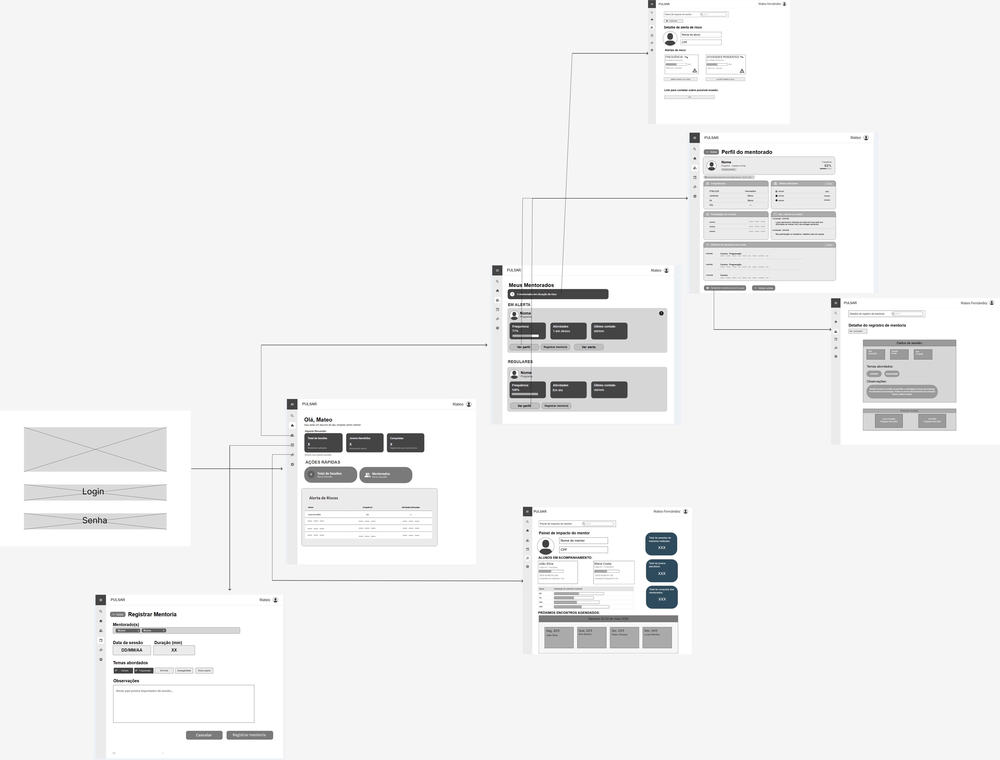<br>
  <sub> Fonte: Material produzido pelos autores (2026) </sub><br><br>
</div>

---

#### Fluxo de Navegação — Beatriz Santos (Aluna)

O fluxo da Aluna é intencionalmente linear e enxuto, refletindo o princípio de autoatendimento com baixa complexidade. A partir do login, Beatriz acessa seu perfil (tela inicial) e navega entre oportunidades e status de ensino superior pela sidebar. O diagrama destaca os pontos de barreira (tela 403) nas rotas restritas a outros perfis, demonstrando que o controle de acesso foi considerado desde a fase de wireframe.

<div align="center">
  Figura 32: Fluxo de Navegação — Beatriz Santos (Aluna) <br><br>
  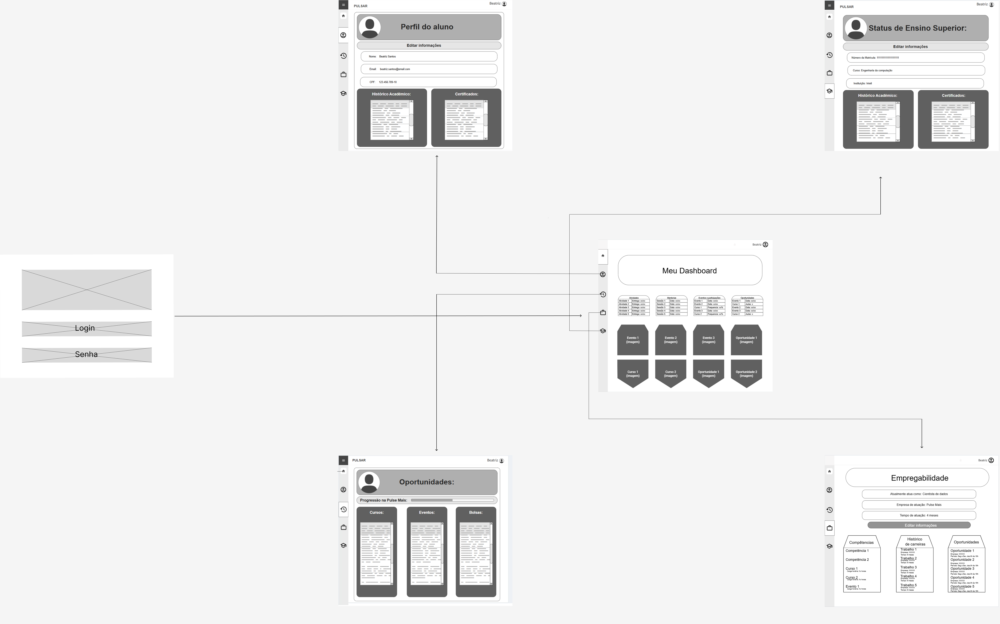<br>
  <sub> Fonte: Material produzido pelos autores (2026) </sub><br><br>
</div>

> **Nota:** O conjunto completo de wireframes (incluindo as telas de importação de dados via CSV, painel de impacto detalhado do mentor, perfil do mentorado e status de ensino superior) está documentado no **Anexo A** deste documento. E o link para melhor vizualização dos fluxos dos wireframes das três personas. Recomenda-se a consulta ao anexo para visualizar todas as telas construídas durante a sprint.

## <a name="c3.4"></a>3.4. Guia de estilos
O Guia de Estilos (ou *Style Guide*) é um documento de referência que padroniza todos os elementos visuais de uma interface (cores, tipografia, iconografia, espaçamentos e componentes), em um conjunto coeso de regras e especificações reutilizáveis. Se o wireframe (seção 3.3) define **onde** cada elemento será posicionado e **como** o usuário navegará pelo sistema, e o protótipo de alta fidelidade (seção 3.5) simula a experiência visual final, o Guia de Estilos ocupa o espaço entre esses dois artefatos: ele responde **com quais atributos visuais** cada elemento será construído. Trata-se, em essência, do vocabulário visual do projeto, uma fonte única de verdade para decisões de design que, sem padronização, seriam tomadas de forma inconsistente por cada desenvolvedor ou designer que toque no front-end.

A importância desse artefato vai além da estética. Em projetos com múltiplos contribuidores, a ausência de um guia de estilos produz um efeito cumulativo de degradação visual: um desenvolvedor escolhe um tom de azul diferente para um botão, outro define um tamanho de fonte ligeiramente distinto para títulos, e, ao final de algumas sprints, a interface perde unidade e profissionalismo. O Guia de Estilos elimina essa ambiguidade ao transformar decisões subjetivas em especificações objetivas e documentadas ("o azul institucional da marca é #003D82, aplicado em CTAs e elementos de navegação ativa"). Essa abordagem está alinhada ao conceito de *Design Tokens*, amplamente adotado no mercado para escalar sistemas de design.

No contexto da plataforma Pulse Mais, este artefato é o **Guia de Estilos** do produto, batizado de **Pulsar**, nome próprio que reforça sua condição de referência viva e reutilizável ao longo da evolução do produto. O Pulsar foi construído a partir de duas fontes complementares. A primeira é o **Guia de Identidade Visual (IDV) da Pulse Mais** (v01.1, fevereiro de 2026), que estabelece as diretrizes oficiais da marca, incluindo paleta de cores institucional, regras de aplicação do logotipo e restrições de uso. A segunda fonte são as **necessidades funcionais da própria aplicação**, que exigem extensões além do que a identidade visual da marca cobre: cores semânticas para estados de sistema (sucesso, erro, alerta), hierarquia tipográfica para dashboards com alta densidade de informação, iconografia funcional para ações recorrentes e uma biblioteca de componentes com estados explícitos. O resultado é um guia que respeita a identidade institucional do parceiro e, ao mesmo tempo, atende às demandas específicas de uma aplicação web de gestão.

As subseções a seguir detalham cada dimensão do Guia de Estilos Pulsar: a paleta de cores com seus códigos de aplicação e funções semânticas (seção 3.4.1), a tipografia com famílias, pesos e hierarquia de uso (seção 3.4.2), a iconografia com mapeamento funcional e regras de aplicação (seção 3.4.3), e a biblioteca de componentes reutilizáveis com estados e tokens de espaço e forma (seção 3.4.4).
 
### <a name="c3.4.1"></a>3.4.1 Cores

A paleta de cores é dividida em três categorias: cor da identidade visual, cores semânticas e neutros. A cor da identidade visual foi extraída diretamente do Manual de Identidade Visual; as demais foram derivadas para atender às necessidades de uma aplicação web com feedback visual, estados de componentes e acessibilidade.

<div align="center">
  Figura 33: Paleta completa de cores — Pulse Mais <br><br>
  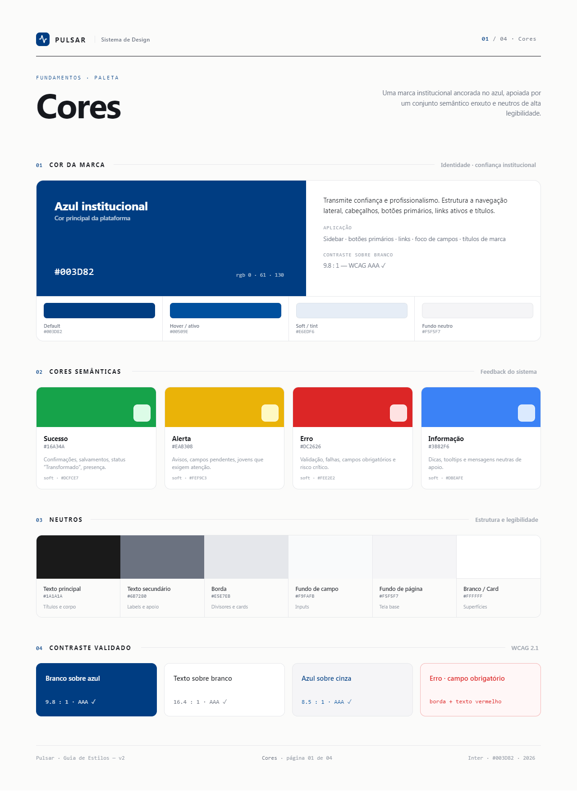<br>
  <sub> Fonte: Material produzido pelos autores (2026) </sub><br><br>
</div>

#### Cor da identidade visual

O **Azul Institucional** é a âncora visual do produto. Transmite confiança e profissionalismo, estrutura a navegação lateral, cabeçalhos, botões primários, links ativos e títulos de seção. Foram derivados três tons auxiliares para suportar interações e composições de fundo sem perder a identidade da marca.

| Token | Nome | HEX | RGB | Função na aplicação |
|-----|------|-----|-----|---------------------|
| 🔵 | Azul Institucional · *default* | `#003D82` | 0, 61, 130 | Cor principal. Sidebar, botões primários, links, foco de campos e títulos de marca. |
| 🔵 | Azul · *hover / ativo* | `#00509E` | 0, 80, 158 | Estado interativo de elementos azuis (botão pressionado, link em hover, item de menu ativo). |
| 🔵 | Azul · *soft / tint* | `#E6EDF6` | 230, 237, 246 | Fundos sutis de destaque, badges informativas e seleção leve em listagens. |
| ⚪ | Fundo neutro | `#F5F5F7` | 245, 245, 247 | Background geral da aplicação, base para cards e composições. |

**Regras de contraste e acessibilidade (WCAG 2.1):**

- Azul Institucional (#003D82) sobre branco: contraste **9.8:1**, aprovado em WCAG AAA para texto de qualquer tamanho.
- Texto principal (#1A1A1A) sobre branco: contraste **16.4:1**, AAA.
- Azul Institucional (#003D82) sobre fundo cinza neutro (#F5F5F7): contraste **8.5:1**, AAA.
- Erro (#DC2626) com borda e texto vermelhos em campos obrigatórios atende AA para texto comum.

Essas verificações atendem ao RNF-USAB-03 (responsividade e legibilidade em diferentes viewports) e ao compromisso com acessibilidade assumido no projeto.

#### Cores semânticas (feedback do sistema)

As cores semânticas são independentes da marca e seguem convenções amplamente reconhecidas em interfaces web, garantindo que qualquer usuário interprete corretamente os sinais do sistema. Cada cor semântica possui uma variante *soft*, utilizada como fundo de badges, alerts e estados sutis, mantendo legibilidade e baixa carga visual.

| Cor | Nome | HEX (default) | HEX (soft) | Função na aplicação |
|-----|------|---------------|------------|---------------------|
| 🟢 | Sucesso | `#16A34A` | `#DCFCE7` | Confirmações, salvamentos, status "Transformado" na jornada, badge de presença. |
| 🟡 | Alerta | `#EAB308` | `#FEF9C3` | Avisos, campos pendentes, jovens que exigem atenção. |
| 🔴 | Erro | `#DC2626` | `#FEE2E2` | Validação, falhas, campos obrigatórios (RN03) e risco crítico. CPF inválido (RN19). |
| 🔵 | Informação | `#3B82F6` | `#DBEAFE` | Dicas, tooltips e mensagens neutras de apoio. |

#### Neutros (estrutura e legibilidade)

| Nome | HEX | Aplicação |
|------|-----|-----------|
| Texto principal | `#1A1A1A` | Cor padrão de títulos e corpo de texto sobre fundo claro. |
| Texto secundário | `#6B7280` | Labels, textos auxiliares, metadados, timestamps. |
| Borda | `#E5E7EB` | Bordas de inputs, divisores de seção, contornos de cards. |
| Fundo de campo | `#F9FAFB` | Background de inputs e áreas de formulário. |
| Fundo de página | `#F5F5F7` | Tela base da aplicação. |
| Branco / Card | `#FFFFFF` | Superfície de cards, modais, áreas de conteúdo principal. |

---

### <a name="c3.4.2"></a>3.4.2 Tipografia

A família tipográfica **Inter** foi adotada como padrão único da aplicação. Inter é uma sans-serif de grade alta, desenhada especificamente para interfaces digitais (designer Rasmus Andersson), e atualmente é a fonte de referência para produtos como Figma, GitHub e Vercel. A substituição em relação ao estágio inicial do projeto se justifica por três razões técnicas: (i) maior estabilidade visual em tamanhos pequenos (14px–12px), comum em tabelas de dashboard; (ii) métricas projetadas para UI (ascendentes e descendentes mais curtos, números tabulares), o que melhora alinhamento em grids de dados; (iii) suporte a variable fonts no Google Fonts, reduzindo peso de bundle no front-end.

<div align="center">
  Figura 34: Escala tipográfica Inter — Pulsar <br><br>
  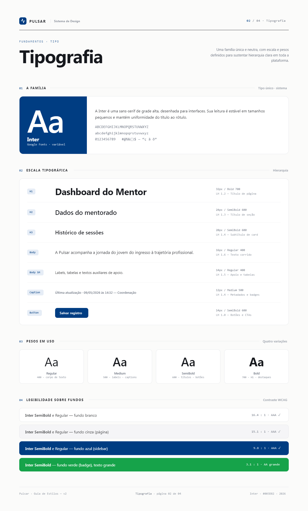<br>
  <sub> Fonte: Material produzido pelos autores (2026) </sub><br><br>
</div>

- **Disponibilidade gratuita** via Google Fonts, sem restrições de licença para uso web.
- **Renderização consistente** em todos os navegadores e sistemas operacionais.
- **Variável**, com peso ajustável de forma contínua, otimizando o carregamento.
- **Legibilidade comprovada** em interfaces de alta densidade informacional.

#### Escala tipográfica

A escala foi projetada para criar hierarquia visual clara em uma aplicação de gestão de dados, onde o usuário precisa distinguir rapidamente entre títulos, dados e ações.

| Elemento | Tag HTML | Tamanho | Peso | Line-height | Aplicação na plataforma |
|----------|----------|---------|------|-------------|------------------------|
| Título de página | `<h1>` | 32px | Bold (700) | 1.2 | Títulos principais como "Dashboard do Mentor", "Prontuário do Jovem". |
| Título de seção | `<h2>` | 24px | SemiBold (600) | 1.3 | Títulos de blocos como "Dados do mentorado", "Histórico de Frequência". |
| Subtítulo de card | `<h3>` | 20px | SemiBold (600) | 1.4 | Títulos internos de cards como "Histórico de sessões", "Mentorias". |
| Texto corrido | `<p>` | 16px | Regular (400) | 1.6 | Descrições, parágrafos, conteúdo textual geral. |
| Body SM | `<small>` | 14px | Regular (400) | 1.5 | Labels, tabelas e textos auxiliares de apoio. |
| Caption | `<span>` | 12px | Medium (500) | 1.4 | Timestamps, metadados, badges, captions. |
| Button | `<button>` | 14px | SemiBold (600) | 1.0 | Texto de botões, links de ação, CTAs. |

#### Pesos utilizados

O Pulsar restringe deliberadamente o uso a **quatro pesos** da família Inter, eliminando variações decorativas (Light, ExtraBold) que tendem a ser aplicadas de forma inconsistente. Essa contenção reduz a complexidade do sistema e força hierarquia por contraste de tamanho e função, não por excesso de pesos.


| Peso | Valor CSS | Aplicação |
|------|-----------|-----------|
| Regular | 400 | Corpo de texto, descrições, conteúdo de tabelas. |
| Medium | 500 | Labels e captions com destaque moderado. |
| SemiBold | 600 | Títulos de seção, subtítulos, botões e links de navegação. |
| Bold | 700 | H1 e destaques numéricos em dashboards. |

#### Legibilidade sobre diferentes fundos

A tipografia foi validada sobre os quatro fundos recorrentes na aplicação:

- **Fundo branco (#FFFFFF):** Inter SemiBold e Regular, contraste **16.4:1** — WCAG AAA.
- **Fundo cinza página (#F5F5F7):** Inter SemiBold e Regular, contraste **15.1:1** — WCAG AAA.
- **Fundo azul sidebar (#003D82):** Inter SemiBold e Regular em branco, contraste **9.8:1** — WCAG AAA.
- **Fundo verde badge (#16A34A):** Inter SemiBold em branco, contraste **3.1:1** — válido apenas para texto grande (AA grande).

### <a name="c3.4.3"></a>3.4.3 Iconografia e imagens 

#### Biblioteca de ícones

A aplicação utiliza a biblioteca **Lucide Icons** no estilo **outline** (traço fino, sem preenchimento) como padrão de iconografia. A escolha foi baseada em três critérios:

<div align="center">
  Figura 35: Mapeamento funcional de ícones — Lucide <br><br>
  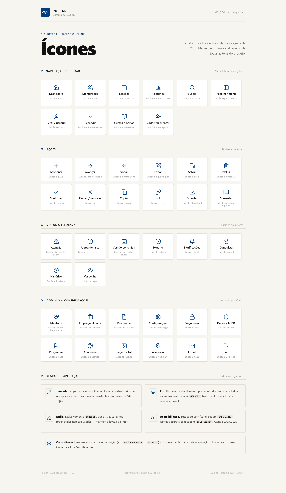<br>
  <sub> Fonte: Material produzido pelos autores (2026) </sub><br><br>
</div>

1. **Uniformidade visual:** o traço de 1.75 da Lucide harmoniza com a leveza da Inter e com a identidade visual da Pulse Mais, que prioriza formas limpas e modernas.
2. **Catálogo abrangente e ativamente mantido:** Lucide é o fork comunitário ativo do Feather Icons, com mais de 1.500 ícones cobrindo todas as funções do sistema (gestão, dados, navegação, ações CRUD) e atualizações frequentes.
3. **Código aberto e ecossistema:** disponível via SVG, webfont ou pacotes nativos para React, Vue, Svelte e outros frameworks (`lucide-react`, `lucide-vue`), sem custos de licença.

#### Mapeamento funcional dos ícones

Cada ícone foi associado a uma função específica da plataforma. O critério de escolha prioriza familiaridade do usuário: ícones universalmente reconhecidos (lupa para busca, lixeira para exclusão) reduzem a curva de aprendizado para a equipe gestora da Pulse Mais, que possui perfil não-técnico. Os ícones estão agrupados em quatro famílias semânticas para facilitar manutenção e descoberta. Para referência visual rápida, cada tabela abaixo exibe o ícone renderizado ao lado do seu nome na biblioteca Lucide.

**Navegação & Sidebar**
 
| Função | Ícone | Ícone Lucide | Contexto de uso |
|--------|-------|-------------|-----------------|
| Dashboard |  | `lucide-house` | Menu lateral: tela inicial e visão geral. |
| Mentorados |  | `lucide-users` | Menu lateral: listagem e cadastro de jovens. |
| Sessões |  | `lucide-calendar` | Menu lateral: agendamentos e encontros. |
| Relatórios |  | `lucide-chart-column` | Menu lateral: indicadores e métricas de impacto. |
| Cursos e Bolsas |  | `lucide-book-open` | Menu lateral (gestão): tela de cursos, bolsas e oportunidades. |
| Cadastrar Mentor |  | `lucide-user-plus` | Menu lateral (gestão): formulário de cadastro de novos mentores. |
| Buscar |  | `lucide-search` | Barra de busca global. |
| Recolher menu |  | `lucide-panel-left` | Controle de colapso da sidebar. |
| Perfil / usuário |  | `lucide-user` | Acesso aos dados do usuário autenticado. |
| Expandir |  | `lucide-chevron-down` | Toggles, dropdowns, expansão de detalhes. |
 
**Ações (botões e controles)**
 
| Função | Ícone | Ícone Lucide | Contexto de uso |
|--------|-------|-------------|-----------------|
| Adicionar |  | `lucide-plus` | Criação de novo registro (jovem, frequência). |
| Avançar |  | `lucide-arrow-right` | Próximo passo em wizards e paginação. |
| Voltar |  | `lucide-arrow-left` | Passo anterior em wizards e navegação. |
| Editar |  | `lucide-square-pen` | Ação de edição em tabelas e cards. |
| Salvar |  | `lucide-save` | Persistência de formulários. |
| Excluir |  | `lucide-trash-2` | Remoção / arquivamento. |
| Confirmar |  | `lucide-check` | Validação positiva de ação. |
| Fechar / remover |  | `lucide-x` | Cancelamento, dispensa de modal, remoção leve. |
| Copiar |  | `lucide-copy` | Duplicação de conteúdo. |
| Link |  | `lucide-link` | Vínculos internos e externos. |
| Exportar |  | `lucide-download` | Download de relatórios e exportação CSV. |
| Comentar |  | `lucide-message-square` | Anotações qualitativas e observações. |
 
**Status & Feedback**
 
| Função | Ícone | Ícone Lucide | Contexto de uso |
|--------|-------|-------------|-----------------|
| Atenção |  | `lucide-triangle-alert` | Avisos de atenção do sistema. |
| Alerta de risco |  | `lucide-circle-alert` | Sinalizações críticas. |
| Sessão concluída |  | `lucide-calendar-check` | Confirmação de encontro realizado. |
| Horário |  | `lucide-clock` | Indicação temporal e contagens. |
| Notificações |  | `lucide-bell` | Central de alertas do sistema. |
| Conquista |  | `lucide-award` | Marcos da jornada do jovem. |
| Histórico |  | `lucide-history` | Linha do tempo de eventos passados. |
| Ver senha |  | `lucide-eye` | Toggle de visibilidade em campos de senha. |
 
**Domínio & Configurações**
 
| Função | Ícone | Ícone Lucide | Contexto de uso |
|--------|-------|-------------|-----------------|
| Mentoria |  | `lucide-heart-handshake` | Seção de encontros de mentoria. |
| Empregabilidade |  | `lucide-briefcase` | Dados profissionais do jovem. |
| Prontuário |  | `lucide-file-text` | Ficha completa do jovem. |
| Configurações |  | `lucide-settings` | Ajustes do sistema. |
| Segurança |  | `lucide-lock` | Permissões, autenticação e tokens. |
| Dados / LGPD |  | `lucide-shield` | Privacidade e consentimento. |
| Programas |  | `lucide-flag` | Programas e turmas da instituição. |
| Aparência |  | `lucide-palette` | Preferências visuais e tema. |
| Imagem / foto |  | `lucide-image` | Upload e exibição de mídias. |
| Localização |  | `lucide-map-pin` | Endereço e dados geográficos. |
| E-mail |  | `lucide-mail` | Contato e comunicação. |
| Sair |  | `lucide-log-out` | Encerrar sessão autenticada. |

#### Regras de aplicação de ícones

- **Tamanho:** 20px para ícones inline (ao lado de texto de 14–16px) e 24px na navegação lateral. Proporção consistente com o texto adjacente.
- **Cor:** herda a cor do elemento pai. Ícones decorativos isolados utilizam o azul institucional `#003D82`. Nunca aplicar cor fora do contexto visual da marca ou das cores semânticas.
- **Estilo:** exclusivamente **outline**, traço 1.75. Variantes preenchidas (filled) **não são utilizadas**, preserva a leveza visual harmonizada com a Inter.
- **Acessibilidade:** todo botão composto apenas por ícone exige atributo `aria-label` descritivo; ícones puramente decorativos recebem `aria-hidden="true"`. Atende ao WCAG 2.1.
- **Consistência:** uma vez associado a uma função (ex.: `lucide-trash-2` para excluir), o ícone é mantido em toda a aplicação. Nunca usar o mesmo ícone para funções diferentes.

#### Imagens e fotografias

A plataforma não utiliza banco de imagens genérico. As únicas imagens presentes são:
 
- **Logo da Pulse Mais:** aplicada no cabeçalho/sidebar conforme regras do Manual de Identidade Visual (área de proteção, proporções, versões monocromáticas).
- **Avatares de jovens:** quando disponíveis, exibidos em formato circular (border-radius: 50%) com fallback para iniciais do nome sobre fundo azul institucional (`#003D82` com texto branco), conforme exemplificado nos cards de mentorado.
- **Gráficos de dashboard:** gerados dinamicamente a partir dos dados, utilizando a paleta de cores da marca para garantir coerência visual.

---

### <a name="c3.4.4"></a>3.4.4 Componentes

Os componentes representam a camada mais concreta do Pulsar: padrões de interface reutilizáveis, com seus estados explícitos e tokens de espaço e forma. Documentá-los aqui, e não apenas no protótipo de alta fidelidade, garante que toda nova tela construída pelo time consuma os mesmos blocos, evitando que cada desenvolvedor reinvente botões, badges ou cards a cada sprint.

<div align="center">
  Figura 36: Componentes padronizados da interface — Pulse Mais <br><br>
  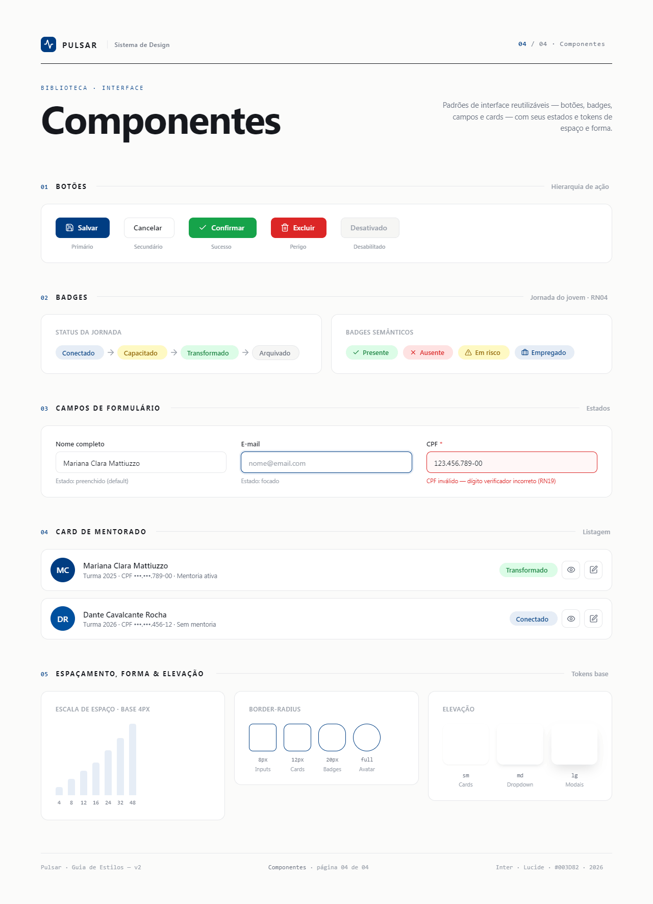<br>
  <sub> Fonte: Material produzido pelos autores (2026) </sub><br><br>
</div>

#### Botões — hierarquia de ação

Os botões expressam visualmente a hierarquia de ações dentro de uma tela. A regra prática é simples: cada tela ou modal deve ter no máximo **um botão primário**, que indica a ação principal esperada do usuário. Os demais botões assumem variantes secundárias ou semânticas conforme sua função.

| Variante | Cor | Uso | Exemplo |
|----------|-----|-----|---------|
| Primário | Azul `#003D82` | Ação principal de uma tela ou modal. | "Salvar" |
| Secundário | Borda neutra, fundo branco | Ação alternativa ou de cancelamento leve. | "Cancelar" |
| Sucesso | Verde `#16A34A` | Ação de confirmação positiva explícita. | "Confirmar" |
| Perigo | Vermelho `#DC2626` | Ação destrutiva ou irreversível. | "Excluir" |
| Desabilitado | Cinza neutro | Ação indisponível no contexto atual. | "Desativado" |

#### Badges

As badges classificam visualmente o estado de um registro. O Pulsar define dois conjuntos de badges, com finalidades distintas que não devem ser misturadas.

**Status da jornada (RN04):** representam o estágio do jovem no programa, em uma progressão linear declarada:

`Conectado` → `Capacitado` → `Transformado` → `Arquivado`

**Badges semânticas:** sinalizam estados pontuais associados a frequência, risco e situação profissional:

- `Presente` (sucesso) — registro de presença confirmado.
- `Ausente` (erro) — falta sem justificativa registrada.
- `Em risco` (alerta) — jovem com indicadores de evasão.
- `Empregado` (informação) — situação atual de empregabilidade.

#### Campos de formulário

Os campos de formulário têm três estados visuais documentados, alinhados às convenções de sistemas de design consagrados como Material Design (GOOGLE), Carbon (IBM), Lightning (SALESFORCE) e Polaris (SHOPIFY):

- **Preenchido (default):** borda neutra, texto principal em #1A1A1A.
- **Focado:** borda azul institucional `#003D82`, sinalizando que o campo está ativo para input.
- **Erro:** borda e mensagem em vermelho `#DC2626`, com texto explicativo logo abaixo (ex.: "CPF inválido — dígito verificador incorreto (RN19)").

Esses estados materializam a RN03 (campos obrigatórios) e a RN19 (validação de CPF) em padrão visual consistente.

#### Card de mentorado

O card de mentorado é o componente de listagem central na visão da coordenação e do mentor. Cada card exibe avatar com a foto de perfil do jovem (servida a partir de `usuarios.foto_url` da conta vinculada via `usuarios.jovem_id`) e, quando não há foto, o fallback de iniciais sobre fundo azul institucional com texto branco; além de nome completo, turma, CPF mascarado (LGPD), status da mentoria, badge de jornada e ações rápidas (visualizar, editar). A masked apresentação do CPF (`***.***.789-00`) atende ao princípio de minimização de dados da LGPD.

#### Espaçamento, forma e elevação


A consistência espacial é garantida por três conjuntos de tokens base:

**Escala de espaço (base 4px):** todos os espaçamentos da interface são múltiplos de 4px — `4, 8, 12, 16, 24, 32, 48`. Essa escala incremental cria ritmo visual previsível e elimina decisões arbitrárias de padding/margin no código.

**Border-radius:**

| Token | Valor | Aplicação |
|-------|-------|-----------|
| Inputs | 8px | Campos de formulário, dropdowns. |
| Cards | 12px | Containers, modais, cards de mentorado. |
| Badges | 20px | Etiquetas de status e classificação. |
| Avatar | full (50%) | Iniciais e fotos de perfil. |

**Elevação (sombras):**

| Token | Aplicação |
|-------|-----------|
| `sm` | Cards estáticos em superfície branca. |
| `md` | Dropdowns e popovers. |
| `lg` | Modais e overlays de alta prioridade. |

A combinação desses três sistemas (espaço, forma, elevação) define a "linguagem física" do Pulsar: qualquer componente novo, ao consumir esses tokens, herda automaticamente a coerência visual do sistema sem necessidade de decisões individuais.

#### Sistema de Grid e Espaçamento

O layout da aplicação segue uma estrutura de grid responsivo com três breakpoints principais: **360px** (mobile — smartphones dos jovens), **768px** (tablet — uso em campo pela equipe) e **1280px** (desktop — operação diária da coordenação). A área de conteúdo principal utiliza `CSS Grid` com `grid-template-columns: repeat(auto-fit, minmax(280px, 1fr))` para os cards de indicadores do dashboard, colapsando naturalmente em telas estreitas. A sidebar de navegação ocupa largura fixa de 240px em desktop e colapsa para um menu hamburger em viewports abaixo de 768px. O espaçamento entre elementos segue uma escala base de 4px, com os valores mais recorrentes sendo 8px (entre elementos internos de um card), 16px (padding interno de cards e inputs), 24px (gap entre cards) e 32px (margem entre seções). Essa escala foi aplicada de forma consistente no protótipo e será replicada no CSS do frontend via variáveis CSS (`--spacing-sm: 8px`, `--spacing-md: 16px`, `--spacing-lg: 24px`, `--spacing-xl: 32px`).

---

## <a name="c3.5"></a>3.5 Protótipo de alta fidelidade
O protótipo de alta fidelidade é o último artefato visual antes do código. Se o wireframe (seção 3.3) define a estrutura informacional e o guia de estilos (seção 3.4) define o vocabulário visual, o protótipo de alta é onde esses dois artefatos se encontram e produzem a aparência final do produto: cada tela ganha cor real, densidade de informação verdadeira, microinterações implícitas e estados concretos (foco, hover, erro, vazio). Tecnicamente, isso permite que problemas de UX que só aparecem na escala 1:1, sobreposição de elementos, contraste insuficiente, hierarquia visual confusa, sejam capturados antes de virarem dívida de front-end.

No projeto Pulse Mais, o produto resultante recebeu o nome Pulsar, herdado do sistema de design (seção 3.4). Essa decisão é deliberada: separa o produto da marca institucional (Pulse Mais permanece como a identidade da ONG; Pulsar é a plataforma interna que sustenta a operação). Todas as telas a seguir consomem exclusivamente tokens documentados no guia, botões, badges, cores semânticas, ícones Lucide, tipografia Inter, escala de espaço base 4px, o que comprova, na prática, que o Pulsar não é um documento decorativo, mas um sistema vivo aplicado em cada decisão visual. A organização espacial segue um sistema de grid flexível baseado em 12 colunas para layouts de página e cards alinhados à escala de espaço documentada, garantindo consistência de margens e respiro entre componentes.

O protótipo está organizado em três visões correspondentes às personas do produto (Denise — Coordenação; Mateo — Mentor; Beatriz — Aluna), precedidas por uma tela de acesso comum a todos os perfis. As subseções a seguir percorrem cada visão, descrevendo a função de cada tela e amarrando explicitamente seus componentes ao Pulsar.

Acesso ao protótipo completo:
O protótipo navegável está hospedado no Figma e mantido com link público para inspeção e validação pelos avaliadores e pela equipe da Pulse Mais: 

[ Acesse o protótipo de alta da coordenação aqui!](https://www.figma.com/design/FYgjOIqNMsTX13PwQagbXX/Prot%C3%B3tipo-de-Alta---Gest%C3%A3o?t=RQFk5rn1ovanUrX0-1)</a>

[ Acesse o protótipo de alta da aluna aqui!](https://www.figma.com/design/gNuRLeJPr0zqe6h5kG4kfk/Prot%C3%B3tipo-de-Alta---Aluna?node-id=0-1&t=RQFk5rn1ovanUrX0-1)</a>

[ Acesse o protótipo de alta do mentor aqui!](https://www.figma.com/design/fDixb7hB8CuvP5nO078Li3/Prot%C3%B3tipo-de-Alta---Mentor?node-id=27-16&t=3H8FYBjD4olL9z2Y-1)</a>

---

### <a name="c3.5.1"></a>3.5.1 Tela de acesso (transversal)

A tela de login é o único ponto de entrada do produto e é compartilhada pelas três personas, o perfil do usuário é resolvido pelo sistema após a autenticação (RF003), redirecionando para o dashboard correspondente. Por ser pré-autenticação, é a única tela do produto sem a sidebar institucional: a navegação só é construída após a identidade do usuário ser conhecida.

<div align="center">
  Figura 37: Protótipo — Tela de Login (transversal) <br><br>
  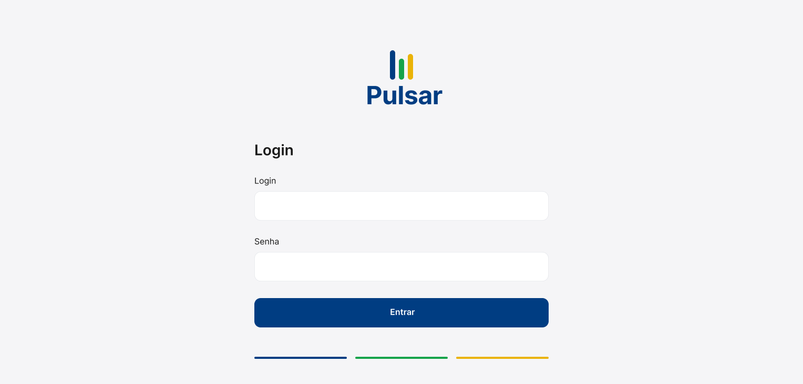<br>
  <sub> Fonte: Material produzido pelos autores (2026) </sub><br><br>
</div>

A tela centraliza o logo simbólico do Pulsar (três barras verticais coloridas que evocam um "pulso") sobre o fundo neutro `#F5F5F7`, ao lado dos campos de login e senha. A faixa tricolor na base, azul institucional, verde sucesso e amarelo alerta, é a única ocorrência válida em todo o produto onde as três cores aparecem em paridade visual; em qualquer outra tela, a hierarquia entre marca e cores semânticas é preservada (apenas o azul é tratado como cor de marca).

**Tokens do Pulsar consumidos:** botão primário `Azul Institucional #003D82`; campos de formulário no estado *default* (preenchido) com borda neutra `#E5E7EB`; tipografia Inter Bold 32px para "Pulsar" e SemiBold 24px para "Login"; fundo de página `#F5F5F7`.
 
---


### <a name="c3.5.2"></a>3.5.2 Protótipo da Coordenação (Denise)

A visão da coordenação é a mais ampla do produto. Concentra a gestão completa da jornada do jovem, a operação pedagógica diária e a administração do sistema. As telas estão agrupadas por função: visão executiva, gestão de jovens, operação pedagógica, central de notificações e configurações.

#### Visão executiva

##### Dashboard

<div align="center">
  Figura 38: Protótipo — Dashboard Executivo (Coordenação) <br><br>
  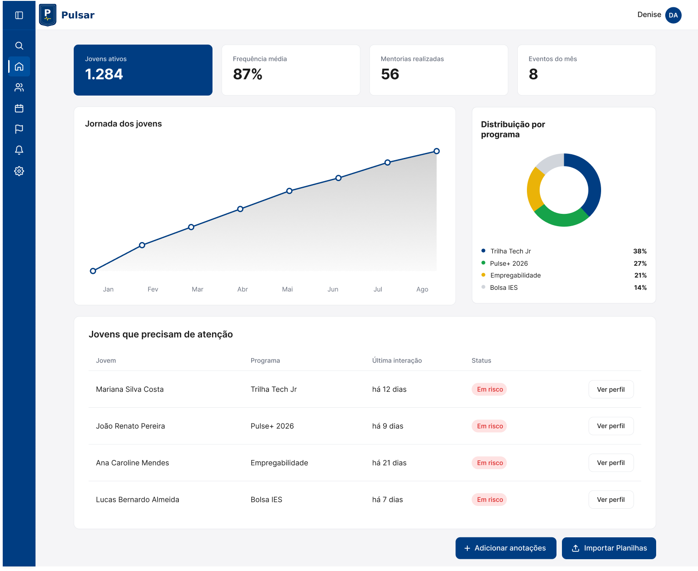<br>
  <sub> Fonte: Material produzido pelos autores (2026) </sub><br><br>
</div>

Tela inicial após o login da Denise. Concentra os quatro KPIs operacionais (jovens ativos, frequência média, mentorias realizadas, eventos do mês), dois gráficos analíticos (jornada dos jovens no tempo e distribuição por programa) e a lista priorizada de jovens em situação de risco, materializando os Requisitos Funcionais ligados ao monitoramento de impacto. O KPI primário ("Jovens ativos") recebe destaque visual com o fundo `Azul Institucional #003D82`, sinalizando que é a métrica âncora do programa.

**Tokens do Pulsar consumidos:** card de KPI primário com fundo `Azul #003D82` e texto branco; KPIs secundários sobre branco com borda neutra; badges `Em risco` no token semântico de erro *soft* `#FEE2E2` com texto `#DC2626`; botões secundário ("Adicionar anotações") e primário ("Importar Planilhas") seguindo a hierarquia de ação do guia.

#### Gestão de jovens

##### Listagem com filtros avançados

<div align="center">
  Figura 39: Protótipo — Listagem de Jovens com Filtros (Coordenação) <br><br>
  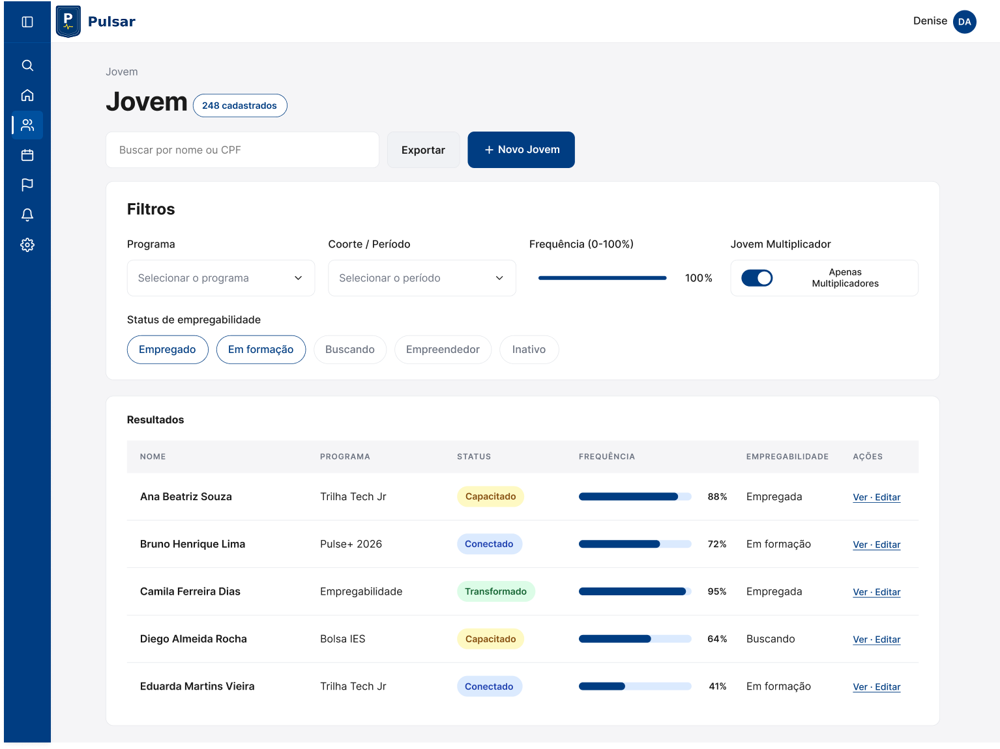<br>
  <sub> Fonte: Material produzido pelos autores (2026) </sub><br><br>
</div>

Tela central de gestão do banco de jovens. Concentra a busca textual, o filtro composto (programa, coorte, faixa de frequência, status de empregabilidade, toggle "apenas multiplicadores") e a tabela de resultados com badges de jornada por linha. Os filtros materializam a necessidade de segmentação levantada no Kick-Off para análises de impacto e construção de relatórios.

**Tokens do Pulsar consumidos:** badge `248 cadastrados` sobre fundo *soft* `Azul #E6EDF6`; chips de status de empregabilidade no estado selecionado (borda e texto azuis) e não-selecionado (borda neutra); badges da jornada `Conectado` / `Capacitado` / `Transformado` consumindo a escala de status documentada na RN04; barras de progresso de frequência usando o azul institucional sobre fundo *soft*.

##### Cadastro de novo jovem

<div align="center">
  Figura 40: Protótipo — Cadastro de Novo Jovem (Coordenação) <br><br>
  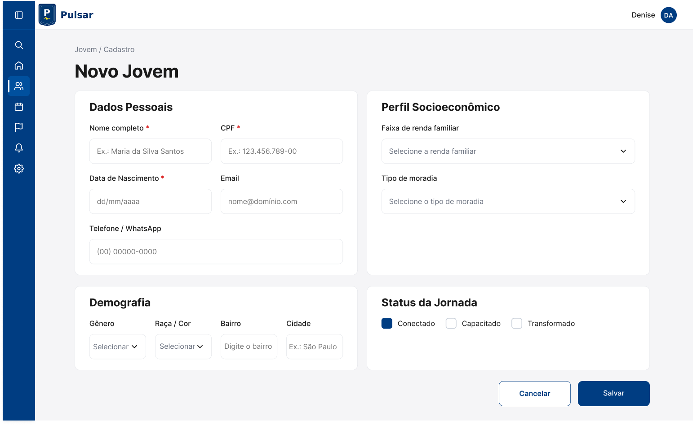<br>
  <sub> Fonte: Material produzido pelos autores (2026) </sub><br><br>
</div>

Formulário disparado pelo botão "+ Novo Jovem" na listagem. Os campos estão agrupados em quatro blocos lógicos (Dados Pessoais, Perfil Socioeconômico, Demografia, Status da Jornada), seguindo o princípio de *chunking* de Miller (1956) para reduzir carga cognitiva em formulários extensos. Campos obrigatórios recebem asterisco vermelho, materializando a RN03.

**Tokens do Pulsar consumidos:** campos no estado *default* com placeholder em `Texto secundário #6B7280`; títulos de seção em Inter SemiBold 24px; checkbox do "Status da Jornada" com o item ativo (`Conectado`) preenchido em azul institucional; botão primário `Salvar` e secundário `Cancelar` seguindo a hierarquia documentada.

##### Busca por aluno
 
<div align="center">
  Figura 41: Protótipo — Busca por Aluno (Coordenação) <br><br>
  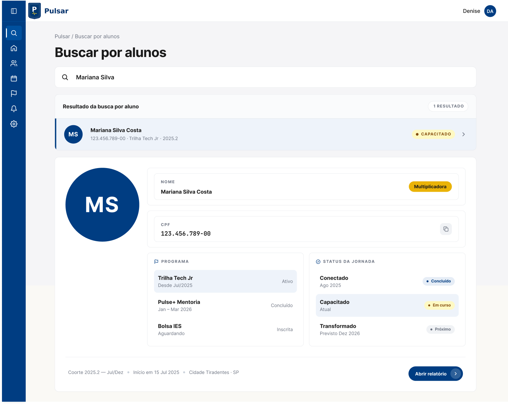<br>
  <sub> Fonte: Material produzido pelos autores (2026) </sub><br><br>
</div>

Acionada pelo ícone `lucide-search` na sidebar. Apresenta busca textual ampla (nome ou CPF) com resultado expandido em painel próprio: avatar circular (foto de perfil do jovem quando disponível, com fallback de iniciais), dados-chave (CPF, programa, coorte), badge `Multiplicadora` em amarelo institucional e o card de status da jornada com os três marcos visíveis (Concluído, Em curso, Próximo). É um atalho operacional para a equipe localizar um jovem sem passar pela listagem completa.

**Tokens do Pulsar consumidos:** input de busca com ícone `lucide-search` no estado *focado* (borda `Azul #003D82`); avatar circular com iniciais "MS" sobre `Azul #003D82` e texto branco, exatamente como prescrito na seção de imagens do guia; badge `Multiplicadora` sobre fundo amarelo `#EAB308`, único uso semântico de amarelo como elemento de destaque institucional, validado por contraste; badges de status com pontos coloridos representando os estados (informação, alerta, neutro).

##### Ficha do aluno

<div align="center">
  Figura 42: Protótipo — Ficha do Aluno (Coordenação) <br><br>
  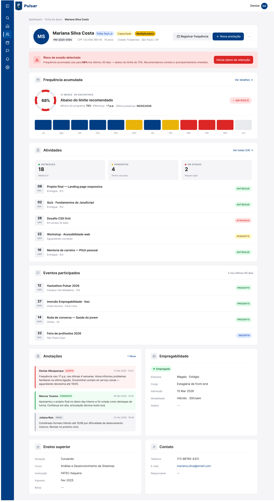<br>
  <sub> Fonte: Material produzido pelos autores (2026) </sub><br><br>
</div>

A tela mais densa do produto. Consolida em uma única visão a jornada completa de um jovem: cabeçalho com identificação e badges (jornada + multiplicadora), alerta de risco de evasão no topo quando aplicável, frequência acumulada com mini-gráfico de barras coloridas por mês, atividades (entregas/pendentes/em atraso), eventos participados, anotações qualitativas categorizadas (Alerta, Conquista, Geral) e blocos de empregabilidade, ensino superior e contato. É o materializador concreto do conceito de Single Source of Truth defendido no escopo do projeto.

**Tokens do Pulsar consumidos:** alerta de evasão em vermelho *soft* `#FEE2E2` com borda e texto em `Erro #DC2626`, materializando uma cor semântica de risco; mini-gráfico de barras por mês usando o sistema de cores semânticas (`Azul`, `Alerta #EAB308`, `Erro #DC2626`) para codificar frequência por nível; badges de anotação `ALERTA`, `CONQUISTA`, `GERAL` em cores semânticas `Erro`, `Sucesso` e `Borda neutra`; tipografia Inter SemiBold 20px nos subtítulos de card; espaçamento entre cards seguindo a escala base 4px (`24px` e `32px`).

#### Operação pedagógica

##### Registro de frequências

<div align="center">
   Figura 43: Protótipo — Registro de Frequências (Coordenação) <br><br>
  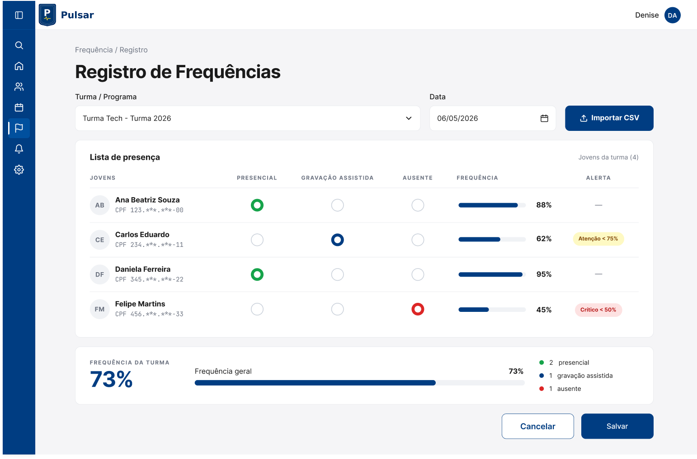<br>
  <sub> Fonte: Material produzido pelos autores (2026) </sub><br><br>
</div>

Tela operacional disparada após a Denise selecionar turma e data. Apresenta a lista de presença com três opções radio por jovem (Presencial, Gravação assistida, Ausente), barra de frequência acumulada individual, badge de alerta automático para jovens abaixo de 75% ou 50% e o resumo agregado da turma na base. Atende à RF005 com a granularidade de tipo de presença prevista na RN12. O botão "Importar CSV" no canto superior direito dispara o modal de importação descrito adiante.

**Tokens do Pulsar consumidos:** radios no estado selecionado com o token correspondente, verde sucesso `#16A34A` para `Presencial`, azul institucional para `Gravação assistida`, vermelho erro para `Ausente`; badges `Atenção < 75%` em amarelo *soft* `#FEF9C3` e `Crítico < 50%` em vermelho *soft* `#FEE2E2`; barra de progresso em azul institucional sobre `Azul soft #E6EDF6`; legenda na base com pontos coloridos seguindo as mesmas semânticas, garantindo consistência cromática no escopo da tela.

###### Modais de importação via CSV

Os modais de importação são disparados de duas origens diferentes — "Importar CSV" no registro de frequência e "Importar Planilhas" no Dashboard, mas compartilham a mesma estrutura wizard de quatro etapas (Upload → Pré-visualização → Validação → Sucesso), variando apenas título e contexto. Esse reuso estrutural materializa o princípio de consistência de interação documentado no Pulsar e atende às US03 (frequência) e US27 (planilhão legado).

<div align="center">
  Figura 44: Protótipo — Modais de Importação de Frequência e Planilhão via CSV (Coordenação) <br><br>
  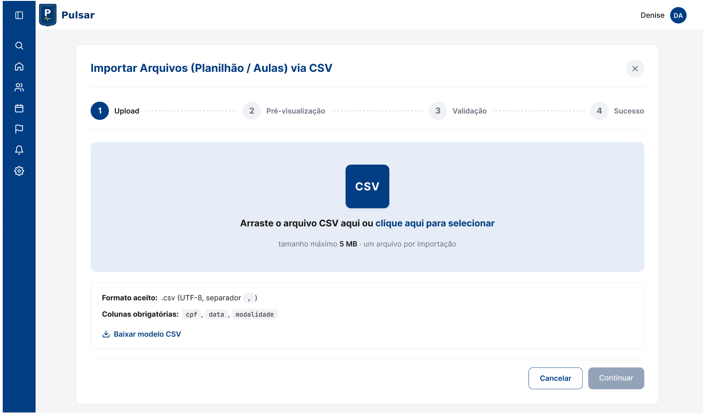<br>
  <sub> Fonte: Material produzido pelos autores (2026) </sub><br><br>
</div>

**Tokens do Pulsar consumidos:** área de upload em `Azul soft #E6EDF6` com link interno em `Azul #003D82`; stepper numerado com o passo ativo em fundo azul institucional e texto branco, e os passos seguintes em estado desabilitado com cor de borda neutra; botão primário `Continuar` no estado *desabilitado* (cinza neutro) enquanto não houver arquivo válido; chips de colunas obrigatórias (`cpf`, `data`, `modalidade`) em fundo de campo `#F9FAFB`.

##### Anotações

<div align="center">
  Figura 45: Protótipo — Registro de Anotações (Coordenação) <br><br>
  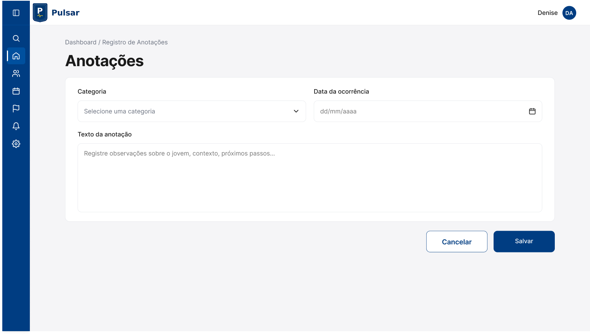<br>
  <sub> Fonte: Material produzido pelos autores (2026) </sub><br><br>
</div>


Formulário simples e focado para registrar observações qualitativas sobre um jovem, materializando a US06 e a RF006. A categoria classifica a anotação (Alerta, Conquista, Geral) e determina a cor da badge exibida na ficha do aluno. Autoria e timestamp são gerados automaticamente pelo sistema (RN14), garantindo rastreabilidade sem depender da memória da equipe.

**Tokens do Pulsar consumidos:** dropdown e date picker com ícone `lucide-chevron-down` e `lucide-calendar` herdando a cor `Texto principal #1A1A1A`; textarea com `border-radius: 8px` (token de inputs); botão primário `Salvar` e secundário `Cancelar` na hierarquia padrão.

##### Calendário e eventos

<div align="center">
  Figura 46: Protótipo — Calendário & Eventos (Coordenação) <br><br>
  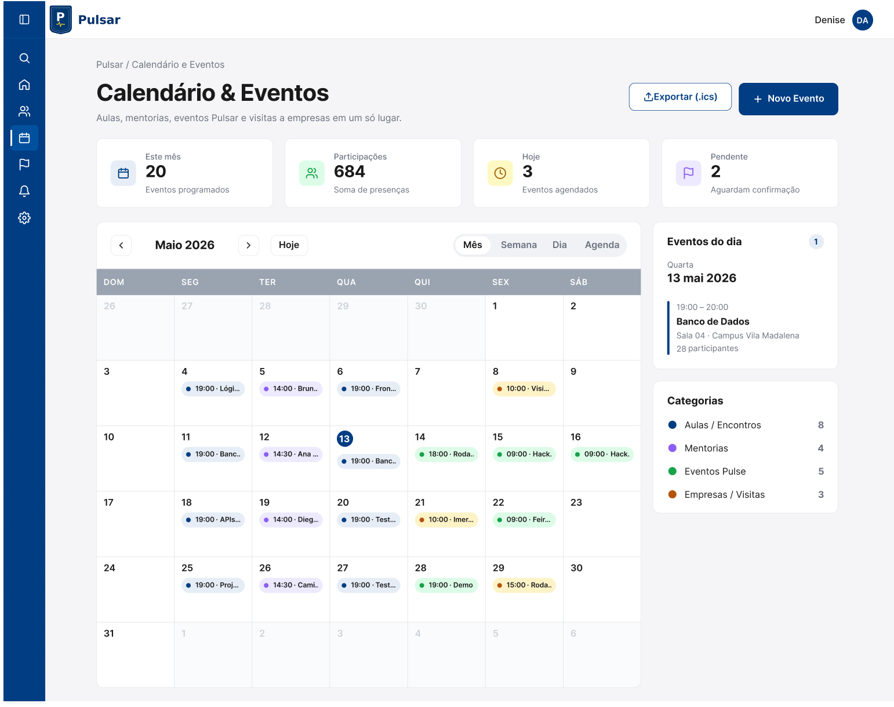<br>
  <sub> Fonte: Material produzido pelos autores (2026) </sub><br><br>
</div>


Visão unificada de todos os compromissos da operação, aulas, mentorias, eventos Pulse e visitas a empresas, em um único calendário com filtro por categoria. KPIs no topo agregam o mês corrente (eventos programados, soma de participações, eventos do dia, pendentes). O dia selecionado destaca-se em azul institucional, e o painel lateral mostra os eventos daquele dia com hora, local e número de participantes.

**Tokens do Pulsar consumidos:** dia selecionado (13) com fundo azul institucional circular e texto branco; chips de eventos no calendário usando o sistema de cores categóricas, `Azul` para Aulas, `roxo neutro` para Mentorias, `Verde sucesso` para Eventos Pulse, `âmbar` para Empresas; botão primário `+ Novo Evento` e secundário `Exportar (.ics)` com ícone `lucide-upload`; legenda das categorias com pontos coloridos correspondentes.

#### Central de notificações
 
<div align="center">
  Figura 47: Protótipo — Notificações (Coordenação) <br><br>
  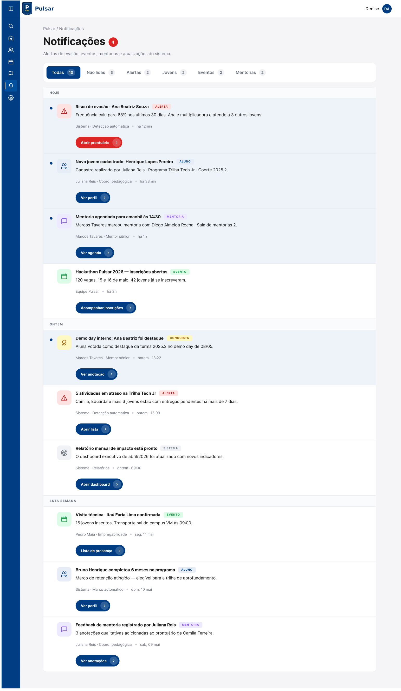<br>
  <sub> Fonte: Material produzido pelos autores (2026) </sub><br><br>
</div>

Central única que agrega alertas de evasão, eventos, mentorias, novos cadastros e atualizações do sistema. As notificações estão agrupadas por janela temporal (Hoje, Ontem, Esta semana) e filtráveis por categoria via abas no topo. Cada item carrega um badge semântico (`ALERTA`, `ALUNO`, `MENTORIA`, `EVENTO`, `CONQUISTA`, `SISTEMA`) e uma ação primária correspondente (`Abrir prontuário`, `Ver perfil`, `Ver agenda`, etc.).

**Tokens do Pulsar consumidos:** badge contador `4` em vermelho institucional ao lado do título principal, sinalizando notificações não lidas; ícones de categoria em containers *soft* coloridos (vermelho *soft* para alertas, azul *soft* para alunos, etc.); aba ativa `Todas` com fundo `Azul #003D82` e texto branco; itens não lidos com fundo `Azul soft #E6EDF6` discreto e item de divisor temporal em `Texto secundário #6B7280` uppercase.

#### Configurações


<div align="center">
  Figura 48: Protótipo — Configurações (Coordenação) <br><br>
  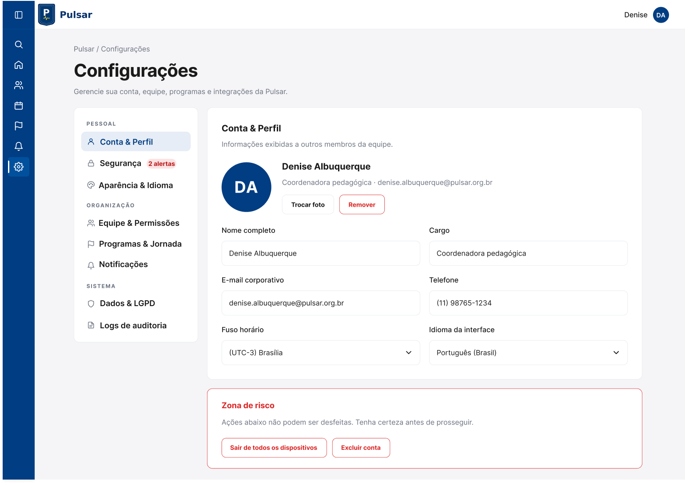<br>
  <sub> Fonte: Material produzido pelos autores (2026) </sub><br><br>
</div>

Centro administrativo da conta, dividido em três blocos: **Pessoal** (Conta & Perfil, Segurança, Aparência & Idioma), **Organização** (Equipe & Permissões, Programas & Jornada, Notificações) e **Sistema** (Dados & LGPD, Logs de auditoria). A Zona de risco isolada na base agrupa ações irreversíveis (sair de todos os dispositivos, excluir conta), seguindo a convenção amplamente adotada em produtos como GitHub e Vercel para reduzir clique acidental.

**Tokens do Pulsar consumidos:** item de menu ativo (`Conta & Perfil`) com fundo `Azul soft #E6EDF6` e texto/ícone em `Azul #003D82`; badge de alerta `2 alertas` ao lado de "Segurança" em vermelho *soft*; Zona de risco com borda e texto em `Erro #DC2626` sobre fundo branco; botão `Remover` (foto) com tratamento de perigo *outline* (texto vermelho, sem fill).

---

### <a name="c3.5.3"></a>3.5.3 Protótipo do Mentor (Mateo)

A visão do mentor é deliberadamente mais enxuta que a da coordenação, o mentor não administra o sistema, ele acompanha um conjunto pequeno de jovens e registra interações. O foco do design é **redução de fricção operacional**: cada ação importante (registrar uma mentoria, ver um perfil, escalar um risco) está a no máximo dois cliques de distância. As telas seguem o mesmo Pulsar, mas com sidebar reduzida (apenas Dashboard, Mentorados, Agenda, Impacto e Configurações).

#### Dashboard do Mentor

<div align="center">
  Figura 49: Protótipo — Dashboard do Mentor <br><br>
  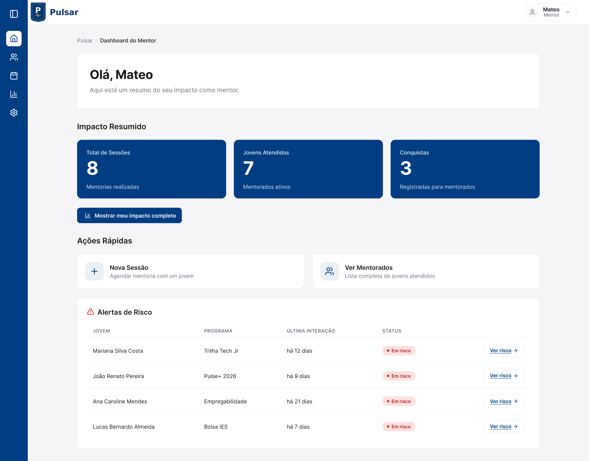<br>
  <sub> Fonte: Material produzido pelos autores (2026) </sub><br><br>
</div>


Tela inicial após o login do Mateo. Recepção personalizada ("Olá, Mateo"), três KPIs de impacto pessoal (sessões realizadas, jovens atendidos, conquistas registradas), botão de aprofundamento ("Mostrar meu impacto completo") que leva ao Painel de Impacto, dois atalhos de Ações Rápidas (Nova Sessão, Ver Mentorados) e a lista de Alertas de Risco filtrada apenas para os jovens sob acompanhamento direto do mentor. Diferentemente do dashboard da coordenação, este não exibe métricas agregadas da instituição, é estritamente um painel pessoal.

**Tokens do Pulsar consumidos:** três cards de KPI primários em fundo `Azul #003D82` com texto branco, sinalizando que são as métricas-âncora do papel; ícone `lucide-triangle-alert` em `Erro #DC2626` no cabeçalho da seção de alertas; badges `Em risco` em vermelho *soft*; botões secundários `Ver risco` com borda neutra.

#### Meus Mentorados

<div align="center">
  Figura 50: Protótipo — Meus Mentorados <br><br>
  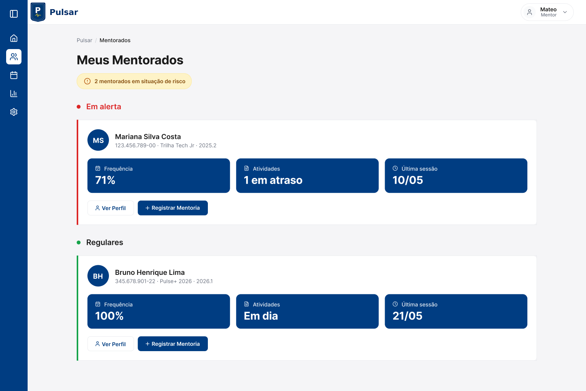<br>
  <sub> Fonte: Material produzido pelos autores (2026) </sub><br><br>
</div>

Listagem dos jovens sob a responsabilidade direta do Mateo, **segmentada por estado**, "Em alerta" no topo, "Regulares" abaixo. Essa ordenação é uma decisão de design importante: força a triagem por prioridade, em vez de listar alfabeticamente, alinhando-se ao princípio de que o produto deve ativamente direcionar a atenção do mentor para onde há maior risco de evasão. Cada card concentra três KPIs (frequência, atividades, última sessão) e duas ações (Ver Perfil, Registrar Mentoria).

**Tokens do Pulsar consumidos:** badge agregada `2 mentorados em situação de risco` em amarelo *soft* `#FEF9C3` no topo, materializando um aviso de atenção sem o peso de um erro; borda lateral vermelha (`#DC2626`) nos cards "Em alerta" e verde (`#16A34A`) nos "Regulares", sinalização cromática direta e legível; mini-cards de KPI dentro de cada card de mentorado em fundo `Azul #003D82`.

#### Perfil do Mentorado

<div align="center">
  Figura 51: Protótipo — Perfil do Mentorado (visão do Mentor) <br><br>
  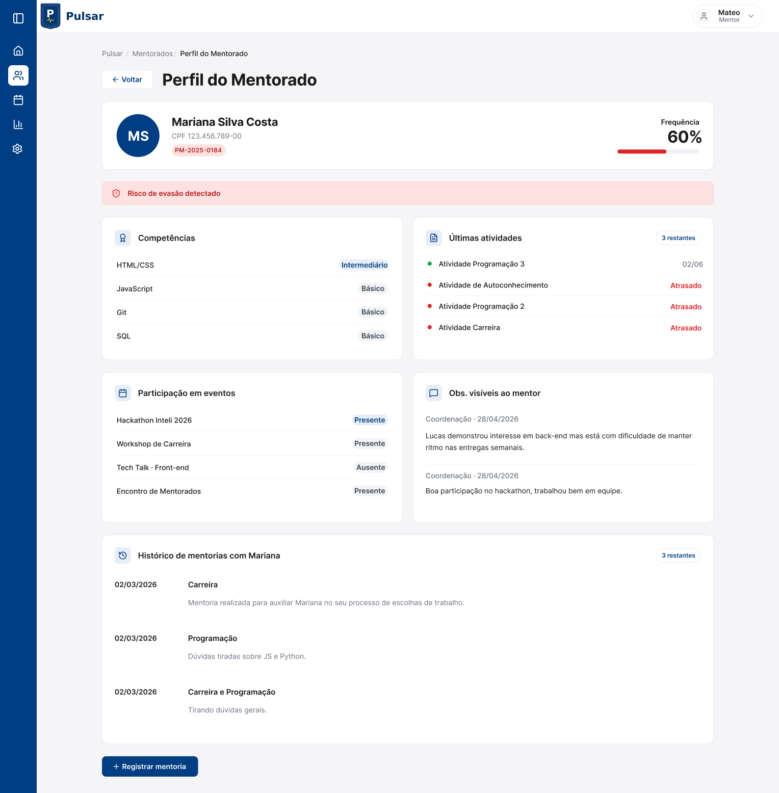<br>
  <sub> Fonte: Material produzido pelos autores (2026) </sub><br><br>
</div>

Visão do jovem específica para o mentor, propositalmente reduzida em relação à ficha completa da coordenação (Figura 42). O mentor vê competências, atividades recentes, participação em eventos, **observações da coordenação explicitamente marcadas como "visíveis ao mentor"** (RN12) e o histórico de mentorias passadas com aquele jovem. Anotações internas de outros perfis (psicólogo, coordenação restrita) **não** são exibidas, atendendo à LGPD e ao princípio de minimização de dados. Atende à US21.

**Tokens do Pulsar consumidos:** badge `Intermediário` / `Básico` para competências em azul *soft*; pontos coloridos nas atividades (verde para entregas no prazo, vermelho para atrasadas); banner de risco de evasão em vermelho *soft* `#FEE2E2`; barra de frequência em vermelho institucional sinalizando estado crítico (60%); botão primário `+ Registrar mentoria` no rodapé como CTA principal da tela.

#### Painel de Impacto

<div align="center">
  Figura 52: Protótipo — Painel de Impacto do Mentor <br><br>
  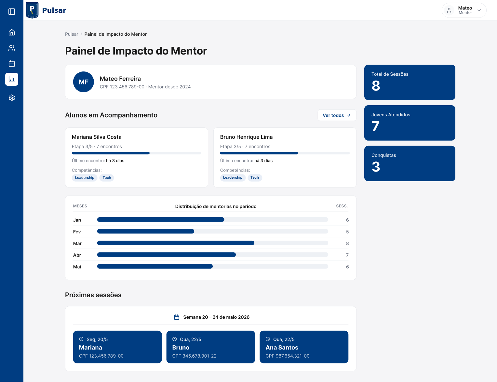<br>
  <sub> Fonte: Material produzido pelos autores (2026) </sub><br><br>
</div>

Versão expandida e detalhada do impacto pessoal. Atende à US19 em sua forma completa: identifica o mentor, lista os jovens em acompanhamento com etapa atual da trilha, exibe a distribuição mensal de mentorias em gráfico de barras horizontal, agrega KPIs laterais e mostra a agenda da semana corrente com encontros nominais. É a tela que justifica o vínculo do mentor com o programa, mostra concretamente o impacto que ele tem gerado.

**Tokens do Pulsar consumidos:** KPIs laterais empilhados em `Azul #003D82`; barras horizontais do gráfico mensal em azul institucional sobre `Azul soft #E6EDF6`; chips de competências (`Leadership`, `Tech`) em azul *soft*; cards de próximas sessões em azul institucional com tipografia branca; ícone `lucide-clock` para horários e `lucide-calendar` para datas, ambos herdando cor do contêiner.

#### Alerta de Risco

<div align="center">
  Figura 53: Protótipo — Detalhe de Alerta de Risco (Mentor) <br><br>
  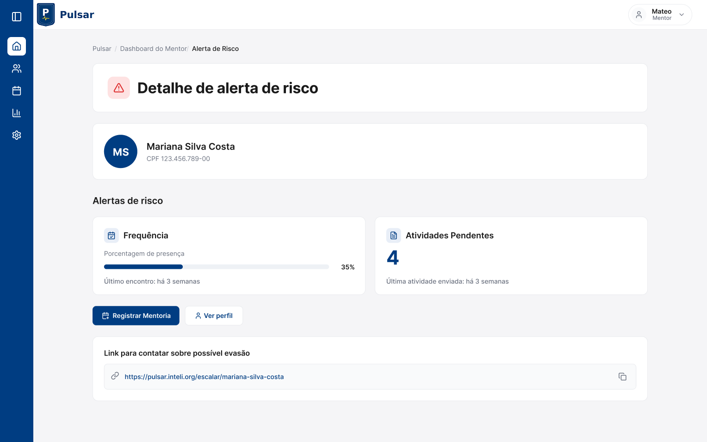<br>
  <sub> Fonte: Material produzido pelos autores (2026) </sub><br><br>
</div>

Tela acessada pelo botão "Ver risco" nos cards do Dashboard ou da listagem de mentorados. Aprofunda um único alerta: identifica o jovem, expõe os dois indicadores principais que dispararam o aviso (frequência abaixo do limite, atividades pendentes) e oferece duas ações imediatas (Registrar Mentoria, Ver perfil) mais um link estável de escalação para o serviço social/coordenação. A existência desse link reflete uma decisão importante: o mentor não escala diretamente; ele sinaliza, e a coordenação acompanha.

**Tokens do Pulsar consumidos:** ícone `lucide-triangle-alert` em container *soft* `#FEE2E2` no cabeçalho; barra de progresso em `Erro #DC2626` sinalizando o nível crítico (35%); número grande "4" em Inter Bold 32px para o KPI de atividades pendentes; link de escalação em `Azul #003D82` precedido por ícone `lucide-link`; botão `Registrar Mentoria` primário em azul, `Ver perfil` secundário em branco com borda.

#### Registrar Mentoria e Detalhe do Registro

<div align="center">
  Figura 54: Protótipo — Registrar Mentoria (Mentor) <br><br>
  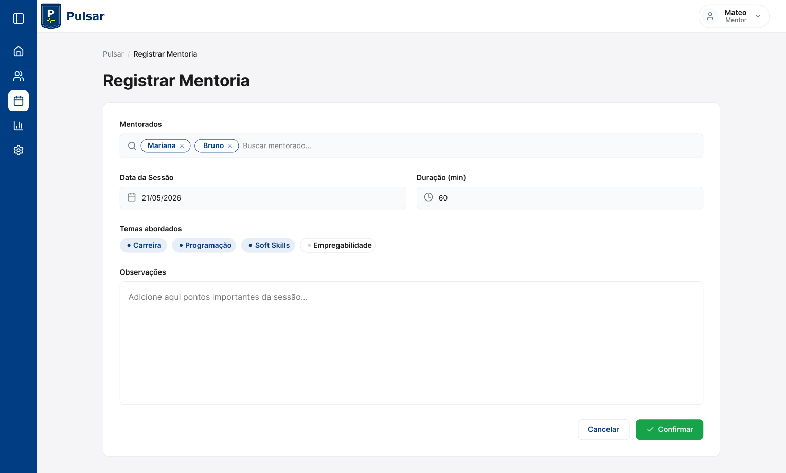<br>
  <sub> Fonte: Material produzido pelos autores (2026) </sub><br><br>
</div>

Formulário rápido para registrar uma sessão de mentoria. Suporta **múltiplos mentorados** simultaneamente (campo com chips removíveis), data, duração em minutos, temas abordados como chips toggleable (Carreira, Programação, Soft Skills, Empregabilidade) e observações livres. O botão de confirmação é verde (`Sucesso #16A34A`) e não azul, decisão deliberada: registrar uma mentoria é uma **ação positiva** que materializa progresso, e o verde reforça essa leitura semântica.

<div align="center">
  Figura 55: Protótipo — Detalhe do Registro de Mentoria (Mentor) <br><br>
  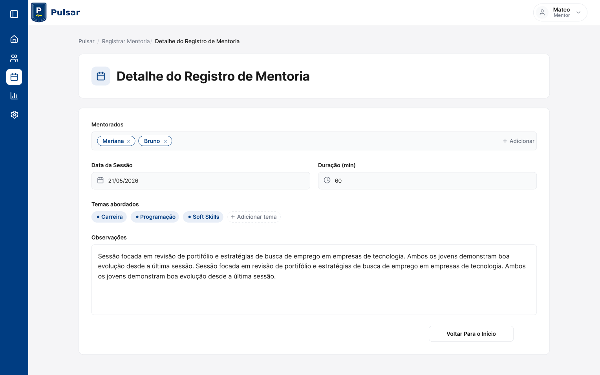<br>
  <sub> Fonte: Material produzido pelos autores (2026) </sub><br><br>
</div>

Estado posterior ao registro inicial, acessado para revisão ou edição. Mantém os mesmos campos do formulário de registro, agora preenchidos com o conteúdo da sessão e com observações expandidas em formato de texto completo. O botão primário muda de `Confirmar` (verde) para `Salvar registro` (azul institucional), coerente com a hierarquia do guia: a confirmação inicial é uma ação semântica positiva; o salvamento de uma edição é uma ação operacional padrão.

**Tokens do Pulsar consumidos (ambas as telas):** chips de mentorados com `lucide-x` para remoção em ações secundárias; chips de tema com ponto colorido `Azul #003D82` no estado selecionado e neutro no padrão; campos com ícones contextuais `lucide-calendar` e `lucide-clock`; tipografia consistente Inter SemiBold 24px nos títulos e Regular 16px no corpo.

#### Configurações

<div align="center">
  Figura 56: Protótipo — Configurações (Mentor) <br><br>
  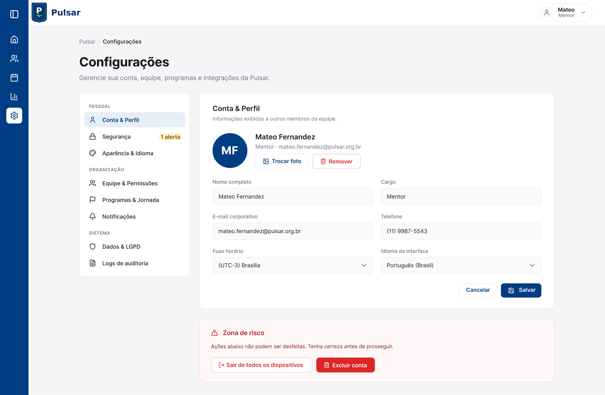<br>
  <sub> Fonte: Material produzido pelos autores (2026) </sub><br><br>
</div>

Estrutura idêntica à da coordenação (Figura 48), reaproveitando o mesmo componente de configurações. Essa identidade estrutural é deliberada: configurações de conta são um padrão transversal do produto, e construir variantes diferentes por perfil seria sobre-engenharia. As únicas diferenças são o conteúdo (nome, cargo, e-mail do Mateo) e o número de alertas em "Segurança" (1, contra 2 da Denise).

**Tokens do Pulsar consumidos:** os mesmos da Figura 48 (item de menu ativo em `Azul soft`, Zona de risco em vermelho, botão `Salvar` primário azul) — o reuso comprova a coerência sistêmica do Pulsar.

---

### <a name="c3.5.4"></a>3.5.4 Protótipo da Aluna (Beatriz)

A visão da aluna é a mais distinta das três. Não é uma janela administrativa, é um **portal de autoacompanhamento**: a aluna vê sua própria jornada, seus dados, suas oportunidades. Por isso, a linguagem visual aqui se permite um vocabulário mais expressivo, os accents de marca (azul, verde e amarelo) são usados intencionalmente como **wayfinding cromático** para diferenciar as três grandes áreas funcionais do portal (Acompanhamento, Empregabilidade, Oportunidades). Essa é uma extensão deliberada do Pulsar para o contexto do aluno: em telas administrativas (Denise e Mateo), cor é função; em telas do aluno, cor também é **navegação**, e essa decisão está documentada como variação do sistema, não como inconsistência.

#### Meu Dashboard

<div align="center">
  Figura 57: Protótipo — Meu Dashboard (Aluna) <br><br>
  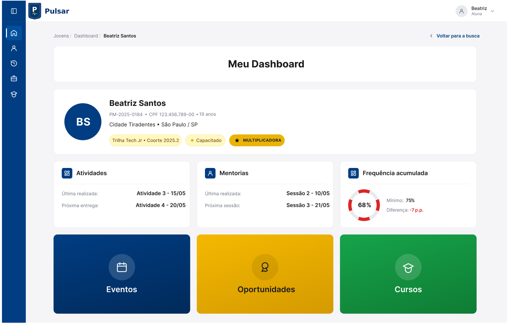<br>
  <sub> Fonte: Material produzido pelos autores (2026) </sub><br><br>
</div>

Tela inicial após o login da Beatriz. Diferentemente do dashboard executivo (Denise) ou do dashboard do mentor (Mateo), este é um **dashboard pessoal**: nenhum dado de outros jovens, nenhuma métrica agregada da instituição. A tela mostra a identidade da aluna no topo (com badges `Capacitado` e `Multiplicadora`), três cards de progresso pessoal (atividades, mentorias, frequência) e três cards de acesso primário às áreas do portal, Eventos (azul), Oportunidades (amarelo), Cursos (verde), que materializam o wayfinding cromático mencionado acima.

**Tokens do Pulsar consumidos:** badges `Capacitado` (amarelo *soft*) e `Multiplicadora` (amarelo institucional `#EAB308` em fundo escuro) consumindo os mesmos tokens da listagem da Denise, coerência entre perfis sobre a mesma jornada; KPIs em fundo branco com ícones em containers *soft* `Azul #E6EDF6`; barra de frequência em `Erro #DC2626` (68% abaixo do limite); cards de acesso em `Azul Institucional`, `Alerta #EAB308` e `Sucesso #16A34A` em paridade visual.

#### Perfil do aluno

<div align="center">
   Figura 58: Protótipo — Perfil do Aluno (Aluna) <br><br>
  <br>
  <sub> Fonte: Material produzido pelos autores (2026) </sub><br><br>
</div>

Tela de dados pessoais da própria aluna, com botão "Editar informações" centralizado. Cada campo (Nome, Email, CPF) é apresentado em um card com borda lateral azul institucional, criando uma assinatura visual de "registro de identidade". Histórico Acadêmico e Certificados aparecem na base como dois blocos expandíveis (com placeholders skeleton no estado vazio do protótipo), com botão `Visualizar` em azul institucional como CTA primário.

**Tokens do Pulsar consumidos:** badges de status do topo (`Capacitado`, `Multiplicadora`, `Ativo`) usando o mesmo conjunto de jornada e semânticas; campos read-only com fundo `Azul soft #E6EDF6` e borda lateral azul institucional como marcador visual de "campo identitário"; botões `Visualizar` em `Azul #003D82`; ícone `lucide-star` em fundo amarelo no botão de favoritar certificados.

#### Status de Ensino Superior

<div align="center">
   Figura 59: Protótipo — Status de Ensino Superior (Aluna) <br><br>
  <br>
  <sub> Fonte: Material produzido pelos autores (2026) </sub><br><br>
</div>

Tela específica para acompanhamento da trajetória da aluna no ensino superior, fora do escopo direto da Pulse Mais, mas relevante para o programa (US26). Cabeçalho azul institucional com identificação (Status: Ativo, 3 Pendências), três ações primárias diferenciadas por cor semântica (Editar / Verificar Status / Pendências), cards de "Semestre Atual" e "Disciplinas Ativas" em variações *soft* das semânticas (verde claro e amarelo claro), dados acadêmicos do curso e dois painéis de Histórico Acadêmico e Certificados com itens listados em formato verificável (ícone de check verde para aprovados, alerta amarelo para em andamento).

**Tokens do Pulsar consumidos:** botão `Verificar Status` em `Sucesso #16A34A`, `Pendências` em `Alerta #EAB308`, `Editar informações` neutro, três ações com hierarquia cromática alinhada à criticidade percebida; ícones `lucide-circle-check-2` em verde e `lucide-triangle-alert` em amarelo para itens da lista; campos de dados em fundo `#F9FAFB` com label em `Texto secundário #6B7280` e valor em `Texto principal #1A1A1A`.


#### Empregabilidade

<div align="center">
   Figura 60: Protótipo — Empregabilidade (Aluna) <br><br>
  <br>
  <sub> Fonte: Material produzido pelos autores (2026) </sub><br><br>
</div>

Centro de carreira da aluna. Exibe situação atual (cargo, empresa, tempo de atuação), botão de edição, e três grandes blocos em colunas, **Competências** (cabeçalho amarelo), **Histórico de carreiras** (cabeçalho azul) e **Oportunidades** (cabeçalho verde), repetindo o vocabulário tricolor introduzido no dashboard. Cada bloco lista itens em cards individuais com ícone à esquerda, título, descrição e metadado. Os itens são tipograficamente uniformes (Inter SemiBold no título, Regular nas demais linhas), mas a cor do cabeçalho ancora visualmente cada coluna em sua função.

**Tokens do Pulsar consumidos:** cabeçalhos coloridos em `Alerta #EAB308` (Competências), `Azul #003D82` (Histórico) e `Sucesso #16A34A` (Oportunidades) — uso decorativo/funcional dos accents do Pulsar como wayfinding interno do portal do aluno (decisão documentada nesta seção); cards individuais com `border-radius: 12px` herdado do token de Cards; ícones contextuais em containers *soft* da própria cor da coluna.

#### Oportunidades

<div align="center">
   Figura 61: Protótipo — Oportunidades (Aluna) <br><br>
  <br>
  <sub> Fonte: Material produzido pelos autores (2026) </sub><br><br>
</div>


Hub central de oportunidades disponíveis. Acessível tanto pelo card amarelo "Oportunidades" no Dashboard quanto pela sidebar lateral. Topo dominado por um banner azul institucional com avatar, título e barra de progresso pessoal na Pulse Mais (68%). Logo abaixo, três colunas de oportunidades catalogadas, Cursos (cabeçalho amarelo), Eventos (cabeçalho azul), Bolsas (cabeçalho verde), reforçando o padrão cromático do portal. Cada card de oportunidade contém título, instituição/parceiro, descrição, metadados (duração, local, vagas, valor de bolsa) e botão `Ver detalhes`.

**Tokens do Pulsar consumidos:** banner superior em `Azul #003D82` com gradiente sutil e padrão decorativo circular (ornamental); badges de tipo (`Curso`, `Evento`, `Bolsa`) em amarelo, azul e verde institucionais sobre fundo escuro, mais um aplicativo do wayfinding cromático; ícones `lucide-clock` (duração), `lucide-map-pin` (local), `lucide-users` (vagas) e `lucide-circle-dollar-sign` (valor); botões `Ver detalhes` em azul institucional como CTA primário consistente em todos os cards.

---

### Considerações finais sobre o protótipo

A construção do protótipo de alta fidelidade comprovou três decisões-chave do Pulsar como sistema de design. Primeiro, **a coerência cromática se sustenta sob carga real**: nenhuma tela precisou inventar uma cor nova ou ajustar um token previamente documentado, todas as 25+ telas foram construídas exclusivamente com os tokens listados na seção 3.4. Segundo, **a hierarquia tipográfica documentada (32/24/20/16/14/12) cobre 100% dos casos de uso**, do título do dashboard ao caption de metadados em rodapé de card. Terceiro, **a biblioteca Lucide outline com traço 1.75 mantém legibilidade em todas as escalas** (20px inline, 24px navegação, 16px badges), confirmando a escolha técnica feita no guia.

O único ponto de extensão deliberada do Pulsar é o **wayfinding cromático no portal do aluno** (Beatriz), em que os accents amarelo/azul/verde são usados também como sinalização de área funcional. Essa decisão está documentada nesta seção como variação contextual do sistema, não como inconsistência, e poderia, em uma evolução futura do Pulsar, ser formalizada como um conjunto adicional de tokens "categóricos" (em oposição aos tokens "semânticos" atuais), explicitando a diferença entre cor que comunica **estado** e cor que comunica **categoria**.

## <a name="c3.6"></a>3.6. Modelagem do banco de dados
A modelagem de banco de dados é o processo de projetar a estrutura que armazenará, organizará e relacionará todas as informações de um sistema antes de qualquer linha de código SQL ser escrita. Trata-se, em essência, de um exercício de tradução: as regras de negócio, os fluxos operacionais e as restrições do mundo real precisam ser convertidos em uma estrutura formal que um sistema gerenciador de banco de dados (SGBD) consiga interpretar, armazenar e consultar de forma eficiente e íntegra.

Esse processo é conduzido em três níveis progressivos de abstração, cada um com um propósito distinto. O primeiro nível é o **modelo conceitual**, representado pelo Modelo Entidade-Relacionamento (seção 3.6.1), que captura o quê existe no domínio (quais são os objetos de interesse (entidades), quais informações os descrevem (atributos) e como eles se relacionam entre si), de forma completamente independente de tecnologia. Neste nível, não há tabelas, colunas ou tipos de dados; há apenas a representação fiel do minimundo do problema. O segundo nível é o **modelo lógico**, representado pelo Diagrama Entidade-Relacionamento (seção 3.6.2), que traduz o modelo conceitual em uma estrutura mais próxima do banco relacional: entidades se tornam tabelas, relacionamentos se tornam chaves estrangeiras, e as cardinalidades ganham precisão técnica com a identificação explícita de PKs e FKs. O terceiro nível é o **modelo físico** (seção 3.6.3), que materializa o modelo lógico em código SQL executável, incluindo tipos de dados concretos, constraints, índices de performance e estratégias de armazenamento otimizadas para o SGBD adotado (PostgreSQL via Supabase, neste projeto).

No contexto da Pulse Mais, a modelagem do banco de dados assume importância central porque a dor primária da organização é justamente a ausência de uma estrutura unificada de dados. Informações sobre jovens, frequência, mentorias, empregabilidade e saúde mental estavam dispersas em planilhas isoladas, sem relacionamento formal entre si. O modelo apresentado a seguir foi projetado para consolidar esses dados em uma Single Source of Truth (SSOT) institucional, garantindo integridade referencial, rastreabilidade de operações e aderência à LGPD, traduzindo, em estrutura de banco, os Requisitos Funcionais e as Regras de Negócio levantados nas seções 3.1.1 e 3.1.2.

A progressão conceitual → lógico → físico não é arbitrária: cada nível valida o anterior. Um erro conceitual (como modelar uma relação N:N sem tabela associativa) se propaga para o lógico e corrompe o físico. Por isso, as três subseções a seguir devem ser lidas como etapas sequenciais de um mesmo processo de design, e não como artefatos independentes.

> **Nota sobre contagem de entidades neste capítulo:** ao longo deste capítulo, diferentes números de entidades aparecem conforme o nível de abstração: 13 entidades centrais no diagrama do domínio (3.2.3), 20 módulos com endpoints na WebAPI (3.7), 21 tabelas no modelo físico do banco (3.6.3) e 34 migrations. A diferença não é inconsistência, mas reflexo dos diferentes níveis de granularidade entre domínio, contrato HTTP e implementação física.

---

### <a name="c3.6.1"></a>3.6.1. Modelo Entidade-Relacionamento (ER)
O Modelo Entidade-Relacionamento (ER) é uma técnica de modelagem conceitual proposta por Peter Chen em 1976, cuja finalidade é representar a estrutura de informações de um domínio de forma visual, declarativa e independente de qualquer tecnologia de banco de dados. A premissa fundamental do modelo ER é que qualquer realidade pode ser descrita em termos de três elementos primitivos: **entidades** (os objetos sobre os quais se deseja armazenar informações), **atributos** (as propriedades que caracterizam cada entidade) e **relacionamentos** (as associações semânticas que vinculam duas ou mais entidades entre si).

A importância do modelo ER reside no fato de que ele opera no nível do problema, não da solução. Enquanto o código SQL responde à pergunta "como os dados serão armazenados?", o modelo ER responde "quais dados existem e como eles se relacionam no mundo real?". Essa separação de preocupações é o que permite validar o entendimento do domínio com stakeholders não técnicos, como a equipe da Pulse Mais, antes de comprometer-se com decisões de implementação.

O modelo a seguir utiliza a **Notação de Chen**, a forma original e mais didática de representar diagramas ER. Nessa notação, cada elemento visual possui uma forma geométrica própria:
 
- **Retângulos** representam entidades (objetos do domínio que possuem existência própria).
- **Elipses** representam atributos (propriedades que descrevem uma entidade ou um relacionamento), conectados à entidade por linhas simples. Atributos identificadores (chaves primárias) são indicados pela marcação `id(PK)`.
- **Losangos** representam relacionamentos (associações semânticas entre duas ou mais entidades).
- **Linhas de conexão** ligam entidades a relacionamentos, e as **cardinalidades** são expressas diretamente sobre essas linhas no formato **(mín, máx)**, indicando o número mínimo e máximo de participações de uma instância da entidade no relacionamento. O valor `0` no mínimo indica participação opcional (a entidade pode existir sem participar daquele relacionamento), enquanto `1` indica participação obrigatória. No máximo, `1` indica unicidade (cada instância participa no máximo uma vez) e `n` indica multiplicidade irrestrita (pode participar quantas vezes forem necessárias).

Para o projeto Pulse Mais, o modelo ER cumpre um papel particularmente relevante: ele é o primeiro artefato que traduz o minimundo descrito no Kick-Off e no TAPI em uma estrutura formal de dados. Cada entidade do diagrama corresponde a um conceito operacional da instituição, cada atributo reflete um campo dos formulários e planilhas utilizados pela equipe, e cada relacionamento explicita uma regra de negócio que antes existia apenas na memória dos colaboradores.

#### Nota sobre normalização

O modelo conceitual apresentado foi projetado para atender à **Terceira Forma Normal (3FN)**, o que significa que: todo atributo depende exclusivamente da chave primária de sua entidade (sem dependências parciais ou transitivas), relacionamentos N:N são resolvidos por entidades associativas com atributos próprios (como `matriculas` e `participacoes_eventos`), e nenhum atributo multivalorado foi comprimido em um único campo. Essa decisão garante ausência de redundância, anomalias de inserção, atualização e exclusão controladas, e consistência na evolução futura do schema. A única exceção deliberada é o campo `status_jornada` na entidade `jovens`, que utiliza um enum composto em vez de uma tabela de junção, decisão documentada e justificada na descrição da entidade a seguir.

---

#### Modelo ER
 
<div align="center">
  Figura 62: Modelo Entidade-Relacionamento (ER) — Pulse Mais <br><br>
  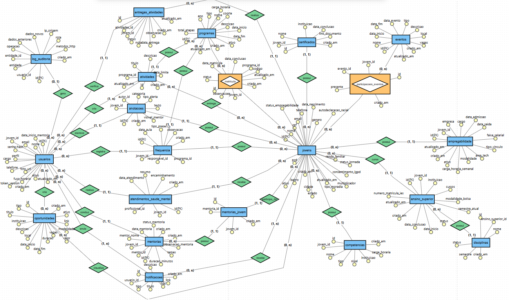<br>
  <sub> Fonte: Material produzido pelos autores (2026) </sub><br><br>
</div>

---

#### Explicação Entidades, Atributos, Relacionamentos e Cardinalidades

##### Entidade `usuarios`

Representa todos os indivíduos que possuem acesso autenticado à plataforma, independentemente do papel que exercem na instituição. Isso inclui membros da equipe interna, como coordenadores, psicólogos e estagiários, mas também os próprios jovens, que acessam o Portal do Aluno com credenciais próprias. A diferenciação entre esses papéis é feita exclusivamente pelo atributo `perfil`, que determina quais rotas e operações cada usuário pode acessar, conforme RF003. Seus atributos são: `id(PK)`, `nome`, `email`, `senha_hash`, `perfil`, `cargo`, `telefone`, `foto_url`, `fuso_horario`, `ativo`, `data_inicio_mentoria`, `jovem_id`, `token_version`, `criado_em` e `atualizado_em`.

O atributo `senha_hash` reflete diretamente a RN07, que proíbe o armazenamento de senha em texto plano. Os atributos `cargo` e `telefone` são opcionais e descrevem, respectivamente, a função institucional do colaborador (ex.: "Coordenadora Pedagógica") e seu contato direto. O atributo `foto_url` armazena a URL da foto de perfil hospedada no Supabase Storage, e `fuso_horario` padroniza a exibição temporal para o usuário (`America/Sao_Paulo` por padrão).

O atributo `data_inicio_mentoria` é utilizado para registrar a data em que um ex-aluno passou a atuar como mentor dentro do ecossistema Pulse Mais, permitindo identificar e acompanhar jovens multiplicadores que retornam à instituição em funções de apoio e desenvolvimento. O atributo `jovem_id` estabelece uma associação opcional entre o usuário autenticado e um registro da entidade `jovens`, sendo utilizado principalmente para usuários que também participam da plataforma como jovens ou mentores oriundos do programa. Já o atributo `token_version` é utilizado pelo mecanismo de autenticação para controle e invalidação de tokens de acesso, permitindo encerrar sessões ativas de forma segura quando necessário, sem exigir alteração da senha do usuário.

---

##### Entidade `jovens`

É a entidade central do modelo, em torno da qual todo o domínio gravita, refletindo diretamente a proposta de SSOT do projeto. Armazena os dados pessoais, demográficos e de jornada de cada jovem atendido pela Pulse Mais. Seus atributos são: `id(PK)`, `nome`, `cpf`, `email`, `telefone`, `data_nascimento`, `genero`, `autodeclaracao_racial`, `renda_familiar`, `pcd`, `bairro`, `cidade`, `estado`, `tipo_moradia`, `multiplicador`, `status_empregabilidade`, `status_jornada`, `consentimento_lgpd`, `ativo`, `criado_em` e `atualizado_em`.

Os atributos `bairro`, `cidade` e `estado` compõem o endereço do jovem conforme apresentado na ficha do aluno (ex.: "Cidade Tiradentes — São Paulo / SP"). O atributo `tipo_moradia` registra a condição habitacional informada no cadastro. O atributo `multiplicador` identifica jovens que retornam ao ecossistema como agentes de transformação (ex-alunos que se tornam mentores), refletido pela badge "Multiplicadora" e pelo filtro toggle "Apenas Multiplicadores" na listagem. O atributo `status_empregabilidade` registra a situação profissional vigente do jovem (Empregado, Em_formacao, Buscando, Empreendedor, Inativo), exibido como badge na listagem e na ficha individual. Já o atributo `status_jornada` representa o estágio atual do jovem dentro da trajetória acompanhada pela Pulse Mais, permitindo identificar seu momento de participação nos programas, formações e ações de acompanhamento oferecidas pela instituição.

Vale observar que, embora `usuarios` e `jovens` sejam entidades separadas no modelo, os jovens que acessam o Portal do Aluno possuem registros em ambas as tabelas. O vínculo entre essas entidades é realizado por meio do atributo `jovem_id` presente na entidade `usuarios`, permitindo associar um usuário autenticado ao respectivo cadastro do jovem. Essa abordagem mantém a separação entre o domínio de autenticação e o domínio de negócio, ao mesmo tempo em que possibilita a integração das funcionalidades do Portal do Aluno com os dados consolidados da jornada do participante.

---

##### Entidade `anotacoes`

Registra as anotações qualitativas realizadas pela equipe sobre a evolução, comportamento e acompanhamento dos jovens atendidos pela Pulse Mais, correspondendo ao RF006. Essa entidade permite consolidar observações pedagógicas, sociais e profissionais em um histórico centralizado, contribuindo para uma visão mais completa da trajetória de cada participante. Seus atributos são: `id(PK)`, `jovem_id(FK)`, `autor_id(FK)`, `categoria`, `tipo_alerta`, `texto`, `visivel_mentor` e `criado_em`.

O atributo `jovem_id` identifica o jovem ao qual a anotação está associada, enquanto `autor_id` registra o usuário responsável pela criação do registro, garantindo rastreabilidade e responsabilidade sobre as informações inseridas. O atributo `categoria` permite classificar a anotação conforme sua natureza, facilitando filtros e consultas futuras. O atributo `texto` armazena o conteúdo descritivo da observação realizada pela equipe.

O atributo `tipo_alerta` classifica visualmente cada anotação por meio de badges coloridas: `Alerta` (vermelho, indica situação de risco), `Conquista` (verde, indica avanço positivo) e `Geral` (cinza, registro informativo padrão). Já o atributo `visivel_mentor` determina se a anotação poderá ser visualizada por mentores vinculados ao jovem, permitindo que determinadas observações permaneçam restritas à equipe interna quando necessário. O atributo `criado_em` registra automaticamente a data e hora de criação da anotação.

Conforme a RN14, a autoria e o registro temporal das anotações são gerados automaticamente pelo sistema, garantindo integridade e rastreabilidade das informações registradas.

---

##### Entidade `frequencia`

Armazena os registros de presença dos jovens nas atividades dos programas de formação da Pulse Mais, correspondendo ao RF005. Essa entidade permite acompanhar o engajamento dos participantes, gerar indicadores de participação e subsidiar ações de acompanhamento pedagógico e prevenção à evasão. Seus atributos são: `id(PK)`, `jovem_id(FK)`, `data_aula`, `tipo_presenca`, `responsavel_id(FK)`, `programa_id(FK)`, `observacao` e `criado_em`.

O atributo `jovem_id` identifica o jovem ao qual o registro de frequência pertence. O atributo `data_aula` registra a data da atividade acompanhada, enquanto `tipo_presenca` representa a forma de participação do jovem, refletindo a RN12, que exige o registro do tipo de presença. Os valores aceitos incluem `Presencial`, `Gravacao` e `Ausente`, permitindo distinguir diferentes formas de participação nas atividades oferecidas pela instituição.

O atributo `responsavel_id` identifica o usuário responsável pelo lançamento da frequência, garantindo rastreabilidade das informações registradas. O atributo `programa_id` estabelece o vínculo entre o registro de presença e o programa de formação correspondente, possibilitando análises segmentadas por curso, coorte ou iniciativa da Pulse Mais. O atributo `observacao` permite registrar informações complementares relacionadas à presença do jovem, como justificativas, ocorrências ou observações pedagógicas relevantes. O atributo `criado_em` registra automaticamente a data e hora de criação do registro.

A entidade frequência possui relacionamentos com `jovens`, `usuarios` e `programas`, permitindo consolidar informações de participação e gerar indicadores utilizados no acompanhamento individual dos jovens e na gestão dos programas oferecidos pela instituição.

---

##### Entidade `atendimentos_saude_mental`

Registra os atendimentos clínicos realizados pelos profissionais responsáveis pelo acompanhamento psicológico dos jovens, correspondendo ao RF007 e às restrições de acesso definidas pela RN09. Essa entidade permite armazenar informações relacionadas aos acompanhamentos realizados, mantendo um histórico estruturado de atendimentos e encaminhamentos, com acesso restrito aos perfis autorizados pela plataforma. Seus atributos são: `id(PK)`, `jovem_id(FK)`, `profissional_id(FK)`, `data_atendimento`, `resumo`, `encaminhamento` e `criado_em`.

O atributo `jovem_id` identifica o jovem que recebeu o atendimento, enquanto `profissional_id` registra o usuário responsável pela condução da sessão, garantindo rastreabilidade e responsabilização sobre os registros clínicos realizados. O atributo `data_atendimento` armazena a data em que ocorreu o acompanhamento. O atributo `resumo` registra as informações essenciais da sessão, permitindo documentar o histórico de evolução do jovem sem comprometer a objetividade do prontuário digital.

O atributo `encaminhamento` armazena recomendações, orientações ou direcionamentos definidos durante o atendimento, possibilitando o acompanhamento de ações futuras pela equipe responsável. O atributo `criado_em` registra automaticamente a data e hora de criação do registro na plataforma.

Por se tratar de informações sensíveis relacionadas à saúde mental dos participantes, os registros desta entidade possuem acesso restrito conforme definido pela RN09, garantindo que apenas usuários autorizados possam visualizar ou manipular esses dados, em conformidade com as diretrizes de privacidade e proteção de dados adotadas pela Pulse Mais.

---

##### Entidade `mentorias`

Armazena as sessões de mentoria realizadas no ecossistema da Pulse Mais, correspondendo ao RF006 e apoiando as User Stories relacionadas ao acompanhamento, orientação e desenvolvimento dos jovens. Essa entidade permite registrar encontros conduzidos por mentores, documentando informações relevantes para o acompanhamento da evolução dos participantes e para a geração de indicadores de engajamento e impacto. Seus atributos são: `id(PK)`, `mentor_id(FK)`, `status_mentoria`, `data_mentoria`, `duracao_minutos`, `observacao_mentoria`, `mentor_nome`, `criado_em`, `temas` e `jovens`.

O atributo `mentor_id` identifica o usuário responsável pela condução da sessão, enquanto `mentor_nome` armazena o nome do mentor para facilitar consultas e exibições em relatórios e interfaces da plataforma. O atributo `status_mentoria` registra a situação atual da sessão, permitindo diferenciar mentorias planejadas, realizadas, canceladas ou remarcadas. O atributo `data_mentoria` armazena a data e horário da realização do encontro, enquanto `duracao_minutos` registra sua duração.

O atributo `observacao_mentoria` permite registrar informações relevantes discutidas durante a sessão, incluindo orientações, recomendações e pontos de acompanhamento futuro. O atributo `temas` armazena os assuntos abordados na mentoria, permitindo identificar áreas de interesse e desenvolvimento dos participantes. Já o atributo `jovens` representa os jovens vinculados à sessão, possibilitando que uma mesma mentoria seja associada a múltiplos participantes por meio da entidade associativa `mentorias_jovens`.

O atributo `criado_em` registra automaticamente a data e hora de criação do registro. Em conjunto com as entidades `jovens`, `usuarios` e `mentorias_jovens`, esta entidade permite acompanhar a evolução dos mentorados, registrar interações relevantes e fortalecer o acompanhamento individual oferecido pela Pulse Mais.

---

##### Entidade `eventos`

Registra os eventos institucionais promovidos pela Pulse Mais, correspondendo ao RF015. Essa entidade é utilizada para organizar e divulgar atividades como palestras, workshops, encontros de integração, feiras de carreira, cerimônias e demais iniciativas voltadas ao desenvolvimento dos jovens. Seus atributos são: `id(PK)`, `nome`, `data_inicio`, `data_fim`, `tipo`, `descricao`, `local`, `vagas`, `criado_em` e `atualizado_em`.

O atributo `nome` identifica o evento de forma única para os usuários da plataforma. Os atributos `data_inicio` e `data_fim` armazenam a data e hora de início e término do evento, permitindo registrar atividades com duração definida e possibilitando consultas sobre eventos futuros, em andamento ou concluídos. O atributo `tipo` classifica o evento conforme sua natureza, facilitando filtros e segmentações nas interfaces da plataforma.

O atributo `descricao` armazena informações detalhadas sobre o evento, incluindo objetivos, programação e orientações aos participantes. O atributo `local` registra o endereço físico ou ambiente virtual onde a atividade será realizada. O atributo `vagas` representa a capacidade máxima de participantes permitida para o evento, sendo opcional para atividades sem limite de inscrições.

Os atributos `criado_em` e `atualizado_em` registram, respectivamente, a data de criação e a última atualização do evento na plataforma. A entidade possui relacionamento com `participacoes_eventos`, permitindo registrar quais jovens participaram de cada atividade e gerar indicadores de engajamento, presença e participação institucional.

---

##### Entidade `programas`

Representa os programas de formação oferecidos pela Pulse Mais, constituindo a principal estrutura organizacional das jornadas de aprendizagem acompanhadas pela plataforma. Essa entidade permite gerenciar diferentes iniciativas educacionais, turmas e ciclos formativos, servindo como base para matrículas, controle de frequência, atividades pedagógicas e acompanhamento da evolução dos jovens. Seus atributos são: `id(PK)`, `nome`, `ano`, `tipo`, `carga_horaria`, `coorte`, `data_inicio`, `data_fim`, `descricao`, `ativo`, `criado_em`, `atualizado_em` e `total_etapas`.

O atributo `nome` identifica o programa de formação. O atributo `ano` registra o ano de referência do programa, enquanto `tipo` classifica a iniciativa conforme sua natureza ou modalidade. O atributo `carga_horaria` armazena a quantidade total de horas previstas para a formação. O atributo `coorte` identifica o ciclo ou turma do programa (ex.: "2025.2", "2026.1"), sendo utilizado em filtros e segmentações presentes na plataforma.

Os atributos `data_inicio` e `data_fim` delimitam o período de execução do programa, permitindo identificar formações em andamento, concluídas ou futuras. O atributo `descricao` armazena informações detalhadas sobre os objetivos, conteúdos e características da formação. O atributo `ativo` controla a disponibilidade do programa no sistema, permitindo desativar registros sem necessidade de exclusão.

O atributo `total_etapas` registra a quantidade de etapas previstas para a jornada formativa, possibilitando o acompanhamento do progresso dos participantes ao longo do programa. Os atributos `criado_em` e `atualizado_em` registram, respectivamente, a data de criação e a última atualização do registro.

A entidade `programas` possui relacionamento com diversas áreas do sistema, incluindo `matriculas`, `frequencia` e `atividades`, servindo como elemento central para a organização das formações oferecidas pela Pulse Mais e para a geração de indicadores acadêmicos e de participação.

---

##### Entidade `empregabilidade`

Armazena os dados relacionados à inserção e trajetória dos jovens no mercado de trabalho, correspondendo ao RF010. Essa entidade permite acompanhar indicadores de empregabilidade, evolução profissional e impacto dos programas da Pulse Mais na vida dos participantes, servindo como uma das principais fontes para análises de geração de renda e desenvolvimento de carreira. Seus atributos são: `id(PK)`, `jovem_id(FK)`, `empresa`, `cargo`, `data_admissao`, `data_saida`, `faixa_salarial`, `tipo_vinculo`, `modalidade`, `carga_horaria_semanal`, `area_tech`, `ativo`, `criado_em` e `atualizado_em`.

O atributo `jovem_id` estabelece o vínculo entre o registro profissional e o jovem correspondente. Os atributos `empresa` e `cargo` identificam, respectivamente, a organização empregadora e a função exercida pelo participante. O atributo `data_admissao` registra o início do vínculo profissional, enquanto `data_saida` armazena sua data de encerramento, quando aplicável.

O atributo `faixa_salarial` registra a remuneração associada ao vínculo profissional, permitindo análises de evolução financeira dos participantes. O atributo `tipo_vinculo` identifica a natureza da relação de trabalho, como CLT, estágio, aprendiz, autônomo, freelancer ou outras modalidades. O atributo `modalidade` registra o regime de trabalho adotado, podendo assumir valores como Presencial, Remoto ou Híbrido.

O atributo `carga_horaria_semanal` armazena a jornada semanal de trabalho do jovem (ex.: "20h/sem", "30h/sem" ou "40h/sem"). O atributo `area_tech` indica se a oportunidade está relacionada à área de tecnologia, permitindo a geração de indicadores específicos sobre inserção profissional no setor tecnológico. O atributo `ativo` identifica se aquele vínculo profissional permanece vigente no momento da consulta.

Os atributos `criado_em` e `atualizado_em` registram, respectivamente, a data de criação e a última atualização do registro. Em conjunto com as entidades `jovens`, `competencias` e `ensino_superior`, esta entidade possibilita o acompanhamento da evolução acadêmica e profissional dos participantes, fornecendo dados relevantes para os indicadores de impacto institucional da Pulse Mais.

---

##### Entidade `ensino_superior`

Registra a situação acadêmica dos jovens em cursos de ensino superior, correspondendo ao RF011. Essa entidade permite acompanhar a trajetória universitária dos participantes, consolidando informações sobre ingresso, permanência, conclusão e apoio educacional, além de subsidiar indicadores de impacto relacionados ao acesso e continuidade no ensino superior. Seus atributos são: `id(PK)`, `jovem_id(FK)`, `instituicao`, `cursos`, `modalidade_bolsa`, `status`, `data_inicio`, `data_conclusao`, `semestre_atual`, `numero_matricula_ies`, `criado_em` e `atualizado_em`.

O atributo `jovem_id` estabelece o vínculo entre o registro acadêmico e o jovem correspondente. O atributo `instituicao` identifica a instituição de ensino superior em que o participante está matriculado ou concluiu sua formação. O atributo `cursos` registra o curso ou conjunto de cursos vinculados ao estudante, permitindo acompanhar diferentes formações ao longo de sua trajetória acadêmica.

O atributo `modalidade_bolsa` registra a forma de financiamento ou benefício educacional associado ao curso, como bolsa integral, bolsa parcial, financiamento estudantil ou ingresso sem auxílio financeiro. O atributo `status` representa a situação acadêmica atual do jovem, possibilitando identificar alunos matriculados, formados, trancados, transferidos ou que interromperam a graduação.

Os atributos `data_inicio` e `data_conclusao` registram, respectivamente, o início e a conclusão da formação acadêmica. O atributo `semestre_atual` permite acompanhar o estágio atual do estudante dentro da graduação, servindo como indicador de progresso acadêmico. Já o atributo `numero_matricula_ies` armazena o identificador institucional do estudante na instituição de ensino superior, facilitando processos de validação e acompanhamento administrativo quando necessário.

Os atributos `criado_em` e `atualizado_em` registram, respectivamente, a data de criação e a última atualização do registro. A entidade possui relacionamento com `disciplinas`, permitindo detalhar o histórico acadêmico do participante e fornecer uma visão mais completa de sua evolução no ensino superior.

---

##### Entidade `log_auditoria`

Registra automaticamente todas as operações de escrita realizadas em entidades monitoradas pela plataforma, correspondendo ao RF014 e à RN15. Essa entidade tem como objetivo garantir rastreabilidade, transparência e segurança sobre alterações realizadas nos dados do sistema, permitindo identificar quem realizou determinada ação, quando ela ocorreu e quais informações foram modificadas. Seus atributos são: `id(PK)`, `usuario_id(FK)`, `entidade`, `entidade_id`, `operacao`, `dados_anteriores`, `dados_novos`, `ip_origem`, `rota`, `metodos_http` e `criado_em`.

O atributo `usuario_id` identifica o usuário responsável pela operação registrada, permitindo associar cada alteração a um usuário autenticado da plataforma. O atributo `entidade` registra o nome da entidade afetada pela operação, enquanto `entidade_id` identifica o registro específico que sofreu a alteração. O atributo `operacao` armazena o tipo de ação executada, como criação, atualização ou exclusão de registros.

Os atributos `dados_anteriores` e `dados_novos` armazenam, respectivamente, o estado do registro antes e depois da operação realizada, possibilitando auditorias detalhadas e reconstrução do histórico de alterações quando necessário. O atributo `ip_origem` registra o endereço IP de origem da requisição, enquanto `rota` identifica o endpoint acessado. O atributo `metodos_http` registra o método HTTP utilizado na operação, como `POST`, `PUT`, `PATCH` ou `DELETE`.

O atributo `criado_em` registra automaticamente a data e hora em que o evento de auditoria ocorreu. Conforme definido pela RN15, nenhum perfil de usuário possui permissão para editar ou excluir registros desta entidade, garantindo a integridade histórica das informações registradas e preservando a confiabilidade dos mecanismos de auditoria da plataforma.

---

##### Entidade `atividades`

Registra as atividades pedagógicas vinculadas aos programas de formação oferecidos pela Pulse Mais, permitindo organizar tarefas, exercícios, projetos, desafios e demais entregas acadêmicas propostas aos jovens durante sua jornada de aprendizagem. Essa entidade serve como base para o acompanhamento do desempenho e engajamento dos participantes, além de subsidiar mecanismos de avaliação e progresso dentro dos programas. Seus atributos são: `id(PK)`, `programa_id(FK)`, `titulo`, `descricao`, `data_limite` e `criado_em`.

O atributo `programa_id` estabelece o vínculo entre a atividade e o programa de formação ao qual ela pertence, permitindo que diferentes programas possuam conjuntos distintos de atividades. O atributo `titulo` identifica a atividade de forma resumida, enquanto `descricao` armazena instruções, orientações e detalhes necessários para sua realização pelos participantes.

O atributo `data_limite` define o prazo de entrega da atividade, permitindo que a plataforma identifique entregas em atraso e organize atividades pendentes. Esse campo é opcional, possibilitando o cadastro de atividades contínuas ou sem prazo definido. O atributo `criado_em` registra automaticamente a data e hora de criação da atividade na plataforma.

A entidade `atividades` possui relacionamento com `entregas_atividades`, permitindo acompanhar quais jovens realizaram cada atividade, suas respectivas avaliações e o progresso individual dentro dos programas de formação oferecidos pela Pulse Mais.

---

##### Entidade `entregas_atividades`

Registra as entregas realizadas pelos jovens para as atividades pedagógicas propostas nos programas de formação da Pulse Mais, funcionando como uma tabela associativa entre as entidades `atividades` e `jovens` com atributos próprios. Essa entidade permite acompanhar o progresso acadêmico dos participantes, controlar prazos, registrar avaliações e gerar indicadores de desempenho ao longo da jornada formativa. Seus atributos são: `id(PK)`, `atividades_id(FK)`, `jovem_id(FK)`, `status`, `nota`, `data_entrega`, `observacao`, `criado_em` e `atualizado_em`.

O atributo `atividades_id` estabelece o vínculo com a atividade pedagógica proposta, enquanto `jovem_id` identifica o participante responsável pela entrega. O atributo `status` controla o ciclo de vida da entrega, permitindo identificar atividades `Entregues`, `Pendentes` ou `Atrasadas`, facilitando o acompanhamento do cumprimento de prazos e obrigações acadêmicas.

O atributo `nota` armazena a avaliação numérica atribuída à entrega, sendo opcional até que a atividade seja corrigida. O atributo `data_entrega` registra a data e hora em que o jovem submeteu a atividade, permitindo verificar o cumprimento dos prazos definidos. O atributo `observacao` possibilita registrar comentários, feedbacks ou informações complementares relacionadas à entrega ou à avaliação realizada.

Os atributos `criado_em` e `atualizado_em` registram, respectivamente, a data de criação e a última atualização do registro. Em conjunto com as entidades `atividades`, `jovens` e `programas`, esta entidade permite acompanhar o desempenho acadêmico dos participantes, identificar possíveis dificuldades de aprendizagem e gerar indicadores de progresso utilizados pela equipe da Pulse Mais.

---

##### Entidade `notificacoes`

Registra as notificações geradas pela plataforma para informar usuários sobre eventos relevantes, atualizações, alertas e ações que demandam atenção. Essa entidade contribui para a comunicação interna do sistema, permitindo que informações importantes sejam entregues de forma centralizada e contextualizada aos usuários. Seus atributos são: `id(PK)`, `usuario_id(FK)`, `tipo`, `titulo`, `descricao`, `lida`, `link` e `criado_em`.

O atributo `usuario_id` identifica o destinatário da notificação. Quando preenchido, a notificação é exibida exclusivamente para aquele usuário específico. Quando nulo, a notificação funciona como um comunicado global (broadcast), podendo ser visualizada por todos os usuários autorizados da plataforma. O atributo `tipo` categoriza a notificação conforme sua finalidade, podendo assumir valores como `Alerta`, `Jovem`, `Evento`, `Mentoria`, `Sistema` ou `Conquista`, facilitando a organização visual e a priorização das mensagens.

O atributo `titulo` armazena uma descrição resumida da notificação, enquanto `descricao` contém informações detalhadas sobre o evento ocorrido ou ação necessária. O atributo `lida` registra se a notificação já foi visualizada pelo usuário, permitindo destacar mensagens pendentes de leitura.

O atributo `link` armazena uma rota interna da aplicação para redirecionamento contextual ao clicar na notificação (ex.: `/jovens/42`, `/eventos/10` ou `/mentorias/7`), proporcionando uma navegação rápida para o conteúdo relacionado. O atributo `criado_em` registra automaticamente a data e hora de geração da notificação.

As notificações são geradas automaticamente pela camada de Service quando eventos relevantes ocorrem na plataforma, como cadastro de jovens, registro de mentorias, criação de eventos, alterações importantes em dados do sistema ou identificação de situações que demandem atenção da equipe, contribuindo para a comunicação e acompanhamento contínuo das atividades da Pulse Mais.

---

##### Entidade `certificados`

Armazena os certificados obtidos pelos jovens ao longo de sua trajetória acadêmica e profissional, permitindo registrar formações complementares, cursos extracurriculares, capacitações e outras certificações relevantes para sua jornada de desenvolvimento. Essa entidade contribui para o acompanhamento da evolução educacional dos participantes e pode ser utilizada na geração de indicadores relacionados à qualificação profissional, empregabilidade e desenvolvimento de competências. Seus atributos são: `id(PK)`, `jovem_id(FK)`, `nome`, `instituicao`, `data_conclusao`, `link_documento` e `criado_em`.

O atributo `jovem_id` estabelece o vínculo entre o certificado e o jovem que o obteve. O atributo `nome` identifica a certificação, curso ou formação concluída pelo participante. O atributo `instituicao` registra a organização responsável pela emissão do certificado, permitindo identificar a origem da qualificação obtida.

O atributo `data_conclusao` armazena a data em que o curso, treinamento ou certificação foi finalizado. O atributo `link_documento` permite armazenar a URL do certificado digital ou documento comprobatório, possibilitando consultas futuras e servindo como evidência documental das qualificações registradas. O atributo `criado_em` registra automaticamente a data e hora de inclusão do certificado na plataforma.

A entidade `certificados` complementa os dados registrados em `competencias`, `empregabilidade` e `ensino_superior`, permitindo uma visão mais abrangente da formação acadêmica e profissional dos jovens acompanhados pela Pulse Mais.

---

##### Entidade `competencias`

Armazena as competências e qualificações desenvolvidas pelos jovens ao longo de sua trajetória na Pulse Mais, permitindo registrar conhecimentos técnicos e comportamentais adquiridos em programas de formação, cursos externos, mentorias ou experiências profissionais. Essa entidade contribui para o acompanhamento da evolução individual dos participantes e pode ser utilizada na geração de indicadores relacionados à empregabilidade, formação profissional e desenvolvimento de carreira. Seus atributos são: `id(PK)`, `jovem_id(FK)`, `nome`, `tipo`, `nivel`, `instituicao`, `carga_horaria` e `criado_em`.

O atributo `jovem_id` estabelece o vínculo entre a competência registrada e o jovem ao qual ela pertence. O atributo `nome` identifica a competência desenvolvida. O atributo `tipo` classifica a competência conforme sua natureza. O atributo `nivel` registra o grau de proficiência alcançado pelo jovem. O atributo `instituicao` identifica a organização, curso ou programa responsável pelo desenvolvimento da competência. Já o atributo `carga_horaria` armazena a quantidade de horas dedicadas à formação relacionada àquela competência. O atributo `criado_em` registra automaticamente a data de inclusão do registro na plataforma.

---

##### Entidade `disciplinas`

Armazena as disciplinas cursadas pelos jovens em seus respectivos cursos de ensino superior, permitindo acompanhar o progresso acadêmico individual ao longo da graduação. Essa entidade complementa as informações registradas em `ensino_superior`, possibilitando uma visão mais detalhada da trajetória universitária de cada participante. Seus atributos são: `id(PK)`, `ensino_superior_id(FK)`, `nome`, `status`, `semestre` e `criado_em`.

O atributo `ensino_superior_id` estabelece o vínculo entre a disciplina e o respectivo registro da entidade `ensino_superior`, permitindo que múltiplas disciplinas sejam associadas a uma mesma formação acadêmica. O atributo `nome` identifica a disciplina cursada pelo jovem. O atributo `status` registra a situação atual da disciplina, como por exemplo "Cursando", "Aprovada", "Reprovada" ou "Trancada". O atributo `semestre` identifica o período acadêmico em que a disciplina foi ou está sendo cursada, facilitando consultas sobre a evolução do estudante ao longo da graduação. O atributo `criado_em` registra automaticamente a data de inclusão do registro na plataforma.

---

##### Entidade `matriculas`

Registra o vínculo entre os jovens e os programas de formação oferecidos pela Pulse Mais, funcionando como uma tabela associativa entre as entidades `jovens` e `programas`. Essa entidade permite acompanhar a participação de cada jovem em diferentes ciclos de formação, bem como seu progresso e conclusão dentro de cada programa. Seus atributos são: `id(PK)`, `jovem_id(FK)`, `programa_id(FK)`, `status`, `data_matricula`, `data_conclusao`, `observacoes`, `criado_em`, `atualizado_em` e `codigo`.

O atributo `jovem_id` estabelece o vínculo com o jovem matriculado, enquanto `programa_id` identifica o programa de formação ao qual ele está vinculado. O atributo `status` registra a situação atual da matrícula, como por exemplo "Ativa", "Concluída", "Trancada", "Cancelada" ou "Evadida". O atributo `data_matricula` armazena a data de ingresso do jovem no programa, enquanto `data_conclusao` registra a data de encerramento de sua participação, quando aplicável. O atributo `observacoes` permite registrar informações complementares relacionadas à matrícula. O atributo `codigo` armazena um identificador único utilizado para referência administrativa da matrícula. Os atributos `criado_em` e `atualizado_em` registram, respectivamente, a criação e a última atualização do registro na plataforma.

---

##### Entidade `mentorias_jovens`

Registra a participação dos jovens nas sessões de mentoria realizadas pela Pulse Mais, funcionando como uma tabela associativa entre as entidades `mentorias` e `jovens`. Essa abordagem permite que uma mesma mentoria seja vinculada a múltiplos jovens e que um jovem participe de diversas mentorias ao longo de sua trajetória na instituição. Seus atributos são: `id(PK)`, `mentoria_id(FK)`, `jovem_id(FK)` e `criado_em`.

O atributo `mentoria_id` estabelece o vínculo com a sessão de mentoria registrada na entidade `mentorias`, enquanto `jovem_id` identifica o jovem participante daquela sessão. A utilização dessa entidade permite acompanhar o histórico completo de mentorias de cada jovem, subsidiando análises de evolução individual, engajamento e acompanhamento pedagógico. O atributo `criado_em` registra automaticamente a data em que o vínculo entre a mentoria e o jovem foi criado na plataforma.

---

##### Entidade `oportunidades`

Armazena oportunidades divulgadas pela Pulse Mais para os jovens, como vagas de emprego, estágio, cursos, bolsas de estudo, eventos externos e programas de capacitação. Essa entidade apoia as iniciativas de desenvolvimento acadêmico e profissional dos participantes, permitindo centralizar oportunidades relevantes em uma única plataforma e facilitando seu acesso pelos jovens. Seus atributos são: `id(PK)`, `tipo`, `titulo`, `instituicao`, `descricao`, `local`, `data_inicio`, `data_fim`, `duracao`, `vagas`, `valor`, `modalidade`, `link`, `ativo` e `criado_em`.

O atributo `tipo` classifica a oportunidade conforme sua natureza, como por exemplo Emprego, Estágio, Curso, Bolsa, Evento ou Programa de Capacitação. O atributo `titulo` identifica a oportunidade de forma resumida, enquanto `instituicao` registra a organização responsável por sua oferta. O atributo `descricao` armazena informações detalhadas sobre a oportunidade, incluindo requisitos, benefícios e orientações para participação. O atributo `local` identifica a cidade, região ou ambiente onde a oportunidade será realizada.

Os atributos `data_inicio` e `data_fim` delimitam o período de realização ou disponibilidade da oportunidade. O atributo `duracao` registra sua carga temporal quando aplicável. O atributo `vagas` armazena a quantidade de vagas disponíveis, enquanto `valor` registra eventuais custos ou bolsas associadas à oportunidade. O atributo `modalidade` identifica o formato de participação, podendo assumir valores como Presencial, Remoto ou Híbrido. O atributo `link` armazena a URL para inscrição ou acesso a informações complementares. O atributo `ativo` controla a disponibilidade da oportunidade na plataforma, permitindo ocultar registros expirados ou descontinuados. Por fim, o atributo `criado_em` registra automaticamente a data de criação do registro.

---

##### Entidade `participacoes_eventos`

Registra a participação dos jovens nos eventos promovidos pela Pulse Mais, funcionando como uma tabela associativa entre as entidades `jovens` e `eventos`. Essa entidade permite acompanhar o engajamento dos participantes nas atividades institucionais, subsidiando indicadores de participação, presença e envolvimento ao longo da jornada do jovem na organização. Seus atributos são: `id(PK)`, `jovem_id(FK)`, `evento_id(FK)`, `presente` e `criado_em`.

O atributo `jovem_id` estabelece o vínculo com o jovem participante, enquanto `evento_id` identifica o evento ao qual a participação está associada. O atributo `presente` registra se o jovem efetivamente compareceu ao evento, permitindo diferenciar inscrições de participações efetivamente realizadas. Essa informação pode ser utilizada para geração de relatórios de presença, acompanhamento de engajamento e análise de participação em atividades promovidas pela instituição. O atributo `criado_em` registra automaticamente a data em que a participação foi cadastrada na plataforma.

---

##### Entidade `oportunidades`

Armazena oportunidades divulgadas pela Pulse Mais para os usuários da plataforma, como vagas de emprego, estágios, cursos, bolsas de estudo, eventos externos e programas de capacitação. Essa entidade apoia o desenvolvimento acadêmico e profissional dos jovens, centralizando oportunidades relevantes em uma área específica do sistema. Seus atributos são: `id(PK)`, `tipo`, `titulo`, `instituicao`, `descricao`, `local`, `data_inicio`, `data_fim`, `duracao`, `vagas`, `valor`, `modalidade`, `link`, `ativo` e `criado_em`.

O atributo `tipo` classifica a oportunidade conforme sua natureza, como por exemplo Emprego, Estágio, Curso, Bolsa, Evento ou Programa de Capacitação. O atributo `titulo` identifica a oportunidade de forma resumida, enquanto `instituicao` registra a organização responsável por sua oferta. O atributo `descricao` armazena informações detalhadas sobre a oportunidade, incluindo requisitos, benefícios e orientações para participação. O atributo `local` identifica a cidade, região ou ambiente onde a oportunidade será realizada.

Os atributos `data_inicio` e `data_fim` delimitam o período de realização, inscrição ou disponibilidade da oportunidade. O atributo `duracao` registra sua carga temporal quando aplicável. O atributo `vagas` armazena a quantidade de vagas disponíveis, enquanto `valor` registra eventuais custos, remunerações ou bolsas associadas à oportunidade. O atributo `modalidade` identifica o formato de participação, podendo assumir valores como Presencial, Remoto ou Híbrido. O atributo `link` armazena a URL para inscrição ou acesso a informações complementares. O atributo `ativo` controla a disponibilidade da oportunidade na plataforma, permitindo ocultar registros expirados ou descontinuados. Por fim, o atributo `criado_em` registra automaticamente a data de criação do registro.

Embora a entidade `oportunidades` não possua chave estrangeira direta nos models atuais, ela se relaciona conceitualmente com `usuarios`, pois representa uma área da plataforma que pode ser visualizada pelos usuários autenticados. Dessa forma, o relacionamento **`usuarios` — visualiza — `oportunidades`** pode ser representado no MER com cardinalidade `(0,n) : (0,n)`, indicando que um usuário pode visualizar zero ou muitas oportunidades e que uma oportunidade pode ser visualizada por zero ou muitos usuários. Na versão atual do sistema, esse relacionamento é conceitual e não materializado no modelo relacional, pois as visualizações não são persistidas em banco de dados.

---

#### Relacionamentos e Cardinalidades

**`usuarios` — *gera* — `log_auditoria`** (0,n) : (1,1)
Um usuário pode gerar zero ou muitos registros de auditoria ao longo do tempo; cada log de auditoria é gerado por exatamente um usuário. A participação mínima zero no lado do usuário indica que é possível existir um usuário que ainda não realizou nenhuma operação auditada. Vale notar que, como os jovens também são usuários, qualquer operação de escrita realizada por um jovem no Portal do Aluno — como a atualização do próprio perfil — também gera entradas nesta tabela, garantindo rastreabilidade completa conforme RF014.

---

**`usuarios` — *escreve* — `anotacoes`** (0,n) : (1,1)
Um usuário pode escrever zero ou muitas anotações; cada anotação é escrita por exatamente um usuário. Na prática, apenas usuários com perfis de coordenação e gestão realizam esse tipo de registro, mas a restrição é aplicada na camada de autorização do backend, não no modelo de dados.

---

**`usuarios` — *registra* — `frequencia`** (0,n) : (1,1)
Um usuário pode registrar zero ou muitos registros de frequência; cada registro de frequência é feito por exatamente um usuário, garantindo a identificação do responsável pelo lançamento conforme RN12.

---

**`usuarios` — *realiza* — `atendimentos_saude_mental`** (0,n) : (1,1)
Um usuário pode realizar zero ou muitos atendimentos; cada atendimento é realizado por exatamente um usuário. A restrição que limita esse relacionamento aos perfis autorizados (`Psicologa`, `Coordenacao` e `GestaoGeral`) é garantida pela RN09 na camada de aplicação, não pelo modelo de dados em si.

---

**`usuarios` — *conduz* — `mentorias`** (0,n) : (1,1)
Um usuário pode conduzir zero ou muitas mentorias; cada mentoria é conduzida por exatamente um usuário, identificando o mentor responsável pelo registro.

---

**`usuarios` — *envia* — `notificacoes`** (0,n) : (1,n)
Um usuário pode enviar zero ou muitas notificações; cada notificação é enviada ou editada por ou vários usuários.

---

**`usuarios` - *cria* - `oportunidades`** (0,n) : (1,n)
Um usuário pode criar zero ou muitas oportunidades; cada oportunidade pode ser escrita ou editada por um ou vários usuários.

---

**`jovens` — *possui* — `anotacoes`** (0,n) : (1,1)
Um jovem pode possuir zero ou muitas anotações ao longo de sua jornada; cada anotação pertence a exatamente um jovem. A participação mínima zero reflete que um jovem recém-cadastrado ainda não tem anotações.

---

**`jovens` — *possui* — `frequencia`** (0,n) : (1,1)
Um jovem pode ter zero ou muitos registros de frequência; cada registro de frequência está vinculado a exatamente um jovem.

---

**`jovens` — *recebe* — `atendimentos_saude_mental`** (0,n) : (1,1)
Um jovem pode receber zero ou muitos atendimentos de saúde mental; cada atendimento é recebido por exatamente um jovem.

---

**`jovens` — *participa* — `eventos`** (0,n) : (0,n) — relacionamento com atributo `presente`
A participação de jovens em eventos é modelada como um relacionamento N:N com atributo próprio (`presente`), indicando se o jovem de fato compareceu. Como todo relacionamento N:N em modelo relacional, é materializado por uma tabela associativa (`participacoes_eventos`). Um jovem pode participar de zero ou muitos eventos; cada evento pode ter zero ou muitos jovens inscritos. A participação mínima zero em ambos os lados indica que tanto o jovem pode existir sem participar de eventos quanto o evento pode existir sem inscritos (estado inicial do cadastro).

---

**`jovens` — *matricula* — `programas`** (0,n) : (0,n) — relacionamento com atributos `data_matricula`, `data_conclusao`, `status` e `observacoes`
A matrícula é modelada como relacionamento N:N com atributos próprios, pois uma mesma matrícula carrega informações que não pertencem nem ao jovem nem ao programa isoladamente (data de ingresso, data de conclusão, status e observações). Um jovem pode ter zero ou muitas matrículas em programas distintos; um programa pode ter zero ou muitos jovens matriculados. A tabela associativa `matriculas` resolve esse N:N no modelo relacional, e a constraint de unicidade em `(jovem_id, programa_id)` impede matrículas duplicadas.

---


**`jovens` — *entrega* — `atividades`** (0,n) : (0,n) — relacionamento com atributos `status`, `nota`, `data_entrega` e `observacao`
A entrega de atividades por jovens é modelada como relacionamento N:N com atributos próprios, pois cada entrega carrega informações específicas daquela combinação jovem-atividade (status, nota, data efetiva e observações). Um jovem pode entregar zero ou muitas atividades; cada atividade pode ter zero ou muitas entregas de jovens distintos. A tabela associativa `entregas_atividades` resolve esse N:N no modelo relacional, com constraint de unicidade em `(atividades_id, jovem_id)` impedindo entregas duplicadas.

---

**`jovens` — *possui* — `empregabilidade`** (0,n) : (1,1)
Um jovem pode ter zero ou muitos registros de empregabilidade ao longo do tempo, contemplando diferentes vínculos empregatícios; cada registro de empregabilidade pertence a exatamente um jovem.

---

**`jovens` — *cursa* — `ensino_superior`** (0,n) : (1,1)
Um jovem pode ter zero ou muitos registros de ensino superior; cada registro está vinculado a exatamente um jovem. A participação mínima zero reflete que nem todos os jovens estarão cursando ou terão cursado o ensino superior.

---

**`programas` — *possui* — `atividades`** (0,n) : (1,1)
Um programa pode possuir zero ou muitas atividades pedagógicas; cada atividade pertence a exatamente um programa. A participação mínima zero permite que programas recém-criados existam sem atividades cadastradas.

---

**`programas` — *possui* — `frequencia`** (0,n) : (0,1)
Um programa pode possuir zero ou muitos registros de frequência; cada registro de frequência pode estar vinculado a no máximo um programa. A participação mínima zero no lado da frequência indica que registros legados podem não ter programa associado (campo nullable).

---

**`usuarios` — *está associado a* — `jovens`** (0,1) : (0,1)
Um usuário pode estar associado a no máximo um jovem por meio do campo `jovem_id`, principalmente nos casos em que o jovem possui acesso ao Portal do Aluno ou atua como mentor/multiplicador. Da mesma forma, um jovem pode estar associado a no máximo um usuário autenticado. A participação mínima zero em ambos os lados indica que podem existir usuários internos sem vínculo com jovens e jovens cadastrados que ainda não possuem acesso autenticado ao sistema.

---

**`jovens` — *possui* — `certificados`** (0,n) : (1,1)
Um jovem pode possuir zero ou muitos certificados; cada certificado pertence a exatamente um jovem. A participação mínima zero indica que um jovem pode estar cadastrado mesmo sem possuir certificados registrados.

---

**`jovens` — *possui* — `competencias`** (0,n) : (1,1)
Um jovem pode possuir zero ou muitas competências registradas; cada competência pertence a exatamente um jovem. Esse relacionamento permite acompanhar habilidades, qualificações e conhecimentos desenvolvidos ao longo da jornada do participante.

---

**`ensino_superior` — *possui* — `disciplinas`** (0,n) : (1,1)
Um registro de ensino superior pode possuir zero ou muitas disciplinas associadas; cada disciplina pertence a exatamente um registro de ensino superior. A participação mínima zero permite que um jovem tenha sua formação superior cadastrada antes do detalhamento das disciplinas cursadas.

---

**`mentorias` — *possui* — `mentorias_jovens`** (0,n) : (1,1)
Uma mentoria pode possuir zero ou muitos vínculos com jovens; cada registro em `mentorias_jovens` pertence a exatamente uma mentoria. Esse relacionamento materializa a possibilidade de uma mesma sessão de mentoria envolver mais de um jovem.

---

**`jovens` — *participa de* — `mentorias_jovens`** (0,n) : (1,1)
Um jovem pode participar de zero ou muitas mentorias; cada registro em `mentorias_jovens` pertence a exatamente um jovem. Dessa forma, o relacionamento entre `jovens` e `mentorias` passa a ser N:N, resolvido pela tabela associativa `mentorias_jovens`.

---

**`eventos` — *possui* — `participacoes_eventos`** (0,n) : (1,1)
Um evento pode possuir zero ou muitos registros de participação; cada participação pertence a exatamente um evento. A participação mínima zero permite que eventos recém-cadastrados ainda não tenham jovens inscritos ou participantes registrados.

---

**`jovens` — *possui* — `participacoes_eventos`** (0,n) : (1,1)
Um jovem pode possuir zero ou muitos registros de participação em eventos; cada participação pertence a exatamente um jovem. Esse relacionamento, em conjunto com `eventos`, materializa a participação N:N entre jovens e eventos por meio da tabela `participacoes_eventos`.

---

##### Entidade `oportunidades`

Armazena oportunidades divulgadas pela Pulse Mais para os usuários da plataforma, como vagas de emprego, estágios, cursos, bolsas de estudo, eventos externos e programas de capacitação. Essa entidade apoia o desenvolvimento acadêmico e profissional dos jovens, centralizando oportunidades relevantes em uma área específica do sistema. Seus atributos são: `id(PK)`, `tipo`, `titulo`, `instituicao`, `descricao`, `local`, `data_inicio`, `data_fim`, `duracao`, `vagas`, `valor`, `modalidade`, `link`, `ativo` e `criado_em`.

O atributo `tipo` classifica a oportunidade conforme sua natureza, como por exemplo Emprego, Estágio, Curso, Bolsa, Evento ou Programa de Capacitação. O atributo `titulo` identifica a oportunidade de forma resumida, enquanto `instituicao` registra a organização responsável por sua oferta. O atributo `descricao` armazena informações detalhadas sobre a oportunidade, incluindo requisitos, benefícios e orientações para participação. O atributo `local` identifica a cidade, região ou ambiente onde a oportunidade será realizada.

Os atributos `data_inicio` e `data_fim` delimitam o período de realização, inscrição ou disponibilidade da oportunidade. O atributo `duracao` registra sua carga temporal quando aplicável. O atributo `vagas` armazena a quantidade de vagas disponíveis, enquanto `valor` registra eventuais custos, remunerações ou bolsas associadas à oportunidade. O atributo `modalidade` identifica o formato de participação, podendo assumir valores como Presencial, Remoto ou Híbrido. O atributo `link` armazena a URL para inscrição ou acesso a informações complementares. O atributo `ativo` controla a disponibilidade da oportunidade na plataforma, permitindo ocultar registros expirados ou descontinuados. Por fim, o atributo `criado_em` registra automaticamente a data de criação do registro.

Embora a entidade `oportunidades` não possua chave estrangeira direta nos models atuais, ela se relaciona conceitualmente com `usuarios`, pois representa uma área da plataforma que pode ser visualizada pelos usuários autenticados. Dessa forma, o relacionamento **`usuarios` — visualiza — `oportunidades`** pode ser representado no MER com cardinalidade `(0,n) : (0,n)`, indicando que um usuário pode visualizar zero ou muitas oportunidades e que uma oportunidade pode ser visualizada por zero ou muitos usuários. Na versão atual do sistema, esse relacionamento é conceitual e não materializado no modelo relacional, pois as visualizações não são persistidas em banco de dados.

---

### <a name="c3.6.2"></a>3.6.2. Diagrama Entidade-Relacionamento (DER)
Enquanto o Modelo ER (seção 3.6.1) opera no nível conceitual, descrevendo *o quê* existe no domínio de forma independente de tecnologia, o Diagrama Entidade-Relacionamento (DER) opera no nível lógico, traduzindo aquelas abstrações em uma estrutura diretamente mapeável para um banco de dados relacional. Essa transição implica decisões técnicas concretas: entidades se tornam tabelas, atributos se tornam colunas com tipos de dados, relacionamentos se tornam chaves estrangeiras, e as cardinalidades conceituais são implementadas por constraints de integridade referencial.

O DER apresentado nesta seção é um diagrama no nível **lógico-físico**, o que significa que ele vai além do mapeamento estrutural e já incorpora elementos de implementação: cada retângulo representa uma tabela real do banco de dados, cada coluna possui seu tipo de dado definido, chaves primárias (PK) e chaves estrangeiras (FK) estão explicitamente identificadas, e as linhas entre tabelas representam constraints `FOREIGN KEY` concretas. Essa representação permite que qualquer desenvolvedor leia o diagrama e saiba exatamente como instanciar o banco, ele é, na prática, uma versão visual do DDL.

A distinção entre o Modelo ER e o DER é fundamental e frequentemente confundida. O quadro a seguir sintetiza as diferenças:
 
| Aspecto | Modelo ER (Conceitual) | DER (Lógico-Físico) |
|:--------|:-----------------------|:---------------------|
| **Nível de abstração** | Alto — independente de tecnologia | Baixo — vinculado ao modelo relacional |
| **Pergunta que responde** | "O que existe no domínio?" | "Como os dados estão estruturados no banco?" |
| **Entidades** | Representadas por retângulos genéricos | Representadas por tabelas com colunas tipadas |
| **Relacionamentos** | Losangos com cardinalidade (mín, máx) | Linhas entre tabelas com FK explícitas |
| **Atributos** | Elipses conectadas às entidades | Colunas com tipo de dado, NOT NULL, UNIQUE, CHECK |
| **Relacionamentos N:N** | Representados por losango com atributos | Resolvidos por tabelas associativas (ex.: `matriculas`) |
| **Público-alvo** | Stakeholders de negócio, analistas | Desenvolvedores, DBAs |
| **Notação utilizada neste projeto** | Chen | Crow's Foot (padrão de ferramentas de modelagem) |

Essa progressão do conceitual para o lógico-físico não é um exercício burocrático: é o mecanismo que garante que nenhuma regra de negócio se perca na tradução entre o que o parceiro disse no Kick-Off e o que o banco de dados efetivamente implementa. Cada FK no DER tem correspondência direta com um relacionamento no ER; cada constraint tem correspondência com uma Regra de Negócio da seção 3.1.2.

---

#### DER
 
<div align="center">
  Figura 63: Diagrama Entidade-Relacionamento (DER) — Pulse Mais <br><br>
  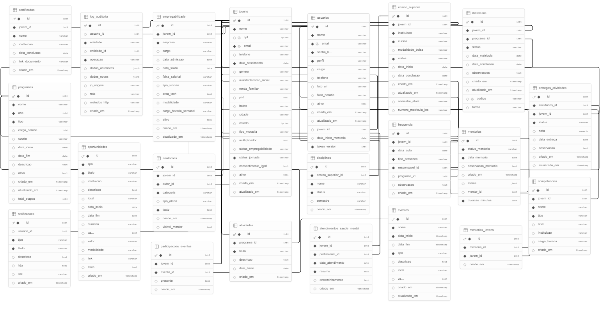<br>
  <sub> Fonte: Material produzido pelos autores (2026) </sub><br><br>
</div>

---

#### Conceitos Fundamentais do Modelo Relacional

Para garantir que esta seção seja compreensível independentemente do nível técnico do leitor, os três conceitos estruturais que sustentam o DER são detalhados a seguir.

**Chave primária (Primary Key — PK)** é o identificador único e imutável de cada registro dentro de uma tabela. Ela garante duas propriedades fundamentais: unicidade (não existem dois registros com o mesmo valor de PK) e não-nulidade (todo registro obrigatoriamente possui um valor de PK). No banco de dados da Pulse Mais, todas as 13 tabelas utilizam uma coluna `id` do tipo `SERIAL` (inteiro autoincrementado pelo SGBD) como chave primária. Isso significa que cada novo registro recebe automaticamente um identificador sequencial único (1, 2, 3, ...) que nunca se repete e nunca é reutilizado, mesmo que o registro original seja excluído. A PK é, portanto, a identidade permanente de um registro e o mecanismo pelo qual outras tabelas podem referenciá-lo de forma inequívoca.

**Chave estrangeira (Foreign Key — FK)** é o mecanismo que implementa os relacionamentos entre tabelas no modelo relacional. Quando uma tabela precisa referenciar um registro de outra tabela, ela armazena em uma de suas colunas o valor da PK desse registro externo, essa coluna é a chave estrangeira. Por exemplo, a tabela `frequencia` possui uma coluna `jovem_id` que armazena o `id` do jovem ao qual aquele registro de presença pertence. O banco de dados utiliza essa referência para garantir **integridade referencial**: não é possível registrar uma frequência para um jovem inexistente (a FK impede a inserção), assim como não é possível excluir um jovem que possua registros vinculados, a menos que a política de exclusão permita, como `CASCADE` (exclusão em cascata dos registros dependentes) ou `RESTRICT` (bloqueio da exclusão enquanto houver dependências).

**Cardinalidade** descreve a quantidade de registros que podem existir em cada lado de um relacionamento. As três formas fundamentais são: **1:1** (um para um), em que cada registro de uma tabela se relaciona com no máximo um registro da outra; **1:N** (um para muitos), em que um registro pode se relacionar com múltiplos registros do outro lado, mas cada registro do lado "muitos" pertence a apenas um do lado "um"; e **N:N** (muitos para muitos), em que registros de ambos os lados podem se relacionar com múltiplos registros do outro. No modelo relacional, relacionamentos N:N não podem ser implementados diretamente por chaves estrangeiras e exigem uma **tabela associativa** (também chamada de tabela de junção), no schema da Pulse Mais, é o caso de `matriculas` (resolvendo o N:N entre `jovens` e `programas`) e `participacoes_eventos` (resolvendo o N:N entre `jovens` e `eventos`).

---
 
#### Tabela explicativa do DER da Pulse Mais

| Tabela | PK | FKs | Tabelas que a referenciam | Cardinalidade | Políticas de exclusão | Observações |
| :--- | :--- | :--- | :--- | :--- | :--- | :--- |
| `usuarios` | `id` | `jovem_id` → `jovens.id` | `frequencia` (via `responsavel_id`), `anotacoes` (via `autor_id`), `atendimentos_saude_mental` (via `profissional_id`), `mentorias` (via `mentor_id`), `log_auditoria` (via `usuario_id`), `notificacoes` (via `usuario_id`) | 0:1 com `jovens`; 1:N com todas as tabelas que a referenciam | `jovem_id`: SET NULL ou RESTRICT | Representa usuários autenticados. O campo `jovem_id` permite associar opcionalmente um usuário a um jovem cadastrado, especialmente no Portal do Aluno ou em casos de ex-alunos mentores. Além dos dados de autenticação, a tabela armazena metadados operacionais como `token_version` (invalidação de JWT), `fuso_horario` e informações complementares de perfil, incluindo cargo e foto. |
| `jovens` | `id` | Nenhuma | `usuarios` (via `jovem_id`), `matriculas`, `frequencia`, `anotacoes`, `atendimentos_saude_mental`, `participacoes_eventos`, `mentorias_jovens`, `empregabilidade`, `ensino_superior`, `entregas_atividades`, `certificados`, `competencias` | Entidade central; 1:N com as tabelas que a referenciam; N:N com `programas`, `eventos`, `atividades` e `mentorias` via tabelas associativas | – | Tabela central do domínio, responsável por consolidar dados pessoais, socioeconômicos, acadêmicos, profissionais e indicadores de jornada, incluindo consentimento LGPD, status de empregabilidade e status da jornada. |
| `programas` | `id` | Nenhuma | `matriculas` (via `programa_id`), `frequencia` (via `programa_id`), `atividades` (via `programa_id`) | N:N com `jovens` via `matriculas`; 1:N com `atividades`; 1:N com `frequencia` | – | Representa os programas de formação da Pulse Mais. O campo `coorte` identifica a turma/edição do programa, enquanto `total_etapas` permite acompanhar a progressão formativa. |
| `matriculas` | `id` | `jovem_id` → `jovens.id`, `programa_id` → `programas.id` | – | N:N entre `jovens` e `programas`, mediado por esta tabela associativa; N:1 com cada lado | `jovem_id`: CASCADE; `programa_id`: RESTRICT ou CASCADE | Tabela associativa do N:N entre `jovens` e `programas`; recomenda-se constraint de unicidade em (`jovem_id`, `programa_id`). O campo `codigo` permite identificar unicamente a matrícula em contextos operacionais e administrativos. |
| `frequencia` | `id` | `jovem_id` → `jovens.id`, `responsavel_id` → `usuarios.id`, `programa_id` → `programas.id` | – | N:1 com `jovens`; N:1 com `usuarios`; N:1 com `programas` | `jovem_id`: CASCADE; `responsavel_id`: RESTRICT; `programa_id`: SET NULL ou CASCADE | Registra presença em atividades dos programas. O `responsavel_id` identifica quem lançou a frequência |
| `anotacoes` | `id` | `jovem_id` → `jovens.id`, `autor_id` → `usuarios.id` | – | N:1 com `jovens`; N:1 com `usuarios` | `jovem_id`: CASCADE; `autor_id`: RESTRICT | Registra observações qualitativas sobre os jovens. O campo `visivel_mentor` controla se a anotação pode ser exibida para mentores |
| `atendimentos_saude_mental` | `id` | `jovem_id` → `jovens.id`, `profissional_id` → `usuarios.id` | – | N:1 com `jovens`; N:1 com `usuarios` | `jovem_id`: CASCADE; `profissional_id`: RESTRICT | Tabela sensível do schema, com acesso restrito a perfis autorizados conforme regras de privacidade e LGPD |
| `eventos` | `id` | Nenhuma | `participacoes_eventos` (via `evento_id`) | N:N com `jovens` via `participacoes_eventos` | – | Registra eventos institucionais promovidos pela Pulse Mais. Também armazena o limite de vagas disponíveis para controle de inscrições. |
| `participacoes_eventos` | `id` | `jovem_id` → `jovens.id`, `evento_id` → `eventos.id` | – | N:N entre `jovens` e `eventos`, mediado por esta tabela associativa; N:1 com cada lado | `jovem_id`: CASCADE; `evento_id`: CASCADE | Tabela associativa do N:N entre `jovens` e `eventos`; recomenda-se constraint de unicidade em (`jovem_id`, `evento_id`) |
| `mentorias` | `id` | `mentor_id` → `usuarios.id` | `mentorias_jovens` (via `mentoria_id`) | N:1 com `usuarios`; N:N com `jovens` via `mentorias_jovens` | `mentor_id`: RESTRICT | Registra sessões de mentoria, incluindo status, duração, temas abordados e observações qualitativas do mentor. O vínculo com jovens não é mais direto; é resolvido pela tabela `mentorias_jovens` |
| `mentorias_jovens` | `id` | `mentoria_id` → `mentorias.id`, `jovem_id` → `jovens.id` | – | N:N entre `jovens` e `mentorias`, mediado por esta tabela associativa; N:1 com cada lado | `mentoria_id`: CASCADE; `jovem_id`: CASCADE | Tabela associativa que permite que uma mentoria tenha múltiplos jovens e que um jovem participe de múltiplas mentorias |
| `empregabilidade` | `id` | `jovem_id` → `jovens.id` | – | N:1 com `jovens` | `jovem_id`: CASCADE | Registra vínculos profissionais dos jovens. O campo `ativo` diferencia vínculo atual de registros históricos |
| `ensino_superior` | `id` | `jovem_id` → `jovens.id` | `disciplinas` (via `ensino_superior_id`) | N:1 com `jovens`; 1:N com `disciplinas` | `jovem_id`: CASCADE | Registra a trajetória do jovem no ensino superior, incluindo curso, instituição, status, semestre atual e número de matrícula na IES |
| `disciplinas` | `id` | `ensino_superior_id` → `ensino_superior.id` | – | N:1 com `ensino_superior` | `ensino_superior_id`: CASCADE | Detalha as disciplinas vinculadas a um registro de ensino superior |
| `log_auditoria` | `id` | `usuario_id` → `usuarios.id` | – | N:1 com `usuarios` | `usuario_id`: SET NULL | Registros de auditoria não devem ser editados nem excluídos. Caso o usuário seja removido, o histórico da ação deve ser preservado. Também registra rota e método HTTP da requisição para auditoria detalhada. |
| `atividades` | `id` | `programa_id` → `programas.id` | `entregas_atividades` (via `atividades_id`) | N:1 com `programas`; 1:N com `entregas_atividades` | `programa_id`: CASCADE | Registra atividades pedagógicas vinculadas a programas de formação |
| `entregas_atividades` | `id` | `atividades_id` → `atividades.id`, `jovem_id` → `jovens.id` | – | N:N entre `jovens` e `atividades`, mediado por esta tabela associativa; N:1 com cada lado | `atividades_id`: CASCADE; `jovem_id`: CASCADE | Tabela associativa do N:N entre `jovens` e `atividades`; recomenda-se constraint de unicidade em (`atividades_id`, `jovem_id`) |
| `notificacoes` | `id` | `usuario_id` → `usuarios.id` | – | N:1 com `usuarios` | `usuario_id`: CASCADE ou SET NULL | `usuario_id` é nullable; quando NULL, a notificação funciona como broadcast para todos os usuários. O campo `lida` controla o estado de leitura da notificação e `link` permite navegação contextual no frontend. |
| `certificados` | `id` | `jovem_id` → `jovens.id` | – | N:1 com `jovens` | `jovem_id`: CASCADE | Registra certificados, cursos e formações concluídas pelos jovens |
| `competencias` | `id` | `jovem_id` → `jovens.id` | – | N:1 com `jovens` | `jovem_id`: CASCADE | Registra competências técnicas e comportamentais desenvolvidas pelos jovens |
| `oportunidades` | `id` | Nenhuma | Nenhuma | N:N conceitual com `usuarios` por visualização, não materializado no DER físico | – | Funciona como catálogo de oportunidades visível aos usuários. Como as visualizações não são persistidas no banco, não há FK ou tabela associativa |
 
 Com o Modelo ER definindo o que existe no domínio e o DER traduzindo essas abstrações em tabelas, colunas e chaves estrangeiras concretas, a estrutura lógica do banco de dados da Pulse Mais está formalmente especificada e validada. Cada entidade do MER encontra correspondência direta em uma tabela do DER; cada relacionamento persistido foi materializado por uma FK com política de integridade referencial documentada; e os relacionamentos N:N do domínio (`jovens ↔ programas`, `jovens ↔ eventos`, `jovens ↔ atividades` e `jovens ↔ mentorias_jovens ↔ mentorias`) foram resolvidos por tabelas associativas com recomendação de constraints de unicidade.

Além disso, o DER atualizado incorpora entidades complementares à jornada acadêmica e profissional dos jovens, como `certificados`, `competencias`, `disciplinas` e `oportunidades`. As três primeiras possuem vínculos diretos com entidades centrais do domínio por meio de chaves estrangeiras, enquanto `oportunidades` permanece como catálogo independente no modelo físico, embora se relacione conceitualmente com os usuários por meio da visualização da área de oportunidades na plataforma.

A próxima etapa natural dessa progressão é a seção 3.6.3, que converte o DER em código SQL executável, por meio de migrations DDL numeradas e reproduzíveis. Nessa etapa, o modelo lógico é materializado com tipos de dados concretos, constraints, índices de performance e estratégias de armazenamento otimizadas para PostgreSQL via Supabase.

---

### <a name="c3.6.3"></a>3.6.3. Modelo Relacional e Modelo Físico
Esta seção apresenta o modelo relacional e o modelo físico do banco de dados da plataforma Pulse Mais, implementados por meio de migrations DDL numeradas e reproduzíveis. O modelo relacional descreve a estrutura lógica dos dados: quais entidades existem, como se relacionam e quais restrições governam sua integridade; enquanto o modelo físico materializa essas abstrações em definições SQL executáveis, incluindo tipos de dados, constraints, índices e estratégias de armazenamento otimizadas para o SGBD adotado.

Após as atualizações realizadas no domínio, o schema passou a contemplar novas entidades relacionadas à jornada acadêmica, profissional e formativa dos jovens, como `certificados`, `competencias`, `disciplinas`, `mentorias_jovens` e `oportunidades`. Além disso, entidades já existentes foram refinadas para refletir melhor a implementação atual, como `usuarios`, que passou a possuir associação opcional com `jovens` por meio de `jovem_id`, `programas`, que passou a registrar `total_etapas`, `ensino_superior`, que passou a detalhar informações como `semestre_atual` e `numero_matricula_ies`, e `mentorias`, que foi normalizada para se relacionar com `jovens` por meio da tabela associativa `mentorias_jovens`.

O schema atualizado foi organizado em **34 arquivos de migration** numerados sequencialmente. Esses arquivos não representam 34 tabelas distintas, pois parte deles corresponde à criação inicial das entidades e outra parte corresponde a ajustes incrementais realizados ao longo das sprints, como adição de colunas, criação de índices, inclusão de chaves estrangeiras, refinamento de constraints, normalização de relacionamentos e correção de estruturas legadas. Dessa forma, o modelo físico documentado nesta seção representa o **estado final consolidado do banco de dados**, composto por **21 tabelas principais** efetivamente utilizadas pela aplicação.

As migrations foram projetadas para execução consistente e incremental. As tabelas raiz são criadas primeiro, seguidas das tabelas dependentes de chaves estrangeiras, das tabelas associativas e, por fim, das migrations de refinamento, responsáveis por acrescentar campos, ajustar relacionamentos e consolidar a estrutura final do banco. Essa abordagem garante rastreabilidade da evolução do schema ao longo das sprints e permite compreender não apenas o estado atual do banco, mas também o processo de amadurecimento da modelagem.

As convenções adotadas seguem padrões amplamente aceitos no mercado:

* **Nomenclatura:** tabelas em `snake_case` no plural (ex.: `jovens`, `matriculas`, `participacoes_eventos`), colunas em `snake_case` no singular (ex.: `jovem_id`, `data_matricula`, `ensino_superior_id`). Chaves estrangeiras seguem o padrão `<entidade_referenciada>_id`.
* **Chaves primárias:** `SERIAL PRIMARY KEY` em todas as tabelas, garantindo IDs autoincrementais e sem colisão.
* **Timestamps:** todas as tabelas possuem `criado_em TIMESTAMP DEFAULT CURRENT_TIMESTAMP`. Tabelas sujeitas a edição possuem também `atualizado_em`.
* **Soft delete:** campos `ativo BOOLEAN DEFAULT TRUE` são utilizados nas entidades que não devem ser excluídas fisicamente, preservando integridade referencial e histórico para auditoria.
* **Enums via CHECK:** em vez de tabelas auxiliares, os valores enumerados são controlados por constraints `CHECK (<nome_atributo> IN (...))`, o que simplifica o schema do MVP sem sacrificar a validação. Essa decisão é deliberada para o escopo acadêmico; em produção, seria avaliada a migração para tabelas de referência ou tipos `ENUM` nativos.
* **Tabelas associativas:** relacionamentos N:N são resolvidos por tabelas intermediárias com atributos próprios quando necessário, como `matriculas`, `participacoes_eventos`, `entregas_atividades` e `mentorias_jovens`.
* **Relacionamentos conceituais não materializados:** a entidade `oportunidades` é mantida como tabela independente no modelo físico, pois não possui chave estrangeira nos models atuais. No MER, entretanto, ela se relaciona conceitualmente com `usuarios`, uma vez que representa uma área da plataforma visualizada pelos usuários autenticados.

O diagrama a seguir sintetiza a ordem de dependência entre as migrations e evidencia que algumas migrations criam tabelas, enquanto outras apenas refinam estruturas já existentes:

<div align="center">
<sub>Grafo de dependências das migrations</sub>

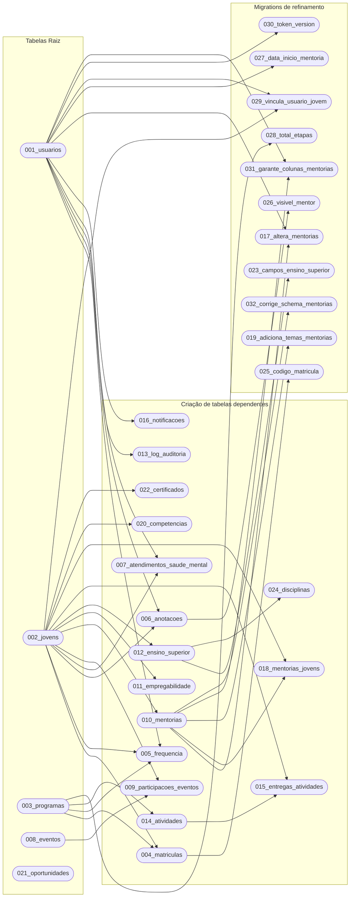
```mermaid
flowchart LR
    subgraph Raiz["Tabelas Raiz"]
        T001([001_usuarios])
        T002([002_jovens])
        T003([003_programas])
        T008([008_eventos])
        T021([021_oportunidades])
    end

    subgraph Criacao["Criação de tabelas dependentes"]
        T004([004_matriculas])
        T005([005_frequencia])
        T006([006_anotacoes])
        T007([007_atendimentos_saude_mental])
        T009([009_participacoes_eventos])
        T010([010_mentorias])
        T011([011_empregabilidade])
        T012([012_ensino_superior])
        T013([013_log_auditoria])
        T014([014_atividades])
        T015([015_entregas_atividades])
        T016([016_notificacoes])
        T018([018_mentorias_jovens])
        T020([020_competencias])
        T022([022_certificados])
        T024([024_disciplinas])
    end

    subgraph Refinamento["Migrations de refinamento"]
        T017([017_altera_mentorias])
        T019([019_adiciona_temas_mentorias])
        T023([023_campos_ensino_superior])
        T025([025_codigo_matricula])
        T026([026_visivel_mentor])
        T027([027_data_inicio_mentoria])
        T028([028_total_etapas])
        T029([029_vincula_usuario_jovem])
        T030([030_token_version])
        T031([031_garante_colunas_mentorias])
        T032([032_corrige_schema_mentorias])
    end

    T001 --> T005 & T006 & T007 & T013 & T016
    T001 --> T017 & T027 & T029 & T030 & T031

    T002 --> T004 & T005 & T006 & T007 & T009 & T010 & T011 & T012 & T015 & T018 & T020 & T022 & T029

    T003 --> T004 & T005 & T014 & T028
    T008 --> T009

    T010 --> T017 & T018 & T019 & T031 & T032

    T012 --> T023 & T024
    T004 --> T025
    T006 --> T026
    T014 --> T015
```

<sup>Fonte: Material produzido pelos autores (2026).</sup>

</div>

No grafo, `usuarios`, `jovens`, `programas`, `eventos` e `oportunidades` aparecem como tabelas de base do domínio. A tabela `jovens` ocupa posição central por ser referenciada por diversas áreas do sistema, incluindo `frequencia`, `anotacoes`, `atendimentos_saude_mental`, `empregabilidade`, `ensino_superior`, `certificados`, `competencias`, `matriculas`, `participacoes_eventos`, `entregas_atividades` e `mentorias_jovens`. A tabela `usuarios`, por sua vez, representa os indivíduos autenticados na plataforma e é referenciada por registros que exigem autoria, responsabilidade ou rastreabilidade, como `anotacoes`, `frequencia`, `atendimentos_saude_mental`, `mentorias`, `log_auditoria` e `notificacoes`.

Os relacionamentos N:N do domínio foram resolvidos por tabelas associativas. A relação entre `jovens` e `programas` é materializada por `matriculas`; a relação entre `jovens` e `eventos` é materializada por `participacoes_eventos`; a relação entre `jovens` e `atividades` é materializada por `entregas_atividades`; e a relação entre `jovens` e `mentorias` é materializada por `mentorias_jovens`. Essas tabelas associativas permitem armazenar atributos próprios de cada vínculo, como status, datas, presença, nota ou observações, evitando redundância e preservando a normalização do modelo.

A entidade `oportunidades` foi mantida sem chaves estrangeiras no modelo físico, pois o sistema atual apenas disponibiliza oportunidades para visualização dos usuários, sem persistir quais usuários visualizaram cada item. Assim, sua relação com `usuarios` é conceitual no MER, mas não materializada no DER. Caso uma evolução futura exija rastreamento de visualizações, interesses ou candidaturas, esse relacionamento poderá ser materializado por uma tabela associativa específica, como `usuarios_oportunidades` ou `jovens_oportunidades`.

Com o modelo físico atualizado, a estrutura do banco passa a refletir com maior precisão a versão atual da aplicação Pulse Mais, contemplando tanto o acompanhamento institucional dos jovens quanto suas dimensões acadêmicas, profissionais, comportamentais e formativas.

A seguir, cada tabela é documentada individualmente com seu propósito no domínio, o código DDL consolidado a partir das migrations e as decisões de modelagem relevantes. Embora o projeto possua **34 arquivos de migration**, o modelo físico final é composto por **21 tabelas principais**, pois parte das migrations realiza ajustes incrementais em tabelas já existentes, como adição de colunas, normalização de relacionamentos, criação de índices e correção de estruturas legadas.

---

#### 1. `usuarios` — Usuários do Sistema

Tabela raíz que armazena todos os usuários autenticados da plataforma, incluindo equipe interna, jovens com acesso ao Portal do Aluno e mentores. É a entidade central de controle de acesso: o campo `perfil` define o escopo de permissões de cada usuário, enquanto `token_version` apoia mecanismos de invalidação de sessão. O campo `jovem_id` permite associar opcionalmente um usuário autenticado ao respectivo registro da tabela `jovens`.

**Migrations relacionadas:** `001_create_usuarios.sql`, `027_add_data_inicio_mentoria.sql`, `029_vincula_usuario_ao_jovem.sql`, `030_add_token_version.sql`

```sql
CREATE TABLE IF NOT EXISTS usuarios (
    id SERIAL PRIMARY KEY,
    nome VARCHAR(150) NOT NULL,
    email VARCHAR(255) UNIQUE NOT NULL,
    senha_hash VARCHAR(255) NOT NULL,
    perfil VARCHAR(20) NOT NULL CHECK (perfil IN (
        'GestaoGeral',
        'Coordenacao',
        'Assistente',
        'Psicologa',
        'Aluno',
        'Mentor'
    )),
    cargo VARCHAR(100),
    telefone VARCHAR(20),
    foto_url VARCHAR(500),
    fuso_horario VARCHAR(50) DEFAULT 'America/Sao_Paulo',
    ativo BOOLEAN DEFAULT TRUE,
    criado_em TIMESTAMP DEFAULT CURRENT_TIMESTAMP,
    atualizado_em TIMESTAMP DEFAULT CURRENT_TIMESTAMP,
    data_inicio_mentoria DATE,
    jovem_id INTEGER REFERENCES jovens(id) ON DELETE SET NULL,
    token_version INTEGER NOT NULL DEFAULT 1
);

CREATE INDEX IF NOT EXISTS idx_usuarios_email ON usuarios(email);
CREATE INDEX IF NOT EXISTS idx_usuarios_jovem ON usuarios(jovem_id);
```

**Decisões de modelagem:**

* O campo `senha_hash` armazena o hash da senha, nunca a senha em texto claro, atendendo à regra de segurança que impede armazenamento de credenciais sensíveis em formato legível.
* O campo `perfil` funciona como enum via `CHECK`, garantindo que apenas perfis válidos sejam persistidos. A autorização detalhada, entretanto, é aplicada na camada de backend.
* O perfil `Mentor` foi incorporado para representar usuários que acompanham jovens em sessões de mentoria.
* O campo `jovem_id` é opcional e permite vincular usuários do tipo `Aluno` ou ex-alunos mentores aos registros da tabela `jovens`.
* O uso de `ON DELETE SET NULL` em `jovem_id` preserva o usuário caso o vínculo com o jovem seja removido.
* O campo `token_version` permite invalidar tokens antigos, apoiando fluxos como logout geral ou renovação de sessão.
* O campo `data_inicio_mentoria` registra quando um usuário com perfil de mentor começou a atuar no programa.
* O índice em `email` otimiza o fluxo de login, enquanto o índice em `jovem_id` otimiza consultas do Portal do Aluno e rotas do tipo `/me`.

---

#### 2. `jovens` — Jovens Atendidos

Entidade central do domínio da Pulse Mais. Armazena dados pessoais, demográficos, socioeconômicos e de jornada dos jovens acompanhados pela instituição. É a tabela mais referenciada do schema, pois serve como base para frequência, anotações, atendimentos, matrículas, mentorias, empregabilidade, ensino superior, certificados, competências, entregas de atividades e participação em eventos.

**Migration:** `002_create_jovens.sql`

```sql
CREATE TABLE IF NOT EXISTS jovens (
    id SERIAL PRIMARY KEY,
    nome VARCHAR(200) NOT NULL,
    cpf CHAR(11) UNIQUE,
    email VARCHAR(255) UNIQUE NOT NULL,
    telefone VARCHAR(20),
    data_nascimento DATE NOT NULL,
    genero VARCHAR(30) CHECK (genero IN (
        'Masculino',
        'Feminino',
        'Prefiro_nao_informar'
    )),
    autodeclaracao_racial VARCHAR(30) CHECK (autodeclaracao_racial IN (
        'Branca',
        'Preta',
        'Parda',
        'Indígena',
        'Prefiro_nao_informar'
    )),
    renda_familiar VARCHAR(50),
    pcd BOOLEAN DEFAULT FALSE,
    bairro VARCHAR(100),
    cidade VARCHAR(100),
    estado CHAR(2),
    tipo_moradia VARCHAR(50) CHECK (tipo_moradia IN (
        'Propria', 'Alugada', 'Cedida', 'Financiada', 'Outros'
    )),
    multiplicador BOOLEAN DEFAULT FALSE,
    status_empregabilidade VARCHAR(30) CHECK (status_empregabilidade IN (
        'Empregado', 'Em_formacao', 'Buscando', 'Empreendedor', 'Inativo'
    )),
    status_jornada VARCHAR(50) NOT NULL CHECK (status_jornada IN (
        'Conectado',
        'Capacitado',
        'Transformado',
        'Conectado_Capacitado',
        'Capacitado_Transformado',
        'Conectado_Capacitado_Transformado'
    )),
    consentimento_lgpd BOOLEAN DEFAULT FALSE,
    ativo BOOLEAN DEFAULT TRUE,
    criado_em TIMESTAMP DEFAULT CURRENT_TIMESTAMP,
    atualizado_em TIMESTAMP DEFAULT CURRENT_TIMESTAMP
);

CREATE INDEX IF NOT EXISTS idx_jovens_status_jornada ON jovens(status_jornada);
CREATE INDEX IF NOT EXISTS idx_jovens_cpf ON jovens(cpf);
CREATE INDEX IF NOT EXISTS idx_jovens_nome ON jovens(nome);
CREATE INDEX IF NOT EXISTS idx_jovens_cidade ON jovens(cidade);
CREATE INDEX IF NOT EXISTS idx_jovens_multiplicador ON jovens(multiplicador);
CREATE INDEX IF NOT EXISTS idx_jovens_status_empregabilidade ON jovens(status_empregabilidade);
```

**Decisões de modelagem:**

* O CPF é armazenado como `CHAR(11)` para guardar apenas dígitos, sem máscara visual.
* O campo `email` é único e obrigatório, pois também pode servir como identificador de contato e associação com acessos do Portal do Aluno.
* Os campos `bairro`, `cidade` e `estado` armazenam dados de localização do jovem sem exigir uma tabela auxiliar de endereços, simplificando o MVP.
* O campo `multiplicador` identifica jovens que retornam ao ecossistema como agentes de transformação.
* O campo `status_empregabilidade` registra a situação profissional vigente, enquanto a tabela `empregabilidade` armazena o histórico detalhado.
* O campo `status_jornada` representa o estágio do jovem na jornada de acompanhamento da Pulse Mais.
* O campo `consentimento_lgpd` registra se há consentimento para tratamento dos dados.
* Os índices criados atendem aos principais filtros de busca, listagem e segmentação utilizados na interface e nos dashboards.

---

#### 3. `programas` — Programas Oferecidos

Registra os programas de formação oferecidos pela Pulse Mais, como cursos, mentorias estruturadas, projetos e eventos recorrentes. Relaciona-se com `jovens` por meio de `matriculas`, com `frequencia` por meio de `programa_id` e com `atividades` por meio de FK direta.

**Migrations relacionadas:** `003_create_programas.sql`, `028_add_total_etapas.sql`

```sql
CREATE TABLE IF NOT EXISTS programas (
    id SERIAL PRIMARY KEY,
    nome VARCHAR(200) NOT NULL,
    ano INTEGER NOT NULL,
    tipo VARCHAR(50) NOT NULL CHECK (tipo IN (
        'Curso',
        'Mentoria',
        'Projeto',
        'Evento_Recorrente'
    )),
    carga_horaria INTEGER,
    coorte VARCHAR(20),
    data_inicio DATE,
    data_fim DATE,
    descricao TEXT,
    ativo BOOLEAN DEFAULT TRUE,
    criado_em TIMESTAMP DEFAULT CURRENT_TIMESTAMP,
    atualizado_em TIMESTAMP DEFAULT CURRENT_TIMESTAMP,
    total_etapas INTEGER DEFAULT 5
);

CREATE INDEX IF NOT EXISTS idx_programas_ano ON programas(ano);
CREATE INDEX IF NOT EXISTS idx_programas_tipo ON programas(tipo);
CREATE INDEX IF NOT EXISTS idx_programas_coorte ON programas(coorte);
```

**Decisões de modelagem:**

* O campo `ano` permite segmentar programas por período.
* O campo `tipo` classifica a natureza do programa, como curso, mentoria, projeto ou evento recorrente.
* O campo `coorte` identifica o ciclo do programa, como `2025.2` ou `2026.1`.
* Os campos `data_inicio` e `data_fim` permitem identificar programas futuros, em andamento ou finalizados.
* O campo `total_etapas` registra quantas etapas compõem a jornada do programa, apoiando visualizações de progresso.
* Os índices em `ano`, `tipo` e `coorte` otimizam filtros frequentes no dashboard e nas telas de gestão.

---

#### 4. `matriculas` — Associação Jovem ↔ Programa

Tabela associativa que implementa o relacionamento N:N entre `jovens` e `programas`, armazenando atributos próprios da associação, como status da matrícula, datas, observações e código identificador.

**Migrations relacionadas:** `004_create_matriculas.sql`, `025_add_codigo_matricula.sql`

```sql
CREATE TABLE IF NOT EXISTS matriculas (
    id SERIAL PRIMARY KEY,
    jovem_id INTEGER NOT NULL,
    programa_id INTEGER NOT NULL,
    status VARCHAR(30) NOT NULL DEFAULT 'Ativo' CHECK (status IN (
        'Ativo',
        'Concluido',
        'Evadido',
        'Trancado'
    )),
    data_matricula DATE DEFAULT CURRENT_DATE,
    data_conclusao DATE,
    observacoes TEXT,
    criado_em TIMESTAMP DEFAULT CURRENT_TIMESTAMP,
    atualizado_em TIMESTAMP DEFAULT CURRENT_TIMESTAMP,
    codigo VARCHAR(20) UNIQUE,

    CONSTRAINT fk_matriculas_jovem
        FOREIGN KEY (jovem_id) REFERENCES jovens(id) ON DELETE CASCADE,
    CONSTRAINT fk_matriculas_programa
        FOREIGN KEY (programa_id) REFERENCES programas(id) ON DELETE RESTRICT,
    CONSTRAINT uq_matricula_jovem_programa
        UNIQUE (jovem_id, programa_id)
);

CREATE INDEX IF NOT EXISTS idx_matriculas_jovem ON matriculas(jovem_id);
CREATE INDEX IF NOT EXISTS idx_matriculas_programa ON matriculas(programa_id);
CREATE INDEX IF NOT EXISTS idx_matriculas_status ON matriculas(status);
```

**Decisões de modelagem:**

* A tabela resolve o relacionamento N:N entre jovens e programas.
* A constraint `UNIQUE (jovem_id, programa_id)` impede matrícula duplicada do mesmo jovem no mesmo programa.
* `ON DELETE CASCADE` em `jovem_id` remove matrículas associadas caso o jovem seja removido.
* `ON DELETE RESTRICT` em `programa_id` impede excluir programas que ainda possuem matrículas vinculadas.
* O campo `status` representa o ciclo de vida da matrícula.
* O campo `codigo` permite uma identificação visual ou administrativa da matrícula.

---

#### 5. `frequencia` — Registro de Presença

Registra a presença dos jovens em atividades dos programas, com indicação do jovem, data, tipo de presença, responsável pelo lançamento e programa associado.

**Migration:** `005_create_frequencias.sql`

```sql
CREATE TABLE IF NOT EXISTS frequencia (
    id SERIAL PRIMARY KEY,
    jovem_id INTEGER NOT NULL,
    data_aula DATE NOT NULL,
    tipo_presenca VARCHAR(20) NOT NULL CHECK (tipo_presenca IN (
        'Presencial',
        'Gravacao',
        'Ausente'
    )),
    responsavel_id INTEGER NOT NULL,
    programa_id INTEGER,
    observacao TEXT,
    criado_em TIMESTAMP DEFAULT CURRENT_TIMESTAMP,

    CONSTRAINT fk_frequencias_jovem
        FOREIGN KEY (jovem_id) REFERENCES jovens(id) ON DELETE CASCADE,
    CONSTRAINT fk_frequencias_responsavel
        FOREIGN KEY (responsavel_id) REFERENCES usuarios(id) ON DELETE RESTRICT,
    CONSTRAINT fk_frequencia_programa
        FOREIGN KEY (programa_id) REFERENCES programas(id) ON DELETE CASCADE
);

CREATE INDEX IF NOT EXISTS idx_frequencias_jovem ON frequencia(jovem_id);
CREATE INDEX IF NOT EXISTS idx_frequencias_data_aula ON frequencia(data_aula);
CREATE INDEX IF NOT EXISTS idx_frequencias_programa ON frequencia(programa_id);
```

**Decisões de modelagem:**

* O campo `tipo_presenca` diferencia presença presencial, gravação assistida e ausência.
* O campo `responsavel_id` identifica o usuário que registrou a frequência, garantindo rastreabilidade.
* A FK `responsavel_id` usa `ON DELETE RESTRICT`, impedindo a exclusão de usuários que já realizaram lançamentos.
* O campo `programa_id` é nullable, permitindo acomodar registros sem associação a programa específico.
* Os índices em `jovem_id`, `data_aula` e `programa_id` otimizam consultas por jovem, período e programa.

---

#### 6. `anotacoes` — Anotações Qualitativas

Armazena registros textuais vinculados ao acompanhamento do jovem, como observações pedagógicas, evoluções gerais, registros acadêmicos e anotações de mentoria. A tabela é separada de `atendimentos_saude_mental`, pois registros clínicos possuem controle de acesso mais restrito.

**Migrations relacionadas:** `006_create_anotacoes.sql`, `026_add_visivel_mentor.sql`

```sql
CREATE TABLE IF NOT EXISTS anotacoes (
    id SERIAL PRIMARY KEY,
    jovem_id INTEGER NOT NULL,
    autor_id INTEGER NOT NULL,
    categoria VARCHAR(30) NOT NULL CHECK (categoria IN (
        'Mentoria',
        'Atendimento',
        'Evolucao_Geral',
        'Academico',
        'Outro'
    )),
    tipo_alerta VARCHAR(20) DEFAULT 'Geral' CHECK (tipo_alerta IN (
        'Alerta',
        'Conquista',
        'Geral'
    )),
    texto TEXT NOT NULL,
    criado_em TIMESTAMP DEFAULT CURRENT_TIMESTAMP,
    visivel_mentor BOOLEAN DEFAULT FALSE,

    CONSTRAINT fk_anotacoes_jovem
        FOREIGN KEY (jovem_id) REFERENCES jovens(id) ON DELETE CASCADE,
    CONSTRAINT fk_anotacoes_autor
        FOREIGN KEY (autor_id) REFERENCES usuarios(id) ON DELETE RESTRICT
);

CREATE INDEX IF NOT EXISTS idx_anotacoes_jovens ON anotacoes(jovem_id);
CREATE INDEX IF NOT EXISTS idx_anotacoes_categoria ON anotacoes(categoria);
CREATE INDEX IF NOT EXISTS idx_anotacoes_tipo_alerta ON anotacoes(tipo_alerta);
CREATE INDEX IF NOT EXISTS idx_anotacoes_criado_em ON anotacoes(criado_em);
```

**Decisões de modelagem:**

* O campo `autor_id` registra o usuário responsável pela anotação.
* O campo `categoria` permite classificar o tipo de anotação.
* O campo `tipo_alerta` permite diferenciar registros gerais, alertas e conquistas.
* O campo `visivel_mentor` controla se determinada anotação poderá ser exibida para usuários com perfil de mentor.
* A separação entre `anotacoes` e `atendimentos_saude_mental` reduz risco de exposição indevida de informações sensíveis.
* O índice em `criado_em` apoia a exibição cronológica do histórico do jovem.

---

#### 7. `atendimentos_saude_mental` — Atendimentos de Saúde Mental

Tabela segregada que armazena registros de atendimento psicológico realizados por profissionais autorizados. Contém informações sensíveis e, por isso, seu acesso deve ser controlado pela camada de autenticação e autorização da aplicação.

**Migration:** `007_create_atendimentos_saude_mental.sql`

```sql
CREATE TABLE IF NOT EXISTS atendimentos_saude_mental (
    id SERIAL PRIMARY KEY,
    jovem_id INTEGER NOT NULL,
    profissional_id INTEGER NOT NULL,
    data_atendimento DATE NOT NULL,
    resumo TEXT NOT NULL,
    encaminhamento TEXT,
    criado_em TIMESTAMP DEFAULT CURRENT_TIMESTAMP,

    CONSTRAINT fk_atend_sm_jovem
        FOREIGN KEY (jovem_id) REFERENCES jovens(id) ON DELETE CASCADE,
    CONSTRAINT fk_atend_sm_profissional
        FOREIGN KEY (profissional_id) REFERENCES usuarios(id) ON DELETE RESTRICT
);

CREATE INDEX IF NOT EXISTS idx_atend_sm_jovem ON atendimentos_saude_mental(jovem_id);
```

**Decisões de modelagem:**

* O campo `jovem_id` vincula o atendimento ao jovem acompanhado.
* O campo `profissional_id` identifica o usuário que realizou o atendimento.
* A FK do profissional usa `ON DELETE RESTRICT`, preservando a rastreabilidade dos atendimentos realizados.
* O campo `encaminhamento` é nullable porque nem todo atendimento gera encaminhamento.
* O acesso a essa tabela é restrito na camada de aplicação, não diretamente por regra de banco.
* A separação física dessa tabela facilita o controle de acesso e reduz risco de vazamento em consultas genéricas.

---

#### 8. `eventos` — Eventos Institucionais

Registra eventos institucionais promovidos pela Pulse Mais, como workshops, palestras, encontros da rede e eventos tech. Relaciona-se com `jovens` por meio da tabela associativa `participacoes_eventos`.

**Migration:** `008_create_eventos.sql`

```sql
CREATE TABLE IF NOT EXISTS eventos (
    id SERIAL PRIMARY KEY,
    nome VARCHAR(200) NOT NULL,
    data_inicio TIMESTAMP NOT NULL,
    data_fim TIMESTAMP,
    tipo VARCHAR(50) NOT NULL CHECK (tipo IN (
        'Eventos_Tech',
        'Pulse_Mais',
        'Encontro_Rede',
        'Workshop',
        'Palestra',
        'Outro'
    )),
    descricao TEXT,
    local VARCHAR(200),
    vagas INTEGER,
    criado_em TIMESTAMP DEFAULT CURRENT_TIMESTAMP,
    atualizado_em TIMESTAMP DEFAULT CURRENT_TIMESTAMP
);

CREATE INDEX IF NOT EXISTS idx_eventos_data ON eventos(data_inicio);
CREATE INDEX IF NOT EXISTS idx_eventos_tipo ON eventos(tipo);
```

**Decisões de modelagem:**

* Os campos `data_inicio` e `data_fim` usam `TIMESTAMP`, permitindo registrar data e hora.
* O campo `data_fim` é nullable para eventos sem horário de encerramento definido.
* O campo `tipo` categoriza os eventos e permite filtros.
* O campo `vagas` registra capacidade máxima, sendo nullable para eventos sem limite de participantes.
* O campo `local` é textual, pois os eventos podem ocorrer em diferentes espaços físicos ou virtuais.
* Os índices em `data_inicio` e `tipo` otimizam filtros por período e categoria.

---

#### 9. `participacoes_eventos` — Participação em Eventos

Tabela associativa que implementa o relacionamento N:N entre `jovens` e `eventos`, registrando também se o jovem esteve presente.

**Migration:** `009_create_participacoes_evento.sql`

```sql
CREATE TABLE IF NOT EXISTS participacoes_eventos (
    id SERIAL PRIMARY KEY,
    jovem_id INTEGER NOT NULL,
    evento_id INTEGER NOT NULL,
    presente BOOLEAN DEFAULT TRUE,
    criado_em TIMESTAMP DEFAULT CURRENT_TIMESTAMP,

    CONSTRAINT fk_part_evento_jovem
        FOREIGN KEY (jovem_id) REFERENCES jovens(id) ON DELETE CASCADE,
    CONSTRAINT fk_part_evento_evento
        FOREIGN KEY (evento_id) REFERENCES eventos(id) ON DELETE CASCADE,
    CONSTRAINT uq_participacao_jovem_evento
        UNIQUE (jovem_id, evento_id)
);

CREATE INDEX IF NOT EXISTS idx_part_evento_jovem ON participacoes_eventos(jovem_id);
CREATE INDEX IF NOT EXISTS idx_part_evento_evento ON participacoes_eventos(evento_id);
```

**Decisões de modelagem:**

* A tabela resolve o relacionamento N:N entre jovens e eventos.
* O campo `presente` diferencia inscrição/registro de participação efetiva.
* A constraint `UNIQUE (jovem_id, evento_id)` impede duplicidade de participação do mesmo jovem no mesmo evento.
* As duas FKs usam `ON DELETE CASCADE`, removendo automaticamente registros associativos quando jovem ou evento são removidos.

---

#### 10. `mentorias` — Sessões de Mentoria

Registra sessões de mentoria conduzidas por usuários com perfil de mentor. Após as migrations de normalização, a tabela deixou de armazenar diretamente o jovem mentorado e passou a se relacionar com `jovens` por meio da tabela associativa `mentorias_jovens`.

**Migrations relacionadas:** `010_create_mentorias.sql`, `017_alter_mentorias.sql`, `019_add_temas_mentorias.sql`, `031_fix_mentorias_mentor_id.sql`, `032_fix_mentorias_schema.sql`

```sql
CREATE TABLE IF NOT EXISTS mentorias (
    id SERIAL PRIMARY KEY,
    status_mentoria VARCHAR(30) NOT NULL CHECK (status_mentoria IN (
        'Agendada',
        'Realizada',
        'Cancelada'
    )),
    data_mentoria DATE NOT NULL,
    observacao_mentoria TEXT,
    criado_em TIMESTAMP DEFAULT CURRENT_TIMESTAMP,
    mentor_id INTEGER REFERENCES usuarios(id) ON DELETE RESTRICT,
    duracao_minutos INTEGER NOT NULL DEFAULT 0,
    temas TEXT[] DEFAULT '{}'
);

CREATE INDEX IF NOT EXISTS idx_mentorias_data ON mentorias(data_mentoria);
CREATE INDEX IF NOT EXISTS idx_mentorias_mentor_id ON mentorias(mentor_id);
```

**Decisões de modelagem:**

* A estrutura final da tabela `mentorias` é resultado da consolidação das migrations `010`, `017`, `019`, `031` e `032`.
* Os campos legados `jovem_id`, `nome_mentoria`, `mentor`, `tempo_mentoria` e `carga_horaria_mentoria` foram removidos pela normalização do schema.
* O campo `mentor_id` substitui o antigo campo textual `mentor`, referenciando a tabela `usuarios`.
* O relacionamento entre `mentorias` e `jovens` é N:N e passa a ser resolvido por `mentorias_jovens`.
* O campo `duracao_minutos` padroniza a duração da sessão como valor inteiro.
* O campo `temas` permite armazenar uma lista de temas abordados na sessão.
* O índice em `mentor_id` otimiza a consulta de mentorias conduzidas por determinado mentor.

---

#### 11. `mentorias_jovens` — Associação Mentoria ↔ Jovem

Tabela associativa que implementa o relacionamento N:N entre `mentorias` e `jovens`, permitindo que uma mesma sessão de mentoria envolva múltiplos jovens e que um jovem participe de múltiplas mentorias.

**Migration:** `018_create_mentorias_jovens.sql`

```sql
CREATE TABLE IF NOT EXISTS mentorias_jovens (
    id SERIAL PRIMARY KEY,
    mentoria_id INTEGER NOT NULL,
    jovem_id INTEGER NOT NULL,
    criado_em TIMESTAMP DEFAULT CURRENT_TIMESTAMP,

    CONSTRAINT fk_mentorias_jovens_mentorias
        FOREIGN KEY (mentoria_id) REFERENCES mentorias(id) ON DELETE CASCADE,
    CONSTRAINT fk_mentorias_jovens_jovem
        FOREIGN KEY (jovem_id) REFERENCES jovens(id) ON DELETE CASCADE,
    CONSTRAINT uq_mentoria_jovem
        UNIQUE (mentoria_id, jovem_id)
);

CREATE INDEX IF NOT EXISTS idx_mentorias_jovens_mentoria ON mentorias_jovens(mentoria_id);
CREATE INDEX IF NOT EXISTS idx_mentorias_jovens_jovem ON mentorias_jovens(jovem_id);
```

**Decisões de modelagem:**

* A tabela resolve o relacionamento N:N entre jovens e mentorias.
* A constraint `UNIQUE (mentoria_id, jovem_id)` impede que o mesmo jovem seja vinculado duas vezes à mesma mentoria.
* As FKs usam `ON DELETE CASCADE`, pois o vínculo perde significado caso a mentoria ou o jovem sejam removidos.
* Os índices em `mentoria_id` e `jovem_id` otimizam consultas por sessão e por participante.

---

#### 12. `empregabilidade` — Situação Profissional

Registra o histórico profissional dos jovens, incluindo empresa, cargo, datas, faixa salarial, tipo de vínculo, modalidade e indicação de atuação em área tech.

**Migration:** `011_create_empregabilidade.sql`

```sql
CREATE TABLE IF NOT EXISTS empregabilidade (
    id SERIAL PRIMARY KEY,
    jovem_id INTEGER NOT NULL,
    empresa VARCHAR(200) NOT NULL,
    cargo VARCHAR(150),
    data_admissao DATE,
    data_saida DATE,
    faixa_salarial VARCHAR(50) CHECK (faixa_salarial IN (
        'Ate_1_SM',
        '1_a_2_SM',
        '2_a_3_SM',
        '3_a_5_SM',
        'Acima_5_SM',
        'Nao_informado'
    )),
    tipo_vinculo VARCHAR(30) CHECK (tipo_vinculo IN (
        'CLT',
        'Estagio',
        'PJ',
        'Freelancer',
        'Informal',
        'Jovem_Aprendiz',
        'Outro'
    )),
    area_tech BOOLEAN DEFAULT FALSE,
    modalidade VARCHAR(30) CHECK (modalidade IN (
        'Presencial', 'Remoto', 'Hibrido'
    )),
    carga_horaria_semanal VARCHAR(30),
    ativo BOOLEAN DEFAULT TRUE,
    criado_em TIMESTAMP DEFAULT CURRENT_TIMESTAMP,
    atualizado_em TIMESTAMP DEFAULT CURRENT_TIMESTAMP,

    CONSTRAINT fk_empregabilidade_jovem
        FOREIGN KEY (jovem_id) REFERENCES jovens(id) ON DELETE CASCADE
);

CREATE INDEX IF NOT EXISTS idx_empregabilidade_jovem ON empregabilidade(jovem_id);
CREATE INDEX IF NOT EXISTS idx_empregabilidade_ativo ON empregabilidade(ativo);
```

**Decisões de modelagem:**

* Um jovem pode possuir múltiplos registros de empregabilidade, formando histórico profissional.
* O campo `ativo` diferencia vínculo atual de vínculos anteriores.
* O campo `area_tech` permite medir inserção profissional na área de tecnologia.
* A faixa salarial é armazenada por faixas, e não como valor exato, simplificando análises de impacto.
* O índice em `ativo` otimiza consultas sobre vínculos profissionais vigentes.

---

#### 13. `ensino_superior` — Situação Acadêmica

Registra a trajetória dos jovens no ensino superior, incluindo instituição, curso, modalidade de bolsa, status, datas, semestre atual e número de matrícula na IES.

**Migrations relacionadas:** `012_create_ensino_superior.sql`, `023_add_campos_ensino_superior.sql`

```sql
CREATE TABLE IF NOT EXISTS ensino_superior (
    id SERIAL PRIMARY KEY,
    jovem_id INTEGER NOT NULL,
    instituicao VARCHAR(200) NOT NULL,
    cursos VARCHAR(200) NOT NULL,
    modalidade_bolsa VARCHAR(50) CHECK (modalidade_bolsa IN (
        'Integral',
        'Parcial',
        'ProUni',
        'FIES',
        'Institucional',
        'Sem_bolsa',
        'Outra'
    )),
    status VARCHAR(30) NOT NULL CHECK (status IN (
        'Cursando',
        'Trancado',
        'Concluido',
        'Desistente'
    )),
    data_inicio DATE,
    data_conclusao DATE,
    criado_em TIMESTAMP DEFAULT CURRENT_TIMESTAMP,
    atualizado_em TIMESTAMP DEFAULT CURRENT_TIMESTAMP,
    semestre_atual VARCHAR(10),
    numero_matricula_ies VARCHAR(30),

    CONSTRAINT fk_ensino_superior_jovem
        FOREIGN KEY (jovem_id) REFERENCES jovens(id) ON DELETE CASCADE
);

CREATE INDEX IF NOT EXISTS idx_ensino_superior_jovem ON ensino_superior(jovem_id);
CREATE INDEX IF NOT EXISTS idx_ensino_superior_status ON ensino_superior(status);
```

**Decisões de modelagem:**

* Um jovem pode ter múltiplos registros de ensino superior, representando diferentes formações.
* O campo `status` registra a situação acadêmica atual.
* Os campos `semestre_atual` e `numero_matricula_ies` detalham o vínculo do jovem com a instituição de ensino.
* O relacionamento com `disciplinas` permite detalhar o histórico acadêmico de cada formação.
* O índice em `status` otimiza consultas sobre jovens cursando, formados, trancados ou desistentes.

---

#### 14. `disciplinas` — Disciplinas do Ensino Superior

Registra disciplinas associadas a um registro de ensino superior, permitindo detalhar o progresso acadêmico do jovem ao longo da graduação.

**Migration:** `024_create_disciplinas.sql`

```sql
CREATE TABLE IF NOT EXISTS disciplinas (
    id SERIAL PRIMARY KEY,
    ensino_superior_id INTEGER NOT NULL,
    nome VARCHAR(200) NOT NULL,
    status VARCHAR(30) NOT NULL CHECK (status IN (
        'Aprovado',
        'Reprovado',
        'Em_andamento',
        'Trancado'
    )),
    semestre VARCHAR(10),
    criado_em TIMESTAMP DEFAULT CURRENT_TIMESTAMP,

    CONSTRAINT fk_disciplinas_ensino_superior
        FOREIGN KEY (ensino_superior_id) REFERENCES ensino_superior(id) ON DELETE CASCADE
);

CREATE INDEX IF NOT EXISTS idx_disciplinas_ensino_superior ON disciplinas(ensino_superior_id);
CREATE INDEX IF NOT EXISTS idx_disciplinas_status ON disciplinas(status);
```

**Decisões de modelagem:**

* A tabela detalha o histórico acadêmico vinculado à tabela `ensino_superior`.
* Um registro de ensino superior pode possuir múltiplas disciplinas.
* `ON DELETE CASCADE` garante que disciplinas sejam removidas caso o registro acadêmico principal seja removido.
* O índice em `status` permite filtrar disciplinas aprovadas, reprovadas, em andamento ou trancadas.

---

#### 15. `log_auditoria` — Log de Auditoria

Registra operações de escrita e tentativas de acesso negado em entidades sensíveis ou relevantes do sistema. É uma tabela voltada à rastreabilidade, auditoria e segurança.

**Migration:** `013_create_log_auditoria.sql`

```sql
CREATE TABLE IF NOT EXISTS log_auditoria (
    id SERIAL PRIMARY KEY,
    usuario_id INTEGER,
    entidade VARCHAR(100) NOT NULL,
    entidade_id INTEGER,
    operacao VARCHAR(20) NOT NULL CHECK (operacao IN (
        'INSERT',
        'UPDATE',
        'DELETE',
        'ACESSO_NEGADO'
    )),
    dados_anteriores JSONB,
    dados_novos JSONB,
    ip_origem VARCHAR(45),
    rota VARCHAR(255),
    metodos_http VARCHAR(10),
    criado_em TIMESTAMP DEFAULT CURRENT_TIMESTAMP,

    CONSTRAINT fk_log_auditoria_usuario
        FOREIGN KEY (usuario_id) REFERENCES usuarios(id) ON DELETE SET NULL
);

CREATE INDEX IF NOT EXISTS idx_log_auditoria_usuario ON log_auditoria(usuario_id);
CREATE INDEX IF NOT EXISTS idx_log_auditoria_entidade ON log_auditoria(entidade);
CREATE INDEX IF NOT EXISTS idx_log_auditoria_criado_em ON log_auditoria(criado_em);
CREATE INDEX IF NOT EXISTS idx_log_auditoria_operacao ON log_auditoria(operacao);
```

**Decisões de modelagem:**

* O campo `usuario_id` é nullable para permitir registrar ações mesmo quando o usuário não puder ser identificado.
* `ON DELETE SET NULL` preserva o histórico da ação mesmo se o usuário for removido.
* Os campos `dados_anteriores` e `dados_novos` usam `JSONB`, permitindo armazenar snapshots flexíveis de diferentes entidades.
* O valor `ACESSO_NEGADO` permite registrar tentativas de acesso não autorizado.
* Os índices cobrem consultas por usuário, entidade, data e operação.

---

#### 16. `atividades` — Atividades dos Programas

Registra atividades pedagógicas vinculadas aos programas de formação, como tarefas, exercícios, desafios e projetos.

**Migration:** `014_create_atividades.sql`

```sql
CREATE TABLE IF NOT EXISTS atividades (
    id SERIAL PRIMARY KEY,
    programa_id INTEGER NOT NULL,
    titulo VARCHAR(300) NOT NULL,
    descricao TEXT,
    data_limite DATE,
    criado_em TIMESTAMP DEFAULT CURRENT_TIMESTAMP,

    CONSTRAINT fk_atividades_programa
        FOREIGN KEY (programa_id) REFERENCES programas(id) ON DELETE CASCADE
);

CREATE INDEX IF NOT EXISTS idx_atividades_programa ON atividades(programa_id);
CREATE INDEX IF NOT EXISTS idx_atividades_data_limite ON atividades(data_limite);
```

**Decisões de modelagem:**

* Cada atividade pertence a exatamente um programa.
* `ON DELETE CASCADE` em `programa_id` indica composição: se o programa for removido, suas atividades também são removidas.
* O campo `data_limite` é nullable para atividades contínuas ou sem prazo definido.
* O índice em `data_limite` apoia consultas sobre atividades próximas do vencimento ou atrasadas.

---

#### 17. `entregas_atividades` — Entregas de Atividades

Tabela associativa que implementa o relacionamento N:N entre `atividades` e `jovens`, registrando status, nota, data de entrega e observações.

**Migration:** `015_create_entregas_atividades.sql`

```sql
CREATE TABLE IF NOT EXISTS entregas_atividades (
    id SERIAL PRIMARY KEY,
    atividades_id INTEGER NOT NULL,
    jovem_id INTEGER NOT NULL,
    status VARCHAR(20) NOT NULL DEFAULT 'Pendente' CHECK (status IN (
        'Entregue', 'Pendente', 'Atrasada'
    )),
    nota NUMERIC(4, 1),
    data_entrega DATE,
    observacao TEXT,
    criado_em TIMESTAMP DEFAULT CURRENT_TIMESTAMP,
    atualizado_em TIMESTAMP DEFAULT CURRENT_TIMESTAMP,

    CONSTRAINT fk_entrega_atividade
        FOREIGN KEY (atividades_id) REFERENCES atividades(id) ON DELETE CASCADE,
    CONSTRAINT fk_entregas_jovem
        FOREIGN KEY (jovem_id) REFERENCES jovens(id) ON DELETE CASCADE,
    CONSTRAINT uq_entrega_atividade_jovem
        UNIQUE (atividades_id, jovem_id)
);

CREATE INDEX IF NOT EXISTS idx_entregas_jovem ON entregas_atividades(jovem_id);
CREATE INDEX IF NOT EXISTS idx_entregas_atividades ON entregas_atividades(atividades_id);
CREATE INDEX IF NOT EXISTS idx_entregas_status ON entregas_atividades(status);
```

**Decisões de modelagem:**

* A tabela resolve o relacionamento N:N entre jovens e atividades.
* A constraint `UNIQUE (atividades_id, jovem_id)` impede entregas duplicadas.
* O campo `status` permite controlar entregas pendentes, entregues ou atrasadas.
* O campo `nota` é nullable porque uma entrega pode ainda não ter sido avaliada.
* `ON DELETE CASCADE` nas duas FKs remove entregas quando o jovem ou a atividade deixam de existir.

---

#### 18. `notificacoes` — Notificações

Registra notificações geradas pela aplicação para usuários específicos ou para todos os usuários quando `usuario_id` é nulo.

**Migration:** `016_create_notificacoes.sql`

```sql
CREATE TABLE IF NOT EXISTS notificacoes (
    id SERIAL PRIMARY KEY,
    usuario_id INTEGER,
    tipo VARCHAR(30) NOT NULL CHECK (tipo IN (
        'Alerta',
        'Jovem',
        'Evento',
        'Mentoria',
        'Sistema',
        'Conquista'
    )),
    titulo VARCHAR(300) NOT NULL,
    descricao TEXT,
    lida BOOLEAN DEFAULT FALSE,
    link VARCHAR(500),
    criado_em TIMESTAMP DEFAULT CURRENT_TIMESTAMP,

    CONSTRAINT fk_notificacoes_usuario
        FOREIGN KEY (usuario_id) REFERENCES usuarios(id) ON DELETE CASCADE
);

CREATE INDEX IF NOT EXISTS idx_notificacoes_usuarios_lida ON notificacoes(usuario_id, lida);
CREATE INDEX IF NOT EXISTS idx_notificacoes_tipo ON notificacoes(tipo);
CREATE INDEX IF NOT EXISTS idx_notificacoes_criado_em ON notificacoes(criado_em);
```

**Decisões de modelagem:**

* O campo `usuario_id` é nullable: quando nulo, a notificação funciona como broadcast.
* O campo `lida` controla se a notificação já foi visualizada.
* O campo `link` armazena uma rota interna da aplicação.
* O índice composto `(usuario_id, lida)` otimiza a consulta de notificações não lidas por usuário.
* O índice em `criado_em` apoia ordenação cronológica das notificações.

---

#### 19. `competencias` — Competências dos Jovens

Registra competências, cursos, eventos e certificações associados ao desenvolvimento do jovem.

**Migration:** `020_create_competencias.sql`

```sql
CREATE TABLE IF NOT EXISTS competencias (
    id SERIAL PRIMARY KEY,
    jovem_id INTEGER NOT NULL,
    nome VARCHAR(200) NOT NULL,
    tipo VARCHAR(30) NOT NULL CHECK (tipo IN (
        'Competencia',
        'Curso',
        'Evento',
        'Certificacao'
    )),
    nivel VARCHAR(30) CHECK (nivel IN (
        'Basico',
        'Intermediario',
        'Avancado'
    )),
    instituicao VARCHAR(200),
    carga_horaria VARCHAR(30),
    criado_em TIMESTAMP DEFAULT CURRENT_TIMESTAMP,

    CONSTRAINT fk_competencias_jovem
        FOREIGN KEY (jovem_id) REFERENCES jovens(id) ON DELETE CASCADE
);

CREATE INDEX IF NOT EXISTS idx_competencias_jovem ON competencias(jovem_id);
CREATE INDEX IF NOT EXISTS idx_competencias_tipo ON competencias(tipo);
```

**Decisões de modelagem:**

* A tabela complementa a visão acadêmica e profissional do jovem.
* O campo `tipo` diferencia competências, cursos, eventos e certificações.
* O campo `nivel` registra grau de proficiência.
* `ON DELETE CASCADE` remove competências caso o jovem seja removido.
* Os índices em `jovem_id` e `tipo` otimizam consultas por participante e por categoria.

---

#### 20. `oportunidades` — Catálogo de Oportunidades

Registra oportunidades disponibilizadas na plataforma, como cursos, eventos e bolsas externas. A tabela é independente no modelo físico, pois o sistema atual permite a visualização das oportunidades, mas não persiste quais usuários visualizaram cada item.

**Migration:** `021_create_oportunidades.sql`

```sql
CREATE TABLE IF NOT EXISTS oportunidades (
    id SERIAL PRIMARY KEY,
    tipo VARCHAR(30) NOT NULL CHECK (tipo IN (
        'Curso',
        'Evento',
        'Bolsa'
    )),
    titulo VARCHAR(300) NOT NULL,
    instituicao VARCHAR(200),
    descricao TEXT,
    local VARCHAR(200),
    data_inicio DATE,
    data_fim DATE,
    duracao VARCHAR(50),
    vagas INTEGER,
    valor VARCHAR(50),
    modalidade VARCHAR(30) CHECK (modalidade IN (
        'Online',
        'Presencial',
        'Hibrido'
    )),
    link VARCHAR(500),
    ativo BOOLEAN DEFAULT TRUE,
    criado_em TIMESTAMP DEFAULT CURRENT_TIMESTAMP
);

CREATE INDEX IF NOT EXISTS idx_oportunidades_tipo ON oportunidades(tipo);
CREATE INDEX IF NOT EXISTS idx_oportunidades_ativo ON oportunidades(ativo);
```

**Decisões de modelagem:**

* A tabela funciona como catálogo independente de oportunidades.
* Não há FK para `usuarios` ou `jovens`, pois visualizações, candidaturas ou interesses não são persistidos na versão atual.
* No MER, pode-se representar a relação conceitual `usuarios` visualiza `oportunidades`, mas no DER físico ela não é materializada.
* O campo `ativo` permite ocultar oportunidades expiradas ou descontinuadas sem removê-las fisicamente.
* Os índices em `tipo` e `ativo` otimizam filtros na tela de oportunidades.

---

#### 21. `certificados` — Certificados dos Jovens

Registra certificados obtidos pelos jovens em cursos, formações e capacitações.

**Migration:** `022_create_certificados.sql`

```sql
CREATE TABLE IF NOT EXISTS certificados (
    id SERIAL PRIMARY KEY,
    jovem_id INTEGER NOT NULL,
    nome VARCHAR(300) NOT NULL,
    instituicao VARCHAR(200),
    data_conclusao DATE,
    link_documento VARCHAR(500),
    criado_em TIMESTAMP DEFAULT CURRENT_TIMESTAMP,

    CONSTRAINT fk_certificados_jovem
        FOREIGN KEY (jovem_id) REFERENCES jovens(id) ON DELETE CASCADE
);

CREATE INDEX IF NOT EXISTS idx_certificados_jovem ON certificados(jovem_id);
```

**Decisões de modelagem:**

* A tabela registra formações e certificações concluídas pelos jovens.
* O campo `link_documento` armazena o link para o certificado digital ou documento comprobatório.
* `ON DELETE CASCADE` remove certificados quando o jovem associado é removido.
* O índice em `jovem_id` otimiza consultas dos certificados de um jovem específico.

---

Com essa estrutura, o modelo físico da Pulse Mais passa a refletir o estado consolidado do banco após as 32 migrations. As 21 tabelas documentadas representam as entidades efetivamente utilizadas pela aplicação, enquanto as migrations intermediárias registram a evolução incremental do schema ao longo das sprints, incluindo normalizações, adições de campos e correções estruturais. Em especial, a normalização de `mentorias` evidencia a evolução do modelo: a relação direta com `jovens` foi substituída pela tabela associativa `mentorias_jovens`, permitindo representar corretamente o relacionamento N:N entre sessões de mentoria e jovens participantes.

#### Resumo de relacionamentos e cardinalidades

A tabela a seguir consolida todos os relacionamentos do schema, com suas chaves estrangeiras, políticas de exclusão e cardinalidades. Também foi incluída a relação conceitual entre `usuarios` e `oportunidades`, pois ela existe no MER como visualização da área de oportunidades, embora não seja materializada por FK no DER físico.

<div align="center">
<sub>Relacionamentos entre tabelas do schema Pulse Mais</sub>

| Tabela origem               | Tabela destino    | FK                   | Cardinalidade  | ON DELETE | Tipo UML              |
| --------------------------- | ----------------- | -------------------- | -------------- | --------- | --------------------- |
| `usuarios`                  | `jovens`          | `jovem_id`           | N:1 opcional   | SET NULL  | Associação            |
| `matriculas`                | `jovens`          | `jovem_id`           | N:1            | CASCADE   | Composição            |
| `matriculas`                | `programas`       | `programa_id`        | N:1            | RESTRICT  | Agregação             |
| `frequencia`                | `jovens`          | `jovem_id`           | N:1            | CASCADE   | Composição            |
| `frequencia`                | `usuarios`        | `responsavel_id`     | N:1            | RESTRICT  | Associação            |
| `frequencia`                | `programas`       | `programa_id`        | N:1 opcional   | CASCADE   | Associação            |
| `anotacoes`                 | `jovens`          | `jovem_id`           | N:1            | CASCADE   | Composição            |
| `anotacoes`                 | `usuarios`        | `autor_id`           | N:1            | RESTRICT  | Associação            |
| `atendimentos_saude_mental` | `jovens`          | `jovem_id`           | N:1            | CASCADE   | Composição            |
| `atendimentos_saude_mental` | `usuarios`        | `profissional_id`    | N:1            | RESTRICT  | Associação            |
| `participacoes_eventos`     | `jovens`          | `jovem_id`           | N:1            | CASCADE   | Associação N:N        |
| `participacoes_eventos`     | `eventos`         | `evento_id`          | N:1            | CASCADE   | Associação N:N        |
| `mentorias`                 | `usuarios`        | `mentor_id`          | N:1 opcional   | RESTRICT  | Associação            |
| `mentorias_jovens`          | `mentorias`       | `mentoria_id`        | N:1            | CASCADE   | Associação N:N        |
| `mentorias_jovens`          | `jovens`          | `jovem_id`           | N:1            | CASCADE   | Associação N:N        |
| `empregabilidade`           | `jovens`          | `jovem_id`           | N:1            | CASCADE   | Composição            |
| `ensino_superior`           | `jovens`          | `jovem_id`           | N:1            | CASCADE   | Composição            |
| `disciplinas`               | `ensino_superior` | `ensino_superior_id` | N:1            | CASCADE   | Composição            |
| `log_auditoria`             | `usuarios`        | `usuario_id`         | N:1 opcional   | SET NULL  | Associação            |
| `atividades`                | `programas`       | `programa_id`        | N:1            | CASCADE   | Composição            |
| `entregas_atividades`       | `atividades`      | `atividades_id`      | N:1            | CASCADE   | Associação N:N        |
| `entregas_atividades`       | `jovens`          | `jovem_id`           | N:1            | CASCADE   | Associação N:N        |
| `notificacoes`              | `usuarios`        | `usuario_id`         | N:1 opcional   | CASCADE   | Associação            |
| `competencias`              | `jovens`          | `jovem_id`           | N:1            | CASCADE   | Composição            |
| `certificados`              | `jovens`          | `jovem_id`           | N:1            | CASCADE   | Composição            |
| `usuarios`                  | `oportunidades`   | Não materializada    | N:N conceitual | —         | Associação conceitual |

<sup>Fonte: Material produzido pelos autores (2026).</sup>

</div>

A tabela evidencia que os relacionamentos N:N do domínio foram resolvidos por tabelas associativas. A relação entre `jovens` e `programas` é materializada por `matriculas`; a relação entre `jovens` e `eventos` é materializada por `participacoes_eventos`; a relação entre `jovens` e `atividades` é materializada por `entregas_atividades`; e a relação entre `jovens` e `mentorias` é materializada por `mentorias_jovens`.

Também se observa que algumas relações são opcionais. Em `usuarios`, o campo `jovem_id` pode ser nulo, pois nem todo usuário autenticado corresponde a um jovem cadastrado. Em `notificacoes`, o campo `usuario_id` também pode ser nulo, representando notificações em formato broadcast, exibidas para todos os usuários. Já em `log_auditoria`, o uso de `ON DELETE SET NULL` preserva o histórico da ação mesmo que o usuário responsável seja removido do sistema.

Por fim, a entidade `oportunidades` aparece associada conceitualmente a `usuarios`, pois representa uma área visualizada pelos usuários autenticados da plataforma. No entanto, essa relação não é materializada no DER físico, já que o sistema atual não registra quais usuários visualizaram cada oportunidade.


#### Estratégia de indexação

Todos os índices foram projetados com base nos fluxos de uso prioritários identificados nos Requisitos Funcionais e nos cenários de consulta do dashboard, especialmente nas consultas relacionadas a jovens, frequência, programas, empregabilidade, atividades, notificações e auditoria. Após a consolidação das **32 migrations**, o schema final passou a contar com **53 índices explícitos**, além dos índices implícitos criados automaticamente pelo PostgreSQL para chaves primárias e constraints `UNIQUE`.

A tabela a seguir consolida os índices explícitos do schema e sua justificativa de uso:

<div align="center">
<sub>Índices do schema e justificativa de uso</sub>

| Tabela                      | Índice                              | Coluna(s)                | Justificativa                                                          |
| --------------------------- | ----------------------------------- | ------------------------ | ---------------------------------------------------------------------- |
| `usuarios`                  | `idx_usuarios_email`                | `email`                  | Otimiza o fluxo de login e buscas por e-mail                           |
| `usuarios`                  | `idx_usuarios_jovem`                | `jovem_id`               | Otimiza consultas que vinculam usuário autenticado ao respectivo jovem |
| `jovens`                    | `idx_jovens_status_jornada`         | `status_jornada`         | Filtro do dashboard por etapa da jornada                               |
| `jovens`                    | `idx_jovens_cpf`                    | `cpf`                    | Busca por CPF e validação de identificação                             |
| `jovens`                    | `idx_jovens_nome`                   | `nome`                   | Busca textual por nome na listagem de jovens                           |
| `jovens`                    | `idx_jovens_cidade`                 | `cidade`                 | Filtro por cidade e segmentação geográfica                             |
| `jovens`                    | `idx_jovens_multiplicador`          | `multiplicador`          | Filtro para exibir apenas jovens multiplicadores                       |
| `jovens`                    | `idx_jovens_status_empregabilidade` | `status_empregabilidade` | Filtro por situação profissional no dashboard e nas listagens          |
| `programas`                 | `idx_programas_ano`                 | `ano`                    | Filtro por ano/período do programa                                     |
| `programas`                 | `idx_programas_tipo`                | `tipo`                   | Filtro por tipo de programa                                            |
| `programas`                 | `idx_programas_coorte`              | `coorte`                 | Filtro por coorte/ciclo formativo                                      |
| `matriculas`                | `idx_matriculas_jovem`              | `jovem_id`               | Consulta das matrículas associadas a um jovem                          |
| `matriculas`                | `idx_matriculas_programa`           | `programa_id`            | Consulta de jovens matriculados em determinado programa                |
| `matriculas`                | `idx_matriculas_status`             | `status`                 | Apoia indicadores de conclusão, evasão e trancamento                   |
| `frequencia`                | `idx_frequencias_jovem`             | `jovem_id`               | Consulta do histórico de frequência no prontuário do jovem             |
| `frequencia`                | `idx_frequencias_data_aula`         | `data_aula`              | Filtro por período/aula                                                |
| `frequencia`                | `idx_frequencias_programa`          | `programa_id`            | Consulta de frequências por programa                                   |
| `anotacoes`                 | `idx_anotacoes_jovens`              | `jovem_id`               | Consulta das anotações vinculadas a um jovem                           |
| `anotacoes`                 | `idx_anotacoes_categoria`           | `categoria`              | Filtro por categoria da anotação                                       |
| `anotacoes`                 | `idx_anotacoes_tipo_alerta`         | `tipo_alerta`            | Filtro por alerta, conquista ou registro geral                         |
| `anotacoes`                 | `idx_anotacoes_criado_em`           | `criado_em`              | Ordenação cronológica do histórico do jovem                            |
| `atendimentos_saude_mental` | `idx_atend_sm_jovem`                | `jovem_id`               | Consulta do prontuário psicológico restrito do jovem                   |
| `eventos`                   | `idx_eventos_data`                  | `data_inicio`            | Filtro de eventos por período                                          |
| `eventos`                   | `idx_eventos_tipo`                  | `tipo`                   | Filtro por tipo de evento                                              |
| `participacoes_eventos`     | `idx_part_evento_jovem`             | `jovem_id`               | Consulta do histórico de eventos de um jovem                           |
| `participacoes_eventos`     | `idx_part_evento_evento`            | `evento_id`              | Consulta da lista de participantes de um evento                        |
| `mentorias`                 | `idx_mentorias_data`                | `data_mentoria`          | Filtro de mentorias por data/período                                   |
| `mentorias`                 | `idx_mentorias_mentor_id`           | `mentor_id`              | Consulta de mentorias conduzidas por determinado mentor                |
| `mentorias_jovens`          | `idx_mentorias_jovens_mentoria`     | `mentoria_id`            | Consulta dos jovens vinculados a uma sessão de mentoria                |
| `mentorias_jovens`          | `idx_mentorias_jovens_jovem`        | `jovem_id`               | Consulta das mentorias das quais um jovem participou                   |
| `empregabilidade`           | `idx_empregabilidade_jovem`         | `jovem_id`               | Consulta do histórico profissional do jovem                            |
| `empregabilidade`           | `idx_empregabilidade_ativo`         | `ativo`                  | Filtro para identificar vínculos profissionais ativos                  |
| `ensino_superior`           | `idx_ensino_superior_jovem`         | `jovem_id`               | Consulta do histórico acadêmico superior do jovem                      |
| `ensino_superior`           | `idx_ensino_superior_status`        | `status`                 | Filtro por situação acadêmica, como cursando ou concluído              |
| `disciplinas`               | `idx_disciplinas_ensino_superior`   | `ensino_superior_id`     | Consulta das disciplinas vinculadas a um registro de ensino superior   |
| `disciplinas`               | `idx_disciplinas_status`            | `status`                 | Filtro por situação da disciplina                                      |
| `log_auditoria`             | `idx_log_auditoria_usuario`         | `usuario_id`             | Auditoria por usuário responsável pela ação                            |
| `log_auditoria`             | `idx_log_auditoria_entidade`        | `entidade`               | Auditoria por entidade alterada ou acessada                            |
| `log_auditoria`             | `idx_log_auditoria_criado_em`       | `criado_em`              | Auditoria por período                                                  |
| `log_auditoria`             | `idx_log_auditoria_operacao`        | `operacao`               | Filtro por tipo de operação realizada                                  |
| `atividades`                | `idx_atividades_programa`           | `programa_id`            | Consulta das atividades vinculadas a um programa                       |
| `atividades`                | `idx_atividades_data_limite`        | `data_limite`            | Consulta de atividades próximas do vencimento ou atrasadas             |
| `entregas_atividades`       | `idx_entregas_jovem`                | `jovem_id`               | Consulta das entregas realizadas por um jovem                          |
| `entregas_atividades`       | `idx_entregas_atividades`           | `atividades_id`          | Consulta dos jovens que entregaram determinada atividade               |
| `entregas_atividades`       | `idx_entregas_status`               | `status`                 | Contadores de entregas pendentes, entregues ou atrasadas               |
| `notificacoes`              | `idx_notificacoes_usuarios_lida`    | `usuario_id`, `lida`     | Consulta de notificações não lidas de um usuário                       |
| `notificacoes`              | `idx_notificacoes_tipo`             | `tipo`                   | Filtro por categoria da notificação                                    |
| `notificacoes`              | `idx_notificacoes_criado_em`        | `criado_em`              | Ordenação cronológica das notificações                                 |
| `competencias`              | `idx_competencias_jovem`            | `jovem_id`               | Consulta das competências associadas a um jovem                        |
| `competencias`              | `idx_competencias_tipo`             | `tipo`                   | Filtro por competência, curso, evento ou certificação                  |
| `oportunidades`             | `idx_oportunidades_tipo`            | `tipo`                   | Filtro por tipo de oportunidade                                        |
| `oportunidades`             | `idx_oportunidades_ativo`           | `ativo`                  | Filtro para exibir apenas oportunidades ativas                         |
| `certificados`              | `idx_certificados_jovem`            | `jovem_id`               | Consulta dos certificados vinculados a um jovem                        |

<sup>Fonte: Material produzido pelos autores (2026).</sup>

</div>

A estratégia de indexação foi construída para priorizar as consultas mais recorrentes da aplicação. As tabelas centrais do domínio, como `jovens`, `usuarios`, `programas`, `frequencia`, `matriculas` e `anotacoes`, possuem índices voltados a filtros, buscas e consultas de histórico. Já as tabelas associativas, como `participacoes_eventos`, `entregas_atividades` e `mentorias_jovens`, possuem índices nas chaves estrangeiras para otimizar consultas nos dois sentidos do relacionamento.

Também foram criados índices específicos para as telas de dashboard e acompanhamento institucional, como filtros por `status_jornada`, `status_empregabilidade`, `status` de matrícula, `ativo` em empregabilidade e oportunidades, além de consultas por data em `frequencia`, `eventos`, `mentorias`, `atividades`, `notificacoes` e `log_auditoria`.

No caso da tabela `mentorias`, os índices foram ajustados conforme a normalização realizada nas migrations finais. Os índices baseados nas colunas legadas `jovem_id` e `mentor` deixam de compor o modelo físico consolidado, pois essas colunas foram removidas. A consulta por jovem passou a ser atendida pela tabela associativa `mentorias_jovens`, enquanto a consulta por mentor passou a utilizar `mentor_id`.

O modelo físico apresentado nesta seção materializa as **21 tabelas principais** do domínio Pulse Mais a partir de **32 migrations DDL** numeradas, consistentes e executáveis em ordem sequencial. Cada tabela foi projetada com constraints que refletem diretamente as regras do domínio, incluindo unicidade de CPF e e-mail, controle de perfis de acesso, segregação de dados de saúde mental, autoria automática em registros, rastreabilidade por log de auditoria e resolução de relacionamentos N:N por tabelas associativas.

As políticas de `ON DELETE` foram definidas para preservar a integridade referencial sem comprometer a rastreabilidade histórica. Relações de dependência forte utilizam `CASCADE`, relações que exigem preservação de autoria utilizam `RESTRICT`, e registros de auditoria utilizam `SET NULL` para manter o histórico mesmo quando o usuário associado deixa de existir. Os índices criados atendem aos requisitos de capacidade e desempenho do sistema, favorecendo consultas filtradas e reduzindo a necessidade de varreduras completas em tabelas de maior uso. Este schema será validado nas sprints seguintes por meio dos testes de integração e atualizado conforme a evolução dos endpoints documentados na seção 3.7.

#### Dados de teste (Seeds)

Para validar a integridade referencial do schema e fornecer dados realistas aos testes de integração e ao desenvolvimento do frontend, foram criados **22 arquivos de seed**, executáveis sequencialmente após as migrations. Esses arquivos populam as 21 tabelas principais do modelo físico consolidado, refletindo o estado final do banco de dados após as 34 migrations.

Os arquivos de seed seguem a mesma lógica incremental das migrations: nem toda numeração corresponde a uma nova tabela de teste, pois algumas migrations são apenas alterações estruturais, como adição de colunas, normalização de relacionamentos ou correções de schema. Por isso, há seeds numeradas de `001` a `016`, além dos arquivos `018`, `020`, `021`, `022` e `024`, correspondentes às tabelas adicionais criadas ou consolidadas nas migrations posteriores.

O primeiro arquivo de seed executa `TRUNCATE TABLE usuarios, jovens, programas, eventos RESTART IDENTITY CASCADE`, garantindo que os dados possam ser reconstruídos do zero sem conflitos de chave primária ou registros duplicados. Como o comando utiliza `CASCADE`, as tabelas dependentes também são limpas automaticamente, preservando a consistência da base antes da reinserção dos dados fictícios.

Os dados de teste foram projetados intencionalmente para exercitar cenários relevantes aos Requisitos Funcionais, às consultas do dashboard, aos filtros do sistema e às relações entre entidades do domínio.

<div align="center">
<sub>Seeds e cenários cobertos</sub>

| Seed                                 | Registros | Cenários intencionais                                                                                                                                                                                                                                                                                                         |
| ------------------------------------ | --------: | ----------------------------------------------------------------------------------------------------------------------------------------------------------------------------------------------------------------------------------------------------------------------------------------------------------------------------- |
| `001_seed_usuarios`                  |         8 | Usuários internos e aluno representados; 5 perfis efetivamente presentes nos dados de teste (`GestaoGeral`, `Coordenacao`, `Assistente`, `Psicologa` e `Aluno`); 1 usuário inativo; campos `cargo` e `telefone` preenchidos para perfis internos; usuário responsável por mentorias representado pela coordenação de mentoria |
| `002_seed_jovens`                    |        15 | Variedade de `status_jornada`, `genero`, `autodeclaracao_racial`, `tipo_moradia` e `status_empregabilidade`; 2 jovens sem CPF (`NULL`); 1 jovem sem telefone; 1 jovem inativo; 3 jovens multiplicadores; bairros distintos da Grande São Paulo                                                                                |
| `003_seed_programas`                 |         6 | Programas de 3 anos diferentes; 4 tipos representados (`Curso`, `Mentoria`, `Projeto` e `Evento_Recorrente`); 1 programa inativo para testar filtros por `ativo`                                                                                                                                                              |
| `004_seed_matriculas`                |        16 | Associação N:N entre jovens e programas; 4 status representados (`Ativo`, `Concluido`, `Evadido` e `Trancado`); 4 jovens sem matrícula para testes com `LEFT JOIN` e `IS NULL`; 1 jovem com 2 matrículas                                                                                                                      |
| `005_seed_frequencias`               |        38 | Registros variados de presença para exercitar `COUNT`, `AVG`, `GROUP BY` e `HAVING`; jovens com taxas de presença diferentes, como 100%, 87,5% e 62,5%; faltas consecutivas para cenário de alerta                                                                                                                            |
| `006_seed_anotacoes`                 |        12 | Anotações qualitativas com diferentes categorias; múltiplos autores; registros úteis para filtros por categoria, agrupamentos e histórico do jovem                                                                                                                                                                            |
| `007_seed_atendimentos_saude_mental` |         5 | Registros sensíveis vinculados a profissionais autorizados; atendimentos com e sem encaminhamento (`NULL`); cenário de prontuário restrito                                                                                                                                                                                    |
| `008_seed_eventos`                   |         8 | Eventos com diferentes tipos, datas e horários usando `TIMESTAMP`; campo `vagas` com valores variados e `NULL`; dados úteis para filtros por período, tipo e capacidade                                                                                                                                                       |
| `009_seed_participacoes_evento`      |        40 | Relação N:N entre jovens e eventos; reincidência variada; evento com diferentes quantidades de participantes; 3 jovens sem participação para testes com `LEFT JOIN`; jovem com alta participação em eventos                                                                                                                   |
| `010_seed_mentorias`                 |        10 | Sessões de mentoria com 2 usuários mentores; status `Realizada`, `Agendada` e `Cancelada`; datas entre 2024 e 2025; duração em minutos; uso do campo `temas` como array                                                                                                                                                       |
| `011_seed_empregabilidade`           |         8 | Histórico profissional dos jovens; jovens com múltiplos empregos; mix entre área tech e não-tech; diferentes tipos de vínculo; evolução profissional e salarial                                                                                                                                                               |
| `012_seed_ensino_superior`           |         7 | Registros acadêmicos com diferentes instituições, cursos, modalidades de bolsa e status; 8 jovens sem registro de ensino superior para consultas com `LEFT JOIN` e `IS NULL`; caso de trancamento                                                                                                                             |
| `013_seed_log_auditoria`             |         6 | Registros de auditoria com operações `INSERT`, `UPDATE` e `ACESSO_NEGADO`; 1 registro com `usuario_id NULL`; snapshots em JSONB; cenários de acesso não autenticado e tentativa de acesso indevido                                                                                                                            |
| `014_seed_atividades`                |        10 | Atividades distribuídas entre programas diferentes; tarefas, exercícios e projetos; atividades com prazo definido e atividades contínuas com `data_limite NULL`                                                                                                                                                               |
| `015_seed_entregas_atividades`       |        29 | Entregas com status `Entregue`, `Pendente` e `Atrasada`; notas variadas de 6.5 a 10.0; jovem com múltiplas entregas atrasadas para cenário de risco; atividades de programa recente majoritariamente pendentes                                                                                                                |
| `016_seed_notificacoes`              |        12 | Todos os 6 tipos de notificação representados; mix de notificações lidas e não lidas; 3 notificações broadcast com `usuario_id NULL`; alertas vinculados a jovens em risco                                                                                                                                                    |
| `018_seed_mentorias_jovens`          |        12 | Relação N:N entre mentorias e jovens; sessões com múltiplos jovens; jovem com mais de uma mentoria; validação da normalização feita na tabela `mentorias`                                                                                                                                                                     |
| `020_seed_competencias`              |        12 | Competências, cursos, eventos e certificações vinculados a jovens; níveis `Basico`, `Intermediario` e `Avancado`; registros com e sem instituição e carga horária                                                                                                                                                             |
| `021_seed_oportunidades`             |         6 | Catálogo de oportunidades para a tela do aluno; oportunidades dos tipos `Curso`, `Evento` e `Bolsa`; modalidades online, presencial e registros sem modalidade; oportunidades ativas                                                                                                                                          |
| `022_seed_certificados`              |         7 | Certificados vinculados a jovens; jovem com múltiplos certificados; registros de cursos, certificações e formações acadêmicas; links de documento opcionais                                                                                                                                                                   |
| `024_seed_disciplinas`               |        11 | Disciplinas vinculadas a registros de ensino superior; status `Aprovado`, `Em_andamento` e `Trancado`; histórico acadêmico detalhado de jovens com ensino superior                                                                                                                                                            |

<sup>Fonte: Material produzido pelos autores (2026).</sup>

</div>

Ao todo, os seeds inserem **278 registros fictícios** distribuídos pelas principais áreas do sistema. Essa massa de dados permite validar a integridade referencial do banco, exercitar os relacionamentos N:N, testar filtros do dashboard, simular cenários de risco, validar consultas por histórico e apoiar o desenvolvimento das telas do frontend com dados próximos aos fluxos reais de uso.

As tabelas associativas também foram contempladas nos dados de teste. A tabela `matriculas` valida o vínculo entre `jovens` e `programas`; `participacoes_eventos` valida o vínculo entre `jovens` e `eventos`; `entregas_atividades` valida o vínculo entre `jovens` e `atividades`; e `mentorias_jovens` valida o relacionamento N:N entre `jovens` e `mentorias`, consolidado após a normalização da tabela `mentorias`.

Os dados também cobrem cenários de ausência de informação, como jovens sem CPF, jovens sem matrícula, jovens sem participação em eventos, jovens sem ensino superior, notificações broadcast e registros de auditoria sem usuário autenticado. Esses casos são importantes para validar consultas com `LEFT JOIN`, filtros com `IS NULL`, agrupamentos, contadores e regras de exibição condicional na interface.

Todos os dados são fictícios, em conformidade com a diretriz de não utilizar dados reais de jovens no repositório. Os CPFs utilizam sequências numéricas fictícias e os nomes não correspondem a pessoas reais atendidas pela instituição, preservando a privacidade e evitando exposição de dados sensíveis. Assim, a base de seeds cumpre dupla função: apoiar testes técnicos e permitir demonstrações realistas da aplicação sem comprometer informações reais.

### <a name="c3.6.4"></a>3.6.4. Consultas SQL e lógica proposicional
#### Lógica Proposicional no Contexto da Pulse Mais

A lógica proposicional é um ramo da lógica matemática que trabalha com afirmações declarativas, chamadas de proposições, que podem ser avaliadas como verdadeiras (V) ou falsas (F). No contexto do projeto da Pulse Mais, ela fundamenta a estrutura de todas as consultas SQL que filtram, relacionam e validam dados dos jovens atendidos pela organização.

##### Tipos de Proposições e Conectivos Lógicos

As proposições podem ser simples (atômicas) ou compostas (moleculares). No caso do banco de dados da Pulse Mais, uma proposição simples seria algo como "o jovem está ativo" (`j.ativo = true`). Já proposições compostas surgem nos casos de combinações de múltiplas condições usando conectivos lógicos, como:

- **E (∧)** — conjunção: retorna verdadeiro apenas quando TODAS as proposições conectadas são verdadeiras. Exemplo: `j.ativo = true AND m.status = 'Ativo'` só é verdadeiro se o jovem estiver ativo E a matrícula estiver ativa simultaneamente.

- **OU (∨)** — disjunção: retorna verdadeiro quando PELO MENOS UMA das proposições é verdadeira. Exemplo: `p.ano >= 2023 OR p.tipo = 'Evento_Recorrente'` captura tanto programas recentes quanto eventos recorrentes independente do ano.

- **NÃO (¬)** — negação: inverte o valor lógico. Exemplo: `p.tipo NOT IN ('Mentoria')` exclui mentorias do resultado.

##### Tabelas Verdade e Condições de Veracidade

As tabelas verdade mapeiam todas as combinações possíveis de valores (V/F) para as proposições envolvidas e determinam o resultado final da expressão lógica composta. 

Para **E** ser verdadeiro, todas as proposições precisam ser verdadeiras — de 16 combinações possíveis em uma expressão com 4 proposições (2⁴), apenas uma linha resulta em verdadeiro. Isso explica por que a Consulta 1 do projeto (buscar histórico completo de um jovem) é tão restritiva: ela exige que o ID seja correto, o jovem esteja ativo, a matrícula seja válida E o programa seja relacionado a Tech — falhar em qualquer condição elimina o resultado.

Para **OU** ser verdadeiro, basta que uma proposição seja verdadeira. Na Consulta 4 (elegibilidade para bolsas), a expressão `(renda baixa AND raça prioritária) OR (PCD AND renda não-alta) OR status transformado` cria três caminhos diferentes de elegibilidade — o jovem precisa se enquadrar em apenas um deles.

##### Utilidade na Programação e no Projeto

No contexto da programação, especialmente em SQL, a lógica proposicional consegue traduzir as regras de negócio em filtros executáveis. Cada User Story documentada na seção 2.3 do projeto transforma requisitos como "quero buscar jovens elegíveis para bolsas considerando critérios socioeconômicos" em expressões lógicas precisas.

Por exemplo, a US10 (Acompanhar retenção e risco de evasão) precisa identificar jovens em situação crítica. A consulta correspondente combina `frequência < 75% AND ausência em mentorias AND status não-evadido` — três proposições que, juntas por **E**, definem exatamente quem precisa de intervenção preventiva. Sem essa estrutura lógica formal, a equipe da Denise (Coordenadora de Projetos) continuaria dependendo da memória individual para identificar riscos.

A Consulta 7 (relatório de empregabilidade) demonstra como operadores compostos modelam complexidade real: `(admitido desde 2023 AND ainda empregado) OR saída recente nos últimos 90 dias` captura tanto empregos atuais quanto turnover recente — dois fenômenos diferentes que interessam igualmente à análise de impacto da ONG.

##### Aplicação Prática no Ecossistema Pulse Mais

A lógica proposicional contribui diretamente na resolução do problema central da organização: fragmentação de dados e ausência de critérios consistentes. Antes da plataforma, decisões como "quem deve receber uma vaga de emprego" dependiam de julgamento ad-hoc da equipe. Agora, expressões como `j.ativo = true AND (renda_familiar ILIKE 'Até%' AND raça IN ('Preta', 'Parda')) AND id NOT IN (subquery de bolsas ativas)` formalizam os critérios de elegibilidade de forma auditável e replicável.

As tabelas verdade documentadas nas cosultas provam que cada filtro funciona exatamente como esperado. Quando a Consulta 3 (atualizar perfil de jovem) combina quatro Es, a tabela verdade mostra que de 16 cenários possíveis, apenas 1 permite a atualização — garantindo que jovens evadidos recentemente não sejam modificados inadvertidamente, respeitando o período de reflexão definido pela equipe.

Essa precisão lógica é o que transforma a plataforma de um "sistema de cadastro" em uma Single Source of Truth, já que cada decisão de negócio (quem está em risco, quem é elegível, quem deve ser alertado) passa de memória individual para expressão lógica verificável, permitindo que a Pulse Mais escale seu impacto sem perder a capacidade de atendimento consultivo e personalizado que a diferencia no mercado.

#### 1. SELECT com JOIN e Condições Compostas (AND + LIKE + IN)
Buscar jovens com histórico completo de programas ativos

```sql
SELECT 
    j.nome AS jovem,
    j.email,
    j.telefone,
    j.status_jornada,
    p.nome AS programa,
    p.tipo AS tipo_programa,
    m.status AS status_matricula,
    m.data_matricula,
    m.data_conclusao
FROM jovens j
INNER JOIN matriculas m ON j.id = m.jovem_id
INNER JOIN programas p ON m.programa_id = p.id
WHERE j.id = $1
    AND j.ativo = true
    AND m.status IN ('Ativo', 'Concluido')
    AND p.nome ILIKE '%Tech%'
ORDER BY m.data_matricula DESC;
```

Descrição: 

Essa consulta tem como retorno o histórico acadêmico de um jovem específico do banco de dados da Pulse Mais. O código utiliza de INNER JOINs com o intuito de relacionar as tabelas jovens, matriculas e programas, garantindo que apenas registros com correspondências sejam exibidos. As condições compostas filtram: 

1) Um jovem específico através do ID parametrizado ($1);
2) AND garante que o jovem esteja ativo no sistema;
3) IN seleciona apenas matrículas ativas ou concluídas (excluindo evadidos e trancados);
4) ILIKE realiza busca case-insensitive para programas relacionados à tecnologia usando o operador coringa %. 

A ordenação decrescente por data mostra primeiro os programas mais recentes.

---

| | |
|---|---|
| **Expressão SQL** | `SELECT j.nome, p.nome FROM jovens j INNER JOIN matriculas m ON j.id = m.jovem_id WHERE j.id = $1 AND j.ativo = true AND m.status IN ('Ativo', 'Concluido') AND p.nome ILIKE '%Tech%';` |
| **Proposições lógicas** | $A$: O jovem tem o ID especificado (j.id = $1)<br>$B$: O jovem está ativo (j.ativo = true)<br>$C$: A matrícula está ativa ou concluída (m.status IN ('Ativo', 'Concluido'))<br>$D$: O programa é relacionado a Tech (p.nome ILIKE '%Tech%') |
| **Expressão lógica proposicional** | $A \land B \land C \land D$ |
| **Tabela Verdade** | <table><thead><tr><th>$A$</th><th>$B$</th><th>$C$</th><th>$D$</th><th>$A \land B \land C \land D$</th></tr></thead><tbody><tr><td>F</td><td>F</td><td>F</td><td>F</td><td>F</td></tr><tr><td>F</td><td>F</td><td>F</td><td>V</td><td>F</td></tr><tr><td>F</td><td>F</td><td>V</td><td>F</td><td>F</td></tr><tr><td>F</td><td>F</td><td>V</td><td>V</td><td>F</td></tr><tr><td>F</td><td>V</td><td>F</td><td>F</td><td>F</td></tr><tr><td>F</td><td>V</td><td>F</td><td>V</td><td>F</td></tr><tr><td>F</td><td>V</td><td>V</td><td>F</td><td>F</td></tr><tr><td>F</td><td>V</td><td>V</td><td>V</td><td>F</td></tr><tr><td>V</td><td>F</td><td>F</td><td>F</td><td>F</td></tr><tr><td>V</td><td>F</td><td>F</td><td>V</td><td>F</td></tr><tr><td>V</td><td>F</td><td>V</td><td>F</td><td>F</td></tr><tr><td>V</td><td>F</td><td>V</td><td>V</td><td>F</td></tr><tr><td>V</td><td>V</td><td>F</td><td>F</td><td>F</td></tr><tr><td>V</td><td>V</td><td>F</td><td>V</td><td>F</td></tr><tr><td>V</td><td>V</td><td>V</td><td>F</td><td>F</td></tr><tr><td>V</td><td>V</td><td>V</td><td>V</td><td>**V**</td></tr></tbody></table> |

---

#### 2. SELECT com GROUP BY, HAVING e Condições Compostas (WHERE + OR + NOT)
Dashboard de impacto com métricas detalhadas por programa

```sql
SELECT 
    p.nome AS programa,
    p.tipo,
    p.ano,
    COUNT(m.id) AS total_matriculas,
    COUNT(m.id) FILTER (WHERE m.status = 'Concluido') AS total_concluidos,
    COUNT(m.id) FILTER (WHERE m.status = 'Evadido') AS total_evadidos,
    ROUND(
        (COUNT(m.id) FILTER (WHERE m.status = 'Concluido')::NUMERIC / 
         NULLIF(COUNT(m.id), 0)) * 100, 
        2
    ) AS taxa_conclusao_percentual
FROM programas p
LEFT JOIN matriculas m ON p.id = m.programa_id
WHERE p.ativo = true
    AND (p.ano >= 2023 OR p.tipo = 'Evento_Recorrente')
    AND p.tipo NOT IN ('Mentoria')
GROUP BY p.id, p.nome, p.tipo, p.ano
HAVING COUNT(m.id) > 5
ORDER BY taxa_conclusao_percentual DESC NULLS LAST, total_matriculas DESC;
```

Descrição: 

Consulta analítica para dashboard gerencial, calculando indicadores de desempenho dos programas. Ela utiliza LEFT JOIN para incluir programas sem matrículas ainda, GROUP BY para agregar os dados por programa e as seguintes múltiplas condições: 

1) WHERE com AND filtra apenas programas ativos;
2) OR permite incluir tanto programas recentes (2023+) quanto eventos recorrentes independente do ano;
3) NOT IN exclui mentorias que têm fluxo diferente; 
4) O HAVING adiciona filtro pós-agregação para mostrar apenas programas com engajamento significativo (>5 matrículas); 
5) FILTER (WHERE) realiza agregações condicionais (substitui CASE WHEN), ::NUMERIC é o cast específico do PostgreSQL, e NULLS LAST garante tratamento adequado de valores nulos na ordenação.

---

| | |
|---|---|
| **Expressão SQL** | `SELECT p.nome, COUNT(m.id) FROM programas p WHERE p.ativo = true AND (p.ano >= 2023 OR p.tipo = 'Evento_Recorrente') AND p.tipo NOT IN ('Mentoria');` |
| **Proposições lógicas** | $A$: O programa está ativo (p.ativo = true)<br>$B$: O ano é 2023 ou posterior (p.ano >= 2023)<br>$C$: O programa é evento recorrente (p.tipo = 'Evento_Recorrente')<br>$D$: O programa NÃO é mentoria (p.tipo NOT IN ('Mentoria')) |
| **Expressão lógica proposicional** | $A \land (B \lor C) \land D$ |
| **Tabela Verdade** | <table><thead><tr><th>$A$</th><th>$B$</th><th>$C$</th><th>$D$</th><th>$A \land (B \lor C) \land D$</th></tr></thead><tbody><tr><td>F</td><td>F</td><td>F</td><td>F</td><td>F</td></tr><tr><td>F</td><td>F</td><td>F</td><td>V</td><td>F</td></tr><tr><td>F</td><td>F</td><td>V</td><td>F</td><td>F</td></tr><tr><td>F</td><td>F</td><td>V</td><td>V</td><td>F</td></tr><tr><td>F</td><td>V</td><td>F</td><td>F</td><td>F</td></tr><tr><td>F</td><td>V</td><td>F</td><td>V</td><td>F</td></tr><tr><td>F</td><td>V</td><td>V</td><td>F</td><td>F</td></tr><tr><td>F</td><td>V</td><td>V</td><td>V</td><td>F</td></tr><tr><td>V</td><td>F</td><td>F</td><td>F</td><td>F</td></tr><tr><td>V</td><td>F</td><td>F</td><td>V</td><td>F</td></tr><tr><td>V</td><td>F</td><td>V</td><td>F</td><td>F</td></tr><tr><td>V</td><td>F</td><td>V</td><td>V</td><td>**V**</td></tr><tr><td>V</td><td>V</td><td>F</td><td>F</td><td>F</td></tr><tr><td>V</td><td>V</td><td>F</td><td>V</td><td>**V**</td></tr><tr><td>V</td><td>V</td><td>V</td><td>F</td><td>F</td></tr><tr><td>V</td><td>V</td><td>V</td><td>V</td><td>**V**</td></tr></tbody></table> |

---

#### 3. UPDATE com Condições Compostas (AND + NOT IN + Subquery)
Atualizar perfil de jovem com validações de segurança

```sql
UPDATE jovens 
SET 
    email = $1,
    telefone = $2,
    atualizado_em = CURRENT_TIMESTAMP,
    consentimento_lgpd = true
WHERE id = $3
    AND ativo = true
    AND consentimento_lgpd = false
    AND id NOT IN (
        SELECT jovem_id 
        FROM matriculas 
        WHERE status = 'Evadido'
            AND data_conclusao >= CURRENT_DATE - INTERVAL '30 days'
    )
RETURNING id, nome, email, telefone, atualizado_em;
```

Descrição: 

Atualiza informações de contato de um jovem com múltiplas validações para garantir integridade e conformidade LGPD. Utilizando: 

1) AND para verificar que o ID corresponde ao jovem correto;
2) Garante que o jovem está ativo no sistema;
3) Verifica se ainda não há consentimento LGPD registrado (para evitar sobrescrever aceites anteriores);
4) NOT IN com subquery impede atualização de jovens que evadiram recentemente (últimos 30 dias), permitindo período de reflexão antes de reengajamento;
5) A cláusula RETURNING retorna os dados atualizados.

---

| | |
|---|---|
| **Expressão SQL** | `UPDATE jovens SET email = $1 WHERE id = $3 AND ativo = true AND consentimento_lgpd = false AND id NOT IN (SELECT jovem_id FROM matriculas WHERE status = 'Evadido');` |
| **Proposições lógicas** | $A$: O jovem tem o ID especificado (id = $3)<br>$B$: O jovem está ativo (ativo = true)<br>$C$: Não há consentimento LGPD prévio (consentimento_lgpd = false)<br>$D$: O jovem NÃO evadiu recentemente (id NOT IN subquery) |
| **Expressão lógica proposicional** | $A \land B \land C \land D$ |
| **Tabela Verdade** | <table><thead><tr><th>$A$</th><th>$B$</th><th>$C$</th><th>$D$</th><th>$A \land B \land C \land D$</th></tr></thead><tbody><tr><td>F</td><td>F</td><td>F</td><td>F</td><td>F</td></tr><tr><td>F</td><td>F</td><td>F</td><td>V</td><td>F</td></tr><tr><td>F</td><td>F</td><td>V</td><td>F</td><td>F</td></tr><tr><td>F</td><td>F</td><td>V</td><td>V</td><td>F</td></tr><tr><td>F</td><td>V</td><td>F</td><td>F</td><td>F</td></tr><tr><td>F</td><td>V</td><td>F</td><td>V</td><td>F</td></tr><tr><td>F</td><td>V</td><td>V</td><td>F</td><td>F</td></tr><tr><td>F</td><td>V</td><td>V</td><td>V</td><td>F</td></tr><tr><td>V</td><td>F</td><td>F</td><td>F</td><td>F</td></tr><tr><td>V</td><td>F</td><td>F</td><td>V</td><td>F</td></tr><tr><td>V</td><td>F</td><td>V</td><td>F</td><td>F</td></tr><tr><td>V</td><td>F</td><td>V</td><td>V</td><td>F</td></tr><tr><td>V</td><td>V</td><td>F</td><td>F</td><td>F</td></tr><tr><td>V</td><td>V</td><td>F</td><td>V</td><td>F</td></tr><tr><td>V</td><td>V</td><td>V</td><td>F</td><td>F</td></tr><tr><td>V</td><td>V</td><td>V</td><td>V</td><td>**V**</td></tr></tbody></table> |

---

#### 4. SELECT com Múltiplas Condições Compostas (OR + AND + NOT + LIKE)
Buscar jovens elegíveis para bolsas de ensino superior

```sql
SELECT 
    j.id,
    j.nome,
    j.email,
    j.renda_familiar,
    j.status_jornada,
    j.autodeclaracao_racial,
    j.pcd,
    COUNT(DISTINCT m.programa_id) AS programas_concluidos,
    COUNT(DISTINCT es.id) AS vinculos_educacao,
    ARRAY_AGG(DISTINCT p.nome ORDER BY p.nome) FILTER (WHERE p.nome IS NOT NULL) AS lista_programas
FROM jovens j
LEFT JOIN matriculas m ON j.id = m.jovem_id AND m.status = 'Concluido'
LEFT JOIN programas p ON m.programa_id = p.id
LEFT JOIN ensino_superior es ON j.id = es.jovem_id
WHERE j.ativo = true
    AND (
        (j.renda_familiar ILIKE 'Até%' AND j.autodeclaracao_racial IN ('Preta', 'Parda', 'Indígena'))
        OR (j.pcd = true AND j.renda_familiar NOT ILIKE 'Acima%')
        OR j.status_jornada ILIKE '%Transformado%'
    )
    AND j.consentimento_lgpd = true
    AND j.id NOT IN (
        SELECT jovem_id 
        FROM ensino_superior 
        WHERE status = 'Cursando' 
            AND modalidade_bolsa IN ('Integral', 'ProUni', 'FIES')
    )
GROUP BY j.id, j.nome, j.email, j.renda_familiar, j.status_jornada, 
         j.autodeclaracao_racial, j.pcd
HAVING COUNT(DISTINCT m.programa_id) >= 2
ORDER BY 
    CASE 
        WHEN j.pcd = true THEN 1
        WHEN j.autodeclaracao_racial IN ('Preta', 'Parda', 'Indígena') THEN 2
        ELSE 3
    END,
    programas_concluidos DESC;
```

Descrição: 
Consulta para identificar jovens elegíveis para programas de bolsa de estudo baseado em critérios socioeconômicos e de diversidade. Combinando múltiplos operadores lógicos, como: 
1) OR que agrupa três perfis de elegibilidade (baixa renda + raça prioritária, PCD sem alta renda, ou jovens que alcançaram status Transformado);
2) ILIKE com 'Até%' captura faixas de baixa renda de forma case-insensitive e '%Transformado%' captura todos os níveis de transformação na jornada;
3) NOT IN com subquery exclui jovens que já possuem bolsas integrais ativas;
4) AND garante atividade e consentimento LGPD;
5) O HAVING exige histórico comprovado (mínimo 2 programas concluídos).

---

| | |
|---|---|
| **Expressão SQL** | `SELECT j.nome FROM jovens j WHERE j.ativo = true AND ((j.renda_familiar ILIKE 'Até%' AND j.autodeclaracao_racial IN ('Preta', 'Parda')) OR (j.pcd = true AND j.renda_familiar NOT ILIKE 'Acima%') OR j.status_jornada ILIKE '%Transformado%') AND j.id NOT IN (SELECT jovem_id FROM ensino_superior WHERE status = 'Cursando');` |
| **Proposições lógicas** | $A$: O jovem está ativo (j.ativo = true)<br>$B$: Renda familiar baixa (j.renda_familiar ILIKE 'Até%')<br>$C$: Raça prioritária (j.autodeclaracao_racial IN ('Preta', 'Parda', 'Indígena'))<br>$D$: É PCD (j.pcd = true)<br>$E$: Renda NÃO é alta (j.renda_familiar NOT ILIKE 'Acima%')<br>$F$: Status transformado (j.status_jornada ILIKE '%Transformado%')<br>$G$: NÃO tem bolsa integral ativa (j.id NOT IN subquery) |
| **Expressão lógica proposicional** | $A \land [(B \land C) \lor (D \land E) \lor F] \land G$ |
| **Expressão lógica simplificada** | <table><thead><tr><th>Etapa de Simplificação</th><th>Nova Variável / Regra Aplicada</th><th>Significado Lógico / Justificativa</th></tr></thead><tbody><tr><td>$(B \land C)$</td><td>$U$</td><td>$B$ e $C$</td></tr><tr><td>$(D \land E)$</td><td>$K$</td><td>$D$ e $E$</td></tr><tr><td>$A \land [ \dots ] \land G \equiv (A \land G) \land [ \dots ]$</td><td>Propriedade Comutativa</td><td>Agrupa as variáveis isoladas que estão "fora" dos colchetes, facilitando a visualização e reduzindo a análise de conectivos.</td></tr></tbody></table> |
| **Notação** | Os valores-verdade são denotados por $V$ (Verdadeiro) e $F$ (Falso). As variáveis auxiliares introduzidas na simplificação seguem a sequência $U, K, W, \dots$ — a letra $V$ é deliberadamente omitida para não ser confundida com o valor-verdade $V$. |
| **Tabela Verdade** | <table><thead><tr><th>$A$</th><th>$U$</th><th>$K$</th><th>$F$</th><th>$G$</th><th>$A \land [U \lor K \lor F] \land G$</th></tr></thead><tbody><tr><td>F</td><td>F</td><td>F</td><td>F</td><td>F</td><td>F</td></tr><tr><td>F</td><td>F</td><td>F</td><td>F</td><td>V</td><td>F</td></tr><tr><td>F</td><td>F</td><td>F</td><td>V</td><td>F</td><td>F</td></tr><tr><td>F</td><td>F</td><td>F</td><td>V</td><td>V</td><td>F</td></tr><tr><td>F</td><td>F</td><td>V</td><td>F</td><td>F</td><td>F</td></tr><tr><td>F</td><td>F</td><td>V</td><td>F</td><td>V</td><td>F</td></tr><tr><td>F</td><td>F</td><td>V</td><td>V</td><td>F</td><td>F</td></tr><tr><td>F</td><td>F</td><td>V</td><td>V</td><td>V</td><td>F</td></tr><tr><td>F</td><td>V</td><td>F</td><td>F</td><td>F</td><td>F</td></tr><tr><td>F</td><td>V</td><td>F</td><td>F</td><td>V</td><td>F</td></tr><tr><td>F</td><td>V</td><td>F</td><td>V</td><td>F</td><td>F</td></tr><tr><td>F</td><td>V</td><td>F</td><td>V</td><td>V</td><td>F</td></tr><tr><td>F</td><td>V</td><td>V</td><td>F</td><td>F</td><td>F</td></tr><tr><td>F</td><td>V</td><td>V</td><td>F</td><td>V</td><td>F</td></tr><tr><td>F</td><td>V</td><td>V</td><td>V</td><td>F</td><td>F</td></tr><tr><td>F</td><td>V</td><td>V</td><td>V</td><td>V</td><td>F</td></tr><tr><td>V</td><td>F</td><td>F</td><td>F</td><td>F</td><td>F</td></tr><tr><td>V</td><td>F</td><td>F</td><td>F</td><td>V</td><td>F</td></tr><tr><td>V</td><td>F</td><td>F</td><td>V</td><td>F</td><td>F</td></tr><tr><td>V</td><td>F</td><td>F</td><td>V</td><td>V</td><td>**V**</td></tr><tr><td>V</td><td>F</td><td>V</td><td>F</td><td>F</td><td>F</td></tr><tr><td>V</td><td>F</td><td>V</td><td>F</td><td>V</td><td>**V**</td></tr><tr><td>V</td><td>F</td><td>V</td><td>V</td><td>F</td><td>F</td></tr><tr><td>V</td><td>F</td><td>V</td><td>V</td><td>V</td><td>**V**</td></tr><tr><td>V</td><td>V</td><td>F</td><td>F</td><td>F</td><td>F</td></tr><tr><td>V</td><td>V</td><td>F</td><td>F</td><td>V</td><td>**V**</td></tr><tr><td>V</td><td>V</td><td>F</td><td>V</td><td>F</td><td>F</td></tr><tr><td>V</td><td>V</td><td>F</td><td>V</td><td>V</td><td>**V**</td></tr><tr><td>V</td><td>V</td><td>V</td><td>F</td><td>F</td><td>F</td></tr><tr><td>V</td><td>V</td><td>V</td><td>F</td><td>V</td><td>**V**</td></tr><tr><td>V</td><td>V</td><td>V</td><td>V</td><td>F</td><td>F</td></tr><tr><td>V</td><td>V</td><td>V</td><td>V</td><td>V</td><td>**V**</td></tr></tbody></table> |

---

#### 5. DELETE com Condições Compostas (AND + IN + OR + NOT EXISTS)
Remover usuários inativos sem vínculos críticos

```sql
WITH usuarios_candidatos AS (
    SELECT id, nome, email, perfil, atualizado_em
    FROM usuarios
    WHERE perfil IN ('Assistente', 'Coordenacao')
        AND ativo = false
        AND (
            atualizado_em < CURRENT_DATE - INTERVAL '365 days'
            OR criado_em < CURRENT_DATE - INTERVAL '730 days'
        )
)
DELETE FROM usuarios 
WHERE id IN (SELECT id FROM usuarios_candidatos)
    AND NOT EXISTS (
        SELECT 1 
        FROM mentorias m 
        WHERE m.mentor_id = usuarios.id
            AND m.data_mentoria >= CURRENT_DATE - INTERVAL '180 days'
    )
    AND NOT EXISTS (
        SELECT 1 
        FROM frequencia f 
        WHERE f.responsavel_id = usuarios.id
            AND f.data_aula >= CURRENT_DATE - INTERVAL '90 days'
    )
    AND NOT EXISTS (
        SELECT 1
        FROM log_auditoria la
        WHERE la.usuario_id = usuarios.id
            AND la.operacao = 'DELETE'
            AND la.criado_em >= CURRENT_DATE - INTERVAL '60 days'
    )
RETURNING id, nome, email, perfil;
```

Descrição: 

Código para remover usuários inativos do banco de dados com salvaguardas rigorosas para preservar integridade histórica. O código utiliza CTE (Common Table Expression) e WITH para melhor legibilidade e performance, pré-filtrando candidatos à exclusão. As condições utilizadas são: 

1) IN para especificar perfis que podem ser removidos sem impacto crítico (exclui GestaoGeral, Psicologa e Aluno);
2) AND para garantir status inativo confirmado;
3) OR permite exclusão se sem atualização há 1 ano OU conta muito antiga sem uso (2 anos);
4) NOT EXISTS com três subqueries protege usuários que: realizaram mentorias nos últimos 6 meses, registraram frequências recentemente (90 dias), ou executaram operações críticas de exclusão (60 dias);
5) RETURNING retorna registros deletados para auditoria.

---

| | |
|---|---|
| **Expressão SQL** | `DELETE FROM usuarios WHERE perfil IN ('Assistente', 'Coordenacao') AND ativo = false AND (atualizado_em < CURRENT_DATE - INTERVAL '365 days' OR criado_em < CURRENT_DATE - INTERVAL '730 days') AND NOT EXISTS (SELECT 1 FROM mentorias WHERE mentor_id = usuarios.id);` |
| **Proposições lógicas** | $A$: Perfil pode ser removido (perfil IN ('Assistente', 'Coordenacao'))<br>$B$: Usuário inativo (ativo = false)<br>$C$: Sem atualização há 1+ ano (atualizado_em < CURRENT_DATE - 365 days)<br>$D$: Conta antiga sem uso há 2+ anos (criado_em < CURRENT_DATE - 730 days)<br>$E$: NÃO tem mentorias recentes (NOT EXISTS subquery) |
| **Expressão lógica proposicional** | $A \land B \land (C \lor D) \land E$ |
| **Expressão lógica simplificada** | <table><thead><tr><th>Etapa de Simplificação</th><th>Nova Variável / Regra Aplicada</th><th>Significado Lógico / Justificativa</th></tr></thead><tbody><tr><td>$(C \lor D)$</td><td>$U$</td><td>$C$ ou $D$</td></tr><tr><td>$A \land B \land ( \dots ) \land E \equiv (A \land B \land E) \land ( \dots )$</td><td>Propriedade Comutativa</td><td>Agrupa as variáveis isoladas que estão "fora" dos parênteses, facilitando a visualização e reduzindo a análise de conectivos.</td></tr></tbody></table> |
| **Tabela Verdade** | <table><thead><tr><th>$A$</th><th>$B$</th><th>$U$</th><th>$E$</th><th>$A \land B \land U \land E$</th></tr></thead><tbody><tr><td>F</td><td>F</td><td>F</td><td>F</td><td>F</td></tr><tr><td>F</td><td>F</td><td>F</td><td>V</td><td>F</td></tr><tr><td>F</td><td>F</td><td>V</td><td>F</td><td>F</td></tr><tr><td>F</td><td>F</td><td>V</td><td>V</td><td>F</td></tr><tr><td>F</td><td>V</td><td>F</td><td>F</td><td>F</td></tr><tr><td>F</td><td>V</td><td>F</td><td>V</td><td>F</td></tr><tr><td>F</td><td>V</td><td>V</td><td>F</td><td>F</td></tr><tr><td>F</td><td>V</td><td>V</td><td>V</td><td>F</td></tr><tr><td>V</td><td>F</td><td>F</td><td>F</td><td>F</td></tr><tr><td>V</td><td>F</td><td>F</td><td>V</td><td>F</td></tr><tr><td>V</td><td>F</td><td>V</td><td>F</td><td>F</td></tr><tr><td>V</td><td>F</td><td>V</td><td>V</td><td>F</td></tr><tr><td>V</td><td>V</td><td>F</td><td>F</td><td>F</td></tr><tr><td>V</td><td>V</td><td>F</td><td>V</td><td>F</td></tr><tr><td>V</td><td>V</td><td>V</td><td>F</td><td>F</td></tr><tr><td>V</td><td>V</td><td>V</td><td>V</td><td>**V**</td></tr></tbody></table> |

---

#### 6. SELECT com EXISTS, Subconsultas e Condições Complexas (AND + LIKE + NOT + IN)
Listar jovens com engajamento ativo e sem pendências

```sql
SELECT 
    j.id,
    j.nome,
    j.email,
    j.status_jornada,
    COUNT(DISTINCT m.id) AS matriculas_ativas,
    COUNT(DISTINCT pe.id) AS eventos_participados,
    COUNT(DISTINCT men.id) AS mentorias_recebidas,
    (
        SELECT COUNT(*) 
        FROM anotacoes a 
        WHERE a.jovem_id = j.id 
            AND a.categoria = 'Evolucao_Geral'
            AND a.criado_em >= CURRENT_DATE - INTERVAL '90 days'
    ) AS anotacoes_evolucao_recentes,
    AGE(CURRENT_DATE, j.data_nascimento) AS idade,
    TO_CHAR(j.criado_em, 'DD/MM/YYYY') AS data_cadastro_formatada
FROM jovens j
INNER JOIN matriculas m ON j.id = m.jovem_id
LEFT JOIN participacoes_eventos pe ON j.id = pe.jovem_id AND pe.presente = true
LEFT JOIN mentorias men ON j.id = men.jovem_id
WHERE j.ativo = true
    AND m.status = 'Ativo'
    AND j.status_jornada NOT IN ('Conectado')
    AND j.email NOT ILIKE '%@exemplo.com%'
    AND EXISTS (
        SELECT 1 
        FROM frequencia f 
        WHERE f.jovem_id = j.id
            AND f.tipo_presenca IN ('Presencial', 'Gravacao')
            AND f.data_aula >= CURRENT_DATE - INTERVAL '30 days'
    )
    AND NOT EXISTS (
        SELECT 1
        FROM atendimentos_saude_mental asm
        WHERE asm.jovem_id = j.id
            AND asm.encaminhamento ILIKE '%urgente%'
            AND asm.data_atendimento >= CURRENT_DATE - INTERVAL '15 days'
    )
GROUP BY j.id, j.nome, j.email, j.status_jornada, j.data_nascimento, j.criado_em
HAVING COUNT(DISTINCT m.id) > 0
    AND COUNT(DISTINCT men.id) >= 1
ORDER BY 
    anotacoes_evolucao_recentes DESC,
    eventos_participados DESC,
    mentorias_recebidas DESC;
```

Descrição: 

Identifica jovens com engajamento ativo e saudável para potenciais oportunidades ou reconhecimento. Combinando: 

1) INNER JOIN que garante jovens com matrículas ativas;
2) LEFT JOINs incluem métricas de eventos e mentorias mesmo quando zero;
3) AND filtra jovens ativos com status avançado na jornada (exclui apenas "Conectado");
4) NOT ILIKE remove emails de teste/exemplo de forma case-insensitive;
5) EXISTS verifica presença registrada nas últimas 4 semanas (presencial ou gravação);
6) NOT EXISTS com ILIKE protege jovens com encaminhamentos urgentes recentes de saúde mental, respeitando seu momento;
6) A subconsulta no SELECT conta anotações positivas de evolução;
7) AGE() é função nativa do PostgreSQL que calcula idade exata e TO_CHAR() formata datas no padrão brasileiro;
8) O HAVING garante mínimo de 1 mentoria.

---

| | |
|---|---|
| **Expressão SQL** | `SELECT j.nome FROM jovens j WHERE j.ativo = true AND m.status = 'Ativo' AND j.status_jornada NOT IN ('Conectado') AND j.email NOT ILIKE '%@exemplo.com%' AND EXISTS (SELECT 1 FROM frequencia WHERE jovem_id = j.id) AND NOT EXISTS (SELECT 1 FROM atendimentos_saude_mental WHERE jovem_id = j.id AND encaminhamento ILIKE '%urgente%');` |
| **Proposições lógicas** | $A$: Jovem ativo (j.ativo = true)<br>$B$: Matrícula ativa (m.status = 'Ativo')<br>$C$: Status avançado na jornada (j.status_jornada NOT IN ('Conectado'))<br>$D$: Email válido (j.email NOT ILIKE '%@exemplo.com%')<br>$E$: Tem frequência recente (EXISTS subquery frequência)<br>$F$: SEM encaminhamento urgente de saúde mental (NOT EXISTS subquery) |
| **Expressão lógica proposicional** | $A \land B \land C \land D \land E \land F$ |
| **Tabela Verdade** | <table><thead><tr><th>$A$</th><th>$B$</th><th>$C$</th><th>$D$</th><th>$E$</th><th>$F$</th><th>$A \land B \land C \land D \land E \land F$</th></tr></thead><tbody><tr><td>F</td><td>F</td><td>F</td><td>F</td><td>F</td><td>F</td><td>F</td></tr><tr><td>F</td><td>F</td><td>F</td><td>F</td><td>F</td><td>V</td><td>F</td></tr><tr><td>F</td><td>F</td><td>F</td><td>F</td><td>V</td><td>F</td><td>F</td></tr><tr><td>F</td><td>F</td><td>F</td><td>F</td><td>V</td><td>V</td><td>F</td></tr><tr><td>F</td><td>F</td><td>F</td><td>V</td><td>F</td><td>F</td><td>F</td></tr><tr><td>F</td><td>F</td><td>F</td><td>V</td><td>F</td><td>V</td><td>F</td></tr><tr><td>F</td><td>F</td><td>F</td><td>V</td><td>V</td><td>F</td><td>F</td></tr><tr><td>F</td><td>F</td><td>F</td><td>V</td><td>V</td><td>V</td><td>F</td></tr><tr><td>F</td><td>F</td><td>V</td><td>F</td><td>F</td><td>F</td><td>F</td></tr><tr><td>F</td><td>F</td><td>V</td><td>F</td><td>F</td><td>V</td><td>F</td></tr><tr><td>F</td><td>F</td><td>V</td><td>F</td><td>V</td><td>F</td><td>F</td></tr><tr><td>F</td><td>F</td><td>V</td><td>F</td><td>V</td><td>V</td><td>F</td></tr><tr><td>F</td><td>F</td><td>V</td><td>V</td><td>F</td><td>F</td><td>F</td></tr><tr><td>F</td><td>F</td><td>V</td><td>V</td><td>F</td><td>V</td><td>F</td></tr><tr><td>F</td><td>F</td><td>V</td><td>V</td><td>V</td><td>F</td><td>F</td></tr><tr><td>F</td><td>F</td><td>V</td><td>V</td><td>V</td><td>V</td><td>F</td></tr><tr><td>F</td><td>V</td><td>F</td><td>F</td><td>F</td><td>F</td><td>F</td></tr><tr><td>F</td><td>V</td><td>F</td><td>F</td><td>F</td><td>V</td><td>F</td></tr><tr><td>F</td><td>V</td><td>F</td><td>F</td><td>V</td><td>F</td><td>F</td></tr><tr><td>F</td><td>V</td><td>F</td><td>F</td><td>V</td><td>V</td><td>F</td></tr><tr><td>F</td><td>V</td><td>F</td><td>V</td><td>F</td><td>F</td><td>F</td></tr><tr><td>F</td><td>V</td><td>F</td><td>V</td><td>F</td><td>V</td><td>F</td></tr><tr><td>F</td><td>V</td><td>F</td><td>V</td><td>V</td><td>F</td><td>F</td></tr><tr><td>F</td><td>V</td><td>F</td><td>V</td><td>V</td><td>V</td><td>F</td></tr><tr><td>F</td><td>V</td><td>V</td><td>F</td><td>F</td><td>F</td><td>F</td></tr><tr><td>F</td><td>V</td><td>V</td><td>F</td><td>F</td><td>V</td><td>F</td></tr><tr><td>F</td><td>V</td><td>V</td><td>F</td><td>V</td><td>F</td><td>F</td></tr><tr><td>F</td><td>V</td><td>V</td><td>F</td><td>V</td><td>V</td><td>F</td></tr><tr><td>F</td><td>V</td><td>V</td><td>V</td><td>F</td><td>F</td><td>F</td></tr><tr><td>F</td><td>V</td><td>V</td><td>V</td><td>F</td><td>V</td><td>F</td></tr><tr><td>F</td><td>V</td><td>V</td><td>V</td><td>V</td><td>F</td><td>F</td></tr><tr><td>F</td><td>V</td><td>V</td><td>V</td><td>V</td><td>V</td><td>F</td></tr><tr><td>V</td><td>F</td><td>F</td><td>F</td><td>F</td><td>F</td><td>F</td></tr><tr><td>V</td><td>F</td><td>F</td><td>F</td><td>F</td><td>V</td><td>F</td></tr><tr><td>V</td><td>F</td><td>F</td><td>F</td><td>V</td><td>F</td><td>F</td></tr><tr><td>V</td><td>F</td><td>F</td><td>F</td><td>V</td><td>V</td><td>F</td></tr><tr><td>V</td><td>F</td><td>F</td><td>V</td><td>F</td><td>F</td><td>F</td></tr><tr><td>V</td><td>F</td><td>F</td><td>V</td><td>F</td><td>V</td><td>F</td></tr><tr><td>V</td><td>F</td><td>F</td><td>V</td><td>V</td><td>F</td><td>F</td></tr><tr><td>V</td><td>F</td><td>F</td><td>V</td><td>V</td><td>V</td><td>F</td></tr><tr><td>V</td><td>F</td><td>V</td><td>F</td><td>F</td><td>F</td><td>F</td></tr><tr><td>V</td><td>F</td><td>V</td><td>F</td><td>F</td><td>V</td><td>F</td></tr><tr><td>V</td><td>F</td><td>V</td><td>F</td><td>V</td><td>F</td><td>F</td></tr><tr><td>V</td><td>F</td><td>V</td><td>F</td><td>V</td><td>V</td><td>F</td></tr><tr><td>V</td><td>F</td><td>V</td><td>V</td><td>F</td><td>F</td><td>F</td></tr><tr><td>V</td><td>F</td><td>V</td><td>V</td><td>F</td><td>V</td><td>F</td></tr><tr><td>V</td><td>F</td><td>V</td><td>V</td><td>V</td><td>F</td><td>F</td></tr><tr><td>V</td><td>F</td><td>V</td><td>V</td><td>V</td><td>V</td><td>F</td></tr><tr><td>V</td><td>V</td><td>F</td><td>F</td><td>F</td><td>F</td><td>F</td></tr><tr><td>V</td><td>V</td><td>F</td><td>F</td><td>F</td><td>V</td><td>F</td></tr><tr><td>V</td><td>V</td><td>F</td><td>F</td><td>V</td><td>F</td><td>F</td></tr><tr><td>V</td><td>V</td><td>F</td><td>F</td><td>V</td><td>V</td><td>F</td></tr><tr><td>V</td><td>V</td><td>F</td><td>V</td><td>F</td><td>F</td><td>F</td></tr><tr><td>V</td><td>V</td><td>F</td><td>V</td><td>F</td><td>V</td><td>F</td></tr><tr><td>V</td><td>V</td><td>F</td><td>V</td><td>V</td><td>F</td><td>F</td></tr><tr><td>V</td><td>V</td><td>F</td><td>V</td><td>V</td><td>V</td><td>F</td></tr><tr><td>V</td><td>V</td><td>V</td><td>F</td><td>F</td><td>F</td><td>F</td></tr><tr><td>V</td><td>V</td><td>V</td><td>F</td><td>F</td><td>V</td><td>F</td></tr><tr><td>V</td><td>V</td><td>V</td><td>F</td><td>V</td><td>F</td><td>F</td></tr><tr><td>V</td><td>V</td><td>V</td><td>F</td><td>V</td><td>V</td><td>F</td></tr><tr><td>V</td><td>V</td><td>V</td><td>V</td><td>F</td><td>F</td><td>F</td></tr><tr><td>V</td><td>V</td><td>V</td><td>V</td><td>F</td><td>V</td><td>F</td></tr><tr><td>V</td><td>V</td><td>V</td><td>V</td><td>V</td><td>F</td><td>F</td></tr><tr><td>V</td><td>V</td><td>V</td><td>V</td><td>V</td><td>V</td><td>**V**</td></tr></tbody></tbody></table> |

---

#### 7. SELECT com CASE, Agregações e Condições Compostas (OR + AND + IN + NOT)
Relatório de empregabilidade com segmentação por perfil

```sql
WITH classificacao_oportunidades AS (
    SELECT 
        j.id AS jovem_id,
        j.nome AS jovem,
        j.autodeclaracao_racial,
        j.genero,
        e.empresa,
        e.cargo,
        e.tipo_vinculo,
        e.faixa_salarial,
        e.area_tech,
        e.data_admissao,
        e.data_saida,
        CASE 
            WHEN e.faixa_salarial IN ('3_a_5_SM', 'Acima_5_SM') AND e.area_tech = true 
                THEN 'Alto_Impacto_Tech'
            WHEN e.faixa_salarial IN ('2_a_3_SM', '3_a_5_SM') AND e.tipo_vinculo = 'CLT' 
                THEN 'Emprego_Formal_Sustentavel'
            WHEN e.tipo_vinculo IN ('Estagio', 'Jovem_Aprendiz') 
                THEN 'Primeira_Oportunidade'
            ELSE 'Outros_Vinculos'
        END AS classificacao_oportunidade,
        EXTRACT(YEAR FROM AGE(COALESCE(e.data_saida, CURRENT_DATE), e.data_admissao))::INTEGER AS anos_empresa,
        CASE 
            WHEN e.data_saida IS NULL THEN 'Ativo'
            WHEN e.data_saida >= CURRENT_DATE - INTERVAL '90 days' THEN 'Recente'
            ELSE 'Historico'
        END AS status_vinculo
    FROM jovens j
    INNER JOIN empregabilidade e ON j.id = e.jovem_id
    WHERE j.ativo = true
        AND e.ativo = true
        AND (
            (e.data_admissao >= '2023-01-01' AND e.data_saida IS NULL)
            OR (e.data_saida >= CURRENT_DATE - INTERVAL '90 days')
        )
        AND e.tipo_vinculo NOT IN ('Informal', 'Freelancer')
        AND (
            e.area_tech = true 
            OR e.faixa_salarial IN ('2_a_3_SM', '3_a_5_SM', 'Acima_5_SM')
        )
)
SELECT 
    jovem,
    autodeclaracao_racial,
    genero,
    STRING_AGG(DISTINCT empresa, ', ' ORDER BY empresa) AS empresas,
    STRING_AGG(DISTINCT cargo, ', ' ORDER BY cargo) AS cargos,
    classificacao_oportunidade,
    MAX(anos_empresa) AS tempo_max_empresa,
    COUNT(*) AS total_vinculos,
    BOOL_OR(area_tech) AS teve_experiencia_tech
FROM classificacao_oportunidades
GROUP BY jovem_id, jovem, autodeclaracao_racial, genero, classificacao_oportunidade
ORDER BY 
    CASE classificacao_oportunidade
        WHEN 'Alto_Impacto_Tech' THEN 1
        WHEN 'Emprego_Formal_Sustentavel' THEN 2
        WHEN 'Primeira_Oportunidade' THEN 3
        ELSE 4
    END,
    tempo_max_empresa DESC,
    total_vinculos DESC;
```

Descrição: 

Relatório de empregabilidade que segmenta as oportunidades por impacto e qualidade do vínculo empregatício. Utilizando CTE(WITH) para organizar a lógica em diferentes etapas, sendo primeiro a classificação de cada oportunidade e depois agregando por jovem. As condições incluem: 

1) INNER JOIN para trazer apenas jovens com histórico de emprego cadastrado;
2) AND filtra registros ativos de jovens e empregos;
3) OR com duas condições temporais captura tanto empregos atuais (admitidos em 2023+ sem data de saída) quanto saídas recentes (últimos 90 dias) para análise de turnover;
4) NOT IN exclui vínculos informais para focar em oportunidades estruturadas;
5) OR final garante inclusão de vagas tech independente de salário OU empregos com boa remuneração;
6) STRING_AGG é função agregadora que concatena múltiplos valores em string única;
7) BOOL_OR faz OR lógico em valores booleanos;
8) O CASE classifica oportunidades em 4 categorias estratégicas.

---

| | |
|---|---|
| **Expressão SQL** | `SELECT j.nome, e.cargo FROM jovens j INNER JOIN empregabilidade e ON j.id = e.jovem_id WHERE j.ativo = true AND e.ativo = true AND ((e.data_admissao >= '2023-01-01' AND e.data_saida IS NULL) OR (e.data_saida >= CURRENT_DATE - INTERVAL '90 days')) AND e.tipo_vinculo NOT IN ('Informal', 'Freelancer') AND (e.area_tech = true OR e.faixa_salarial IN ('2_a_3_SM', '3_a_5_SM', 'Acima_5_SM'));` |
| **Proposições lógicas** | $A$: Jovem ativo (j.ativo = true)<br>$B$: Emprego ativo (e.ativo = true)<br>$C$: Admitido desde 2023 (e.data_admissao >= '2023-01-01')<br>$D$: Ainda empregado (e.data_saida IS NULL)<br>$E$: Saída recente nos últimos 90 dias (e.data_saida >= CURRENT_DATE - 90 days)<br>$F$: Vínculo formal (e.tipo_vinculo NOT IN ('Informal', 'Freelancer'))<br>$G$: Área tech (e.area_tech = true)<br>$H$: Boa remuneração (e.faixa_salarial IN ('2_a_3_SM', '3_a_5_SM', 'Acima_5_SM')) |
| **Expressão lógica proposicional** | $A \land B \land [(C \land D) \lor E] \land F \land (G \lor H)$ |
| **Expressão lógica simplificada** | <table><thead><tr><th>Etapa de Simplificação</th><th>Nova Variável / Regra Aplicada</th><th>Significado Lógico / Justificativa</th></tr></thead><tbody><tr><td>$(C \land D)$</td><td>$U$</td><td>$C$ e $D$</td></tr><tr><td>$[U \lor E]$</td><td>$K$</td><td>Bloco dos colchetes simplificado</td></tr><tr><td>$(G \lor H)$</td><td>$W$</td><td>$G$ ou $H$</td></tr><tr><td>$A \land B \land [ \dots ] \land F \land ( \dots ) \equiv (A \land B \land F) \land [ \dots ] \land ( \dots )$</td><td>Propriedade Comutativa</td><td>Agrupa as variáveis isoladas que estão "fora" dos blocos, facilitando a visualização e reduzindo a análise de conectivos.</td></tr></tbody></table> |
| **Tabela Verdade** | <table><thead><tr><th>$A$</th><th>$B$</th><th>$K$</th><th>$F$</th><th>$W$</th><th>$A \land B \land K \land F \land W$</th></tr></thead><tbody><tr><td>F</td><td>F</td><td>F</td><td>F</td><td>F</td><td>F</td></tr><tr><td>F</td><td>F</td><td>F</td><td>F</td><td>V</td><td>F</td></tr><tr><td>F</td><td>F</td><td>F</td><td>V</td><td>F</td><td>F</td></tr><tr><td>F</td><td>F</td><td>F</td><td>V</td><td>V</td><td>F</td></tr><tr><td>F</td><td>F</td><td>V</td><td>F</td><td>F</td><td>F</td></tr><tr><td>F</td><td>F</td><td>V</td><td>F</td><td>V</td><td>F</td></tr><tr><td>F</td><td>F</td><td>V</td><td>V</td><td>F</td><td>F</td></tr><tr><td>F</td><td>F</td><td>V</td><td>V</td><td>V</td><td>F</td></tr><tr><td>F</td><td>V</td><td>F</td><td>F</td><td>F</td><td>F</td></tr><tr><td>F</td><td>V</td><td>F</td><td>F</td><td>V</td><td>F</td></tr><tr><td>F</td><td>V</td><td>F</td><td>V</td><td>F</td><td>F</td></tr><tr><td>F</td><td>V</td><td>F</td><td>V</td><td>V</td><td>F</td></tr><tr><td>F</td><td>V</td><td>V</td><td>F</td><td>F</td><td>F</td></tr><tr><td>F</td><td>V</td><td>V</td><td>F</td><td>V</td><td>F</td></tr><tr><td>F</td><td>V</td><td>V</td><td>V</td><td>F</td><td>F</td></tr><tr><td>F</td><td>V</td><td>V</td><td>V</td><td>V</td><td>F</td></tr><tr><td>V</td><td>F</td><td>F</td><td>F</td><td>F</td><td>F</td></tr><tr><td>V</td><td>F</td><td>F</td><td>F</td><td>V</td><td>F</td></tr><tr><td>V</td><td>F</td><td>F</td><td>V</td><td>F</td><td>F</td></tr><tr><td>V</td><td>F</td><td>F</td><td>V</td><td>V</td><td>F</td></tr><tr><td>V</td><td>F</td><td>V</td><td>F</td><td>F</td><td>F</td></tr><tr><td>V</td><td>F</td><td>V</td><td>F</td><td>V</td><td>F</td></tr><tr><td>V</td><td>F</td><td>V</td><td>V</td><td>F</td><td>F</td></tr><tr><td>V</td><td>F</td><td>V</td><td>V</td><td>V</td><td>F</td></tr><tr><td>V</td><td>V</td><td>F</td><td>F</td><td>F</td><td>F</td></tr><tr><td>V</td><td>V</td><td>F</td><td>F</td><td>V</td><td>F</td></tr><tr><td>V</td><td>V</td><td>F</td><td>V</td><td>F</td><td>F</td></tr><tr><td>V</td><td>V</td><td>F</td><td>V</td><td>V</td><td>F</td></tr><tr><td>V</td><td>V</td><td>V</td><td>F</td><td>F</td><td>F</td></tr><tr><td>V</td><td>V</td><td>V</td><td>F</td><td>V</td><td>F</td></tr><tr><td>V</td><td>V</td><td>V</td><td>V</td><td>F</td><td>F</td></tr><tr><td>V</td><td>V</td><td>V</td><td>V</td><td>V</td><td>**V**</td></tr></tbody></tbody></table> |

---

#### 8. SELECT com Window Functions e Condições Compostas (OVER PARTITION BY)
Ranking de jovens por desempenho em cada programa

```sql
SELECT 
    j.nome AS jovem,
    p.nome AS programa,
    p.tipo AS tipo_programa,
    COUNT(f.id) FILTER (WHERE f.tipo_presenca IN ('Presencial', 'Gravacao')) AS presencas,
    COUNT(f.id) AS total_aulas,
    ROUND(
        (COUNT(f.id) FILTER (WHERE f.tipo_presenca IN ('Presencial', 'Gravacao'))::NUMERIC / 
         NULLIF(COUNT(f.id), 0)) * 100, 
        1
    ) AS percentual_presenca,
    DENSE_RANK() OVER (
        PARTITION BY p.id 
        ORDER BY COUNT(f.id) FILTER (WHERE f.tipo_presenca IN ('Presencial', 'Gravacao')) DESC
    ) AS ranking_no_programa,
    COUNT(men.id) AS total_mentorias,
    LAG(COUNT(f.id)) OVER (
        PARTITION BY j.id 
        ORDER BY p.ano DESC
    ) AS presencas_programa_anterior
FROM jovens j
INNER JOIN matriculas m ON j.id = m.jovem_id
INNER JOIN programas p ON m.programa_id = p.id
LEFT JOIN frequencia f ON j.id = f.jovem_id
LEFT JOIN mentorias men ON j.id = men.jovem_id AND men.data_mentoria >= m.data_matricula
WHERE j.ativo = true
    AND m.status IN ('Ativo', 'Concluido')
    AND p.tipo NOT IN ('Evento_Recorrente')
    AND (
        m.data_matricula >= '2023-01-01'
        OR m.status = 'Ativo'
    )
GROUP BY j.id, j.nome, p.id, p.nome, p.tipo, p.ano
HAVING COUNT(f.id) > 0
ORDER BY p.nome, ranking_no_programa, percentual_presenca DESC;
```

Descrição:

Análise de desempenho utilizando Window Functions (funções de janela). Essa consulta ranqueia jovens dentro de cada programa baseado em presença. Utilizando: 

1) DENSE_RANK() OVER (PARTITION BY) cria ranking sem gaps dentro de cada programa;
2) LAG() OVER busca valor da linha anterior (presença no programa anterior do mesmo jovem) para análise de evolução;
3) FILTER (WHERE) para agregações condicionais;
4) IN e NOT IN filtram status e tipos específicos;
5) OR permite incluir tanto matrículas recentes quanto todas as ativas independente da data;
6) Window functions permitem cálculos agregados mantendo o nível de detalhe das linhas individuais;
7) PARTITION BY divide o ranking por programa;
8) ORDER BY dentro do OVER define o critério de ordenação para o ranking.

---

| | |
|---|---|
| **Expressão SQL** | `SELECT j.nome, COUNT(f.id) FROM jovens j INNER JOIN matriculas m ON j.id = m.jovem_id WHERE j.ativo = true AND m.status IN ('Ativo', 'Concluido') AND p.tipo NOT IN ('Evento_Recorrente') AND (m.data_matricula >= '2023-01-01' OR m.status = 'Ativo');` |
| **Proposições lógicas** | $A$: Jovem ativo (j.ativo = true)<br>$B$: Matrícula ativa ou concluída (m.status IN ('Ativo', 'Concluido'))<br>$C$: Programa NÃO é evento recorrente (p.tipo NOT IN ('Evento_Recorrente'))<br>$D$: Matrícula de 2023 em diante (m.data_matricula >= '2023-01-01')<br>$E$: Matrícula está ativa (m.status = 'Ativo') |
| **Expressão lógica proposicional** | $A \land B \land C \land (D \lor E)$ |
| **Expressão lógica simplificada** | <table><thead><tr><th>Etapa de Simplificação</th><th>Nova Variável / Regra Aplicada</th><th>Significado Lógico / Justificativa</th></tr></thead><tbody><tr><td>$(D \lor E)$</td><td>$U$</td><td>$D$ ou $E$</td></tr><tr><td>$A \land B \land C \land ( \dots ) \equiv (A \land B \land C) \land ( \dots )$</td><td>Propriedade Comutativa</td><td>Agrupa as variáveis isoladas que estão "fora" dos parênteses, facilitando a visualização e reduzindo a análise de conectivos.</td></tr></tbody></table> |
| **Tabela Verdade** | <table><thead><tr><th>$A$</th><th>$B$</th><th>$C$</th><th>$U$</th><th>$A \land B \land C \land U$</th></tr></thead><tbody><tr><td>F</td><td>F</td><td>F</td><td>F</td><td>F</td></tr><tr><td>F</td><td>F</td><td>F</td><td>V</td><td>F</td></tr><tr><td>F</td><td>F</td><td>V</td><td>F</td><td>F</td></tr><tr><td>F</td><td>F</td><td>V</td><td>V</td><td>F</td></tr><tr><td>F</td><td>V</td><td>F</td><td>F</td><td>F</td></tr><tr><td>F</td><td>V</td><td>F</td><td>V</td><td>F</td></tr><tr><td>F</td><td>V</td><td>V</td><td>F</td><td>F</td></tr><tr><td>F</td><td>V</td><td>V</td><td>V</td><td>F</td></tr><tr><td>V</td><td>F</td><td>F</td><td>F</td><td>F</td></tr><tr><td>V</td><td>F</td><td>F</td><td>V</td><td>F</td></tr><tr><td>V</td><td>F</td><td>V</td><td>F</td><td>F</td></tr><tr><td>V</td><td>F</td><td>V</td><td>V</td><td>F</td></tr><tr><td>V</td><td>V</td><td>F</td><td>F</td><td>F</td></tr><tr><td>V</td><td>V</td><td>F</td><td>V</td><td>F</td></tr><tr><td>V</td><td>V</td><td>V</td><td>F</td><td>F</td></tr><tr><td>V</td><td>V</td><td>V</td><td>V</td><td>**V**</td></tr></tbody></table> |
| **Observação — dependência lógica entre $B$ e $E$** | As proposições $B$ (`status IN ('Ativo','Concluido')`) e $E$ (`status = 'Ativo'`) **não são independentes**: como `'Ativo'` pertence ao conjunto `('Ativo','Concluido')`, vale a implicação $E \rightarrow B$. Por isso, na tabela verdade, as linhas em que $U$ é verdadeiro exclusivamente por causa de $E$ implicam necessariamente $B$ verdadeiro (a combinação $B=F$ com $U=V$ só é logicamente possível quando $U$ deriva de $D$, nunca de $E$). Essa dependência foi considerada na modelagem: o termo $E$ na disjunção $(D \lor E)$ amplia o conjunto-resultado apenas para matrículas ativas independentemente da data (2023+), enquanto $D$ cobre o recorte temporal — daí a relevância de manter ambos, ainda que parcialmente sobrepostos a $B$. |

---

#### Resumo da Diversidade de Condições Utilizadas
| # | Tipo de Consulta | Operadores Compostos | Recursos PostgreSQL Específicos |
|---|-------------------|-----------------------|---------------------------------|
| 1 | SELECT + INNER JOIN | AND, LIKE, IN | **ILIKE** (case-insensitive) |
| 2 | SELECT + LEFT JOIN + GROUP BY | WHERE, OR, NOT, IN | **FILTER (WHERE)**, **::NUMERIC**, **NULLS LAST** |
| 3 | UPDATE | AND, NOT IN (subquery) | **INTERVAL**, **RETURNING** |
| 4 | SELECT + GROUP BY | OR, AND, NOT, LIKE, IN | **ILIKE**, **ARRAY_AGG**, **FILTER** |
| 5 | DELETE com CTE | AND, IN, OR, NOT EXISTS | **WITH (CTE)**, **INTERVAL**, **RETURNING** |
| 6 | SELECT + EXISTS | EXISTS, AND, LIKE, NOT, IN, NOT EXISTS | **ILIKE**, **AGE()**, **TO_CHAR()**, **INTERVAL** |
| 7 | SELECT + CTE + Agregações | OR, AND, IN, NOT | **WITH (CTE)**, **STRING_AGG**, **BOOL_OR**, **::INTEGER** |
| 8 | SELECT + Window Functions | AND, OR, IN, NOT | **DENSE_RANK() OVER**, **LAG() OVER**, **PARTITION BY** |

---

#### Recursos Específicos do PostgreSQL Utilizados

##### Operadores e Funções

- ILIKE - busca case-insensitive (superior ao LIKE padrão)

- INTERVAL - aritmética temporal nativa ('30 days', '1 year')

- ::TYPE - cast simplificado (::NUMERIC, ::INTEGER)

- FILTER (WHERE) - agregações condicionais modernas

##### Funções Agregadoras

- ARRAY_AGG - cria arrays de valores

- STRING_AGG - concatenação com separador customizado

- BOOL_OR / BOOL_AND - operações lógicas em agregações

##### Funções de Data/Tempo

- AGE() - calcula diferença de datas retornando INTERVAL

- TO_CHAR() - formatação de datas e números

- EXTRACT() - extrai componentes de data/hora

##### Funções de Janela (Window Functions)

- DENSE_RANK() OVER - ranking sem gaps

- LAG() / LEAD() OVER - acesso a linhas anteriores/posteriores

- PARTITION BY - divisão de conjuntos para cálculos

##### Recursos Estruturais

- WITH (CTE) - Common Table Expressions para queries complexas

- RETURNING - retorna dados de INSERT/UPDATE/DELETE

- NULLS FIRST / NULLS LAST - controle de ordenação de nulos

## <a name="c3.7"></a>3.7. WebAPI e endpoints
A WebAPI do Pulse Mais é uma API REST — estilo arquitetural definido por Fielding (2000) para sistemas distribuídos baseados em recursos identificados por URIs e manipulados por métodos HTTP — construída com Node.js e Express.js, seguindo o padrão de Arquitetura em Camadas descrito na seção 3.2.1: **Routes → Controller → Service → Repository → Model**. Cada camada possui uma responsabilidade isolada, as rotas declaram os endpoints HTTP, os controllers traduzem requisições e respostas, os services concentram regras de negócio e validações, e os repositories encapsulam as queries ao PostgreSQL (Supabase). Essa separação garante que uma alteração em regra de negócio não exija modificação na camada de acesso a dados, e vice-versa.

A documentação completa de todos os endpoints, com endereço, método HTTP, headers, parâmetros de entrada, body, formato de resposta, status codes e vinculação aos Requisitos Funcionais — incluindo o módulo Dashboard (somente leitura) — está disponível como página HTML navegável na pasta `outros` do repositório:


> 📄 **[Documentação completa da WebAPI — HTML navegável](../documentos/outros/DocWebApi.html)**

A página foi projetada como artefato de referência técnica, não como interface de uso final. Ela é servida como arquivo estático e pode ser aberta diretamente no navegador sem necessidade de servidor.

---

### Visão geral da API

Todas as rotas são prefixadas com `/api` e protegidas por dois middlewares encadeados: `authenticate`, que valida a identidade do usuário por um token JWT enviado no cabeçalho `Authorization: Bearer <token>`, e `authorize`, que restringe operações por perfil de acesso. Os perfis suportados pelo sistema são: `GestaoGeral`, `Coordenacao`, `Assistente`, `Mentor`, `Psicologa` e `Aluno`. O detalhamento do fluxo de autenticação, controle de sessão e autorização está na seção 3.8. O tratamento de erros é centralizado no middleware `errorHandler`, que intercepta exceções semânticas da classe `AppError` (como `NotFoundError`, `BadRequestError`, `ConflictError`) e retorna respostas HTTP padronizadas com código de status e mensagem descritiva.

A API implementa 20 módulos funcionais organizados em quatro níveis de dependência, conforme a hierarquia do modelo de dados:

---

### Hierarquia de entidades e endpoints

A ordem de documentação segue a árvore de dependências do banco de dados — entidades raiz (sem chave estrangeira) são documentadas primeiro, seguidas pelas entidades que dependem delas, garantindo que o leitor sempre encontre a entidade referenciada antes da que a utiliza.

**Nível 1 — Entidades raiz** (sem dependência de outras tabelas):
 
| Entidade | Rota base | Métodos | Descrição |
|----------|-----------|---------|-----------|
| Usuários | `/api/usuarios` | GET, POST, PUT, PATCH, DELETE | Base de autenticação do sistema. Suporta desativação e reativação (soft delete via PATCH). |
| Jovens | `/api/jovens` | GET, POST, PUT, PATCH | Entidade central do domínio. Cadastro completo com 7 filtros combinados. Arquivamento via PATCH (soft delete). As respostas de leitura (`GET /api/jovens`, `/:id` e `/:id/ficha`) expõem um campo derivado `foto_url`, obtido por subquery da conta vinculada (`usuarios.foto_url` via `usuarios.jovem_id`) — sem coluna nova em `jovens`. A foto é editada exclusivamente pelo próprio jovem em `PUT /api/me` (RN17). |
| Programas | `/api/programas` | GET, POST, PUT, PATCH | Agregador de matrículas e atividades. Filtros por nome, ano, tipo, coorte e status ativo. |
| Eventos | `/api/eventos` | GET, POST, PUT, DELETE | Gestão de eventos institucionais com controle de vagas, local e datas. |
| Oportunidades | `/api/oportunidades` | GET, POST, PUT, PATCH, DELETE | Vagas, cursos e bolsas disponíveis para os jovens. PATCH altera status da oportunidade. Escrita restrita a `GestaoGeral` e `Coordenacao`. |
 
**Nível 2 — Dependem das raízes** (possuem FK para entidades do nível 1):
 
| Entidade | Rota base | FK | Métodos | Descrição |
|----------|-----------|-----|---------|-----------|
| Matrículas | `/api/matriculas` | jovens, programas | GET, POST, PUT, DELETE | Vínculo jovem–programa com status de matrícula e datas de início/conclusão. |
| Frequência | `/api/frequencias` | jovens, usuarios, programas | GET, POST, PUT, DELETE | Registro de presença por aula com 4 filtros combinados (jovem, data, programa, modalidade). |
| Anotações | `/api/anotacoes` | jovens, usuarios | GET, POST, PUT, DELETE | Observações qualitativas com categorias e tipos de alerta. Autor preenchido automaticamente a partir do `id` do token JWT autenticado. |
| Atendimentos | `/api/saude-mental` | jovens, usuarios | GET, POST, PUT, DELETE | Registro restrito de atendimentos psicológicos. Acesso limitado a Psicologa, Coordenacao e GestaoGeral. |
| Mentorias | `/api/mentorias` | jovens, usuarios | GET, POST, PUT, DELETE | Agendamento e acompanhamento de sessões com carga horária e observações. |
| Empregabilidade | `/api/empregabilidade` | jovens | GET, POST, PUT, PATCH | Histórico de vínculos empregatícios. Sem DELETE físico — arquivamento via PATCH (soft delete). |
| Ensino Superior | `/api/ensino-superior` | jovens | GET, POST, PUT, DELETE | Controle de matrículas em cursos superiores com modalidade de bolsa e status. |
| Participação em Eventos | `/api/participacoes-eventos` | jovens, eventos | GET, POST, PUT, DELETE | Registro de presença em eventos com histórico por jovem e lista de participantes por evento. |
| Notificações | `/api/notificacoes` | usuarios | GET, POST, PUT, PATCH, DELETE | Envio e gestão de notificações com marcação de leitura via PATCH /:id/lida. |
| Competências | `/api/competencias` | jovens | GET, POST, PUT, DELETE | Competências do jovem (nome, tipo, nível, instituição, carga horária). Criação e edição pelo próprio `Aluno` ou por `GestaoGeral`/`Coordenacao`/`Assistente`; exclusão restrita a `GestaoGeral`, `Coordenacao` e `Aluno`. |
| Certificados | `/api/certificados` | jovens | GET, POST, PUT, DELETE | Certificados do jovem (nome, instituição, data de conclusão, link do documento). Mesmo padrão de acesso das competências. |

**Nível 3 — Dependem do nível 2** (entidades derivadas):
 
| Entidade | Rota base | FK | Métodos | Descrição |
|----------|-----------|-----|---------|-----------|
| Atividades | `/api/atividades` | programas | GET, POST, PUT, DELETE | Atividades pedagógicas vinculadas a programas com data-limite. Exclusão em CASCADE para entregas filhas. |
| Entregas de Atividades | `/api/entrega-atividades` | atividades, jovens | GET, POST, PUT, DELETE | Submissões dos jovens com nota [0–10], status enum (Entregue, Pendente, Atrasada) e unique constraint jovem+atividade. |
| Disciplinas | `/api/disciplinas` | ensino_superior | GET, POST, PUT, DELETE | Disciplinas cursadas pelo jovem no ensino superior (nome, status, semestre). FK para `ensino_superior` com CASCADE. Criação e edição pelo próprio `Aluno` ou por `GestaoGeral`/`Coordenacao`/`Assistente`; exclusão restrita a `GestaoGeral` e `Coordenacao`. |

**Nível 4 — Transversal** (somente leitura):
 
| Entidade | Rota base | FK | Métodos | Descrição |
|----------|-----------|-----|---------|-----------|
| Log de Auditoria | `/api/log-auditoria` | usuarios | GET | Rastreamento de todas as operações do sistema. Registra entidade, operação, IP, rota e dados antes/depois. Somente leitura — não possui POST, PUT ou DELETE. |

---

### Padrões técnicos transversais

**Autenticação e autorização:** todas as rotas exigem o cabeçalho `Authorization: Bearer <token>`, com um JWT obtido no login (`POST /api/auth/login`). Token ausente, inválido ou expirado retorna `401 Unauthorized`; perfil sem permissão para a operação retorna `403 Forbidden`. A granularidade de acesso varia por entidade e por operação, a documentação HTML detalha a matriz de permissões completa de cada módulo.
 
**Tratamento de erros padronizado:** a API utiliza classes de erro semânticas (`BadRequestError`, `NotFoundError`, `ConflictError`, `ForbiddenError`, `UnauthorizedError`) que são capturadas pelo middleware centralizado `errorHandler` e traduzidas em respostas HTTP com o status code e mensagem correspondentes. Isso garante que nenhuma mensagem interna do PostgreSQL seja exposta ao cliente.
 
**Estratégia de exclusão:** a API adota duas estratégias conforme a necessidade de preservação de histórico. Entidades com relevância histórica (Jovens, Programas, Empregabilidade) utilizam soft delete via `PATCH /:id/arquivar`, setando o campo `ativo = false` sem remover o registro. As demais entidades utilizam hard delete com verificação de existência prévia no Service, ID inexistente retorna `404 Not Found`. Entregas de Atividades e Atividades adotam CASCADE: a exclusão de uma atividade ou jovem pai remove automaticamente todas as entregas filhas.
 
**Filtros dinâmicos:** os endpoints de listagem (GET) suportam query parameters opcionais e combináveis, construídos dinamicamente no Repository como cláusulas WHERE. Resultados vazios retornam `200 OK` com array vazio, nunca `404`. A referência completa de filtros por entidade está documentada na página HTML.

---

### Resumo quantitativo

| Métrica | Valor |
|---------|-------|
| Total de entidades com endpoints | 20 |
| Endpoints CRUD completos | 18 entidades |
| Endpoints somente leitura | 2 (Dashboard, Log de Auditoria) |
| Status codes utilizados | 200, 201, 204, 400, 401, 403, 404, 409, 500 |
| Testes automatizados (unitários + integração) | 841 (566 unitários de Service + 269 de integração + 6 de middleware de erros) |
| Taxa de aprovação | 100% em todas as entidades testadas |

---

### Status codes da API

A tabela abaixo consolida todos os status codes retornados pela API e seus significados no contexto do Pulse Mais:
 
| Status | Significado | Exemplo de uso |
|--------|-------------|----------------|
| `200 OK` | Operação realizada com sucesso | Listagem, busca por ID, atualização |
| `201 Created` | Recurso criado com sucesso | POST de qualquer entidade |
| `204 No Content` | Exclusão realizada com sucesso | DELETE (sem body na resposta) |
| `400 Bad Request` | Validação falhou | Campo obrigatório ausente, enum inválido, nota fora do intervalo, ID não numérico |
| `401 Unauthorized` | Autenticação ausente ou inválida | Cabeçalho `Authorization: Bearer` não enviado, token inválido ou expirado |
| `403 Forbidden` | Perfil sem permissão | Aluno tentando criar anotação, Assistente tentando excluir matrícula |
| `404 Not Found` | Recurso não encontrado | ID inexistente em GET, PUT ou DELETE |
| `409 Conflict` | Violação de unicidade | Duplicata de jovem_id + atividades_id em Entregas, duplicata em Matrículas |
| `500 Internal Server Error` | Erro inesperado do servidor | FK inexistente não tratada na camada de Service |
 
A documentação detalhada de cada endpoint, incluindo exemplos de request/response, tabelas de controle de acesso por perfil, referência de filtros e resultados de testes, está integralmente disponível na **[página HTML da WebAPI](../documentos/outros/DocWebApi.html)**.

## <a name="c3.8"></a>3.8. Autenticação, Autorização e Resiliência
Esta seção descreve os três mecanismos que, juntos, garantem que apenas as pessoas certas acessem o Pulse Mais e que façam apenas aquilo que lhes é permitido, além de como o sistema se comporta quando a rede falha. Antes de detalhar a implementação, vale distinguir os três conceitos, pois é comum confundi-los:

- **Autenticação** responde à pergunta *"quem é você?"*. É o ato de provar a identidade, no nosso caso, apresentando e-mail e senha e recebendo, em troca, uma credencial que comprova que o login ocorreu.
- **Autorização** responde à pergunta *"o que você pode fazer?"*. Depois de saber quem é o usuário, o sistema decide se ele tem permissão para executar determinada operação (por exemplo, um Aluno não pode editar a ficha de outro jovem).
- **Resiliência** responde à pergunta *"o que acontece quando algo dá errado?"*. Trata de como o sistema reage a falhas temporárias, uma conexão que cai, um servidor lento, uma resposta que não chega, sem corromper dados nem deixar o usuário sem retorno.

Como princípio transversal, **todas as decisões de identidade e permissão são tomadas no backend**. O frontend nunca é fonte de verdade: ele apenas reflete, na interface, o que o servidor já validou. Ainda que um usuário mal-intencionado manipule o navegador, nenhuma operação não autorizada chega a ser executada, porque a verificação real ocorre no servidor, antes de qualquer acesso ao banco de dados.

### <a name="c3.8.1"></a>3.8.1. Autenticação

A autenticação no Pulse Mais cobre dois fluxos: o **login** de usuários já cadastrados e o **autocadastro de alunos**, que ingressam pendentes de aprovação. Em ambos, o ponto inegociável é o tratamento da senha: **senhas em texto plano nunca são persistidas, trafegadas em logs ou comparáveis diretamente**. O banco armazena apenas o *hash* criptográfico da senha, na coluna `senha_hash VARCHAR(255) NOT NULL` da tabela `usuarios` (migration `001_create_usuarios.sql`).

**Hash de senha com bcrypt.** O algoritmo escolhido é o **bcrypt**, padrão de mercado para armazenamento de senhas. Diferente de funções de hash genéricas (MD5, SHA-256), o bcrypt é deliberadamente lento e incorpora um *salt* aleatório embutido no próprio hash, o que neutraliza ataques de *rainbow table* (tabelas pré-computadas) e torna o ataque de força bruta computacionalmente caro. O *cost factor* (fator de trabalho) é fixado explicitamente em **12** no momento do cadastro:

```js
// src/services/authService.js — cadastrarAluno()
const senha_hash = await bcrypt.hash(senha, 12);
```

O fator 12 significa que o algoritmo executa 2¹² = 4.096 iterações internas para derivar cada hash. A escolha desse valor é uma decisão de engenharia que equilibra dois vetores opostos:

| Fator de custo | Efeito |
|----------------|--------|
| Muito baixo (ex.: 8) | Hash rápido de gerar, porém barato de quebrar em ataque offline. |
| Muito alto (ex.: 15+) | Resistente a ataque, mas adiciona latência perceptível a cada login e abre espaço para abuso de CPU (negação de serviço via logins repetidos). |
| **12 (adotado)** | Cerca de ~250 ms por hash em hardware típico, imperceptível para o usuário legítimo, custoso o suficiente para inviabilizar força bruta em escala. É o valor recomendado pela documentação do bcrypt e pelo OWASP para 2024+. |

**Validação de credenciais.** No login, a senha enviada nunca é descriptografada (bcrypt é uma função de mão única). Em vez disso, o `bcrypt.compare()` re-deriva o hash da senha fornecida usando o mesmo salt do hash armazenado e compara os resultados em tempo constante, protegendo contra *timing attacks*:

```js
// src/services/authService.js — login()
const usuario = await usuarioRepository.buscarPorEmail(email);
if (!usuario) {
    throw new UnauthorizedError('Credenciais inválidas');
}

const senhaValida = await bcrypt.compare(senha, usuario.senha_hash);
if (!senhaValida) {
    throw new UnauthorizedError('Credenciais inválidas');
}

if (!usuario.ativo) {
    throw new UnauthorizedError('Usuário inativo');
}
```

Note que tanto "e-mail inexistente" quanto "senha incorreta" retornam a **mesma mensagem genérica** (`Credenciais inválidas`). Isso é intencional: mensagens distintas permitiriam a um atacante enumerar quais e-mails existem na base (*user enumeration*). Só após a senha ser validada o sistema verifica se a conta está ativa, contas de alunos recém-cadastrados nascem com `ativo = false` e só autenticam após aprovação da equipe.

**Autocadastro transacional.** O cadastro de aluno cria dois registros relacionados, um em `jovens` e outro em `usuarios`, que precisam existir juntos ou não existir de forma alguma. Por isso a operação é encapsulada em uma **transação** (`BEGIN`/`COMMIT`/`ROLLBACK`): se a segunda inserção falhar, a primeira é desfeita, evitando um jovem órfão sem usuário ou vice-versa. O hash é gerado antes de abrir a transação, e ambos os registros nascem inativos, exigindo aprovação posterior.

### <a name="c3.8.2"></a>3.8.2. Controle de sessão

**Decisão de arquitetura: JWT (JSON Web Token).** Embora o enunciado sugira *session id* persistido em tabela própria, o Pulse Mais adota **JWT** como mecanismo de sessão. A escolha é deliberada e parte de uma análise consciente de *trade-offs*, mitigando ativamente as fraquezas conhecidas do JWT.

Um JWT é uma credencial **autocontida e assinada**: após o login, o servidor emite um token que carrega, no próprio corpo, a identidade do usuário, e o assina com uma chave secreta. Em cada requisição seguinte, o cliente reenvia esse token no cabeçalho `Authorization: Bearer <token>`, e o servidor confia nele apenas após validar a assinatura — sem precisar consultar uma tabela de sessões a cada acesso.

```js
// src/services/authService.js — emissão no login()
const token = jwt.sign(
    { id: usuario.id, perfil: usuario.perfil, nome: usuario.nome,
      jovem_id: usuario.jovem_id || null, token_version: usuario.token_version },
    JWT_SECRET,
    { expiresIn: JWT_EXPIRES_IN }   // padrão: '24h'
);
```

| Característica | Decisão no projeto | Justificativa / mitigação |
|---------------|--------------------|---------------------------|
| **Expiração** | `expiresIn` de 24h (configurável via `JWT_EXPIRES_IN`) | Todo token tem validade obrigatória. Após o prazo, `jwt.verify` rejeita automaticamente, limitando a janela de uso de um token vazado. |
| **Stateless** | Adotado, mas com verificação de estado no servidor | A vantagem do JWT é não exigir consulta a banco para validar. Abrimos mão parcial disso (ver abaixo) em troca de poder revogar tokens. |
| **Não revogável** (fraqueza clássica) | **Mitigado** com `token_version` | Sem mecanismo extra, um JWT vale até expirar mesmo após logout. Resolvemos isso com uma coluna `token_version` (ver adiante). |
| **Payload exposto** | Não trafega dados sensíveis | O payload de um JWT é apenas codificado em Base64, **não criptografado**,
 qualquer um que o intercepte consegue lê-lo. Por isso o token carrega só `id`, `perfil`, `nome` e `jovem_id`; **nunca** senha, CPF ou dados de saúde. |
| **Segredo de assinatura** | `JWT_SECRET` via variável de ambiente | A chave nunca é versionada no código; fica em `.env`, fora do controle de versão. |

**Revogação via `token_version` (mitigação da principal fraqueza do JWT).** A crítica mais válida ao JWT é que, sendo stateless, ele não pode ser invalidado antes de expirar, um logout "de verdade" seria impossível. Para resolver isso sem abrir mão totalmente das vantagens do JWT, a tabela `usuarios` recebeu a coluna `token_version INTEGER NOT NULL DEFAULT 1` (migration `030_add_token_version_usuarios.sql`). O número da versão é embutido no token na emissão. A cada requisição autenticada, o middleware compara a versão do token com a versão atual no banco:

```js
// src/middlewares/authenticate.js
const payload = jwt.verify(token, process.env.JWT_SECRET);

const { rows } = await pool.query(
    'SELECT token_version, ativo FROM usuarios WHERE id = $1',
    [payload.id]
);

if (!rows[0] || !rows[0].ativo) {
    return res.status(401).json({ error: 'Usuário inativo ou não encontrado' });
}

if (rows[0].token_version !== payload.token_version) {
    return res.status(401).json({ error: 'Token inválido ou expirado' });
}
```

Quando o usuário aciona o endpoint `POST /api/auth/logout-all`, o servidor incrementa `token_version`, e **todos os tokens emitidos anteriormente passam a falhar a comparação instantaneamente**, invalidando sessões em todos os dispositivos:

```js
// src/controllers/authController.js — logoutAll
await pool.query(
    'UPDATE usuarios SET token_version = token_version + 1 WHERE id = $1',
    [req.usuario.id]
);
```

Essa abordagem é um meio-termo pragmático: a maioria das validações continua barata (apenas verificação de assinatura + uma consulta indexada por chave primária), mas ganhamos a capacidade de revogar credenciais e de desativar contas em tempo real (a verificação de `ativo` no mesmo passo derruba imediatamente um usuário desativado).

### <a name="c3.8.3"></a>3.8.3. Autorização

Autenticado o usuário, a autorização decide **o que ele pode fazer**. O modelo adotado é o **RBAC (Role-Based Access Control)**, controle de acesso baseado em papéis, em que cada usuário possui exatamente um perfil, e cada perfil define um conjunto de operações permitidas. Os perfis são restringidos no próprio banco por uma cláusula `CHECK` na coluna `perfil` (migration `001`), o que impede a existência de um perfil inválido mesmo por inserção direta:

| Perfil | Escopo de acesso |
|--------|------------------|
| `GestaoGeral` | Visualiza tudo; alterações limitadas. |
| `Coordenacao` | Visualiza e altera (escopo amplo). |
| `Assistente` | Visualiza e altera (escopo operacional limitado). |
| `Psicologa` | Acesso aos dados de saúde mental. |
| `Mentor` | Acesso ao próprio perfil e às suas mentorias. |
| `Aluno` | Acesso restrito ao próprio perfil. |

A autorização é implementada por **dois middlewares encadeados no backend**, executados antes de qualquer controller, exatamente o ponto que garante que o frontend nunca seja fonte de verdade.

**1. `authenticate` — verifica a identidade.** Extrai o token do cabeçalho `Authorization`, valida assinatura/expiração, confere `token_version` e `ativo`, e popula `req.usuario` com os dados confiáveis. Ausência ou invalidez de token interrompe a cadeia com `401 Não autenticado`.

**2. `authorize(...perfis)` — verifica a permissão.** É uma *factory* de middleware: recebe a lista de perfis autorizados para aquela rota e devolve um middleware que checa o perfil já validado em `req.usuario`. A verificação tem duas saídas distintas e semanticamente corretas:

```js
// src/middlewares/authorize.js
const authorize = (...perfisPermitidos) => (req, res, next) => {
    if (!req.usuario) {
        return res.status(401).json({ error: 'Não autenticado' });       // 401: não sei quem é
    }
    if (!perfisPermitidos.includes(req.usuario.perfil)) {
        return res.status(403).json({ error: 'Sem permissão para esta operação' }); // 403: sei quem é, mas não pode
    }
    next();
};
```

A distinção entre `401 Unauthorized` (não autenticado) e `403 Forbidden` (autenticado, mas sem permissão) segue a semântica HTTP correta e é importante para auditoria e para o comportamento do cliente.

**Autorização por rota e por operação.** A granularidade não é só por rota, mas por **operação dentro da rota**. Cada arquivo de rotas declara constantes de perfis e aplica `authorize` seletivamente por verbo HTTP. No exemplo de `jovens`, leitura é liberada a qualquer usuário autenticado, escrita é restrita a três perfis e arquivamento a apenas dois:

```js
// src/routes/jovemRoutes.js
const ESCRITA      = ['GestaoGeral', 'Coordenacao', 'Assistente'];
const ARQUIVAMENTO = ['GestaoGeral', 'Coordenacao'];

router.use(authenticate);                                    // toda rota exige login

router.post('/',            authorize(...ESCRITA),      controller.criar);
router.get('/',                                         controller.listar);      // qualquer autenticado
router.get('/:id',                                      controller.buscarPorId);
router.put('/:id',          authorize(...ESCRITA),      controller.atualizar);
router.patch('/:id/arquivar', authorize(...ARQUIVAMENTO), controller.arquivar);
```

O caso mais sensível é o de **saúde mental**, em que a restrição se aplica inclusive à leitura, por se tratar de dado pessoal sensível sob a LGPD: nenhuma operação — nem listar, é acessível fora dos perfis `GestaoGeral`, `Coordenacao` e `Psicologa` (`src/routes/saudeMentalRoutes.js`, constante `ACESSO_RESTRITO`). Esse padrão de constantes de perfil por arquivo de rota (`ESCRITA`, `EXCLUSAO`, `LEITURA`, `ARQUIVAMENTO`, `ADMINISTRACAO`, `ACESSO_RESTRITO`) se repete em todos os módulos da API, tornando a matriz de permissões explícita e auditável diretamente no código.

### <a name="c3.8.4"></a>3.8.4. Estratégias de Resiliência

Resiliência é a capacidade do sistema de continuar se comportando de forma previsível diante de falhas temporárias, uma rede instável, um servidor momentaneamente sobrecarregado ou uma resposta que demora demais. O objetivo não é nunca falhar, mas **falhar de forma segura**: nunca deixar o usuário travado sem retorno, e nunca executar uma operação duas vezes por engano. As estratégias estão concentradas no cliente HTTP do frontend (`src/public/js/api.js`), que envolve todas as chamadas à API, complementadas por *timeouts* na camada de conexão com o banco.

**1. Timeout — não esperar para sempre.** Sem um limite de tempo, uma requisição a um servidor que não responde ficaria pendente indefinidamente, congelando a interface. Cada chamada é abortada automaticamente após **10 segundos** usando a API nativa `AbortController`:

```js
// src/public/js/api.js
const TIMEOUT_MS = 10_000;  // aborta a request após 10s sem resposta
// ...
const controller = new AbortController();
const timerId = setTimeout(() => controller.abort(), timeout);
// ...
const response = await fetch(url, { ...fetchOptions, signal: controller.signal });
```

O abort é traduzido em um erro de mensagem clara (`Timeout: servidor não respondeu em 10s`) e `status = 0`, sinalizando uma falha de transporte, distinta de uma resposta de erro do servidor. Na camada de banco, o `Pool` do `pg` define `connectionTimeoutMillis: 30_000`, impedindo que a obtenção de uma conexão fique pendurada indefinidamente quando o Supabase está indisponível (`src/database/db.js`).

**2. Retry com backoff — tentar de novo, com espaço entre tentativas.** Falhas de rede costumam ser transitórias: a tentativa seguinte muitas vezes funciona. O cliente refaz a requisição até **2 vezes extras (3 no total)**, mas espaçando as tentativas de forma crescente para não agravar a sobrecarga de um servidor que já está em dificuldade (*backoff* progressivo):

```js
// src/public/js/api.js
const MAX_RETRIES   = 2;    // até 2 tentativas extras (3 total)
const RETRY_BASE_MS = 500;  // backoff: 500ms, depois 1000ms entre tentativas
// ...
if (attempt < maxAttempts) await sleep(RETRY_BASE_MS * attempt); // 500ms, 1000ms
```

O retry é **seletivo**, e essa seletividade é o ponto crítico de correção do mecanismo:

| Condição | Comportamento | Por quê |
|----------|---------------|---------|
| Erro de transporte (`status = 0`, timeout) | Refaz | Provavelmente transitório. |
| `503 Service Unavailable` / `504 Gateway Timeout` | Refaz | Servidor temporariamente indisponível. |
| Erros de cliente `4xx` (400, 401, 403, 404, 409) | **Nunca refaz** | A requisição estava errada, repeti-la daria o mesmo erro. |

**3. Idempotência — só repetir o que é seguro repetir.** Idempotência é a propriedade de uma operação produzir o mesmo resultado sendo executada uma ou várias vezes. Reenviar um `GET` é inofensivo; reenviar um `POST` (criar) ou um `DELETE` poderia criar registros duplicados ou disparar efeitos colaterais indevidos. Por isso o retry automático é restrito aos **métodos seguros e idempotentes**, `GET` e `HEAD`. Operações que alteram estado (`POST`, `PUT`, `PATCH`, `DELETE`) executam **uma única vez**, sem retry:

```js
// src/public/js/api.js
const SAFE_METHODS = new Set(['GET', 'HEAD']); // únicos que podem ser refeitos com segurança
const isIdempotent = SAFE_METHODS.has(method.toUpperCase());
const maxAttempts  = isIdempotent ? MAX_RETRIES + 1 : 1;
// ...
if (!isTransient || !isIdempotent) throw err;  // operação de escrita falha de imediato
```

Essa decisão é conservadora por design: diante de uma falha de rede em uma operação de escrita, é mais seguro **falhar e informar o usuário** do que arriscar uma duplicação silenciosa (por exemplo, dois registros de frequência para o mesmo aluno). Operações críticas que demandem garantia de execução única dependem, no backend, das *unique constraints* do banco (como a restrição `jovem_id + atividades_id` em entregas), que rejeitam duplicatas com `409 Conflict`.

**4. Reação a sessão expirada (degradação controlada).** Quando qualquer requisição retorna `401`, o cliente limpa o token armazenado e redireciona ao login, em vez de deixar a aplicação em estado inconsistente exibindo erros repetidos:

```js
// src/public/js/api.js
if (response.status === 401 && !window.location.pathname.includes('login')) {
    clearToken();
    window.location.href = '/pages/login.html';
    return;
}
```

**Sobre circuit breaker.** Um *circuit breaker* (disjuntor) é um padrão que, após detectar uma sequência de falhas, "abre o circuito" e passa a rejeitar requisições imediatamente por um período, dando tempo ao serviço degradado de se recuperar e evitando o efeito cascata. No escopo atual do Pulse Mais, uma aplicação acadêmica com um único backend e um banco gerenciado (Supabase), optou-se conscientemente por **não adotar um circuit breaker completo**, por dois motivos: (1) o custo de uma biblioteca dedicada e do estado compartilhado necessário não se justifica para a escala atual; e (2) as três defesas acima, *timeout* que limita o tempo de espera, *backoff* que evita martelar um servidor em dificuldade e a regra de **não refazer operações não idempotentes**, já cobrem os modos de falha mais prováveis do projeto. A evolução natural, caso o sistema cresça para múltiplos serviços, seria introduzir um disjuntor (por exemplo, com a biblioteca `opossum`) na fronteira de chamadas ao banco e a serviços externos, fica registrado aqui como ponto de evolução, não como lacuna acidental.

## <a name="c3.9"></a>3.9. Matriz de Rastreabilidade (RTM)
A Matriz de Rastreabilidade de Requisitos (Requirements Traceability Matrix — RTM) é o artefato que garante rastreabilidade bidirecional entre os requisitos especificados e os artefatos que os implementam, testam e evidenciam. Em engenharia de software, a rastreabilidade é definida pela IEEE 830-1998 como a capacidade de descrever e seguir a vida de um requisito em ambas as direções, da origem à implementação (*forward traceability*) e da implementação de volta à origem (*backward traceability*). Uma cadeia de rastreabilidade completa conecta seis elos: a persona que demanda a funcionalidade, o requisito funcional (RF) que a formaliza, a regra de negócio (RN) que a restringe, o endpoint que a expõe, a tela que a materializa para o usuário e o teste que a valida. Um elo quebrado em qualquer ponto invalida a cadeia — um RF sem teste é uma promessa não verificada; um teste sem RF é esforço sem justificativa.

No contexto do projeto Pulse Mais, a RTM cumpre três funções específicas. Primeiro, demonstrar que todos os requisitos funcionais da seção 3.1.1 possuem implementação e verificação correspondentes, sem lacunas nos fluxos centrais da plataforma. Segundo, evidenciar a cobertura de testes por requisito, permitindo identificar rapidamente quais RFs possuem validação *end-to-end* e quais dependem apenas de testes parciais. Terceiro, servir como índice navegável para auditores, avaliadores e desenvolvedores futuros que precisem localizar, para qualquer requisito, exatamente onde ele foi implementado, testado e documentado.

A matriz foi construída com base nos relatórios das **24 suítes de teste unitário de Service** (incluindo a entidade **Autenticação** introduzida na sprint 4 e as cinco suítes utilitárias adicionadas na sprint 5 — Certificado, Competência, Disciplina, Exportação e Importação), cruzados com os 29 requisitos funcionais (RF001–RF029), as 31 regras de negócio ativas (RN01–RN32 + RN04.1, com RN05 e RN08 reclassificados para RNF) e os wireframes das 5 personas definidas na seção 2.2. A suíte de testes consolida-se em duas frentes: **testes unitários *white-box*** dos Services com `jest.mock()` isolando o Repository, cobrindo **96,90% de linhas e 93% de ramos** na camada `services/` (74,74% de linhas no projeto global), e **testes de integração *black-box*** dos endpoints com Supertest, exercitando os middlewares reais de `authenticate` (validação de Bearer JWT, verificação de `ativo` e `token_version`) e `authorize` (lista de perfis permitidos). Quinze dos vinte e quatro Services testados atingiram 100% de cobertura de linhas; os nove restantes apresentam cobertura alta (entre 87,03% e 98,24%); o `authService`, que era o gap da sprint anterior, passou a 100% de linhas nesta sprint, conforme detalhado na seção 3.1.3.

A seção está organizada em três partes: a **Tabela 1** apresenta a RTM principal organizada por requisito funcional; a **Tabela 1.1** lista as entidades de suporte (sem RF direto na 3.1.1); a **Tabela 2** apresenta a cobertura reversa por entidade, mapeando cada entidade do backend aos RFs e RNs que ela satisfaz; e a **Tabela 3** consolida a análise de cobertura com indicadores quantitativos, incluindo os 5 casos de teste prioritários e os gaps remanescentes para a sprint 5.

---

### Tabela 1 — RTM por Requisito Funcional

A tabela a seguir rastreia cada RF da seção 3.1.1 até sua implementação, testes e evidências. A coluna **Entidade** identifica a tabela do banco que materializa o requisito. A coluna **Endpoint** lista as rotas HTTP correspondentes. A coluna **Testes** referencia os identificadores dos casos de teste de integração (prefixo CT-) e a contagem de testes unitários da suíte Jest. A coluna **Tela** referencia a tela do frontend implementada na sprint 4 (em três perfis: Aluno, Mentor, Gestão) ou o wireframe correspondente quando a tela ainda não foi materializada. A coluna **Status** indica o grau de cobertura: **Coberto** (RF integralmente testado *end-to-end*), **Parcial** (RF testado mas com gaps documentados) ou **Backlog** (RF não previsto no MVP).

| Persona | RF | RN Associadas | Entidade | Endpoint | Testes (Integração) | Testes (Unitários) | Tela | Evidência | Status |
|---|---|---|---|---|---|---|---|---|---|
| Denise (Coord.) | RF001 — Cadastro, edição, consulta e arquivamento de jovens | RN01 (CPF único), RN02 (e-mail único), RN03 (campos obrigatórios), RN04 (enum status_jornada), RN19 (CPF dígitos) | Jovem | `POST /api/jovens`, `GET /api/jovens`, `GET /api/jovens/:id`, `PUT /api/jovens/:id`, `PATCH /api/jovens/:id/arquivar`, `GET /api/jovens/exportar` | CT-JV-01 a CT-JV-37 + **CT-JV-01** (CPF duplicado rejeitado antes de qualquer persistência) | 37 unitários — jovem.service.test.js (cobertura 94,20%) | Gestão: `cadastroJovem.html`, `telaJovens.html`, `perfilAlunoGestao.html` (sprint 4) | Frontend de Gestão integrado; importação de planilha implementada; CT-JV-01 valida RN01 antes do INSERT | **Coberto** |
| Denise / Valentina | RF002 — Autenticação por e-mail e senha via JWT com revogação por `token_version` | RN05 (sessão expirável), RN06 (credenciais genéricas), RN07 (bcrypt hash) | Autenticação + Usuário | `POST /api/auth/login`, `POST /api/auth/cadastro`, `POST /api/auth/logout-all`, `DELETE /api/auth/me` | CT-AUT-01 a CT-AUT-N + **CT-US-01** (hash bcrypt obrigatório + senha_hash nunca exposto) | `authService` em 100% (24 unitários — auth.service.test.js); `usuarioService` em 100% (34 unitários) | Login unificado: `pages/login.html` (sprint 4) | JWT + bcrypt + token_version operantes; *stub* de headers removido definitivamente; redirecionamento por perfil pós-autenticação | **Coberto** |
| Transversal | RF003 — Autorização por perfil em toda rota protegida | RN08, RN09, RN10, RN11, RN17 | Transversal — 22 entidades | Middleware `authenticate` + `authorize` aplicado em todas as rotas (Bearer JWT real) | Testes 401/403 em todas as entidades; cenários de token ausente, token inválido, perfil sem permissão | Testes unitários de autorização em cada suite | Telas de Erro 401/403 por perfil (Figs. 21, A6, A10, B12); banner de sessão expirada no frontend | 0 acessos indevidos na execução completa da suíte de integração | **Coberto** |
| Denise (Coord.) | RF004 — Prontuário integral do jovem | RN10 (acesso restrito a perfis autorizados) | Jovem + 8 entidades vinculadas | `GET /api/jovens/:id/ficha` (sprint 4) — prontuário agregado em chamada única | CT-JV-11, CT-FR-12, CT-AN-14, CT-MT-10, CT-EM-13, CT-EN-08, CT-ME-06, CT-SA-07, CT-EA-12 + cenários da ficha agregada | buscarPorId testado unitariamente em todas as 9 entidades + service da ficha | Gestão: `perfilAlunoGestao.html` (sprint 4) — consome `GET /api/jovens/:id/ficha` em chamada única | Endpoint agregado substitui o padrão anterior de múltiplas chamadas; tempo de resposta dentro do teto de RNF-DES-01 em uso típico | **Coberto** |
| Denise (Coord.) | RF005 — Registro, edição e consulta de frequência | RN12, RN13, RN14 | Frequência | `POST/GET/PUT/DELETE /api/frequencias` | CT-FR-01 a CT-FR-25 | 25 unitários — frequencia.service.test.js (cobertura 89,09%) | Gestão: `telaFrequencia.html`; Mentor: `telaFrequencia.html` (sprint 4) | Frontend integrado nos dois perfis; duplicata jovem+data → 409 | **Coberto** |
| Denise (Coord.) | RF006 — Registro, edição e consulta de anotações qualitativas | RN13, RN14 | Anotações | `POST/GET/PUT /api/anotacoes` | CT-AN-01 a CT-AN-34 | 34 unitários — anotacao.service.test.js (cobertura 100%) | Gestão: `anotacoes.html` (sprint 4) | autor_id automático via `req.user.id` do JWT; texto vazio rejeitado em POST e PUT | **Coberto** |
| Ricardo (Psicólogo) | RF007 — Registros de saúde mental com acesso restrito | RN09, RN15 | Saúde Mental | `POST/GET/PUT/DELETE /api/saude-mental` | CT-SA-01 a CT-SA-18; bloqueio para Assistente, Mentor e Aluno (403) | 18 unitários — saudeMental.service.test.js (cobertura 100%) | Prontuário Clínico (acesso restrito) | Leitura bloqueada para Assistente, Mentor e Aluno (403) com JWT real | **Coberto** |
| Denise (Coord.) | RF008 — Busca e filtragem por múltiplos critérios | RN04 (enum status validado no filtro) | Jovem | `GET /api/jovens?nome=&status_jornada=&...` (7 filtros combináveis) | CT-JV-05 a CT-JV-10 (6 cenários de filtro) | Unitários 9–14 — validação de enum, conversão booleana, pass-through | Gestão: `telaJovens.html`, `buscaAlunos.html`; Mentor: `mentoradosMentor.html` (sprint 4) | 7 filtros combináveis validados; ILIKE para nome e cidade; enum validado com 400 para valor inválido | **Coberto** |
| Valentina (CEO) / Denise / Mentor / Aluno | RF009 — Dashboard de indicadores institucionais | RN16 (cálculo automático sem inserção manual), RN17 (dashboard aluno) | Dashboard | `GET /api/dashboard`, `GET /api/dashboard/jovens-em-risco`, `GET /api/dashboard/mentor` (sprint 4), `GET /api/dashboard/aluno/:jovem_id` (sprint 4) | CT-DS-01 a CT-DS-04 + cenários novos dos endpoints por perfil | 17 unitários — dashboard.service.test.js (cobertura 88,23%) | Gestão: `dashboardGestao.html`; Mentor: `dashboardMentor.html`; Aluno: `dashboard.html` (sprint 4) | 3 dashboards distintos consumindo a API com KPIs por perfil; helper de risco sem persistência; *ownership* do dashboard do aluno a ser endurecido na sprint 5 | **Coberto** |
| Denise (Coord.) | RF010 — Empregabilidade de cada jovem | RN15 | Empregabilidade | `POST/GET/PUT/PATCH /api/empregabilidade` | CT-EM-01 a CT-EM-34 | 34 unitários — empregabilidade.service.test.js (cobertura 87,03%) | Aluno: `empregabilidade.html` (sprint 4) | Frontend integrado com leitura e atualização do próprio status; 3 enums independentes | **Coberto** |
| Denise / Beatriz | RF011 — Ensino superior de cada jovem | RN15 | Ensino Superior | `POST/GET/PUT/DELETE /api/ensino-superior` | CT-EN-01 a CT-EN-31 | 31 unitários — ensinoSuperior.service.test.js (cobertura 100%) | Aluno: `ensino-superior.html` (sprint 4) | Frontend integrado; 2 enums (status, modalidade_bolsa); jovem_id imutável após criação | **Coberto** |
| Denise (Coord.) | RF012 — Importação de dados via CSV | RN18 (validação antes de inserção), RN19 (CPF dígitos) | Frequência (importação) | `POST /api/frequencias/importar-csv`, `POST /api/frequencias/confirmar-importacao` (sprint 4) | Cenários de validação linha-a-linha + relatório de rejeição estruturado | Cobertura na suíte do `frequenciaService` (89,09%) | Gestão: `importarFrequencia.html`, `importarPlanilha.html` (sprint 4) | Implementado com `multer` em memoryStorage (5MB, somente .csv); transação parcial preserva linhas válidas quando outras falham; relatório de rejeição inclui motivo por linha; **testes E2E de upload de arquivos reais ainda pendentes para a sprint 5** | **Coberto** |
| Beatriz (Aluna) | RF013 — Portal do aluno com acesso restrito ao próprio | RN17 (jovem autenticado vê apenas seus dados) | Usuário + Jovem | `GET/PUT /api/me`, `PUT /api/me/password` (sprint 4); verificação granular sobre `/api/jovens/:id` permanece pendente | CT-US-* (perfil Aluno bloqueado em rotas administrativas) + cenários de `/api/me` | Cobertura em `usuarioService` (100%) | Aluno: `dashboard.html`, `perfil.html`, `empregabilidade.html`, `ensino-superior.html`, `oportunidades.html` (sprint 4) | Autosserviço operante; perfil do aluno integrado; **ownership granular sobre `/api/jovens/:id` permanece pendente para a sprint 5** | **Parcial** |
| Valentina (CEO) / Denise | RF014 — Log de auditoria para escrita em campos sensíveis | RN11, RN15 | Log Auditoria | `GET /api/log-auditoria`, `GET /api/log-auditoria/:id` | CT-LA-01 a CT-LA-07 + **CT-LA-02** (repasse fiel de filtros ao repositório de auditoria) | 7 unitários — logAuditoria.service.test.js (cobertura 100%) | Painel administrativo (Coord./Gestão) | Entidade somente leitura na API; 5 filtros combináveis com intervalo de datas; CT-LA-02 garante que filtros do controller chegam intactos ao repositório | **Coberto** |
| Denise (Coord.) | RF015 — Eventos institucionais e participação dos jovens | — | Eventos, Participação em Eventos | `POST/GET/PUT/DELETE /api/eventos`, `GET /api/eventos/exportar-ical` (sprint 4), `POST/GET/PUT/DELETE /api/participacoes-eventos` + **CT-PE-01** (UNIQUE jovem × evento) | CT-EV-01 a CT-EV-35 + CT-PE-01 a CT-PE-40 | Eventos: 35 unitários (100%); Participação: 40 unitários (100%) | Gestão: `calendarioGestao.html` (sprint 4) | Frontend integrado; exportação iCal RFC 5545; CT-PE-01 valida UNIQUE(jovem_id, evento_id) antes da persistência | **Coberto** |
| Beatriz (Aluna) | RF016 — Formulário de atualização cadastral | RN19, RN20 | Jovem (atualização pública) | `POST /api/jovens/atualizacao-publica` (planejado) | — | — | Wireframe (Fig. 18 — Editar Informações) | Endpoint público sem autenticação não implementado na sprint 4 — mantido para a sprint 5 | **Parcial** |
| — | RF017 — Disparo de e-mails informativos | — | — | — | — | — | — | Backlog explícito (seção 3.1.1) | **Backlog** |
| — | RF018 — Campos customizados no prontuário | — | — | — | — | — | — | Backlog explícito (seção 3.1.1) | **Backlog** |

---

### Tabela 1.1 — Entidades de Suporte (sem RF direto na seção 3.1.1)

As entidades a seguir foram desenvolvidas durante as sprints como decomposição dos RFs de alto nível. Embora não possuam um RF dedicado na especificação original, cada uma é estruturalmente necessária para o funcionamento de um ou mais RFs listados acima. A rastreabilidade é registrada pela coluna **RFs Habilitados**, que indica quais requisitos funcionais dependem da existência e do correto funcionamento da entidade.

| Entidade | RFs Habilitados | RNs Associadas | Endpoint | Testes (Integração) | Testes (Unitários) | Tela | Evidência | Status |
|---|---|---|---|---|---|---|---|---|
| Programa | RF004, RF008, RF009 | RN08 | `POST/GET/PUT/PATCH /api/programas` + **CT-PG-01** (coerência temporal data_fim ≥ data_inicio) | CT-PG-01 a CT-PG-31 | 31 unitários — programa.service.test.js (cobertura 98,24%) | Gestão (referenciada em telas administrativas) | Soft delete; 4 tipos validados; CT-PG-01 garante coerência temporal | **Coberto** |
| Matrículas | RF001, RF004, RF008, RF009 | RN08 | `POST/GET/PUT/DELETE /api/matriculas` | CT-MT-01 a CT-MT-25 | 25 unitários — matricula.service.test.js (cobertura 97,43%) | Prontuário Digital → seção Matrículas | FK assimétrica (CASCADE jovem, RESTRICT programa); UNIQUE(jovem_id, programa_id) → 409 | **Coberto** |
| Atividades | RF004, RF009 | RN08 | `POST/GET/PUT/DELETE /api/atividades` | CT-AT-01 a CT-AT-11 | 11 unitários — atividades.service.test.js (cobertura 100%) | Gestão de Atividades por Programa | Hard delete com CASCADE em Entregas | **Coberto** |
| Entregas Atividades | RF004, RF009 | RN08 | `POST/GET/PUT/DELETE /api/entrega-atividades` | CT-EA-01 a CT-EA-14 | 14 unitários — entregaAtividade.service.test.js (cobertura 92,50%) | Prontuário Digital → seção Entregas | UNIQUE(jovem_id, atividades_id) → 409; nota validada em [0, 10] | **Coberto** |
| Mentoria | RF004, RF006 | RN08 | `POST/GET/PUT/DELETE /api/mentorias` | CT-ME-01 a CT-ME-30 | 30 unitários — mentoria.service.test.js (cobertura 88,88%) | Mentor: `registrarMentoriaMentor.html`, `novaMetoriaMentor.html`, `detalheRegistroMentoria.html` (sprint 4) | Frontend integrado; 3 valores de status; escrita permitida para perfil Mentor | **Coberto** |
| Notificações | RF003, RF004 | RN08 | `POST/GET/PUT/PATCH/DELETE /api/notificacoes` | CT-NO-01 a CT-NO-17 | 17 unitários — notificacao.service.test.js (cobertura 96,87%) | Gestão: `notificacoes.html` (sprint 4) | Frontend integrado; 6 tipos; PATCH `/:id/lida` como operação atômica | **Coberto** |
| Oportunidades | RF004, RF013 | RN08 | `POST/GET/PUT/PATCH/DELETE /api/oportunidades` | 21 cenários — oportunidade.controller.test.js | 24 unitários — oportunidade.service.test.js (cobertura 100%) | Aluno: `oportunidades.html` (sprint 4) | Frontend integrado no Portal do Aluno; PATCH `/:id` altera status da oportunidade | **Coberto** |
| Competências | RF004, RF013 | RN08 | `POST/GET/PUT/DELETE /api/competencias` | — | 22 unitários — competencia.service.test.js (cobertura 100%) | Aluno (autorregistro) | CRUD operante; escrita liberada também ao perfil Aluno; valida tipo e nível | **Coberto** |
| Certificados | RF004, RF013 | RN08 | `POST/GET/PUT/DELETE /api/certificados` | — | 13 unitários — certificado.service.test.js (cobertura 100%) | Aluno (autorregistro) | CRUD operante; criação também pelo perfil Aluno; edição/exclusão restritas | **Coberto** |
| Disciplinas | RF004 | RN08 | `POST/GET/PUT/DELETE /api/disciplinas` | — | 17 unitários — disciplina.service.test.js (cobertura 100%) | Prontuário Digital → dimensão acadêmica | CRUD operante (dimensão acadêmica do prontuário); valida status | **Coberto** |
 
---

### Tabela 2 — Cobertura Reversa por Entidade

A tabela a seguir inverte a perspectiva: para cada entidade implementada no backend, lista quais RFs e RNs ela satisfaz, o volume de testes e os status codes HTTP cobertos. Essa visão permite identificar entidades com alta densidade de requisitos (como Jovem, Usuário e Dashboard) e entidades com função estrutural específica (como Log Auditoria e Atividades). A entidade **Autenticação** foi adicionada nesta sprint como camada dedicada para os endpoints `/api/auth/*` e `/api/me/*`.

| # | Entidade | RFs Atendidos | RNs Atendidas | Cob. linhas (Service) | Status Codes Cobertos |
|---|---|---|---|---|---|
| 0 | Autenticação | RF002, RF013 | RN05, RN06, RN07, RN17 | `authService`: 100% | 200, 201, 400, 401, 403, 409 |
| 1 | Jovem | RF001, RF004, RF008, RF013, RF016 | RN01, RN02, RN03, RN04, RN08, RN10, RN17, RN19 | 94,20% | 200, 201, 400, 401, 403, 404 |
| 2 | Frequência | RF005, RF004, RF012 | RN08, RN12, RN13, RN14, RN18, RN19 | 89,09% | 200, 201, 400, 401, 403, 404, 409 |
| 3 | Anotações | RF006, RF004 | RN08, RN14 | 100% | 200, 201, 400, 401, 403, 404 |
| 4 | Empregabilidade | RF010, RF004, RF013 | RN08, RN15 | 87,03% | 200, 201, 400, 401, 403, 404 |
| 5 | Atividades | RF004, RF009 | RN08 | 100% | 200, 201, 400, 401, 403, 404 |
| 6 | Dashboard | RF009 | RN08, RN16, RN17 | 88,23% | 200, 401, 403 |
| 7 | Matrículas | RF001, RF004, RF008, RF009 | RN08 | 97,43% | 200, 201, 400, 401, 403, 404, 409 |
| 8 | Ensino Superior | RF011, RF004, RF013 | RN08, RN15 | 100% | 200, 201, 400, 401, 403, 404 |
| 9 | Log Auditoria | RF014, RF003 | RN08, RN11, RN15 | 100% | 200, 400, 401, 403, 404 |
| 10 | Entregas Atividades | RF004, RF009 | RN08 | 92,50% | 200, 201, 400, 401, 403, 404, 409 |
| 11 | Notificações | RF003, RF004 | RN08 | 96,87% | 200, 201, 400, 401, 403, 404 |
| 12 | Usuário | RF002, RF003, RF013 | RN05, RN06, RN07, RN08 | 100% | 200, 201, 204, 400, 401, 403, 404, 409 |
| 13 | Saúde Mental | RF007, RF004 | RN08, RN09, RN15 | 100% | 200, 201, 400, 401, 403, 404 |
| 14 | Programa | RF004, RF008, RF009 | RN08 | 98,24% | 200, 201, 400, 401, 403, 404 |
| 15 | Participação em Eventos | RF015, RF004 | RN08 | 100% | 200, 201, 400, 401, 403, 404, 409 |
| 16 | Mentoria | RF004, RF006 | RN08 | 88,88% | 200, 201, 400, 401, 403, 404 |
| 17 | Eventos | RF015, RF004 | RN08 | 100% | 200, 201, 400, 401, 403, 404 |
| 18 | Oportunidades | RF004, RF013 | RN08 | 100% | 200, 201, 400, 401, 403, 404 |
| 19 | Competências | RF004, RF013 | RN08 | 100% | 200, 201, 400, 401, 403, 404 |
| 20 | Certificados | RF004, RF013 | RN08 | 100% | 200, 201, 400, 401, 403, 404 |
| 21 | Disciplinas | RF004 | RN08 | 100% | 200, 201, 400, 401, 403, 404 |

**Cobertura agregada da camada `services/`:** 96,90% de linhas / 93% de ramos, calculada sobre **todas as 22 entidades** desta tabela (0–21) — incluindo Competências, Certificados e Disciplinas (entidades 19–21), cujas suítes unitárias foram adicionadas na sprint 5 (COD-03), todas a 100% de linhas. Não há mais gap de teste remanescente: todos os Services do domínio possuem suíte dedicada. Cobertura global do projeto: 74,74% de linhas. Ambas as métricas atendem e superam o limite de RNF-SUP-01 (≥ 70% linhas, ≥ 60% ramos).
 
---


### Tabela 3 — Análise de Cobertura

#### 3.1 Cobertura por Requisito Funcional

| Status | RFs | Identificadores | Percentual |
|---|---|---|---|
| **Coberto** (RF integralmente testado end-to-end) | **14** | RF001, RF002, RF003, RF004, RF005, RF006, RF007, RF008, RF009, RF010, RF011, RF012, RF014, RF015 | **77,8%** |
| **Parcial** (implementado, com gaps documentados) | **2** | RF013 (autosserviço /api/me implementado; *ownership* granular sobre `/api/jovens/:id` pendente para sprint 5); RF016 (formulário público sem autenticação pendente para sprint 5) | **11,1%** |
| **Backlog** (não previsto no MVP) | 2 | RF017 (e-mails), RF018 (campos customizados) | 11,1% |

**Evolução em relação à sprint 3:** RF002 saiu de Parcial → **Coberto** (auth real com JWT); RF012 saiu de Parcial → **Coberto** (importação CSV com preview e relatório); RF013 mantém-se Parcial mas avançou (autosserviço /api/me operante; pendência restrita à *ownership*). Cobertura total de RFs implementáveis no MVP: **14 de 16 = 87,5%** (excluindo backlog).

#### 3.2 Cobertura por Regra de Negócio

| RN | Descrição Resumida | Testada Por | Status |
|---|---|---|---|
| RN01 | CPF único | **CT-JV-01** (rejeição antes da persistência) + unitário 4 (ConflictError) | **Coberto** |
| RN02 | E-mail único | CT-US-16, CT-US-21 (409 Conflict) | **Coberto** |
| RN03 | Campos obrigatórios jovem | CT-JV-01 + unitário 2 (BadRequestError) | **Coberto** |
| RN04 | Domínio do enum status_jornada | CT-JV-02/03 + unitários 5/10/18 | **Coberto** |
| RN04.1 | Transição cumulativa do status | Domínio do enum validado (RN04); bloqueio de transição/regressão não enforçado | **Parcial (MVP)** |
| RN05 | Sessão expirável | JWT com `exp` + `token_version` para revogação (sprint 4) | **Coberto** |
| RN06 | Credenciais genéricas | `POST /api/auth/login` operante; mensagem genérica sem enumeração (sprint 4) | **Coberto** |
| RN07 | Bcrypt hash (cost ≥ 10) | **CT-US-01** (hash aplicado + senha_hash nunca exposto) | **Coberto** |
| RN08 | Verificação backend por perfil | Testada em todas as 22 entidades — 0 acessos indevidos | **Coberto** |
| RN09 | Saúde mental restrita | CT-SA-15/16/17 (403 para Aluno, Assistente, Mentor) com JWT real | **Coberto** |
| RN10 | Prontuário restrito | Controle de acesso validado em cada entidade do prontuário | **Coberto** |
| RN11 | Log de acesso negado | Log Auditoria registra ACESSO_NEGADO; campo operacao validado | **Coberto** |
| RN12 | Frequência: campos obrigatórios | CT-FR-01/02 + unitário 2 | **Coberto** |
| RN13 | Registros imutáveis | Frequência: jovem_id/responsavel_id imutáveis; Anotações: jovem_id/autor_id imutáveis | **Coberto** |
| RN14 | Autoria automática | responsavel_id e autor_id extraídos do `req.user` do JWT (sprint 4) | **Coberto** |
| RN15 | Log de auditoria imutável | Log Auditoria sem POST/PUT/DELETE na API; somente leitura confirmada | **Coberto** |
| RN16 | Dashboard calculado automaticamente | CT-DS-01/02 + unitários 1–10 + endpoints novos `/mentor` e `/aluno/:jovem_id` | **Coberto** |
| RN17 | Portal do aluno restrito ao próprio | Perfil Aluno bloqueado em rotas administrativas (403); ***ownership* granular sobre `/api/jovens/:id` pendente** | **Parcial** |
| RN18 | CSV: validação antes de inserção | Implementado em `/api/frequencias/importar-csv`: preview + relatório por linha (sprint 4) | **Coberto** |
| RN19 | CPF apenas dígitos numéricos | CT-JOV — unitário 3 (BadRequestError CPF com dígito verificador inválido) | **Coberto** |
| RN20 | Formulário público: CPF + e-mail | Funcionalidade de frontend; endpoint público sem autenticação pendente para sprint 5 | **Parcial** |

**Evolução em relação à sprint 3:** RN05, RN06 e RN18 saíram de Parcial → **Coberto** (auth real e importação CSV operantes); RN17 e RN20 mantém-se Parciais (lacunas documentadas e roteirizadas para sprint 5). Cobertura: **18 de 20 RNs Cobertas = 90%** (eram 80% na sprint 3).

#### 3.3 Casos de Teste Prioritários

Cinco casos de teste foram destacados pelo grupo como representativos do rigor adotado na suíte. Cada um valida uma regra de negócio crítica antes da persistência, evitando que dados inconsistentes alcancem o banco e impactem decisões da operação.

| ID | Regra | O que valida | Status |
|---|---|---|---|
| **CT-US-01** | RN07 | Hash bcrypt obrigatório na criação de usuário **e** `senha_hash` nunca aparece no retorno de qualquer endpoint | Aprovado |
| **CT-JV-01** | RN01 | Rejeição de CPF duplicado **antes de qualquer persistência** (ConflictError; sem `INSERT` parcial no banco) | Aprovado |
| **CT-PG-01** | RN08 | Coerência temporal de datas do programa: `data_fim >= data_inicio` validado no Service | Aprovado |
| **CT-PE-01** | RN08 | Prevenção de participação duplicada em evento (UNIQUE constraint jovem × evento → 409 Conflict) | Aprovado |
| **CT-LA-02** | RN11, RN15, RF014 | Repasse fiel de filtros ao repositório de auditoria: filtros recebidos no controller chegam intactos ao repository (sem perda nem mutação) | Aprovado |

#### 3.4 Consolidação Quantitativa

| Métrica | Valor |
|---|---|
| Total de Services com suíte unitária | 24 (todos os Services do domínio, incluindo os utilitários Exportação e Importação) |
| Cobertura de linhas — camada `services/` | **96,90%** |
| Cobertura de ramos — camada `services/` | **93%** |
| Cobertura de linhas — projeto global | **74,74%** |
| Services com 100% de linhas | 15 (Anotação, Atividade, Autenticação, Certificado, Competência, Disciplina, Ensino Superior, Evento, Exportação, Importação, Log Auditoria, Oportunidade, Participação em Eventos, Saúde Mental, Usuário) |
| Services com cobertura alta (≥ 87% e < 100%) | 9 (Programa 98,24%, Matrícula 97,43%, Notificação 96,87%, Jovem 94,20%, Entrega de Atividades 92,50%, Frequência 89,09%, Mentoria 88,88%, Dashboard 88,23%, Empregabilidade 87,03%) |
| Services sem suíte unitária (gap sprint 5) | 0 — todos os Services do domínio possuem suíte dedicada |
| Frontend integrado à WebAPI | ~35 telas distribuídas em 3 perfis (Aluno, Mentor, Gestão) + login unificado |
| RFs com cobertura completa | **14 de 16 implementáveis no MVP (87,5%)** |
| RNs com cobertura completa | **18 de 20 (90%)** |
| Status codes HTTP cobertos | 200, 201, 204, 400, 401, 403, 404, 409 |
| Taxa de 5xx na suíte de integração | 0% sobre 269 cenários (atende RNF-CONF-01) |

#### 3.5 Gaps Documentados e Recomendações

Os gaps a seguir foram identificados durante a construção e atualização desta RTM e estão registrados como recomendações para a sprint 5, ordenados por criticidade. Os gaps críticos da sprint 3 (RF002 sem login real, RF012 sem importação CSV, RNF-SUP-01 sem medição) foram **resolvidos nesta sprint** e removidos desta lista.

**Criticidade Alta — Validação de FK no Service antes do INSERT.** Persiste como o gap mais sistêmico do módulo. Nenhuma entidade com FK obrigatória (Frequência → jovem, Matrículas → jovem/programa, Entregas → atividade/jovem, Saúde Mental → jovem/profissional, Participação → jovem/evento) valida a existência do registro pai no Service antes de executar o INSERT. Uma FK inexistente resulta em erro 500 (FK violation do PostgreSQL) em vez de 404 descritivo. **Recomendação:** implementar verificação `repository.existeOu404(id)` na entrada de cada `criar()` no Service afetado.

**Criticidade Alta — *Ownership* granular sobre `/api/jovens/:id` para perfil Aluno (RF013/RN17).** O controle de acesso por perfil está testado (Aluno recebe 403 em rotas de escrita), e o autosserviço `/api/me` está operante. Falta o cenário em que o Aluno tenta acessar `GET /api/jovens/:id` com ID de outro jovem — deve retornar 403. **Recomendação:** adicionar verificação no Service de Jovem: se `req.user.perfil === 'Aluno'`, comparar `req.user.jovem_id` com o `:id` da rota; divergência → ForbiddenError.
 
**Criticidade Média — Testes de carga formais (RNF-DES-01 e RNF-CAP-01).** A medição quantitativa de p95 < 500 ms para leitura e p95 < 800 ms para escrita sob 10 usuários concorrentes ainda não foi executada com ferramentas dedicadas. **Recomendação:** executar Artillery ou k6 contra base populada a 2.000 jovens (RNF-CAP-02), com perfis de carga mistos (70% leitura, 30% escrita) representativos do uso típico.
 
**Criticidade Média — Questionário SUS (RNF-USAB-02).** Não verificável antes da sprint 4 pela ausência do frontend integrado. Agora viável. **Recomendação:** aplicar o SUS com 8–12 respondentes da equipe Pulse Mais (Brooke, 1996), garantindo cobertura dos três perfis (Coordenação, Mentor, Aluno).
 
**Criticidade Média — Banner visual de ambiente acadêmico (RNF-ORG-03).** Disclaimer no README está implementado; a faixa fixa no topo da aplicação, visível em todas as telas dos três perfis, permanece pendente. **Recomendação:** elemento HTML/CSS sticky no topo do layout, com texto curto e link para o repositório.
 
**Criticidade Baixa — Cobertura unitária de 5 Services utilitários (RESOLVIDO na sprint 5).** Os Services `certificadoService`, `competenciaService`, `disciplinaService`, `exportacaoService` e `importacaoService`, que não possuíam suíte unitária dedicada, passaram a contar com suítes próprias (COD-03): `certificado.service.test.js` (13 casos), `competencia.service.test.js` (22 casos), `disciplina.service.test.js` (17 casos), `exportacao.service.test.js` (7 casos) e `importacao.service.test.js` (13 casos) — todos a 100% de linhas. Com isso, **todos os 24 Services do domínio possuem suíte unitária**, e a camada `services/` deixou de ter qualquer gap de teste. O `authService`, gap da sprint anterior, também já havia sido resolvido (100% de linhas via `auth.service.test.js`).

**Criticidade Baixa — Testes de filtros combinados.** Permanece como recomendação de melhoria contínua. A maioria das entidades testa filtros individualmente; cobertura dedicada de combinações em Jovem (7 filtros), Frequência (4 filtros) e Matrículas (3 filtros) seguirá em sprints futuras.

**Criticidade Baixa — Teste de imutabilidade de FK no PUT.** Permanece como recomendação. Entidades com campos imutáveis após criação (Frequência: jovem_id/responsavel_id; Anotações: jovem_id/autor_id; Matrículas: jovem_id/programa_id; Ensino Superior: jovem_id) implementam a restrição no Service, mas não há cenário de integração que envie o campo imutável no body do PUT e confirme que o valor original foi preservado no banco. 

# <a name="c4"></a>4. Desenvolvimento da Aplicação Web

## <a name="c4.1"></a>4.1. Primeira versão da aplicação web
A primeira versão da plataforma Pulse Mais foi entregue como uma WebAPI REST funcional, executável localmente sem erros impeditivos, materializando em código a arquitetura em camadas descrita na seção 3.2.1 e a Matriz RF → RN → Endpoint consolidada na seção 3.1.4. Nesta sprint, o esforço foi concentrado deliberadamente na espinha dorsal do backend, modelagem persistente, contratos HTTP, regras de negócio e testes automatizados, com a camada de autenticação real (RF002) e a interface gráfica reservadas para sprints subsequentes, conforme planejado no roadmap do módulo. O escopo desta versão foi priorizado pelos Requisitos Funcionais de criticidade Alta (RF001 a RF009), seguidos pelos RFs de criticidade Média na ordem em que sustentam o domínio (RF010, RF011, RF014, RF015), atendendo ao critério de ordenação do artefato.

<div align="center">
  Figura 64: Servidor backend em execução local (npm start) <br><br>
  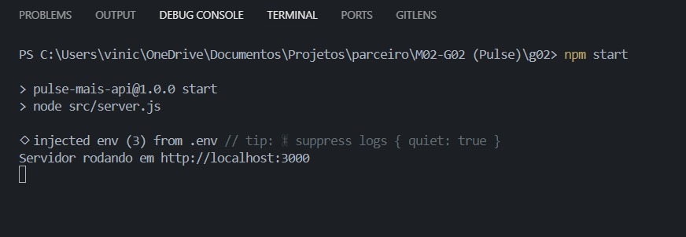<br>
  <sub> Fonte: Material produzido pelos autores (2026) </sub><br><br>
</div>

### (a) O que foi implementado

A WebAPI foi construída em **Node.js com Express.js**, persistindo dados em **PostgreSQL via Supabase** com driver `pg` (node-postgres) em conexão por *pool*, stack que materializa diretamente a restrição RNF-REST-02 da seção 3.1.3. O código foi organizado em quatro camadas internas, `routes → controllers → services → repositories`, refletindo no sistema de arquivos a separação Controller-Service-Repository documentada na seção 3.2.1. Cada módulo de domínio segue rigorosamente essa convenção: as rotas apenas declaram o caminho HTTP e delegam ao controller; o controller cuida da tradução HTTP ↔ domínio (validação de payload, status codes, serialização da resposta); o service concentra regras de negócio e validações de enum; e o repository encapsula a lógica SQL com *prepared statements* em 100% das queries, atendendo ao RNF-SEG-03 contra SQL injection. Essa rigidez de camadas não é decoração arquitetural: ela é o que viabiliza os testes unitários white-box exigidos pelo RNF-SUP-01, pois isola a lógica de negócio do framework HTTP e do driver de banco.

Quatro responsabilidades transversais foram implementadas como **middlewares globais**, evitando duplicação em cada controller. O `authenticate` desta sprint é um *stub* de desenvolvimento que lê os cabeçalhos `x-usuario-id` e `x-usuario-perfil` e popula `req.user` para as camadas seguintes — *stub* posteriormente substituído pela autenticação JWT real (`Authorization: Bearer <jwt>`) na sprint 4, conforme detalhado na seção 4.2; o `authorize(perfis)` recebe a lista de perfis autorizados na rota e devolve HTTP 403 quando o perfil do usuário autenticado não consta na lista, materializando a verificação backend exigida pela RN08 e implementando o RF003. O `asyncHandler` envolve cada controller para capturar exceções assíncronas e propagá-las ao tratamento de erros sem necessidade de `try/catch` repetido. Por fim, o `errorHandler` centraliza a tradução de exceções para respostas HTTP estruturadas: erros semânticos derivados da classe-base `AppError` (`NotFoundError → 404`, `ValidationError → 400`, `ForbiddenError → 403`, `ConflictError → 409`) retornam mensagens descritivas, enquanto exceções não previstas são logadas e devolvidas como HTTP 500 genérico, em conformidade com RNF-ORG-01, que proíbe vazamento de PII em mensagens de erro.

A entrega cobriu **17 módulos funcionais** com CRUD completo, cada um composto por seu próprio arquivo de migration, seed, model, repository, service, controller e rota registrada no router central. Todos os campos com enumeração, `status_jornada`, `tipo_presença`, `tipo_moradia`, `status_empregabilidade`, perfil de usuário e demais enums do domínio, são validados no Service antes de qualquer operação no banco. Campos obrigatórios ausentes retornam 400, conflitos de unicidade (CPF, e-mail, duplicata de frequência) retornam 409 e recursos não encontrados retornam 404, todos com mensagens descritivas. Os seis perfis suportados pelo `authorize` são `GestaoGeral`, `Coordenacao`, `Assistente`, `Psicologa`, `Mentor` e `Aluno`, com permissões granulares por entidade, por exemplo, apenas `GestaoGeral` e `Coordenacao` podem arquivar jovens ou empregabilidade. A tabela a seguir mapeia os módulos implementados aos Requisitos Funcionais que eles materializam, ordenados pela criticidade dos RFs conforme a seção 3.1.1.

| Prioridade | RF | Módulo (rota base) | Endpoints principais | Cobertura |
|------------|----|--------------------|----------------------|-----------|
| Alta | RF001 | `/api/jovens` | `POST /`, `GET /`, `GET /:id`, `PUT /:id`, `PATCH /:id/arquivar` | **Completa** — CRUD + arquivamento + validação de CPF e e-mail únicos (RN01, RN02, RN19), campos obrigatórios (RN03) e enum de status (RN04) |
| Alta | RF002 | `/api/usuarios` | `POST /`, `GET /`, `GET /:id`, `PUT /:id`, `PATCH /:id/desativar`, `PATCH /:id/reativar` | **Conforme escopo da sprint** — CRUD da entidade `Usuario` entregue como infraestrutura habilitadora, com hash bcrypt (salt rounds 10) já funcionando na persistência. O endpoint `POST /api/auth/login` e a validação de credenciais (RN06) são entregáveis dedicados da sprint de autenticação. **Atualização (sprint 4):** implementado com JWT — sem tabela de sessões; revogação feita por `token_version` na tabela `usuarios`, conforme seção 4.2 |
| Alta | RF003 | (middleware transversal) | `authenticate` + `authorize(perfis)` | **Completa, dentro do escopo previsto** — middleware `authorize(perfis)` aplicado em todas as rotas protegidas, materializando a verificação backend exigida pela RN08 e os bloqueios HTTP 403 das RN09 e RN10. A integração com a sessão autenticada real será acoplada ao middleware na sprint de autenticação, sem alteração do contrato |
| Alta | RF004 | (cobertura distribuída) | `GET /api/jovens/:id` + endpoints de frequência, atividades, mentorias, empregabilidade e ensino superior filtrados por jovem | **Completa via composição** — os dados que compõem o prontuário são acessíveis pelos endpoints individuais com filtros por jovem; o agregador opcional `GET /jovens/:id/prontuario` poderá ser implementado em sprint futura se a integração com o frontend identificar ganho de performance ou usabilidade |
| Alta | RF005 | `/api/frequencias` | `POST /`, `GET /` (filtros por jovem, data e programa), `GET /:id`, `PUT /:id`, `DELETE /:id` | **Completa** — registro presencial/gravação/ausente com data e responsável obrigatórios (RN12) |
| Alta | RF006 | `/api/anotacoes` | `POST /`, `GET /`, `GET /:id`, `PUT /:id` | **Completa** — autoria e timestamp atribuídos automaticamente pelo Service (RN14); ausência intencional do `DELETE` em conformidade com RN13 |
| Alta | RF007 | `/api/saude-mental`, `/api/atendimentos` | `POST /`, `GET /`, `GET /:id`, `PUT /:id` | **Completa** — `authorize` restringe acesso a `Psicologa`, `Coordenacao` e `GestaoGeral`, materializando RN09 |
| Alta | RF008 | `/api/jovens` (query params) | `GET /?status=&programa=&status_empregabilidade=&multiplicador=&nome=` | **Completa** — query dinâmica no Repository com filtros combináveis |
| Alta | RF009 | `/api/dashboard` | `GET /indicadores`, `GET /jovens-em-risco` (protegida por `authorize`) | **Completa** — agregações SQL (COUNT, AVG, GROUP BY) executadas no banco (RN16, alinhado ao RNF-DES-01) |
| Média | RF010 | `/api/empregabilidade` | `POST /`, `GET /`, `GET /:id`, `PUT /:id`, `PATCH /:id/arquivar` | **Completa** — histórico de vínculos, faixa salarial, modalidade e marcação tech/não-tech |
| Média | RF011 | `/api/ensino-superior` | `POST /`, `GET /`, `GET /:id`, `PUT /:id` | **Completa** — instituição, curso, modalidade de bolsa e status |
| Média | RF014 | `/api/log-auditoria` | `GET /`, `GET /:id` | **Completa** — endpoint *read-only*, registros gerados automaticamente nas escritas sensíveis (RN11, RN15) |
| Média | RF015 | `/api/eventos`, `/api/participacao-eventos` | `POST /`, `GET /`, `GET /:id`, `PUT /:id`, `DELETE /:id` | **Completa** — cadastro de eventos e vínculo de participação por jovem |
| Média | RF012 | — | — | **Não iniciada** — sem endpoint de importação CSV nesta sprint |
| Média | RF013 | — | — | **Parcial** — bloqueio por perfil ativo (Aluno recebe 403 em rotas administrativas), mas verificação de *ownership* (RN17) ainda não implementada |
| Baixa | RF016, RF017, RF018 | — | — | **Não iniciadas** — alinhado com a priorização do artefato 1 |

Além dos 13 módulos diretamente vinculados a RFs, foram implementados módulos de suporte que sustentam o domínio: `programas` e `matriculas` dão semântica ao enum `Conectado / Capacitado / Transformado` do RN04 e alimentam o índice de evasão do RF009; `atividades` e `entrega-atividades` registram a dimensão acadêmica que compõe o prontuário do RF004; `mentorias` materializam as User Stories US14, US15 e US21; `notificacoes` prepara o terreno para a US20 (alerta de aluno em risco). Compõem ainda a jornada do jovem os módulos `oportunidades` (vagas e cursos exibidos no Portal do Aluno — RF013), `competencias` e `certificados` (dimensões do prontuário do RF004) e `disciplinas` (registro acadêmico); destes, `oportunidades`, `competencias`, `certificados` e `disciplinas` possuem suíte unitária completa (100% de linhas), as três últimas adicionadas na sprint 5 (COD-03). Esses módulos não são escopo extra, são pré-requisitos estruturais para que os RFs prioritários funcionem com dados realistas.

<div align="center">
  Figura 65: Resposta de endpoint principal — GET /api/jovens em cliente REST <br><br>
  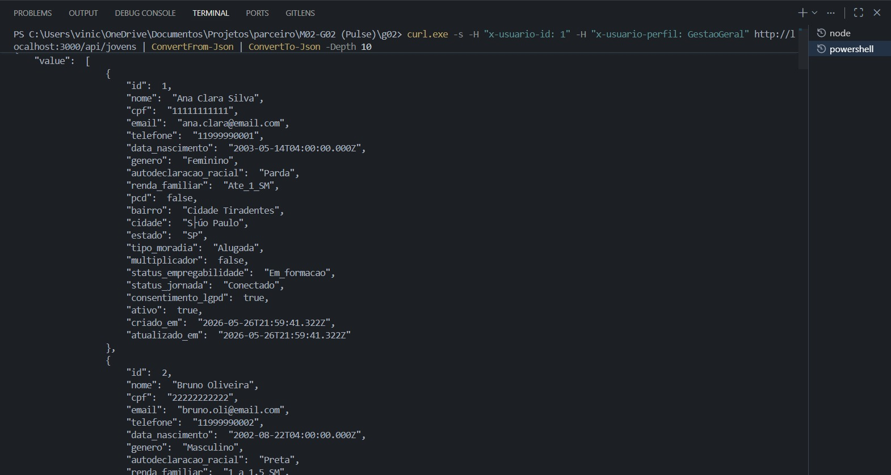<br>
  <sub> Fonte: Material produzido pelos autores (2026) </sub><br><br>
</div>

### (b) O que não foi concluído

A versão entregue cobre integralmente os RFs de criticidade Alta dentro do escopo planejado para a sprint (RF001, RF003, RF004, RF005 a RF009) e quatro dos sete RFs de criticidade Média (RF010, RF011, RF014, RF015). Três itens permanecem pendentes e precisam ser registrados explicitamente.

O **RF002 (autenticação real)** permanece como CRUD da entidade `Usuario`, sem endpoint de login (`POST /api/auth/login`) nem controle de sessão persistida, em conformidade com o cronograma do módulo. O middleware de autenticação **desta sprint** é um *stub* de desenvolvimento que lê os cabeçalhos `x-usuario-id` e `x-usuario-perfil` para viabilizar os testes dos demais endpoints; o hash bcrypt (salt rounds 10) já está implementado no CRUD de usuários, restando o fluxo de login e a validação de credenciais (RN06). Trata-se de decisão de escopo do roadmap, não de pendência técnica, conforme registrado na evolução do RNF-SEG-01 na seção 3.1.3. **Atualização (sprint 4):** este *stub* foi removido definitivamente e substituído pela autenticação JWT real — `POST /api/auth/login` emite token assinado e o `authenticate.js` reescrito valida `Authorization: Bearer <jwt>`; a revogação de sessão foi resolvida por `token_version` na própria tabela `usuarios`, em vez de tabela `sessoes` dedicada, conforme detalhado na seção 4.2 e na evolução do RNF-SEG-01 em 3.1.3.

O **RF012 (importação CSV)** não foi iniciado nesta sprint. A funcionalidade está wireframada e especificada pelo RN18 (validação linha-a-linha com relatório de rejeitadas), mas não possui endpoint, Service nem testes de integração. Está priorizado para a próxima sprint.

O **RF013 (Portal do Aluno)** está parcialmente coberto: o middleware `authorize` impede que um Aluno autenticado escreva em rotas administrativas, comportamento confirmado por teste (Aluno recebe 403 em endpoints de escrita). Contudo, a verificação de *ownership* exigida pela RN17, segundo a qual um jovem só pode visualizar e editar os próprios dados, mesmo em rotas de leitura, ainda não foi implementada como regra dedicada no Service. Hoje, um `GET /api/jovens/:id` com ID diferente do próprio não é bloqueado por verificação de propriedade, apenas por perfil. A implementação dessa regra é parte das ações da próxima sprint.

Também não foram entregues nesta versão a interface web (frontend) conectada à API nem o provisionamento do banco em ambiente de *staging*, itens deliberadamente fora do escopo da Sprint 3.

### (c) Dificuldades técnicas enfrentadas

O processo interno de revisão da sprint identificou e corrigiu **14 bugs** antes do fechamento, evidência direta da efetividade dos testes automatizados e do *code review* sistemático adotado pelo grupo. Três deles merecem destaque pela natureza didática:

O primeiro foi a presença de um **arquivo de Service duplicado** (`atividadesService.js`) que nunca era importado pelo router central, mas convivia no repositório gerando ambiguidade sobre qual versão era a "oficial". O risco real desse tipo de duplicação não é o código morto em si, é a probabilidade de um desenvolvedor futuro editar o arquivo errado e concluir que sua correção "não fez efeito", desperdiçando horas de debug. A remediação foi a remoção do arquivo e a inclusão de um *lint rule* (`unused-imports`) no pipeline para detectar arquivos órfãos antes do merge.

O segundo foi um **descompasso entre camadas no endpoint `GET /api/jovens`**: os filtros `status_empregabilidade` e `multiplicador` estavam implementados no Service e no Repository, mas o Controller não os repassava ao Service, deixando o RF008 incompleto na camada HTTP, um caso clássico de bug "invisível" porque cada camada funciona isoladamente nos testes unitários, mas a integração falha. A descoberta veio dos testes de integração com Supertest, que validam o contrato HTTP de ponta a ponta. A correção foi simples (encadeamento dos query params no controller), mas o aprendizado estrutural foi importante: testes unitários por camada são necessários, mas insuficientes; testes black-box que exercitam o contrato real são o que pega esse tipo de regressão.

O terceiro, e mais sensível em termos de segurança, foi a **ausência do middleware `authorize` na rota `GET /api/dashboard/jovens-em-risco`**, que listava jovens com indicadores de risco de evasão. Qualquer usuário autenticado, inclusive perfis sem clearance para dado sensível, conseguia acessar a lista, em violação direta às RN09 e RN10. O bug existia porque a rota foi adicionada depois das demais do dashboard e a checklist de revisão não verificou o middleware. A correção, além de aplicar `authorize(['GestaoGeral', 'Coordenacao', 'Psicologa'])`, gerou uma diretriz de processo: toda nova rota de leitura sobre dados sensíveis exige explicitar o `authorize` no PR e ser aprovada por dois revisores.

Para além dos bugs específicos, duas dificuldades arquiteturais consumiram tempo significativo da sprint. A primeira foi o **trade-off entre soft delete e hard delete** ao longo das 17 entidades: a RN13 proíbe exclusão de frequências e anotações; entidades como Programa e Empregabilidade precisam de soft delete para preservar o histórico no prontuário do jovem; já `notificacoes` e `eventos` toleram hard delete. A inconsistência inicial entre módulos gerou retrabalho, resolvido pela padronização, entidades com vínculo histórico expõem `PATCH /:id/arquivar` e nunca DELETE; entidades operacionais expõem DELETE convencional; anotações e frequências expõem apenas `PUT` para complementação. Essa convenção foi documentada explicitamente no repositório para evitar reincidência. A segunda dificuldade foi a **modelagem de filtros dinâmicos no Repository** para entidades como Jovem (sete filtros combináveis) e Frequência. A primeira tentativa, com concatenação de strings SQL, abriu vulnerabilidade clara de SQL injection e violou o RNF-SEG-03. A reescrita adotou *parameterized queries* construídas por composição de fragmentos predefinidos, mantendo os valores sempre como bind parameters do driver `pg`.

### (d) Próximos passos

Para a próxima sprint, quatro frentes estão priorizadas em ordem de dependência técnica e impacto sobre os RFs ainda não cobertos.

A primeira é **implementar `POST /api/auth/login`** com validação de credenciais via bcrypt e emissão de token JWT assinado, materializando definitivamente o RF002 com as regras RN05, RN06 e RNF-SEG-01. **Atualização (sprint 4):** implementado com JWT (sem tabela `sessoes`); revogação por incremento de `token_version` na tabela `usuarios`; o *stub* de headers foi substituído pelo middleware `authenticate.js` real que valida `Authorization: Bearer <jwt>`.

A segunda é **implementar a verificação de *ownership* no Service de Jovem para o perfil Aluno** (RF013/RN17), de modo que um jovem autenticado só consiga acessar `GET /api/jovens/:id` quando o ID corresponder ao seu próprio registro, independentemente do parâmetro enviado na requisição. Essa lógica é mais segura no Service do que no Controller porque garante aplicação uniforme em qualquer ponto de entrada futuro.

A terceira é **adicionar validação de existência da FK pai nos Services antes do INSERT** nas seis entidades afetadas pelo problema (matrículas, frequências, anotações, empregabilidade, ensino superior e participação em eventos). Hoje, uma tentativa de inserir registro com `jovem_id` inexistente devolve HTTP 500 por violação de constraint do PostgreSQL; o comportamento correto é uma checagem prévia que devolva HTTP 404 com mensagem descritiva ("Jovem com ID X não encontrado"), em linha com o padrão de erros adotado nos demais endpoints.

A quarta é **iniciar o módulo de importação CSV (RF012)** com validação linha-a-linha conforme a RN18: o endpoint deve aceitar o arquivo, validar cada linha contra os campos obrigatórios e o dígito verificador do CPF (RN19), inserir as linhas válidas e devolver um relatório estruturado com as linhas rejeitadas e o motivo de cada rejeição, sem interromper a importação das demais. Esse provavelmente será o desafio técnico mais denso da próxima sprint, especialmente pela necessidade de transacionar parcialmente: linhas válidas devem ser persistidas mesmo quando outras falham.

Por fim, **iniciar a implementação do frontend conectado à WebAPI** em HTML, CSS e JavaScript vanilla, conforme a restrição RNF-REST-01 da seção 3.1.3. Como os wireframes já estão consolidados na seção 3.3 e o backend expõe contratos REST estáveis para todos os 17 módulos, o esforço da próxima sprint concentra-se em três frentes: a tradução dos protótipos de alta em HTML semântico com CSS responsivo (atendendo ao RNF-USAB-03 nos breakpoints de 360px, 768px e 1280px), a camada de integração HTTP via `fetch()` com tratamento padronizado de estados de carregamento, erro e sucesso, e a validação no cliente antes do envio para garantir o feedback visual imediato exigido pelo RNF-DES-02. A arquitetura inicial prevê um arquivo HTML por tela (sem SPA, sem *client-side routing*), CSS centralizado em `styles/global.css` com variáveis de cor e tipografia para consistência visual, e módulos JavaScript dedicados por entidade para encapsular as chamadas à API. A entrega da Sprint 4 priorizará os fluxos prioritários documentados nas User Stories US01, US04 e US20, busca de aluno, dashboard de indicadores e visualização de jovens em risco, materializando pela primeira vez o critério dos três cliques do RNF-USAB-01 em condições reais de uso.

## <a name="c4.2"></a>4.2. Segunda versão da aplicação web
A segunda versão da plataforma Pulse Mais consolida o salto que separa um backend testado em isolamento de um sistema operacional integrado: a WebAPI entregue na sprint 3 ganhou autenticação real, frontend dos três perfis, importação CSV operante e uma suíte de testes que excede os limites de cobertura especificados em RNF-SUP-01. Onde a primeira versão demonstrou que a espinha dorsal arquitetural sustenta os 18 requisitos funcionais, a segunda versão demonstra que essa espinha sustenta também a interação humana real, exercitada por três personas em telas distintas, com fluxos de ponta a ponta auditáveis. O escopo da sprint 4 foi priorizado para fechar os três *gaps* críticos documentados ao fim da sprint 3 (RF002, RF012 e RNF-SUP-01) e para materializar a integração frontend ↔ API em condições próximas de uso real, conforme planejado nos *próximos passos* da seção 4.1.

<div align="center">
  Figura 66: Tela de login unificada da plataforma Pulse Mais <br><br>
  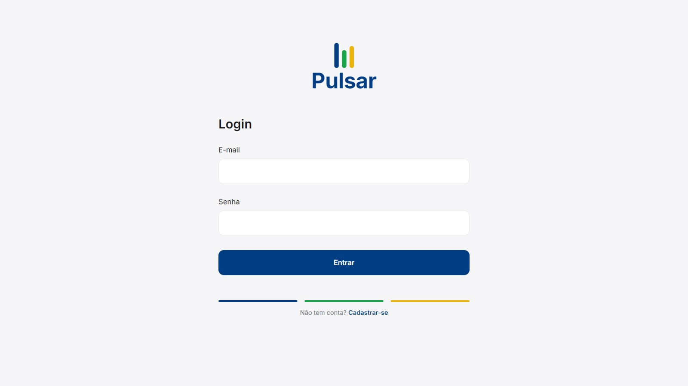<br>
  <sub> Fonte: Material produzido pelos autores (2026) </sub><br><br>
</div>

### (a) O que foi implementado

A entrega da sprint 4 consolida três frentes interdependentes que, em conjunto, transformam a aplicação de **WebAPI testável** em **sistema operacional integrado**: a substituição do *stub* de autenticação por um fluxo JWT real com bcrypt, a construção do frontend dos três perfis em HTML/CSS/JavaScript *vanilla* com integração ponta a ponta à API, e a maturação da suíte de testes automatizados com cobertura agora medida e auditável. Cada frente endereça um *gap* específico documentado ao fim da sprint 3 e, juntas, fecham os *gaps* mais críticos do RF002, RF012 e RNF-SUP-01.

A **autenticação real** foi a primeira frente atacada, pela dependência transversal que ela impõe a todas as demais. Quatro endpoints novos compõem o módulo: `POST /api/auth/login` valida credenciais com bcrypt e emite um token JWT assinado contendo `usuario_id`, `perfil` e `token_version` no *payload*; `POST /api/auth/cadastro` aplica hash bcrypt automático na criação; `POST /api/auth/logout-all` invalida sessões via incremento da coluna `token_version` da tabela `usuarios`, mecanismo de revogação sem tabela de sessões dedicada, decisão técnica detalhada na seção 3.1.3; e `DELETE /api/auth/me` desativa a conta do usuário autenticado. O middleware `authenticate.js` foi **reescrito por completo** para ler o header `Authorization: Bearer <jwt>`, validar assinatura e expiração, conferir o flag `ativo` do usuário e comparar o `token_version` do JWT com o valor corrente da coluna, divergência → 401. O *stub* de headers `x-usuario-id` / `x-usuario-perfil` que viabilizou os testes da sprint 3 foi removido definitivamente; a partir desta sprint, **toda rota protegida exige Bearer JWT real**, sem exceção.

A segunda frente, **frontend integrado dos três perfis**, é o que torna a plataforma utilizável de fato. Aproximadamente 35 telas foram implementadas e conectadas à WebAPI via `fetch()`, distribuídas entre os perfis Aluno (6 telas), Mentor (11 telas) e Gestão/Coordenação (12 telas), além do login unificado. Todas as telas seguem a restrição RNF-REST-01 (HTML/CSS/JS *vanilla*, sem React/Vue/Angular, sem *bundler*), com CSS centralizado em `src/public/css/global.css` contendo as variáveis do design system Pulsar, e dois layouts-base independentes (`aluno-layout.css` e `mentor-layout.css`) por perfil. Cada módulo JavaScript é dedicado a uma entidade e encapsula o tratamento de estados de carregamento, erro e sucesso, padrão replicado por todo o frontend para uniformizar a experiência de feedback ao usuário, atendendo a RNF-DES-02. O login unificado redireciona automaticamente para o dashboard do perfil correspondente após autenticação bem-sucedida.

**Status real dos perfis (decisão de escopo do MVP).** O backend autoriza **seis perfis** via `authorize` — `GestaoGeral`, `Coordenacao`, `Assistente`, `Psicologa`, `Aluno` e `Mentor` —, todos presentes no enum `CHECK` da tabela `usuarios` (migration `001`). No MVP, porém, foram priorizadas as personas de maior impacto na resolução do problema central (centralização da jornada e autoatendimento), materializadas em **três portais frontend**: o portal de **Gestão** (operado por `GestaoGeral`, `Coordenacao` e `Assistente`), o **Portal do Aluno** (`Aluno`) e o **Portal do Mentor** (`Mentor`). O perfil **`Psicologa`** está **plenamente implementado no backend** — o `authorize` restringe os endpoints de saúde mental (`/api/saude-mental`, `/api/atendimentos`) a `Psicologa`, `Coordenacao` e `GestaoGeral`, materializando o RF007 e as RN09/RN10, e o cenário é coberto pelos testes de integração da sprint 4 (RNF-SEG-02). O que foi **deliberadamente despriorizado no MVP** é o **portal frontend dedicado à Psicóloga**: hoje os registros clínicos são operados pela interface de Gestão com segregação de categoria (a categoria "Saúde Mental" das anotações só é exibida a perfis autorizados). A construção de um portal próprio para a Psicóloga é uma **evolução futura prevista**, sem necessidade de alteração de contrato no backend, que já expõe os endpoints e o controle de acesso necessários.

<div align="center">
  Figura 67: Dashboard do perfil Gestão/Coordenação <br><br>
  <br>
  <sub> Fonte: Material produzido pelos autores (2026) </sub><br><br>
</div>

<div align="center">
  Figura 68: Dashboard do perfil Mentor <br><br>
  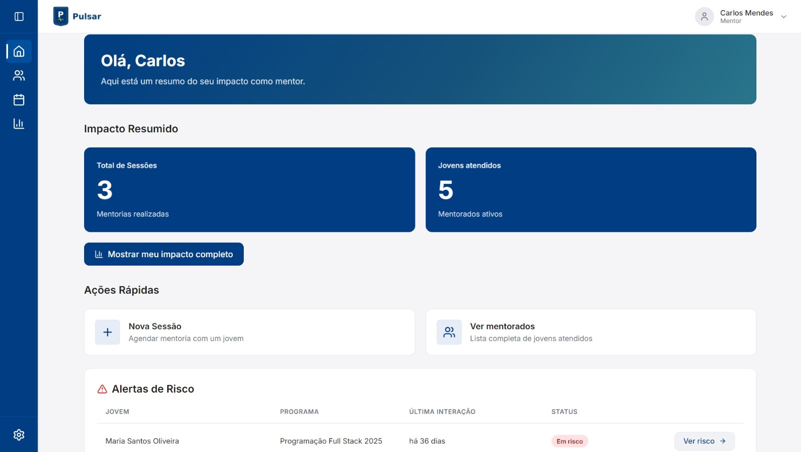<br>
  <sub> Fonte: Material produzido pelos autores (2026) </sub><br><br>
</div>

<div align="center">
  Figura 69: Dashboard do perfil Aluno (Beatriz) <br><br>
  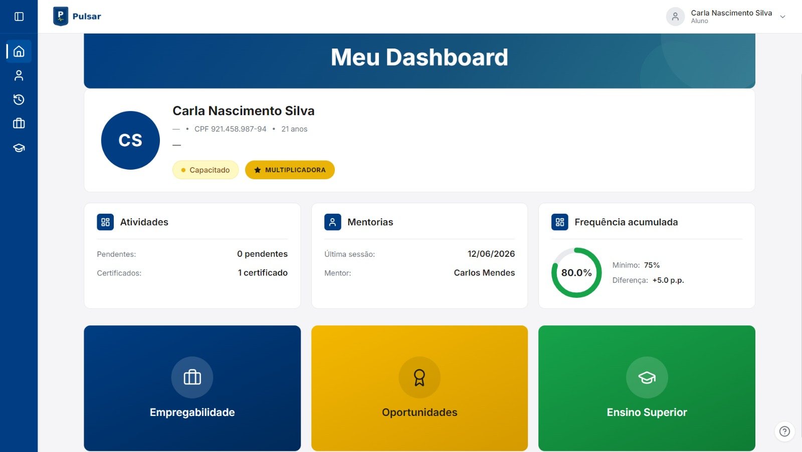<br>
  <sub> Fonte: Material produzido pelos autores (2026) </sub><br><br>
</div>

A integração com a API segue um padrão consistente em todos os módulos. O frontend monta o header `Authorization: Bearer ${localStorage.getItem('token')}` antes de cada `fetch()`, trata o 401 redirecionando para o login (sessão expirada), o 403 exibindo mensagem de acesso restrito sem expor detalhes do que está bloqueado, e o 5xx exibindo um *toast* genérico de "erro inesperado", sem vazar mensagens internas ao usuário, em conformidade com RNF-ORG-01. Esse padrão foi codificado em uma função utilitária por perfil (`mainMentor.js`, `gestão/main.js`, `aluno/main.js`) e replicado nos módulos por entidade.

<div align="center">
  Figura 70: Ficha completa do jovem (perfil agregado) <br><br>
  <br>
  <sub> Fonte: Material produzido pelos autores (2026) </sub><br><br>
</div>

A terceira frente, **importação CSV (RF012)**, materializou o segundo *gap* crítico da sprint 3. O fluxo opera em dois passos deliberadamente separados: `POST /api/frequencias/importar-csv` recebe o arquivo via `multer` em `memoryStorage` (limite de 5MB, somente extensão `.csv`), valida cada linha contra os campos obrigatórios e o dígito verificador do CPF (RN18, RN19), e devolve um **preview** com as linhas válidas e as rejeitadas; o segundo passo, `POST /api/frequencias/confirmar-importacao`, persiste as linhas válidas e devolve um relatório estruturado com o motivo de rejeição de cada linha que falhou. A escolha por dois passos é deliberada: o usuário tem oportunidade de revisar o preview antes da persistência irreversível, e o sistema preserva a integridade transacional sem descartar o trabalho de importação quando algumas linhas falham.

<div align="center">
  Figura 71: Fluxo de importação CSV — preview de validação <br><br>
  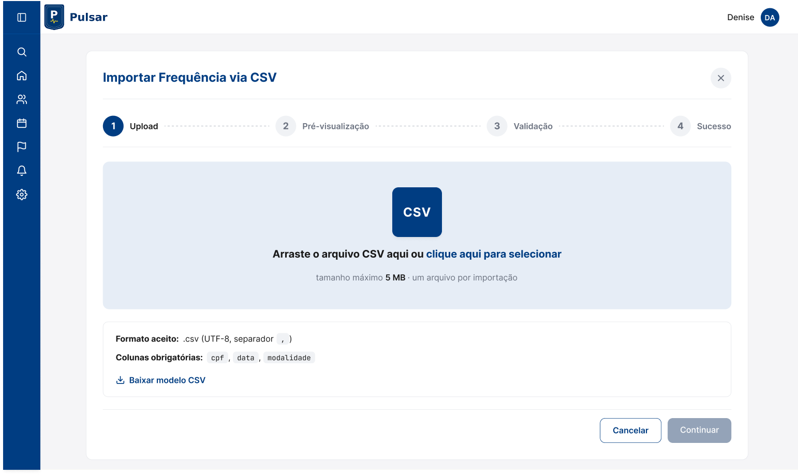<br>
  <sub> Fonte: Material produzido pelos autores (2026) </sub><br><br>
</div>

A quarta frente, **testes automatizados em dois níveis**, é o que dá confiabilidade auditável a todas as anteriores. A camada `services/` atingiu **96,90% de cobertura de linhas e 93% de ramos**, e o projeto como um todo registra **74,74% de cobertura global de linhas**, ambos os limites de RNF-SUP-01 (≥ 70% linhas, ≥ 60% ramos) atingidos e superados. Quinze dos vinte e quatro Services têm 100% de cobertura de linhas; os nove restantes estão entre 87,03% e 98,24%; o `authService`, gap da sprint anterior, passou a 100% de linhas nesta sprint com a suíte `auth.service.test.js`. Os testes de integração com Supertest exercitam os middlewares reais de `authenticate` e `authorize` em todos os 269 cenários, com tokens JWT emitidos por `createAuthToken` e *pool* PostgreSQL mockado via `mockAuthenticatedUser`, preservando fidelidade contratual (HTTP, JWT, autorização) sem a flacidez de um banco real.

<div align="center">
  Figura 72: Resultado da execução da suíte automatizada (npm test) <br><br>
  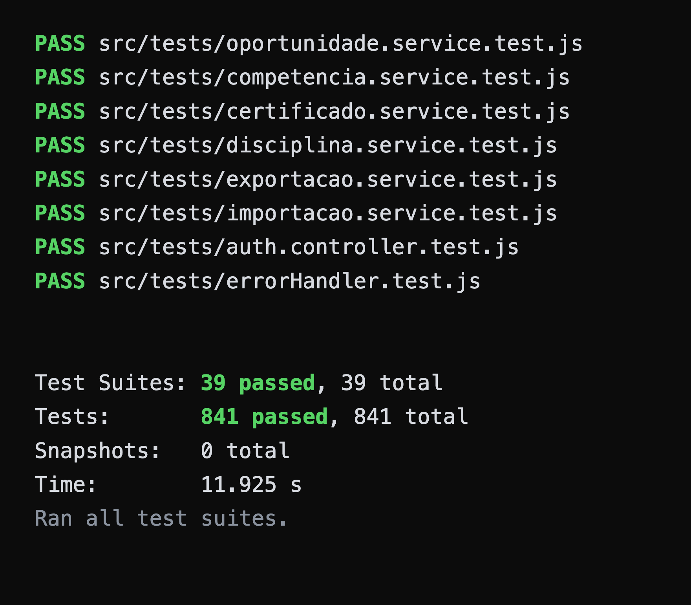<br>
  <sub> Fonte: Material produzido pelos autores (2026) </sub><br><br>
</div>

Cinco casos de teste foram destacados pelo grupo como representativos do rigor adotado na suíte e estão documentados na seção 3.9: **CT-US-01** valida que o hash bcrypt é aplicado e `senha_hash` nunca aparece no retorno; **CT-JV-01** garante que CPF duplicado é rejeitado antes de qualquer persistência; **CT-PG-01** valida coerência temporal de datas do programa (`data_fim >= data_inicio`); **CT-PE-01** previne participação duplicada em evento via constraint UNIQUE; e **CT-LA-02** verifica que os filtros do controller de auditoria chegam intactos ao repositório, sem perda nem mutação. Os cinco casos foram selecionados por endereçarem regras de negócio cujo descumprimento teria impacto direto na operação da Pulse Mais, dados duplicados de jovens, sessões inválidas, agendamento de eventos inconsistentes e auditoria distorcida.
 
A tabela a seguir consolida o que foi implementado na sprint 4 contra os *gaps* documentados ao fim da sprint 3:

| Gap documentado (sprint 3) | Status (sprint 4) | Endpoint(s) / Artefato(s) |
|---|---|---|
| RF002 — autenticação real (login + sessão) | **Resolvido** | `POST /api/auth/login`, `POST /api/auth/cadastro`, `POST /api/auth/logout-all`, `DELETE /api/auth/me` + reescrita do `authenticate.js` |
| RF012 — importação CSV com preview e relatório | **Resolvido** | `POST /api/frequencias/importar-csv` (preview), `POST /api/frequencias/confirmar-importacao` (persistência + relatório) |
| RF013 (parcial) — autosserviço do usuário autenticado | **Avançado** (auto-serviço) | `GET /api/me`, `PUT /api/me`, `PUT /api/me/password` |
| RNF-SUP-01 — cobertura ≥ 70% linhas / ≥ 60% ramos | **Superado** | 96,90% / 93% em `services/`; 74,74% global |
| Frontend integrado à WebAPI (3 perfis) | **Resolvido** | ~35 telas em HTML/CSS/JS *vanilla*; login unificado com redirecionamento por perfil |

### (b) O que não foi concluído

Quatro itens permanecem pendentes para a sprint 5, todos documentados explicitamente nos *gaps* da seção 3.9 e na evolução por eixo da seção 3.1.3.

O primeiro é a **verificação granular de *ownership* para o perfil Aluno (RF013/RN17)**. O controle de acesso por perfil está testado e operante, o Aluno recebe 403 em rotas administrativas de escrita —, e o autosserviço `/api/me` está completo. Falta o cenário em que um Aluno tenta acessar `GET /api/jovens/:id` com o ID de **outro** jovem: hoje a rota retorna o dado se o perfil for permitido, sem verificar que o `:id` corresponde ao próprio jovem autenticado. A implementação prevista é adicionar no Service de Jovem uma checagem `if (req.user.perfil === 'Aluno' && req.user.jovem_id !== Number(id)) → ForbiddenError`. A correção é cirúrgica, mas precisa ser acompanhada de testes de integração dedicados para evitar regressão.

O segundo é o **teste de carga formal** com Artillery ou k6 para verificar RNF-DES-01 (p95 < 500 ms em leitura), RNF-DES-02 (p95 < 800 ms em escrita) e RNF-CAP-01 (10 usuários concorrentes sem degradação). A medição depende de uma base populada a ~2.000 jovens (RNF-CAP-02) e de um perfil de carga representativo do uso típico (70% leitura, 30% escrita). Sem essa medição, as afirmações de desempenho permanecem em nível de *atendido por design*, não *atendido por medição*.

O terceiro é o **questionário SUS (RNF-USAB-02)** com a equipe Pulse Mais. Não era verificável antes da sprint 4 pela ausência do frontend integrado dos três perfis. Agora é viável, e a recomendação metodológica é aplicar com 8–12 respondentes (Brooke, 1996), garantindo cobertura dos três perfis (Coordenação, Mentor, Aluno) e operação real em telas autenticadas. A meta é SUS ≥ 68.

O quarto é o **banner visual de ambiente acadêmico (RNF-ORG-03)**. O disclaimer no README está implementado desde a sprint 3, mas a faixa fixa no topo da aplicação visível em todas as telas dos três perfis ainda não foi inserida. É uma tarefa pequena (elemento HTML/CSS *sticky* no topo do layout), mas é o último item visual que falta para conformidade plena com o eixo ORG.

Adicionalmente, dois *gaps* de criticidade baixa permanecem como recomendação de melhoria contínua, sem comprometer entregáveis: **validação de FK pai nos Services antes do INSERT** (afeta 6 entidades; sem ela, FK inexistente gera 500 do PostgreSQL em vez de 404 descritivo) e **cobertura de testes de filtros combinados** em Jovem (7 filtros), Frequência (4 filtros) e Matrículas (3 filtros). Ambos estão catalogados na seção 3.9.

### (c) Dificuldades técnicas enfrentadas

A sprint 4 enfrentou seis dificuldades técnicas concretas, três delas com impacto significativo no cronograma. Algumas merecem destaque pela natureza didática que carregam para sprints futuras.

A primeira foi a **substituição do *stub* de autenticação por JWT real sem quebrar os testes da sprint 3**. A suíte herdada da sprint 3 dependia do *stub* de headers `x-usuario-id` / `x-usuario-perfil`; a transição precisava ser feita de forma que toda a suíte (hoje 841 testes) continuasse passando ao longo de toda a refatoração. A estratégia adotada foi criar primeiro o helper `createAuthToken(usuario)` que emite JWTs válidos com o mesmo *payload* que o *stub* esperava, depois substituir o middleware `authenticate.js` para validar JWT real, e por último adaptar os testes existentes para usar tokens emitidos pelo helper. O *trade-off* aceito foi um período curto (algumas horas dentro da sprint) em que parte da suíte ficou vermelha, gerenciado por *feature flag* local e rollback rápido se necessário. A escolha deliberada de **mockar o *pool* do PostgreSQL** nos testes de integração, em vez de subir banco real, foi o que tornou essa transição viável: os middlewares reais de `authenticate` e `authorize` são exercitados em todos os 269 cenários, mas sem a flacidez de um banco compartilhado.

A segunda foi a **gestão de `token_version` para invalidação de sessões sem tabela dedicada**. A alternativa óbvia, tabela `sessoes` com `session_id` e `expires_at`, exigiria uma query de banco a cada requisição autenticada para verificar a validade da sessão, introduzindo latência e dependência adicional. A decisão por `token_version` (coluna inteira em `usuarios` que o JWT carrega no *payload* e o middleware compara com o valor corrente do banco) mantém o controle de revogação sem custo de query por requisição em rota *cacheável*. O *trade-off* aceito é que tokens emitidos antes do incremento permanecem válidos no cliente até a expiração natural, comportamento aceitável para o porte operacional da Pulse Mais, onde "preciso invalidar uma sessão específica imediatamente" é cenário raro.

A terceira, e mais densa do ponto de vista de complexidade, foi a **transação parcial na importação CSV**. O fluxo natural de `BEGIN/COMMIT/ROLLBACK` único não atende ao requisito operacional da Pulse Mais, se 95% das linhas do CSV estão corretas e 5% têm erro de CPF, descartar tudo é tão custoso quanto descartar nada. A solução foi separar o fluxo em dois endpoints (preview + confirmação), validar todas as linhas em batch antes de qualquer escrita, e persistir apenas as válidas no segundo passo, devolvendo um relatório estruturado com o motivo de rejeição por linha. Isso exigiu uma lógica de batch com rollback seletivo por linha que é mais sofisticada que a transação tradicional, mas que entrega exatamente o comportamento operacional esperado pela equipe da Pulse Mais — importar listas de presença incompletas sem ter que recomeçar do zero.

A quarta foi o **trade-off entre reuso e especificidade no CSS modular por perfil**. Inicialmente o grupo considerou um único `layout.css` compartilhado entre os três perfis, mas a análise dos protótipos de alta da seção 3.5 mostrou que cada perfil tem barra lateral, densidade visual e padrões de espaçamento próprios, alinhados às personas. A decisão por dois layouts-base (`aluno-layout.css` e `mentor-layout.css`) trouxe especificidade e fidelidade ao design, ao custo de duplicação parcial de componentes compartilhados (`.info-field`, `.edit-pill`, alguns padrões de tabela). Esse débito técnico está catalogado para a sprint 5, com migração planejada para um arquivo de componentes comuns.

A quinta foi a **padronização do tratamento de estados de requisição (loading, erro 4xx, erro de rede) em ~35 telas**. Sem um *framework* SPA com convenções embutidas (Suspense do React, *interceptors* do Vue Router), cada módulo JS por entidade poderia divergir em como apresentar feedback ao usuário. A solução foi codificar uma função utilitária por perfil (em `mainMentor.js`, `gestão/main.js`, `aluno/main.js`) com a sequência canônica: exibir *loading state* → executar `fetch()` com `Authorization: Bearer` → tratar 401 (redirect para login), 403 (toast de acesso restrito), 4xx genérico (mensagem do servidor), 5xx (toast genérico de erro inesperado) → restaurar UI ou exibir resultado. Essa função foi replicada e adaptada em todos os módulos por entidade, garantindo consistência sem o custo de uma camada de abstração mais pesada.

A sexta foi o **mock do *pool* do PostgreSQL nos testes de endpoint** para que o middleware de autenticação JWT executasse sem banco real. A dificuldade era preservar a fidelidade dos middlewares de `authenticate` e `authorize` (que precisam validar token, verificar `ativo` e comparar `token_version`) ao mesmo tempo em que se eliminava a dependência do banco. A solução foi criar `mockAuthenticatedUser(usuario)` no `endpointTestHelper.js`, que injeta no mock do *pool* a resposta exata que `authenticate.js` espera ao consultar o usuário pelo `id` do JWT. Com isso, os 269 cenários de integração exercitam os middlewares reais com tokens reais, mas sem latência nem flacidez de banco. Esse é o tipo de decisão que, feita errada, geraria testes "que passam porque o middleware foi mockado", uma falsa confiança que vai pagar custo na primeira regressão de segurança em produção.

### (d) Próximos passos

A sprint 5 (versão final) está estruturada em torno de cinco frentes priorizadas em ordem de dependência técnica e impacto sobre os RFs ainda não cobertos.

A primeira é **implementar a verificação granular de *ownership* no Service de Jovem** para o perfil Aluno (RF013/RN17), fechando definitivamente o último gap de criticidade alta do MVP. A implementação é cirúrgica (uma verificação no início do `buscarPorId` do Service), mas precisa vir acompanhada de pelo menos três testes de integração dedicados (Aluno acessando seus próprios dados → 200, Aluno acessando dados de outro jovem → 403, Aluno acessando rota sem JWT → 401).

A segunda é **executar os testes de carga formais com Artillery ou k6** contra base populada a 2.000 jovens, verificando RNF-DES-01, RNF-DES-02 e RNF-CAP-01. O perfil de carga adotado será misto (70% leitura, 30% escrita), com cenários representativos do uso típico (login + dashboard + busca + ficha do jovem). Métricas a coletar: p50, p95, p99 de latência por endpoint, taxa de erros 5xx sob carga, throughput em RPS. A análise por `EXPLAIN ANALYZE` em queries críticas (RNF-CAP-02) será feita em conjunto.

A terceira é **aplicar o questionário SUS (RNF-USAB-02)** com 8–12 respondentes da equipe Pulse Mais, garantindo cobertura dos três perfis. O instrumento adotado é o questionário SUS canônico de Brooke (1996), com 10 perguntas em escala Likert de 5 pontos. A meta é SUS ≥ 68 (Bangor *et al.*, 2009).

A quarta é **adicionar a validação de FK pai nos Services antes do INSERT** nas seis entidades afetadas (Frequência, Matrículas, Entregas Atividades, Saúde Mental, Anotações, Participação em Eventos), substituindo o 500 atual do PostgreSQL por 404 descritivo. Essa correção é o último gap sistêmico documentado e afeta a qualidade de mensagem de erro em todo o backend.

A quinta é **adicionar o banner visual de ambiente acadêmico (RNF-ORG-03)** no topo do layout de todos os perfis, fechando o último item visual de conformidade com o eixo ORG, e **completar a cobertura de `authService`** com testes unitários do fluxo de login (validação de credenciais, geração de JWT, revogação via `token_version`), além de testes E2E do fluxo completo de autenticação.

Por fim, **refinamento e correções finais** com base nos achados dos testes de carga, do SUS e do *code review* final, e a **migração dos componentes CSS duplicados** entre `aluno-layout.css` e `mentor-layout.css` para um arquivo de componentes comuns, fechando o débito técnico catalogado na sprint 4. Ao fim da sprint 5, a expectativa é que a plataforma esteja em estado *production-ready* para auditoria final e entrega à equipe da Pulse Mais.

## <a name="c4.3"></a>4.3. Versão final da aplicação web
A versão final da plataforma Pulse Mais fecha os *gaps* de criticidade alta que a sprint 4 deixara explicitamente em aberto e endurece a aplicação em cinco eixos: segurança de acesso granular, desempenho sob carga, resiliência de rede, conclusão do frontend e conformidade com a LGPD. Além das correções de backend, a sprint 5 entregou **cinco novas telas para o perfil Gestão** (cadastro de mentor, solicitações de cadastro de alunos, cursos e bolsas, além de senha temporária no cadastro), implementou o banner de conformidade LGPD em toda a aplicação, eliminou o débito técnico de duplicação de CSS entre perfis e ampliou substancialmente a suíte de testes automatizados com nove novas suítes. Onde a sprint 4 entregou um sistema operacional integrado, a sprint 5 entrega um sistema **endurecido, medido e visualmente completo**, com *ownership* aplicado, queries otimizadas por índices dirigidos a gargalos reais, cliente HTTP resiliente a falhas transientes e frontend finalizado para os três perfis.

### (a) O que foi refinado ou adicionado desde a sprint 4

**Frentes de backend**

A primeira frente foi o **fechamento da autorização granular por *ownership* (RF013/RN17)**, o último gap de criticidade alta do MVP. O método `jovemService.buscarPorId` passou a receber o usuário autenticado e a aplicar a regra `if (usuario?.perfil === 'Aluno' && usuario.jovem_id !== id) → ForbiddenError('Acesso negado')`. Com isso, um Aluno só acessa o registro cujo `jovem_id` coincide com o do seu token JWT, **independentemente do `:id` enviado na URL** — o controle deixa de ser apenas por perfil e passa a ser também por posse do recurso. A regra foi coberta por testes de integração dedicados (Aluno acessando os próprios dados → 200; Aluno acessando dados de outro jovem → 403; acesso sem JWT → 401). Complementarmente, o **ownership foi estendido ao módulo de Mentorias e ao Dashboard**: os endpoints de mentoria passaram a filtrar automaticamente por `mentor_id` do usuário autenticado, e o dashboard de mentor agrupa KPIs apenas pelos mentorados vinculados ao token, garantindo que cada perfil Mentor enxergue exclusivamente o seu contexto.

A segunda frente foi a **validação de existência de FK pai antes do INSERT em seis entidades** (Frequência, Matrículas, Entregas de Atividades, Saúde Mental, Anotações e Participação em Eventos). Antes da correção, uma FK inexistente disparava um erro `500` cru do PostgreSQL; agora o Service verifica a existência do registro pai e retorna `404 Not Found` descritivo, eliminando o último gap sistêmico de qualidade de mensagem de erro documentado na 4.2(b). Adicionalmente, o **`errorHandler` global foi atualizado para interceptar erros nativos do driver `pg`** e convertê-los em respostas HTTP semânticas: violações de FK (`23503`) retornam `404` quando o pai não existe ou `409` quando há dependência referencial, violações de UNIQUE (`23505`) retornam `409 Conflict` e erros de tipo de dado inválido (`22P02`) retornam `400 Bad Request`, eliminando definitivamente o padrão de `500 Internal Server Error` para erros previsíveis do banco de dados em toda a aplicação.

A terceira frente foi a **otimização de desempenho do backend**, precedida de um diagnóstico formal com *profiling* e `EXPLAIN ANALYZE` sobre as queries dos dashboards. O diagnóstico identificou *sequential scans* nos agregados de risco, alerta e progresso, corrigidos pela migration `033_performance_indexes.sql`, que cria cinco índices compostos dirigidos a gargalos específicos: `idx_frequencia_jovem_data` (frequência por jovem nos últimos 30 dias), `idx_anotacoes_tipo_data` (contagem de alertas ativos), `idx_matriculas_jovem_status` (programa ativo por jovem), `idx_entregas_jovem_status` (atividades pendentes/atrasadas) e `idx_mentorias_mentor_status` (mentorias por mentor). As queries do `dashboardRepository` foram reescritas em conjunto para tirar proveito dos índices.

A quarta frente foi o **endurecimento do cliente HTTP do frontend** (`src/public/js/api.js`), que centralizou as estratégias de resiliência detalhadas na seção 3.8.4: *timeout* de 10 s via `AbortController`, *retry* com *backoff* (500 ms, 1000 ms) restrito a métodos idempotentes (`GET`/`HEAD`) e somente em falhas transientes (timeout, 503, 504), além de **paralelização** das chamadas independentes do dashboard (substituindo cargas sequenciais por `Promise.all`), reduzindo o tempo total de montagem das telas que consomem múltiplos endpoints.

A quinta frente foi a **execução dos testes de carga formais com Artillery** (RNF-DES-01, RNF-DES-02, RNF-CAP-01). A suíte em `src/scripts/load-test/` define dois perfis — *smoke* (1 usuário por 30 s) e carga sustentada (rampa de 1→5 e 5 usuários concorrentes por 2 min) — exercitando os três fluxos reais mais comuns ponderados por peso: Aluno (login + `/me` + dashboard, peso 3), Mentor (login + dashboard, peso 2) e Gestão (login + KPIs + jovens em risco, peso 2), todos com asserções de *status code* via plugin `expect`. O cenário de Gestão valida explicitamente o ganho da paralelização das chamadas de dashboard.

**Frentes de frontend**

A sexta frente foi o **refinamento das telas existentes do perfil Gestão**. O **Dashboard da Gestão** (`dashboardGestao.html`) teve seus KPIs e a lógica de carregamento de indicadores revisados, com chamadas paralelizadas via `Promise.all` para reduzir o tempo de montagem da tela; a **Tela de Jovens** (`telaJovens.html`) recebeu filtros combinados por nome, programa e status, paginação e melhorias de layout para acomodar a nova aba de solicitações de cadastro; a **Tela de Eventos e Calendário** (`calendarioGestao.html`) foi refinada com ajustes de interação para facilitar o registro e a visualização de presenças; e os detalhes visuais gerais do portal de gestão, navegação lateral, espaçamentos, cores e estados de hover, foram revisados para maior consistência com o design system Pulsar.

<div align="center">
  Figura 73: Dashboard refinado do perfil Gestão/Coordenação (sprint 5) <br><br>
  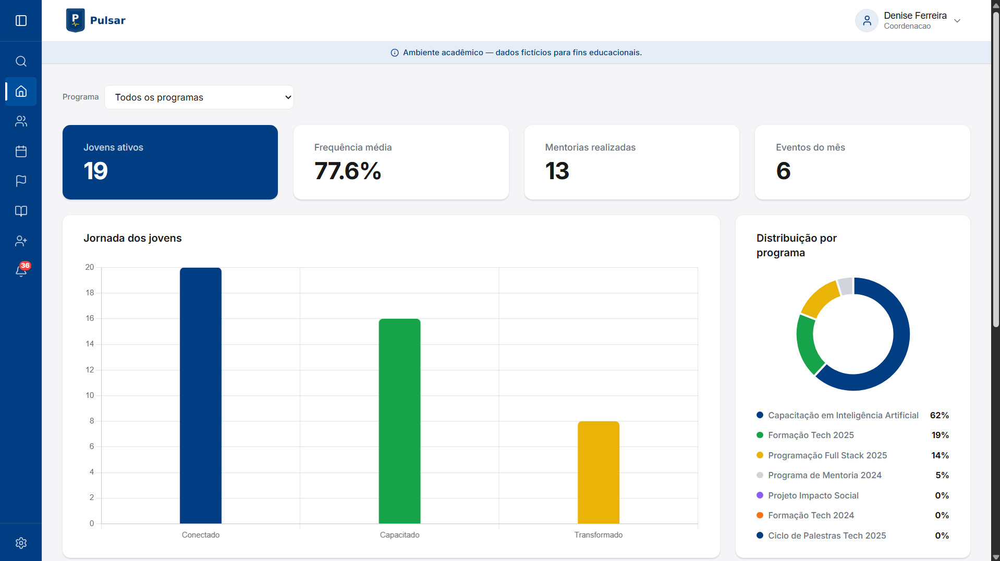<br>
  <sub> Fonte: Material produzido pelos autores (2026) </sub><br><br>
</div>

A sétima frente foi a **construção de cinco novas telas para o perfil Gestão**, ampliando substancialmente o escopo de autoatendimento operacional da plataforma:

**Tela de Cursos e Bolsas** (`cursosBolsasGestao.html`): permite à equipe cadastrar e gerenciar oportunidades de ensino superior e cursos disponíveis para os jovens, integrando-se ao módulo `/api/oportunidades` do backend. A tela exibe listagem filtrável por tipo (bolsa/curso) e status, com formulário de cadastro de campos de instituição, modalidade, prazo e requisitos (RF013, US22).

<div align="center">
  Figura 74: Tela de Cursos e Bolsas — perfil Gestão (sprint 5) <br><br>
  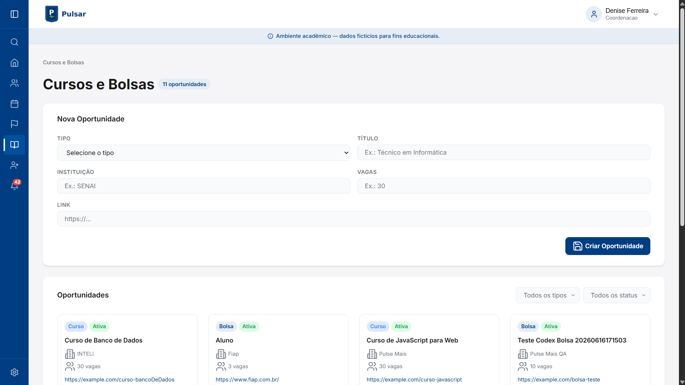<br>
  <sub> Fonte: Material produzido pelos autores (2026) </sub><br><br>
</div>

**Tela de Cadastro de Mentor** (`cadastrarMentorGestao.html`): fluxo de criação de conta para mentores diretamente pela gestão, com listagem dos mentores já cadastrados, busca por nome, contador por status e formulário de criação. O formulário gera automaticamente um usuário com perfil `Mentor` via `POST /api/auth/cadastro`, com DDL de criação de mentor movido para migration numerada (`fix(#628)`). A listagem é atualizada por *polling* configurável, permitindo que a gestão acompanhe novos mentores sem recarregar a página.

<div align="center">
  Figura 75: Tela de Cadastro de Mentor — perfil Gestão (sprint 5) <br><br>
  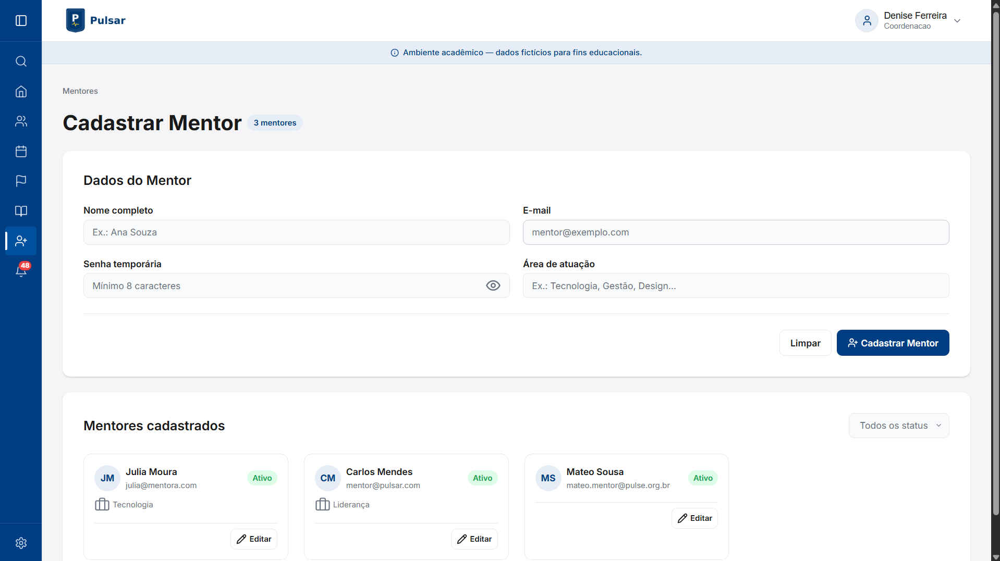<br>
  <sub> Fonte: Material produzido pelos autores (2026) </sub><br><br>
</div>

**Aba de Solicitações de Cadastro de Alunos** (integrada em `telaJovens.html`): gerencia o fluxo de aprovação de novos jovens pela gestão. Solicitações pendentes aparecem em aba dedicada com os dados do solicitante; ao aprovar, o sistema cria o registro do jovem via backend e propaga a ativação ao usuário vinculado (`fix(#647)`); ao rejeitar, o registro é descartado sem persistência. A aba é atualizada por *polling* para que novas solicitações sejam visíveis sem recarregar a página.

<div align="center">
  Figura 76: Aba de Solicitações de Cadastro de Alunos na Tela de Jovens (sprint 5) <br><br>
  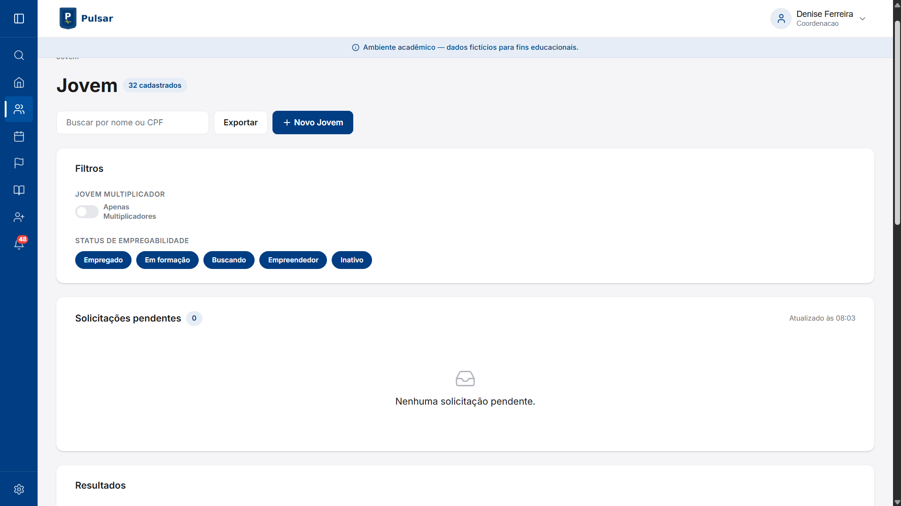<br>
  <sub> Fonte: Material produzido pelos autores (2026) </sub><br><br>
</div>

**Fluxo de Senha Temporária no Cadastro de Jovem** (`cadastroJovem.html`): ao cadastrar um novo jovem, o sistema gera automaticamente uma senha temporária via backend e a exibe na confirmação de cadastro, eliminando a necessidade de comunicação manual de credenciais. A senha é apresentada uma única vez na tela de confirmação, orientando a gestão a comunicá-la ao jovem para o primeiro acesso.

A oitava frente foi a **implementação do banner de conformidade LGPD em todas as telas dos três perfis (RNF-ORG-03)**. O banner é um elemento HTML fixo no topo do layout, persistente durante toda a navegação, que informa o caráter acadêmico da plataforma e orienta o tratamento de dados pessoais conforme a Lei Geral de Proteção de Dados. A implementação utilizou um componente centralizado em `componentes-comuns.css`, aplicado via inclusão no `global.css`, de modo que todas as telas dos perfis Aluno, Mentor e Gestão passaram a exibi-lo sem alteração individual. Isso fechou o último item visual de conformidade com o eixo ORG documentado na seção 3.1.3.

<div align="center">
  Figura 77: Banner de conformidade LGPD visível em tela do portal (sprint 5) <br><br>
  <br>
  <sub> Fonte: Material produzido pelos autores (2026) </sub><br><br>
</div>

A nona frente foi a **eliminação de duplicações de CSS entre os perfis**. Um arquivo `src/public/css/componentes-comuns.css` foi extraído de `aluno-layout.css`, `mentor-layout.css` e dos arquivos CSS de gestão, centralizando os componentes visuais reutilizáveis: `.info-field`, `.edit-pill`, padrões de tabela, cards de KPI e estados de carregamento. Em seguida, o conteúdo de `componentes-comuns.css` foi incorporado diretamente ao `global.css`, consolidando todo o CSS compartilhado em um único arquivo base carregado por todos os perfis. Esse refactoring resolve o débito técnico catalogado na sprint 4 (seção 4.2(b)) e reduz o volume total de CSS, facilitando a manutenção e garantindo coerência visual entre perfis sem duplicação.

**Frente de testes**

A décima frente foi a **ampliação substancial da suíte de testes automatizados** com quatro novas suítes de integração e cinco novas suítes unitárias. As suítes `auth.service.test.js` e `auth.controller.test.js` cobrem o fluxo completo de autenticação (criação de conta, login com bcrypt, emissão de JWT e revogação por `token_version`), fechando o gap de cobertura do `authService` documentado na sprint 4. As suítes `oportunidade.service.test.js` e `oportunidade.controller.test.js` cobrem o CRUD de oportunidades. Os cinco Services utilitários (`certificadoService`, `competenciaService`, `disciplinaService`, `exportacaoService` e `importacaoService`) ganharam suítes unitárias com 100% de cobertura de linhas cada, eliminando o último gap da camada Service. O impacto quantitativo dessa ampliação sobre os indicadores de RNF-SUP-01 está detalhado na seção 5.1, que apresenta o relatório de cobertura por camada do estado final do projeto.

A tabela a seguir consolida o que foi implementado na sprint 5 contra os *gaps* documentados ao fim da sprint 4:

| Gap documentado (sprint 4) | Status (sprint 5) | Entregável(is) |
|---|---|---|
| RF013/RN17 (*ownership* granular por Aluno) | **Resolvido** | `jovemService.buscarPorId` + 3 cenários de teste (200/403/401); ownership estendido a Mentorias e Dashboard |
| FK inexistente → HTTP 500 cru do PostgreSQL | **Resolvido** | Validação de existência no Service (6 entidades) + `errorHandler` tratando `23503`, `23505`, `22P02` |
| RNF-DES-01/02, RNF-CAP-01 (testes de carga) | **Resolvido** | Suíte Artillery em `src/scripts/load-test/` com perfis *smoke* e carga sustentada |
| RNF-ORG-03 (banner visual de conformidade LGPD) | **Resolvido** | Componente *sticky* em `componentes-comuns.css` aplicado a todos os perfis |
| Duplicação de CSS entre `aluno-layout.css` e `mentor-layout.css` | **Resolvido** | `componentes-comuns.css` extraído e referenciado pelos três layouts |
| Cobertura dos 5 Services utilitários | **Resolvido** | Suítes adicionadas: `certificado`, `competência`, `disciplina`, `exportação`, `importação`, 100% de linhas cada |
| Cobertura do `authService` (gap da sprint anterior) | **Resolvido** | `auth.service.test.js` + `auth.controller.test.js`, fluxo completo de login/revogação |
| Novas telas da Gestão (mentor, solicitações, cursos) | **Resolvido** | `cadastrarMentorGestao.html`, `cursosBolsasGestao.html`, aba solicitações em `telaJovens.html`, senha temporária em `cadastroJovem.html` |

### (b) Pendências remanescentes

Concluído o MVP, as pendências remanescentes são exclusivamente de natureza incremental e não comprometem nenhum dos fluxos centrais entregues: o **formulário público de atualização cadastral sem autenticação (RF016)** e os requisitos de **backlog RF017 (e-mails informativos) e RF018 (campos customizados no prontuário)**, todos explicitamente fora do escopo do MVP desde a seção 3.1.1; e o **portal frontend dedicado à Psicóloga**, cujo backend está completamente implementado e testado (endpoints `/api/saude-mental` e `/api/atendimentos` com controle de acesso por `authorize`), mas cuja interface de usuário própria foi deliberadamente despriorizada no MVP em favor dos portais de maior impacto operacional, conforme decisão de escopo registrada na seção 4.2.

### (c) Dificuldades técnicas enfrentadas

A principal dificuldade foi **otimizar as queries de dashboard sem alterar o contrato de resposta** já consumido pelo frontend: o desafio era reescrever as consultas para usar os novos índices e reduzir *seq scans* mantendo exatamente o mesmo formato de payload, validado pelos testes de integração existentes. A estratégia foi guiar cada alteração pelo `EXPLAIN ANALYZE` antes e depois, garantindo que o plano de execução passasse a usar *index scan* sem mudar o resultado.

A segunda dificuldade foi **calibrar a estratégia de retry para não introduzir duplicação**: a decisão de restringir o *retry* a métodos idempotentes e a falhas transientes exigiu mapear com cuidado quais status são seguramente repetíveis (timeout, 503, 504) e quais nunca devem ser refeitos (qualquer 4xx, e todas as escritas), apoiando-se nas constraints `UNIQUE` do banco como segunda linha de defesa.

A terceira foi **montar um perfil de carga representativo** com credenciais reais por perfil sem expor segredos no repositório, resolvido com o arquivo `.env.load-test.example` versionado e o `.env.load-test` real mantido fora do controle de versão via `.gitignore`.

A quarta dificuldade foi o **tratamento de erros nativos do driver `pg` no `errorHandler`**. O driver propaga erros com códigos SQLSTATE em `error.code`, mas a lista de códigos relevantes para o domínio (FK violation, UNIQUE violation, tipo inválido) precisou ser mapeada manualmente e testada contra o comportamento real do banco. A solução foi um bloco de tratamento centralizado que verifica `error.code` antes de cair no handler genérico de `500`, garantindo que erros previsíveis gerem respostas semanticamente corretas sem vazar detalhes internos do PostgreSQL ao cliente, em conformidade com RNF-ORG-01.

A quinta foi **implementar o *polling* de solicitações de cadastro no frontend** sem criar pressão excessiva sobre o servidor: a listagem de solicitações pendentes em `telaJovens.html` atualiza automaticamente a cada intervalo configurável usando `setInterval`, com limpeza adequada no evento `beforeunload` para evitar requisições de telas descartadas. O intervalo foi calibrado para equilibrar responsividade (a gestão vê novas solicitações sem recarregar a página) e impacto sobre o servidor (sem requisições contínuas a cada segundo).

A sexta foi a **extração de componentes comuns de CSS** sem introduzir regressões visuais nas telas existentes. Como os três layouts (`aluno-layout.css`, `mentor-layout.css`, e os CSS de gestão) acumulavam variações sutis nos mesmos seletores, a extração exigiu reconciliar diferenças de precedência e garantir que o `componentes-comuns.css` servisse como base neutra, com cada layout sobrescrevendo apenas o que era genuinamente específico do perfil. O processo foi guiado por inspeção visual das telas em três breakpoints (360px, 768px e 1280px) antes e depois da extração, corrigindo regressões de responsividade identificadas na revisão.

# <a name="c5"></a>5. Testes

Esta seção consolida as evidências de verificação da plataforma Pulsar em duas frentes complementares. Na subseção 5.1, são apresentados os testes automatizados — unitários da camada de serviços e de integração dos endpoints HTTP —, que comprovam, de forma reproduzível, a correção das regras de negócio e dos contratos da API. Na subseção 5.2, são reportados os testes de usabilidade conduzidos com usuários reais, abrangendo o método de guerrilha (qualitativo) e o questionário SUS (quantitativo). Dessa forma, articula-se a evidência técnica de robustez do sistema à evidência empírica de experiência de uso, sustentando a aferição de qualidade da solução entregue à Pulse Mais.

## <a name="c5.1"></a>5.1. Relatório de testes de integração de endpoints automatizados
Esta subseção descreve a estratégia de testes automatizados adotada na plataforma Pulsar e as evidências dela decorrentes. Definiu-se um escopo em dois níveis: a verificação unitária das regras de negócio na camada de serviços, isolada do banco por meio de mocks, e a verificação de integração dos endpoints HTTP, exercitando o fluxo completo da requisição. As subseções subsequentes detalham a estratégia e as técnicas empregadas (5.1.1), os testes unitários de service em caixa branca (5.1.2), os testes de integração de endpoints em caixa preta (5.1.3) e as evidências de execução e cobertura (5.1.4), de modo a demonstrar o atendimento ao requisito mínimo de cobertura definido para o projeto.


### <a name="c5.1.1"></a>5.1.1 Estratégia de Testes


A estratégia de testes adotada no projeto Pulse Mais API fundamenta-se em dois níveis complementares de verificação: testes unitários aplicados à camada de serviços (*Services*) e testes de integração aplicados à camada de controladores e endpoints HTTP (*Controllers*). Cada nível opera com uma técnica de caixa distinta, escolhida de acordo com a natureza do componente avaliado, e ambos são executados pelo framework Jest, configurado no arquivo `jest.config.js` na raiz do projeto.


---


#### Técnica de Caixa Branca nos Services (White-Box Testing)


Os testes unitários da camada de serviços empregam a técnica de **caixa branca** (*white-box testing*), que pressupõe conhecimento da estrutura interna do módulo sob teste. Nesse nível, o objetivo é verificar se as regras de negócio estão corretamente implementadas — incluindo validações de campos obrigatórios, conversões de tipo, enumerações permitidas e lançamento de exceções específicas — independentemente de qualquer infraestrutura externa.


O isolamento do banco de dados PostgreSQL é obtido por meio do mecanismo `jest.mock()`, que substitui os módulos de repositório por funções simuladas (*mock functions*) controladas pelo próprio Jest. Essa abordagem transforma cada teste de serviço em um teste puramente unitário: o código de produção do *service* é executado integralmente, mas todas as chamadas ao repositório são interceptadas e respondidas por valores pré-definidos pelo teste. Com isso, os testes não dependem de conexão com banco de dados, eliminando variáveis externas que poderiam introduzir instabilidade.


Um aspecto característico da caixa branca neste projeto é a verificação de chamadas internas. Os testes não apenas validam o valor de retorno do *service*, mas também inspecionam os argumentos com que o repositório foi acionado, por meio de asserções como `expect(repository.metodo).toHaveBeenCalledWith(expect.objectContaining({ ... }))`. Esse padrão confirma que transformações internas ao *service* — como a conversão de `usuario_id` de string para número em `logAuditoriaService` e `notificacaoService`, ou a conversão do parâmetro `lida` de `'true'`/`'false'` para booleano em `notificacaoService` — foram aplicadas antes de o dado ser repassado ao repositório.


---


#### Técnica de Caixa Preta nos Endpoints (Black-Box Testing)


Os testes dos controladores e das rotas HTTP empregam a técnica de **caixa preta** (*black-box testing*): o avaliador interage apenas pelas interfaces externas da aplicação — as requisições HTTP — sem acesso ou inspeção das decisões internas de implementação. O objetivo é verificar se o sistema produz as respostas corretas (código HTTP, corpo JSON, cabeçalhos) para uma determinada entrada, simulando o comportamento real de um cliente.


A ferramenta utilizada para esse nível é o **Supertest**, que instancia a aplicação Express em memória — sem abertura de porta de rede — e emite requisições HTTP programáticas. A aplicação montada nos testes é idêntica à de produção: utiliza as rotas reais, os middlewares reais de autenticação (`authenticate`) e autorização (`authorize`), e o *middleware* global de tratamento de erros (`errorHandler`). Essa fidelidade arquitetural garante que o comportamento testado corresponde ao comportamento que o sistema exibirá em produção.


A autenticação é tratada por meio de tokens JWT gerados pelo utilitário `createAuthToken`, disponível em `endpointTestHelper.js`. O token é assinado com a chave definida na variável de ambiente `JWT_SECRET` e carrega *payload* com `id`, `perfil` e `token_version`. A validação do token pelo middleware de autenticação é suportada por um mock do *pool* do PostgreSQL (via `mockAuthenticatedUser`), que responde com `{ token_version: 0, ativo: true }`, simulando um usuário ativo sem necessidade de banco real. Com isso, os testes de endpoint exercitam o fluxo completo de autenticação e autorização em ambiente completamente controlado.


Os testes de controlador em modo de unidade — aqueles que invocam a função do controlador diretamente, sem Supertest — utilizam os utilitários `createMockReq` e `createMockRes` do arquivo `testHelper.js`, que constroem objetos `req` e `res` compatíveis com a interface do Express, com espias (*spies*) nos métodos `status`, `json`, `send` e `sendStatus`. Esses testes verificam o comportamento do controlador de forma isolada da camada de roteamento HTTP.


---


#### Padrão AAA (Arrange, Act, Assert)


Todos os testes do projeto seguem o padrão **AAA** (*Arrange, Act, Assert*), que estrutura cada caso de teste em três fases logicamente separadas:


- **Arrange**: configuração do estado inicial do teste — definição dos objetos de entrada (`mockJovem`, `mockNotificacao`, `mockLog`, entre outros) e programação do comportamento dos mocks de repositório via `mockResolvedValue` ou `mockRejectedValue`.
- **Act**: execução do comportamento sob teste — invocação do método do *service* ou emissão da requisição HTTP via Supertest.
- **Assert**: verificação das pós-condições — comparação do resultado obtido com o esperado por meio de funções como `expect(...).toEqual(...)`, `expect(...).toHaveBeenCalledWith(...)`, `expect(...).rejects.toThrow(...)` e inspeção de códigos de status HTTP.


A adesão ao padrão AAA foi avaliada na auditoria da suíte e classificada como excelente: em praticamente todos os casos de teste, as três fases são claramente distinguíveis, sem sobreposição de responsabilidades entre elas.


---


#### Determinismo


O determinismo — propriedade pela qual um teste produz o mesmo resultado independentemente do momento, da máquina ou da ordem de execução — é garantido por dois mecanismos principais.


O primeiro é a declaração de objetos de entrada estáticos no topo de cada arquivo de teste. Dados como `mockLog`, `mockNotificacao` e `mockAnotacao` são constantes imutáveis, sem dependência de `new Date()`, `Math.random()` ou qualquer fonte de aleatoriedade, assegurando que o *arrange* de cada teste seja reproduzível.


O segundo é a configuração do Jest com as opções `clearMocks: true` e `restoreMocks: true` no `jest.config.js`, complementadas pela chamada explícita a `jest.clearAllMocks()` no *hook* `beforeEach` de cada suíte. Esse conjunto garante que o estado dos mocks — número de chamadas, argumentos registrados e valores programados — seja integralmente zerado antes de cada caso de teste, eliminando contaminação entre testes consecutivos.


Registra-se como ressalva que o arquivo auxiliar `fixtures.js`, presente na pasta de testes, contém chamadas a `new Date().toISOString()` e `Math.random()`. Embora esse módulo não seja referenciado pelos testes unitários de serviços que realizam comparações estritas com `toEqual`, seu uso em asserções de *snapshot* ou comparações diretas introduziria testes não determinísticos (*flaky tests*).


---


#### Isolamento


O isolamento entre os componentes testados é obtido de forma distinta em cada camada.


Na camada de serviços, o isolamento é completo: `jest.mock('../repositories/nomeRepository')` intercepta toda a comunicação do *service* com o repositório, e `jest.mock('../database/db')` impede qualquer abertura de conexão com o PostgreSQL. O código de produção do *service* é o único módulo efetivamente executado, tornando a suíte independente de ambiente de banco de dados.


Na camada de controladores com Supertest, o isolamento ocorre na fronteira entre o controlador e o *service*: `jest.mock('../services/nomeService')` substitui o *service* por funções simuladas, de modo que o teste valida exclusivamente o comportamento do controlador e dos middlewares da rota, sem acionar a lógica de negócio real. A conexão com o banco também é mockada via `jest.mock('../database/db')`, permitindo que o middleware de autenticação execute sem dependência de infraestrutura real.


---


#### Cobertura


A cobertura de testes é coletada pelo mecanismo nativo do Jest, com saída configurada no diretório `coverage/` conforme definido em `jest.config.js`. Os relatórios são gerados ao executar `jest --coverage` e abrangem as métricas de linhas (*lines*), ramos (*branches*), funções (*functions*) e declarações (*statements*).


Na camada de serviços — principal foco de cobertura do projeto — os índices apurados na última execução foram de **96,90% de linhas** e **93% de ramos**. Os serviços que atingiram 100% de linhas incluem `anotacaoService`, `atividadeService`, `authService`, `certificadoService`, `competenciaService`, `disciplinaService`, `ensinoSuperiorService`, `eventoService`, `exportacaoService`, `importacaoService`, `logAuditoriaService`, `oportunidadeService`, `participacaoEventoService`, `saudeMentalService` e `usuarioService`, com `programaService` (98,24%), `matriculaService` (97,43%) e `notificacaoService` (96,87%) logo na sequência. Os serviços com menor cobertura na camada são `empregabilidadeService` (87,03% de linhas), `dashboardService` (88,23% de linhas) e `mentoriaService` (88,88% de linhas, 85% de ramos), concentrando os principais pontos de melhoria para iterações futuras. O `authService`, gap da sprint anterior, passou a ser totalmente coberto nesta sprint (100% de linhas via `auth.service.test.js`), deixando de ser fator de redução da média da camada.


A cobertura geral do projeto, incluindo repositórios e outros módulos, foi apurada em 74,74% de linhas, reflexo da decisão de concentrar os esforços de teste nas camadas de regras de negócio (Service) e de contrato HTTP (Controller), onde a complexidade e o risco de defeito são mais elevados, deixando deliberadamente fora da cobertura os repositórios — cuja lógica SQL é exercitada indiretamente pelos mocks — e os models de mapeamento.


---


#### Critérios de Qualidade


Os critérios de qualidade adotados para a suíte de testes são os seguintes:


**Ausência de testes quebradiços (*flaky tests*)**: cada teste deve produzir resultado binário e estável. A zeragem de mocks via `clearMocks` e o uso de dados estáticos no *arrange* são os mecanismos primários para satisfazer esse critério.


**Cobertura mínima da camada de serviços**: a suíte deve manter cobertura igual ou superior a 90% de linhas e ramos na camada `services/`, garantindo que a esmagadora maioria das regras de negócio seja exercitada por pelo menos um caso de teste.


**Cobertura de caminhos de erro**: além dos fluxos de sucesso, cada método testado deve possuir ao menos um caso de teste para o caminho de falha esperado — seja o lançamento de `BadRequestError` para entradas inválidas, `NotFoundError` para recursos inexistentes ou `ConflictError` para violações de unicidade. Asserções assíncronas de rejeição utilizam o padrão `await expect(...).rejects.toThrow(TipoDeErro)`, protegido pelo `await` para evitar falsos positivos.


**Verificação de contratos entre camadas**: os testes de caixa branca dos *services* devem verificar não apenas o valor de retorno, mas também os argumentos passados ao repositório, garantindo que transformações de tipo e limpeza de parâmetros sejam aplicadas antes de cada chamada ao repositório.


**Fidelidade dos testes de endpoint**: os testes de integração HTTP devem exercitar os middlewares reais de autenticação e autorização, validando ao menos um cenário de acesso não autenticado (resposta `401 Unauthorized`) e o conjunto de operações CRUD com token válido para cada domínio.


**Timeout controlado**: o Jest é configurado com `testTimeout` de 10.000 ms para operações assíncronas, prevenindo que testes pendurados (*hanging tests*) bloqueiem indefinidamente a suíte de CI.


**Execução em ambiente isolado de banco**: nenhum teste da suíte deve exigir conexão ativa com o PostgreSQL. Toda comunicação com banco de dados é substituída por mocks, assegurando que a suíte possa ser executada em qualquer ambiente de desenvolvimento ou pipeline de integração contínua sem configuração de infraestrutura adicional.


---


### <a name="c5.1.2"></a>5.1.2 Testes Unitários de Service (White-Box)


#### Visão Geral da Cobertura


A camada de serviços (*Services*) constitui o núcleo de regras de negócio da plataforma Pulse Mais. É nessa camada que residem as validações de campos obrigatórios, as verificações de unicidade, as conversões de tipo, os controles de enumeração e o lançamento das exceções de domínio (`BadRequestError`, `NotFoundError`, `ConflictError`). Por esse motivo, os testes unitários de *service* foram priorizados como principal frente de cobertura do projeto.


**Services testados:** 24 suítes de teste identificadas na pasta `src/tests/`, cobrindo os *services*: `anotacaoService`, `atividadeService`, `authService`, `certificadoService`, `competenciaService`, `dashboardService`, `disciplinaService`, `empregabilidadeService`, `ensinoSuperiorService`, `entregaAtividadeService`, `eventoService`, `exportacaoService`, `frequenciaService`, `importacaoService`, `jovemService`, `logAuditoriaService`, `matriculaService`, `mentoriaService`, `notificacaoService`, `oportunidadeService`, `participacaoEventoService`, `programaService`, `saudeMentalService` e `usuarioService`.


**Principais categorias de regras de negócio cobertas:**


- Validação de campos obrigatórios e rejeição com `BadRequestError`
- Validação de enumerações (perfis, tipos, status, vínculos, modalidades)
- Validação de formato e integridade de CPF (algoritmo de dígito verificador)
- Validação de formato de e-mail
- Prevenção de duplicidade de CPF e e-mail com `ConflictError`
- Unicidade de participação em evento (jovem × evento)
- Coerência temporal: `data_fim >= data_inicio`
- Restrição de senha mínima (8 caracteres) e hash bcrypt obrigatório
- Conversão de tipo de query string para tipos nativos (`string → number`, `'true'/'false' → boolean`)
- Remoção de dado sensível (`senha_hash`) antes do retorno ao controlador
- Verificação de existência de entidade antes de operações (`buscarPorId` → `NotFoundError`)
- Arquivamento lógico (`ativo: false`) em vez de exclusão física


**Percentual de cobertura apurado:**


- Camada `services/` — **96,90% de linhas** e **93% de ramos** (96,81% de declarações e 95,43% de funções)
- Services com cobertura de linhas igual ou superior a 94%: a maioria da camada, com destaque para os quinze que atingiram 100% de linhas (incluindo `certificadoService`, `competenciaService`, `disciplinaService`, `exportacaoService` e `importacaoService`, cobertos nesta sprint); os menores índices ficam com `empregabilidadeService` (87,03%), `dashboardService` (88,23%) e `mentoriaService` (88,88%); o `authService`, serviço de login (RF002), passou a 100% de linhas nesta sprint


**Justificativa da adoção de testes white-box na camada Service:**


A técnica de caixa branca é adotada nessa camada porque o objetivo não é apenas verificar o valor retornado pelo serviço, mas sim inspecionar o comportamento interno: quais métodos do repositório foram chamados, com quais argumentos, em qual sequência e em qual condição. Esse nível de inspeção só é possível com conhecimento da estrutura interna do módulo e acesso aos objetos simulados (*mocks*) que substituem suas dependências. Sem caixa branca, seria impossível verificar, por exemplo, que a conversão de `usuario_id` de string para número ocorre *antes* da chamada ao repositório, ou que o campo `senha_hash` é removido *após* o retorno do banco, mas *antes* de ser exposto ao controlador.


---


#### Tabela de Rastreabilidade


A tabela a seguir relaciona os casos de teste unitários de *service* com seus respectivos Requisitos Funcionais (RF) e Regras de Negócio (RN), conforme identificados na documentação do projeto. Os casos estão ordenados pela prioridade das RNs, priorizando segurança, integridade de dados e unicidade.

> **Convenção de numeração.** O identificador `CT-XX-NN` designa o *N*-ésimo caso de teste da suíte do módulo `XX` (ex.: `CT-JV-11` = 11º teste de `jovem.service.test.js`). As faixas citadas na RTM (seção 3.9) correspondem ao total real de casos de cada suíte; este catálogo detalha apenas um **subconjunto representativo** por RN priorizada, não a suíte inteira — por isso a faixa pode exceder os IDs aqui enumerados.


| CT | RF | RN | Service | Método testado | Objetivo do teste |
|:--|:--|:--|:--|:--|:--|
| CT-US-01 | RF002 | RN07 | `usuarioService` | `criar` | Verificar que bcrypt é acionado com fator 10 e que `senha_hash` não é exposto no retorno |
| CT-US-02 | RF002 | RN07 | `usuarioService` | `criar` | Rejeitar senha com menos de 8 caracteres com `BadRequestError` |
| CT-US-03 | RF002 | RN02 | `usuarioService` | `criar` | Lançar `ConflictError` quando e-mail já está cadastrado |
| CT-US-04 | RF002 | RN02 | `usuarioService` | `atualizar` | Lançar `ConflictError` quando e-mail pertence a outro usuário |
| CT-US-05 | RF003 | RN08 | `usuarioService` | `criar` | Lançar `BadRequestError` quando perfil não pertence ao conjunto de perfis válidos |
| CT-US-06 | RF003 | RN08 | `usuarioService` | `criar` | Verificar que todos os 6 perfis válidos são aceitos na criação |
| CT-US-07 | RF003 | RN08 | `usuarioService` | `listarTodos` | Converter `ativo` de string `'true'`/`'false'` para booleano antes de repassar ao repositório |
| CT-JV-01 | RF001 | RN01 | `jovemService` | `criar` | Lançar `ConflictError` quando CPF já está cadastrado |
| CT-JV-02 | RF001 | RN02 | `jovemService` | `criar` | Lançar `ConflictError` quando e-mail já está cadastrado |
| CT-JV-03 | RF001 | RN03 | `jovemService` | `criar` | Lançar `BadRequestError` quando campos obrigatórios estão ausentes |
| CT-JV-04 | RF001 | RN04 | `jovemService` | `criar` | Lançar `BadRequestError` quando `status_jornada` não pertence ao enum aceito |
| CT-JV-05 | RF001 | RN19 | `jovemService` | `criar` | Lançar `BadRequestError` quando CPF tem dígito verificador inválido |
| CT-JV-06 | RF001 | RN04 | `jovemService` | `criar` | Verificar que todos os 6 valores de `status_jornada` válidos são aceitos |
| CT-JV-07 | RF001 | RN19 | `jovemService` | `criar` | Lançar `BadRequestError` quando e-mail tem formato inválido |
| CT-JV-08 | RF001 | RN01 | `jovemService` | `atualizar` | Lançar `ConflictError` quando CPF válido pertence a outro jovem |
| CT-JV-09 | RF001 | RN13 | `jovemService` | `arquivar` | Persistir `ativo: false` e retornar jovem atualizado |
| CT-PG-01 | RF004 | RN derivada do modelo (coerência temporal de datas) | `programaService` | `criar` | Lançar `BadRequestError` quando `data_fim` é anterior a `data_inicio` |
| CT-PG-02 | RF004 | RN derivada do modelo (carga horária não-negativa) | `programaService` | `criar` | Lançar `BadRequestError` quando carga horária é negativa |
| CT-PG-03 | RF004 | RN derivada do modelo (ano mínimo 2000) | `programaService` | `criar` | Lançar `BadRequestError` quando ano é inferior a 2000 |
| CT-PG-04 | RF004 | RN derivada do modelo (nome não-vazio) | `programaService` | `criar` | Lançar `BadRequestError` quando nome está vazio ou contém apenas espaços |
| CT-PG-05 | RF004 | RN derivada do modelo (conversão de tipo) | `programaService` | `listarTodos` | Converter `ano` de string para número antes de repassar ao repositório |
| CT-PE-01 | RF015 | RN derivada do modelo (UNIQUE jovem × evento) | `participacaoEventoService` | `criar` | Lançar `ConflictError` quando já existe participação do jovem no evento |
| CT-PE-02 | RF015 | RN derivada do modelo (FK válida) | `participacaoEventoService` | `criar` | Lançar `NotFoundError` quando o jovem não existe |
| CT-PE-03 | RF015 | RN derivada do modelo (FK válida) | `participacaoEventoService` | `criar` | Lançar `NotFoundError` quando o evento não existe |
| CT-PE-04 | RF015 | RN derivada do modelo (conversão de tipo) | `participacaoEventoService` | `criar` | Converter `presente` de string `'true'`/`'false'` para booleano |
| CT-PE-05 | RF015 | RN derivada do modelo (conversão de tipo) | `participacaoEventoService` | `criar` | Converter `jovem_id` e `evento_id` de string numérica para número |
| CT-PE-06 | RF015 | RN derivada do modelo (FK válida) | `participacaoEventoService` | `listarPorJovem` | Lançar `NotFoundError` quando jovem não existe ao listar por jovem |
| CT-EM-01 | RF010 | RN derivada do modelo (enum tipo_vinculo) | `empregabilidadeService` | `criar` | Lançar `BadRequestError` quando `tipo_vinculo` não pertence ao enum aceito |
| CT-EM-02 | RF010 | RN derivada do modelo (enum tipo_vinculo) | `empregabilidadeService` | `criar` | Verificar que todos os 7 tipos de vínculo válidos são aceitos |
| CT-EM-03 | RF010 | RN derivada do modelo (campos opcionais) | `empregabilidadeService` | `criar` | Verificar que enums nulos (campos opcionais) são aceitos sem erro |
| CT-EM-04 | RF010 | RN derivada do modelo (conversão de tipo) | `empregabilidadeService` | `listarTodos` | Converter `jovem_id` de string para número antes de repassar ao repositório |
| CT-NO-01 | RF003/RF004 | RN derivada do modelo (enum tipo de notificação) | `notificacaoService` | `criar` | Lançar `BadRequestError` quando `tipo` é inválido |
| CT-NO-02 | RF003/RF004 | RN derivada do modelo (conversão de tipo) | `notificacaoService` | `listarTodos` | Converter `usuario_id` de string para número antes de repassar ao repositório |
| CT-NO-03 | RF003/RF004 | RN derivada do modelo (conversão de tipo) | `notificacaoService` | `listarTodos` | Converter `lida` de string `'true'`/`'false'` para booleano |
| CT-LA-01 | RF014 | RN11 | `logAuditoriaService` | `listarTodos` | Lançar `BadRequestError` quando `operacao` é inválida |
| CT-LA-02 | RF014 | RN11 + RN15 | `logAuditoriaService` | `listarTodos` | Repassar filtros de `entidade`, `metodo_http` e datas ao repositório corretamente |
| CT-LA-03 | RF014 | RN15 | `logAuditoriaService` | `buscarPorId` | Lançar `NotFoundError` quando o log não existe |


---


#### Análise Detalhada dos 5 Casos Prioritários


Os cinco casos a seguir foram selecionados por representarem as regras de negócio de maior criticidade para a segurança, integridade e confiabilidade da plataforma.


---


##### CT-US-01 – Hash obrigatório de senha com bcrypt


**Objetivo**


Garantir que o `usuarioService`, ao criar um novo usuário, jamais armazene a senha em texto simples. A senha fornecida deve ser transformada em hash via `bcrypt` com fator de custo 10, e o campo `senha_hash` não deve constar no objeto retornado ao chamador.


**RN Coberta**


RN07 — *A senha deve ter no mínimo 8 caracteres, ser armazenada como hash bcrypt e nunca ser exposta nas respostas da API.*


**Implementação do padrão AAA**


- **Arrange:** `bcrypt.hash` é mockado para retornar a string `'$2b$10$novoHashFicticio'`. `usuarioRepository.buscarPorEmail` é configurado para retornar `null` (sem duplicidade). `usuarioRepository.criar` é configurado para retornar o objeto do usuário já com `senha_hash` preenchido.


- **Act:** O método `usuarioService.criar` é invocado com dados válidos, incluindo a senha em texto plano `'senha123'`.


- **Assert:** Três asserções são verificadas: (1) o campo `senha_hash` não existe no objeto retornado (`toBeUndefined`); (2) `bcrypt.hash` foi chamado com os argumentos exatos `('senha123', 10)`; (3) `usuarioRepository.criar` recebeu o objeto com `senha_hash` contendo o hash fictício, por meio de `expect.objectContaining`.


**Determinismo**


O módulo `bcrypt` é substituído na íntegra por `jest.mock('bcrypt', ...)`, impedindo qualquer operação criptográfica real — que seria não determinística por natureza (salt aleatório). O objeto `mockUsuario` é uma constante estática definida no topo do arquivo. O `clearAllMocks()` no `beforeEach` garante que o estado do mock de `bcrypt.hash` é zerado antes de cada teste, eliminando contaminação entre casos.


**Caminho de falha validado**


O complementar CT-US-02 valida o caminho de erro: quando a senha possui menos de 8 caracteres, o service deve lançar `BadRequestError` *antes* de invocar `bcrypt.hash`, confirmando que a operação custosa de hash nunca é executada para entradas inválidas.


**Resultado esperado**


O sistema aceita a criação do usuário, armazena o hash no banco e retorna o objeto sem o campo `senha_hash`, respeitando o princípio de mínima exposição de dados sensíveis.


---


##### CT-JV-01 – Rejeição de CPF duplicado na criação do jovem


**Objetivo**


Garantir que o `jovemService` impeça o cadastro de um jovem cujo CPF já conste na base de dados, lançando `ConflictError` antes de qualquer tentativa de persistência.


**RN Coberta**


RN01 — *Impedir cadastro com CPF duplicado.*


**Implementação do padrão AAA**


- **Arrange:** `jovemRepository.buscarPorCpf` é configurado para retornar um objeto com `id: 99`, simulando a existência de um jovem com o mesmo CPF. `jovemRepository.buscarPorEmail` retorna `null`.


- **Act:** `jovemService.criar` é invocado com o objeto `mockJovem`, que contém o CPF `'52998224725'` — constante estática válida no algoritmo de Luhn.


- **Assert:** A promise deve rejeitar com uma instância de `ConflictError`, verificado via `await expect(...).rejects.toThrow(ConflictError)`.


**Determinismo**


Os repositórios são mocks Jest com valores fixos definidos no *arrange*. O CPF é uma constante estática em `mockJovem`. Não há dependência de banco real, relógio, rede ou ordem de execução. O `clearAllMocks()` garante estado limpo entre testes.


**Caminho de falha validado**


O teste confirma que o service aplica a verificação de unicidade *antes* de tentar persistir o registro, garantindo que `jovemRepository.criar` nunca é invocado em cenário de duplicidade. O teste CT-JV-05 complementa ao verificar que CPFs com dígito verificador inválido são rejeitados ainda antes da consulta ao repositório.


**Resultado esperado**


O sistema rejeita o cadastro e retorna erro de conflito (HTTP 409 no nível do controlador), preservando a unicidade do CPF na base.


---


##### CT-PG-01 – Coerência temporal de datas do programa


**Objetivo**


Garantir que o `programaService` rejeite a criação de um programa quando `data_fim` é anterior a `data_inicio`, independentemente dos demais campos fornecidos.


**RN Coberta**


Regra implícita de integridade temporal — *a data de encerramento deve ser igual ou posterior à data de início do programa.*


**Implementação do padrão AAA**


- **Arrange:** Nenhum mock de repositório precisa ser configurado, pois a validação temporal ocorre *antes* de qualquer chamada ao repositório — a detecção precoce de entradas inválidas impede consumo desnecessário de recursos.


- **Act:** `programaService.criar` é invocado com `data_inicio: '2026-07-01'` e `data_fim: '2026-06-30'`.


- **Assert:** A promise deve rejeitar com `BadRequestError`, verificado via `await expect(...).rejects.toThrow(BadRequestError)`.


**Determinismo**


As datas são literais estáticos, sem dependência de `new Date()` ou relógio do sistema. O resultado será sempre o mesmo independentemente do momento de execução. O teste complementar (`data_fim === data_inicio`) verifica que a fronteira do intervalo está corretamente mapeada como caso válido.


**Caminho de falha validado**


O service detecta a incoerência da ordem das datas e lança `BadRequestError` sem invocar `programaRepository.criar`, protegendo a integridade semântica dos dados antes da persistência.


**Resultado esperado**


O sistema rejeita a criação do programa e retorna erro 400, prevenindo que programas com janela temporal inválida sejam registrados na base.


---


##### CT-PE-01 – Prevenção de participação duplicada em evento


**Objetivo**


Garantir que o `participacaoEventoService` impeça que um mesmo jovem seja inscrito duas vezes no mesmo evento, lançando `ConflictError` quando a combinação `jovem_id × evento_id` já existe na base.


**RN Coberta**


Regra implícita de participação única — *um jovem não pode ter duas inscrições para o mesmo evento.*


**Implementação do padrão AAA**


- **Arrange:** `jovemRepository.buscarPorId` e `eventoRepository.buscarPorId` retornam os respectivos objetos (ambas as entidades existem). `participacaoEventoRepository.buscarPorJovemEEvento` retorna o registro de participação já existente (`mockParticipacao`), simulando a duplicidade.


- **Act:** `participacaoEventoService.criar` é invocado com `{ jovem_id: 1, evento_id: 2 }`.


- **Assert:** A promise deve rejeitar com `ConflictError`.


**Determinismo**


Três repositórios distintos são mockados: `participacaoEventoRepository`, `jovemRepository` e `eventoRepository`. Todos retornam valores estáticos predefinidos, sem acesso a banco real. O `clearAllMocks()` garante que o estado de cada mock é zerado entre testes. O objeto `mockParticipacao` é uma constante definida no topo do arquivo.


**Caminho de falha validado**


O service valida a existência do jovem, a existência do evento e, por último, a inexistência de participação prévia. O teste exercita o terceiro passo da cadeia de validação, confirmando que o `ConflictError` é lançado apenas quando as duas entidades existem mas a participação já foi registrada. Os testes CT-PE-02 e CT-PE-03 cobrem os caminhos onde jovem ou evento não existem.


**Resultado esperado**


O sistema rejeita a segunda inscrição e retorna erro 409, preservando a unicidade da relação `jovem × evento` na base de dados.


---


##### CT-LA-02 – Repasse fiel de filtros ao repositório de auditoria


**Objetivo**


Garantir que o `logAuditoriaService` repasse corretamente ao repositório todos os filtros de consulta fornecidos — `entidade`, `metodo_http`, `metodos_http`, `data_inicio` e `data_fim` — sem truncar, modificar ou ignorar nenhum parâmetro válido.


**RN Coberta**


Regra implícita de rastreabilidade — *consultas ao log de auditoria devem suportar filtragem por entidade, método HTTP e intervalo de datas.*


**Implementação do padrão AAA**


- **Arrange:** `logAuditoriaRepository.listarTodos` é configurado para retornar uma lista vazia. O objetivo do teste é verificar os *argumentos* da chamada, não o valor retornado.


- **Act:** `logAuditoriaService.listarTodos` é invocado com `{ entidade: 'jovens', metodo_http: 'GET', metodos_http: 'POST' }`.


- **Assert:** O repositório deve ter sido chamado com um objeto que contém exatamente os três filtros fornecidos, verificado via `expect(logAuditoriaRepository.listarTodos).toHaveBeenCalledWith(expect.objectContaining({ entidade: 'jovens', metodo_http: 'GET', metodos_http: 'POST' }))`.


**Determinismo**


`logAuditoriaRepository` é substituído por `jest.mock()`. O objeto de filtros é um literal inline estático. Não há dependência de relógio, rede, banco real ou estado externo. O `clearAllMocks()` garante que o contador de chamadas do mock é zerado antes de cada teste.


**Caminho de falha validado**


O teste CT-LA-01 complementar verifica que, quando `operacao` contém valor não pertencente ao enum aceito (`'INVALIDA'`), o service lança `BadRequestError` antes de acionar o repositório. Juntos, os dois casos cobrem o fluxo de sucesso (filtros válidos repassados) e o fluxo de falha (enum inválido rejeitado).


**Resultado esperado**


O sistema repassa fielmente os filtros ao repositório, que os utilizará para construir a cláusula `WHERE` da consulta SQL, permitindo que administradores (perfil GestaoGeral/Coordenação) auditem ações específicas por entidade, rota e método HTTP com precisão.


---


#### Conclusão


A suíte de testes unitários de *service* do projeto Pulse Mais satisfaz os requisitos de qualidade esperados para esse nível de verificação por quatro razões principais.


**Completude de domínio:** todos os *services* de domínio possuem ao menos uma suíte de testes dedicada, e a cobertura de linhas atingida na camada (96,90%) supera com folga o requisito mínimo de 70% de linhas e 60% de ramos (RNF-SUP-01), garantindo que a esmagadora maioria das regras de negócio é exercitada por testes automatizados.

**Cobertura atualizada (sprint 5):** a camada `services/` passou a **96,90% de linhas** após a inclusão das suítes de `certificadoService`, `competenciaService`, `disciplinaService`, `exportacaoService` e `importacaoService` (COD-03), elevando para **24** o total de Services com suíte unitária dedicada — **todos os Services do domínio**, sem nenhum gap remanescente.


**Rigor nos caminhos de erro:** cada método testado possui ao menos um caso de teste para o caminho de falha esperado — seja `BadRequestError` para entradas inválidas, `NotFoundError` para recursos inexistentes ou `ConflictError` para violações de unicidade. As asserções de rejeição são protegidas com `await`, eliminando o risco de falsos positivos por promises não aguardadas.


**Verificação de contratos internos:** a técnica de caixa branca permite verificar não apenas o resultado final, mas também que as transformações internas — conversões de tipo, remoção de campos sensíveis, repasse correto de argumentos ao repositório — ocorrem na ordem e com os valores corretos. Esse nível de verificação seria inatingível com a técnica de caixa preta.


**Isolamento e estabilidade:** o uso de `jest.mock()` para todos os repositórios, combinado com `clearMocks: true` na configuração global e `jest.clearAllMocks()` em cada `beforeEach`, garante que os testes são independentes entre si, não dependem de banco de dados, rede ou relógio do sistema, e produzem o mesmo resultado em qualquer ambiente e em qualquer ordem de execução. Essa propriedade é fundamental para a integração da suíte em pipelines de entrega contínua.


---


### <a name="c5.1.3"></a>5.1.3 Testes de Integração de Endpoints (Black-Box)


#### Visão Geral


Os testes de integração de endpoints têm por objetivo verificar se a API REST do projeto Pulse Mais responde corretamente — em termos de código HTTP, corpo da resposta e cabeçalhos — para diferentes categorias de entrada, sem que o avaliador precise inspecionar ou ter conhecimento da implementação interna dos módulos. Essa perspectiva externa, denominada **caixa preta** (*black-box testing*), garante que o comportamento observável pelo cliente HTTP esteja em conformidade com o contrato da API, independentemente de eventuais refatorações internas.


Nesse nível de verificação, o papel dos **Controllers** é central. Cada *controller* atua como ponto de entrada das requisições HTTP, orquestrando a delegação ao *service* correspondente, o tratamento das respostas e o mapeamento dos erros de domínio para os códigos HTTP adequados. Os testes de integração exercitam os *controllers* com suas rotas reais, seus middlewares reais de autenticação (`authenticate`) e de autorização (`authorize`), e o *middleware* global de tratamento de erros (`errorHandler`), garantindo que o comportamento testado corresponde fielmente ao comportamento de produção.


A ferramenta adotada para a execução dos testes de integração HTTP é o **Supertest**. O Supertest instancia a aplicação Express em memória — sem abertura de porta de rede —, emitindo requisições HTTP programáticas sobre a mesma estrutura de rotas e middlewares utilizada em produção. Isso elimina a necessidade de servidor externo e torna os testes reproduzíveis em qualquer ambiente, incluindo pipelines de integração contínua.


A comunicação HTTP é simulada de forma completa: o Supertest serializa corpos JSON, adiciona cabeçalhos de `Content-Type` e `Authorization`, e expõe a resposta com propriedades `status`, `body` e `headers`. Os testes formulam asserções sobre o **código de status HTTP retornado** — o indicador primário de conformidade do endpoint — e sobre o conteúdo do corpo JSON, quando aplicável.


A estratégia black-box é operacionalizada por meio da interação exclusiva com a interface externa da API: os testes enviam requisições com variações controladas de payload, cabeçalhos e parâmetros de rota, e verificam se as respostas correspondem ao comportamento esperado definido na especificação. Não há acesso a variáveis internas dos módulos, nem verificação de quais métodos do repositório foram chamados — responsabilidade reservada à camada de testes unitários white-box dos *services*. A autenticação nos testes é viabilizada por tokens JWT gerados programaticamente com o utilitário `createAuthToken`, assinados com a chave `JWT_SECRET` e validados pelo middleware real de autenticação, que opera sobre um mock do *pool* PostgreSQL configurado para simular um usuário ativo com `token_version: 0`.


---


#### Cobertura dos Endpoints


A tabela a seguir consolida os principais cenários de teste mapeados para cada domínio de endpoint, organizados em quatro categorias: cenário de sucesso, cenário de validação (entrada inválida), cenário de regra de negócio e cenário de recurso não encontrado.


| Endpoint | Cenário de Sucesso | Cenário de Validação | Cenário de Regra de Negócio | Cenário de Recurso Não Encontrado |
|:---|:---|:---|:---|:---|
| `POST /auth/login` | Login com credenciais válidas → 200 com JWT | Credenciais ausentes no payload → 400 | Usuário inativo → 401; Mensagem de erro genérica (credenciais inválidas) | — |
| `POST /auth/logout-all` | Invalidação de `token_version` → 200 | Token ausente → 401 | — | — |
| `POST /jovens` | Criação de jovem com payload completo → 201 | Payload incompleto (campos obrigatórios ausentes) → 400; CPF com pontuação → 400 | CPF duplicado → 409; e-mail duplicado → 409 | — |
| `GET /jovens` | Listagem com token válido → 200 | Token ausente → 401 | Perfil sem permissão de acesso → 403 | — |
| `GET /jovens/:id` | Busca de jovem existente → 200 | ID em formato inválido → 400 | — | ID inexistente → 404 |
| `GET /jovens/:id/ficha` | Acesso com perfil autorizado → 200 | — | Acesso com perfil não autorizado → 403 | ID inexistente → 404 |
| `PUT /jovens/:id` | Atualização com payload válido → 200 | `status_jornada` fora do enum → 400 | CPF ou e-mail já pertencente a outro jovem → 409 | ID inexistente → 404 |
| `PATCH /jovens/:id/arquivar` | Arquivamento por Gestão/Coordenação → 200 | — | Perfil sem autorização para arquivar → 403 | ID inexistente → 404 |
| `POST /frequencias` | Criação com todos os campos → 201 | `data_aula` ausente → 400; `jovem_id` ausente → 400 | — | `jovem_id` inexistente → 404 |
| `GET /frequencias` | Listagem → 200 | Token ausente → 401 | — | — |
| `GET /frequencias/:id` | Busca de frequência existente → 200 | — | — | ID inexistente → 404 |
| `PUT /frequencias/:id` | Atualização com payload válido → 200 | — | — | ID inexistente → 404 |
| `DELETE /frequencias/:id` | Deleção de frequência existente → 204 | — | — | ID inexistente → 404 |
| `POST /anotacoes` | Criação com texto válido → 201 | Texto vazio → 400 | `autor_id` fixado pelo token (campo ignorado no body) | — |
| `DELETE /anotacoes/:id` | Deleção bem-sucedida → 204 | ID inválido (não numérico) → 400 | — | ID inexistente → 404 |
| `POST /empregabilidade` | Criação de registro de emprego → 201 | `tipo_vinculo` inválido → 400; `jovem_id` inválido → 400 | — | — |
| `PATCH /empregabilidade/:id/arquivar` | Arquivamento por Gestão/Coordenação → 200 | — | Perfil sem permissão de arquivamento → 403 | ID inexistente → 404 |
| `POST /ensino-superior` | Criação com IES e curso → 201 | Curso ausente → 400 | — | — |
| `DELETE /ensino-superior/:id` | Deleção bem-sucedida → 204 | — | — | ID inexistente → 404 |
| `POST /atividades` | Criação de atividade com `programa_id` → 201 | `programa_id` ausente → 400 | — | — |
| `POST /entrega-atividades` | Criação de entrega → 201 | Status inválido → 400; Nota superior a 10 → 400 | — | — |
| `POST /notificacoes` | Criação → 201 | `tipo` inválido → 400 | — | — |
| `PATCH /notificacoes/:id/lida` | Marcação como lida → 200 | — | Tentativa de marcar notificação de outro usuário → 403 | — |
| `POST /mentorias` | Criação por perfil Mentor → 201 | Status fora do enum → 400 | `mentor_id` inexistente → 404 | — |
| `POST /usuarios` | Criação de usuário → 201 | Senha curta (< 8 caracteres) → 400; Perfil inválido → 400 | E-mail duplicado → 409 | — |
| `PATCH /usuarios/:id/desativar` | Desativação por Gestão/Coordenação → 200 | — | Perfil sem permissão → 403 | ID inexistente → 404 |
| `PATCH /usuarios/:id/reativar` | Reativação por administrador → 200 | — | Perfil sem permissão → 403 | ID inexistente → 404 |
| `DELETE /usuarios/me` | Exclusão da própria conta → 200 | Token ausente → 401 | — | — |
| `GET /saude-mental` | Acesso por Psicologa/Coordenacao/GestaoGeral → 200 | Token ausente → 401 | Acesso por Assistente → 403 | — |
| `POST /matriculas` | Matrícula em programa ativo → 201 | — | Matricular em programa inativo → 400/404; `jovem_id` inexistente → 404 | — |
| `POST /eventos` | Criação de evento → 201 | `data_fim` anterior a `data_inicio` → 400; Nome ausente → 400 | — | — |
| `GET /eventos/:id` | Busca de evento existente → 200 | — | — | ID inexistente → 404 |
| `POST /participacoes-eventos` | Registro de participação → 201 | — | Participação duplicada (mesmo jovem + evento) → 409 | Jovem ou evento inexistente → 404 |
| `GET /participacoes-eventos/jovem/:id` | Listagem por jovem → 200 | — | — | Jovem inexistente → 404 |
| `GET /participacoes-eventos/evento/:id` | Listagem por evento → 200 | — | — | Evento inexistente → 404 |
| `POST /programas` | Criação com carga horária e datas válidas → 201 | Carga horária negativa → 400; Nome vazio → 400 | — | — |
| `PATCH /programas/:id/arquivar` | Arquivamento → 200 | — | — | ID inexistente → 404 |
| `POST /oportunidades` | Criação com empresa e requisitos → 201 | Empresa ausente → 400 | — | — |
| `DELETE /oportunidades/:id` | Deleção bem-sucedida → 204 | — | — | ID inexistente → 404 |
| `POST /certificados` | Emissão atrelada a matrícula válida → 201 | — | Matrícula inexistente → 404 | — |
| `GET /log-auditoria` | Consulta com filtros de data/entidade → 200 | Token ausente → 401 | Perfil não autorizado (não Gestão/Coordenação) → 403 | — |
| `GET /log-auditoria/:id` | Consulta de registro específico → 200 | — | — | ID inexistente → 404 |
| `GET /dashboard` | Retorno de KPIs consolidados → 200 | Token ausente → 401 | — | — |
| `GET /dashboard/jovens-em-risco` | Listagem de jovens em risco → 200 | — | — | — |
| `GET /dashboard/mentor` | Acesso por perfil Mentor → 200 | — | Mentor acessando dados de jovem que não é seu → 403 | — |
| `GET /dashboard/aluno/:id` | Acesso por aluno ao próprio perfil → 200 | — | Aluno tentando consultar ID de outro aluno → 403/404 | — |
| `POST /frequencias/importar-csv` | Upload de CSV válido → 200/201 | Arquivo sem formato CSV (corrompido ou vazio) → 400 | — | — |
| `POST /frequencias/confirmar-importacao` | Confirmação de importação com registros válidos → 201 | Array com registro inválido → skip do inválido (sucesso parcial) | — | — |
| `GET /jovens/exportar` | Exportação de jovens → 200 com `text/csv` | — | — | — |
| `GET /eventos/exportar-ical` | Geração de arquivo iCal → 200 com buffer | — | — | — |
| `GET /me` | Dados do usuário autenticado → 200 | Token expirado → 401; Token ausente → 401 | — | — |


---


#### Cobertura de Autenticação e Autorização


A validação de autenticação e autorização constitui um dos pilares centrais da estratégia de testes de integração, dada a natureza sensível dos dados gerenciados pela plataforma Pulse Mais. Os cenários a seguir foram mapeados a partir do comportamento dos middlewares `authenticate` e `authorize` aplicados às rotas.


##### 401 Unauthorized — Ausência ou Invalidade de Token


O código HTTP 401 é retornado pelo middleware `authenticate` em três situações distintas, todas verificadas por testes de integração:


- **Ausência de token**: qualquer requisição enviada a uma rota protegida sem o cabeçalho `Authorization` deve receber resposta `401 Unauthorized`. Esse cenário é exercitado para todas as rotas protegidas do sistema, representando o teste de autenticação básico de cada domínio.
- **Token expirado**: requisições que apresentam um JWT com campo `exp` ultrapassado devem ser rejeitadas com `401`. O teste do endpoint `GET /me` explicita esse cenário: um token expirado deve resultar em `401`, não em dados do usuário.
- **JWT inválido (forjado ou adulterado)**: tokens assinados com chave incorreta ou com payload adulterado devem ser rejeitados pelo middleware de autenticação com `401`. Esse cenário simula tentativas de acesso com tokens forjados, confirmando que a verificação de assinatura JWT está operacional.


Em todos os casos, os testes de integração verificam exclusivamente a resposta HTTP observável, sem inspecionar o comportamento interno do middleware, em conformidade com a abordagem black-box.


##### 403 Forbidden — Controle de Acesso por Perfil (RBAC)


O código HTTP 403 é retornado pelo middleware `authorize` quando o usuário está autenticado, mas não possui o perfil (*role*) exigido para a rota acessada. O projeto implementa controle de acesso baseado em papéis (RBAC — *Role-Based Access Control*), com os seguintes cenários de teste mapeados:


- **Acesso ao Log de Auditoria por perfil não autorizado**: a rota `GET /log-auditoria` é exclusiva para os perfis GestaoGeral e Coordenacao. Um token com perfil Mentor ou Assistente deve receber `403 Forbidden`. Esse cenário valida a fronteira mais restrita do RBAC do sistema.
- **Arquivamento de Jovem/Empregabilidade sem permissão**: as rotas `PATCH /jovens/:id/arquivar` e `PATCH /empregabilidade/:id/arquivar` são restritas a Gestão e Coordenação. Testes com token de perfil Mentor devem resultar em `403`.
- **Acesso à ficha completa do jovem**: a rota `GET /jovens/:id/ficha` expõe dados consolidados do prontuário do jovem e é restrita a perfis específicos. Requisições com perfis sem autorização devem receber `403`.
- **Acesso a dados de Saúde Mental por Assistente**: a rota `GET /saude-mental` é restrita aos perfis `Psicologa`, `Coordenacao` e `GestaoGeral`. Um token de perfil `Assistente` deve receber `403`, protegendo a confidencialidade dos atendimentos psicológicos.
- **Acesso ao dashboard de mentor sem ser o mentor do jovem**: a rota `GET /dashboard/mentor` verifica se o usuário autenticado é de fato o mentor responsável pelo jovem consultado. Um mentor tentando acessar dados de jovem atribuído a outro mentor deve receber `403`.
- **Acesso ao dashboard de aluno com ID de outro aluno**: a rota `GET /dashboard/aluno/:id` garante que um jovem autenticado como aluno A só possa consultar seus próprios dados. Tentar consultar o ID do aluno B deve resultar em `403` ou `404`.
- **Marcação de notificação de outro usuário**: a rota `PATCH /notificacoes/:id/lida` deve rejeitar com `403` quando o usuário autenticado tenta alterar o status de uma notificação que pertence a outro usuário.
- **Desativação/Reativação de usuário sem permissão**: as rotas `PATCH /usuarios/:id/desativar` e `PATCH /usuarios/:id/reativar` são restritas à Gestão/Coordenação. Perfis sem essa permissão devem receber `403`.


---


#### Cobertura de Regras de Negócio


Os testes de integração de endpoints validam as regras de negócio do sistema Pulse Mais no nível da interface HTTP, complementando a verificação de lógica interna realizada pelos testes unitários de *service*. A seguir são descritas as principais categorias de regras de negócio verificadas por testes black-box.


##### CPF e E-mail Duplicados


As regras RN01 e RN02, que impedem o cadastro de jovens com CPF ou e-mail já existentes na base, são verificadas por testes que enviam requisições `POST /jovens` com dados que simulam uma duplicidade. O retorno esperado é `409 Conflict`. Analogamente, a regra de unicidade de e-mail para usuários (RN02 no domínio de usuários) é verificada por teste que envia `POST /usuarios` com e-mail já cadastrado, também esperando `409 Conflict`. Do ponto de vista black-box, o teste não verifica como o *service* detecta a duplicidade; verifica apenas que o endpoint retorna o código e a mensagem corretos.


A regra RN19 determina que o CPF deve ser armazenado contendo apenas dígitos numéricos. Testes de integração nos endpoints `POST /jovens` e `PUT /jovens/:id` verificam que o envio de CPF com pontuação (ex.: `529.982.247-25`) resulta em comportamento correto — seja pela normalização automática pelo sistema, seja por rejeição com `400 Bad Request`, conforme implementado.


##### Restrições de Acesso


As restrições de acesso baseadas em perfil são verificadas conforme descrito na seção de autenticação e autorização. Do ponto de vista de regras de negócio, destacam-se:


- **RN09** (acesso à saúde mental restrito a `Psicologa`, `Coordenacao` e `GestaoGeral`): verificado em `GET /saude-mental` com token de `Assistente` → `403`.
- **RN10** (acesso ao prontuário restrito a perfis autorizados): verificado em `GET /jovens/:id/ficha` → `403`.
- **RN17** (aluno acessa apenas os próprios dados): verificado em `GET /dashboard/aluno/:id` e `GET /me` → `403` ou `404` ao tentar acessar dados de outro aluno.
- **RN11** (registro de tentativas de acesso negadas): verificado pela criação automática de log na tabela `log_auditoria` após eventos de acesso com `403`, rastreável via `GET /log-auditoria`.


##### Validações de Frequência


A regra RN12 determina que registros de frequência exigem campos obrigatórios — `data_aula` e `jovem_id`. O teste de integração envia `POST /frequencias` sem `data_aula` e verifica a resposta `400 Bad Request`. Variações adicionais verificam a ausência de `jovem_id`. O campo `responsavel_id` é extraído automaticamente do token do usuário logado, não sendo necessário (nem permitido) que o cliente o informe no corpo da requisição.


##### Participação Duplicada em Eventos


A regra de unicidade da relação jovem × evento, mapeada no domínio de Participações em Eventos, é verificada pelo cenário em que `POST /participacoes-eventos` é acionado duas vezes com os mesmos `jovem_id` e `evento_id`. A segunda requisição deve retornar `409 Conflict`, confirmando que a integridade da participação é enforçada a nível de endpoint.


##### Arquivamento de Registros


O arquivamento lógico (`ativo: false`) de jovens, registros de empregabilidade e programas é verificado por testes que:


1. Enviam a requisição de arquivamento (`PATCH /:id/arquivar`) com token de perfil autorizado e verificam resposta `200 OK`.
2. Enviam a mesma requisição com token de perfil não autorizado e verificam resposta `403 Forbidden`.


Essa cobertura dupla garante tanto o fluxo de sucesso quanto o controle de acesso ao recurso de arquivamento.


##### Regras de Importação e Exportação


As regras de importação via CSV (RN18) são verificadas nos endpoints de importação de frequências:


- `POST /frequencias/importar-csv`: arquivo sem formato CSV (corrompido ou vazio) deve retornar `400 Bad Request`. O middleware Multer processa o upload em memória, e qualquer falha de parsing deve ser comunicada ao cliente com o código correto.
- `POST /frequencias/confirmar-importacao`: quando o array de registros contém um registro válido e um inválido, o sistema deve processar o válido e ignorar/registrar o inválido (sucesso parcial), retornando `201 Created` para os registros aceitos.


As regras de exportação são verificadas por testes que aferem o código de resposta `200 OK` e o tipo de conteúdo correto:


- `GET /jovens/exportar`: deve retornar `200` com corpo no formato CSV (`Content-Type: text/csv`).
- `GET /eventos/exportar-ical`: deve retornar `200` com buffer no formato iCal, gerado pela dependência `ical-generator`.


---


#### Cobertura de Tratamento de Erros


Os testes de integração validam o comportamento do *middleware* global de tratamento de erros (`errorHandler`), que é responsável por mapear exceções de domínio lançadas pelos *services* e pelos *controllers* em respostas HTTP padronizadas. A seguir são descritos os principais códigos de status e os cenários que os exercitam.


##### 200 OK


Retornado nas operações de listagem (`GET /`), consulta por identificador (`GET /:id`), atualização (`PUT /:id`) e operações administrativas de ativação/desativação de usuários. Os testes verificam que o corpo da resposta contém o recurso solicitado em formato JSON e que nenhum campo sensível — como `senha_hash` — está presente. Cenários: `GET /log-auditoria` (listagem com filtros), `PATCH /usuarios/:id/desativar` (desativação com sucesso), `PATCH /notificacoes/:id/lida` (marcação como lida), `GET /dashboard` (KPIs consolidados), `GET /me` (dados do usuário autenticado).


##### 201 Created


Retornado na criação bem-sucedida de novos recursos. Os testes verificam que o recurso criado é retornado no corpo da resposta e que o código `201` é utilizado — não `200`. Cenários: `POST /jovens`, `POST /frequencias`, `POST /anotacoes`, `POST /empregabilidade`, `POST /ensino-superior`, `POST /atividades`, `POST /entrega-atividades`, `POST /notificacoes`, `POST /mentorias`, `POST /usuarios`, `POST /matriculas`, `POST /eventos`, `POST /participacoes-eventos`, `POST /programas`, `POST /competencias`, `POST /oportunidades`, `POST /certificados`, `POST /frequencias/confirmar-importacao`.


##### 204 No Content


Retornado em exclusões bem-sucedidas. Os testes verificam que o corpo da resposta está vazio e que o código `204` é retornado. Cenários: `DELETE /frequencias/:id`, `DELETE /anotacoes/:id`, `DELETE /ensino-superior/:id`, `DELETE /oportunidades/:id`, `DELETE /disciplinas/:id`.


##### 400 Bad Request


Retornado quando campos obrigatórios estão ausentes, valores estão fora dos enumerados permitidos, tipos são inválidos ou regras de coerência são violadas. Os testes enviam payloads deliberadamente incompletos ou inválidos e verificam a resposta `400`. Cenários: `POST /jovens` sem campos obrigatórios; `POST /frequencias` sem `data_aula`; `POST /entrega-atividades` com nota superior a 10 ou status inválido; `POST /eventos` com `data_fim` anterior a `data_inicio`; `POST /programas` com carga horária negativa ou nome vazio; `POST /matriculas` com programa inativo; `POST /frequencias/importar-csv` com arquivo corrompido; `POST /usuarios` com senha de menos de 8 caracteres.


##### 401 Unauthorized


Retornado quando o token JWT está ausente, expirado ou inválido. Os testes simulam requisições sem cabeçalho `Authorization`, com tokens de assinatura forjada e com tokens expirados. Cenários: qualquer rota protegida sem token; `GET /me` com token expirado; tentativa de acesso com JWT adulterado.


##### 403 Forbidden


Retornado quando o usuário está autenticado, mas não possui o perfil necessário para a rota. Os testes usam tokens válidos de diferentes perfis para verificar as fronteiras do RBAC. Cenários: Assistente acessando `GET /saude-mental`; Mentor acessando `GET /log-auditoria`; qualquer perfil não autorizado tentando usar `PATCH /jovens/:id/arquivar`; Mentor acessando dados de jovem de outro mentor via `GET /dashboard/mentor`; aluno tentando acessar dashboard de outro aluno.


##### 404 Not Found


Retornado quando o identificador fornecido não corresponde a nenhum registro existente. Os testes enviam requisições com identificadores inexistentes (ex.: `id: 99999`) e verificam `404 Not Found`. Cenários: `GET /jovens/:id`, `PUT /jovens/:id`, `GET /frequencias/:id`, `DELETE /frequencias/:id`, `GET /log-auditoria/:id`, `GET /eventos/:id`, `POST /participacoes-eventos` com `jovem_id` ou `evento_id` inexistente.


##### 409 Conflict


Retornado quando há tentativa de criação de um registro que viola regras de unicidade. Os testes simulam a existência prévia do registro e enviam nova requisição de criação idêntica. Cenários: `POST /jovens` com CPF duplicado (RN01); `POST /jovens` com e-mail duplicado (RN02); `POST /usuarios` com e-mail duplicado; `POST /participacoes-eventos` com jovem já inscrito no mesmo evento.


##### 500 Internal Server Error


Retornado em situações de falha inesperada no servidor, não mapeadas como erros de domínio. A cadeia de middlewares garante que qualquer exceção não tratada seja capturada pelo `errorHandler` e convertida em resposta `500`, sem vazar *stack traces* para o cliente. Os testes de integração podem simular esse cenário configurando o *service* mockado para rejeitar com um erro genérico não tipado e verificando que o endpoint retorna `500` sem expor detalhes internos.


---


#### Conclusão


A estratégia de testes de integração de endpoints adotada no projeto Pulse Mais alcança elevado grau de cobertura funcional da camada de interface HTTP. Os vinte e cinco domínios de endpoint identificados — abrangendo os *controllers* de autenticação, jovens, frequências, anotações, empregabilidade, ensino superior, atividades, entrega de atividades, notificações, mentorias, usuários, saúde mental, matrículas, eventos, participações em eventos, programas, competências, oportunidades, certificados, disciplinas, log de auditoria, dashboard, importação, exportação e perfil pessoal — são exercitados em múltiplos cenários, cobrindo fluxos de sucesso, validações de entrada, regras de negócio, controle de acesso por perfil e tratamento de erros.


A abordagem black-box garante que os testes de integração validam o comportamento *observável* da API — o contrato HTTP que a plataforma expõe a seus clientes — sem dependência da implementação interna, tornando-os robustos a refatorações que preservem o contrato externo. A utilização do Supertest com a aplicação Express instanciada em memória assegura fidelidade arquitetural: os middlewares reais de autenticação e autorização são exercitados em cada requisição, validando de forma conjunta o fluxo completo de autenticação JWT, verificação de perfil RBAC e delegação ao *controller*.


A cobertura dos nove códigos HTTP mapeados no projeto — 200, 201, 204, 400, 401, 403, 404, 409 e 500 — garante que os cenários de erro são tratados de forma previsível e padronizada, sem exposição de detalhes de implementação. Combinada com a cobertura de 96,90% de linhas e 93% de ramos na camada de *services* e de 92,60% de linhas na camada de *controllers*, a suíte de testes de integração de endpoints consolida uma base de verificação automatizada que atesta a conformidade funcional da plataforma Pulse Mais API com seus requisitos funcionais e regras de negócio.


---


### <a name="c5.1.4"></a>5.1.4 Evidências de Execução


Esta subseção consolida as evidências objetivas da execução da suíte automatizada, reunindo o resultado quantitativo dos casos de teste, o relatório de cobertura por camada gerado pelo Jest e a interpretação desses números à luz do requisito mínimo de cobertura estabelecido para o projeto. Todas as métricas reportadas foram apuradas a partir do comando `npm test`, definido no `package.json` como `cross-env NODE_ENV=test jest --runInBand --coverage`, que executa a suíte completa de forma serial e instrumenta a cobertura em uma única passagem.


#### Resultado da Execução (`npm test`)


A execução da suíte completa concluiu sem nenhuma falha. O sumário emitido pelo Jest ao final da execução é reproduzido a seguir:


```
Test Suites: 39 passed, 39 total
Tests:       841 passed, 841 total
Snapshots:   0 total
Time:        ~11.9 s
```


Os números consolidados de execução são, portanto:


| Métrica | Valor |
|:--|:--|
| Suítes de teste executadas | 39 |
| Suítes de teste aprovadas | 39 (100%) |
| Casos de teste executados | 841 |
| Casos de teste aprovados | 841 (100%) |
| Casos de teste reprovados | 0 |
| Tempo total de execução | ≈ 11,9 s |


A suíte distribui-se entre os dois níveis de verificação descritos na estratégia (seção 5.1.1), conforme a convenção de nomenclatura adotada no repositório:


| Nível de verificação | Convenção de arquivo | Suítes | Casos de teste |
|:--|:--|:--:|:--:|
| Testes unitários de *Service* (white-box) | `*.service.test.js` | 24 | 566 |
| Testes de integração de *Controllers*/endpoints (black-box) | `*.controller.test.js` | 14 | 269 |
| Testes de *middleware* de tratamento de erros (white-box) | `errorHandler.test.js` | 1 | 6 |
| **Total** | — | **39** | **841** |


O determinismo da suíte foi confirmado pela ausência de testes intermitentes (*flaky*): a execução é integralmente independente de banco de dados, rede e relógio do sistema, uma vez que toda a comunicação com o PostgreSQL é interceptada por *mocks*. A variável `DATABASE_URL` presente no arquivo `.env.test` é fictícia e serve apenas à validação de configuração — nenhuma conexão real é aberta durante os testes.


#### Relatório de Cobertura por Camada (`npm test -- --coverage`)


O relatório de cobertura nativo do Jest, agregado por diretório, apresenta os seguintes percentuais por camada na última execução. A leitura prioritária é a da camada `services/`, alvo do requisito mínimo de cobertura, seguida pela camada `controllers/`, exercitada pelos testes de integração de endpoints:


| Camada (diretório) | % Declarações | % Ramos | % Funções | % Linhas |
|:--|:--:|:--:|:--:|:--:|
| `services/` | 96,81 | 93,02 | 95,43 | **96,90** |
| `controllers/` | 89,68 | 67,21 | 93,50 | **92,60** |
| `routes/` | 100 | 100 | 100 | **100** |
| `middlewares/` | 91,30 | 90,62 | 100 | **90,90** |
| `helpers/` | 60,00 | 46,15 | 66,66 | 64,58 |
| `repositories/` | 9,49 | 2,23 | 1,26 | 9,88 |
| `models/` | 8,03 | 0 | 0 | 8,03 |
| **Projeto (todos os arquivos)** | 74,89 | 65,96 | 74,60 | **74,74** |

> **Nota sobre cobertura de `repositories/` e `models/`:** os percentuais baixos (9,88% e 8,03% de linhas, respectivamente) refletem decisão arquitetural deliberada, não omissão. A camada `repositories/` é integralmente mockada nos testes unitários de Service e exercitada indiretamente nos testes black-box de integração via Supertest; a camada `models/` consiste em DTOs sem lógica de decisão, cuja cobertura não é métrica de qualidade relevante.


No detalhamento por *service*, quinze módulos atingiram 100% de cobertura de linhas (`anotacaoService`, `atividadeService`, `authService`, `certificadoService`, `competenciaService`, `disciplinaService`, `ensinoSuperiorService`, `eventoService`, `exportacaoService`, `importacaoService`, `logAuditoriaService`, `oportunidadeService`, `participacaoEventoService`, `saudeMentalService` e `usuarioService`), seguidos por `programaService` (98,24%), `matriculaService` (97,43%) e `notificacaoService` (96,87%). Os menores índices da camada ficam com `empregabilidadeService` (87,03% de linhas), `dashboardService` (88,23% de linhas) e `mentoriaService` (88,88% de linhas, 85% de ramos). O `authService`, fluxo de login (RF002) que era o gap da sprint anterior, passou a 100% de linhas nesta sprint com a suíte `auth.service.test.js`, deixando de ser fator de redução da média da camada.


#### Evidências visuais de cobertura


Além do sumário textual, o relatório HTML gerado pelo Istanbul/Jest e a execução em modo detalhado (`--verbose`) fornecem três evidências visuais complementares, reproduzidas a seguir. A Figura 78 apresenta a visão geral da cobertura por camada; a Figura 79 apresenta o detalhamento linha a linha de um *service* de domínio (verde = linha exercitada, vermelho = linha não coberta); e a Figura 80 apresenta a rastreabilidade caso de teste → RN → RF diretamente no output do Jest, viabilizada pela anotação `[CT-xx][RNxx]` nos blocos `describe`/`it`.

<div align="center">
  Figura 78: Sumário de cobertura por diretório no output do <code>jest --coverage</code> <br><br>
  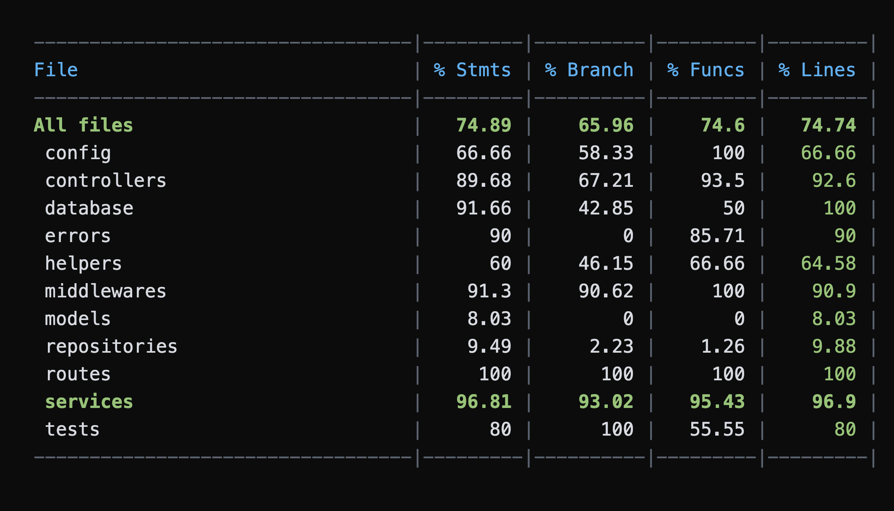<br>
  <sub> Fonte: Material produzido pelos autores (2026) </sub><br><br>
</div>


<div align="center">
  Figura 79: Detalhamento linha a linha da cobertura de um <em>service</em> (verde = coberta, vermelho = não coberta) <br><br>
  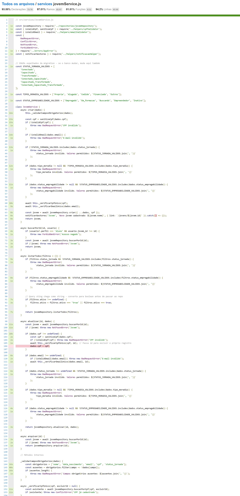<br>
  <sub> Fonte: Material produzido pelos autores (2026) </sub><br><br>
</div>


<div align="center">
  Figura 80: Rastreabilidade caso de teste → RN → RF no output do <code>jest --verbose</code> <br><br>
  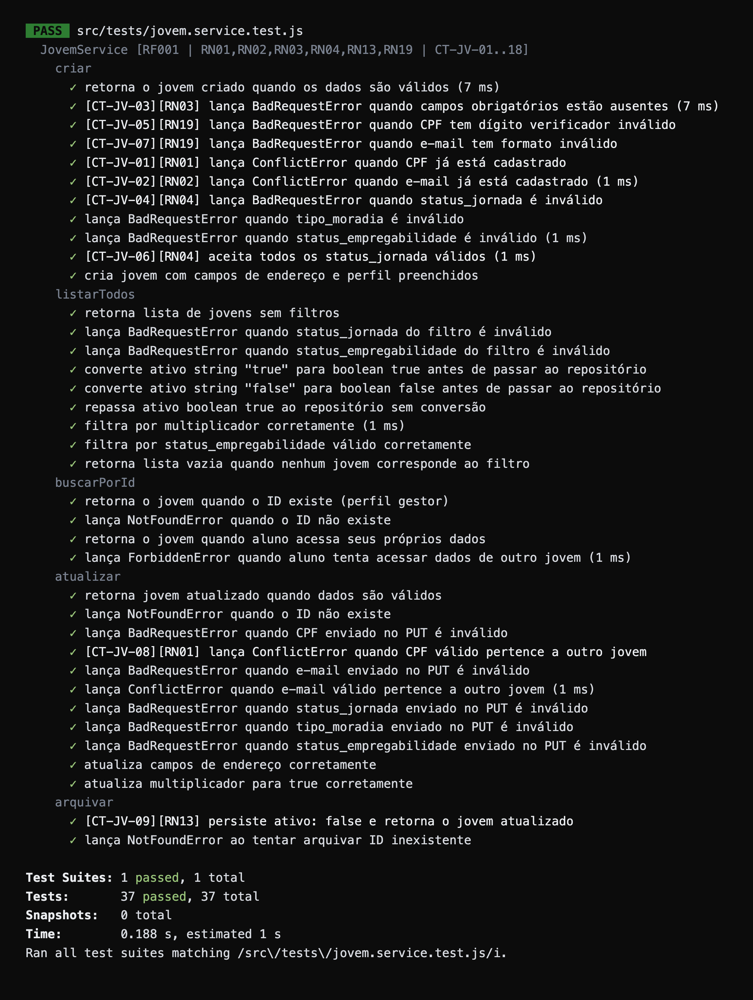<br>
  <sub> Fonte: Material produzido pelos autores (2026) </sub><br><br>
</div>


#### Interpretação dos Resultados


Três leituras emergem das evidências apuradas.


**Conformidade funcional integral.** A aprovação de 100% dos 841 casos de teste, sem falhas nem testes intermitentes, indica que tanto as regras de negócio isoladas (verificadas em white-box na camada Service) quanto o contrato HTTP de ponta a ponta (verificado em black-box via Supertest) estão em conformidade com o comportamento especificado. A inexistência de regressões após a reorganização da suíte — que migrou os testes de controlador do *stub* de cabeçalhos para o fluxo real de autenticação JWT — reforça a estabilidade dos contratos entre camadas.


**Concentração de cobertura nas camadas de risco.** A distribuição da cobertura não é uniforme por decisão de engenharia, e não por omissão. As camadas que concentram lógica de decisão — `services/` (96,90% de linhas), `controllers/` (92,60%), `routes/` (100%) e `middlewares/` (90,90%) — apresentam cobertura alta, porque é nelas que residem as validações, as conversões de tipo, o controle de acesso por perfil e o mapeamento de erros para códigos HTTP. Em contraposição, as camadas `repositories/` (9,88% de linhas) e `models/` (8,03%) têm cobertura baixa por construção: a lógica SQL dos repositórios é substituída por *mocks* nos testes de Service, e seu comportamento real é exercitado apenas indiretamente. Essa escolha está alinhada à estratégia descrita na seção 5.1.1, que prioriza a camada de regras de negócio, onde a complexidade ciclomática e o risco de defeito são maiores. É essa concentração que explica a diferença entre a cobertura da camada de serviços (96,90%) e a cobertura global do projeto (74,74%).


**Ganho de cobertura na interface HTTP.** A consolidação dos testes de integração de endpoints elevou a cobertura da camada `controllers/` a 92,60% de linhas e levou a camada `routes/` a 100%, garantindo que cada rota registrada no *router* central é efetivamente atravessada por ao menos um teste que exercita os middlewares reais de `authenticate` e `authorize`. O índice de ramos dos controladores (67,21%), inferior ao de linhas, reflete sobretudo os desvios condicionais de *ownership* do perfil `Aluno` (RN17), parcialmente implementados nesta sprint e apontados como ponto de evolução na seção 3.4.


#### Conclusão sobre o Atendimento ao Requisito Mínimo de Cobertura (RNF-SUP-01)


O critério de qualidade estabelecido em RNF-SUP-01 exige cobertura mínima de ≥ 70% de linhas e ≥ 60% de ramos na camada de *Services*, onde se concentram as regras de negócio. A apuração final demonstra **96,90% de cobertura de linhas e 93% de cobertura de ramos** nessa camada — ambos os índices superam os pisos de 70% e 60%, respectivamente, com margem confortável, **atendendo integralmente ao requisito**. A título de robustez, registra-se que o `authService` (RF002, fluxo de login), gap da sprint anterior, passou a 100% de linhas nesta sprint, deixando de puxar a média da camada para baixo. A camada de *Controllers*, embora não sujeita ao mesmo piso formal, também ultrapassa 70% de cobertura de linhas (92,60%), o que estende a garantia de qualidade ao contrato HTTP da aplicação. Conclui-se, portanto, que a suíte automatizada satisfaz e excede o requisito mínimo de cobertura estabelecido em RNF-SUP-01, fornecendo uma rede de verificação sólida para a evolução segura da plataforma nas sprints subsequentes.


#### Rastreabilidade CT → RN → RF


As evidências de execução fecham a cadeia de rastreabilidade do projeto ao vincular cada caso de teste a uma Regra de Negócio (RN) e a um Requisito Funcional (RF), em coerência com a Matriz RF → RN → Endpoint da seção 3.1.4 e com a RTM da seção 3.9. A tabela de rastreabilidade dos casos unitários de *Service* (seção 5.1.2) materializa o sentido CT → RN → RF, enquanto a tabela de cobertura de endpoints (seção 5.1.3) materializa o sentido RF → Endpoint → cenário HTTP. O quadro a seguir consolida o mapeamento dos casos prioritários, confirmando a consistência entre os três artefatos:


| CT (prioritário) | RN | RF | Endpoint associado (3.1.4) | Cenário-chave verificado |
|:--|:--|:--|:--|:--|
| CT-US-01 | RN07 | RF002 | `POST /api/usuarios` | Hash bcrypt e omissão de `senha_hash` (201) |
| CT-JV-01 | RN01 | RF001 | `POST /api/jovens` | CPF duplicado → 409 |
| CT-JV-03 | RN03 | RF001 | `POST /api/jovens` | Campos obrigatórios ausentes → 400 |
| CT-JV-07 | RN19 | RF001 | `POST /api/jovens` | Formato de e-mail inválido → 400 |
| CT-US-05 | RN08 | RF003 | `authorize(perfis)` | Perfil fora do conjunto válido → 403 |
| CT-PE-01 | RN (unicidade) | RF015 | `POST /api/participacoes-eventos` | Participação duplicada → 409 |
| CT-PE-02/03 | RN (FK) | RF015 | `POST /api/participacoes-eventos` | Jovem/evento inexistente → 404 |
| CT-LA-02 | RN15 | RF014 | `GET /api/log-auditoria` | Repasse fiel de filtros de auditoria (200) |


A coerência verificada confirma que os quatro cenários-chave exigidos para cada endpoint principal — sucesso (200/201), falha de validação (400/422), regra de negócio violada (409 ou equivalente) e recurso não encontrado (404) — encontram respaldo simultâneo na implementação, nos testes automatizados e na documentação de requisitos, encerrando o ciclo de verificação da WebAPI Pulse Mais.


## <a name="c5.2"></a>5.2. Testes de usabilidade
Esta subseção avalia a usabilidade da plataforma Pulsar a partir de duas abordagens complementares aplicadas com usuários reais. Na subseção 5.2.1, adota-se o teste de guerrilha, de natureza qualitativa, voltado a observar hesitações, erros e dúvidas durante a execução de tarefas e a identificar problemas de interface à luz das heurísticas de Nielsen. Na subseção 5.2.2, emprega-se o questionário System Usability Scale (SUS), de natureza quantitativa, que traduz a percepção de usabilidade em um escore comparável a referências da literatura. A leitura conjunta dos dois métodos articula a explicação dos problemas (por que o usuário hesita) à sua mensuração (quão usável é o sistema), sustentando o atendimento aos requisitos não funcionais de usabilidade do projeto.

### <a name="c5.2.1"></a>5.2.1. Relatório de testes de guerrilha


### O que é

O teste de guerrilha é um método de avaliação de usabilidade rápido e de baixo custo, no qual usuários são abordados de forma espontânea e convidados a realizar tarefas em um produto sem qualquer preparação prévia. Diferente de testes laboratoriais formais, ele dispensa ambiente controlado, recrutamento elaborado ou roteiros longos: o foco está em coletar, com agilidade, evidências reais de como pessoas que nunca viram o sistema interagem com a interface. Cada participante recebe um cenário contextualizado e executa a tarefa sem receber orientação sobre onde clicar, enquanto um moderador observa em silêncio e registra hesitações, erros, dúvidas e sugestões em cada etapa do fluxo.

### Função no projeto

No contexto da Pulse Mais, os testes de guerrilha cumprem o papel de validar empiricamente as decisões de design e de fluxo de navegação antes da entrega final do módulo, reduzindo o risco de levar à coordenação e aos usuários da ONG uma plataforma com barreiras de uso não identificadas. Como a Pulse Mais substitui processos antes apoiados em planilhas e mensagens dispersas, é essencial que gestores, mentores e alunos consigam operar o sistema de forma intuitiva, sem treinamento extenso. Os testes verificam justamente essa premissa: ao cobrir tarefas dos três perfis da plataforma — Gestão, Mentor e Aluno — eles confirmam se os caminhos principais são compreensíveis e concluíveis por usuários sem familiaridade prévia.

Além de medir a taxa de conclusão das tarefas, os testes geram um inventário priorizado de problemas de usabilidade e de compreensão de conteúdo, que alimenta as correções das próximas sprints e fornece insumo qualitativo complementar à avaliação quantitativa do questionário SUS (seção 5.2.2). Dessa forma, a seção conecta o desenvolvimento técnico ao requisito não funcional de usabilidade do WAD, sustentando a melhoria contínua da experiência do usuário com base em evidências de uso real.

A análise dos problemas observados em cada tarefa foi ancorada nas dez heurísticas de usabilidade de Nielsen, adotadas como base de referência para classificar as fricções relatadas pelos participantes:

1. Visibilidade do status do sistema
2. Correspondência entre o sistema e o mundo real
3. Controle e liberdade do usuário
4. Consistência e padrões
5. Prevenção de erros
6. Reconhecimento em vez de memorização
7. Flexibilidade e eficiência de uso
8. Estética e design minimalista
9. Ajuda a reconhecer, diagnosticar e recuperar de erros
10. Ajuda e documentação

A coluna "Heurística(s) relacionada(s)" de cada tabela associa o relato do participante à(s) heurística(s) pertinente(s).

### RESULTADO POR TAREFA:

### 1. Cadastrar Novo Aluno (Gestão)
*Suponha que você é um gestor, e um aluno novo quer entrar na Pulse Mais, utilize o sistema para cadastar esse novo aluno*

| # | Nome do participante | Sobre o participante | Resultado da tarefa | Etapa 1 — Acessar tela de jovens | Etapa 2 — Apertar o botão +Novo Jovem | Etapa 3 — Preencher todos os dados | Etapa 4 — Jovem cadastrado | Heurística(s) relacionada(s) |
|---|---|---|---|---|---|---|---|---|
| 1 | Luiza Chaccur | 19 anos, alta familiaridade com aplicativos, primeiro contato com o sistema | sucesso | Acessou rápido | Chegou rapidamente e de forma intuitiva | Demorou apenas para anotar os dados, ficou com dúvida se poderia utilizar qualquer tipo de email. Teve uma pequena dúvida sobre o status da jornada (acha que deveria ser melhor explicado). | Gostaria de um pop-up que sinalizasse isso. Mas conseguiu com sucesso. | Reconhecimento em vez de memorização; Ajuda e documentação |
| 2 | Marco Tulio | 20 anos, familiaridade média com ferramentas de gestão, primeiro contato com o sistema | sucesso | Acessou rápido | Chegou rapidamente e de forma intuitiva | Ação feita rápida (alerta CPF) | Gostaria da adição de card com o jovem que acabou de ser cadastrado logo no inicio da lista | Prevenção de erros; Visibilidade do status do sistema |
| 3 | Sofia | 18 anos, alta familiaridade com tecnologia, primeiro contato com o sistema | sucesso | Acessou rápido | Chegou rapidamente e de forma intuitiva | Entendeu perfeitamente como preencher e preencheu rapidamente. | Concluiu com sucesso e encontrou o jovem na busca. | Correspondência entre o sistema e o mundo real; Consistência e padrões |
| 4 | Rachel Silvestre | 19 anos, familiaridade média com aplicativos, primeiro contato com o sistema | sucesso | Acessou rápido | Chegou rapidamente e de forma intuitiva | Entendeu perfeitamente como preencher e preencheu rapidamente. | Concluiu com sucesso e encontrou o jovem na busca. | Correspondência entre o sistema e o mundo real; Consistência e padrões |
| 5 | Rafael | 20 anos, alta familiaridade técnica, primeiro contato com o sistema | sucesso | Acessou rápido | Teve um pequeno confusão para chegar nessa tela | Teve um problema na hora de notar o CPF (pois o sistema só autoriza CPFs válidos). Pareceu confuso quanto ao Status da Jornada. | Concluiu com sucesso e encontrou o jovem na busca. | Prevenção de erros; Reconhecimento em vez de memorização; Ajuda e documentação |
| 6 | Leonardo Galdino | 18 anos, alta familiaridade com tecnologia, perfil exploratório, primeiro contato com o sistema | sucesso | Acessou rápido | Chegou rapidamente e de forma intuitiva | Preencheu sem dificuldades  porém demorou para perceber os checks de status de jornada e conseguiu burlar o campo de nome. | Percebeu na hora que o cadastro se concluiu | Prevenção de erros; Reconhecimento em vez de memorização |
| 7 | Samuel Pereira | 20 anos, familiaridade média com ferramentas digitais, primeiro contato com o sistema | sucesso | Acessou rápido | Chegou rapidamente e de forma intuitiva | Teve um problema na hora de notar o CPF, pois anotou o próprio CPF e o sistema manteve o erro. Pareceu confuso quanto ao Status da Jornada. | Concluiu com sucesso e encontrou o jovem na busca. | Prevenção de erros; Ajuda a reconhecer, diagnosticar e recuperar de erros; Reconhecimento em vez de memorização |

### 2. Registrar uma Mentoria (Mentor)
*Suponha que você é um mentor, está prestes a cadastrar uma sessão, utilize o sistema para registrar uma mentoria*

| # | Nome | Sobre | Resultado da tarefa | Etapa 1 — Acessar tela de mentorias | Etapa 2 — Apertar o botão "+Nova Mentoria" | Etapa 3 — Preencher dados para registrar mentoria | Etapa 4 — Mentoria Registrada | Heurística(s) relacionada(s) |
|---|---|---|---|---|---|---|---|---|
| 1 | Luiza Chaccur | 19 anos, alta familiaridade com aplicativos, primeiro contato com o sistema | sucesso | Acessou a tela rapidamente e com eficiência | Ação feita rapidamente | Preencheu perfeitamente | Registrou com sucesso e visualizou depois | Correspondência entre o sistema e o mundo real; Consistência e padrões |
| 2 | Marco Túlio | 20 anos, familiaridade média com ferramentas de gestão, primeiro contato com o sistema | sucesso | Acessou a tela rapidamente e com eficiência | Ação feita rapidamente | Preencheu perfeitamente | Registrou com sucesso e visualizou depois (Sugestão: A ultima a ser registrada aparece no ínicio) | Visibilidade do status do sistema; Consistência e padrões |
| 3 | Sofia | 18 anos, alta familiaridade com tecnologia, primeiro contato com o sistema | sucesso | Acessou a tela rapidamente e com eficiência | Ação feita rapidamente | Preencheu rapidamente, pareceu estar confusa na hora de selecionar o aluno | Registrou com sucesso e visualizou depois | Reconhecimento em vez de memorização |
| 4 | Rachel Silvestre | 19 anos, familiaridade média com aplicativos, primeiro contato com o sistema | sucesso | Acessou a tela rapidamente e com eficiência | Ação feita rapidamente | Conseguiu preencher sem dificuldades porém pontuou para indicar que os temas serão abordados pois parece que eles ja foram abordados. | Registrou com sucesso e visualizou depois | Correspondência entre o sistema e o mundo real |
| 5 | Rafael | 20 anos, alta familiaridade técnica, primeiro contato com o sistema | sucesso | Acessou a tela rapidamente e com eficiência | Ação feita rapidamente | Se confundiu na hora de selecionar os alunos, pois achava que poderia buscar os mesmos, mas na verdade deveria selecionar de uma lista | Registrou com sucesso, mas gostaria de editar a mentoria, porém isso não está disponível no sistema | Reconhecimento em vez de memorização; Controle e liberdade do usuário |
| 6 | Leonardo Galdino | 18 anos, alta familiaridade com tecnologia, perfil exploratório, primeiro contato com o sistema | sucesso | Acessou a tela rapidamente e com eficiência | Ação foi feita após dar uma olhada geral na página | Preencheu sem dificuldades porém ficou tentando crashar o site. | Encontrou sua prórpia mentoria. | Prevenção de erros |
| 7 | Samuel Pereira | 20 anos, familiaridade média com ferramentas digitais, primeiro contato com o sistema | sucesso | Acessou a tela rapidamente e com eficiência | Ação feita rapidamente | Se confundiu com o tamanho da lista | Concluiu a mentoria e depois encontrou a mesma | Estética e design minimalista; Reconhecimento em vez de memorização |

### 3. Atualizar dados de empregabilidade (Aluno)
*Suponha que você é um aluno, e entrou em uma nova empresa, utilize o sistema para para atualizar a empresa, competências e histórico de carreiras*

| # | Nome | Sobre | Resultado da tarefa | Etapa 1 — Acessar a tela de empregabilidade | Etapa 2 — Atualizar dados da empresa atual | Etapa 3 — Adicionar novas competências | Etapa 4 — Atualizar histórico de carreiras | Heurística(s) relacionada(s) |
|---|---|---|---|---|---|---|---|---|
| 1 | Luiza Chaccur | 19 anos, alta familiaridade com aplicativos, primeiro contato com o sistema | sucesso | Acessou rapidamente | Teve uma pequena demora na hora de adicionar a data. | Adicionou antes do status da empresa atual. E viu que era possível cometer erros ortográficos nessa parte. | Atualizado com sucesso | Prevenção de erros |
| 2 | Marco Túlio | 20 anos, familiaridade média com ferramentas de gestão, primeiro contato com o sistema | sucesso | Acessou rapidamente | Apresentou um pouco de dificuldade para atualizar os dados | Preencheu de maneira intuitiva e rápida. | Atualizado com sucesso | Flexibilidade e eficiência de uso |
| 3 | Sofia | 18 anos, alta familiaridade com tecnologia, primeiro contato com o sistema | sucesso | Acessou rapidamente | Teve uma leve demora para acessar essa tela, mas conseguiu com sucesso preencher todos os campos | Preencheu de maneira intuitiva e rápida. | Atualizou com sucesso, pareceu um pouco confusa quanto ao que era histórico de carreira e o que era estado atual de carreira | Correspondência entre o sistema e o mundo real; Reconhecimento em vez de memorização |
| 4 | Rachel SIlvestre | 19 anos, familiaridade média com aplicativos, primeiro contato com o sistema | sucesso | Acessou rapidamente | Atualizou sem dificudades | Adicionou logo após preencher a empregabilidade. | Atualizou com sucesso. | Consistência e padrões |
| 5 | Rafael | 20 anos, alta familiaridade técnica, primeiro contato com o sistema | sucesso | Acessou rapidamente | Teve problema para clicar nas caixas de texto e aconteceu um erro com o banco de dados devido a internet, mas conseguiu com sucesso | Não quis adicionar | Não quis atualizar | Visibilidade do status do sistema; Ajuda a reconhecer, diagnosticar e recuperar de erros |
| 6 | Leonardo Galdino | 18 anos, alta familiaridade com tecnologia, perfil exploratório, primeiro contato com o sistema | sucesso | Acessou rapidamente | Atualizou sem dificuldades mas pontuou que dados ja registrados antes poderiam ser preenchidos automaticamente e da pra colocar uma data de ínicio que não passou. | Adicionou sem dificuldades, disse que botão de help não funciona e disse que não seria ideal que o usuário consiga abrir tantas edições ao mesmo tempo. | Atualizado com sucesso | Prevenção de erros; Flexibilidade e eficiência de uso; Ajuda e documentação |
| 7 | Samuel Pereira | 20 anos, familiaridade média com ferramentas digitais, primeiro contato com o sistema | sucesso | Teve uma leve confusão na hora de entrar (estava no menu) | Conseguiu atualizar com sucesso, mas viu que a data de início pode ser uma data que ainda não chegou (colocou inicio no ano 4444) | Adicionou com sucesso e até conseguiu editar depois. | Atualizou com sucesso. | Prevenção de erros |

### 4. Buscar por alunos (Gestão)
*Suponha que você é um gestor, e quer buscar dados de algum aluno utilize o sistema de busca para buscar algum aluno*

| # | Nome | Sobre | Resultado da tarefa | Etapa 1 — Acessar tela de busca | Etapa 2 — Buscar nome do aluno | Etapa 3 — Selecionar o aluno | Etapa 4 — Apertar abrir relatório | Etapa 5 — Vizualizar o perfil do aluno | Heurística(s) relacionada(s) |
|---|---|---|---|---|---|---|---|---|---|
| 1 | Luiza Chaccur | 19 anos, alta familiaridade com aplicativos, primeiro contato com o sistema | sucesso | Acessou a tela facilmente | Buscou sem dificuldade | Selecionou sem dificuldades | Relatório aberto sem dificuldade | Visualizou com sucesso | Correspondência entre o sistema e o mundo real; Consistência e padrões |
| 2 | Marco Túlio | 20 anos, familiaridade média com ferramentas de gestão, primeiro contato com o sistema | sucesso | Acessou a tela facilmente | Buscou sem dificuldade | Selecionou sem dificuldades | Relatório aberto sem dificuldade | Visualizou com sucesso | Correspondência entre o sistema e o mundo real; Consistência e padrões |
| 3 | Sofia | 18 anos, alta familiaridade com tecnologia, primeiro contato com o sistema | sucesso | Acessou a tela facilmente | Conseguiu buscar o aluno e encontrar o mesmo | Selecionou sem dificuldades | Relatório aberto sem dificuldade | Visualizou com sucesso | Correspondência entre o sistema e o mundo real; Consistência e padrões |
| 4 | Rachel Silvestre | 19 anos, familiaridade média com aplicativos, primeiro contato com o sistema | sucesso | Acessou a tela facilmente | Buscou sem dificuldade | Selecionou sem dificuldades | Não tinha visto o botão, fez por um caminho alternativo. | Visualizou com sucesso | Reconhecimento em vez de memorização |
| 5 | Rafael | 20 anos, alta familiaridade técnica, primeiro contato com o sistema | sucesso | Acessou a tela facilmente | Achou a aluna que queria achar | Selecionou essa aluna com sucesso, só teve problema com o delay do supabase | Relatório aberto sem dificuldade | Visualizou com sucesso | Visibilidade do status do sistema |
| 6 | Leonardo Galdino | 18 anos, alta familiaridade com tecnologia, perfil exploratório, primeiro contato com o sistema | sucesso | Acessou a tela facilmente | Buscou sem dificuldade | Selecionou sem dificuldades | Relatório aberto sem dificuldade | Visualizou com sucesso | Correspondência entre o sistema e o mundo real; Consistência e padrões |
| 7 | Samuel Pereira | 20 anos, familiaridade média com ferramentas digitais, primeiro contato com o sistema | sucesso | Demorou um pouco para achar a tela | Buscou sem dificuldade | Selecionou sem dificuldades | Relatório aberto sem dificuldade | Visualizou com sucesso | Reconhecimento em vez de memorização |

### 5. Realizar cadastro e novo login
*Suponha que você é um aluno, e acabou de entrar na Pulse Mais, utilize o sistema para cadastrar uma conta na tela de login*

| # | Nome | Sobre | Resultado da tarefa | Etapa 1 — Apertar no botão "Cadastrar-se" | Etapa 2 — Preencher os dados de acesso | Etapa 3 — Preencher os dados pessoais | Etapa 4 — Preencher os dados socioeconômico | Etapa 5 — Finalizar cadastro | Heurística(s) relacionada(s) |
|---|---|---|---|---|---|---|---|---|---|
| 1 | Luiza Chaccur | 19 anos, alta familiaridade com aplicativos, primeiro contato com o sistema | sucesso | Acessou rapidamente | Preencheu perfeitamente | Preencheu rapidamente. Colocou o nome com letras minúsculas. Sugeriu desabilitar o botão se a pessoa não autorizar o LGPD. | Preencheu com sucesso | Finalizou com sucesso | Prevenção de erros |
| 2 | Marco Túlio | 20 anos, familiaridade média com ferramentas de gestão, primeiro contato com o sistema | sucesso | Acessou rapidamente | Preencheu perfeitamente | Preencheu sem dificuldade e entendeu perfeitamente como fazer. | Preencheu com sucesso | Finalizou com sucesso | Correspondência entre o sistema e o mundo real; Consistência e padrões |
| 3 | Sofia | 18 anos, alta familiaridade com tecnologia, primeiro contato com o sistema | sucesso | Acessou rapidamente | Preencheu perfeitamente | Preencheu sem dificuldade e entendeu perfeitamente como fazer. | Preencheu com sucesso | Finalizou com sucesso | Correspondência entre o sistema e o mundo real; Consistência e padrões |
| 4 | Rachel Silvestre | 19 anos, familiaridade média com aplicativos, primeiro contato com o sistema | sucesso | Acessou rapidamente | Preencheu perfeitamente | Preencheu sem dificuldade e entendeu perfeitamente como fazer. | Preencheu com sucesso | Finalizou com sucesso | Correspondência entre o sistema e o mundo real; Consistência e padrões |
| 5 | Rafael | 20 anos, alta familiaridade técnica, primeiro contato com o sistema | sucesso | Acessou rapidamente | Preencheu eles sem dificuldade, mas viu um erro de HTML que faz todos os textos do site aparecerem como caixa de texto | Ficou com dúvida se deveria escrever o nome da cidade inteiro ou se tinha autocomplete | Conseguiu com sucesso | FInalizou com sucesso | Estética e design minimalista; Visibilidade do status do sistema |
| 6 | Leonardo Galdino | 18 anos, alta familiaridade com tecnologia, perfil exploratório, primeiro contato com o sistema | sucesso | Acessou rapidamente | Preencheu perfeitamente | Preencheu sem dificuldade e entendeu perfeitamente como fazer. | Preencheu com sucesso | Finalizou com sucesso | Correspondência entre o sistema e o mundo real; Consistência e padrões |
| 7 | Samuel Pereira | 20 anos, familiaridade média com ferramentas digitais, primeiro contato com o sistema | sucesso | Acessou rapidamente | Preencheu rapidamente, viu até que a senha precisava ser igual em todos os campos | Conseguiu com sucesso, mas falou que deveria limitar as datas conforme a data atual | Conseguiu com sucesso | FInalizou com sucesso | Prevenção de erros |

### <a name="c5.2.2"></a>5.2.2. Relatório de testes SUS (System Usability Scale)

O System Usability Scale (SUS) é um questionário padronizado de 10 itens criado por John Brooke (1996) para medir a usabilidade percebida de sistemas interativos. Cada item é respondido em escala Likert de 1 a 5, alternando afirmações positivas (ímpares) e negativas (pares). A pontuação final varia de 0 a 100 e é calculada convertendo as contribuições de cada item — subtraindo 1 da nota nas questões ímpares e subtraindo a nota de 5 nas questões pares — somando os dez valores e multiplicando o resultado por 2,5. De acordo com Bangor et al. (2009), pontuações acima de 68 indicam que o sistema está acima da média do setor e pode ser considerado aceitável pelos seus usuários.
No contexto do projeto Pulse Mais, a aplicação do SUS cumpre o requisito não funcional RNF-USAB-02, que estabelece pontuação mínima de 68 como critério de aceite de usabilidade da plataforma. O instrumento foi adaptado para refletir os fluxos reais da aplicação — consulta ao perfil de um jovem, registro de frequência, navegação entre módulos — e aplicado na sprint 5 com 7 respondentes reais da equipe da Pulse Mais. A pontuação média obtida foi de 88,93, classificada como Excelente (Grau B) na escala de Bangor et al. (2009), superando com folga o limiar definido em RNF-USAB-02.

| Carimbo              | Nome                          | Q1 | Q2 | Q3 | Q4 | Q5 | Q6 | Q7 | Q8 | Q9 | Q10 | Soma | SUS       |
|----------------------|-------------------------------|----|----|----|----|----|----|----|----|----|----|------|-----------|
| 16/06/2026 10:58:51  | Luiza Chaccur                 | 4  | 4  | 3  | 4  | 3  | 3  | 4  | 3  | 3  | 4   | 35   | 87,5      |
| 16/06/2026 11:09:55  | Beatriz Sofia Freitas Sena    | 4  | 4  | 4  | 4  | 4  | 4  | 4  | 4  | 4  | 4   | 40   | 100,0     |
| 16/06/2026 11:27:49  | Rafael Sleumer Hamacek Succi  | 3  | 3  | 3  | 3  | 4  | 4  | 3  | 3  | 3  | 4   | 33   | 82,5      |
| 16/06/2026 11:35:40  | Leonardo Galdino Carioca Braz | 4  | 4  | 4  | 4  | 4  | 3  | 4  | 4  | 4  | 4   | 39   | 97,5      |
| 16/06/2026 11:43:04  | Samuel Pereira Nascimento     | 3  | 3  | 4  | 4  | 3  | 3  | 4  | 0  | 3  | 4   | 31   | 77,5      |
| 16/06/2026 10:59:17  | Marco Túlio Vieira Teixeira   | 4  | 4  | 4  | 4  | 4  | 4  | 4  | 4  | 4  | 4   | 40   | 100,0     |
| 19/06/2026 18:30:51  | Rachel Durante Silvestre      | 4  | 3  | 4  | 2  | 3  | 4  | 3  | 3  | 3  | 2   | 31   | 77,5      |
|                      | **Média**                     |    |    |    |    |    |    |    |    |    |     |      | **88,93** |


# <a name="c6"></a>6. Estudo de Mercado e Plano de Marketing
Embora a Pulse Mais opere sob a lógica do terceiro setor, optou-se por conduzir um estudo de mercado e um plano de marketing estruturados porque a organização disputa, no ecossistema de impacto social, recursos escassos, atenção de financiadores, engajamento de mentores voluntários, visibilidade frente a editais públicos e legitimidade institucional diante de concorrentes diretos e indiretos. A aplicação web desenvolvida, por sua vez, não é apenas uma ferramenta operacional interna: ela se converte em ativo estratégico de prestação de contas, diferenciação competitiva e fortalecimento da marca Pulse Mais perante seus stakeholders. Sob essa lente, a análise mercadológica que se segue foi tratada com o mesmo rigor que se aplicaria a um produto comercial.

A seção foi estruturada de modo a percorrer um raciocínio do macro ao micro. Inicialmente, apresenta-se um resumo executivo que consolida os destaques estratégicos do projeto. Em seguida, conduz-se a análise de mercado, com a contextualização do setor, dimensionamento quantitativo e mapeamento de tendências relevantes. Aprofunda-se, então, na caracterização do público-alvo, por meio da segmentação e do perfilamento detalhado dos usuários da solução. A partir desse diagnóstico, formula-se o posicionamento e a estratégia de branding, articulando a proposta de valor única e os atributos de diferenciação frente a alternativas existentes. Na sequência, sintetiza-se a lógica de criação, entrega e captura de valor por meio do Business Model Canvas. Por fim, traduz-se toda a análise em ações concretas com a estratégia de marketing organizada nos quatro Ps (produto, preço, praça e promoção.)

Buscou-se, ao longo de toda a seção, garantir coerência entre os blocos: cada análise alimenta a seguinte, de modo que o plano tático ao final repouse sobre fundamentos diagnósticos consistentes, e não em escolhas isoladas.

## <a name="c6.1"></a>6.1 Resumo Executivo

Foi identificada oportunidade no cruzamento entre a exigência crescente de *accountability* por parte de financiadores institucionais e a defasagem tecnológica de organizações do terceiro setor voltadas à qualificação profissional de jovens, que operam predominantemente sobre planilhas e ferramentas genéricas. Esse descompasso configura espaço de criação de valor para soluções tecnológicas específicas ao segmento.

O problema atendido é a fragmentação dos dados dos jovens da Pulse Mais, dispersos em múltiplas planilhas isoladas por projeto e ano, complementadas por conversas de WhatsApp e pela memória individual da equipe. Tal fragmentação impede a visão consolidada da jornada do aluno, compromete a mensuração de indicadores de longo prazo e gera vulnerabilidade operacional frente à rotatividade de pessoal.

Os diferenciais competitivos foram desenhados a partir das especificidades da metodologia Pulse Mais: a aplicação opera como *Single Source of Truth* (SSOT) institucional, integrando, em uma única interface, dados cadastrais, acadêmicos, de empregabilidade e de engajamento. Destacam-se o prontuário digital com controle granular de acesso por perfil, em conformidade com a LGPD; os dashboards de impacto voltados à prestação de contas a financiadores; e o portal do aluno, que garante protagonismo informacional ao jovem sobre seus próprios dados. Esses atributos distinguem a solução de CRMs genéricos, planilhas adaptadas e ferramentas sem aderência metodológica nativa ao framework da organização.

Os objetivos estratégicos compreendem a consolidação da SSOT institucional, o fortalecimento da governança e da prestação de contas, a redução do tempo despendido na busca por informações históricas, a identificação precoce de riscos de evasão e o aprimoramento das estratégias de empregabilidade com base em dados históricos.

## <a name="c6.2"></a>6.2 Análise de Mercado

### <a name="c6.2.1"></a>6.2.1. Visão Geral do Setor
A aplicação web está inserida na interseção entre o terceiro setor brasileiro — especificamente, organizações da sociedade civil (OSCs) voltadas à qualificação profissional e à empregabilidade de jovens — e o segmento de tecnologia aplicada ao impacto social. Sob a ótica econômica, o setor demonstra relevância expressiva: foi identificado pela Fundação Instituto de Pesquisas Econômicas que o terceiro setor responde por 4,27% do Produto Interno Bruto brasileiro e por 5,88% dos postos de trabalho ativos no país, totalizando cerca de seis milhões de ocupações (FIPE, 2023). Essa participação se aproxima à do agronegócio (4,57%) e supera em mais de duas vezes a da indústria automobilística (1,80%).

No campo tecnológico, foi observado pelo Núcleo de Informação e Coordenação do Ponto BR que o uso da internet por organizações do terceiro setor cresceu de 71% em 2016 para 82% em 2022 (NIC.br, 2023). A mesma pesquisa evidenciou que o uso de smartphones pessoais (89%) ainda predomina sobre dispositivos institucionais, sinalizando limitação na maturidade digital e na adoção de sistemas estruturados de gestão.

No plano regulatório, o setor é disciplinado pelo Marco Regulatório das Organizações da Sociedade Civil (Lei nº 13.019/2014), que estabelece requisitos formais de prestação de contas e parcerias com o poder público (BRASIL, 2014). A Lei Geral de Proteção de Dados (Lei nº 13.709/2018) aplica-se integralmente às entidades sem fins lucrativos, impondo obrigações sobre o tratamento de dados pessoais sensíveis, frequentemente coletados em programas socioassistenciais (BRASIL, 2018; IDIS, 2020).

---

### <a name="c6.2.2"></a>6.2.2. Tamanho e Crescimento do Mercado
Foi registrado pelo Mapa das Organizações da Sociedade Civil, plataforma mantida pelo Instituto de Pesquisa Econômica Aplicada, um total de 897.054 OSCs ativas no Brasil em 2024, representando crescimento de 2% em relação ao ano anterior e expansão acumulada de 16,83% na última década, a partir das cerca de 746 mil organizações contabilizadas em 2014 (IPEA, 2025). A região Sudeste concentra 42% dessas instituições, e o estado de São Paulo responde isoladamente por aproximadamente 182 mil organizações.

No tocante ao volume de recursos mobilizados, identificou-se, pelo Censo GIFE 2024–2025, que o Investimento Social Privado brasileiro atingiu R$ 5,8 bilhões em 2024, o segundo maior patamar da série histórica de treze anos (GIFE, 2025). Observou-se, ainda, que 72% das organizações respondentes realizaram repasses financeiros diretos a OSCs por meio de *grantmaking*, sinalizando expansão do mercado de financiamento intermediado.

Quanto ao público potencial endereçável, dados da Pesquisa Nacional por Amostra de Domicílios Contínua indicam que havia 48,5 milhões de jovens entre 15 e 29 anos no Brasil em 2023, dos quais 19,8% não estavam ocupados nem estudando — cerca de 9,6 milhões em condição de vulnerabilidade educacional e laboral (IBGE, 2024). Entre 2023 e 2024, o número de estagiários cresceu 37%, alcançando 877 mil; o contingente de aprendizes, por sua vez, dobrou em relação a 2011, atingindo 602 mil (AGÊNCIA BRASIL, 2024). Concluiu-se que o mercado endereçável combina escala populacional expressiva, base institucional consolidada e volume crescente de recursos.

---

### <a name="c6.2.3"></a>6.2.3. Tendências de Mercado
No plano tecnológico, observa-se aceleração da incorporação de inteligência artificial pelas organizações sociais brasileiras. Foi anunciado pela Google.org, em junho de 2025, aporte de R$ 5 milhões destinados à capacitação em IA voltada ao terceiro setor, iniciativa que se materializou no programa IA.3, conduzido pelo IDIS, com seleção de 257 ONGs para formação intensiva ao longo de 2026 e 2027 (IDIS, 2026). Foi identificado, paralelamente, o lançamento de trilhas formativas específicas em IA para ONGs por instituições como a Fundação Bradesco (ESG INSIDE, 2025), o que sugere a consolidação de um movimento setorial estruturado de letramento tecnológico.

No campo comportamental, foi constatado pelo IDIS que 86% dos doadores afirmam escolher com cuidado a causa apoiada, 83% buscam informações antes de doar, crescimento de oito pontos percentuais em relação a 2022, e 49% deixaram de fazer doações após notícias negativas envolvendo organizações sociais (IDIS, 2025). Tal padrão evidencia que a exigência por transparência e prestação de contas deixou de ser demanda exclusiva de financiadores institucionais e converteu-se em critério reputacional difuso, com impacto direto na sustentabilidade financeira das OSCs.

No plano mercadológico, identifica-se transição do modelo executor direto para o modelo *grantmaker* entre os investidores sociais. Foi observado pelo GIFE que 83% das organizações respondentes do Censo 2024–2025 apoiaram OSCs por meio de repasses, e que o Investimento Social Privado Independente saltou de R$ 354 milhões em 2014 para R$ 1,1 bilhão em 2024 (GIFE, 2025). Em paralelo, a Lei Geral de Proteção de Dados intensifica a pressão por sistemas que garantam controle granular sobre o tratamento de informações pessoais (BRASIL, 2018). Concluiu-se, dessa convergência entre adoção tecnológica, exigência de *accountability*, profissionalização do financiamento e endurecimento regulatório, que o ambiente competitivo favorece soluções digitais capazes de produzir dados confiáveis, auditáveis e acessíveis em tempo real, exatamente o domínio no qual a aplicação Pulse Mais se posiciona.

---

## <a name="c6.3"></a>6.3 Público-Alvo

### <a name="c6.3.1"></a>6.3.1. Segmentação de Mercado
Identificou-se que a aplicação Pulse Mais atende a três segmentos distintos de usuários, articulados em torno do mesmo eixo institucional.

O segmento primário compõe-se da equipe operacional da Pulse Mais, gestores de programas, coordenadores pedagógicos, equipe de empregabilidade e mentores, responsável pela administração rotineira da plataforma e pela manutenção dos registros dos jovens atendidos. Esse segmento concentra a maior densidade de uso e demanda funcionalidades de cadastro, acompanhamento individual, registro de atendimentos e produção de relatórios institucionais.

O segmento secundário é constituído pelos jovens beneficiários da Pulse Mais, com idade entre 17 e 26 anos, residentes em regiões periféricas de São Paulo e da Região Metropolitana, oriundos de escolas públicas ou de instituições particulares mediante bolsa integral de 100%, com renda familiar per capita inferior a 1,5 salário mínimo. Esses usuários acessam o portal do aluno, no qual exercem protagonismo sobre seus próprios dados e acompanham sua trajetória institucional.

O segmento terciário compreende financiadores, investidores sociais e parceiros institucionais, cujo acesso é restrito a dashboards de impacto e relatórios de prestação de contas. Embora numericamente menor, esse segmento exerce papel crítico na sustentabilidade financeira da organização e justifica boa parte dos requisitos de auditabilidade da solução.

Considera-se, ainda, mercado endereçável futuro o universo das aproximadamente 897 mil organizações da sociedade civil ativas no Brasil, em especial aquelas voltadas à qualificação profissional e à empregabilidade de jovens, para as quais a metodologia operacional da aplicação poderá ser adaptada em horizonte de médio prazo (IPEA, 2025).

### <a name="c6.3.2"></a>6.3.2. Perfil do Público-Alvo
O perfil predominante do público-alvo foi caracterizado com base no segmento secundário, destinatário último da missão institucional da Pulse Mais.

Sob a ótica demográfica, identificou-se um jovem com idade entre 17 e 26 anos, residente em regiões periféricas de São Paulo e da Região Metropolitana, com renda familiar per capita inferior a 1,5 salário mínimo e proveniente de escola pública ou de instituição particular mediante bolsa integral.

No plano comportamental, observou-se elevada familiaridade com aplicativos *mobile* e plataformas de mensagem instantânea, contrastada por menor experiência prévia com sistemas institucionais formais, prontuários digitais e fluxos burocráticos típicos de ambientes corporativos. O acesso predominante ocorre por dispositivos móveis, em conexões de internet de qualidade variável, o que impõe à aplicação requisitos rigorosos de responsividade e desempenho em redes de baixa banda.

As dores específicas mapeadas incluem: a escassez de referências profissionais nos núcleos familiares e comunitários de origem; a dispersão de informações sobre oportunidades de qualificação e empregabilidade em múltiplos canais não integrados; a descontinuidade no acompanhamento institucional ao longo dos anos; e a ausência de visibilidade sobre a própria trajetória educacional e profissional registrada pela organização.

Concluiu-se que as expectativas centrais relacionadas ao problema abordado são três: o acesso consolidado e curado a oportunidades aderentes ao perfil; o sentimento de acompanhamento contínuo e personalizado por parte da Pulse Mais; e o protagonismo informacional sobre os dados que compõem sua história institucional, em consonância com os direitos assegurados pela Lei Geral de Proteção de Dados (BRASIL, 2018).

## <a name="c6.4"></a>6.4 Posicionamento

### <a name="c6.4.1"></a>6.4.1. Proposta de Valor Única
A proposta de valor única da aplicação Pulse Mais reside em consolidar, em uma fonte única, auditável e em conformidade nativa com a Lei Geral de Proteção de Dados, toda a trajetória institucional dos jovens atendidos pela organização, substituindo o arranjo fragmentado de planilhas, mensagens instantâneas e memória individual da equipe por uma plataforma desenhada em torno da metodologia operacional da Pulse Mais.

Para a equipe operacional, o valor entregue reside na redução do tempo despendido na busca por informações históricas, na centralização do registro de atendimentos e na produção facilitada de relatórios institucionais. Para os jovens beneficiários, o valor reside no acesso direto à própria trajetória educacional e profissional, materializado por meio do portal do aluno, funcionalidade que assegura protagonismo informacional e raramente está disponível em soluções concorrentes adaptadas. Para os financiadores e parceiros, o valor reside na disponibilidade de dashboards de impacto auditáveis, que sustentam a prestação de contas com indicadores rastreáveis até o dado primário.

Foi observado que tal proposta articula três atributos raramente combinados no mercado: aderência metodológica nativa ao framework Pulse Mais, conformidade jurídica desenhada desde a arquitetura inicial e ausência de custo de licenciamento. Sintetizando, concluiu-se que a aplicação se propõe a converter dados dispersos em ativo institucional auditável, simultaneamente ferramenta operacional para a equipe, direito exercido pelo jovem sobre a própria história, e prova de impacto entregue ao financiador.

### <a name="c6.4.2"></a>6.4.2. Estratégia de Diferenciação
A estratégia de diferenciação adotada inscreve-se no quadrante de diferenciação focada, conforme tipologia de Michael Porter, e situa-se no que Dawar (2015) caracteriza, em sua proposta de mapeamento de estratégia de marca publicada na *Harvard Business Review*, como posicionamento "não convencional" — combinação de baixa centralidade em relação à categoria genérica de software de gestão e alta distinção em relação às alternativas existentes.

Foram identificados como concorrentes diretos ferramentas como o Salesforce Nonprofit Success Pack e o HubSpot for Nonprofits, que oferecem funcionalidades de CRM adaptadas ao terceiro setor, porém sem aderência às especificidades metodológicas da Pulse Mais. Como concorrentes indiretos, identificam-se plataformas de captação como Donorbox e Aplos, voltadas prioritariamente à gestão financeira e à arrecadação, bem como planilhas Excel e Google Sheets amplamente utilizadas para controle de dados de beneficiários. Nenhuma dessas alternativas combina, na mesma solução, SSOT institucional, conformidade nativa com a LGPD, portal de protagonismo do jovem e ausência de custo de licenciamento — combinação que constitui o núcleo da diferenciação proposta.

O posicionamento da aplicação resulta da convergência de quatro eixos de vantagem competitiva, articulados em narrativa única: a aderência metodológica nativa neutraliza a generalidade dos CRMs comerciais; a SSOT neutraliza a fragmentação das planilhas; a conformidade arquitetural com a LGPD neutraliza a fragilidade jurídica de soluções adaptadas; e a ausência de licenciamento neutraliza o custo proibitivo de plataformas premium.

A identidade pretendida foi sintetizada em três atributos de marca: especificidade (faz uma coisa, faz bem), confiabilidade (auditável e juridicamente robusta) e protagonismo (devolve ao jovem poder informacional sobre a própria trajetória). Foi observado que esses atributos são coerentes com os valores institucionais da Pulse Mais, conferindo consistência entre marca operacional, marca institucional e percepção esperada pelos *stakeholders* — condição reconhecida na literatura como pré-requisito da construção de marcas fortes.

---

## <a name="c6.5"></a>6.5. Business Model Canvas
A partir das análises mercadológicas, do público-alvo, do posicionamento e da estratégia de marketing previamente formulados, sintetiza-se nesta seção a lógica de criação, entrega e captura de valor da aplicação Pulse Mais por meio do Business Model Canvas proposto por Osterwalder e Pigneur (2010). Os nove blocos são apresentados a seguir em formato descritivo, e sua representação visual integrada encontra-se na Figura 81.

<div align="center">
  Figura 81: Business Model Canvas <br><br>
  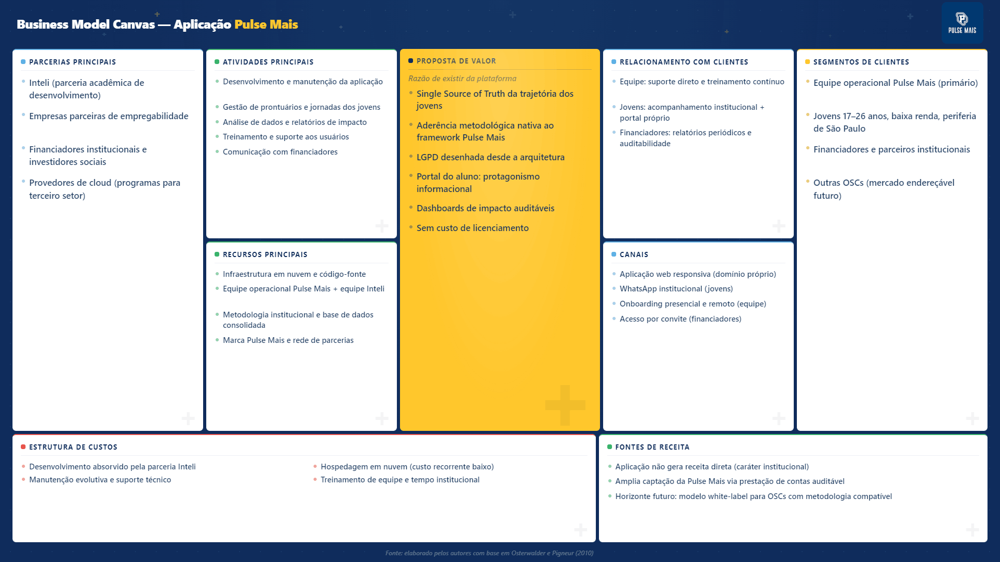<br>
  <sub> Fonte: Material produzido pelos autores (2026) </sub><br><br>
</div>

### <a name="c6.5.1"></a>6.5.1. Segmentos de Clientes

A aplicação atende a três segmentos de usuários articulados em torno da missão da Pulse Mais, conforme detalhado na Seção 6.3. O segmento primário é composto pela equipe operacional da Pulse Mais, gestores, coordenadores pedagógicos, equipe de empregabilidade e mentores. O segmento secundário corresponde aos jovens beneficiários, com idade entre 17 e 26 anos, residentes em regiões periféricas da Região Metropolitana de São Paulo, com renda familiar per capita inferior a 1,5 salário mínimo e oriundos de escola pública ou de instituição particular mediante bolsa integral. O segmento terciário compreende financiadores, investidores sociais e parceiros institucionais. Considera-se, ainda, como mercado endereçável futuro, o conjunto de OSCs brasileiras com metodologia compatível.

### <a name="c6.5.2"></a>6.5.2. Proposta de Valor

A aplicação consolida, em fonte única, auditável e em conformidade nativa com a Lei Geral de Proteção de Dados, a trajetória institucional dos jovens atendidos. Para a equipe operacional, entrega redução do tempo despendido na busca por informações históricas e centralização do registro de atendimentos. Para os jovens, assegura protagonismo informacional por meio do portal do aluno. Para os financiadores, oferece dashboards de impacto rastreáveis até o dado primário. Diferencia-se das alternativas concorrentes pela aderência metodológica nativa ao framework Pulse Mais, pela LGPD desenhada desde a arquitetura inicial e pela ausência de custo de licenciamento.

### <a name="c6.5.3"></a>6.5.3. Canais

A entrega ocorre integralmente por canais digitais, em coerência com a natureza de plataforma web da solução. O acesso principal se dá via navegador responsivo, em domínio institucional próprio da Pulse Mais, sem necessidade de instalação de aplicativos nativos. A equipe operacional é incorporada por meio de *onboarding* presencial e remoto conduzido pela liderança da organização, com material de apoio interno. Os jovens beneficiários recebem o link de acesso e os tutoriais por WhatsApp institucional, em paralelo aos canais de comunicação já estabelecidos. Financiadores e parceiros acessam dashboards específicos mediante convite direto, com escopo restrito à relação institucional firmada.

### <a name="c6.5.4"></a>6.5.4. Relacionamento com Clientes

O relacionamento foi estruturado como contínuo, personalizado e baseado em confiança institucional, em coerência com a natureza não comercial da solução. Com a equipe operacional, mantém-se suporte direto, ciclos regulares de treinamento e canais permanentes de coleta de *feedback*. Com os jovens, o relacionamento se sustenta pela continuidade do acompanhamento institucional viabilizada pela aplicação, somada aos vínculos presenciais previamente estabelecidos pela Pulse Mais. Com os financiadores, materializa-se por meio da transparência periódica e da auditabilidade dos indicadores de impacto, condição reconhecida na literatura como crítica para a confiança e a renovação de aportes no terceiro setor.

### <a name="c6.5.5"></a>6.5.5. Fontes de Receita

A aplicação não gera receita monetária direta, em coerência com seu caráter institucional e não comercial. Identificam-se, contudo, três fluxos de valor capturado que sustentam a sustentabilidade estratégica da organização.

O primeiro é a **captação ampliada de financiamento via prestação de contas auditável**: relatórios com rastreabilidade de indicadores por jovem e por programa fortalecem a posição da Pulse Mais em editais e *grantmaking*, categoria que movimenta R$ 5,8 bilhões anuais no Brasil (GIFE, 2025).

O segundo é o **fortalecimento da marca Pulse Mais perante financiadores e parceiros**: a adoção de SSOT institucional sinaliza maturidade operacional e governança de dados, atributos crescentemente exigidos como evidência quantitativa de impacto.

O terceiro, projetado para o médio prazo, é a **oferta em modelo *white-label* a outras OSCs** com metodologia compatível, mediante contribuição modesta, convertendo o investimento em desenvolvimento em ativo replicável no ecossistema de impacto social.

### <a name="c6.5.6"></a>6.5.6. Recursos Principais

Os recursos principais foram organizados em quatro categorias. Os recursos tecnológicos compreendem a infraestrutura em nuvem, o banco de dados e o código-fonte da aplicação. Os recursos humanos abrangem, durante a parceria, a equipe de desenvolvimento composta pelos alunos do Inteli e, em regime contínuo, a equipe operacional da Pulse Mais. Os recursos intelectuais incluem a metodologia institucional consolidada, o histórico de dados dos jovens e o framework de mensuração de impacto. Os recursos institucionais consistem na marca Pulse Mais, em sua rede de parcerias e na base ativa de jovens atendidos.

### <a name="c6.5.7"></a>6.5.7. Atividades Principais

As atividades principais foram organizadas em duas frentes complementares. A primeira frente, executada pelo Inteli durante o ciclo da parceria acadêmica, compreende o desenvolvimento, a evolução incremental, os testes e a documentação técnica da aplicação. A segunda frente, conduzida pela Pulse Mais em regime permanente, abrange o cadastro e a atualização dos prontuários dos jovens, o registro de atendimentos e jornadas, a análise de dados para produção de relatórios de impacto, o suporte e o treinamento de usuários, bem como a comunicação periódica com financiadores e parceiros sustentada pelas evidências geradas pela plataforma.

### <a name="c6.5.8"></a>6.5.8. Parcerias Principais

A principal parceria estruturante foi firmada com o Inteli, Instituto de Tecnologia e Liderança, no contexto do programa acadêmico que viabiliza o desenvolvimento integral da aplicação. As parcerias institucionais de empregabilidade, firmadas com empresas que ofertam vagas, estágios e programas de aprendizagem, consolidam o terceiro pilar da metodologia Pulse Mais e alimentam o módulo de oportunidades da plataforma. Os financiadores institucionais, embora também tratados como segmento de clientes, exercem simultaneamente papel de parceiros estratégicos da organização. Provedores de infraestrutura tecnológica em nuvem completam o conjunto, com possibilidade de aproveitamento de programas específicos voltados ao terceiro setor.

### <a name="c6.5.9"></a>6.5.9. Estrutura de Custos

A estrutura de custos foi desenhada com base no princípio de eficiência operacional próprio do terceiro setor. Os custos de desenvolvimento são integralmente absorvidos pela parceria acadêmica com o Inteli durante o ciclo do projeto, sem desembolso financeiro direto pela Pulse Mais. Os custos recorrentes pós-implantação incluem a hospedagem em nuvem, a manutenção evolutiva e o suporte técnico, dimensionados com tecnologias de baixo custo operacional. Soma-se a esses itens o investimento institucional em treinamento e na alocação do tempo da equipe interna para operação da plataforma. Caracteriza-se, portanto, como estrutura predominantemente *cost-driven*, compatível com a realidade orçamentária da organização.

## <a name="c6.6"></a>6.6 Estratégia de Marketing

### <a name="c6.6.1"></a>6.6.1. Produto/Serviço
A aplicação Pulse Mais foi concebida como plataforma web institucional dedicada à gestão da trajetória dos jovens atendidos pela organização. Suas funcionalidades centrais compreendem: módulo de cadastro de jovens com prontuário digital completo; sistema de registro de atendimentos e acompanhamentos individuais; gestão de turmas e programas de qualificação; portal do aluno com acesso à própria trajetória; dashboards gerenciais e de impacto social para diferentes perfis de usuários; e controle de acesso granular baseado em perfis de permissão.

Entre os benefícios entregues, destacam-se: a consolidação da informação institucional em fonte única e auditável; a redução substancial do tempo despendido na busca por dados históricos; o aumento da capacidade analítica da Pulse Mais sobre indicadores de empregabilidade e evasão; a continuidade da memória institucional independentemente da rotatividade de equipe; e o protagonismo informacional do jovem sobre os próprios dados.

Os diferenciais foram detalhados na seção anterior. Em síntese, articulam-se em torno da aderência metodológica nativa ao framework da Pulse Mais, da conformidade arquitetural com a Lei Geral de Proteção de Dados, do portal do aluno como instrumento de protagonismo e da ausência de custo de licenciamento, combinação raramente encontrada em soluções concorrentes do mercado.

### <a name="c6.6.2"></a>6.6.2. Preço
O modelo de precificação considera o caráter institucional e não comercial da aplicação. Para os usuários finais — equipe operacional, jovens beneficiários e financiadores — a plataforma é disponibilizada gratuitamente, sem cobrança de licenciamento ou taxa de uso. Tal escolha decorre das análises anteriores: o público beneficiário possui renda familiar per capita inferior a 1,5 salário mínimo (Seção 6.3); a Pulse Mais opera no terceiro setor, segmento estruturalmente restrito orçamentariamente (Seção 6.2.1); e a missão institucional inviabiliza qualquer barreira financeira de acesso ao jovem atendido.

Os custos de desenvolvimento foram integralmente absorvidos pela parceria acadêmica entre a Pulse Mais e o Inteli, com obrigações contratuais previamente estabelecidas. Os custos recorrentes futuros — hospedagem em nuvem, manutenção evolutiva e suporte técnico — foram dimensionados com tecnologias de baixo custo operacional, passíveis de cobertura pelo orçamento regular de tecnologia da organização.

Como horizonte estratégico de médio prazo, identificou-se a possibilidade de exploração de modelo *white-label* para outras OSCs com metodologia semelhante, com licenciamento ofertado mediante contribuição simbólica — alternativa que ampliaria o impacto da solução sem comprometer seu caráter social.

### <a name="c6.6.3"></a>6.6.3. Praça/Distribuição
A distribuição da aplicação Pulse Mais ocorre integralmente por canais digitais, em coerência com sua natureza de plataforma web. O acesso principal se dá via navegador, em domínio institucional próprio da Pulse Mais, com URL pública de autenticação para todos os perfis de usuários. Identificou-se que essa estratégia elimina barreiras de instalação e atualização, simplifica o suporte técnico e garante atualizações simultâneas para toda a base de usuários.

A arquitetura responsiva foi projetada considerando a predominância do acesso por dispositivos móveis entre os jovens beneficiários, conforme mapeado na Seção 6.3.2. A mesma URL atende dispositivos desktop, tablet e smartphone sem necessidade de aplicativos nativos distintos, reduzindo a complexidade de manutenção.

A entrega foi estruturada por canais complementares segundo o segmento: para a equipe operacional, *onboarding* presencial e remoto conduzido pela liderança da Pulse Mais, com material de apoio interno; para os jovens beneficiários, distribuição do link de acesso e tutoriais por WhatsApp institucional, em paralelo aos canais de comunicação já estabelecidos pela organização; para financiadores e parceiros, acesso restrito mediante convite direto, com escopo limitado aos dashboards pertinentes à relação institucional firmada.

### <a name="c6.6.4"></a>6.6.4. Promoção
A promoção da aplicação Pulse Mais foi estruturada considerando o caráter institucional da solução: o objetivo é garantir adoção interna, fortalecer a marca da Pulse Mais perante financiadores e ampliar a visibilidade do impacto social mensurável da organização.

No plano interno, foram previstas ações de adoção e engajamento da equipe: treinamentos estruturados em formato síncrono e assíncrono, materiais de apoio em guias rápidos e canais permanentes de coleta de *feedback* e suporte. Para os jovens beneficiários, foram previstas ações de divulgação do portal do aluno por WhatsApp institucional, nos encontros presenciais e nas redes sociais oficiais da Pulse Mais.

Externamente, os dados auditáveis da plataforma foram posicionados como instrumento de marketing institucional: relatórios anuais de impacto, publicações em LinkedIn voltadas a financiadores e materiais de captação. Foi prevista a produção de marketing de conteúdo com foco em transparência e prestação de contas, em consonância com o comportamento de 83% dos doadores, que buscam informações antes de realizar aportes (IDIS, 2025). A participação em eventos do ecossistema social — fóruns de impacto, encontros do GIFE e feiras de inovação no terceiro setor — foi identificada como canal estratégico de visibilidade institucional para o médio prazo. Parcerias com financiadores e empresas do ecossistema de empregabilidade foram reconhecidas como canal de promoção indireta, na medida em que ampliam a legitimidade e o alcance da organização. Estratégias de SEO não foram contempladas, dado o caráter fechado e autenticado da plataforma. Campanhas pagas também foram descartadas, em função do caráter não comercial da solução.


---

# <a name="c7"></a>7. Conclusões e trabalhos futuros
Ao final do desenvolvimento, a aplicação web da Pulse Mais atingiu os principais objetivos definidos para o projeto, especialmente no que se refere à centralização de dados, organização da jornada dos jovens e apoio à tomada de decisão da equipe gestora. A proposta inicial previa a criação de uma solução capaz de reduzir a dependência de planilhas isoladas, consolidar informações em uma única fonte de verdade e oferecer recursos para acompanhamento de alunos, indicadores institucionais e gestão operacional. Com a entrega final, o sistema evoluiu para uma plataforma funcional, integrada e executável localmente, contemplando back-end, front-end, banco de dados, autenticação, autorização por perfil e testes automatizados.

A solução desenvolvida permite que diferentes perfis utilizem o sistema de acordo com suas responsabilidades. Foram contemplados fluxos para aluno, gestor e mentor, com telas específicas para cada perfil e permissões controladas por papel. A autenticação com JWT (Json Web Token) e a autorização por perfil garantem que cada usuário acesse apenas as funcionalidades compatíveis com seu papel no sistema. Essa separação é especialmente importante em um contexto que envolve dados pessoais, informações acadêmicas, empregabilidade, mentorias e registros sensíveis de acompanhamento.

Entre as funcionalidades implementadas, destacam-se a gestão de usuários, o cadastro e acompanhamento de jovens, a área do aluno, a gestão acadêmica e de programas, o registro de frequência, a participação em eventos, o módulo de mentorias, o acompanhamento de saúde mental e anotações, os dados de empregabilidade, o cadastro de oportunidades, os dashboards e indicadores, além de notificações, logs de auditoria e exportações. Dessa forma, a aplicação não se limita a um cadastro simples, mas oferece uma visão ampla da trajetória do jovem dentro da Pulse Mais.

Um dos principais pontos fortes do projeto é a amplitude do domínio representado no sistema. A plataforma contempla diversas dimensões da jornada dos jovens, como dados pessoais, frequência, programas, matrículas, atividades, ensino superior, empregabilidade, competências, certificados, eventos, mentorias, anotações e oportunidades. Essa cobertura fortalece a proposta de visão integral do aluno e aproxima o sistema da necessidade real da instituição parceira.

Outro ponto positivo é a organização arquitetural do back-end, estruturado em camadas de routes, controllers, services, repositories e models. Essa separação favorece a manutenção do código, facilita a realização de testes e permite que novas funcionalidades sejam adicionadas com menor impacto nas partes já existentes. Além disso, o banco de dados foi modelado com migrations, chaves estrangeiras, índices, enums e validações, contribuindo para maior consistência e integridade das informações armazenadas.

O controle de acesso por perfil também se apresenta como um ponto forte da solução. A existência de perfis como Gestão Geral, Aluno e Mentor demonstra preocupação com privacidade, segurança e responsabilidade no acesso às informações. Essa característica é essencial para um sistema que lida com dados pessoais e registros sensíveis, especialmente em módulos como anotações e acompanhamento individual.

Os dashboards e indicadores implementados representam outro avanço importante. Eles permitem acompanhar jovens em risco, métricas administrativas, impacto social, engajamento, mentorias e progresso dos alunos. Com isso, a plataforma passa a apoiar não apenas o armazenamento de dados, mas também a análise e a tomada de decisão baseada em informações consolidadas.

A área do aluno e a área do mentor também fortalecem o produto como plataforma. O aluno pode visualizar seu progresso, dados acadêmicos, empregabilidade, competências, certificados e oportunidades disponíveis. Já o mentor pode registrar sessões, acompanhar mentorados e consultar informações relevantes para apoiar melhor cada jovem. Esses fluxos ampliam o uso do sistema para além da gestão interna, aproximando os próprios jovens e mentores da rotina digital da Pulse Mais.

Os testes automatizados desenvolvidos para services e controllers contribuíram para validar regras de negócio, fluxos principais e operações das entidades do sistema. O fato de os testes estarem passando indica maior confiabilidade sobre o funcionamento da aplicação e demonstra maturidade técnica no processo de desenvolvimento. Além disso, recursos como importação de frequência por CSV, exportação de jovens, exportação de eventos em formato iCal, logs de auditoria e notificações internas aproximam o sistema de necessidades práticas da operação real da instituição.

Apesar dos resultados alcançados, ainda existem oportunidades de melhoria e evolução para próximas versões. Um primeiro ponto de continuidade é a criação de áreas específicas para os perfis que ainda não possuem uma experiência própria tão completa quanto aluno, gestor e mentor. Futuramente, podem ser desenvolvidas interfaces dedicadas para perfis como psicóloga e liderança executiva, com fluxos mais direcionados às suas necessidades de acompanhamento, análise e tomada de decisão.

Outro trabalho futuro importante é a implementação de um sistema de envio de e-mails. Essa funcionalidade permitiria que a gestão enviasse comunicações segmentadas para alunos, mentores ou outros grupos, divulgando oportunidades, eventos, pendências, alertas e informações institucionais. Como plano de ação, recomenda-se desenvolver um módulo de mensagens com seleção de público-alvo, composição de conteúdo, agendamento de envio e histórico das comunicações realizadas.

Também se identifica como melhoria futura o aprimoramento da acessibilidade. Embora a aplicação já possua telas funcionais e alto contraste, as próximas versões podem reforçar critérios como contraste adequado para pessoas de baixa visão ou daltonismo, navegação por teclado, textos alternativos em elementos visuais, e melhor adaptação para leitores de tela. Essa evolução tornaria a plataforma mais inclusiva e alinhada a boas práticas de usabilidade.

Outra possibilidade de evolução é a criação de um modo escuro. Além de melhorar a experiência visual para usuários que preferem interfaces com menor luminosidade, essa funcionalidade também contribuiria para a personalização da plataforma. O plano de ação para essa melhoria envolve a criação de variáveis de tema no CSS, alternância entre temas claro e escuro e persistência da preferência do usuário.

Como próximos passos de desenvolvimento, o grupo também sugere evoluir os dashboards analíticos com mais filtros, gráficos comparativos, recortes por período e exportações personalizadas. Essa melhoria permitiria que a Pulse Mais analisasse melhor seus indicadores de impacto, retenção, empregabilidade, ensino superior, mentorias e participação em eventos.

Por fim, conclui-se que o projeto atingiu seu objetivo principal de criar uma aplicação web centralizada, funcional e coerente com a realidade da Pulse Mais. A solução entregue organiza dados antes fragmentados, oferece diferentes perfis de acesso, apoia o acompanhamento dos jovens, registra informações relevantes da jornada e fornece indicadores para a gestão. Embora ainda existam melhorias possíveis, o sistema desenvolvido representa uma base sólida para futuras evoluções e demonstra potencial para apoiar a operação, o acompanhamento e a tomada de decisão da instituição.


# <a name="c8"></a>8. Referências
AGÊNCIA BRASIL. Revisão de dados indica recuo em número de jovens nem-nem.
Brasília: EBC, 30 maio 2024. Disponível em: https://agenciabrasil.ebc.com.br/economia/noticia/2024-05/revisao-de-dados-indica-recuo-em-numero-de-jovens-nem-nem.
Acesso em: 2 jun. 2026.
 
ALUR, Deepak; CRUPI, John; MALKS, Dan. Core J2EE Patterns: Best Practices and
Design Strategies. 2. ed. Upper Saddle River: Prentice Hall / Sun Microsystems
Press, 2003.
 
ANDERSSON, Rasmus. Inter — A typeface designed for computer screens. 2016.
Disponível em: https://rsms.me/inter/. Acesso em: 29 maio 2026.
 
BANGOR, Aaron; KORTUM, Philip; MILLER, James. Determining what individual SUS
scores mean: adding an adjective rating scale. Journal of Usability Studies,
v. 4, n. 3, p. 114–123, 2009.
 
BRASIL. Lei nº 13.019, de 31 de julho de 2014. Estabelece o regime jurídico das
parcerias entre a administração pública e as organizações da sociedade civil.
Diário Oficial da União: seção 1, Brasília, DF, 1 ago. 2014. Disponível em:
https://www.planalto.gov.br/ccivil_03/_ato2011-2014/2014/lei/l13019.htm.
Acesso em: 2 jun. 2026.
 
BRASIL. Lei nº 13.709, de 14 de agosto de 2018. Lei Geral de Proteção de Dados
Pessoais (LGPD). Diário Oficial da União: seção 1, Brasília, DF, 15 ago. 2018.
 
BROOKE, John. SUS: a "quick and dirty" usability scale. In: JORDAN, P. W. et al.
(ed.). Usability evaluation in industry. London: Taylor & Francis, 1996.
p. 189–194.
 
CHEN, Peter Pin-Shan. The entity-relationship model: toward a unified view of
data. ACM Transactions on Database Systems, v. 1, n. 1, p. 9–36, 1976.
 
DAWAR, Niraj. A Better Way to Map Brand Strategy. Harvard Business Review,
jun. 2015. Disponível em: https://hbr.org/2015/06/a-better-way-to-map-brand-strategy.
Acesso em: 2 jun. 2026.
 
ESG INSIDE. Fundação Bradesco lança trilha de Inteligência Artificial voltada
ao Terceiro Setor para ampliar impacto social. São Paulo, 26 nov. 2025.
Disponível em: https://esginside.com.br/2025/11/26/fundacao-bradesco-lanca-trilha-de-inteligencia-artificial-voltada-ao-terceiro-setor-para-ampliar-impacto-social/.
Acesso em: 2 jun. 2026.
 
FIELDING, Roy Thomas. Architectural Styles and the Design of Network-based
Software Architectures. 2000. Tese (Doutorado em Information and Computer
Science) — University of California, Irvine, 2000. Disponível em:
https://roy.gbiv.com/pubs/dissertation/fielding_dissertation.pdf. Acesso em: 2 jun. 2026.
 
FOWLER, Martin. Patterns of Enterprise Application Architecture. Boston:
Addison-Wesley, 2002.
 
FIPE — FUNDAÇÃO INSTITUTO DE PESQUISAS ECONÔMICAS. A importância do Terceiro
Setor para o PIB no Brasil e em suas Regiões. São Paulo: Movimento por uma
Cultura de Doação / Sitawi Finanças do Bem, 2023. Disponível em:
https://mapaosc.ipea.gov.br/arquivos/posts/9775-mioloterceirosetor-completo.pdf.
Acesso em: 2 jun. 2026.
 
GAMMA, Erich; HELM, Richard; JOHNSON, Ralph; VLISSIDES, John. Design Patterns:
Elements of Reusable Object-Oriented Software. Boston: Addison-Wesley, 1994.
 
GARRETT, Jesse James. The elements of user experience: user-centered design for
the web and beyond. 2. ed. Berkeley: New Riders, 2011.
 
GIFE — GRUPO DE INSTITUTOS, FUNDAÇÕES E EMPRESAS. Censo GIFE 2024–2025.
São Paulo: GIFE, 2025. Disponível em: https://gife.org.br/especial-redegife-investimento-social-privado-atinge-r5-8-bilhoes-censogife-2024-2025/.
Acesso em: 2 jun. 2026.
 
GOOGLE. Material Design 3: design system documentation.
Disponível em: https://m3.material.io/. Acesso em: 29 maio 2026.
 
IBGE — INSTITUTO BRASILEIRO DE GEOGRAFIA E ESTATÍSTICA. PNAD Contínua Educação 2023:
um em cada cinco jovens de 15 a 29 anos não estuda nem trabalha. Rio de Janeiro: IBGE,
22 mar. 2024. Divulgado por Agência Brasil. Disponível em: https://agenciabrasil.ebc.com.br/educacao/noticia/2024-03/um-em-cinco-jovens-brasileiros-de-15-29-anos-nao-estuda-nem-trabalha.
Acesso em: 23 jun. 2026.
 
IBM. Carbon Design System.
Disponível em: https://carbondesignsystem.com/. Acesso em: 29 maio 2026.
 
IDIS — INSTITUTO PARA O DESENVOLVIMENTO DO INVESTIMENTO SOCIAL. LGPD: uma
oportunidade para o Terceiro Setor. São Paulo: IDIS, 2020. Disponível em:
https://www.idis.org.br/lgpd-uma-oportunidade-para-o-terceiro-setor/.
Acesso em: 2 jun. 2026.
 
IDIS — INSTITUTO PARA O DESENVOLVIMENTO DO INVESTIMENTO SOCIAL. Monitoramento
e avaliação no terceiro setor: transparência que gera confiança. São Paulo:
IDIS, 10 dez. 2025. Disponível em: https://www.idis.org.br/monitoramento-e-avaliacao-no-terceiro-setor-transparencia-que-gera-confianca/.
Acesso em: 2 jun. 2026.
 
IDIS — INSTITUTO PARA O DESENVOLVIMENTO DO INVESTIMENTO SOCIAL. Organizações
selecionadas iniciam nova etapa do programa IA.3 em fevereiro de 2026.
São Paulo: IDIS, 13 jan. 2026. Disponível em: https://www.idis.org.br/organizacoes-selecionadas-iniciam-nova-etapa-do-programa-ia-3-em-fevereiro-de-2026/.
Acesso em: 2 jun. 2026.
 
IPEA — INSTITUTO DE PESQUISA ECONÔMICA APLICADA. Brasil possui mais de 897 mil
organizações da sociedade civil ativas. Brasília: IPEA, 5 fev. 2025. Disponível
em: https://www.ipea.gov.br/portal/categorias/45-todas-as-noticias/noticias/15591-brasil-possui-mais-de-897-mil-organizacoes-da-sociedade-civil-ativas.
Acesso em: 2 jun. 2026.
 
ISO/IEC. ISO/IEC 25010:2011 — Systems and software engineering — Systems and
software Quality Requirements and Evaluation (SQuaRE) — System and software
quality models. Geneva: International Organization for Standardization, 2011.
 
KRASNER, Glenn E.; POPE, Stephen T. A cookbook for using the model-view-controller
user interface paradigm in Smalltalk-80. Journal of Object-Oriented Programming,
v. 1, n. 3, p. 26–49, 1988.
 
LUCIDE CONTRIBUTORS. Lucide Icons: beautiful & consistent icon toolkit.
Disponível em: https://lucide.dev/. Acesso em: 29 maio 2026.
 
MILLER, George A. The magical number seven, plus or minus two: some limits
on our capacity for processing information. Psychological Review, v. 63, n. 2,
p. 81–97, 1956.
 
NIC.br — NÚCLEO DE INFORMAÇÃO E COORDENAÇÃO DO PONTO BR. TIC Organizações Sem
Fins Lucrativos 2022. São Paulo: Comitê Gestor da Internet no Brasil, 2023.
Disponível em: https://cetic.br/pt/noticia/cresce-uso-de-internet-no-terceiro-setor-mas-a-falta-de-acesso-ainda-atinge-18-das-organizacoes-sem-fins-lucrativos-no-brasil-revela-pesquisa-do-cetic-br/.
Acesso em: 2 jun. 2026.
 
OSTERWALDER, Alexander; PIGNEUR, Yves. Business Model Generation: inovação em
modelos de negócios. Rio de Janeiro: Alta Books, 2010.
 
PORTER, Michael E. How competitive forces shape strategy. Harvard Business
Review, v. 57, n. 2, p. 137–145, mar./abr. 1979.
 
PORTER, Michael E. Estratégia competitiva: técnicas para análise de
indústrias e da concorrência. 2. ed. Rio de Janeiro: Elsevier, 2004.
 
PULSE MAIS. Guia de Identidade Visual: IDV v01.1. Fev. 2026. Documento interno.
 
SALESFORCE. Lightning Design System.
Disponível em: https://www.lightningdesignsystem.com/. Acesso em: 29 maio 2026.
 
SHOPIFY. Polaris: design system.
Disponível em: https://polaris.shopify.com/. Acesso em: 29 maio 2026.
 
W3C. Web Content Accessibility Guidelines (WCAG) 2.1. World Wide Web Consortium
Recommendation, 5 jun. 2018. Disponível em: https://www.w3.org/TR/WCAG21/.
Acesso em: 29 maio 2026.
 
W3C DESIGN TOKENS COMMUNITY GROUP. Design Tokens Format Module.
Disponível em: https://www.designtokens.org/. Acesso em: 29 maio 2026.
   
# <a name="c9"></a>Anexos

## Anexo A — Wireframes completos e Fluxos de Navegação (Seção 3.3)

Este anexo complementa a seção 3.3 do documento principal, reunindo o catálogo completo de telas wireframadas e os fluxos de navegação de cada persona. As telas apresentadas na seção 3.3 foram selecionadas por sua representatividade; aqui estão documentadas todas as telas construídas durante a sprint 2, incluindo estados intermediários, modais e variações por perfil de acesso, além dos fluxos que conectam essas telas em sequências de interação navegáveis.
 
 ---

 ### A.1. Fluxo de Navegação — Denise Pereira (Coordenadora de Projetos)

 O fluxo de navegação da Coordenadora foi projetado para refletir o dia a dia operacional da equipe da Pulse Mais: ao fazer login, Denise é direcionada ao Dashboard Executivo (tela inicial), onde obtém uma visão consolidada dos indicadores e da lista de jovens que precisam de atenção. A partir do dashboard, a navegação se ramifica em três caminhos principais que correspondem às ações mais frequentes da coordenação.
 
O **primeiro caminho** é o de gestão de jovens: pelo ícone de "Jovens" na sidebar ou pelo botão "Ver perfil" na tabela do dashboard, Denise acessa a lista de jovens cadastrados. Nessa lista, a busca por nome ou CPF e o painel de filtros avançados (programa, coorte, faixa de frequência, status de empregabilidade e toggle de multiplicadores) permitem segmentar a base conforme a necessidade do momento. Ao selecionar um jovem na lista, Denise é direcionada ao perfil individual, onde pode visualizar dados pessoais, histórico de programas e anotações qualitativas.
 
O **segundo caminho** é o de registro de frequência: pelo ícone de "Bandeira" na sidebar, Denise acessa a tela de Registro de Frequência, onde seleciona turma/programa e data, marca a presença de cada jovem (presencial, gravação assistida ou ausente) e visualiza alertas automáticos de frequência. A partir dessa mesma tela, o botão "Importar CSV" abre o modal de importação de frequência, que segue um fluxo wizard de quatro etapas: upload do arquivo, pré-visualização dos dados, validação com relatório de erros e confirmação de sucesso.
 
O **terceiro caminho** é o de importação de dados legados: pelo botão "Importar Planilhas" no dashboard, Denise acessa o modal de importação de arquivos (planilhão e relatórios de aulas), que segue a mesma estrutura wizard de quatro etapas do modal de frequência, garantindo consistência de interação entre os dois fluxos de importação.
 
Em qualquer ponto da navegação, caso Denise tente acessar uma rota restrita ou sua sessão expire, o sistema exibe a tela de erro correspondente (401 para sessão expirada, 403 para permissão insuficiente) com redirecionamento automático para a tela inicial.
 
**Telas que compõem este fluxo:** Dashboard Executivo, Lista de Jovens com Filtros Avançados, Perfil do Jovem, Registro de Frequência, Modal de Importação de Frequência via CSV, Modal de Importação de Arquivos via CSV, Tela de Erro 401, Tela de Erro 403.

#### Diagrama do Fluxo — Coordenação

O diagrama a seguir ilustra as conexões entre as telas do fluxo da Coordenadora, evidenciando os pontos de decisão e as ramificações de navegação descritas acima.

[ Acesse o link do fluxo da coordenação aqui!](https://www.figma.com/design/1dAo7bbp9wwSLN7mkkCMm9/FluxoDeWireframesGestor?node-id=0-1&p=f&t=jLasbvUhfaFVk3eJ-0)</a>

---

### A.2. Fluxo de Navegação — Mateo Fernández (Mentor / Aluno Multiplicador)

O fluxo de navegação do Mentor foi projetado com foco em três verbos de ação que resumem o papel do Mateo na plataforma: **monitorar** (acompanhar a situação dos mentorados), **registrar** (documentar sessões de mentoria) e **medir** (visualizar o impacto acumulado do seu trabalho como mentor).
 
Ao fazer login, Mateo é direcionado à tela "Meu Impacto como Mentor", que funciona como um painel resumo com três KPIs (alunos mentorados, sessões realizadas e feedback dos mentorados) e dois atalhos de ação (buscar mais mentorados e visualizar feedbacks), além de cards com as próximas mentorias agendadas. Essa tela serve como ponto de partida e motivação contínua.
 
O **caminho de monitoramento** parte do ícone de "Mentorados" na sidebar, que direciona para a tela "Meus Mentorados". Nessa tela, os mentorados são exibidos em dois blocos semânticos: os que estão em alerta (frequência abaixo do limiar ou atividades em atraso, exibidos com fundo escuro e ícone de exclamação) e os regulares (fundo claro). Ao clicar em "Ver perfil" em qualquer card, Mateo acessa o Perfil do Mentorado, que apresenta dados do jovem (programa, data de ingresso, frequência, tag de risco), competências técnicas com nível, últimas atividades com status, participação em eventos, observações da equipe visíveis ao mentor e o histórico completo de mentorias realizadas com aquele jovem. Uma nota informativa no topo do perfil esclarece que observações internas da equipe nunca são exibidas nessa visão, atendendo à LGPD e à RN12.
 
O **caminho de registro** é acessado tanto pelo botão "Registrar mentoria" nos cards de mentorados quanto pelo ícone de "Calendário" na sidebar. A tela de Registrar Mentoria apresenta o formulário com seleção de mentorado(s), data, duração, temas abordados e observações. Ao confirmar o registro, o sistema incrementa automaticamente os contadores do Painel de Impacto.
 
O **caminho de medição** parte do ícone de "Impacto" na sidebar, que direciona para o Painel de Impacto do Mentor. Essa tela apresenta uma visão detalhada com: perfil do mentor (nome, CPF), cards dos alunos em acompanhamento (com etapa atual, número de encontros e última reunião), gráfico de barras com distribuição de mentorias por mês, KPIs de sessões realizadas, jovens atendidos e conquistas dos mentorados, e a agenda semanal dos próximos encontros.
 
Caso Mateo tente acessar uma rota restrita à coordenação ou ao psicólogo, o sistema exibe a tela de erro 403 com a sidebar do perfil de mentor.
 
**Telas que compõem este fluxo:** Meu Impacto como Mentor (tela inicial), Meus Mentorados, Perfil do Mentorado, Registrar Mentoria, Painel de Impacto do Mentor, Tela de Erro 403.

#### Diagrama do Fluxo — Mentor

O diagrama a seguir ilustra os três caminhos de ação do mentor (monitorar, registrar, medir) e como as telas se conectam entre si, incluindo os atalhos diretos a partir dos cards de mentorados.

[ Acesse o link do fluxo do mentor aqui!](https://www.figma.com/design/qTrPujT6s5PhfsOmLqhi4d/fluxoDeWireframesMentor?node-id=0-1&p=f&t=ykBLBxL1kVTv9gLA-0)</a>


---

### A.3. Fluxo de Navegação — Beatriz Santos (Aluna)

O fluxo de navegação da Aluna foi projetado sob o princípio de **autoatendimento com protagonismo**: a plataforma deve empoderar a jovem a acompanhar sua própria jornada, sem depender de intermediários para acessar informações que lhe dizem respeito. A sidebar da aluna contém um conjunto reduzido e intencional de ícones (home, perfil, histórico, oportunidades e ensino superior), refletindo a premissa de que a experiência do aluno deve ser simples, objetiva e livre de complexidade operacional.
 
Ao fazer login, Beatriz é direcionada à tela de **Perfil do Aluno**, que funciona como sua identidade digital na plataforma. Nessa tela, visualiza seus dados pessoais (nome, e-mail, CPF), pode editar informações permitidas via botão "Editar informações" e consulta dois painéis scrolláveis: Histórico Acadêmico (programas cursados, períodos e aproveitamento) e Certificados (documentos emitidos pela Pulse Mais). Essa centralização atende à US16 e conecta-se à US13 ao reunir evidências de formação e competências.
 
O **caminho de oportunidades** é acessado pelo ícone correspondente na sidebar e direciona para a tela de Oportunidades, onde três categorias de conteúdo são exibidas em colunas paralelas: Cursos, Eventos e Bolsas. Cada coluna possui scroll independente, permitindo que Beatriz navegue por tipo de oportunidade sem perder contexto das demais. Uma barra de progresso no cabeçalho conecta a visualização de oportunidades ao senso de evolução na Pulse Mais.
 
O **caminho de ensino superior** é acessado pela sidebar e direciona para a tela de Status de Ensino Superior, onde Beatriz visualiza e edita dados acadêmicos (número de matrícula, curso e instituição), além de consultar o Histórico Acadêmico externo e Certificados, atendendo à US26.
 
Em qualquer tentativa de acesso a rotas restritas (dashboard da coordenação, área do psicólogo ou painel do mentor), o sistema exibe a tela de erro 403 com a sidebar do perfil de aluna, indicando que o acesso é restrito e oferecendo redirecionamento automático.
 
**Telas que compõem este fluxo:** Perfil do Aluno (tela inicial), Oportunidades, Status de Ensino Superior, Tela de Erro 403.

#### Diagrama do Fluxo — Aluna

O diagrama a seguir ilustra o fluxo de navegação enxuto da aluna, evidenciando a linearidade intencional da experiência e os pontos de barreira de acesso (tela 403) nas rotas restritas a outros perfis.

[ Acesse o link do fluxo do aluno aqui!](https://www.figma.com/design/ttDuSakrCfOTlMvWuwNKip/fluxoDeWireframesAluno?node-id=0-1&p=f&t=H924XOfFdbkH0CZq-0)</a>

---

### A.4. Catálogo Complementar de Wireframes

As telas a seguir complementam as já apresentadas na seção 3.3 do documento principal. Estão organizadas por persona e representam estados intermediários, modais e telas de suporte que compõem os fluxos documentados nas subseções anteriores.

---

#### B.4.1. Telas complementares — Denise (Coordenação)

##### Modal de Importação de Frequência via CSV

Modal acionado pelo botão "Importar CSV" na tela de Registro de Frequência. Segue um fluxo wizard de quatro etapas (Upload → Pré-visualização → Validação → Sucesso), com área de drag-and-drop para o arquivo, especificação do formato aceito (.csv UTF-8, separador vírgula), indicação das colunas obrigatórias (CPF, data, modalidade) e link para download do modelo CSV. Materializa o critério de aceite da US03 que prevê importação em lote.

<div align="center">
  Figura A4: Wireframe — Modal de Importação de Frequência via CSV (Coordenação) <br><br>
  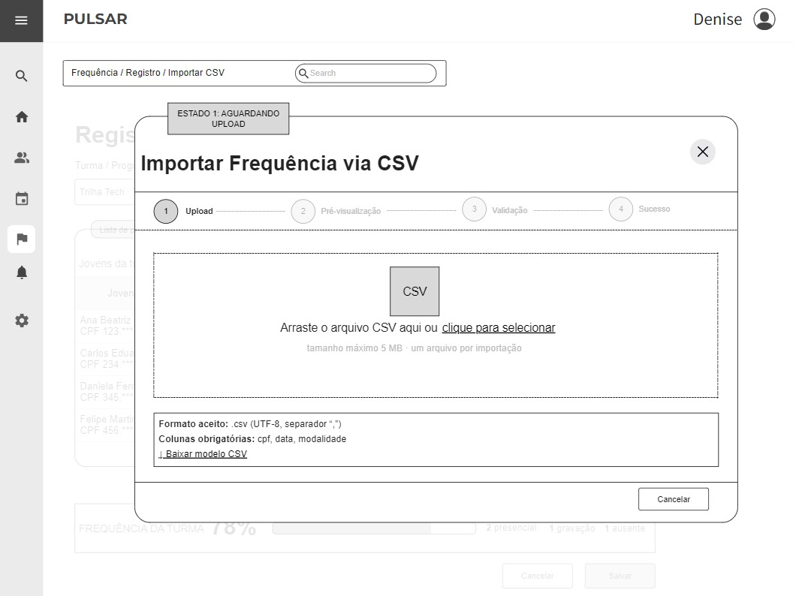<br>
  <sub> Fonte: Material produzido pelos autores (2026) </sub><br><br>
</div>

---

##### Modal de Importação de Arquivos (Planilhão/Aulas) via CSV

Modal acionado pelo botão "Importar Planilhas" no Dashboard Executivo. Reutiliza a mesma estrutura wizard de quatro etapas do modal de frequência, garantindo consistência de interação. A diferença está no título e no contexto: esta importação é voltada para os dados legados do planilhão e dos relatórios da plataforma de aulas, atendendo à US27.
 
<div align="center">
  Figura A5: Wireframe — Modal de Importação de Arquivos via CSV (Coordenação) <br><br>
  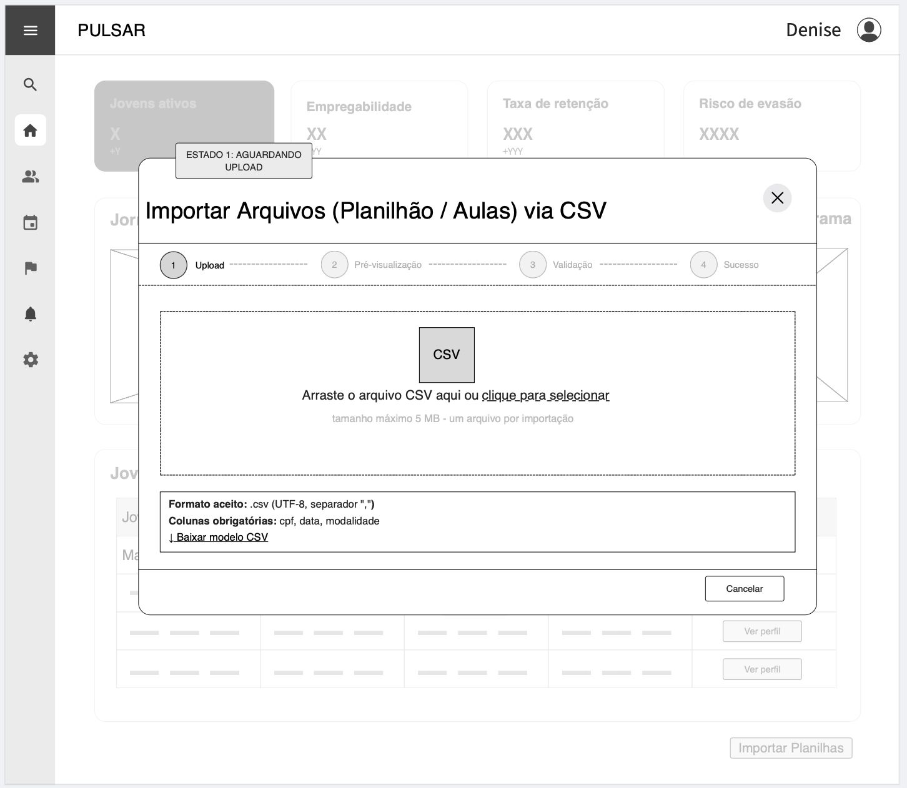<br>
  <sub> Fonte: Material produzido pelos autores (2026) </sub><br><br>
</div>

---

##### Tela de Erro 403 — Coordenação

Variação da tela de erro 403 com a sidebar do perfil de coordenação, exibida quando Denise tenta acessar rotas restritas a outros perfis (ex: prontuário clínico do psicólogo). Mantém a mesma estrutura das demais telas de erro (código, mensagem, contagem regressiva e botão de retorno).

<div align="center">
  Figura A6: Wireframe — Tela de Erro 403 (Coordenação) <br><br>
  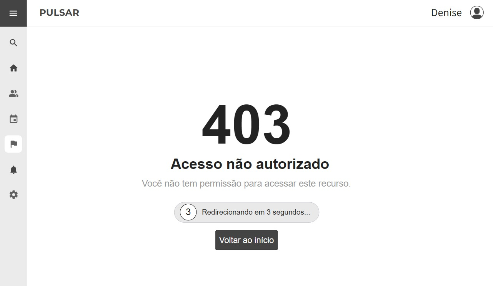<br>
  <sub> Fonte: Material produzido pelos autores (2026) </sub><br><br>
</div>

---

#### B.4.2. Telas complementares — Mateo (Mentor)

##### Meu Impacto como Mentor (Tela Inicial)

Tela inicial do mentor após o login, funcionando como painel motivacional e resumo operacional. Apresenta três KPI cards (alunos mentorados, sessões realizadas, feedback dos mentorados com nota em estrelas), seção "Aumentando meu impacto" com atalhos para buscar mais mentorados e visualizar feedbacks, e cards das próximas mentorias agendadas com data, horário e nome do aluno. Atende à US19 em sua versão resumida.

<div align="center">
  Figura A7: Wireframe — Meu Impacto como Mentor (Mentor) <br><br>
  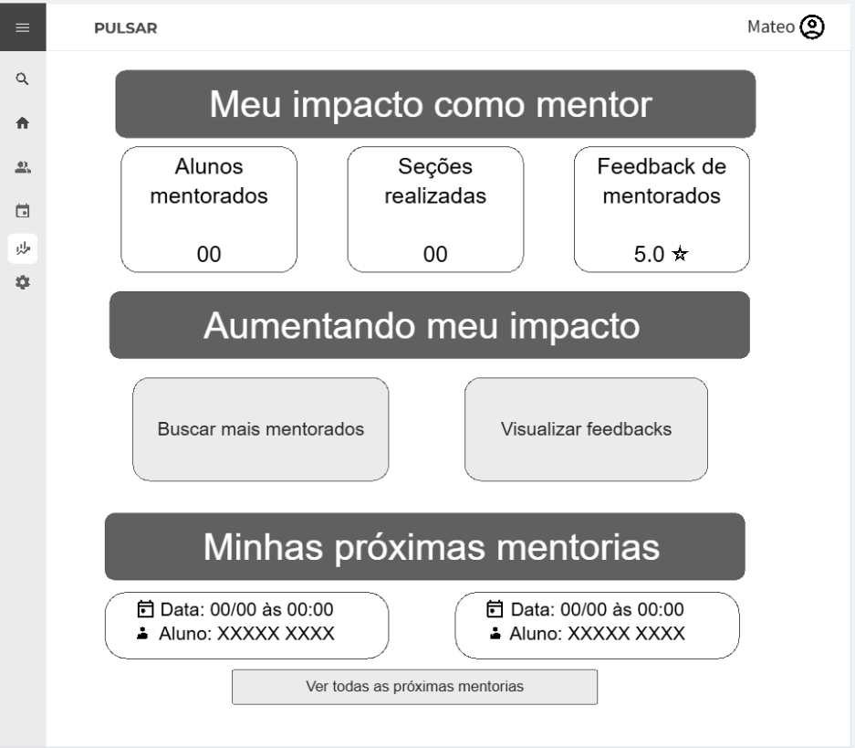<br>
  <sub> Fonte: Material produzido pelos autores (2026) </sub><br><br>
</div>

---

##### Painel de Impacto do Mentor (Visão Detalhada)

Versão expandida do painel de impacto, acessada pelo ícone "Impacto" na sidebar. Diferencia-se da tela inicial por apresentar: perfil do mentor com nome e CPF, cards detalhados dos alunos em acompanhamento (com etapa atual, número de encontros, última reunião e competências trabalhadas), gráfico de barras horizontal com distribuição mensal de mentorias, KPI cards laterais (total de sessões, jovens atendidos, conquistas dos mentorados) e agenda semanal com os próximos encontros nomeados. Atende à US19 em sua versão completa, incluindo o critério de aceite de filtragem por período.

<div align="center">
  Figura A8: Wireframe — Painel de Impacto do Mentor — Visão Detalhada (Mentor) <br><br>
  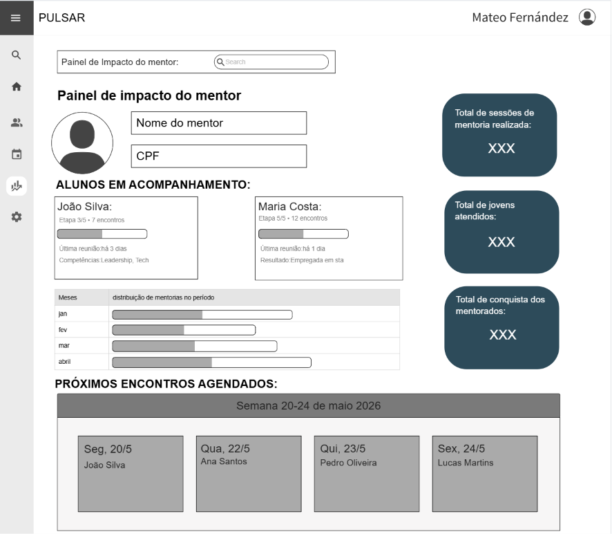<br>
  <sub> Fonte: Material produzido pelos autores (2026) </sub><br><br>
</div>

---

##### Perfil do Mentorado

Tela acessada pelo botão "Ver perfil" nos cards de mentorados. Apresenta dados do jovem (nome, programa, data de ingresso, frequência com barra de progresso e tag de status de risco), quatro blocos informativos (competências técnicas com nível, últimas atividades com status de entrega, participação em eventos e observações da equipe visíveis ao mentor com data e autoria), e o histórico cronológico de mentorias realizadas com aquele jovem. A nota no topo informa que observações internas da equipe nunca são exibidas nessa visão, atendendo à RN12 e à LGPD. Os botões de ação na base permitem registrar nova mentoria diretamente ou voltar à lista. Atende à US21 (ver perfil do mentorado).

<div align="center">
  Figura A9: Wireframe — Perfil do Mentorado (Mentor) <br><br>
  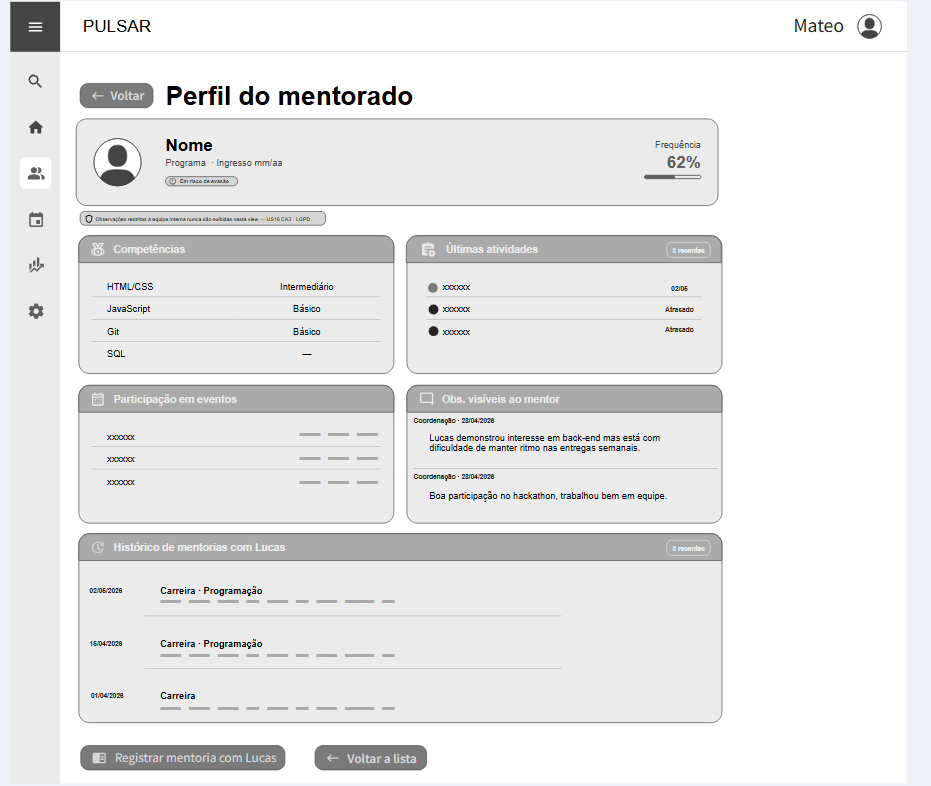<br>
  <sub> Fonte: Material produzido pelos autores (2026) </sub><br><br>
</div>

---

##### Tela de Erro 403 — Mentor

Variação da tela de erro 403 com a sidebar do perfil de mentor, exibida quando Mateo tenta acessar rotas restritas à coordenação ou ao psicólogo.

<div align="center">
  Figura A10: Wireframe — Tela de Erro 403 (Mentor) <br><br>
  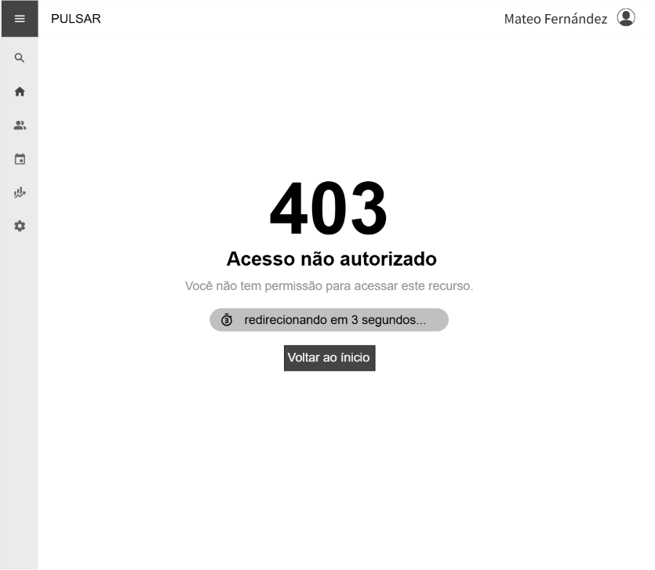<br>
  <sub> Fonte: Material produzido pelos autores (2026) </sub><br><br>
</div>

---

#### A.4.3. Telas complementares — Beatriz (Aluna)

##### Status de Ensino Superior

Tela acessada pelo ícone de ensino superior na sidebar da aluna. Apresenta dados acadêmicos externos à Pulse Mais (número de matrícula, curso e instituição), com botão "Editar informações" para atualização pela própria jovem, e dois painéis scrolláveis (Histórico Acadêmico e Certificados) análogos aos do perfil principal, porém focados na trajetória de ensino superior. Atende à US26.

<div align="center">
  Figura A11: Wireframe — Status de Ensino Superior (Aluna) <br><br>
  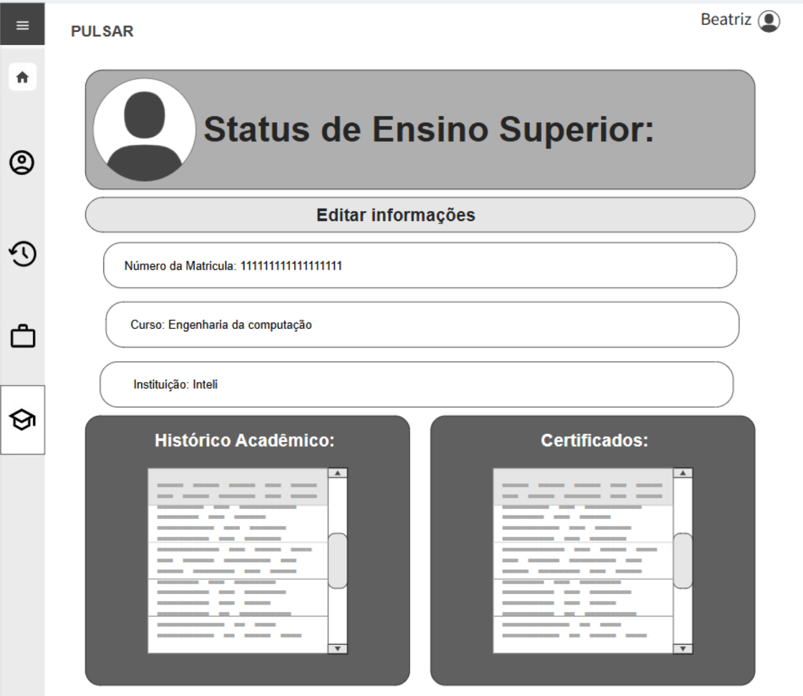<br>
  <sub> Fonte: Material produzido pelos autores (2026) </sub><br><br>
</div>

---

##### Tela de Erro 403 — Aluna

Variação da tela de erro 403 com a sidebar do perfil de aluna, exibida quando Beatriz tenta acessar rotas restritas à coordenação, ao psicólogo ou ao mentor.

<div align="center">
  Figura B12: Wireframe — Tela de Erro 403 (Aluna) <br><br>
  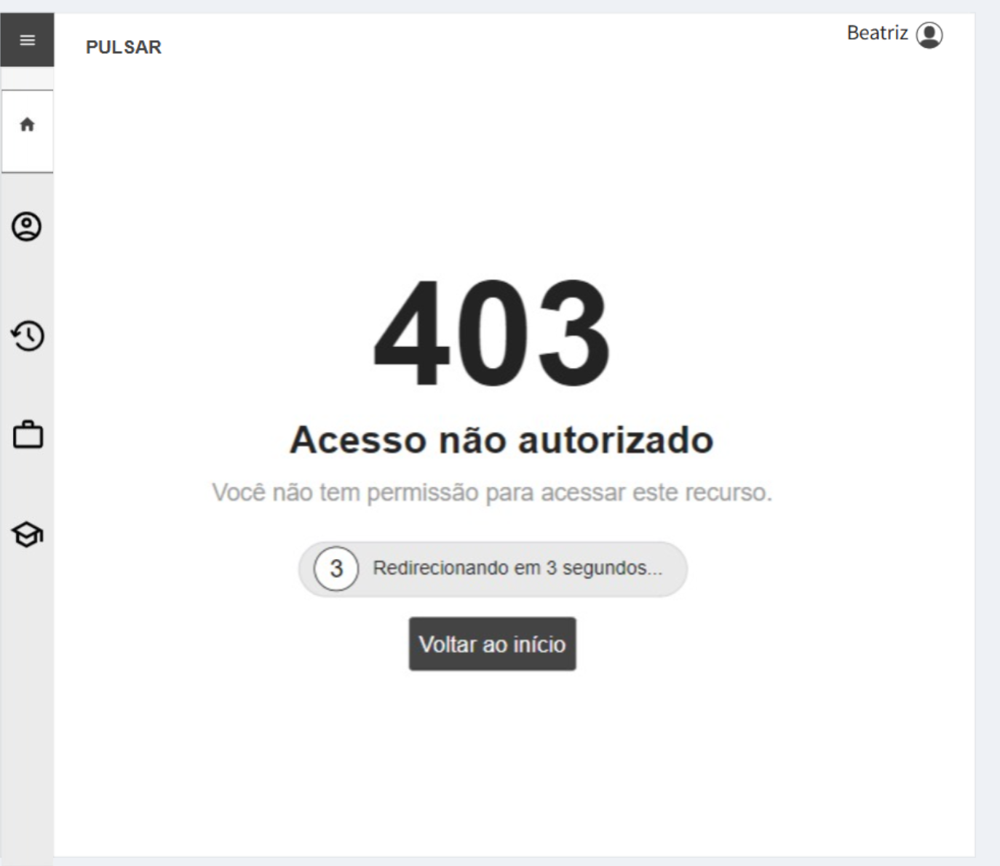<br>
  <sub> Fonte: Material produzido pelos autores (2026) </sub><br><br>
</div>


