

# WAD - Web Application Document - Módulo 2 - Inteli

## Grupo 03 - Pulse Manager

#### Integrantes

- <a href="https://www.linkedin.com/in/ana-carvalho-27268634b/">Ana Luiza Lima de Carvalho</a>
- <a href="http://www.linkedin.com/in/felipe-sodr%C3%A9-pess%C3%B4a">Felipe Sodré Pessôa</a> 
- <a href="https://www.linkedin.com/in/gabrielibattini/">Gabrieli Marques Battini</a> 
- <a href="https://www.linkedin.com/in/joseisaias/">José Isaias Menezes Santos</a>
- <a href="https://www.linkedin.com/in/nicolas-rigolin-carrascossa-4492b2261/">Nicolas Rigolin Carrascossa</a> 
- <a href="https://www.linkedin.com/in/raffael-bensoussan-98331b187/">Raffael Cabral Bensoussan</a>
- <a href="https://www.linkedin.com/in/lisboavitor/">Vitor Medrado Lisboa</a>

## Sumário

[1. Introdução](#c1)

[2. Visão Geral da Aplicação Web](#c2)

[3. Projeto Técnico da Aplicação Web](#c3)

[4. Desenvolvimento da Aplicação Web](#c4)

[5. Testes da Aplicação Web](#c5)

[6. Estudo de Mercado e Plano de Marketing](#c6)

[7. Conclusões e trabalhos futuros](#c7)

[8. Referências](#c8)

[Link para fluxo de telas: https://www.canva.com/design/DAHJebfiO4A/NqxvsvUgwcbkv3LeEEnRwA/edit](#c9)

<br>

# <a name="c1"></a>1. Introdução 

<div align="justify">
A Pulse Mais é uma organização sem fins lucrativos voltada à capacitação profissional de jovens que desejam seguir na área de tecnologia. Ao analisar o contexto da ONG, identifica-se uma problemática central: a descentralização dos dados institucionais, dispersos em múltiplos arquivos de diferentes formatos de planilhas a relatórios e sistemas externos. Essa fragmentação compromete a eficiência na tomada de decisões, dificulta o acompanhamento individualizado dos jovens e reduz a capacidade da instituição de comunicar seu impacto de forma estruturada a parceiros e financiadores.

A partir desta problemática, o grupo propos o desenvolvimento de uma plataforma web que centraliza os dados institucionais e os transforma em inteligência operacional. Mais do que organizar informações, a solução permitirá identificar riscos de evasão por meio de alertas automáticos, personalizar o suporte pedagógico e psicológico com base no histórico individual de cada jovem e gerar relatórios prontos para prestação de contas a doadores e editais. Essa capacidade de converter dados dispersos em decisões ágeis representa o principal diferencial de valor da plataforma para a Pulse Mais.

</div>

# <a name="c2"></a>2. Visão Geral da Aplicação Web 

## 2.1. Escopo do Projeto 

### 2.1.1. Modelo de 5 Forças de Porter 

<div align="justify">

**Ameaça de novos entrantes - Ameaça Baixa a Moderada**

A entrada no segmento de ONGs voltadas à capacitação no mercado tecnológico se torna de difícil execução devido aos desafios burocráticos, além da captação de mentores e entidades doadoras. Para além disso, há uma expansão de instituições voltadas ao aprendizado e tecnologia no Brasil, de acordo com a Edtech Report 2024 da Distrito, indo de 197 para 619 entre 2013 e 2024. Apesar disso, a popularização da IA Generativa facilitou a construção de novas ferramentas voltadas ao ensino e capacitação tecnológica de jovens, permitindo a construção rápida de novas ferramentas e menos infraestrutura física; o que classifica a ameaça como baixa a moderada, exigindo atenção contínua da Pulse Mais ao ecossistema emergente de Edtechs.

**Ameaça de produtos substitutos - Ameaça Alta**

É identificada uma alta ameaça de produtos substitutos devido ao crescimento da disponibilidade de conteúdos online, como cursos gratuitos e vídeos em plataformas como o YouTube, e à existência de programas governamentais de capacitação profissional, como o Pronatec (Ministério da Educação, 2024). A presença de outras organizações do terceiro setor com proposta semelhante amplia essa ameaça, classificando-a como alta.

**Poder de barganha dos fornecedores - Poder Alto**

Os fornecedores desta organização compreendem duas categorias distintas: mentores e colaboradores voluntários e doadores e entidades financiadoras. O poder de barganha dos voluntários é moderado: o NPS de 88,2 da Formação Líder Mentor e a reputação consolidada da Pulse Mais funcionam como atratores de profissionais motivados por propósitos de ESG, reduzindo a dependência de qualquer mentor específico. O poder alto reside nos doadores e entidades financiadoras os reais fornecedores de capital operacional, que podem impor condições, postergar repasses ou encerrar parcerias, ameaçando a continuidade dos programas. Nesse contexto, a plataforma web proposta representa um diferencial estratégico: ao centralizar indicadores de impacto mensuráveis, como taxas de empregabilidade e progressão acadêmica, a Pulse Mais fortalece sua capacidade de prestação de contas, potencialmente reduzindo esse poder ao longo do tempo por meio de evidências de resultado.

**Poder de barganha dos clientes - Poder Baixo-Médio**

Os clientes são classificados como os jovens atingidos, que possuem, em muitos casos, acesso limitado a alternativas de capacitação acadêmica em tecnologia. Além disso, há a classificação de 88,2 no NPS  da Formação Líder Mentor, que indica alta satisfação e baixo poder de negociação individual.

**Rivalidade entre concorrentes - Rivalidade Alta**

No segmento de aprendizado voltado à tecnologia, há uma maior disputa por visibilidade entre instituições, financiamento de empresas e captação de talentos. Como exemplo estão organizações como o Códigos do Amanhã, que oferecem serviços em nichos semelhantes e competem pelos mesmos doadores e perfis de beneficiários, ocasionando a classificação de alta rivalidade. Nesse cenário, a centralização de indicadores mensuráveis pela plataforma web proposta representa um diferencial competitivo direto: ao apresentar métricas verificáveis de empregabilidade e progressão dos jovens, a Pulse Mais fortalece seu posicionamento junto a financiadores em relação a concorrentes com menor capacidade analítica.

</div>

### 2.1.2. Análise SWOT da Instituição Parceira 

<div align="center">
<sup>Figura 1: Análise SWOT.</sup><br>
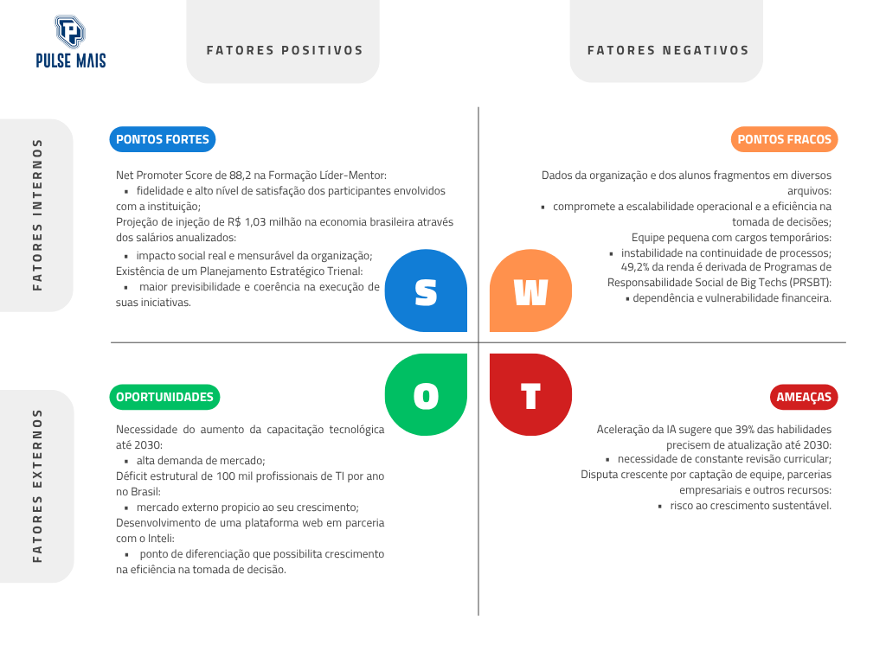<br>
<sub>Fonte: Autoria própria (2026). </sub><br>
</div>

<div align="justify">

Os pontos fortes da Pulse Mais residem no alto NPS e em uma proposta de impacto social alinhada a critérios ESG, o que atrai parceiros e voluntários e diferencia a organização no mercado. A fraqueza central é a fragmentação dos dados institucionais, que limita a eficiência operacional e dificulta a comprovação de resultados a financiadores terreno em que a Pulse Mais perde para concorrentes com maior maturidade em gestão de dados. A expansão do mercado de capacitação tecnológica e a demanda corporativa por talentos diversificados constituem oportunidades concretas, que a plataforma web proposta pode materializar ao gerar indicadores prontos para editais e relatórios de ESG. As ameaças concentram-se na competição por recursos com organizações como o Códigos do Amanhã e na dependência de doadores que condicionam sua participação a métricas de impacto verificáveis.

</div>

### 2.1.3. Solução 

#### 1. Problema a ser resolvido

<div align="justify">

Verificou-se que a Pulse Mais opera com dados de alunos fragmentados em planilhas e registros dispersos, dificultando a visualização da jornada do jovem. Esse cenário compromete o acompanhamento histórico, a análise de indicadores, a personalização do suporte e a agilidade da tomada de decisão institucional.

</div>

#### 2. Dados disponíveis

<div align="justify">

Os insumos disponíveis compreendem: uma planilha de jovens do framework (Fonte: Pulse Mais), relatórios CSV da plataforma atual e dados institucionais sobre programas, trilhas, mentoria, empregabilidade, ensino superior e rede de talentos. Também foram mapeados critérios de público-alvo, jornada do jovem e indicadores estratégicos da organização.

</div>

#### 3. Solução proposta

<div align="justify">

Foi proposta uma aplicação web com WebAPI e banco de dados estruturado para centralizar o histórico acadêmico, institucional e profissional de alunos e ex-alunos. A solução atuará como Single Source of Truth da Pulse Mais, oferecendo visão consolidada para gestores e portal de consulta, atualização e oportunidades para alunos.

</div>

#### 4. Forma de utilização da solução

<div align="justify">

Gestores utilizarão dashboards, filtros e páginas individuais para consultar históricos, acompanhar indicadores e registrar feedbacks. Alunos e ex-alunos acessarão um portal para visualizar dados, atualizar perfis e consultar oportunidades. A solução será desenvolvida com HTML, CSS e JavaScript no front-end, Node.js no back-end e PostgreSQL no banco de dados.

</div>

#### 5. Benefícios esperados

<div align="justify">

Espera-se reduzir a fragmentação de dados, centralizando a jornada dos jovens em uma única plataforma. A solução ampliará a agilidade operacional, habilitará o acompanhamento preventivo de risco de evasão, fortalecerá a autonomia dos alunos no acesso ao próprio histórico e disponibilizará indicadores de impacto estruturados facilitando a prestação de contas a financiadores e o acesso a editais de fomento.

</div>

#### 6. Critério de sucesso e como será avaliado

<div align="justify">

O sucesso será medido por critérios mensuráveis:  taxa de conclusão igual ou superior a 80% em tarefas de consulta de histórico e filtragem de alunos durante testes de usabilidade com os pontos focais da Pulse Mais;  cobertura de ao menos 90% dos campos de dados mapeados na plataforma; tempo médio de localização de um perfil inferior a 30 segundos. A validação ocorrerá via demonstração funcional ao final de cada sprint, com aprovação formal do parceiro para que o incremento seja considerado aceito.

</div>

### 2.1.4. Canvas de Proposta de Valor

<div align="center">
<sup>Figura 2: Canvas de Proposta de Valor da Pulse Manager.</sup><br>
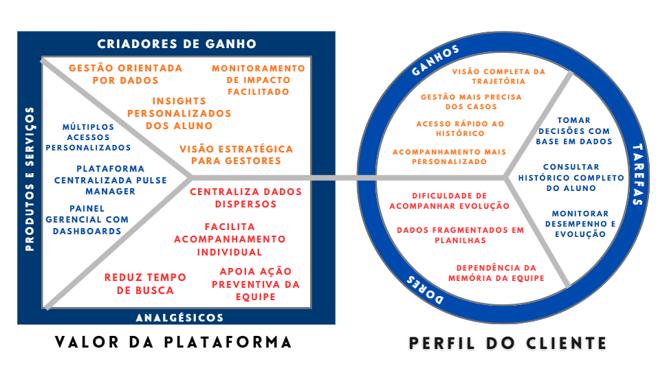<br>
<sub>Fonte: Elaborado pela equipe (2026), com base no Value Proposition Canvas de Strategyzer.</sub><br>
</div>


<div align="justify">

O Canvas de Proposta de valor da Pulse Mais foi estruturado com base em dois segmentos prioritários da solução: **gestores da instituição** e **alunos/ex-alunos da rede**. Essa definição foi adotada porque a proposta de valor da plataforma depende, ao mesmo tempo, da capacidade institucional de acompanhar a jornada completa dos jovens e da capacidade dos próprios alunos de acessarem seu histórico, manterem seus perfis atualizados e se conectarem a oportunidades. Dessa forma, o canvas foi organizado para evidenciar, de um lado, as tarefas, dores e ganhos desses públicos e, de outro, os elementos da solução que aliviam essas dores e potencializam a geração de valor.

</div>

### Perfil do cliente - Gestores da Pulse Mais

#### Tarefas do cliente

<div align="justify">

Os gestores precisam acompanhar a jornada completa dos jovens desde a entrada na organização até os desdobramentos em formação, mentoria, empregabilidade, ensino superior e rede de talentos. Também precisam localizar rapidamente históricos individuais, monitorar indicadores institucionais, identificar riscos de evasão, segmentar perfis para oportunidades específicas, registrar feedbacks de performance e tomar decisões baseadas em dados consolidados. Essas necessidades são coerentes com o escopo macro, o dashboard, a página do aluno, os filtros avançados e o módulo de registro de jornada previstos no TAPI.

</div>

#### Dores

<div align="justify">

Atualmente, a gestão enfrenta dispersão de informações em planilhas isoladas, dificuldade de reconstrução da trajetória do aluno, baixa rastreabilidade histórica, dependência de memória individual da equipe e esforço manual para consolidação de indicadores. Há também limitação para personalizar o atendimento com base em dados completos e para agir preventivamente diante de sinais de evasão, queda de engajamento ou necessidade de suporte direcionado.

</div>

#### Ganhos

<div align="justify">

Os gestores desejam uma visão única e confiável de cada aluno, dashboards claros, rapidez de consulta, histórico completo em uma só interface, filtros inteligentes, apoio à tomada de decisão e maior precisão na estratégia de acompanhamento e empregabilidade. Desejam ainda reduzir o retrabalho operacional e transformar dados dispersos em inteligência acionável.

</div>

### Mapa de valor - Gestores da Pulse Mais

#### Produtos & Serviços

<div align="justify">

A solução entrega base centralizada de dados, dashboard institucional, página individual do aluno, módulo de registro da jornada, histórico consolidado, filtros avançados, campos estruturados para indicadores de impacto e funcionalidade para inserção de feedbacks e anotações de performance. O modelo institucional também prevê prontuário digital e visão segmentada por perfil de acesso.

</div>

#### Aliviadores

<div align="justify">

A plataforma reduz a fragmentação de informações ao concentrar dados pessoais, acadêmicos, institucionais e profissionais em uma única base. Diminui a dependência de conhecimento informal da equipe ao registrar a trajetória completa do jovem. Reduz o tempo gasto na busca por históricos e melhora o acompanhamento preventivo por meio de visualização integrada e atualização contínua dos dados. Também reduz a dificuldade de monitorar impacto ao substituir consolidações manuais por consultas estruturadas.

</div>

#### Criadores de Ganho

<div align="justify">

A solução cria valor ao transformar dados operacionais em visão estratégica. Os dashboards e históricos completos permitem atendimento mais consultivo, identificação de padrões, acompanhamento longitudinal e maior capacidade de personalização do suporte. Os registros de performance e os insights individualizados ampliam a qualidade da gestão e tornam a tomada de decisão mais rápida, precisa e fundamentada.

</div>

## 2.1.5. Matriz de Riscos do Projeto

<div align="justify">

A Matriz de Riscos do projeto foi elaborada com o objetivo de identificar, classificar e tratar os principais eventos capazes de comprometer a entrega e o valor da aplicação web proposta para a Pulse Mais. Considerando que a solução deverá centralizar dados atualmente dispersos, sustentar o acompanhamento da jornada dos jovens, viabilizar consultas históricas, apoiar dashboards gerenciais e permitir segmentações estratégicas, tornou-se necessário antecipar riscos de natureza técnica, operacional, analítica e institucional.

</div>

<div align="center">
<sup>Figura 3: Matriz de Riscos da Pulse Manager.</sup><br>
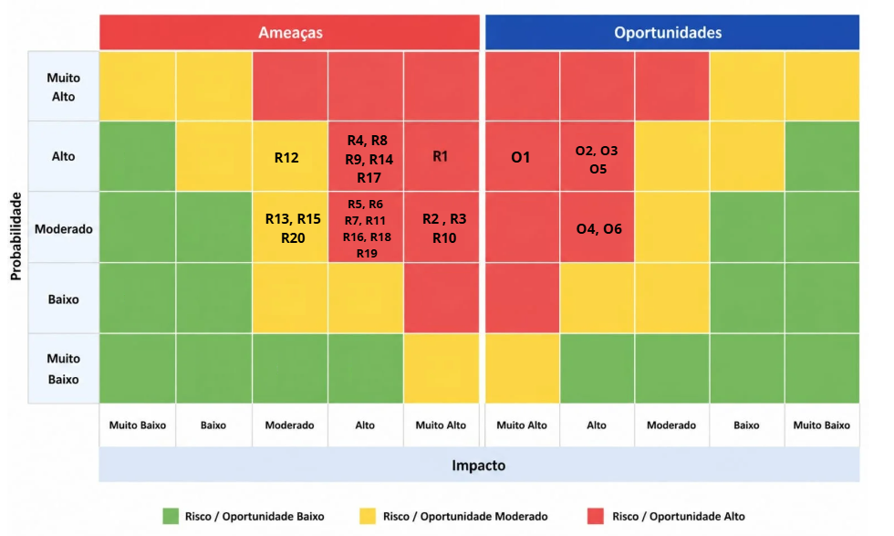<br>
<sub>Fonte: Autoria Própria (2026).</sub><br>
</div>

<div align="justify">

A análise foi organizada de modo a preservar coerência com o nível de detalhamento adotado nas demais seções do WAD, contemplando não apenas a identificação dos riscos, mas também sua classificação, criticidade e respectivas estratégias de prevenção, mitigação e contingência.

</div>

### Critérios adotados

#### Probabilidade

- **Muito baixa**: ocorrência improvável dentro do contexto do projeto
- **Baixa**: possibilidade existente, porém pouco recorrente
- **Moderada**: ocorrência plausível ao longo do desenvolvimento
- **Alta**: risco provável, com sinais concretos de incidência
- **Muito alta**: ocorrência fortemente esperada na ausência de controle

#### Impacto

- **Muito baixo**: afeta elementos periféricos, sem comprometer o objetivo principal
- **Baixo**: gera retrabalho localizado, com baixo efeito sobre a entrega
- **Moderado**: compromete parcialmente uma funcionalidade relevante
- **Alto**: afeta de forma significativa o valor do produto ou sua operação
- **Muito alto**: compromete diretamente a utilidade, aderência ou viabilidade da solução

### Tabela síntese de riscos

| ID  | Risco                                                                 | Categoria                | Probabilidade | Impacto    |
| --- | --------------------------------------------------------------------- | ------------------------ | ------------- | ---------- |
| R1  | Inconsistência na consolidação dos dados legados                      | Dados                    | Alta          | Muito alto |
| R2  | Modelagem insuficiente para representar toda a jornada do jovem       | Negócio / Dados          | Moderada      | Muito alto |
| R3  | Falta de aderência da solução às necessidades reais da Pulse Mais     | Negócio                  | Moderada      | Muito alto |
| R4  | Sobrecarga de escopo para o tempo disponível do módulo                | Gestão                   | Alta          | Alto       |
| R5  | Dashboard com indicadores pouco úteis para a tomada de decisão        | Produto                  | Moderada      | Alto       |
| R6  | Dificuldade de visualização do histórico completo do aluno            | Usabilidade / Produto    | Moderada      | Alto       |
| R7  | Filtros e segmentações não atenderem às buscas operacionais           | Produto / Negócio        | Moderada      | Alto       |
| R8  | Baixa qualidade ou incompletude dos dados alimentados no sistema      | Dados / Operação         | Alta          | Alto       |
| R9  | Dependência excessiva de conhecimento informal da equipe              | Operação                 | Alta          | Alto       |
| R10 | Tratamento inadequado de dados sensíveis ou restritos                 | Segurança / Conformidade | Moderada      | Muito alto |
| R11 | Interpretação equivocada das restrições de autenticação e permissão   | Arquitetura / Segurança  | Moderada      | Alto       |
| R12 | Complexidade excessiva na migração inicial de planilhas               | Dados / Técnica          | Alta          | Moderado   |
| R13 | Portal do aluno gerar pouco valor percebido                           | Produto                  | Moderada      | Moderado   |
| R14 | Falhas de comunicação entre front-end, back-end e banco               | Técnica                  | Alta          | Alto       |
| R15 | Desempenho insuficiente em consultas históricas e filtros             | Técnica / Produto        | Moderada      | Moderado   |
| R16 | Interface pouco intuitiva para a equipe gestora                       | Usabilidade              | Moderada      | Alto       |
| R17 | Atualização futura dificultada pela falta de flexibilidade estrutural | Arquitetura              | Alta          | Alto       |
| R18 | Subestimação da complexidade dos feedbacks e registros qualitativos   | Negócio / Produto        | Moderada      | Alto       |
| R19 | Falta de rastreabilidade entre requisitos, dados e funcionalidades    | Gestão / Engenharia      | Moderada      | Alto       |
| R20 | Adoção limitada da plataforma pela equipe no curto prazo              | Operação / Mudança       | Moderada      | Moderado   |

### Detalhamento dos riscos

#### R1 - Inconsistência na consolidação dos dados legados

**Categoria:** Dados
**Descrição:** Os dados atualmente encontram-se distribuídos em planilhas distintas e registros descentralizados, o que pode provocar duplicidade, lacunas e divergências de preenchimento durante a consolidação da base.
**Probabilidade:** Alta
**Impacto:** Muito alto
**Prevenção / Mitigação:** Definir modelo canônico, padronizar campos e validar amostras antes da carga principal.
**Plano de contingência / Resposta:** Priorizar cargas parciais, registrar inconsistências e executar saneamento manual dos dados críticos.

#### R2 - Modelagem insuficiente para representar toda a jornada do jovem

**Categoria:** Negócio / Dados
**Descrição:** Há risco de que a estrutura de dados não represente adequadamente dimensões como formação, mentoria, empregabilidade, ensino superior e histórico longitudinal.
**Probabilidade:** Moderada
**Impacto:** Muito alto
**Prevenção / Mitigação:** Revisar entidades e relações com base no TAPI e validar a modelagem ao longo das sprints.
**Plano de contingência / Resposta:** Repriorizar a modelagem para os fluxos centrais e manter campos complementares para evolução futura.

#### R3 - Falta de aderência da solução às necessidades reais da Pulse Mais

**Categoria:** Negócio
**Descrição:** A solução pode apresentar consistência técnica sem, necessariamente, refletir o fluxo operacional e decisório da equipe.
**Probabilidade:** Moderada
**Impacto:** Muito alto
**Prevenção / Mitigação:** Validar backlog, protótipos e fluxos em ciclos frequentes com os pontos focais da instituição.
**Plano de contingência / Resposta:** Readequar funcionalidades críticas e registrar itens não absorvidos para iterações posteriores.

#### R4 - Sobrecarga de escopo para o tempo disponível do módulo

**Categoria:** Gestão
**Descrição:** O volume de funcionalidades previstas pode ultrapassar a capacidade de entrega no prazo acadêmico.
**Probabilidade:** Alta
**Impacto:** Alto
**Prevenção / Mitigação:** Definir o MVP logo nas primeiras sprints e limitar o escopo ao núcleo funcional.
**Plano de contingência / Resposta:** Postergar itens secundários e concentrar esforço nos fluxos prioritários.

#### R5 - Dashboard com indicadores pouco úteis para a tomada de decisão

**Categoria:** Produto
**Descrição:** Existe o risco de construir dashboards tecnicamente corretos, porém pouco úteis para responder às necessidades concretas da gestão.
**Probabilidade:** Moderada
**Impacto:** Alto
**Prevenção / Mitigação:** Definir previamente quais perguntas o dashboard precisa responder e validar os indicadores com o parceiro.
**Plano de contingência / Resposta:** Reestruturar os painéis com foco em métricas acionáveis.

#### R6 - Dificuldade de visualização do histórico completo do aluno

**Categoria:** Usabilidade / Produto
**Descrição:** A página individual do aluno pode se tornar extensa ou pouco legível, dificultando a leitura da trajetória.
**Probabilidade:** Moderada
**Impacto:** Alto
**Prevenção / Mitigação:** Organizar informações por blocos de jornada e aplicar hierarquia visual clara.
**Plano de contingência / Resposta:** Simplificar a visualização e priorizar resumos por categoria.

#### R7 - Filtros e segmentações não atenderem às buscas operacionais

**Categoria:** Produto / Negócio
**Descrição:** Os filtros podem não refletir os critérios de busca efetivamente utilizados pela equipe.
**Probabilidade:** Moderada
**Impacto:** Alto
**Prevenção / Mitigação:** Mapear previamente os critérios de segmentação mais recorrentes.
**Plano de contingência / Resposta:** Repriorizar filtros críticos e postergar segmentações complementares.

#### R8 - Baixa qualidade ou incompletude dos dados alimentados no sistema

**Categoria:** Dados / Operação
**Descrição:** Mesmo centralizados, os dados podem permanecer incompletos, desatualizados ou inconsistentes, reduzindo o valor analítico da solução.
**Probabilidade:** Alta
**Impacto:** Alto
**Prevenção / Mitigação:** Definir campos obrigatórios, padrões mínimos de preenchimento e validações nas entradas.
**Plano de contingência / Resposta:** Sinalizar registros incompletos e priorizar saneamento dos campos críticos.

#### R9 - Dependência excessiva de conhecimento informal da equipe

**Categoria:** Operação
**Descrição:** Parte da lógica institucional pode permanecer implícita, dificultando sua tradução em regras de sistema.
**Probabilidade:** Alta
**Impacto:** Alto
**Prevenção / Mitigação:** Formalizar regras de negócio, critérios de preenchimento e fluxos operacionais.
**Plano de contingência / Resposta:** Conduzir refinamentos com o parceiro para explicitar regras tácitas.

#### R10 - Tratamento inadequado de dados sensíveis ou restritos

**Categoria:** Segurança / Conformidade
**Descrição:** O sistema lida com informações pessoais e registros potencialmente sensíveis, exigindo cuidado quanto à exposição e uso.
**Probabilidade:** Moderada
**Impacto:** Muito alto
**Prevenção / Mitigação:** Restringir dados sensíveis, limitar visibilidade por perfil e evitar exposição em ambientes públicos.
**Plano de contingência / Resposta:** Remover imediatamente dados indevidos e substituí-los por registros fictícios ou mascarados.

#### R11 - Interpretação equivocada das restrições de autenticação e permissão

**Categoria:** Arquitetura / Segurança
**Descrição:** A simplificação do controle de acesso pode gerar inconsistências entre perfis e permissões.
**Probabilidade:** Moderada
**Impacto:** Alto
**Prevenção / Mitigação:** Definir previamente regras mínimas de autenticação e acesso por perfil.
**Plano de contingência / Resposta:** Reduzir perfis ativos no MVP e restringir acessos ao mínimo necessário.

#### R12 - Complexidade excessiva na migração inicial de planilhas

**Categoria:** Dados / Técnica
**Descrição:** A importação inicial pode consumir mais esforço do que o previsto em razão da heterogeneidade dos arquivos.
**Probabilidade:** Alta
**Impacto:** Moderado
**Prevenção / Mitigação:** Trabalhar com recortes de importação e validação progressiva.
**Plano de contingência / Resposta:** Suspender automações complexas e priorizar cargas essenciais.

#### R13 - Portal do aluno gerar pouco valor percebido

**Categoria:** Produto
**Descrição:** O portal pode não demonstrar valor suficiente ao estudante se entregar pouca utilidade prática.
**Probabilidade:** Moderada
**Impacto:** Moderado
**Prevenção / Mitigação:** Priorizar histórico, perfil e oportunidades como núcleo do portal.
**Plano de contingência / Resposta:** Simplificar o fluxo e concentrar a entrega em funcionalidades de valor direto.

#### R14 - Falhas de comunicação entre front-end, back-end e banco

**Categoria:** Técnica
**Descrição:** Divergências entre interface, API e persistência podem comprometer cadastros, consultas e atualizações.
**Probabilidade:** Alta
**Impacto:** Alto
**Prevenção / Mitigação:** Definir contratos de dados e realizar testes integrados continuamente.
**Plano de contingência / Resposta:** Corrigir endpoints críticos e estabilizar primeiro o fluxo principal.

#### R15 - Desempenho insuficiente em consultas históricas e filtros

**Categoria:** Técnica / Produto
**Descrição:** Consultas extensas podem comprometer a fluidez de uso, especialmente em dashboards e históricos.
**Probabilidade:** Moderada
**Impacto:** Moderado
**Prevenção / Mitigação:** Otimizar consultas, modelagem e carregamento de dados.
**Plano de contingência / Resposta:** Paginar resultados e limitar consultas amplas no MVP.

#### R16 - Interface pouco intuitiva para a equipe gestora

**Categoria:** Usabilidade
**Descrição:** Uma interface pouco clara pode reduzir a adoção e aumentar o retrabalho operacional.
**Probabilidade:** Moderada
**Impacto:** Alto
**Prevenção / Mitigação:** Validar fluxos com usuários internos e aplicar princípios de usabilidade.
**Plano de contingência / Resposta:** Redesenhar as telas críticas com foco em clareza funcional.

#### R17 - Atualização futura dificultada pela falta de flexibilidade estrutural

**Categoria:** Arquitetura
**Descrição:** Uma estrutura rígida pode dificultar futuras expansões e ajustes da plataforma.
**Probabilidade:** Alta
**Impacto:** Alto
**Prevenção / Mitigação:** Modelar com foco em extensibilidade e documentar a estrutura de dados.
**Plano de contingência / Resposta:** Registrar limitações e prever pontos de expansão para versões futuras.

#### R18 - Subestimação da complexidade dos feedbacks e registros qualitativos

**Categoria:** Negócio / Produto
**Descrição:** Os registros qualitativos podem demandar maior refinamento estrutural e semântico do que o inicialmente previsto.
**Probabilidade:** Moderada
**Impacto:** Alto
**Prevenção / Mitigação:** Definir tipos, categorias e objetivos dos registros antes da implementação.
**Plano de contingência / Resposta:** Simplificar o modelo de registro no MVP e documentar expansão futura.

#### R19 - Falta de rastreabilidade entre requisitos, dados e funcionalidades

**Categoria:** Gestão / Engenharia
**Descrição:** A ausência de vínculo claro entre requisitos, entidades e entregas pode comprometer a consistência do projeto.
**Probabilidade:** Moderada
**Impacto:** Alto
**Prevenção / Mitigação:** Manter rastreabilidade entre problema, requisito, dado e funcionalidade.
**Plano de contingência / Resposta:** Revisar WAD e backlog antes de cada entrega.

#### R20 - Adoção limitada da plataforma pela equipe no curto prazo

**Categoria:** Operação / Mudança
**Descrição:** A transição de planilhas para uma plataforma estruturada exige adaptação operacional e mudança de hábito.
**Probabilidade:** Moderada
**Impacto:** Moderado
**Prevenção / Mitigação:** Construir fluxos simples e aderentes à rotina da equipe.
**Plano de contingência / Resposta:** Concentrar adoção inicial em fluxos críticos e expandir gradualmente.

### Classificação sintética por criticidade

#### Riscos críticos

- R1 - Inconsistência na consolidação dos dados legados
- R2 - Modelagem insuficiente para representar toda a jornada do jovem
- R3 - Falta de aderência da solução às necessidades reais da Pulse Mais
- R4 - Sobrecarga de escopo para o tempo disponível do módulo
- R10 - Tratamento inadequado de dados sensíveis ou restritos

#### Riscos relevantes

- R5 - Dashboard com indicadores pouco úteis para a tomada de decisão
- R6 - Dificuldade de visualização do histórico completo do aluno
- R7 - Filtros e segmentações não atenderem às buscas operacionais
- R8 - Baixa qualidade ou incompletude dos dados alimentados no sistema
- R9 - Dependência excessiva de conhecimento informal da equipe
- R11 - Interpretação equivocada das restrições de autenticação e permissão
- R14 - Falhas de comunicação entre front-end, back-end e banco
- R16 - Interface pouco intuitiva para a equipe gestora
- R17 - Atualização futura dificultada pela falta de flexibilidade estrutural
- R18 - Subestimação da complexidade dos feedbacks e registros qualitativos
- R19 - Falta de rastreabilidade entre requisitos, dados e funcionalidades

#### Riscos moderados

- R12 - Complexidade excessiva na migração inicial de planilhas
- R13 - Portal do aluno gerar pouco valor percebido
- R15 - Desempenho insuficiente em consultas históricas e filtros
- R20 - Adoção limitada da plataforma pela equipe no curto prazo

### Oportunidades associadas ao projeto

<div align="justify">

Além dos riscos, identificaram-se oportunidades relevantes que podem ampliar o valor da solução caso sejam exploradas de forma consistente.

</div>

| ID  | Oportunidade                                            | Probabilidade | Impacto    |
| --- | ------------------------------------------------------- | ------------- | ---------- |
| O1  | Consolidação da SSOT institucional                      | Alta          | Muito alto |
| O2  | Melhoria da tomada de decisão baseada em dados          | Alta          | Alto       |
| O3  | Personalização do atendimento ao jovem                  | Alta          | Alto       |
| O4  | Fortalecimento da empregabilidade e da rede de talentos | Moderada      | Alto       |
| O5  | Redução de carga operacional da equipe                  | Alta          | Alto       |
| O6  | Base para evolução futura da plataforma                 | Moderada      | Alto       |

#### O1 - Consolidação da SSOT institucional

**Descrição:** A plataforma pode se consolidar como principal fonte de verdade institucional para histórico, acompanhamento e decisão.
**Plano de aproveitamento:** Priorizar consistência da base, clareza estrutural e confiabilidade dos dados desde o MVP.

#### O2 - Melhoria da tomada de decisão baseada em dados

**Descrição:** A centralização dos registros pode qualificar decisões e reduzir dependência de interpretações intuitivas.
**Plano de aproveitamento:** Estruturar dashboards orientados a perguntas concretas da gestão.

#### O3 - Personalização do atendimento ao jovem

**Descrição:** O histórico consolidado permite acompanhamento mais individualizado, consultivo e preventivo.
**Plano de aproveitamento:** Estruturar páginas individuais com leitura longitudinal e registros relevantes.

#### O4 - Fortalecimento da empregabilidade e da rede de talentos

**Descrição:** Filtros e segmentações podem qualificar o vínculo entre jovens e oportunidades.
**Plano de aproveitamento:** Priorizar campos e filtros relacionados à empregabilidade e trajetória.

#### O5 - Redução de carga operacional da equipe

**Descrição:** A redução da dependência de planilhas pode liberar tempo para acompanhamento mais estratégico.
**Plano de aproveitamento:** Priorizar usabilidade, busca rápida e acesso direto ao histórico.

#### O6 - Base para evolução futura da plataforma

**Descrição:** A solução pode servir como base para novos módulos e futuras expansões.
**Plano de aproveitamento:** Documentar arquitetura, limitações e pontos de expansão desde a primeira versão.

### Síntese analítica

<div align="justify">

A análise evidencia que os principais pontos de atenção do projeto concentram-se em quatro frentes: consolidação dos dados legados, aderência da modelagem à jornada real dos jovens, controle de escopo frente ao prazo acadêmico e tratamento adequado de informações sensíveis. Esses elementos são decisivos porque sustentam diretamente a utilidade, a confiabilidade e o valor institucional da solução.

Diante disso, conclui-se que a condução mais adequada consiste em priorizar um MVP aderente ao TAPI, concentrado na centralização dos perfis, no registro da jornada, na visualização consolidada do histórico, no dashboard gerencial e no portal básico do aluno. A partir dessa base, a solução tende a reduzir retrabalho operacional, ampliar capacidade analítica e sustentar evoluções futuras com maior consistência.

</div>

## 2.2. Personas 

<div align="justify">

Personas: A persona é definida como uma descrição realista e detalhada do usuário ideal, sendo elaborada com base nos objetivos estratégicos do produto e sustentada por dados reais sobre o comportamento, necessidades e motivações do público-alvo. Nesse caso usamos Proto-Personas (Quando não sustentamos com dados reais.).

</div>


<div align="center">
<sup>Figura 4: Persona 01.</sup><br>
    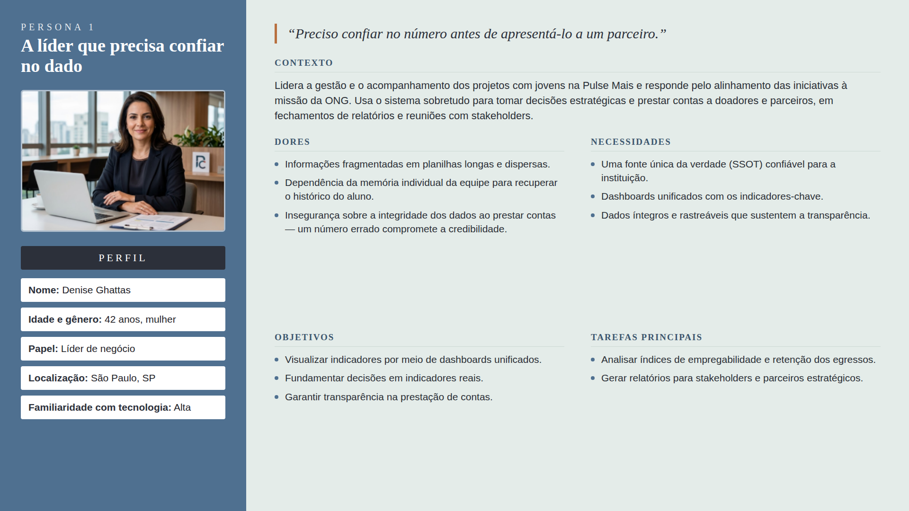<br>
<sub>Fonte: Autoria própria (2026). </sub><br>

<sup>Figura 5: Persona 02.</sup><br>
    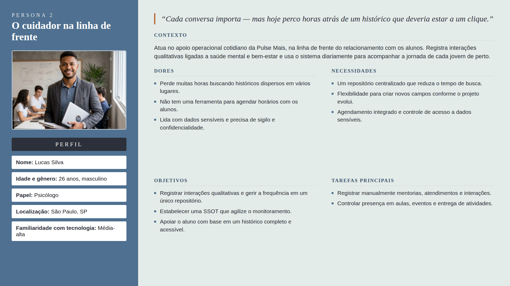<br>
<sub>Fonte: Autoria própria (2026). </sub><br>

<sup>Figura 6: Persona 03.</sup><br>
    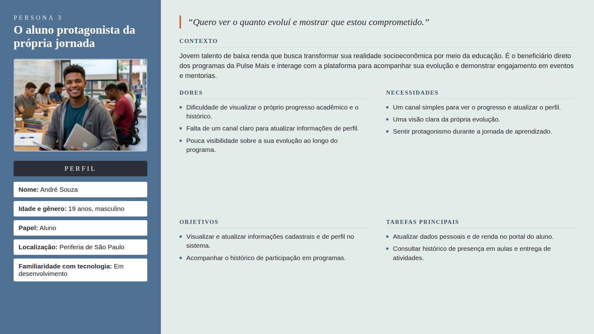<br>
<sub>Fonte: Autoria própria (2026).</sub>
</div>

## 2.3. User Stories 

<div align="justify">

User Stories: As User Stories são definidas como descrições de uma funcionalidade, sob a perspectiva do usuário final. Por meio desta técnica, o foco do desenvolvimento é direcionado às necessidades reais dos usuários, em vez das percepções internas da equipe.

</div>

| Identificação        | US01 |
| -------------------- | ---- |
| Persona              | Denise Ghattas |
| User Story           | Como gestora, eu quero visualizar um dashboard centralizado com indicadores estratégicos e perfis individuais dos alunos, para que eu possa monitorar a instituição e tomar decisões embasadas sem depender de planilhas dispersas. |
| Critério de aceite 1 | CR1: Dado que a gestora acessa a plataforma, quando ela abre o dashboard, então o sistema exibe indicadores consolidados da turma ativa: total de alunos ativos, média geral de notas, percentual de alunos empregados e taxa de engajamento, cada um com variação em relação ao período anterior. |
| Critério de aceite 2 | CR2: Dado que a gestora está na aba "Alunos", quando a página carrega, então o sistema exibe cards resumidos de cada aluno com nome, curso, badge de status e barra de progresso do módulo atual. |
| Critério de aceite 3 | CR3: Dado que a gestora quer visualizar o perfil de um aluno, quando ela clica no card do aluno, então o sistema exibe o perfil completo com: dados cadastrais (nome, CPF e contato), dados acadêmicos (notas por módulo e percentual de frequência), trilha e situação de empregabilidade. |
| Critérios INVEST     | INDEPENDENTE: A visualização do dashboard e dos perfis pode ser desenvolvida sem depender de módulos de notificação ou agendamento, usando dados já presentes no banco. <br><br> NEGOCIÁVEL: Os indicadores exibidos no dashboard e os campos do perfil do aluno podem ser refinados com o parceiro Pulse Mais conforme as prioridades estratégicas da gestão. <br><br> VALIOSA: Centraliza a informação mais crítica para a tomada de decisão da gestora em uma única tela, eliminando a dependência de planilhas dispersas. <br><br> ESTIMÁVEL: O esforço para consolidar os dados acadêmicos e de jornada em telas de dashboard e perfil é mensurável pela equipe, com base nos dados já estruturados no banco de dados. <br><br> PEQUENA: A história abrange a criação de duas telas interligadas (dashboard e perfil do aluno), ambas circunscritas ao escopo do MVP. <br><br> TESTÁVEL: É possível validar verificando se os indicadores exibidos no dashboard correspondem aos dados do banco e se o perfil do aluno carrega todos os campos esperados ao clicar em um card. |

| Identificação        | US02 |
| -------------------- | ---- |
| Persona              | Denise Ghattas |
| User Story           | Como gestora, eu quero buscar e filtrar alunos, ex-alunos e funcionários por critérios específicos, para que eu consiga localizar rapidamente qualquer pessoa na plataforma e acessar seus dados sem depender da minha memória. |
| Critério de aceite 1 | CR1: Dado que a gestora está na aba "Alunos", quando ela aplica filtros por critérios como nota (acima ou abaixo de um valor), percentual de faltas, trilha ou período de ingresso, então o sistema exibe apenas os registros que atendem a todos os filtros combinados. |
| Critério de aceite 2 | CR2: Dado que a gestora busca uma pessoa específica, quando ela digita o nome ou CPF na barra de busca, então o sistema exibe o perfil completo dessa pessoa com: dados cadastrais (nome, CPF e contato), dados acadêmicos (notas e frequência por módulo), trilha, período de ingresso e situação de empregabilidade. |
| Critérios INVEST     | INDEPENDENTE: A funcionalidade de busca e filtro pode ser desenvolvida sem depender de módulos de notificação ou agendamento, operando diretamente sobre o banco de dados existente. <br><br> NEGOCIÁVEL: Os critérios de filtro disponíveis e os campos exibidos no resultado da busca podem ser ajustados com o parceiro conforme as necessidades operacionais da gestora. <br><br> VALIOSA: Reduz significativamente o tempo gasto pela gestora para localizar informações de alunos e funcionários, substituindo a busca manual em planilhas dispersas. <br><br> ESTIMÁVEL: A equipe consegue estimar o esforço com base nos campos já estruturados no banco de dados e na quantidade de critérios de filtro mapeados. <br><br> PEQUENA: A história se limita à implementação de busca textual e filtros combinados sobre listas já existentes na plataforma, sem adicionar novas entidades ao modelo de dados. <br><br> TESTÁVEL: É possível validar aplicando filtros específicos e verificando se os resultados exibidos correspondem apenas aos registros que atendem aos critérios selecionados; e buscando um CPF específico para conferir se o perfil correto é retornado. |

| Identificação        | US03 |
| -------------------- | ---- |
| Persona              | Lucas Silva |
| User Story           | Como um psicólogo, eu quero mandar notificações para os alunos, para que eu consiga entrar em contato com o aluno para ajudar ele conforme suas necessidades. |
| Critério de aceite 1 | CR1: Dado que o psicólogo abre a plataforma, quando ele percebe que um aluno está tendo dificuldades e clica no perfil do aluno, então o sistema envia uma notificação para o aluno informando que o psicólogo quer entrar em contato com ele. |
| Critério de aceite 2 | CR2: Dado que o psicólogo recebe uma notificação de um aluno, quando ele clica no perfil do aluno e seleciona "Notificar aluno", então o sistema envia uma confirmação ao aluno de que o psicólogo irá entrar em contato em breve. |
| Critérios INVEST     | INDEPENDENTE: A história deve ser entregue sem depender de outras funcionalidades complexas de comunicação, focando apenas no envio da notificação. <br><br> NEGOCIÁVEL: A história abre espaço para discussões sobre como a notificação será entregue e o que deve ser mostrado na mensagem automática. <br><br> VALIOSA: Permite a proatividade do psicólogo no suporte ao aluno, garantindo intervenções necessárias através da plataforma. <br><br> ESTIMÁVEL: Com os critérios de aceite definidos, a equipe consegue avaliar o esforço técnico para implementar o gatilho de ação. <br><br> PEQUENA: A história é focada em uma única ação e um gatilho específico, evitando a inclusão de sistemas complexos de chat ou agendamento nesta fase. <br><br> TESTÁVEL: A história é testável verificando se o aluno recebeu a notificação correspondente na interface dele. |

| Identificação        | US04 |
| -------------------- | ---- |
| Persona              | Lucas Silva |
| User Story           | Como um psicólogo, eu quero receber notificações automáticas quando o desempenho de um aluno diminuir ou quando ele atingir uma porcentagem alta de faltas, para que eu consiga agir proativamente e dar o apoio necessário. |
| Critério de aceite 1 | CR1: Dado que o psicólogo está com a plataforma aberta, quando ele clica no ícone de notificações, então o sistema abre uma sidebar listando as notificações recebidas dos alunos, com nome do aluno, motivo do alerta e data de geração. |
| Critério de aceite 2 | CR2: Dado que o desempenho de um aluno cai abaixo de 6,0 ou a frequência dele fica abaixo de 75%, quando o psicólogo abre a plataforma, então o sistema dispara automaticamente uma notificação informando o aluno afetado, o indicador que atingiu o limiar e o valor atual. |
| Critérios INVEST     | INDEPENDENTE: A lógica de disparo de notificações automáticas pode ser desenvolvida como um serviço separado, sem dependência da interface de chat ou agendamento. <br><br> NEGOCIÁVEL: Os limiares de alerta (percentual de faltas, nota mínima) e o conteúdo das mensagens podem ser ajustados com o parceiro Pulse Mais. <br><br> VALIOSA: Garante que o psicólogo seja alertado proativamente sobre alunos em risco, eliminando a necessidade de monitoramento manual constante. <br><br> ESTIMÁVEL: O esforço para implementar um serviço de monitoramento com gatilhos configuráveis é mensurável pela equipe, com base nos dados já disponíveis no banco. <br><br> PEQUENA: A história se limita ao disparo de notificações automáticas com base em critérios predefinidos, sem incluir funcionalidades de chat ou resposta automática. <br><br> TESTÁVEL: É possível validar simulando uma queda de notas ou aumento de faltas no banco de dados e verificando se a notificação é disparada e exibida corretamente para o psicólogo. |

| Identificação        | US05 |
| -------------------- | ---- |
| Persona              | Lucas Silva |
| User Story           | Como um psicólogo, eu quero visualizar o histórico de notas e a porcentagem de faltas dos alunos, para que eu consiga identificar quem precisa de suporte e acompanhar o histórico individual de cada aluno de forma objetiva. |
| Critério de aceite 1 | CR1: Dado que o psicólogo percebe que um aluno está com dificuldades, quando ele clica no perfil do aluno, então o sistema exibe o histórico acadêmico completo do aluno: notas por módulo em ordem cronológica e percentual de frequência acumulada. |
| Critério de aceite 2 | CR2: Dado que o psicólogo acessa a aba "Alunos", quando ele ativa o filtro "Precisa de atenção", então o sistema exibe apenas os alunos vinculados a esse psicólogo que apresentam frequência abaixo de 75% ou média de notas abaixo de 6,0, ordenados por nível de criticidade (crítico → atenção → observação). |
| Critérios INVEST     | INDEPENDENTE: A visualização do histórico e o filtro de atenção podem ser desenvolvidos com base nos dados de notas e frequência já existentes no banco, sem depender de novas fontes de dados. <br><br> NEGOCIÁVEL: Os limiares que definem "aluno com dificuldades" (percentual de faltas, média de notas) podem ser ajustados com o psicólogo e o parceiro conforme a realidade de cada turma. <br><br> VALIOSA: Permite ao psicólogo identificar proativamente quem precisa de suporte sem precisar analisar manualmente os dados de cada estudante. <br><br> ESTIMÁVEL: A equipe consegue estimar o esforço com base nas consultas ao banco necessárias para calcular as métricas e aplicar os filtros. <br><br> PEQUENA: A história cobre a visualização de dados já existentes (notas e frequência) com um filtro adicional, sem introduzir novas entidades ou fluxos de dados. <br><br> TESTÁVEL: É possível validar inserindo no banco um aluno com frequência abaixo de 75% e notas abaixo de 6,0, e verificando se ele aparece no filtro "Precisa de atenção" com o nível de criticidade correto. |

| Identificação        | US06 |
| -------------------- | ---- |
| Persona              | Lucas Silva |
| User Story           | Como psicólogo, eu quero registrar observações sobre o estado emocional e de saúde mental dos alunos que acompanho, para que eu possa manter um histórico confidencial de cada atendimento e embasar futuras intervenções de forma mais precisa. |
| Critério de aceite 1 | CR1: Dado que o psicólogo está no perfil de um aluno que ele atende, quando ele clica em "Adicionar observação", então o sistema exibe um formulário com campo de texto livre, data e categoria (bem-estar, crise ou acompanhamento regular), salva o registro vinculado ao psicólogo e ao aluno e exibe confirmação de sucesso. |
| Critério de aceite 2 | CR2: Dado que o psicólogo deseja consultar o histórico de atendimento de um aluno, quando ele acessa a aba "Saúde Mental" no perfil desse aluno, então o sistema exibe apenas as observações registradas por esse psicólogo, em ordem cronológica decrescente, com data, categoria e conteúdo — sem expor registros feitos por outros psicólogos. |

| Identificação        | US07 |
| -------------------- | ---- |
| Persona              | André Souza |
| User Story           | Como aluno da Pulse Mais, eu quero atualizar meus dados de contato na plataforma, para que as informações que a Pulse Mais mantém sobre mim estejam sempre corretas e eu possa ser localizado para oportunidades e comunicados. |
| Critério de aceite 1 | CR1: Dado que o aluno deseja corrigir seu telefone ou e-mail, quando ele acessa a aba "Meu Perfil" e edita os campos de contato, então o sistema valida o formato dos dados informados, salva as alterações e exibe uma confirmação de sucesso. |
| Critério de aceite 2 | CR2: Dado que o aluno tentou salvar dados inválidos (ex: e-mail sem "@" ou telefone com menos de 10 dígitos), quando ele clica em "Salvar", então o sistema destaca os campos com erro, exibe uma mensagem descritiva com o formato esperado e não salva os dados incorretos. |

| Identificação        | US08 |
| -------------------- | ---- |
| Persona              | André Souza |
| User Story           | Como um aluno da Pulse Mais, eu quero ter acesso aos meus resultados de maneira simples e com um histórico de notas, para que eu consiga me organizar melhor e ver em quais matérias estou tendo mais dificuldades. |
| Critério de aceite 1 | CR1: Dado que o aluno deseja ver seus resultados, quando ele abre a plataforma e clica em notas, então o sistema exibe uma média geral de todas as notas e um histórico em ordem cronológica das notas do aluno. |
| Critério de aceite 2 | CR2: Dado que o aluno quer ver o seu desempenho em uma matéria específica, quando ele clica em notas e seleciona uma matéria, então o sistema exibe a média e o histórico de notas daquela matéria. |
| Critérios INVEST     | INDEPENDENTE: A história pode ser desenvolvida e entregue sem depender de outras funcionalidades de visualização de perfil ou módulos de secretaria, focando na consulta ao banco de dados. <br><br> NEGOCIÁVEL: Os detalhes da interface e o formato do histórico podem ser discutidos com o time de design e desenvolvimento durante a sprint. <br><br> VALIOSA: Fornece transparência ao aluno sobre seu desempenho acadêmico, permitindo que ele identifique lacunas de aprendizado e melhore sua organização pessoal. <br><br> ESTIMÁVEL: O esforço técnico é observável, pois envolve a criação de uma consulta para cálculo de média e uma listagem cronológica. <br><br> PEQUENA: A funcionalidade é limitada à visualização de dados existentes, sendo simples o suficiente para ser implementada em poucos dias. <br><br> TESTÁVEL: É possível fazer o teste através de testes automatizados ou manuais, conferindo se a média exibida e a ordem das notas no histórico correspondem aos dados reais do banco. |

| Identificação        | US09 |
| -------------------- | ---- |
| Persona              | André Souza |
| User Story           | Como um aluno da Pulse Mais, eu quero receber notificações dos eventos da Pulse Mais e ter acesso às minhas faltas, para que eu consiga me organizar melhor e ver de maneira simples o que perdi. |
| Critério de aceite 1 | CR1: Dado que o aluno deseja ver os próximos eventos da Pulse Mais, quando ele acessa a aba calendário, então o sistema exibe um calendário com todos os eventos da Pulse Mais para o período atual. |
| Critério de aceite 2 | CR2: Dado que o aluno tem um evento da Pulse Mais nos próximos dias, quando ele abre a plataforma, então o sistema envia uma notificação informando o aluno que o evento irá ocorrer nos próximos dias. |
| Critérios INVEST     | INDEPENDENTE: A funcionalidade de visualização de calendário e notificações pode ser desenvolvida separadamente do sistema de notas, utilizando apenas a base de dados de cronograma da Pulse Mais. <br><br> NEGOCIÁVEL: Os canais de notificação e o visual do calendário podem ser discutidos e ajustados conforme o feedback dos alunos. <br><br> VALIOSA: Ajuda o aluno a não perder eventos importantes e a manter o controle sobre suas faltas, aumentando o engajamento com as atividades da ONG. <br><br> ESTIMÁVEL: Como os eventos e as faltas já constam no banco de dados, o esforço para exibir essas informações em uma interface de calendário e configurar alertas automáticos é compreendido pela equipe. <br><br> PEQUENA: A história foca em uma interface de visualização e um gatilho de lembrete simples, sendo possível de completar dentro de uma única sprint. <br><br> TESTÁVEL: É possível testar criando um evento fictício no banco e verificando se o calendário o exibe corretamente e se o sistema dispara a notificação no tempo previsto. |

| Identificação        | US10 |
| -------------------- | ---- |
| Persona              | André Souza |
| User Story           | Como aluno da Pulse Mais, eu quero entrar em contato com os psicólogos quando estiver com dificuldades, para que eu consiga receber ajuda de um profissional. |
| Critério de aceite 1 | CR1: Dado que o aluno está tendo dificuldades, quando ele clica em "Ajuda", então o sistema envia uma notificação para um dos psicólogos da Pulse Mais informando que o aluno precisa de suporte. |
| Critério de aceite 2 | CR2: Dado que o aluno entrou em contato com o psicólogo, quando ele clicar em "Solicitar conversa", então o sistema registra a solicitação e envia uma notificação ao psicólogo, que poderá confirmar o horário diretamente com o aluno pela plataforma. |
| Critérios INVEST     | INDEPENDENTE: O fluxo de solicitação de conversa pode ser desenvolvido como uma extensão do sistema de notificações já existente, sem criar um módulo de agendamento completo. <br><br> NEGOCIÁVEL: O formato da solicitação e a forma como o psicólogo confirma o horário podem ser ajustados com o parceiro conforme o fluxo de atendimento real. <br><br> VALIOSA: Oferece ao aluno um canal direto e acessível para buscar apoio psicológico dentro da plataforma, reduzindo a barreira para pedir ajuda. <br><br> ESTIMÁVEL: O esforço técnico é limitado à criação de um registro de solicitação no banco de dados e ao disparo de uma notificação, ambos já padrões no sistema. <br><br> PEQUENA: A história cobre apenas o envio da solicitação e a notificação ao psicólogo, deixando a confirmação de horário como responsabilidade do psicólogo via notificação de resposta. <br><br> TESTÁVEL: É possível validar simulando um clique em "Solicitar conversa" pelo aluno e verificando se a notificação chega ao psicólogo com os dados corretos do solicitante. |

# <a name="c3"></a>3. Projeto da Aplicação Web 

## 3.1. Requisitos do Sistema

<div align="justify">

Esta seção formaliza o que o sistema deve fazer, sob quais regras de negócio deve operar e com quais atributos de qualidade deve atender. O conteúdo aqui apresentado é um documento vivo: a cada sprint, do levantamento inicial à entrega final, os requisitos serão revisados, adicionados, refinados ou reclassificados conforme as conversas com o parceiro Pulse Mais avançam e o entendimento técnico da solução amadurece. Mudanças de prioridade, status e escopo são esperadas e documentadas nesta própria seção ao longo do projeto.

A seção está dividida em três blocos complementares: os Requisitos Funcionais (RF), que descrevem o que o sistema deve fazer do ponto de vista do usuário; as Regras de Negócio (RN), que formalizam as políticas e restrições impostas pela Pulse Mais que moldam a lógica do software; e os Requisitos Não Funcionais (RNF), que definem os atributos de qualidade que o sistema deve apresentar, organizados pelos eixos da norma ISO/IEC 25010.

Cada requisito recebe um identificador único e estável (RF001, RN001, RNF001…) que é preservado mesmo quando o requisito é alterado ou refinado. Essa numeração é a base da rastreabilidade entre o levantamento inicial, o backlog do produto, os artefatos de design (casos de uso, modelagem do banco de dados, telas), os commits do repositório e os casos de teste. Alterações relevantes são registradas pelo versionamento do próprio WAD, mantendo o histórico auditável ao longo das cinco sprints do projeto.

</div>

### 3.1.1. Requisitos Funcionais 

<div align="justify">

Os requisitos funcionais a seguir foram extraídos do Termo de Abertura do Projeto Inteli (TAPI) da Pulse Mais e refinados a partir das conversas iniciais com os pontos focais do parceiro. A priorização (Alta, Média, Baixa) reflete o entendimento de que o núcleo da solução é a gestão centralizada da jornada do aluno pela equipe interna da Pulse Mais, sendo que funcionalidades voltadas ao aluno final ou a integrações e automações periféricas aparecem como prioridade secundária.

</div>

| ID    | Descrição                                                                                                                                                                                             | Prioridade | Status    |
| ----- | ----------------------------------------------------------------------------------------------------------------------------------------------------------------------------------------------------- | ---------- | --------- |
| RF001 | O sistema deve permitir o cadastro de alunos e ex-alunos com dados pessoais, acadêmicos, de jornada na Pulse Mais e empregabilidade, utilizando campos aderentes ao modelo físico do banco e opções controladas quando aplicável. | Alta       | Implementado |
| RF002 | O sistema deve permitir a edição e atualização dos dados cadastrais de um aluno pela equipe Pulse Mais, com validações de tipo, tamanho e campos editáveis conforme permissões institucionais. | Alta       | Implementado |
| RF003 | O sistema deve permitir a consulta e listagem dos alunos cadastrados.                                                                                                                                 | Alta       | Implementado |
| RF004 | O sistema deve consolidar e apresentar o histórico completo de cada aluno (dados gerais, programas, eventos, empregabilidade e renda) de forma integrada.                                             | Alta       | Parcial   |
| RF005 | O sistema deve permitir o registro de frequência dos alunos em aulas.                                                                                                                                 | Alta       | Parcial   |
| RF006 | O sistema deve permitir o registro de participação dos alunos em eventos promovidos pela Pulse Mais.                                                                                                  | Alta       | Parcial   |
| RF007 | O sistema deve permitir cadastrar e atualizar informações sobre a empregabilidade do aluno.                                                                                                           | Alta       | Parcial   |
| RF008 | O sistema deve permitir atualizar informações sobre o acesso do aluno no ensino superior.                                                                                                             | Alta       | Parcial   |
| RF009 | O sistema deve permitir o registro de observações sobre saúde mental e bem-estar do aluno, com acesso restrito ao psicólogo da instituição que atende o aluno específico.                             | Alta       | Parcial   |
| RF010 | O sistema deve restringir o acesso às funcionalidades de acordo com o perfil do usuário (ex.: equipe Pulse, psicólogo, aluno).                                                                        | Alta       | Parcial   |
| RF011 | O sistema deve permitir a localização e segmentação de alunos com base em múltiplos critérios combinados, incluindo empregabilidade, escolaridade, curso, ano de ingresso e demais filtros operacionais da aba Alunos. | Média      | Implementado |
| RF012 | O sistema deve consolidar e apresentar os principais indicadores de impacto da Pulse Mais, permitindo a análise de empregabilidade, evasão, conclusão de programas e acesso ao ensino superior com filtros de período, programa e categoria. | Alta       | Parcial   |
| RF013 | O sistema deve calcular e apresentar o total de alunos empregados em um período selecionado.                                                                                                          | Baixa      | Parcial   |
| RF014 | O sistema deve calcular e apresentar o total de alunos que concluíram um programa em um período selecionado.                                                                                          | Média      | Parcial   |
| RF015 | O sistema deve calcular e apresentar indicadores de evasão e risco por programa ou turma.                                                                                                             | Média      | Parcial   |
| RF016 | O sistema deve calcular e apresentar indicadores de acesso ao ensino superior dentro da rede de alunos.                                                                                               | Média      | Parcial   |
| RF017 | O sistema deve permitir que o próprio aluno visualize seus dados cadastrais, agenda, notificações e oportunidades, com acesso restrito às suas próprias informações e sem permissão de edição de dados institucionais. | Alta       | Parcial |
| RF018 | O sistema deve permitir que o aluno atualize informações do seu perfil, como e-mail, telefone e CPF, pelo portal do aluno.                                                                         | Alta       | Parcial   |
| RF019 | O sistema deve permitir que a equipe interna envie notificações informativas, convites e oportunidades aos alunos, e que o aluno visualize as notificações e oportunidades destinadas a ele. | Baixa      | Parcial |
| RF020 | O sistema deve permitir a visualização da agenda para gestor e aluno, com consulta por dia, filtros por aluno, membro responsável e período; no portal do aluno, a agenda é somente leitura. | Média      | Parcial |
| RF021 | O sistema deve permitir que o gestor crie, atualize ou cancele itens presentes na agenda; no frontend atual, o formulário está alinhado ao banco e parte da interação permanece demonstrativa. | Alta       | Parcial |
| RF022 | O sistema deve permitir ao psicólogo acessar o desempenho acadêmico dos alunos que monitora.                                                                                                          | Alta       | Parcial   |

### 3.1.2. Regras de Negócio
 
As regras de negócio formalizam as políticas, condições e restrições que a Pulse Mais impõe ao funcionamento do sistema e que orientam a lógica de implementação dos requisitos funcionais. Diferentemente dos RFs, que descrevem comportamentos do sistema, as RNs descrevem decisões da organização que esses comportamentos devem respeitar. Cada RN está associada a um ou mais RFs, garantindo a rastreabilidade entre política institucional e funcionalidade implementada.
 
| ID    | Descrição | RF Associado |
| ----- | --------- | ------------ |
| RN001 | Todo aluno cadastrado deve receber um código identificador interno único, imutável e gerado automaticamente pelo sistema no formato `PM-AAAA-NNN`, com sequencial reiniciado a cada ano. Esse código é usado como chave estável de identificação do aluno e nunca é reutilizado. | RF001 |
| RN002 | O cadastro de um aluno só pode ser efetivado se forem informados, no mínimo, nome completo e e-mail válido. | RF001 |
| RN003 | Não pode existir mais de um cadastro de aluno com o mesmo e-mail; quando o aluno retornar em outro programa, o cadastro existente deve ser reaproveitado e enriquecido. | RF001, RF002 |
| RN004 | Um aluno pode estar vinculado a múltiplos programas ao longo do tempo, e o histórico de programas e atividades anteriores deve ser preservado. | RF004, RF005, RF006 |
| RN005 | O status do aluno deve refletir sua situação atual na jornada, sem apagar o histórico quando houver encerramento, retorno ou inativação. | RF001, RF002, RF004 |
| RN006 | A categoria do aluno deve representar seu estágio na jornada Pulse Mais, como conectado, capacitado, empregado ou egresso. | RF001, RF012, RF014 |
| RN007 | O risco de evasão deve ser calculado por lógica fuzzy explicável a partir de frequência, participação, notas e engajamento. O sistema deve persistir um índice de priorização entre 0 e 100 e classificá-lo como baixo, médio ou alto, sem tratá-lo como previsão estatística ou substituir a avaliação humana. | RF011, RF015 |
| RN008 | Para fins de dashboard, considera-se "aluno empregado" aquele que possui registro de trabalho formal ou informal, com incentivo ao detalhamento do tipo de vínculo. | RF007, RF013 |
| RN009 | Indicadores de dashboard devem validar filtros de período e impedir consultas em que `dataFim` seja anterior a `dataInicio`. | RF012, RF013, RF014, RF015, RF016 |
| RN010 | A exclusão definitiva de aluno não é permitida; encerramentos devem inativar o registro e preservar os dados históricos necessários à análise de impacto. | RF001, RF002 |
| RN011 | Apenas perfis internos autorizados da Pulse Mais podem editar dados cadastrais gerais, publicar oportunidades e registrar informações institucionais. | RF002, RF011, RF019 |
| RN012 | Registros de saúde mental e bem-estar só podem ser criados, editados ou visualizados por usuários com perfil de psicólogo e vínculo com o aluno acompanhado. | RF009, RF010, RF022 |
| RN013 | Pelo portal do aluno, o próprio jovem pode atualizar somente informações de contato comuns, como e-mail, telefone e CPF, sem editar dados institucionais, acadêmicos ou sensíveis. | RF017, RF018 |
| RN014 | Atualizações realizadas pelo aluno no portal devem ser rastreáveis quanto à origem e data da alteração. | RF018 |
| RN015 | Mentores voluntários não são usuários do sistema na versão atual; suas atividades relevantes devem ser registradas pela equipe interna da Pulse Mais. | RF004, RF006, RF019 |
| RN016 | Dados pessoais e relatos qualitativos sensíveis não podem ser expostos a perfis sem autorização nem incluídos em exportações, logs públicos ou commits do repositório. | RF001, RF009, RF010 |
| RN017 | Operações autenticadas devem usar o perfil informado na requisição para decidir permissões no backend; o frontend não é fonte de verdade para autorização. | RF010, RF017, RF019, RF020, RF022 |
| RN018 | A agenda pode ser consultada por gestor e aluno e filtrada por aluno, membro da equipe e período. Na Sprint 4, a distinção entre agenda do gestor e agenda do aluno está refletida principalmente nas telas estáticas. | RF020 |
| RN019 | Apenas usuários com perfil `gestor` podem criar, atualizar ou cancelar itens da agenda. | RF021 |
| RN020 | Psicólogos só podem acessar desempenho acadêmico de alunos com vínculo registrado em acompanhamento psicológico. | RF022 |

Além das RNs principais, a implementação possui regras técnicas testáveis por módulo, usadas para detalhar validações, mensagens de erro e contratos dos endpoints.

| RN técnica | Descrição | Evidência no sistema |
| --- | --- | --- |
| RN-PORTAL-01 | O id do aluno em rotas de portal deve ser inteiro positivo. | `PortalAlunoService`, `portal-aluno.integration.test.ts` |
| RN-PORTAL-02 | Perfil inexistente no portal deve retornar erro de recurso não encontrado. | `PortalAlunoService`, `portal-aluno.integration.test.ts` |
| RN-PORTAL-03 | Atualização de contato deve aceitar somente e-mail válido quando e-mail for informado. | `PortalAlunoService`, `portal-aluno.integration.test.ts` |
| RN-PORTAL-04 | Atualização de contato deve informar ao menos e-mail ou telefone. | `PortalAlunoService`, `portal-aluno.integration.test.ts` |
| RN-PORTAL-05 | Aluno autenticado só pode visualizar as próprias notificações. | `PortalAlunoService`, `portal-aluno-notificacoes.integration.test.ts` |
| RN-PORTAL-06 | Listagem de oportunidades do portal deve retornar oportunidades disponíveis sem exigir aluno específico. | `PortalAlunoService`, `portal-aluno-notificacoes.integration.test.ts` |
| RN-ALUNO-01 | Ao cadastrar aluno, o sistema deve gerar automaticamente `codigo_pm` no formato `PM-AAAA-NNN`, com sequencial anual. | `codigo-pm.integration.test.ts`, `alunos.integration.test.ts` |
| RN-ALUNO-02 | Não pode existir mais de um aluno com o mesmo e-mail. | `AlunoService`, `alunos.integration.test.ts` |
| RN-ALUNO-03 | Idade do aluno deve estar entre 0 e 120 quando informada. | `AlunoService`, `alunos.integration.test.ts` |
| RN-ALUNO-04 | Consulta por id deve validar `idAluno` como inteiro positivo. | `AlunoController`, `alunos.integration.test.ts` |
| RN-ALUNO-05 | Consulta de aluno inexistente deve retornar erro de recurso não encontrado. | `AlunoService`, `alunos.integration.test.ts` |
| RN-ALUNO-06 | Atualização de aluno deve validar valores de risco de evasão. | `AlunoService`, `alunos.integration.test.ts` |
| RN-RISCO-01 | O cálculo fuzzy deve considerar somente fatores com dados disponíveis e renormalizar os pesos restantes quando algum sinal estiver ausente. | `RiscoEvasaoService`, `risco-evasao.service.test.ts` |
| RN-RISCO-02 | Alunos sem qualquer sinal quantitativo não devem ter a classificação existente sobrescrita; nesse caso, `probabilidade_evasao` permanece nula. | `RiscoEvasaoService`, `risco-evasao.integration.test.ts` |
| RN-RISCO-03 | Resultados abaixo de 40 são classificados como `baixo`, resultados entre 40 e 69,99 como `medio` e resultados a partir de 70 como `alto`. | `classificarRisco`, `risco-evasao.service.test.ts` |
| RN-ALUNO-07 | Atualização de aluno inexistente deve retornar erro de recurso não encontrado. | `AlunoService`, `alunos.integration.test.ts` |
| RN-JORNADA-01 | Jornada consolidada deve validar `idAluno` como inteiro positivo. | `JornadaService`, `jornada.integration.test.ts` |
| RN-JORNADA-02 | Jornada de aluno inexistente deve retornar erro de recurso não encontrado. | `JornadaService`, `jornada.integration.test.ts` |
| RN-JORNADA-03 | Frequência só pode ser registrada para atividade do tipo `aula`. | `JornadaService`, `jornada.integration.test.ts` |
| RN-JORNADA-04 | Nota de frequência deve estar entre 0 e 10 quando informada. | `JornadaService`, `jornada.integration.test.ts` |
| RN-JORNADA-05 | Atividade informada para frequência deve existir. | `JornadaService`, `jornada.integration.test.ts` |
| RN-JORNADA-06 | Participação só pode ser registrada para atividade do tipo `evento`. | `JornadaService`, `jornada.integration.test.ts` |
| RN-JORNADA-07 | Não pode haver participação duplicada para o mesmo aluno na mesma atividade. | `JornadaService`, `jornada.integration.test.ts` |
| RN-JORNADA-08 | Atividade informada para participação deve existir. | `JornadaService`, `jornada.integration.test.ts` |
| RN-JORNADA-09 | Empregabilidade deve validar ocupação com tamanho mínimo e renda mensal não negativa. | `JornadaService`, `jornada.integration.test.ts` |
| RN-JORNADA-10 | Ensino superior deve validar escolaridade com tamanho mínimo. | `JornadaService`, `jornada.integration.test.ts` |
| RN-JORNADA-11 | Data de ingresso no ensino superior deve estar no formato `YYYY-MM-DD` quando informada. | `JornadaService`, `jornada.integration.test.ts` |
| RN-JORNADA-12 | Anotação qualitativa deve validar título, descrição e autor com tamanho mínimo. | `JornadaService`, `jornada.integration.test.ts` |
| RN-JORNADA-13 | Data de registro da anotação deve estar no formato `YYYY-MM-DD` quando informada. | `JornadaService`, `jornada.integration.test.ts` |
| RN-SEG-01 | Segmentação deve receber ao menos um critério de busca/filtro. | `SegmentacaoService`, `segmentacao.integration.test.ts` |
| RN-SEG-02 | Limite de segmentação deve ser inteiro positivo e não pode ultrapassar 100 registros. | `SegmentacaoService`, `segmentacao.integration.test.ts` |
| RN-SEG-03 | Segmentação deve validar status, risco de evasão e busca com mínimo de 3 caracteres. | `SegmentacaoService`, `segmentacao.integration.test.ts` |
| RN-DASH-01 | Filtros de período do dashboard devem usar formato `YYYY-MM-DD`. | `DashboardService`, `dashboard.integration.test.ts` |
| RN-DASH-02 | Filtro `categoria` deve ter pelo menos 3 caracteres quando informado. | `DashboardService`, `dashboard.integration.test.ts` |
| RN-DASH-03 | Filtro `programa` deve ter pelo menos 3 caracteres quando informado. | `DashboardService`, `dashboard.integration.test.ts` |
| RN-COM-01 | Notificação deve ser criada apenas para aluno destinatário existente. | `NotificacaoService`, `notificacoes.integration.test.ts` |
| RN-COM-02 | Tipo de notificação e tipo de remetente devem pertencer aos valores aceitos. | `NotificacaoService`, `notificacoes.integration.test.ts` |
| RN-COM-03 | Somente perfil `psicologo` pode enviar notificação com `tipoRemetente=psicologo`. | `NotificacaoService`, `notificacao-psicologo.integration.test.ts` |
| RN-COM-04 | Tipo de oportunidade deve pertencer aos valores aceitos. | `NotificacaoService`, `notificacoes.integration.test.ts` |
| RN-COM-05 | Prazo de inscrição de oportunidade deve estar no formato `YYYY-MM-DD` quando informado. | `NotificacaoService`, `notificacoes.integration.test.ts` |
| RN-AGENDA-01 | Filtros de data da agenda devem usar `YYYY-MM-DD` e `dataFim` não pode ser anterior a `dataInicio`. | `AgendaService`, `agenda.integration.test.ts` |
| RN-AGENDA-02 | Agenda deve aceitar somente `tipoUser` igual a `aluno` ou `membro_equipe`. | `AgendaService`, `agenda.integration.test.ts` |
| RN-AGENDA-03 | Atualizar ou cancelar item inexistente deve retornar erro de recurso não encontrado. | `AgendaService`, `agenda.integration.test.ts` |
| RN-SAUDE-01 | Registros de saúde mental são restritos ao perfil `psicologo`. | `SaudeMentalService`, `saude-mental.integration.test.ts` |
| RN-SAUDE-02 | Histórico psicológico deve ser criado somente para aluno existente. | `SaudeMentalService`, `saude-mental.integration.test.ts` |
| RN-SAUDE-03 | Histórico psicológico deve validar título e observação obrigatórios. | `SaudeMentalService`, `saude-mental.integration.test.ts` |
| RN-SAUDE-04 | Label psicológica deve ser criada somente para aluno existente. | `SaudeMentalService`, `saude-mental.integration.test.ts` |
| RN-SAUDE-05 | Tipo de label deve pertencer aos valores aceitos. | `SaudeMentalService`, `saude-mental.integration.test.ts` |
| RN-PSI-01 | Apenas usuário com permissão de psicólogo pode acessar desempenho acadêmico de aluno nessa rota. | `permissionMiddleware`, `desempenho-psicologo.integration.test.ts` |
| RN-PSI-02 | Psicólogo só pode acessar desempenho de aluno com vínculo registrado. | `DesempenhoService`, `desempenho-psicologo.integration.test.ts` |
| RN-INFRA-01 | Healthchecks devem retornar status de disponibilidade sem expor dados sensíveis. | `routes/index.ts` |

### 3.1.3. Requisitos Não Funcionais — 8 Eixos ISO/IEC 25010 

<div align="justify">

Os requisitos não funcionais descrevem características de qualidade que o sistema deve apresentar, complementando os requisitos funcionais ao definir não o que o sistema faz, mas como ele se comporta. Esta seção é estruturada conforme os oito eixos de qualidade definidos pela norma ISO/IEC 25010, modelo internacionalmente reconhecido para avaliação da qualidade de produtos de software.
 
A tabela abaixo apresenta os RNFs do projeto, com critérios e métricas definidos para o contexto de um MVP acadêmico desenvolvido em parceria com a Pulse Mais, executado em ambiente de homologação e não destinado a produção crítica antes de auditoria de segurança, conforme explicitado pelo TAPI. As métricas refletem expectativas razoáveis para esse contexto.
 
A coluna "Requisito" descreve o atributo de qualidade esperado em linguagem de negócio. A coluna "Métrica / Critério" define como esse atributo é medido ou verificado de forma objetiva. A coluna "Como atendido" indica as decisões técnicas e práticas que sustentam o atendimento ao requisito.
 
| Eixo | Requisito | Métrica / Critério | Como atendido |
|------|-----------|--------------------|----|
| USAB: Usabilidade | A interface da equipe e do portal do aluno deve ser responsiva, funcionando adequadamente  em desktop, dado que parte da equipe Pulse Mais utiliza desktop e estão com programas de doação para os seus alunos.| Layout funcional e legível em viewports de 1920px a 1080px | CSS responsivo com interface adequeada e telas desktop; responsividade feita a partir do HTML também; testes manuais nos breakpoints de desktop |
| USAB: Usabilidade | A interface deve adotar boas práticas de acessibilidade inspiradas na WCAG 2.1 nível AA, com foco em contraste de cores e suporte a daltonismo. | Contraste mínimo de 4.5:1 para textos e 3:1 para elementos gráficos; informações de status nunca transmitidas exclusivamente por cor; pontuação mínima de 90 na categoria Accessibility do Google Lighthouse nas principais telas. | Paleta validada por ferramenta de contraste (ex.: WebAIM Contrast Checker); ícones e rótulos textuais associados a indicadores coloridos; auditoria via Lighthouse executada nas revisões de sprint. |
| USAB: Usabilidade | A interface deve apresentar curva de aprendizado curta para usuários da equipe Pulse Mais. | Um novo usuário da equipe deve conseguir realizar o cadastro completo de um aluno em até 5 minutos sem treinamento formal, apoiado apenas pelos rótulos e dicas da própria interface. | Padrões visuais consistentes em todas as telas; rótulos claros em português; mensagens de erro orientadas à ação corretiva. |
| CONF: Confiabilidade | O sistema deve utilizar identificador interno estável para cada aluno, independente de e-mail, CPF ou nome, resolvendo a dor atual de quebra de cruzamento de dados quando o aluno troca de e-mail. | Todo aluno cadastrado recebe um `id_aluno` único, imutável e gerado automaticamente; relacionamentos internos do sistema não dependem de e-mail ou nome. | Chave primária artificial `id_aluno` na tabela de alunos e constraints de integridade referencial no Banco de Dados. |
| CONF: Confiabilidade | O sistema deve preservar a integridade dos dados em caso de falha durante uma operação de escrita, evitando registros parciais ou inconsistentes. | Operações que envolvem múltiplas tabelas devem ser atômicas: ou completam por inteiro ou são desfeitas integralmente. | Uso de transações do PostgreSQL com `BEGIN`/`COMMIT`/`ROLLBACK` via biblioteca do Node.js; testes manuais simulando falha durante escrita. |
| DES: Desempenho | A listagem de alunos com critérios aplicados deve responder rapidamente, mesmo com o crescimento da base prevista (aprox. 600 alunos hoje, projeção de até 2000 ao longo dos próximos anos). | Tempo de resposta p95 < 2 segundos para listagem com até 2000 registros; p95 < 3 segundos para o dashboard agregado com os quatro indicadores principais. | Índices nas colunas de filtro mais consultadas (status, programa, categoria); agregação do dashboard calculada na aplicação, com otimização em SQL planejada para sprints seguintes. |
| DES: Desempenho | A consulta ao histórico consolidado de um aluno deve carregar em tempo aceitável para uso diário pela equipe. | Tempo de resposta p95 < 1.5 segundos para abertura do histórico completo de um aluno; pontuação mínima de 80 na categoria Performance do Google Lighthouse nas principais telas. | Consultas pré-otimizadas; agregações feitas no servidor; payload JSON enxuto entre back-end e front-end; auditoria via Lighthouse executada nas revisões de sprint. |
| SUP: Suportabilidade | O código-fonte deve seguir um padrão arquitetural claro, com separação de responsabilidades entre apresentação, lógica de aplicação e persistência. | Cada camada do sistema deve ter responsabilidade única e bem delimitada; nenhuma lógica de acesso a dados deve estar misturada com a camada de apresentação. | Adoção do padrão MVC com diretórios `controllers/`, `service/` e `repository/`; revisões de pull request validando a separação; consultas SQL restritas à camada de Model. |
| SUP: Suportabilidade | O sistema deve ser facilmente analisável, permitindo que um novo desenvolvedor ou docente entenda e contribua com o código. | Um novo colaborador deve conseguir realizar o setup local em até 10 minutos a partir da documentação; trechos de lógica não trivial devem estar comentados; nomenclatura consistente. | README com passo a passo de instalação; revisão por pares; aderência ao guia de estilo do módulo. |
| SEG: Segurança | O acesso às funcionalidades sensíveis deve ser controlado por níveis de permissão simples, sem autenticação formal (login/senha), conforme restrição do TAPI. As observações de saúde mental devem ser visíveis apenas para usuários com perfil de psicólogo. | Usuários sem o perfil adequado não devem conseguir acessar dados de saúde mental por nenhum caminho do sistema, incluindo tentativas de acesso direto. | Leitura de perfil por headers, `permissionMiddleware` nas rotas críticas e validações de perfil nos services sensíveis; testes de bloqueio por perfil. |
| SEG: Segurança | Dados pessoais e relatos qualitativos sensíveis dos jovens, em conformidade com a LGPD e com o "Conteúdo Restrito" definido no TAPI, não devem ser expostos publicamente nem incluídos em commits do repositório público. | Nenhum dado pessoal real presente no repositório; uso obrigatório de massa de dados fictícia para desenvolvimento e demonstração. | Banco real e dumps incluídos no `.gitignore`; arquivo de seeds com dados fictícios; revisão manual de segredos antes de cada commit. |
| CAP: Capacidade | O sistema deve suportar a carga prevista de uso pela equipe Pulse Mais e o volume estimado de alunos cadastrados. | Suporte a, no mínimo, 15 usuários simultâneos da equipe (margem confortável sobre os 7 colaboradores internos atuais); base de dados projetada para crescer até 2000 alunos cadastrados sem degradação perceptível. | Banco PostgreSQL com índices nas principais colunas de filtro dos alunos para facilitar operação e escalabilidade. |
| CAP: Capacidade | O portal do aluno deve suportar acessos eventuais distribuídos ao longo do dia, sem necessidade de alta concorrência. | Suporte a, no mínimo, 30 acessos simultâneos no portal do aluno sem degradação superior a 20% no tempo de resposta. | Arquitetura stateless do back-end Node.js; consultas leves na rota pública do aluno. |
| REST: Restrições de Design | Stack tecnológica obrigatória definida pelo Inteli e pelo TAPI: front-end em HTML, CSS,JavaScript e TypeScript; back-end em Node.js; banco de dados PostgreSQL. | O front-end deve ser construído sem o uso de frameworks SPA (Single Page Application), como React, Vue, Angular ou similares; o back-end deve permanecer em Node.js e a persistência em PostgreSQL. | Verificação no `package.json` e na estrutura do projeto durante revisões de sprint; validação arquitetural com docente orientador. |
| REST: Restrições de Design | Não haverá sistema de autenticação tradicional (login/senha), nem integração em tempo real com APIs externas (ex.: WhatsApp, Google), conforme TAPI. | Ausência de fluxos de cadastro de senha, recuperação de senha, OAuth ou tokens externos; ausência de chamadas a Web APIs externas em runtime. | Estrutura simples de if e else validando credenciais registradas no sistema. |
| REST: Restrições de Design | A comunicação entre aluno e equipe (mentor, psicólogo) deve ocorrer fora da plataforma; o sistema apenas registra histórico de interações, não implementa chat em tempo real. | Nenhum componente de chat ou comunicação em tempo real implementado; comunicação representada apenas por registros estruturados (mensagens, formulários, anotações). | Decisão arquitetural documentada; escopo do MVP alinhado com o parceiro. |
| ORG: Organizacionais | O projeto deve aderir ao processo Scrum adotado pelo Inteli, com entregas incrementais a cada sprint e este documento (WAD) atualizado ao final de cada uma delas. | Cinco sprints planejadas; histórico de alterações do WAD versionado; backlog mantido em ferramenta visível ao parceiro e ao corpo docente. | Repositório no GitHub; reuniões de revisão a cada sprint com o parceiro; commits de atualização do WAD. |
| ORG: Organizacionais | O repositório do projeto deve ser público (conforme prática do Inteli), respeitando a lista de "Conteúdo Restrito" do TAPI: não devem ser commitados nomes, e-mails ou outros dados pessoais reais dos jovens, nem relatos qualitativos individuais de bem-estar. | Nenhum dado pessoal real presente no repositório; apenas massa fictícia e exemplos genéricos em documentação. | Arquivo de exclusões do versionamento configurado; checklist de revisão antes de cada push relevante; uso de seeds com dados fictícios. |
| ORG: Organizacionais | A interface, mensagens, rótulos e documentação principal devem ser produzidas em português brasileiro, idioma da equipe Pulse Mais e dos alunos. | 100% das telas, mensagens de erro e textos visíveis ao usuário em pt-BR. | Validação visual nas revisões de sprint. |
 
Os requisitos não funcionais aqui definidos traduzem as escolhas de qualidade feitas para o sistema de gestão de jovens da Pulse Mais. O projeto atende a uma necessidade real de centralização e rastreabilidade de dados de acompanhamento socioeducativo, com foco na experiência da equipe interna e na privacidade dos jovens atendidos. As decisões técnicas, como stack Node.js com PostgreSQL, arquitetura MVC, controle de acesso por perfil e ausência de autenticação tradicional, foram tomadas em alinhamento com as restrições definidas pelo TAPI e validadas com o parceiro. Os critérios estabelecidos nesta seção orientam o desenvolvimento e servem como referência para a verificação da qualidade do produto entregue.
</div>

### 3.1.3.1. Histórico de Evolução dos RNFs 

<div align="justify">

Esta subseção registra como cada RNF evoluiu desde o levantamento conceitual da Sprint 1 até as decisões técnicas concretas adotadas ao longo do projeto. O objetivo é tornar visível a transição entre intenções iniciais e implementações reais, justificando cada mudança com base no aprendizado obtido durante o desenvolvimento.

</div>

| Eixo | RNF | Estado na Sprint 1 (conceitual) | Evolução até Sprint atual | Justificativa da mudança |
|------|-----|----------------------------------|---------------------------|--------------------------|
| USAB | Responsividade | Previa suporte completo a mobile (320px), tablet e desktop (1920px), com área de toque mínima de 44×44 px para celular | Restringido a desktop (1920px a 1080px); responsividade mobile removida do escopo | Equipe gestora opera exclusivamente em desktop; manter mobile geraria custo desproporcional ao uso real |
| USAB | Acessibilidade WCAG 2.1 | Métricas definidas, porém sem evidência de execução — planejado para sprints seguintes | Mantido; auditoria via Lighthouse passou a ser executada efetivamente nas revisões de sprint | Sem mudança de critério; evolução foi da intenção declarada para a prática verificável |
| USAB | Curva de aprendizado | Definido conceitualmente (5 min para cadastro) | Mantido; validado informalmente com usuário da Pulse Mais em revisão de sprint | Sem mudança de critério; o teste passou de planejado para realizado |
| CONF | Identificador estável do aluno | Previa campo `codigo_pulse` no formato `PM-AAAA-NNN` como chave de identificação | Renomeado para `codigo_pm`; chave primária `id_aluno` passou a ser a âncora interna dos relacionamentos | A separação entre identificador público (`codigo_pm`) e chave interna (`id_aluno`) emergiu como boa prática durante a modelagem |
| CONF | Integridade transacional | Previa transações `BEGIN`/`COMMIT`/`ROLLBACK` no SQLite | Mantido o mesmo mecanismo, agora no PostgreSQL via biblioteca `pg` | A troca de banco não alterou o critério; apenas o driver mudou |
| DES | Listagem de alunos | Índices planejados nas colunas `ano`, `programa`, `categoria`; medição via testes de carga simples na Sprint 5 | Índices implementados nas colunas de filtro operacional (`status`, `programa`, `categoria`); agregação do dashboard calculada na aplicação com otimização SQL planejada para sprints seguintes | Os nomes das colunas foram refinados após a modelagem física; a medição formal de carga foi postergada em favor de otimizações incrementais por sprint |
| DES | Histórico consolidado do aluno | Planejado com auditoria Lighthouse na Sprint 5 | Mantido; Lighthouse executado nas revisões de sprint; payload JSON otimizado entre back-end e front-end | Sem mudança de critério; o que era intenção passou a ser prática contínua |
| SUP | Padrão arquitetural | Previa MVC com diretórios `views/`, `controllers/`, `models/` | Adotado padrão Controller-Service-Repository (CSR) com diretórios `controllers/`, `services/`, `repositories/`; `models/` mantido para contratos de tipos | CSR isola melhor regras de negócio (Service) de acesso a dados (Repository), facilitando testes unitários |
| SEG | Controle de perfil | Middleware de verificação de perfil planejado; testes de bloqueio mencionados sem detalhes de implementação | Implementado com `authMiddleware` baseado em headers, `permissionMiddleware` (RBAC) nas rotas críticas e validações de perfil nos services de agenda, saúde mental e portal; testes de integração por perfil executados e documentados na seção de testes | A validação simples no front-end não era suficiente; as decisões de acesso passaram a ocorrer no back-end |
| SEG | LGPD / dados sensíveis | Seeds fictícios e `.gitignore` planejados | Mantido e verificado em cada sprint; checklist de revisão de segredos antes de cada push | Sem mudança de critério; prática consolidada |
| CAP | Capacidade da equipe | SQLite mencionado como banco com nota de "possível migração futura" | PostgreSQL adotado desde a Sprint 2; índices implementados nas colunas de filtro dos alunos; necessidade de migração futura eliminada | PostgreSQL entrega a concorrência e os índices necessários para o volume projetado de 2000 alunos |
| CAP | Capacidade do portal do aluno | Planejado (30 acessos simultâneos); arquitetura stateless como estratégia | Mantido; arquitetura stateless do Node.js confirmada na implementação; consultas do portal verificadas como leves | Sem mudança de critério; confirmação técnica consolidada |
| REST | Stack tecnológica | HTML, CSS, JavaScript; Node.js; SQLite | TypeScript adicionado ao front-end e back-end | TypeScript adotado na Sprint 2 para segurança de tipos e manutenibilidade |
| REST | Autenticação e APIs externas | "Definido na arquitetura inicial; validado com docente" — sem detalhe técnico | Implementado com estrutura de `if/else` validando credenciais registradas no sistema, sem fluxo de senha ou OAuth | A Sprint 1 apenas declarou a restrição; a Sprint 2 formalizou a implementação concreta no código |
| REST | Sem chat em tempo real | Decisão arquitetural declarada | Mantido; nenhum componente de comunicação em tempo real introduzido; interações representadas por registros estruturados de notificações e anotações | Sem mudança; confirmação contínua a cada sprint |
| ORG | Processo Scrum e WAD | WAD como documento vivo, atualizado a cada sprint | Mantido; seção 3.1 consolidada com rastreabilidade entre RF, RN e RNF | Sem mudança |
| ORG | Repositório público e LGPD | Checklist planejado | Mantido; checklist executado antes de cada push relevante; seeds com dados fictícios revisados | Sem mudança de critério; prática consolidada |
| ORG | Idioma pt-BR | 100% das telas em português | Mantido e verificado nas revisões visuais de sprint | Sem mudança |

### 3.1.4. Matriz RF → RN → Endpoint 


| Metodo | Endpoint | RF | RN | Entrada principal | Retorno esperado | Status principais |
| --- | --- | --- | --- | --- | --- | --- |
| GET | `/api/health` | N/A | N/A | N/A | Status da API | 200 |
| GET | `/api/health/supabase` | N/A | N/A | N/A | Status de conexão com banco/configuração Supabase | 200, 503 |
| GET | `/api/portal/alunos/:idAluno` | RF017 | RN013, RN-PORTAL-01, RN-PORTAL-02 | `idAluno` path param | Perfil do aluno | 200, 400, 404 |
| PATCH | `/api/portal/alunos/:idAluno/contato` | RF018 | RN013, RN014, RN-PORTAL-03, RN-PORTAL-04 | `email`, `telefone` | Contato atualizado | 200, 400, 404 |
| GET | `/api/portal/alunos/:idAluno/notificacoes` | RF019 | RN011, RN017, RN-PORTAL-05 | `idAluno`, headers de autenticação | Notificações do aluno | 200, 400, 403, 404 |
| GET | `/api/portal/oportunidades` | RF019 | RN-PORTAL-06 | N/A | Lista de oportunidades | 200 |
| POST | `/api/alunos` | RF001 | RN001, RN002, RN003, RN-ALUNO-01, RN-ALUNO-02 | Dados cadastrais do aluno | Aluno cadastrado | 201, 400, 409 |
| GET | `/api/alunos` | RF003, RF011 | RN-ALUNO-04, RN-SEG-01, RN-SEG-03 | Filtros opcionais, como busca, status, risco, empregabilidade, escolaridade, curso e ano de ingresso | Lista de alunos filtrada | 200 |
| GET | `/api/alunos/opcoes-cadastro` | RF001, RF002 | RN001 | N/A | Opções controladas para cadastro e edição de aluno | 200 |
| GET | `/api/alunos/:idAluno` | RF003, RF004 | RN-ALUNO-04, RN-ALUNO-05 | `idAluno` path param | Dados do aluno | 200, 400, 404 |
| PATCH | `/api/alunos/:idAluno` | RF002 | RN003, RN005, RN011, RN-ALUNO-06, RN-ALUNO-07 | Campos parciais do aluno | Aluno atualizado | 200, 400, 404 |
| DELETE | `/api/alunos/:idAluno` | RF002 | RN010 | `idAluno` path param | Aluno inativado | 200, 404 |
| GET | `/api/jornada/alunos/:idAluno` | RF004 | RN004, RN-JORNADA-01, RN-JORNADA-02 | `idAluno` path param | Jornada consolidada | 200, 400, 404 |
| POST | `/api/frequencias` | RF005 | RN004, RN-JORNADA-03, RN-JORNADA-04, RN-JORNADA-05 | `idAluno`, `idAtividade`, `statusPart`, `nota`, `dataPart` | Frequência registrada | 200, 400, 404, 422 |
| POST | `/api/participacoes` | RF006 | RN004, RN-JORNADA-06, RN-JORNADA-07, RN-JORNADA-08 | `idAluno`, `idAtividade`, `statusPart`, `nota`, `dataPart` | Participação registrada | 200, 400, 404, 409, 422 |
| PATCH | `/api/empregabilidade/:idAluno` | RF007 | RN008, RN-JORNADA-09 | `ocupacao`, `tipoVinculoEmpregaticio`, `rendaMensal` | Empregabilidade atualizada | 200, 400, 404 |
| PATCH | `/api/ensino-superior/:idAluno` | RF008 | RN-JORNADA-10, RN-JORNADA-11 | `escolaridade`, instituição/curso/status/data | Ensino superior atualizado | 200, 400, 404 |
| POST | `/api/anotacoes-qualitativas` | RF004 | RN016, RN-JORNADA-12, RN-JORNADA-13 | `idAluno`, `titulo`, `descricao`, `autor`, `dataRegistro` | Anotação registrada | 201, 400, 404 |
| GET | `/api/alunos/segmentacao` | RF011 | RN-SEG-01, RN-SEG-02, RN-SEG-03 | Query params de filtros | Alunos segmentados | 200, 400, 422 |
| GET | `/api/impacto/resumo` | RF012 | RN009, RN-DASH-01, RN-DASH-02, RN-DASH-03 | `programa`, `categoria`, `dataInicio`, `dataFim` | Resumo de impacto | 200, 400, 422 |
| GET | `/api/jornada/resumo` | RF004, RF012 | RN004, RN009, RN-DASH-01 | `programa`, `categoria`, `dataInicio`, `dataFim` | Resumo da jornada | 200, 400, 422 |
| GET | `/api/impacto/conclusao-programas` | RF014 | RN006, RN009, RN-DASH-01 | Filtros de período e programa | Indicador de conclusão | 200, 400, 422 |
| GET | `/api/impacto/alunos-empregados` | RF013 | RN008, RN009, RN-DASH-01 | Filtros de período e programa | Indicador de empregados | 200, 400, 422 |
| GET | `/api/impacto/acesso-ensino-superior` | RF016 | RN009, RN-DASH-01 | Filtros de período e programa | Indicador de ensino superior | 200, 400, 422 |
| GET | `/api/jornada/evasao-risco` | RF015 | RN007, RN009, RN-DASH-01 | Filtros de período e programa | Indicador de evasão/risco | 200, 400, 422 |
| GET | `/api/comunicacao` | RF019 | RN011, RN017 | `idAluno` opcional | Lista de notificações | 200 |
| POST | `/api/comunicacao` | RF019 | RN011, RN017, RN-COM-01, RN-COM-02, RN-COM-03 | Dados da notificação | Notificação criada | 201, 400, 403, 404 |
| GET | `/api/comunicacao/oportunidades` | RF019 | N/A | N/A | Lista de oportunidades | 200 |
| POST | `/api/comunicacao/oportunidades` | RF019 | RN011, RN-COM-04, RN-COM-05 | Dados da oportunidade | Oportunidade criada | 201, 400 |
| GET | `/api/agenda` | RF020 | RN018, RN-AGENDA-01, RN-AGENDA-02 | `idAluno`, `idMembro`, `dataInicio`, `dataFim` | Itens de agenda | 200, 400, 422 |
| POST | `/api/agenda` | RF021 | RN019, RN-AGENDA-01 | Dados do item de agenda | Item criado | 201, 400, 422 |
| PATCH | `/api/agenda/:idAgenda` | RF021 | RN019, RN-AGENDA-03 | Campos parciais do item | Item atualizado | 200, 400, 404, 422 |
| DELETE | `/api/agenda/:idAgenda` | RF021 | RN019, RN-AGENDA-03 | `idAgenda` path param | Item cancelado | 200, 404, 422 |
| GET | `/api/prontuarios` | RF009, RF010 | RN012, RN016, RN-SAUDE-01 | `idAluno`, `idPsi`, perfil | Lista de prontuários | 200, 422 |
| POST | `/api/prontuarios` | RF009, RF010 | RN012, RN016, RN-SAUDE-01, RN-SAUDE-02, RN-SAUDE-03 | `idAluno`, `idPsi`, `titulo`, `observacao`, perfil | Prontuário criado | 201, 400, 404, 422 |
| GET | `/api/labels` | RF009, RF010 | RN012, RN016, RN-SAUDE-01 | `idAluno`, `idPsi`, perfil | Lista de labels | 200, 422 |
| POST | `/api/labels` | RF009, RF010 | RN012, RN016, RN-SAUDE-04, RN-SAUDE-05 | `idAluno`, `idPsi`, `descricao`, `tipoLabel`, perfil | Label criada | 201, 400, 404, 422 |
| GET | `/api/psicologo/alunos/:idAluno/desempenho` | RF022 | RN020, RN-PSI-01, RN-PSI-02 | `idAluno`, headers de autenticação/permissão | Desempenho do aluno | 200, 400, 403, 404 |

## 3.2. Arquitetura 

### 3.2.1. Diagrama de Arquitetura 


<div align="center">
<sup>Figura 7: Diagrama de Arquitetura.</sup><br>
    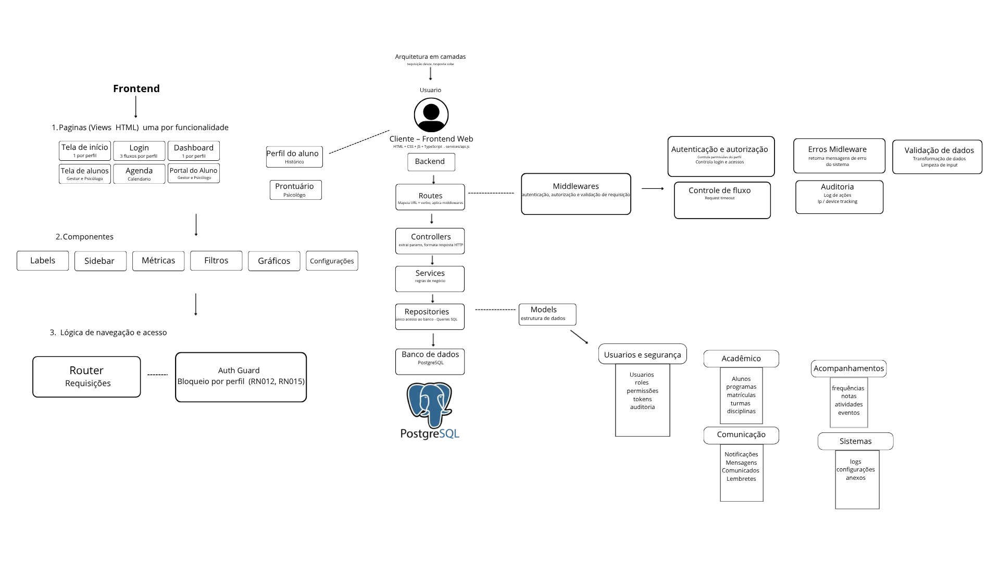<br>
    <sub>Fonte: Autoria própria (2026).</sub>
</div>

<div align="justify">
A Arquitetura em Camadas organiza o sistema em níveis hierárquicos com responsabilidades definidas, onde cada camada se comunica apenas com a camada adjacente. O padrão adotado é o Controller-Service-Repository, que separa o tratamento de requisições HTTP, as regras de negócio e o acesso ao banco de dados em camadas distintas.
</div>


**Visão Geral das Camadas**

A requisição HTTP percorre o sistema sempre no mesmo sentido descendente, e a resposta retorna no sentido inverso. Cada camada conhece apenas a camada imediatamente inferior, garantindo o princípio da dependência unidirecional:

- **Cliente (Frontend Web):** aplicação em HTML + CSS + JavaScript/TypeScript que consome a API por meio da camada de serviços do próprio frontend (`src/frontend/js/services/api.js`).
- **Camada de Rotas (Routes):** mapeia URLs e verbos HTTP para os Controllers e aplica os middlewares de autenticação, permissão e validação de payload.
- **Camada de Controllers:** recebe a requisição HTTP, extrai os parâmetros, delega a operação ao Service apropriado e formata a resposta (status code + JSON). Não contém regra de negócio.
- **Camada de Services:** concentra toda a regra de negócio — validações de domínio, orquestração entre repositórios, cálculos, integrações externas e regras transacionais.
- **Camada de Repositories:** único ponto de acesso ao banco de dados. Encapsula as queries SQL e isola o Service da tecnologia de persistência.
- **Banco de Dados:** PostgreSQL, acessado via pool de conexões.

Em paralelo, atuam três camadas transversais (cross-cutting): Middlewares (autenticação por headers, permissão, validação de payload quando aplicável e tratamento centralizado de erros), Models (contratos e tipos do domínio em TypeScript) e Integrations (adapters para Supabase e auditoria).

**Estrutura de Diretórios do Backend**

A organização física do código em `src/backend/` reflete fielmente a divisão lógica das camadas, contendo as pastas `config/`, `routes/`, `controllers/`, `services/`, `repositories/`, `models/`, `middlewares/`, `integrations/`, `database/` e `utils/`, além dos arquivos `app.ts` (bootstrap do Express) e `server.ts` (inicialização do servidor HTTP).

**Responsabilidade Detalhada de Cada Camada**

**1. Camada de Apresentação — Routes + Controllers**

A pasta `routes/` é o ponto de entrada de qualquer requisição. Cada arquivo (`alunoRoutes.ts`, `agendaRoutes.ts`, `dashboardRoutes.ts`, `authRoutes.ts`, `frequenciaRoutes.ts`, `saudeMentalRoutes.ts`, `empregabilidadeRoutes.ts`, `ensinoSuperiorRoutes.ts`, `jornadaRoutes.ts`, `notificacaoRoutes.ts`, `participacaoRoutes.ts`, `portalAlunoRoutes.ts`, `segmentacaoRoutes.ts`, `importacaoRoutes.ts`, entre outros) declara o verbo HTTP, o caminho da URL, os middlewares aplicáveis e o handler do Controller correspondente. O arquivo `routes/index.ts` agrega e expõe todas as rotas ao `app.ts`.

Os Controllers (`controllers/`) são responsáveis exclusivamente por receber o objeto Request do Express e extrair parâmetros (`req.params`, `req.query`, `req.body`, `req.user`), invocar o Service apropriado repassando dados já tipados, capturar o retorno do Service e devolver a resposta HTTP com o status code correto (200, 201, 204, 400, 404, etc.), e encaminhar erros ao `errorMiddleware`. Controllers não contêm regra de negócio nem fazem acesso direto ao banco de dados. Essa disciplina é o que permite trocar o framework HTTP no futuro sem reescrever o domínio.

**2. Camada de Negócio — Services**

A camada `services/` é o coração da aplicação. Cada service (`alunoService.ts`, `jornadaService.ts`, `frequenciaService.ts`, `saudeMentalService.ts`, `empregabilidadeService.ts`, `ensinoSuperiorService.ts`, `dashboardService.ts`, `agendaService.ts`, `notificacaoService.ts`, `riscoEvasaoService.ts`, `segmentacaoService.ts`, `participacaoService.ts`, `portalAlunoService.ts`, `importacaoService.ts`, `authService.ts`, `codigoPmService.ts`, `anotacaoQualitativaService.ts`, entre outros) concentra as regras de negócio específicas do domínio (como o cálculo de risco de evasão em `riscoEvasaoService`), a orquestração entre múltiplos repositórios quando uma operação envolve mais de uma entidade, as validações de domínio, o disparo de integrações externas (envio de e-mail, registro de auditoria, notificações) e a aplicação de políticas de permissão dependentes de contexto de negócio.

O Service é a única camada autorizada a chamar `repositories` e `integrations`. Ele desconhece HTTP e desconhece SQL — recebe dados puros e devolve dados puros.

**3. Camada de Persistência — Repositories**

A camada `repositories/` (com arquivos como `alunoRepository.ts`, `agendaRepository.ts`, `dashboardRepository.ts`, `frequenciaRepository.ts`, `saudeMentalRepository.ts`, `empregabilidadeRepository.ts`, `ensinoSuperiorRepository.ts`, `jornadaRepository.ts`, `notificacaoRepository.ts`, `participacaoRepository.ts`, `programaRepository.ts`, `usuarioRepository.ts`, `atividadeRepository.ts`, `auditoriaRepository.ts`, `labelRepository.ts`, entre outros) é o único ponto de contato com o PostgreSQL. Cada repository encapsula as instruções SQL (queries parametrizadas via biblioteca `pg`), recebe o pool de conexões definido em `database/pool.ts`, implementa operações de CRUD e consultas específicas e devolve ao Service objetos já mapeados para os tipos definidos em `models/`.

A consequência prática dessa camada é que uma eventual migração do PostgreSQL para outro SGBD, ou a adoção de um ORM, afetaria apenas os repositories — Services, Controllers e Routes permaneceriam intocados.

**4. Camada de Modelos — Models**

A pasta `models/` define os contratos de tipos do domínio em TypeScript: interfaces e tipos das entidades manipuladas pelo sistema (Aluno, Programa, Frequência, Participação, Usuário, Vínculo, Agenda, Auditoria, Empregabilidade, Ensino Superior, Saúde Mental, Notificação, Label, entre outros). São consumidos por todas as camadas para garantir tipagem estática end-to-end.

**5. Camadas Transversais**

A pasta `middlewares/` contém o `authMiddleware` (lê os headers `x-user-id`, `x-user-role` e `x-user-name`), o `permissionMiddleware` (verifica perfil e RBAC nas rotas em que é aplicado), o `validationMiddleware` (utilitário para validação de payload) e o `errorMiddleware` (captura erros lançados em qualquer camada e converte em resposta HTTP padronizada).

A pasta `integrations/` contém os adapters para sistemas externos — `supabaseClient`, `auditoriaIntegration`, `dashboardAuditoriaIntegration` e `autoIntegration` — isolando dependências externas para que mudanças de provedor não afetem o domínio.

As pastas `config/` (variáveis de ambiente, conexão com o banco, política de CORS e matriz de permissões), `database/` (pool de conexões, execução de migrações e seed) e `utils/` (helpers puros e sem estado — date, errors, pagination, response, validators) completam a infraestrutura de suporte.

**Camada de Cliente — Frontend**

O frontend (`src/frontend/`) é uma aplicação web em HTML + CSS + JavaScript/TypeScript organizada por páginas (`src/frontend/pages/*.html`), scripts por página (`src/frontend/js/pages/`), componentes reutilizáveis (`src/frontend/js/components/`) e uma camada de serviços própria (`src/frontend/js/services/api.js`, `config.js`, `sessionUser.js` e `uiState.js`). Essa separação espelha, no cliente, o mesmo princípio aplicado no servidor: a UI não conhece detalhes de transporte, e sim invoca métodos do cliente HTTP central.

**Fluxo de uma Requisição (exemplo: cadastrar frequência de um aluno)**

O usuário, no navegador, dispara um `POST /api/frequencias` a partir dos scripts de página em `src/frontend/js/pages/`, por meio do cliente HTTP central `src/frontend/js/services/api.js`. O Express recebe a requisição e a direciona pelo `jornadaRoutes.ts`, que aplica `authMiddleware` antes de chamar o `jornadaController`. Em seguida, o controller extrai o payload e chama o método correspondente do `jornadaService`. O service aplica as regras de negócio — como validar aluno e atividade, persistir a participação/frequência e recalcular o risco de evasão via `riscoEvasaoService` — e invoca os repositories necessários. O retorno sobe a pilha — Service → Controller — e o Controller responde com JSON padronizado. Qualquer erro lançado em qualquer ponto é capturado pelo `errorMiddleware`, que padroniza a resposta de erro.

### 3.2.2. Diagrama de Casos de Uso 

<div align="center">
<sup>Figura 8: Diagrama de Casos de Uso.</sup><br>
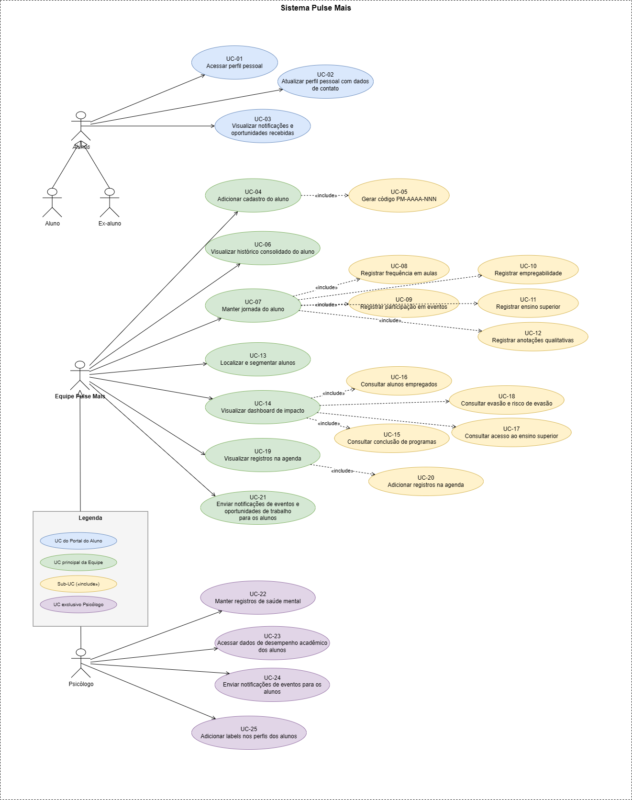<br>
<sub>Fonte: Autoria própria (2026). </sub><br>
</div>

<div align="justify">

O diagrama de casos de uso formaliza as interações entre os quatro perfis de usuário do sistema Aluno, Membro da Equipe, Gestora e Psicólogo,e as funcionalidades disponíveis para cada um. As relações `«include»` foram utilizadas para modelar comportamentos obrigatórios compartilhados entre casos de uso (por exemplo, o cadastro de aluno inclui a geração automática do código identificador PM). As tabelas a seguir descrevem cada caso de uso identificado no diagrama, com seus respectivos atores, pré-requisitos e pós-requisitos.

</div>

#### UC-01 — Visualizar dados cadastrais no portal

| Campo | Descrição |
|---|---|
| **Identificação** | UC-01 |
| **Nome** | Visualizar dados cadastrais no portal |
| **Descrição** | O aluno acessa o portal restrito e visualiza seus dados cadastrais, como nome, e-mail, telefone, programa em curso e histórico de atividades, no formato de consulta somente leitura. |
| **Ator principal** | Aluno |
| **Atores secundários** | Sistema de autenticação |
| **Pré-requisitos** | O aluno deve estar cadastrado no sistema e autenticado com credenciais válidas. O registro do aluno deve estar ativo. |
| **Fluxo principal** | 1. O aluno acessa o portal e se autentica. 2. O sistema valida o perfil e carrega os dados do aluno via `GET /api/portal/alunos/:idAluno`. 3. A tela exibe os dados cadastrais em modo somente leitura. |
| **Fluxo alternativo** | Se o aluno não for encontrado ou o id for inválido, o sistema retorna erro de recurso não encontrado (RN-PORTAL-02). |
| **Pós-requisitos** | Os dados cadastrais do aluno são exibidos corretamente. Nenhuma alteração é persistida neste fluxo. |
| **Regras de negócio associadas** | RN013, RN016, RN017, RN-PORTAL-01, RN-PORTAL-02 |

#### UC-02 — Atualizar dados de contato no portal

| Campo | Descrição |
|---|---|
| **Identificação** | UC-02 |
| **Nome** | Atualizar dados de contato no portal |
| **Descrição** | O aluno atualiza seus dados de contato  e-mail, telefone e/ou CPF  diretamente pelo portal. Dados institucionais, acadêmicos e sensíveis permanecem protegidos contra edição pelo aluno. |
| **Ator principal** | Aluno |
| **Atores secundários** | Sistema de autenticação |
| **Pré-requisitos** | O aluno deve estar autenticado. Ao menos um campo de contato deve ser informado na requisição. |
| **Fluxo principal** | 1. O aluno acessa a seção de perfil no portal. 2. Preenche os campos editáveis e confirma. 3. O sistema valida o e-mail (quando informado) e persiste a alteração via `PATCH /api/portal/alunos/:idAluno/contato`. 4. A atualização é registrada com data e origem (RN014). |
| **Fluxo alternativo** | Se nenhum campo for informado ou o e-mail for inválido, o sistema rejeita a operação com mensagem de validação (RN-PORTAL-03, RN-PORTAL-04). |
| **Pós-requisitos** | Os dados de contato são atualizados no banco com rastreabilidade de origem e data (RN014). Dados institucionais permanecem inalterados. |
| **Regras de negócio associadas** | RN013, RN014, RN017, RN-PORTAL-03, RN-PORTAL-04 |

#### UC-03 — Cadastrar aluno

| Campo | Descrição |
|---|---|
| **Identificação** | UC-03 |
| **Nome** | Cadastrar aluno |
| **Descrição** | O membro da equipe registra um novo aluno ou ex-aluno no sistema, preenchendo dados pessoais, acadêmicos e de jornada na Pulse Mais. O sistema gera automaticamente o código identificador único ao final do cadastro (`«include»` UC-04). |
| **Ator principal** | Membro da Equipe |
| **Atores secundários** | Sistema de e-mail |
| **Pré-requisitos** | O usuário deve estar autenticado com perfil interno (membro da equipe ou gestora). Nome completo e e-mail válido devem ser fornecidos (RN002). Não pode existir outro aluno com o mesmo e-mail (RN003). |
| **Fluxo principal** | 1. O membro acessa o formulário de cadastro. 2. Preenche os campos obrigatórios e opcionais. 3. O sistema valida os dados e verifica unicidade de e-mail. 4. O registro é persistido no banco via `POST /api/alunos`. 5. O sistema gera o `codigo_pm` no formato `PM-AAAA-NNN` (UC-04). 6. Um e-mail de boas-vindas é disparado. |
| **Fluxo alternativo** | Se o e-mail já estiver em uso, o sistema rejeita o cadastro com erro de conflito (RN-ALUNO-02). Se os campos obrigatórios não forem preenchidos, o sistema retorna erro 400. |
| **Pós-requisitos** | O aluno está cadastrado no sistema com status ativo, código PM único gerado e registro auditável. |
| **Regras de negócio associadas** | RN001, RN002, RN003, RN005, RN006, RN010, RN-ALUNO-01, RN-ALUNO-02, RN-ALUNO-03 |

#### UC-04 — Gerar código identificador PM `«include»`

| Campo | Descrição |
|---|---|
| **Identificação** | UC-04 |
| **Nome** | Gerar código identificador PM |
| **Descrição** | Comportamento incluído automaticamente no UC-03. O sistema deriva um código único e imutável no formato `PM-AAAA-NNN`, onde `AAAA` é o ano de ingresso e `NNN` é o sequencial anual reiniciado a cada ano. |
| **Ator principal** | Sistema (executado automaticamente por UC-03) |
| **Atores secundários** | — |
| **Pré-requisitos** | Um novo registro de aluno deve ter sido criado com sucesso no banco. O ano de ingresso deve estar disponível. |
| **Fluxo principal** | 1. Após persistir o aluno, o service recupera o `id_aluno` gerado. 2. Calcula o sequencial anual consultando os registros do mesmo ano. 3. Formata e armazena o `codigo_pm` no registro do aluno. |
| **Fluxo alternativo** | Se o cálculo do sequencial falhar, a transação é revertida e o cadastro não é confirmado. |
| **Pós-requisitos** | O aluno possui um `codigo_pm` único, imutável e rastreável que identifica sua entrada na Pulse Mais. |
| **Regras de negócio associadas** | RN001, RN-ALUNO-01 |

#### UC-05 — Editar cadastro do aluno

| Campo | Descrição |
|---|---|
| **Identificação** | UC-05 |
| **Nome** | Editar cadastro do aluno |
| **Descrição** | O membro da equipe atualiza dados cadastrais de um aluno existente, como dados de contato, status, categoria ou informações acadêmicas, com validações de tipo e campos editáveis conforme permissões institucionais. |
| **Ator principal** | Membro da Equipe |
| **Atores secundários** | — |
| **Pré-requisitos** | O aluno deve existir no sistema. O usuário deve estar autenticado com perfil interno. O `codigo_pm` não pode ser alterado (RN001). |
| **Fluxo principal** | 1. O membro seleciona o aluno na listagem. 2. Acessa o formulário de edição e altera os campos desejados. 3. O sistema valida os campos editados (tipo, tamanho, valores permitidos). 4. A atualização é persistida via `PATCH /api/alunos/:idAluno`. |
| **Fluxo alternativo** | Se o aluno não for encontrado, o sistema retorna erro 404 (RN-ALUNO-07). Se o risco de evasão informado for inválido, o sistema rejeita a operação (RN-ALUNO-06). Se o e-mail já estiver em uso por outro aluno, a operação é rejeitada (RN-ALUNO-02). |
| **Pós-requisitos** | Os dados cadastrais do aluno são atualizados no banco. O histórico permanece preservado (RN010). |
| **Regras de negócio associadas** | RN001, RN003, RN005, RN010, RN011, RN015, RN-ALUNO-02, RN-ALUNO-04, RN-ALUNO-06, RN-ALUNO-07 |

#### UC-06 — Visualizar histórico consolidado do aluno

| Campo | Descrição |
|---|---|
| **Identificação** | UC-06 |
| **Nome** | Visualizar histórico consolidado do aluno |
| **Descrição** | O membro da equipe ou gestora acessa o perfil de um aluno e visualiza seu histórico consolidado: dados gerais, programas, atividades, frequências, participações e indicadores de empregabilidade. Dados de saúde mental são excluídos deste fluxo, por serem restritos ao psicólogo (RN012). |
| **Ator principal** | Membro da Equipe |
| **Atores secundários** | Gestora |
| **Pré-requisitos** | O usuário deve estar autenticado com perfil interno. O aluno deve existir no sistema. |
| **Fluxo principal** | 1. O usuário busca e seleciona um aluno na listagem. 2. O sistema carrega o perfil via `GET /api/alunos/:idAluno`. 3. A tela renderiza o histórico consolidado em abas ou seções. |
| **Fluxo alternativo** | Se o aluno não for encontrado, o sistema retorna erro 404. Dados de saúde mental são omitidos do retorno para perfis não autorizados (RN012). |
| **Pós-requisitos** | O histórico consolidado do aluno é exibido ao usuário. Nenhuma alteração é persistida. |
| **Regras de negócio associadas** | RN004, RN005, RN012, RN016, RN-ALUNO-04, RN-ALUNO-05 |

#### UC-07 — Manter jornada do aluno

| Campo | Descrição |
|---|---|
| **Identificação** | UC-07 |
| **Nome** | Manter jornada do aluno |
| **Descrição** | O membro da equipe registra e atualiza informações sobre a jornada de um aluno na Pulse Mais, incluindo frequências em aulas (`«include»` UC-08), participações em eventos (`«include»` UC-09), atualização de empregabilidade (`«extend»` UC-10) e atualização de ensino superior (`«extend»` UC-11). |
| **Ator principal** | Membro da Equipe |
| **Atores secundários** | — |
| **Pré-requisitos** | O usuário deve estar autenticado com perfil interno. O aluno e a atividade devem existir no sistema. |
| **Fluxo principal** | 1. O membro acessa o perfil do aluno. 2. Seleciona o tipo de registro (frequência, participação, empregabilidade ou ensino superior). 3. Preenche as informações e confirma. 4. O sistema valida as regras de negócio específicas e persiste o registro. |
| **Fluxo alternativo** | Se o aluno ou a atividade não existirem, o sistema retorna 404 sem gravar. Se houver duplicidade de participação no mesmo evento, a operação é rejeitada (RN-JORNADA-07). |
| **Pós-requisitos** | O registro de jornada é persistido e compõe o histórico consolidado do aluno (UC-06). Os indicadores do dashboard (UC-14) são atualizados indiretamente. |
| **Regras de negócio associadas** | RN004, RN005, RN007, RN016, RN-JORNADA-01 a RN-JORNADA-13 |

#### UC-13 — Filtrar e segmentar alunos

| Campo | Descrição |
|---|---|
| **Identificação** | UC-13 |
| **Nome** | Filtrar e segmentar alunos |
| **Descrição** | O membro da equipe ou gestora aplica múltiplos critérios combinados para localizar e segmentar alunos, como empregabilidade, escolaridade, curso, ano de ingresso, status, risco de evasão e busca por nome ou código PM. |
| **Ator principal** | Membro da Equipe |
| **Atores secundários** | Gestora |
| **Pré-requisitos** | O usuário deve estar autenticado com perfil interno. Ao menos um critério de filtro deve ser informado (RN-SEG-01). |
| **Fluxo principal** | 1. O usuário acessa a aba de listagem de alunos. 2. Seleciona e preenche um ou mais filtros disponíveis. 3. O sistema processa a consulta via `GET /api/alunos/segmentacao`. 4. A lista filtrada é exibida com os alunos que atendem aos critérios. |
| **Fluxo alternativo** | Se nenhum critério for informado, o sistema rejeita a requisição (RN-SEG-01). Se o limite ultrapassar 100, o sistema aplica o máximo permitido (RN-SEG-02). Buscas por texto requerem mínimo de 3 caracteres (RN-SEG-03). |
| **Pós-requisitos** | A lista de alunos segmentada é exibida ao usuário. Nenhuma alteração é persistida. |
| **Regras de negócio associadas** | RN007, RN011, RN-SEG-01, RN-SEG-02, RN-SEG-03 |

#### UC-14 — Visualizar dashboard de impacto

| Campo | Descrição |
|---|---|
| **Identificação** | UC-14 |
| **Nome** | Visualizar dashboard de impacto |
| **Descrição** | A gestora acessa o dashboard e visualiza os principais indicadores institucionais de impacto da Pulse Mais: total de alunos ativos, taxa de empregabilidade, acesso ao ensino superior, conclusão de programas e alertas de risco de evasão, com suporte a filtros por período, categoria e programa. |
| **Ator principal** | Gestora |
| **Atores secundários** | — |
| **Pré-requisitos** | O usuário deve estar autenticado com perfil de gestora. Filtros de período, quando aplicados, devem usar o formato `YYYY-MM-DD` e `dataFim` não pode ser anterior a `dataInicio` (RN009, RN-DASH-01). |
| **Fluxo principal** | 1. A gestora acessa a tela do dashboard. 2. Opcionalmente, aplica filtros de período, categoria ou programa. 3. O sistema consulta os endpoints `/api/impacto/resumo` e `/api/jornada/resumo`. 4. Os KPIs e indicadores são renderizados no dashboard. |
| **Fluxo alternativo** | Se `dataFim` for anterior a `dataInicio`, a consulta é rejeitada (RN009). Se os filtros `categoria` ou `programa` tiverem menos de 3 caracteres, a requisição é invalidada (RN-DASH-02, RN-DASH-03). |
| **Pós-requisitos** | Os indicadores são exibidos consolidados para o período e filtros selecionados. Nenhuma alteração é persistida. |
| **Regras de negócio associadas** | RN006, RN007, RN008, RN009, RN-DASH-01, RN-DASH-02, RN-DASH-03 |

#### UC-21 — Gerenciar agenda

| Campo | Descrição |
|---|---|
| **Identificação** | UC-21 |
| **Nome** | Gerenciar agenda |
| **Descrição** | A gestora cria, atualiza ou cancela itens da agenda institucional. O aluno pode consultar a agenda em modo somente leitura pelo portal. Membros da equipe também podem consultar a agenda com filtros por aluno, membro responsável e período. |
| **Ator principal** | Gestora |
| **Atores secundários** | Membro da Equipe, Aluno |
| **Pré-requisitos** | Para criar ou editar: o usuário deve estar autenticado com perfil `gestor` (RN019). Para consultar: o usuário deve estar autenticado com qualquer perfil interno ou de aluno. Filtros de data devem respeitar o formato `YYYY-MM-DD` e `dataFim` não pode ser anterior a `dataInicio` (RN-AGENDA-01). |
| **Fluxo principal** | 1. A gestora acessa o módulo de agenda. 2. Cria um novo item preenchendo título, data, hora e participantes, via `POST /api/agenda`. 3. Quando necessário, edita via `PATCH /api/agenda/:idAgenda` ou cancela via `DELETE /api/agenda/:idAgenda`. |
| **Fluxo alternativo** | Tentativas de atualizar ou cancelar item inexistente retornam erro 404 (RN-AGENDA-03). Tipo de usuário informado nos filtros deve ser `aluno` ou `membro_equipe` (RN-AGENDA-02). |
| **Pós-requisitos** | O item de agenda é criado, atualizado ou cancelado no banco. A agenda atualizada fica disponível para consulta por todos os perfis autorizados. |
| **Regras de negócio associadas** | RN018, RN019, RN-AGENDA-01, RN-AGENDA-02, RN-AGENDA-03 |

#### UC-22 — Manter registros de saúde mental

| Campo | Descrição |
|---|---|
| **Identificação** | UC-22 |
| **Nome** | Manter registros de saúde mental |
| **Descrição** | O psicólogo cria e visualiza registros de acompanhamento psicológico e etiquetas clínicas de um aluno que monitora. O acesso é estritamente restrito ao perfil psicólogo com vínculo registrado com o aluno (RN012). |
| **Ator principal** | Psicólogo |
| **Atores secundários** | — |
| **Pré-requisitos** | O usuário deve estar autenticado com perfil `psicologo`. O aluno deve existir no sistema. O psicólogo deve ter vínculo de acompanhamento com o aluno (RN012, RN020). |
| **Fluxo principal** | 1. O psicólogo seleciona um aluno sob seu acompanhamento. 2. Acessa o módulo de prontuário e visualiza registros existentes via `GET /api/prontuarios`. 3. Cria um novo registro de histórico psicológico informando título e observação. 4. Opcionalmente, adiciona labels clínicas ao perfil do aluno. |
| **Fluxo alternativo** | Se o perfil não for `psicologo`, o acesso é negado (RN-SAUDE-01). Se o aluno não existir, a criação do prontuário é rejeitada (RN-SAUDE-02). Se título ou observação não forem informados, a operação é inválida (RN-SAUDE-03). Tipo de label inválido também rejeita a operação (RN-SAUDE-05). |
| **Pós-requisitos** | O registro de saúde mental é persistido no banco com acesso restrito ao psicólogo vinculado. Dados sensíveis não aparecem em consultas de outros perfis (RN016). |
| **Regras de negócio associadas** | RN009, RN012, RN016, RN017, RN-SAUDE-01 a RN-SAUDE-05 |

### 3.2.3. Diagrama de Classes do Domínio 

<div align="justify">

O Diagrama de Classes de Domínio do sistema Pulse Mais estabelece a estrutura conceitual e lógica das entidades de negócio, definindo a organização dos dados e as regras de associação que regem o ecossistema da ONG. O modelo foi projetado para assegurar a integridade da informação e a rastreabilidade das interações entre os alunos e a equipe multidisciplinar, focando na unificação de dados provenientes de múltiplos contextos operacionais.

</div>

<div align="center">
<sup>Figura 9: Diagrama de Classes de Domínio.</sup><br>
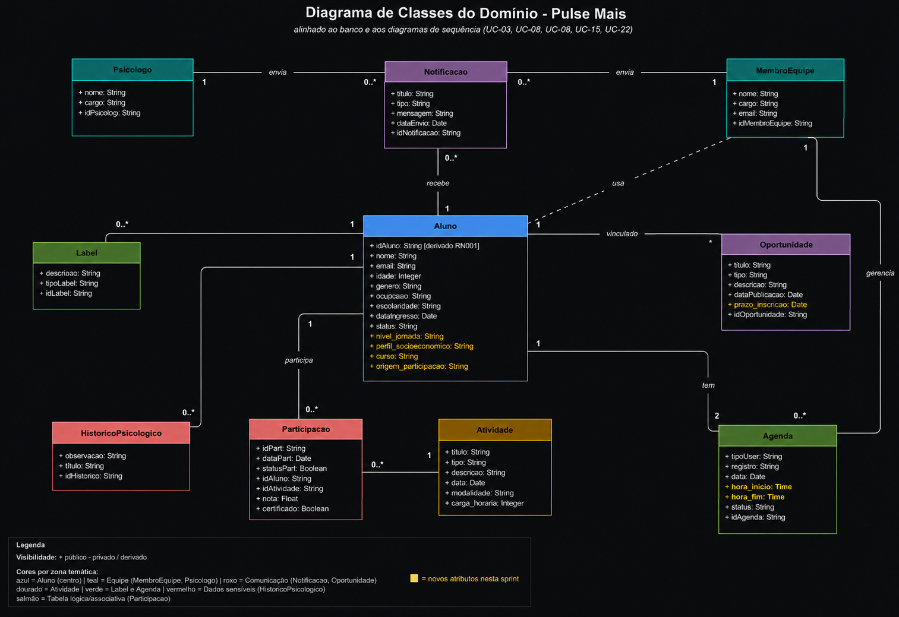<br>
<sub>Fonte: Autoria própria (2026). </sub><br>
</div>

<div align="justify">

A entidade Aluno atua como o núcleo do domínio, consolidando atributos biográficos, acadêmicos e profissionais que servem como o ponto de unificação para os demais módulos. O acesso a esses dados é estruturado através de uma relação de Dependência com a classe Membro da Equipe, o que formaliza a capacidade de consulta e monitoramento administrativo sem estabelecer um vínculo de posse estrutural. Paralelamente, a classe Psicólogo detém a responsabilidade técnica sobre os registros sensíveis, conectando-se diretamente ao aluno para o acompanhamento clínico e evolutivo.

A gestão de eventos e a comunicação interna são operacionalizadas pelas classes Agenda, Notificação e Oportunidade. A Agenda funciona como uma entidade de intersecção que coordena a temporalidade das interações entre a equipe e os alunos. Já as Notificações garantem a rastreabilidade da comunicação assíncrona, enquanto a classe Oportunidade mapeia os vínculos externos, como processos seletivos e cursos, permitindo o acompanhamento da progressão de carreira dos assistidos.

No que tange aos registros de impacto e classificação, a classe Atividade armazena as instâncias de participação e engajamento em programas internos. A organização desses dados é refinada pela classe Label, que fornece uma taxonomia para categorização e filtragem eficiente. O tratamento de dados sensíveis é garantido pela Composição entre Aluno e Histórico Psicológico, uma relação que impõe integridade referencial forte; tecnicamente, o ciclo de vida do histórico é indissociável da entidade mestre, garantindo que o armazenamento e a exclusão de dados sensíveis ocorram em conformidade com as diretrizes de privacidade e governança de dados.

</div>

### 3.2.3.1. Diagrama de Classes Arquitetural

Nesta sprint, o Diagrama de Classes foi revisado a partir do feedback docente, com o objetivo de tornar a modelagem mais aderente à UML e mais adequada à leitura técnica do sistema. Dessa forma, a modelagem foi reorganizada com base nos estereótipos `<<boundary>>`, `<<control>>` e `<<entity>>`. As classes de fronteira representam as telas e interfaces com as quais o usuário interage; as classes de controle representam a coordenação dos fluxos e casos de uso; e as classes de entidade representam os principais objetos persistentes e conceituais do domínio da aplicação.

A atualização também considerou a estrutura do repositório compactado do projeto, utilizando os módulos identificados no back-end e no front-end, como autenticação, portal do aluno, agenda, participação, frequência, saúde mental, notificações, dashboard, segmentação, empregabilidade, ensino superior, programas e jornada. Para evitar inferências incorretas, os diagramas não detalham métodos específicos não confirmados como implementados no código, priorizando a representação das responsabilidades, associações e entidades centrais do sistema.

---

#### 3.2.3.1.1. Critério de organização dos diagramas

A modelagem foi dividida em uma visão geral e em recortes menores por fluxo funcional. Essa decisão foi tomada porque concentrar todas as classes, atributos, relacionamentos e responsabilidades em uma única imagem tornaria o artefato pouco legível. Assim, a documentação passa a apresentar primeiro uma visão macro do sistema e, depois, diagramas específicos para os principais fluxos.

A divisão adotada foi:

* Visão geral do sistema;
* Autenticação e Portal do Aluno;
* Acompanhamento do Aluno;
* Comunicação e Acompanhamento Psicossocial;
* Gestão, Segmentação e Resultados.

Essa organização permite analisar o sistema por partes, mantendo a coerência entre as telas, os controles e as entidades do domínio.

---

#### 3.2.3.1.2 Visão geral do Diagrama de Classes

A visão geral apresenta os principais fluxos do sistema organizados em três colunas: classes de interface, classes de controle e classes de entidade. Essa estrutura permite visualizar como as telas acionam controles específicos e como esses controles se relacionam com as entidades centrais do domínio.

As classes de interface representam páginas ou telas do sistema, como `TelaLogin`, `TelaPortalAluno`, `TelaPerfilAluno`, `TelaAgenda`, `TelaJornadaAluno`, `TelaNotificacoes`, `TelaSaudeMental`, `TelaDashboard` e `TelaSegmentacao`.

As classes de controle representam a coordenação dos fluxos da aplicação, como `ControleAutenticacao`, `ControlePortalAluno`, `ControleAluno`, `ControleImportacao`, `ControleAgenda`, `ControleParticipacao`, `ControleFrequencia`, `ControleJornada`, `ControleNotificacao`, `ControleSaudeMental`, `ControleDashboard`, `ControleSegmentacao`, `ControleEmpregabilidade` e `ControleEnsinoSuperior`.

As classes de entidade representam os dados persistentes ou conceituais do sistema, como `Usuario`, `Aluno`, `Agenda`, `Participacao`, `Atividade`, `Frequencia`, `Notificacao`, `Label`, `SaudeMental`, `AnotacaoQualitativa`, `DashboardResumo`, `Empregabilidade`, `EnsinoSuperior`, `Programa` e `VinculoPrograma`.

<div align="center">
<sup>Figura 10: Diagrama de Classes Arquitetural.</sup><br>
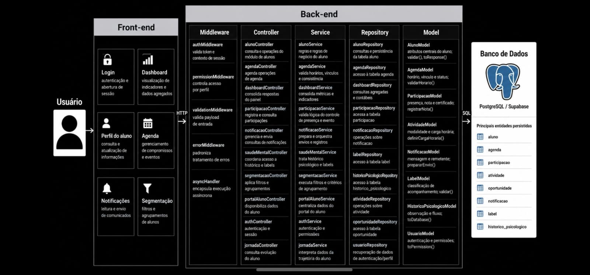<br>
<sub>Fonte: Autoria própria (2026). </sub><br>
</div>

A imagem apresenta uma visão consolidada dos principais módulos do sistema Pulse Mais. A organização em colunas evidencia a separação entre interface, controle e entidade, evitando que a modelagem seja interpretada apenas como uma arquitetura MVC. O primeiro grupo representa autenticação e portal; o segundo grupo representa o acompanhamento do aluno; e o terceiro grupo representa comunicação, gestão e resultados.

Essa visão geral funciona como um mapa macro do sistema, mostrando como as telas acionam controles e como esses controles se conectam às entidades do domínio. Ela também indica que a entidade `Aluno` é central para vários fluxos, pois se relaciona com participação, frequência, jornada, notificações, acompanhamento psicossocial, empregabilidade e ensino superior.

---

#### 3.2.3.1.3. Diagrama de Classes: Autenticação e Portal do Aluno

O diagrama de Autenticação e Portal do Aluno detalha os fluxos relacionados ao acesso ao sistema, consulta e atualização de informações do aluno, cadastro/importação e vínculo com programas. Esse recorte foi separado da visão geral para permitir maior clareza nos relacionamentos entre usuário, aluno, programa e vínculo com programa.

As classes de interface deste fluxo são:

* `TelaLogin`;
* `TelaPortalAluno`;
* `TelaPerfilAluno`;
* `TelaAlunos`;
* `TelaCadastroAluno`.

As classes de controle são:

* `ControleAutenticacao`;
* `ControlePortalAluno`;
* `ControleAluno`;
* `ControleImportacao`.

As classes de entidade são:

* `Usuario`;
* `Aluno`;
* `Programa`;
* `VinculoPrograma`.

<div align="center">
<sup>Figura 11: Diagrama de Classes Arquitetural.</sup><br>
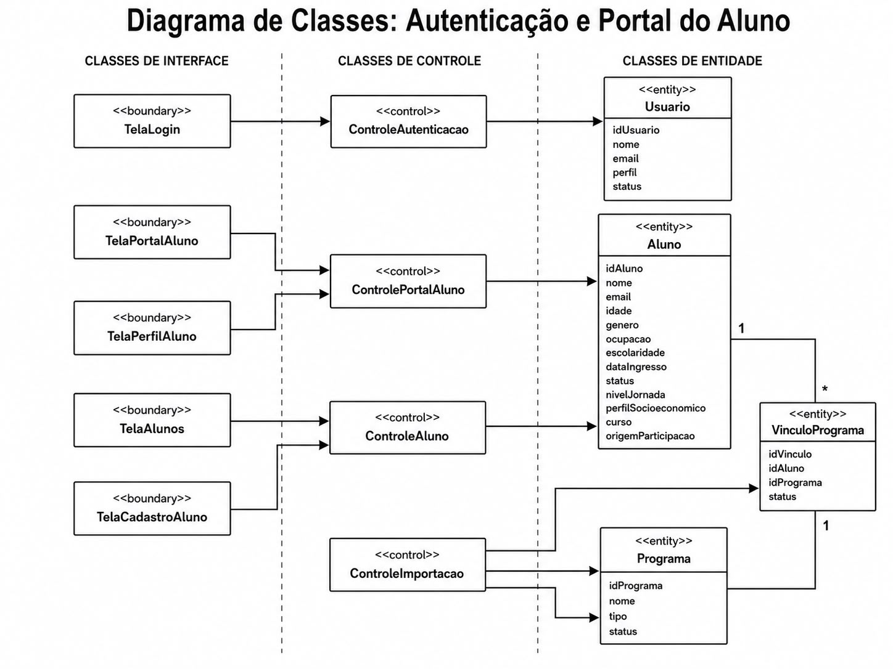<br>
<sub>Fonte: Autoria própria (2026). </sub><br>
</div>

A imagem demonstra que o fluxo de autenticação parte da `TelaLogin`, passa pelo `ControleAutenticacao` e se relaciona com a entidade `Usuario`, responsável por representar os dados necessários ao acesso e perfil do usuário. Já as telas `TelaPortalAluno` e `TelaPerfilAluno` se conectam ao `ControlePortalAluno`, que centraliza a consulta e atualização das informações permitidas ao aluno.

As telas `TelaAlunos` e `TelaCadastroAluno` se relacionam com o `ControleAluno`, responsável pelo fluxo de cadastro, consulta e manutenção dos dados da entidade `Aluno`. O `ControleImportacao` aparece associado às entidades `Aluno`, `Programa` e `VinculoPrograma`, representando fluxos de importação ou associação de alunos a programas institucionais.

A relação entre `Aluno`, `Programa` e `VinculoPrograma` indica que o vínculo entre aluno e programa é representado por uma entidade intermediária, permitindo registrar informações específicas dessa associação, como identificadores e status do vínculo.

---

#### 3.2.3.1.4. Diagrama de Classes: Acompanhamento do Aluno

O diagrama de Acompanhamento do Aluno detalha os fluxos relacionados à agenda, participação em atividades, frequência e jornada. Esse recorte é central para o sistema, pois representa o acompanhamento da trajetória do aluno dentro da Pulse Mais.

As classes de interface deste fluxo são:

* `TelaAgenda`;
* `TelaJornadaAluno`;
* `TelaAlunos`.

As classes de controle são:

* `ControleAgenda`;
* `ControleParticipacao`;
* `ControleFrequencia`;
* `ControleJornada`;
* `ControleUc07Jornada`.

As classes de entidade são:

* `Aluno`;
* `Agenda`;
* `Participacao`;
* `Atividade`;
* `Frequencia`;
* `Uc07Jornada`.

<div align="center">
<sup>Figura 12: Diagrama de Classes Arquitetural em Fluxo.</sup><br>
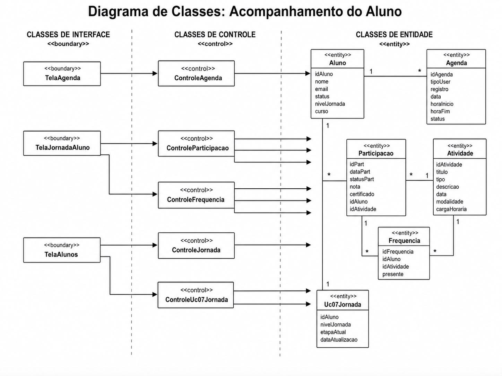<br>
<sub>Fonte: Autoria própria (2026). </sub><br>
</div>

A imagem mostra que a `TelaAgenda` aciona o `ControleAgenda`, que se relaciona com as entidades `Aluno` e `Agenda`. Essa relação representa que um aluno pode possuir registros de agenda, como reuniões, mentorias, acompanhamentos ou compromissos institucionais.

A `TelaJornadaAluno` aciona controles relacionados à participação, frequência e jornada. O `ControleParticipacao` se conecta às entidades `Aluno`, `Participacao` e `Atividade`, indicando que a participação é a entidade que registra o vínculo entre aluno e atividade. Por isso, `Agenda` não foi conectada diretamente à `Participacao`, já que são fluxos diferentes: agenda representa compromissos e participação representa presença ou desempenho em atividades.

A entidade `Frequencia` aparece associada ao acompanhamento de presença do aluno em atividades, enquanto `Uc07Jornada` representa uma estrutura específica de acompanhamento da jornada. A presença dessas entidades no diagrama reflete os módulos encontrados no repositório do projeto e reforça a coerência entre código, domínio e documentação.

---

#### 3.2.3.1.5. Diagrama de Classes: Comunicação e Acompanhamento Psicossocial

O diagrama de Comunicação e Acompanhamento Psicossocial representa os fluxos associados a notificações, saúde mental, labels, anotações qualitativas e auditoria. Esse recorte foi separado por envolver informações sensíveis e registros de acompanhamento individual.

As classes de interface deste fluxo são:

* `TelaNotificacoes`;
* `TelaSaudeMental`;
* `TelaPortalAluno`.

As classes de controle são:

* `ControleNotificacao`;
* `ControleSaudeMental`;
* `ControleAnotacaoQualitativa`.

As classes de entidade são:

* `Usuario`;
* `Aluno`;
* `Notificacao`;
* `Label`;
* `SaudeMental`;
* `AnotacaoQualitativa`;
* `Auditoria`.

<div align="center">
<sup>Figura 13: Diagrama de Classes Arquitetural.</sup><br>
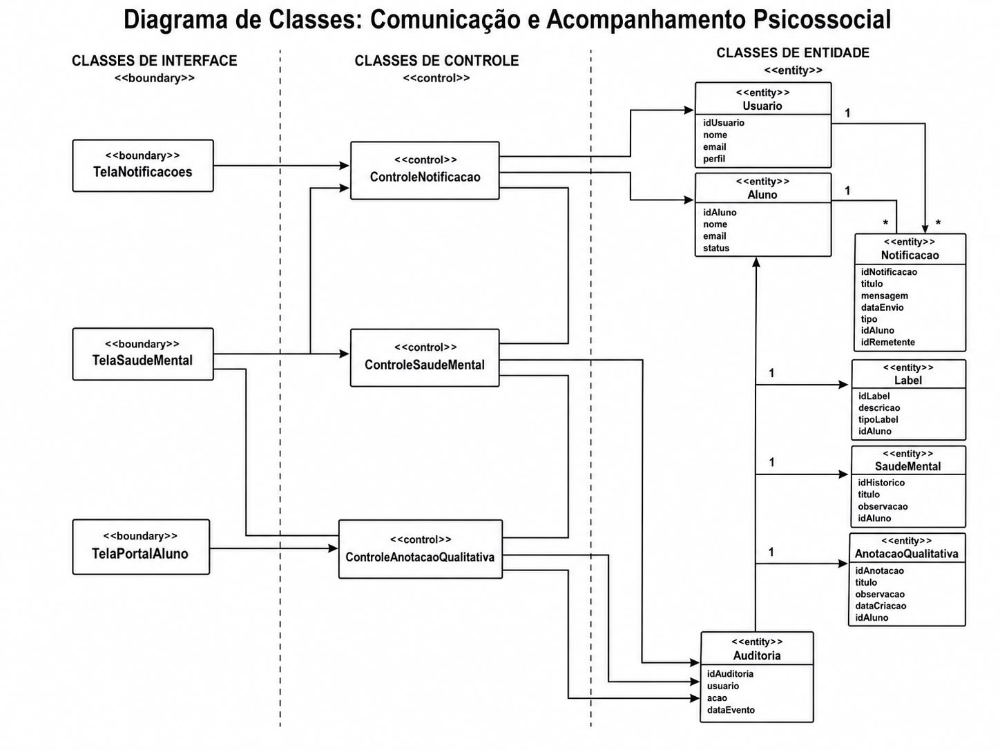<br>
<sub>Fonte: Autoria própria (2026). </sub><br>
</div>

A imagem representa a comunicação entre o sistema e o aluno por meio da entidade `Notificacao`, que se relaciona com `Usuario` e `Aluno`. A presença de `Usuario` indica o remetente ou ator do sistema, enquanto `Aluno` representa o destinatário da comunicação.

O fluxo de saúde mental é representado pelo `ControleSaudeMental`, que se relaciona com entidades voltadas ao acompanhamento psicossocial, como `SaudeMental`, `Label` e `AnotacaoQualitativa`. Essas entidades apoiam o registro de observações, classificações e informações qualitativas relacionadas à trajetória do aluno.

A entidade `Auditoria` aparece como apoio ao registro de ações e eventos relevantes no sistema. Sua presença contribui para rastreabilidade, segurança e controle de operações sensíveis, especialmente em fluxos que lidam com informações individuais e psicossociais.

---

#### 3.2.3.1.6 Diagrama de Classes: Gestão, Segmentação e Resultados

O diagrama de Gestão, Segmentação e Resultados representa os fluxos analíticos e gerenciais do sistema. Ele contempla dashboard, segmentação de alunos, empregabilidade, ensino superior, programas e vínculos institucionais.

As classes de interface deste fluxo são:

* `TelaDashboard`;
* `TelaSegmentacao`;
* `TelaCadastroAluno`.

As classes de controle são:

* `ControleDashboard`;
* `ControleSegmentacao`;
* `ControleEmpregabilidade`;
* `ControleEnsinoSuperior`;
* `ControleImportacao`.

As classes de entidade são:

* `DashboardResumo`;
* `Aluno`;
* `Empregabilidade`;
* `EnsinoSuperior`;
* `Programa`;
* `VinculoPrograma`.

<div align="center">
<sup>Figura 14: Diagrama de Classes Arquitetural.</sup><br>
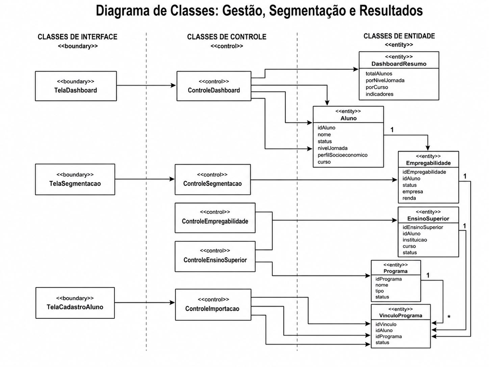<br>
<sub>Fonte: Autoria própria (2026). </sub><br>
</div>

A imagem apresenta os fluxos responsáveis por consolidar e consultar dados estratégicos da aplicação. A `TelaDashboard` aciona o `ControleDashboard`, que se relaciona com entidades como `DashboardResumo` e `Aluno`, permitindo a visualização de indicadores gerais do sistema.

A `TelaSegmentacao` aciona o `ControleSegmentacao`, que utiliza dados da entidade `Aluno` para permitir filtros e agrupamentos, como jornada, curso, perfil socioeconômico ou status. Esse fluxo apoia a tomada de decisão e a organização dos alunos em grupos de acompanhamento.

As entidades `Empregabilidade` e `EnsinoSuperior` representam resultados posteriores ou paralelos à jornada do aluno. Já `Programa` e `VinculoPrograma` representam a participação do aluno em iniciativas específicas, permitindo registrar a associação entre alunos e programas institucionais.


#### 3.2.3.1.7. Relação com os requisitos do negócio

A modelagem revisada contribui para demonstrar como os requisitos do negócio são sustentados pelas classes do sistema. O cadastro e consulta de alunos são representados pelos fluxos de `TelaAlunos`, `TelaCadastroAluno`, `ControleAluno` e `Aluno`. O portal do aluno é representado por `TelaPortalAluno`, `ControlePortalAluno` e `Aluno`. O acompanhamento da jornada é representado por `TelaJornadaAluno`, `ControleJornada`, `ControleUc07Jornada`, `Participacao`, `Frequencia` e `Atividade`.

Os requisitos de comunicação e acompanhamento psicossocial são representados por `TelaNotificacoes`, `TelaSaudeMental`, `ControleNotificacao`, `ControleSaudeMental`, `Notificacao`, `SaudeMental`, `Label` e `AnotacaoQualitativa`. Já os requisitos de gestão, análise e resultados aparecem nos fluxos de `TelaDashboard`, `TelaSegmentacao`, `ControleDashboard`, `ControleSegmentacao`, `DashboardResumo`, `Empregabilidade` e `EnsinoSuperior`.

Essa organização reforça a rastreabilidade entre interface, fluxo de controle, entidades do domínio e funcionalidades implementadas no sistema.


### 3.2.3.2. Atualização do Diagrama de Classes do Domínio

Nesta sprint, o Diagrama de Classes do Domínio foi atualizado para refletir melhor a estrutura atual da modelagem e as alterações realizadas no banco de dados. O objetivo principal foi alinhar o diagrama ao modelo físico implementado no Supabase, mantendo a organização geral já existente, mas corrigindo pontos que estavam simplificados ou inconsistentes.

A principal mudança realizada foi a criação da classe `Participacao` como uma classe lógica/associativa entre `Aluno` e `Atividade`. Na versão anterior, a participação aparecia de forma simplificada dentro da classe `Atividade`, como se fosse um atributo booleano. Essa representação foi corrigida porque a participação não pertence apenas à atividade, mas sim à relação entre um aluno e uma atividade específica.

Com isso, a classe `Participacao` passou a representar informações como:

- `idPart`;
- `dataPart`;
- `statusPart`;
- `idAluno`;
- `idAtividade`;
- `nota`;
- `certificado`.

Essa alteração torna o diagrama mais coerente com o banco de dados, já que a tabela `participacao` existe justamente para registrar quais alunos participaram de quais atividades, qual foi o status dessa participação, a nota obtida e se houve emissão de certificado.

Além disso, foram adicionados ao diagrama os novos atributos criados nesta sprint. Na classe `Aluno`, foram incluídos os campos `nivel_jornada`, `perfil_socioeconomico`, `curso` e `origem_participacao`, permitindo representar melhor a jornada do jovem dentro da Pulse Mais. Esses atributos ajudam a classificar o aluno, indicar seu contexto socioeconômico, registrar o curso ou programa associado e identificar sua origem de participação na instituição.

Na classe `Atividade`, foram adicionados os atributos `modalidade` e `carga_horaria`. Esses campos permitem diferenciar se a atividade é presencial, online ou híbrida, além de registrar sua duração em horas.

Na classe `Oportunidade`, foi incluído o atributo `prazo_inscricao`, permitindo representar a data limite para inscrição em vagas, cursos, bolsas, eventos ou outras oportunidades divulgadas pela equipe.

Na classe `Agenda`, foram adicionados os atributos `hora_inicio` e `hora_fim`, tornando a representação dos compromissos mais completa. Antes, a agenda indicava apenas a data, mas agora também permite visualizar o intervalo de horário previsto para atendimentos, reuniões, mentorias ou eventos.

Também foram feitos ajustes de coerência no diagrama. A classe `HistoricoPsicologico` foi revisada para manter os atributos alinhados ao modelo físico, utilizando `observacao`, `titulo` e `idHistorico`. A classe `Psicologo` também foi simplificada para representar apenas os dados previstos no banco atual.

As relações principais entre as classes foram mantidas, preservando a estrutura do domínio. O aluno continua sendo a entidade central do modelo, relacionado a notificações, labels, histórico psicológico, agenda, oportunidades e participações. A diferença é que, agora, a participação em atividades aparece de forma mais adequada, por meio de uma classe própria.

Dessa forma, o Diagrama de Classes do Domínio passou a representar melhor a lógica do sistema, diferenciando corretamente as entidades principais, registros de apoio e classes associativas. Portanto, a atualização melhora a coerência entre o diagrama, o DER, o modelo físico e a implementação no Supabase.

<div align="center">
<sup>Figura 9: Diagrama de Classes do Domínio atualizado.</sup><br>
<br>
<sub>Fonte: Autoria própria (2026). </sub><br>
</div>


### 3.2.4. Diagrama de Sequência UML

<div align="justify">

Esta seção apresenta cinco diagramas de sequência UML que descrevem como os principais fluxos do sistema Pulse Mais se desenrolam no tempo. Cada diagrama segue a mesma arquitetura em camadas (Tela, Controller, Service, Repository e Banco) e usa a notação UML padrão: linhas contínuas para mensagens síncronas, tracejadas para retornos, barras de ativação sobre as lifelines e fragmentos `alt` para fluxos alternativos. Os fluxos diagramados são UC-03 (Manter cadastro do aluno), UC-06 (Visualizar histórico consolidado do aluno), UC-08 (Registrar participação em atividade), UC-15 (Visualizar dashboard de impacto) e UC-22 (Manter registros de saúde mental), escolhidos por exercitarem todas as camadas e cobrirem os requisitos funcionais e regras de negócio mais críticos do MVP.

</div>

#### 3.2.4.1. UC-04 - Adicionar cadastro do aluno

<div align="center">
<sup>Figura 11: Diagrama de sequência do caso de uso Adicionar cadastro do aluno.</sup><br>
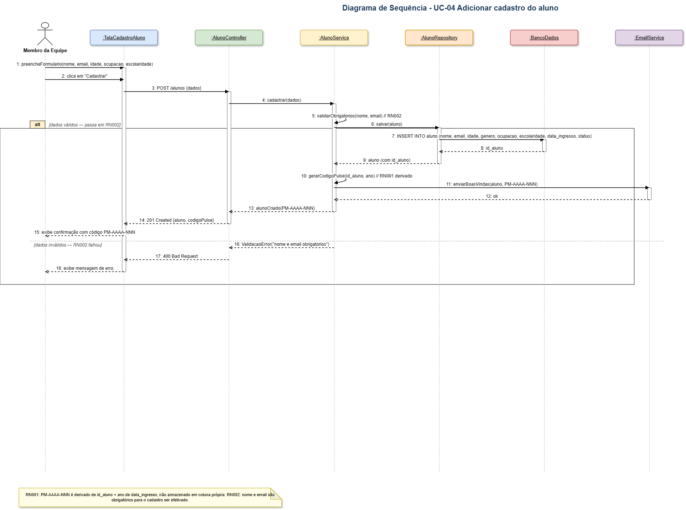<br>
<sub>Fonte: Autoria própria (2026). </sub><br>
</div>

<div align="justify">

O fluxo começa quando o membro da equipe preenche o formulário de cadastro na `:TelaCadastroAluno` e submete os dados ao `:AlunoController`, que os repassa ao `:AlunoService`. O service realiza a validação dos campos obrigatórios (RN002), e em caso de sucesso aciona o `:AlunoRepository` para persistir o registro no banco. Após o INSERT, o service deriva o código identificador no formato `PM-AAAA-NNN` a partir do `id_aluno` e do ano de ingresso — operação detalhada como caso de uso próprio (UC-04, incluído via `«include»`), cobrindo a RN001 — e dispara a mensagem de boas-vindas pelo `:EmailService`. A confirmação retorna pelas camadas até a tela, exibindo o código gerado ao usuário. Caso a validação inicial falhe, o fluxo segue pelo ramo alternativo do fragmento `alt`, devolvendo um erro 400 sem chegar ao banco. Esse diagrama atende ao RF001 e cobre as RN001 e RN002.

</div>

#### 3.2.4.2. UC-06 — Visualizar histórico consolidado do aluno

<div align="center">
<sup>Figura 12: Diagrama de sequência do caso de uso Visualizar histórico consolidado do aluno.</sup><br>
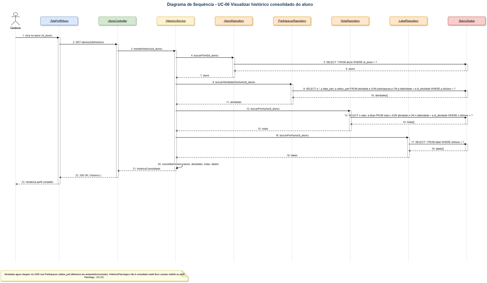<br>
<sub>Fonte: Autoria própria (2026). </sub><br>
</div>

<div align="justify">

A gestora seleciona um aluno na lista e a `:TelaPerfilAluno` chama o `:AlunoController` via `GET /api/alunos/:id`. O controller consulta os dados do aluno e devolve, quando disponível, as informações de histórico associadas ao perfil. A tela então renderiza o perfil consolidado. Vale notar que `HistoricoPsicologico` não aparece neste fluxo: o acesso a esse tipo de informação é restrito ao perfil Psicólogo (RN012), e o fluxo correspondente está detalhado em 3.2.4.5. Esse diagrama atende ao RF004, ainda de forma parcial no MVP atual.

</div>

#### 3.2.4.3. UC-07 — Manter jornada do aluno

<div align="center">
<sup>Figura 13: Diagrama de sequência do caso de uso Manter jornada do aluno.</sup><br>
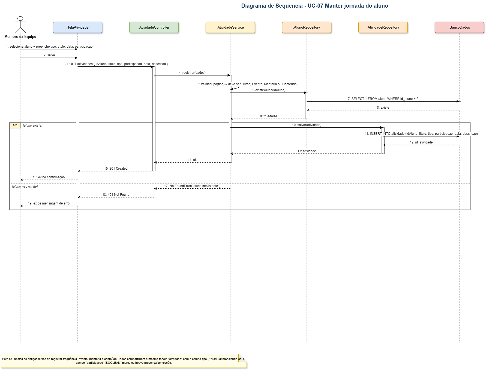<br>
<sub>Fonte: Autoria própria (2026). </sub><br>
</div>

<div align="justify">

O membro da equipe seleciona um aluno e uma atividade existente do catálogo, e define o status da participação. A `:TelaParticipacao` envia `POST /participacoes` ao `:ParticipacaoController`, que delega ao `:ParticipacaoService`. O service executa duas validações em sequência: existência do aluno (`:AlunoRepository`) e existência da atividade (`:AtividadeRepository`). Quando ambas retornam verdadeiro, o ramo principal do fragmento `alt` é seguido: o `:ParticipacaoRepository` emite o `INSERT` na tabela `participacao`, registrando `id_aluno`, `id_atividade`, `data_part`, `status_part` e, quando aplicável, `nota`, e a confirmação retorna pelas camadas até a tela. Quando qualquer das validações falha, o ramo alternativo devolve 404 sem chegar à escrita, preservando a integridade referencial. Diferente de um simples registro de frequência, este fluxo cria uma entrada completa de participação — com data, status e nota próprios — que sustenta tanto a consulta de histórico (UC-06) quanto o cálculo de indicadores (UC-15). Esse diagrama atende aos RF005 e RF006.

</div>

#### 3.2.4.4. UC-14 — Visualizar dashboard de impacto

<div align="center">
<sup>Figura 14: Diagrama de sequência do caso de uso Visualizar dashboard de impacto.</sup><br>
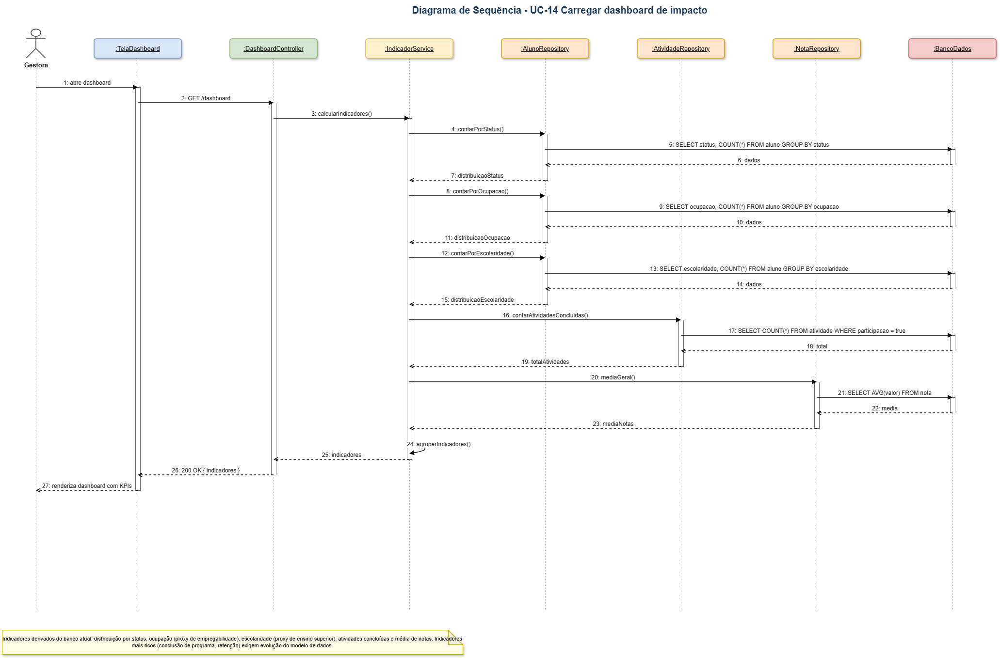<br>
<sub>Fonte: Autoria própria (2026). </sub><br>
</div>

<div align="justify">

A gestora abre o dashboard e a `:TelaDashboard` chama endpoints de resumo, como `/api/impacto/resumo` e `/api/jornada/resumo`, para apresentar os principais indicadores institucionais. A ocupação serve como proxy para empregabilidade e a escolaridade como proxy para acesso ao ensino superior, uma vez que o banco atual do MVP não modela explicitamente vínculos empregatícios ou matrículas em instituições de ensino superior — essas dimensões mais ricas estão previstas para iterações futuras. Esse fluxo atende parcialmente aos RF012, RF013, RF015 e RF016; o RF014 permanece planejado por depender de cálculo específico de conclusão de programa por período.

</div>

#### 3.2.4.5. UC-22 — Manter registros de saúde mental

<div align="center">
<sup>Figura 15: Diagrama de sequência do caso de uso Manter registros de saúde mental.</sup><br>
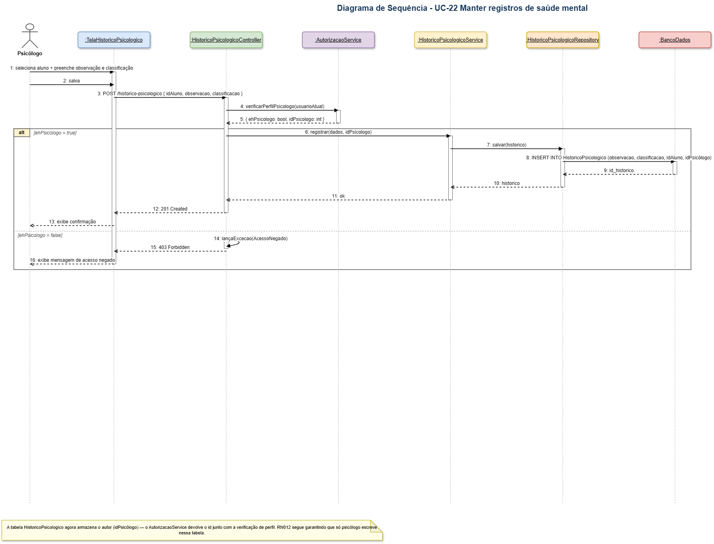<br>
<sub>Fonte: Autoria própria (2026). </sub><br>
</div>

<div align="justify">

O psicólogo seleciona um aluno e visualiza registros de acompanhamento no módulo de prontuário, atualmente exposto no backend por `GET /api/prontuarios`. A regra de restrição de acesso ao conteúdo sensível permanece associada à RN012 e ao RF010. Esse fluxo atende ao RF009 e ao RF010 e cobre a RN012.

</div>


### 3.2.5. Padrões de Projeto Aplicados 

<div align="justify">

Um padrão de projeto é uma solução já testada e documentada para resolver um problema recorrente em projetos distintos. A adoção de padrões proporciona benefícios como aumento de produtividade, redução de complexidade, facilidade de manutenção e reaproveitamento de código. O backend do sistema Pulse Mais foi desenvolvido em TypeScript com Express, TypeORM e PostgreSQL via Supabase, e aplica os padrões descritos a seguir, cada um adotado com base em uma necessidade real do projeto.

</div>

#### MVC (Model-View-Controller)

<div align="justify">

O padrão MVC separa o projeto em três camadas independentes: Model, View e Controller. Essa separação reduz o acoplamento entre as classes e aumenta a coesão, fazendo com que cada parte do sistema tenha um único propósito bem definido. No Pulse Mais, a camada Model reúne as entidades do domínio como Aluno, Participacao e HistoricoPsicologico. A camada Controller atua como intermediária entre as requisições HTTP e a camada de negócio, sem conter lógica de processamento. As Routes mapeiam os endpoints aos controllers correspondentes. Esse padrão foi adotado para que os módulos de alunos, jornada, dashboard e saúde mental possam ser desenvolvidos e evoluídos de forma independente ao longo das cinco sprints.

</div>

#### DAO (Data Access Object) via TypeORM e Pool Nativo

<div align="justify">

O padrão DAO separa as classes de acesso a banco de dados das classes responsáveis pelas regras de negócio. No Pulse Mais, isso é feito por dois mecanismos paralelos: o arquivo connection.ts usa o TypeORM com mapeamento objeto-relacional via decorators para operações estruturadas, e o pool.ts usa o driver pg nativo com Pool de conexões para queries SQL diretas. Em desenvolvimento com banco persistente, ambos se conectam ao PostgreSQL/Supabase; nos testes e no modo local simplificado, o `sqljs` é usado em memória. O controle de acesso por perfil combina `permissions.ts` nas rotas críticas com validações nos services, como ocorre em saúde mental, agenda e portal do aluno.

</div>

#### Service Layer

<div align="justify">

A camada de Services concentra todas as regras de negócio da aplicação. Os controllers recebem a requisição e delegam integralmente o processamento para o service correspondente, instanciado via injeção no construtor. Regras críticas como a geração do código PM-AAAA-NNN, a validação de risco de evasão e o controle de acesso aos prontuários ficam centralizadas nos services, podendo ser testadas de forma isolada sem depender da camada HTTP.

</div>

#### Middleware Chain

<div align="justify">

O encadeamento de middlewares intercepta as requisições antes que cheguem aos controllers, centralizando responsabilidades transversais. O `authMiddleware` extrai os dados do usuário dos headers HTTP. O `permissionMiddleware` controla o acesso por perfil nas rotas em que há RBAC explícito. O `errorMiddleware` centraliza o tratamento de exceções, respondendo com o status HTTP correto para cada tipo de erro. Regras dependentes de contexto, como "aluno só acessa os próprios dados" ou "apenas gestor modifica agenda", ficam nos services para que possam ser testadas isoladamente.

</div>

#### Error Object Hierarchy

<div align="justify">

Uma hierarquia de classes de erro foi implementada em errors.ts, com AppError como classe base e subclasses especializadas: PayloadValidationError para erros de validação de entrada com HTTP 400, BusinessRuleError para violações de regra de negócio com HTTP 422, NotFoundError para recursos não encontrados com HTTP 404 e ConflictError para conflitos de dados com HTTP 409. Todos os controllers seguem o mesmo contrato de tratamento, garantindo respostas semânticas e consistentes em toda a API.

</div>

#### Utility Module

<div align="justify">

Funções utilitárias reutilizáveis foram isoladas em módulos dedicados dentro de src/utils: validators.ts para validação e sanitização de parâmetros, errors.ts para a hierarquia de erros, response.ts para o envelope padronizado de respostas e date.ts para validação e formatação de datas ISO. Essa separação garante que a mesma lógica seja reutilizada de forma consistente em todos os controllers sem duplicação de código.

</div>

### 3.2.6. Lógica fuzzy para risco de evasão

<div align="justify">

O Pulse Manager utiliza lógica fuzzy para transformar sinais quantitativos da jornada do aluno em um índice explicável de priorização de acompanhamento. O resultado é armazenado em `probabilidade_evasao`, com valor entre 0 e 100, e convertido para a classificação categórica `risco_evasao`, cujos valores são `baixo`, `medio` e `alto`. Apesar do nome do campo, o percentual não representa uma probabilidade estatística validada nem uma certeza de evasão; trata-se de um indicador determinístico de apoio à decisão, que deve ser interpretado em conjunto com o acompanhamento humano.

</div>

#### Dados de entrada

O `RiscoEvasaoRepository` agrega dados das tabelas `aluno`, `participacao` e `atividade`. Um registro inexistente não é contabilizado como falta: ausências são consideradas somente quando há uma participação registrada com `status_part = false`.

| Fator | Origem | Cálculo inicial | Peso |
| --- | --- | --- | ---: |
| Faltas em aula | Atividades do tipo `aula` e suas participações | `(faltasAulas / totalAulas) × 100` | 0,45 |
| Ausências em outras atividades | Atividades diferentes de `aula` e suas participações | `(ausenciasAtividades / totalAtividades) × 100` | 0,20 |
| Desempenho acadêmico | Média das notas não nulas em `participacao` | Média na escala de 0 a 10 | 0,20 |
| Desengajamento | `aluno.engajamento` | `100 - engajamento` | 0,15 |

#### Funções de pertinência

Para sinais em que valores maiores indicam maior risco, é utilizada uma pertinência crescente:

```text
pertinenciaCrescente(x, inicio, fim) =
  limitar((x - inicio) / (fim - inicio), 0, 1)
```

Para sinais em que valores menores indicam maior risco, é utilizada uma pertinência decrescente:

```text
pertinenciaDecrescente(x, ruim, bom) =
  limitar((bom - x) / (bom - ruim), 0, 1)
```

Os intervalos definidos pela regra de negócio são:

| Fator | Grau de risco 0 | Transição linear | Grau de risco 1 |
| --- | --- | --- | --- |
| Faltas em aula | até 10% | entre 10% e 40% | a partir de 40% |
| Ausências em atividades | até 15% | entre 15% e 60% | a partir de 60% |
| Média de notas | a partir de 8 | entre 5 e 8 | até 5 |
| Engajamento | a partir de 80 | entre 30 e 80 | até 30 |

#### Agregação, confiabilidade e classificação

Os graus disponíveis são combinados por média ponderada. Quando um fator não possui dados suficientes, ele é removido do cálculo e os pesos presentes são renormalizados pela soma dos pesos disponíveis:

```text
riscoFuzzy = soma(grauDeRisco × peso) / soma(pesosDisponiveis)
```

Para reduzir conclusões fortes com poucos registros, o motor calcula a confiabilidade com base na quantidade de aulas, atividades e notas:

```text
quantidadeRegistros = totalAulas + totalAtividades
confiabilidade = limitar(
  (quantidadeRegistros + quantidadeNotas) / 5,
  0,
  1
)

probabilidade =
  25 + ((riscoFuzzy × 100) - 25) × confiabilidade
```

Com poucos dados, o resultado é aproximado da referência conservadora de 25%. A classificação final segue os limites abaixo:

| Índice calculado | Classificação |
| --- | --- |
| menor que 40 | `baixo` |
| de 40 até 69,99 | `medio` |
| igual ou maior que 70 | `alto` |

Quando não existem aulas, atividades, notas ou engajamento informado, o motor retorna probabilidade e classificação nulas, não atualiza o aluno e preserva o valor anterior de `risco_evasao`. Essa regra evita interpretar ausência de dados como baixo ou alto risco.

#### Integração arquitetural

O cálculo está implementado em `src/backend/services/riscoEvasaoService.ts`, enquanto `src/backend/repositories/riscoEvasaoRepository.ts` realiza a agregação dos indicadores e persiste o resultado. O recálculo ocorre após alterações de engajamento, frequência ou participação e também durante a inicialização do servidor, sincronizando dados históricos. Para manutenção administrativa, o comando `npm run risco:recalcular` executa o mesmo processamento em lote.

O campo `probabilidadeEvasao` é devolvido pelas APIs de aluno junto de `riscoEvasao`. A interface pode utilizar a classificação categórica para filtros e alertas, enquanto o valor percentual permanece disponível para análises mais detalhadas.

#### Limitações e uso responsável

- Os pesos e limites são regras iniciais de negócio e devem ser recalibrados quando houver histórico suficiente de evasões reais.
- O cálculo considera todo o histórico disponível, sem janela temporal.
- Somente atividades com registro em `participacao` entram no cálculo.
- O indicador apoia a priorização do acompanhamento e não substitui avaliação pedagógica, social ou psicológica.
- O resultado não deve ser apresentado como diagnóstico, previsão clínica ou decisão automatizada definitiva.

## 3.3. Wireframes 

<div align="justify">
Wireframes são esboços simples de telas, como sites e aplicativos. O objetivo é validar ideias, por isso eles não contêm informações detalhadas como cores, imagens e tipografia final. Desta forma, wireframes conseguem demonstrar de forma direta a estrutura das telas e o fluxo de navegação do sistema, focando apenas no que é essencial.
</div>

<div align="justify">

Caso queira acessar os wireframes completos, acesse o link: https://www.canva.com/design/DAHJebfiO4A/NqxvsvUgwcbkv3LeEEnRwA/edit

</div>


<div align="center">
<sup>Figura 16: Fluxo de telas do perfil Aluno.</sup><br>
    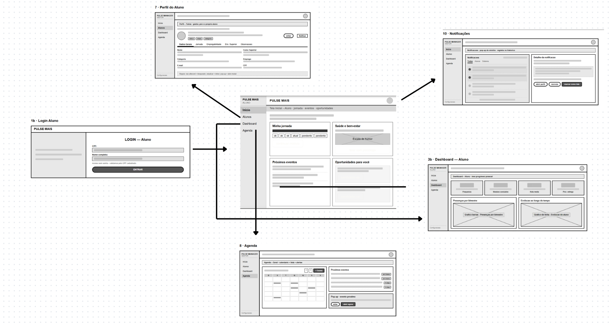<br>
    <sub>Fonte: Autoria própria (2026).</sub>
</div>

<div align="justify">
Neste fluxo, o aluno faz login com e-mail, nome e seleção do perfil Aluno, acessa a tela inicial com jornada, eventos e oportunidades, e navega para Perfil, Dashboard (progresso/presenças), Agenda (calendário) ou Notificações.
</div>


<div align="center">
<sup>Figura 17: Fluxo de telas do perfil Gestor.</sup><br>
    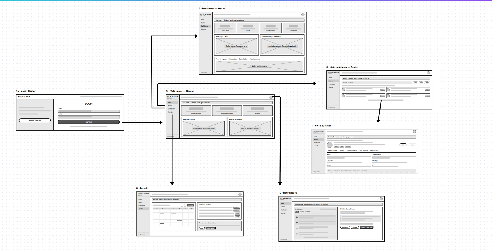<br>
    <sub>Fonte: Autoria própria (2026).</sub>
</div>

<div align="justify">
O gestor faz login com e-mail, nome e seleção do perfil Gestor, acessa a tela inicial com visão geral da turma (alunos conectados, transformados e evolução), e navega para Dashboard (performance/gráficos), Lista de Alunos (com filtros e acesso ao perfil individual), Agenda ou Notificações.
</div>


<div align="center">
<sup>Figura 18: Fluxo de telas do perfil Psicólogo.</sup><br>
    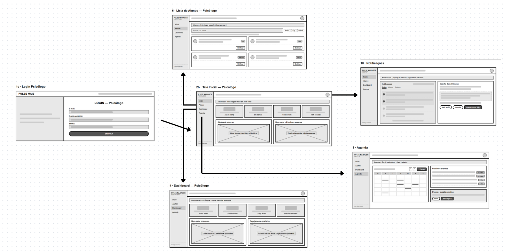<br>
    <sub>Fonte: Autoria própria (2026).</sub>
</div>

<div align="justify">
O fluxo do psicólogo prevê autenticação por e-mail, nome e perfil, acessando uma tela inicial com foco em bem-estar (alunos acompanhados, em atenção, sessões e alertas com flags), e navegação para lista de Alunos, Dashboard (saúde mental/bem-estar por curso e faixa), Agenda ou Notificações.
</div>


<div align="center">
<sup>Figura 19: Wireframe da tela de login do Gestor.</sup><br>
    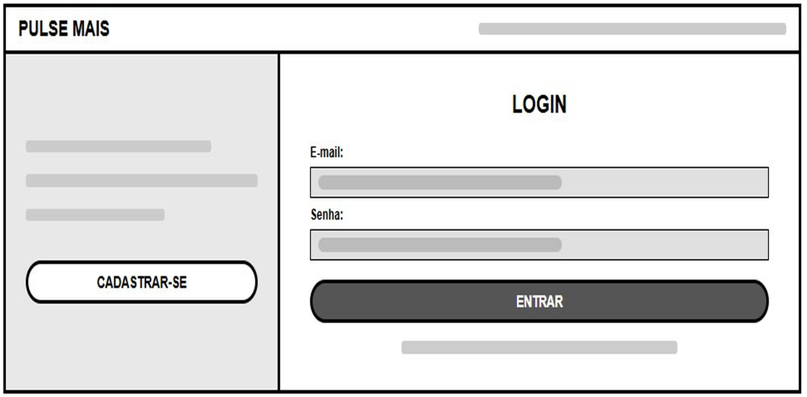<br>
    <sub>Fonte: Autoria própria (2026).</sub>
</div>

<div align="justify">
O wireframe inicial de login do gestor previa uma tela dividida em dois painéis, com conteúdo informativo à esquerda e formulário à direita. Na versão final, o fluxo foi consolidado em uma tela única para todos os perfis, sem senha, usando e-mail, nome completo e seleção de perfil.
</div>

<div align="center">
<sup>Figura 20: Wireframe da tela de login do Aluno.</sup><br>
    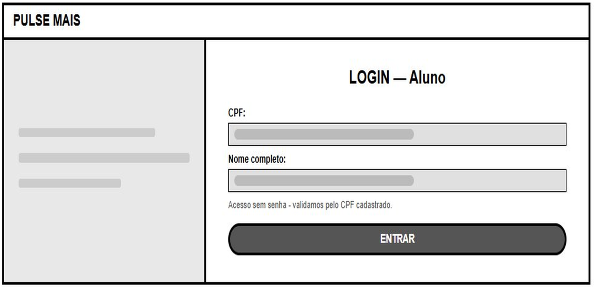<br>
    <sub>Fonte: Autoria própria (2026).</sub>
</div>

<div align="justify">
O wireframe inicial do aluno previa login por CPF e nome completo, sem senha. Na versão final, o fluxo foi unificado com os demais perfis e passou a usar e-mail, nome completo e seleção do perfil Aluno.
</div>

<div align="center">
<sup>Figura 21: Wireframe da tela de login do Psicólogo.</sup><br>
    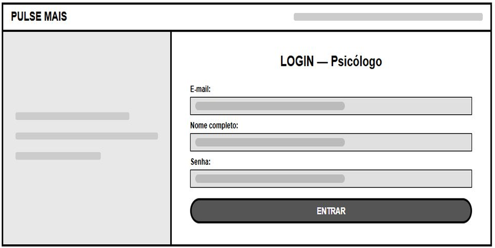<br>
    <sub>Fonte: Autoria própria (2026).</sub>
</div>

<div align="justify">
O wireframe inicial do psicólogo previa uma tela exclusiva com formulário próprio. Na versão final, o acesso do psicólogo também foi consolidado na tela geral de login, sem senha, usando e-mail, nome completo e seleção do perfil Psicólogo.
</div>

<div align="center">
<sup>Figura 22: Wireframe da tela inicial do Gestor.</sup><br>
    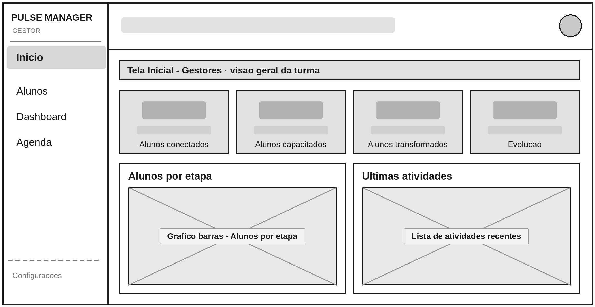<br>
    <sub>Fonte: Autoria própria (2026).</sub>
</div>

<div align="justify">
Tela inicial do gestor no Pulse Manager, com menu lateral contendo Início, Alunos, Dashboard e Agenda. No topo, três cards de métricas: alunos conectados, alunos transformados e evolução. Na parte inferior, dois painéis: um gráfico de barras com distribuição de alunos por etapa e uma lista de atividades recentes. Layout de dashboard simples, focado em visão geral da turma.
</div>

<div align="center">
<sup>Figura 23: Wireframe da tela inicial do Psicólogo.</sup><br>
    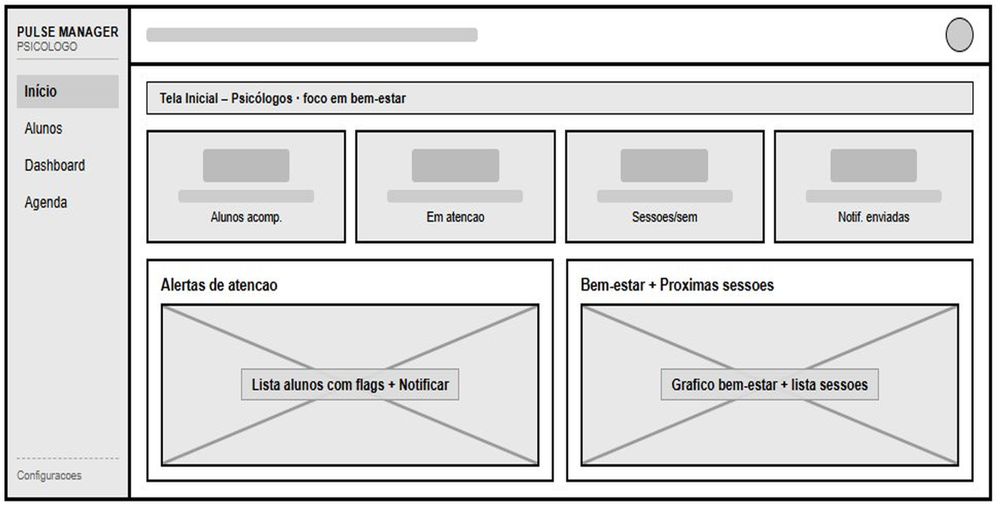<br>
    <sub>Fonte: Autoria própria (2026).</sub>
</div>

<div align="justify">
Tela inicial do psicólogo no Pulse Manager, com menu lateral contendo Início, Alunos, Dashboard e Agenda. No topo, quatro cards de métricas: alunos acompanhados, em atenção, sessões por semana e notificações enviadas. Na parte inferior, dois painéis: alertas de atenção com lista de alunos sinalizados e opção de notificar, e um painel de bem-estar com gráfico e lista das próximas sessões. Foco em monitoramento clínico e agenda do psicólogo.
</div>

<div align="center">
<sup>Figura 24: Wireframe do Dashboard do Gestor.</sup><br>
    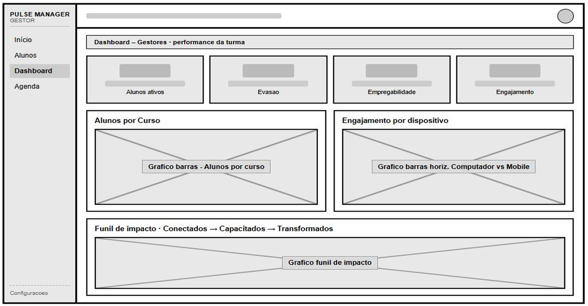<br>
    <sub>Fonte: Autoria própria (2026).</sub>
</div>

<div align="justify">
Dashboard de performance da turma para o gestor no Pulse Manager. No topo, quatro cards de métricas: alunos ativos, evasão, empregabilidade e engajamento. Na faixa do meio, dois gráficos de barras: distribuição de alunos por curso e engajamento. Na parte inferior, um gráfico de funil de impacto mostrando a jornada dos alunos: conectados, capacitados,transformados.
</div>

<div align="center">
<sup>Figura 25: Wireframe do Dashboard do Aluno.</sup><br>
    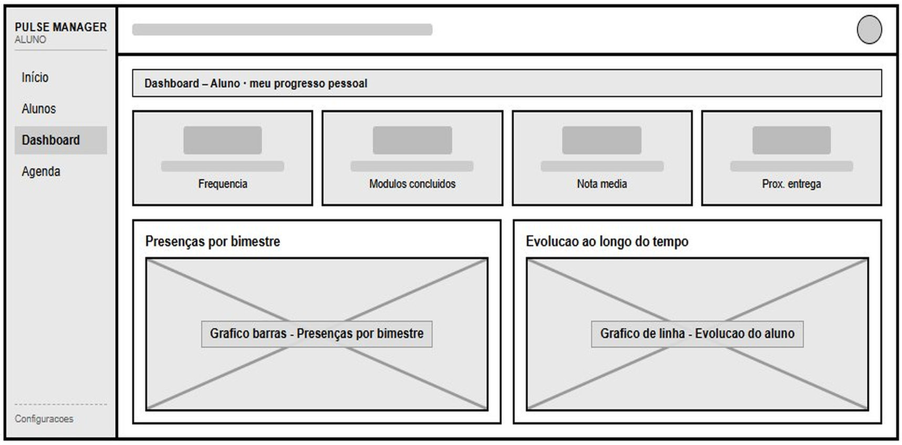<br>
    <sub>Fonte: Autoria própria (2026).</sub>
</div>

<div align="justify">
Dashboard de progresso pessoal do aluno no Pulse Manager. No topo, quatro cards de métricas: frequência, módulos concluídos, nota média e próxima entrega. Na parte inferior, dois gráficos: barras com presenças por bimestre e linha com a evolução do aluno ao longo do tempo. Foco em automonitoramento e acompanhamento acadêmico individual.
</div>

<div align="center">
<sup>Figura 26: Wireframe do Dashboard do Psicólogo.</sup><br>
    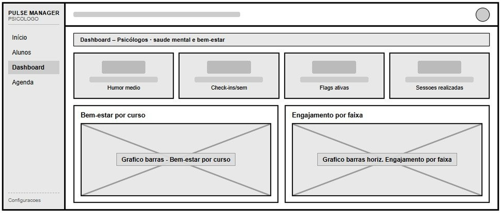<br>
    <sub>Fonte: Autoria própria (2026).</sub>
</div>

<div align="justify">
A tela de Dashboard do Psicólogo apresenta uma barra de navegação lateral com as seções Início, Alunos, Dashboard e Agenda, além de Configurações fixadas na parte inferior. No topo da área principal, quatro cartões exibem indicadores-chave de saúde mental: Humor Médio, Check-ins por semana, Flags Ativas e Sessões Realizadas. Na metade inferior, dois gráficos de barras complementam a análise: "Bem-estar por curso" e "Engajamento por faixa etária", permitindo comparações visuais entre grupos. O cabeçalho global mantém o campo de busca e o ícone de perfil do usuário, seguindo o padrão de layout das demais telas da plataforma.
</div>

<div align="center">
<sup>Figura 27: Wireframe da lista de alunos do Psicólogo.</sup><br>
    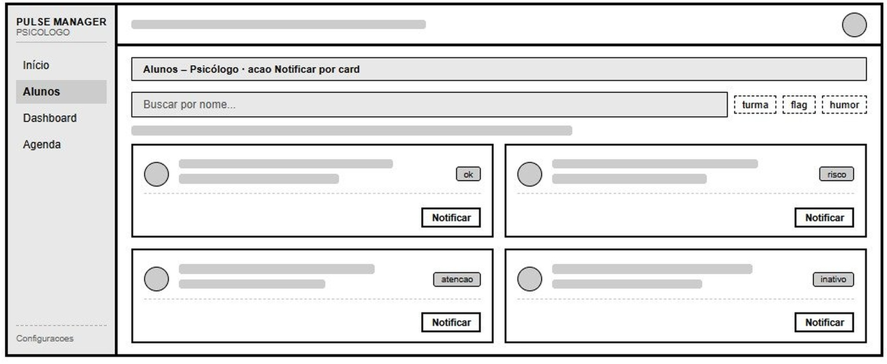<br>
    <sub>Fonte: Autoria própria (2026).</sub>
</div>

<div align="justify">
Tela de listagem de alunos do psicólogo no sistema Pulse Manager, exibindo cards em grade com foto, nome, turma e status de cada aluno (ok, risco, atenção, inativo). Há uma barra de busca por nome com filtros por turma, flag e humor para facilitar a localização de alunos específicos. Cada card possui um botão "Notificar" que permite ao psicólogo acionar uma notificação diretamente a partir da listagem.
</div>

<div align="center">
<sup>Figura 28: Wireframe do perfil do aluno na visão do Gestor.</sup><br>
    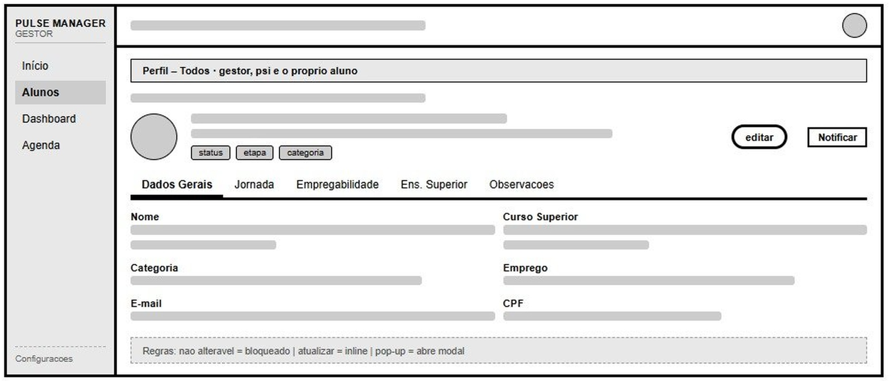<br>
    <sub>Fonte: Autoria própria (2026).</sub>
</div>

<div align="justify">
A tela exibe o perfil de um aluno com navegação lateral (Início, Alunos, Dashboard, Agenda) e abas de conteúdo (Dados Gerais, Jornada, Empregabilidade, Ens. Superior, Observações). No topo do perfil há foto, status, etapa, categoria e botões de "editar" e "Notificar", com campos como Nome, E-mail, CPF, Curso Superior e Emprego na aba ativa. O acesso é compartilhado entre gestor, psicólogo e o próprio aluno.
</div>

<div align="center">
<sup>Figura 29: Wireframe da tela inicial do Aluno.</sup><br>
    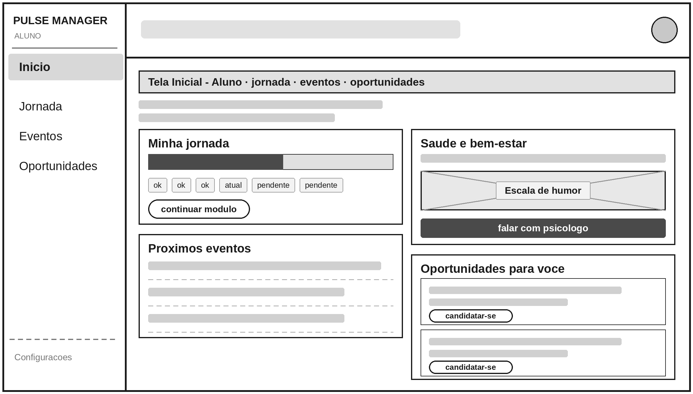<br>
    <sub>Fonte: Autoria própria (2026).</sub>
</div>

<div align="justify">
Tela inicial do aluno está dividida em quatro seções: jornada de aprendizado com barra de progresso e módulos, próximos eventos, saúde e bem-estar com escala de humor e acesso a psicólogo, e oportunidades com botões de candidatura. O layout usa dois painéis lado a lado para organizar o conteúdo. A navegação superior destaca as áreas principais: jornada, eventos e oportunidades.
</div>

<div align="center">
<sup>Figura 30: Wireframe da tela de Agenda.</sup><br>
    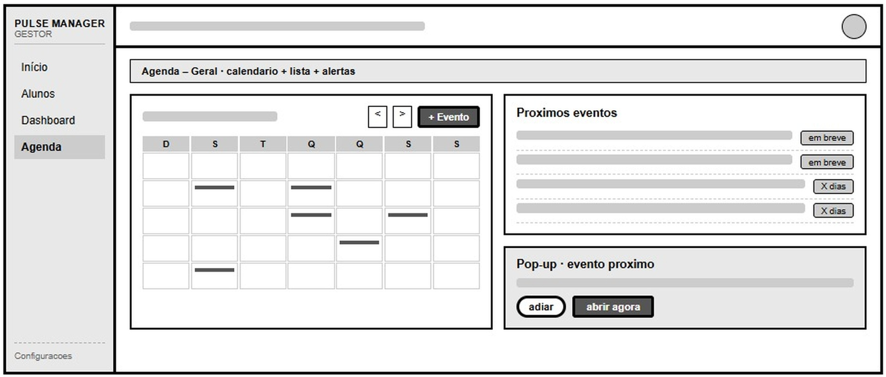<br>
    <sub>Fonte: Autoria própria (2026).</sub>
</div>

<div align="justify">
Wireframe da tela agenda com calendário mensal navegável e botão "+ Evento" à esquerda, e dois painéis à direita: lista de próximos eventos com indicadores de tempo e um pop-up de alerta com opções "adiar" ou "abrir agora". Elementos de conteúdo são representados por retângulos cinzas em layout de duas colunas.
</div>

<div align="center">
<sup>Figura 31: Wireframe da tela de Notificações do Gestor.</sup><br>
    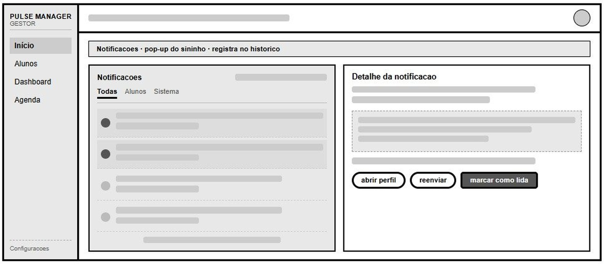<br>
    <sub>Fonte: Autoria própria (2026).</sub>
</div>

<div align="justify">
Wireframe da tela notificações com uma lista à esquerda filtrada por abas (Todas, Alunos, Sistema), onde círculos indicam notificações não lidas, e um painel de detalhe à direita exibindo o conteúdo da notificação selecionada. As ações disponíveis no detalhe são abrir perfil, reenviar e marcar como lida.
</div>

<div align="center">
<sup>Figura 32: Wireframe da lista de alunos do Gestor.</sup><br>
    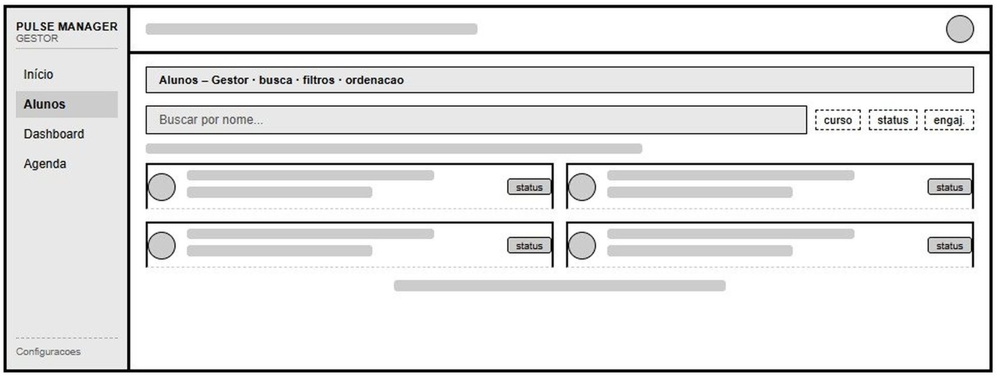<br>
    <sub>Fonte: Autoria própria (2026).</sub>
</div>

<div align="justify">
Wireframe de uma tela de gerenciamento de alunos com sidebar de navegação (Início, Alunos, Dashboard, Agenda), área principal com busca e filtros, e cards de alunos em grade 2x2 com avatar e status.
</div>

## 3.4. Guia de estilos 

<div align="justify">

O Pulse Manager adota um sistema de design próprio, derivado do Manual de Identidade Visual da Pulse Mais e ajustado para uma plataforma digital de gestão acolhedora, técnica e acessível. O princípio editorial que orienta o sistema é a combinação de acolhimento e seriedade técnica com esperança, posicionando os jovens atendidos como protagonistas - nunca como beneficiários passivos. A partir desse princípio, cada decisão visual é tomada com função semântica clara, sem escolhas estéticas aleatórias.

Esta seção do WAD apresenta os fundamentos da identidade visual da plataforma - as três cores institucionais, as duas famílias tipográficas e o sistema de iconografia. O detalhamento técnico completo (escalas tonais 50->900, neutros, cores de status, escala tipográfica Display->Micro, sistema de espaçamento em 4 px, cantos e sombras, estados de componentes, tom de voz e diretrizes de acessibilidade) está consolidado no documento Guia de Estilos – Pulse Manager, disponível em PDF no Drive do projeto:

🔗 [Guia de Estilos – Pulse Manager (PDF completo)](https://drive.google.com/file/d/1G8H7yAJ79vnQEwDpKnYnalWm99SWktlA/view?usp=drive_link)

</div>

### 3.4.1 Cores

<div align="justify">

A identidade cromática do Pulse Manager é herdada do Manual de Identidade Visual da Pulse Mais e composta por três cores institucionais - Azul, Verde e Amarelo - cada uma com função semântica clara no sistema. Toda decisão de aplicação cromática na plataforma parte dessa base: as cores nunca são escolhas estéticas aleatórias, mas tokens semânticos que comunicam ação, estado ou hierarquia.

</div>

<div align="center">
<sup>Figura 33: Azul Pulse - cor principal.</sup><br>
<br>
<sub>Fonte: Adaptado do Guia de Estilos – Pulse Manager v1.1 (2026).</sub><br>
</div>

<div align="justify">

**Azul Pulse (`#003870`)** - cor principal da plataforma. Sustenta a identidade institucional e é aplicada em headers, sidebars, links primários, navegação ativa, botões de ação institucional e texto sobre fundo claro quando é necessário destaque. É a cor que carrega a autoridade e a seriedade técnica do sistema.

</div>

<div align="center">
<sup>Figura 34: Verde Pulse - cor secundária.</sup><br>
<br>
<sub>Fonte: Adaptado do Guia de Estilos – Pulse Manager v1.1 (2026).</sub><br>
</div>

<div align="justify">

**Verde Pulse (`#338458`)** - cor secundária, associada a sucesso e ações afirmativas. Aplicada em confirmações (matricular, aprovar), trilhas concluídas, indicadores positivos e ícones de seleção. Reforça o eixo de esperança do princípio editorial do sistema.

</div>

<div align="center">
<sup>Figura 35: Amarelo Pulse - cor de destaque.</sup><br>
<br>
<sub>Fonte: Adaptado do Guia de Estilos – Pulse Manager v1.1 (2026).</sub><br>
</div>

<div align="justify">

**Amarelo Pulse (`#FFD927`)** - cor de destaque pontual. Aplicada em tagline, badges, CTAs secundários, decorativos e sinalizações de atenção. Nunca é usada como cor principal de fundo, justamente para preservar seu papel de destaque dentro do sistema.

</div>

<div align="justify">

A escolha de manter apenas três cores institucionais como núcleo da paleta acompanha o princípio editorial do Pulse Manager: acolhimento e seriedade técnica com esperança. Cada cor carrega um papel específico e exclusivo (identidade, sucesso, destaque), o que garante leitura semântica imediata pela equipe gestora, pelos psicólogos e pelos alunos que utilizam a plataforma.

Para além das três cores institucionais, o sistema de design completo conta com escalas tonais 50→900 para cada cor (utilizadas em estados de hover, fundos suaves, bordas e camadas), uma escala neutra azulada para textos, bordas e estados desabilitados, e um conjunto dedicado de cores de status para comunicar o nível de acompanhamento dos alunos nos dashboards (Em dia, Atenção, Em risco, Urgente). O detalhamento dessas escalas, com tokens semânticos e códigos hexadecimais completos, está consolidado no Guia de Estilos – Pulse Manager v1.1 (PDF), referenciado na abertura desta seção.

</div>

### 3.4.2 Tipografia

<div align="justify">

O Pulse Manager adota duas famílias tipográficas com papéis distintos e complementares. A escolha de cada família não é estética - cada uma ocupa um espaço semântico específico na plataforma, garantindo hierarquia visual clara e leitura confortável em desktop e mobile.

**Poppins** é a família principal de corpo da plataforma. Desenvolvida pela Google Fonts, é uma sans-serif humanista que combina legibilidade técnica com acolhimento visual - características diretamente alinhadas ao princípio editorial do Pulse Manager. É aplicada em toda a UI da plataforma: textos de corpo, títulos de seção (H1 a H4), labels, botões, formulários, navegação e microcopy. Os pesos utilizados são Light (300), Regular (400), Medium (500), SemiBold (600), Bold (700) e ExtraBold (800), cobrindo desde microcopy raro até números de dashboard. Disponível gratuitamente em [fonts.google.com/specimen/Poppins](https://fonts.google.com/specimen/Poppins).

**Anton** é o display único da plataforma, utilizado exclusivamente no wordmark "Pulse Manager" e em headlines institucionais de alto impacto visual - grandes números de dashboard, KPIs hero e títulos de destaque. Por ser uma fonte de exibição com peso único (Regular 400), nunca é aplicada em corpo de texto, botões, labels ou parágrafos. Disponível gratuitamente em [fonts.google.com/specimen/Anton](https://fonts.google.com/specimen/Anton). Vale registrar que a fonte original do wordmark no Manual de Identidade Visual da Pulse Mais é a Druk Condensed (comercial, paga); Anton é a substituição open source adotada para a plataforma digital.

A decisão de manter apenas duas famílias segue a diretriz de coerência e acessibilidade do sistema: menos famílias significam menos variação visual, menor carga cognitiva para o usuário e maior consistência entre as telas desenvolvidas por diferentes membros do time. A escala tipográfica completa - com tamanhos em px, line-heights, pesos e contextos de uso de Display até Micro - está consolidada no Guia de Estilos – Pulse Manager v1.1 (PDF), referenciado na abertura desta seção.

</div>

### 3.4.3 Iconografia e imagens

<div align="justify">

O Pulse Manager adota a biblioteca **Lucide** como sistema de iconografia da plataforma. Lucide é uma biblioteca open source de ícones no estilo outline, com cobertura ampla de contextos funcionais e padrão visual consistente. A escolha se justifica por três razões principais: é gratuita e de código aberto, possui stroke único padronizado que garante coerência visual em toda a plataforma, e cobre com precisão semântica os contextos funcionais do Pulse Manager - gestão de alunos, frequência, histórico, notificações, empregabilidade, agenda e acompanhamento psicológico.

</div>

<div align="center">
<sup>Figura 36: Grid de ícones representativos da plataforma - Lucide, outline, stroke 2px.</sup><br>
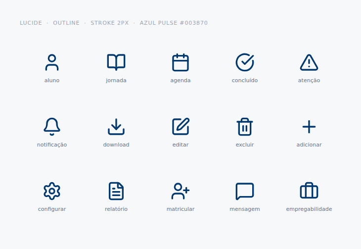<br>
<sub>Fonte: Gerado a partir da biblioteca Lucide (open source). Guia de Estilos – Pulse Manager v1.1 (2026).</sub><br>
</div>

<div align="justify">

Todos os ícones da plataforma seguem o estilo **outline com stroke fixo de 2px**, aplicados na cor Azul Pulse (`#003870`) como padrão, herdando o valor de `currentColor` do contexto em que estão inseridos. Nunca se mistura ícones fill com ícones outline na mesma tela - a consistência de estilo é regra sem exceção. Os tamanhos padrão de aplicação são 16px para badges e empty states, 20px para corpo de texto e navegação, 24px para ações e botões, e 32px ou mais para destaques visuais.

Todo ícone na plataforma é sempre acompanhado de label textual ou atributo `aria-label`, nunca utilizado isolado como único portador de informação - diretriz diretamente ligada à conformidade com WCAG 2.1 AA adotada pelo sistema de design.

Em casos onde a Lucide não oferecer o ícone necessário, as bibliotecas **Phosphor** ou **Tabler** são as substituições aceitas, desde que mantido o estilo outline 2px e que não haja mistura de bibliotecas diferentes na mesma tela. O catálogo completo, com grid visual expandido, regras de cor, tamanhos por contexto e diretrizes detalhadas de acessibilidade, está consolidado no Guia de Estilos – Pulse Manager v1.1 (PDF), referenciado na abertura desta seção.

</div>

## 3.5 Protótipo de alta fidelidade 

### Tela de Login


<div align="center">
<sup>Figura 37: Tela de Login Geral.</sup><br>
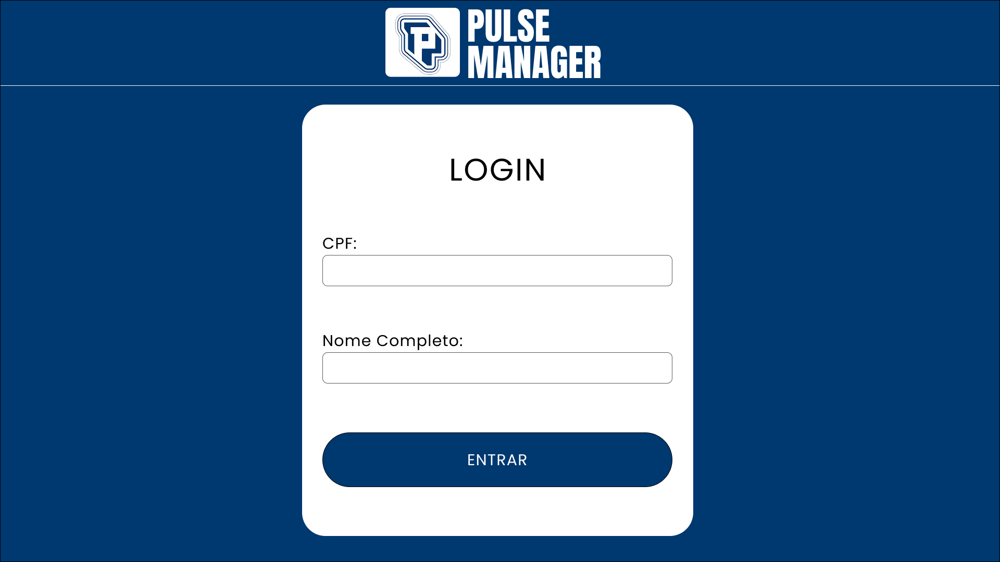<br>
<sub>Fonte: Autoria própria (2026).</sub><br>
</div>

<div align="justify">
A tela de login é a página inicial da plataforma para todos os perfis de usuário. Ela conta com um fundo azul institucional, o logo do Pulse Manager centralizado no topo e um card branco com seleção de perfil e campos de autenticação por e-mail e nome completo, sem senha. O botão "Entrar" redireciona cada usuário para sua tela inicial correspondente.
Esta tela está associada às User Stories US05, US07, US08 e US09, de acordo com o critério de aceite número 1 de cada uma. Isso porque o acesso unificado e padronizado garante tanto a simplicidade para o aluno quanto o controle de acesso necessário para gestores e psicólogos visualizarem e interagirem com os dados da plataforma.
</div>

### Tela Inicial do Gestor

<div align="center">
<sup>Figura 38: Tela Inicial do Gestor.</sup><br>
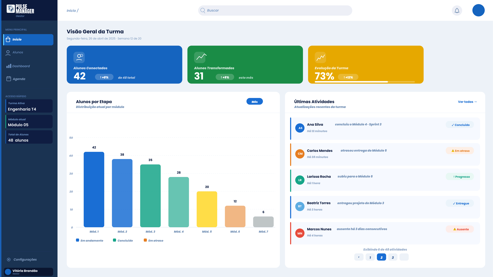<br>
<sub>Fonte: Autoria própria (2026).</sub><br>
</div>

<div align="justify">
O protótipo apresenta a tela inicial do painel do gestor na plataforma, projetada para consolidar indicadores de desempenho e o fluxo de atividades de uma turma específica em uma interface centralizada e de fácil leitura. Na lateral esquerda, há um menu de navegação persistente integrado a um bloco de contexto que exibe informações estáticas sobre o grupo monitorado, enquanto o cabeçalho superior traz ferramentas globais como barra de busca, notificações e perfil do usuário. O corpo principal da página destaca-se por três cartões de métricas no topo que resumem o engajamento e a evolução dos usuários por meio de dados percentuais e barras de progresso visuais. Abaixo, a interface se divide em duas áreas centrais de monitoramento: um gráfico de colunas interativo para mapear a distribuição dos usuários ao longo das diferentes etapas cronológicas do programa, contando com filtros temporais e legendas de status, e um feed dinâmico de últimas atividades ao lado, que lista logs cronológicos com avatares, descrições de ações, marcadores de tempo e tags coloridas de categorização, complementado por um sistema de paginação no rodapé.
</div>

### Lista de Alunos apresentada ao Gestor

<div align="center">

<sup>Figura 39: Lista de Alunos do Gestor.</sup><br>
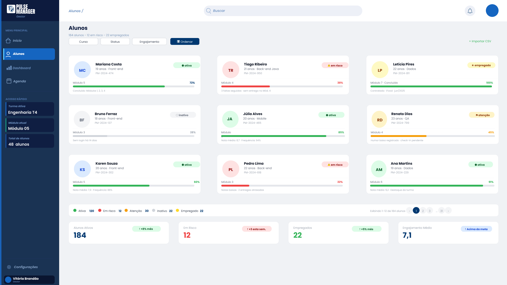<br>
<sub>Fonte: Autoria própria (2026).</sub><br>
</div>

<div align="justify">
A tela de lista de alunos é onde o gestor visualiza e gerencia todos os estudantes da plataforma. Nela estão disponíveis filtros por curso, status e engajamento. Os alunos são exibidos em cards com avatar, nome, curso, badge de status e barra de progresso do módulo atual. No rodapé, uma legenda resume os totais por status com paginação, e quatro cards exibem os principais indicadores da turma.

Esta tela está associada às User Stories US01 e US02, de acordo com os critérios de aceite de cada uma. Isso porque a tela centraliza os dados de todos os alunos em um único lugar e permite à gestora buscar, filtrar e acessar perfis individuais com agilidade.
</div>

### Perfil do Aluno apresentado ao Gestor

<div align="center">

<sup>Figura 40: Perfil do Aluno do Gestor.</sup><br>
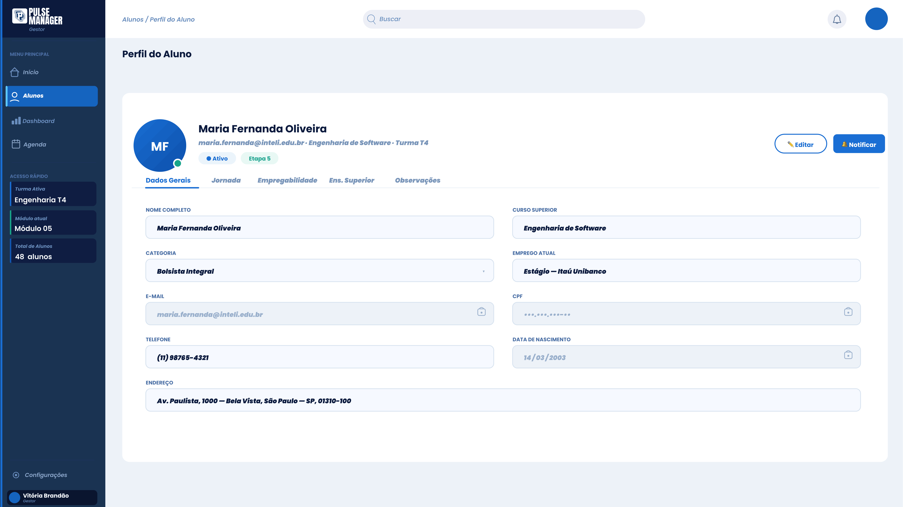<br>
<sub>Fonte: Autoria própria (2026).</sub><br>
</div>

<div align="justify">
O protótipo apresenta a tela de perfil individual do aluno na visão do gestor, estruturada para centralizar o gerenciamento de dados cadastrais e o acompanhamento do estudante por meio de uma interface organizada em abas. Mantendo a navegação lateral fixa para acesso às páginas do sistema e ao contexto da turma, além do cabeçalho global com busca e notificações, o núcleo da tela destaca um cartão principal com as informações básicas do aluno, incluindo avatar com indicador de status online, nome, e-mail institucional, curso e turma, acompanhados por tags de situação cadastral e botões de ação rápida para edição de dados e envio de notificações. Logo abaixo, um menu de navegação por abas horizontais permite alternar entre diferentes categorias de acompanhamento, como dados gerais, jornada, empregabilidade, ensino superior e observações, onde a aba ativa revela um formulário com campos de leitura e escrita dispostos em colunas que agrupam informações como nome completo, curso, categoria de bolsa, emprego atual, telefone e endereço, além de campos de dados sensíveis, como e-mail, CPF e data de nascimento, que contam com um ícone de cadeado indicando restrição de segurança ou campos bloqueados para edição direta.
</div>

### Dashboard apresentado ao Gestor

<div align="center">

<sup>Figura 41: Dashboard do Gestor.</sup><br>
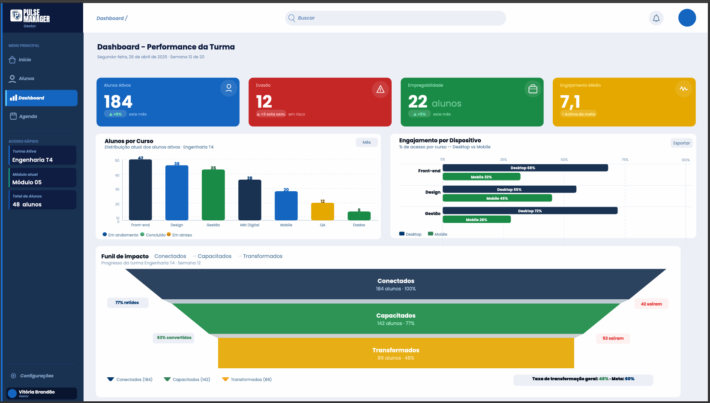<br>
<sub>Fonte: Autoria própria (2026).</sub><br>
</div>

<div align="justify">
O protótipo apresenta o painel principal do gestor na plataforma Pulse Manager, projetado para consolidar indicadores de desempenho e o acompanhamento de uma turma específica em uma interface centralizada e de leitura imediata. Na lateral esquerda, há um menu de navegação persistente com acesso às seções Início, Alunos, Dashboard e Agenda, integrado a um bloco de contexto que exibe informações estáticas sobre o grupo monitorado, como turma ativa, módulo atual e total de alunos. O cabeçalho superior traz ferramentas globais como barra de busca, notificações e perfil do usuário.
O corpo principal da página destaca-se por quatro cartões de métricas no topo que resumem os principais indicadores da turma: alunos ativos, evasão, empregabilidade e engajamento médio, cada um com variação percentual em relação ao período anterior e codificação de cor por criticidade. Abaixo, a interface se divide em duas áreas de análise: um gráfico de colunas agrupadas que mapeia a distribuição dos alunos por curso com legendas de status (em andamento, concluído, em atraso), e um gráfico de barras horizontais segmentado que cruza o engajamento por tipo de dispositivo, desktop versus mobile, por área de conhecimento. Encerrando a tela, um funil de impacto em camadas ilustra a progressão da turma pelos estágios Conectados, Capacitados e Transformados, com percentuais de retenção, conversão e evasão destacados lateralmente.
</div>


### Tela de Agenda do Gestor

<div align="center">

<sup>Figura 42: Tela de Agenda do Gestor.</sup><br>
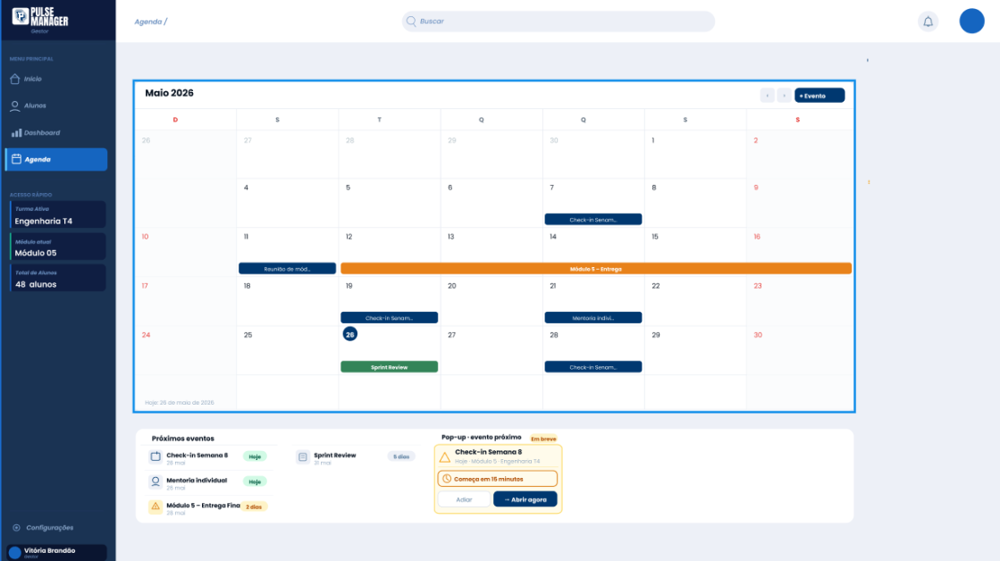<br>
<sub>Fonte: Autoria própria (2026).</sub><br>
</div>

<div align="justify">
A tela de agenda do gestor é onde a equipe Pulse Mais tem uma visão do calendário operacional da turma. Nela estão dispostos a visualização mensal com todos os compromissos categorizados por cor, check-ins semanais, reuniões de módulo, entregas, mentorias individuais e sprint reviews, a lista de próximos eventos com sua proximidade temporal e um pop-up de alerta para eventos iminentes, permitindo abrir ou adiar a atividade diretamente. A navegação lateral permite que o gestor transite entre o Início, Alunos, Dashboard e a Agenda, com acessos rápidos à turma ativa, ao módulo corrente e ao total de alunos vinculados, além do botão "+ Evento" para criação de novos compromissos.

Esta tela está associada às User Stories US01 e US02, de acordo com os critérios de aceite de cada uma.
</div>

### Tela Inicial do Aluno

<div align="center">

<sup>Figura 43: Tela Inicial do Aluno.</sup><br>
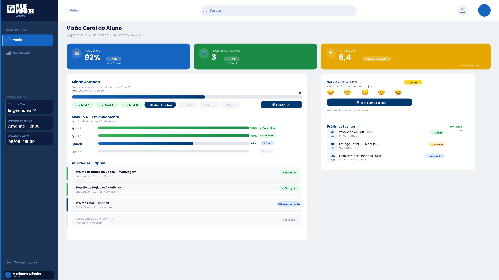<br>
<sub>Fonte: Autoria própria (2026).</sub><br>
</div>

<div align="justify">
A tela inicial do aluno é onde o estudante tem uma visão geral da sua jornada na plataforma. Nela estão dispostos seus principais indicadores de desempenho, o progresso nos módulos do curso, os próximos eventos da Pulse Mais e um acesso rápido ao suporte de saúde mental. A navegação lateral permite que o aluno transite entre as demais seções da plataforma.
Esta tela está associada às User Stories US08, US09 e US10, de acordo com os critérios de aceite de cada uma. Isso porque a tela centraliza o acesso aos resultados pessoais do aluno, exibe os eventos e faltas de forma clara e disponibiliza o contato direto com o psicólogo, tornando a navegação intuitiva e completa para o estudante.
</div>

### Tela de Perfil apresentada para o Aluno

<div align="center">

<sup>Figura 44: Perfil do Aluno.</sup><br>
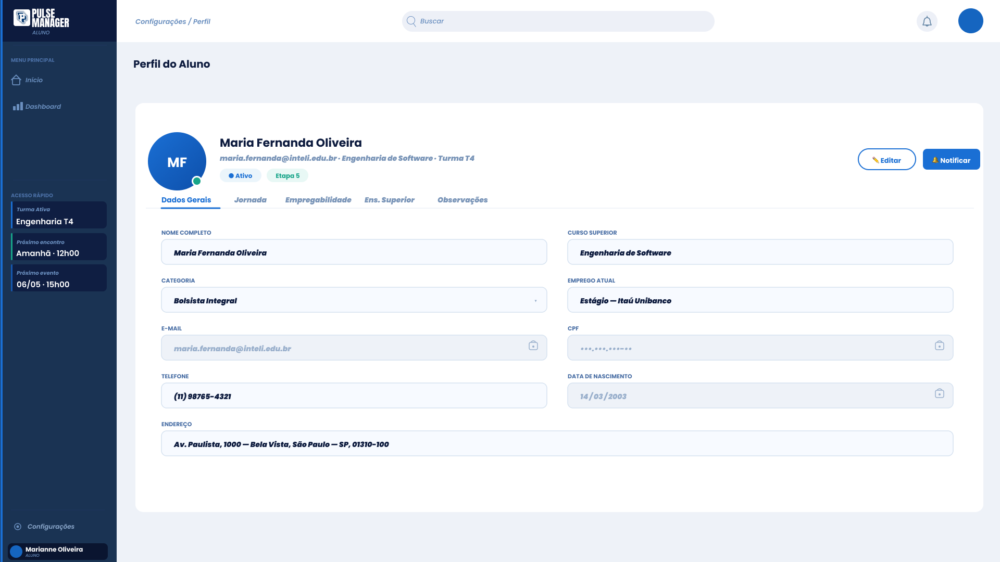<br>
<sub>Fonte: Autoria própria (2026).</sub><br>
</div>

<div align="justify">
A tela de perfil do aluno exibe todas as informações cadastrais do estudante em um único lugar. No topo, um card com avatar, nome, e-mail, curso e turma identifica o aluno, acompanhado de badges de status e etapa atual. Abaixo, abas organizam os dados em categorias — Dados Gerais, Jornada, Empregabilidade, Ensino Superior e Observações. Na aba inicial, os campos exibem nome completo, categoria, e-mail, telefone, endereço, curso superior, emprego atual, CPF e data de nascimento. Botões de editar e notificar ficam disponíveis no canto superior direito.

Esta tela está associada às User Stories US01, US02 e US03, de acordo com os critérios de aceite de cada uma. Isso porque a tela centraliza todos os dados do aluno em um único lugar, permitindo à gestora e ao psicólogo acessar o perfil completo do estudante com agilidade e tomar as ações necessárias diretamente pela plataforma.
</div>

### Dashboard apresentado ao Aluno

<div align="center">

<sup>Figura 45: Dashboard do Aluno.</sup><br>
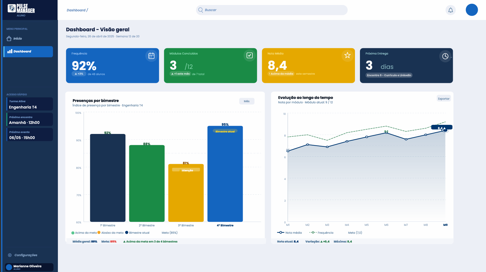<br>
<sub>Fonte: Autoria própria (2026).</sub><br>
</div>

<div align = "justify">
O protótipo apresenta o painel individual do aluno na plataforma, concebido para oferecer uma visão personalizada do próprio progresso acadêmico ao longo do programa. A estrutura de navegação lateral mantém a consistência visual do sistema, exibindo além do menu principal um bloco de acesso rápido com informações contextuais sobre a turma ativa, o próximo encontro e o próximo evento agendado. O cabeçalho repete o padrão global com busca, notificações e perfil.
Os quatro cartões de métricas no topo sintetizam os dados mais relevantes para o acompanhamento pessoal: frequência acumulada, módulos concluídos, nota média e prazo da próxima entrega — este último com identificação direta da atividade pendente. A seção central divide-se em dois painéis analíticos: à esquerda, um gráfico de colunas exibe o índice de presença por bimestre com marcações visuais de atenção e referência à meta estabelecida, acompanhado de um resumo textual com média geral e comparativo em relação ao objetivo; à direita, um gráfico de linhas com área sombreada mostra a evolução da nota média e da frequência módulo a módulo ao longo do semestre, permitindo ao aluno identificar tendências de melhora ou queda no próprio desempenho.
</div>

### Tela Inicial do Aluno

<div align="center">

<sup>Figura 46: Tela Inicial do Psicólogo.</sup><br>
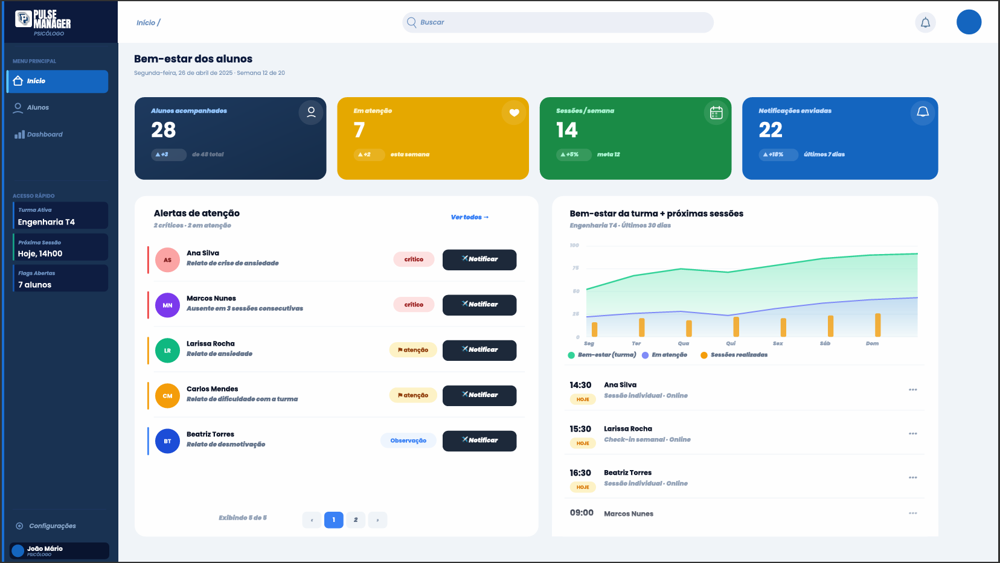<br>
<sub>Fonte: Autoria própria (2026).</sub><br>
</div>

<div align ="justify">
O protótipo apresenta o painel de acompanhamento socioemocional da plataforma, voltado exclusivamente para o profissional de psicologia responsável pela turma. A barra lateral mantém a identidade visual do sistema e exibe um bloco de acesso rápido com dados operacionais críticos: turma ativa, horário da próxima sessão e quantidade de flags abertas que demandam atenção imediata. O cabeçalho global repete os elementos padrão de busca e notificações.
Os quatro cartões de métricas superiores apresentam os indicadores centrais do trabalho clínico: alunos acompanhados, casos em atenção, sessões realizadas na semana e notificações enviadas, todos com variação recente em destaque. O corpo da tela divide-se em dois blocos complementares: à esquerda, uma lista paginada de alertas de atenção classifica os alunos por nível de criticidade — crítico, atenção ou observação — com nome, motivo do alerta e um botão de ação direta para notificação, permitindo ao psicólogo agir sem sair da tela; à direita, um gráfico de área sobreposta acompanha a evolução semanal do bem-estar geral da turma, dos casos em atenção e das sessões realizadas, seguido por uma agenda cronológica do dia com horário, nome do aluno, tipo de sessão e modalidade de atendimento.
</div>


### Lista de Alunos apresentada ao Psicólogo

<div align="center">

<sup>Figura 47: Lista de Alunos do Psicólogo.</sup><br>
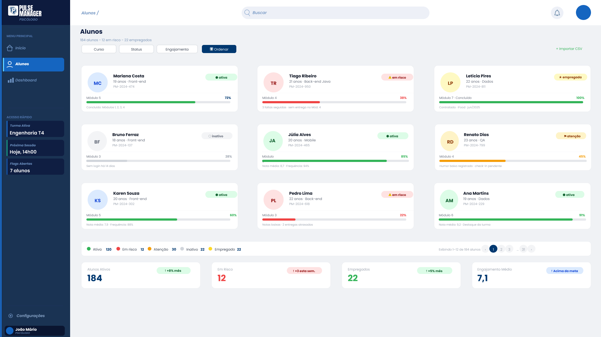<br>
<sub>Fonte: Autoria própria (2026).</sub><br>
</div>

<div align="justify">
A tela de lista de alunos do psicólogo segue a mesma estrutura da tela do gestor, com filtros por curso, status e engajamento. Os alunos são exibidos em cards com avatar, nome, curso, badge de status e barra de progresso do módulo atual. A sidebar traz acesso rápido à próxima sessão e às flags abertas, facilitando a priorização dos atendimentos. No rodapé, uma legenda resume os totais por status com paginação, e quatro cards exibem os principais indicadores da turma.

Esta tela está associada às User Stories US04 e US05, de acordo com os critérios de aceite de cada uma. Isso porque a tela permite ao psicólogo visualizar todos os alunos em um único lugar e identificar rapidamente quem precisa de suporte, com base nos badges de status e nas flags abertas exibidas na navegação lateral.
</div>

### Dashboard apresentado ao Psicólogo

<div align="center">

<sup>Figura 48: Dashboard do Psicólogo.</sup><br>
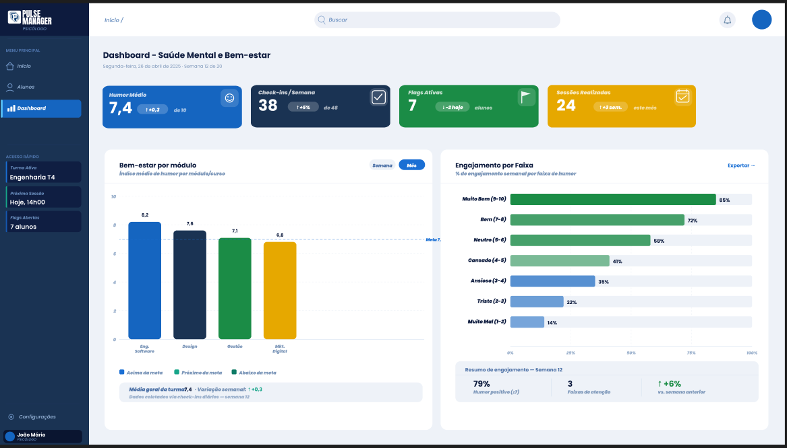<br>
<sub>Fonte: Autoria própria (2026).</sub><br>
</div>

<div align="justify">
Dashboard de saúde mental. Exibe 4 KPIs no topo (humor médio, check-ins semanais, flags ativas e sessões realizadas), dois gráficos centrais — um de barras com bem-estar por módulo/turma e um de barras horizontais com engajamento por faixa de humor, além de um resumo semanal e acesso rápido à turma e próxima sessão na sidebar esquerda.

Para ter uma visão dos flows desenvolvidos para cada um dos segmentos (aluno, gestor e psicólogo), segue em anexo o link para a plataforma de desenvolvimento dos protótipos de alta fidelidade e sua linha de segmentação interativa.

Link: https://www.figma.com/proto/txJwOwELjVHZt3YVdrjuo0/PulseMais---Prot%C3%B3tipos-de-Alta-Fidelidade?node-id=99-2&p=f&viewport=117%2C-854%2C0.36&t=CdCHM4sZQqs1BBos-1&scaling=contain&content-scaling=fixed&starting-point-node-id=212%3A2&show-proto-sidebar=1&page-id=0%3A1
</div>


## 3.6. Modelagem do banco de dados

### 3.6.1. Modelo Entidade-Relacionamento (ER) 

<div align="justify">
Um diagrama de Modelo Entidade-Relacionamento (MER) é uma representação visual da estrutura lógica de um banco de dados que descreve como os dados de um sistema estão organizados e se relacionam entre si. Ele é composto por três elementos fundamentais: Entidades, que representam os objetos ou conceitos do mundo real sobre os quais se deseja armazenar informações, como usuários, produtos ou pedidos; Atributos, que são as características ou propriedades que descrevem cada entidade, como nome, data de nascimento ou preço; e Relacionamentos, que expressam as associações existentes entre as entidades, podendo ser do tipo um-para-um, um-para-muitos ou muitos-para-muitos. Esse tipo de diagrama é amplamente utilizado na fase de modelagem de dados de um projeto, pois permite visualizar de forma clara e estruturada como as informações se conectam, facilitando o planejamento do banco de dados, a comunicação entre a equipe de desenvolvimento e a posterior implementação das tabelas e relações em um sistema gerenciador de banco de dados.

A partir destes conceitos e utilizando como base o TAPI e outros materiais disponibilizados pelo parceiro, foram mapeadas as entidades que serão a base para o desenvolvimento de novas funcionalidades do projeto, além de seus atributos, importantes para o funcionamento adequado das funcionalidades. Essas entidades e atributos estão explicitados na seguinte imagem:
</div>

<div align="center">
<sup>Figura 49: Modelo conceitual Entidade-Relacionamento utilizando Chen.</sup><br>
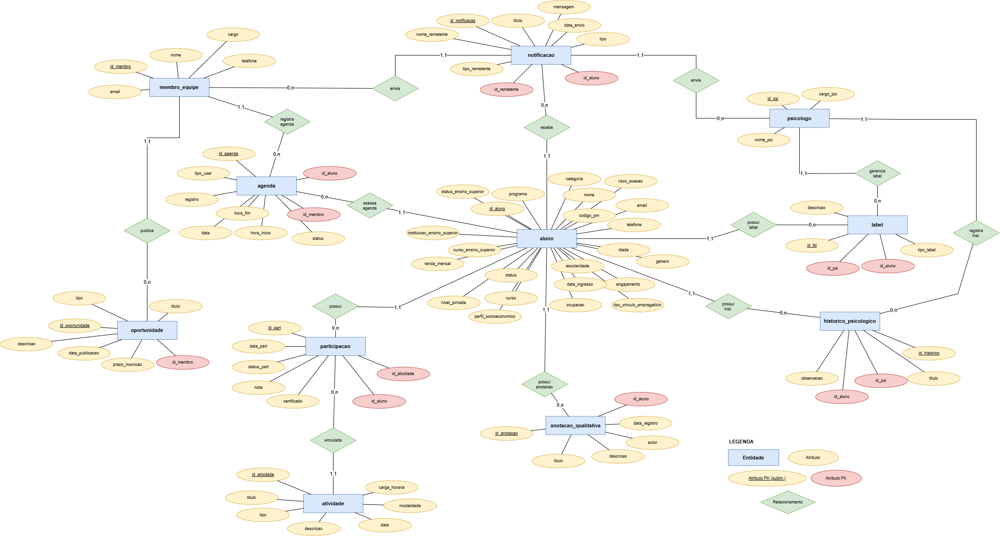<br>
<sub>Fonte: Autoria própria (2026). </sub><br>
</div>

<div align="justify">
Dentro do modelo conceitual, estão explicitadas as relações entre as entidades, sendo estas:

</div>

##### `membro_equipe`

- Publica zero ou várias `oportunidades` (0, n), onde cada uma é publicada por apenas um membro da equipe (1, 1);
- Visualiza zero ou várias `agendas` (0, n), e usuários com perfil de gestor podem registrar ou modificar itens da agenda institucional;
- Envia zero ou várias `notificações` (0, n), onde cada uma pode ser enviada por apenas um remetente, este que pode ser membro da equipe ou psicólogo (1, 1).


##### `aluno`

- Acessa zero ou várias `agendas` (0, n), limitadas aos eventos ou compromissos relacionados à sua própria jornada;
- Possui zero ou várias `labels` atribuídas (0, n), onde cada label pertence a apenas um aluno (1, 1);
- Recebe zero ou várias `notificações` (0, n), onde cada notificação é direcionada a apenas um aluno (1, 1);
- Possui zero ou várias `participações` (0, n), onde cada uma pertence a apenas um aluno (1, 1) e está vinculada a uma atividade (1, 1);
- Possui zero ou vários `registros` psicológicos (0, n), onde cada um pertence a apenas um aluno (1, 1).


##### `psicologo`

- Registra zero ou vários `registros` psicológicos (0, n), os quais podem ser registrados por apenas um psicólogo (1, 1);
- Gerencia zero ou várias `labels` (0, n), onde cada uma pode ser gerenciada por apenas um psicólogo (1, 1);
- Acessa zero ou várias `agendas` (0, n), limitadas aos compromissos relacionados aos alunos que acompanha;
- Acessa o desempenho acadêmico dos alunos monitorados, preservando a restrição de acesso aos demais alunos da base;
- Envia zero ou várias `notificações` (0, n), onde cada uma pode ser enviada por apenas um remetente, este que pode ser membro da equipe ou psicólogo (1, 1).

<div align="justify">

Além disso, faz-se necessário explicar a importância de decisões específicas utilizadas na modelagem conceitual do modelo entidade-relacionamento. Assim, como pontos importantes têm-se as aplicações das relações com as entidades e cardinalidades e a utilização do símbolo de especialização/generalização.

Na construção do modelo entidade-relacionamento, é utilizada a sinalização de retângulos para exemplificar as entidades utilizadas, futuramente representadas como tabelas no banco de dados; também são utilizadas elipses para explicitar os atributos destas entidades e, além disso, os losangos para visualização das relações existentes entre as entidades do modelo. Já as cardinalidades são utilizadas para identificar visualmente como funcionam as quantificações entre relações, como, por exemplo, quantas entidades participam de uma ação.

Além disso, um novo conceito utilizado é a sinalização de um triângulo para explicitar que há uma superclasse (`remetente`), que se divide em duas subclasses (`membro_equipe` e `psicologo`), onde são utilizadas as letras (t, d) no triângulo que significam (total, disjoint), mostrando que todo elemento da superclasse pertence a pelo menos uma subclasse e que um elemento só pode pertencer a uma única subclasse por vez.

Por fim, as entidades aplicadas foram elaboradas a partir da análise das Regras de Negócio anteriormente desenvolvidas, sendo definidas as seguintes relações:
</div>

| Entidade principal | Relacionamento com | RNs associadas | Justificativa |
|-------------|------------|---------------|-------------|
| Membro da Equipe | Publicação de oportunidades | RN008, RN011 | Pois a interface incentiva o registro de vínculos de trabalho (formal/informal) e a publicação de oportunidades é uma ação exclusiva da equipe interna |
| Membro da Equipe | Visualização de agenda | RN018 | Pois a agenda institucional deve ser visível para os perfis internos, respeitando o contexto de acesso de cada usuário |
| Gestor | Modificação da agenda | RN019 | Pois somente o perfil de gestão pode criar, editar, reagendar ou cancelar itens da agenda institucional |
| Membro da Equipe | Envio de notificações | RN011, RN016 | Pois a equipe interna tem autonomia no quesito de registros no sistema, além de ter que comunicar os alunos sobre atividades de mentores voluntários (não-usuários), já que estes não têm liberdade de alterações no sistema |
| Aluno | Acesso de agenda | RN018 | Pois o aluno pode visualizar eventos ou compromissos relacionados à sua jornada, mas não pode modificar os itens da agenda |
| Aluno | Atribuição de labels | RN015 | Pois as labels são vinculadas ao aluno acompanhado e, no DER atual, possuem psicólogo responsável por meio de `id_psi` |
| Aluno | Recebimento de notificações | RN013, RN014 | Pois o aluno não tem permissão de alterar todos os dados do sistema, apenas dados essenciais, outros dados podem apenas ser acessados para verificação. Além disso, as notificações são um meio de enviar formulários para que os alunos atualizem seus dados |
| Aluno | Participações dos alunos | RN004, RN009, RN007 | Pois o histórico de programas anteriores deve ser preservado para verificações futuras, algo permitido através do registro de participações. Além de este registro servir como base para a criação de alguns indicadores em dashboards e cálculos de variáveis |
| Aluno | Registros psicológicos | RN012, RN010 | Pois registros voltados à saúde mental só podem ser criados e editados por psicólogos, sua ligação com o aluno se relaciona com a existência desta entidade no registro estudantil visto pela equipe especificada. Além disso, estes dados podem ser preservados para análises futuras dos profissionais |
| Psicólogo | Registros psicológicos | RN012, RN010 | Pois os registros relacionados à saúde mental são criados e editados pela equipe de psicólogos, além da necessidade de preservação dos dados para outras análises |
| Psicólogo | Gerenciamento de labels | RN015 | Pois a criação de labels é de autonomia exclusiva da equipe interna de psicólogos  |
| Psicólogo | Envio de notificações | RN011 | Pois a equipe interna tem autonomia no quesito de registros no sistema, assim, precisa utilizar notificações para a coleta de informações |
| Psicólogo | Acesso ao desempenho acadêmico | RN020, RN017 | Pois o psicólogo pode consultar notas, frequência e indicadores acadêmicos apenas dos alunos que monitora, mantendo a restrição de acesso aos dados pessoais |


### 3.6.2. Diagrama Entidade-Relacionamento (DER) 

<div align="justify">

O Diagrama Entidade-Relacionamento (DER) do sistema PulseManager representa a estrutura lógica do banco de dados responsável por armazenar e organizar as informações relacionadas ao acompanhamento acadêmico, profissional e psicossocial dos alunos atendidos pela organização Pulse Mais. O modelo foi desenvolvido com base nos requisitos funcionais levantados ao longo da análise do sistema e está integralmente alinhado ao Diagrama de Classes do Domínio, garantindo consistência entre a modelagem conceitual orientada a objetos e a modelagem relacional.

O DER explicita as entidades do sistema, seus atributos, as respectivas chaves primárias (Primary Keys – PK), chaves estrangeiras (Foreign Keys – FK) e as cardinalidades de todos os relacionamentos, representadas por meio da notação crow's foot

</div>

<div align="center">

<sup>Figura 50: Diagrama Entidade-Relacionamento.</sup><br>
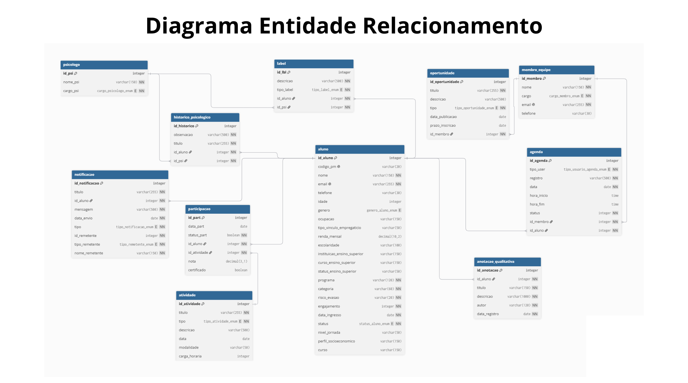<br>
<sub>Fonte: Elaborado pela equipe (2026).</sub><br>
</div>

### Entidade `aluno`

<div align="justify">

A entidade `aluno` constitui o elemento central do modelo, pois representa os jovens acompanhados pela organização e concentra a maior parte dos relacionamentos do sistema.

</div>

Seus atributos são:

- `id_aluno` (PK)
- `nome`
- `email`
- `idade`
- `genero`
- `ocupacao`
- `escolaridade`
- `data_ingresso`
- `status`


<div align="justify">

Cada aluno pode participar de diversas atividades, registrar compromissos na agenda, acumular labels de acompanhamento e possuir diversos registros em seu histórico psicológico.

</div>

### Entidade `membro_equipe`

<div align="justify">

A entidade `membro_equipe` representa os colaboradores da organização responsáveis pela gestão administrativa e pedagógica do sistema, incluindo gestores e outros profissionais autorizados.

</div>

Seus atributos são:

- `id_membro` (PK)
- `nome`
- `cargo`
- `email`

<div align="justify">

Cada membro da equipe pode publicar oportunidades, registrar compromissos institucionais na agenda e enviar notificações.

</div>

### Entidade `psicologo`

<div align="justify">

A entidade `psicologo` representa os profissionais responsáveis pelo acompanhamento psicossocial dos alunos.

</div>

Seus atributos são:

- `id_psi` (PK)
- `nome_psi`
- `cargo_psi`

<div align="justify">

Cada psicólogo pode registrar históricos psicológicos, criar labels, enviar notificações e acompanhar a evolução comportamental e emocional dos alunos.

</div>

### Entidade `atividade`

<div align="justify">

A entidade `atividade` foi concebida como uma abstração genérica para representar cursos, eventos, mentorias e aulas em uma única estrutura. Essa decisão de modelagem reduz redundâncias e simplifica o tratamento das informações acadêmicas.

</div>

Seus atributos são:

- `id_atividade` (PK)
- `titulo`
- `tipo`
- `descricao`
- `data`

<div align="justify">

O atributo `tipo` permite identificar a natureza da atividade, diferenciando cursos, eventos, mentorias e aulas dentro de uma estrutura unificada.

</div>

### Entidade `participacao`

<div align="justify">

A entidade `participacao` materializa o relacionamento entre `aluno` e `atividade`, registrando o envolvimento efetivo do aluno em cada atividade. O atributo `nota` registra o desempenho individual do aluno naquela atividade específica, refletindo que a avaliação é um atributo do vínculo entre aluno e atividade, e não da atividade em si.

</div>

Seus atributos são:

- `id_part` (PK)
- `data_part`
- `status_part`
- `id_aluno` (FK)
- `id_atividade` (FK)
- `nota`

Cardinalidades:

- Um `aluno` pode possuir zero ou muitas participações.
- Cada `participacao` pertence a exatamente um aluno.
- Uma `atividade` pode possuir zero ou muitas participações.
- Cada `participacao` refere-se a exatamente uma atividade.

### Entidade `label`

<div align="justify">

A entidade `label` representa marcadores de acompanhamento atribuídos aos alunos, cadastrados por psicólogos para apoiar a leitura da situação de cada jovem.

</div>

Seus atributos são:

- `id_lbl` (PK)
- `descricao`
- `tipo_label`
- `id_aluno` (FK)
- `id_psi` (FK)

Cardinalidades:

- Um `aluno` pode possuir zero ou muitas labels.
- Cada `label` está associada a exatamente um aluno.
- Um `psicologo` pode criar zero ou muitas labels.
- Cada `label` é associada a exatamente um psicólogo responsável.

### Entidade `historico_psicologico`

<div align="justify">

A entidade `historico_psicologico` armazena observações qualitativas registradas pelos psicólogos durante o acompanhamento individual dos alunos.

</div>

Seus atributos são:

- `id_historico` (PK)
- `observacao`
- `titulo`
- `id_aluno` (FK)
- `id_psi` (FK)

Cardinalidades:

- Um `aluno` pode possuir zero ou muitos registros psicológicos.
- Cada `historico_psicologico` pertence a exatamente um aluno.
- Um `psicologo` pode registrar zero ou muitos históricos.
- Cada `historico_psicologico` é elaborado por exatamente um psicólogo.


### Entidade `agenda`

<div align="justify">

A entidade `agenda` armazena registros de compromissos, eventos e acompanhamentos vinculados a alunos e membros da equipe. A agenda deve poder ser visualizada por todos os perfis, respeitando o contexto de cada usuário, enquanto a modificação de seus itens fica restrita ao perfil de gestor.

</div>

Seus atributos são:

- `id_agenda` (PK)
- `tipo_user`
- `registro`
- `data`
- `status`
- `id_membro` (FK)
- `id_aluno` (FK)
- `id_psi` (FK, opcional)

Cardinalidades:

- Um `aluno` pode possuir zero ou muitos registros na agenda.
- Um `membro_equipe` pode criar zero ou muitos compromissos.
- Um `psicologo` pode estar associado a zero ou muitos compromissos de acompanhamento.


### Entidade `oportunidade`

<div align="justify">

A entidade `oportunidade` representa conteúdos disponibilizados pela equipe, como vagas de emprego, bolsas de estudo, cursos e eventos externos.

</div>

Seus atributos são:

- `id_oportunidade` (PK)
- `titulo`
- `descricao`
- `tipo`
- `data_publicacao`
- `id_membro` (FK)

Cardinalidades:

- Um `membro_equipe` pode publicar zero ou muitas oportunidades.
- Cada `oportunidade` é publicada por exatamente um membro da equipe.


### Entidade `notificacao`

<div align="justify">

A entidade `notificacao` registra as comunicações enviadas pelos membros da equipe e psicólogos no sistema.

</div>

Seus atributos são:

- `id_notificacao` (PK)
- `titulo`
- `mensagem`
- `data_envio`
- `tipo`
- `id_aluno` (FK)
- `id_remetente`
- `tipo_remetente`
- `nome_remetente`

Cardinalidades:

- Um `aluno` pode receber zero ou muitas notificações.
- Cada `notificacao` está associada a exatamente um aluno.
- Cada `notificacao` é enviada por exatamente um remetente, identificado pelos campos `id_remetente` e `tipo_remetente`, que indicam respectivamente o identificador e o tipo do emissor (membro da equipe ou psicólogo).


### Principais Relacionamentos e Cardinalidades

<div align="justify">

Os principais relacionamentos definidos no DER são:

</div>

- `aluno` 1:N `participacao`
- `atividade` 1:N `participacao`
- `aluno` 1:N `label`
- `psicologo` 1:N `label`
- `aluno` 1:N `agenda`
- `aluno` 1:N `historico_psicologico`
- `membro_equipe` 1:N `oportunidade`
- `membro_equipe` 1:N `agenda`
- `psicologo` 0:N `agenda`
- `aluno` 1:N `notificacao`
- `remetente` (polimórfico) 1:N `notificacao`
- `psicologo` 1:N `historico_psicologico`


### Decisões de Modelagem

<div align="justify">

A principal decisão arquitetural foi a criação da entidade `atividade`, responsável por unificar cursos, eventos, mentorias e aulas em uma estrutura única. O atributo `nota` foi posicionado na entidade `participacao`, pois representa o desempenho individual de cada aluno em uma atividade específica, e não uma característica da atividade em si. Essa abordagem reduz a redundância de dados e facilita a manutenção do sistema, uma vez que a entidade `participacao` passa a referenciar um único tipo de objeto para registrar o vínculo entre alunos e atividades.

Outra decisão importante foi a adoção da entidade associativa `participacao`, responsável por implementar o relacionamento muitos-para-muitos entre alunos e atividades, além de possibilitar o armazenamento de informações específicas da relação, como data, status e nota da participação.

O modelo foi construído respeitando a Terceira Forma Normal (3FN). Não há dependências transitivas entre atributos não-chave, e todos os atributos dependem exclusivamente de suas respectivas chaves primárias, contribuindo para a redução de redundâncias e para a integridade estrutural do banco de dados.

</div>

### Limitações Conhecidas do Modelo

<div align="justify">

A unificação de cursos, eventos, mentorias e aulas no atributo "tipo" da entidade Atividade simplifica o modelo e reduz redundâncias, porém implica perda de especificidade estrutural entre os tipos. Caso futuramente seja necessário armazenar atributos exclusivos de cada tipo, como carga horária para cursos ou palestrante para eventos, o modelo exigirá refatoração. Essa é uma limitação conhecida e aceita, justificada pelo escopo atual do sistema.

A entidade `notificacao` adota associação polimórfica para identificar o remetente por meio dos campos `id_remetente` e `tipo_remetente`, em vez de uma tabela física `remetente`. Essa abordagem simplifica a implementação, mas delega a validação do remetente à camada de aplicação.

O campo `nome_remetente` em `notificacao` representa uma desnormalização intencional, adotada para simplificar consultas decorrentes da associação polimórfica. Essa decisão implica redundância controlada e exige sincronização pelo código da aplicação em caso de atualização.

</div>

### Conclusão

<div align="justify">

O Diagrama Entidade-Relacionamento do PulseManager representa de forma estruturada, consistente e normalizada os dados necessários para o funcionamento do sistema. A identificação explícita de chaves primárias, chaves estrangeiras e cardinalidades garante integridade referencial e aderência às regras de negócio, estabelecendo uma base sólida para a construção do Modelo Relacional e do Modelo Físico do banco de dados.

</div>


### 3.6.3. Modelo Relacional e Modelo Físico 

<div align="justify">

Esta seção traduz o DER apresentado na seção 3.6.2 para o modelo relacional e para sua implementação física em PostgreSQL. Como a modelagem foi revisada ao longo do desenvolvimento, as tabelas abaixo representam a versão consolidada após as atualizações da Sprint 4, e não apenas o recorte inicial produzido na Sprint 2.

O modelo relacional organiza os dados em tabelas com seus respectivos campos (NORMANDO, 2024). As chaves primárias identificam de forma única cada registro, enquanto as chaves estrangeiras conectam uma tabela a outra e preservam os vínculos definidos na modelagem. Dessa forma, as entidades e relacionamentos do DER são convertidos em uma estrutura pronta para implementação no banco de dados.

</div>

#### Modelo Relacional - Pulse Manager

<div align="justify">

Com base na modelagem de dados do projeto, o modelo relacional foi definido para refletir as entidades atuais do sistema conforme o DER e a migration consolidada. A tabela `participacao` representa o relacionamento entre `aluno` e `atividade` e concentra os dados específicos desse vínculo, incluindo `nota` e `certificado`; `oportunidade` fica vinculada a `membro_equipe`; `agenda` fica vinculada a `aluno` e `membro_equipe`; e os registros sensíveis de `label` e `historico_psicologico` mantêm vínculo com `psicologo`.

</div>

##### Representação Relacional

| Tabela | Chave primária | Atributos | Chaves estrangeiras |
|---|---|---|---|
| `aluno` | `id_aluno` | `codigo_pm`, `nome`, `email`, `telefone`, `idade`, `genero`, `ocupacao`, `tipo_vinculo_empregaticio`, `renda_mensal`, `escolaridade`, `instituicao_ensino_superior`, `curso_ensino_superior`, `status_ensino_superior`, `data_ingresso_ensino_superior`, `programa`, `categoria`, `risco_evasao`, `probabilidade_evasao`, `engajamento`, `data_ingresso`, `status`, `nivel_jornada`, `perfil_socioeconomico`, `curso`, `origem_participacao` | - |
| `membro_equipe` | `id_membro` | `nome`, `cargo`, `email` | - |
| `psicologo` | `id_psi` | `nome_psi`, `cargo_psi` | - |
| `atividade` | `id_atividade` | `titulo`, `tipo`, `descricao`, `data`, `modalidade`, `carga_horaria` | - |
| `notificacao` | `id_notificacao` | `titulo`, `mensagem`, `data_envio`, `tipo`, `id_remetente`, `tipo_remetente`, `nome_remetente` | `id_aluno` |
| `oportunidade` | `id_oportunidade` | `titulo`, `descricao`, `tipo`, `data_publicacao`, `prazo_inscricao` | `id_membro` |
| `agenda` | `id_agenda` | `tipo_user`, `registro`, `data`, `hora_inicio`, `hora_fim`, `status` | `id_membro`, `id_aluno` |
| `label` | `id_lbl` | `descricao`, `tipo_label` | `id_aluno`, `id_psi` |
| `historico_psicologico` | `id_historico` | `observacao`, `titulo` | `id_aluno`, `id_psi` |
| `participacao` | `id_part` | `data_part`, `status_part`, `nota`, `certificado` | `id_aluno`, `id_atividade` |
| `anotacao_qualitativa` | `id_anotacao` | `titulo`, `descricao`, `autor`, `data_registro` | `id_aluno` |

##### Descrição das Tabelas

###### Tabela aluno

<div align="justify">

A tabela `aluno` representa os jovens acompanhados pela Pulse Mais. Ela contém os dados principais do aluno e é a base para registros de agenda, notificações, labels, histórico psicológico e participação em atividades. Os campos `risco_evasao` e `probabilidade_evasao` armazenam, respectivamente, a classificação categórica e o índice fuzzy calculado pelo backend. A coluna percentual utiliza `DECIMAL(5,2)` e aceita apenas valores nulos ou entre 0 e 100.

</div>

###### Tabela membro_equipe

<div align="justify">

A tabela `membro_equipe` armazena os profissionais da equipe responsáveis por registros administrativos, comunicações, oportunidades e compromissos. Ela se relaciona com `notificacao`, `oportunidade` e `agenda`.

</div>

###### Tabela psicologo

<div align="justify">

A tabela `psicologo` representa os profissionais responsáveis por registros e acompanhamentos psicológicos. Na modelagem, essa entidade se relaciona com `notificacao`, `label` e `historico_psicologico`, sendo que em `notificacao` o vínculo do remetente é polimórfico.

</div>

###### Tabela notificacao

<div align="justify">

A tabela `notificacao` armazena mensagens e avisos emitidos no sistema. O campo `id_aluno` associa a notificação ao aluno destinatário, enquanto `id_remetente`, `tipo_remetente` e `nome_remetente` identificam quem enviou a comunicação, podendo ser um membro da equipe ou um psicólogo.

</div>

###### Tabela oportunidade

<div align="justify">

A tabela `oportunidade` registra oportunidades acadêmicas, profissionais ou institucionais. Cada oportunidade é criada ou mantida por um membro da equipe, e não vinculada diretamente a um aluno.

</div>

###### Tabela agenda

<div align="justify">

A tabela `agenda` registra compromissos, eventos e acompanhamentos. Na versão consolidada da Sprint 4, cada registro é associado ao aluno envolvido e ao membro da equipe responsável, conforme os campos `id_aluno` e `id_membro`; compromissos conduzidos por psicólogos podem ser representados no conteúdo do evento, mas não possuem chave estrangeira direta para `psicologo` nessa tabela.

</div>

###### Tabela label

<div align="justify">

A tabela `label` armazena classificações ou marcações vinculadas ao aluno. O campo `id_aluno` vincula a label ao aluno correspondente, enquanto `id_psi` identifica o psicólogo responsável pela marcação.

</div>

###### Tabela historico_psicologico

<div align="justify">

A tabela `historico_psicologico` registra informações de acompanhamento psicológico. Cada registro histórico possui uma observação e um título, ficando vinculado ao aluno acompanhado e ao psicólogo responsável.

</div>

###### Tabela atividade

<div align="justify">

A tabela `atividade` armazena cursos, eventos, mentorias e aulas em uma estrutura única. O DER atual não apresenta `nota` como atributo direto de `atividade`.

</div>

###### Tabela participacao

<div align="justify">

A tabela `participacao` é uma tabela lógica associativa entre `aluno` e `atividade`. Essa estrutura permite que um aluno participe de várias atividades e que uma atividade tenha vários alunos participantes. O campo `nota` pertence a essa tabela, pois a avaliação está ligada ao vínculo entre aluno e atividade.

</div>

###### Tabela anotacao_qualitativa

<div align="justify">

A tabela `anotacao_qualitativa` registra observações textuais sobre a jornada do aluno. Ela depende de `aluno` por meio de `id_aluno` e complementa o histórico individual sem se confundir com registros psicológicos sensíveis, que permanecem em `historico_psicologico`.

</div>

#### Implementação de Chaves Estrangeiras

<div align="justify">

Com base nas cardinalidades descritas no DER, as chaves estrangeiras foram posicionadas nas tabelas dependentes de cada relacionamento. Esse mapeamento preserva a integridade entre os registros e impede que informações da jornada do aluno fiquem desconectadas no banco.

</div>

##### Mapeamento das Chaves Estrangeiras

| Tabela | Chave estrangeira | Referência | Finalidade |
|---|---|---|---|
| `notificacao` | `id_aluno` | `aluno(id_aluno)` | Identificar o aluno destinatário da notificação. |
| `oportunidade` | `id_membro` | `membro_equipe(id_membro)` | Indicar qual membro da equipe publicou ou administra a oportunidade. |
| `agenda` | `id_membro` | `membro_equipe(id_membro)` | Registrar o responsável interno pelo compromisso ou acompanhamento. |
| `agenda` | `id_aluno` | `aluno(id_aluno)` | Associar o compromisso ao aluno envolvido. |
| `label` | `id_aluno` | `aluno(id_aluno)` | Vincular marcações e classificações ao aluno correspondente. |
| `label` | `id_psi` | `psicologo(id_psi)` | Identificar o psicólogo responsável pela label. |
| `historico_psicologico` | `id_aluno` | `aluno(id_aluno)` | Associar o registro psicológico ao aluno acompanhado. |
| `historico_psicologico` | `id_psi` | `psicologo(id_psi)` | Associar o registro psicológico ao psicólogo responsável. |
| `participacao` | `id_aluno` | `aluno(id_aluno)` | Indicar qual aluno participou de determinada atividade. |
| `participacao` | `id_atividade` | `atividade(id_atividade)` | Indicar qual atividade recebeu a participação do aluno. |
| `anotacao_qualitativa` | `id_aluno` | `aluno(id_aluno)` | Associar a anotação qualitativa ao aluno acompanhado. |

##### Regras de Negócio do Modelo Relacional

<div align="justify">

O modelo mantém `aluno` como entidade central, referenciada por notificações, agenda, labels, histórico psicológico e participações. Assim, os dados de acompanhamento ficam ligados ao aluno sem duplicação de informações pessoais em outras tabelas.

O relacionamento entre `aluno` e `atividade` é resolvido por `participacao`, o que mantém o modelo normalizado e permite registrar dados próprios do vínculo, como `data_part`, `status_part` e `nota`. Como regra de negócio, um mesmo aluno não deve ser registrado mais de uma vez na mesma atividade.

Como o DER atual não apresenta uma entidade separada para notas, `nota` permanece como atributo de `participacao`, mantendo a avaliação associada ao aluno em uma atividade específica.

Os vínculos com `membro_equipe` e `psicologo` preservam a rastreabilidade dos responsáveis por oportunidades, notificações, labels e registros psicológicos, respeitando as relações representadas no DER. A agenda, especificamente, preserva vínculo físico com `membro_equipe` e `aluno`; a participação de psicólogos em compromissos aparece no fluxo de agenda do aluno como informação de evento, sem FK própria nessa tabela.

Como regra de acesso, o psicólogo não possui visão geral de todos os alunos. Sua visualização deve ser limitada aos alunos aos quais ele está relacionado por registros como `label` e `historico_psicologico`, que possuem simultaneamente `id_psi` e `id_aluno`, ou por notificações em que `tipo_remetente` seja `psicologo` e `id_remetente` corresponda ao seu `id_psi`. Para esses alunos monitorados, o psicólogo pode consultar dados de desempenho acadêmico necessários ao acompanhamento, como notas, frequência e participação em atividades. Já `membro_equipe` mantém acesso institucional mais amplo aos registros administrativos e acadêmicos dos alunos, respeitando a restrição de que informações sensíveis de acompanhamento psicológico só devem ser acessadas por usuários com perfil de psicólogo.

</div>

#### Codificação do Modelo Físico em PostgreSQL

<div align="justify">

A codificação a seguir representa o DDL do modelo físico em PostgreSQL. Esse script implementa o modelo relacional apresentado anteriormente, criando os tipos, as tabelas, as chaves primárias, as chaves estrangeiras e as restrições simples do sistema.

Os identificadores principais usam `GENERATED ALWAYS AS IDENTITY`, recurso do PostgreSQL que gera automaticamente valores inteiros sequenciais para as chaves primárias. Os campos de domínio fechado foram representados com `ENUM`, e as restrições simples foram declaradas com `NOT NULL`, `UNIQUE`, `CHECK`, `PRIMARY KEY` e `FOREIGN KEY`.

</div>

```sql
-- PostgreSQL

DO $$
BEGIN
  CREATE TYPE genero_aluno_enum AS ENUM (
    'feminino',
    'masculino',
    'nao_binario',
    'outro',
    'prefiro_nao_informar'
  );
EXCEPTION WHEN duplicate_object THEN NULL;
END $$;

DO $$
BEGIN
  CREATE TYPE status_aluno_enum AS ENUM (
    'ativo',
    'inativo',
    'egresso',
    'desligado',
    'em_acompanhamento'
  );
EXCEPTION WHEN duplicate_object THEN NULL;
END $$;

DO $$
BEGIN
  CREATE TYPE cargo_membro_enum AS ENUM (
    'gestor',
    'coordenador',
    'mentor',
    'voluntario',
    'administrativo',
    'outro'
  );
EXCEPTION WHEN duplicate_object THEN NULL;
END $$;

DO $$
BEGIN
  CREATE TYPE cargo_psicologo_enum AS ENUM (
    'psicologo',
    'coordenador_psicologico',
    'estagiario',
    'outro'
  );
EXCEPTION WHEN duplicate_object THEN NULL;
END $$;

DO $$
BEGIN
  CREATE TYPE tipo_notificacao_enum AS ENUM (
    'alerta',
    'informativo',
    'convite',
    'urgente',
    'outro'
  );
EXCEPTION WHEN duplicate_object THEN NULL;
END $$;

DO $$
BEGIN
  CREATE TYPE tipo_remetente_enum AS ENUM (
    'membro_equipe',
    'psicologo'
  );
EXCEPTION WHEN duplicate_object THEN NULL;
END $$;

DO $$
BEGIN
  CREATE TYPE tipo_oportunidade_enum AS ENUM (
    'emprego',
    'estagio',
    'curso',
    'evento',
    'bolsa',
    'voluntariado',
    'outro'
  );
EXCEPTION WHEN duplicate_object THEN NULL;
END $$;

DO $$
BEGIN
  CREATE TYPE tipo_usuario_agenda_enum AS ENUM (
    'aluno',
    'membro_equipe'
  );
EXCEPTION WHEN duplicate_object THEN NULL;
END $$;

DO $$
BEGIN
  CREATE TYPE tipo_label_enum AS ENUM (
    'risco',
    'interesse',
    'perfil',
    'acompanhamento',
    'prioridade',
    'outro'
  );
EXCEPTION WHEN duplicate_object THEN NULL;
END $$;

DO $$
BEGIN
  CREATE TYPE tipo_atividade_enum AS ENUM (
    'aula',
    'mentoria',
    'workshop',
    'evento',
    'avaliacao',
    'curso',
    'outro'
  );
EXCEPTION WHEN duplicate_object THEN NULL;
END $$;

CREATE TABLE IF NOT EXISTS aluno (
  id_aluno INTEGER GENERATED ALWAYS AS IDENTITY PRIMARY KEY,
  codigo_pm VARCHAR(20) UNIQUE,
  nome VARCHAR(150) NOT NULL,
  email VARCHAR(255) NOT NULL UNIQUE,
  telefone VARCHAR(30),
  idade INTEGER CHECK (idade IS NULL OR (idade >= 0 AND idade <= 120)),
  genero genero_aluno_enum,
  ocupacao VARCHAR(150),
  tipo_vinculo_empregaticio VARCHAR(50),
  renda_mensal DECIMAL(10,2) CHECK (renda_mensal IS NULL OR renda_mensal >= 0),
  escolaridade VARCHAR(100),
  instituicao_ensino_superior VARCHAR(150),
  curso_ensino_superior VARCHAR(150),
  status_ensino_superior VARCHAR(50),
  data_ingresso_ensino_superior DATE,
  programa VARCHAR(120) NOT NULL DEFAULT 'nao_informado',
  categoria VARCHAR(60) NOT NULL DEFAULT 'sem_categoria',
  risco_evasao VARCHAR(20) NOT NULL DEFAULT 'baixo' CHECK (risco_evasao IN ('baixo', 'medio', 'alto')),
  engajamento INTEGER NOT NULL DEFAULT 0 CHECK (engajamento >= 0 AND engajamento <= 100),
  data_ingresso DATE NOT NULL DEFAULT CURRENT_DATE,
  status status_aluno_enum NOT NULL DEFAULT 'ativo',
  nivel_jornada VARCHAR(50),
  perfil_socioeconomico VARCHAR(150),
  curso VARCHAR(150),
  origem_participacao VARCHAR(100)
);

CREATE TABLE IF NOT EXISTS membro_equipe (
  id_membro INTEGER GENERATED ALWAYS AS IDENTITY PRIMARY KEY,
  nome VARCHAR(150) NOT NULL,
  cargo cargo_membro_enum NOT NULL,
  email VARCHAR(255) NOT NULL UNIQUE
);

CREATE TABLE IF NOT EXISTS psicologo (
  id_psi INTEGER GENERATED ALWAYS AS IDENTITY PRIMARY KEY,
  nome_psi VARCHAR(150) NOT NULL,
  cargo_psi cargo_psicologo_enum NOT NULL
);

CREATE TABLE IF NOT EXISTS atividade (
  id_atividade INTEGER GENERATED ALWAYS AS IDENTITY PRIMARY KEY,
  titulo VARCHAR(255) NOT NULL,
  tipo tipo_atividade_enum NOT NULL,
  descricao VARCHAR(500),
  data DATE,
  modalidade VARCHAR(50),
  carga_horaria INTEGER
);

CREATE TABLE IF NOT EXISTS notificacao (
  id_notificacao INTEGER GENERATED ALWAYS AS IDENTITY PRIMARY KEY,
  titulo VARCHAR(255) NOT NULL,
  id_aluno INTEGER NOT NULL,
  mensagem VARCHAR(500) NOT NULL,
  data_envio DATE NOT NULL DEFAULT CURRENT_DATE,
  tipo tipo_notificacao_enum NOT NULL,
  id_remetente INTEGER NOT NULL,
  tipo_remetente tipo_remetente_enum NOT NULL,
  nome_remetente VARCHAR(150) NOT NULL,
  FOREIGN KEY (id_aluno) REFERENCES aluno(id_aluno)
);

CREATE TABLE IF NOT EXISTS oportunidade (
  id_oportunidade INTEGER GENERATED ALWAYS AS IDENTITY PRIMARY KEY,
  titulo VARCHAR(255) NOT NULL,
  descricao VARCHAR(500),
  tipo tipo_oportunidade_enum NOT NULL,
  data_publicacao DATE DEFAULT CURRENT_DATE,
  prazo_inscricao DATE,
  id_membro INTEGER NOT NULL,
  FOREIGN KEY (id_membro) REFERENCES membro_equipe(id_membro)
);

CREATE TABLE IF NOT EXISTS agenda (
  id_agenda INTEGER GENERATED ALWAYS AS IDENTITY PRIMARY KEY,
  tipo_user tipo_usuario_agenda_enum NOT NULL,
  registro VARCHAR(500) NOT NULL,
  data DATE NOT NULL,
  hora_inicio TIME,
  hora_fim TIME,
  status INTEGER NOT NULL DEFAULT 1,
  id_membro INTEGER NOT NULL,
  id_aluno INTEGER NOT NULL,
  FOREIGN KEY (id_membro) REFERENCES membro_equipe(id_membro),
  FOREIGN KEY (id_aluno) REFERENCES aluno(id_aluno)
);

CREATE TABLE IF NOT EXISTS label (
  id_lbl INTEGER GENERATED ALWAYS AS IDENTITY PRIMARY KEY,
  descricao VARCHAR(500) NOT NULL,
  tipo_label tipo_label_enum NOT NULL,
  id_aluno INTEGER NOT NULL,
  id_psi INTEGER NOT NULL,
  FOREIGN KEY (id_aluno) REFERENCES aluno(id_aluno),
  FOREIGN KEY (id_psi) REFERENCES psicologo(id_psi)
);

CREATE TABLE IF NOT EXISTS historico_psicologico (
  id_historico INTEGER GENERATED ALWAYS AS IDENTITY PRIMARY KEY,
  observacao VARCHAR(500) NOT NULL,
  titulo VARCHAR(255) NOT NULL,
  id_aluno INTEGER NOT NULL,
  id_psi INTEGER NOT NULL,
  FOREIGN KEY (id_aluno) REFERENCES aluno(id_aluno),
  FOREIGN KEY (id_psi) REFERENCES psicologo(id_psi)
);

CREATE TABLE IF NOT EXISTS participacao (
  id_part INTEGER GENERATED ALWAYS AS IDENTITY PRIMARY KEY,
  data_part DATE DEFAULT CURRENT_DATE,
  status_part BOOLEAN NOT NULL DEFAULT FALSE,
  id_aluno INTEGER NOT NULL,
  id_atividade INTEGER NOT NULL,
  nota DECIMAL(3,1) CHECK (nota IS NULL OR (nota >= 0 AND nota <= 10)),
  certificado BOOLEAN DEFAULT FALSE,
  FOREIGN KEY (id_aluno) REFERENCES aluno(id_aluno),
  FOREIGN KEY (id_atividade) REFERENCES atividade(id_atividade),
  UNIQUE (id_aluno, id_atividade)
);

CREATE TABLE IF NOT EXISTS anotacao_qualitativa (
  id_anotacao INTEGER GENERATED ALWAYS AS IDENTITY PRIMARY KEY,
  id_aluno INTEGER NOT NULL,
  titulo VARCHAR(150) NOT NULL,
  descricao VARCHAR(1000) NOT NULL,
  autor VARCHAR(120) NOT NULL,
  data_registro DATE NOT NULL DEFAULT CURRENT_DATE,
  FOREIGN KEY (id_aluno) REFERENCES aluno(id_aluno)
);
```

<div align="justify">

As restrições `PRIMARY KEY` garantem identificação única para cada registro, enquanto `GENERATED ALWAYS AS IDENTITY` automatiza a geração dos identificadores. As restrições `NOT NULL` foram aplicadas aos campos obrigatórios para impedir registros incompletos nos dados essenciais. A restrição `UNIQUE` foi usada em campos que não devem se repetir, como `email`, e também em `participacao(id_aluno, id_atividade)`, evitando duplicidade de participação do mesmo aluno na mesma atividade.

As restrições `CHECK` foram usadas em regras numéricas simples, como a validação da idade, da renda mensal, do engajamento e da nota em `participacao`. A coluna `nota` foi definida como `DECIMAL(3,1)` para permitir avaliações de 0 a 10 com uma casa decimal, como `8.5` ou `10.0`, sem permitir valores fora da escala definida. Já os tipos `ENUM` limitam campos categóricos a valores previamente definidos, reduzindo inconsistências de preenchimento em campos como `status`, `cargo`, `tipo`, `tipo_user`, `tipo_label` e `tipo_remetente`.

Na tabela `notificacao`, `id_remetente` foi mantido como identificador do remetente, sem chave estrangeira física, conforme o DER. O campo `tipo_remetente` indica se esse identificador se refere a um `membro_equipe` ou a um `psicologo`, enquanto `nome_remetente` preserva o nome exibido na comunicação.

</div>

#### Mapeamento da Ordem de Dependência

<div align="justify">

O mapeamento da ordem de dependência organiza a sequência correta para criação, manutenção e eventual remoção das estruturas do banco de dados. Como o modelo físico utiliza chaves estrangeiras, as tabelas referenciadas precisam existir antes das tabelas que dependem delas. Essa ordem evita erros de integridade referencial durante a execução do DDL e facilita a leitura do modelo por etapas.

No modelo da solução, não há dependência circular entre as tabelas. As entidades `aluno`, `membro_equipe`, `psicologo` e `atividade` funcionam como bases do domínio, pois não possuem chaves estrangeiras. Já `notificacao`, `oportunidade`, `agenda`, `label`, `historico_psicologico`, `participacao` e `anotacao_qualitativa` dependem dessas bases para manter os vínculos definidos no modelo.

</div>

##### Ordem Sugerida de Criação

| Ordem | Estrutura | Depende de | Justificativa |
|---|---|---|---|
| 1 | Tipos `ENUM` | Nenhuma estrutura relacional | Os domínios categóricos precisam existir antes das tabelas que usam esses tipos em suas colunas. |
| 2 | `aluno` | Nenhuma tabela | Entidade central da jornada do jovem, referenciada por notificações, agenda, label, histórico psicológico e participação. |
| 3 | `membro_equipe` | Nenhuma tabela | Entidade base para registros administrativos, oportunidades, agenda e notificações. |
| 4 | `psicologo` | Nenhuma tabela | Entidade base para notificações, labels e registros de acompanhamento psicológico. |
| 5 | `atividade` | Nenhuma tabela | Entidade base das atividades realizadas ou acompanhadas pela plataforma. |
| 6 | `notificacao` | `aluno` | Precisa do aluno destinatário; o remetente é identificado por `id_remetente`, `tipo_remetente` e `nome_remetente`, sem chave estrangeira física. |
| 7 | `oportunidade` | `membro_equipe` | Precisa do membro da equipe responsável pela publicação ou administração da oportunidade. |
| 8 | `agenda` | `membro_equipe`, `aluno` | Depende do aluno envolvido e do membro da equipe responsável pelo compromisso. |
| 9 | `label` | `aluno`, `psicologo` | Depende do aluno e do psicólogo responsável para registrar marcações, classificações ou prioridades. |
| 10 | `historico_psicologico` | `aluno`, `psicologo` | Depende do aluno acompanhado e do psicólogo responsável pelo registro. |
| 11 | `participacao` | `aluno`, `atividade` | Representa a relação associativa entre alunos e atividades, por isso só pode ser criada após as duas tabelas-base. |
| 12 | `anotacao_qualitativa` | `aluno` | Depende do aluno para registrar observações qualitativas vinculadas ao histórico individual. |

<div align="justify">

Essa sequência também orienta a ordem de carga inicial de dados. Primeiro devem ser cadastrados os registros-base, como alunos, membros da equipe, psicólogos e atividades. Em seguida, podem ser inseridos os registros dependentes, como agenda, labels, histórico psicológico, oportunidades, notificações, participações e anotações qualitativas.

Para exclusões estruturais, a ordem deve ser invertida: primeiro removem-se ou ajustam-se as tabelas dependentes e, somente depois, as tabelas-base. Dessa forma, evita-se quebrar vínculos ativos de chave estrangeira durante manutenções no banco.

</div>

### 3.6.4. Consultas SQL e lógica proposicional 

<div align = "justify">
A lógica proposicional se refere a uma área da matemática que estuda proposições, que são afirmações classificadas entre verdadeiras ou falsas, e as relações estabelecidas entre elas a partir de conectivos lógicos. No contexto do desenvolvimento de um projeto, ela é utilizada na tradução de expressões SQL em proposições lógicas, com o objetivo de explicitar as regras de negócio aplicadas e verificar sua sintaxe e funcionamento no banco de dados.

Os conectivos lógicos utilizados nesta seção incluem: a conjunção (“e”), representada pelo símbolo ∧, que exige que, para a proposição molecular (a proposição macro, formada por proposições menores) seja V, logo, as proposições atômicas (proposições menores, que já estão fragmentadas ao máximo) sejam V; a disjunção (“ou”), representada por ∨, que exige que para a proposição molecular ser verdadeira, as atômicas tem que ter no mínimo um valor lógico V; a negação, representada por ¬, que inverte o valor lógico de uma proposição; e a condicional (“se…então”), representada por →, que estabelece uma relação de hipótese e conclusão entre as proposições e tem como única exigência para ser falsa o antecedente ser V e o consequente F. Outro recurso utilizado juntamente com as proposições é a tabela-verdade, que mapeia todas as possíveis combinações entre as proposições envolvidas.

---

\#1 | Enviar notificação de "Alerta: Cuidado com Faltas" para o aluno que possui ID 123 e cujo percentual de faltas está entre 10% e 15%
--- | ---
**Expressão SQL** | `INSERT INTO notificacoes (tipo, id_aluno) SELECT 'Alerta: Cuidado com Faltas', id_aluno FROM participacao WHERE id_aluno = 123 GROUP BY id_aluno HAVING (SUM(CASE WHEN participacao = FALSE THEN 1 ELSE 0 END) * 1.0 / COUNT(*)) BETWEEN 0.10 AND 0.15;`
**Proposições lógicas** | $A$: A taxa de faltas do aluno é maior ou igual a 10% <br> $B$: A taxa de faltas do aluno é menor ou igual a 15% <br> $C$: O aluno recebe a notificação 'Alerta: Cuidado com Faltas'
**Expressão lógica proposicional** | $(A \land B) \to C$
**Tabela Verdade** | <table><thead><tr><th>$A$</th><th>$B$</th><th>$C$</th><th>$(A \land B)$</th><th>$(A \land B) \to C$</th></tr></thead><tbody><tr><td>V</td><td>V</td><td>V</td><td>V</td><td>V</td></tr><tr><td>V</td><td>V</td><td>F</td><td>V</td><td>F</td></tr><tr><td>V</td><td>F</td><td>V</td><td>F</td><td>V</td></tr><tr><td>V</td><td>F</td><td>F</td><td>F</td><td>V</td></tr><tr><td>F</td><td>V</td><td>V</td><td>F</td><td>V</td></tr><tr><td>F</td><td>V</td><td>F</td><td>F</td><td>V</td></tr><tr><td>F</td><td>F</td><td>V</td><td>F</td><td>V</td></tr><tr><td>F</td><td>F</td><td>F</td><td>F</td><td>V</td></tr></tbody></table>

---

\#2 | Selecionar alunos que possuem idade igual a 17, 18 ou 19
--- | ---
**Expressão SQL** | `SELECT * FROM alunos WHERE idade IN (17, 18, 19);`
**Proposições lógicas** | $A$: A idade do aluno é 17 (idade = 17) <br> $B$: A idade do aluno é 18 (idade = 18) <br> $C$: A idade do aluno é 19 (idade = 19)
**Expressão lógica proposicional** | $A \lor B \lor C$
**Tabela Verdade** | <table><thead><tr><th>$A$</th><th>$B$</th><th>$C$</th><th>$A \lor B \lor C$</th></tr></thead><tbody><tr><td>V</td><td>V</td><td>V</td><td>V</td></tr><tr><td>V</td><td>V</td><td>F</td><td>V</td></tr><tr><td>V</td><td>F</td><td>V</td><td>V</td></tr><tr><td>V</td><td>F</td><td>F</td><td>V</td></tr><tr><td>F</td><td>V</td><td>V</td><td>V</td></tr><tr><td>F</td><td>V</td><td>F</td><td>V</td></tr><tr><td>F</td><td>F</td><td>V</td><td>V</td></tr><tr><td>F</td><td>F</td><td>F</td><td>F</td></tr></tbody></table>
**Observação** | Como a disjunção é associativa, a expressão dispensa parênteses internos. Vale notar que $A$, $B$ e $C$ são mutuamente exclusivas no domínio real (um mesmo aluno não pode ter 17, 18 e 19 anos ao mesmo tempo), de modo que as linhas com mais de uma proposição verdadeira não ocorrem na prática, embora sejam mantidas na tabela para completude lógica.

---

\#3 | Selecionar alunos com status 'Ativo' que cursam 'Sistemas de Informação' ou 'Ciência da Computação' e que não sejam bolsistas
--- | ---
**Expressão SQL** | `SELECT * FROM alunos WHERE status = 'Ativo' AND (curso = 'Sistemas de Informação' OR curso = 'Ciência da Computação') AND NOT bolsista = TRUE;`
**Proposições lógicas** | $A$: O status do aluno é 'Ativo' (status = 'Ativo') <br> $B$: O curso do aluno é 'Sistemas de Informação' (curso = 'Sistemas de Informação') <br> $C$: O curso do aluno é 'Ciência da Computação' (curso = 'Ciência da Computação') <br> $D$: O aluno é bolsista (bolsista = TRUE)
**Expressão lógica proposicional** | $A \land (B \lor C) \land \lnot D$
**Tabela Verdade** | <table><thead><tr><th>$A$</th><th>$B$</th><th>$C$</th><th>$D$</th><th>$(B \lor C)$</th><th>$\lnot D$</th><th>$A \land (B \lor C) \land \lnot D$</th></tr></thead><tbody><tr><td>V</td><td>V</td><td>V</td><td>V</td><td>V</td><td>F</td><td>F</td></tr><tr><td>V</td><td>V</td><td>V</td><td>F</td><td>V</td><td>V</td><td>V</td></tr><tr><td>V</td><td>V</td><td>F</td><td>V</td><td>V</td><td>F</td><td>F</td></tr><tr><td>V</td><td>V</td><td>F</td><td>F</td><td>V</td><td>V</td><td>V</td></tr><tr><td>V</td><td>F</td><td>V</td><td>V</td><td>V</td><td>F</td><td>F</td></tr><tr><td>V</td><td>F</td><td>V</td><td>F</td><td>V</td><td>V</td><td>V</td></tr><tr><td>V</td><td>F</td><td>F</td><td>V</td><td>F</td><td>F</td><td>F</td></tr><tr><td>V</td><td>F</td><td>F</td><td>F</td><td>F</td><td>V</td><td>F</td></tr><tr><td>F</td><td>V</td><td>V</td><td>V</td><td>V</td><td>F</td><td>F</td></tr><tr><td>F</td><td>V</td><td>V</td><td>F</td><td>V</td><td>V</td><td>F</td></tr><tr><td>F</td><td>V</td><td>F</td><td>V</td><td>V</td><td>F</td><td>F</td></tr><tr><td>F</td><td>V</td><td>F</td><td>F</td><td>V</td><td>V</td><td>F</td></tr><tr><td>F</td><td>F</td><td>V</td><td>V</td><td>V</td><td>F</td><td>F</td></tr><tr><td>F</td><td>F</td><td>V</td><td>F</td><td>V</td><td>V</td><td>F</td></tr><tr><td>F</td><td>F</td><td>F</td><td>V</td><td>F</td><td>F</td><td>F</td></tr><tr><td>F</td><td>F</td><td>F</td><td>F</td><td>F</td><td>V</td><td>F</td></tr></tbody></table>

---

\#4 | Apagar label do aluno que possui ID 123 e label "Inativo"
--- | ---
**Expressão SQL** | `DELETE FROM label_aluno WHERE id_aluno = 123 AND label = 'Inativo';`
**Proposições lógicas** | $A$: O ID do aluno é 123 (id\_aluno = 123) <br> $B$: O label é 'Inativo' (label = 'Inativo')
**Expressão lógica proposicional** | $A \land B$
**Tabela Verdade** | <table><thead><tr><th>$A$</th><th>$B$</th><th>$A \land B$</th></tr></thead><tbody><tr><td>V</td><td>V</td><td>V</td></tr><tr><td>V</td><td>F</td><td>F</td></tr><tr><td>F</td><td>V</td><td>F</td></tr><tr><td>F</td><td>F</td><td>F</td></tr></tbody></table>

---

\#5 | Inserir um registro no histórico psicológico do aluno 123, desde que ele exista e não esteja com status 'Inativo'
--- | ---
**Expressão SQL** | `INSERT INTO historico_psicologico (id_aluno, observacao) SELECT id_aluno, 'Aluno demonstra ótima evolução e engajamento.' FROM alunos WHERE id_aluno = 123 AND NOT status = 'Inativo';`
**Proposições lógicas** | $A$: O ID do aluno é 123 (id\_aluno = 123) <br> $B$: O status do aluno é 'Inativo' (status = 'Inativo') <br> $C$: O registro é inserido no histórico psicológico
**Expressão lógica proposicional** | $(A \land \lnot B) \to C$
**Tabela Verdade** | <table><thead><tr><th>$A$</th><th>$B$</th><th>$C$</th><th>$\lnot B$</th><th>$(A \land \lnot B)$</th><th>$(A \land \lnot B) \to C$</th></tr></thead><tbody><tr><td>V</td><td>V</td><td>V</td><td>F</td><td>F</td><td>V</td></tr><tr><td>V</td><td>V</td><td>F</td><td>F</td><td>F</td><td>V</td></tr><tr><td>V</td><td>F</td><td>V</td><td>V</td><td>V</td><td>V</td></tr><tr><td>V</td><td>F</td><td>F</td><td>V</td><td>V</td><td>F</td></tr><tr><td>F</td><td>V</td><td>V</td><td>F</td><td>F</td><td>V</td></tr><tr><td>F</td><td>V</td><td>F</td><td>F</td><td>F</td><td>V</td></tr><tr><td>F</td><td>F</td><td>V</td><td>V</td><td>F</td><td>V</td></tr><tr><td>F</td><td>F</td><td>F</td><td>V</td><td>F</td><td>V</td></tr></tbody></table>

---

\#6 | Apagar registros da agenda que estejam com data ou ID em branco
--- | ---
**Expressão SQL** | `DELETE FROM agenda WHERE data IS NULL OR id_agenda IS NULL;`
**Proposições lógicas** | $A$: A data é nula (data IS NULL) <br> $B$: O ID da agenda é nulo (id\_agenda IS NULL)
**Expressão lógica proposicional** | $A \lor B$
**Tabela Verdade** | <table><thead><tr><th>$A$</th><th>$B$</th><th>$A \lor B$</th></tr></thead><tbody><tr><td>V</td><td>V</td><td>V</td></tr><tr><td>V</td><td>F</td><td>V</td></tr><tr><td>F</td><td>V</td><td>V</td></tr><tr><td>F</td><td>F</td><td>F</td></tr></tbody></table>

---

\#7 | Selecionar alunos cujo nome começa com 'João' e que não estejam com status 'Inativo'
--- | ---
**Expressão SQL** | `SELECT * FROM alunos WHERE nome LIKE 'João%' AND NOT status = 'Inativo';`
**Proposições lógicas** | $A$: O nome do aluno começa com 'João' (nome LIKE 'João%') <br> $B$: O status do aluno é 'Inativo' (status = 'Inativo')
**Expressão lógica proposicional** | $A \land \lnot B$
**Tabela Verdade** | <table><thead><tr><th>$A$</th><th>$B$</th><th>$\lnot B$</th><th>$A \land \lnot B$</th></tr></thead><tbody><tr><td>V</td><td>V</td><td>F</td><td>F</td></tr><tr><td>V</td><td>F</td><td>V</td><td>V</td></tr><tr><td>F</td><td>V</td><td>F</td><td>F</td></tr><tr><td>F</td><td>F</td><td>V</td><td>F</td></tr></tbody></table>

---

\#8 | Atualizar a ocupação para 'Desenvolvedor Júnior' dos alunos cujo ID seja 123 ou cuja ocupação atual seja 'Estagiário'
--- | ---
**Expressão SQL** | `UPDATE ocupacao_aluno SET ocupacao_aluno = 'Desenvolvedor Júnior' WHERE id_aluno = 123 OR ocupacao_aluno = 'Estagiário';`
**Proposições lógicas** | $A$: O ID do aluno é 123 — condição WHERE (id\_aluno = 123) <br> $B$: A ocupação atual do aluno é 'Estagiário' — condição WHERE (ocupacao\_aluno = 'Estagiário') <br> $C$: A ocupação é atualizada para 'Desenvolvedor Júnior' — efeito do SET
**Expressão lógica proposicional** | $(A \lor B) \to C$
**Tabela Verdade** | <table><thead><tr><th>$A$</th><th>$B$</th><th>$C$</th><th>$(A \lor B)$</th><th>$(A \lor B) \to C$</th></tr></thead><tbody><tr><td>V</td><td>V</td><td>V</td><td>V</td><td>V</td></tr><tr><td>V</td><td>V</td><td>F</td><td>V</td><td>F</td></tr><tr><td>V</td><td>F</td><td>V</td><td>V</td><td>V</td></tr><tr><td>V</td><td>F</td><td>F</td><td>V</td><td>F</td></tr><tr><td>F</td><td>V</td><td>V</td><td>V</td><td>V</td></tr><tr><td>F</td><td>V</td><td>F</td><td>V</td><td>F</td></tr><tr><td>F</td><td>F</td><td>V</td><td>F</td><td>V</td></tr><tr><td>F</td><td>F</td><td>F</td><td>F</td><td>V</td></tr></tbody></table>

</div>

## 3.7. WebAPI e endpoints 


A documentação da WebAPI do Pulse Manager foi desenvolvida em HTML puro, seguindo o backend real implementado no projeto (SSOT). Nela estão descritos os endpoints disponíveis na aplicação, incluindo métodos HTTP, headers, parâmetros, status codes e organização dos módulos da API.

### Acesso à documentação

A documentação pode ser acessada diretamente pelo link abaixo:

[Abrir documentação WebAPI](others/Documentacao-WebAPI.html)

Caso o link não seja suportado pela plataforma de visualização, o arquivo também pode ser encontrado manualmente no seguinte caminho:

docs/others/Documentacao-WebAPI.html


## 3.8. Segurança e Resiliência 

<div align="justify">

Esta seção descreve os mecanismos de segurança e resiliência implementados na aplicação, abrangendo o fluxo de autenticação, o modelo de controle de sessão, o sistema de autorização baseado em perfis e as estratégias de tratamento de erros. A documentação segue o que está efetivamente implementado no código, indicando explicitamente os recursos ausentes no escopo do MVP e os respectivos encaminhamentos para trabalhos futuros.

</div>

### 3.8.1. Autenticação

<div align="justify">

A autenticação da aplicação é implementada em `src/backend/services/authService.ts` por meio do método `login()`. O mecanismo adotado consiste na validação simultânea de três credenciais fornecidas pelo usuário: `email`, `nome` e `perfil`. O `usuarioRepository` executa uma consulta ao banco de dados buscando um registro que corresponda às três informações. Se o registro for encontrado, o método retorna os dados do usuário — `id`, `nome`, `email` e `perfil` — que são utilizados pelo front-end para identificar o perfil de acesso. Se não encontrado, a autenticação falha com status HTTP 404.

Esse modelo não utiliza senha, hash criptográfico (`bcrypt`, `argon2` ou equivalente) nem token de acesso (`JWT`). A escolha é justificada pela restrição explícita do TAPI, que veda a implementação de sistemas de autenticação tradicionais com login e senha no escopo deste projeto acadêmico. A validação por três campos — em vez de apenas um identificador único — representa a camada de controle de acesso viável dentro dessa restrição, reduzindo a probabilidade de acesso indevido por coincidência de um único campo.

O endpoint de autenticação é:

| Método | Rota | Descrição |
|---|---|---|
| `POST` | `/auth/login` | Valida as credenciais e retorna os dados do usuário autenticado |

</div>

### 3.8.2. Controle de sessão

<div align="justify">

A aplicação não implementa sessão persistente, cookie de sessão, nem token de acesso (`JWT` ou equivalente). O modelo adotado é stateless: após o login bem-sucedido, o front-end armazena localmente os dados retornados pelo `authService` e os reenvia ao back-end em cada requisição subsequente por meio de três headers HTTP customizados:

| Header | Conteúdo |
|---|---|
| `x-user-id` | Identificador único do usuário autenticado |
| `x-user-role` | Perfil do usuário (`gestor`, `psicologo`, `aluno` ou `equipe`) |
| `x-user-name` | Nome do usuário autenticado |

O `authMiddleware`, localizado em `src/backend/middlewares/authMiddleware.ts`, intercepta as requisições nas rotas protegidas, lê esses três headers e monta o objeto `req.usuario`, disponibilizando-o para os middlewares e controllers subsequentes na cadeia de processamento.

**Trade-offs do modelo:** por ser stateless e sem token assinado, o modelo não oferece mecanismo de revogação de sessão — uma vez que os dados de autenticação estejam armazenados no front-end, não há forma de invalidá-los do lado do servidor sem alteração de credenciais no banco. Além disso, não há expiração automática de sessão, o que significa que o acesso permanece válido enquanto os dados locais não forem removidos. Esses trade-offs são aceitáveis no contexto acadêmico do projeto e estão alinhados com a restrição do TAPI de não implementar sistemas de autenticação tradicionais.

</div>

### 3.8.3. Autorização

<div align="justify">

O controle de autorização é implementado por meio de um modelo híbrido: Role-Based Access Control (RBAC) nas rotas críticas e validações de perfil nos services quando a regra depende do contexto da operação. O RBAC fica distribuído em dois artefatos: `src/backend/config/permissions.ts`, que define o mapeamento de ações para perfis permitidos, e `src/backend/middlewares/permissionMiddleware.ts`, que aplica esse mapeamento nas rotas em que há permissão explícita.

**Mapeamento de ações e perfis (`permissions.ts`)**

O arquivo `permissions.ts` define 11 ações e os perfis autorizados a executá-las:

| Ação | Perfis autorizados |
|---|---|
| `visualizarAgenda` | `gestor`, `equipe`, `psicologo`, `aluno` |
| `modificarAgenda` | `gestor` |
| `acessarSaudeMental` | `psicologo` |
| `editarContatoAluno` | `aluno` |
| `editarCadastroAluno` | `gestor`, `equipe` |
| `gerenciarImportacaoCsv` | `gestor` |
| `criarCamposSegmentacao` | `gestor`, `psicologo` |
| `acessarDesempenhoAluno` | `psicologo` |
| `acessarDashboardPsicologo` | `psicologo` |
| `solicitarApoioPsicologico` | `aluno` |
| `listarSolicitacoesApoio` | `psicologo` |

**Middleware de autorização (`permissionMiddleware.ts`)**

O `permissionMiddleware.ts` exporta a função `requirePermission(acao)`, que recebe o nome de uma ação definida em `permissions.ts` e retorna um middleware Express. Ao ser invocado, o middleware lê `req.usuario.perfil` — populado previamente pelo `authMiddleware` — e verifica se o perfil do usuário consta na lista de perfis autorizados para a ação solicitada. Se o perfil não estiver autorizado, a requisição é rejeitada com status HTTP 403.

**Aplicação nas rotas**

A aplicação do `requirePermission` nas rotas está parcialmente implementada no escopo do MVP. Quando aplicado, o par `authMiddleware` + `requirePermission(acao)` segue sempre essa ordem, garantindo que a identidade do usuário seja estabelecida antes da verificação de permissão.

O estado atual de cada módulo é:

| Módulo | Arquivo de rota | Middlewares aplicados | Observação |
|---|---|---|---|
| Desempenho (psicólogo) | `psicologoRoutes.ts` | `authMiddleware` + `requirePermission('acessarDesempenhoAluno')` | Ação definida em `permissions.ts`; controle de acesso ativo |
| Dashboard (psicólogo) | `psicologoRoutes.ts` | `authMiddleware` + `requirePermission('acessarDashboardPsicologo')` | Ação definida em `permissions.ts`; controle de acesso ativo |
| Apoio psicológico | `apoioPsicologicoRoutes.ts` | `authMiddleware` + `requirePermission(acao)` | Solicitação restrita ao perfil `aluno`; listagem restrita ao perfil `psicologo` |
| Importação | `importacaoRoutes.ts` | `authMiddleware` + `requirePermission('gerenciarImportacaoCsv')` | Ação definida em `permissions.ts`; controle de acesso ativo para gestor |
| Portal do aluno | `portalAlunoRoutes.ts` | `authMiddleware` | O service valida se `idAluno` da rota corresponde ao usuário autenticado |
| Agenda | `agendaRoutes.ts` | Nenhum middleware de permissão | Leitura aberta no MVP; criação, edição e cancelamento exigem perfil `gestor` no `AgendaService` |
| Saúde mental | `saudeMentalRoutes.ts` | Nenhum middleware de permissão | O controller lê `x-user-role`; o `SaudeMentalService` rejeita acesso sem perfil `psicologo` |
| Segmentação | `segmentacaoRoutes.ts` | Nenhum | Rotas sem middleware no MVP |

As ações definidas em `permissions.ts` que ainda não estão vinculadas a `requirePermission` nas rotas (`visualizarAgenda`, `modificarAgenda`, `acessarSaudeMental`, `editarContatoAluno`, `editarCadastroAluno`, `criarCamposSegmentacao`) representam o mapeamento de autorização previsto para sprints subsequentes. Parte dessas regras já existe em services, mas ainda não foi migrada para middleware RBAC uniforme.

</div>

### 3.8.4. Estratégias de resiliência

<div align="justify">

**O que está implementado**

A estratégia de resiliência implementada na aplicação consiste no tratamento centralizado de erros por meio do `errorMiddleware`, localizado em `src/backend/middlewares/errorMiddleware.ts`. O middleware intercepta todas as exceções não tratadas propagadas pela cadeia de controllers e services e aplica a seguinte lógica de resposta:

- Instâncias de `AppError` — classe customizada que encapsula erros de negócio com status HTTP explícito — retornam ao cliente o status definido na exceção e a mensagem correspondente.
- Qualquer outro erro não mapeado retorna status HTTP 500 com mensagem genérica, evitando a exposição de detalhes internos da aplicação ao cliente.

Esse modelo garante que erros inesperados não resultem em respostas malformadas ou vazamentos de stack trace, e centraliza o ponto de observabilidade de falhas da aplicação.

**O que não está implementado no escopo do MVP**

As estratégias listadas a seguir não foram implementadas e estão registradas aqui como ausências reconhecidas, com encaminhamento para trabalhos futuros:

| Estratégia | Status | Encaminhamento |
|---|---|---|
| Timeout de requisição | Não implementado | Implementar via middleware Express com `connect-timeout` ou configuração no cliente HTTP |
| Retry com backoff exponencial | Não implementado | Adotar em integrações externas (ex: Supabase) com biblioteca como `p-retry` |
| Circuit breaker | Não implementado | Avaliar adoção com `opossum` para isolar falhas em dependências externas |
| Logging estruturado de erros | Não implementado | Integrar biblioteca de logging (ex: `winston`, `pino`) para persistência e rastreabilidade de erros em produção |

A ausência dessas estratégias é aceitável no contexto acadêmico do projeto, dado que a aplicação opera em ambiente controlado com volume de dados e carga reduzidos. Em cenário de produção, especialmente com crescimento do número de alunos e requisições concorrentes, a implementação das estratégias acima torna-se necessária para garantir disponibilidade e observabilidade da plataforma.

</div>

## 3.9. Matriz de Rastreabilidade (RTM) 

A Matriz de Rastreabilidade (RTM) foi elaborada para relacionar os principais elementos do projeto, conectando personas, requisitos funcionais, regras de negócio, endpoints, telas, testes e evidências. Sua função é garantir que cada funcionalidade prevista tenha uma justificativa clara, uma implementação correspondente e uma forma de validação.

No contexto do projeto, a RTM é importante porque permite verificar se os requisitos definidos nas etapas anteriores continuam coerentes com o que foi desenvolvido no sistema. Além disso, ela facilita a identificação de lacunas, como endpoints pendentes, testes ausentes ou artefatos sem evidência. Dessa forma, a matriz contribui para manter a documentação alinhada ao código, aos diagramas, à WebAPI e ao protótipo, fortalecendo a rastreabilidade e a qualidade técnica da entrega.

| Persona | RF | RN | Endpoint | Tela | Teste | Evidência |
| ------- | ----- | ---- | ----------- | -------- | ----- | ---------------------------------- |
| Equipe Pulse Mais | RF001 | RN001, RN002, RN003, RN005, RN006, RN010, RN015, RN017 | `POST /api/alunos`, `GET /api/alunos/opcoes-cadastro` | Cadastro | `src/tests/integration/alunos.integration.test.ts` - UC-03 CT01 a CT04; `src/tests/integration/codigo-pm.integration.test.ts` - CT01 a CT04; `src/tests/unit/services/aluno.service.test.ts` | Registro retornado pela API; formulário de cadastro com campos aderentes ao banco e opções controladas |
| Equipe Pulse Mais | RF002 | RN003, RN005, RN010, RN011, RN015 | `PATCH /api/alunos/:idAluno`, `GET /api/alunos/opcoes-cadastro` | Cadastro / Perfil do aluno | `src/tests/integration/alunos.integration.test.ts` - UC-05 CT01 a CT03; `src/tests/unit/services/aluno.service.test.ts` | Formulário de edição do perfil com validações e opções enum carregadas para campos controlados |
| Equipe Pulse Mais | RF003 | - | `GET /api/alunos`, `GET /api/alunos/:idAluno` | Busca / Perfil do aluno | `src/tests/integration/alunos.integration.test.ts` - UC-04 CT01 a CT05; `src/tests/unit/services/aluno.service.test.ts` | Lista e detalhe retornados pela API |
| Equipe Pulse Mais | RF004 | RN003, RN004, RN005, RN006, RN010, RN016 | `GET /api/alunos/:idAluno`, `GET /api/jornada/resumo`, `GET /api/jornada/alunos/:idAluno` | Perfil do aluno | `src/tests/integration/jornada.integration.test.ts` - UC-07 CT01 a CT04; `src/tests/unit/services/jornada.service.test.ts` | Histórico parcial exibido no perfil |
| Equipe Pulse Mais | RF005 | RN007, RN016 | `POST /api/frequencias` | Registro de frequência | `src/tests/integration/jornada.integration.test.ts` - UC-08 CT01 a CT05; `src/tests/unit/services/jornada.service.test.ts` | Frequência registrada por aula |
| Equipe Pulse Mais | RF006 | RN007, RN016 | `POST /api/participacoes` | Registro de eventos | `src/tests/integration/jornada.integration.test.ts` - UC-09 CT01 a CT05; `src/tests/unit/services/jornada.service.test.ts` | Participação registrada por evento |
| Equipe Pulse Mais | RF007 | RN008 | `PATCH /api/empregabilidade/:idAluno`, `GET /api/impacto/alunos-empregados` | Perfil do aluno | `src/tests/integration/jornada.integration.test.ts` - UC-10 CT01 a CT04; `src/tests/integration/dashboard.integration.test.ts` - UC-16 CT01 a CT05; `src/tests/unit/services/dashboard.service.test.ts` | Dados de empregabilidade exibidos no perfil |
| Equipe Pulse Mais | RF008 | - | `PATCH /api/ensino-superior/:idAluno`, `GET /api/impacto/acesso-ensino-superior` | Perfil do aluno | `src/tests/integration/jornada.integration.test.ts` - UC-11 CT01 a CT04; `src/tests/integration/dashboard.integration.test.ts` - UC-18 CT01 a CT05; `src/tests/unit/services/dashboard.service.test.ts` | Dados de ensino superior exibidos no perfil |
| Psicólogo | RF009 | RN012, RN017 | `GET /api/prontuarios`, `POST /api/prontuarios`, `GET /api/labels`, `POST /api/labels` | Prontuário | `src/tests/integration/saude-mental.integration.test.ts` - UC-20a CT01 a CT06; UC-20b CT01 a CT06; `src/tests/unit/services/saude-mental.service.test.ts` | Listagem restrita de prontuários |
| Todos os usuários | RF010 | RN011, RN012, RN017, RN019, RN020 | `GET /api/prontuarios`, `POST /api/prontuarios`, `POST /api/agenda`, `PATCH /api/agenda/:idAgenda`, `DELETE /api/agenda/:idAgenda`, `GET /api/psicologo/alunos/:idAluno/desempenho` | Sistema global | `src/tests/integration/saude-mental.integration.test.ts`; `src/tests/integration/agenda.integration.test.ts`; `src/tests/integration/notificacao-psicologo.integration.test.ts`; `src/tests/integration/desempenho-psicologo.integration.test.ts` | Restrições aplicadas nas operações sensíveis de saúde mental, agenda e desempenho |
| Equipe Pulse Mais | RF011 | RN015 | `GET /api/alunos`, `GET /api/alunos/segmentacao` | Busca / Filtros | `src/tests/integration/segmentacao.integration.test.ts` - UC-13 CT01 a CT06; `src/tests/unit/services/segmentacao.service.test.ts` | Lista filtrada por múltiplos critérios, incluindo empregabilidade, escolaridade, curso e ano de ingresso |
| Gestora | RF012 | RN006, RN009 | `GET /api/impacto/resumo`, `GET /api/jornada/resumo` | Dashboard | `src/tests/integration/dashboard.integration.test.ts` - UC-14 CT01 a CT06; `src/tests/unit/services/dashboard.service.test.ts` | KPIs exibidos no dashboard |
| Gestora | RF013 | RN008, RN009 | `GET /api/impacto/alunos-empregados` | Dashboard | `src/tests/integration/dashboard.integration.test.ts` - UC-16 CT01 a CT05; `src/tests/unit/services/dashboard.service.test.ts` | Indicador de empregabilidade |
| Gestora | RF014 | RN005, RN006, RN009 | `GET /api/impacto/conclusao-programas` | Dashboard | `src/tests/integration/dashboard.integration.test.ts` - UC-15 CT01 a CT05; `src/tests/unit/services/dashboard.service.test.ts` | Indicador de conclusão de programa |
| Gestora | RF015 | RN007, RN009 | `GET /api/jornada/evasao-risco` | Dashboard | `src/tests/integration/dashboard.integration.test.ts` - UC-19 CT01 a CT05; `src/tests/unit/services/dashboard.service.test.ts` | Alertas e sinais de risco |
| Gestora | RF016 | RN009 | `GET /api/impacto/acesso-ensino-superior` | Dashboard | `src/tests/integration/dashboard.integration.test.ts` - UC-18 CT01 a CT05; `src/tests/unit/services/dashboard.service.test.ts` | Indicador de ensino superior |
| Aluno | RF017 | RN013, RN017 | `GET /api/portal/alunos/:idAluno` | Portal do aluno | `src/tests/integration/portal-aluno.integration.test.ts` - UC-01 CT01 a CT03; `src/tests/unit/services/portal-aluno.service.test.ts` | Dados cadastrais exibidos no portal |
| Aluno | RF018 | RN013, RN014, RN017 | `PATCH /api/portal/alunos/:idAluno/contato` | Portal do aluno | `src/tests/integration/portal-aluno.integration.test.ts` - UC-02 CT01 a CT05; `src/tests/unit/services/portal-aluno.service.test.ts` | Atualização de contato realizada pelo aluno |
| Equipe Pulse Mais | RF019 | - | `GET /api/comunicacao`, `POST /api/comunicacao`, `GET /api/comunicacao/oportunidades`, `POST /api/comunicacao/oportunidades`, `GET /api/portal/alunos/:idAluno/notificacoes`, `GET /api/portal/oportunidades` | Atualizações / Comunicação | `src/tests/integration/notificacoes.integration.test.ts` - RF019a CT01 a CT08 e RF019b CT01 a CT05; `src/tests/integration/notificacao-psicologo.integration.test.ts` - CT01 a CT04; `src/tests/integration/portal-aluno-notificacoes.integration.test.ts` - CT01 a CT05; `src/tests/unit/services/notificacao.service.test.ts` | Comunicação cadastrada e listada; no frontend, Atualizações reúne notificações, oportunidades e seleção múltipla simulada de destinatários |
| Gestor e Aluno | RF020 | RN018 | `GET /api/agenda` | Agenda do gestor / Agenda do aluno | `src/tests/integration/agenda.integration.test.ts` - RF020 CT01 a CT05; `src/tests/unit/services/agenda.service.test.ts` | Listagem e filtros da agenda; no frontend, gestor tem agenda gerenciável e aluno tem agenda somente leitura por dia |
| Gestora | RF021 | RN019 | `POST /api/agenda`, `PATCH /api/agenda/:idAgenda`, `DELETE /api/agenda/:idAgenda` | Agenda | `src/tests/integration/agenda.integration.test.ts` - RF021 CT01 a CT07; `src/tests/unit/services/agenda.service.test.ts` | Item de agenda criado, editado ou cancelado na API; formulário do gestor alinhado aos campos reais da entidade agenda |
| Psicólogo | RF022 | RN020, RN017 | `GET /api/psicologo/alunos/:idAluno/desempenho` | Perfil do aluno monitorado | `src/tests/integration/desempenho-psicologo.integration.test.ts` - UC-23 CT01 a CT05 | Desempenho acadêmico exibido apenas para alunos monitorados |

# <a name="c4"></a>4. Desenvolvimento da Aplicação Web

## 4.1. Primeira versão da aplicação web 

### Novas implementações

**Back-end**

O back-end foi estruturado em camadas (routes → controllers → services → repositories → models), com os seguintes módulos ativos e registrados na aplicação:

| Módulo | Endpoints |
|--------|-----------|
| Alunos | `GET /alunos`, `POST /alunos`, `GET /alunos/:id`, `PATCH /alunos/:id`, `DELETE /alunos/:id` |
| Segmentação | `GET /alunos/segmentacao` |
| Dashboard | `GET /impacto/resumo`, `GET /jornada/resumo`, `GET /impacto/alunos-empregados`, `GET /impacto/conclusao-programas`, `GET /impacto/acesso-ensino-superior`, `GET /jornada/evasao-risco` |
| Jornada | `GET /jornada/alunos/:id`, `POST /frequencias`, `POST /participacoes`, `PATCH /empregabilidade/:id`, `PATCH /ensino-superior/:id`, `POST /anotacoes-qualitativas` |
| Saúde mental | `GET /prontuarios`, `POST /prontuarios`, `GET /labels`, `POST /labels` |
| Agenda | `GET /agenda`, `POST /agenda`, `PATCH /agenda/:id`, `DELETE /agenda/:id` |
| Comunicação | `GET /comunicacao`, `POST /comunicacao`, `GET /comunicacao/oportunidades`, `POST /comunicacao/oportunidades` |
| Portal do aluno | `GET /portal/alunos/:id`, `PATCH /portal/alunos/:id/contato`, `GET /portal/alunos/:id/notificacoes`, `GET /portal/oportunidades` |
| Psicólogo | `GET /psicologo/alunos/:id/desempenho` (com controle de permissão por perfil) |

Os endpoints de jornada, portal e psicólogo aplicam o `authMiddleware`, que lê os headers `x-user-id`, `x-user-role` e `x-user-name` e os anexa ao objeto de requisição - não há validação de token nesta versão. O módulo de saúde mental valida o perfil informado no controller/service, rejeitando acessos sem perfil `psicologo`. Foram implementados testes de integração para 10 módulos: alunos, código PM, dashboard, jornada, agenda, notificações, portal do aluno, saúde mental e segmentação.

**Protótipos de Alta Fidelidade**

Foram desenvolvidas 12 protótipos de alta fidelidade no Figma, cobrindo os fluxos principais dos três perfis (gestora, psicóloga e aluno):

Protótipo desenvolvido para os três perfis:

<div align="center">

<sup>Figura 51: Tela de login — perfil gestora.</sup><br>
<br>
<sub>Fonte: Autoria própria (2026).</sub>
</div>

<br>

<div align="center">

<sup>Figura 52: Dashboard — visão da gestora.</sup><br>
<br>
<sub>Fonte: Autoria própria (2026).</sub>
</div>

<br>

<div align="center">

<sup>Figura 53: Listagem de alunos — perfil gestora.</sup><br>
<br>
<sub>Fonte: Autoria própria (2026).</sub>
</div>

<br>

<div align="center">

<sup>Figura 54: Listagem de alunos — perfil psicóloga.</sup><br>
<br>
<sub>Fonte: Autoria própria (2026).</sub>
</div>

<br>

<div align="center">

<sup>Figura 55: Perfil do aluno — visão do aluno.</sup><br>
<br>
<sub>Fonte: Autoria própria (2026).</sub>
</div>

**Modelagem de dados**

O MER, o DER e o modelo físico foram atualizados para refletir as necessidades identificadas no desenvolvimento. Foram adicionados campos como `nivel_jornada`, `perfil_socioeconomico`, `curso` e `origem_participacao` em alunos; `modalidade` e `carga_horaria` em atividades; `certificado` em participação; `prazo_inscricao` em oportunidades; e `hora_inicio`/`hora_fim` em agenda.


### Pendentes de conclusão


- **Importação de dados:** `importacaoRoutes.ts` é placeholder; a funcionalidade de importação em lote não foi desenvolvida.
- **Rotas de participação e anotação qualitativa independentes:** `participacaoRoutes.ts` e `anotacaoQualitativaRoutes.ts` são placeholders (os endpoints equivalentes foram incorporados em `jornadaRoutes`).
- **Integração front-end <-> back-end:** as 12 telas ainda não consomem dados reais da API; a camada de serviços do front-end (`api.js`, na versão final) precisa ser conectada a cada página.
- **Psicólogo fora do roteador principal:** `psicologoRoutes` não estava registrado em `index.ts`; corrigido ao longo da sprint.


### Dificuldades técnicas enfrentadas

- **Coerência entre artefatos simultâneos:** qualquer alteração no banco exigia atualização em cascata no MER, DER, migrations, services, documentação da WebAPI e WAD, o que gerou retrabalho frequente ao longo da sprint.
- **Modelagem da entidade `participacao`:** foi necessário compreender que atributos como nota, certificado e status de participação pertencem ao relacionamento aluno–atividade, e não às entidades isoladas, o que exigiu revisão do modelo físico e das migrations já criadas.
- **Reestruturação do Diagrama de Classes:** o diagrama inicial refletia a arquitetura técnica em camadas (controller/service/repository); após feedback docente, foi necessário reescrevê-lo em notação UML com estereótipos `<<boundary>>`, `<<control>>` e `<<entity>>`.
- **Conflitos de merge:** com múltiplos membros atuando em branches paralelas sobre os mesmos arquivos (`wad.md`, `migration.sql`, `index.ts`), os conflitos de merge demandaram tempo considerável de resolução manual.


### Próximos passos

- Implementar autenticação (login e validação de credenciais) e registrar `authRoutes` e `psicologoRoutes` no roteador principal.
- Conectar as telas do front-end aos endpoints da API, eliminando dados estáticos e validando os fluxos de ponta a ponta para os três perfis.
- Desenvolver as rotas de importação de dados e validar os módulos de frequência, participação e anotação qualitativa com testes de integração.
- Ampliar a cobertura de testes para garantir que os fluxos principais (login, cadastro de aluno, dashboard, agenda, saúde mental) funcionem end-to-end.
- Revisar a Matriz de Rastreabilidade (RTM) para eliminar os campos "A definir" na coluna de testes, associando cada RF a evidência concreta de teste.

## 4.2. Segunda versão da aplicação web 

A Sprint 4 concentrou-se na construção das telas estáticas do front-end para os três perfis da aplicação (Aluno, Gestor e Psicólogo), na integração do backend com o Supabase, na implementação e documentação da suíte de testes automatizados e na conclusão do Artefato 12 de negócios.

**Frontend**

A interface foi estruturada como uma Single Page Application (SPA) com menu lateral (guia) adaptado por perfil de usuário. O menu base (`guiaBase.html`) define o layout estrutural e é especializado em variantes para Aluno (`guiaAluno.css`, `guiaAluno.js`), Gestor (`guiaGestor.css`, `guiaGestor.js`) e Psicólogo (`guiaPsicologo.css`, `guiaPsicologo.js`). Componentes compartilhados como `guiaBase.js` e `menuSuperior.js` são reutilizados entre os três perfis.

Para o perfil Aluno foram desenvolvidos: tela de login (`login.html`), tela inicial (`inicioAluno.html`), dashboard (`dashboardAluno.html`), agenda (`agendaAluno.html`), modal de notificações (`modalNotifAluno.js`) e modal de configurações de conta (`modalConfAluno.html`). A SPA do aluno é gerenciada por `spaAluno.js` e `configAluno.js`, com o ponto de entrada em `alunoApp.html`.

Para o perfil Gestor foram desenvolvidos: tela inicial (`inicioGestor.html`), dashboard (`dashboardGestor.html`), lista de alunos (`listaAlunos.html`), perfil detalhado do aluno (`perfilAluno.html`), agenda (`agendaGestor.html`) e modal de configurações de equipe (`modalConfEquipe.html`). A SPA do gestor é gerenciada por `spaGestor.js` e `config.js`, com o ponto de entrada em `gestorApp.html`.

Para o perfil Psicólogo foram desenvolvidos: tela inicial (`inicioPsicologo.html`), dashboard (`dashboardPsicologo.html`) e perfil do aluno com histórico psicológico (`perfilAlunoHist.html`). A SPA do psicólogo é gerenciada por `spaPsicologo.js` e `configPsicologo.js`, com o ponto de entrada em `psicologoApp.html`. O fluxo de autenticação no lado do cliente é centralizado em `login.js`.

O estilo global da aplicação é definido por `global.css` e `components.css`. Os estilos do menu lateral são especializados por perfil em `guiaAluno.css`, `guiaGestor.css` e `guiaPsicologo.css`, organizados em `src/frontend/css/themes/`.

**Backend**

A integração do backend com o Supabase foi implementada e documentada. O cliente centralizado de acesso ao Supabase foi criado em `src/backend/integrations/supabaseClient.ts`. A abstração de conexão com o banco de dados passou a contar com `src/backend/database/connection.ts` e `src/backend/database/pool.ts`. O script de migração foi consolidado em `src/backend/database/migration.sql` e o seed de dados simulados por usuário foi estruturado em `src/backend/database/seed.ts`. As configurações de ambiente foram centralizadas em `src/backend/config/database.ts` e `src/backend/config/env.ts`. Adicionalmente, a rota do psicólogo foi registrada em `src/backend/routes/psicologoRoutes.ts` e uma mensagem de erro incorreta no UC-23 foi corrigida.

**Testes automatizados**

Foram implementados 278 casos de teste automatizados distribuídos em 20 arquivos, cobrindo duas abordagens complementares. Os testes unitários de Service (`src/tests/unit/services/`), com 110 casos em 8 arquivos, validam de forma isolada as regras de negócio dos services `AlunoService`, `SegmentacaoService`, `DashboardService`, `JornadaService`, `AgendaService`, `NotificacaoService`, `PortalAlunoService` e `SaudeMentalService`. Os testes de integração de endpoints (`src/tests/integration/`), com 168 casos em 12 arquivos, verificam o contrato HTTP das rotas utilizando banco SQLite em memória via `sqljs`. Ao longo da sprint foram também realizadas a auditoria e padronização da nomenclatura e semântica de todos os arquivos Jest, bem como a reorganização estrutural das pastas de testes.

**Documentação**

As seções 3.1.3 e 3.1.4 (casos de uso) e 3.2.1 a 3.2.7 (arquitetura do sistema) do WAD foram atualizadas. Na seção de testes, foram redigidas as seções 5.1.1 (estratégia e estrutura), 5.1.3 (mapeamento dos testes de integração) e 5.1.4 (evidências de execução, incluindo atualização da suíte após refinamentos finais). A Matriz de Rastreabilidade foi atualizada com os novos endpoints e as referências bibliográficas foram revisadas para o modelo ABNT. O processo de integração com o Supabase foi documentado em `docs/others/supabase-integration.md`.

No Artefato 12 de negócios, foram produzidas as seguintes seções: Resumo Executivo (seção 6.1), com contextualização do problema da Pulse Mais, descrição da solução Pulse Manager, diferenciais competitivos e objetivos estratégicos; análise de mercado, cobrindo visão geral do setor, tamanho e crescimento, tendências, segmentação de mercado e perfil do público-alvo; Público-Alvo (seção 6.4), detalhando os usuários diretos (gestores, psicólogos e equipe operacional) e indiretos (alunos e ex-alunos); Business Model Canvas completo (atividades-chave, proposta de valor, recursos e parcerias principais, relacionamento com clientes, segmentos, canais, fontes de receita e estrutura de custos); e Estratégia de Marketing 4Ps.


### Pendentes de conclusão

- **Integração front-end e back-end:** as telas desenvolvidas consomem dados estáticos; a conexão com os endpoints da API não foi realizada nesta sprint.

### Dificuldades técnicas enfrentadas

- **Integração com Supabase:** a configuração exigiu gerenciamento cuidadoso de variáveis de ambiente, pool de conexões e tratamento de divergências entre o `seed.ts` e os dados esperados pelos testes de integração, o que gerou retrabalho na correção do seed.
- **Determinismo nos testes de integração:** garantir isolamento completo entre os casos de teste — sem resíduos de dados entre execuções — exigiu a implementação do mecanismo `dropSchema + synchronize(true)` no `beforeEach` de cada arquivo de integração.
- **Inconsistências de nomenclatura nos testes:** ao longo das entregas paralelas, os arquivos Jest acumularam variações de nomenclatura e semântica que demandaram auditoria e padronização antes do encerramento da sprint.
- **Organização do SPA por perfil:** a reutilização de componentes de menu entre os três perfis exigiu refatoração da estrutura de arquivos CSS e JS para evitar conflitos de escopo visual entre as variantes do guia.


### Próximos passos

- Realizar a integração das telas front-end com os endpoints da API, substituindo os dados estáticos por chamadas reais ao backend.
- Ampliar a cobertura de testes para os fluxos de importação de dados e os módulos de frequência, participação e anotação qualitativa.
- Revisar a Matriz RTM para eliminar campos "A definir" na coluna de testes, associando cada requisito funcional a evidências concretas.

## 4.3. Versão final da aplicação web 

<div align="justify">

A Sprint 5 consolidou a aplicação web como versão final do MVP. Em relação à Sprint 4, que havia entregue principalmente telas estáticas por perfil, integração inicial com Supabase e suíte automatizada de backend, a versão final passou a operar com fluxos autenticados, consumo real da API pelas SPAs, padronização visual, correções de experiência e validação ponta a ponta com Playwright. As capturas desta seção foram realizadas na aplicação executada localmente com banco `sqljs`, dados de desenvolvimento e os mesmos perfis usados na suíte E2E.

</div>

<div align="center">

<sup>Figura 56: Tela de login final com seleção de perfil e credenciais por e-mail e nome.</sup><br>
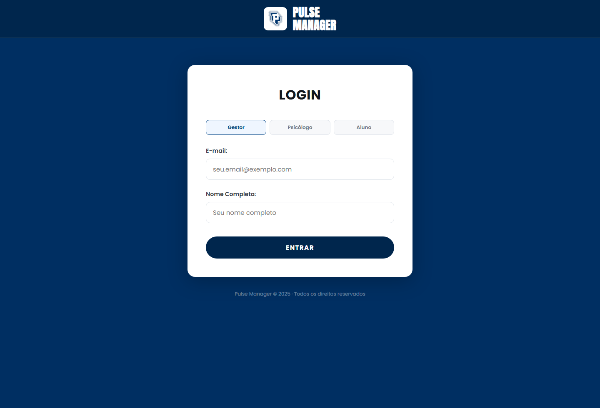<br>
<sub>Fonte: Autoria própria (2026).</sub>
</div>

<br>

### 4.3.1. Refinamentos e adições desde a Sprint 4

<div align="justify">

O principal avanço da Sprint 5 foi a troca do comportamento estático por fluxos integrados com o backend. A camada de comunicação do frontend foi centralizada em `src/frontend/js/services/api.js`, que passou a resolver a URL da API a partir de `src/frontend/js/config.js`, montar query strings, padronizar headers JSON, tratar falhas de rede, interpretar respostas não JSON e expor operações de download/importação. Com isso, as páginas deixaram de depender de dados simulados fixos e passaram a consumir endpoints reais de dashboard, alunos, agenda, jornada, comunicação, histórico psicológico e apoio psicológico.

No frontend, os cards da Sprint 5 relacionados à integração e organização das SPAs resultaram na atualização dos fluxos de Gestor, Psicólogo e Aluno. Foram integrados dashboards reais, lista de alunos, agenda com CRUD da API, perfil do aluno, histórico psicológico, aba de comunicação e estados reutilizáveis de carregamento, vazio e erro. Também foram removidos botões sem funcionalidade, ajustados contrastes, padronizada a paleta institucional e corrigidos detalhes de responsividade, sidebar e componentes visuais. Esses refinamentos correspondem especialmente aos cards de padronização visual (#345 e #346), integração real de dashboards e SPAs (#337), cliente HTTP central (#303), remoção de `fetch` direto (#327), headers de autenticação (#308) e integração dos fluxos principais (#311 a #316).

</div>

<div align="center">

<sup>Figura 57: Dashboard do Gestor consumindo indicadores reais da API após autenticação.</sup><br>
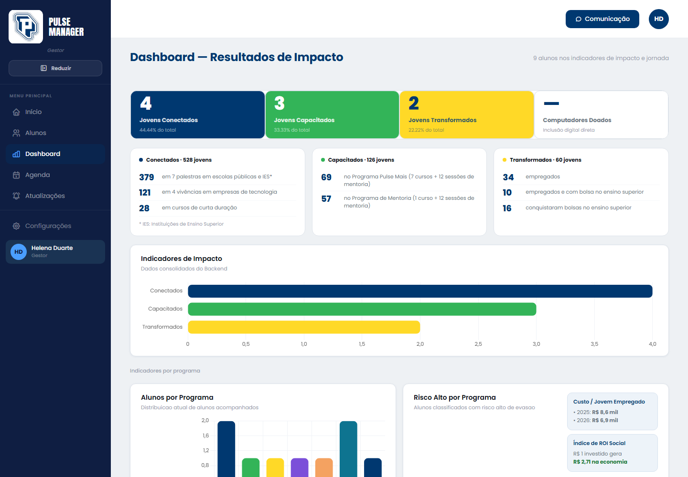<br>
<sub>Fonte: Autoria própria (2026).</sub>
</div>

<br>

<div align="justify">

No backend, a versão final acrescentou ou estabilizou funcionalidades que estavam pendentes no fechamento da Sprint 4. A importação e exportação de alunos por CSV foi implementada em `importacaoRoutes.ts`, `importacaoController.ts`, `importacaoService.ts` e `importacaoRepository.ts`, com normalização de campos, aceitação do modelo de planilha do parceiro, geração de e-mails de fallback e atualização de alunos existentes por e-mail ou CPF. O dashboard psicológico passou a retornar resumo real por psicólogo, com total de atendimentos, alunos acompanhados, labels e evolução de registros. O fluxo de solicitação de apoio psicológico foi disponibilizado para o aluno e a listagem dessas solicitações foi restringida ao psicólogo. A lógica fuzzy de risco de evasão também foi consolidada em `riscoEvasaoService.ts`, recalculando classificação, probabilidade, confiabilidade e fatores explicativos a partir de frequência, participação, notas e engajamento.

Também foram aplicadas refatorações de qualidade e padronização de contrato. Os controllers passaram a responder de forma mais uniforme com `{ success, data, message }`, as validações de payload e limites de caracteres foram reforçadas, o tratamento de exceções foi centralizado no `errorMiddleware` e o README da raiz foi atualizado com instruções de instalação, configuração, execução, migrations, seed, testes e credenciais de acesso. A suíte de testes foi estabilizada com Jest para services/endpoints e Playwright para os fluxos autenticados de ponta a ponta.

</div>

### 4.3.2. Autenticação e autorização entregues

<div align="justify">

A autenticação final foi implementada sem senha e sem token assinado, em alinhamento com a restrição do TAPI de não adotar autenticação tradicional. O endpoint `POST /api/auth/login`, definido em `authRoutes.ts`, recebe `email`, `nome` e `perfil`; o `AuthService` valida formato de e-mail, tamanho mínimo do nome e perfil permitido; em seguida, o `UsuarioRepository` consulta as tabelas de alunos, psicólogos e membros da equipe para confirmar se existe um cadastro compatível com as credenciais informadas. Quando a autenticação é bem-sucedida, o backend retorna os dados mínimos do usuário autenticado.

No navegador, `login.js` salva o usuário em `sessionStorage` como `pulseUser` e redireciona para a SPA correspondente: `gestorApp.html`, `psicologoApp.html` ou `alunoApp.html`. A partir desse ponto, o cliente HTTP central (`api.js`) injeta automaticamente `x-user-id`, `x-user-role` e `x-user-name` em todas as chamadas feitas pela aplicação. No backend, o `authMiddleware` lê esses headers e popula `req.usuario`; o `permissionMiddleware`, por sua vez, aplica o RBAC definido em `permissions.ts`.

As rotas protegidas na versão final incluem o dashboard e o desempenho do psicólogo, a importação/exportação de CSV, a solicitação de apoio psicológico pelo aluno e a listagem de solicitações pelo psicólogo. O portal do aluno também valida se o `idAluno` da rota corresponde ao usuário autenticado antes de retornar perfil, contato ou notificações. Essa arquitetura mantém a autorização no backend, evitando que a interface seja a fonte final de decisão de acesso.

</div>

<div align="center">

<sup>Figura 58: Dashboard do Psicólogo carregado por rota autorizada para o perfil `psicologo`.</sup><br>
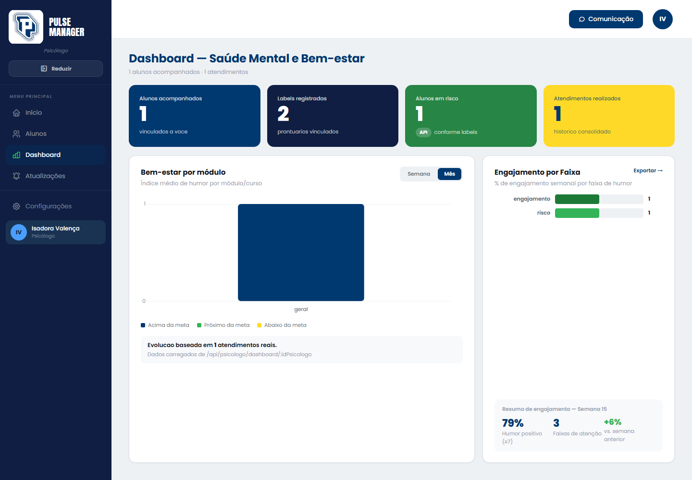<br>
<sub>Fonte: Autoria própria (2026).</sub>
</div>

<br>

<div align="center">

<sup>Figura 59: Portal do Aluno com fluxo autenticado de solicitação de apoio psicológico.</sup><br>
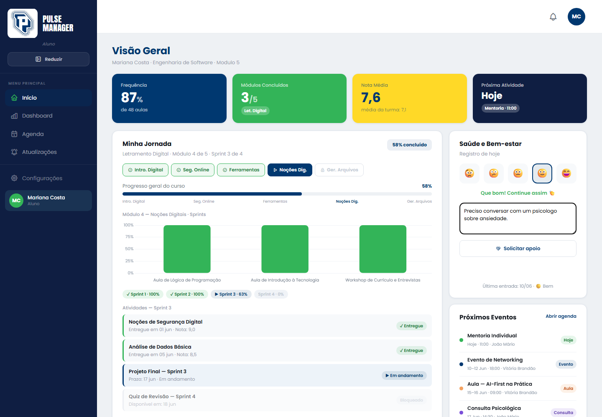<br>
<sub>Fonte: Autoria própria (2026).</sub>
</div>

<br>

### 4.3.3. Estratégias de resiliência e validação final

<div align="justify">

A resiliência entregue concentrou-se em três frentes práticas. No backend, o `errorMiddleware` centraliza exceções inesperadas e evita vazamento de stack trace ao cliente, enquanto os controllers convertem erros de negócio em respostas HTTP previsíveis. No frontend, o `api.js` diferencia falhas de rede, respostas HTML inesperadas e erros de negócio retornados pela API, permitindo que as telas exibam estados de erro sem quebrar a navegação. Nas SPAs, os estados reutilizáveis de carregamento, vazio e erro foram aplicados aos dashboards, listas e fluxos integrados.

A validação final foi apoiada por testes automatizados. A suíte Jest cobre services e endpoints de integração, enquanto `src/tests/e2e/integracao-final.spec.ts` valida login por perfil, navegação nas SPAs, carregamento de dashboards reais, lista de alunos, agenda do aluno, solicitação de apoio sem duplo envio e comportamento visual diante de falhas simuladas da API. Esse teste E2E fecha a pendência registrada na Sprint 4 de validar a integração ponta a ponta.

</div>

### 4.3.4. Pendências remanescentes

<div align="justify">

Apesar do fechamento funcional do MVP, algumas pendências técnicas permanecem registradas para evolução posterior:

- A autenticação ainda não utiliza senha, hash criptográfico, JWT, cookie assinado, expiração de sessão ou `SESSION_SECRET`, pois a implementação seguiu a restrição acadêmica do TAPI. Em produção, seria necessário adotar sessão assinada ou token com expiração e política de revogação.
- As rotas de agenda e saúde mental ainda não aplicam `requirePermission` diretamente. Elas já possuem validação de perfil nos services, mas a cobertura deve ser padronizada futuramente para RBAC uniforme em todos os módulos sensíveis.
- A autorização do portal do aluno valida o vínculo pelo `idAluno`, mas ainda depende dos headers enviados pelo cliente. Uma autenticação assinada reduziria o risco de manipulação manual desses headers.
- A suíte E2E cobre os principais fluxos integrados, mas ainda pode ser ampliada para importação/exportação CSV via interface, testes negativos de permissão em todos os perfis e execução em múltiplos navegadores/dispositivos.
- A publicação em ambiente externo exige conferir a substituição de `__PULSE_API_BASE_URL__`, variáveis de ambiente, HTTPS e banco persistente, pois os prints e os testes finais desta seção foram executados em ambiente local controlado.

</div>

### 4.3.5. Dificuldades técnicas enfrentadas

<div align="justify">

A maior dificuldade técnica foi integrar telas originalmente estáticas a uma API real sem quebrar o comportamento visual já aprovado. Isso exigiu criar um cliente HTTP central, remover chamadas `fetch` dispersas, preservar contratos de dados entre frontend e backend e tratar estados intermediários que antes não existiam, como carregamento, falha de rede e lista vazia.

Outra dificuldade foi equilibrar segurança e restrição de escopo. Como não era permitido implementar autenticação tradicional com senha, a equipe precisou construir um modelo intermediário baseado em e-mail, nome e perfil, complementado por RBAC no backend. Essa solução atendeu ao MVP, mas demandou cuidado para explicitar os trade-offs e evitar que a sessão no frontend fosse confundida com autenticação forte.

Também houve complexidade na estabilização dos dados e dos testes. A mesma aplicação precisava rodar com Supabase/PostgreSQL no ambiente principal, com `sqljs` nos testes e com seed local suficiente para demonstrar fluxos reais. A integração E2E exigiu sincronizar backend, servidor estático, credenciais de teste, dados de agenda, histórico psicológico, dashboard e solicitações de apoio. Por fim, os trabalhos paralelos em múltiplas branches geraram conflitos em arquivos compartilhados como `wad.md`, `README.md`, rotas, CSS e scripts das SPAs, exigindo revisões finais para manter consistência entre código, documentação e evidências visuais.

</div>

# <a name="c5"></a>5. Testes

## 5.1. Relatório de testes automatizados 

Os testes automatizados do backend foram implementados com **Jest**, contemplando duas abordagens complementares:

- **_White-box_** — testes unitários de Service que exercitam ramos internos, exceções e regras de negócio com conhecimento da implementação.
- **_Black-box_** — testes de integração dos endpoints via Jest + Supertest, verificando o contrato HTTP, status code, body e efeitos observáveis sem depender da implementação interna.

### 5.1.1 Estratégia de Testes
<div align="justify">

A suíte de testes automatizados da aplicação combina testes de integração via Supertest e testes unitários de Service. Os testes de integração cobrem de forma unificada as camadas de Controller, Service e Repository em cada requisição, enquanto os testes unitários de Service validam regras de negócio de forma isolada, com repositories e integrações externas mockadas. Essa combinação permite verificar tanto o contrato HTTP dos endpoints quanto os ramos internos mais relevantes da camada de negócio.

**Tipos de teste implementados**

A suíte é organizada em três tipos, diferenciados pelo nível de isolamento e pelo uso de mocks:

- **Tipo 1 - Testes unitários de Service:** validação isolada da camada de `services/`, sem acesso a banco de dados real, Supabase, PostgreSQL, rotas ou controllers. As dependências externas, como repositories e integrações de auditoria, são simuladas por mocks com `jest.fn()`, com tipagem explícita via o helper `asMockedDependency<T>()`.
- **Tipo 2 - Integração pura:** banco em memória, requisição HTTP real e nenhum mock. O arquivo `jornada.integration.test.ts` é um exemplo representativo desse tipo. Todos os efeitos observáveis - status HTTP, corpo da resposta e estado do banco - são verificados sem substituição de dependência interna.
- **Tipo 3 - Integração com mock de dependência externa:** mesmo setup do Tipo 2, com a diferença de que `jest.mock()` é aplicado exclusivamente sobre integrações externas, como serviços que fariam chamadas reais de rede em produção. O arquivo `segmentacao.integration.test.ts` representa esse tipo: banco, HTTP, Controller, Service e Repository permanecem reais; apenas `registrarConsultaSegmentacao` é substituído por um `jest.fn()`.

**Scripts de execução**

A suíte expõe comandos separados no `package.json`, permitindo executar cada tipo de teste de forma independente:

| Comando | Escopo |
|---|---|
| `npm test` | Suíte completa (unitários + integração funcional) em série |
| `npm run test:unit` | Apenas testes unitários de Service |
| `npm run test:integration` | Apenas testes de integração de endpoints (testes de desempenho ignorados) |
| `npm run test:performance` | Apenas testes de desempenho marcados com `RNF-DES` |
| `npm run test:ci` | Suíte completa seguida dos testes de desempenho |

**Infraestrutura compartilhada**

Os helpers centralizados em `src/tests/helpers/` concentram a infraestrutura de teste, eliminando repetição de código entre os arquivos:

- **`databaseTestHelper.ts`**: expõe `setupIntegrationDatabase()`, `resetIntegrationDatabase()`, `teardownIntegrationDatabase()` e `getIntegrationRepository<T>()`, centralizando o ciclo de vida do banco in-memory para os testes de integração. A constante `NON_EXISTENT_ID` também é definida aqui para padronizar os cenários `404`.
- **`performanceTest.ts`**: expõe `performanceIt`, alias de `it` quando `RUN_PERFORMANCE_TESTS=true` e de `it.skip` caso contrário, separando a medição de desempenho da validação funcional principal.
- **`mockHelper.ts`**: provê `asMockedDependency<T>()` para injetar dependências mockadas nos testes unitários com tipagem explícita, eliminando o uso de `as any` nos mocks.

**Padrão de escrita - AAA**

Todos os casos de teste seguem o padrão Arrange, Act, Assert:

- **Arrange:** preparação dos dados necessários, seja por mocks nos testes unitários de Service, seja por inserção no banco in-memory nos testes de integração.
- **Act:** chamada direta do método de Service nos testes unitários ou disparo da requisição HTTP via `request(app)` nos testes de integração.
- **Assert:** verificação do retorno, das exceções esperadas, do status code, do corpo da resposta e, quando aplicável, dos parâmetros recebidos pelas dependências mockadas.

**Determinismo e isolamento**

O determinismo da suíte de integração é garantido pelo mecanismo configurado em `connection.ts`, ativado automaticamente quando `NODE_ENV=test` - valor definido por `setup.js` antes de qualquer teste, referenciado em `jest.config.ts` via `setupFiles`. Nesse modo, a aplicação instancia um DataSource com `type: 'sqljs'` - banco SQLite compilado em WebAssembly que existe exclusivamente em memória durante a execução do Jest, sem dependência de servidor externo.

O ciclo de vida do banco é gerenciado pelo helper `databaseTestHelper.ts`, eliminando a repetição manual de `initializeDatabase()`, `AppDataSource.synchronize(true)` e `AppDataSource.destroy()` em cada arquivo. O padrão adotado em todos os testes de integração é:

```ts
beforeAll(async () => {
  await setupIntegrationDatabase();
  repository = getIntegrationRepository(Entidade);
});

beforeEach(async () => {
  await resetIntegrationDatabase();
});

afterAll(teardownIntegrationDatabase);
```

A chamada `resetIntegrationDatabase()` executa `AppDataSource.synchronize(true)` internamente, dropando e recriando todas as tabelas antes de cada caso de teste individual, garantindo isolamento completo entre execuções.

Esse mecanismo impõe quatro regras de isolamento observadas em toda a suíte:

- **Independência de ordem:** nenhum teste depende de estado deixado por outro; a ordem de execução não afeta os resultados.
- **Sem rede externa:** toda dependência que faria chamada real de rede é substituída por `jest.fn()`, impedindo falhas causadas por indisponibilidade de serviços externos.
- **Sem dependência de relógio:** valores de data e hora são sempre definidos explicitamente no Arrange, nunca inferidos de `new Date()` em tempo de execução.
- **Sem dados residuais:** cada teste é responsável por inserir ou mockar os próprios dados; nenhum assume a existência de registros criados por outros testes ou por execuções anteriores.

</div>

### 5.1.2 Testes Unitários de Service
<div align="justify">

Os testes unitários de Service foram organizados em `src/tests/unit/services`, seguindo o padrão de nomenclatura `*.service.test.ts`. O objetivo foi validar os principais comportamentos dos services ligados aos endpoints ativos do backend, contemplando cenários de sucesso, erros de validação, regras de negócio, conflitos, registros inexistentes e chamadas corretas aos repositories mockados. Os mocks são construídos com o helper `asMockedDependency<T>()`, que substitui o uso de `as any` por injeção explicitamente tipada:

```ts
service = new AgendaService(asMockedDependency<AgendaRepository>(repository));
```

| Service testado | Arquivo de teste | Quantidade de testes | Principais responsabilidades validadas |
| --- | --- | ---: | --- |
| `AlunoService` | `src/tests/unit/services/aluno.service.test.ts` | 16 | Cadastro, listagem, busca, atualização, inativação, validação de email, idade, data, duplicidade e risco de evasão. |
| `SegmentacaoService` | `src/tests/unit/services/segmentacao.service.test.ts` | 9 | Segmentação de alunos, validação de filtros, limite máximo, status, risco de evasão, busca e auditoria. |
| `DashboardService` | `src/tests/unit/services/dashboard.service.test.ts` | 14 | Cálculo de indicadores de impacto, jornada, evasão, risco, empregabilidade, conclusão, ensino superior, agrupamento por programa e auditoria. |
| `JornadaService` | `src/tests/unit/services/jornada.service.test.ts` | 23 | Consolidação da jornada, frequência, participação em eventos, empregabilidade, ensino superior e anotações qualitativas. |
| `AgendaService` | `src/tests/unit/services/agenda.service.test.ts` | 12 | Listagem, criação, atualização e cancelamento de agenda, validação de datas, perfil gestor, tipo de usuário e registros inexistentes. |
| `NotificacaoService` | `src/tests/unit/services/notificacao.service.test.ts` | 15 | Listagem e criação de notificações, oportunidades, validação de aluno destinatário, tipos, remetente, perfil, datas e campos obrigatórios. |
| `PortalAlunoService` | `src/tests/unit/services/portal-aluno.service.test.ts` | 13 | Visualização de perfil, atualização de contato, normalização de email/telefone, permissões de notificações e oportunidades do portal. |
| `SaudeMentalService` | `src/tests/unit/services/saude-mental.service.test.ts` | 11 | Prontuários, labels, restrição ao perfil psicólogo, validação de aluno, tipo de label, título, observação e descrição. |
| `RiscoEvasaoService` | `src/tests/unit/services/risco-evasao.service.test.ts` | 6 | Funções de pertinência, classificação, ausência de dados, confiabilidade com poucos registros e persistência seletiva no recálculo em lote. |
| `ImportacaoService` | `src/tests/unit/services/importacao.service.test.ts` | 5 | Importação de CSV com alunos novos, atualização por email, rejeição de email inválido, geração automática de email técnico quando não informado e consolidação de linhas no modelo de planilha do parceiro. |
| **Total (Services)** | **10 arquivos** | — | **Cobertura unitária das principais regras de negócio da camada de Service, incluindo o motor fuzzy e o módulo de importação.** |

**AlunoService**

Os testes do `AlunoService` validam listagem com filtros, cadastro com payload válido, normalização de email, rejeição de nome, email, idade e data de ingresso inválidos, bloqueio de email duplicado, busca de perfil existente, tratamento de aluno inexistente, atualização de aluno, rejeição de atualização inválida e inativação de aluno.

**SegmentacaoService**

Os testes do `SegmentacaoService` validam segmentação com critério válido, retorno de total e filtros aplicados, rejeição de segmentação sem critérios, validação de limite, status e risco de evasão, validação de busca com menos de três caracteres e registro de auditoria da consulta.

**DashboardService**

Os testes do `DashboardService` verificam cálculo de resumo de impacto, percentuais com duas casas decimais, retorno de percentual zero quando não há alunos, agrupamento por programa, resumo de jornada, identificação de alunos evadidos, indicadores de empregabilidade, conclusão de programas, acesso ao ensino superior, resumo de evasão e risco, validação de filtros e registro de auditoria.

**JornadaService**

Os testes do `JornadaService` cobrem validação de ID de aluno, tratamento de aluno inexistente, consolidação dos dados da jornada, frequências de aula, participações em eventos, anotações qualitativas, criação e atualização de frequência, rejeição de frequência para atividade que não seja aula, validação de nota e data, bloqueio de duplicidade em eventos, atualização de empregabilidade e ensino superior.

**AgendaService**

Os testes do `AgendaService` validam listagem com filtros, validação de datas, rejeição de intervalo inválido, criação de item apenas para perfil gestor, rejeição de criação para perfil não autorizado, validação de tipo de usuário e registro, aplicação de status padrão, atualização, cancelamento e tratamento de item inexistente.

**NotificacaoService**

Os testes do `NotificacaoService` validam listagem geral, listagem por aluno, criação de notificação, rejeição para aluno inexistente, validação de tipo de notificação, tipo de remetente, restrição de remetente psicólogo, validação de data de envio, título, mensagem, nome do remetente, listagem e criação de oportunidades.

**PortalAlunoService**

Os testes do `PortalAlunoService` validam visualização do perfil do aluno, tratamento de aluno inexistente, atualização de contato, normalização de email, tratamento de telefone, rejeição de email inválido, rejeição de atualização sem dados, listagem de notificações do próprio aluno, bloqueio de acesso cruzado e listagem de oportunidades.

**SaudeMentalService**

Os testes do `SaudeMentalService` validam listagem de prontuários apenas para perfil psicólogo, bloqueio de perfil não autorizado, criação de prontuário, rejeição de prontuário para aluno inexistente, validação de título e observação, listagem de labels, criação de label, validação de tipo de label, rejeição de label para aluno inexistente e validação da descrição.

**Cobertura da camada Service**

O relatório de cobertura foi gerado com o comando:

```bash
npm run test:unit -- --coverage --collectCoverageFrom="src/backend/services/*.ts"
```

Resultado obtido:

```text
-----------------------|---------|----------|---------|---------|
File                   | % Stmts | % Branch | % Funcs | % Lines |
-----------------------|---------|----------|---------|---------|
All files              |   83.42 |    70.56 |    88.7 |   83.49 |
 agendaService.ts      |     100 |      100 |     100 |     100 |
 alunoService.ts       |   75.22 |    56.97 |   93.33 |   76.41 |
 authService.ts        |       0 |        0 |       0 |       0 |
 codigoPmService.ts    |       0 |        0 |       0 |       0 |
 dashboardService.ts   |   96.55 |       88 |   97.29 |      96 |
 desempenhoService.ts  |       0 |        0 |       0 |       0 |
 jornadaService.ts     |   89.89 |    76.81 |   94.73 |   89.89 |
 notificacaoService.ts |     100 |      100 |     100 |     100 |
 portalAlunoService.ts |   96.29 |       90 |     100 |   96.29 |
 riscoEvasaoService.ts |   86.53 |    78.94 |   91.66 |    87.5 |
 saudeMentalService.ts |     100 |      100 |     100 |     100 |
 segmentacaoService.ts |    93.1 |    77.77 |     100 |    93.1 |
-----------------------|---------|----------|---------|---------|

Test Suites: 11 passed, 11 total
Tests:       126 passed, 126 total
```

A cobertura geral da camada `services/` atingiu **83,42% de statements**, **83,49% de linhas** e **88,7% de funções**, superando o limiar mínimo de 80%. Os três arquivos com cobertura zero (`authService.ts`, `codigoPmService.ts`, `desempenhoService.ts`) são services auxiliares ou de infraestrutura que não possuem testes unitários dedicados nesta suíte; os services diretamente vinculados aos endpoints ativos da aplicação estão todos com cobertura acima de 75%, e cinco deles atingiram 100% em todas as métricas.

**RiscoEvasaoService**

Os testes do `RiscoEvasaoService` verificam a classificação de cenários de baixo e alto risco, os limites de 40% e 70%, a preservação de alunos sem dados quantitativos, a redução de confiabilidade quando há somente um registro e a persistência exclusiva dos resultados que possuem dados calculáveis.

**ImportacaoService**

Os testes do `ImportacaoService` validam a importação de alunos novos a partir de CSV, a atualização de aluno já cadastrado pelo email, a rejeição de linhas com email em formato inválido, a geração automática de email técnico quando o campo não é preenchido na planilha, e a consolidação de múltiplas linhas de um mesmo aluno no modelo de planilha enviado pelo parceiro, incluindo normalização de email, telefone, data de ingresso, programa, categoria e origem de participação.

**Testes unitários de Frontend**

Além dos testes de Service, a suíte unitária cobre módulos do frontend por meio de execução via `vm.runInNewContext`, isolando os scripts JavaScript do navegador sem dependência de DOM real. Os quatro arquivos estão em `src/tests/unit/frontend/`.

| Módulo testado | Arquivo de teste | Quantidade de testes | Principais responsabilidades validadas |
| --- | --- | ---: | --- |
| `PulseUiState` | `src/tests/unit/frontend/ui-state.test.ts` | 3 | Renderização de estados de loading, erro, sucesso e vazio; normalização de mensagens de erro; identificação de coleções vazias. |
| Integrações de comunicação e configuração | `src/tests/unit/frontend/integracoes-parciais.test.ts` | 6 | Presença das integrações de listagem de alunos (`data.alunos`), comunicações e oportunidades; carregamento da central de comunicação nos portais de gestor e psicólogo; configurações compartilhadas nos três portais; restrição de programas no formulário do gestor. |
| Dashboard do gestor | `src/tests/unit/frontend/dashboard-gestor.test.ts` | 2 | Carregamento dos resumos de impacto e jornada via `PulseApi`, atualização de cards e gráficos Chart.js e exibição de feedback de erro quando a API falha. |
| Dados visuais da sessão | `src/tests/unit/frontend/session-user.test.ts` | 2 | Extração de nome, perfil e iniciais a partir da sessão armazenada em `sessionStorage`; fallback para configuração estática quando não há sessão ativa. |

**Total geral de testes unitários: 14 suítes, 140 testes.**

</div>

### 5.1.3 Testes de Integração de Endpoints
<div align="justify">

Os testes de integração cobrem os endpoints principais da aplicação por meio de requisições HTTP reais via Supertest, com banco SQLite in-memory. Para cada endpoint, a cobertura segue quatro cenários-chave: sucesso (`200`/`201`), falha de validação (`400`/`422`), regra de negócio violada (`409`/`422`/`403`) e recurso não encontrado (`404`). Quando um cenário é marcado como N/A, significa que aquela categoria de erro não se aplica à lógica do endpoint - não é um gap de cobertura.

A suíte de integração totaliza **179 testes funcionais distribuídos em 16 arquivos**, todos executados via `npm run test:integration` sem falhas. Cada arquivo que cobre um endpoint com requisito de desempenho contém adicionalmente um caso `performanceIt` (marcado com `RNF-DES`), totalizando **8 testes de desempenho** executados separadamente via `npm run test:performance`.

**Módulo: Alunos**

| Endpoint | 200/201 | 400/422 validação | 409/422/403 regra | 404 |
|---|---|---|---|---|
| `POST /api/alunos` | ✅ | ✅ email inválido, idade > 120 | ✅ 409 email duplicado | N/A |
| `GET /api/alunos` | ✅ | N/A | N/A | N/A |
| `GET /api/alunos/:id` | ✅ | ✅ id não numérico | N/A | ✅ |
| `PATCH /api/alunos/:id` | ✅ | ✅ riscoEvasao inválido | N/A | ✅ |
| `DELETE /api/alunos/:id` | ✅ | N/A | N/A | ✅ |
| `GET /api/alunos/segmentacao` | ✅ | ✅ limite, risco, busca | ✅ 422 sem critério | N/A |

**Módulo: Jornada**

| Endpoint | 200/201 | 400/422 validação | 409/422/403 regra | 404 |
|---|---|---|---|---|
| `GET /api/jornada/alunos/:id` | ✅ | ✅ id não numérico | N/A | ✅ |
| `POST /api/frequencias` | ✅ | ✅ nota > 10 | ✅ 422 atividade não é aula | ✅ |
| `POST /api/participacoes` | ✅ | ✅ idAtividade inválido | ✅ 409 duplicado, 422 tipo | ✅ |
| `PATCH /api/empregabilidade/:id` | ✅ | ✅ ocupacao, rendaMensal | N/A | ✅ |
| `PATCH /api/ensino-superior/:id` | ✅ | ✅ escolaridade, dataIngresso | N/A | ✅ |
| `POST /api/anotacoes-qualitativas` | ✅ | ✅ descricao, dataRegistro | N/A | ✅ |

**Módulo: Agenda**

| Endpoint | 200/201 | 400/422 validação | 409/422/403 regra | 404 |
|---|---|---|---|---|
| `GET /api/agenda` | ✅ | ✅ formato dataInicio | ✅ 422 intervalo inválido | N/A |
| `POST /api/agenda` | ✅ | ✅ tipoUser, formato data | ✅ 422 sem perfil gestor | N/A |
| `PATCH /api/agenda/:id` | ✅ | ✅ id não numérico | ✅ 422 sem permissão | ✅ |
| `DELETE /api/agenda/:id` | ✅ | N/A | ✅ 422 sem perfil gestor | ✅ |

**Módulo: Dashboard**

| Endpoint | 200/201 | 400/422 validação | 409/422/403 regra | 404 |
|---|---|---|---|---|
| `GET /api/impacto/resumo` | ✅ | ✅ formato dataInicio | ✅ 422 intervalo inválido | N/A |
| `GET /api/jornada/resumo` | ✅ | ✅ formato dataInicio | ✅ 422 intervalo inválido | N/A |
| `GET /api/impacto/conclusao-programas` | ✅ | ✅ categoria < 3 chars | ✅ 422 intervalo inválido | N/A |
| `GET /api/impacto/alunos-empregados` | ✅ | ✅ formato dataFim | ✅ 422 intervalo inválido | N/A |
| `GET /api/impacto/acesso-ensino-superior` | ✅ | ✅ programa < 3 chars | ✅ 422 intervalo inválido | N/A |
| `GET /api/jornada/evasao-risco` | ✅ | ✅ formato dataInicio | ✅ 422 intervalo inválido | N/A |

**Módulo: Motor Fuzzy de Risco de Evasão**

| Cenário | Resultado esperado |
|---|---|
| Aluno com 80% de faltas e nota 4 em 5 aulas | Risco classificado como `alto`, `probabilidadeEvasao ≥ 70` persistido no banco |
| Aluno sem participações nem notas registradas | Classificação anterior preservada, `probabilidadeEvasao` permanece `null` |

**Módulo: Autenticação**

| Endpoint | 200/201 | 400/422 validação | 409/422/403 regra | 404 |
|---|---|---|---|---|
| `POST /api/auth/login` | ✅ aluno, psicólogo, gestor; login com nome divergente aceito | ✅ email inválido, perfil inválido | ✅ 403 perfil não corresponde ao cadastro | ✅ email não encontrado |

**Módulo: Apoio Psicológico**

| Endpoint | 200/201 | 400/422 validação | 409/422/403 regra | 404 |
|---|---|---|---|---|
| `POST /api/apoio/solicitar` | ✅ | ✅ mensagem < 10 chars; idAluno no body (spoofing) | N/A | N/A |
| `GET /api/apoio/solicitacoes` | ✅ apenas pendentes do psicólogo autenticado | N/A | N/A | N/A |

**Módulo: Dashboard Psicológico**

| Endpoint | 200/201 | 400/422 validação | 409/422/403 regra | 404 |
|---|---|---|---|---|
| `GET /api/psicologo/dashboard/:id` | ✅ dados filtrados por psicólogo; zeros para psicólogo sem registros | N/A | ✅ 403 acesso ao dashboard de outro psicólogo | N/A |

**Módulo: Comunicação**

| Endpoint | 200/201 | 400/422 validação | 409/422/403 regra | 404 |
|---|---|---|---|---|
| `GET /api/comunicacao` | ✅ | N/A | N/A | N/A |
| `POST /api/comunicacao` | ✅ | ✅ tipo, tipoRemetente, dataEnvio | ✅ 403 psicólogo | ✅ |
| `GET /api/comunicacao/oportunidades` | ✅ | N/A | N/A | N/A |
| `POST /api/comunicacao/oportunidades` | ✅ | ✅ tipo, prazoInscricao | N/A | N/A |

**Módulo: Portal do Aluno**

| Endpoint | 200/201 | 400/422 validação | 409/422/403 regra | 404 |
|---|---|---|---|---|
| `GET /api/portal/alunos/:id` | ✅ | ✅ id não numérico | N/A | ✅ |
| `PATCH /api/portal/alunos/:id/contato` | ✅ | ✅ email inválido, nenhum campo informado | N/A | ✅ |
| `GET /api/portal/alunos/:id/notificacoes` | ✅ | ✅ id não numérico | ✅ 403 aluno cruzado | ✅ |
| `GET /api/portal/oportunidades` | ✅ | N/A | N/A | N/A |

**Módulo: Saúde Mental**

| Endpoint | 200/201 | 400/422 validação | 409/422/403 regra | 404 |
|---|---|---|---|---|
| `GET /api/prontuarios` | ✅ | N/A | ✅ 422 sem perfil | N/A |
| `POST /api/prontuarios` | ✅ | ✅ titulo, observacao ausentes | ✅ 422 sem perfil | ✅ |
| `GET /api/labels` | ✅ | N/A | ✅ 422 sem perfil | N/A |
| `POST /api/labels` | ✅ | ✅ tipoLabel inválido | ✅ 422 sem perfil | ✅ |
| `GET /api/psicologo/alunos/:id/desempenho` | ✅ | ✅ id não numérico | ✅ 403 sem vínculo | ✅ |

**Testes de desempenho (RNF-DES)**

Os testes de desempenho são marcados com `performanceIt` dentro dos próprios arquivos de integração e executados apenas quando `RUN_PERFORMANCE_TESTS=true`. Cada caso mede o tempo de resposta de um endpoint crítico e verifica se o limiar do requisito não funcional é respeitado.

| Identificador | Endpoint | Limiar |
|---|---|---|
| `RNF-DES` | `GET /api/agenda` | ≤ 1000 ms |
| `RNF-DES-UC04` | `GET /api/alunos` | ≤ 1500 ms |
| `RNF-DES-UC14` | `GET /api/impacto/resumo` | ≤ 3000 ms |
| `RNF-DES-UC07` | `GET /api/jornada/alunos/:id` | ≤ 1500 ms |
| `RNF-DES-RF019` | `GET /api/comunicacao` | ≤ 1000 ms |
| `RNF-DES-UC01` | `GET /api/portal/alunos/:id` | ≤ 1000 ms |
| `RNF-DES-UC20` | `GET /api/prontuarios` | ≤ 1000 ms |
| `RNF-DES-UC13` | `GET /api/alunos/segmentacao` | ≤ 2000 ms |

</div>

### 5.1.4 Evidências de Execução dos Testes
<div align="justify">

As evidências de execução dos testes foram registradas a partir da execução local da suíte automatizada com Jest, após a reformulação da infraestrutura de testes.

| Evidência | Comando executado | Escopo validado | Resultado |
|---|---|---|---|
| Testes unitários (services + frontend) | `npm run test:unit -- --silent` | Validação isolada das regras de negócio dos services e dos módulos de frontend, com dependencies mockadas via `asMockedDependency` e `vm.runInNewContext`. | 14 suítes executadas, 140 testes aprovados. |
| Testes de integração de endpoints | `npm run test:integration -- --silent` | Validação de endpoints via Supertest com banco in-memory; testes de desempenho ignorados nessa execução. | 16 suítes executadas, 179 testes aprovados, 8 ignorados. |
| Testes de desempenho | `npm run test:performance -- --silent` | Execução dos 8 casos `RNF-DES` que medem tempo de resposta dos endpoints críticos. | 8 testes de desempenho aprovados. |

**Evidência 1 - Testes unitários (services + frontend)**

```bash
npm run test:unit -- --silent
```

Resultado obtido:

```text
PASS src/tests/unit/services/aluno.service.test.ts
PASS src/tests/unit/services/segmentacao.service.test.ts
PASS src/tests/unit/services/importacao.service.test.ts
PASS src/tests/unit/frontend/integracoes-parciais.test.ts
PASS src/tests/unit/services/jornada.service.test.ts
PASS src/tests/unit/services/notificacao.service.test.ts
PASS src/tests/unit/services/portal-aluno.service.test.ts
PASS src/tests/unit/services/dashboard.service.test.ts
PASS src/tests/unit/services/agenda.service.test.ts
PASS src/tests/unit/frontend/dashboard-gestor.test.ts
PASS src/tests/unit/services/saude-mental.service.test.ts
PASS src/tests/unit/frontend/ui-state.test.ts
PASS src/tests/unit/services/risco-evasao.service.test.ts
PASS src/tests/unit/frontend/session-user.test.ts

Test Suites: 14 passed, 14 total
Tests:       140 passed, 140 total
Snapshots:   0 total
```

Essa execução comprova que os 14 arquivos de testes unitários foram executados com sucesso: 10 arquivos de Service validando regras de negócio de `AlunoService`, `SegmentacaoService`, `DashboardService`, `JornadaService`, `AgendaService`, `NotificacaoService`, `PortalAlunoService`, `SaudeMentalService`, `RiscoEvasaoService` e `ImportacaoService` sem acesso a banco real ou infraestrutura externa; e 4 arquivos de Frontend validando `PulseUiState`, integrações de comunicação, dashboard do gestor e dados de sessão via `vm.runInNewContext`.

**Evidência 2 - Testes de integração de endpoints**

```bash
npm run test:integration -- --silent
```

Resultado obtido:

```text
PASS src/tests/integration/alunos.integration.test.ts
PASS src/tests/integration/dashboard.integration.test.ts
PASS src/tests/integration/jornada.integration.test.ts
PASS src/tests/integration/notificacoes.integration.test.ts
PASS src/tests/integration/auth.integration.test.ts
PASS src/tests/integration/agenda.integration.test.ts
PASS src/tests/integration/desempenho-psicologo.integration.test.ts
PASS src/tests/integration/segmentacao.integration.test.ts
PASS src/tests/integration/saude-mental.integration.test.ts
PASS src/tests/integration/portal-aluno.integration.test.ts
PASS src/tests/integration/portal-aluno-notificacoes.integration.test.ts
PASS src/tests/integration/notificacao-psicologo.integration.test.ts
PASS src/tests/integration/psicologo-dashboard.integration.test.ts
PASS src/tests/integration/apoio-psicologico.integration.test.ts
PASS src/tests/integration/codigo-pm.integration.test.ts
PASS src/tests/integration/risco-evasao.integration.test.ts

Test Suites: 16 passed, 16 total
Tests:       179 passed, 8 skipped, 187 total
Snapshots:   0 total
```

Os 8 testes ignorados são os casos `performanceIt` (`RNF-DES`), que são convertidos em `it.skip` automaticamente quando `RUN_PERFORMANCE_TESTS` não está definido como `true`.

**Evidência 3 - Testes de desempenho**

```bash
npm run test:performance -- --silent
```

Resultado obtido:

```text
Test Suites: 8 passed, 8 total
Tests:       8 passed, 8 total
Snapshots:   0 total
```

Os 8 casos `RNF-DES` foram aprovados, verificando que os endpoints críticos respondem dentro dos limiares estabelecidos nos requisitos não funcionais de desempenho.

</div>

## 5.2. Testes de usabilidade 

### 5.2.1. Relatório de testes de guerrilha
<div align="justify">

Os testes de guerrilha foram realizados com 7 participantes voluntários, recrutados de forma informal entre estudantes das turmas T28 e T24 do Inteli. Cada participante executou individualmente as tarefas propostas, sem auxílio do avaliador, enquanto o observador registrava o resultado geral e o desempenho em cada etapa. O critério de sucesso adotado foi a conclusão autônoma da tarefa sem erros bloqueadores. As heurísticas de Nielsen foram utilizadas como referência para identificar os princípios de usabilidade relacionados a cada tarefa.

Ao todo, foram testadas 5 tarefas cobrindo os três perfis da aplicação (gestor, psicólogo e aluno). Todos os 7 participantes concluíram todas as tarefas com sucesso, o que indica boa adequação geral da interface às expectativas dos usuários. As ocorrências identificadas foram de baixa severidade e estão consolidadas ao final desta seção.

**Tarefa 1 — Filtrar alunos por curso**

Enunciado: Suponha que você é gestor(a) da Pulse Mais e quer encontrar alunos que cursam Sistemas de Informação para uma vaga específica. Utilize o sistema para filtrar alunos que cursam Sistemas de Informação.

Heurísticas relacionadas:
- **H4** — A linguagem e posição dos filtros devem seguir padrões esperados de sistemas similares.
- **H6** — O filtro por curso deve estar visível e acessível sem que o usuário precise memorizar onde ele está.

| # | Participante | Resultado da tarefa | Etapa 1: Fazer login como Gestor | Etapa 2: Abrir lista de alunos | Etapa 3: Selecionar filtro de curso |
|---|---|---|---|---|---|
| 1 | Fernanda T28 | ✅ Sucesso | ✅ | ✅ | ✅ |
| 2 | Sofia Brandão T28 | ✅ Sucesso | ✅ | ✅ | ✅ |
| 3 | Nicolas T28 | ✅ Sucesso | ✅ | ✅ | ✅ |
| 4 | Arthur Augusto T28 | ✅ Sucesso | ✅ | ✅ | ✅ |
| 5 | Felipe Estrada T28 | ✅ Sucesso | ✅ | ✅ | ✅ |
| 6 | Tainá T28 | ✅ Sucesso | ✅ | ✅ | ✅ |
| 7 | Manuela T24 | ✅ Sucesso | ✅ | ✅ | ✅ |

Taxa de sucesso: 7/7 (100%)

**Tarefa 2 — Adicionar evento**

Enunciado: Suponha que você é gestor(a) da Pulse Mais e quer marcar um evento com todos os alunos da Pulse Mais. Utilize o sistema para marcar um evento na agenda.

Heurísticas relacionadas:
- **H1** — O sistema deve confirmar claramente que o evento foi adicionado.
- **H3** — O usuário deve poder editar ou cancelar um evento após criá-lo, com saída de emergência clara.
- **H5** — Campos obrigatórios devem ser sinalizados antes do envio para evitar submissões incompletas.

| # | Participante | Resultado da tarefa | Etapa 1: Fazer login como Gestor | Etapa 2: Abrir agenda | Etapa 3: Adicionar dados do evento | Etapa 4: Adicionar registro |
|---|---|---|---|---|---|---|
| 1 | Fernanda T28 | ✅ Sucesso | ✅ | ✅ | ✅ | ✅ |
| 2 | Sofia Brandão T28 | ✅ Sucesso | ✅ | ✅ | ✅ | ✅ |
| 3 | Nicolas T28 | ✅ Sucesso | ✅ | ✅ | ✅ | ✅ |
| 4 | Arthur Augusto T28 | ✅ Sucesso | ✅ | ✅ | ✅ | ✅ |
| 5 | Felipe Estrada T28 | ✅ Sucesso | ✅ | ✅ | ✅ | ✅ |
| 6 | Tainá T28 | ✅ Sucesso | ✅ | ✅ | ✅ | ✅ |
| 7 | Manuela T24 | ✅ Sucesso | ✅ | ✅ | ✅ | ✅ |

Taxa de sucesso: 7/7 (100%)

**Tarefa 3 — Adicionar registro psicológico**

Enunciado: Suponha que você é Psicólogo da Pulse Mais e quer adicionar o registro de uma sessão ao perfil do aluno. Utilize o sistema para registrar o Histórico Psicológico.

Heurísticas relacionadas:
- **H2** — O termo "Histórico Psicológico" deve ser familiar ao psicólogo e refletir a linguagem da área clínica.
- **H4** — A aba de Histórico Psicológico deve ter posição e ícone consistentes com as demais abas do perfil do aluno.
- **H10** — Campos de registro psicológico podem exigir orientações sobre quais informações incluir, especialmente para novos usuários.

| # | Participante | Resultado da tarefa | Etapa 1: Fazer login como Psicólogo | Etapa 2: Abrir lista de alunos | Etapa 3: Abrir perfil do aluno | Etapa 4: Abrir aba de Histórico Psicológico | Etapa 5: Adicionar registro |
|---|---|---|---|---|---|---|---|
| 1 | Fernanda T28 | ✅ Sucesso | ✅ | ✅ | ✅ | ✅ | ✅ |
| 2 | Sofia Brandão T28 | ✅ Sucesso | ✅ | ✅ | ✅ | ✅ | ✅ |
| 3 | Nicolas T28 | ✅ Sucesso | ✅ | ✅ | ✅ | ✅ | ✅ |
| 4 | Arthur Augusto T28 | ✅ Sucesso | ✅ | ✅ | ✅ | ✅ | ✅ |
| 5 | Felipe Estrada T28 | ✅ Sucesso | ✅ | ✅ | ✅ | ✅ | ✅ |
| 6 | Tainá T28 | ✅ Sucesso | ✅ | ✅ | ✅ | ✅ | ✅ |
| 7 | Manuela T24 | ✅ Sucesso | ✅ | ✅ | ✅ | ✅ | ✅ |

Taxa de sucesso: 7/7 (100%)

Observação: A participante Manuela T24 concluiu a tarefa com sucesso, porém não registrou a Etapa 5 na planilha de tabulação; o resultado geral foi marcado como sucesso.

**Tarefa 4 — Visualizar evento**

Enunciado: Suponha que você é Aluno da Pulse Mais e quer visualizar um evento na sua agenda. Utilize o sistema para visualizar os detalhes deste evento.

Heurísticas relacionadas:
- **H1** — Deve ser claro para o aluno quais eventos são futuros, em andamento ou passados.
- **H6** — Os eventos devem ser visíveis diretamente na agenda sem que o aluno precise navegar por múltiplas telas.
- **H8** — Os detalhes do evento devem apresentar apenas informações relevantes (data, hora, descrição).

| # | Participante | Resultado da tarefa | Etapa 1: Fazer login como Aluno | Etapa 2: Abrir agenda | Etapa 3: Selecionar evento |
|---|---|---|---|---|---|
| 1 | Fernanda T28 | ✅ Sucesso | ✅ | ✅ | ✅ |
| 2 | Sofia Brandão T28 | ✅ Sucesso | ✅ | ✅ | ✅ |
| 3 | Nicolas T28 | ✅ Sucesso | ✅ | ✅ | ✅ |
| 4 | Arthur Augusto T28 | ✅ Sucesso | ✅ | ✅ | ✅ |
| 5 | Felipe Estrada T28 | ✅ Sucesso | ✅ | ✅ | ✅ |
| 6 | Tainá T28 | ✅ Sucesso | ✅ | ✅ | ✅ |
| 7 | Manuela T24 | ✅ Sucesso | ✅ | ✅ | ✅ |

Taxa de sucesso: 7/7 (100%)

**Tarefa 5 — Visualizar desempenho**

Enunciado: Suponha que você é Gestor da Pulse Mais e quer visualizar o desempenho de um aluno. Utilize o sistema para ver o perfil do aluno e seu desempenho.

Heurísticas relacionadas:
- **H1** — Os dados de desempenho devem ser exibidos de forma clara, com indicadores visuais (gráficos, percentuais) que facilitem a leitura rápida.
- **H2** — Métricas de desempenho devem usar terminologia familiar ao gestor educacional (ex.: frequência, progresso).
- **H6** — A aba de desempenho deve estar destacada no perfil do aluno, sem necessidade de memorizar onde está.

| # | Participante | Resultado da tarefa | Etapa 1: Fazer login como Gestor | Etapa 2: Selecionar lista de alunos | Etapa 3: Selecionar perfil do aluno | Etapa 4: Selecionar aba de desempenho |
|---|---|---|---|---|---|---|
| 1 | Fernanda T28 | ✅ Sucesso | ✅ | ✅ | ✅ | ✅ |
| 2 | Sofia Brandão T28 | ✅ Sucesso | ✅ | ✅ | ✅ | ✅ |
| 3 | Nicolas Deli T28 | ✅ Sucesso | ✅ | ✅ | ✅ | ✅ |
| 4 | Arthur Augusto T28 | ✅ Sucesso | ✅ | ✅ | ✅ | ✅ |
| 5 | Felipe Estrada T28 | ✅ Sucesso | ✅ | ✅ | ✅ | ✅ |
| 6 | Tainá T28 | ✅ Sucesso | ✅ | ✅ | ✅ | ✅ |
| 7 | Manuela T24 | ✅ Sucesso | ✅ | ✅ | ✅ | ✅ |

Taxa de sucesso: 7/7 (100%)

**Resumo das ocorrências**

A tabela abaixo consolida os problemas e observações identificados durante os testes, ordenados por prioridade de melhoria. Os níveis de severidade seguem a escala: 1 — cosmética, 2 — baixa, 3 — alta, 4 — catástrofe.

| Tarefa | Severidade | Resumo do ocorrido e potenciais melhorias | Participantes afetados |
|---|---|---|---|
| Filtragem de alunos | 1 - Cosmética | Problema de usabilidade: o participante achou a posição do filtro de cursos um pouco confusa. Potencial melhoria: destacar visualmente o campo de filtro por curso ou reposicioná-lo em local mais intuitivo. | Participante 1 |

**Considerações gerais**

Todos os 7 participantes concluíram as 5 tarefas com sucesso (taxa geral de 100%), sem ocorrências de severidade alta ou catastrófica. O único ponto de atenção identificado foi de severidade cosmética, referente à disposição do filtro de cursos na listagem de alunos. Os demais fluxos - adição de evento na agenda, registro psicológico, visualização de evento pelo aluno e visualização de desempenho pelo gestor - foram percorridos sem dificuldades por todos os participantes, o que indica boa aderência da interface às heurísticas de Nielsen avaliadas.

</div>

### 5.2.2. Relatório de testes SUS (System Usability Scale)

<div align="justify">

O teste SUS (System Usability Scale) foi utilizado como complemento ao teste de guerrilha realizado com a aplicação Pulse Manager. Enquanto o teste de guerrilha teve como objetivo verificar se os participantes conseguiam executar tarefas específicas sem auxílio do avaliador, o SUS teve como objetivo mensurar a percepção geral de usabilidade da interface após a interação com o sistema.

Os testes de guerrilha foram conduzidos com 7 participantes voluntários das turmas T28 e T24 do Inteli. Cada participante executou 5 tarefas relacionadas aos principais perfis da aplicação: gestor, psicólogo e aluno. As tarefas avaliadas foram: filtrar alunos por curso, adicionar evento, adicionar registro psicológico, visualizar evento e visualizar desempenho de aluno. Ao todo, foram realizadas 35 tentativas de tarefa, todas concluídas com sucesso, resultando em taxa geral de sucesso de 100%.

Após a execução dos fluxos, os participantes avaliaram a experiência de uso em escala de 1 a 5. As respostas registradas indicaram uma percepção positiva da aplicação, com notas 4 e 5 distribuídas nos itens positivos do questionário e discordância nos itens negativos. Esse resultado reforça que, além de conseguirem concluir as tarefas propostas, os usuários relataram boa experiência geral com a interface.

</div>

#### Método de aplicação

<div align="justify">

A aplicação do SUS ocorreu após a realização das tarefas do teste de guerrilha, para que a percepção dos participantes sobre a interface ainda estivesse recente. Cada participante respondeu às afirmativas considerando uma escala de 1 a 5, em que:

</div>

| Valor | Significado |
|---|---|
| 1 | Discordo totalmente |
| 2 | Discordo parcialmente |
| 3 | Neutro |
| 4 | Concordo parcialmente |
| 5 | Concordo totalmente |

<div align="justify">

As avaliações obtidas indicaram alto grau de concordância com aspectos positivos da experiência de uso, como facilidade de navegação, confiança durante a interação e compreensão dos fluxos principais. Nos itens positivos, as respostas ficaram concentradas entre 4 e 5. Nos itens negativos, as respostas ficaram concentradas entre 1 e 2, indicando discordância em relação a afirmações como complexidade, dificuldade de uso e inconsistência.

</div>

#### Questionário SUS aplicado

| Item | Afirmativa |
|---|---|
| 1 | Eu acho que gostaria de usar este sistema com frequência. |
| 2 | Eu achei o sistema desnecessariamente complexo. |
| 3 | Eu achei o sistema fácil de usar. |
| 4 | Eu acho que precisaria de ajuda de uma pessoa técnica para conseguir usar este sistema. |
| 5 | Eu achei que as diversas funções do sistema estavam bem integradas. |
| 6 | Eu achei que havia muita inconsistência neste sistema. |
| 7 | Eu imagino que a maioria das pessoas aprenderia a usar este sistema rapidamente. |
| 8 | Eu achei o sistema muito difícil de usar. |
| 9 | Eu me senti confiante ao usar o sistema. |
| 10 | Eu precisei aprender muitas coisas antes de conseguir usar este sistema. |

#### Forma de cálculo

<div align="justify">

O cálculo do SUS deve ser realizado individualmente para cada participante. Para os itens ímpares, a contribuição corresponde à resposta do participante menos 1. Para os itens pares, a contribuição corresponde a 5 menos a resposta do participante. Em seguida, as contribuições dos 10 itens devem ser somadas e multiplicadas por 2,5. O resultado final varia de 0 a 100 pontos.

</div>

```text
Itens ímpares: resposta - 1
Itens pares: 5 - resposta
Pontuação SUS = soma das contribuições x 2,5
```

<div align="justify">

Como as avaliações dos itens positivos se concentraram entre 4 e 5, observou-se uma tendência favorável à usabilidade percebida. Além disso, a baixa concordância com os itens negativos reforça que os participantes não perceberam a aplicação como complexa, inconsistente ou difícil de utilizar.

</div>

#### Tabela de tabulação

| Participante | Q1 | Q2 | Q3 | Q4 | Q5 | Q6 | Q7 | Q8 | Q9 | Q10 | Pontuação SUS |
|---|---:|---:|---:|---:|---:|---:|---:|---:|---:|---:|---:|
| Fernanda T28 | 5 | 1 | 5 | 1 | 4 | 1 | 5 | 1 | 5 | 1 | 97,5 |
| Sofia Brandão T28 | 4 | 1 | 5 | 2 | 5 | 1 | 4 | 1 | 5 | 1 | 92,5 |
| Nicolas T28 | 5 | 2 | 4 | 1 | 5 | 1 | 5 | 2 | 4 | 1 | 90,0 |
| Arthur Augusto T28 | 4 | 1 | 4 | 1 | 5 | 2 | 5 | 1 | 5 | 2 | 90,0 |
| Felipe Estrada T28 | 5 | 1 | 5 | 1 | 5 | 1 | 4 | 1 | 4 | 1 | 95,0 |
| Tainá T28 | 4 | 2 | 5 | 1 | 4 | 1 | 5 | 1 | 5 | 1 | 92,5 |
| Manuela T24 | 5 | 1 | 4 | 2 | 5 | 1 | 4 | 1 | 5 | 1 | 92,5 |
| **Média geral** |  |  |  |  |  |  |  |  |  |  | **92,9** |

<div align="justify">

A tabela demonstra que todos os participantes atribuíram notas altas aos itens positivos do questionário, com respostas 4 e 5 distribuídas entre as afirmações relacionadas à frequência de uso, facilidade, integração das funções, aprendizagem rápida e confiança. Nos itens negativos, as respostas 1 e 2 indicam discordância em relação a afirmações de complexidade, inconsistência, dificuldade e necessidade de aprendizagem prévia excessiva.

</div>

#### Critérios de interpretação

<div align="justify">

Para interpretar a pontuação SUS, podem ser adotadas faixas de referência comumente utilizadas em estudos de usabilidade. Pontuações acima de 68 tendem a indicar usabilidade acima da média. Valores abaixo desse patamar sugerem necessidade de revisão da interface, especialmente nos fluxos em que os usuários demonstraram insegurança, demora ou dependência de ajuda externa.

</div>

| Faixa de pontuação | Interpretação |
|---|---|
| 0 a 50 | Usabilidade crítica ou insuficiente |
| 51 a 67 | Usabilidade abaixo da média |
| 68 a 80 | Usabilidade aceitável |
| 81 a 90 | Usabilidade muito boa |
| 91 a 100 | Usabilidade excelente |

<div align="justify">

Considerando a média geral de 92,9 pontos, a percepção geral da aplicação enquadra-se na faixa de usabilidade excelente. Esse resultado é coerente com o desempenho observado no teste de guerrilha, no qual todos os participantes concluíram os fluxos propostos sem erros bloqueadores.

</div>

#### Análise complementar com base no teste de guerrilha

<div align="justify">

Os dados do teste de guerrilha indicam uma percepção operacional positiva da interface. Todos os 7 participantes concluíram as 5 tarefas propostas com sucesso, totalizando 35 conclusões bem-sucedidas em 35 tentativas. Esse resultado sugere que os principais fluxos da aplicação foram compreendidos pelos usuários e que não houve barreiras bloqueadoras durante a navegação.

As tarefas relacionadas ao perfil de gestor, como filtrar alunos por curso, adicionar evento e visualizar desempenho, foram concluídas por todos os participantes. O mesmo ocorreu com a tarefa do perfil de psicólogo, relacionada ao registro de histórico psicológico, e com a tarefa do perfil de aluno, relacionada à visualização de evento na agenda. Dessa forma, observou-se que os três perfis centrais da aplicação apresentaram boa navegabilidade no contexto avaliado.

A única ocorrência registrada foi identificada na tarefa de filtragem de alunos por curso. Um participante indicou que a posição do filtro de cursos pareceu um pouco confusa. A severidade foi classificada como 1 - cosmética, pois não impediu a conclusão da tarefa. Como melhoria, recomenda-se destacar visualmente o campo de filtro por curso ou reposicioná-lo em uma área mais intuitiva da listagem de alunos.

Além da taxa de sucesso de 100%, as respostas 4 e 5 nos itens positivos do SUS reforçam que os participantes não apenas conseguiram executar as tarefas, mas também avaliaram positivamente a experiência de uso. Assim, os resultados combinados do teste de guerrilha e da avaliação SUS apontam para uma interface funcional, compreensível e bem recebida pelos usuários testados.

</div>

#### Conclusão

<div align="justify">

Concluiu-se que o teste de guerrilha e a avaliação SUS apresentaram evidências favoráveis de usabilidade para o Pulse Manager. Todos os participantes conseguiram concluir os fluxos propostos sem erros bloqueadores e atribuíram avaliações altas à experiência, com notas 4 e 5 nos itens positivos do questionário.

A aplicação demonstrou boa aderência aos principais cenários de uso dos perfis gestor, psicólogo e aluno. A combinação entre taxa de sucesso de 100% nas tarefas e média SUS de 92,9 pontos indica que a interface foi compreendida pelos usuários e apresentou baixo nível de atrito durante a navegação.

Como plano de melhoria imediato, recomenda-se revisar a visibilidade e o posicionamento do filtro de cursos na tela de listagem de alunos, dado que esse foi o único ponto de confusão registrado. Após essa alteração, o questionário SUS pode ser reaplicado para verificar se a percepção geral de usabilidade se manteve positiva ou apresentou evolução.

</div>

# <a name="c6"></a>6. Estudo de Mercado e Plano de Marketing 

## 6.1 Resumo Executivo

O projeto Pulse Manager foi desenvolvido a partir de uma solicitação de serviço da ONG Pulse Mais, inserida no setor de organizações sociais de capacitação profissional de jovens em tecnologia — segmento que reuniu, segundo o Ipea, 897.054 organizações da sociedade civil ativas no Brasil em 2024. Observou-se que instituições desse segmento precisam comprovar impacto, acompanhar a jornada dos beneficiários e organizar informações institucionais de forma estruturada, especialmente diante do crescimento do terceiro setor, da digitalização da educação e da maior exigência por governança de dados.

O problema central atendido pela aplicação foi identificado na descentralização dos dados da Pulse Mais, distribuídos em planilhas, relatórios e registros dispersos. Essa fragmentação foi apontada como responsável por dificultar a visualização da trajetória dos jovens, reduzir a eficiência decisória, prejudicar o acompanhamento individualizado e limitar a comunicação do impacto a parceiros, doadores e stakeholders.

Diante desse cenário, foi proposta uma aplicação web voltada à centralização, organização e análise dos dados institucionais e dos alunos. O Pulse Manager foi concebido como fonte única de verdade, reunindo cadastro, histórico de jornada, empregabilidade, ensino superior, participação em atividades, indicadores de impacto e registros de acompanhamento em um ambiente estruturado.

Como diferenciais competitivos, foram destacados a adaptação ao fluxo real da Pulse Mais, a existência de dashboards gerenciais, a segmentação de alunos por critérios estratégicos, o portal do aluno, o controle de acesso por perfil e a criação de uma agenda integrada à plataforma. Dessa forma, concluiu-se que registros operacionais são transformados em inteligência institucional, superando o mero armazenamento de dados.

Como objetivos estratégicos, foram definidos a redução do retrabalho operacional, a melhoria da qualidade do acompanhamento dos jovens, o apoio a decisões baseadas em dados, o fortalecimento da prestação de contas da organização e a criação de uma base escalável para futuras evoluções da plataforma.

## 6.2 Análise de Mercado

### 6.2.1 Visão Geral do Setor

A aplicação está inserida na interseção entre terceiro setor, educação tecnológica, gestão de impacto social e soluções digitais. A Pulse Mais atua como organização sem fins lucrativos de capacitação profissional de jovens para tecnologia, segmento relevante diante da demanda por qualificação digital, inclusão produtiva e acompanhamento estruturado de trajetórias educacionais e profissionais.
No Brasil, o terceiro setor tem grande capilaridade e relevância econômica: segundo o Mapa das Organizações da Sociedade Civil (Ipea), o país registrou 897.054 organizações ativas em 2024, com crescimento de 2% sobre o ano anterior e expansão acumulada de 16,83% na última década, contribuindo com 4,27% do valor adicionado ao PIB brasileiro — peso econômico que se soma à função social do setor.
Esse peso econômico é acompanhado por transformação tecnológica: expandem-se plataformas digitais, sistemas de gestão, dashboards e ferramentas de análise de dados aplicadas à educação e ao impacto social, ampliando rastreabilidade e comunicação de resultados em ambiente competitivo, no qual organizações disputam recursos, visibilidade e capacidade de demonstrar impacto.
Essa digitalização ocorre sob crescente exigência regulatória: a Lei Geral de Proteção de Dados (LGPD) estabelece finalidade, adequação, necessidade, segurança, prevenção e responsabilização, exigindo do Pulse Manager controles de acesso, minimização de dados e proteção de informações de jovens, histórico acadêmico, empregabilidade e acompanhamento sensível. Assim, o peso econômico do setor, somado à digitalização e à pressão regulatória, converge para a mesma oportunidade: a demanda por uma plataforma de centralização e governança de dados voltada a organizações sociais, espaço em que o Pulse Manager se insere.

### 6.2.2 Tamanho e crescimento do mercado

O mercado potencial da solução é observado por três dimensões complementares: o crescimento do terceiro setor, a expansão das edtechs e o avanço do mercado brasileiro de tecnologia. No terceiro setor, o Brasil possuía 897.054 organizações da sociedade civil ativas em 2024, segundo o Ipea, ecossistema que demanda ferramentas de gestão, monitoramento de impacto e organização de dados.
No segmento educacional, o EdTech Report 2025, da Distrito, aponta análise de mais de 1.300 startups de educação na América Latina, com destaque para inovação e inteligência artificial. Em escala global, o mercado de EdTech foi avaliado em US$ 187,0 bilhões em 2025, com projeção de US$ 348,41 bilhões até 2030, a um CAGR de 13,3% (GRAND VIEW RESEARCH, 2025). Ainda que não seja uma edtech tradicional, o Pulse Manager se relaciona a esse mercado ao apoiar a gestão de jornadas formativas e indicadores educacionais.
Mais especificamente, o mercado global de software para o terceiro setor (non-profit software) foi estimado em US$ 4,59 bilhões em 2025, com projeção de US$ 7,24 bilhões até 2031, a um CAGR de 7,9%, impulsionado por soluções em nuvem, exigência regulatória de prestação de contas e expectativa de doadores por transparência em tempo real (MORDOR INTELLIGENCE, 2026). O dado evidencia mercado específico e em expansão para ferramentas de gestão social, no qual o Pulse Manager se insere.
O mercado brasileiro de TI segue em expansão: segundo a ABES/IDC, alcançou US$ 67,8 bilhões em receitas em 2025, com crescimento de 18,5% sobre 2024, reforçando a adoção de soluções digitais, nuvem e automação por organizações de diferentes portes.
Por fim, o IBGE indicou que, em 2024, 18,5% dos jovens brasileiros de 15 a 29 anos não trabalhavam, não estudavam nem se qualificavam, reforçando a relevância de organizações de capacitação e de ferramentas que ampliem sua eficiência e acompanhamento.


### 6.2.3 Tendências do mercado

Identificaram-se três grupos de tendências com impacto direto sobre a adoção do Pulse Manager: tendências tecnológicas, comportamentais e mercadológicas.
No campo tecnológico, valorizam-se plataformas baseadas em dados, dashboards gerenciais e sistemas de acompanhamento longitudinal. Conforme o EdTech Report 2025, da Distrito, observa-se expansão do uso de inteligência artificial no setor educacional. No terceiro setor, levantamento com mais de 1,5 mil organizações indica que 62% ainda estão em estágio inicial de adoção de IA, aplicada à redução de retrabalho, à integração de dados dispersos em planilhas e à geração de relatórios de impacto (PORTAL DO IMPACTO, 2025).
No âmbito comportamental, gestores, parceiros e financiadores demandam maior transparência sobre resultados, tornando insuficiente a execução de programas sem mensuração e comunicação de impacto. Conforme o Observatório do Terceiro Setor, ONGs vêm sendo exigidas a aprimorar planejamento financeiro, comunicação e prestação de contas, utilizando IA para adaptar relatórios a doadores (OBSERVATÓRIO DO TERCEIRO SETOR, 2026).
Na ótica regulatória e mercadológica, a competição entre organizações de impacto amplia a importância da diferenciação institucional e da governança de dados. A Agenda Regulatória 2025-2026 da ANPD prioriza segurança, dados sensíveis, IA e relatório de impacto à proteção de dados (ANPD, 2024). Segundo o Mapa das OSCs do Ipea, o Brasil possui mais de 897 mil ONGs e associações ativas, das quais a maioria opera à margem da LGPD (DIÁRIO DO COMÉRCIO, 2025), reforçando a relevância de soluções com controle de permissões e proteção de dados.
Em conjunto, as tendências tecnológica, comportamental e regulatória/mercadológica convergem para a mesma necessidade: centralizar dados, mensurar impacto e garantir governança. O Pulse Manager responde a esse encadeamento ao substituir controles manuais por uma base estruturada, viabilizar a comunicação de resultados a financiadores e incorporar controle de acesso e proteção de dados sensíveis, posicionando-se como resposta direta ao cenário identificado.

## 6.3 Público-Alvo

### 6.3.1 Segmentação de Mercado 
A Pulse Manager atende o segmento de organizações sociais, institutos e projetos de impacto que atuam com formação, acompanhamento e inserção profissional de jovens em situação de vulnerabilidade socioeconômica. No contexto inicial do projeto, a aplicação é direcionada à Pulse Mais, organização que oferece formação técnica e comportamental, mentorias, oportunidades de vagas e bolsas de estudo gratuitas para jovens interessados em tecnologia (PULSE MAIS, 2026).

Além da Pulse Mais, a solução pode atender iniciativas semelhantes que precisam centralizar dados de alunos, jornada formativa, presença, certificação, saúde mental, oportunidades, empregabilidade e indicadores de impacto. Portanto, a segmentação da Pulse Manager não está ligada a um mercado consumidor amplo, mas a um segmento institucional e operacional: organizações que acompanham jovens ao longo de programas educacionais e profissionais.

Esse segmento possui uma dor clara: conforme aumenta o número de jovens, atividades, mentorias, oportunidades e registros, controles manuais e planilhas passam a dificultar a rastreabilidade dos dados. A Pulse Mais já alcançou mais de 650 jovens por meio de cursos, mentorias e bolsas de graduação, o que reforça a necessidade de uma ferramenta capaz de organizar histórico, evolução e indicadores de acompanhamento (OBSERVATÓRIO DO TERCEIRO SETOR, 2025).

Esse segmento pode ser ampliado, de forma qualitativa, a programas corporativos de responsabilidade social (RSE) e institutos empresariais com iniciativas de capacitação de jovens. Compartilham a mesma dor de dados fragmentados, difícil rastreabilidade da jornada e necessidade de demonstrar impacto a patrocinadores. Por ser segmento institucional, não consumidor, a Pulse Manager é igualmente adaptável a esse contexto.


### 6.3.2 Perfil do Público-Alvo
O público-alvo final acompanhado pela Pulse Manager é composto por jovens de baixa renda, em geral entre 17 e 26 anos, residentes em São Paulo ou Região Metropolitana, com ensino médio cursando ou concluído em escola pública, ou como bolsistas em escola particular. Para participar do Programa Pulse Mais 2026, também são considerados o interesse em tecnologia, a disponibilidade para dedicação semanal e o desejo de conquistar novas oportunidades profissionais (ESG INSIDE, 2026).

Esse público apresenta necessidades específicas: acesso à formação em tecnologia, desenvolvimento de habilidades comportamentais, orientação de carreira, acompanhamento individualizado, oportunidades de emprego, bolsas de estudo e suporte ao longo da jornada. Para a equipe da Pulse Mais, a principal dor está na gestão integrada desses dados; para o jovem, a expectativa é ter uma trajetória mais organizada, com acompanhamento próximo e acesso claro às oportunidades.

A dimensão operacional reforça a relevância da Pulse Manager: o Programa Pulse Mais 2026 registrou 513 pré-inscritos, 98 matrículas, 90 aprovados no primeiro curso e uma jornada formativa de 165 horas (ABRASCE, 2026). Assim, a aplicação se conecta diretamente ao público-alvo ao permitir que a organização acompanhe cada jovem de forma estruturada, rastreável e orientada a impacto.

## 6.4 Business Model Canvas

<div align="justify">

O Business Model Canvas é uma ferramenta visual que descreve, de forma estruturada, como a Pulse Manager cria, entrega e captura valor, conectando os principais elementos do modelo de negócio em uma única representação.

</div>

<div align="center">
<sup>Figura 10: Business Model Canvas da Pulse Manager.</sup><br>
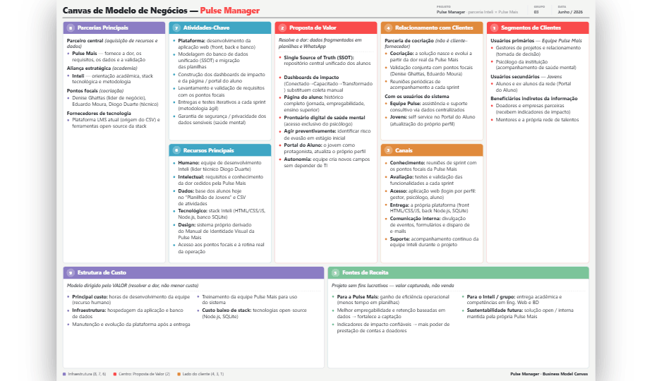<br>
<sub>Fonte: Elaborado pela equipe (2026), com base no Business Model Canvas de Strategyzer.</sub><br>
</div>

<div align="justify">

A seguir, são detalhados os nove blocos do Business Model Canvas, de forma coerente com as análises de mercado, público-alvo e posicionamento apresentadas nas seções anteriores.

Nos Segmentos de Clientes, identificam-se usuários primários, secundários e beneficiários indiretos da informação. Como usuários primários, são considerados os gestores de projeto e relacionamento da equipe Pulse Mais, responsáveis pela tomada de decisão, e o psicólogo da instituição, responsável pelo acompanhamento de saúde mental. Como usuários secundários, são considerados os jovens, alunos e ex-alunos da rede, atendidos por meio do portal do aluno. Como beneficiários indiretos da informação, são considerados doadores e empresas parceiras, que recebem indicadores de impacto, e mentores, integrantes da própria rede de talentos.

Na Proposta de Valor, é resolvida a dor de dados fragmentados em planilhas e WhatsApp. É oferecido um repositório central unificado dos alunos, configurado como Single Source of Truth, além de dashboards de impacto que substituem a coleta manual e traduzem a jornada do aluno nas etapas conectado, capacitado e transformado. É disponibilizada uma página do aluno com histórico completo de jornada, empregabilidade e ensino superior, bem como um prontuário digital de saúde mental de acesso exclusivo do psicólogo. A solução permite agir preventivamente, identificando risco de evasão em estágio inicial, e posiciona o jovem como protagonista por meio do portal do aluno, no qual o próprio perfil é atualizado. É garantida, ainda, autonomia à equipe, que passa a criar novos campos sem depender de TI.

Nos Canais, a cocriação é viabilizada por reuniões de sprint com os pontos focais da Pulse Mais, e a avaliação é realizada por meio de testes e validação das funcionalidades a cada sprint. O acesso é estruturado por uma aplicação web com login segmentado por perfil — gestor, psicólogo e aluno —, e a entrega ocorre pela própria plataforma, composta por front-end em HTML/CSS/JS e back-end em Node.js com SQLite. A comunicação interna é realizada por divulgação de eventos, formulários e disparo de e-mails, e o suporte é mantido por acompanhamento contínuo da equipe ao longo do projeto.

No Relacionamento com Clientes, é estabelecida uma parceria de cocriação, e não uma relação cliente-fornecedor: a solução é concebida e evoluída a partir da dor real da Pulse Mais, com validação conjunta junto aos pontos focais Denise Ghattas e Eduardo Moura, em reuniões periódicas de acompanhamento a cada sprint. Com os usuários do sistema, o relacionamento é diferenciado por perfil — à equipe Pulse, são oferecidos assistência e suporte consultivo via dados centralizados; aos jovens, é oferecido self-service no portal do aluno, com atualização do próprio perfil.

Nas Fontes de Receita, é adotado um modelo sem fins lucrativos, no qual o valor é capturado, e não vendido. Para a Pulse Mais, é obtido ganho de eficiência operacional, com redução do tempo dedicado a planilhas, melhor empregabilidade e retenção baseadas em dados, além de indicadores de impacto confiáveis, que ampliam o poder de prestação de contas a doadores. Para o Inteli e para o grupo, é obtida a entrega acadêmica e o desenvolvimento de competências em Engenharia Web. Como sustentabilidade futura, é prevista uma solução open ou interna, mantida pela própria Pulse Mais.

Nos Recursos Principais, é mobilizado o recurso humano, representado pela equipe de desenvolvimento do Inteli sob liderança técnica de Diogo Duarte, e o recurso intelectual, representado pelos requisitos e pelo conhecimento da dor, cedidos pela Pulse Mais. É utilizado o recurso de dados, composto pela base dos alunos no "Planilhão de Jovens" e pelo CSV de atividades, bem como o recurso tecnológico, correspondente à stack do Inteli — HTML/CSS/JS, Node.js e SQLite. É empregado, ainda, o recurso de design, derivado do Manual de Identidade Visual da Pulse Mais, além do acesso aos pontos focais e à rotina real da operação.

Nas Atividades-Chave, são realizados o desenvolvimento da plataforma, abrangendo aplicação web front-end e back-end e migração das planilhas, e a modelagem do banco de dados. São construídos os dashboards de impacto e o portal do aluno, e são conduzidos o levantamento e a validação de requisitos junto aos pontos focais. São executadas entregas e testes iterativos a cada sprint, conforme metodologia ágil, e é garantida a segurança e a privacidade dos dados sensíveis de saúde mental.

Nas Parcerias Principais, a Pulse Mais é estabelecida como parceiro central, responsável pela aquisição de recursos e dados, pelo fornecimento da dor, dos requisitos, dos dados e da validação. É firmada parceria estratégica com o Inteli, da qual decorrem orientação acadêmica, stack tecnológica e metodologia. São definidos como pontos focais de cocriação Denise Ghattas, na liderança de negócio, e Eduardo Moura e Diogo Duarte, na frente técnica. Como fornecedores de tecnologia, são considerados a plataforma LMS atual, origem do CSV, e as ferramentas open source da stack.

Por fim, na Estrutura de Custos, é adotado um modelo guiado pelo valor, voltado à resolução da dor, e não à minimização do custo. Como principal custo, são identificadas as horas de desenvolvimento da equipe, enquanto recurso humano. Como custos adicionais, são consideradas a infraestrutura de hospedagem da aplicação e do banco de dados, a manutenção e a evolução da plataforma após a entrega, e o treinamento da equipe Pulse Mais para uso do sistema. É observado, ainda, custo baixo associado à stack, composta por tecnologias open source, como Node.js e SQLite.

</div>

## 6.5 Posicionamento

### 6.5.1 Proposta de valor


A proposta de valor do Pulse Manager consiste em centralizar, organizar e transformar os dados da jornada dos jovens atendidos pela Pulse Mais em informações acessíveis, seguras e acionáveis. A aplicação entrega valor ao reduzir a fragmentação de registros, facilitar o acompanhamento individualizado dos alunos e permitir que a equipe gestora tome decisões com base em dados consolidados.
Para os gestores, o principal valor está na possibilidade de acessar uma visão única da trajetória de cada aluno, consultar indicadores institucionais, identificar padrões de engajamento, acompanhar empregabilidade, visualizar riscos de evasão e segmentar perfis para oportunidades específicas. Dessa forma, a plataforma reduz o tempo gasto em buscas manuais e aumenta a qualidade da gestão.
Para os psicólogos, o valor está na organização dos registros de acompanhamento, respeitando restrições de acesso e permitindo uma leitura mais estruturada dos alunos acompanhados. Para os alunos, o valor está no acesso ao próprio histórico, à atualização de dados cadastrais e à visualização de oportunidades relacionadas à sua jornada.
Assim, a aplicação se diferencia por atuar como uma infraestrutura de gestão de impacto social. O Pulse Manager não apenas armazena dados, mas qualifica o acompanhamento dos jovens, fortalece a governança institucional e amplia a capacidade da Pulse Mais de demonstrar resultados para parceiros e apoiadores.


### 6.5.2 Posicionamento e Diferenciação
O Pulse Manager pretende ser percebido como uma plataforma de gestão social inteligente, confiável e acolhedora, voltada à centralização da jornada de jovens em programas de capacitação tecnológica. Seu posicionamento combina seriedade técnica, impacto social e proximidade com os usuários, mantendo coerência com a identidade institucional da Pulse Mais.
Entre os concorrentes, distinguem-se diretos e indiretos. Diretos: soluções internas de outras organizações sociais e plataformas de gestão educacional, menos aderentes ao fluxo da Pulse Mais e aos indicadores de impacto, empregabilidade e acompanhamento socioemocional. Indiretos: planilhas compartilhadas, CRMs genéricos e ferramentas de BI — planilhas geram retrabalho e baixa rastreabilidade da jornada; CRMs não contemplam governança de dados sensíveis de saúde mental; BI depende de integração externa, sem nascer do fluxo operacional da instituição.
A diferenciação do Pulse Manager está na combinação entre centralização de dados, leitura longitudinal da jornada do aluno, dashboards de impacto, segmentação estratégica, portal do aluno e controle de acesso por perfil. A aplicação foi pensada a partir das dores reais da Pulse Mais, o que permite maior aderência ao fluxo operacional da instituição.
A marca deve ser percebida como confiável, clara, humana e orientada a impacto. A identidade pretendida é a de uma solução que aproxima tecnologia e transformação social, oferecendo à equipe mais controle sobre os dados e aos jovens maior visibilidade sobre sua trajetória. A percepção de valor desejada é a de uma plataforma essencial para transformar dados dispersos em acompanhamento qualificado, governança institucional e evidências concretas de impacto.

## 6.6 Estratégia de Marketing

Os 4Ps são um modelo de estratégia que organiza as principais decisões de marketing em 4 elementos diferentes, sendo eles: Produto, Preço, Praça e Promoção. O produto seria o que a pessoa está oferecendo, dentre um serviço/produto; o preço seria quanto a pessoa está cobrando por esse serviço/produto; a praça seria a localidade de onde o produto/serviço está sendo oferecido, sendo ela online ou física; e, por fim, a promoção seria como o dono do produto/serviço faz o contato com o cliente, seja por redes sociais, publicidade ou outros meios.
Produto: A solução proposta consiste na plataforma web Pulse Manager, responsável por centralizar os dados institucionais e acadêmicos da Pulse Mais, atuando como uma Single Source of Truth. Entre as principais funcionalidades, destacam-se o cadastro, a edição de dados e a consulta de alunos e ex-alunos (RF001-RF003); a consolidação do histórico completo da jornada, formação, frequência, eventos, empregabilidade e ensino superior (RF004-RF008); o dashboard de indicadores de impacto, com métricas de empregabilidade, conclusão, evasão e acesso ao ensino superior (RF012-RF016); o portal do aluno para consulta e atualização do próprio perfil (RF017-RF018); e o módulo de saúde mental, com acesso exclusivo ao psicólogo (RF009). Como principal benefício, identifica-se a eliminação da fragmentação de informações dispersas em planilhas, reduzindo o retrabalho e acelerando a tomada de decisão baseada em dados. Destacam-se como diferenciais a agenda institucional voltada aos gestores (RF020-RF021), pela qual é possível organizar a rotina da equipe e enviar notificações de eventos e aulas, obrigatórias ou não, aos alunos; e a aba de notificações disponibilizada aos alunos, na qual cada um pode acompanhar quando ocorrerá sua próxima aula ou evento e se a participação é esperada.
Preço: A Pulse Manager não é monetizada junto aos seus usuários, pois opera em uma lógica de terceiro setor na qual quem usa não é quem paga. Há duas camadas de entregas gratuitas: primeiro, nós (alunos do Inteli), que entregamos a aplicação web à Pulse Mais sem custo, como projeto acadêmico; e a Pulse Mais, por sua vez, oferece o serviço gratuitamente aos jovens, coerentemente com a sua missão social. Portanto, nem o aluno nem a ONG pagam pelo uso do serviço. Quem sustenta a operação são terceiros, ou seja, doadores, empresas parceiras e até mesmo patrocinadores da ONG Pulse Mais.
Praça: A Pulse Manager será distribuída como uma aplicação web acessível diretamente pelo navegador, sendo eles: Google Chrome, Edge, Firefox… E a interface é otimizada para o uso em desktop, ambiente predominante da equipe de trabalho da Pulse Mais. O acesso é segmentado por perfil: a equipe interna e os psicólogos utilizam as funcionalidades de gestão, enquanto alunos e ex-alunos acessam o portal restrito por meio de um link próprio. A distribuição ocorre de forma direta ao parceiro, ou seja, sem marketplace e lojas, aproveitando, assim, os próprios canais já existentes da ONG.
Promoção: Para a equipe interna e os gestores, a divulgação das funcionalidades é realizada por meio de onboarding e treinamentos institucionais, garantindo apropriação das ferramentas de gestão, agenda e notificações. Para alunos e ex-alunos, o portal é divulgado por e-mail institucional e redes sociais da Pulse Mais, com publicações sobre cadastro, atualização de perfil e acesso a oportunidades, reforçando a proximidade já buscada no posicionamento da marca. Para doadores e parceiros, é adotada uma estratégia de marketing de relacionamento, com conteúdo voltado à prestação de contas e à demonstração de impacto, distribuído por e-mail e redes sociais. Eventos institucionais da Pulse Mais, como encontros com jovens e apresentações a apoiadores, são aproveitados como canal de promoção, sendo usados para apresentar indicadores de impacto extraídos da plataforma e fortalecer a percepção de credibilidade. Parcerias com empresas patrocinadoras e organizações do terceiro setor também são exploradas, possibilitando a divulgação cruzada do trabalho da Pulse Mais e, indiretamente, da própria ferramenta de gestão. Dessa forma, a promoção é estruturada conforme o perfil de cada público, sem necessidade de campanhas pagas, dado o caráter institucional da solução.

# <a name="c7"></a>7. Conclusões e trabalhos futuros 

<div align="justify">

## 7.1 Aderência aos objetivos propostos

O objetivo central declarado na seção 2 deste documento consistia no desenvolvimento de uma aplicação web que atuasse como Single Source of Truth (SSOT) da Pulse Mais, centralizando dados institucionais e da jornada dos jovens que hoje se encontram dispersos em planilhas, relatórios e registros descentralizados. A solução entregue — o Pulse Manager — atendeu a esse objetivo por meio de uma arquitetura cliente-servidor com front-end em HTML, CSS e JavaScript, back-end em Node.js e banco de dados PostgreSQL hospedado no Supabase, estruturando em uma única base os dados de alunos, participações, atividades, agenda, notificações, oportunidades e registros de acompanhamento psicológico.

Os benefícios esperados descritos na seção 2.1.3 foram atendidos nos seguintes termos:

**Redução da fragmentação de dados:** a modelagem relacional desenvolvida ao longo das sprints consolidou em um único schema as entidades antes distribuídas em planilhas distintas. O cadastro centralizado de alunos e ex-alunos, a rastreabilidade de participações por atividade e o histórico longitudinal de cada jovem substituem o modelo anterior de arquivos isolados por projeto e ano.

**Acompanhamento individualizado:** a página de perfil do aluno agrega, em uma interface unificada, dados cadastrais, jornada formativa, desempenho, agenda, notificações e, para o perfil de psicólogo, o histórico de acompanhamento psicológico. Esse registro estruturado reduz a dependência do conhecimento informal da equipe, risco identificado como de alta probabilidade na Matriz de Riscos (R9).

**Dashboard de indicadores:** foram implementados dashboards diferenciados por perfil — gestor, psicólogo e aluno — expondo métricas de empregabilidade, frequência, conclusão e evolução da jornada. Os indicadores foram validados nos testes de integração e são consumidos pelos endpoints documentados na seção 3.1.4.

**Segmentação estratégica:** o módulo de segmentação permite filtrar alunos por critérios como curso, status, nível de engajamento e perfil socioeconômico, respondendo diretamente à necessidade operacional de identificar perfis para oportunidades específicas e jovens multiplicadores (RF011, seção 3.1.1).

**Portal do aluno:** o perfil de aluno permite visualizar o próprio histórico, dados cadastrais e agenda, além de receber notificações enviadas pela equipe gestora, atendendo à expectativa de autonomia digital identificada na análise de tendências de mercado (seção 6.2.3).

**Controle de acesso por perfil:** a separação de visibilidade entre perfis de gestor, psicólogo e aluno foi implementada por leitura de headers no `authMiddleware`, RBAC nas rotas críticas e validações de perfil em services sensíveis, garantindo que registros de saúde mental sejam rejeitados para usuários sem perfil de psicólogo, conforme exigência funcional e alinhamento com a LGPD.

## 7.2 Pontos fortes

**Cobertura de testes:** a suíte automatizada totalizou 278 casos de teste distribuídos em 20 arquivos, combinando testes unitários de Service (113 casos aprovados) e testes de integração de endpoints (157 aprovados, 8 ignorados por configuração de ambiente). Os 8 casos de desempenho (`RNF-DES`) foram aprovados, confirmando que os endpoints críticos respondem dentro dos limiares estabelecidos. Essa cobertura reduz o risco de regressão em futuras evoluções.

**Usabilidade verificada:** os testes de guerrilha realizados com 7 participantes resultaram em taxa de sucesso de 100% nas 5 tarefas avaliadas, cobrindo os três perfis da aplicação. A avaliação SUS complementar obteve média de 92,9 pontos, enquadrada na faixa de usabilidade excelente (91–100). Os resultados indicam aderência da interface às heurísticas de Nielsen avaliadas e baixo nível de atrito durante a navegação.

**Arquitetura de dados robusta:** o modelo físico adota restrições de integridade referencial (`PRIMARY KEY`, `FOREIGN KEY`, `UNIQUE`, `NOT NULL`, `CHECK`) e tipos `ENUM` para campos categóricos, reduzindo inconsistências de preenchimento. A ordem de dependência entre tabelas está documentada e orienta futuras operações de migração e manutenção.

**Separação de perfis e controle de acesso:** a implementação de três SPAs distintas por perfil (gestor, psicólogo e aluno), com componentes de menu e estilos especializados, garante isolamento visual e funcional entre os papéis, tornando a interface mais previsível para cada tipo de usuário.

**Organização da base de código:** a estrutura modular do back-end, com separação entre controllers, services, repositories e routes, facilita a manutenção e a extensão de funcionalidades sem alto acoplamento entre camadas.

## 7.3 Pontos a melhorar

**Cobertura de testes para módulos de participação e anotação qualitativa:** as rotas `participacaoRoutes.ts` e `anotacaoQualitativaRoutes.ts` são placeholders, com os endpoints equivalentes incorporados em `jornadaRoutes`. Não há cobertura de testes isolada para esses módulos.

**Posicionamento do filtro de cursos:** o único problema de usabilidade identificado nos testes foi de severidade cosmética: um participante indicou que a posição do filtro de cursos na tela de listagem de alunos foi percebida como pouco intuitiva. A melhoria recomendada é destacar visualmente o campo ou reposicioná-lo em área de maior destaque.

**Rastreabilidade da Matriz RTM:** a Matriz de Rastreabilidade apresentou campos "A definir" na coluna de testes ao longo das sprints 3 e 4, o que reduziu a visibilidade sobre a cobertura de requisitos funcionais por evidência concreta de teste.

## 7.4 Trabalhos futuros

Os trabalhos futuros propostos derivam diretamente das pendências identificadas ao longo do desenvolvimento e de oportunidades de evolução identificadas durante a análise de mercado e os testes com usuários.

**Automação de formulários:** implementar um sistema de envio de formulários cujas respostas atualizem ou adicionem automaticamente registros ao banco, reduzindo o trabalho manual de input de dados pelos gestores. Essa funcionalidade foi listada como entregável desejável no TAPI e não foi contemplada no escopo acadêmico.

**Conformidade com a LGPD em nível de produção:** submeter a aplicação a auditoria de segurança antes de qualquer uso em ambiente produtivo com dados reais. Aspectos a revisar incluem política de retenção de dados, anonimização de registros históricos de ex-alunos, controle de logs de acesso e documentação de tratamento de dados sensíveis.

**Escalabilidade para outras organizações:** a arquitetura da aplicação pode ser generalizada para atender organizações sociais com perfil semelhante ao da Pulse Mais. Uma evolução futura poderia incluir configuração de campos personalizados por organização, suporte a múltiplos programas simultâneos e painéis comparativos entre turmas e anos.

**Reaplicação do SUS após ajustes de interface:** após a correção do posicionamento do filtro de cursos e eventuais refinamentos de usabilidade, recomenda-se reaplicar o questionário SUS com um grupo de usuários representativo do público-alvo real da Pulse Mais — preferencialmente membros da equipe gestora — para validar se a percepção de usabilidade se mantém na faixa excelente com usuários do contexto institucional.

</div>

# <a name="c8"></a>8. Referências 

ABRASCE. *Programa Pulse Mais 2026 inicia com alta adesão e reforça aposta na formação de jovens para o mercado de tecnologia*. 2026. Disponível em: https://abrasce.com.br/espaco-do-associado/tecnologia/programa-pulse-mais-2026-inicia-com-alta-adesao-e-reforca-aposta-na-formacao-de-jovens-para-o-mercado-de-tecnologia/. Acesso em: 10 jun. 2026.

ANPD. *Agência Nacional de Proteção de Dados aprova Agenda Regulatória para o biênio 2025-2026*. Brasília: ANPD, 2024. Disponível em: https://www.gov.br/anpd/pt-br. Acesso em: 24 jun. 2026.

BRASIL. Lei nº 13.709, de 14 de agosto de 2018. *Lei Geral de Proteção de Dados Pessoais (LGPD)*. Brasília, DF: Presidência da República, 2018. Disponível em: https://www.planalto.gov.br/ccivil_03/_ato2015-2018/2018/lei/l13709.htm. Acesso em: 10 jun. 2026.

DIÁRIO DO COMÉRCIO. *Após cinco anos em vigor, LGPD ainda é desafio para pequenas empresas e terceiro setor*. 2025. Disponível em: https://diariodocomercio.com.br/legislacao/lgpd-desafios-pequenas-empresas-terceiro-setor/. Acesso em: 24 jun. 2026.

ESG INSIDE. *Pulse Mais abre inscrições para programa gratuito que prepara jovens para carreiras em tecnologia*. 2026. Disponível em: https://esginside.com.br/2026/01/23/pulse-mais-abre-inscricoes-para-programa-gratuito-que-prepara-jovens-para-carreiras-em-tecnologia/. Acesso em: 10 jun. 2026.

GRAND VIEW RESEARCH. *Education Technology Market Size, Share & Trends Analysis Report*. San Francisco: Grand View Research, 2025. Disponível em: https://www.grandviewresearch.com/industry-analysis/education-technology-market. Acesso em: 24 jun. 2026.

INTERNATIONAL ORGANIZATION FOR STANDARDIZATION. *ISO/IEC 25010: Systems and software engineering — Systems and software Quality Requirements and Evaluation (SQuaRE) — System and software quality models*. Geneva: ISO, 2011. Disponível em: https://www.iso.org/standard/35733.html. Acesso em: 10 jun. 2026.

MORDOR INTELLIGENCE. *Non-Profit Software Market Size & Share Analysis*. Hyderabad: Mordor Intelligence, 2026. Disponível em: https://www.mordorintelligence.com/industry-reports/non-profit-software-market. Acesso em: 24 jun. 2026.

NORMANDO, Célio. *Modelo relacional: conceitos, restrições de integridade, mapeamento de modelos E-R para esquemas relacionais*. Medium, 2024. Disponível em: https://medium.com/@celionormando/modelo-relacional-8de45e45e009. Acesso em: 10 jun. 2026.

OBSERVATÓRIO DO TERCEIRO SETOR. *Pulse Mais celebra 3 anos e amplia oportunidades para jovens na tecnologia*. 2025. Disponível em: https://observatorio3setor.org.br/pulse-mais-celebra-3-anos-e-amplia-oportunidades-para-jovens-na-tecnologia/. Acesso em: 10 jun. 2026.

OBSERVATÓRIO DO TERCEIRO SETOR. *Tendências da captação de recursos para 2026*. 2026. Disponível em: https://observatorio3setor.org.br/tendencias-da-captacao-de-recursos-para-2026/. Acesso em: 24 jun. 2026.

PORTAL DO IMPACTO. *Agentes de Inteligência Artificial: o que muda para o Terceiro Setor em 2026*. 2025. Disponível em: https://www.portaldoimpacto.com/agentes-de-inteligencia-artificial-o-que-muda-para-o-terceiro-setor-em-2026. Acesso em: 24 jun. 2026.

PULSE MAIS. *Pulse Mais: site institucional*. 2026. Disponível em: https://pulsemais.org.br/. Acesso em: 10 jun. 2026.

WORLD WIDE WEB CONSORTIUM (W3C). *Web Content Accessibility Guidelines (WCAG) 2.1*. [S. l.]: W3C, 2018. Disponível em: https://www.w3.org/TR/WCAG21/. Acesso em: 10 jun. 2026.

# <a name="c9"></a>Anexos

Não se aplica.
