<div align="center">
  
</div>


# WAD - Web Application Document - Módulo 2 - Inteli

## Grupo NEXUS

#### Nomes dos integrantes do grupo:
- Ana Camily
- Enzo Campoi
- Igor Rodrigues
- Lucas Silva
- Melissa D'Angelo
- Miguel Rodrigues
- Raphaela Luvizotto
- Samuel Chen


## Sumário

[1. Introdução](#c1)

[2. Visão Geral da Aplicação Web](#c2)

[3. Projeto Técnico da Aplicação Web](#c3)

[4. Desenvolvimento da Aplicação Web](#c4)

[5. Testes da Aplicação Web](#c5)

[6. Estudo de Mercado e Plano de Marketing](#c6)

[7. Conclusões e trabalhos futuros](#c7)

[8. Referências](#c8)

<br>


# <a name="c1"></a>1. Introdução

No Brasil, o acesso desigual à educação de qualidade representa um desafio estrutural, especialmente nas áreas tecnológicas, que exigem infraestrutura, equipamentos e materiais frequentemente inacessíveis para jovens de baixa renda. Esse cenário limita oportunidades de ascensão social, amplia a exclusão digital e reduz as possibilidades de inserção qualificada no mercado de trabalho. Nesse contexto, foi fundada a Pulse Mais, organização sem fins lucrativos que capacita jovens em tecnologia por meio de aulas, materiais didáticos e bolsas de estudo, promovendo inclusão social e formação profissional.

 Apesar do impacto social gerado, a organização enfrenta desafios críticos na gestão de seus dados internos. As informações dos alunos encontram-se fragmentadas em múltiplas planilhas, organizadas por projeto e ano, sem integração entre si. Essa estrutura dificulta o acesso rápido às informações, aumenta a dependência do conhecimento individual dos colaboradores e compromete a análise histórica de indicadores de impacto, reduzindo a capacidade da instituição de tomar decisões estratégicas baseadas em dados confiáveis.

 Para solucionar esse problema, o grupo Nexus propõe o projeto 'Nexus', uma aplicação web que funcione como uma Single Source of Truth (SSOT) da instituição. A plataforma centralizará os dados de alunos e ex-alunos em um único ambiente, permitindo que docentes e gestores acompanhem a trajetória de cada estudante, desde o ingresso até sua inserção no mercado de trabalho.

Além de otimizar a busca e consulta de informações, a solução também permitirá identificar precocemente riscos de evasão, gerar indicadores consolidados de impacto social e apoiar a elaboração de relatórios mais precisos para parceiros e potenciais doadores. Dessa forma, a plataforma visa contribuir para a eficiência operacional, a sustentabilidade da ONG e a ampliação do impacto social promovido pela Pulse Mais.

# <a name="c2"></a>

## 2. Visão Geral da Aplicação Web

## 2.1. Escopo do Projeto

### 2.1.1. Modelo de 5 Forças de Porter 

As Cinco Forças de Porter são utilizadas para analisar a competitividade de um mercado através de cinco dimensões estratégicas (PORTER, 1980). Nesta seção, essa metodologia foi aplicada para compreender o contexto da Pulse Mais e alinhar o desenvolvimento da solução ao seu ambiente competitivo.

<div align="center">
  <sub>Figura 1 — Modelo de 5 Forças de Porter</sub><br>
  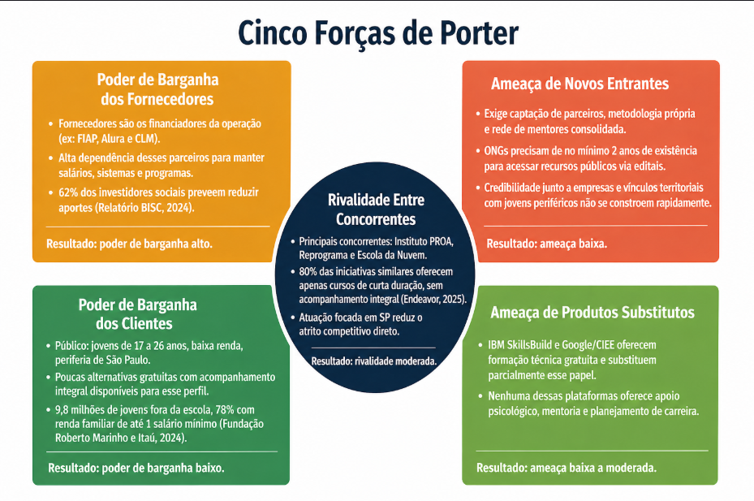<br>
  <sup>Fonte: Autores, 2026.</sup>
</div>

**1. Análise da rivalidade entre concorrentes existentes**

A Pulse Mais concorre com instituições como Instituto PROA, Reprograma e Escola da Nuvem na capacitação tecnológica de jovens em vulnerabilidade. Seu diferencial está em oferecer uma jornada completa de formação técnica, mentoria com profissionais do mercado e apoio psicológico, conforme materiais institucionais da organização parceira (PULSE MAIS, 2026). Segundo a Endeavor Brasil (2023), 80% das 154 iniciativas sociais de formação tecnológica no Brasil focam em cursos de curta duração, sem acompanhamento integral, resultando em uma concorrência moderada.

**2. Poder de barganha dos fornecedores**

Em organizações do terceiro setor, fornecedores são compreendidos como financiadores, pois viabilizam a operação. A Pulse Mais depende de parceiros como FIAP, Alura e CLM, conforme materiais institucionais disponibilizados pela organização parceira (PULSE MAIS, 2026). Segundo a Comunitas (2025), 62% dos investidores sociais preveem reduzir seus aportes, evidenciando um cenário desafiador que, aliado à dificuldade de conquistar novos parceiros, resulta em um poder de negociação dos fornecedores alto. Nesse contexto, o Dashboard de Impacto Social desenvolvido pelo grupo atua diretamente como resposta a essa pressão: ao centralizar métricas como taxa de empregabilidade, progresso dos alunos e engajamento nas mentorias, a plataforma oferece aos financiadores a transparência e a rastreabilidade que exigem para justificar seus aportes, reduzindo o risco de desligamento e fortalecendo a posição da Pulse Mais nas negociações.

**3. Poder de barganha dos clientes**

Os clientes são jovens entre 17 e 26 anos, de baixa renda, residentes em regiões periféricas de São Paulo. Pesquisa da Fundação Roberto Marinho e da Fundação Itaú (2024) aponta que 9,8 milhões de jovens estão fora da escola, sendo 78% de famílias com renda de até um salário mínimo evidenciando a fragilidade desse público e sua dependência de iniciativas gratuitas, resultando em um baixo poder de negociação.

**4. Ameaça de novos entrantes**
A ameaça é baixa. Atuar nesse nicho exige captação de parceiros, metodologia própria e rede de voluntários, barreiras que demandam tempo e investimento. O governo brasileiro exige no mínimo dois anos de existência para que uma ONG solicite recursos públicos (BRASIL, 2014), e vínculos territoriais com jovens periféricos não se replicam rapidamente. Ademais, a adoção do Dashboard produzido por nossa equipe tende a ampliar essas barreiras no longo prazo: ao sistematizar métricas de empregabilidade e engajamento e automatizar relatórios para financiadores, a Pulse Mais ganha eficiência operacional e credibilidade institucional difíceis de replicar por entrantes sem histórico, tornando-se progressivamente mais resiliente à concorrência.

**5. Ameaça de produtos substitutos**

A ameaça varia de baixa a moderada. IBM e Google expandiram formações gratuitas em tecnologia: o IBM SkillsBuild oferece mais de 1.000 cursos (IBM, 2025) e o Google firmou parceria com o CIEE para capacitar jovens de baixa renda (CIEE, 2026). No entanto, nenhuma dessas plataformas oferece apoio psicológico, mentoria e planejamento de carreira, limitando sua capacidade de substituir completamente a Pulse Mais.

### 2.1.2. Análise SWOT da Instituição Parceira
<div align="center">
  <sub>Figura 2 — Análise SWOT da Pulse Mais</sub><br>
  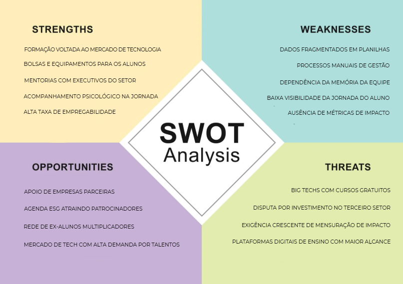<br>
  <sup>Fonte: Autores, 2026.</sup>
</div>

Entre as ONGs que formam jovens de baixa renda em tecnologia, a Pulse Mais entrega uma jornada completa, com metodologia própria, mentoria de executivos, apoio psicológico e doação de equipamentos, enquanto a maior parte dos concorrentes aposta em cursos curtos e isolados. O resultado aparece na empregabilidade: 75 dos 180 jovens já formados foram contratados, num mercado de tecnologia ainda carente de profissionais qualificados. O ponto fraco, no entanto, é interno. A gestão roda em planilhas soltas, o que dificulta comprovar impacto para financiadores exigentes e fragiliza a ONG diante das formações gratuitas oferecidas em larga escala pelas big techs. É esse gargalo que a plataforma web deste projeto ataca: ao centralizar a jornada do aluno e gerar métricas de impacto, transforma a Fraqueza dos dados fragmentados em Força de governança e converte a Ameaça da exigência por mensuração em Oportunidade de captação junto a financiadores e à agenda ESG.


### 2.1.3. Solução 

**1 - Problema a ser resolvido:**

Com o crescimento dos programas e a alta rotatividade de participantes da Pulse Mais, a instituição enfrenta fragmentação de dados acadêmicos, de jornada e empregabilidade dos alunos em múltiplas planilhas isoladas. Isso dificulta a análise estratégica e o planejamento futuro, gera dependência da memória individual da equipe e aumenta o risco de registros desatualizados ou perda de informações críticas.

2 - Dados disponíveis (mencionar fonte e conteúdo; se não houver, indicar “não se aplica”):
Os dados foram fornecidos pela Pulse Mais e incluem: relatório de atividades  oficial da instituição, com informações sobre desempenho, doadores e participantes dos programas; apresentações institucionais, com detalhes sobre missão, serviços e público atendido; e o Planilhão de jovens do Framework, planilha atual que demonstra como os dados dos alunos são estruturados e servirá de referência para o desenvolvimento.

**3 - Solução proposta:**

A solução consiste no desenvolvimento de uma aplicação web integrada a um banco de dados, que substitui as planilhas atuais e centraliza os dados da instituição. A plataforma será desenvolvida com HTML, CSS e JavaScript no front-end, Node.js no back-end e SQL como banco de dados relacional, garantindo escalabilidade e integridade das informações. Contará com dashboard de métricas de impacto, módulo de registro de jornada pela equipe, portal do aluno com histórico e evolução na instituição, prontuário digital exclusivo para o psicólogo e filtros avançados de segmentação.

**4 - Forma de utilização da solução:**

A plataforma será alimentada pela migração das planilhas atuais da instituição para o banco de dados SQL centralizado, por meio de scripts de importação desenvolvidos em Node.js. O acesso ocorre por perfis: gestores visualizam métricas de impacto; coordenadores registram desempenho, frequência e empregabilidade; psicólogos inserem registros exclusivos de saúde mental. Os alunos também acessam a plataforma para atualizar seus dados cadastrais e de perfil.

**5 - Benefícios esperados:**

Com o desenvolvimento dessa solução, a equipe pretende facilitar a análise de métricas institucionais, permitindo planejar ações futuras de forma mais eficiente. Espera-se reduzir a evasão, aumentar a empregabilidade dos alunos e eliminar a perda de informações, possibilitando maior acompanhamento tanto dos alunos ativos quanto dos ex-alunos, fortalecendo a transparência institucional junto aos parceiros.

**6 - Critério de sucesso e como será avaliado:**

O sucesso será medido pela entrega de uma plataforma centralizada que execute todas as funcionalidades do MVP sem erros ou perda de informações. Os critérios incluem: migração de 100% dos dados críticos do Planilhão sem perda de integridade; redução de pelo menos 45% no tempo gasto pela equipe para geração do relatório mensal de impacto; e zero registros duplicados ou inconsistentes após a consolidação das planilhas no banco de dados. A avaliação ocorrerá ao longo do desenvolvimento, por meio de testes e feedbacks com os pontos focais da Pulse Mais a cada sprint.

### 2.1.4. Value Proposition Canvas:

<div align="center">
  <sub>Figura 3 — Canvas de Proposta de Valor da Pulse Mais</sub><br>
  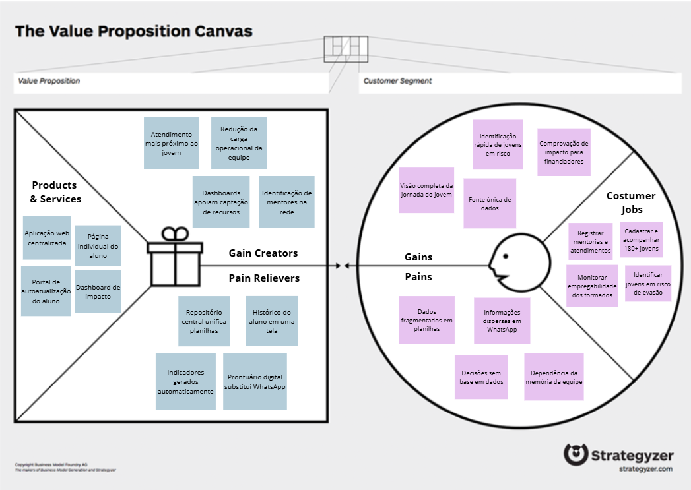<br>
  <sup>Fonte: Autores, 2026.</sup>
</div>

#### A. Perfil do Cliente

Público-alvo principal: Equipe interna da Pulse Mais (gestores, coordenação e diretoria), responsável pela gestão da jornada dos jovens atendidos pela ONG. Como público secundário, alunos e ex-alunos da rede, que interagem com a solução pelo Portal do Aluno.

a) Tarefas do cliente

A equipe da Pulse Mais precisa cadastrar e acompanhar dados de mais de 180 jovens, registrar frequência em aulas, participação em eventos e entregas de atividades. Também busca monitorar a empregabilidade dos formados, registrar mentorias e atendimentos, gerar relatórios de impacto para financiadores e identificar precocemente jovens em risco de evasão. Já o aluno precisa atualizar seu próprio cadastro, acompanhar sua trajetória formativa e, no caso dos ex-alunos, retornar à rede como mentor ou indicador de vagas.

b) Dores

Os dados dos jovens estão fragmentados em múltiplas planilhas separadas por projeto e ano, e informações importantes ficam dispersas em conversas de WhatsApp. Isso gera tempo excessivo na busca por histórico, retrabalho de cadastro e dependência da memória individual da equipe. Como consequência, decisões são tomadas sem base em dados, o atendimento ao aluno perde personalização e há dificuldade em mensurar o impacto social da ONG. Do lado do aluno, falta visibilidade da própria evolução, há retrabalho a cada novo contato com a equipe e o vínculo com a ONG tende a se perder após a formação, enfraquecendo o ciclo de give back.

c) Ganhos

A equipe valoriza ter uma fonte única de dados, dashboards visuais com indicadores automáticos e a possibilidade de identificar rapidamente jovens em risco. Também busca autonomia para criar novos campos sem depender de suporte técnico e maior capacidade de comprovar impacto para captação de recursos. Para o aluno, o ganho está em sentir-se acompanhado de forma personalizada, enxergar a própria jornada de forma clara e ter um canal ativo para voltar à rede como mentor.

#### B. Mapa de Valor

a) Produtos e Serviços

A solução é uma aplicação web centralizada para gestão da jornada dos jovens atendidos pela Pulse Mais, desde a entrada na formação até o acompanhamento depois de formados. A plataforma funciona como uma fonte única de dados, permitindo registrar frequência, atividades, eventos, mentorias e indicadores de empregabilidade, e disponibiliza um Portal do Aluno no qual o próprio jovem visualiza sua trajetória, atualiza dados e mantém vínculo ativo com a ONG.

b) Aliviadores de Dores

A plataforma substitui as múltiplas planilhas isoladas por um repositório central, onde todos os dados ficam reunidos e atualizados. Segundo Olavsrud (2021), a adoção de uma fonte única de dados reduz inconsistências e erros que surgem quando várias versões da mesma informação coexistem em sistemas diferentes. Conversas e registros que hoje se perdem em WhatsApp passam a ser feitos no prontuário digital, com permissões específicas para informações sensíveis, como observações de saúde mental acessíveis apenas pelo psicólogo. A página individual do aluno reúne em uma única tela seu histórico completo, eliminando o tempo gasto procurando informação em arquivos dispersos. Indicadores de impacto, antes calculados manualmente, passam a ser gerados automaticamente em dashboards, permitindo decisões baseadas em dados reais e não em memória da equipe.

c) Criadores de Ganho

Com o histórico completo acessível em poucos cliques, o atendimento aos jovens se torna mais próximo e personalizado. Os dashboards facilitam a apresentação de resultados a financiadores e parceiros, fortalecendo a captação de recursos. Filtros de busca permitem identificar rapidamente ex-alunos com potencial para se tornarem mentores ou indicações para vagas, operacionalizando tecnicamente a cultura de give back que sustenta o modelo Pulse Mais e transformando o ex-aluno em multiplicador da rede. Já o Portal do Aluno mantém o vínculo do jovem com a plataforma após a formação e devolve a ele visibilidade sobre a própria jornada, atuando como mitigação direta ao risco de baixa adesão mapeado na matriz de riscos, ao converter o usuário final em participante ativo do sistema.


### 2.1.5. Matriz de Riscos do Projeto

A Matriz de Riscos é uma ferramenta visual utilizada para priorizar os riscos de um projeto com base em duas dimensões: probabilidade, que mede a chance de um risco ocorrer, e impacto, que representa suas consequências caso se concretize (PROJECT MANAGEMENT INSTITUTE, 2017). A combinação dessas dimensões gera uma classificação geral — alta, média ou baixa — representada por cores, facilitando o foco da equipe nos riscos mais críticos e orientando a construção de planos de ação preventivos. No contexto deste projeto, a matriz foi aplicada para avaliar os riscos do desenvolvimento da plataforma da Pulse Mais, considerando desafios técnicos, pedagógicos e de alinhamento com o parceiro.

<div align="center">
  <sub>Figura 4 — Matriz de Riscos — Ameaças</sub><br>
  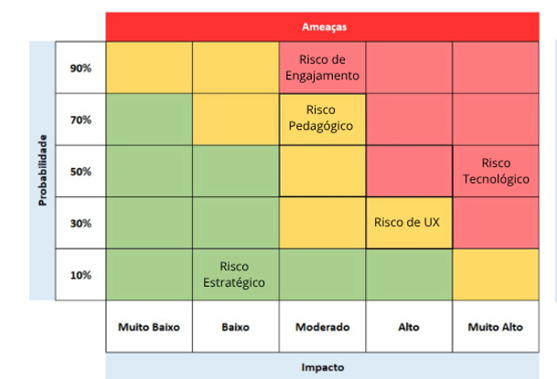<br>
  <sup>Fonte: Autores, 2026.</sup>
</div>

**1. Risco de Engajamento**

Trata-se de um risco de natureza humana e operacional.  Sua probabilidade de ocorrência foi estimada em 90%, pois a Pulse Mais é uma ONG com equipe reduzida e múltiplas demandas simultâneas, tornando altamente provável que os pontos focais não consigam participar ativamente de todas as validações ao longo da jornada. O impacto foi classificado como moderado porque, caso esse risco se concretize, o desenvolvimento pode avançar em uma direção equivocada, gerando retrabalho e entregas que não refletem a necessidade real da instituição. A combinação desses fatores resulta em uma classificação geral alta, tornando este um dos riscos mais críticos do projeto. Como plano de ação, a equipe deve estabelecer desde o início um calendário fixo de reuniões com os pontos focais, organização de dados, materiais objetivos para facilitar as validações e manter comunicação ativa para não travar o andamento entre encontros.

**2. Risco Pedagógico**

Trata-se de um risco de natureza acadêmica. Sua probabilidade de ocorrência foi estimada em 70%, pois algumas funcionalidades previstas no escopo, como filtros avançados, automação de formulários e módulo de comunicação, exigem um nível de maturidade técnica que pode estar além do momento atual da turma ou em casos especiais de alunos com alguns tipos de transtornos como TEA e TDAH. O impacto foi classificado como moderado porque, caso esse risco se concretize, o projeto pode precisar de adaptações e/ou simplificações que reduzam a qualidade da entrega ou deixem funcionalidades importantes de fora do MVP. A combinação desses fatores resulta em uma classificação geral alta. Como plano de ação, a equipe deve mapear antecipadamente quais funcionalidades exigem maior domínio técnico, filtrar os alunos especiais, com ajuda de profissionais, buscar orientação com os professores nas sprints iniciais e priorizar a entrega do núcleo do produto antes de avançar para funcionalidades mais complexas.

**3. Risco Tecnológico**

Trata-se de um risco de natureza técnica. Sua probabilidade de ocorrência foi estimada em 50%, pois a stack definida pelo Inteli, HTML/CSS/JavaScript, Node.js e SQL, pode apresentar limitações ao escalar funcionalidades mais sensíveis, como o controle de níveis de acesso entre equipe interna, psicólogo e alunos. O impacto foi classificado como muito alto porque, caso esse risco se concretize, funcionalidades centrais podem ser entregues de forma incompleta ou insegura, comprometendo a confiança da Pulse Mais na plataforma e inviabilizando sua adoção no ambiente real. A combinação desses fatores resulta em uma classificação geral alta, tornando este o risco de maior severidade potencial do projeto. Como plano de ação, a equipe deve definir a arquitetura do banco de dados nas primeiras sprints, realizando testes de integridade desde cedo.

**4. Risco de UX**

Trata-se de um risco de natureza de experiência do usuário. Sua probabilidade de ocorrência foi estimada em 30%, pois embora exista clareza sobre os dois perfis de usuário, equipe interna e alunos, há uma chance real de que a interface desenvolvida não reflita o fluxo de trabalho real da equipe da Pulse Mais, especialmente por se tratar de um contexto operacional muito específico. O impacto foi classificado como alto porque, caso esse risco se concretize, a plataforma pode ser tecnicamente funcional mas pouco utilizada na prática, desperdiçando todo o esforço de desenvolvimento. A combinação desses fatores resulta em uma classificação geral média. Como plano de ação, a equipe deve realizar ao menos uma sessão de observação do fluxo de trabalho atual da equipe Pulse Mais antes de prototipar as telas e aplicar testes de usabilidade antes da entrega final.


**5. Risco Estratégico**

Trata-se de um risco de natureza organizacional. Sua probabilidade de ocorrência foi estimada em 10%, pois a Pulse Mais demonstra clareza sobre suas necessidades e os pontos focais estão bem definidos. No entanto, por se tratar de uma ONG em fase de crescimento, mudanças de prioridade institucional ao longo do semestre não podem ser completamente descartadas. O impacto foi classificado como baixo porque, mesmo que ocorra uma redefinição de escopo, o núcleo do produto (centralização de dados) tende a permanecer relevante independentemente de ajustes pontuais. A combinação desses fatores resulta em uma classificação geral média. Como plano de ação, a equipe deve documentar formalmente o escopo acordado no início do projeto, registrar todas as decisões tomadas nas sprints e comunicar qualquer mudança de direção.


<div align="center">
  <sub>Figura 5 — Matriz de Riscos — Oportunidades</sub><br>
  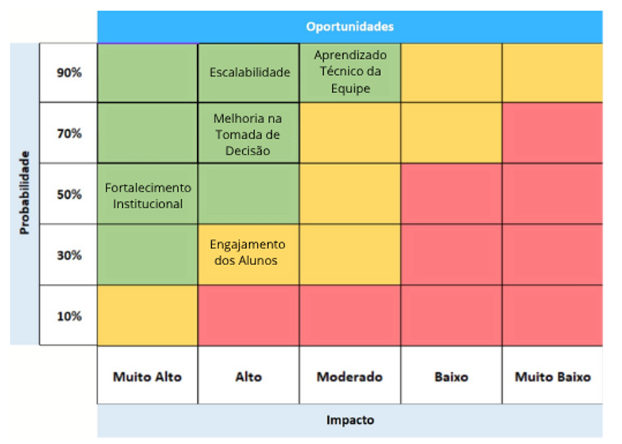<br>
  <sup>Fonte: Autores, 2026.</sup>
</div>

**1. Oportunidade de Escalabilidade**

Trata-se de uma oportunidade de natureza estratégica. Sua probabilidade de ocorrência foi estimada em 90%, pois a Pulse Mais está em plena fase de crescimento e a centralização de dados é exatamente o que uma organização precisa para escalar com consistência. O impacto foi classificado como alto porque, caso essa oportunidade se concretize, a plataforma desenvolvida pode se tornar a espinha dorsal operacional da ONG por muitos anos, indo além do escopo acadêmico original. A combinação desses fatores resulta em uma classificação geral alta, tornando esta a oportunidade de maior potencial do projeto. Como plano de ação, a equipe deve documentar o código de forma clara e organizada, construir uma arquitetura modular que facilite a adição de novas funcionalidades no futuro e apresentar à Pulse Mais um roteiro de evolução da plataforma ao final do projeto.

**2. Oportunidade de Melhoria na Tomada de Decisão**

Trata-se de uma oportunidade de natureza gerencial. Sua probabilidade de ocorrência foi estimada em 70%, pois ao substituir planilhas fragmentadas por um banco de dados centralizado, a equipe da Pulse Mais naturalmente passará a tomar decisões baseadas em dados reais, e não mais em memória individual ou intuição. O impacto foi classificado como alto porque, caso essa oportunidade se concretize, a instituição poderá identificar riscos de evasão precocemente, melhorar índices de retenção e construir estratégias de empregabilidade muito mais assertivas. A combinação desses fatores resulta em uma classificação geral alta. Como plano de ação, a equipe deve desenvolver dashboards intuitivos desde as primeiras sprints e garantir que os indicadores mais relevantes para a Pulse Mais estejam visíveis logo na tela principal da plataforma.

**3. Oportunidade de Fortalecimento Institucional**

Trata-se de uma oportunidade de natureza organizacional. Sua probabilidade de ocorrência foi estimada em 50%, pois a existência de uma plataforma própria, com histórico centralizado e indicadores de impacto, aumenta significativamente a credibilidade da Pulse Mais perante doadores, parceiros e empresas patrocinadoras. O impacto foi classificado como muito alto porque, caso essa oportunidade se concretize, a ONG poderá apresentar dados concretos de impacto em eventos, captações e relatórios institucionais, atraindo novos investimentos e ampliando sua capacidade de atender mais jovens. A combinação desses fatores resulta em uma classificação geral alta, tornando esta a oportunidade de maior impacto potencial para a missão da organização. Como plano de ação, a equipe deve incluir no dashboard uma visão consolidada de impacto, como total de jovens formados, empregados e em ensino superior, pensada também para uso em apresentações externas.

**4. Oportunidade de Engajamento dos Alunos**

Trata-se de uma oportunidade de natureza relacional. Sua probabilidade de ocorrência foi estimada em 30%, pois o Portal do Aluno, mesmo sendo uma entrega secundária no MVP, tem o potencial de transformar os jovens de usuários passivos em protagonistas ativos de sua própria jornada dentro da Pulse Mais. O impacto foi classificado como alto porque, caso essa oportunidade se concretize, o engajamento da rede de ex-alunos pode aumentar consideravelmente, gerando uma comunidade ativa de jovens multiplicadores que reforça o impacto da ONG. A combinação desses fatores resulta em uma classificação geral média. Como plano de ação, a equipe deve desenhar o Portal do Aluno com foco na simplicidade e no protagonismo, destacando conquistas e próximos passos na carreira de cada jovem.

**5. Oportunidade de Aprendizado Técnico da Equipe**

Trata-se de uma oportunidade de natureza acadêmica. Sua probabilidade de ocorrência foi estimada em 90%, pois o projeto envolve desafios reais de arquitetura de banco de dados, design de interface e integração entre front-end e back-end em um contexto de produto com usuários reais. O impacto foi classificado como moderado porque, caso essa oportunidade se concretize, os desenvolvedores(nosso grupo) sairão do projeto com experiência prática muito mais sólida do que em projetos puramente hipotéticos, o que impacta diretamente na empregabilidade e maturidade profissional. A combinação desses fatores resulta em uma classificação geral alta. Como plano de ação, a equipe deve registrar aprendizados ao final de cada sprint, documentar decisões técnicas com suas justificativas e encarar cada obstáculo do projeto como parte intencional da formação.

## 2.2. Personas
Durante essa seção, nossa equipe utilizou o conceito de proto-personas para identificar os perfis de usuários que a plataforma irá atender. Proto-personas são representações hipotéticas construídas com base no conhecimento prévio da equipe e nos dados disponíveis sobre o contexto do projeto, sem necessariamente passar por pesquisas formais com usuários reais (GOTHELF; SEIDEN, 2013). O objetivo desse mapeamento foi identificar os principais perfis, analisando suas dores, necessidades e metas, de forma a criar proximidade com os usuários, direcionar cada funcionalidade a ser desenvolvida e mapear a ideia central do projeto.

### 2.2.1 Persona - Coordenadora
Denise trabalha na Pulse Mais como coordenadora pedagógica. É responsável pelo acompanhamento diário dos alunos, desde o cadastro até o monitoramento da jornada e empregabilidade. Durante o seu dia a dia, lida com múltiplas turmas simultaneamente e precisa conhecer e acompanhar cada aluno de forma próxima com base em informações que hoje estão dispersas em planilhas separadas por projeto e ano, o que gera uma perda de tempo excessivo consolidando dados manualmente entre arquivos diferentes.

<div align="center">
  <sub>Figura 6 — Persona Coordenadora</sub><br>
  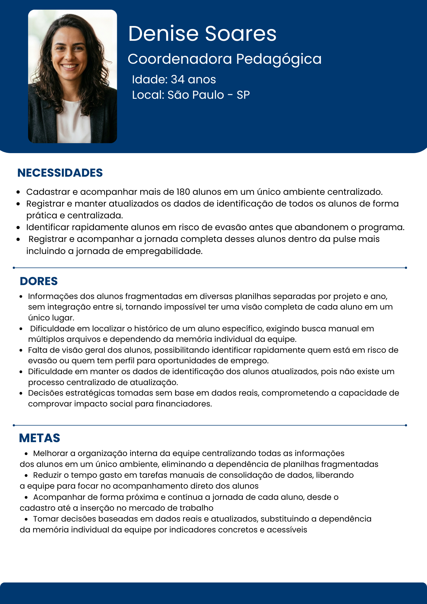<br>
  <sup>Fonte: Autores, 2026.</sup>
</div>

### 2.2.2 Persona - Psicóloga
Mariana atua como psicóloga na Pulse Mais. É responsável pelo acompanhamento emocional e psicológico dos jovens atendidos pela instituição, realizando atendimentos individuais e monitorando casos que exigem atenção prioritária. No seu dia a dia, lida com informações sensíveis de saúde mental que precisam ser registradas com sigilo e organizadas de forma que permitam um acompanhamento contínuo e seguro de cada aluno, tarefa que hoje é feita de forma manual e desorganizada, sem um ambiente específico para esse tipo de registro.

<div align="center">
  <sub>Figura 7 — Persona Psicóloga</sub><br>
  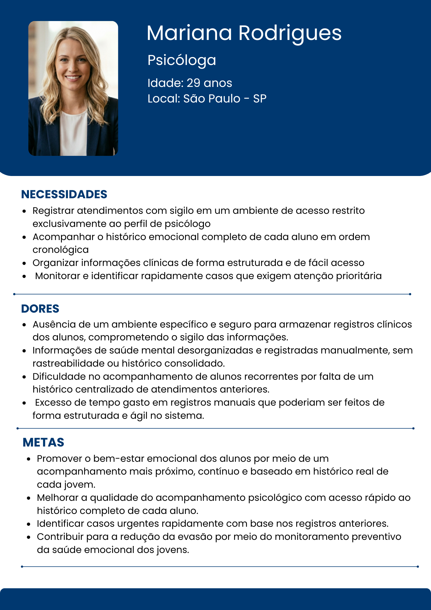<br>
  <sup>Fonte: Autores, 2026.</sup>
</div>

### 2.2.3 Persona - Aluno
Carlos é aluno ativo da Pulse Mais. Vem de família de baixa renda e enxerga na instituição uma oportunidade real de entrada no mercado de tecnologia. No seu dia a dia, concilia os estudos do programa com outras responsabilidades pessoais e familiares, e depende das informações e oportunidades oferecidas pela Pulse Mais para construir sua trajetória profissional. Por não ter experiência formal no mercado, sente insegurança em processos seletivos e precisa de visibilidade sobre sua própria jornada para se preparar melhor para as oportunidades que surgem.

<div align="center">
  <sub>Figura 8 — Persona Aluno</sub><br>
  <br>
  <sup>Fonte: Autores, 2026.</sup>
</div>

### 2.2.4 Persona - Gestor
Eduardo atua como gestor da Pulse Mais. É responsável pela visão estratégica da instituição, acompanhando os resultados dos programas e prestando contas a parceiros e investidores. No seu dia a dia, precisa ter acesso rápido a indicadores consolidados que demonstrem o impacto social gerado pela ONG, mas hoje depende de informações fragmentadas em múltiplas planilhas que dificultam a geração de relatórios estratégicos e comprometem a capacidade de apresentar resultados de forma clara e ágil.

<div align="center">
  <sub>Figura 9 — Persona Gestor</sub><br>
  <br>
  <sup>Fonte: Autores, 2026.</sup>
</div>

## 2.3. User Stories

Identificação | US01
--- | ---
Persona | Denise Soares
User Story | “Eu, como coordenadora pedagógica, quero centralizar as informações em uma única plataforma para um melhor gerenciamento da jornada dos alunos.”
Critério de aceite 1 | CR1: Dado que a coordenadora acessa a plataforma, quando ela abre o dashboard, então o sistema exibe os indicadores gerais da instituição, como total de alunos ativos, total de formados e total de jovens empregados.
Critério de aceite 2 | CR2: Dado que a coordenadora acessa a plataforma, quando ela abre o dashboard então o sistema exibe a quantidade de alunos em cada jornada.
Critérios INVEST | <ul><li>I: O cadastro e a exibição centralizada podem ser desenvolvidos de forma autônoma, com dados mockados se necessário, de forma que não depende de nenhuma outra US para ser implementada.</li><li>N: Os dados exibidos no dashboard são abertos à discussão, além disso, os detalhes de UI também podem ser negociados.</li><li>V: Entrega valor imediato ao usuário ao eliminar planilhas fragmentadas, dessa forma, os gestores passam a ter visão completa sem retrabalho manual.</li><li>E: A feature possui complexidade baixa, portanto a equipe será capaz de dividi-la bem em tasks objetivas.</li><li>S: Foca apenas no dashboard de visualização central, sem incluir edição, filtros avançados ou perfis detalhados funcionalidades .</li><li>T: Testável pela verificação de se os dados dos alunos aparecem no dashboard e se os contadores por etapa da jornada são exibidos corretamente.

Identificação | US02
--- | ---
Persona | Denise Soares
User Story | “Eu, como coordenadora pedagógica, quero acessar o dashboard para atualizar os dados dos alunos.”
Critério de aceite 1 | CR1: Dado que a coordenadora acesse a plataforma, quando ela abre o perfil do aluno então o sistema exibe informações sobre a carreira do aluno.
Critério de aceite 2 | CR2: Dado que a coordenadora acesse o perfil do aluno, quando ela alterar os dados dos alunos então os novos dados devem ser persistidos no banco e refletidos na visualização do perfil imediatamente.
Critérios INVEST | <ul><li>I: A funcionalidade de edição de perfil é isolada e não bloqueia outras histórias.</li><li>N: Quais campos são editáveis, a ordem de exibição, validações específicas são todos negociáveis.</li><li>V: Garante que a coordenadora possa corrigir e enriquecer dados sem recorrer a planilhas externas, eliminando o retrabalho.</li><li>E: Esforço técnico necessário para a implementação do formulário de edição com validações e página de perfil.</li><li>S: Cobre apenas visualização e edição de dados pessoais e de carreira, sem incluir histórico de alterações ou upload de documentos.</li><li>T: Pode ser validada conferindo se os dados editados são salvos corretamente, se mensagens de erro aparecem para campos obrigatórios e se a atualização é refletida na interface.

Identificação | US03
--- | ---
Persona |  Carlos Sales
User Story | “Eu, como aluno, quero ter acesso ao meu histórico completo da minha jornada na Pulse Mais para acompanhar a minha trajetória.”
Critério de aceite 1 | CR1: Dado que o aluno acessa a plataforma, quando abrir seu perfil então poderá ter acesso aos programas nos quais ele participou, com nome, período e status de conclusão.
Critério de aceite 2 | CR2: Dado que a equipe registrou a situação de empregabilidade do aluno, quando o aluno acessa seu perfil, então o sistema exibe o status atual de empregabilidade.
Critérios INVEST | <ul><li>I: O portal do aluno consome dados já existentes no sistema e pode ser implementado sem bloquear ou depender de histórias de gestão interna.</li><li>N: O layout da seção, a forma de apresentação do histórico (linha do tempo, lista, cards) e quais informações são destacadas podem ser discutidos com a equipe de design e UX para melhor se adaptar a esse público.</li><li>V: Devolve ao jovem a visibilidade da própria trajetória, aumentando o engajamento com a instituição e facilitando que ele use essas informações em processos seletivos.</li><li>E: A equipe deverá desenvolver a interface de visualização com os dados dos alunos, o que pode ser dividido bem entre a equipe.</li><li>S: É focada exclusivamente na visualização pelo aluno, sem incluir edição de dados de jornada.</li><li>T: Pode ser testada verificando se os programas cursados aparecem com nome, período e status corretos, e se o status de empregabilidade registrado pela equipe é exibido no perfil do aluno.

Identificação | US04
--- | ---
Persona | Carlos Sales
User Story |  “Eu, como aluno, quero registrar um e-mail primário, um e-mail secundário, um telefone primário e um telefone secundário no meu perfil para não perder nenhuma informação importante.”
Critério de aceite 1 | CR1: Dado que o aluno acessa a plataforma, quando ela editar seu perfil então o sistema possibilitará a opção de colocar mais de um celular e e-mail.
Critério de aceite 2 | CR2: Dado que um gestor acesse o perfil de um aluno, quando for verificar seus dados, então será exibido o e-mail secundário e o celular secundário, caso o aluno tenha adicionado.
Critérios INVEST | <ul><li>I: Trata exclusivamente de dados de contato no formulário de perfil, sem depender de histórico, empregabilidade ou saúde mental. </li><li>N: Limites de quantidade de contatos, obrigatoriedade do e-mail secundário podem ser ajustados.</li><li>V: Reduz risco de perda de contato com o jovem, especialmente importante em momentos críticos como oportunidades de emprego, garantindo a eficiência da rede de relacionamento da Pulse Mais. </li><li>E: A complexidade da feature abordada é baixa, portanto o setor de desenvolvimento é capaz de compreender e dividi-la em poucas, porém pontuais tasks.</li><li>S: Consiste apenas na adição de campos de contato secundários. Não inclui qualquer outra lógica além do armazenamento. </li><li>T: Pode ser testada conferindo se os campos secundários aparecem na edição, se os dados são salvos e exibidos corretamente, e se formatos inválidos são rejeitados com mensagem de erro clara.

Identificação | US05
--- | ---
Persona | Gabriely Rodrigues
User Story | “Eu, como psicóloga, quero registrar e acessar os dados que abordam a saúde mental dos alunos de forma privada, para acompanhar o emocional de cada jovem."
Critério de aceite 1 | CR1: Dado que a psicóloga acessa os dados de um aluno, quando ela abre a seção de saúde mental, então poderá visualizar o histórico completo de atendimentos e observações registradas, acessível somente aos psicólogos da Pulse Mais.
Critério de aceite 2 | CR2: Dado que a psicóloga possa registrar as informações da saúde mental dos alunos, quando ela for editar os dados, então o sistema salvará as alterações e deixará disponível para os outros psicológicos visualizarem.
Critério de aceite 3 | CR3: Dado que um usuário sem ser um psicólogo tenta acessar a seção de saúde mental, quando a requisição é feita, então o sistema nega o acesso.
Critérios INVEST |<ul><li>I: Possui seu próprio modelo de dados e regras de permissão, podendo ser desenvolvida sem impactar ou depender dos demais módulos do sistema.</li><li>N: Os níveis do indicador geral, a estrutura do prontuário e os campos obrigatórios são negociáveis.</li><li>V: Protege a privacidade dos jovens, oferece à psicóloga um ambiente seguro para registros clínicos e dá à gestão visibilidade preventiva.</li><li>E: A tarefa é simples de ser compreendida, envolvendo o desenvolvimento de controle de permissões por perfil.</li><li>S: Focada em registro, visualização e controle de acesso ao prontuário. Não inclui notificações automáticas de alerta à gestão, relatórios estatísticos de saúde mental ou integração com sistemas externos. </li><li>T: É possível verificar se a psicóloga acessa o conteúdo completo e se o acesso sem permissão é bloqueado corretamente pelo sistema.


Identificação | US06
--- | ---
Persona | Denise Soares
User Story | “Eu, como coordenadora pedagógica, quero um filtro que mostre apenas os alunos que correspondam ao mesmo grupo, como idade, situação de empregabilidade, gênero e entre outros, para identificar rapidamente perfis específicos para oportunidades de emprego ou no intuito de  reconhecer jovens multiplicadores na rede.”
Critério de aceite 1 | CR1: Dado que a coordenadora busca por um grupo específico de alunos, quando ela aplica um ou mais filtros disponíveis, então o sistema retorna apenas os alunos que atendem aos critérios selecionados.
Critério de aceite 2 | CR2: Dado que nenhum aluno corresponde aos filtros aplicados, quando a busca é executada, então o sistema informa que não há alunos correspondentes.
Critérios INVEST |<ul><li>I: Opera sobre dados de alunos já existentes no sistema, sem criar ou modificar estruturas de outros módulos. Pode ser desenvolvida e testada de forma isolada, pois depende apenas do cadastro centralizado já definido.</li><li>N: Os filtros entregues na primeira versão, a ordem em que aparecem na interface e a possibilidade de exportação são negociáveis com o parceiro.</li><li>V: Elimina a necessidade de vasculhar planilhas manualmente para encontrar perfis específicos.</li><li>E: O escopo é claro e delimitado, envolvendo a aplicação de filtros combinados sobre campos já cadastrados.</li><li>S: Focada na filtragem e segmentação de perfis de alunos por critérios cadastrais e de jornada. Não inclui criação de novos campos de cadastro, envio de comunicações aos alunos filtrados ou geração de relatórios de impacto consolidados.</li><li>T: É possível verificar se a combinação de dois ou mais filtros retorna apenas alunos que atendem a todos os critérios simultaneamente e se a mensagem de ausência de resultados aparece corretamente.

Identificação | US07
--- | ---
Persona | Denise Soares
User Story | "Eu, como coordenadora pedagógica, quero registrar a conquista de emprego de um aluno informando empresa, cargo, data de início e faixa salarial, para que os índices de empregabilidade da instituição sejam atualizados automaticamente e sirvam de base para decisões estratégicas e prestação de contas aos doadores."
Critério de aceite 1 | CR1: Dado que a coordenadora acessa o perfil de um aluno, quando ela registra um novo emprego, então o sistema salva o registro e atualiza o status do aluno para Empregado.
Critério de aceite 2 | CR2: Dado que o aluno já possui um emprego ativo registrado, quando a gestora tenta registrar um novo emprego, então o sistema solicita que o emprego anterior seja encerrado antes de adicionar um novo.
Critérios INVEST |<ul><li>I: Opera sobre o perfil do aluno já existente no sistema e atualiza o dashboard por meio de dados já estruturados, sem depender de outros módulos em desenvolvimento. Pode ser construída e testada de forma isolada.</li><li>N: A faixa salarial pode ser tratada como campo opcional em uma primeira entrega, e os marcos de retenção de 3, 6 e 12 meses podem compor uma User Story separada, negociada com o parceiro conforme prioridade.</li><li>V: Permite que a instituição monitore em tempo real quantos jovens estão empregados, fortalecendo a capacidade de prestação de contas para doadores e embasando decisões estratégicas de empregabilidade com dados reais.</li><li>E: O escopo é claro e delimitado.</li><li>S: Focada no registro do vínculo empregatício ativo do aluno. Não inclui o acompanhamento de retenção nos marcos de 3, 6 e 12 meses, o registro de ingresso no ensino superior nem o histórico de empregos anteriores encerrados.</li><li>T: É possível verificar se o sistema bloqueia o envio sem data de início, se impede o registro de um segundo emprego ativo sem encerrar o anterior e se o contador de jovens empregados no dashboard é atualizado imediatamente após o registro.

Identificação | US08
--- | ---
Persona | Carlos Sales
User Story | "Eu, como aluno ativo na plataforma, quero receber por e-mail comunicados enviados pela equipe da Pulse Mais sobre eventos e oportunidades, para me manter informado sobre as iniciativas da instituição."
Critério de aceite 1 | CR1: Dado que a equipe dispara um comunicado pela plataforma, quando o envio é confirmado, então o sistema encaminha o e-mail para todos os alunos com status ativo e e-mail cadastrado.
Critério de aceite 2 | CR2: Dado que o aluno acessa seu portal, quando ele visualiza a seção de comunicados, então o sistema exibe o histórico de mensagens recebidas da equipe em ordem cronológica.
Critérios INVEST |<ul><li>I: Esta US pode ser construída e testada de forma isolada, utilizando o cadastro de alunos ativos e e-mails já existentes no sistema. O disparo de e-mails pode ser implementado sem depender de outros módulos em desenvolvimento.</li><li>N: O conteúdo e o formato do e-mail (layout, campos exibidos, nome do remetente) são negociáveis.</li><li>V: Mantém o aluno informado sobre eventos e oportunidades da instituição, fortalecendo o vínculo com o programa e aumentando o engajamento com as iniciativas da Pulse Mais.</li><li>E: O escopo é claro e delimitado, com fluxo de disparo e visualização de histórico bem definidos nos critérios de aceite. A estimativa pode ser feita com segurança após validação do serviço de envio de e-mail a ser utilizado.</li><li>S: Focada exclusivamente no envio de comunicados por e-mail para alunos ativos e na exibição do histórico de mensagens no portal. Não inclui notificações por outros canais, segmentação de público por perfil nem agendamento de envios futuros.</li><li>T: É possível verificar se o sistema encaminha o e-mail a todos os alunos ativos com e-mail cadastrado após o disparo da equipe, e se o portal exibe o histórico de comunicados recebidos em ordem cronológica.</li></ul>

Identificação | US09
--- | ---
Persona | Denise Soares
User Story | “Eu, como coordenadora pedagógica, quero registrar e visualizar alertas de risco de evasão de um aluno com base em critérios como faltas consecutivas ou baixo engajamento, para agir preventivamente antes que o jovem abandone o programa.”
Critério de aceite 1 | CR1: Dado que um aluno atinge mais de 5% de faltas ou deixa de entregar duas ou mais atividades consecutivas, quando o sistema processa os registros de frequência, então um alerta de risco de evasão é gerado automaticamente e exibido para a coordenadora administrativa.
Critério de aceite 2 | CR2: Dado que uma gestora acesse a plataforma, quando for verificar a presença dos alunos para uma atividade, então o sistema destacará os alunos que não a realizaram.
Critério de aceite 3 | CR3: Dado que a equipe gestora concluiu o acompanhamento de um alerta, quando o alerta for marcado como resolvido, então o sistema registra a data de resolução e deixa de considerá-lo ativo.
Critérios INVEST |<ul><li>I: Esta US pode ser construída e testada de forma isolada, consumindo dados de frequência e atividades já estruturados no sistema, sem depender de outros módulos em desenvolvimento.</li><li>N: Os limiares de disparo (5% de faltas e 2 atividades consecutivas não entregues) são parâmetros negociáveis. A forma de exibição dos alertas também pode ser ajustada conforme a realidade do programa sem invalidar a essência da história.</li><li>V: Permite que a coordenadora aja preventivamente antes que o jovem abandone o programa, reduzindo a evasão, indicador crítico para prestação de contas a doadores e para a sustentabilidade do programa.</li><li>E: O escopo é claro e delimitado, com critérios de disparo objetivos e uma tela de visualização bem definida.</li><li>S: Focada na geração automática de alertas por faltas ou baixo engajamento e na visualização consolidada desses alertas. Não inclui ações pós-alerta, histórico de intervenções realizadas nem integração com canais de comunicação com o aluno.</li><li>T: É possível verificar se o sistema gera o alerta ao atingir 5% de faltas, se gera o alerta após 2 atividades consecutivas não entregues e se a coordenadora visualiza a lista de alunos em risco com o motivo e a data do alerta.</li></ul>

Identificação | US10
--- | ---
Persona | Denise Soares
User Story | “Eu, como coordenadora pedagógica, quero importar arquivos CSV seguindo um modelo definido pela plataforma para migrar dados históricos das planilhas para o sistema de forma organizada, sem risco de sobrescrever registros já existentes.”
Critério de aceite 1 | CR1: Dado que a gestora acessa a funcionalidade de importação e faz o upload de um CSV no modelo correto, quando o sistema processa o arquivo, então os registros são importados e exibidos na listagem de alunos.
Critério de aceite 2 | CR2: Dado que o arquivo CSV importado conflite com dados já existentes no sistema, quando o processamento identifica o conflito, então o sistema alerta a gestora indicando quais registros conflitam e os dados não são sobrescritos.
Critério de aceite 3 | CR3: Dado que o arquivo CSV importado contenha dados de alunos já existentes no sistema, quando o sistema identificar conflitos, então nenhuma alteração deve ser aplicada automaticamente apenas as alterações revisadas e confirmadas explicitamente pela coordenadora serão salvas na plataforma.
Critérios INVEST |<ul><li>I: Esta US pode ser construída e testada de forma isolada, utilizando a estrutura de cadastro de alunos já existente no sistema.</li><li>N: O modelo do CSV (campos obrigatórios, formato das colunas) é negociável e pode ser ajustado conforme a realidade das planilhas já utilizadas pela coordenadora. A forma de exibição dos conflitos também pode ser refinada sem alterar a essência da história.</li><li>V: Permite que a instituição migre seu histórico de dados com segurança e organização, eliminando o retrabalho manual de cadastro e reduzindo o risco de perda ou duplicidade de informações críticas dos alunos.</li><li>E: O escopo é claro e delimitado, com fluxo de importação e tratamento de conflitos bem definidos nos critérios de aceite.</li><li>S: Focada exclusivamente na importação de dados históricos via CSV seguindo modelo definido pela plataforma, com proteção contra sobrescrita de registros existentes. Não inclui exportação de dados, edição em lote pós-importação nem importação de outros formatos de arquivo.</li><li>T: É possível verificar se o sistema importa corretamente um CSV válido e exibe os registros na listagem, se bloqueia a sobrescrita ao identificar conflitos e se exibe para a gestora quais registros estão em conflito antes de qualquer alteração.</li></ul>

Identificação | US11
--- | ---
Persona | Carlos Sales
User Story | "Eu, como aluno ativo na plataforma, quero visualizar um banner de alerta no meu portal quando minha frequência estiver abaixo do limite exigido, para que eu possa tomar ciência da situação e agir antes de ser desligado do programa."
Critério de aceite 1 | CR1: Dado que o aluno acessa seu portal, quando sua frequência estiver abaixo de 95%, então o sistema exibe um banner de alerta visível no topo da página informando a situação.
Critério de aceite 2 | CR2: Dado que o aluno acessa seu portal, quando sua frequência estiver dentro do limite exigido, então o banner de alerta não é exibido.
Critérios INVEST | <ul><li>I: A exibição do banner pode ser desenvolvida de forma isolada utilizando dados mockados de frequência, sem depender da implementação completa do registro de presença.</li><li>N: A posição do banner na tela, o texto exibido e o limiar exato de frequência que dispara o alerta são negociáveis com o parceiro sem alterar a essência da história.</li><li>V: Entrega valor direto ao aluno ao torná-lo consciente da sua situação de frequência, permitindo que ele aja preventivamente antes de atingir o critério de evasão.</li><li>E: A complexidade é baixa, envolvendo apenas a lógica de exibição condicional do banner com base no percentual de frequência já registrado no sistema.</li><li>S: Focada exclusivamente na exibição do alerta de frequência no portal do aluno. Não inclui ações pós-alerta, notificações para o gestor nem histórico de alertas visualizados.</li><li>T: Pode ser testada verificando se o banner aparece corretamente quando a frequência está abaixo de 95% e se não é exibido quando a frequência está dentro do limite exigido.</li></ul>
# <a name="c3"></a>3. Projeto da Aplicação Web 

## 3.1. Requisitos do Sistema 


### 3.1.1. Requisitos Funcionais 


| ID    | Descrição | Prioridade | Status |
|-------|---------------------------------------------------------------------------------------------------------------------------------------------------------------------------------------------------------|------------|--------------|
| RF001 | O sistema deve identificar o perfil de estudante com base nas credenciais de login, permitindo que o aluno visualize e edite apenas seus próprios dados cadastrais básicos | Alto | Implementado |
| RF002 | O sistema deve identificar o perfil de gestor com base nas credenciais de login, concedendo permissão para visualizar frequências, anotações qualitativas e dados de jornada dos alunos | Alto | Implementado |
| RF003 | O sistema deve identificar o perfil de coordenador com base nas credenciais de login, concedendo permissão para registrar frequências, anotações qualitativas, comunicados e eventos | Alto | Implementado |
| RF004 | O sistema deve identificar o perfil de psicólogo com base nas credenciais de login, concedendo permissão para registro de prontuários de saúde mental dos alunos | Alto | Implementado |
| RF005 | O sistema deve permitir que o aluno registre um e-mail primário, um e-mail secundário, um telefone primário e um telefone secundário em seu perfil | Alto | Planejado |
| RF006 | O sistema deve permitir que coordenadores cadastrem e gerenciem turmas, associando alunos e professores a cada turma e definindo o período de início e encerramento | Alto | Planejado |
| RF007 | O sistema deve exibir ao aluno, em seu portal, o histórico completo de sua jornada na Pulse Mais, incluindo programas cursados, eventos participados, certificados conquistados e situação de empregabilidade registrada pela equipe | Alto | Planejado |
| RF008 | O sistema deve permitir que coordenadores registrem a frequência e a participação dos alunos em aulas e eventos, com obrigatoriedade de informar a data do registro, o responsável e o tipo de atividade | Alto | Planejado |
| RF009 | O sistema deve permitir que coordenadores registrem a conquista de emprego de um aluno, informando empresa, cargo, data de início e faixa salarial, sendo permitido apenas um emprego ativo registrado por vez | Alto | Planejado |
| RF010 | O sistema deve atualizar automaticamente o dashboard da equipe gestora com indicadores de frequência por aluno e por turma, total de jovens empregados, taxa de retenção no emprego e total de alunos concluintes por período | Alto | Planejado |
| RF011 | O sistema deve gerar um alerta para a equipe gestora quando um aluno atingir 1 falta no módulo em uma turma ou deixar de entregar duas ou mais atividades consecutivas, sinalizando risco de evasão | Média | Planejado |
| RF012 | O sistema deve exibir ao aluno seus alertas de frequência de forma visível em seu portal | Média | Planejado |
| RF013 | O sistema deve permitir que o psicólogo registre observações individuais sobre o aluno no prontuário de saúde mental, com data e identificação do profissional. | Média | Planejado |
| RF014 | O sistema deve tornar o prontuário de saúde mental acessível apenas ao psicólogo, exibindo para os gestores somente a informação de dados gerais de condição de estabilidade emocional, sem acesso ao conteúdo das observações | Média | Planejado |
| RF015 | O sistema deve permitir filtrar alunos por idade, situação de empregabilidade, turma, localização residencial, quantidade de eventos participados ou gênero | Média | Planejado |
| RF016 | O sistema pode oferecer um canal para que professores e gestores enviem e-mails informativos e convites de eventos para alunos com e-mail cadastrado e status ativo ou ex-aluno | Baixo | Planejado |
| RF017 | O sistema pode permitir a importação de arquivos CSV seguindo um modelo de colunas definido pela plataforma, marcando os registros importados como migrados e alertando o gestor em caso de conflito com dados já existentes, sem sobrescrever automaticamente | Baixo | Planejado |
| RF018 | O sistema deve permitir que integrantes autorizados da equipe visualizem, registrem, atualizem e removam anotações qualitativas associadas a um aluno, mantendo a identificação do autor e a data do registro | Média | Parcialmente implementado |
| RF019 | O sistema deve permitir que gestores e coordenadores marquem alertas de evasão como resolvidos, registrando a data da resolução | Média | Parcialmente implementado |

### 3.1.2. Regras de Negócio

| ID   | Descrição | RF associado |
|------|-----------|--------------|
| RN001 | O sistema identifica o usuário e suas permissões pelas credenciais validadas e pela sessão assinada no back-end. O perfil selecionado na interface não concede permissão sem uma credencial correspondente válida. | RF001, RF002, RF003, RF004 |
| RN002 | Gestores podem visualizar apenas o indicador geral de estabilidade emocional do aluno (ex.: estável / atenção / crítico), sem acesso ao conteúdo das observações clínicas registradas pelo psicólogo | RF014 |
| RN003 | Caso o usuário tente acessar uma rota sem a permissão correspondente, o sistema deve bloquear a ação e exibir uma mensagem de "Acesso Negado". | RF001, RF002, RF003 |
| RN004 | O gestor tem a permissão para visualizar frequências, anotações qualitativas e dados de jornada dos alunos | RF002 |
| RN005 | Apenas o usuário com perfil de psicólogo pode ter acesso para visualizar, inserir ou editar os dados de saúde mental dos alunos. | RF013, RF014 |
| RN006 | Não é possível registrar uma presença em data futura. | RF008 |
| RN007 | Um aluno só pode ter um emprego registrado com status ativo por vez no sistema. | RF009 |
| RN008 | Considera-se um vínculo ativo apenas aquele que possui data de início preenchida e status de "Empregado", caso contrário esta empregabilidade é rejeitada | RF009 |
| RN009 | O dashboard deve realizar a contagem de jovens empregados ignorando registros marcados como históricos (inativos) | RF009 |
| RN010 | O aluno só pode atualizar seus dados cadastrais básicos (endereço, telefone e e-mail). | RF001 |
| RN011 | Dados de jornada, frequência ou empregabilidade são bloqueados para edição pelo aluno, sendo geridos exclusivamente pela equipe. | RF001 |
| RN012 | O aluno pode faltar em apenas uma aula do módulo, caso contrário é considerado módulo incompleto, gerando um alerta para o coordenador e gestor | RF010, RF011 |
| RN013 | O aluno deve entregar as atividades propostas, caso contrário é considerado módulo incompleto, gerando um alerta para o coordenador e gestor | RF010, RF011 |
| RN014 | O prontuário de evolução do aluno é imutável após o registro. | RF013 |
| RN015 | Novas informações ou atualizações clínicas devem ser feitas por meio de novas entradas, nunca editando ou apagando registros anteriores. | RF013 |
| RN016 | Quando o aluno atingir o critério de alerta de evasão, o sistema enviará uma notificação à equipe gestora para que ela entre em contato. | RF011 |
| RN017 | Alunos que receberem o status definitivo de "evadido" são mantidos no banco de dados para composição de histórico | RF009 |
| RN018 | Alunos que evadem deixam de contabilizar nos indicadores e gráficos de conclusão do dashboard de gestão. | RF010 |
| RN019 | O cálculo e acompanhamento dos marcos de retenção no emprego (3, 6 e 12 meses) só são ativados e computados pelo sistema se o registro do emprego possuir uma data de início formalmente preenchida. | RF009, RF010 |
| RN020 | Uma anotação deve estar associada a um aluno existente e possuir autor e conteúdo não vazios. Quando a data não for informada, deve ser utilizada a data atual. | RF018 |
| RN021 | As anotações da equipe são registros qualitativos gerais e não podem conter ou expor informações do prontuário psicológico. | RF018 |
| RN022 | Somente integrantes autorizados da equipe podem consultar, criar, alterar ou excluir anotações. | RF018 |
| RN023 | Somente alertas ativos podem ser resolvidos. Ao resolver um alerta, o sistema deve alterar seu status e registrar a data de resolução. | RF019 |

> **Pendência de implementação:** autenticação e autorização por perfil já são aplicadas de forma centralizada. O endpoint de resolução ainda deve bloquear alertas já resolvidos para atender integralmente à RN023.

### 3.1.3. Requisitos Não Funcionais — baseados em ISO/IEC 25010 e FURPS+ 


| Eixo                     | Requisito | Métrica / Critério | Como atendido |
|--------------------------|-----------|--------------------|---------------|
| USAB — Usabilidade       | Palheta de cores       | Contraste entre o primeiro plano e o fundo tem que estar ≥ 5:1         | Baseado no padrão de contraste do W3C (LAWTON, 2025), com paleta e tipografia aplicadas às telas reais em HTML/CSS de todos os perfis (diretório `public/`), evidenciadas nas Figuras 81–93 (Seção 4.2).           |
| CONF — Confiabilidade    | Integridade dos dados       |   Garantia de propriedades ACID (BARROS, 2016).             |   Transações sobre o PostgreSQL via pool de conexões (`src/database/connection.ts`), validadas pela suíte Jest com 36 suítes/330 testes (Seção 5.1) cobrindo retornos 200/201/400/404/409/422/500.         |
| DES — Desempenho         | Tempo de carregamento da página       | p95 < 2000 ms (2 segundos).         | Minificação de JS/CSS e arquivos estáticos servidos pelo Express (diretório `public`), com tempos dentro do alvo na validação manual (Postman, Figura 94).           |
| SUP — Suportabilidade    | Responsividade       |Suporte a Viewports de 360px a 1920px.                | Padrão Mobile-First com breakpoints definidos no CSS (diretório `public/`), garantindo responsividade nos perfis aluno, coordenadora, gestor e psicóloga (Figuras 81–93).          |
| SEG — Segurança          | 	Proteção contra vulnerabilidades       | Proteção contra Top 10 vulnerabilidades.               | Camada de autenticação por sessão (`/auth/*`) e middleware de autorização por perfil, com isolamento do `RelatorioRepository` (Seção 3.2.3.1) para dados de saúde mental e teste de acesso negado 403 (CT-S12, Seção 5.1), seguindo o guia OWASP Top 10.           |
| CAP — Capacidade         | Escalabilidade       | 	Suporte a carga nominal sem degradação.                |  Pool de conexões PostgreSQL (`src/database/connection.ts`) reaproveitando conexões sob concorrência, conforme base prevista pela norma ISO/IEC 29119.           |
| REST — Restrições Design | Design System       | 	Consistência visual e de componentes.                | Implementação baseada no Atomic Design (FROST, 2016), com componentes (cards, menu lateral, tabelas, formulários, modais) padronizados e reaplicados em todas as telas e serviços JS centralizados (`coordenadora-api.js`, `gestor-api.js`, `psicologaService.js`, `aluno-script.js`), conforme Seção 4.2.           |
| ORG — Organizacionais    | 	Processo de Dev       | 	Entregas em ciclos iterativos.                | Metodologia Agile com Scrum, entregas incrementais versionadas no Git e documentação técnica (RTM e Matriz RF→RN→Endpoint) mantida atualizada conforme o código (Seções 3.1.4 e 3.9).           |


### 3.1.4. Matriz RF → RN → Endpoint

| RF | RN associadas | Endpoint | Método | Status |
|---|---|---|---|---|
| RF001, RF005 | RN001, RN010, RN011 | `/aluno` | GET, PATCH | Implementado |
| RF002, RF003 | RN001, RN004 | `/gestor/:rm/alunos`, `/gestor/:rm/alunos/:ra`, `/coordenadora/:rm/alunos` | GET | Implementado |
| RF002, RF003 | RN001, RN003 | `/gestao/alunos` (cadastro de aluno) | POST | Implementado |
| RF004 | RN001, RN003, RN005 | `/psicologa/:rm`, `/psicologa/:rm/alunos`, `/psicologa/:rm/alunos/:ra/relatorios`, `/psicologa/:rm/alunos/:ra/relatorios/:id_relatorio` | GET, POST, PATCH | Implementado |
| RF004 | RN001, RN003 | `/auth/login`, `/auth/logout`, `/auth/me` (camada de autenticação por sessão) | POST, GET | Implementado |
| RF006 | RN001 | `/gestao/turmas` e `/gestao/turmas/:id` | GET, POST, PUT | Implementado |
| RF006 | RN001 | `/gestao/turmas/:id/alunos` | POST | Implementado |
| RF007 | — | `/aluno/:ra/jornada` e `/aluno/:ra/certificados` | GET | Implementado |
| RF008 | RN006, RN012, RN013 | `/gestao/alunos/:ra/frequencia/aulas` | GET, POST | Implementado |
| RF008 | RN006 | `/gestao/alunos/:ra/frequencia/eventos` | POST | Implementado |
| RF008 | RN012 | `/gestao/turmas/:id/frequencia` | GET | Implementado |
| RF009 | RN007, RN008, RN009, RN017, RN019 | `/gestao/alunos/:ra/emprego` e `/gestao/alunos/:ra/emprego/:id_emprego` | GET, POST, PATCH | Implementado |
| RF010 | RN009, RN012, RN018, RN019 | `/dashboard`, `/dashboard/frequencia` e `/dashboard/empregabilidade` | GET | Implementado |
| RF011 | RN012, RN013, RN016 | `/gestao/alertas` | GET | Implementado |
| RF012 | RN012, RN016 | `/aluno/:ra/alertas` | GET | Implementado |
| RF013, RF014 | RN002, RN003, RN005, RN014, RN015 | `/psicologa/:rm/alunos/:ra/relatorios` | GET, POST | Implementado |
| RF015 | — | `/gestao/alunos?filtros` | GET | Implementado |
| RF016 | RN003 | `/gestao/comunicados` | POST | Implementado |
| RF017 | RN003 | `/gestao/importacao` | POST | Implementado |
| RF018 | RN020, RN021, RN022 | `/alunos/:ra/anotacoes` | GET, POST | Implementado |
| RF018 | RN020, RN021, RN022 | `/anotacoes/:id` | PATCH, DELETE | Implementado |
| RF019 | RN023 | `/gestao/alertas/:id/resolver` | PATCH | Implementado |

## 3.2. Arquitetura

### 3.2.1. Diagrama de Arquitetura 

A arquitetura da plataforma Pulse Mais foi desenvolvida seguindo o padrão de Arquitetura em Camadas (Layered Architecture), com separação entre as camadas de View, Controller e Model. Essa estrutura foi adotada para promover maior organização do sistema, facilitar sua manutenção e permitir a evolução da aplicação de forma escalável. A divisão em camadas garante que cada componente possua responsabilidades bem definidas, reduzindo o acoplamento entre os módulos e tornando o desenvolvimento mais estruturado.

<div align="center">
  <sub>Figura 10 — Diagrama de Arquitetura em Camadas</sub><br>
  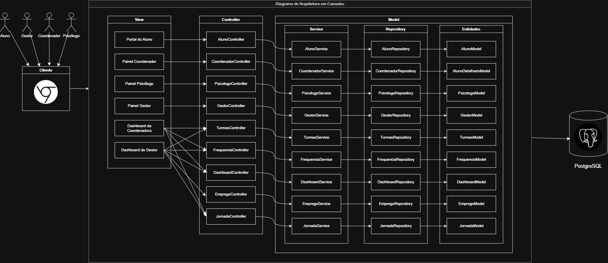<br>
  <sup>Fonte: Autores, 2026.</sup>
</div>


A camada View é responsável pelas interfaces apresentadas aos diferentes perfis de usuário da plataforma, incluindo aluno, coordenador, gestor e psicólogo, além dos dashboards gerenciais e do módulo de prontuário. Essas interfaces realizam requisições HTTP para os endpoints REST disponibilizados pela aplicação, permitindo operações como autenticação, cadastro de usuários, registro de frequência, acompanhamento da empregabilidade, visualização de indicadores e gerenciamento de prontuários.

A camada Controller atua como intermediária entre a interface e a lógica de negócio. Sua responsabilidade é receber as requisições, validar os dados de entrada e encaminhá-los aos serviços apropriados, retornando as respostas ao usuário. Os controladores implementados incluem AlunoController, CoordenadorController, PsicologoController, GestorController, TurmasController, FrequenciaController, DashboardController, EmpregoController e ProntuarioController.

A camada Service concentra as regras de negócio da plataforma, promovendo o desacoplamento entre a interface e a lógica operacional. Nessa camada são executadas validações de permissões por perfil de usuário, cálculos de indicadores de evasão, verificações de frequência mínima, atualização automática de dashboards, gerenciamento de dados de empregabilidade e controle de acesso aos prontuários psicológicos, garantindo que apenas profissionais autorizados possam visualizar informações sensíveis.

A camada Repository é responsável pelo acesso aos dados persistidos, implementando o padrão Repository para abstrair operações de consulta, inserção, atualização e remoção. Cada entidade do domínio possui seu respectivo repositório, permitindo que alterações na tecnologia ou estrutura de persistência sejam realizadas sem impactar as regras de negócio da aplicação.

A camada Model concentra os componentes responsáveis pela representação e manipulação dos dados da aplicação. Nela estão agrupadas as entidades de domínio, os serviços de negócio e os repositórios de acesso a dados. As entidades modelam os principais conceitos da plataforma, incluindo Aluno, Coordenador, Psicólogo, Gestor, Turma, Frequência, Dashboard, Emprego e Prontuário. Os serviços implementam as regras de negócio relacionadas a essas entidades, enquanto os repositórios realizam as operações de persistência e consulta no banco de dados PostgreSQL.

O banco de dados PostgreSQL atua como repositório central das informações da plataforma, armazenando dados acadêmicos, administrativos e de acompanhamento dos usuários. Dessa forma, o sistema estabelece uma única fonte confiável de dados (Single Source of Truth, SSOT), garantindo consistência e integridade das informações utilizadas pelos diferentes módulos da aplicação.


### 3.2.2. Diagrama de Casos de Uso

<div align="center">
  <sub>Figura 11 — Diagrama de Caso de Uso</sub><br>
  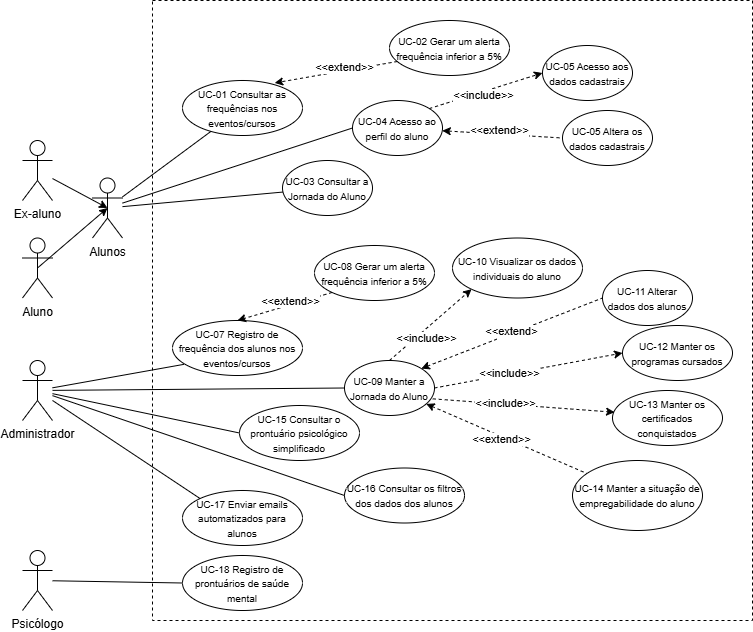<br>
  <sup>Fonte: Autores, 2026.</sup>
</div>


### 3.2.3. Diagrama de Classes do Domínio 

A tabela a seguir descreve cada relação em linguagem acessível, indicando quantos registros de uma entidade podem estar associados a registros de outra. Essa leitura complementa o diagrama de classe do domínio, tornando explícitas as decisões de modelagem que impactam diretamente funcionalidades críticas da plataforma.

Para acessar essa tabela presente no WAD só clicar aqui na [tabela de multiplicidades](#multiplicidades)

A notação utilizada segue o padrão (mínimo, máximo), onde:
- 1 indica que a entidade participa obrigatoriamente e de forma única na relação
- 0..1 indica que a participação é opcional, mas limitada a um único registro
- 0..* indica que a participação é opcional e pode envolver múltiplos registros (o mesmo que 0,N)
- 1..* indica que a participação é obrigatória e pode envolver múltiplos registros (o mesmo que 1,N)
- ..  os dois pontos separando os valores são apenas a forma como a notação UML escreve o intervalo,
  sendo equivalente à vírgula usada na notação de Chen (ex: 0..* = 0,N e 1..* = 1,N)

O diagrama de classes do domínio representa a estrutura estática do sistema, modelando as entidades centrais da plataforma, seus atributos e os relacionamentos entre elas. Segundo Booch, Rumbaugh e Jacobson (2007), o diagrama de classes é o artefato mais utilizado na modelagem orientada a objetos, pois descreve o vocabulário do sistema e serve de base tanto para o projeto do banco de dados quanto para a implementação do código.
No contexto da plataforma da Pulse Mais, as classes do domínio refletem as entidades identificadas nos requisitos funcionais: Aluno, Gestor, Psicólogo, Coordenador, Turma, Programa, Aula, Certificado, Alerta, Evento, Mentoria, Empregabilidade e Relatorio. Os relacionamentos entre essas classes seguem as regras de negócio definidas na seção 3.1.2. Cada associação e tipo de entidade está definida corretamente na legenda, assim como sua multiplicidade, e privacidade de atributos.

<div align="center">
  <sub>Figura 12 — Diagrama de Classes do Domínio</sub><br>
  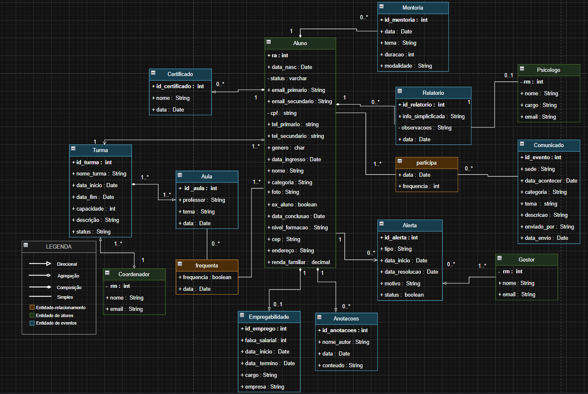<br>
  <sup>Fonte: Autores, 2026.</sup>
</div>

| Tipo de linha | Símbolo visual | Significado | Exemplo no projeto |
|---|---|---|---|
| **Associação simples** | Linha sólida sem pontas especiais | Duas entidades se relacionam, mas existem de forma independente | Aluno se relaciona com Evento, ambos existem sem depender um do outro |
| **Associação direcional** | Linha sólida com seta aberta em uma ponta | O relacionamento tem sentido único: uma entidade "conhece" a outra, mas não o contrário | O Aluno acessa seu Relatório, mas o Relatório não precisa conhecer o Aluno para existir |
| **Agregação** | Linha sólida com losango vazio na ponta | Uma entidade é "parte de" outra, mas pode existir de forma independente se a principal for removida | Uma Aula faz parte de uma Turma, mas se a Turma for encerrada, o registro da Aula pode ser mantido |
| **Composição** | Linha sólida com losango preenchido na ponta | Uma entidade depende completamente da outra para existir, se o "todo" for removido, a "parte" também deixa de existir | O Prontuário (Relatório) de saúde mental depende completamente do Aluno. Se o aluno for removido, o prontuário perde sua razão de existir |

### 3.2.3.1. Diagrama de Classes Arquitetural

Um diagrama de classes arquitetural é uma representação visual da estrutura estática de um sistema de software, com foco em como as responsabilidades estão distribuídas entre as grandes camadas da aplicação. Diferente de um diagrama de classes de domínio, que descreve entidades do mundo real e seus atributos, o diagrama arquitetural mostra os componentes técnicos do código — controllers, services, repositories e models — e como eles se relacionam entre si para processar uma requisição.
O diagrama está dividido entre Controller, Service, Repository e Model.
Como um Diagrama contendo toda estrutura implementada ficaria muito extenso, foi criado 4 diagramas, um para cada usuário:

#### Aluno
<div align="center">
  <sub>Figura 13 — Diagrama de Classes Arquitetural Aluno</sub><br>
  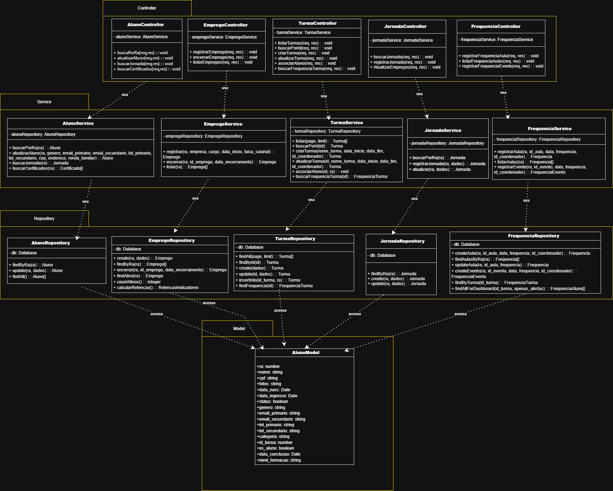<br>
  <sup>Fonte: Autores, 2026.</sup>
</div>

Cobre as operações do aluno e da sua jornada na instituição. O AlunoController delega para o AlunoService, que acessa dados cadastrais completos do jovem — contatos, endereço, renda familiar, nível de formação. O JornadaController e JornadaService gerenciam a trajetória do aluno na Pulse Mais, com operações de busca, registro e atualização via JornadaRepository. O EmpregoController registra e encerra vínculos profissionais; o EmpregoRepository também expõe countAlivos() e calcularRetencao() para alimentar o dashboard. O FrequenciaRepository distingue frequência de aula de frequência de evento, e expõe consultas para o dashboard via findAllForDashboard. Na camada Model, AlunoModel e AlunoDetalhadoModel definem os campos do perfil, e RegistrarFrequencia define os campos mínimos para registrar uma presença.

#### Coordenador
<div align="center">
  <sub>Figura 14 — Diagrama de Classes Arquitetural Coordenadora</sub><br>
  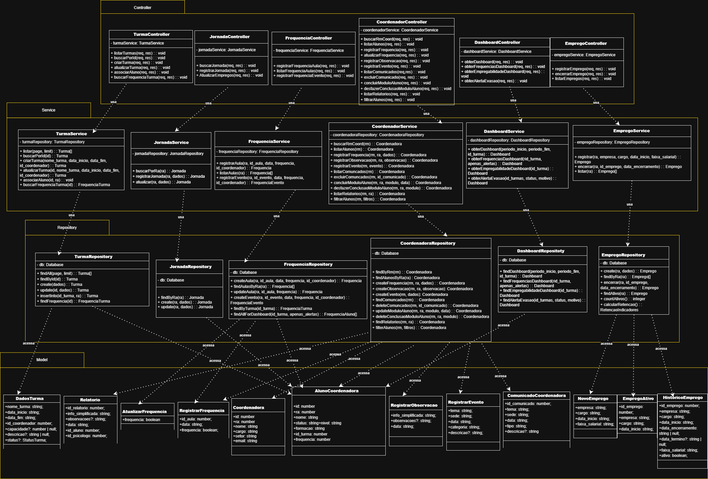<br>
  <sup>Fonte: Autores, 2026.</sup>
</div>

Cobre o perfil da coordenadora e os indicadores institucionais. O CoordenadorService é o de maior número de dependências do sistema: acessa CoordenadoraRepository, AlunoRepository, FrequenciaRepository, ObservacaoRepository e EventoRepository, refletindo o papel central da coordenadora no acompanhamento diário. O DashboardService agrega dados de quatro repositories — AlunoRepository, EmpregoRepository, FrequenciaRepository e TurmaRepository — para gerar os indicadores do período. Na camada Model, as classes Coordenadora, AlunoCoordenadora, RegistrarObservacao, RegistrarEvento e Turma definem as estruturas de dados específicas para esse perfil.

#### Psicólogo
<div align="center">
  <sub>Figura 15 — Diagrama de Classes Arquitetural Psicólogo</sub><br>
  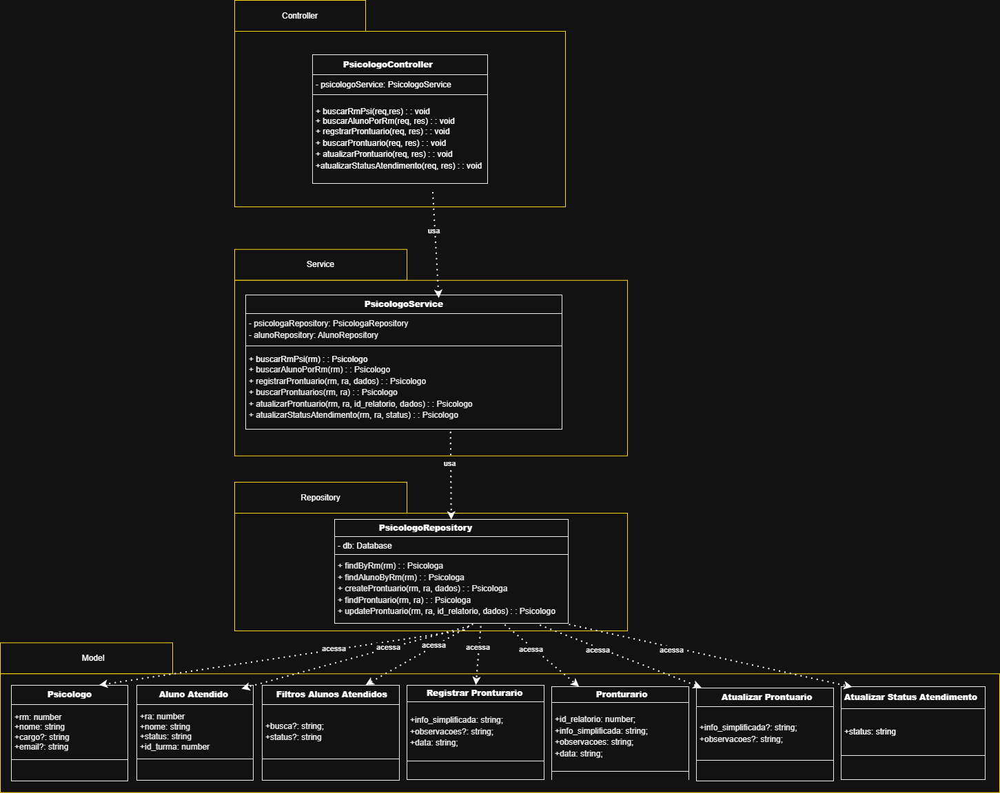<br>
  <sup>Fonte: Autores, 2026.</sup>
</div>

O mais enxuto dos quatro e o mais restrito em termos de acesso. O PsicologoService depende de três repositories: PsicologaRepository para autenticação por RM, AlunoRepository para listar alunos e RelatorioRepository para criar, buscar e atualizar prontuários. O RelatorioRepository não é acessado por nenhum outro service do sistema — essa separação implementa no nível do código a restrição de privacidade dos dados de saúde mental. O Model apresenta apenas a classe Psicologo com ID, RM, nome, cargo e email.
Vale ressaltar que ainda não foi implementado a funcionalidade dos relatórios, portanto não foi implementada no diagrama.

#### Gestor
<div align="center">
  <sub>Figura 16 — Diagrama de Classes Arquitetural Gestor</sub><br>
  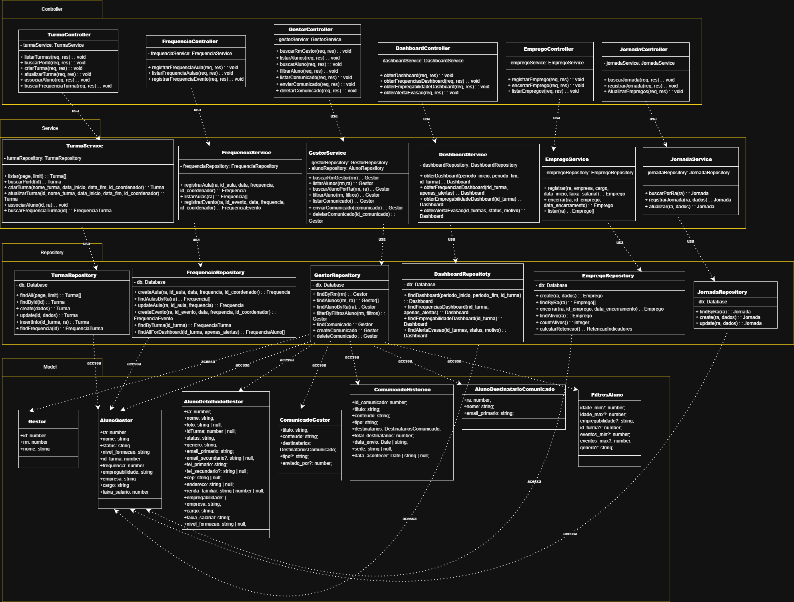<br>
  <sup>Fonte: Autores, 2026.</sup>
</div>

Apresenta o perfil do gestor e é o diagrama mais abrangente. O GestorService depende do GestorRepository, que expõe findAllAlunos() e findAlunoByRa() retornando objetos do tipo AlunoGestor. Essa classe de dados é a mais completa do sistema: além dos campos de identidade, inclui frequência, empregabilidade, empresa, cargo e faixa salarial — tudo que o gestor precisa para analisar o impacto da instituição. Os relacionamentos pertence a e gerenciado por entre AlunoGestor, Turma e Gestor são explicitados na camada Model.

### 3.2.4. Diagrama de Sequência UML 

A arquitetura do sistema foi modelada utilizando diagramas de sequência para detalhar a interação entre os componentes e as responsabilidades de cada ator.

### 3.2.4.1 - Diagrama de Sequência - Coordenadora
No fluxo da Coordenadora, o foco principal é a visualização de dados da "Jornada do Aluno". Após a validação de permissões de acesso, o sistema realiza uma série de consultas coordenadas às tabelas de dados pessoais, turmas, frequência e empregabilidade, consolidando essas informações em um objeto único de resposta. Este processo exemplifica uma operação complexa de leitura que garante à coordenação uma visão holística do desempenho estudantil.

<div align="center">
  <sub>Figura 17 — Diagrama de Sequência — Coordenadora</sub><br>
  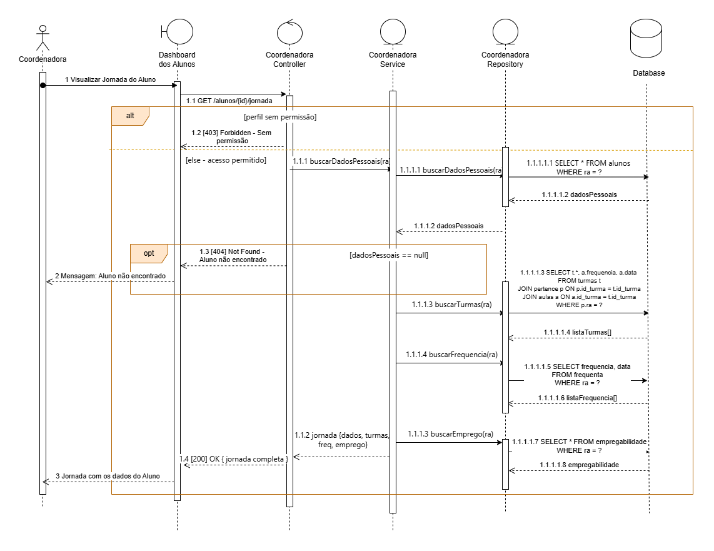<br>
  <sup>Fonte: Autores, 2026.</sup>
</div>

### 3.2.4.2 - Diagrama de Sequência - Psicóloga
Para a Psicóloga, o sistema prioriza a integridade e o registro de novas informações através do caso de uso de relatórios de atendimento. Ao contrário das consultas, este fluxo é fundamentado em uma operação de escrita (POST), onde a camada de controle valida a presença de campos obrigatórios antes que o serviço processe o registro. Uma vez validada a estrutura dos dados, o repositório executa a inserção no banco de dados, retornando uma confirmação de sucesso que assegura a persistência do atendimento realizado.

<div align="center">
  <sub>Figura 18 — Diagrama de Sequência — Psicóloga</sub><br>
  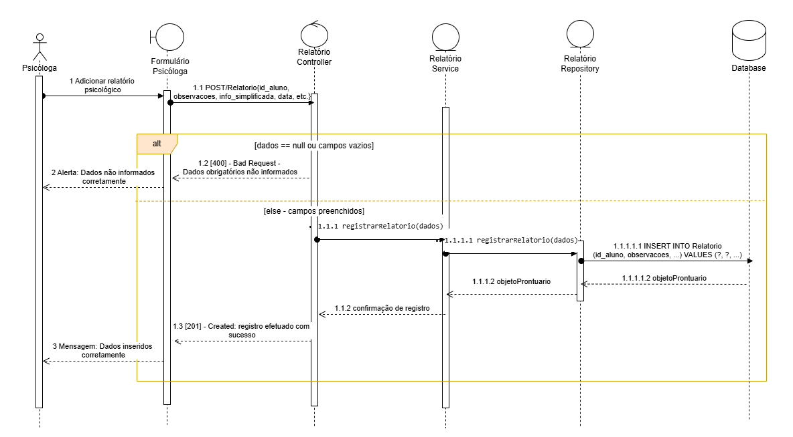<br>
  <sup>Fonte: Autores, 2026.</sup>
</div>

### 3.2.4.3 - Diagrama de Sequência - Aluno
O fluxo destinado ao Aluno foca na autonomia para a manutenção de seus próprios dados cadastrais. Através de um método de atualização (PUT), o sistema implementa uma lógica de verificação de existência: antes de realizar qualquer alteração, o serviço consulta o banco de dados para garantir que o registro do aluno é válido. Caso o aluno seja identificado, os novos dados são aplicados através de uma operação de atualização, permitindo que informações como e-mail e telefone sejam mantidas de forma fidedigna pelo próprio usuário.

<div align="center">
  <sub>Figura 19 — Diagrama de Sequência — Aluno</sub><br>
  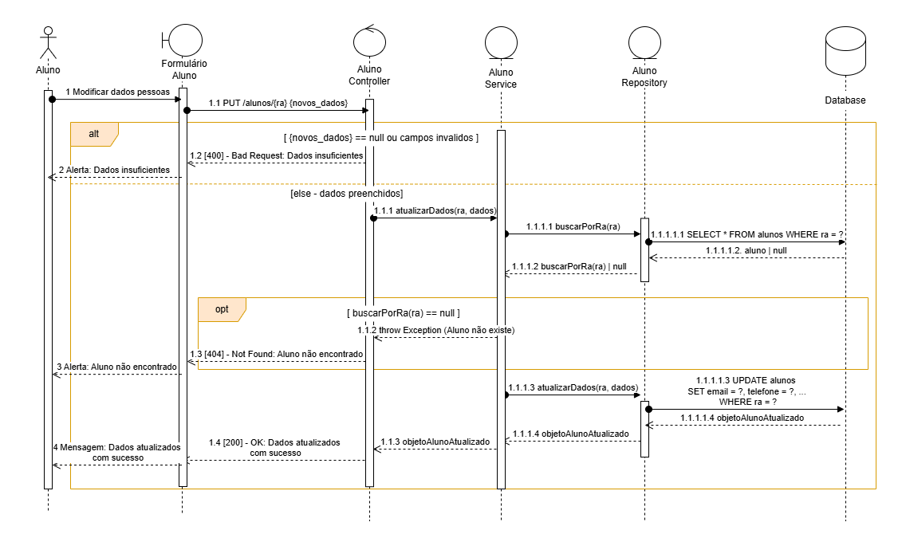<br>
  <sup>Fonte: Autores, 2026.</sup>
</div>

### 3.2.4.4 - Diagrama de Sequência - Gestor
Por fim, o diagrama do Gestor ilustra a capacidade analítica do sistema ao gerar relatórios de empregabilidade. Este fluxo diferencia-se dos demais por lidar com conjuntos de dados em larga escala, utilizando operações de junção (JOIN) entre tabelas para extrair uma lista completa de alunos e seus respectivos status profissionais. O sistema foi projetado para ser resiliente a ausência de dados, utilizando o lançamento de exceções controladas para interromper o processo caso a busca não retorne registros, garantindo que o gestor receba apenas informações válidas e processadas.

<div align="center">
  <sub>Figura 20 — Diagrama de Sequência — Gestor</sub><br>
  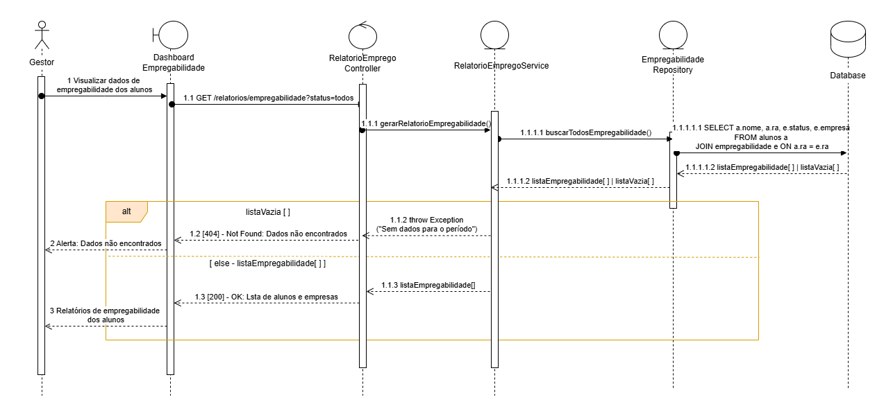<br>
  <sup>Fonte: Autores, 2026.</sup>
</div>

### 3.2.5. Diagrama de Atividades ou Estados

Não se aplica.

### 3.2.6. Diagrama de Implantação

Não se aplica.

### 3.2.7. Padrões de Projeto Aplicados

A arquitetura da plataforma foi organizada em camadas, seguindo a separação entre rotas, controllers, services, repositories e banco de dados. Este projeto prevê módulos com regras distintas para aluno, coordenador, gestor e psicólogo, a adoção dos padrões abaixo tem como objetivo evitar que regras de negócio, consultas SQL, validação de entrada e respostas HTTP fiquem concentradas nos mesmos arquivos.

| Padrão | Onde se aplica no projeto | Necessidade real atendida | Princípios SOLID relacionados |
|---|---|---|---|
| **Arquitetura em camadas / MVC adaptado para API** | Separação entre routes, controllers, services, repositories, database e modelos/contratos de dados. | O sistema possui quatro perfis com permissões completamente diferentes (aluno, coordenadora, psicóloga e gestor), cada um com rotas, regras de negócio e restrições de acesso distintas. Sem a separação em camadas, uma mudança na lógica de autorização da psicóloga, por exemplo, poderia quebrar o fluxo de frequência da coordenadora.  | SRP, OCP |
| **Repository Pattern** | Classes de repositório responsáveis por acesso ao PostgreSQL. | O WAD exige consultas complexas, como histórico da jornada do aluno e frequência consolidada por turma. O Repository isola SQL, JOINs e detalhes de persistência para que a regra de negócio não dependa diretamente do banco. Sua utilização contribui no isolamento da camada de acesso a dados (DAL) com a camada de negócio, mais conhecida como camada de domínio. | SRP, DIP |
| **Service Layer Pattern** | Classes de serviço entre controller e repository. | Regras como: impedir frequência em data futura (RN006), bloquear mais de um emprego ativo (RN007). Pertencem à lógica de negócio, não ao controller. Esse padrão define um conjunto de serviços para lidar com a lógica de negócios e atuar como intermediário entre diferentes camadas de uma aplicação. | SRP, OCP |
| **DTO (Data Transfer Object)** | Contratos de entrada e saída dos endpoints definidos na seção de API, por exemplo cadastro de emprego. | O sistema lida com dados sensíveis. Este padrão permite controlar quais campos entram e saem de cada rota. DTOs são usados principalmente para transferir dados entre o backend e o frontend sem expor diretamente as entidades do banco de dados. Isso melhora a segurança, a manutenção do código e a organização dos dados. | SRP, ISP |
| **Strategy Pattern** | É aplicado na camada de services, especificamente no controle de autorização por perfil de usuário.  | O sistema possui quatro perfis com comportamentos radicalmente diferentes para uma mesma operação. Quando a rota GET /psicologa/:rm/alunos/:ra/relatorios é acessada, o que o sistema deve retornar depende inteiramente de quem está fazendo a requisição. Sem o Strategy, isso seria resolvido com uma cadeia de if/else dentro do service, tornando o código frágil e difícil de manter. | OCP, DIP |
| **Factory Pattern** | Criação centralizada de conexões, repositórios, estratégias e validadores. A configuração do Pool PostgreSQL em `src/database/connection.ts` já representa o início dessa centralização. | O projeto precisa alternar configurações entre ambiente local, teste e produção, além de instanciar componentes por módulo. A Factory reduz duplicação de configuração e evita criação manual espalhada pela aplicação. Sem a Factory, cada repositório precisaria verificar individualmente o ambiente e montar sua própria configuração de conexão, espalhando lógica de infraestrutura por toda a aplicação. Isso seria especialmente problemático nos testes dos endpoints documentados na RTM, onde o banco de teste precisa ser isolado do banco real para não comprometer dados dos alunos. | SRP, DIP |
| **Singleton** |  Uma única instância é criada no momento do carregamento do módulo e reutilizada em todas as rotas que a importam. | Componentes sem estado de requisição, como services, repositories e conexão compartilhada, não precisam ser recriados a cada chamada. Isso simplifica o uso nas rotas e evita múltiplas inicializações desnecessárias. | SRP |
| **Middleware** | Interceptação de requisições antes dos controllers. | Regras de autenticação, autorização por perfil e auditoria de acesso precisam ser aplicadas de forma consistente em rotas de aluno, gestor, coordenador e psicólogo, principalmente nos prontuários e dados de jornada. | SRP, ISP |


#### Princípios SOLID aplicados

| Princípio | Aplicação no projeto | Justificativa |
|---|---|---|
| **S — Single Responsibility Principle** | Controllers lidam com HTTP, services com regras de negócio, repositories com banco e middlewares com autenticação/autorização. | Evita arquivos com múltiplas responsabilidades e facilita manutenção dos módulos previstos no WAD. |
| **O — Open/Closed Principle** | Novas estratégias de alerta, filtros e indicadores podem ser adicionadas sem alterar o fluxo principal dos services. | As regras da Pulse Mais podem mudar ao longo das sprints; o sistema precisa aceitar novos critérios com baixo impacto. |
| **L — Liskov Substitution Principle** | Estratégias e repositórios devem seguir contratos comuns para poderem ser substituídos por implementações equivalentes. | Permite trocar uma estratégia de cálculo ou um repositório real por mock em testes sem quebrar o service que os utiliza. |
| **I — Interface Segregation Principle** | Contratos devem ser pequenos e específicos, como interfaces separadas para leitura de aluno, escrita de frequência, cálculo de dashboard e acesso a prontuário. | Cada módulo usa apenas os métodos de que precisa, evitando dependência de interfaces grandes e genéricas. |
| **D — Dependency Inversion Principle** | Services devem depender de abstrações de repositories e estratégias, não de detalhes concretos de PostgreSQL ou de uma regra fixa. | Reduz acoplamento com infraestrutura, facilita testes automatizados e permite alterar a forma de persistência ou cálculo com menor impacto. |

Portanto, os padrões escolhidos não foram adotados apenas por formalidade. Eles respondem a necessidades concretas do projeto: centralizar dados antes dispersos em planilhas, proteger informações sensíveis, consolidar indicadores confiáveis, permitir regras de alerta ajustáveis e manter a API organizada para que novos endpoints sejam implementados sem comprometer módulos já existentes.

## 3.3. Wireframes
Nessa seção, desenvolvemos os wireframes de baixa fidelidade e wireflows da nossa aplicação web. Wireframes são representações visuais simplificadas de uma interface, que, no desenvolvimento do nosso projeto, foram utilizados para mapear e planejar o layout e a organização dos elementos presentes na nossa plataforma web ainda na fase inicial de desenvolvimento (AELA, 2022). Já os wireflows são diagramas que representam o fluxo de navegação entre as telas, mostrando por onde o usuário passa ao realizar determinadas ações, como cadastro, login, acesso a informações e submissão de dados.

As imagens a seguir representam os wireframes e wireflows desenvolvidos no nosso projeto, exibindo as estruturas básicas e as funcionalidades previstas na aplicação. Assim, é possível mapear todas as interações, fluxos, funcionalidades e as informações relevantes de cada seção, validando‑as junto aos parceiros de desenvolvimento antes da implementação em produção.

### 3.3.1 - Aluno - Desktop

#### Portal do Aluno

O Portal do Aluno é a área em que alunos e ex‑alunos podem acessar e atualizar suas informações cadastrais. A seguir, é apresentado o wireflow que o usuário percorre ao acessar essa área, desde o login até a navegação entre as telas de dados, jornada e comunicados.
Após o login com RA e senha, o usuário acessa a tela inicial "Meus Dados", a partir da qual pode navegar para a edição de perfil ou para as demais áreas do portal, Jornada e Comunicados, através do menu lateral presente em todas as telas, garantindo navegação consistente entre as funcionalidades.

<div align="center">
  <sub>Figura 21 — Wireflow do Portal do Aluno</sub><br>
  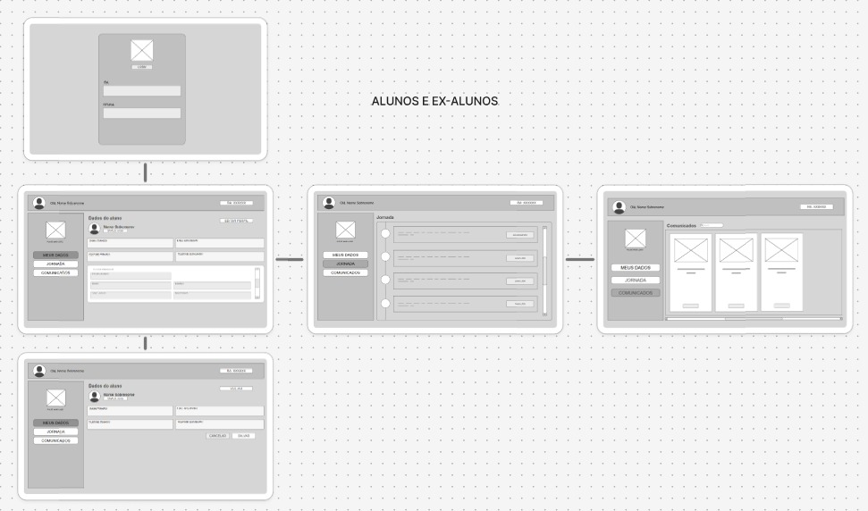<br>
  <sup>Fonte: Autores, 2026.</sup>
</div>

#### Tela inicial e Dados do aluno

<div align="center">
  <sub>Figura 22 — Wireframe Portal do aluno — Dados</sub><br>
  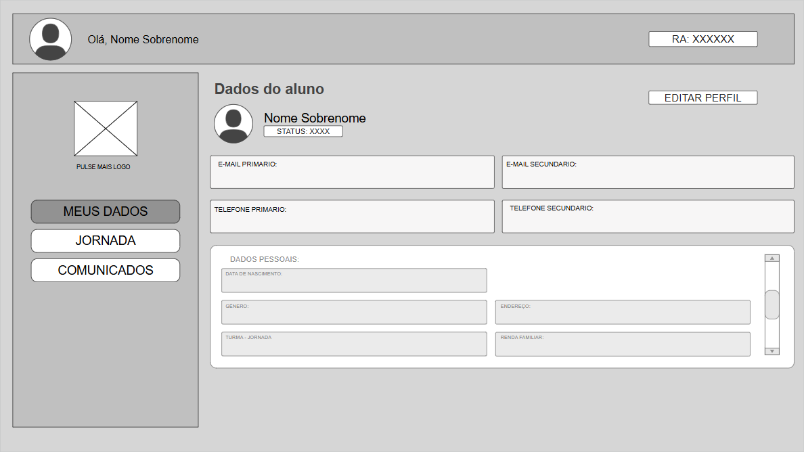<br>
  <sup>Fonte: Autores, 2026.</sup>
</div>

Após realizar o login, o aluno é direcionado à tela "Meus Dados", em que ficam disponíveis suas informações cadastrais, como e-mails e telefones primário e secundário, além de dados pessoais. Em todas as telas do Portal do Aluno está presente o menu de navegação lateral esquerdo, com as opções Meus Dados, Jornada e Comunicados. No canto superior direito, o botão "Editar Perfil" permite ao aluno atualizar seus dados de contato.

#### Editar perfil

<div align="center">
  <sub>Figura 23 — Wireframe Portal do aluno — Edição de dados</sub><br>
  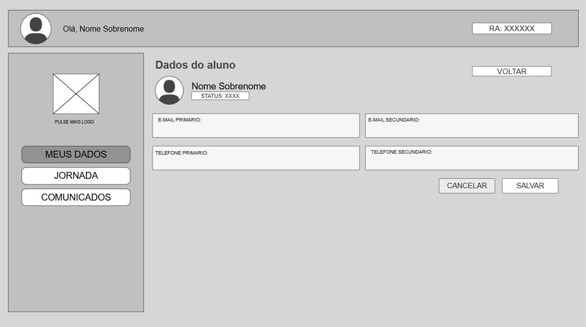<br>
  <sup>Fonte: Autores, 2026.</sup>
</div>

Ao clicar em "Editar Perfil", o aluno é direcionado à tela de edição, na qual pode atualizar seus e-mails e telefones primário e secundário. O sistema realiza a validação dos formatos inseridos, exibindo mensagem de erro quando o conteúdo é inválido. Os botões "Salvar" e "Cancelar" finalizam a interação, e o botão "Voltar" permite retornar à tela anterior sem alterações.

#### Jornada do aluno

<div align="center">
  <sub>Figura 24 — Wireframe Portal do aluno — Jornada</sub><br>
  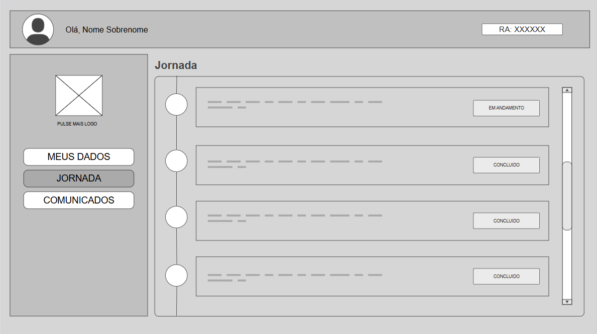<br>
  <sup>Fonte: Autores, 2026.</sup>
</div>

Ao clicar em "Jornada" no menu lateral, o aluno é direcionado para a tela em que é exibido seu histórico acadêmico em formato de linha do tempo vertical. Os programas e eventos são apresentados em cards organizados cronologicamente, com status identificado por etiquetas como "Em andamento" ou "Concluído", permitindo que o estudante acompanhe sua trajetória de forma clara.

#### Comunicados do aluno

<div align="center">
  <sub>Figura 25 — Wireframe Portal do aluno — Comunicados</sub><br>
  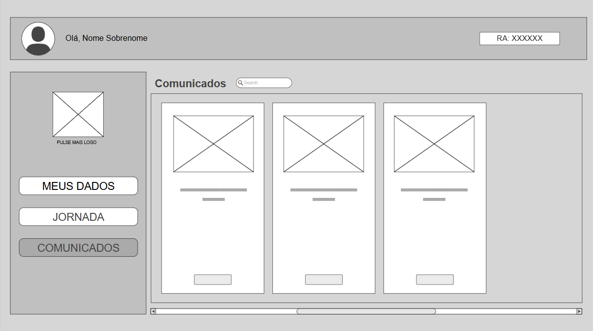<br>
  <sup>Fonte: Autores, 2026.</sup>
</div>

Ao clicar em "Comunicados", o aluno é direcionado para a tela em que é exibido o histórico de comunicados publicados pela equipe da Pulse Mais em formato de cards, contendo imagem, descrição e botão de ação. No topo, uma ferramenta de busca facilita a localização de comunicados específicos pelo título ou conteúdo.

### 3.3.2 - Aluno - Mobile

#### Portal do Aluno
Após uma longa analise do nosso grupo, criação de personas e mapeamento dos principais usuários da nossa plataforma, notamos que por se tratarem de jovens de baixa renda, os alunos da pulse mais poderiam não ter acesso a um computador para modificar as suas informações, por isso se fez necessário o desenvolvimento de um wireframe que represente a visão dos alunos que farão acesso a plataforma de maneira mobile. Que estão sendo apresentados a seguir.

<div align="center">
  <sub>Figura 26 — Wireframe Portal do Aluno Mobile — Meus Dados</sub><br>
  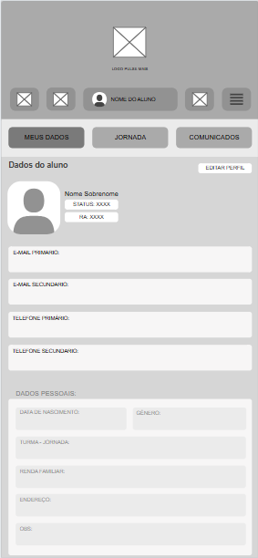<br>
  <sup>Fonte: Autores, 2026.</sup>
</div>

Versão mobile da tela "Meus Dados", com o menu de navegação reorganizado horizontalmente no topo (Meus Dados, Jornada e Comunicados) e o cabeçalho contendo logo, ícones de notificação e identificação do aluno. As informações de contato e dados pessoais são exibidas em coluna única para melhor leitura em telas menores, mantendo o botão "Editar Perfil" acessível.

#### Editar perfil

<div align="center">
  <sub>Figura 27 — Wireframe Portal do aluno mobile — Edição de perfil</sub><br>
  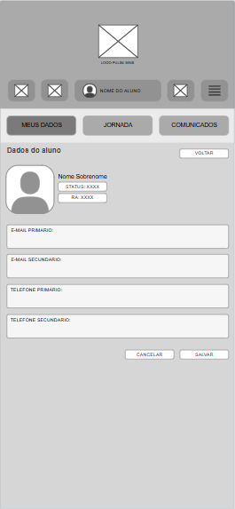<br>
  <sup>Fonte: Autores, 2026.</sup>
</div>

Versão mobile da tela de edição, em que o aluno atualiza seus e-mails e telefones primário e secundário em campos empilhados verticalmente. Os botões "Cancelar" e "Salvar" ficam ao final do formulário, e o botão "Voltar" permite retornar sem aplicar alterações.

#### Jornada do aluno

<div align="center">
  <sub>Figura 28 — Wireframe Portal do aluno mobile — Jornada</sub><br>
  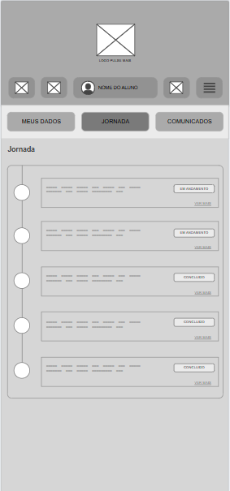<br>
  <sup>Fonte: Autores, 2026.</sup>
</div>

Versão mobile da tela "Jornada", mantendo a linha do tempo vertical com os cards de programas e eventos organizados cronologicamente. Cada card exibe o status ("Em andamento" ou "Concluído") e um link "Ver mais" para acessar detalhes, adaptado ao formato reduzido da tela.

#### Comunicados do aluno

<div align="center">
  <sub>Figura 29 — Wireframe Portal do aluno mobile — Comunicados</sub><br>
  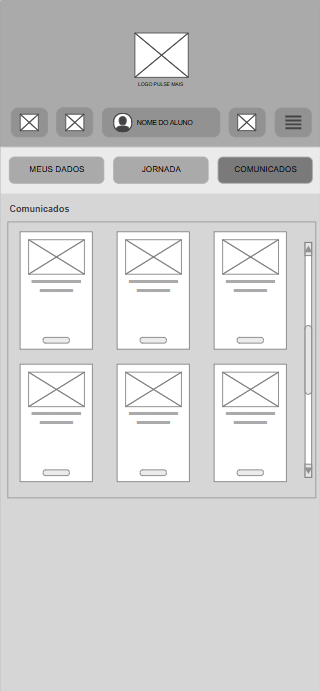<br>
  <sup>Fonte: Autores, 2026.</sup>
</div>

Versão mobile da tela "Comunicados", com os cards reorganizados em grade de duas colunas para aproveitar o espaço da tela. Cada card mantém imagem, descrição e botão de ação, preservando a estrutura visual da versão desktop.

### 3.3.3 - Coordenadora Pedagógica

Fluxo completo da página para a Coordenadora Pedagógica, em que usuário terá acesso a um dashboard, lista de alunos, incluindo a sua edição e uma tela de comunicados.

<div align="center">
  <sub>Figura 30 — Wireflow da Coordenadora</sub><br>
  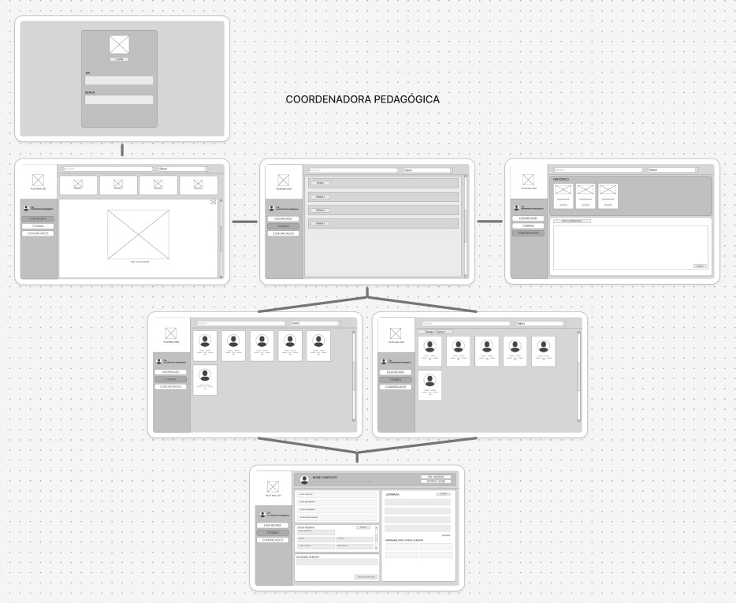<br>
  <sup>Fonte: Autores, 2026.</sup>
</div>

#### Tela inicial e dashboard da Coordenadora

<div align="center">
  <sub>Figura 31 — Wireframe do Dashboard da Coordenadora</sub><br>
  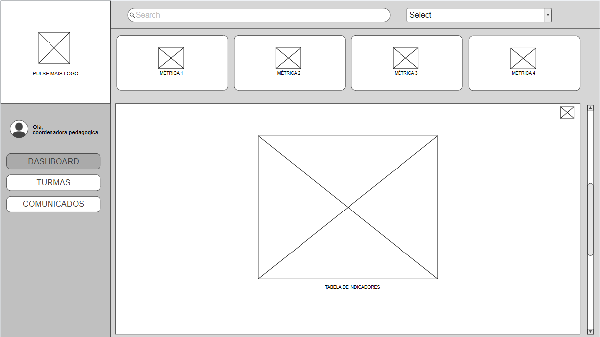<br>
  <sup>Fonte: Autores, 2026.</sup>
</div>

Caso o usuário seja a coordenadora pedagógica, após realizar o login, ele será direcionado ao dashboard, no qual estarão disponíveis dados gerais dos estudantes, apresentados em tabelas, gráficos, entre outros formatos. Além disso, haverá a opção de importar ou exportar dados por meio de arquivos CSV. Em todas as páginas, estará disponível um menu de navegação no lado esquerdo, com as opções Dashboard, Turmas e Comunicados. Também haverá uma ferramenta de busca e filtros para facilitar a pesquisa.

#### Turmas da coordenadora

<div align="center">
  <sub>Figura 32 — Wireframe das Turmas da Coordenadora</sub><br>
  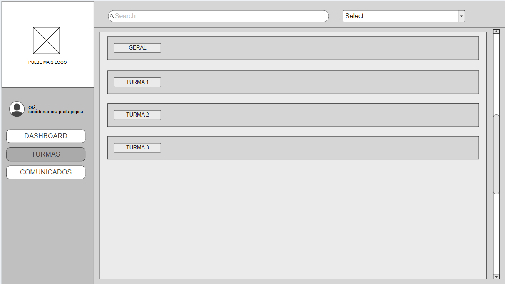<br>
  <sup>Fonte: Autores, 2026.</sup>
</div>

Ao clicar em “Turmas”, o coordenador será direcionado para uma área que apresentará diversas opções, incluindo as turmas, as quais a coordenadora é responsável e uma opção geral, responsável por exibir todos os alunos. Para facilitar a busca por uma turma específica, o filtro e o mecanismo de busca será disponível.

#### Alunos da Coordenadora

<div align="center">
  <sub>Figura 33 — Wireframe Alunos da Coordenadora</sub><br>
  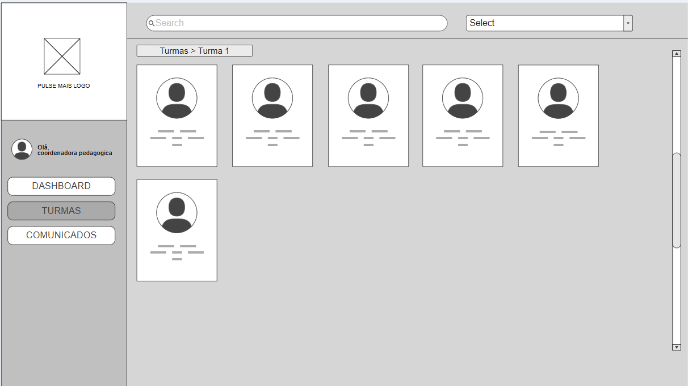<br>
  <sup>Fonte: Autores, 2026.</sup>
</div>

Ao selecionar uma turma específica, o sistema exibirá os estudantes correspondentes, organizados em blocos contendo uma foto, nome e algumas informações breves, que facilitem a sua indentificação. O filtro pode ser utilizado para separar estudantes que atendam a uma característica em comum, e o mecanismo de busca ajudará a coordenadora a procurar o aluno pelo nome.

#### Perfil do aluno para a Coordenadora

<div align="center">
  <sub>Figura 34 — Wireframe Perfil de aluno da Coordenadora</sub><br>
  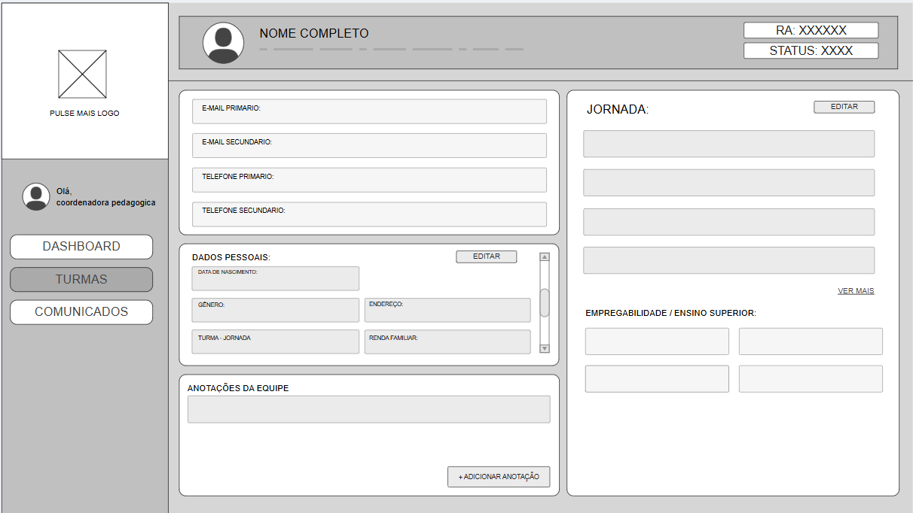<br>
  <sup>Fonte: Autores, 2026.</sup>
</div>

Após selecionar o perfil de um aluno, o sistema exibirá seus dados, sendo possível modificar algumas informações, como atualizar a jornada, registrar um emprego e registrar um risco de evasão.

#### Comunicados da Coordenadora

<div align="center">
  <sub>Figura 35 — Wireframe Comunicados da Coordenadora</sub><br>
  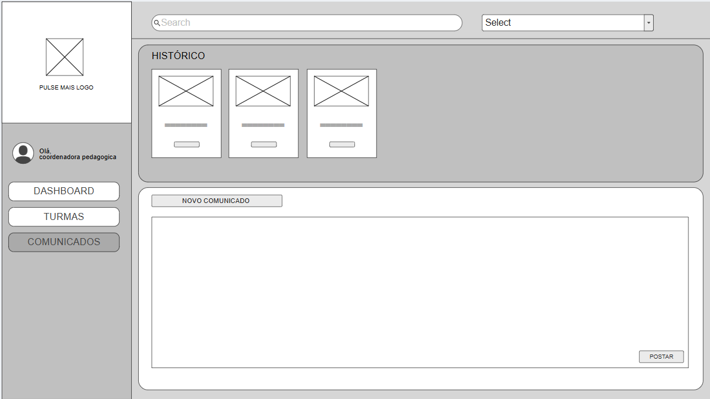<br>
  <sup>Fonte: Autores, 2026.</sup>
</div>

Ao clicar em “Comunicados”, o usuário poderá visualizar o histórico de comunicados, cada um com uma imagem e descrição. Além disso, haverá uma caixa de texto, em que a coordenadora poderá criar comunicados gerais, os quais os alunos poderão acessar.

### 3.3.4 - Psicóloga
Na figura abaixo, é apresentado o wireflow referente à visão da psicóloga dentro da aplicação web. Esse fluxo representa o caminho que a profissional percorre para acessar as funcionalidades de acompanhamento dos alunos, partindo da listagem de estudantes até o detalhamento das consultas. Cada tela será explicada individualmente a seguir.

<div align="center">
  <sub>Figura 36 — Wireflow da Psicóloga</sub><br>
  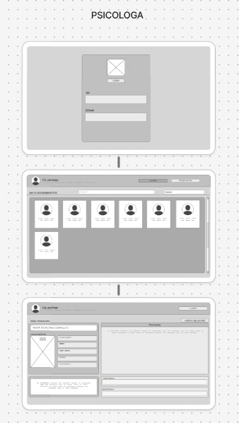<br>
  <sup>Fonte: Autores, 2026.</sup>
</div>

#### Lista de alunos da Psicóloga

<div align="center">
  <sub>Figura 37 — Wireframe lista de alunos da Psicóloga</sub><br>
  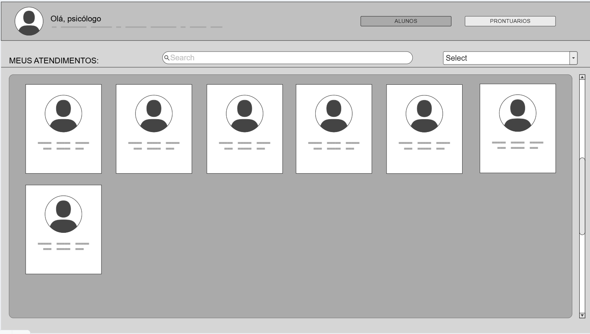<br>
  <sup>Fonte: Autores, 2026.</sup>
</div>
Caso o usuário seja a psicóloga, o acesso ao módulo de acompanhamento dos alunos é iniciado pela tela de Relatório de Alunos. Nessa interface, é apresentada uma listagem com os estudantes cadastrados, incluindo informações como nome e status. A tela também disponibiliza funcionalidades de organização e busca, como ordenação alfabética, filtro por registros recentes e uma barra de pesquisa, permitindo localizar os alunos de forma rápida e eficiente.

#### Prontuário de alunos da Psicóloga

<div align="center">
  <sub>Figura 38 — Wireframe Prontuários de alunos Psicóloga</sub><br>
  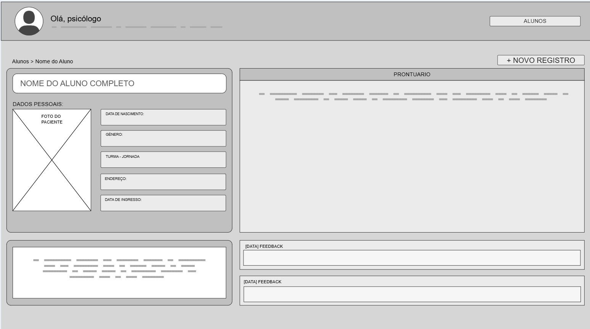<br>
  <sup>Fonte: Autores, 2026.</sup>
</div>
Ao selecionar um aluno, a psicóloga é direcionada ao Prontuário do Aluno, onde são exibidas informações pessoais. Essa tela centraliza os dados do acompanhamento psicológico, facilitando o acesso ao histórico de consultas do estudante. Dentro do prontuário, destaca-se a seção de Relatório da Consulta, que apresenta informações detalhadas do atendimento realizado, incluindo data e hora, profissional responsável, motivo da consulta e a análise ou diagnóstico elaborado. Também há a seção de Descrição da Consulta, que permite registrar, de forma estruturada e resumida, o que foi observado durante o atendimento. Essas informações também poderão ficar disponíveis para outros funcionários autorizados. Além disso, há a seção de Principais Tópicos, que resume os pontos mais relevantes discutidos na consulta. Essa visão simplificada auxilia na rápida compreensão do caso.

### 3.3.5 - Gestor
Na figura abaixo, é apresentado o wireflow referente à visão do gestor dentro da aplicação web. Esse fluxo representa o caminho que a profissional percorre para acessar as funcionalidades como deshboard, turmas, visão de cada aluno entre outras funcionalidades.

<div align="center">
  <sub>Figura 39 — Wireflow do Gestor</sub><br>
  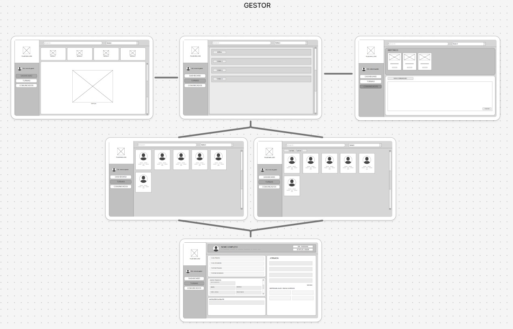<br>
  <sup>Fonte: Autores, 2026.</sup>
</div>

#### Tela inicial e dashboard do Gestor

<div align="center">
  <sub>Figura 40 — Wireframe do Dashboard do Gestor</sub><br>
  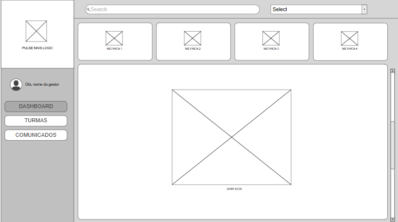<br>
  <sup>Fonte: Autores, 2026.</sup>
</div>

Ao realizar o login, o gestor é direcionado para o dashboard principal, que exibe os principais indicadores de impacto da Pulse Mais. No topo, quatro cartões apresentam métricas como total de jovens, alunos empregados, alunos em formação e alertas de evasão. Ao centro, uma área de gráficos consolida esses dados visualmente. O menu lateral dá acesso às seções de Turmas e Comunicados.

#### Turmas do Gestor

<div align="center">
  <sub>Figura 41 — Wireframe Turmas do Gestor</sub><br>
  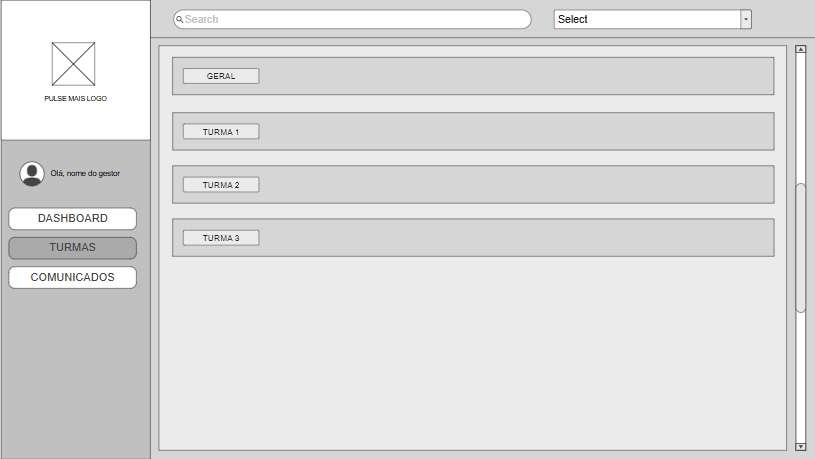<br>
  <sup>Fonte: Autores, 2026.</sup>
</div>

Ao acessar "Turmas" no menu lateral, o gestor visualiza a lista de turmas cadastradas, com a opção "Geral" no topo (que reúne todos os alunos) seguida pelas turmas individuais. A barra superior oferece busca e filtros para localizar rapidamente uma turma específica.

#### Opção Geral do Gestor

<div align="center">
  <sub>Figura 42 — Wireframe Turma Geral do Gestor</sub><br>
  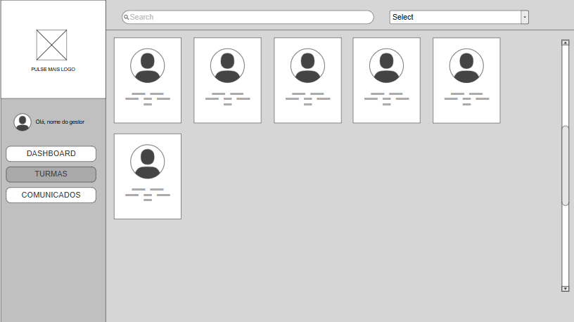<br>
  <sup>Fonte: Autores, 2026.</sup>
</div>

Ao selecionar "Geral", o gestor visualiza todos os alunos da instituição em uma única tela, independentemente da turma. Cada aluno aparece em um cartão com foto e informações resumidas. Ao clicar em qualquer cartão, o gestor é direcionado ao perfil completo do aluno.

#### Turma específica do Gestor

<div align="center">
  <sub>Figura 43 — Wireframe Turma Específica do Gestor</sub><br>
  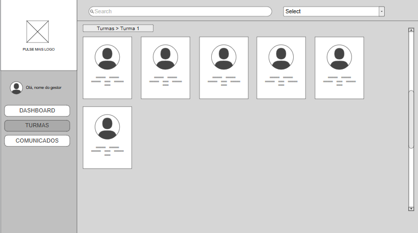<br>
  <sup>Fonte: Autores, 2026.</sup>
</div>

Ao selecionar uma turma específica, o gestor acessa os alunos pertencentes a ela. O breadcrumb no topo ("Turmas > Turma 1") indica a navegação e permite retornar à listagem. Os alunos são exibidos em cartões individuais, filtrados apenas para os integrantes daquela turma.

#### Perfil do aluno para o Gestor
<div align="center">
  <sub>Figura 44 — Wireframe Perfil Individual do Gestor</sub><br>
  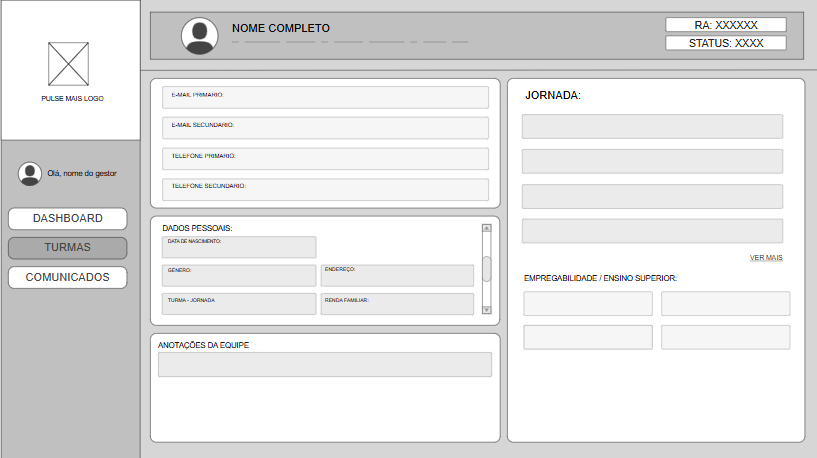<br>
  <sup>Fonte: Autores, 2026.</sup>
</div>

Ao clicar em um aluno, o gestor acessa seu perfil completo, com nome, RA e status no topo. À esquerda, ficam os dados de contato, dados pessoais e anotações da equipe. À direita, a seção "Jornada" mostra o histórico do aluno na Pulse Mais, seguida pela área de "Empregabilidade / Ensino Superior", centralizando todas as informações relevantes em um único lugar.

#### Comunicados para o Gestor
<div align="center">
  <sub>Figura 45 — Wireframe Comunicados do Gestor</sub><br>
  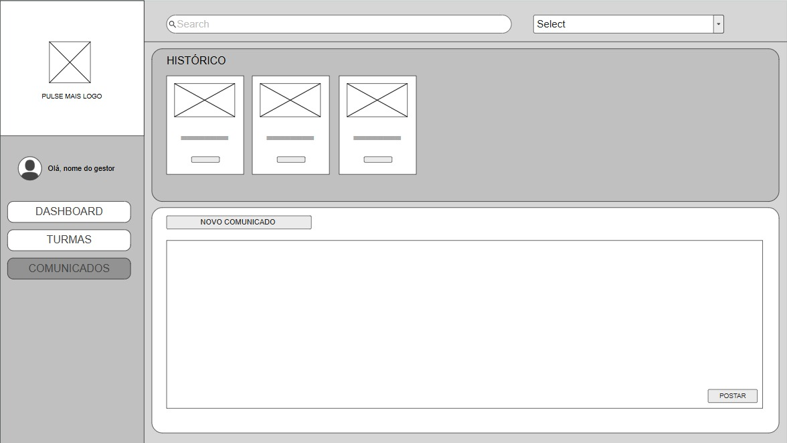<br>
  <sup>Fonte: Autores, 2026.</sup>
</div>

Na tela de comunicados, o gestor visualiza o histórico de publicações anteriores em cards com imagem, título e botão de acesso, podendo localizá-las pelo campo de busca e filtro no topo. Na seção inferior, é possível redigir e publicar um novo comunicado diretamente pelo campo de texto, finalizando com o botão "Postar". Dessa forma, toda a comunicação com os alunos fica centralizada e registrada na plataforma.

## 3.4. Guia de estilos 

Nesta seção, desenvolvemos o guia de estilos, documento com regras do que pode e não pode ser feito pela marca (CANVA, 2024), reunindo as informações visuais que orientam o desenvolvimento e a manutenção da interface da aplicação, abrangendo os principais elementos que compõem sua identidade visual: paleta de cores, tipografia, iconografia e imagens.

Para utilizá-lo, o leitor deve consultar cada seção como uma referência a ser seguida, ou seja, os valores, estilos e especificações apresentados não são sugestões, mas padrões a serem respeitados. Ao criar novos componentes ou telas, verifique a paleta de cores definida antes de aplicar qualquer cor, utilize exclusivamente as fontes e pesos tipográficos indicados e siga as diretrizes de iconografia e imagens para manter a coerência visual. Em caso de futuras alterações no projeto, quaisquer modificações devem partir dos padrões aqui estabelecidos, garantindo que a identidade visual da aplicação permaneça uniforme e consistente.


### 3.4.1 Cores

<div align="center">
  <sub>Figura 46 — Paleta de cores</sub><br>
  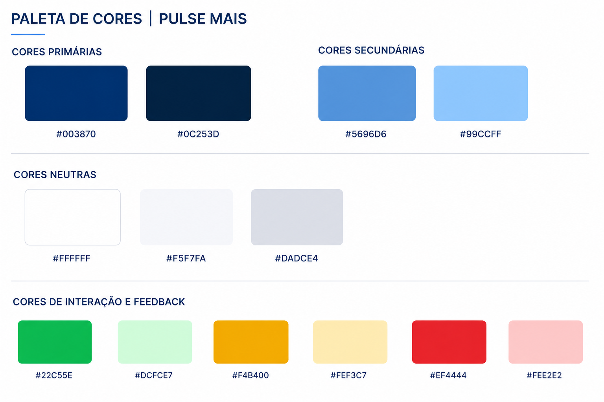<br>
  <sup>Fonte: Autores, 2026.</sup>
</div>

# Cores principais

A paleta de cores da aplicação foi definida com base na identidade visual da Pulse Mais, adotando os tons de azul `#003870` (Deep Navy Blue) e `#0C253D` (Midnight Blue) como cores primárias, conforme especificado no guia visual da marca (PULSE MAIS, 2026). Essas tonalidades foram aplicadas nos elementos de maior destaque da interface, como barra de navegação superior, componentes estruturais e áreas institucionais da aplicação, com o objetivo de reforçar a representatividade da marca e fortalecer a identidade visual do produto.

## `#003870` — Azul principal institucional (Deep Navy Blue)

Cor primária da aplicação, aplicada na barra de navegação superior, nos componentes estruturais de maior destaque e nas áreas de forte representação da marca. Serve como base cromática de toda a interface, transmitindo confiança, estabilidade e alinhamento com a identidade visual da Pulse Mais.

## `#0C253D` — Azul escuro de contraste (Midnight Blue)

Aplicado em menus laterais, rodapés e áreas secundárias de grande dimensão. Cria profundidade visual e estabelece separação hierárquica entre as seções, evitando que o uso contínuo de uma única tonalidade torne a interface visualmente monótona.

---

# Cores secundárias

As cores secundárias foram definidas para complementar a identidade visual principal da aplicação, auxiliando na criação de contraste, hierarquia visual e destaque para elementos interativos. Essas tonalidades mantêm coerência com a paleta principal, preservando a unidade estética da interface e proporcionando maior flexibilidade visual entre os componentes.

## `#5696D6` — Azul interativo (Soft Blue)

Utilizado em botões, estados ativos, links e indicadores de interação. Seu papel é destacar as ações disponíveis ao usuário e facilitar a identificação de componentes clicáveis, mantendo coerência com a identidade visual sem comprometer a usabilidade.

## `#99CCFF` — Azul claro auxiliar (Light Sky Blue)

Aplicado em bordas suaves, detalhes gráficos, ícones secundários e fundos de apoio. Sua utilização suaviza a composição visual da interface e auxilia na separação sutil entre elementos, trazendo leveza estética e sensação de modernidade ao sistema.

---

# Cores neutras

As cores neutras atuam como elementos de equilíbrio visual na interface, auxiliando na organização dos componentes, na legibilidade das informações e na criação de contraste e separação hierárquica entre seções. Sua aplicação reduz o excesso de estímulos visuais das cores primárias e secundárias, proporcionando uma experiência mais limpa e confortável ao usuário.

## `#FFFFFF` — Branco principal (White)

Responsável por permitir o contraste visual entre os elementos da interface e os componentes de destaque da solução. Foi utilizado em cards, campos de preenchimento, áreas de conteúdo e superfícies principais da interface. Sua aplicação proporciona uma experiência visual mais limpa e organizada, além de favorecer a leitura e destacar os elementos interativos do sistema.

## `#F5F7FA` — Cinza claro de fundo (Light Gray Blue)

Utilizado para reduzir a predominância do branco puro no fundo da aplicação, trazendo uma aparência mais moderna e confortável visualmente. Sua utilização ocorre principalmente em fundos gerais e superfícies secundárias, criando contraste equilibrado com os demais elementos da interface sem comprometer a identidade visual da solução.

## `#DADCE4` — Cinza neutro auxiliar (Soft Neutral Gray)

Utilizado em divisores, bordas e contornos suaves dos componentes. Sua função é auxiliar na separação visual entre elementos de maneira sutil e elegante, permitindo melhor organização estrutural da interface sem criar excesso de contraste visual.

---

# Cores de interação e feedback

As cores de interação e feedback foram definidas para facilitar a comunicação visual entre o sistema e o usuário, permitindo a identificação rápida de estados, alertas, confirmações e erros. Além da função estética, essas tonalidades contribuem diretamente para a usabilidade e acessibilidade da interface.

## `#22C55E` — Verde de sucesso (Modern Green)

Utilizado para representar ações concluídas corretamente, confirmações e estados positivos do sistema. Sua aplicação ocorre em mensagens de sucesso, indicadores de status e validações concluídas, transmitindo segurança e clareza visual ao usuário.

## `#DCFCE7` — Fundo de sucesso suave (Soft Green)

Utilizado como apoio visual em notificações e áreas relacionadas a estados positivos da aplicação. Sua tonalidade reduz a intensidade visual do verde principal, mantendo a comunicação do estado sem causar excesso de contraste.

## `#F4B400` — Amarelo de alerta (Warning Yellow)

Aplicado em avisos, notificações de atenção e estados intermediários que exigem observação do usuário. Sua função é destacar informações importantes sem representar erro crítico, auxiliando na comunicação visual de pendências e alertas preventivos.

## `#FEF3C7` — Fundo de alerta suave (Soft Yellow)

Utilizado como base visual para notificações de atenção e avisos do sistema. Sua aplicação proporciona destaque moderado aos alertas, mantendo a interface visualmente equilibrada e confortável.

## `#EF4444` — Vermelho de erro (Modern Red)

Utilizado para representar falhas, erros de validação e ações críticas dentro da aplicação. Sua função é alertar visualmente o usuário sobre problemas que exigem correção ou atenção imediata, garantindo rápida identificação dos estados negativos do sistema.

## `#FEE2E2` — Fundo de erro suave (Soft Red)

Utilizado como apoio visual em mensagens de erro e notificações críticas. Sua tonalidade suaviza o impacto visual do vermelho principal, permitindo destaque sem comprometer a harmonia estética da interface.

### 3.4.2 Tipografia

A aplicação utiliza exclusivamente a família tipográfica Poppins, fonte geométrica sem serifa desenvolvida pela Indian Type Foundry e disponibilizada gratuitamente pelo Google Fonts. A escolha por uma família tipográfica única garante coesão visual em toda a plataforma, enquanto a variedade de pesos disponíveis na família supre todas as necessidades hierárquicas da interface sem exigir combinações de fontes distintas.

<div align="center">
  <sub>Figura 47 — Tipografia da plataforma</sub><br>
  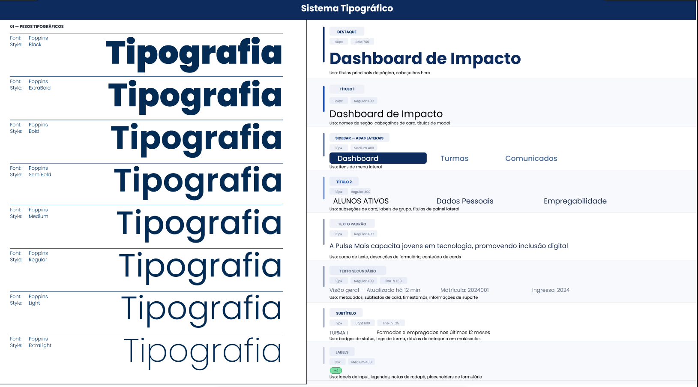<br>
  <sup>Fonte: Autores, 2026.</sup>
</div>

Essa hierarquia segue os princípios do sistema de design atômico (FROST, 2016), onde cada nível tipográfico possui função semântica clara e não é intercambiável com outro, garantindo consistência e previsibilidade para o usuário ao longo de toda a navegação.

### 3.4.3 Iconografia e imagens

A iconografia do projeto desempenha um papel essencial na construção da identidade visual da plataforma, tornando a navegação mais intuitiva, organizada e acessível. Para garantir consistência visual e compatibilidade com aplicações web, foi utilizada a biblioteca Lucide Icons disponível no Figma (FIGMA COMMUNITY, 2026), reconhecida por oferecer ícones modernos, padronizados e de fácil compreensão.

<div align="center">
  <sub>Figura 48 — Iconografia da plataforma</sub><br>
  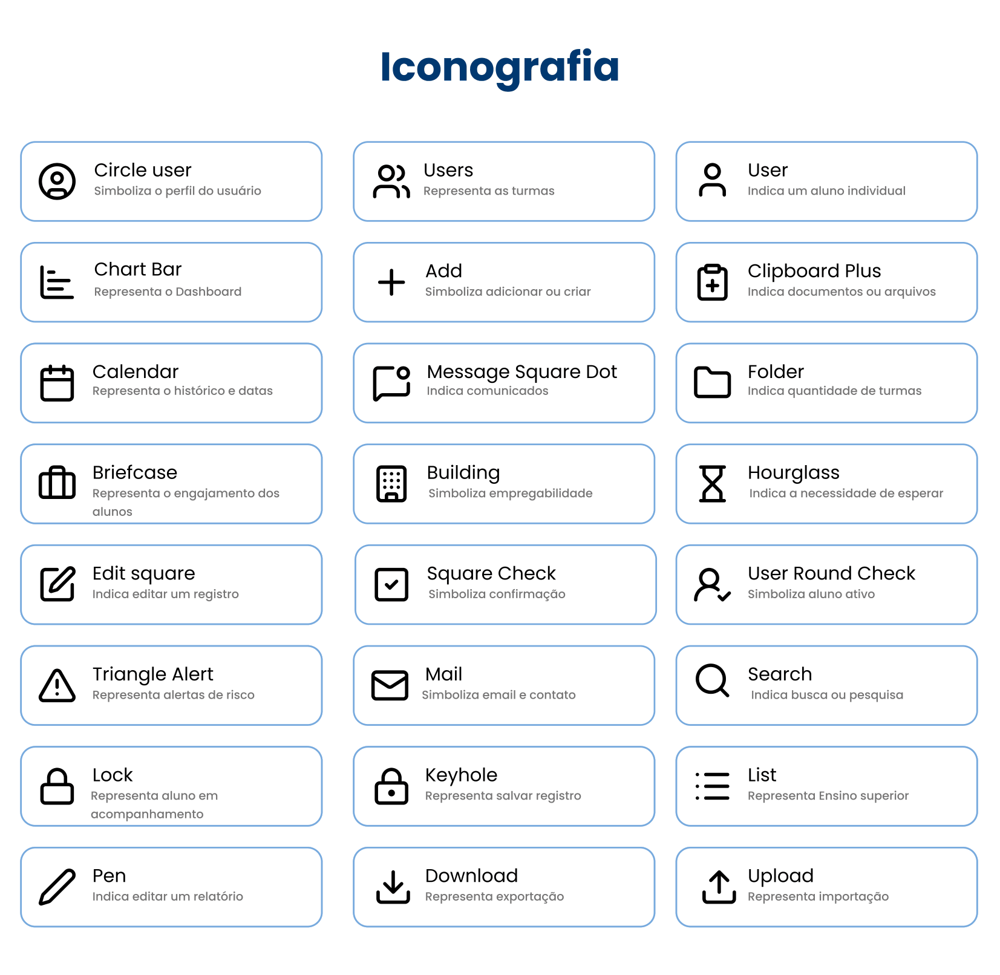<br>
  <sup>Fonte: Autores, 2026.</sup>
</div>

Os elementos visuais foram selecionados com base em critérios de simplicidade, clareza e coerência com as funcionalidades do sistema, representando áreas como perfil, dashboard, notificações, calendário, documentos e mensagens. Além disso, todos os ícones foram aplicados de forma uniforme em estilo, tamanho e cores, garantindo harmonia visual e uma experiência consistente em todas as telas da plataforma.

## 3.5 Protótipo de alta fidelidade 

O protótipo de alta fidelidade para plataforma Pulse Mais foi desenvolvido utilizando a ferramenta Figma com o objetivo de representar visualmente a versão final do sistema de forma mais próxima da aplicação real. Durante o processo de prototipação, foram definidos elementos como identidade visual, tipografia, componentes interativos, organização das informações e fluxos de navegação, priorizando usabilidade, acessibilidade e experiência do usuário. As telas desenvolvidas contemplam os diferentes perfis da plataforma, permitindo uma navegação intuitiva e organizada, além de possibilitar a validação das funcionalidades antes da etapa de desenvolvimento. A seguir, são apresentadas algumas imagens demonstrativas do protótipo de alta fidelidade elaborado pela equipe, bem como o link público para acesso ao protótipo completo no Figma: https://www.figma.com/design/b8tL1GIVmP91w0cSl2tS6I/wireframes?node-id=0-1&m=dev&t=dlMHlEUuagufVuaA-1 .

### 3.5.1 Protótipo do gestor

O protótipo do gestor foi desenvolvido com o objetivo de centralizar as principais funcionalidades administrativas e pedagógicas da plataforma Pulse Mais em uma interface intuitiva e organizada. As telas foram projetadas priorizando usabilidade, clareza visual e facilidade de navegação, permitindo que gestores e coordenadores acompanhem informações importantes sobre os alunos, turmas, comunicados e indicadores institucionais de maneira prática e eficiente.

### 3.5.1.1  Tela de Dashboard do Gestor

<div align="center">
  <sub>Figura 49 — Protótipo inicial e dashboard do Gestor</sub><br>
  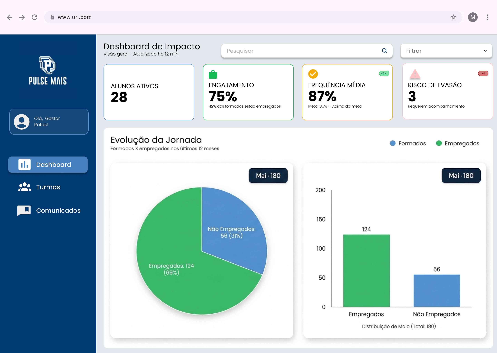<br>
  <sup>Fonte: Autores, 2026.</sup>
</div>

A Tela de Dashboard do Gestor foi desenvolvida para centralizar os principais indicadores da plataforma Pulse Mais em um único ambiente visual, permitindo que a equipe gestora visualize rapidamente informações como quantidade de alunos ativos, percentual de empregabilidade, taxa de conclusão da jornada e indicadores de risco de evasão. A interface utiliza cards informativos e gráficos visuais para facilitar a interpretação dos dados, enquanto o menu lateral possibilita acesso rápido aos módulos da plataforma. A identidade visual em tons de azul e verde transmite organização e clareza, tornando a navegação mais intuitiva. Esta tela está diretamente relacionada à US01, pois atende aos critérios de visualização dos indicadores gerais da instituição.


### 3.5.1.2  Tela de turmas do Gestor
<div align="center">
  <sub>Figura 50 — Protótipo turmas do Gestor</sub><br>
  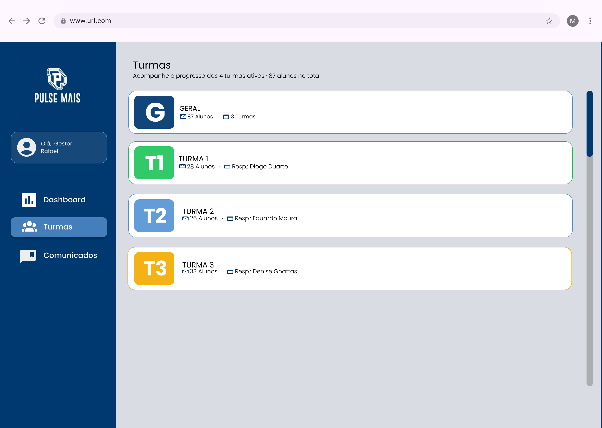<br>
  <sup>Fonte: Autores, 2026.</sup>
</div>

A Tela de Turmas do Gestor foi criada para organizar visualmente todas as turmas cadastradas na plataforma, permitindo que os gestores encontrem rapidamente grupos específicos de alunos. Cada turma é apresentada em formato de card contendo informações resumidas, como nome da turma, quantidade de alunos e módulos disponíveis, facilitando o gerenciamento pedagógico e a visualização da estrutura das turmas. O layout foi desenvolvido priorizando simplicidade, legibilidade e organização visual, enquanto as cores utilizadas ajudam na diferenciação entre os grupos e tornam a navegação mais intuitiva. Esta tela possui relação direta com a US06, pois auxilia na segmentação e organização dos alunos.


### 3.5.1.3  Tela de turma específica do Gestor
<div align="center">
  <sub>Figura 51 — Protótipo turma específica do Gestor</sub><br>
  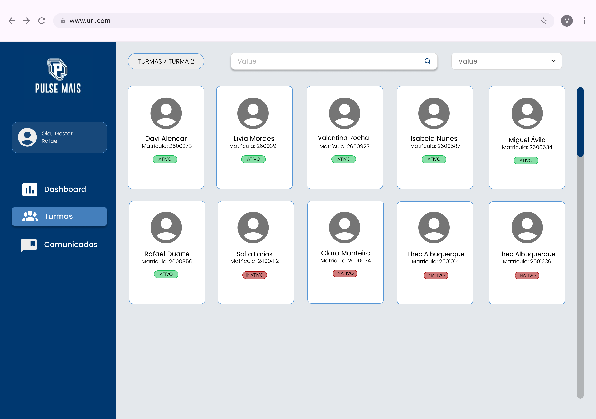<br>
  <sup>Fonte: Autores, 2026.</sup>
</div>

A Tela de Turma Específica apresenta detalhadamente os alunos pertencentes a uma turma selecionada, exibindo cada participante em formato de card individual com foto, nome completo, situação de empregabilidade e indicadores visuais de status. O principal objetivo da interface é permitir que gestores e coordenadores acompanhem rapidamente a situação dos alunos de maneira organizada e prática. Na parte superior da tela, foram adicionados filtros e campos de busca para facilitar a localização de alunos específicos, enquanto os indicadores coloridos ajudam na identificação rápida de situações importantes relacionadas ao acompanhamento dos jovens. Esta tela está relacionada às US06 e US07.


### 3.5.1.4  Tela de Perfil Individual do Gestor
<div align="center">
  <sub>Figura 52 — Protótipo perfil individual do Gestor</sub><br>
  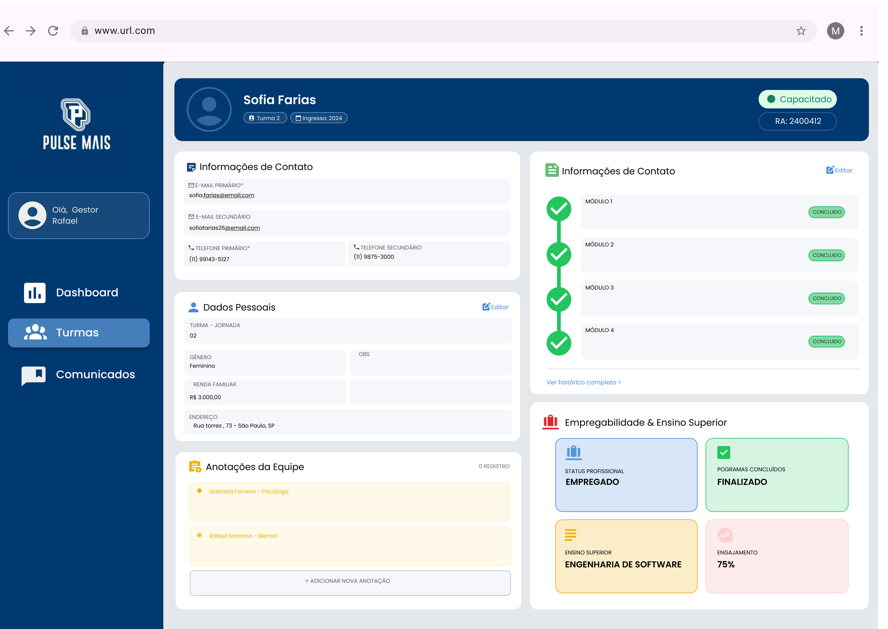<br>
  <sup>Fonte: Autores, 2026.</sup>
</div>

A Tela de Perfil Individual do Gestor centraliza todas as informações relacionadas a um aluno específico dentro da plataforma, apresentando dados pessoais, informações de contato, histórico da jornada, situação de empregabilidade e anotações realizadas pela equipe pedagógica. O objetivo da interface é oferecer uma visão completa da trajetória do aluno na instituição, permitindo acompanhamento individualizado e atualização constante das informações. Os dados foram organizados em blocos para facilitar a leitura e reduzir a poluição visual da tela, enquanto indicadores visuais representam o progresso do aluno ao longo da jornada institucional. Esta tela está associada às US02, US03 e US07.


### 3.5.1.5  Tela de Comunicados do Gestor
<div align="center">
  <sub>Figura 53 — Protótipo comunicados do Gestor</sub><br>
  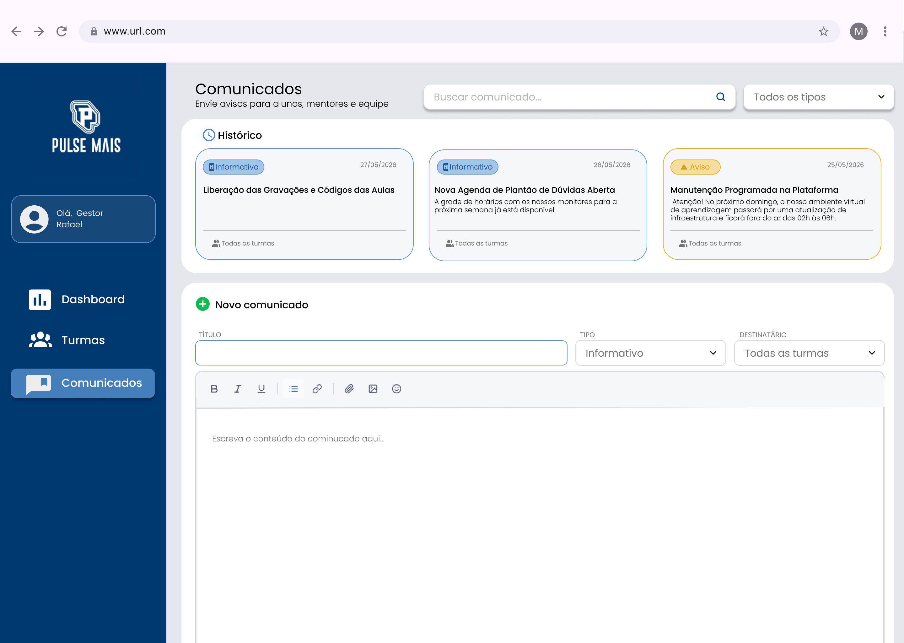<br>
  <sup>Fonte: Autores, 2026.</sup>
</div>

A Tela de Comunicados foi desenvolvida para centralizar o envio e gerenciamento das mensagens institucionais da Pulse Mais, permitindo que a equipe acompanhe o histórico de comunicados enviados aos alunos. Na parte superior da interface, os comunicados anteriores são exibidos em cards contendo título, categoria, descrição resumida e data de envio, facilitando a consulta das mensagens já publicadas. A parte inferior da tela apresenta um formulário para criação de novos comunicados com campos de título, destinatários, tipo de mensagem e editor de texto, tornando o processo de envio mais simples e organizado. Esta tela está diretamente relacionada à US08.


---

### 3.5.2 Protótipo do coordenador

As seis telas apresentadas cobrem o fluxo completo de navegação da Coordenadora Pedagógica: visualização dos indicadores no dashboard, acompanhamento das turmas, listagem de alunos por grupo ou em visão consolidada, consulta detalhada do perfil individual e envio de comunicados.

### 3.5.2.1 Tela Dashboard da Coordenadora Pedagógica

<div align="center">
  <sub>Figura 54 — Protótipo de Alta da Coordenadora Pedagógica - Dashboard</sub><br>
  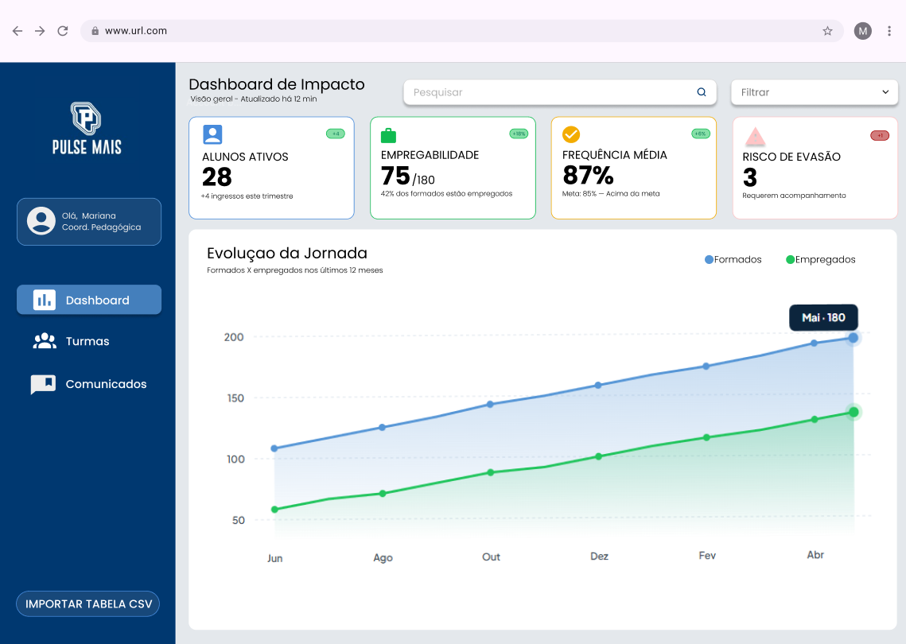<br>
  <sup>Fonte: Autores, 2026.</sup>
</div>

O Dashboard de Impacto é a primeira tela que a Coordenadora Pedagógica vê após o login e concentra os indicadores que guiam o dia a dia da equipe da Pulse Mais. Quatro cards no topo resumem a operação com as métricas de Alunos Ativos, Empregabilidade, Frequência Média e Risco de Evasão, ajudando a identificar rapidamente situações que pedem atenção. Logo abaixo, o gráfico de Evolução da Jornada compara formados e empregados nos últimos doze meses e oferece a leitura histórica que sustenta o planejamento pedagógico e as conversas com financiadores; à esquerda, o botão de importação de CSV abre caminho para a migração das planilhas que a instituição ainda usa. A paleta em azul e verde organiza essa hierarquia, deixando claro o que é leitura rápida e o que exige análise. A tela atende às US01, US09 e US10, pois centraliza os indicadores, sinaliza risco de evasão e permite a importação de dados históricos.

### 3.5.2.2 Tela de Turmas da Coordenadora Pedagógica

<div align="center">
  <sub>Figura 55 — Protótipo de Alta da Coordenadora Pedagógica - Turmas</sub><br>
  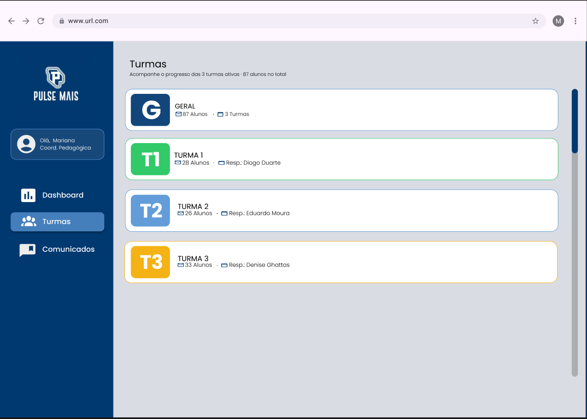<br>
  <sup>Fonte: Autores, 2026.</sup>
</div>

A Tela de Turmas funciona como ponto de partida para o acompanhamento dos grupos ativos da Pulse Mais. No topo, um resumo informa quantas turmas estão em andamento e quantos alunos a Coordenadora acompanha no total; abaixo, a seção "Geral" abre o acesso à base completa de alunos, e os cards das turmas individuais trazem nome, número de alunos e responsável pedagógico. A separação entre visão geral e turmas específicas atende a dois movimentos distintos da Coordenadora, a consulta ampla e o acompanhamento por grupo, sem misturar os dois fluxos. As cores dos ícones diferenciam cada turma e mantêm a paleta institucional em azul e verde, que dá unidade visual ao restante do sistema.

### 3.5.2.3 Tela Geral de Alunos

<div align="center">
  <sub>Figura 56 — Protótipo de Alta da Coordenadora Pedagógica - Turmas Geral</sub><br>
  <br>
  <sup>Fonte: Autores, 2026.</sup>
</div>

Acessada pela seção "Geral" na Tela de Turmas, essa visão reúne todos os alunos da Pulse Mais em uma única listagem, sem o recorte por turma. O layout repete o padrão da Tela de Alunos por Turma, com breadcrumb, busca, filtro e cards clicáveis que levam ao perfil completo, agora com a base inteira disponível para consulta. A visão consolidada serve para buscas pontuais e análises que cruzam grupos, mantendo a paleta em azul e verde para preservar a coerência com o restante do sistema. A tela atende às US01 e US06, pois consolida a base completa de alunos e oferece filtros para identificar perfis específicos.

### 3.5.2.4 Tela de Turma Específica

<div align="center">
  <sub>Figura 57 — Protótipo de Alta da Coordenadora Pedagógica - Turmas Específica</sub><br>
  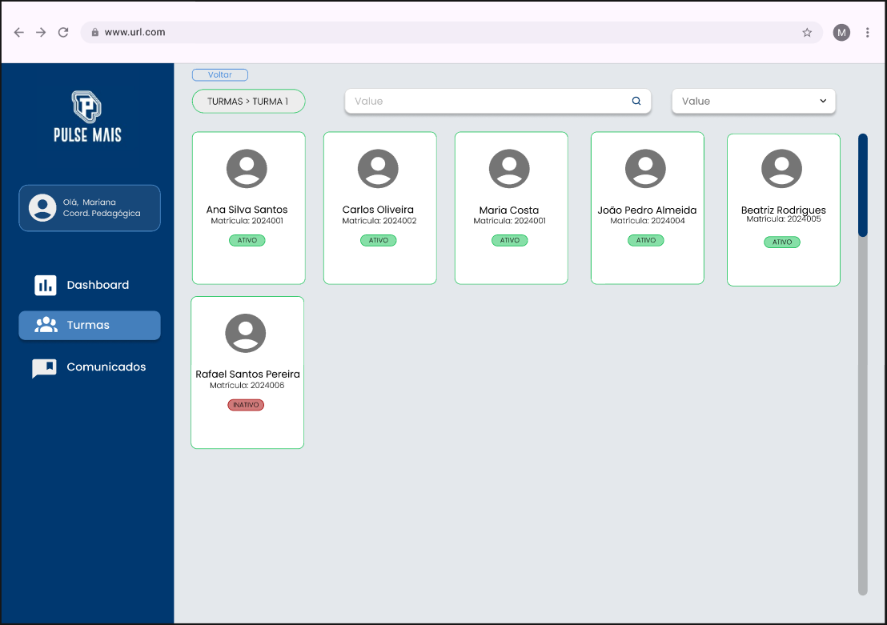<br>
  <sup>Fonte: Autores, 2026.</sup>
</div>


Ao selecionar uma turma específica, a Coordenadora chega à listagem dos alunos daquele grupo. O breadcrumb no topo deixa claro o caminho percorrido, e os campos de busca e filtro ajudam a localizar nomes ou recortar a turma por critérios específicos; cada aluno aparece em um card clicável que dá acesso ao perfil completo, com o indicador de situação ("Ativo" em verde, "Inativo" em vermelho) destacando o status para uma leitura rápida. O arranjo em grade e o uso pontual de cor priorizam a varredura visual em listas grandes, mantendo a coerência com a paleta institucional em azul e verde. A tela atende às US01 e US06, pois centraliza o acesso à turma e oferece filtros para identificar perfis específicos.

### 3.5.2.5 Tela de Perfil Individual do Aluno

<div align="center">
  <sub>Figura 58 — Protótipo de Alta da Coordenadora Pedagógica - Perfil do Aluno Individual</sub><br>
  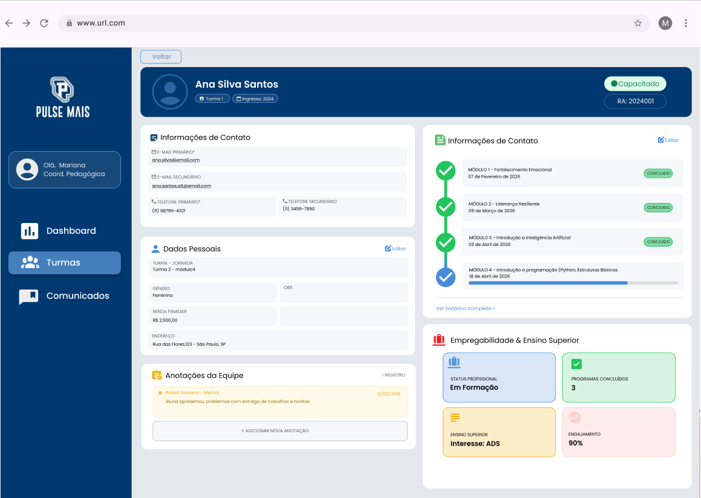<br>
  <sup>Fonte: Autores, 2026.</sup>
</div>


A Tela de Perfil Individual abre quando a Coordenadora seleciona um aluno na listagem e reúne, em um só lugar, a trajetória completa do jovem na Pulse Mais. À esquerda ficam os dados cadastrais e pessoais, editáveis pela equipe, e a seção de anotações que registra observações dos mentores ao longo do tempo; à direita, o progresso acadêmico em linha do tempo e o painel de empregabilidade e ensino superior. A divisão em colunas separa o que é registro do que é leitura analítica, deixando a Coordenadora alternar entre atualizar informações e avaliar a evolução sem perder o contexto, enquanto a paleta em azul e verde preserva a coerência com o restante do sistema. A tela atende às US01, US02 e US07, pois centraliza a jornada do aluno, permite a atualização dos dados cadastrais e o registro da situação de empregabilidade.

### 3.5.2.6 Tela de Comunicados da Coordenadora Pedagógica

<div align="center">
  <sub>Figura 59 — Protótipo de Alta da Coordenadora Pedagógica - Comunicados</sub><br>
  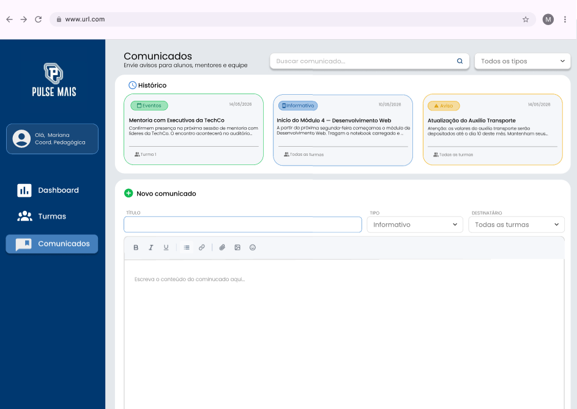<br>
  <sup>Fonte: Autores, 2026.</sup>
</div>

A Tela de Comunicados centraliza o envio e o histórico dos avisos que a equipe da Pulse Mais dispara para alunos, mentores e demais colaboradores. O Histórico, na parte superior, mostra os comunicados publicados em cards categorizados por tipo (Eventos, Informativo e Aviso) e identificados pelo destinatário; abaixo, o bloco "Novo Comunicado" reúne campos para título, tipo e destinatário, além de um editor de texto formatado para a redação. A categorização visual e a definição clara do destinatário (uma turma específica ou todas) reduzem o risco de envios indevidos e agilizam a consulta ao histórico, mantendo a paleta em azul e verde coerente com o restante do sistema. A tela atende à US08, pois é por ela que os comunicados sobre eventos e oportunidades da instituição chegam aos alunos.

### 3.5.3 Protótipo do psicológo

O protótipo de alta fidelidade desenvolvido para a psicóloga tem como objetivo centralizar o cadastro de alunos e seus respectivos relatórios em um ambiente de acesso exclusivo à profissional responsável pelo acompanhamento. Com isso, o processo se torna mais visual e intuitivo, otimizando o trabalho da coordenação e viabilizando um acompanhamento mais aprofundado de cada aluno, com dados relevantes, registros de prontuário e feedbacks pontuais direcionados diretamente à equipe envolvida.

### 3.5.3.1 Tela de Listagem de Alunos da Psicóloga

<div align="center">
  <sub>Figura 60 — Protótipo de Alta da piscóloga - lista geral de alunos</sub><br>
  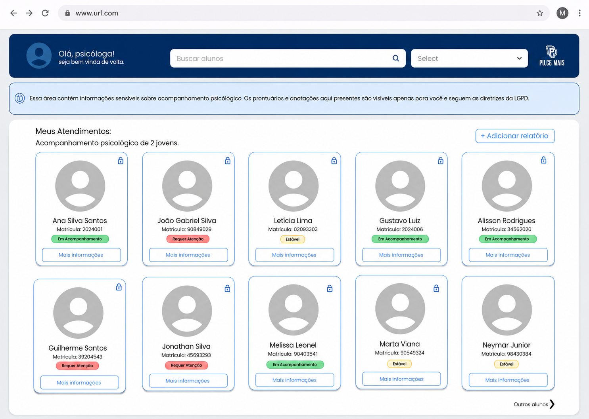<br>
  <sup>Fonte: Autores, 2026.</sup>
</div>

A Tela de Listagem de Alunos foi desenvolvida para fornecer à psicóloga uma visão geral dos estudantes acompanhados pela instituição. Nela são exibidas informações como matrícula e status de acompanhamento, classificados em categorias como estável, em acompanhamento ou requer atenção. A interface também permite filtrar alunos por situação e registrar novos atendimentos, facilitando o gerenciamento das atividades de acompanhamento psicológico. Esta tela está relacionada à US05 e aos requisitos RF004 e RF013.

### 3.5.3.2 Tela de Acompanhamento Individual do Aluno

<div align="center">
  <sub>Figura 61 — Protótipo de Alta da piscóloga - Visualização específica de um aluno</sub><br>
  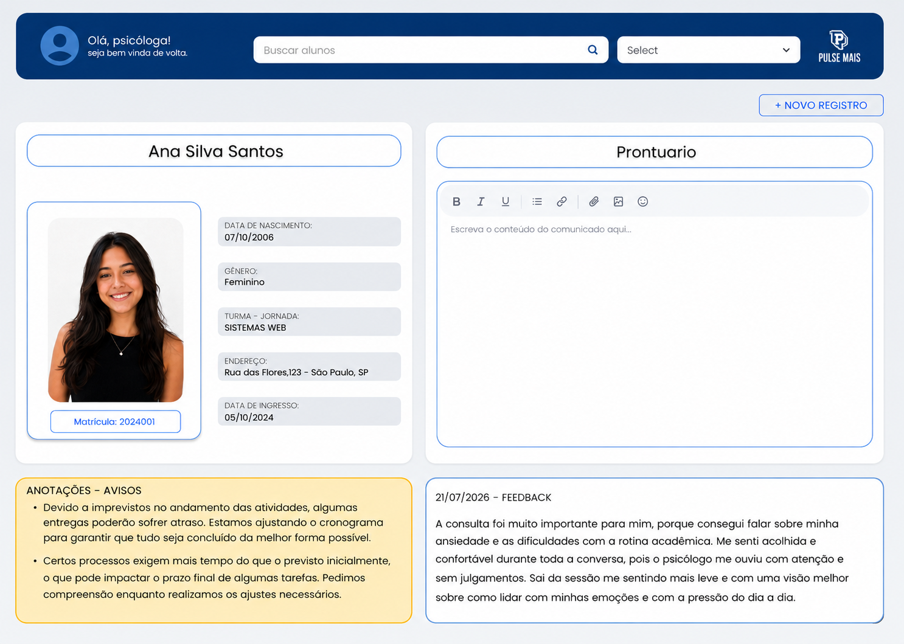<br>
  <sup>Fonte: Autores, 2026.</sup>
</div>

A Tela de Acompanhamento Individual foi criada para centralizar as informações e registros psicológicos de cada estudante. Nela, a psicóloga pode consultar dados pessoais, visualizar a turma do aluno, registrar prontuários, documentar feedbacks e acompanhar observações relevantes sobre os atendimentos realizados. O objetivo da interface é oferecer suporte ao acompanhamento individualizado dos alunos, permitindo um registro organizado e seguro das informações. Esta tela está relacionada à US05 e aos requisitos RF004 e RF013.


### 3.5.4 Protótipo do aluno

O protótipo do aluno foi desenvolvido com o objetivo de oferecer uma experiência simples e intuitiva para o acompanhamento da trajetória dos participantes dentro da Pulse Mais. As telas foram projetadas para centralizar informações pessoais, permitir a atualização de dados cadastrais, acompanhar o progresso na jornada educacional e facilitar o acesso aos comunicados da instituição. Dessa forma, a plataforma proporciona maior autonomia aos alunos e fortalece a comunicação entre a equipe da Pulse Mais e seus participantes.

### 3.5.4.1 Protótipo do Aluno

<div align="center">
  <sub>Figura 62 — Protótipo de Alta do Aluno - Meus Dados</sub><br>
  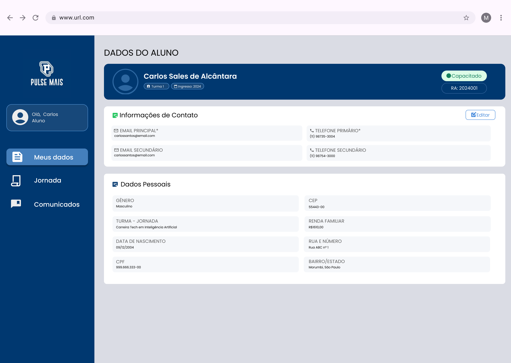<br>
  <sup>Fonte: Autores, 2026.</sup>
</div>

A Tela Meus Dados foi desenvolvida para centralizar as principais informações cadastrais do aluno em um único ambiente, permitindo a visualização de dados pessoais, informações de contato, turma e data de ingresso no programa. A interface foi organizada em blocos para facilitar a leitura e a navegação, garantindo que o aluno tenha acesso rápido às suas informações. Além disso, os dados de contato podem ser atualizados quando necessário, enquanto as demais informações permanecem sob responsabilidade da equipe gestora. Esta tela está relacionada às US03 e US04.

### 3.5.4.2 Tela Alteração de Dados

<div align="center">
  <sub>Figura 63 — Protótipo de Alta do Aluno - Altera Dados</sub><br>
  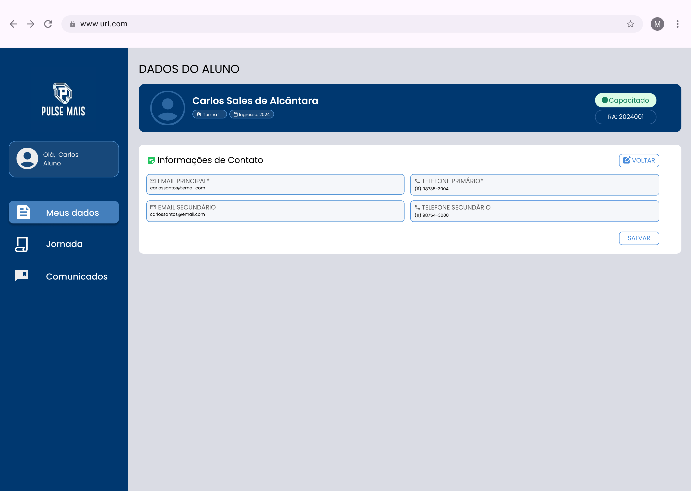<br>
  <sup>Fonte: Autores, 2026.</sup>
</div>

A Tela Alteração de Dados permite que o aluno atualize suas informações de contato diretamente pela plataforma, incluindo e-mails e telefones primários e secundários. A interface foi projetada para ser simples e intuitiva, destacando os campos editáveis e disponibilizando opções claras para salvar ou cancelar as alterações realizadas. Essa funcionalidade contribui para manter os dados cadastrais atualizados e garantir uma comunicação eficiente entre a instituição e os alunos, estando diretamente associada à US04.

### 3.5.4.3 Tela Jornada

<div align="center">
  <sub>Figura 64 — Protótipo de Alta do Aluno - Jornada</sub><br>
  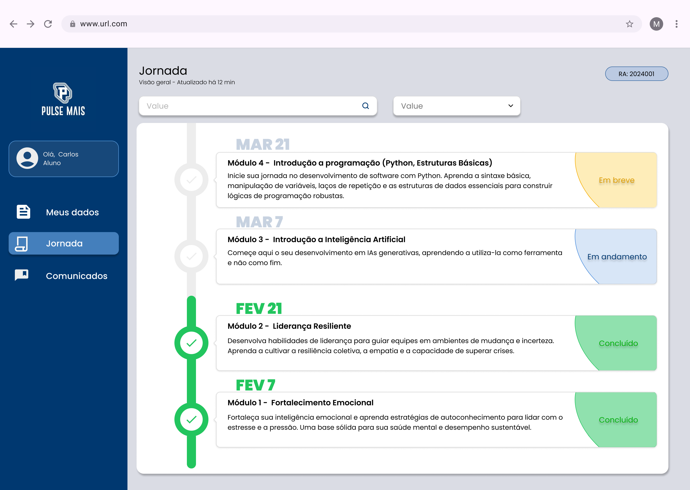<br>
  <sup>Fonte: Autores, 2026.</sup>
</div>

A Tela Jornada foi criada para apresentar ao aluno seu histórico completo dentro da Pulse Mais por meio de uma linha do tempo organizada cronologicamente. Cada etapa da jornada exibe informações sobre módulos, atividades e status de conclusão, permitindo que o usuário acompanhe sua evolução de forma simples e visual. A utilização de cores e indicadores facilita a identificação das etapas concluídas, em andamento ou futuras, tornando o acompanhamento mais intuitivo. Esta tela está diretamente relacionada à US03.

### 3.5.4.4 Tela Comunicados

<div align="center">
  <sub>Figura 65 — Protótipo de Alta do Aluno - Comunicados</sub><br>
  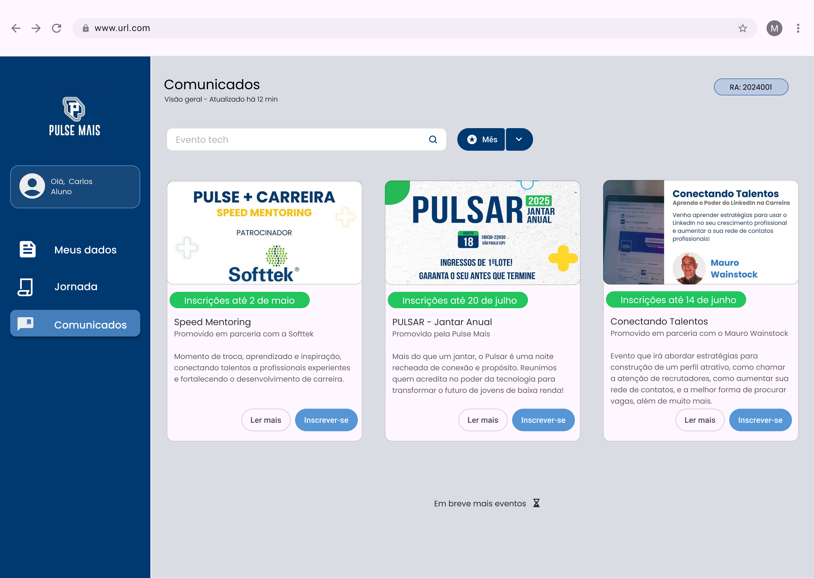<br>
  <sup>Fonte: Autores, 2026.</sup>
</div>

A Tela Comunicados centraliza os eventos, oportunidades e avisos enviados pela equipe da Pulse Mais, permitindo que os alunos acompanhem as informações mais recentes da instituição. Os comunicados são exibidos em formato de cards contendo imagem, título, descrição resumida e ações para obter mais detalhes ou realizar inscrições quando necessário. A interface também conta com mecanismos de busca e filtros para facilitar a localização do conteúdo desejado, estando diretamente relacionada à US08, responsável pelo acesso aos comunicados enviados pela organização.

### 3.5.5 Protótipo do Aluno (Mobile)

O protótipo mobile do aluno foi desenvolvido para garantir acesso às principais funcionalidades da plataforma por meio de dispositivos móveis, oferecendo uma experiência adaptada para telas menores sem comprometer a usabilidade. As interfaces foram projetadas com foco em acessibilidade, praticidade e navegação intuitiva, permitindo que os alunos acompanhem sua jornada, consultem informações pessoais, atualizem dados cadastrais e visualizem comunicados da instituição de forma rápida e eficiente.

### 3.5.5.1 Tela Meus Dados (Mobile)

<div align="center">
  <sub>Figura 66 — Wireframe Portal do Aluno Mobile — Meus Dados</sub><br>
  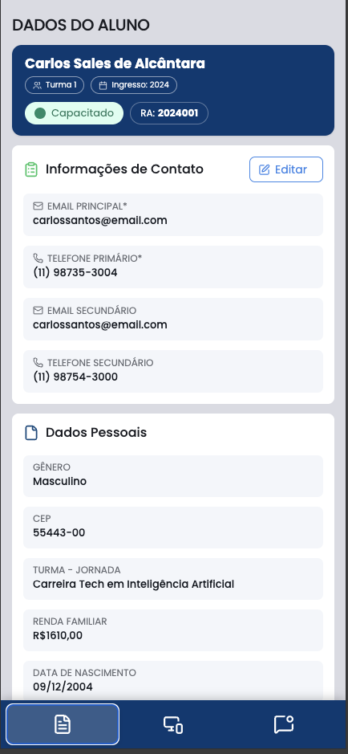<br>
  <sup>Fonte: Autores, 2026.</sup>
</div>

A Tela Meus Dados (Mobile) foi desenvolvida para permitir que o aluno visualize suas principais informações cadastrais diretamente pelo celular. A interface apresenta dados como nome, RA, status no programa, informações de contato e dados pessoais organizados em uma estrutura vertical que facilita a navegação por toque e rolagem. Além disso, a tela disponibiliza acesso rápido às demais funcionalidades da plataforma por meio das abas de navegação, garantindo uma experiência intuitiva e acessível. Esta tela está relacionada às US03 e US04.

### 3.5.5.2 Tela Editar Dados (Mobile)

<div align="center">
  <sub>Figura 67 — Wireframe Portal do Aluno Mobile — Meus Dados Editar</sub><br>
  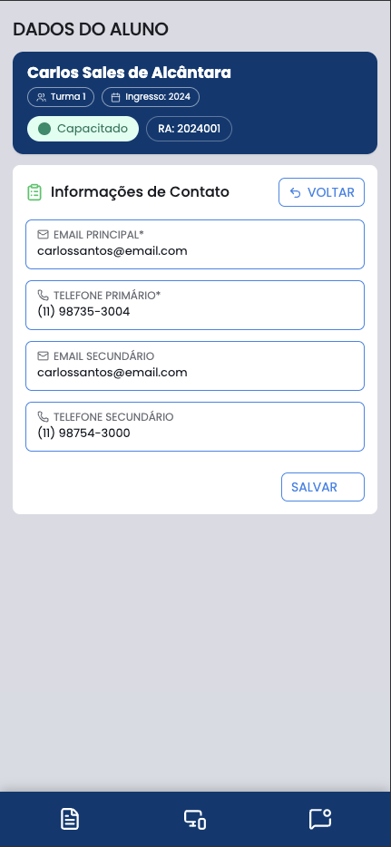<br>
  <sup>Fonte: Autores, 2026.</sup>
</div>

A Tela Editar Dados (Mobile) permite que o aluno atualize suas informações de contato utilizando dispositivos móveis. Os campos de e-mail e telefone são apresentados de forma organizada e adaptada para interação por toque, facilitando o preenchimento e a edição dos dados. A interface mantém os elementos visuais da plataforma para preservar a consistência da navegação e disponibiliza opções para salvar ou cancelar as alterações realizadas. Esta tela está diretamente relacionada à US04.

### 3.5.5.3 Tela Jornada (Mobile)

<div align="center">
  <sub>Figura 68 — Wireframe Portal do Aluno - Jornada</sub><br>
  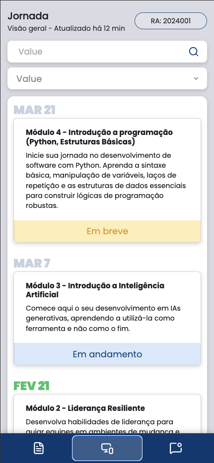<br>
  <sup>Fonte: Autores, 2026.</sup>
</div>


A Tela Jornada (Mobile) apresenta ao aluno sua trajetória dentro da Pulse Mais por meio de uma linha do tempo vertical adaptada ao formato de smartphones. Cada etapa da jornada exibe informações sobre os módulos cursados, descrição das atividades e indicadores visuais de status, permitindo que o usuário acompanhe facilmente sua evolução ao longo dos programas. A utilização de cores e elementos gráficos auxilia na identificação das etapas concluídas e em andamento, proporcionando uma visualização clara do progresso do aluno. Esta tela está relacionada à US03.

### 3.5.5.4 Tela Comunicados (Mobile)

<div align="center">
  <sub>Figura 69 — Wireframe Portal do Aluno - Comunicados</sub><br>
  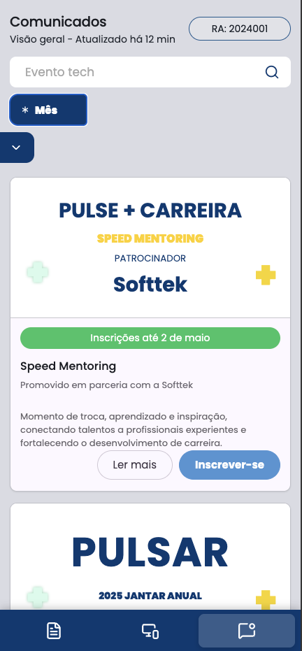<br>
  <sup>Fonte: Autores, 2026.</sup>
</div>

A Tela Comunicados (Mobile) centraliza os avisos, eventos e oportunidades compartilhados pela equipe da Pulse Mais, permitindo que os alunos acompanhem as informações institucionais diretamente pelo celular. Os comunicados são exibidos em formato de cards contendo categoria, título, descrição resumida e acesso aos detalhes completos, além de contar com um campo de busca para facilitar a localização de conteúdos específicos. O layout foi desenvolvido para garantir boa legibilidade em telas menores e proporcionar uma navegação simples e eficiente. Esta tela está diretamente relacionada à US08.


## 3.6. Modelagem do banco de dados 
Nesta seção, foi desenvolvida a modelagem do banco de dados por meio do modelo Entidade–Relacionamento (ER) e do Diagrama de Entidade e Relacionamento (DER), que permitiram representar graficamente as entidades do sistema, seus atributos e seus relacionamentos, servindo de base para a construção do modelo físico do banco de dados.
A partir do escopo da PulseMais, dos requisitos funcionais e das User Stories, foram identificadas 11 entidades principais e seus respectivos atributos, além dos relacionamentos entre elas. Nesse contexto, a cardinalidade foi definida para indicar quantas ocorrências de uma entidade podem se relacionar com outra, como em relações do tipo um-para-um (1:1), um-para-muitos (1:N) ou muitos-para-muitos (N:M).
Ainda no DER, também foram definidas as chaves primárias (PK), responsáveis por identificar unicamente cada registro, e as chaves estrangeiras (FK), responsáveis por estabelecer a ligação entre as entidades e estruturar seus relacionamentos. Posteriormente, no modelo físico, essas definições foram implementadas juntamente com os tipos de dados e as restrições de cada atributo, como VARCHAR, NOT NULL e outras constraints, garantindo a integridade referencial, a consistência dos dados e a aderência às regras de negócio do sistema.

Para além da representação visual dos diagramas, esta seção apresenta uma leitura interpretativa das relações entre as entidades do sistema. Compreender a cardinalidade de cada associação é essencial para garantir que o banco de dados reflita com fidelidade as regras de negócio da Pulse Mais, evitando inconsistências.

A tabela a seguir descreve cada relação em linguagem acessível, indicando quantos registros de uma entidade podem estar associados a registros de outra. Essa leitura complementa os diagramas ER e DER, tornando explícitas as decisões de modelagem que impactam diretamente funcionalidades críticas da plataforma.

<a name="multiplicidades"></a>

<table>
  <thead>
    <tr style="background-color: #4a7c9e; color: white;">
      <th>Entidade A</th>
      <th>Cardinalidade A</th>
      <th>Cardinalidade B</th>
      <th>Entidade B</th>
      <th>Explicação simples</th>
    </tr>
  </thead>
  <tbody>
    <tr style="background-color: #eaf4fb; color: #2c2c2c;">
      <td>Aluno</td><td>1,1</td><td>0,N</td><td>Certificado</td>
      <td>Um aluno pode ter nenhum ou vários certificados, mas cada certificado pertence a exatamente um aluno</td>
    </tr>
    <tr style="background-color: #d0e8f5; color: #2c2c2c;">
      <td>Aluno</td><td>1,1</td><td>0,N</td><td>Mentoria</td>
      <td>Um aluno pode ter nenhuma ou várias mentorias registradas, mas cada mentoria está vinculada a um único aluno</td>
    </tr>
    <tr style="background-color: #eaf4fb; color: #2c2c2c;">
      <td>Aluno</td><td>1,1</td><td>0,N</td><td>Relatório</td>
      <td>Um aluno pode ter nenhum ou vários relatórios psicológicos, mas cada relatório pertence a um único aluno</td>
    </tr>
    <tr style="background-color: #d0e8f5; color: #2c2c2c;">
      <td>Psicólogo</td><td>1,1</td><td>0,1</td><td>Relatório</td>
      <td>Cada relatório é feito por um psicólogo, mas um psicólogo pode não ter nenhum ou ter apenas um relatório associado</td>
    </tr>
    <tr style="background-color: #eaf4fb; color: #2c2c2c;">
      <td>Aluno</td><td>1,1</td><td>0,1</td><td>Empregabilidade</td>
      <td>Um aluno pode não ter nenhum ou ter um único emprego ativo registrado por vez</td>
    </tr>
    <tr style="background-color: #d0e8f5; color: #2c2c2c;">
      <td>Aluno</td><td>1,1</td><td>0,N</td><td>Alerta</td>
      <td>Um aluno pode não ter nenhum ou ter vários alertas gerados, mas cada alerta pertence a um único aluno</td>
    </tr>
    <tr style="background-color: #eaf4fb; color: #2c2c2c;">
      <td>Gestor</td><td>1,1</td><td>0,N</td><td>Alerta</td>
      <td>Um alerta pode ser acompanhado por um ou mais gestores, e um gestor pode ter nenhum ou vários alertas</td>
    </tr>
    <tr style="background-color: #d0e8f5; color: #2c2c2c;">
      <td>Coordenador</td><td>1,1</td><td>1,N</td><td>Turma</td>
      <td>Um coordenador pode gerenciar uma ou mais turmas, mas cada turma tem exatamente um coordenador responsável</td>
    </tr>
    <tr style="background-color: #eaf4fb; color: #2c2c2c;">
      <td>Aluno</td><td>1,N</td><td>1,1</td><td>Turma</td>
      <td>Um aluno pode pertencer a uma ou mais turmas, e uma turma pode ter um ou mais alunos matriculados</td>
    </tr>
    <tr style="background-color: #d0e8f5; color: #2c2c2c;">
      <td>Turma</td><td>1,N</td><td>1,N</td><td>Aula</td>
      <td>Uma turma possui uma ou mais aulas, e uma aula pode pertencer a uma ou mais turmas</td>
    </tr>
    <tr style="background-color: #eaf4fb; color: #2c2c2c;">
      <td>Aluno</td><td>1,N</td><td>0,N</td><td>Aula (frequenta)</td>
      <td>Um aluno pode não ter frequência registrada ou ter várias, e uma aula pode ter nenhum ou vários registros de frequência</td>
    </tr>
    <tr style="background-color: #d0e8f5; color: #2c2c2c;">
      <td>Aluno</td><td>1,N</td><td>0,N</td><td>Evento (participa)</td>
      <td>Um aluno pode não ter participado de nenhum ou ter participado de vários eventos, e um evento pode ter nenhum ou vários alunos participantes</td>
    </tr>
    <tr style="background-color: #eaf4fb; color: #2c2c2c;">
      <td>Aluno</td><td>1,1</td><td>0,N</td><td>Anotações</td>
      <td>Um aluno pode ter várias anotações</td>
    </tr>
  </tbody>
</table>

### 3.6.1. Modelo Entidade-Relacionamento (ER) 

Nessa seção desenvolvemos o Modelo ER Conceitual, responsável por representar de forma abstrata a estrutura do banco de dados e as regras de negócio do sistema (DEVMEDIA, [s. d.]).

O modelo foi elaborado a partir da identificação das entidades, atributos e relacionamentos necessários para atender aos requisitos levantados, servindo como base para as etapas posteriores da modelagem.
Além disso, o Modelo ER Conceitual permitiu organizar e visualizar como os dados se relacionam dentro do sistema, facilitando a compreensão da estrutura geral do banco de dados antes da implementação técnica.

<div align="center">
  <sub>Figura 70 — Modelo de Entidade-Relacionamento (ER)</sub><br>
  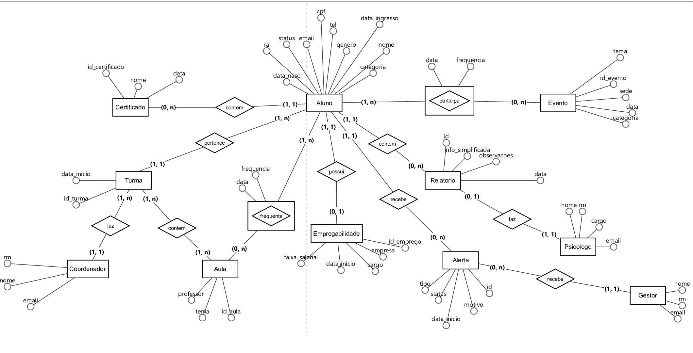<br>
  <sup>Fonte: Autores, 2026.</sup>
</div>

### 3.6.2. Diagrama Entidade-Relacionamento (DER) 

Nessa secção desenvolvemos o DER lógico é a etapa intermediária entre o modelo conceitual e o físico, onde a estrutura dos dados é organizada de forma técnica e próxima da implementação. Ele detalha atributos, chaves primárias (PK), chaves estrangeiras (FK), cardinalidades e já considera princípios de normalização mas sem depender de um SGBD específico.

<div align="center">
  <sub>Figura 71 — Diagrama de Entidades-Relacionais (DER) lógico</sub><br>
  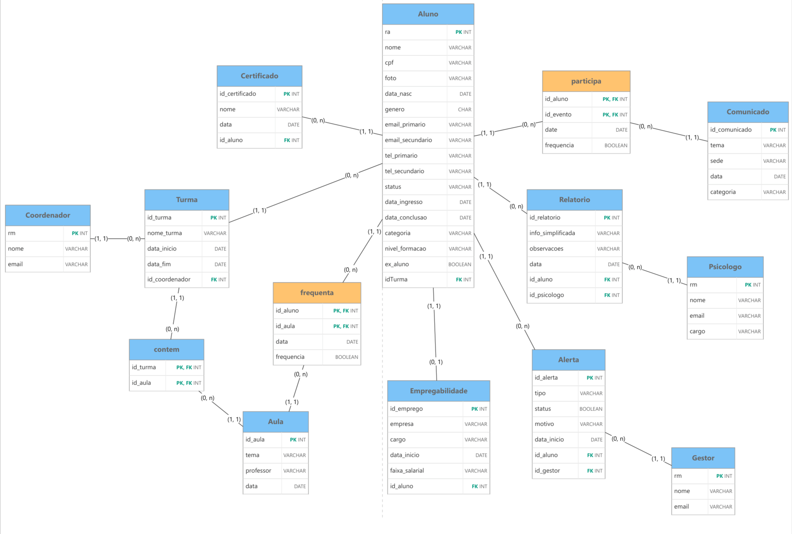<br>
  <sup>Fonte: Autores, 2026.</sup>
</div>

No diagrama desenvolvido, o modelo gira em torno da entidade Aluno, que se relaciona com as demais entidades do sistema. Um aluno pertence a uma Turma (gerenciada por um Coordenador), frequenta Aulas (agrupadas nas turmas via contem) e pode participar de Eventos. Seu progresso acadêmico é registrado em um Relatório, acompanhado por um Psicólogo, e sua inserção no mercado é rastreada em Empregabilidade. Alertas podem ser gerados para o aluno e são visíveis ao Gestor. Por fim, ao concluir o percurso, o aluno recebe um Certificado.

### 3.6.3. Modelo Relacional e Modelo Físico 

Nessa seção desenvolvemos o Modelo Relacional e o Modelo Físico que representam as etapas finais do processo de modelagem do banco de dados. Ambos os modelos consolidam as decisões conceituais e lógicas estabelecidas no Modelo ER Conceitual (seção 3.6.1) e no Diagrama Entidade-Relacionamento (seção 3.6.2), traduzindo-as em uma estrutura concreta, executável e reproduzível. A implementação foi realizada integralmente em PostgreSQL, por meio de um arquivo de migração DDL que define todas as tabelas, restrições e índices do sistema.

```sql
-- Tabelas independentes (sem dependências externas)
-- Migration 001 - Cria tabela Coordenador
CREATE TABLE Coordenador (
  rm    SERIAL       PRIMARY KEY,
  nome  VARCHAR(100) NOT NULL,
  email VARCHAR(150) NOT NULL UNIQUE
);


-- Migration 002 - Cria tabela Turma
-- Depende de: Coordenador
CREATE TABLE Turma (
  id_turma       SERIAL       PRIMARY KEY,
  id_coordenador INT,
  data_inicio    DATE         NOT NULL,
  data_fim       DATE         NOT NULL,
  nome_turma     VARCHAR(100) NOT NULL,
  CHECK (data_fim > data_inicio),
  CONSTRAINT fk_turma_coordenador FOREIGN KEY (id_coordenador) REFERENCES Coordenador(rm)
);


-- Migration 003 - Cria tabela Aula
CREATE TABLE Aula (
  id_aula    SERIAL       PRIMARY KEY,
  professor  VARCHAR(100) NOT NULL,
  tema       VARCHAR(100) NOT NULL,
  data       DATE         NOT NULL
);


-- Migration 004 - Cria tabela Evento
CREATE TABLE Evento (
  id_evento SERIAL       PRIMARY KEY,
  sede      VARCHAR(50)  NOT NULL,
  data      DATE         NOT NULL,
  categoria VARCHAR(100) NOT NULL,
  tema      VARCHAR(100) NOT NULL
);


-- Migration 005 - Cria tabela Gestor
CREATE TABLE Gestor (
  rm    SERIAL       PRIMARY KEY,
  nome  VARCHAR(100) NOT NULL,
  email VARCHAR(150) NOT NULL UNIQUE
);


-- Migration 006 - Cria tabela Psicologo
CREATE TABLE Psicologo (
  rm    SERIAL       PRIMARY KEY,
  nome  VARCHAR(100) NOT NULL,
  email VARCHAR(150) NOT NULL UNIQUE,
  cargo VARCHAR(100) NOT NULL
);


-- Migration 007 - Cria tabela Certificado
-- FK para Aluno adicionada no Bloco 3 (Aluno ainda não existe)
CREATE TABLE Certificado (
  id_certificado SERIAL       PRIMARY KEY,
  id_aluno       INT,
  nome           VARCHAR(100) NOT NULL,
  data           DATE         NOT NULL
);


-- Migration 008 - Cria tabela Relatorio
-- Depende de: Psicologo
-- FK para Aluno adicionada no Bloco 3 (Aluno ainda não existe)
CREATE TABLE Relatorio (
  id_relatorio      SERIAL       PRIMARY KEY,
  id_aluno          INT,
  id_psicologo      INT,
  info_simplificada VARCHAR(200) NOT NULL,
  observacoes       VARCHAR(250) NOT NULL,
  data              DATE         NOT NULL,
  CONSTRAINT fk_relatorio_psicologo FOREIGN KEY (id_psicologo) REFERENCES Psicologo(rm)
);


-- Migration 009 - Cria tabela Alerta
-- Depende de: Gestor
-- FK para Aluno adicionada no Bloco 3 (Aluno ainda não existe)
CREATE TABLE Alerta (
  id_alerta   SERIAL       PRIMARY KEY,
  id_aluno    INT,
  id_gestor   INT,
  tipo        INT          NOT NULL CHECK (tipo > 0),
  data_inicio DATE         NOT NULL,
  motivo      VARCHAR(150),
  status      BOOLEAN      NOT NULL,
  CONSTRAINT fk_alerta_gestor FOREIGN KEY (id_gestor) REFERENCES Gestor(rm)
);


-- Tabelas que dependem das anteriores


-- Migration 010 - Cria tabela Aluno
-- Depende de: Turma
CREATE TABLE Aluno (
  ra               SERIAL       PRIMARY KEY,
  id_turma         INT,
  nome             VARCHAR(100) NOT NULL,
  data_nasc        DATE         NOT NULL,
  cpf              VARCHAR(14)  NOT NULL,
  email_primario   VARCHAR(100) NOT NULL,
  email_secundario VARCHAR(100),
  tel_primario     VARCHAR(20)  NOT NULL,
  tel_secundario   VARCHAR(20),
  genero           VARCHAR(20)  NOT NULL,
  data_ingresso    DATE         NOT NULL,
  status           BOOLEAN      NOT NULL,
  categoria        VARCHAR(100) NOT NULL,
  foto             VARCHAR(50),
  ex_aluno         BOOLEAN      NOT NULL DEFAULT FALSE,
  data_conclusao   DATE,
  nivel_formacao   VARCHAR(100),
  UNIQUE (cpf),
  UNIQUE (email_primario),
  CONSTRAINT fk_aluno_turma FOREIGN KEY (id_turma) REFERENCES Turma(id_turma)
);


-- Migration 011 - Cria tabela Empregabilidade
-- Depende de: Aluno
CREATE TABLE Empregabilidade (
  id_emprego     SERIAL      PRIMARY KEY,
  id_aluno       INT,
  empresa        VARCHAR(70)  NOT NULL,
  data_inicio    DATE         NOT NULL,
  faixa_salarial VARCHAR(15)  NOT NULL,
  cargo          VARCHAR(20)  NOT NULL,
  CONSTRAINT fk_empregabilidade_aluno FOREIGN KEY (id_aluno) REFERENCES Aluno(ra)
);


-- Foreign Keys pendentes (dependiam de Aluno)


-- Certificado → Aluno
ALTER TABLE Certificado
ADD CONSTRAINT fk_certificado_aluno
FOREIGN KEY (id_aluno) REFERENCES Aluno(ra);

-- Relatorio → Aluno
ALTER TABLE Relatorio
ADD CONSTRAINT fk_relatorio_aluno
FOREIGN KEY (id_aluno) REFERENCES Aluno(ra);

-- Alerta → Aluno
ALTER TABLE Alerta
ADD CONSTRAINT fk_alerta_aluno
FOREIGN KEY (id_aluno) REFERENCES Aluno(ra);


-- Tabelas associativas N:M


-- Migration 012 - Tabela associativa: Aluno ↔ Aula
CREATE TABLE frequenta (
  id_aluno   INT     NOT NULL,
  id_aula    INT     NOT NULL,
  data       DATE    NOT NULL,
  frequencia BOOLEAN NOT NULL,
  PRIMARY KEY (id_aluno, id_aula),
  CONSTRAINT fk_frequenta_aluno FOREIGN KEY (id_aluno) REFERENCES Aluno(ra),
  CONSTRAINT fk_frequenta_aula  FOREIGN KEY (id_aula)  REFERENCES Aula(id_aula)
);


-- Migration 013 - Tabela associativa: Turma ↔ Aula
CREATE TABLE contem (
  id_turma INT NOT NULL,
  id_aula  INT NOT NULL,
  PRIMARY KEY (id_turma, id_aula),
  CONSTRAINT fk_contem_turma FOREIGN KEY (id_turma) REFERENCES Turma(id_turma),
  CONSTRAINT fk_contem_aula  FOREIGN KEY (id_aula)  REFERENCES Aula(id_aula)
);


-- Migration 014 - Tabela associativa: Aluno ↔ Evento
CREATE TABLE participa (
  id_aluno   INT     NOT NULL,
  id_evento  INT     NOT NULL,
  data       DATE    NOT NULL,
  frequencia BOOLEAN NOT NULL,
  PRIMARY KEY (id_aluno, id_evento),
  CONSTRAINT fk_participa_aluno  FOREIGN KEY (id_aluno)  REFERENCES Aluno(ra),
  CONSTRAINT fk_participa_evento FOREIGN KEY (id_evento) REFERENCES Evento(id_evento)
);


-- Índices


-- Aluno: campos usados em buscas e filtros frequentes
CREATE INDEX idx_aluno_cpf             ON Aluno(cpf);
CREATE INDEX idx_aluno_email           ON Aluno(email_primario);
CREATE INDEX idx_aluno_status          ON Aluno(status);
CREATE INDEX idx_aluno_categoria       ON Aluno(categoria);
CREATE INDEX idx_aluno_ex_aluno        ON Aluno(ex_aluno);
CREATE INDEX idx_aluno_turma           ON Aluno(id_turma);

-- Empregabilidade: busca por aluno
CREATE INDEX idx_empregabilidade_aluno ON Empregabilidade(id_aluno);

-- Frequência: busca por aluno e por aula
CREATE INDEX idx_frequenta_aluno       ON frequenta(id_aluno);
CREATE INDEX idx_frequenta_aula        ON frequenta(id_aula);

-- Participação em eventos: busca por aluno
CREATE INDEX idx_participa_aluno       ON participa(id_aluno);

-- Alerta: busca por status e por aluno
CREATE INDEX idx_alerta_status         ON Alerta(status);
CREATE INDEX idx_alerta_aluno          ON Alerta(id_aluno);

-- Turma: busca por período
CREATE INDEX idx_turma_data_inicio     ON Turma(data_inicio);

-- Certificado: busca por aluno
CREATE INDEX idx_certificado_aluno     ON Certificado(id_aluno);

-- Relatorio: busca por aluno e por psicologo
CREATE INDEX idx_relatorio_aluno       ON Relatorio(id_aluno);
CREATE INDEX idx_relatorio_psicologo   ON Relatorio(id_psicologo);

```


### 3.6.4. Consultas SQL e lógica proposicional 
## Introdução

As consultas SQL são comandos usados para se comunicar com um banco de dados, permitindo buscar, atualizar ou remover informações armazenadas em tabelas. Toda vez que você faz login em um sistema, pesquisa um produto ou consulta um extrato, há consultas sendo executadas nos bastidores para encontrar exatamente o que você precisa.

Para construir essas consultas, utilizamos **operadores lógicos** que funcionam como o raciocínio do dia a dia:

- **AND (E)**: exige que todas as condições sejam verdadeiras.
- **OR (OU)**: basta que uma das condições seja verdadeira.
- **NOT (NÃO)**: inverte a condição, excluindo determinados registros.

Esses operadores podem ser combinados com recursos como `JOIN` (que conecta tabelas diferentes), `LIKE` (que busca padrões de texto) e `IN` (que verifica se um valor pertence a uma lista), tornando as consultas mais precisas e poderosas.

A importância dessas consultas está em apoiar a **tomada de decisão**: elas permitem identificar problemas, segmentar informações e manter os dados atualizados. Cada consulta apresentada a seguir vem acompanhada de sua **expressão lógica proposicional** e **tabela verdade**, mostrando a estrutura lógica formal por trás de cada comando SQL.


Essa consulta SQL é utilizada para buscar informações dos alunos, relacionando dados das tabelas Aluno, Turma, participa e Evento através de múltiplos JOINs. A consulta retorna o nome do aluno, a turma em que ele está matriculado e o tema do evento em que participou. Além disso, aplica condições lógicas utilizando os operadores OR e NOT, selecionando alunos que pertencem à categoria “Risco” ou que participaram de eventos da categoria “Tecnologia”, excluindo aqueles que são ex-alunos. Dessa forma, a consulta permite identificar alunos ativos que possuem relevância para acompanhamento acadêmico e participação em atividades tecnológicas.
| 1 | Consulta SELECT com múltiplos JOINs e OR + NOT |
| --- | --- |
| **Expressão SQL** | SELECT a.nome, t.nome_turma, e.tema FROM Aluno a JOIN Turma t ON a.id_turma = t.id_turma JOIN participa p ON a.ra = p.id_aluno JOIN Evento e ON p.id_evento = e.id_evento WHERE (a.categoria = 'Risco' OR e.categoria = 'Tecnologia') AND NOT (a.ex_aluno = 1); |
| **Proposições lógicas** | $A$: O aluno é da categoria 'Risco' (a.categoria = 'Risco') <br> $B$: O evento é da categoria 'Tecnologia' (e.categoria = 'Tecnologia') <br> $C$: O aluno é ex-aluno (a.ex_aluno = 1) |
| **Expressão lógica proposicional** | $(A \lor B) \land \neg C$ |
| **Tabela Verdade** | <table> <thead> <tr> <th>$A$</th> <th>$B$</th> <th>$C$</th> <th>$(A \lor B)$</th> <th>$(A \lor B) \land \neg C$</th> </tr> </thead> <tbody> <tr> <td>F</td> <td>F</td> <td>F</td> <td>F</td> <td>F</td> </tr> <tr> <td>F</td> <td>F</td> <td>V</td> <td>F</td> <td>F</td> </tr> <tr> <td>F</td> <td>V</td> <td>F</td> <td>V</td> <td>V</td> </tr> <tr> <td>F</td> <td>V</td> <td>V</td> <td>V</td> <td>F</td> </tr> <tr> <td>V</td> <td>F</td> <td>F</td> <td>V</td> <td>V</td> </tr> <tr> <td>V</td> <td>F</td> <td>V</td> <td>V</td> <td>F</td> </tr> <tr> <td>V</td> <td>V</td> <td>F</td> <td>V</td> <td>V</td> </tr> <tr> <td>V</td> <td>V</td> <td>V</td> <td>V</td> <td>F</td> </tr> </tbody> </table> |


Essa consulta SQL é utilizada para atualizar registros da tabela Alerta. O comando altera o valor do campo status para 1, indicando que o alerta foi ativado. A atualização ocorre apenas para os alunos cujos IDs estejam presentes na lista definida pela cláusula IN. Esse tipo de consulta é útil para realizar atualizações em grupo de forma rápida e eficiente, permitindo ativar alertas de múltiplos alunos ao mesmo tempo sem a necessidade de executar vários comandos separados.
| 2 | UPDATE com condição IN |
| --- | --- |
| **Expressão SQL** | UPDATE Alerta SET status = 1 WHERE id_aluno IN (1, 2, 3); |
| **Proposições lógicas** | $A$: O ID do aluno está na lista (id_aluno IN (1, 2, 3)) <br> $B$: O status do alerta será ativado (status = 1) |
| **Expressão lógica proposicional** | $A \rightarrow B$ |
| **Tabela Verdade** | <table> <thead> <tr> <th>$A$</th> <th>$B$</th> <th>$A \rightarrow B$</th> </tr> </thead> <tbody> <tr> <td>F</td> <td>F</td> <td>V</td> </tr> <tr> <td>F</td> <td>V</td> <td>V</td> </tr> <tr> <td>V</td> <td>F</td> <td>F</td> </tr> <tr> <td>V</td> <td>V</td> <td>V</td> </tr> </tbody> </table> |


Em seguida, essa consulta realiza a junção entre as tabelas Aluno, Relatório e Psicólogo com o objetivo de listar informações relacionadas aos atendimentos psicológicos realizados para alunos ativos. A instrução seleciona o nome do aluno, a data do relatório, as observações registradas e o nome do psicólogo responsável. O relacionamento ocorre por meio das chaves estrangeiras id_aluno e id_psicologo, conectando os dados dos alunos aos relatórios e aos profissionais responsáveis. Além disso, a cláusula WHERE filtra apenas os psicólogos cujo cargo seja “clinica” e alunos com status “ativo”, retornando somente os registros que atendem a esses critérios.

| 3 | SELECT com JOIN e condição AND |
| --- | --- |
| **Expressão SQL** | SELECT a.nome, r.data, r.observacoes, p.nome FROM Aluno a JOIN Relatório r ON r.id_aluno = a.ra JOIN Psicologo p ON r.id_psicologo = p.rm WHERE p.cargo = 'clinica' AND a.status = 'ativo'; |
| **Proposições lógicas** | $A$: O cargo da psicóloga é clínica (p.cargo = 'clinica') <br> $B$: O status do aluno é ativo, não evadido. (a.status = 'ativo') |
| **Expressão lógica proposicional** | $A \land B$ |
| **Tabela Verdade** | <table> <thead> <tr> <th>$A$</th> <th>$B$</th> <th>$A \land B$</th> </tr> </thead> <tbody> <tr> <td>F</td> <td>F</td> <td>F</td> </tr> <tr> <td>F</td> <td>V</td> <td>F</td> </tr> <tr> <td>V</td> <td>F</td> <td>F</td> </tr> <tr> <td>V</td> <td>V</td> <td>V</td> </tr> </tbody> </table> |

Para realizar uma atualização na tabela Empregabilidade, alterando o status do vínculo de emprego de um aluno para “inativo” e registrando a data de encerramento com a data atual do sistema (CURRENT_DATE). A atualização ocorre apenas para o aluno identificado pelo parâmetro :id_aluno, aluno recebido pelo sistema, e somente quando existe uma data de início cadastrada, garantindo que apenas registros válidos de empregabilidade sejam encerrados. Essa operação é útil para controlar o histórico profissional dos alunos e manter os dados de empregabilidade atualizados no banco de dados.

| 4 | UPDATE com condição AND + NOT |
| --- | --- |
| **Expressão SQL** | UPDATE Empregabilidade SET status = 'inativo', data_encerramento = CURRENT_DATE WHERE id_aluno = :id_aluno AND NOT data_inicio IS NULL; |
| **Proposições lógicas** | $A$: O ID do aluno é igual ao ID recebido (id_aluno = :id_aluno) <br> $B$: A data de início é nula (data_inicio IS NULL) |
| **Expressão lógica proposicional** | $A \land \neg B$ |
| **Tabela Verdade** | <table> <thead> <tr> <th>$A$</th> <th>$B$</th> <th>$\neg B$</th>  <th>$A \land \neg B$</th> </tr> </thead> <tbody> <tr> <td>F</td> <td>F</td> <td>V</td> <td>F</td> </tr> <tr> <td>F</td> <td>V</td> <td>F</td> <td>F</td> </tr> <tr> <td>V</td> <td>F</td> <td>V</td> <td>V</td> </tr> <tr> <td>V</td> <td>V</td> <td>F</td> <td>F</td> </tr> </tbody> </table> |


Esta consulta tem como objetivo identificar alunos em risco de evasão que estão atualmente ativos no programa. A consulta busca alunos cujo status seja "ativo" E que possuam alertas ativos vinculados ao seu registro. É uma consulta crítica para a equipe pedagógica, pois permite o monitoramento proativo de alunos que precisam de intervenção imediata para evitar a desistência do curso.

5 |  SELECT com WHERE e AND
--- | ---
**Expressão SQL** | SELECT * FROM Aluno a, Alerta al WHERE (a.status = 'ativo' AND al.status = TRUE);
**Proposições lógicas** | $A$: O status do aluno é 'ativo' (a.status = 'ativo') <br> $B$: O status do alerta é verdadeiro (al.status = TRUE)
**Expressão lógica proposicional** | $A \land B$
**Tabela Verdade** | <table> <thead> <tr> <th>$A$</th> <th>$B$</th> <th>$A \land B$</th> </tr> </thead> <tbody> <tr> <td>F</td> <td>F</td> <td>F</td> </tr> <tr> <td>F</td> <td>V</td> <td>F</td> </tr> <tr> <td>V</td> <td>F</td> <td>F</td> </tr> <tr> <td>V</td> <td>V</td> <td>V</td> </tr> </tbody> </table>


Esta consulta tem como objetivo buscar alunos cujo nome inicie com a letra "A" OU que possuam e-mail primário do domínio Gmail. É útil para campanhas de comunicação segmentada, permitindo localizar alunos por diferentes critérios de identificação de forma flexível, sem exigir que todas as condições sejam atendidas simultaneamente.

6 |  SELECT com LIKE e OR
--- | ---
**Expressão SQL** | SELECT * FROM Aluno WHERE (nome LIKE 'A%' OR email_primario LIKE '%@gmail.com');
**Proposições lógicas** | $A$: O nome do aluno começa com 'A' (nome LIKE 'A%') <br> $B$: O e-mail primário pertence ao domínio Gmail (email_primario LIKE '%@gmail.com')
**Expressão lógica proposicional** | $A \lor B$
**Tabela Verdade** | <table> <thead> <tr> <th>$A$</th> <th>$B$</th> <th>$A \lor B$</th> </tr> </thead> <tbody> <tr> <td>F</td> <td>F</td> <td>F</td> </tr> <tr> <td>F</td> <td>V</td> <td>V</td> </tr> <tr> <td>V</td> <td>F</td> <td>V</td> </tr> <tr> <td>V</td> <td>V</td> <td>V</td> </tr> </tbody> </table>


Essa consulta SQL é utilizada para buscar os eventos cadastrados no sistema, filtrando os registros na tabela Evento. O filtro retorna todos os campos associados ao evento que atendam aos critérios especificados. Nesse caso, foi aplicado condições lógicas utilizando o operador OR, selecionando os eventos cuja sede seja a FIAP ou a Alest ou aqueles que estão na categoria Palestra. Dessa forma, a consulta permite identificar e concentrar em uma única listagem todas as atividades institucionais de interesse realizadas nessas localidades específicas ou que possuam esse formato de apresentação.

| 7 | SELECT com WHERE e OR |
| --- | --- |
| **Expressão SQL** | SELECT * FROM Evento e WHERE e.sede = ‘FIAP’ OR e.sede = ‘Alest’ OR e.categoria = ‘Palestra’|
| **Proposições lógicas** | $A$: A sede do evento é FIAP <br> $B$: A sede do evento é Alest <br> $C$: A categoria do evento é 'Palestra'|
| **Expressão lógica proposicional** | $A \lor B \lor C$ |
| **Tabela Verdade** | <table> <thead> <tr> <th>$A$</th> <th>$B$</th> <th>$C$</th> <th>$A \lor B \lor C$</th> </tr> </thead> <tbody> <tr> <td>F</td> <td>F</td> <td>F</td> <td>F</td> </tr> <tr> <td>F</td> <td>F</td> <td>V</td> <td>V</td> </tr> <tr> <td>F</td> <td>V</td> <td>F</td> <td>V</td> </tr> <tr> <td>F</td> <td>V</td> <td>V</td> <td>V</td> </tr> <tr> <td>V</td> <td>F</td> <td>F</td> <td>V</td> </tr> <tr> <td>V</td> <td>F</td> <td>V</td> <td>V</td> </tr> <tr> <td>V</td> <td>V</td> <td>F</td> <td>V</td> </tr> <tr> <td>V</td> <td>V</td> <td>V</td> <td>V</td> </tr> </tbody> </table> |

Essa consulta SQL é utilizada para excluir os registros de notificações do sistema na tabela Alerta. Nesse caso, a operação remove as linhas que atendam simultaneamente aos critérios estipulados de tipagem e ciclo de vida do aviso. Além disso, aplica condições lógicas utilizando os operadores IN e AND, selecionando para exclusão apenas os alertas cujo tipo seja informativo ou lembrete, e que estejam com o status resolvido. Dessa forma, a consulta permite eliminar históricos de comunicações secundárias que já foram totalmente processadas e concluídas pelos usuários.

| 8 | DELETE com condição IN + AND |
| --- | --- |
| **Expressão SQL** | DELETE FROM Alerta WHERE tipo IN (‘informativo’, ‘lembrete’) AND status = ‘resolvido’|
| **Proposições lógicas** | $A$: O tipo do alerta é informativo ou lembrete <br> $B$: O status do alerta é resolvido |
| **Expressão lógica proposicional** | $A \land B$ |
| **Tabela Verdade** | <table> <thead> <tr> <th>$A$</th> <th>$B$</th> <th>$A \land B$</th> </tr> </thead> <tbody> <tr> <td>F</td> <td>F</td> <td>F</td> </tr> <tr> <td>F</td> <td>V</td> <td>F</td> </tr> <tr> <td>V</td> <td>F</td> <td>F</td> </tr> <tr> <td>V</td> <td>V</td> <td>V</td> </tr> </tbody> </table> |

## 3.7 WebAPI e endpoints 

Nesta seção, apresentamos a documentação da Web API e dos endpoints que serão implementados no backend do sistema. O objetivo desta documentação é estabelecer um contrato claro entre o frontend e o backend, definindo as rotas, os dados esperados e as respostas de cada operação, servindo como guia tanto para o desenvolvimento quanto para futuras manutenções do sistema.

A Web API (Application Programming Interface) é um conjunto de regras e protocolos que permite a comunicação entre sistemas por meio da web, definindo como as requisições e respostas devem ser estruturadas (FIELDING, 2000). A API do presente projeto segue o padrão REST, utilizando o formato JSON para troca de dados.

Os endpoints são os pontos de acesso disponibilizados pela API, cada um representa uma URL específica que o sistema expõe para receber requisições e retornar respostas, mapeando as operações que o usuário pode realizar, como consultar, registrar ou atualizar dados (RICHARDSON; RUBY, 2007).

Foram mapeados os endpoints referentes aos requisitos funcionais RF001 a RF019, mantendo cada operação vinculada às regras de negócio e aos casos de teste correspondentes.
[Ver documentação WebAPI](https://documentacao-html-29cc8c.pages.git.inteli.edu.br/)

# RF001 - Perfil do Aluno (Visualização e edição dos próprios dados)

> **RF001:** O sistema deve identificar o perfil de estudante com base nas credenciais de login, permitindo que o aluno visualize e edite apenas seus próprios dados cadastrais básicos.

---

### `GET /alunos/:ra`

**Descrição:** Retorna os dados cadastrais do aluno autenticado.

**Headers:**

```
Content-Type: application/json
Authorization: Bearer <token>
```

**Path Params:**

| Param | Tipo | Descrição |
|---|---|---|
| `ra` | integer | RA do aluno |

**Responses:**

`200 OK`
```json
{
  "ra": 1,
  "nome": "Carlos Sales",
  "cpf": "202.090.459-50",
  "foto": "../assets/fotoPerfilCarlosSales.png",
  "data_nasc": "29-08-2007",
  "idTurma": 1,
  "status": "Capacitado",
  "genero": "Masculino",
  "email_primario": "Carlos.sales@gmail.com",
  "email_secundario": "sales.carlos@gmail.com",
  "tel_primario": "9494-9494",
  "tel_secundario": "9272-4002",
  "cep": "00893-000",
  "endereco": "Rua Eusébio Mattoso, 1",
  "renda_familiar": "R$: 1610,00"
}
```

`404 Not Found`
```json
{ "error": "Aluno não encontrado." }
```

`500 Internal Server Error`
```json
{ "error": "Erro interno ao buscar aluno." }
```

---

### `PATCH /alunos/:ra`

**Descrição:** Permite que o aluno atualize seus próprios dados cadastrais. Todos os campos são opcionais — apenas os enviados serão atualizados.

**Headers:**

```
Content-Type: application/json
Authorization: Bearer <token>
```

**Path Params:**

| Param | Tipo | Descrição |
|---|---|---|
| `ra` | integer | RA do aluno |

**Request Body:**

> Todos os campos são opcionais. Envie apenas o que deseja atualizar.

| Campo | Tipo | Obrigatório | Descrição |
|---|---|---|---|
| `genero` | string | Não | Gênero do aluno |
| `email_primario` | string | Não | E-mail principal |
| `email_secundario` | string | Não | E-mail secundário |
| `tel_primario` | string | Não | Telefone principal |
| `tel_secundario` | string | Não | Telefone secundário |
| `cep` | string | Não | CEP do endereço |
| `endereco` | string | Não | Endereço completo |
| `renda_familiar` | string | Não | Renda familiar |

**Exemplo mínimo** (atualiza só o e-mail e telefone):
```json
{
  "email_primario": "novo@email.com",
  "tel_primario": "9999-9999"
}
```

**Exemplo completo:**
```json
{
  "genero": "Masculino",
  "email_primario": "Carlos.sales@gmail.com",
  "email_secundario": "sales.carlos@gmail.com",
  "tel_primario": "9494-9494",
  "tel_secundario": "9272-4002",
  "cep": "00893-000",
  "endereco": "Rua Eusébio Mattoso, 1",
  "renda_familiar": "R$: 1610,00"
}
```

`200 OK`
```json
{
  "message": "Dados atualizados com sucesso."
}
```

`404 Not Found`
```json
{ "error": "Aluno não encontrado." }
```

`500 Internal Server Error`
```json
{ "error": "Erro interno ao tentar alterar dados." }
```
---

## RF002 - Acesso Gestor

> **RF002:** O sistema deve identificar o perfil de gestor com base nas credenciais de login, concedendo permissão para visualizar frequências, anotações qualitativas e dados de jornada dos alunos.

---
### `GET /gestor/:rm`

**Descrição:** Retorna os dados cadastrais do gestor autenticado.

**Headers:**

```
Content-Type: application/json
Authorization: Bearer <token>
```

**Path Params:**

| Param | Tipo | Descrição |
|---|---|---|
| `rm` | integer | RM do gestor |

**Responses:**

`200 OK`
```json
{
  "rm": 1010,
  "nome": "Eduardo Freitas",
  "cargo": "Gestor",
  "setor": "Administrativo",
  "email": "eduardo.freitaspulsemais@gmail.com"
}
```

`404 Not Found`
```json
{ "error": "Gestor não encontrado." }
```

`500 Internal Server Error`
```json
{ "error": "Erro interno ao buscar gestor." }
```

---

## `GET /gestor/:rm/alunos`

**Descrição:** Lista os dados dos alunos para que o gestor possa visualizar.

**Headers:**

```
Content-Type: application/json
Authorization: Bearer <token>
```

**Path Params:**

| Param | Tipo | Descrição |
|---|---|---|
| `rm` | integer | RM do gestor |

**Responses:**

`200 OK`
```json
[
  {
    "ra": 1,
    "nome": "Carlos Sales",
    "status": "Capacitado",
    "nivel_formacao": "Ensino Médio",
    "idTurma": 1,
    "frequencia": true,
    "empregabilidade": {
      "empresa": "Tech Corp",
      "cargo": "Desenvolvedor",
      "faixa_salarial": "R$: 3000,00"
    }
  },
  {
    "ra": 2,
    "nome": "Ana Lima",
    "status": "Em andamento",
    "nivel_formacao": "Ensino Médio",
    "idTurma": 1,
    "frequencia": false,
    "empregabilidade": null
  }
]
```

`404 Not Found`
```json
{ "error": "Nenhum aluno encontrado." }
```

`500 Internal Server Error`
```json
{ "error": "Erro interno ao buscar dados dos alunos." }
```
---
## `GET /gestor/:rm/alunos/:ra `

**Descrição:** Lista os dados de um aluno em específico  para que o gestor possa visualizar.

**Headers:**

```
Content-Type: application/json
Authorization: Bearer <token>
```

**Path Params:**

| Param | Tipo | Descrição |
|---|---|---|
| `rm` | integer | RM do gestor |

**Responses:**

`200 OK`
```json
 {
  "ra": 1,
  "nome": "Carlos Sales",
  "foto": "../assets/fotoPerfilCarlosSales.png",
  "idTurma": 1,
  "status": "Capacitado",
  "genero": "Masculino",
  "email_primario": "Carlos.sales@gmail.com",
  "email_secundario": "sales.carlos@gmail.com",
  "tel_primario": "9494-9494",
  "tel_secundario": "9272-4002",
  "cep": "00893-000",
  "endereco": "Rua Eusébio Mattoso, 1",
  "renda_familiar": "R$: 1610,00",
    "empregabilidade": {
      "empresa": "Tech Corp",
      "cargo": "Desenvolvedor",
      "faixa_salarial": "R$: 3000,00",
      "nivel_formacao": "Ensino Superior"
    }

};

```

`404 Not Found`
```json
{ "error": "Nenhum aluno encontrado." }
```

`500 Internal Server Error`
```json
{ "error": "Erro interno ao buscar dados dos alunos." }
```

---

## RF003 - Acesso Coordenadora

> **RF003:** O sistema deve identificar o perfil de coordenador com base nas credenciais de login, concedendo permissão para registrar frequências, anotações qualitativas, comunicados e eventos Alto Planejado.

### `GET /coordenadora/:rm`

**Descrição:** Retorna os dados cadastrais da coordenadora autenticado.

**Headers:**

```
Content-Type: application/json
Authorization: Bearer <token>
```

**Path Params:**

| Param | Tipo | Descrição |
|---|---|---|
| `rm` | integer | RM da coordenadora |

**Responses:**

`200 OK`
```json
{
  "rm": 1011,
  "nome": "Denise Soares",
  "cargo": "Coordenadora Pedagógica",
  "setor": "Gestão de pessoas",
  "email": "denise.soarespulsemais@gmail.com"
}
```

`404 Not Found`
```json
{ "error": "Coordenadora não encontrado." }
```

`500 Internal Server Error`
```json
{ "error": "Erro interno ao buscar Coodenadora." }
```
### `GET/coordenadora/:rm/alunos`

**descrição:** Lista todos os alunos vinculados à turma da coordenadora.

**Headers:**

```
Content-Type: application/json
Authorization: Bearer <token>

```


**Path Paramas:**

| Param | Tipo | Descrição |
|---|---|---|
| `rm` | integer | RM da coordenadora |

**Responses**
`200 OK`
```json
[
  {
    "ra": 1,
    "nome": "Carlos Sales",
    "status": "Capacitado",
    "nivel_formacao": "Ensino Médio",
    "id_turma": 1,
    "frequencia": true
  },
  {
    "ra": 2,
    "nome": "Ana Lima",
    "status": "Em andamento",
    "nivel_formacao": "Ensino Médio",
    "id_turma": 1,
    "frequencia": false
  }
]
```

`404 Not Found`
```json
{ "error": "Nenhum aluno encontrado." }
```

`500 Internal Server Error`
```json
{ "error": "Erro interno ao buscar alunos." }
```
---

### `POST /coordenadora/:rm/alunos/:ra/frequencias`

**Descrição:** Registra a frequência de um aluno em uma aula.

**Headers:**

```
Content-Type: application/json
Authorization: Bearer <token>
```

**Path Params:**

| Param | Tipo | Descrição |
|---|---|---|
| `rm` | integer | RM da coordenadora |
| `ra` | integer | RA do aluno |

**Request Body:**

| Campo | Tipo | Obrigatório | Descrição |
|---|---|---|---|
| `id_aula` | integer | Sim | ID da aula |
| `data` | string | Sim | Data da aula (YYYY-MM-DD) |
| `frequencia` | boolean | Sim | true = presente, false = ausente |

```json
{
  "id_aula": 10,
  "data": "2026-05-25",
  "frequencia": true
}
```

`201 Created`
```json
{ "message": "Frequência registrada com sucesso." }
```

`400 Bad Request`
```json
{ "error": "Campos obrigatórios ausentes." }
```

`500 Internal Server Error`
```json
{ "error": "Erro interno ao registrar frequência." }
```

---

### `PATCH /coordenadora/:rm/alunos/:ra/frequencias/:id_aula`

**Descrição:** Corrige a frequência de um aluno em uma aula já registrada.

**Headers:**

```
Content-Type: application/json
Authorization: Bearer <token>
```

**Path Params:**

| Param | Tipo | Descrição |
|---|---|---|
| `rm` | integer | RM da coordenadora |
| `ra` | integer | RA do aluno |
| `id_aula` | integer | ID da aula |

**Request Body:**

| Campo | Tipo | Obrigatório | Descrição |
|---|---|---|---|
| `frequencia` | boolean | Sim | true = presente, false = ausente |

```json
{
  "frequencia": false
}
```

`200 OK`
```json
{ "message": "Frequência atualizada com sucesso." }
```

`404 Not Found`
```json
{ "error": "Frequência não encontrada." }
```

`500 Internal Server Error`
```json
{ "error": "Erro interno ao atualizar frequência." }
```

---
### `POST /coordenadora/:rm/alunos/:ra/observações`

**Descrição:** Registra uma observação qualitativa sobre um aluno.

**Headers:**

```
Content-Type: application/json
Authorization: Bearer <token>
```

**Path Params:**

| Param | Tipo | Descrição |
|---|---|---|
| `rm` | integer | RM da coordenadora |
| `ra` | integer | RA do aluno |

**Request Body:**

| Campo | Tipo | Obrigatório | Descrição |
|---|---|---|---|
| `info_simplificada` | string | Sim | Resumo da observação |
| `observacoes` | string | Não | Observações detalhadas |
| `data` | string | Sim | Data da observação (YYYY-MM-DD) |

```json
{
  "info_simplificada": "Aluno demonstrou evolução significativa.",
  "observacoes": "Participou ativamente das atividades em grupo.",
  "data": "2026-05-25"
}
```

`201 Created`
```json
{ "message": "Observação registrada com sucesso." }
```

`400 Bad Request`
```json
{ "error": "Campos obrigatórios ausentes." }
```

`500 Internal Server Error`
```json
{ "error": "Erro interno ao registrar observação." }
```

---

### `POST /coordenadora/:rm/eventos`

**Descrição:** Registra um novo evento Alto Planejado.

**Headers:**

```
Content-Type: application/json
Authorization: Bearer <token>
```

**Path Params:**

| Param | Tipo | Descrição |
|---|---|---|
| `rm` | integer | RM da coordenadora |

**Request Body:**

| Campo | Tipo | Obrigatório | Descrição |
|---|---|---|---|
| `tema` | string | Sim | Tema do evento |
| `sede` | string | Sim | Local do evento |
| `data` | string | Sim | Data do evento (YYYY-MM-DD) |
| `categoria` | string | Sim | Categoria do evento |

```json
{
  "tema": "Workshop de Empregabilidade",
  "sede": "Sede Central",
  "data": "2026-06-10",
  "categoria": "Alto Planejado"
}
```

`201 Created`
```json
{ "message": "Evento registrado com sucesso." }
```

`400 Bad Request`
```json
{ "error": "Campos obrigatórios ausentes." }
```

`500 Internal Server Error`
```json
{ "error": "Erro interno ao registrar evento." }
```
---
## RF004 - Acesso Psicóloga

> **RF004:** O sistema deve identificar o perfil de psicólogo com base nas credenciais de login, concedendo permissão para registro de prontuários de saúde mental dos alunos Alto Planejado.

---

### `GET /psicologa/:rm`

**Descrição:** Retorna os dados cadastrais da psicóloga autenticada.

**Headers:**

```
Content-Type: application/json
Authorization: Bearer <token>
```

**Path Params:**

| Param | Tipo | Descrição |
|---|---|---|
| `rm` | integer | RM da psicóloga |

**Responses:**

`200 OK`
```json
{
  "rm": 1012,
  "nome": "Mariana Rodrigues",
  "cargo": "Psicóloga",
  "email": "mariana.rodriguespulsemais@gmail.com"
}
```

`404 Not Found`
```json
{ "error": "Psicóloga não encontrada." }
```

`500 Internal Server Error`
```json
{ "error": "Erro interno ao buscar psicóloga." }
```

---

### `GET /psicologa/:rm/alunos`

**Descrição:** Lista todos os alunos que a psicóloga atende.

**Headers:**

```
Content-Type: application/json
Authorization: Bearer <token>
```

**Path Params:**

| Param | Tipo | Descrição |
|---|---|---|
| `rm` | integer | RM da psicóloga |

**Responses:**

`200 OK`
```json
[
  {
    "ra": 1,
    "nome": "Carlos Sales",
    "status": "Capacitado",
    "id_turma": 1
  },
  {
    "ra": 2,
    "nome": "Ana Lima",
    "status": "Em andamento",
    "id_turma": 1
  }
]
```

`404 Not Found`
```json
{ "error": "Nenhum aluno encontrado." }
```

`500 Internal Server Error`
```json
{ "error": "Erro interno ao buscar alunos." }
```

---

### `POST /psicologa/:rm/alunos/:ra/relatorios`

**Descrição:** Registra um novo prontuário de saúde mental de um aluno.

**Headers:**

```
Content-Type: application/json
Authorization: Bearer <token>
```

**Path Params:**

| Param | Tipo | Descrição |
|---|---|---|
| `rm` | integer | RM da psicóloga |
| `ra` | integer | RA do aluno |

**Request Body:**

| Campo | Tipo | Obrigatório | Descrição |
|---|---|---|---|
| `info_simplificada` | string | Sim | Resumo do prontuário |
| `observacoes` | string | Não | Observações detalhadas |
| `data` | string | Sim | Data do registro (YYYY-MM-DD) |

```json
{
  "info_simplificada": "Aluno apresenta sinais de ansiedade.",
  "observacoes": "Recomendado acompanhamento semanal.",
  "data": "2026-05-25"
}
```

`201 Created`
```json
{ "message": "Prontuário registrado com sucesso." }
```

`400 Bad Request`
```json
{ "error": "Campos obrigatórios ausentes." }
```

`500 Internal Server Error`
```json
{ "error": "Erro interno ao registrar prontuário." }
```

---

### `GET /psicologa/:rm/alunos/:ra/relatorios`

**Descrição:** Lista todos os prontuários de saúde mental de um aluno.

**Headers:**

```
Content-Type: application/json
Authorization: Bearer <token>
```

**Path Params:**

| Param | Tipo | Descrição |
|---|---|---|
| `rm` | integer | RM da psicóloga |
| `ra` | integer | RA do aluno |

**Responses:**

`200 OK`
```json
[
  {
    "id_relatorio": 1,
    "info_simplificada": "Aluno apresenta sinais de ansiedade.",
    "observacoes": "Recomendado acompanhamento semanal.",
    "data": "2026-05-25"
  },
  {
    "id_relatorio": 2,
    "info_simplificada": "Melhora observada após duas semanas.",
    "observacoes": "Continuar acompanhamento.",
    "data": "2026-06-01"
  }
]
```

`404 Not Found`
```json
{ "error": "Nenhum prontuário encontrado." }
```

`500 Internal Server Error`
```json
{ "error": "Erro interno ao buscar prontuários." }
```

---

### `PATCH /psicologa/:rm/alunos/:ra/relatorios/:id_relatorio`

**Descrição:** Atualiza um prontuário de saúde mental já registrado.

**Headers:**

```
Content-Type: application/json
Authorization: Bearer <token>
```

**Path Params:**

| Param | Tipo | Descrição |
|---|---|---|
| `rm` | integer | RM da psicóloga |
| `ra` | integer | RA do aluno |
| `id_relatorio` | integer | ID do prontuário |

**Request Body:**

> Todos os campos são opcionais. Envie apenas o que deseja atualizar.

| Campo | Tipo | Obrigatório | Descrição |
|---|---|---|---|
| `info_simplificada` | string | Não | Resumo do prontuário |
| `observacoes` | string | Não | Observações detalhadas |

```json
{
  "info_simplificada": "Aluno apresenta melhora significativa.",
  "observacoes": "Reduzir frequência de sessões."
}
```

`200 OK`
```json
{ "message": "Prontuário atualizado com sucesso." }
```

`404 Not Found`
```json
{ "error": "Prontuário não encontrado." }
```

`500 Internal Server Error`
```json
{ "error": "Erro interno ao atualizar prontuário." }
```
---

## RF005 - Registro de Contatos do Aluno

> **RF005:** O sistema deve permitir que o aluno registre um e-mail primário, um e-mail secundário, um telefone primário e um telefone secundário em seu perfil Alto Planejado.

> Este requisito é atendido pelo endpoint `PATCH /alunos/:ra` documentado no **RF001**, que permite ao aluno atualizar seus dados de contato.

---

### `PATCH /alunos/:ra`

**Descrição:** Permite que o aluno registre ou atualize seus dados de contato.

**Headers:**

```
Content-Type: application/json
Authorization: Bearer <token>
```

**Path Params:**

| Param | Tipo | Descrição |
|---|---|---|
| `ra` | integer | RA do aluno |

**Request Body:**

> Todos os campos são opcionais. Envie apenas o que deseja atualizar.

| Campo | Tipo | Obrigatório | Descrição |
|---|---|---|---|
| `email_primario` | string | Não | E-mail principal do aluno |
| `email_secundario` | string | Não | E-mail secundário do aluno |
| `tel_primario` | string | Não | Telefone principal do aluno |
| `tel_secundario` | string | Não | Telefone secundário do aluno |

**Exemplo mínimo** (atualiza só o e-mail primário):
```json
{
  "email_primario": "novo@email.com"
}
```

**Exemplo completo:**
```json
{
  "email_primario": "Carlos.sales@gmail.com",
  "email_secundario": "sales.carlos@gmail.com",
  "tel_primario": "9494-9494",
  "tel_secundario": "9272-4002"
}
```

`200 OK`
```json
{ "message": "Dados atualizados com sucesso." }
```

`404 Not Found`
```json
{ "error": "Aluno não encontrado." }
```

`500 Internal Server Error`
```json
{ "error": "Erro interno ao tentar alterar dados." }
```
---

## RF006 — Gestão de Turmas

> **RF006:** O sistema deve permitir que coordenadores cadastrem e gerenciem turmas, associando alunos e definindo o período de início e encerramento.

---

### `GET /gestao/turmas`

**Descrição:** Lista todas as turmas cadastradas, com informações resumidas.

**Headers:**
```
Content-Type: application/json
```

**Query Params (opcionais):**

| Param | Tipo | Descrição |
|---|---|---|
| `page` | integer | Página (padrão: 1) |
| `limit` | integer | Itens por página (padrão: 20) |

**Body:** Não se aplica.

**Responses:**

`200 OK`
```json
{
  "data": [
    {
      "id_turma": 1,
      "nome_turma": "Turma 1 - 2026",
      "data_inicio": "2026-02-01",
      "data_fim": "2026-07-31",
      "id_coordenador": 3,
      "total_alunos": 25
    }
  ],
  "pagination": {
    "page": 1,
    "limit": 20,
    "total": 4
  }
}
```

`500 Internal Server Error`
```json
{ "error": "Erro interno ao buscar turmas." }
```

---

### `GET /gestao/turmas/:id`

**Descrição:** Retorna os detalhes completos de uma turma específica, incluindo lista de alunos vinculados.

**Headers:**
```
Content-Type: application/json
```

**Path Params:**

| Param | Tipo | Descrição |
|---|---|---|
| `id` | integer | ID da turma |

**Body:** Não se aplica.

**Responses:**

`200 OK`
```json
{
  "id_turma": 1,
  "nome_turma": "Turma 1 - 2026",
  "data_inicio": "2026-02-01",
  "data_fim": "2026-07-31",
  "id_coordenador": 3,
  "alunos": [
    { "ra": 101, "nome": "Carlos Sales", "status": true },
    { "ra": 102, "nome": "Ana Lima", "status": true }
  ]
}
```

`404 Not Found`
```json
{ "error": "Turma não encontrada." }
```

`500 Internal Server Error`
```json
{ "error": "Erro interno ao buscar turma." }
```

---

### `POST /gestao/turmas`

**Descrição:** Cadastra uma nova turma, associada a um coordenador.

**Headers:**
```
Content-Type: application/json
```

**Body:**
```json
{
  "nome_turma": "Turma 2 - 2026",
  "data_inicio": "2026-08-01",
  "data_fim": "2027-01-31",
  "id_coordenador": 3
}
```

| Campo | Tipo | Obrigatório | Descrição |
|---|---|---|---|
| `nome_turma` | string | ✅ | Nome identificador da turma |
| `data_inicio` | string (date) | ✅ | Data de início no formato `YYYY-MM-DD` |
| `data_fim` | string (date) | ✅ | Data de encerramento. Deve ser posterior a `data_inicio` |
| `id_coordenador` | integer | ✅ | RM do coordenador responsável |

**Responses:**

`201 Created`
```json
{
  "message": "Turma cadastrada com sucesso.",
  "id_turma": 5
}
```

`400 Bad Request` — campos obrigatórios ausentes
```json
{ "error": "Campos obrigatórios ausentes: nome_turma, data_inicio, data_fim, id_coordenador." }
```

`404 Not Found` — coordenador não encontrado
```json
{ "error": "Coordenador não encontrado." }
```

`422 Unprocessable Entity` — data_fim anterior a data_inicio
```json
{ "error": "data_fim deve ser posterior a data_inicio." }
```

`500 Internal Server Error`
```json
{ "error": "Erro interno ao cadastrar turma." }
```

---

### `PUT /gestao/turmas/:id`

**Descrição:** Atualiza os dados de uma turma existente (substituição completa do registro).

**Headers:**
```
Content-Type: application/json
```

**Path Params:**

| Param | Tipo | Descrição |
|---|---|---|
| `id` | integer | ID da turma a ser atualizada |

**Body:**
```json
{
  "nome_turma": "Turma 2 - 2026 (atualizada)",
  "data_inicio": "2026-08-01",
  "data_fim": "2027-02-28",
  "id_coordenador": 4
}
```

**Responses:**

`200 OK`
```json
{ "message": "Turma atualizada com sucesso." }
```

`400 Bad Request`
```json
{ "error": "Campos obrigatórios ausentes." }
```

`404 Not Found`
```json
{ "error": "Turma não encontrada." }
```

`422 Unprocessable Entity`
```json
{ "error": "data_fim deve ser posterior a data_inicio." }
```

`500 Internal Server Error`
```json
{ "error": "Erro interno ao atualizar turma." }
```

---

### `POST /gestao/turmas/:id/alunos`

**Descrição:** Associa um aluno já cadastrado a uma turma.

**Headers:**
```
Content-Type: application/json
```

**Path Params:**

| Param | Tipo | Descrição |
|---|---|---|
| `id` | integer | ID da turma |

**Body:**
```json
{ "ra": 101 }
```

| Campo | Tipo | Obrigatório | Descrição |
|---|---|---|---|
| `ra` | integer | ✅ | RA do aluno a ser associado |

**Responses:**

`201 Created`
```json
{ "message": "Aluno associado à turma com sucesso." }
```

`400 Bad Request`
```json
{ "error": "Campo 'ra' é obrigatório." }
```

`404 Not Found`
```json
{ "error": "Turma ou aluno não encontrado." }
```

`409 Conflict` — aluno já vinculado à turma
```json
{ "error": "Aluno já está associado a esta turma." }
```

`500 Internal Server Error`
```json
{ "error": "Erro interno ao associar aluno." }
```

---
## RF007 — Jornada do Aluno (Portal)

> **RF007:** O sistema deve exibir ao aluno, em seu portal, o histórico completo de sua jornada na Pulse Mais, incluindo programas cursados, eventos participados, certificados conquistados e situação de empregabilidade.

---

### `GET /aluno/:ra/jornada`

**Descrição:** Retorna o histórico completo da jornada de um aluno: turmas, aulas, eventos, certificados e empregabilidade. Utilizado pelo portal do aluno para exibir a linha do tempo.

**Headers:**
```
Content-Type: application/json
```

**Path Params:**

| Param | Tipo | Descrição |
|---|---|---|
| `ra` | integer | RA do aluno |

**Body:** Não se aplica.

**Responses:**

`200 OK`
```json
{
  "ra": 101,
  "nome": "Carlos Sales",
  "turmas": [
    {
      "id_turma": 1,
      "nome_turma": "Turma 1 - 2026",
      "data_inicio": "2026-02-01",
      "data_fim": "2026-07-31",
      "status": "Em andamento"
    }
  ],
  "aulas": [
    {
      "id_aula": 10,
      "tema": "Introdução a JavaScript",
      "data": "2026-02-15",
      "frequencia": true
    }
  ],
  "eventos": [
    {
      "id_evento": 3,
      "tema": "Hackathon Pulse Mais",
      "data": "2026-03-10",
      "categoria": "Tecnologia",
      "frequencia": true
    }
  ],
  "certificados": [
    {
      "id_certificado": 2,
      "nome": "Certificado de Conclusão - Módulo Web",
      "data": "2026-06-30"
    }
  ],
  "empregabilidade": {
    "status": "Empregado",
    "empresa": "Tech Corp",
    "cargo": "Desenvolvedor Jr.",
    "data_inicio": "2026-08-01",
    "faixa_salarial": "3001-5000"
  }
}
```

`404 Not Found`
```json
{ "error": "Aluno não encontrado." }
```

`500 Internal Server Error`
```json
{ "error": "Erro interno ao buscar jornada do aluno." }
```

---

### `GET /aluno/:ra/certificados`

**Descrição:** Lista todos os certificados conquistados pelo aluno.

**Headers:**
```
Content-Type: application/json
```

**Path Params:**

| Param | Tipo | Descrição |
|---|---|---|
| `ra` | integer | RA do aluno |

**Responses:**

`200 OK`
```json
{
  "ra": 101,
  "certificados": [
    { "id_certificado": 2, "nome": "Certificado de Conclusão - Módulo Web", "data": "2026-06-30" }
  ]
}
```

`404 Not Found`
```json
{ "error": "Aluno não encontrado." }
```

`500 Internal Server Error`
```json
{ "error": "Erro interno ao buscar certificados." }
```

---
## RF008 — Registro de Frequência em Aulas e Eventos

> **RF008:** O sistema deve permitir que coordenadores registrem a frequência e a participação dos alunos em aulas e eventos, com obrigatoriedade de informar a data do registro, o responsável e o tipo de atividade.

---

### `POST /gestao/alunos/:ra/frequencia/aulas`

**Descrição:** Registra a presença ou ausência de um aluno em uma aula específica. Não é permitido registrar presença em data futura (RN006).

**Headers:**
```
Content-Type: application/json
```

**Path Params:**

| Param | Tipo | Descrição |
|---|---|---|
| `ra` | integer | RA do aluno |

**Body:**
```json
{
  "id_aula": 10,
  "data": "2026-03-05",
  "frequencia": true,
  "id_coordenador": 3
}
```

| Campo | Tipo | Obrigatório | Descrição |
|---|---|---|---|
| `id_aula` | integer | ✅ | ID da aula |
| `data` | string (date) | ✅ | Data do registro (`YYYY-MM-DD`). Não pode ser futura |
| `frequencia` | boolean | ✅ | `true` = presente, `false` = ausente |
| `id_coordenador` | integer | ✅ | RM do coordenador responsável pelo registro |

**Responses:**

`201 Created`
```json
{ "message": "Frequência registrada com sucesso." }
```

`400 Bad Request`
```json
{ "error": "Campos obrigatórios ausentes: id_aula, data, frequencia, id_coordenador." }
```

`404 Not Found`
```json
{ "error": "Aluno ou aula não encontrado." }
```

`409 Conflict` — frequência já registrada para esse par aluno/aula
```json
{ "error": "Frequência já registrada para este aluno nesta aula." }
```

`422 Unprocessable Entity` — data futura
```json
{ "error": "Não é possível registrar frequência em data futura." }
```

`500 Internal Server Error`
```json
{ "error": "Erro interno ao registrar frequência." }
```

---

### `GET /gestao/alunos/:ra/frequencia/aulas`

**Descrição:** Retorna o histórico de frequência de um aluno em aulas.

**Headers:**
```
Content-Type: application/json
```

**Path Params:**

| Param | Tipo | Descrição |
|---|---|---|
| `ra` | integer | RA do aluno |

**Responses:**

`200 OK`
```json
{
  "ra": 101,
  "frequencias": [
    { "id_aula": 10, "tema": "Introdução a JavaScript", "data": "2026-02-15", "frequencia": true },
    { "id_aula": 11, "tema": "CSS Avançado", "data": "2026-02-22", "frequencia": false }
  ],
  "total_aulas": 2,
  "percentual_presenca": 50.0
}
```

`404 Not Found`
```json
{ "error": "Aluno não encontrado." }
```

`500 Internal Server Error`
```json
{ "error": "Erro interno ao buscar frequência." }
```

---

### `POST /gestao/alunos/:ra/frequencia/eventos`

**Descrição:** Registra a participação de um aluno em um evento. Segue as mesmas regras de negócio do registro em aulas (RN006).

**Headers:**
```
Content-Type: application/json
```

**Path Params:**

| Param | Tipo | Descrição |
|---|---|---|
| `ra` | integer | RA do aluno |

**Body:**
```json
{
  "id_evento": 3,
  "data": "2026-03-10",
  "frequencia": true,
  "id_coordenador": 3
}
```

| Campo | Tipo | Obrigatório | Descrição |
|---|---|---|---|
| `id_evento` | integer | ✅ | ID do evento |
| `data` | string (date) | ✅ | Data do evento (`YYYY-MM-DD`). Não pode ser futura |
| `frequencia` | boolean | ✅ | `true` = participou, `false` = não participou |
| `id_coordenador` | integer | ✅ | RM do coordenador responsável pelo registro |

**Responses:**

`201 Created`
```json
{ "message": "Participação em evento registrada com sucesso." }
```

`400 Bad Request`
```json
{ "error": "Campos obrigatórios ausentes: id_evento, data, frequencia, id_coordenador." }
```

`404 Not Found`
```json
{ "error": "Aluno ou evento não encontrado." }
```

`409 Conflict`
```json
{ "error": "Participação já registrada para este aluno neste evento." }
```

`422 Unprocessable Entity`
```json
{ "error": "Não é possível registrar participação em data futura." }
```

`500 Internal Server Error`
```json
{ "error": "Erro interno ao registrar participação em evento." }
```

---

### `GET /gestao/turmas/:id/frequencia`

**Descrição:** Retorna o consolidado de frequência de todos os alunos de uma turma, útil para a coordenadora visualizar quais alunos estão com presença abaixo do mínimo exigido.

**Headers:**
```
Content-Type: application/json
```

**Path Params:**

| Param | Tipo | Descrição |
|---|---|---|
| `id` | integer | ID da turma |

**Responses:**

`200 OK`
```json
{
  "id_turma": 1,
  "nome_turma": "Turma 1 - 2026",
  "frequencias": [
    { "ra": 101, "nome": "Carlos Sales", "percentual_presenca": 95.0, "alerta_evasao": false },
    { "ra": 102, "nome": "Ana Lima", "percentual_presenca": 80.0, "alerta_evasao": true }
  ]
}
```

`404 Not Found`
```json
{ "error": "Turma não encontrada." }
```

`500 Internal Server Error`
```json
{ "error": "Erro interno ao buscar frequência da turma." }
```

---
## RF009 — Registro de Empregabilidade

> **RF009:** O sistema deve permitir que coordenadores registrem a conquista de emprego de um aluno, informando empresa, cargo, data de início e faixa salarial, sendo permitido apenas um emprego ativo registrado por vez (RN007, RN008).

---

### `POST /gestao/alunos/:ra/emprego`

**Descrição:** Registra um novo vínculo empregatício para o aluno. O sistema bloqueia o registro se já existir um emprego com status ativo para o aluno (RN007). Atualiza automaticamente o status do aluno para "Empregado".

**Headers:**
```
Content-Type: application/json
```

**Path Params:**

| Param | Tipo | Descrição |
|---|---|---|
| `ra` | integer | RA do aluno |

**Body:**
```json
{
  "empresa": "Tech Corp",
  "cargo": "Desenvolvedor Jr.",
  "data_inicio": "2026-08-01",
  "faixa_salarial": "3001-5000"
}
```

| Campo | Tipo | Obrigatório | Descrição |
|---|---|---|---|
| `empresa` | string | ✅ | Nome da empresa contratante (máx. 70 chars) |
| `cargo` | string | ✅ | Cargo do aluno (máx. 20 chars) |
| `data_inicio` | string (date) | ✅ | Data de início do emprego (`YYYY-MM-DD`). Obrigatória conforme RN008 e RN019 |
| `faixa_salarial` | string | ✅ | Faixa salarial, ex: `"1000-2000"`, `"3001-5000"` (máx. 15 chars) |

**Responses:**

`201 Created`
```json
{
  "message": "Emprego registrado com sucesso. Status do aluno atualizado para Empregado.",
  "id_emprego": 7
}
```

`400 Bad Request`
```json
{ "error": "Campos obrigatórios ausentes: empresa, cargo, data_inicio, faixa_salarial." }
```

`404 Not Found`
```json
{ "error": "Aluno não encontrado." }
```

`409 Conflict` — aluno já possui emprego ativo
```json
{
  "error": "Aluno já possui um emprego ativo registrado. Encerre o emprego atual antes de registrar um novo.",
  "emprego_ativo": {
    "id_emprego": 5,
    "empresa": "Old Company",
    "cargo": "Estagiário",
    "data_inicio": "2025-06-01"
  }
}
```

`500 Internal Server Error`
```json
{ "error": "Erro interno ao registrar emprego." }
```

---

### `PATCH /gestao/alunos/:ra/emprego/:id_emprego`

**Descrição:** Encerra um vínculo empregatício ativo, marcando-o como inativo (histórico). Necessário antes de registrar um novo emprego (RN007). Registros encerrados permanecem no banco como histórico (RN017).

**Headers:**
```
Content-Type: application/json
```

**Path Params:**

| Param | Tipo | Descrição |
|---|---|---|
| `ra` | integer | RA do aluno |
| `id_emprego` | integer | ID do emprego a ser encerrado |

**Body:**
```json
{ "data_encerramento": "2026-12-31" }
```

| Campo | Tipo | Obrigatório | Descrição |
|---|---|---|---|
| `data_encerramento` | string (date) | ✅ | Data de encerramento do vínculo |

**Responses:**

`200 OK`
```json
{ "message": "Emprego encerrado com sucesso. Registro mantido no histórico." }
```

`400 Bad Request`
```json
{ "error": "Campo 'data_encerramento' é obrigatório." }
```

`404 Not Found`
```json
{ "error": "Aluno ou registro de emprego não encontrado." }
```

`422 Unprocessable Entity` — data anterior ao início
```json
{ "error": "data_encerramento não pode ser anterior a data_inicio do emprego." }
```

`500 Internal Server Error`
```json
{ "error": "Erro interno ao encerrar emprego." }
```

---

### `GET /gestao/alunos/:ra/emprego`

**Descrição:** Retorna o histórico completo de empregos de um aluno (ativo e anteriores). O emprego ativo é identificado pela ausência de `data_encerramento`.

**Headers:**
```
Content-Type: application/json
```

**Path Params:**

| Param | Tipo | Descrição |
|---|---|---|
| `ra` | integer | RA do aluno |

**Responses:**

`200 OK`
```json
{
  "ra": 101,
  "historico_empregos": [
    {
      "id_emprego": 7,
      "empresa": "Tech Corp",
      "cargo": "Desenvolvedor Jr.",
      "data_inicio": "2026-08-01",
      "data_encerramento": null,
      "faixa_salarial": "3001-5000",
      "ativo": true
    },
    {
      "id_emprego": 5,
      "empresa": "Old Company",
      "cargo": "Estagiário",
      "data_inicio": "2025-06-01",
      "data_encerramento": "2026-07-31",
      "faixa_salarial": "1000-2000",
      "ativo": false
    }
  ]
}
```

`404 Not Found`
```json
{ "error": "Aluno não encontrado." }
```

`500 Internal Server Error`
```json
{ "error": "Erro interno ao buscar histórico de empregos." }
```

---
## RF010 — Dashboard de Indicadores

> **RF010:** O sistema deve atualizar automaticamente o dashboard da equipe gestora com indicadores de frequência por aluno e por turma, total de jovens empregados, taxa de retenção no emprego e total de alunos concluintes por período.

---

### `GET /dashboard`

**Descrição:** Retorna os indicadores consolidados exibidos no dashboard principal da equipe gestora. Registros marcados como histórico (inativos) são ignorados na contagem de empregados (RN009). Alunos com status "evadido" não compõem os indicadores de conclusão (RN018).

**Headers:**
```
Content-Type: application/json
```

**Query Params (opcionais):**

| Param | Tipo | Descrição |
|---|---|---|
| `periodo_inicio` | string (date) | Filtrar concluintes a partir desta data |
| `periodo_fim` | string (date) | Filtrar concluintes até esta data |
| `id_turma` | integer | Filtrar indicadores por turma específica |

**Body:** Não se aplica.

**Responses:**

`200 OK`
```json
{
  "indicadores_gerais": {
    "total_alunos_ativos": 87,
    "total_alunos_formados": 180,
    "total_jovens_empregados": 75,
    "total_alertas_evasao_ativos": 3
  },
  "frequencia_por_turma": [
    {
      "id_turma": 1,
      "nome_turma": "Turma 1 - 2026",
      "media_presenca_percentual": 91.5,
      "alunos_em_risco": 2
    }
  ],
  "empregabilidade": {
    "total_empregados_ativos": 75,
    "taxa_retencao_3_meses": 68.0,
    "taxa_retencao_6_meses": 61.0,
    "taxa_retencao_12_meses": 55.0
  },
  "concluintes_no_periodo": {
    "periodo_inicio": "2026-01-01",
    "periodo_fim": "2026-12-31",
    "total_concluintes": 42
  }
}
```

`400 Bad Request` — datas em formato inválido
```json
{ "error": "Formato de data inválido. Use YYYY-MM-DD." }
```

`404 Not Found` — quando filtro de turma não existe
```json
{ "error": "Turma não encontrada." }
```

`500 Internal Server Error`
```json
{ "error": "Erro interno ao gerar dados do dashboard." }
```

---

### `GET /dashboard/frequencia`

**Descrição:** Retorna detalhamento de frequência por aluno, para exibição no componente de frequência do dashboard. Indica quais alunos atingiram o critério de alerta de evasão por faltas (RN012).

**Headers:**
```
Content-Type: application/json
```

**Query Params (opcionais):**

| Param | Tipo | Descrição |
|---|---|---|
| `id_turma` | integer | Filtrar por turma específica |
| `apenas_alertas` | boolean | Se `true`, retorna apenas alunos com alerta ativo |

**Responses:**

`200 OK`
```json
{
  "alunos": [
    {
      "ra": 101,
      "nome": "Carlos Sales",
      "id_turma": 1,
      "nome_turma": "Turma 1 - 2026",
      "total_aulas": 20,
      "presencas": 19,
      "percentual_presenca": 95.0,
      "alerta_evasao": false
    },
    {
      "ra": 102,
      "nome": "Ana Lima",
      "id_turma": 1,
      "nome_turma": "Turma 1 - 2026",
      "total_aulas": 20,
      "presencas": 15,
      "percentual_presenca": 75.0,
      "alerta_evasao": true
    }
  ]
}
```

`500 Internal Server Error`
```json
{ "error": "Erro interno ao buscar frequências para o dashboard." }
```

---

### `GET /dashboard/empregabilidade`

**Descrição:** Retorna indicadores detalhados de empregabilidade, incluindo taxa de retenção nos marcos de 3, 6 e 12 meses (RN019). Registros históricos são ignorados (RN009).

**Headers:**
```
Content-Type: application/json
```

**Responses:**

`200 OK`
```json
{
  "total_empregados_ativos": 75,
  "distribuicao_faixa_salarial": [
    { "faixa": "1000-2000", "quantidade": 20 },
    { "faixa": "2001-3000", "quantidade": 30 },
    { "faixa": "3001-5000", "quantidade": 25 }
  ],
  "retencao": {
    "marcos_calculados_apenas_com_data_inicio": true,
    "taxa_retencao_3_meses": 68.0,
    "taxa_retencao_6_meses": 61.0,
    "taxa_retencao_12_meses": 55.0
  }
}
```

`500 Internal Server Error`
```json
{ "error": "Erro interno ao buscar dados de empregabilidade." }
```

---

## RF011 — Alertas de Risco de Evasão

> **RF011:** O sistema deve gerar um alerta para a equipe gestora quando um aluno atingir 1 falta no módulo em uma turma ou deixar de entregar duas ou mais atividades consecutivas, sinalizando risco de evasão.

---

### `GET /gestao/alertas`

**Descrição:** Lista os alertas de risco de evasão disponíveis para a equipe gestora e coordenadora. O endpoint consolida alertas gerados a partir dos critérios de frequência e engajamento: aluno com falta no módulo da turma (RN012) ou aluno com duas ou mais atividades consecutivas não entregues (RN013). Alertas ativos devem ser usados pela equipe para acompanhamento preventivo do aluno (RN016).

**Headers:**
```
Content-Type: application/json
Authorization: Bearer <token>
```

**Query Params (opcionais):**

| Param | Tipo | Descrição |
|---|---|---|
| `id_turma` | integer | Filtrar alertas por turma específica |
| `status` | string | Filtrar por status do alerta. Valores esperados: `ativo`, `resolvido` ou `todos` |
| `motivo` | string | Filtrar pelo motivo do alerta. Valores esperados: `frequencia` ou `atividades` |

**Body:** Não se aplica.

**Responses:**

`200 OK`
```json
{
  "alertas": [
    {
      "id_alerta": 12,
      "ra": 101,
      "nome_aluno": "Carlos Sales",
      "id_turma": 1,
      "nome_turma": "Turma 1 - 2026",
      "motivo": "frequencia",
      "descricao": "Aluno atingiu 1 falta no módulo.",
      "total_faltas_modulo": 1,
      "atividades_consecutivas_nao_entregues": 0,
      "status": "ativo",
      "data_alerta": "2026-05-20"
    },
    {
      "id_alerta": 13,
      "ra": 102,
      "nome_aluno": "Ana Lima",
      "id_turma": 1,
      "nome_turma": "Turma 1 - 2026",
      "motivo": "atividades",
      "descricao": "Aluno deixou de entregar duas atividades consecutivas.",
      "total_faltas_modulo": 0,
      "atividades_consecutivas_nao_entregues": 2,
      "status": "ativo",
      "data_alerta": "2026-05-22"
    }
  ]
}
```

`400 Bad Request` — parâmetro `id_turma` em formato inválido
```json
{ "error": "id_turma invalido." }
```

`400 Bad Request` — parâmetro `status` inválido
```json
{ "error": "status invalido. Use ativo, resolvido ou todos." }
```

`400 Bad Request` — parâmetro `motivo` inválido
```json
{ "error": "motivo invalido. Use frequencia ou atividades." }
```

`403 Forbidden` — usuário sem permissão para consultar alertas de gestão
```json
{ "error": "Acesso nao autorizado para consultar alertas." }
```

`404 Not Found` — quando filtro de turma não existe
```json
{ "error": "Turma nao encontrada." }
```

`500 Internal Server Error`
```json
{ "error": "Erro interno ao buscar alertas de evasao." }
```

---

### `PATCH /gestao/alertas/:id/resolver`

**Descrição:** Marca um alerta de evasão como resolvido, altera seu status para inativo e registra a data de resolução (RF019 e RN023).

**Path Params:**

| Param | Tipo | Descrição |
|---|---|---|
| `id` | integer | Identificador do alerta |

**Body opcional:**
```json
{ "data_resolucao": "2026-06-11" }
```

Quando `data_resolucao` não for informada, o sistema utiliza a data atual.

**Responses:**

- `200 OK`: `{ "message": "Alerta resolvido com sucesso." }`
- `400 Bad Request`: identificador ou data de resolução inválidos.
- `404 Not Found`: alerta não encontrado.
- `500 Internal Server Error`: falha interna ao resolver o alerta.

---

## RF012 — Alertas de Frequência no Portal do Aluno

> **RF012:** O sistema deve exibir ao aluno seus alertas de frequência de forma visível em seu portal.

---

### `GET /aluno/:ra/alertas`

**Descrição:** Retorna os alertas de frequência do aluno para exibição no Portal do Aluno. O endpoint permite que a interface decida se deve exibir o banner de alerta quando a frequência estiver abaixo do limite definido para permanência no programa. Quando o aluno estiver dentro do limite esperado, o campo `exibir_banner` retorna `false` e a lista de alertas ativos pode ser vazia.

**Headers:**
```
Content-Type: application/json
```

**Path Params:**

| Param | Tipo | Descrição |
|---|---|---|
| `ra` | integer | RA do aluno |

**Body:** Não se aplica.

**Responses:**

`200 OK` — aluno com alerta ativo de frequência
```json
{
  "ra": 101,
  "nome": "Carlos Sales",
  "frequencia_percentual": 88.5,
  "limite_frequencia_percentual": 95.0,
  "exibir_banner": true,
  "mensagem": "Sua frequência está abaixo do limite esperado. Procure a equipe pedagógica para regularizar sua situação.",
  "alertas": [
    {
      "id_alerta": 12,
      "tipo": "frequencia",
      "status": "ativo",
      "descricao": "Frequência abaixo do limite exigido.",
      "data_alerta": "2026-05-20"
    }
  ]
}
```

`200 OK` — aluno sem alerta ativo de frequência
```json
{
  "ra": 102,
  "nome": "Ana Lima",
  "frequencia_percentual": 97.0,
  "limite_frequencia_percentual": 95.0,
  "exibir_banner": false,
  "mensagem": null,
  "alertas": []
}
```

`400 Bad Request` — parâmetro `ra` em formato inválido
```json
{ "error": "ra invalido." }
```

`403 Forbidden` — aluno tentando consultar alertas de outro usuário
```json
{ "error": "Acesso nao autorizado para consultar alertas deste aluno." }
```

`404 Not Found`
```json
{ "error": "Aluno nao encontrado." }
```

`500 Internal Server Error`
```json
{ "error": "Erro interno ao buscar alertas do aluno." }
```

---
## RF013 — Registro de observações individuais

> **RF013:** O sistema deve permitir que o psicólogo registre observações individuais sobre o aluno no prontuário de saúde mental, com data e identificação do profissional.

---

### `POST /psicologa/:rm/alunos/:ra/relatorios`

**Descrição:** Permite que a psicóloga registre um relatório individual sobre um aluno dentro do prontuário de saúde mental, vinculando o registro ao RA do aluno e ao RM da profissional responsável.

**Headers:**

```text
Content-Type: application/json
```

**Path Params:**

| Param | Tipo    | Descrição                             |
| ----- | ------- | ------------------------------------- |
| `rm`  | integer | RM da psicóloga responsável pelo registro |
| `ra`  | integer | RA do aluno que receberá o relatório |

**Body:**

| Campo | Tipo | Obrigatório | Descrição |
|---|---|---|---|
| `info_simplificada` | string | Sim | Síntese liberada para consulta por perfis autorizados |
| `observacoes` | string | Não | Observações detalhadas do atendimento psicológico |
| `data` | date | Sim | Data do relatório |

**Exemplo:**

```json
{
  "info_simplificada": "Aluno apresenta sinais de ansiedade.",
  "observacoes": "Recomendado acompanhamento semanal.",
  "data": "2026-05-25"
}
```

**Responses:**

`201 Created`

```json
{
  "message": "Prontuário registrado com sucesso."
}
```

`400 Bad Request` — campos obrigatórios ausentes

```json
{
  "error": "Campos obrigatórios ausentes."
}
```

`403 Forbidden` — usuário sem permissão para registrar observações

```json
{
  "error": "Acesso nao autorizado para registrar observacoes."
}
```

`404 Not Found`

```json
{
  "error": "Aluno nao encontrado."
}
```

`500 Internal Server Error`

```json
{
  "error": "Erro interno ao registrar prontuário."
}
```

---
## RF014 — Acesso às informações

> **RF014:** O sistema deve tornar o prontuário de saúde mental acessível apenas ao psicólogo, exibindo para os gestores somente informações gerais sobre a condição emocional do aluno, sem acesso ao conteúdo das observações.

---

### `GET /psicologa/:rm/alunos/:ra/relatorios`

**Descrição:** Retorna os relatórios de saúde mental do aluno, incluindo informações simplificadas e observações registradas pela psicóloga. Este endpoint deve ser acessível apenas por profissionais autorizados.

**Headers:**

```
Content-Type: application/json
Authorization: Bearer <token>
```

**Path Params:**

| Param | Tipo | Descrição |
|---|---|---|
| `rm` | integer | RM da psicóloga |
| `ra` | integer | RA do aluno |

**Body:** Não se aplica.

**Responses:**

`200 OK`

```json
{
  "ra": 101,
  "nome": "Carlos Sales",
  "relatorios": [
    {
      "id_relatorio": 12,
      "info_simplificada": "Aluno apresenta sinais de ansiedade.",
      "observacoes": "Recomendado acompanhamento semanal.",
      "data": "2026-05-25"
    }
  ]
}
```

`403 Forbidden`

```json
{
  "error": "Acesso nao autorizado aos relatorios deste aluno."
}
```

`404 Not Found`

```json
{
  "error": "Aluno nao encontrado."
}
```

`500 Internal Server Error`

```json
{
  "error": "Erro interno ao buscar relatorios."
}
```

---
### `GET /coordenadora/:rm/alunos/:ra/relatorios`

**Descrição:** Retorna apenas informações gerais dos relatórios de saúde mental do aluno para consulta da coordenadora. O conteúdo detalhado das observações não deve ser exibido.

**Headers:**

```
Content-Type: application/json
Authorization: Bearer <token>
```

**Path Params:**

| Param | Tipo | Descrição |
|---|---|---|
| `rm` | integer | RM da coordenadora |
| `ra` | integer | RA do aluno |

**Body:** Não se aplica.

**Responses:**

`200 OK`

```json
{
  "ra": 101,
  "nome": "Carlos Sales",
  "relatorios": [
    {
      "id_relatorio": 12,
      "info_simplificada": "Aluno apresenta sinais de ansiedade.",
      "data": "2026-05-25"
    }
  ]
}
```

`403 Forbidden`

```json
{
  "error": "Acesso nao autorizado aos relatorios deste aluno."
}
```

`404 Not Found`

```json
{
  "error": "Aluno nao encontrado."
}
```

`500 Internal Server Error`

```json
{
  "error": "Erro interno ao buscar relatorios."
}
```
# RF015 — Filtragem de alunos

> **RF015:** O sistema deve permitir filtrar alunos por idade, situação de empregabilidade, turma, localização residencial, quantidade de eventos participados ou gênero.

---

## `GET /gestor/:rm/alunos/filtros`

**Descrição:** Retorna a listagem de alunos vinculados ao gestor, permitindo aplicar filtros por idade, situação de empregabilidade, turma, localização residencial, quantidade de eventos participados ou gênero.

**Headers:**

```
Content-Type: application/json
Authorization: Bearer <token>
```

**Path Params:**

| Param | Tipo | Descrição |
|---|---|---|
| `rm` | integer | RM do gestor |

**Query Params:**

| Param | Tipo | Obrigatório | Descrição |
|---|---|---|---|
| `idade_min` | integer | Não | Idade mínima do aluno (calculada a partir de `data_nasc`) |
| `idade_max` | integer | Não | Idade máxima do aluno (calculada a partir de `data_nasc`) |
| `empregabilidade` | string | Não | Situação de empregabilidade do aluno |
| `id_turma` | integer | Não | Identificador da turma |
| `localizacao` | string | Não | Localização residencial do aluno |
| `eventos_min` | integer | Não | Quantidade mínima de eventos participados |
| `eventos_max` | integer | Não | Quantidade máxima de eventos participados |
| `genero` | string | Não | Gênero do aluno |

**Body:** Não se aplica.

**Responses:**

`200 OK`
```json
{
  "alunos": [
    {
      "ra": 101,
      "nome": "Carlos Sales",
      "data_nasc": "2005-03-15",
      "genero": "M",
      "localizacao": "Paraisopolis",
      "id_turma": 2,
      "nome_turma": "Turma A",
      "empregabilidade": {
        "empresa": "Empresa X",
        "cargo": "Estagiário"
      },
      "quantidade_eventos": 3
    }
  ]
}
```

`400 Bad Request`
```json
{
  "error": "Parametros de filtro invalidos."
}
```

`403 Forbidden`
```json
{
  "error": "Acesso nao autorizado para filtrar alunos."
}
```

`500 Internal Server Error`
```json
{
  "error": "Erro interno ao filtrar alunos."
}
```
---

## `GET /coordenadora/:rm/alunos/filtros`

**Descrição:** Retorna a listagem de alunos vinculados à coordenadora, permitindo aplicar filtros por idade, situação de empregabilidade, turma, localização residencial, quantidade de eventos participados ou gênero.

**Headers:**

```
Content-Type: application/json
Authorization: Bearer <token>
```

**Path Params:**

| Param | Tipo | Descrição |
|---|---|---|
| `rm` | integer | RM da coordenadora |

**Query Params:**

| Param | Tipo | Obrigatório | Descrição |
|---|---|---|---|
| `idade_min` | integer | Não | Idade mínima do aluno (calculada a partir de `data_nasc`) |
| `idade_max` | integer | Não | Idade máxima do aluno (calculada a partir de `data_nasc`) |
| `empregabilidade` | string | Não | Situação de empregabilidade do aluno |
| `id_turma` | integer | Não | Identificador da turma |
| `localizacao` | string | Não | Localização residencial do aluno |
| `eventos_min` | integer | Não | Quantidade mínima de eventos participados |
| `eventos_max` | integer | Não | Quantidade máxima de eventos participados |
| `genero` | string | Não | Gênero do aluno |

**Body:** Não se aplica.

**Responses:**

`200 OK`
```json
{
  "alunos": [
    {
      "ra": 101,
      "nome": "Carlos Sales",
      "data_nasc": "2005-03-15",
      "genero": "M",
      "localizacao": "Paraisopolis",
      "id_turma": 2,
      "nome_turma": "Turma A",
      "empregabilidade": {
        "empresa": "Empresa X",
        "cargo": "Estagiário"
      },
      "quantidade_eventos": 3
    }
  ]
}
```

`400 Bad Request`
```json
{
  "error": "Parametros de filtro invalidos."
}
```

`403 Forbidden`
```json
{
  "error": "Acesso nao autorizado para filtrar alunos."
}
```

`500 Internal Server Error`
```json
{
  "error": "Erro interno ao filtrar alunos."
}
```


## RF016 — Comunicados

> **RF016:** O sistema pode oferecer um canal para que professores e gestores enviem e-mails informativos e convites de eventos para alunos com e-mail cadastrado e status ativo ou ex-aluno.

---

### `POST /gestor/comunicados`

**Descrição:** Dispara e-mail para alunos com e-mail cadastrado. Comunicado registrado no histórico do portal.

**Headers:**
```
Content-Type: application/json
```

**Body:**
```json
{
  "titulo": "Hackathon Pulse Mais 2026",
  "conteudo": "Confirme sua presença até 20/06.",
  "destinatarios": "ativos"
}
```

| Campo | Tipo | Obrigatório | Descrição |
|---------|---------|---------|---------|
| `titulo` | string | ✅ | Título do comunicado (máx. 100 caracteres) |
| `conteudo` | string | ✅ | Conteúdo da mensagem a ser enviada aos alunos |
| `destinatarios` | string | ✅ | Público-alvo do comunicado: `"ativos"`, `"ex-alunos"` ou `"todos"` |

**Valores permitidos para `destinatarios`:**

| Valor | Descrição |
|---------|---------|
| `"ativos"` | Envia para alunos com vínculo ativo |
| `"ex-alunos"` | Envia para alunos formados ou desligados |
| `"todos"` | Envia para todos os alunos cadastrados |

**Responses:**

`201 Created`
```json
{
  "message": "Comunicado enviado e registrado com sucesso."
}
```

`400 Bad Request`
```json
{
  "error": "Campos obrigatórios ausentes: titulo, conteudo, destinatarios."
}
```

`403 Forbidden`
```json
{
  "error": "Perfil sem permissão para enviar comunicados."
}
```

`500 Internal Server Error`
```json
{
  "error": "Erro interno ao enviar ou registrar comunicado."
}
```

---

## RF017 — Importação CSV

> **RF016:** O sistema pode permitir a importação de arquivos CSV seguindo um modelo de colunas definido pela plataforma, marcando os registros importados como migrados e alertando o gestor em caso de conflito com dados já existentes, sem sobrescrever automaticamente.

---

### `POST /gestor/importacao`

**Descrição:** Importa dados históricos por meio de um arquivo CSV. Registros com conflitos são sinalizados sem sobrescrever os dados existentes. Apenas alterações confirmadas explicitamente pelo gestor são persistidas no sistema (RF017).

**Headers:**
```http
Content-Type: multipart/form-data
Cookie: session_id=<token>
```

**Body:** Multipart form contendo o campo:

| Campo | Tipo | Obrigatório | Descrição |
|---------|---------|---------|---------|
| `file` | file (.csv) | ✅ | Arquivo CSV contendo os dados históricos a serem importados |

**Exemplo de requisição:**
```http
POST /gestor/importacao
Content-Type: multipart/form-data

file: historico_alunos.csv
```

**Responses:**

`200 OK`
```json
{
  "importados": 45,
  "conflitos": [
    {
      "ra": 101,
      "motivo": "CPF já cadastrado"
    }
  ],
  "ignorados": 1
}
```

| Campo | Tipo | Descrição |
|---------|---------|---------|
| `importados` | integer | Quantidade de registros importados com sucesso |
| `conflitos` | array | Lista de registros que apresentaram conflito durante a importação |
| `conflitos[].ra` | integer | RA do registro em conflito |
| `conflitos[].motivo` | string | Motivo do conflito identificado |
| `ignorados` | integer | Quantidade de registros ignorados durante o processamento |

`400 Bad Request`
```json
{
  "error": "Arquivo ausente ou formato inválido."
}
```

`403 Forbidden`
```json
{
  "error": "Perfil sem permissão para realizar importações."
}
```

`422 Unprocessable Entity`
```json
{
  "error": "Estrutura do CSV não corresponde ao modelo esperado."
}
```

`500 Internal Server Error`
```json
{
  "error": "Erro interno ao processar o arquivo de importação."
}
```

---

## RF018 — Anotações Qualitativas da Equipe

> **RF018:** O sistema deve permitir que integrantes autorizados da equipe visualizem, registrem, atualizem e removam anotações qualitativas associadas a um aluno.

As anotações da equipe são registros gerais de acompanhamento e não substituem nem podem expor informações do prontuário psicológico (RN021).

---

### `GET /alunos/:ra/anotacoes`

**Descrição:** Lista todas as anotações qualitativas vinculadas ao aluno informado, incluindo autor, data e conteúdo.

**Headers:**
```
Content-Type: application/json
```

**Path Params:**

| Param | Tipo | Descrição |
|---|---|---|
| `ra` | integer | RA do aluno |

**Body:** Não se aplica.

**Responses:**

`200 OK`
```json
{
  "anotacoes": [
    {
      "id_anotacoes": 1,
      "id_aluno": 101,
      "nome_autor": "Gabriela Ferreira - Psicóloga",
      "data": "2026-06-11",
      "conteudo": "Aluno participou do acompanhamento semanal."
    }
  ],
  "total": 1
}
```

`400 Bad Request`
```json
{ "error": "RA inválido." }
```

`404 Not Found`
```json
{ "error": "Aluno não encontrado." }
```

`500 Internal Server Error`
```json
{ "error": "Erro interno ao buscar anotações." }
```

---

### `POST /alunos/:ra/anotacoes`

**Descrição:** Registra uma nova anotação qualitativa para um aluno existente. O autor e o conteúdo são obrigatórios; quando a data não for informada, o sistema utiliza a data atual (RN020).

**Headers:**
```
Content-Type: application/json
```

**Path Params:**

| Param | Tipo | Descrição |
|---|---|---|
| `ra` | integer | RA do aluno |

**Body:**
```json
{
  "nome_autor": "Rafael Santana - Mentor",
  "data": "2026-06-11",
  "conteudo": "Aluno demonstrou evolução durante a mentoria."
}
```

| Campo | Tipo | Obrigatório | Descrição |
|---|---|---|---|
| `nome_autor` | string | ✅ | Nome e função do integrante responsável pela anotação |
| `data` | string (date) | Não | Data da anotação no formato `YYYY-MM-DD`; assume a data atual quando omitida |
| `conteudo` | string | ✅ | Conteúdo da anotação qualitativa |

**Responses:**

`201 Created`
```json
{
  "id_anotacoes": 2,
  "id_aluno": 101,
  "nome_autor": "Rafael Santana - Mentor",
  "data": "2026-06-11",
  "conteudo": "Aluno demonstrou evolução durante a mentoria."
}
```

`400 Bad Request`
```json
{ "error": "nome_autor e conteudo são obrigatórios." }
```

`404 Not Found`
```json
{ "error": "Aluno não encontrado." }
```

`500 Internal Server Error`
```json
{ "error": "Erro interno ao registrar anotação." }
```

---

### `PATCH /anotacoes/:id`

**Descrição:** Atualiza os campos informados de uma anotação existente. A requisição deve conter ao menos um campo atualizável.

**Headers:**
```
Content-Type: application/json
```

**Path Params:**

| Param | Tipo | Descrição |
|---|---|---|
| `id` | integer | ID da anotação |

**Body:**
```json
{
  "conteudo": "Conteúdo atualizado pela equipe."
}
```

| Campo | Tipo | Obrigatório | Descrição |
|---|---|---|---|
| `nome_autor` | string | Não | Nome e função do autor |
| `data` | string (date) | Não | Data da anotação no formato `YYYY-MM-DD` |
| `conteudo` | string | Não | Conteúdo atualizado da anotação |

**Responses:**

`200 OK`
```json
{
  "id_anotacoes": 2,
  "id_aluno": 101,
  "nome_autor": "Rafael Santana - Mentor",
  "data": "2026-06-11",
  "conteudo": "Conteúdo atualizado pela equipe."
}
```

`400 Bad Request`
```json
{ "error": "Informe ao menos um campo para atualização." }
```

`404 Not Found`
```json
{ "error": "Anotação não encontrada." }
```

`500 Internal Server Error`
```json
{ "error": "Erro interno ao atualizar anotação." }
```

---

### `DELETE /anotacoes/:id`

**Descrição:** Remove uma anotação qualitativa existente.

**Headers:**
```
Content-Type: application/json
```

**Path Params:**

| Param | Tipo | Descrição |
|---|---|---|
| `id` | integer | ID da anotação |

**Body:** Não se aplica.

**Responses:**

`204 No Content`

`400 Bad Request`
```json
{ "error": "ID da anotação inválido." }
```

`404 Not Found`
```json
{ "error": "Anotação não encontrada." }
```

`500 Internal Server Error`
```json
{ "error": "Erro interno ao remover anotação." }
```

---

## RF019 — Resolução de Alertas de Evasão

O endpoint relacionado ao RF019 está documentado junto ao RF011 em `PATCH /gestao/alertas/:id/resolver`, pois complementa o fluxo de acompanhamento dos alertas de evasão.

---


## Resumo dos endpoints RF001–RF019

| RF | Endpoint | Método | Descrição resumida |
|---|---|---|---|
| RF001 | `/alunos/:ra` | GET | Retorna dados do aluno |
| RF001 | `/alunos/:ra` | PATCH | Atualiza dados do aluno |
| RF002 | `/gestor/:rm` | GET | Retorna dados do gestor |
| RF002 | `/gestor/:rm/alunos` | GET | Retorna alunos para o gestor |
| RF002 | `/gestor/:rm/alunos/:ra` | GET | Retorna dados de um aluno |
| RF003 | `/coordenadora/:rm` | GET | Retorna dados da coordenadora |
| RF003 | `/coordenadora/:rm/alunos/:ra/frequencias` | POST | Registra frequência do aluno |
| RF003 | `/coordenadora/:rm/alunos/:ra/frequencias/:id_aula` | PATCH | Corrige frequência do aluno |
| RF003 | `/coordenadora/:rm/alunos/:ra/observações` | POST | Registra observação |
| RF003 | `/coordenadora/:rm/eventos` | POST | Registra um novo evento |
| RF004 | `/psicologa/:rm` | GET | Retorna dados da psicóloga |
| RF004 | `/psicologa/:rm/alunos` | GET | Lista alunos da psicóloga |
| RF004 | `/psicologa/:rm/alunos/:ra/relatorios` | POST | Registra novo prontuário |
| RF004 | `/psicologa/:rm/alunos/:ra/relatorios` | GET | Lista todos os prontuários |
| RF004 | `/psicologa/:rm/alunos/:ra/relatorios/:id_relatorio` | PATCH | Atualiza prontuário |
| RF005 | `/alunos/:ra` | PATCH | Atualiza dados do aluno |
| RF006 | `/gestao/turmas` | GET | Lista turmas |
| RF006 | `/gestao/turmas` | POST | Cria turma |
| RF006 | `/gestao/turmas/:id` | GET | Detalha turma |
| RF006 | `/gestao/turmas/:id` | PUT | Atualiza turma |
| RF006 | `/gestao/turmas/:id/alunos` | POST | Associa aluno à turma |
| RF007 | `/aluno/:ra/jornada` | GET | Histórico completo da jornada |
| RF007 | `/aluno/:ra/certificados` | GET | Certificados do aluno |
| RF008 | `/gestao/alunos/:ra/frequencia/aulas` | POST | Registra frequência em aula |
| RF008 | `/gestao/alunos/:ra/frequencia/aulas` | GET | Histórico de frequência |
| RF008 | `/gestao/alunos/:ra/frequencia/eventos` | POST | Registra participação em evento |
| RF008 | `/gestao/turmas/:id/frequencia` | GET | Frequência consolidada da turma |
| RF009 | `/gestao/alunos/:ra/emprego` | POST | Registra emprego |
| RF009 | `/gestao/alunos/:ra/emprego` | GET | Histórico de empregos |
| RF009 | `/gestao/alunos/:ra/emprego/:id_emprego` | PATCH | Encerra emprego ativo |
| RF010 | `/dashboard` | GET | Indicadores gerais do dashboard |
| RF010 | `/dashboard/frequencia` | GET | Detalhamento de frequência |
| RF010 | `/dashboard/empregabilidade` | GET | Detalhamento de empregabilidade |
| RF011 | `/gestao/alertas` | GET | Lista alertas de risco de evasão |
| RF012 | `/aluno/:ra/alertas` | GET | Exibe alertas de frequência no portal do aluno |
| RF015 | `/gestor/alunos?filtros` | GET | Retorna alunos de acordo com critério |
| RF016 | `/gestor/comunicados` | POST | Resgistra comunicados |
| RF017 | `/gestor/importacao` | POST | Importa CSV |
| RF018 | `/alunos/:ra/anotacoes` | GET | Lista anotações qualitativas do aluno |
| RF018 | `/alunos/:ra/anotacoes` | POST | Registra anotação qualitativa |
| RF018 | `/anotacoes/:id` | PATCH | Atualiza anotação qualitativa |
| RF018 | `/anotacoes/:id` | DELETE | Remove anotação qualitativa |
| RF019 | `/gestao/alertas/:id/resolver` | PATCH | Marca alerta de evasão como resolvido |

## 3.8. Autenticação, Autorização e Resiliência

### 3.8.1. Autenticação

O login é centralizado em `POST /auth/login` e recebe perfil, e-mail ou chave primária (RA/RM) e senha. As quatro tabelas de persona possuem a coluna `senha_hash`, preenchida pela migração `002_autenticacao.sql`. O hash é gerado com bcrypt pelo `pgcrypto`, usando custo 12; nenhuma senha é persistida ou devolvida em texto plano. Após validar simultaneamente identificador, senha e perfil, o back-end cria a sessão e retorna apenas os dados mínimos do usuário e a tela permitida.

### 3.8.2. Controle de sessão

A sessão utiliza um token assinado por HMAC-SHA-256, armazenado em cookie `HttpOnly`, `SameSite=Strict` e `Secure` em produção, com validade de oito horas. A abordagem stateless evita uma consulta de sessão a cada requisição, mas a revogação individual antes da expiração não é imediata; por isso o prazo é limitado e o logout remove o cookie. O payload assinado contém apenas id, nome, e-mail, perfil e expiração, sem senha ou hash. O segredo de assinatura é fornecido por `AUTH_SECRET` e é obrigatório em produção.

### 3.8.3. Autorização

O middleware do back-end valida a sessão antes das rotas funcionais e aplica autorização por perfil. Alunos só podem consultar ou alterar o RA presente na própria sessão; coordenadoras, gestores e psicólogas acessam apenas os módulos permitidos, e rotas com RM próprio exigem correspondência com a sessão. Tentativas sem sessão retornam 401 e tentativas de acessar outro usuário ou perfil retornam 403. Identificadores enviados por URL, `localStorage` ou cabeçalhos do front-end não são considerados fonte de autorização.

### 3.8.4. Estratégias de Resiliência

Não se aplica.

## 3.9. Matriz de Rastreabilidade (RTM) 


| Persona | RF | RN | Método | Endpoint | Tela | US | Teste | Status | Evidência |
|---|---|---|---|---|---|---|---|---|---|
| Aluno | RF001, RF005 | RN001, RN010 | `GET` | `/aluno/:ra` | Portal do Aluno — Dados | US03, US04 | CT-A01 | Implementado | CT-A01 aprovado (Jest, Seção 5.1); validação no Postman (Fig. 94) |
| Aluno | RF005 | RN010, RN011 | `PATCH` | `/aluno/:ra` | Portal do Aluno — Editar Perfil | US04 | CT-A02 | Implementado | CT-A02 aprovado (Jest, Seção 5.1); alteração conferida no banco (Seção 4.2) |
| Aluno | RF007 | — | `GET` | `/aluno/:ra/jornada` | Portal do Aluno — Jornada | US03 | CT-A03 | Implementado | CT-A03 aprovado (Jest, Seção 5.1); validação no Postman (Fig. 94) |
| Aluno | RF007 | — | `GET` | `/aluno/:ra/certificados` | Portal do Aluno — Jornada | US03 | CT-A04 | Implementado | CT-A04 aprovado (Jest, Seção 5.1); validação no Postman (Fig. 94) |
| Aluno | RF011, RF012 | RN012, RN016 | `GET` | `/aluno/:ra/alertas` | Portal do Aluno — Alertas | US11 | CT-A05 | Implementado | CT-A05 aprovado (Jest, Seção 5.1); validação no Postman (Fig. 94) |
| Gestor, Coordenador | RF002, RF003 | RN001, RN004 | `GET` | `/gestor/:rm/alunos` e `/coordenadora/:rm/alunos` | Lista de Alunos | US01, US02, US06 | CT-G01 | Implementado | CT-G01 aprovado (Jest, Seção 5.1); validação no Postman (Fig. 94) |
| Gestor, Coordenador | RF002, RF003 | RN001 | `POST` | `/gestao/alunos` (cadastro de aluno) | Lista de Alunos — Cadastro | US02 | CT-G02 | Implementado | CT-G02 aprovado (Jest, Seção 5.1); registro conferido no banco (Seção 4.2) |
| Gestor, Coordenador | RF002, RF003 | RN004 | `GET` | `/gestor/:rm/alunos/:ra` | Perfil do Aluno (Gestão) | US02 | CT-G03 | Implementado | CT-G03 aprovado (Jest, Seção 5.1); validação no Postman (Fig. 94) |
| Coordenador | RF006 | RN001 | `GET` | `/gestao/turmas` | Gestão de Turmas | US01 | CT-G04 | Implementado | CT-G04 aprovado (Jest, Seção 5.1); validação no Postman (Fig. 94) |
| Coordenador | RF006 | RN001 | `POST` | `/gestao/turmas` | Gestão de Turmas — Nova Turma | US01 | CT-G05 | Implementado | CT-G05 aprovado (Jest, Seção 5.1); registro conferido no banco (Seção 4.2) |
| Coordenador | RF006 | — | `GET` | `/gestao/turmas/:id` | Gestão de Turmas — Detalhe | US01 | CT-G06 | Implementado | CT-G06 aprovado (Jest, Seção 5.1); validação no Postman (Fig. 94) |
| Coordenador | RF006 | — | `PUT` | `/gestao/turmas/:id` | Gestão de Turmas — Editar | US01 | CT-G07 | Implementado | CT-G07 aprovado (Jest, Seção 5.1); alteração conferida no banco (Seção 4.2) |
| Coordenador | RF006 | — | `POST` | `/gestao/turmas/:id/alunos` | Gestão de Turmas — Associar Aluno | US01 | CT-G08 | Implementado | CT-G08 aprovado (Jest, Seção 5.1); registro conferido no banco (Seção 4.2) |
| Coordenador | RF008 | RN006, RN012 | `POST` | `/gestao/alunos/:ra/frequencia/aulas` | Registro de Frequência — Aulas | US09 | CT-G09 | Implementado | CT-G09 aprovado (Jest, Seção 5.1); registro conferido no banco (Seção 4.2) |
| Gestor, Coordenador | RF008 | — | `GET` | `/gestao/alunos/:ra/frequencia/aulas` | Registro de Frequência — Aulas | US09 | CT-G10 | Implementado | CT-G10 aprovado (Jest, Seção 5.1); validação no Postman (Fig. 94) |
| Coordenador | RF008 | RN006 | `POST` | `/gestao/alunos/:ra/frequencia/eventos` | Registro de Frequência — Eventos | US09 | CT-G11 | Implementado | CT-G11 aprovado (Jest, Seção 5.1); registro conferido no banco (Seção 4.2) |
| Gestor, Coordenador | RF008 | RN012 | `GET` | `/gestao/turmas/:id/frequencia` | Dashboard — Frequência por Turma | US09 | CT-G12 | Implementado | CT-G12 aprovado (Jest, Seção 5.1); validação no Postman (Fig. 94) |
| Coordenador | RF009 | RN007, RN008, RN019 | `POST` | `/gestao/alunos/:ra/emprego` | Registro de Emprego | US07 | CT-G13 | Implementado | CT-G13 aprovado (Jest, Seção 5.1); registro conferido no banco (Seção 4.2) |
| Coordenador | RF009 | RN007, RN017 | `PATCH` | `/gestao/alunos/:ra/emprego/:id_emprego` | Registro de Emprego — Encerrar | US07 | CT-G14 | Implementado | CT-G14 aprovado (Jest, Seção 5.1); alteração conferida no banco (Seção 4.2) |
| Gestor, Coordenador | RF009 | RN009, RN017 | `GET` | `/gestao/alunos/:ra/emprego` | Perfil do Aluno — Empregabilidade | US07 | CT-G15 | Implementado | CT-G15 aprovado (Jest, Seção 5.1); validação no Postman (Fig. 94) |
| Gestor, Coordenador | RF010 | RN009, RN018 | `GET` | `/dashboard` | Dashboard — Indicadores Gerais | US01 | CT-G16 | Implementado | CT-G16 aprovado (Jest, Seção 5.1); validação no Postman (Fig. 94) |
| Gestor, Coordenador | RF010 | RN012 | `GET` | `/dashboard/frequencia` | Dashboard — Frequência | US09 | CT-G17 | Implementado | CT-G17 aprovado (Jest, Seção 5.1); validação no Postman (Fig. 94) |
| Gestor, Coordenador | RF010 | RN009, RN019 | `GET` | `/dashboard/empregabilidade` | Dashboard — Empregabilidade | US07 | CT-G18 | Implementado | CT-G18 aprovado (Jest, Seção 5.1); validação no Postman (Fig. 94) |
| Gestor, Coordenador | RF011, RF012 | RN012, RN013, RN016 | `GET` | `/gestao/alertas` | Alertas de Evasão | US09 | CT-G19 | Implementado | CT-G19 aprovado (Jest, Seção 5.1); validação no Postman (Fig. 94) |
| Psicóloga | RF013 | RN003, RN005, RN014, RN015 | `POST` | `/psicologa/:rm/alunos/:ra/relatorios` | Prontuário Psicológico — Registrar | US05 | CT-P01 | Implementado | CT-P01 aprovado (Jest, Seção 5.1); registro conferido no banco (Seção 4.2) |
| Psicóloga, Gestor | RF013, RF014 | RN002, RN003, RN005 | `GET` | `/psicologa/:rm/alunos/:ra/relatorios` | Prontuário Psicológico — Visualizar | US05 | CT-P02 | Implementado | CT-P02 aprovado (Jest, Seção 5.1); validação no Postman (Fig. 94) |
| Gestor, Coordenador | RF015 | — | `GET` | `/gestao/alunos?filtros` | Lista de Alunos — Filtros Avançados | US06 | CT-G20 | Implementado | CT-G20 aprovado (Jest, Seção 5.1); validação no Postman (Fig. 94) |
| Gestor, Coordenador | RF016 | — | `POST` | `/gestao/comunicados` | Comunicados | US08 | CT-G21 | Implementado | CT-G21 aprovado (Jest, Seção 5.1); validação no Postman (Fig. 94) |
| Coordenador | RF017 | — | `POST` | `/gestao/importacao` | Importação CSV | US10 | CT-G22 | Implementado | CT-G22 aprovado (Jest, Seção 5.1); registro conferido no banco (Seção 4.2) |
| Aluno, Gestor | RF004 | RN001, RN003 | `POST` | `/auth/login` e `/auth/logout` | Tela de Login | US01–US11 | CT-AU01 | Implementado | CT-AU01 aprovado (Jest, Seção 5.1); sessão validada no Postman (Fig. 94) |
| Aluno, Gestor | RF004 | RN001, RN003, RN005 | `GET` | `/auth/me` | Tela de Login | US01–US11 | CT-AU02 | Implementado | CT-AU02 aprovado (Jest, Seção 5.1); perfil retornado conforme sessão (Fig. 94) |
| Gestor, Coordenador | RF018 | RN020, RN021, RN022 | `GET` | `/alunos/:ra/anotacoes` | Perfil do Aluno — Anotações da Equipe | US01, US02 | CT-G23 | Implementado | CT-G23 aprovado (Jest, Seção 5.1); validação no Postman (Fig. 94) |
| Gestor, Coordenador | RF018 | RN020, RN021, RN022 | `POST` | `/alunos/:ra/anotacoes` | Perfil do Aluno — Anotações da Equipe | US01, US02 | CT-G24 | Implementado | CT-G24 aprovado (Jest, Seção 5.1); registro conferido no banco (Seção 4.2) |
| Gestor, Coordenador | RF018 | RN020, RN022 | `PATCH` | `/anotacoes/:id` | Perfil do Aluno — Anotações da Equipe | US01, US02 | CT-G25 | Implementado | CT-G25 aprovado (Jest, Seção 5.1); alteração conferida no banco (Seção 4.2) |
| Gestor, Coordenador | RF018 | RN022 | `DELETE` | `/anotacoes/:id` | Perfil do Aluno — Anotações da Equipe | US01, US02 | CT-G26 | Implementado | CT-G26 aprovado (Jest, Seção 5.1); remoção conferida no banco (Seção 4.2) |
| Gestor, Coordenador | RF011, RF019 | RN023 | `PATCH` | `/gestao/alertas/:id/resolver` | Alertas de Evasão | US09 | CT-G27 | Implementado | CT-G27 aprovado (Jest, Seção 5.1); alteração conferida no banco (Seção 4.2.) |

# <a name="c4"></a>4. Desenvolvimento da Aplicação Web

## 4.1. Primeira versão da aplicação web 

A sprint 3 foi a primeira entrega funcional do projeto e teve como foco o back-end da aplicação. O time configurou o servidor em Node.js com TypeScript, modelou o banco PostgreSQL conforme a seção 3.6 e implementou 9 dos 10 requisitos funcionais previstos à época da sprint 3 (posteriormente refinados e expandidos para os 19 RFs da seção 3.1.1). A arquitetura segue o padrão MVC em camadas (routes → controller → service → repository → model), usa Jest para os testes automatizados e Git para versionamento.

### (a) O que foi implementado

**Configuração do servidor e estrutura do projeto**

A estrutura de pastas do projeto segue o padrão MVC, com diretórios dedicados a controllers, services, repositories, routes e models, mais middlewares, database e config. Essa divisão de responsabilidades facilitou a distribuição paralela das tarefas entre os integrantes do time ao longo da sprint. As variáveis sensíveis ficam isoladas em um arquivo .env ignorado pelo Git, acompanhado de um .env.example versionado que documenta as variáveis necessárias para reproduzir o ambiente.

O servidor foi montado em Node.js com Express, tendo TypeScript como linguagem principal. Foram instaladas as dependências express, cors e dotenv, e os arquivos server.ts e app.ts definem o ponto de entrada da aplicação. Uma rota de health check em /health retorna status 200 com uma mensagem que identifica o servidor; essa rota é útil nos testes locais e na validação rápida durante o deploy.

<div align="center">
  <sub>Figura 72 — Estrutura de pastas do projeto seguindo o padrão MVC</sub><br>
  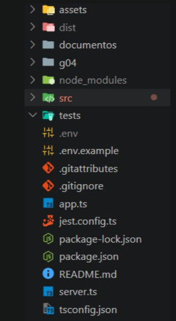<br>
  <sup>Fonte: Autores, 2026.</sup>
</div>

<div align="center">
  <sub>Figura 73 — Arquivo app.ts com as rotas registradas e health check</sub><br>
  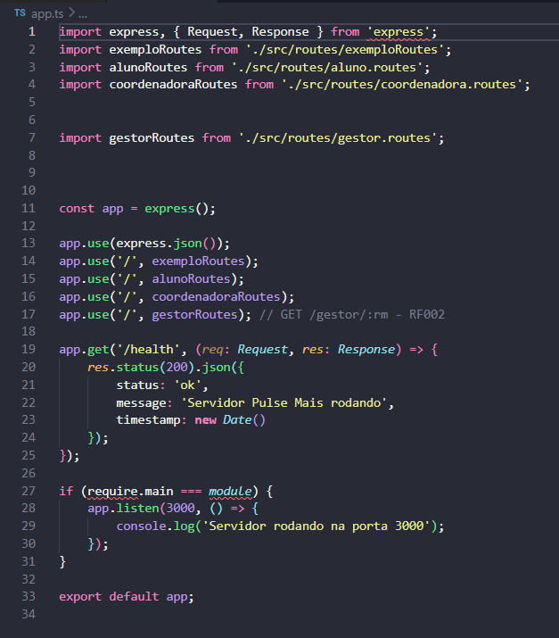<br>
  <sup>Fonte: Autores, 2026.</sup>
</div>

**Camada de persistência**

A conexão com o PostgreSQL usa o driver oficial pg, com um Pool configurado para até 10 conexões simultâneas, idle timeout de 30 segundos, connection timeout de 10 segundos e SSL habilitado em produção. A variável DATABASE_URL é validada na inicialização: se não estiver definida, a aplicação interrompe a execução em vez de falhar de forma silenciosa mais adiante. O time preferiu trabalhar diretamente com o pg em vez de adotar um ORM, tanto para ter mais controle sobre as queries quanto porque elas acompanham de perto as consultas SQL já definidas na seção 3.6.4.

<div align="center">
  <sub>Figura 74 — Configuração da conexão com o banco PostgreSQL</sub><br>
  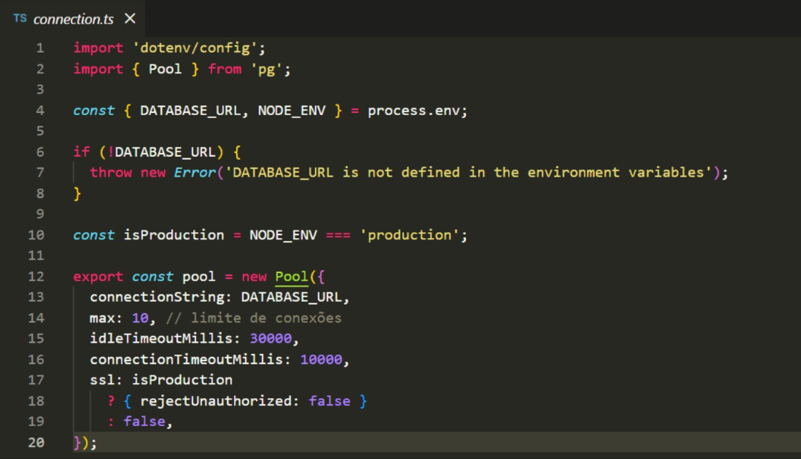<br>
  <sup>Fonte: Autores, 2026.</sup>
</div>

A modelagem física foi escrita em um script de migração que cria as 14 tabelas previstas no modelo físico da seção 3.6.3: quatro entidades de usuário (aluno, gestor, coordenador, psicologo), sete entidades de domínio (turma, aula, evento, certificado, empregabilidade, relatorio, alerta) e três tabelas associativas, que representam os relacionamentos N:N do modelo (contem, para turma–aula; frequenta, para aluno–aula; e participa, para aluno–evento). As chaves primárias usam sequences auto-incrementais, e a integridade referencial fica garantida por FOREIGN KEYs e constraints CHECK aplicadas no próprio banco.


<div align="center">
  <sub>Figura 75 — Script de migração (parte 1): tabelas alerta, aluno, aula e certificado</sub><br>
  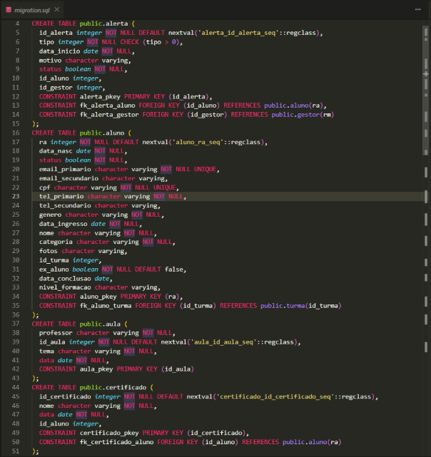<br>
  <sup>Fonte: Autores, 2026.</sup>
</div>

<div align="center">
  <sub>Figura 76 — Script de migração (parte 2): tabelas contem, coordenador, empregabilidade, evento, frequenta e gestor</sub><br>
  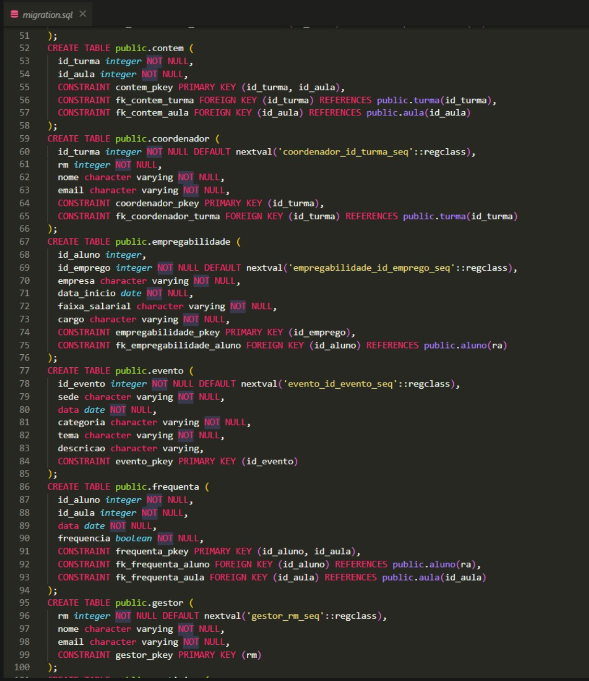<br>
  <sup>Fonte: Autores, 2026.</sup>
</div>

<div align="center">
  <sub>Figura 77 — Script de migração (parte 3): tabelas participa, psicologo, relatorio e turma</sub><br>
  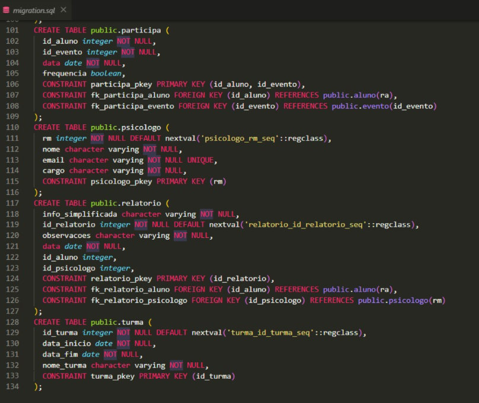<br>
  <sup>Fonte: Autores, 2026.</sup>
</div>

A conexão foi validada com um script de teste que roda uma consulta simples e retorna a hora atual do servidor PostgreSQL, confirmando que o pool está funcionando.

<div align="center">
  <sub>Figura 78 — Teste de conexão com o banco bem-sucedido</sub><br>
  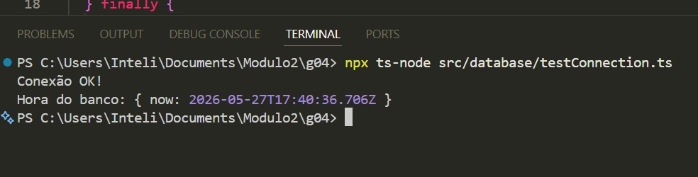<br>
  <sup>Fonte: Autores, 2026.</sup>
</div>

**Endpoints REST**

Dos 10 requisitos funcionais previstos à época da sprint 3, 9 foram entregues nesta sprint:

| RF | Descrição | Status |
|----|-----------|--------|
| RF001 | Perfil do aluno — visualização e edição dos próprios dados cadastrais | Entregue |
| RF002 | Perfil do gestor — busca por RM, listagem de alunos vinculados e busca de aluno específico | Entregue |
| RF003 | Perfil da coordenadora — base para gestão acadêmica e registros qualitativos | Entregue |
| RF004 | Perfil da psicóloga — base para registro e consulta de relatórios | Entregue |
| RF005 | Registro de contatos do aluno (e-mail e telefone primário/secundário) | Entregue |
| RF006 | Gestão de Turmas — 5 endpoints (GET com paginação e total_alunos, GET por ID, POST com validação de coordenador e datas, PUT preservando id_coordenador, e POST de associação aluno–turma) | Entregue |
| RF007 | Jornada do Aluno — 2 endpoints (consolidação de turmas, aulas, eventos, certificados e emprego; listagem de certificados ordenada por data) | Entregue |
| RF008 | Registro de Frequência — 4 endpoints cobrindo aulas, eventos e percentual de presença por turma, com sinalização do critério de alerta de evasão por aluno, conforme RN012 | Entregue |
| RF009 | Registro de Empregabilidade — 3 endpoints (POST, PATCH e GET), respeitando RN007 (único emprego ativo por aluno) e RN017 (preservação do histórico de alunos evadidos) | Entregue |
| RF010 | Dashboard de Indicadores | Repriorizado para a sprint 4 |

Os endpoints retornam os status HTTP adequados a cada cenário (200 para sucesso, 400 para parâmetros inválidos, 404 para recurso inexistente, 409 para conflito de duplicata, 422 para violação de regra de negócio e 500 para erro interno), seguindo as convenções definidas na documentação da WebAPI na seção 3.7. A próxima imagem reúne os endpoints implementados na sprint.

<div align="center">
  <sub>Figura 79 — Endpoints REST implementados na sprint 3</sub><br>
  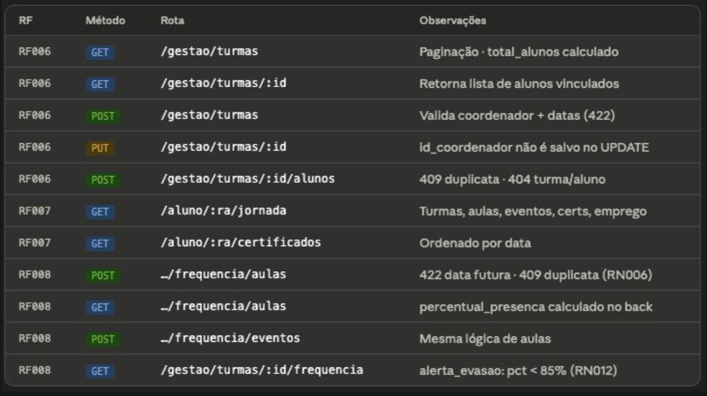<br>
  <sup>Fonte: Autores, 2026.</sup>
</div>

**Validação de dados**

A validação de entrada segue o mesmo padrão em todos os endpoints. Os campos obrigatórios são verificados por desestruturação do body e checagem condicional, retornando 400 com mensagem descritiva quando faltam. A RN006, que proíbe registros com data futura, é checada antes da chamada ao service e retorna 422 quando violada. Duplicatas são detectadas por uma consulta de verificação antes de cada INSERT, o que cobre frequência em aulas, frequência em eventos e associação de aluno a turma, retornando 409 quando o registro já existe. No módulo de aluno, os campos editáveis seguem uma allowlist implementada como Set<string> no controller: qualquer campo fora dela é rejeitado com 400, e a resposta informa quais campos foram invalidados.

**Testes automatizados**

A suíte de testes foi montada com Jest e cobre as quatro camadas do back-end: controller, service, repository e a integração com as rotas. Até o fechamento da sprint, 26 testes distribuídos em 5 suítes passam com sucesso. Os cenários cobrem retornos de sucesso (200), recurso não encontrado (404), parâmetros inválidos (400), erro interno (500) e a comunicação entre as camadas. O time decidiu investir em testes já na primeira sprint de implementação para dar segurança às refatorações das próximas sprints, principalmente na integração com o front-end e na inclusão da camada de autenticação.

<div align="center">
  <sub>Figura 80 — Suíte de testes Jest executada com 26 testes aprovados</sub><br>
  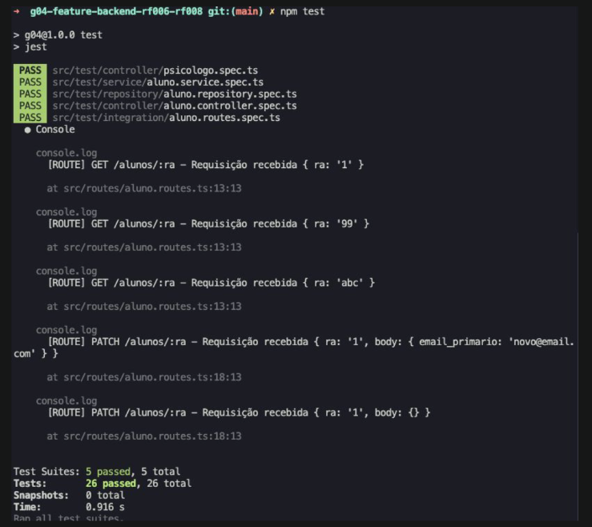<br>
  <sup>Fonte: Autores, 2026.</sup>
</div>

### (b) O que não foi concluído

O único requisito funcional pendente é o RF010 — Dashboard de Indicadores, repriorizado de forma planejada para a sprint 4. Ele envolve agregações complexas de frequência, empregabilidade e taxa de retenção em diferentes janelas de tempo, e o time avaliou que valia mais a pena consolidar primeiro os endpoints transacionais (CRUD e registros simples) do que avançar cedo demais em um endpoint analítico, que só faz sentido validar visualmente com dados reais.

A camada de autenticação (JWT e hashing de senhas com bcrypt) e o middleware de autorização por perfil de rota também não entraram nesta sprint, o que está de acordo com o planejamento original: a seção 3.8 do WAD prevê esses itens para a sprint 5. Por enquanto, os endpoints respondem sem proteção, e isso será resolvido na entrega final.

### (c) Dificuldades técnicas enfrentadas e próximos passos

**Dificuldades técnicas**

A principal dificuldade da sprint foi a adaptação ao TypeScript. Parte do time vinha de outras linguagens, e lidar com tipagem estática, organização de imports e erros de compilação tomou boa parte do tempo no início do desenvolvimento. Mesmo assim, a tipagem valeu a pena: vários bugs apareceram já em tempo de compilação, antes de chegarem aos testes.

Outra dificuldade, também resolvida durante a sprint, foi um bug no schema da tabela coordenador. A primeira versão da migration definia id_turma como chave primária, enquanto o repository correspondente fazia consultas com WHERE rm = $1. Esse desencontro entre o modelo físico e a camada de acesso a dados fazia o POST de turma retornar 404 mesmo com um RM válido. O time identificou o problema durante a integração entre as camadas e corrigiu ainda na sprint, separando a PK rm da FK id_turma e ajustando a migration.

**Próximos passos (sprint 4)**

A sprint 4 continua o trabalho em cinco frentes: implementar o RF010 (Dashboard de Indicadores), com as agregações previstas na seção 3.1.4; iniciar a integração com o front-end, aplicando o Guia de Estilos da seção 3.4 e o Protótipo de Alta Fidelidade da seção 3.5; consolidar os testes de integração automatizados, conforme a seção 5.1; atualizar a documentação técnica (RTM, Matriz RF→RN→Endpoint e diagramas de sequência) para refletir o código que de fato foi implementado; e preparar a infraestrutura para a camada de autenticação prevista na sprint 5.


## 4.2. Segunda versão da aplicação web 

A sprint 4 consolidou a passagem da segunda versão para uma aplicação web navegável e integrada. Na sprint 3, o projeto já possuía a base em Node.js, TypeScript, PostgreSQL e a maior parte dos endpoints transacionais. Dessa forma, o foco foi concluir o dashboard que havia ficado pendente, conectar telas reais aos endpoints, ampliar os fluxos por perfil de usuário e validar o comportamento da API por testes manuais e automatizados.

### (a) O que foi implementado

**Evolução em relação à sprint 3**

O principal avanço funcional foi a implementação do RF010, que havia sido repriorizado na sprint anterior. O back-end passou a disponibilizar os endpoints `GET /dashboard`, `GET /dashboard/frequencia` e `GET /dashboard/empregabilidade`, reunindo indicadores gerais, dados de frequência, empregabilidade e alertas de evasão. Com isso, a aplicação deixou de depender apenas de registros isolados e passou a oferecer uma visão analítica para apoiar decisões da equipe gestora.

Também foram adicionados e refinados fluxos complementares relacionados aos RF011, RF012, RF015, RF016, RF017, RF018 e RF019. Isso inclui consulta de alertas de evasão, alerta de frequência no portal do aluno, filtros avançados de alunos, comunicados, importação de CSV, anotações qualitativas da equipe e resolução de alertas. Essas funcionalidades ampliaram o escopo do sistema para além do CRUD inicial, aproximando a entrega do uso cotidiano previsto para a Pulse Mais.

| Frente | Evolução entregue na sprint 4 |
|---|---|
| Dashboard | Indicadores gerais, frequência por turma, empregabilidade e alertas de evasão via API |
| Portal do aluno | Visualização de dados, jornada, comunicados e edição de informações permitidas |
| Coordenadora | Telas de dashboard, turmas, alunos, perfil individual, frequência, jornada, relatórios, comunicados e registros |
| Gestor | Telas de dashboard, turmas, alunos por turma, perfil do aluno, comunicados e importação CSV |
| Psicóloga | Telas de atendimentos e prontuário, com listagem de alunos atendidos, status e relatórios |
| Testes | Suíte ampliada para controllers, services, repositories, integração e E2E |

**Implementação do protótipo de alta fidelidade em HTML/CSS**

Durante a sprint 4, parte importante do trabalho foi transformar o protótipo de alta fidelidade em telas reais desenvolvidas com HTML, CSS e JavaScript. A equipe buscou manter a identidade visual definida anteriormente no guia de estilos, preservando elementos como paleta de cores, tipografia, cards de indicadores, navegação lateral, tabelas de alunos, formulários, abas e modais. Com isso, o protótipo deixou de ser apenas uma referência visual estática e passou a compor uma interface navegável dentro da aplicação.

Houve uma mudança na seleção dos ícones, em que o grupo decidiu alterar a biblioteca, a fim de elementos mais simples e limpos, que permitem que o site seja mais fácil de utilizar. A iconografia atualizada está documentada na seção 3.4 de Guia de Estilos.

Além das telas previstas no protótipo, também foi criada uma tela de login para funcionar como ponto inicial de entrada no sistema. Essa tela ainda não representa a autenticação definitiva da plataforma, planejada para a sprint 5, mas já organiza a experiência de acesso e prepara a separação dos fluxos por perfil de usuário.

Para documentar essa transformação do protótipo em interface funcional, os prints das telas implementadas serão acompanhados pelas seguintes descrições:

**Tela de login:** a tela de login foi desenvolvida como porta de entrada da aplicação, reunindo a identidade visual da Pulse Mais e um fluxo inicial de acesso para os usuários. Embora não estivesse prevista no protótipo de alta fidelidade, sua criação foi necessária para organizar a experiência de entrada no sistema e preparar a futura autenticação por perfil.

<div align="center">
  <sub>Figura 81 — Tela de Login da Plataforma</sub><br>
  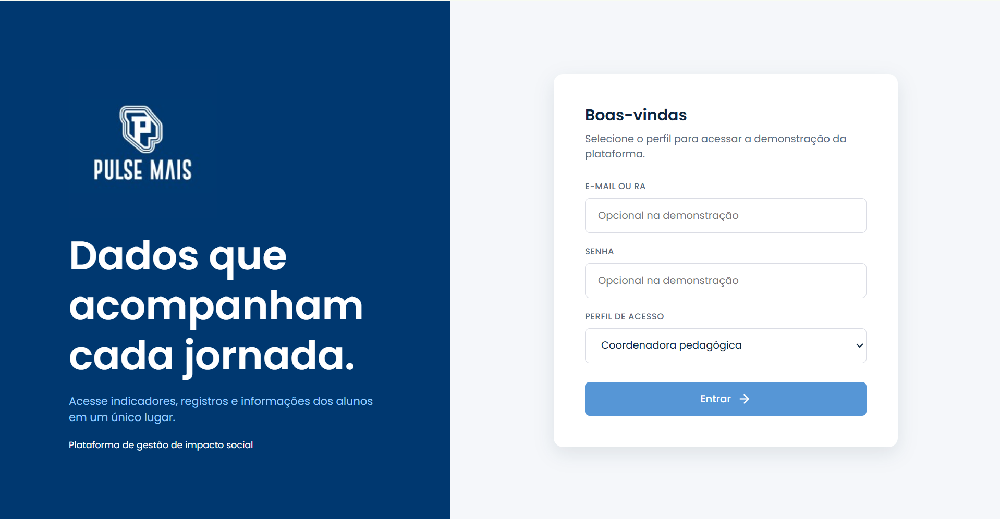<br>
  <sup>Fonte: Autores, 2026.</sup>
</div>

**Persona Aluno:** a tela do aluno representa a adaptação do protótipo para um portal individual, no qual o estudante pode visualizar seus dados, acompanhar sua jornada na Pulse Mais e acessar comunicados importantes. Essa interface reforça o protagonismo do aluno ao permitir que ele consulte sua própria trajetória e atualize informações cadastrais permitidas.

<div align="center">
  <sub>Figura 82 — Tela de Meus Dados - Aluno</sub><br>
  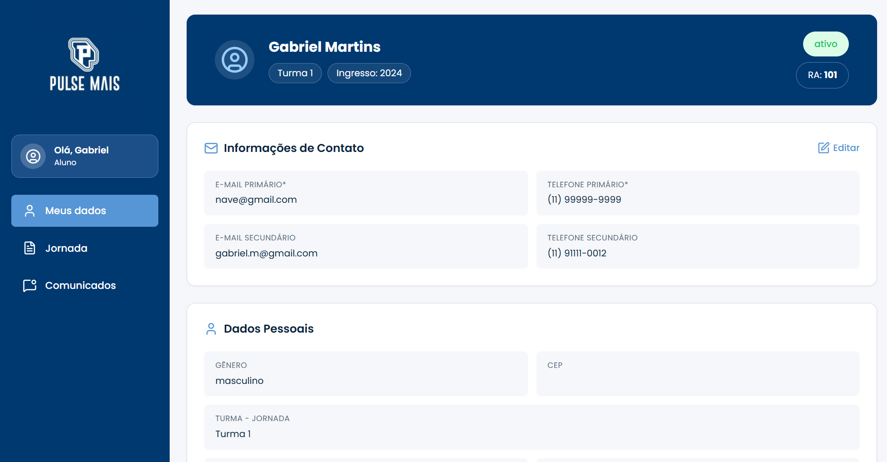<br>
  <sup>Fonte: Autores, 2026.</sup>
</div>

<div align="center">
  <sub>Figura 83 — Tela de Jornada - Aluno</sub><br>
  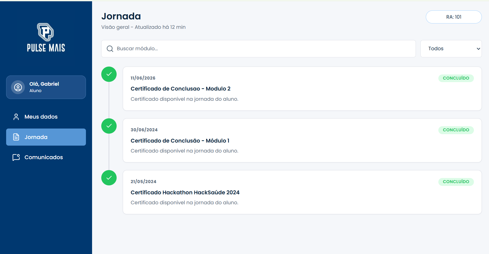<br>
  <sup>Fonte: Autores, 2026.</sup>
</div>

<div align="center">
  <sub>Figura 84 — Tela de Comunicados - Aluno</sub><br>
  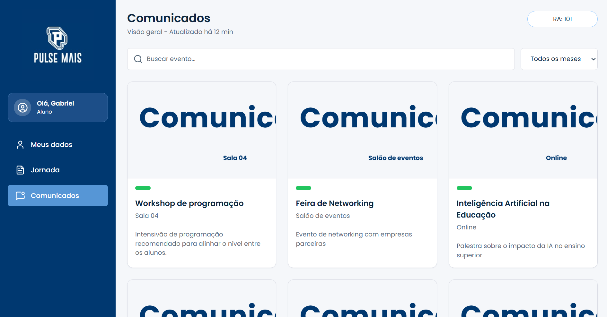<br>
  <sup>Fonte: Autores, 2026.</sup>
</div>

**Persona Coordenadora:** as telas da coordenadora foram implementadas com foco no acompanhamento operacional dos estudantes. A interface reúne dashboard, listagem de turmas, consulta de alunos, perfil individual, registros de frequência, jornada e relatórios, aproximando o protótipo das tarefas reais de monitoramento pedagógico.

<div align="center">
  <sub>Figura 85 — Tela de Dashboard - Coordenadora</sub><br>
  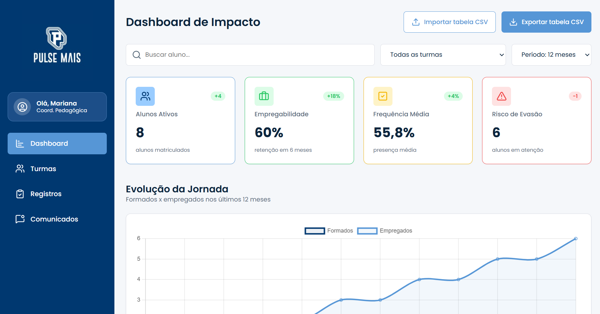<br>
  <sup>Fonte: Autores, 2026.</sup>
</div>

<div align="center">
  <sub>Figura 86 — Tela de Turmas - Coordenadora</sub><br>
  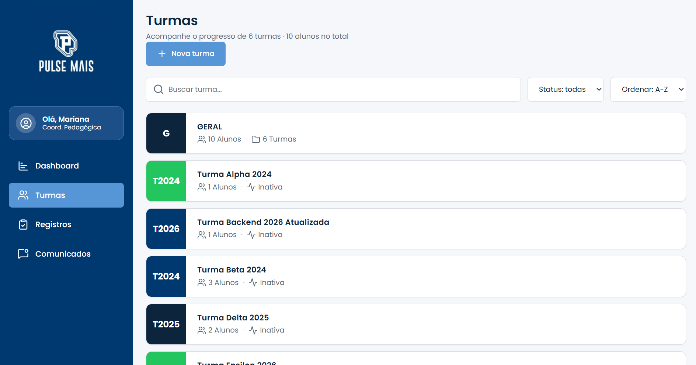<br>
  <sup>Fonte: Autores, 2026.</sup>
</div>

<div align="center">
  <sub>Figura 87 — Tela de Registros de Frequência de uma turma - Coordenadora</sub><br>
  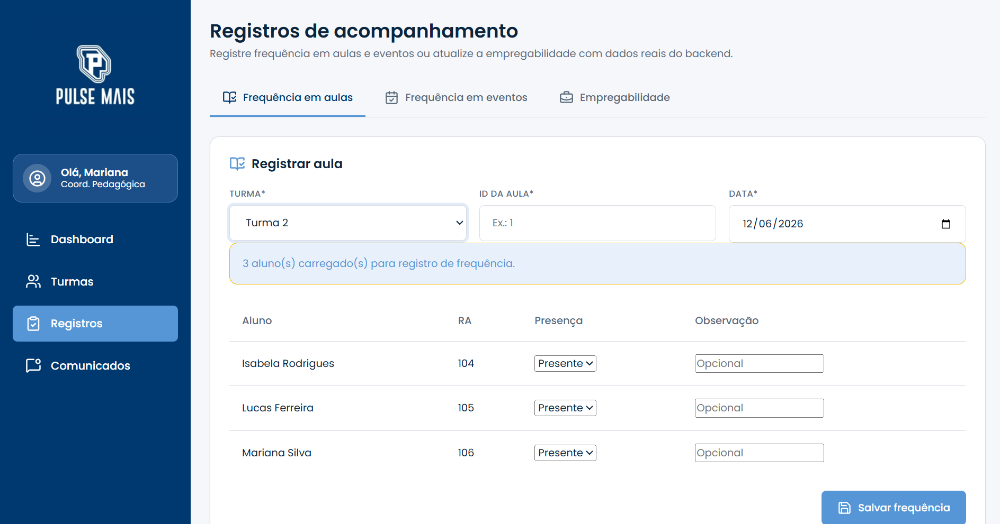<br>
  <sup>Fonte: Autores, 2026.</sup>
</div>

<div align="center">
  <sub>Figura 88 — Tela de Comunicados - Coordenadora</sub><br>
  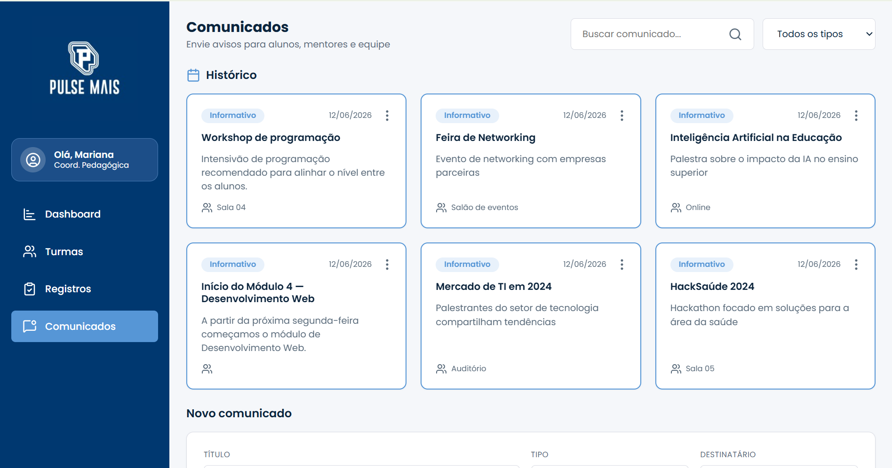<br>
  <sup>Fonte: Autores, 2026.</sup>
</div>

**Persona Gestor:** as telas do gestor traduzem o protótipo para uma visão mais estratégica da plataforma, com acesso a indicadores, turmas, alunos por turma, comunicados e importação de dados. Essa interface apoia a análise institucional e facilita o acompanhamento dos resultados da Pulse Mais.

<div align="center">
  <sub>Figura 89 — Tela de Dashboard - Gestor</sub><br>
  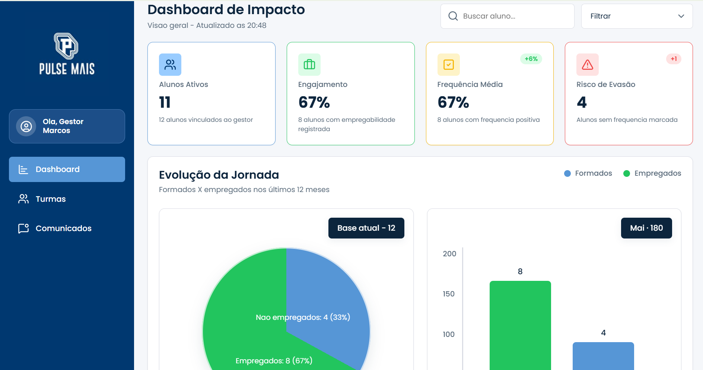<br>
  <sup>Fonte: Autores, 2026.</sup>
</div>

<div align="center">
  <sub>Figura 90 — Tela de Turmas - Gestor</sub><br>
  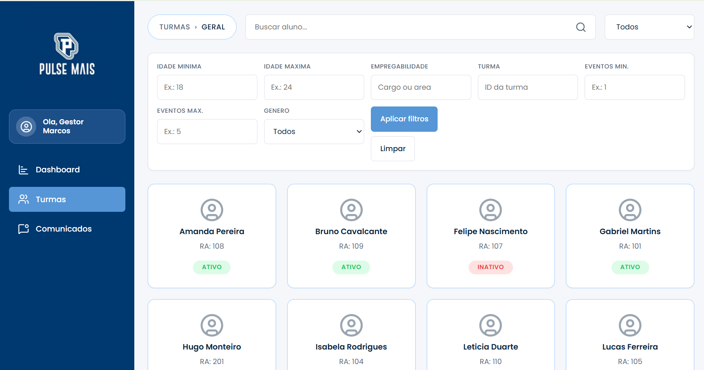<br>
  <sup>Fonte: Autores, 2026.</sup>
</div>

<div align="center">
  <sub>Figura 91 — Tela de Comunicados - Gestor</sub><br>
  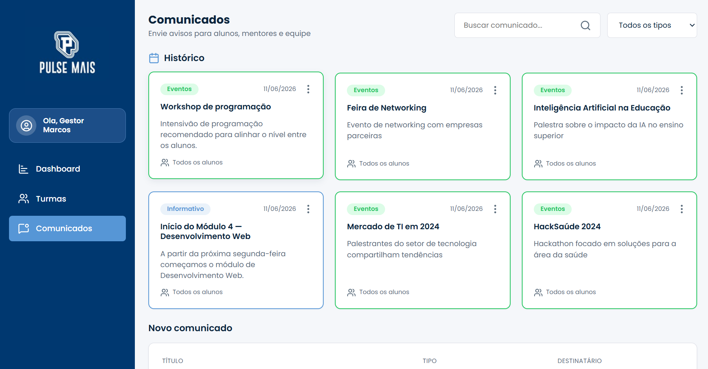<br>
  <sup>Fonte: Autores, 2026.</sup>
</div>

**Persona Psicóloga:** as telas da psicóloga foram implementadas para apoiar o acompanhamento dos alunos atendidos, com foco na consulta de atendimentos, registro de relatórios e organização do prontuário. A interface preserva a separação desse fluxo em relação aos demais perfis, considerando a sensibilidade das informações psicológicas.

<div align="center">
  <sub>Figura 92 — Tela de Meus Atendimentos - Psicóloga</sub><br>
  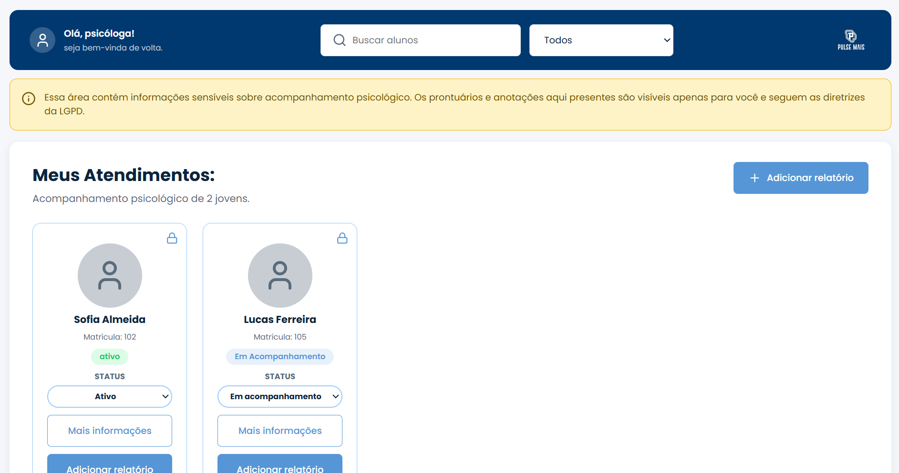<br>
  <sup>Fonte: Autores, 2026.</sup>
</div>

<div align="center">
  <sub>Figura 93 — Tela de Registrar Prontuário - Psicóloga</sub><br>
  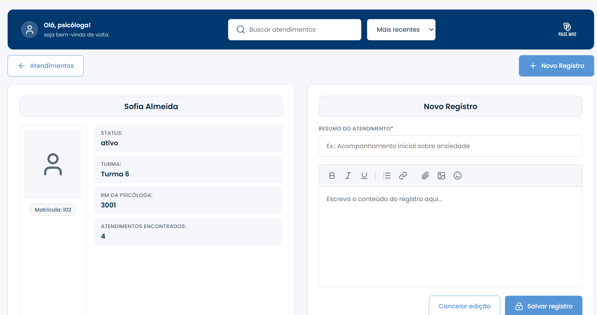<br>
  <sup>Fonte: Autores, 2026.</sup>
</div>

**Integração entre front-end e back-end**

O servidor passou a disponibilizar os arquivos estáticos do diretório `public`, permitindo que as telas dos diferentes perfis fossem acessadas diretamente pela aplicação Express. Para melhorar a organização do front-end, foram criados serviços JavaScript específicos para centralizar as chamadas HTTP, como `coordenadora-api.js`, `gestor-api.js`, `psicologaService.js` e `aluno-script.js`. Essa abordagem reduziu a duplicação de código relacionada ao uso de `fetch`, padronizou o tratamento das respostas da API e facilitou a integração entre as interfaces e os endpoints definidos na WebAPI.

No portal do aluno, a integração permitiu o consumo dos endpoints responsáveis pela consulta de dados cadastrais, jornada e comunicados, além da atualização dos campos cadastrais permitidos ao usuário. No fluxo da coordenadora, foram conectadas as funcionalidades de dashboard, gestão de turmas e alunos, filtros, frequência, jornada, relatórios e comunicados.

Para o perfil de gestor, foram integradas as páginas de dashboard, turmas, alunos por turma, perfil do aluno, comunicados e importação de histórico por meio de arquivos CSV. Já no fluxo da psicóloga, as telas de atendimentos e prontuário passaram a consumir os endpoints relacionados à consulta de alunos atendidos, gerenciamento de relatórios e prontuários, bem como à atualização do status dos atendimentos.

Com essas integrações, os principais fluxos da aplicação passaram a operar de forma conectada ao back-end, aproximando o sistema da sua versão funcional completa e reduzindo a dependência de dados simulados no front-end.

**Validação manual dos endpoints com Postman**

Cada endpoint foi cadastrado individualmente na coleção, com seu método HTTP, URL, parâmetros de rota, query parameters e body quando necessário. Foram testados os endpoints relacionados aos perfis de aluno, gestor, coordenadora e psicóloga, além dos fluxos de turmas, jornada, frequência, empregabilidade, dashboard, alertas, prontuários, filtros avançados, comunicados e importação CSV.

Para cada requisição, inicialmente foi executado um cenário válido, confirmando o retorno esperado e verificando se operações de escrita realmente alteravam o banco. Em seguida, foram realizados cenários de erro com identificadores inexistentes, campos obrigatórios ausentes, valores inválidos e dados conflitantes. Também foram conferidos os códigos HTTP retornados, principalmente `200`, `201`, `400`, `404`, `409`, `422` e `500`.

<div align="center">
  <sub>Figura 94 — Coleção de testes individuais dos endpoints no Postman, organizada por requisito funcional</sub><br>
  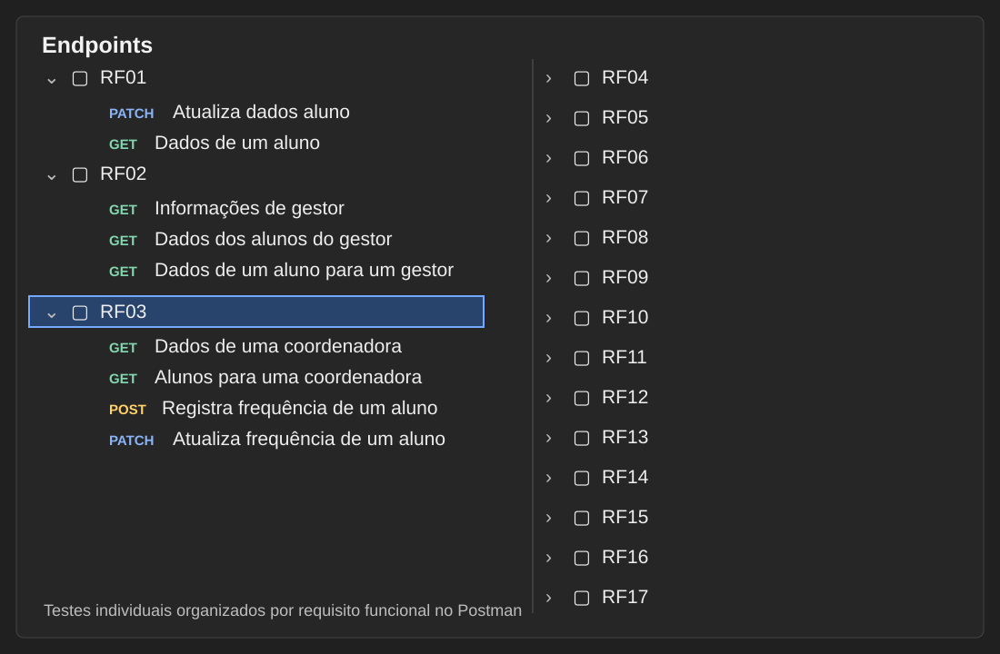<br>
  <sup>Fonte: Autores, 2026.</sup>
</div>

**Correções realizadas a partir dos testes**

Os testes individuais permitiram identificar endpoints que estavam definidos no código, mas não funcionavam corretamente quando executados com dados reais. A partir dos erros encontrados, foram corrigidos caminhos de rotas, nomes e leitura de parâmetros, validações dos dados enviados, formatos de resposta e consultas realizadas pelos repositories.

Também foram realizados ajustes relacionados às mudanças do banco de dados. Alguns endpoints utilizavam nomes de colunas, tipos ou relacionamentos diferentes dos disponíveis no schema atualizado, causando respostas `500` ou resultados vazios. Após a identificação pelo Postman, as queries e os modelos envolvidos foram revisados para manter compatibilidade com a estrutura atual do banco.

O processo foi repetido após cada correção: a requisição que havia apresentado erro era executada novamente, seu retorno era comparado com a resposta documentada na WebAPI e, nos métodos de escrita, o resultado era conferido diretamente no banco de dados.

**Testes automatizados**

A suíte automatizada foi ampliada em relação à sprint 3. Enquanto a primeira versão registrava 26 testes em 5 suítes, a segunda versão passou a contar com testes de controller, service, repository, integração de rotas e fluxos E2E. Ao final da sprint, a execução de `npm test -- --runInBand` retornou 36 suítes e 330 testes aprovados, cobrindo os principais fluxos de aluno, gestor, coordenadora, psicóloga, dashboard, alertas, anotações, frequência, empregabilidade, comunicados e importação.

### (b) O que não foi concluído

Apesar dos avanços alcançados na Sprint 4, alguns pontos permaneceram pendentes para conclusão nas próximas iterações. A aplicação ainda não conta com a camada definitiva de autenticação e autorização baseada em sessão, prevista para ser finalizada na Sprint 5. Embora determinadas validações de permissão já estejam presentes em fluxos específicos, como comunicados e importação de arquivos CSV, o controle de acesso por perfil ainda precisa ser centralizado e consolidado no back-end.

Também permanecem ajustes relacionados à padronização entre rotas, nomenclaturas de endpoints e regras de autorização, visando garantir maior consistência arquitetural e facilitar a manutenção da aplicação. Os endpoints de anotações e resolução de alertas já foram implementados e validados por meio de testes, porém dependem da conclusão das regras de autorização por perfil para atender integralmente aos requisitos de negócio estabelecidos.

Além disso, algumas telas ainda necessitam de refinamentos visuais, revisão de responsividade e validação final da experiência do usuário. Por fim, será necessário complementar a documentação do projeto com os registros e evidências da aplicação em funcionamento, incluindo capturas de tela dos principais fluxos implementados.

### (c) Dificuldades técnicas enfrentadas

**Principais dificuldades técnicas**

A principal dificuldade enfrentada durante a sprint foi a transposição dos protótipos de alta fidelidade para interfaces funcionais em HTML, CSS e JavaScript. Como os protótipos já haviam sido previamente validados junto ao parceiro, foi necessário preservar a identidade visual aprovada, respeitando a disposição dos elementos, a hierarquia das informações, a paleta de cores, a tipografia e os componentes definidos no guia de estilos. Ao mesmo tempo, algumas adaptações precisaram ser realizadas para adequar as telas às limitações e requisitos da implementação web.

Outro desafio relevante foi garantir a responsividade das interfaces sem comprometer a experiência visual proposta no protótipo. Componentes como dashboards, cards de indicadores, menus laterais, tabelas, formulários e áreas de perfil exigiram ajustes para diferentes resoluções e tamanhos de tela, mantendo a legibilidade e a organização das informações.

A manutenção de um padrão visual e estrutural entre os diferentes perfis da plataforma também representou um desafio significativo. Como os fluxos de aluno, coordenadora, gestor e psicóloga possuem necessidades específicas, foi necessário equilibrar a personalização de cada interface com a consistência global do sistema. Para isso, a equipe trabalhou na padronização de elementos como espaçamentos, tipografia, botões, cartões informativos, títulos, componentes de navegação e comportamentos visuais, garantindo uma experiência unificada independentemente do perfil acessado.

A integração entre o back-end e o front-end também apresentou desafios importantes durante a sprint. Como as interfaces e os endpoints foram desenvolvidos simultaneamente, foi necessário realizar constantes alinhamentos para garantir a compatibilidade entre contratos de API, estruturas de dados e regras de negócio. Além disso, alterações em rotas, parâmetros e formatos de resposta exigiram adaptações frequentes nas telas já implementadas, demandando testes contínuos para validar os fluxos integrados e assegurar a consistência das informações apresentadas aos usuários.

Por fim, a resolução de conflitos de merge exigiu atenção especial da equipe. Como vários integrantes atuaram simultaneamente em arquivos de HTML, CSS, JavaScript e documentação, ocorreram conflitos entre diferentes versões dos mesmos componentes e páginas. A solução desses conflitos demandou análise manual das alterações, comparação entre implementações e validação conjunta das correções, assegurando tanto a integridade funcional quanto a consistência visual da aplicação antes da integração final ao repositório.

### (d) Próximos passos

Na Sprint 5, os próximos passos consistem em concluir a implementação da autenticação e do controle de sessão, garantindo a validação segura de credenciais, além de aplicar mecanismos de autorização por perfil nas rotas sensíveis. Também será realizada a revisão dos fluxos que manipulam dados restritos, com foco em prontuários, anotações e alertas.

No âmbito da interface, serão finalizados os ajustes visuais, assegurando a consistência entre os diferentes perfis de usuário e a responsividade das principais telas da plataforma. Além disso, será executada uma rodada final de testes automatizados e manuais para validação do sistema.

Entre as funcionalidades previstas, destacam-se a implementação da tela de cadastro de alunos, a ampliação dos filtros de análise de indicadores, conforme solicitado pelo parceiro durante a Sprint Review, a importação e exportação de arquivos CSV para facilitar a migração de dados das planilhas atualmente utilizadas, e a geração de relatórios gerenciais destinados à captação de novos parceiros e ao acompanhamento de investidores já vinculados ao projeto.

Por fim, a documentação será atualizada com registros da aplicação em funcionamento, evidenciando os principais fluxos do sistema, incluindo dashboard, portal do aluno, gestão de turmas e alunos, comunicados, importação de dados, prontuário psicológico e execução da suíte de testes.

## 4.3. Versão final da aplicação web

A sprint 5 concluiu a implementação da camada de autenticação e autorização, entregando a versão final funcional da plataforma. O foco principal foi substituir o acesso demonstrativo por sessões reais por perfil e centralizar o controle de acesso no back-end, conforme previsto na seção 3.8 do WAD.

### (a) O que foi refinado/adicionado desde a Sprint 4

**Autenticação e sessão**

A entrada unificada ocorre em `/login.html` — a rota raiz (`/`) redireciona automaticamente para essa página. O back-end expõe três endpoints de autenticação: `POST /auth/login` valida as credenciais (e-mail ou RA/RM e senha) e emite o cookie de sessão; `GET /auth/me` retorna os dados do usuário autenticado a partir do cookie existente; `POST /auth/logout` apaga o cookie e encerra a sessão.

<div align="center">
  <sub>Figura 95 — Tela de Login com autenticação real implementada na Sprint 5</sub><br>
  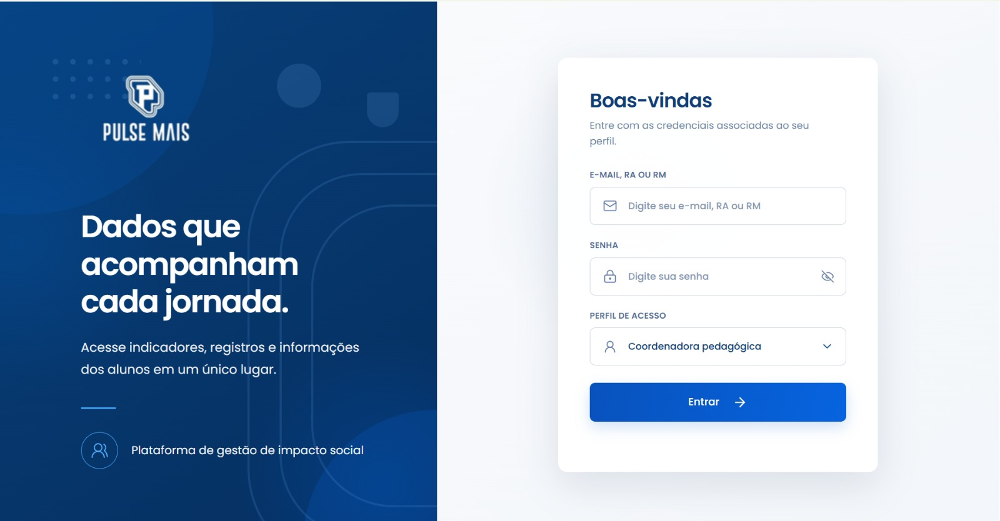<br>
  <sup>Fonte: Autores, 2026.</sup>
</div>

O cookie de sessão (nome `nexus_session`) é configurado com `httpOnly: true`, `sameSite: strict` e `secure` ativado em ambiente de produção, com validade de 8 horas. Seu conteúdo é um token HMAC‑SHA256 gerado no arquivo `token.ts`, que serializa os dados do usuário (id, nome, e‑mail e perfil) e os assina com a variável de ambiente `AUTH_SECRET`, definida no `.env.example`. Não há dependência de `express-session`: a criação e a validação do token são inteiramente realizadas pela aplicação.

As senhas são armazenadas e verificadas com o algoritmo bcrypt (custo 12) por meio da extensão `pgcrypto` do PostgreSQL, com a expressão `crypt(senha, gen_salt('bf', 12))`. A geração do hash e a comparação ocorrem no banco de dados; nenhuma biblioteca bcrypt é utilizada na camada Node.js. A senha inicial de cada usuário é provisionada automaticamente por triggers de banco definidos na migration `003_provisionar_credenciais.sql`, seguindo o padrão `Nexus@<RA ou RM>`.

**Controle de acesso — RN003 e RN005**

Dois middlewares centrais, registrados globalmente em `app.ts` antes de todas as rotas de negócio, implementam as regras de controle de acesso. A RN003 determina que "caso o usuário tente acessar uma rota sem a permissão correspondente, o sistema deve bloquear a ação"; a RN005 restringe o acesso aos dados de saúde mental exclusivamente ao perfil psicóloga. Ambas são atendidas pelos seguintes middlewares:

- `exigirAutenticacao` — retorna HTTP 401 para qualquer requisição sem cookie válido ou com token expirado.
- `autorizarRota` — retorna HTTP 403 quando o perfil autenticado tenta acessar um recurso que não lhe pertence (ex.: aluno consultando o RA de outro aluno) ou um módulo incompatível com seu perfil (ex.: perfil `aluno` acessando rotas de `/gestor` ou `/psicologa`). O middleware também protege as páginas HTML de cada perfil: usuários sem sessão ativa são redirecionados para `/login.html`.

<div align="center">
  <sub>Figura 96 — Middlewares exigirAutenticacao e autorizarRota registrados globalmente em app.ts</sub><br>
  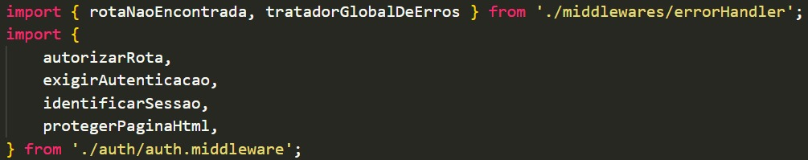<br>
  <sup>Fonte: Autores, 2026.</sup>
</div>

As rotas `GET /health` e `GET /health/db` são registradas antes dos middlewares de autenticação e permanecem públicas, permitindo monitoramento externo sem credenciais.

**Cadastro de aluno**

O cadastro de novos alunos é realizado via `POST /gestor/:rm/alunos`. O endpoint valida os campos obrigatórios `nome`, `cpf` e `email_primario`, retornando HTTP 400 em caso de ausência. Registros com CPF ou e-mail já existentes no banco são rejeitados com HTTP 409. A senha inicial é gerada automaticamente pelo trigger do banco no momento da inserção.

**Alertas e anotações**

As rotas de anotações (`GET /alunos/:ra/anotacoes` e `POST /alunos/:ra/anotacoes`) passam pelos dois middlewares de controle de acesso, atendendo à RN003. A resolução de alertas ocorre via `PATCH /gestao/alertas/:id/resolver`; o endpoint retorna HTTP 404 caso o alerta não exista.

**Infraestrutura**

A conexão com o PostgreSQL utiliza `Pool` da biblioteca `pg` (arquivo `connection.ts`), com no máximo 10 conexões simultâneas, idle timeout de 30 segundos e connection timeout de 10 segundos. O SSL é controlado pela variável `DB_SSL` (presente no `.env.example`) e é ativado automaticamente em produção ou quando a connection string aponta para um host Supabase. As operações de escrita nas rotas de negócio utilizam `pool.query()` individuais sem transação explícita; transações com `BEGIN/COMMIT/ROLLBACK` são empregadas exclusivamente no script de migração de banco de dados (`migration.ts`).

**Front-end e autorização**

O `localStorage` armazena o identificador do usuário (RA ou RM) e o perfil (`perfilAcesso`) para orientar a navegação entre telas e a construção das URLs de API. Nenhum desses valores, porém, influencia a autorização das requisições ao servidor — essa decisão é tomada exclusivamente com base no cookie de sessão validado pelo back-end. A identidade efetiva do usuário vem sempre do token assinado; qualquer adulteração do `localStorage` não concede acesso adicional.

**Testes automatizados**

A camada de autenticação foi coberta por testes de integração com Jest e Supertest. Os cenários CT-AUTH01 a CT-AUTH05 validam: criação de sessão com credenciais válidas (200), rejeição com senha inválida (401), retorno correto de `/auth/me` a partir do cookie (200), bloqueio de requisição sem sessão (401) e bloqueio de acesso ao RA de outro aluno autenticado (403). Esses casos cobrem diretamente as regras RN001 e RN003.

### (b) O que não foi concluído

O endpoint `PATCH /gestao/alertas/:id/resolver` não bloqueia a operação quando o alerta já se encontra resolvido: o `UPDATE` é executado sem filtrar por `status`, o que faz com que uma segunda chamada ao mesmo alerta retorne HTTP 200 em vez de um erro semântico. O comportamento correto seria adicionar a cláusula `AND status = true` (ou `AND data_resolucao IS NULL`) na query do repositório, retornando HTTP 409 para o caso de conflito.

Não foram implementados mecanismos de revogação centralizada de sessões antes do prazo de expiração de 8 horas. Uma vez emitido, o token não pode ser invalidado individualmente pelo servidor sem manutenção de uma lista de revogação (blocklist). Isso significa que, após um logout, o cookie removido no navegador não invalida o token caso ele seja reutilizado de outro contexto antes de expirar.

Também não foi implementada a troca obrigatória da senha inicial no primeiro acesso, o que permite que usuários continuem utilizando o padrão `Nexus@<RA ou RM>` indefinidamente.

### (c) Dificuldades técnicas enfrentadas

**Gestão de sessão sem biblioteca de terceiros**

A principal decisão técnica da sprint foi implementar o mecanismo de sessão sem dependência de `express-session` ou de uma biblioteca JWT convencional. O time optou por um token HMAC-SHA256 customizado no arquivo `token.ts`, o que exigiu atenção especial à validação criptográfica com `crypto.timingSafeEqual` — para evitar timing attacks na comparação de assinaturas — e ao controle de expiração via campo `exp` no payload. A abordagem aumentou o controle sobre o ciclo de vida do token, mas demandou testes adicionais para garantir que os casos de token inválido, expirado ou adulterado fossem tratados corretamente em todos os perfis.

**Integração do middleware com rotas já existentes**

Registrar os middlewares `exigirAutenticacao` e `autorizarRota` globalmente em `app.ts` exigiu reordenamento cuidadoso das rotas. Rotas que precisam permanecer públicas — como `GET /health`, `GET /health/db`, `/login.html` e os assets estáticos de login — precisaram ser declaradas antes da aplicação dos middlewares, caso contrário retornariam 401 para usuários não autenticados tentando acessar a própria tela de login.

**Compatibilidade do autorizarRota com múltiplos padrões de URL**

O middleware `autorizarRota` precisou tratar diferentes prefixos de rota para um mesmo perfil (ex.: `/alunos/:ra` e `/aluno/:ra` para aluno; `/psicologa/:rm` e `/psicologo/alunos/` para psicóloga), o que gerou casos de borda durante os testes de integração: alguns endpoints retornavam 403 indevidamente por diferença de prefixo entre a rota registrada e o padrão esperado pelo middleware, demandando ajustes nos regexes internos do `autorizarRota`.

# <a name="c5"></a>5. Testes

## 5.1. Relatório de testes de integração de endpoints automatizados

### 5.1.1. Estratégia de Testes

A estratégia de testes adotada no projeto combina duas abordagens complementares, organizadas por camada de responsabilidade da arquitetura MVC descrita na seção 3.2.1.

**Separação por camada**

- **White-box (unitário de Service):** Os Serviços concentram as regras de negócio formalizadas nas RNs. Por isso, são testados com conhecimento da implementação interna, usando mocks das dependências de Repository. Permite verificar ramos condicionais, exceções e validações sem depender de banco de dados ou rede.
- **Black-box (integração de endpoints via Supertest):** Os Controllers são testados apenas pelo contrato HTTP — status code, formato do body e efeito observável — sem acesso à implementação interna. Essa abordagem simula o comportamento real do cliente e valida a integração entre Route → Controller → Service.
- **Repository:** Testado somente quando há lógica não trivial de query, como agregações do dashboard ou consultas com múltiplos JOINs que não são cobertas pelos testes de Service.

**Padrão AAA e determinismo**

Todos os casos de teste seguem o padrão **Arrange → Act → Assert**:

- **Arrange:** configura mocks, stubs e dados de entrada fixos.
- **Act:** executa a unidade sob teste (chamada de método ou requisição HTTP).
- **Assert:** verifica o resultado retornado contra o valor esperado.

**Determinismo**

Os testes não dependem de ordem de execução, relógio do sistema, rede
externa ou dados residuais. O banco de dados é completamente mockado via
`jest.mock('../../database/connection')`, e cada `describe` executa
`queryMock.mockReset()` no `beforeEach`, garantindo isolamento total entre
os casos. Nenhuma variável de ambiente de produção é necessária para rodar
a suíte.

Para garantir determinismo, os testes:
- Não dependem de ordem de execução (cada `describe` é isolado com `beforeEach`/`afterEach`).
- Não consomem o relógio do sistema (`Date.now()` é mockado quando RN006 está envolvida).
- Não fazem chamadas a rede externa ou banco real (banco de teste isolado via variável `DATABASE_TEST_URL`).
- Não deixam dados residuais entre execuções (transações revertidas ou seeds resetados via `beforeAll`).

---

### 5.1.2. Testes Unitários de Service (White-box)

Os testes unitários de Service são executados com `npm test -- --coverage` e usam **80% de cobertura** como referência de qualidade para a camada Service. Na execução atual, a camada Service ficou em 79,72% de statements e 80,18% de linhas, mantendo-se próxima da meta e indicando os pontos que ainda podem ser reforçados. Cada caso de teste está vinculado à RN que cobre e é ordenado pela prioridade das regras de negócio definidas na seção 3.1.2.

#### Casos de teste prioritários — explicação AAA detalhada

---

**CT-S01 — RN007 | Bloquear registro de segundo emprego ativo**

- **RN coberta:** RN007 — *Um aluno só pode ter um emprego registrado com status ativo por vez no sistema.*
- **RF associado:** RF009
- **Caminho de falha:** retorna erro 409 quando já existe emprego ativo para o aluno.

```
Arrange:
  - Mock de EmpregoRepository.findAtivoByAluno retorna um emprego ativo existente
  - Dados de entrada: { empresa: 'Nova Empresa', cargo: 'Dev', data_inicio: '2026-08-01', faixa_salarial: '3001-5000' }
  - ra = 101

Act:
  - empregoService.registrarEmprego(101, dadosEntrada)

Assert:
  - Lança AppError com status 409
  - Mensagem: 'Aluno já possui um emprego ativo registrado.'
  - EmpregoRepository.insert NÃO é chamado
```

**Determinismo:** o mock sempre retorna o mesmo emprego ativo, sem depender de estado do banco.

---

**CT-S02 — RN006 | Bloquear frequência em data futura**

- **RN coberta:** RN006 — *Não é possível registrar uma presença em data futura.*
- **RF associado:** RF008
- **Caminho de falha:** retorna erro 422 quando a data do registro é posterior à data atual.

```
Arrange:
  - Date é mockado para retornar '2026-05-25' como data corrente
  - Dados de entrada: { id_aula: 10, data: '2026-06-01', frequencia: true, id_coordenador: 3 }
  - ra = 101

Act:
  - frequenciaService.registrarFrequenciaAula(101, dadosEntrada)

Assert:
  - Lança AppError com status 422
  - Mensagem: 'Não é possível registrar frequência em data futura.'
  - FrequenciaRepository.insert NÃO é chamado
```

**Determinismo:** `Date` é substituído por mock fixo antes do teste e restaurado no `afterEach`.

---

**CT-S03 — RN008 | Rejeitar emprego sem data de início**

- **RN coberta:** RN008 — *Considera-se um vínculo ativo apenas aquele que possui data de início preenchida e status de "Empregado".*
- **RF associado:** RF009
- **Caminho de falha:** retorna erro 400 quando `data_inicio` está ausente ou nula.

```
Arrange:
  - Dados de entrada: { empresa: 'Tech Corp', cargo: 'Dev', faixa_salarial: '3001-5000' }
  - data_inicio ausente do body

Act:
  - empregoService.registrarEmprego(101, dadosEntrada)

Assert:
  - Lança AppError com status 400
  - Mensagem inclui 'data_inicio'
  - EmpregoRepository.findAtivoByAluno NÃO é chamado
```

**Determinismo:** validação de campos obrigatórios antes de qualquer acesso ao banco.

---

**CT-S04 — RN012 | Gerar alerta ao atingir limite de faltas no módulo**

- **RN coberta:** RN012 — *O aluno pode faltar em apenas uma aula do módulo, caso contrário é considerado módulo incompleto, gerando um alerta para o coordenador e gestor.*
- **RF associado:** RF011
- **Caminho de falha:** alerta é criado automaticamente quando o total de faltas do aluno no módulo atinge 1.

```
Arrange:
  - Mock de FrequenciaRepository.countFaltasPorModulo retorna 1
  - Mock de AlertaRepository.findAtivoByAluno retorna null (sem alerta existente)
  - ra = 101, id_turma = 1

Act:
  - frequenciaService.verificarEGerarAlerta(101, 1)

Assert:
  - AlertaRepository.insert é chamado uma vez
  - Payload inserido contém: { tipo: 'frequencia', status: true, motivo: contém 'falta' }
```

**Determinismo:** os mocks de contagem e busca de alerta são fixos e independentes de dados persistidos.

---

**CT-S05 — RN005 | Bloquear acesso ao prontuário por perfil não-psicólogo**

- **RN coberta:** RN005 — *Apenas o usuário com perfil de psicólogo pode ter acesso para visualizar, inserir ou editar os dados de saúde mental dos alunos.*
- **RF associado:** RF013
- **Caminho de falha:** retorna erro 403 quando o perfil do usuário autenticado não é `psicologo`.

```
Arrange:
  - Contexto de usuário mockado: { perfil: 'coordenador', rm: 1011 }
  - ra = 101

Act:
  - relatorioService.listarPorAluno(101, contextoUsuario)

Assert:
  - Lança AppError com status 403
  - Mensagem: 'Acesso negado.'
  - RelatorioRepository.findByAluno NÃO é chamado
```

**Determinismo:** o contexto de usuário é sempre injetado como parâmetro, sem leitura de sessão ou banco.

---

#### Tabela de mapeamento — Casos de Teste de Service

| CT | RN | RF | Cenário | Status esperado |
|---|---|---|---|---|
| CT-S01 | RN007 | RF009 | Segundo emprego ativo bloqueado | 409 |
| CT-S02 | RN006 | RF008 | Frequência em data futura bloqueada | 422 |
| CT-S03 | RN008 | RF009 | Emprego sem `data_inicio` rejeitado | 400 |
| CT-S04 | RN012 | RF011 | Alerta gerado ao atingir 1 falta no módulo | — (efeito colateral) |
| CT-S05 | RN005 | RF013 | Acesso ao prontuário bloqueado para não-psicólogo | 403 |
| CT-S06 | RN010 | RF001 | Aluno não pode editar campos de jornada/frequência | 400 |
| CT-S07 | RN017 | RF009 | Emprego encerrado mantido no histórico (não deletado) | — (efeito colateral) |
| CT-S08 | RN009 | RF010 | Dashboard ignora empregos históricos (inativos) na contagem | — (valor agregado) |
| CT-S09 | RN018 | RF010 | Alunos evadidos excluídos dos indicadores de conclusão | — (valor agregado) |
| CT-S10 | RN014 | RF013 | Prontuário imutável após criação (sem UPDATE) | 405 |
| CT-S11 | RN019 | RF009/RF010 | Marcos de retenção só calculados com `data_inicio` preenchida | — (condicional) |
| CT-S12 | RN003 | RF001–RF004 | Acesso negado para rota sem permissão retorna mensagem clara | 403 |

---

### 5.1.3. Testes de Integração de Endpoints (Black-box)

Os testes de integração usam Jest + Supertest e executam requisições HTTP contra o servidor em memória, sem depender de banco externo.

Para cada endpoint principal, os quatro cenários-chave são cobertos obrigatoriamente:

| Cenário | Status HTTP esperado |
|---|---|
| Sucesso | 200 ou 201 |
| Falha de validação (campo ausente ou formato inválido) | 400 ou 422 |
| Regra de negócio violada (conflito ou restrição) | 409 ou equivalente |
| Recurso não encontrado | 404 |

---

#### RF001–RF004 — Autenticação e autorização

| CT | Endpoint | Método | Cenário | Status | RN/RF |
|---|---|---|---|---|---|
| CT-AUTH01 | `/auth/login` | POST | E-mail ou RA/RM e senha válidos criam sessão para o perfil correto | 200 | RF001–RF004, RN001 |
| CT-AUTH02 | `/auth/login` | POST | Senha inválida não cria sessão | 401 | RF001–RF004, RN001 |
| CT-AUTH03 | `/auth/me` | GET | Cookie assinado retorna somente o usuário autenticado | 200 | RF001–RF004, RN001 |
| CT-AUTH04 | `/alunos/:ra` | GET | Requisição sem sessão é bloqueada | 401 | RF001, RN003 |
| CT-AUTH05 | `/alunos/:ra` | GET | Aluno autenticado tenta consultar RA diferente do próprio | 403 | RF001, RN003 |

---

#### RF001 — Perfil do Aluno

| CT | Endpoint | Método | Cenário | Status | RN/RF |
|---|---|---|---|---|---|
| CT-A01-OK | `/alunos/:ra` | GET | RA válido retorna dados completos do aluno | 200 | RF001 |
| CT-A01-404 | `/alunos/:ra` | GET | RA inexistente | 404 | RF001 |
| CT-A02-OK | `/alunos/:ra` | PATCH | Atualização de e-mail e telefone bem-sucedida | 200 | RF001, RF005, RN010 |
| CT-A02-400 | `/alunos/:ra` | PATCH | Tentativa de editar campo proibido (`status`) | 400 | RN010, RN011 |
| CT-A02-404 | `/alunos/:ra` | PATCH | RA inexistente | 404 | RF001 |

---

#### RF002 — Perfil do Gestor

| CT | Endpoint | Método | Cenário | Status | RN/RF |
|---|---|---|---|---|---|
| CT-G01-OK | `/gestor/:rm/alunos` | GET | Lista de alunos retornada com sucesso | 200 | RF002, RN004 |
| CT-G01-404 | `/gestor/:rm/alunos` | GET | RM de gestor inexistente | 404 | RF002 |
| CT-G02-OK | `/gestor/:rm/alunos/:ra` | GET | Dados de aluno específico retornados | 200 | RF002 |
| CT-G02-404 | `/gestor/:rm/alunos/:ra` | GET | RA inexistente | 404 | RF002 |

---

#### RF003 — Perfil da Coordenadora

| CT | Endpoint | Método | Cenário | Status | RN/RF |
|---|---|---|---|---|---|
| CT-C01-OK | `/coordenadora/:rm/alunos/:ra/frequencias` | POST | Frequência registrada com sucesso | 201 | RF003, RF008, RN006 |
| CT-C01-422 | `/coordenadora/:rm/alunos/:ra/frequencias` | POST | Data futura informada | 422 | RN006 |
| CT-C01-400 | `/coordenadora/:rm/alunos/:ra/frequencias` | POST | Campo `id_aula` ausente | 400 | RF008 |
| CT-C01-409 | `/coordenadora/:rm/alunos/:ra/frequencias` | POST | Frequência já registrada para esse par aluno/aula | 409 | RF008 |
| CT-C02-OK | `/coordenadora/:rm/alunos/:ra/observações` | POST | Observação registrada com sucesso | 201 | RF003 |
| CT-C02-400 | `/coordenadora/:rm/alunos/:ra/observações` | POST | Campo `info_simplificada` ausente | 400 | RF003 |

---

#### RF004 — Perfil da Psicóloga

| CT | Endpoint | Método | Cenário | Status | RN/RF |
|---|---|---|---|---|---|
| CT-P01-OK | `/psicologa/:rm/alunos/:ra/relatorios` | POST | Prontuário registrado com sucesso | 201 | RF004, RF013, RN005 |
| CT-P01-400 | `/psicologa/:rm/alunos/:ra/relatorios` | POST | Campo `info_simplificada` ausente | 400 | RF013 |
| CT-P01-403 | `/psicologa/:rm/alunos/:ra/relatorios` | POST | Perfil não-psicólogo tenta registrar | 403 | RN005 |
| CT-P02-OK | `/psicologa/:rm/alunos/:ra/relatorios` | GET | Lista de prontuários retornada para psicóloga | 200 | RF004, RF013 |
| CT-P02-404 | `/psicologa/:rm/alunos/:ra/relatorios` | GET | Aluno inexistente | 404 | RF004 |

---

#### RF006 — Gestão de Turmas

| CT | Endpoint | Método | Cenário | Status | RN/RF |
|---|---|---|---|---|---|
| CT-G04-OK | `/gestao/turmas` | GET | Lista de turmas com paginação | 200 | RF006 |
| CT-G05-OK | `/gestao/turmas` | POST | Turma criada com sucesso | 201 | RF006 |
| CT-G05-422 | `/gestao/turmas` | POST | `data_fim` anterior a `data_inicio` | 422 | RF006 |
| CT-G05-400 | `/gestao/turmas` | POST | Campo `nome_turma` ausente | 400 | RF006 |
| CT-G05-404 | `/gestao/turmas` | POST | `id_coordenador` inexistente | 404 | RF006 |
| CT-G06-OK | `/gestao/turmas/:id` | GET | Turma específica com lista de alunos | 200 | RF006 |
| CT-G06-404 | `/gestao/turmas/:id` | GET | ID de turma inexistente | 404 | RF006 |
| CT-G07-OK | `/gestao/turmas/:id` | PUT | Turma atualizada com sucesso | 200 | RF006 |
| CT-G08-OK | `/gestao/turmas/:id/alunos` | POST | Aluno associado à turma | 201 | RF006 |
| CT-G08-409 | `/gestao/turmas/:id/alunos` | POST | Aluno já vinculado à turma | 409 | RF006 |
| CT-G08-404 | `/gestao/turmas/:id/alunos` | POST | Aluno ou turma inexistente | 404 | RF006 |

---

#### RF007 — Jornada do Aluno

| CT | Endpoint | Método | Cenário | Status | RN/RF |
|---|---|---|---|---|---|
| CT-A03-OK | `/aluno/:ra/jornada` | GET | Jornada completa retornada (turmas, aulas, eventos, certificados, emprego) | 200 | RF007 |
| CT-A03-404 | `/aluno/:ra/jornada` | GET | RA inexistente | 404 | RF007 |
| CT-A04-OK | `/aluno/:ra/certificados` | GET | Lista de certificados ordenada por data | 200 | RF007 |

---

#### RF008 — Frequência em Aulas e Eventos

| CT | Endpoint | Método | Cenário | Status | RN/RF |
|---|---|---|---|---|---|
| CT-G09-OK | `/gestao/alunos/:ra/frequencia/aulas` | POST | Presença registrada com sucesso | 201 | RF008, RN006 |
| CT-G09-422 | `/gestao/alunos/:ra/frequencia/aulas` | POST | Data futura | 422 | RN006 |
| CT-G09-409 | `/gestao/alunos/:ra/frequencia/aulas` | POST | Registro duplicado | 409 | RF008 |
| CT-G10-OK | `/gestao/alunos/:ra/frequencia/aulas` | GET | Histórico com percentual de presença | 200 | RF008 |
| CT-G11-OK | `/gestao/alunos/:ra/frequencia/eventos` | POST | Participação em evento registrada | 201 | RF008, RN006 |
| CT-G12-OK | `/gestao/turmas/:id/frequencia` | GET | Frequência consolidada da turma com flag de alerta | 200 | RF008, RN012 |

---

#### RF009 — Registro de Empregabilidade

| CT | Endpoint | Método | Cenário | Status | RN/RF |
|---|---|---|---|---|---|
| CT-G13-OK | `/gestao/alunos/:ra/emprego` | POST | Emprego registrado com sucesso | 201 | RF009, RN007, RN008 |
| CT-G13-409 | `/gestao/alunos/:ra/emprego` | POST | Aluno já possui emprego ativo | 409 | RN007 |
| CT-G13-400 | `/gestao/alunos/:ra/emprego` | POST | `data_inicio` ausente | 400 | RN008 |
| CT-G14-OK | `/gestao/alunos/:ra/emprego/:id_emprego` | PATCH | Emprego encerrado; registro mantido no histórico | 200 | RN017 |
| CT-G14-422 | `/gestao/alunos/:ra/emprego/:id_emprego` | PATCH | `data_encerramento` anterior ao início | 422 | RF009 |
| CT-G15-OK | `/gestao/alunos/:ra/emprego` | GET | Histórico de empregos (ativo e inativos) | 200 | RN009, RN017 |

---

#### RF010 — Dashboard de Indicadores

| CT | Endpoint | Método | Cenário | Status | RN/RF |
|---|---|---|---|---|---|
| CT-G16-OK | `/dashboard` | GET | Indicadores gerais retornados; evadidos excluídos | 200 | RF010, RN018 |
| CT-G16-400 | `/dashboard` | GET | Data em formato inválido no query param | 400 | RF010 |
| CT-G17-OK | `/dashboard/frequencia` | GET | Frequência consolidada; filtro `apenas_alertas` funciona | 200 | RF010, RN012 |
| CT-G18-OK | `/dashboard/empregabilidade` | GET | Taxas de retenção calculadas apenas com `data_inicio` preenchida | 200 | RN019 |

---

#### RF011 e RF012 — Alertas de Evasão

| CT | Endpoint | Método | Cenário | Status | RN/RF |
|---|---|---|---|---|---|
| CT-G19-OK | `/gestao/alertas` | GET | Lista de alertas ativos retornada | 200 | RF011, RN012, RN013 |
| CT-G19-403 | `/gestao/alertas` | GET | Perfil sem permissão | 403 | RN003 |
| CT-G19-400 | `/gestao/alertas` | GET | Query param `status` com valor inválido | 400 | RF011 |
| CT-A05-OK | `/aluno/:ra/alertas` | GET | Banner exibido quando frequência < 95% | 200 | RF012, RN012 |
| CT-A05-OK2 | `/aluno/:ra/alertas` | GET | `exibir_banner: false` quando frequência dentro do limite | 200 | RF012 |
| CT-A05-403 | `/aluno/:ra/alertas` | GET | Aluno tentando consultar alertas de outro aluno | 403 | RN003 |

---

#### RF013 — Registro de Observações Individuais

| CT | Endpoint | Método | Cenário | Status | RN/RF |
|---|---|---|---|---|---|
| CT-P03-OK | `/psicologa/:rm/alunos/:ra/relatorios` | POST | Observação registrada com sucesso para aluno existente | 201 | RF013 |
| CT-P03-400 | `/psicologa/:rm/alunos/:ra/relatorios` | POST | Campo `info_simplificada` ausente ou vazio | 400 | RF013 |
| CT-P03-403 | `/psicologa/:rm/alunos/:ra/relatorios` | POST | Usuário sem permissão tenta registrar observação | 403 | RF013, RN005 |
| CT-P03-404 | `/psicologa/:rm/alunos/:ra/relatorios` | POST | RA inexistente | 404 | RF013 |

---

#### RF014 — Acesso às Informações de Saúde Mental

##### Endpoint da Psicóloga

| CT | Endpoint | Método | Cenário | Status | RN/RF |
|---|---|---|---|---|---|
| CT-P04-OK | `/psicologa/:rm/alunos/:ra/relatorios` | GET | Psicóloga acessa relatório completo do aluno | 200 | RF014, RN005 |
| CT-P04-403 | `/psicologa/:rm/alunos/:ra/relatorios` | GET | Usuário sem autorização tenta acessar relatório | 403 | RF014, RN005 |
| CT-P04-404 | `/psicologa/:rm/alunos/:ra/relatorios` | GET | Aluno inexistente | 404 | RF014 |

##### Endpoint da Coordenadora

| CT | Endpoint | Método | Cenário | Status | RN/RF |
|---|---|---|---|---|---|
| CT-C03-OK | `/coordenadora/:rm/alunos/:ra/relatorios` | GET | Coordenadora acessa apenas informações simplificadas | 200 | RF014 |
| CT-C03-403 | `/coordenadora/:rm/alunos/:ra/relatorios` | GET | Usuário sem autorização tenta acessar relatório | 403 | RF014 |
| CT-C03-404 | `/coordenadora/:rm/alunos/:ra/relatorios` | GET | Aluno inexistente | 404 | RF014 |

---

#### RF015 — Filtragem de Alunos

##### Endpoint do Gestor

| CT | Endpoint | Método | Cenário | Status | RN/RF |
|---|---|---|---|---|---|
| CT-G20-OK | `/gestor/:rm/alunos/filtros` | GET | Filtros aplicados com sucesso | 200 | RF015 |
| CT-G20-400 | `/gestor/:rm/alunos/filtros` | GET | Parâmetros de filtro inválidos | 400 | RF015 |
| CT-G20-403 | `/gestor/:rm/alunos/filtros` | GET | Usuário sem autorização tenta utilizar filtros | 403 | RF015 |

##### Endpoint da Coordenadora

| CT | Endpoint | Método | Cenário | Status | RN/RF |
|---|---|---|---|---|---|
| CT-C04-OK | `/coordenadora/:rm/alunos/filtros` | GET | Filtros aplicados com sucesso | 200 | RF015 |
| CT-C04-400 | `/coordenadora/:rm/alunos/filtros` | GET | Parâmetros de filtro inválidos | 400 | RF015 |
| CT-C04-403 | `/coordenadora/:rm/alunos/filtros` | GET | Usuário sem autorização tenta utilizar filtros | 403 | RF015 |

---

#### RF016 — Comunicados

| CT | Endpoint | Método | Cenário | Status | RN/RF |
|----|----------|---------|----------|--------|--------|
| CT-G21-OK | `/gestor/comunicados` | POST | Comunicado enviado e registrado com sucesso | 201 | RF016 |
| CT-G21-400-campos | `/gestor/comunicados` | POST | Campo `conteudo` ou `destinatarios` ausente | 400 | RF016 |
| CT-G21-400-dest | `/gestor/comunicados` | POST | `destinatarios` com valor não permitido (ex.: `"mentores"`) | 400 | RF016 |
| CT-G21-400-titulo | `/gestor/comunicados` | POST | `titulo` com mais de 100 caracteres | 400 | RF016 |
| CT-G21-403 | `/gestor/comunicados` | POST | Perfil aluno tenta enviar comunicado | 403 | RF016, RN003 |
| CT-G21-500 | `/gestor/comunicados` | POST | Erro inesperado no banco durante envio ou registro | 500 | RF016 |

---

##### RF017 — Importação CSV

| CT | Endpoint | Método | Cenário | Status | RN/RF |
|----|----------|---------|----------|--------|--------|
| CT-G22-OK | `/gestor/importacao` | POST | CSV válido importado; conflitos sinalizados sem sobrescrita | 200 | RF017 |
| CT-G22-400-ausente | `/gestor/importacao` | POST | Requisição enviada sem arquivo | 400 | RF017 |
| CT-G22-400-formato | `/gestor/importacao` | POST | Arquivo enviado não é `.csv` (ex.: `.txt`) | 400 | RF017 |
| CT-G22-403 | `/gestor/importacao` | POST | Perfil aluno tenta realizar importação | 403 | RF017, RN003 |
| CT-G22-422 | `/gestor/importacao` | POST | Estrutura do CSV não corresponde ao modelo esperado (colunas incorretas) | 422 | RF017 |
| CT-G22-500 | `/gestor/importacao` | POST | Erro inesperado no banco durante processamento | 500 | RF017 |

---

#### RF018 — Anotações Qualitativas da Equipe

| CT | Endpoint | Método | Cenário | Status | RN/RF |
|---|---|---|---|---|---|
| CT-G23-OK | `/alunos/:ra/anotacoes` | GET | Anotações e total retornados | 200 | RF018, RN020 |
| CT-G23-404 | `/alunos/:ra/anotacoes` | GET | Aluno não encontrado | 404 | RF018, RN020 |
| CT-G24-OK | `/alunos/:ra/anotacoes` | POST | Anotação registrada com autor, conteúdo e data | 201 | RF018, RN020 |
| CT-G24-400 | `/alunos/:ra/anotacoes` | POST | Autor ou conteúdo ausente | 400 | RN020 |
| CT-G25-OK | `/anotacoes/:id` | PATCH | Anotação atualizada | 200 | RF018 |
| CT-G25-400 | `/anotacoes/:id` | PATCH | Corpo sem campos atualizáveis | 400 | RF018 |
| CT-G26-OK | `/anotacoes/:id` | DELETE | Anotação removida | 204 | RF018 |
| CT-G26-404 | `/anotacoes/:id` | DELETE | Anotação não encontrada | 404 | RF018 |

---

#### RF019 — Resolução de Alertas de Evasão

| CT | Endpoint | Método | Cenário | Status | RN/RF |
|---|---|---|---|---|---|
| CT-G27-OK | `/gestao/alertas/:id/resolver` | PATCH | Alerta resolvido e data de resolução registrada | 200 | RF019, RN023 |
| CT-G27-400 | `/gestao/alertas/:id/resolver` | PATCH | Identificador ou data inválidos | 400 | RF019 |
| CT-G27-404 | `/gestao/alertas/:id/resolver` | PATCH | Alerta não encontrado | 404 | RF019 |

Os endpoints acima possuem testes unitários nas camadas Controller, Service e Repository, testes de integração das rotas e testes end-to-end em `src/test/e2e/novos-endpoints.e2e.spec.ts`.

---

### 5.1.4. Evidências de Execução

#### Output de `npm run test`

O comando `npm run test` executa todas as suítes Jest configuradas em `jest.config.ts`. Na execução atual, todas as 36 suítes passaram, totalizando 330 testes aprovados:

<div align="center">
  <sub>Figura 97 — Print do terminal de npm run test</sub><br>
  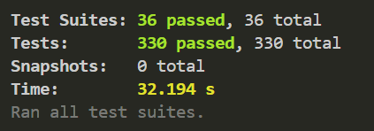<br>
  <sup>Fonte: Autores, 2026.</sup>
</div>

---

#### Relatório de cobertura — `npm test -- --coverage`

Foram executados 316 testes automatizados utilizando Jest e Supertest, abrangendo testes unitários, de integração e end-to-end. Todos os testes foram aprovados com sucesso (36 suítes de teste aprovadas), demonstrando a estabilidade das funcionalidades implementadas. Os percentuais de cobertura devem ser atualizados sempre que o comando `npm test -- --coverage` for executado novamente.

<div align="center">
  <sub>Figura 98 — Print do terminal de npm test -- --coverage</sub><br>
  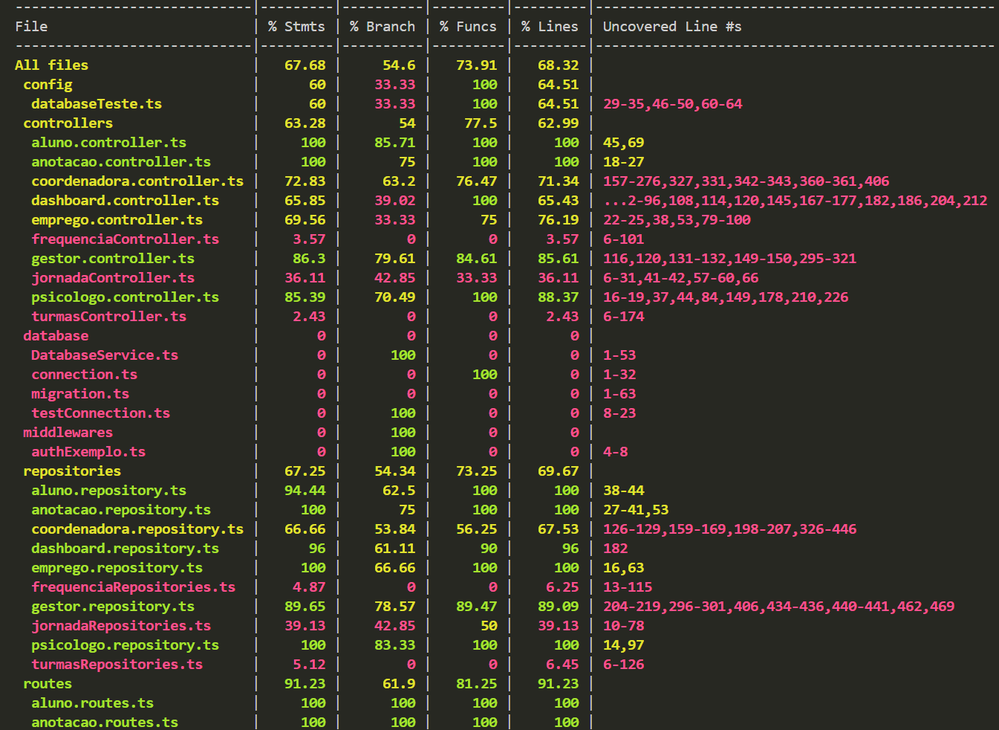<br>
  <sup>Fonte: Autores, 2026.</sup>
</div>

<div align="center">
  <sub>Figura 99 — Continuação de print do terminal de npm test -- --coverage</sub><br>
  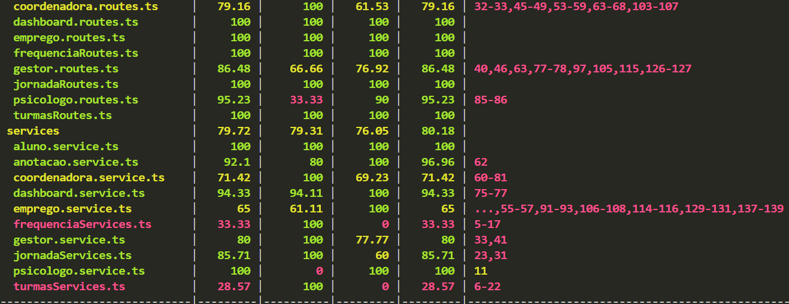<br>
  <sup>Fonte: Autores, 2026.</sup>
</div>

As Figuras 98 e 99 apresentam o output do terminal, listando todos os módulos do projeto (config, controllers, database, middlewares, repositories, routes e services) com seus respectivos percentuais de cobertura de statements, branches, funções e linhas, além das linhas não cobertas. Módulos como database e middlewares apresentam 0% de cobertura por não serem diretamente testáveis via testes automatizados da aplicação, enquanto módulos como routes (91,23% de statements) e services (79,72% de statements e 80,18% de linhas) demonstram boa cobertura geral.


<div align="center">
  <sub>Figura 100 — Imagem do HTML de npx jest --coverage</sub><br>
  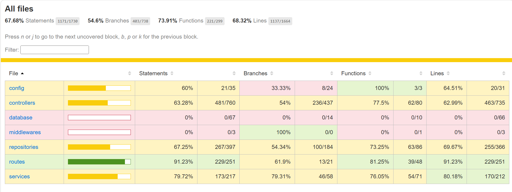<br>
  <sup>Fonte: Autores, 2026.</sup>
</div>

A Figura 100 exibe o relatório HTML gerado em `coverage/lcov-report/index.html`, com foco no diretório controllers, onde é possível visualizar graficamente o nível de cobertura por arquivo — arquivos com alta cobertura aparecem em verde (ex: `aluno.controller.ts` com 100% e `psicologo.controller.ts` com 85,39% de statements), enquanto arquivos com cobertura crítica são destacados em vermelho (ex: `frequenciaController.ts` com 3,57% e `turmasController.ts` com 2,43% de statements).

#### Mapeamento CT → RN → RF (resumido)

A tabela abaixo consolida o rastreamento entre os casos de teste, as regras de negócio cobertas e os requisitos funcionais correspondentes.

| RF | Casos de Teste (CT) | RN Coberta | Endpoint | Camada |
|----|---------------------|------------|----------|---------|
| RF001 | CT-S06 | RN010, RN011 | `PATCH /alunos/:ra` | Service |
| RF001 | CT-S12 | RN003 | Múltiplos | Service |
| RF001 | CT-A01-OK | — | `GET /alunos/:ra` | Integration |
| RF001 | CT-A02-400 | RN010, RN011 | `PATCH /alunos/:ra` | Integration |
| RF001, RF005 | CT-A02-OK | RN010 | `PATCH /alunos/:ra` | Integration |
| RF001–RF004 | CT-S12 | RN003 | Múltiplos | Service |
| RF006 | CT-G05-422 | — | `POST /gestao/turmas` | Integration |
| RF006 | CT-G08-409 | — | `POST /gestao/turmas/:id/alunos` | Integration |
| RF008 | CT-S02 | RN006 | `POST /gestao/alunos/:ra/frequencia/aulas` | Service |
| RF008 | CT-G09-422 | RN006 | `POST /gestao/alunos/:ra/frequencia/aulas` | Integration |
| RF008 | CT-G09-409 | — | `POST /gestao/alunos/:ra/frequencia/aulas` | Integration |
| RF009 | CT-S01 | RN007 | `POST /gestao/alunos/:ra/emprego` | Service |
| RF009 | CT-S03 | RN008 | `POST /gestao/alunos/:ra/emprego` | Service |
| RF009 | CT-S07 | RN017 | `PATCH /gestao/alunos/:ra/emprego/:id_emprego` | Service |
| RF009, RF010 | CT-S11 | RN019 | `GET /dashboard/empregabilidade` | Service |
| RF009 | CT-G13-409 | RN007 | `POST /gestao/alunos/:ra/emprego` | Integration |
| RF009 | CT-G13-400 | RN008 | `POST /gestao/alunos/:ra/emprego` | Integration |
| RF009 | CT-G14-OK | RN017 | `PATCH /gestao/alunos/:ra/emprego/:id_emprego` | Integration |
| RF010 | CT-S08 | RN009 | `GET /dashboard` | Service |
| RF010 | CT-S09 | RN018 | `GET /dashboard` | Service |
| RF010 | CT-G16-OK | RN018 | `GET /dashboard` | Integration |
| RF010 | CT-G18-OK | RN019 | `GET /dashboard/empregabilidade` | Integration |
| RF011 | CT-S04 | RN012 | `GET /gestao/alertas` | Service |
| RF011 | CT-G19-403 | RN003 | `GET /gestao/alertas` | Integration |
| RF012 | CT-A05-OK | RN012 | `GET /aluno/:ra/alertas` | Integration |
| RF013 | CT-S05 | RN005 | `POST /psicologa/:rm/alunos/:ra/relatorios` | Service |
| RF013 | CT-S10 | RN014 | `PATCH /psicologa/.../relatorios/:id` | Service |
| RF013 | CT-P01-403 | RN005 | `POST /psicologa/:rm/alunos/:ra/relatorios` | Integration |
| RF016 | CT-G21-OK | — | `POST /gestor/comunicados` | Integration |
| RF016 | CT-G21-400-campos | — | `POST /gestor/comunicados` | Integration |
| RF016 | CT-G21-400-dest | — | `POST /gestor/comunicados` | Integration |
| RF016 | CT-G21-400-titulo | — | `POST /gestor/comunicados` | Integration |
| RF016 | CT-G21-403 | RN003 | `POST /gestor/comunicados` | Integration |
| RF016 | CT-G21-500 | — | `POST /gestor/comunicados` | Integration |
| RF017 | CT-G22-OK | — | `POST /gestor/importacao` | Integration |
| RF017 | CT-G22-400-ausente | — | `POST /gestor/importacao` | Integration |
| RF017 | CT-G22-400-formato | — | `POST /gestor/importacao` | Integration |
| RF017 | CT-G22-403 | RN003 | `POST /gestor/importacao` | Integration |
| RF017 | CT-G22-422 | — | `POST /gestor/importacao` | Integration |
| RF017 | CT-G22-500 | — | `POST /gestor/importacao` | Integration |
| RF018 | CT-G23-OK, CT-G23-404 | RN020 | `GET /alunos/:ra/anotacoes` | Integration/E2E |
| RF018 | CT-G24-OK, CT-G24-400 | RN020 | `POST /alunos/:ra/anotacoes` | Integration/E2E |
| RF018 | CT-G25-OK, CT-G25-400 | RN020 | `PATCH /anotacoes/:id` | Integration/E2E |
| RF018 | CT-G26-OK, CT-G26-404 | — | `DELETE /anotacoes/:id` | Integration/E2E |
| RF019 | CT-G27-OK, CT-G27-400, CT-G27-404 | RN023 | `PATCH /gestao/alertas/:id/resolver` | Integration/E2E |

## 5.2. Testes de usabilidade 

### 5.2.1. Relatório de testes de guerrilha

Os testes de usabilidade constituem uma metodologia de pesquisa em UX Design que, por meio de abordagens qualitativas e quantitativas, avalia as interações e os comportamentos do usuário ao executar tarefas em uma plataforma digital. Segundo Nielsen (2000), testes com cinco usuários são suficientes para revelar a grande maioria dos problemas críticos de uma interface. O objetivo central é identificar obstáculos de navegação e design, descobrir oportunidades de melhoria e aprofundar o entendimento sobre o comportamento real dos usuários diante do sistema.

Os testes foram realizados presencialmente com estudantes do Instituto de Tecnologia e Liderança (Inteli) em 16 de junho de 2026, durante sessão conduzida pela equipe Nexus. Para garantir representatividade dos diferentes perfis da plataforma, cada participante recebeu previamente uma persona detalhada, assumindo o papel de um dos quatro tipos de usuário: Aluno, Coordenadora, Gestor ou Psicóloga. Os resultados foram coletados por meio de fichas de observação estruturadas, com três categorias de resposta: S (Sucesso), quando o participante concluiu a tarefa sem erros ou hesitações significativas; P (Parcial), quando concluiu com dificuldade ou resultado incompleto; e N (Não concluiu), quando houve bloqueio total.

Vale destacar uma limitação metodológica importante: o público testado possui letramento digital significativamente superior ao do usuário real da Pulse Mais, o que tende a elevar as taxas de sucesso observadas em relação ao que seria obtido com coordenadoras, gestores e psicólogas em contexto real. A atribuição de personas mitiga, mas não elimina esse viés. Os resultados devem ser lidos como indicadores de problemas de base, não como validação definitiva da experiência do usuário final. Recomenda-se uma sessão complementar com usuários reais da instituição. Ao longo do relatório, bugs de implementação (o sistema não executa o comportamento esperado) são tratados separadamente de problemas de usabilidade (o sistema funciona, mas o usuário opera com dificuldade), pois cada categoria exige respostas diferentes da equipe.

[Link para planilha de testes](https://docs.google.com/spreadsheets/d/1v6aWnZqxZut8KyRans9SNplxmpdJwFF_H4VnfYzjsG8/edit?usp=sharing)

#### 5.2.1.1. Relatório de testes por perfil

##### Perfil Aluno

As tarefas do perfil Aluno foram aplicadas a 4 participantes (Felipe, Nicolas, Bruno e Julia) e abrangeram as principais funcionalidades do Portal do Aluno.

Na Tarefa 1, todos os 4 participantes localizaram o e-mail secundário após o login sem nenhuma hesitação. Fluxo aprovado.

Na Tarefa 2, três participantes atualizaram o telefone primário sem dificuldade. Bruno demorou para encontrar o botão de edição, mas concluiu a tarefa. O ícone de lápis tem baixa visibilidade na tela de perfil. Proposta de melhoria: substituir o ícone por um botão textual como "Editar dados".

Na Tarefa 3, Felipe concluiu, mas não conseguiu voltar à tela anterior por falta de botão de retorno. Nicolas obteve resultado Parcial porque o sistema não carregou os dados do programa corretamente, o que é um bug de implementação. Bruno e Julia não tiveram problemas. Proposta de melhoria: adicionar botão de retorno ou breadcrumb na seção de Jornada e corrigir o carregamento dos dados do programa, incluindo tratamento de estado vazio visível ao usuário.

Na Tarefa 4, Felipe ficou em dúvida sobre onde estava antes de encontrar a seção de Comunicados. Os demais concluíram sem dificuldades. Proposta de melhoria: destacar o acesso à seção de Comunicados com badge de novos itens ou posição de maior destaque no menu.

Na Tarefa 5, apenas Felipe conseguiu visualizar o banner de alerta de frequência corretamente. Nicolas, Bruno e Julia obtiveram resultado Parcial porque o banner não estava sendo exibido de forma consistente para todos os usuários. Trata-se de um bug na lógica de exibição do componente, referente a RF012/RN012. Proposta de melhoria: corrigir a lógica condicional no front-end e validar a regra no back-end, com teste automatizado cobrindo o caso de frequência abaixo de 95%.

##### Perfil Coordenadora

As tarefas foram aplicadas a 3 participantes (Eduardo Melquiades, Dominique e Vitor) e cobriram funcionalidades de gestão operacional. Este perfil concentrou os resultados mais críticos da sessão, com duas tarefas de borda com 0% de sucesso e duas tarefas de fluxo principal abaixo de 40%.

Na Tarefa 1, todos os 3 participantes acessaram o dashboard de risco de evasão e consultaram os dados sem hesitações. Fluxo aprovado.

Na Tarefa 2, Dominique teve dificuldade para localizar a seção de registro de frequência na interface. Eduardo e Vitor concluíram sem erros. Proposta de melhoria: adicionar atalho ao registro de frequência no dashboard da coordenadora ou tornar o item de menu mais descritivo.

Na Tarefa 3, nenhum participante completou o registro em data futura e o sistema não bloqueou a operação como deveria. A regra RN006 não está implementada no back-end. Proposta de melhoria: implementar a validação de RN006 e exibir mensagem de erro clara quando a data informada for futura.

Na Tarefa 4, Eduardo e Dominique não localizaram a seção de registro de emprego no perfil do aluno. Apenas Vitor concluiu sem problemas, resultando em taxa de sucesso de 33%. Proposta de melhoria: agrupar as funcionalidades de registro (emprego, frequência, observações) em uma seção dedicada dentro do perfil do aluno, com destaque visual claro.

Na Tarefa 5, nenhum participante conseguiu cadastrar um segundo vínculo empregatício com emprego ativo existente para verificar o bloqueio esperado. As regras RN007 e RN008 não estão implementadas. Proposta de melhoria: implementar o bloqueio no back-end e exibir mensagem orientando o usuário a encerrar o vínculo anterior antes de cadastrar um novo.

Na Tarefa 6, Eduardo e Dominique encontraram erro ao tentar publicar o comunicado, que não estava sendo salvo. Vitor teve problema de integração, mas concluiu com sucesso. Há um bug de persistência no banco de dados, e o feedback de confirmação da ação foi apontado como insuficiente. Proposta de melhoria: corrigir o erro de persistência e implementar mensagem de confirmação após o salvamento, com tratamento de erro visível caso a operação falhe.

Na Tarefa 7, Dominique não concluiu a tarefa e um participante relatou que os filtros estavam confusos, com inconsistência nos dados de gênero cadastrados. Eduardo e Vitor concluíram sem problemas. Proposta de melhoria: revisar os rótulos dos filtros para maior clareza e corrigir os dados de gênero inconsistentes no banco.

##### Perfil Gestor

As tarefas foram aplicadas a 4 participantes (Felipe, Nicolas, Bruno e Julia) e focaram em funcionalidades analíticas e de acompanhamento estratégico. Os fluxos principais tiveram bom desempenho, mas alertas e filtros apresentaram problemas relevantes.

Na Tarefa 1, todos os 4 participantes localizaram o indicador de empregabilidade com sucesso. Felipe observou que os filtros do dashboard não estavam funcionando e que o refresh não atualizava o estado da página. Proposta de melhoria: corrigir os filtros do dashboard e garantir atualização reativa sem necessidade de recarregar a página.

Na Tarefa 2, todos os 4 participantes acessaram o perfil completo de um aluno da Turma 1 sem dificuldades. Felipe notou que o histórico e as anotações não estavam acessíveis a partir dessa tela. Proposta de melhoria: avaliar a inclusão de acesso rápido ao histórico dentro do perfil, respeitando as restrições de permissão (RN002/RN003).

Na Tarefa 3, Felipe e Bruno confirmaram que o sistema exibiu corretamente a restrição de acesso às anotações clínicas. Nicolas acessou o indicador de estabilidade emocional, mas não conseguiu confirmar de forma conclusiva se o bloqueio ao conteúdo das anotações estava funcionando. Proposta de melhoria: tornar a mensagem de acesso restrito mais explícita para o perfil Gestor, eliminando qualquer ambiguidade sobre o que está ou não disponível naquele contexto.

Na Tarefa 4, todos os 4 participantes obtiveram resultado Parcial, com taxa de sucesso pleno de 0%. Felipe não encontrou os alertas porque o aluno estava com status inativo e o filtro não incluía esse caso. Nicolas e Bruno tiveram dificuldade em localizar os alertas na interface. Julia demorou para entender onde estariam. Proposta de melhoria: destacar os alertas de evasão diretamente no dashboard do gestor e corrigir o filtro para incluir alunos independentemente do status.

Na Tarefa 5, Felipe não conseguiu completar a tarefa. Nicolas e Julia concluíram com dificuldade. Apenas Bruno concluiu com sucesso. A combinação simultânea de múltiplos filtros não estava clara na interface. Proposta de melhoria: adicionar chips removíveis para filtros ativos e tornar a aplicação de múltiplos critérios mais intuitiva.

##### Perfil Psicóloga

As tarefas foram aplicadas a 2 participantes (Lucas Delmirio e Felipe Strada) e focaram no fluxo de prontuário e nas regras de restrição de acesso. Por se tratar de uma amostra pequena, os resultados devem ser complementados com reteste.

Na Tarefa 1, Lucas localizou o aluno com status "atenção" em cerca de 1 minuto sem dificuldades. Felipe Strada teve dificuldade para encontrar a lista de alunos dentro do painel da psicóloga. Proposta de melhoria: adicionar atalho direto à lista de alunos na tela inicial da psicóloga.

Na Tarefa 2, ambos os participantes registraram uma nova observação no prontuário sem problemas. Fluxo aprovado.

Na Tarefa 3, Felipe Strada confirmou que o sistema bloqueou corretamente a tentativa de editar e excluir uma observação existente, validando o comportamento de imutabilidade do prontuário (RN014/015). Lucas não realizou a tarefa de forma conclusiva. Proposta de melhoria: validar com ao menos um participante adicional em reteste e garantir que a mensagem de bloqueio seja clara e orientadora.

Na Tarefa 4, nenhum participante executou o cenário de permissão que testaria o bloqueio de acesso do Gestor ao conteúdo do prontuário (RN003/RN005). Esta é uma pendência crítica: a regra é central para a conformidade com a LGPD e com a política de sigilo clínico da plataforma. É obrigatório agendar reteste dedicado para validar esse comportamento antes da entrega final.


#### 5.2.1.2. Erros críticos por perfil e visão de transformação para a Sprint 5

A análise abaixo considera os registros da planilha de teste de casos críticos de erros/hesitações persistentes, e também os problemas observados manualmente durante o desenvolvimento e a validação integrada do sistema. A combinação dessas duas fontes foi necessária porque alguns erros não apareceram em todas as sessões da planilha, mas foram recorrentes durante a integração entre front-end, back-end e banco de dados.

**Aluno.** No perfil de aluno, os erros mais relevantes aparecem em três fluxos. O primeiro é o aviso de baixa frequência: em dois dos quatro testes registrados, a tarefa de verificar o banner de alerta foi concluída apenas parcialmente, porque o endpoint utilizado não retornava um aluno com frequência baixa. Ainda assim, a validação manual indicou que o alerta não seria exibido corretamente nesse cenário. Esse problema é crítico para que o aluno consiga visualizar uma possível perda de módulo. O segundo ponto é o fluxo de jornada, em que houve dificuldade de retorno por ausência de seta e um caso em que o participante operou corretamente, mas o sistema não respondeu como esperado. O terceiro ponto envolve comunicados: houve dúvida sobre o caminho correto na planilha e, nos eventos manuais, foi identificado que o comunicado do aluno não estava clicável e que imagens de comunicados não apareciam.

**Visão para a Sprint 5:** a transformação esperada é converter o portal do aluno em uma área de autoconsulta confiável, com alertas de frequência funcionais, comunicados acessíveis e navegação reversível em todas as telas.

---

**Coordenadora.** No perfil da coordenadora, o erro mais crítico é a integração de comunicados. A planilha registra falhas como erro ao publicar evento, erro ao cadastrar comunicado, erro de banco de dados e problema de integração do sistema. Além disso, os eventos manuais reforçam que o comunicado da coordenadora não funciona e que a imagem do comunicado não aparece. Esse problema tem alta prioridade porque comunicados são um canal de integração entre equipe e alunos ativos. Também apareceram falhas ou dificuldades em registro de frequência e validação de data futura, incluindo menções a "id da aula", dificuldade para localizar o local de registro e caso em que a regra de bloqueio "não funcionou". Outro ponto recorrente é a confusão nos filtros e a inconsistência de dados, especialmente gênero e critérios de filtragem.

**Visão para a Sprint 5:** a coordenadora precisa receber uma experiência de gestão transacional: tudo que for criado, publicado, filtrado ou registrado deve retornar confirmação clara, validar regras de negócio e persistir corretamente no banco. Os filtros precisam ser ajustados para se tornarem verdadeiramente funcionais. A criação de comunicados deve ocorrer sem erros.

---

**Gestor.** No perfil de gestor, os erros se concentram em filtros, dashboard, alertas e anotações. A planilha registra filtros e refresh sem funcionamento, dificuldade para encontrar alertas de evasão por aluno inativo e falhas nas combinações de filtro por gênero e empregabilidade. As tarefas de alertas de evasão foram concluídas parcialmente em todos os testes preenchidos, o que torna esse fluxo crítico. Os eventos manuais complementam a gravidade: botão de alerta para o gestor não funciona, não existe indicação para que o gestor clique no card para acessar os alunos com risco de evasão e os indicadores não filtram por tempo. Também foram registrados problemas nas anotações do gestor, incluindo impossibilidade de adicionar e falha de funcionamento.

**Visão para a Sprint 5:** transformar o dashboard do gestor em uma camada executiva confiável, com indicadores que venham da mesma fonte de dados, obedeçam aos filtros de período e permitam investigação rápida de frequência, evasão, empregabilidade e histórico permitido por perfil. Também é necessário corrigir a área de anotações para que o gestor consiga adicionar informações ao perfil do aluno.

---

**Psicóloga.** No perfil de psicóloga, a planilha mostra menos falhas funcionais do que nos demais perfis, mas indica dificuldade para encontrar a lista de alunos com status "atenção" em um dos testes. O fluxo de registro de observação foi concluído, porém os eventos manuais indicam um problema importante de rastreabilidade: a anotação precisa apresentar quem fez o registro. Como prontuários e observações psicológicas envolvem dados sensíveis, a prioridade não está apenas em "funcionar", mas em garantir autoria, imutabilidade, controle de acesso e clareza de status.

**Visão para a Sprint 5:** a transformação esperada é consolidar o prontuário como um registro auditável onde cada anotação deve exibir autor, data, perfil responsável e conteúdo permitido apenas ao público autorizado.

---

#### 5.2.1.3. Classificação dos problemas identificados

Os problemas identificados nos testes foram classificados em uma escala de prioridade de 0 a 4, considerando impacto, gravidade e urgência de correção.

| Perfil | Erro crítico consolidado | Impacto | Prioridade Sprint 5 |
| --- | --- | --- | --- |
| Coordenadora | Criação/publicação de comunicados inconsistente | Coordenadora não consegue acionar alunos ativos | 4 |
| Gestor | Filtros, refresh e indicadores inconsistentes | Decisão gerencial baseada em dado incompleto | 4 |
| Gestor | Alertas de evasão parcialmente funcionais | Risco de evasão pode não ser tratado a tempo | 4 |
| Psicóloga | Autoria das anotações não exibida | Prontuário perde rastreabilidade e auditabilidade | 4 |
| Aluno | Aviso de baixa frequência falha ou aparece parcialmente | Aluno perde visibilidade sobre risco de frequência | 3 |
| Aluno | Comunicados com problemas de clique e imagem | Comunicação institucional não chega de forma confiável ao aluno | 3 |
| Coordenadora | Registro de frequência e validações incompletas | Frequência pode ser registrada com erro ou sem bloqueio de regra | 3 |
| Coordenadora | Filtros e dados importados inconsistentes | Segmentação de alunos perde confiabilidade | 3 |
| Gestor | Anotações e frequência indisponíveis ou sem funcionamento | Gestor perde visão operacional do acompanhamento | 3 |
| Aluno | Navegação de jornada/programas pouco clara | Acesso ao histórico formativo fica confuso | 2 |
| Psicóloga | Lista/status de alunos pouco encontrável | Psicóloga demora para localizar alunos em atenção | 2 |

**Conclusão dos testes:**

Os testes indicam que a Sprint 5 deve priorizar a estabilização operacional em quatro frentes: confiabilidade dos fluxos críticos, consistência dos dados, rastreabilidade das ações e validação por perfil. Comunicados, alertas, frequência e anotações devem funcionar de ponta a ponta, com persistência correta e feedback visual. Dashboards e importações devem aplicar filtros e validações consistentes, enquanto as anotações devem exibir autoria, perfil, data e horário, respeitando as permissões e a separação entre registros clínicos e operacionais.

Os principais critérios de aceite são: publicação e visualização de comunicados com imagem; exibição de alertas de baixa frequência; filtros e indicadores gerenciais funcionais; consulta de frequência e tratamento de alertas de evasão; anotações com autoria visível; bloqueio de frequência em data futura; e rejeição ou sinalização de dados inválidos.

Assim, a Sprint 5 passa de uma etapa de acabamento para uma entrega operacional confiável.

### 5.2.2. Relatório de testes SUS (System Usability Scale)


Para complementar os testes de guerrilha com uma medida quantitativa, a equipe aplicou o System Usability Scale (SUS), questionário de dez afirmações proposto por Brooke (1996) que resume a usabilidade percebida de um sistema em uma pontuação de 0 a 100. O instrumento foi escolhido pela aplicação rápida e por permitir a comparação com uma referência já consolidada na literatura.

O questionário foi aplicado em 16 de junho de 2026, de forma presencial, na mesma sessão dos testes de guerrilha (seção 5.2.1). Cada participante respondeu logo após concluir as tarefas do seu perfil, para que a avaliação refletisse a experiência recém-vivida. Os avaliadores foram oito estudantes da turma T28 do Inteli, de diferentes grupos de projeto, que assumiram os papéis de gestor, coordenador, psicólogo e aluno. Por se tratar de avaliadores que simularam esses perfis, e não de usuários finais da Pulse Mais, os resultados indicam tendências de usabilidade que ainda devem ser confirmadas junto à equipe da organização.

As dez afirmações, respondidas em escala de 1 (discordo totalmente) a 5 (concordo totalmente), foram as seguintes:

| Nº | Afirmação |
|----|-----------|
| 1 | Eu usaria esse sistema com frequência. |
| 2 | Achei o sistema desnecessariamente complexo. |
| 3 | Achei o sistema fácil de usar. |
| 4 | Precisaria de apoio técnico para conseguir usar. |
| 5 | As funções do sistema estão bem integradas. |
| 6 | Há muita inconsistência no sistema. |
| 7 | A maioria das pessoas aprenderia a usar rapidamente. |
| 8 | Achei o sistema muito trabalhoso de usar. |
| 9 | Me senti confiante ao usar o sistema. |
| 10 | Precisei aprender muita coisa antes de conseguir usar. |

No cálculo, cada afirmação é convertida em uma contribuição de 0 a 4 (descontando a alternância entre os itens positivos e negativos), e a soma é multiplicada por 2,5. Como referência de interpretação, Sauro e Lewis (2016) apontam 68 como a média histórica do SUS, e notas a partir de 84,1 correspondem à faixa mais alta da escala (A+), associada a uma experiência excelente.

A pontuação individual de cada participante e a média geral estão na tabela a seguir.

| Participante | SUS (0–100) | Classificação |
|--------------|:-----------:|---------------|
| Felipe | 85,0 | A+ |
| Nicolas | 95,0 | A+ |
| Felipe Strada | 67,5 | C |
| Lucas Delmirio | 95,0 | A+ |
| Bruno | 95,0 | A+ |
| Julia | 95,0 | A+ |
| Dominique | 87,5 | A+ |
| Vitor | 87,5 | A+ |
| **Média geral** | **88,4** | **A+** |

<div align="center">
  <sub>Figura 101 — Pontuação SUS por participante</sub><br>
  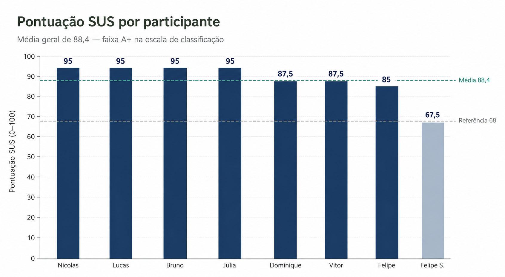<br>
  <sup>Fonte: Autores, 2026.</sup>
</div>


Para entender de onde vem o resultado, a tabela abaixo detalha a proporção de respostas favoráveis em cada afirmação. Considera-se favorável a concordância nos itens positivos (notas 4 ou 5) e a discordância nos itens negativos (notas 1 ou 2).

| Afirmação | Respostas favoráveis |
|-----------|:--------------------:|
| Sentiu-se confiante ao usar o sistema (item 9) | 100% |
| Não precisou aprender muita coisa antes de usar (item 10) | 100% |
| Usaria o sistema com frequência (item 1) | 88% |
| Achou o sistema fácil de usar (item 3) | 88% |
| A maioria das pessoas aprenderia rapidamente (item 7) | 88% |
| Não achou o sistema complexo (item 2) | 88% |
| Não precisaria de apoio técnico (item 4) | 88% |
| Não achou o sistema trabalhoso (item 8) | 88% |
| Não percebeu inconsistências (item 6) | 75% |
| Considera as funções bem integradas (item 5) | 62% |

A média de 88,4 posiciona a Nexus na faixa A+, bem acima da referência de 68. Sete dos oito participantes (88%) avaliaram o sistema acima dessa média, e 86% do total de respostas foram favoráveis. Os pontos mais fortes foram a confiança ao usar a plataforma e a baixa necessidade de aprendizado prévio, ambos com 100% de respostas favoráveis, o que indica uma curva de aprendizado curta. Os indicadores de facilidade de uso, intenção de uso recorrente e simplicidade também ficaram altos, em 88%. O retorno mais fraco foi a percepção de integração entre as funções, com 62%, em linha com a única nota próxima à referência (67,5), puxada pela impressão de que o sistema exigiria apoio técnico e seria trabalhoso. Esses pontos coincidem com as dificuldades de navegação e de uso dos filtros observadas na seção 5.2.1, o que mostra que o atrito se concentra na descoberta de funcionalidades, e não na lógica geral do sistema. No conjunto, o resultado confirma que a plataforma é fácil de adotar e sustenta a proposta de substituir as planilhas dispersas da Pulse Mais; as correções dos pontos identificados estão priorizadas na seção 5.2.3.

### 5.2.3. Priorização das melhorias detectadas

A partir das dificuldades e falhas registradas nos testes de guerrilha (seção 5.2.1) e dos pontos de menor concordância identificados no SUS (seção 5.2.2), a equipe consolidou os problemas de usabilidade em uma lista priorizada por criticidade. A classificação segue a escala de severidade de 0 a 4, em que 0 indica um item sem importância e 4 um problema catastrófico, que deve ser corrigido antes da disponibilização do produto. A equipe não precisa implementar todas as correções nesta etapa; o objetivo é registrar a priorização e direcionar os próximos esforços para o que é mais crítico.

| Severidade | Ponto de melhoria | Onde foi observado | Ação proposta |
|:---:|---|---|---|
| **4 – Catastrófico** | O sistema permite registrar presença em data futura, violando a regra de negócio RN006 (que deveria bloquear a ação). | Coordenadora — tarefa EDGE de registro de frequência | Implementar a validação de data no backend e no formulário, bloqueando datas futuras antes de salvar. |
| **3 – Grave** | Os filtros de busca de alunos não filtram corretamente (ex.: não localizam alunos inativos) e às vezes exigem recarregar a página. | Gestor — tarefas 4 e 5; Coordenadora — tarefa 7 | Revisar a lógica de filtragem e a atualização da lista sem necessidade de refresh manual. |
| **3 – Grave** | Falha ao publicar comunicado: a ação não conclui ("não está publicando" / erro de integração). | Coordenadora — tarefa 6 | Corrigir a integração responsável pela publicação e exibir feedback claro de sucesso ou erro. |
| **3 – Grave** | O banner de alerta de frequência não funciona como esperado / não está implementado corretamente. | Aluno — tarefa 5 | Concluir a implementação do alerta de frequência (<95%) e validar a exibição do banner. |
| **2 – Simples** | A lista de alunos é de difícil localização na navegação. | Psicóloga — tarefa 1; percepção geral no SUS (integração: 62%) | Dar mais destaque ao acesso à lista de alunos no menu principal. |
| **2 – Simples** | Ausência de botão "voltar" (seta) na tela de Jornada, o que confunde o retorno do usuário. | Aluno — tarefa 3 | Incluir botão de retorno explícito nas telas internas do Portal do Aluno. |
| **2 – Simples** | Localização pouco intuitiva de certos dados (alertas e área de registros), gerando demora para encontrá-los. | Gestor — tarefa 4; Coordenadora — tarefa 4 | Reorganizar a hierarquia visual desses dados e rotular as seções com mais clareza. |
| **1 – Cosmético** | Alguns botões de ação são pouco evidentes (ex.: edição de telefone no perfil do aluno). | Aluno — tarefa 2 | Aumentar o contraste e a visibilidade dos botões de ação secundários. |

Como prioridade imediata, destacam-se os itens de severidade 4 e 3, que envolvem regras de negócio e funcionalidades centrais (validação de data, filtros, publicação de comunicados e alerta de frequência). Os itens de severidade 2 e 1, relacionados à descoberta de funcionalidades e à clareza visual, podem ser tratados em iterações seguintes, conforme a disponibilidade da equipe.


# <a name="c6"></a>6. Estudo de Mercado e Plano de Marketing 

## 6.1 Resumo Executivo

A Pulse Mais é uma organização do terceiro setor que prepara jovens das periferias de São Paulo para o mercado de tecnologia. Hoje, os dados de seus alunos vivem espalhados em planilhas separadas por projeto e ano, o que trava a consulta ao histórico, gera retrabalho e dificulta comprovar impacto a quem financia a operação. A Nexus nasce para resolver esse gargalo: uma aplicação web que reúne a trajetória de cada jovem — da entrada na formação à inserção no trabalho — em uma única base de dados.

O problema não é só da Pulse Mais. O Brasil tem cerca de 879 mil organizações da sociedade civil ativas (INSTITUTO DE PESQUISA ECONÔMICA APLICADA, 2023), e apenas cerca de um terço delas declara ter estrutura de tecnologia (CETIC.BR, 2022) — tudo isso num momento em que os financiadores cobram mais transparência e evidências de resultado. Identificou-se, portanto, espaço real para soluções que organizem dados e gerem indicadores de impacto.

O diferencial da Nexus está em ser feita sob medida. Em vez de um software genérico, igual para todos, ela parte da modelagem do banco de dados e dos fluxos reais da instituição e entrega a cada perfil — gestor, coordenação, psicólogo e aluno — apenas a visão de que precisa. O objetivo estratégico é tirar a gestão da Pulse Mais da dependência de planilhas e da memória de cada colaborador e, no futuro, oferecer a mesma ferramenta a outras ONGs que enfrentam o mesmo problema.


## 6.2 Análise de Mercado

*a) Visão Geral do Setor (até 250 palavras)*

A Nexus atende a Pulse Mais, organização do terceiro setor voltada a inserir jovens periféricos na área de tecnologia. Esse setor tem peso real na economia: as organizações da sociedade civil respondem por 4,27% do PIB, cerca de R$ 423 bilhões em 2022, e ocupam por volta de 6 milhões de postos de trabalho (SITAWI FINANÇAS DO BEM; FIPE, 2023).

No campo tecnológico, o atraso ainda é grande. Boa parte das ONGs administra beneficiários e projetos em planilhas, arquivos soltos e conversas de WhatsApp, em parte porque apenas cerca de um terço delas declara ter área ou serviço estruturado de TI (CETIC.BR, 2022). O resultado é dificuldade para dar transparência, analisar resultados e comprovar impacto — justamente o que os financiadores passaram a exigir.


No plano regulatório, o setor segue o Marco Regulatório das Organizações da Sociedade Civil (Lei nº 13.019/2014), que cobra prestação de contas e governança nas parcerias com o poder público (BRASIL, 2014). Observou-se que esse conjunto de exigências reforça a necessidade de plataformas capazes de manter os dados íntegros e rastreáveis — espaço em que a Nexus se encaixa.

*b) Tamanho e Crescimento do Mercado (até 250 palavras)*

O terceiro setor brasileiro cresce de forma consistente. O Mapa das OSCs registrou 879.326 organizações ativas em 2023, contra 815.677 em 2021 — alta de 7,8% em dois anos (INSTITUTO DE PESQUISA ECONÔMICA APLICADA, 2023). Em peso econômico, suas atividades equivalem a 4,27% do PIB, cerca de R$ 423 bilhões em 2022, e geram por volta de 6 milhões de empregos (SITAWI FINANÇAS DO BEM; FIPE, 2023).

O dinheiro que circula no setor também aumentou. A pesquisa BISC apontou R$ 6,2 bilhões em investimento social corporativo em 2024, crescimento real de 19,4% sobre 2023 (COMUNITAS, 2025), e o Censo GIFE 2024–2025 mediu R$ 5,8 bilhões em investimento social privado, o segundo maior valor da série histórica (GIFE, 2025). Há, porém, um detalhe que define a oportunidade da Nexus: esse recurso está concentrado em poucos grandes financiadores. Concluiu-se que, nesse arranjo, ganha vantagem na disputa por verba a organização que consegue demonstrar resultado com dados confiáveis — e é essa comprovação que a plataforma ajuda a produzir.

*c) Tendências de Mercado (até 300 palavras)*

Três movimentos vêm redesenhando a forma como as ONGs operam. O primeiro é tecnológico. Organizações que dependiam de planilhas e processos manuais estão sendo empurradas para sistemas integrados e para uma governança de dados mais séria, pressão que aumenta com o avanço da inteligência artificial e a mudança no perfil das competências exigidas pelo trabalho (FÓRUM ECONÔMICO MUNDIAL, 2025). O baixo nível de estruturação de TI no setor (CETIC.BR, 2022) mostra o tamanho do espaço a ser ocupado por ferramentas como a Nexus.


O segundo é comportamental. Cresceu a cobrança por transparência e por evidências de impacto, e medir resultado deixou de ser diferencial para virar exigência de quem financia. Em resposta, muitas organizações passaram a usar dashboards e relatórios para mostrar, com números, o valor do que entregam — um dos motivos por trás da alta contínua do investimento social privado (GIFE, 2025).

O terceiro é mercadológico. A captação de recursos migrou para o digital: doação online, campanhas em redes sociais e contribuição recorrente ganharam espaço e só funcionam com estrutura tecnológica por trás. Observou-se que essas tendências convergem para o mesmo ponto — a organização que trata dado como ativo sai na frente —, e a Nexus se posiciona para apoiar a Pulse Mais nesse movimento.


## 6.3 Público-Alvo

*a) Segmentação de Mercado (até 250 palavras)*

A segmentação parte do mercado em que a aplicação se insere: o terceiro setor de capacitação tecnológica de jovens. O problema social que sustenta esse mercado é grande — o IBGE estima 8,9 milhões de jovens fora da escola e do trabalho no país (INSTITUTO BRASILEIRO DE GEOGRAFIA E ESTATÍSTICA, 2025), e o Fórum Econômico Mundial projeta que 39% das habilidades profissionais precisarão de atualização até 2030 (FÓRUM ECONÔMICO MUNDIAL, 2025). Dentro dele, a Endeavor Brasil mapeou 154 iniciativas de formação em tecnologia, das quais 80% se limitam a cursos de curta duração (ENDEAVOR BRASIL, 2023). A Pulse Mais ocupa o subsegmento minoritário da jornada completa, que une formação, mentoria e apoio psicológico — e é esse acompanhamento de longo prazo que a plataforma precisa registrar.

A Nexus atende dois segmentos. O principal é institucional: a equipe da Pulse Mais, que em 2025 acompanhou 605 jovens e presta contas a financiadores cada vez mais exigentes quanto à comprovação de resultados, num cenário de recursos concentrados em poucos grandes doadores (GIFE, 2025). O segundo são os usuários finais — jovens de 17 a 26 anos, de baixa renda, das periferias de São Paulo — que acessam o Portal do Aluno. Identificou-se ainda um terceiro segmento em potencial para o futuro: ONGs de perfil parecido, que sofrem com a mesma fragmentação de dados e poderiam adotar a plataforma numa expansão.

*b) Perfil do Público-Alvo (até 250 palavras)*

O público principal é a equipe interna da Pulse Mais — gestão, coordenação de programas e atendimento psicológico —, uma estrutura enxuta descrita na ficha técnica do Relatório de Atividades 2025 (PULSE MAIS, 2026). No dia a dia, esse grupo administra planilhas separadas por projeto e ano e troca informações críticas por WhatsApp, o que gera retrabalho e prende o conhecimento na memória de cada pessoa. Suas necessidades são concretas: achar rápido o histórico de um jovem, identificar cedo quem corre risco de evadir — prioridade declarada no Eixo Impacto dos Desafios de 2026 da instituição (PULSE MAIS, 2026) — e montar relatórios de impacto sem perder horas consolidando dados.

O público secundário são alunos e ex-alunos: jovens de 17 a 26 anos, de baixa renda, das periferias de São Paulo, perfil coerente com os 8,9 milhões de jovens sem estudo e trabalho no país (INSTITUTO BRASILEIRO DE GEOGRAFIA E ESTATÍSTICA, 2025). A doação de 46 computadores em 2025 mostra que muitos sequer têm acesso fácil a equipamento. Eles veem a tecnologia como caminho de mobilidade social e valorizam mentoria e pertencimento à rede, como relatam depoimentos do mesmo relatório (PULSE MAIS, 2026). São usuários de smartphone, acostumados a WhatsApp — o que justifica a interface responsiva do Portal —, e querem atualizar o próprio cadastro, ver a trajetória e ter um canal para voltar como mentores, sustentando a cultura de give back.


## 6.4 Posicionamento

*a) Proposta de Valor Única (até 250 palavras)*

A Nexus reúne num só lugar toda a trajetória do jovem atendido pela Pulse Mais — do primeiro cadastro à entrada no mercado de trabalho. Com isso, encerra a dependência das planilhas fragmentadas que hoje atrasam a operação e enfraquecem a prestação de contas da organização.

O ganho central é deixar de perder tempo. Identificou-se que a equipe gasta horas juntando informações espalhadas em arquivos isolados, sem histórico integrado nem indicadores prontos. A Nexus resolve isso ao manter frequência, jornada acadêmica, empregabilidade, saúde mental e comunicados na mesma base, com acesso controlado por perfil para proteger o que é sensível.

O valor muda conforme quem usa. O gestor ganha dashboards que agilizam a prestação de contas. A coordenação enxerga cedo o risco de evasão e age antes que o jovem abandone o programa. O psicólogo tem um prontuário digital reservado só a ele. E o aluno passa a acompanhar a própria jornada e a se sentir parte do processo.

Concluiu-se que a proposta de valor da Nexus é uma só: tirar a gestão da Pulse Mais do modo reativo, preso às planilhas, e colocá-la para funcionar a partir de dados confiáveis — o que melhora tanto a eficiência interna quanto a capacidade de captar recursos.

*b) Posicionamento e Diferenciação (até 250 palavras)*

A Nexus se posiciona como o sistema central de gestão da Pulse Mais: uma solução de impacto social feita sob medida para ONGs de capacitação tecnológica que precisam comprovar resultados a financiadores exigentes e não têm equipe técnica para manter sistemas complexos.

Os concorrentes diretos são sistemas genéricos de gestão escolar, como Classapp e Escola Digital. Eles cobrem funções educacionais básicas, mas não foram pensados para uma ONG — com vários perfis de acesso, prontuário psicológico sigiloso e indicadores voltados à captação de doadores. Como concorrentes indiretos aparecem as planilhas de Google Sheets e Excel, hoje usadas pela própria Pulse Mais, e plataformas de CRM social como o Salesforce Nonprofit, cujo custo de implantação e licenciamento não cabe no orçamento do terceiro setor.

A marca se apoia em três atributos: confiabilidade, acessibilidade e foco no impacto. O azul institucional passa seriedade, e a interface responsiva garante que jovens sem computador consigam usar o Portal pelo celular.

Almeja-se que gestores, coordenadores e financiadores enxerguem a Nexus como um ativo estratégico da Pulse Mais, ligado à transparência e ao impacto social — e não como mais uma ferramenta operacional.

## 6.5 Estratégia de Marketing

*a) Produto/Serviço (até 200 palavras)*

A Nexus é uma aplicação web que centraliza os dados da jornada dos jovens da Pulse Mais, do ingresso na formação ao acompanhamento depois de formados, e passa a ser a fonte única de informação da instituição no lugar das planilhas. São quatro funções principais: um dashboard de impacto, com totais de alunos ativos, formados, empregados e em risco de evasão; o registro de jornada, em que a coordenação lança frequência, desempenho e empregabilidade; o Portal do Aluno, onde o jovem atualiza seus dados, acompanha a trajetória e mantém vínculo com a rede após a formação; e um prontuário digital restrito ao psicólogo.

A diferença para as planilhas e para ferramentas genéricas está no que elas não fazem: separar perfis de usuário e proteger dado sensível. A Nexus combina acesso por papel, sigilo do prontuário e indicadores automáticos para a prestação de contas. O benefício mais direto é acabar com a fragmentação dos dados, com a meta de reduzir em pelo menos 45% o tempo gasto para montar o relatório mensal de impacto.


*b) Preço (até 200 palavras)*

A Nexus adota custo zero de licenciamento. Por ser um projeto acadêmico feito para uma organização sem fins lucrativos, não há cobrança pela aplicação; os custos se resumem à hospedagem em nuvem e ao banco PostgreSQL, mantidos em planos gratuitos ou baratos.

A escolha vem das análises anteriores. As Cinco Forças de Porter (seção 2.1.1) mostraram o alto poder de barganha dos financiadores, num setor em que o recurso está concentrado em poucos grandes doadores (GIFE, 2025); qualquer mensalidade de software pesaria sobre a sustentabilidade da ONG. Também não há como repassar custo ao público atendido, que depende de iniciativas gratuitas. Na prática, o que a Pulse Mais "paga" é o esforço de adoção — migrar as planilhas e treinar a equipe —, reduzido pelos scripts de importação e por uma interface desenhada a partir do trabalho real da instituição. Em troca, economiza horas de relatório e ganha capacidade de comprovar impacto, o que fortalece a captação.


*c) Praça (Distribuição) (até 200 palavras)*

A distribuição é toda digital. O canal principal é a própria plataforma web, hospedada em nuvem e aberta pelo navegador, sem instalação, com layout que se ajusta a computador e celular. Isso acompanha o uso real: a equipe acessa pelos computadores da Pulse Mais na rotina de trabalho, enquanto alunos e ex-alunos entram no Portal pelo smartphone.

A entrega é dividida por perfil. Gestores, coordenadores e psicólogo acessam por login com permissões próprias, de modo que cada um veja apenas o que lhe cabe. Para os jovens, o link do Portal circula nos canais que a ONG já usa — o WhatsApp institucional e os avisos em aula —, o que reduz a barreira de adoção por aproveitar um hábito existente. O código fica versionado no GitHub e documentado, o que permite à instituição manter e evoluir a plataforma por conta própria. A hospedagem em nuvem garante que o sistema fique disponível e acompanhe o crescimento da base de alunos.


*d) Promoção (até 200 palavras)*

Por ser uma ferramenta de uso interno, a promoção mira a adoção pela equipe e o fortalecimento da Pulse Mais, não a conquista de público em massa. Dentro da instituição, o lançamento será apoiado por sessões de onboarding, tutoriais curtos em vídeo e guias rápidos — uma forma de conter o risco de baixo engajamento mapeado na matriz de riscos. Para os alunos, a divulgação do Portal acontece nos canais já ativos da ONG, como os grupos de WhatsApp e os avisos em aula, com foco no benefício de acompanhar a própria trajetória.

Para fora, a plataforma abastece a comunicação institucional: os números do dashboard viram posts no LinkedIn e no Instagram, relatórios para financiadores e material para eventos do setor. No site da ONG, palavras-chave como "capacitação gratuita de jovens em tecnologia" ampliam o alcance orgânico junto a possíveis doadores. Campanhas pagas não são prioridade diante do orçamento restrito; se forem usadas, o caminho é o Google Ad Grants, que dá crédito gratuito de anúncios para organizações sem fins lucrativos.


## 6.6 Business Model Canvas

O Business Model Canvas, proposto por Osterwalder e Pigneur (2011), é uma ferramenta estratégica utilizada para representar a lógica de criação, entrega e captura de valor de um negócio por meio de nove blocos fundamentais. Neste projeto, o Canvas foi elaborado para representar o funcionamento da plataforma Nexus, desenvolvida para apoiar a gestão da jornada dos jovens atendidos pela Pulse Mais. A análise ajudou a entender como a Nexus gera valor, de que recursos depende e quais atividades a sustentam. O modelo foi construído tratando a plataforma como uma solução digital própria — voltada a centralizar dados, acompanhar a trajetória dos jovens atendidos pela organização e apoiar decisões com base em informação confiável e atualizada.

<div align="center">
  <sub>Figura 102 — Business Model Canvas</sub><br>
  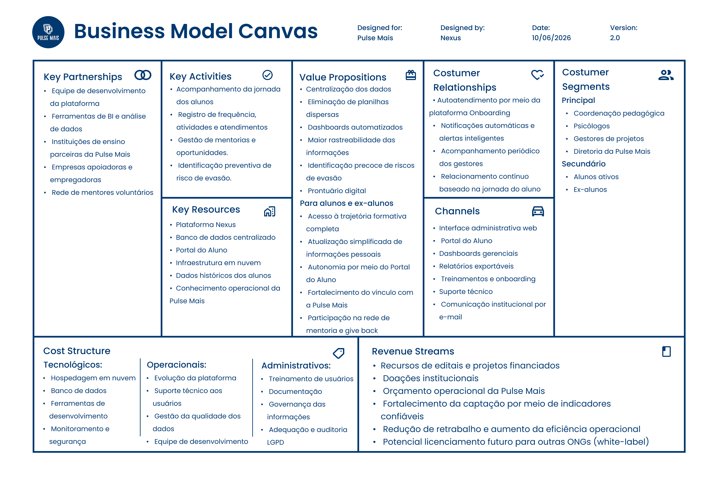<br>
  <sup>Fonte: Autores, 2026.</sup>
</div>

### 6.6.1 Segmentos de Clientes

O segmento principal da plataforma é composto pela equipe gestora da Pulse Mais, incluindo coordenação pedagógica, psicólogos, gestores de projetos e diretoria. Esses usuários utilizam a Nexus para registrar, consultar e analisar informações relacionadas à trajetória dos jovens, apoiando processos de acompanhamento, monitoramento de indicadores e tomada de decisões estratégicas. Como segmento secundário, foram considerados os alunos ativos e ex-alunos da organização, que acessam o Portal do Aluno para acompanhar sua jornada formativa, atualizar informações cadastrais e manter vínculo com a instituição após a conclusão dos programas. Esse público possui papel relevante na estratégia da Pulse Mais, uma vez que contribui para a cultura de give back, na qual ex-alunos retornam à rede como mentores, parceiros ou divulgadores de oportunidades para novos participantes. Embora parceiros institucionais possam se beneficiar dos indicadores gerados pela plataforma, eles não constituem o público-alvo principal da solução.

### 6.6.2 Proposta de Valor

A Nexus oferece uma plataforma centralizada para a gestão da jornada dos alunos da Pulse Mais, substituindo processos fragmentados baseados em planilhas dispersas, registros descentralizados e informações armazenadas em diferentes meios de comunicação. A solução atua como uma Single Source of Truth (SSOT), consolidando dados acadêmicos, sociais e profissionais em um único ambiente digital, proporcionando maior controle, rastreabilidade e confiabilidade das informações institucionais. Além de eliminar retrabalho e reduzir inconsistências nos registros, a plataforma disponibiliza dashboards gerenciais e indicadores automatizados que apoiam a tomada de decisão e facilitam a geração de relatórios de impacto social. A Nexus também permite a identificação precoce de situações de risco, como evasão ou baixa participação, possibilitando intervenções preventivas por parte da equipe. Como diferencial, a solução conta com prontuário digital com controle de acesso por perfil, garantindo que informações sensíveis sejam acessadas apenas por profissionais autorizados, em conformidade com a Lei Geral de Proteção de Dados (LGPD). Para os alunos e ex-alunos, o Portal do Aluno oferece acesso contínuo à própria trajetória formativa, promovendo autonomia, engajamento e fortalecimento do relacionamento com a organização.

### 6.6.3. Canais

A entrega de valor da Nexus ocorre principalmente por meio da própria plataforma web. A equipe gestora acessa a solução através de uma interface administrativa desenvolvida para atender às necessidades operacionais e estratégicas da organização, enquanto alunos e ex-alunos utilizam o Portal do Aluno para consulta e atualização de informações. Complementarmente, a adoção da plataforma é apoiada por treinamentos e processos de onboarding realizados de forma presencial ou remota, garantindo que os usuários compreendam corretamente as funcionalidades disponíveis. Relatórios analíticos, dashboards gerenciais e comunicados institucionais também atuam como mecanismos de distribuição de informações relevantes para os diferentes perfis de usuários.

### 6.6.4. Relacionamento com Clientes

O relacionamento promovido pela Nexus é baseado em uma combinação de autoatendimento, assistência dedicada e comunicação automatizada. A equipe gestora utiliza a plataforma de forma autônoma para registrar e consultar informações, enquanto alunos e ex-alunos acessam diretamente o Portal do Aluno para acompanhar sua trajetória sem necessidade de intermediação constante. O suporte técnico e os treinamentos fornecem assistência especializada quando necessário, contribuindo para a adoção adequada da solução. Além disso, notificações automáticas auxiliam no acompanhamento contínuo dos participantes, alertando sobre pendências, registros incompletos ou situações que demandem atenção da equipe, fortalecendo a gestão proativa dos dados e dos processos institucionais.

### 6.6.5. Fontes de Receita

Por se tratar de uma solução desenvolvida para uso interno da Pulse Mais, a Nexus não possui atualmente um modelo de comercialização direta. Dessa forma, o bloco de fontes de receita é tratado sob a perspectiva da sustentabilidade financeira da iniciativa. Os recursos necessários para sua manutenção são provenientes principalmente de projetos financiados por editais, doações institucionais e orçamento operacional da própria organização. Embora não gere receita direta, a plataforma produz valor econômico indireto ao reduzir retrabalho, otimizar processos administrativos e aumentar a eficiência operacional. A disponibilidade de indicadores confiáveis fortalece a prestação de contas junto a financiadores e parceiros, ampliando a capacidade de captação de recursos e contribuindo para a sustentabilidade institucional da Pulse Mais. Como oportunidade futura, identifica-se a possibilidade de adaptação e licenciamento da solução para outras organizações do terceiro setor, permitindo a criação de uma fonte complementar de receita baseada em um modelo de software reutilizável.

### 6.6.6. Recursos Principais

Os recursos essenciais para o funcionamento da Nexus incluem a própria aplicação web, o banco de dados centralizado, o Portal do Aluno e a infraestrutura de hospedagem em nuvem responsável por garantir disponibilidade, desempenho e segurança da informação. Também constituem recursos estratégicos os dados históricos dos participantes, as regras de negócio relacionadas ao acompanhamento da jornada dos jovens e o conhecimento operacional acumulado pela equipe da Pulse Mais ao longo dos anos de atuação. Além disso, a equipe técnica responsável pelo desenvolvimento, manutenção e evolução da plataforma desempenha papel fundamental para assegurar a continuidade e a adequação da solução às necessidades da organização.

### 6.6.7. Atividades Principais

As atividades-chave da Nexus estão diretamente relacionadas à geração de valor para a gestão institucional da Pulse Mais. Entre elas destacam-se o acompanhamento da jornada dos alunos, o monitoramento de frequência e participação em atividades, o registro de mentorias e atendimentos realizados pela equipe multidisciplinar e a geração de indicadores de impacto social. A plataforma também apoia a identificação preventiva de situações que demandem intervenção, como riscos de evasão ou baixa participação, permitindo ações mais rápidas e assertivas. Essas atividades transformam dados operacionais em informações estratégicas capazes de apoiar a tomada de decisão e a melhoria contínua dos programas oferecidos pela organização.

### 6.6.8. Parcerias Principais

As parcerias associadas à Nexus abrangem tanto aspectos tecnológicos quanto institucionais. No âmbito tecnológico, destacam-se os provedores de infraestrutura em nuvem, responsáveis por garantir disponibilidade, escalabilidade e segurança da plataforma, além das ferramentas de análise de dados e dos serviços voltados à conformidade com a LGPD. No âmbito institucional, a solução é fortalecida pelas parcerias mantidas pela Pulse Mais com instituições de ensino, empresas apoiadoras, mentores voluntários e organizações parceiras que contribuem para a formação, o acompanhamento e a empregabilidade dos jovens atendidos. Essas relações ampliam a qualidade dos dados registrados na plataforma e fortalecem o ecossistema de apoio que sustenta a jornada dos participantes.

### 6.6.9. Estrutura de Custos

A estrutura de custos da Nexus é orientada à manutenção da qualidade, confiabilidade e disponibilidade da solução. Os custos tecnológicos incluem hospedagem em nuvem, banco de dados, ferramentas de desenvolvimento, monitoramento e mecanismos de segurança da informação. Os custos operacionais abrangem manutenção evolutiva da plataforma, suporte aos usuários, gestão da qualidade dos dados e atividades relacionadas ao desenvolvimento contínuo da solução. Já os custos administrativos envolvem treinamentos, documentação técnica, governança das informações institucionais e adequação às exigências da LGPD. Essa estrutura garante a continuidade operacional da plataforma e assegura seu alinhamento às necessidades estratégicas da Pulse Mais, permitindo que a organização utilize dados confiáveis para potencializar seu impacto social.


# <a name="c7"></a>

## 7. Conclusões e trabalhos futuros 

Ao longo das cinco sprints, a solução da aplicação web desenvolvida avançou de forma consistente em relação aos objetivos que foram planejados e descritos na seção 2, ao substituir o cenário de múltiplas planilhas dispersas por uma plataforma centralizada integrada a um banco de dados relacional, capaz de registrar e consultar informações de dados pessoais dos alunos, jornada, frequência, empregabilidade, entrega de atividades e atendimentos psicológicos dos jovens atendidos pela Pulse Mais. Essa centralização permite que gestores, coordenação e psicólogos acessem, em poucos cliques, o histórico completo de cada aluno e indicadores consolidados, tornando possível mapear alunos em risco de evasão, formados, capacitados e empregados, reduzindo retrabalho, aumentando a transparência e apoiando a tomada de decisão baseada em dados para comunicação com financiadores e parceiros, consolidando tudo em uma única plataforma institucional da Pulse Mais.

Essa entrega responde diretamente aos critérios de sucesso definidos na seção 2.1.3 o banco de dados centralizado com integridade referencial elimina a duplicidade que as planilhas geraram, e o dashboard com indicadores automáticos reduz diretamente o tempo de geração do relatório mensal de impacto meta de 45% de redução que fica condicionada à implantação com dados reais da instituição, etapa que extrapola o escopo acadêmico do MVP mas está tecnicamente viabilizada pela arquitetura entregue.

Como pontos fortes gerais, destacam-se a criação de dashboards institucionais que sintetizam informações como número de alunos ativos, formados e empregados; o Portal do Aluno, que devolve visibilidade da própria trajetória ao jovem e fortalece o vínculo pós-formação; e o módulo de prontuário digital com controle de acesso específico para psicólogos, alinhado à necessidade de registrar dados sensíveis de forma segura. Além disso, funcionalidades como filtros avançados de alunos, registro estruturado de conquistas de emprego, alertas de risco de evasão e importação de dados via CSV fortalecem o papel da plataforma como repositório único e confiável de informações, transformando o antigo cenário de dados fragmentados em uma base mais organizada e estratégica para a ONG. Vale destacar que o Risco de Engajamento mapeado na seção 2.1.5, com 90% de probabilidade estimada, se materializou ao longo do projeto e foi contornado com comunicação ativa e materiais objetivos para facilitar as validações com os pontos focais da Pulse Mais.

Por outro lado, os testes realizados ao longo do desenvolvimento — documentados na seção 5 e as validações internas evidenciaram pontos de melhoria que exigem planos de ação específicos antes de uma implantação em produção. Entre eles, destaca-se a necessidade de aprofundar a camada de autenticação e segurança, englobando desde a autenticação por perfil até a implementação de medidas de cibersegurança que garantam uma proteção mais robusta de todos os dados pessoais dos alunos e da Pulse Mais, funcionalidades que foram priorizadas para uma etapa posterior ao MVP dado o escopo e o tempo disponíveis ao longo das sprints. Somam-se a isso a necessidade de refinar elementos de interface em fluxos mais complexos, como a implementação de mais filtros que possibilitem a melhor exploração dos dados gerados, a ampliação de feedbacks visuais e mensagens de erro, para que coordenadores e alunos compreendam com clareza o resultado de cada ação. Como plano de ação futuro, propõe-se consolidar uma arquitetura de permissões por papel com testes de acesso sistemáticos; evoluir o fluxo de importação de dados com telas dedicadas para tratamento de conflitos antes da gravação definitiva; e conduzir novas rodadas de testes de usabilidade em contextos posteriores, priorizando ajustes em formulários, filtros e telas de alertas de evasão e frequência.

Além dessas melhorias identificadas durante o desenvolvimento, vislumbram-se outras oportunidades de evolução para ciclos futuros do projeto. Uma delas é o desenvolvimento de modelos preditivos para analisar dados históricos de frequência, engajamento e empregabilidade, permitindo sinalizar possíveis gaps e perfis de risco com antecedência e apoiando de forma mais sofisticada as decisões estratégicas da Pulse Mais. Outra é a ampliação do escopo de personas contempladas, incorporando explicitamente a persona "Mentor", já presente na lógica de give back da Pulse Mais, com um módulo dedicado para cadastro, agendamento e registro de sessões de mentoria, bem como pareamento entre mentores e alunos a partir de filtros da base de dados. Também se sugerem futuras implementações como relatórios exportáveis para apresentações a financiadores, métricas adicionais de impacto como retenção em emprego e ingresso em ensino superior, envio de notificações por e-mail diretamente da plataforma, integração e agendamento de eventos pelo Google Calendar e, em etapas posteriores, outros canais, além de evoluções de performance e escalabilidade da aplicação, de forma que a solução possa se consolidar, no longo prazo, como espinha dorsal da operação de dados da Pulse Mais.


# <a name="c8"></a>8. Referências

AELA. Wireframe: o que é, para que serve e como criar. Aela, 2022. Disponível em: <https://aelaschool.com/designvisual/wireframe-o-que-e-para-que-serve/>. Acesso em: 24 jun. 2026.

BARROS, Pedro. O que é ACID? Medium, 4 maio 2016. Disponível em: <https://medium.com/opensanca/o-que-%C3%A9-acid-59b11a81e2c6>. Acesso em: 28 abr. 2026.

BOOCH, Grady; RUMBAUGH, James; JACOBSON, Ivar. UML: guia do usuário. 3. ed. Rio de Janeiro: Elsevier, 2007. Disponível em: <https://www.kufunda.net/publicdocs/UML%20Essencial%20(Martin%20Fowler).pdf>. Acesso em: 8 maio 2026.

BRASIL. Lei nº 13.019, de 31 de julho de 2014. Marco Regulatório das Organizações da Sociedade Civil (MROSC). Brasília, DF: Presidência da República, 2014. Disponível em: <http://www.planalto.gov.br/ccivil_03/_ato2011-2014/2014/lei/l13019.htm>. Acesso em: 24 jun. 2026.

CANVA. Como criar um guia de estilo de marca. Canva, 2024. Disponível em: <https://www.canva.com/pt_br/aprenda/guia-estilo-marca/>. Acesso em: 24 jun. 2026.

CETIC.BR. TIC Organizações Sem Fins Lucrativos 2022. São Paulo: Comitê Gestor da Internet no Brasil, 2022. Disponível em: <https://cetic.br/>. Acesso em: 24 jun. 2026.

CIEE. Google.org e CIEE oferecem 70 mil bolsas gratuitas para jovens em tecnologia. São Paulo: CIEE, 2026. Disponível em: <https://portal.ciee.org.br/>. Acesso em: 24 jun. 2026.

COMUNITAS. Benchmarking do Investimento Social Corporativo (BISC) 2024. São Paulo: Comunitas, 2025. Disponível em: <https://bisc.org.br/>. Acesso em: 24 jun. 2026.

DEVMEDIA. MER e DER: modelagem de banco de dados. DevMedia, [s. d.]. Disponível em: <https://www.devmedia.com.br/mer-e-der-modelagem-de-bancos-de-dados/14332>. Acesso em: 7 maio 2026.

ENDEAVOR BRASIL. Futuros possíveis: profissionais de tecnologia em empresas e organizações. São Paulo: Endeavor, 2023. Disponível em: <https://endeavor.org.br/estudos/capital-humano/futuros-possiveis-profissionais-de-tecnologia-em-empresas-e-organizacoes/>. Acesso em: 24 jun. 2026.

FIELDING, Roy Thomas. Architectural styles and the design of network-based software architectures. 2000. Tese (Doutorado em Information and Computer Science) — University of California, Irvine, Irvine, 2000. Disponível em: <https://ics.uci.edu/~fielding/pubs/dissertation/top.htm>. Acesso em: 24 jun. 2026.

FIGMA COMMUNITY. Lucide Icons. Figma, 2026. Disponível em: <https://www.figma.com/community/plugin/939567362549682242>. Acesso em: 24 jun. 2026.

FÓRUM ECONÔMICO MUNDIAL. Future of Jobs Report 2025. Genebra: World Economic Forum, 2025. Disponível em: <https://reports.weforum.org/docs/WEF_Future_of_Jobs_2025_Press_Release_PTBR.pdf>. Acesso em: 24 jun. 2026.

FROST, Brad. Atomic Design. [S. l.]: Brad Frost, 2016. Disponível em: <https://atomicdesign.bradfrost.com>. Acesso em: 24 jun. 2026.

FUNDAÇÃO ROBERTO MARINHO; FUNDAÇÃO ITAÚ. Juventudes fora da escola. Rio de Janeiro: Fundação Roberto Marinho, 2024. Disponível em: <https://www.frm.org.br/>. Acesso em: 24 jun. 2026.

GIFE. Censo GIFE 2024-2025: investimento social privado atinge R$ 5,8 bilhões. São Paulo: GIFE, 2025. Disponível em: <https://gife.org.br/especial-redegife-investimento-social-privado-atinge-r5-8-bilhoes-censogife-2024-2025/>. Acesso em: 24 jun. 2026.

GOTHELF, Jeff; SEIDEN, Josh. Lean UX: applying lean principles to improve user experience. Sebastopol: O'Reilly Media, 2013.

IBM. IBM SkillsBuild. Armonk: IBM, 2025. Disponível em: <https://skillsbuild.org/>. Acesso em: 24 jun. 2026.

INSTITUTO BRASILEIRO DE GEOGRAFIA E ESTATÍSTICA. Pesquisa Nacional por Amostra de Domicílios Contínua (PNAD Contínua): jovens que não estudam nem trabalham. Rio de Janeiro: IBGE, 2025. Disponível em: <https://www.ibge.gov.br/>. Acesso em: 24 jun. 2026.

INSTITUTO DE PESQUISA ECONÔMICA APLICADA. Mapa das Organizações da Sociedade Civil: Brasil tem 879.326 organizações ativas até 2023. Brasília, DF: Ipea, 2023. Disponível em: <https://mapaosc.ipea.gov.br/post/186/mapa-brasil-tem-879.326-organizacoes-ativas-ate-2023>. Acesso em: 24 jun. 2026.

LAWTON, Shawn. Web Content: WCAG 2. W3C, 20 out. 2025. Disponível em: <https://www.w3.org/>. Acesso em: 23 abr. 2026.

NIELSEN, Jakob. Why you only need to test with 5 users. Nielsen Norman Group, 19 mar. 2000. Disponível em: <https://www.nngroup.com/articles/why-you-only-need-to-test-with-5-users/>. Acesso em: 24 jun. 2026.

OLAVSRUD, Thor. What is a single source of truth? CIO, 2021. Disponível em: <https://www.cio.com/article/189056/what-is-a-single-source-of-truth.html>. Acesso em: 24 jun. 2026.

OSTERWALDER, Alexander; PIGNEUR, Yves. Business Model Generation: inovação em modelos de negócios. Rio de Janeiro: Alta Books, 2011.

PORTER, Michael E. Competitive strategy: techniques for analyzing industries and competitors. New York: Free Press, 1980.

PROJECT MANAGEMENT INSTITUTE. A guide to the Project Management Body of Knowledge (PMBOK Guide). 6. ed. Newtown Square: Project Management Institute, 2017.

PULSE MAIS. Materiais institucionais disponibilizados para o Projeto Nexus. São Paulo: Pulse Mais, 2026.

RICHARDSON, Leonard; RUBY, Sam. RESTful web services. Sebastopol: O'Reilly Media, 2007.

SITAWI FINANÇAS DO BEM; FIPE. A importância do Terceiro Setor para o PIB no Brasil. São Paulo: Sitawi, 2023. Disponível em: <https://info.sitawi.net/terceiro-setor-pib-brasil>. Acesso em: 24 jun. 2026.
