# WAD - Web Application Document - Módulo 2 - Inteli

## Nome do Grupo

Pulse Control

#### Nomes dos integrantes do grupo

- <a href="https://www.linkedin.com/in/jo%C3%A3o-pedro-peixoto-67b95b3aa/">João Pedro Peixoto</a>
- <a href="https://www.linkedin.com/in/j%C3%BAlia-amanda-gregate-de-araujo-1b3bb5288/">Júlia Amanda Gregate de Araujo</a>
- <a href="https://www.linkedin.com/in/luiz-eduardo-assis-campos-505a973aa/">Luiz Eduardo Assis Campos</a> 
- <a href="https://www.linkedin.com/in/matheus-porto-?utm_source=share_via&utm_content=profile&utm_medium=member_ios">Matheus Porto Monzani de Souza</a>
- <a href="https://www.linkedin.com/in/tiago-t-335a833aa?utm_source=share_via&utm_content=profile&utm_medium=member_ios">Tiago Pires Tavolieri</a> 
- <a href="https://www.linkedin.com/in/van-carli/">Vanessa Carli Andrade</a>
- <a href="https://www.linkedin.com/in/william-moraes-34b35b26b/">William Martins Moraes</a> 

## Sumário

[1. Introdução](#c1)

[2. Visão Geral da Aplicação Web](#c2)

&ensp;[2.1. Escopo do Projeto](#c2.1)

&ensp;&ensp;[2.1.1. Modelo de 5 Forças de Porter](#c2.1.1)

&ensp;&ensp;[2.1.2. Análise SWOT da Instituição Parceira](#c2.1.2)

&ensp;&ensp;[2.1.3. Solução](#c2.1.3)

&ensp;&ensp;[2.1.4. Value Proposition Canvas](#c2.1.4)

&ensp;&ensp;[2.1.5. Matriz de Riscos do Projeto](#c2.1.5)

&ensp;[2.2. Personas](#c2.2)

&ensp;[2.3. User Stories](#c2.3)

[3. Projeto Técnico da Aplicação Web](#c3)

&ensp;[3.1. Requisitos do Sistema](#c3.1)

&ensp;&ensp;[3.1.1 Requisitos Funcionais](#c3.1.1)

&ensp;&ensp;[3.1.2 Regras de Negócio](#c3.1.2)

&ensp;&ensp;[3.1.3 Requisitos Não Funcionais — 8 Eixos ISO/IEC 25010](#c3.1.3)

&ensp;&ensp;[3.1.4. Matriz RF => RN => Endpoint](#c3.1.4)

&ensp;[3.2. Arquitetura](#c3.2)

&ensp;&ensp;[3.2.1. Arquitetura em Camadas](#c3.2.1)

&ensp;&ensp;[3.2.2. Diagrama de Casos de Uso](#c3.2.2)

&ensp;&ensp;[3.2.3. Diagrama de Classes do Domínio](#c3.2.3)

&ensp;&ensp;[3.2.4. Diagrama de Sequência UML](#c3.2.4)

&ensp;&ensp;[3.2.5. Diagrama de Atividades ou Estados](#c3.2.5)

&ensp;&ensp;[3.2.6. Diagrama de Implantação](#c3.2.6)

&ensp;&ensp;[3.2.7. Padrões de Projeto Aplicados](#c3.2.7)

&ensp;[3.3 Wireframes](#c3.3)

&ensp;[3.4. Guia de estilos](#c3.4)

&ensp;[3.5 Protótipo de alta fidelidade](#c3.5)

&ensp;&ensp;[3.6 Modelagem do Banco de Dados](#c3.6)

&ensp;&ensp;[3.6.1. Modelo Entidade-Relacionamento (ER)](#c3.6.1)

&ensp;&ensp;[3.6.2. Diagrama Entidade-Relacionamento (DER)](#c3.6.2)

&ensp;&ensp;[3.6.3. Modelo Relacional e Modelo Físico](#c3.6.3)

&ensp;&ensp;[3.6.4. Consultas SQL e lógica proposicional](#c3.6.4)

&ensp;[3.7. WebAPI e endpoints](#c3.7)

&ensp;[3.8. Autenticação, Autorização e Resiliência](#c3.8)

&ensp;[3.9. Matriz de Rastreabilidade (RTM)](#c3.9)

[4. Desenvolvimento da Aplicação Web](#c4)

[5. Testes da Aplicação Web](#c5)

[6. Estudo de Mercado e Plano de Marketing](#c6)

[7. Conclusões e trabalhos futuros](#c7)

[8. Referências](#c8)

[9. Anexos](#c9)

<br>

# <a name="c1"></a>1. Introdução 

&ensp;&ensp;&ensp;&ensp;A **Pulse Mais** atua na capacitação de jovens de baixa renda para o mercado de tecnologia, promovendo mobilidade social. Contudo, a ONG enfrenta um obstáculo operacional crítico: a **fragmentação de dados**. As informações dos alunos (dados pessoais, frequência, saúde mental, mentorias e empregabilidade) estão dispersas em múltiplas planilhas isoladas por ano e projeto. Isso impede uma visão consolidada da jornada do jovem, dificulta a previsão de riscos de evasão, gera dependência da memória individual da equipe e torna o acompanhamento do impacto social um processo lento e impreciso.

&ensp;&ensp;&ensp;&ensp;Como solução, será desenvolvida uma **plataforma web que centraliza todos os dados** dos alunos em um único sistema integrado, suportando os diferentes estágios da jornada do jovem (Conectados, Capacitados e Transformados) com interfaces adaptadas para mobile e desktop, tanto para o aluno quanto para a equipe de gestão.

&ensp;&ensp;&ensp;&ensp;Os elementos essenciais de criação de valor desta solução incluem:

* **Inteligência contra evasão:** O sistema cruzará métricas de engajamento, como presença nas aulas ao vivo e entrega de atividades, gerando alertas automáticos para que a equipe identifique padrões e aja preventivamente antes que o jovem abandone o programa.

* **Agilidade operacional:** A unificação das informações elimina a busca manual por dados espalhados, poupando tempo da equipe e facilitando a prestação de contas a financiadores com relatórios precisos que comprovam o impacto da instituição.

* **Visão estratégica:** Painéis visuais permitirão monitorar indicadores-chave, como taxa de retenção e evolução da renda familiar, substituindo decisões tomadas pela intuição por escolhas fundamentadas em dados concretos.

* **Apoio individualizado e seguro:** Controles de acesso por perfil garantirão o sigilo de informações sensíveis, como acompanhamentos psicológicos, com seções restritas conforme o papel de cada usuário na organização, permitindo que a ONG ofereça suporte direcionado com responsabilidade e discrição.

# <a name="c2"></a>2. Visão Geral da Aplicação Web 

## <a name=c2.1></a>2.1. Escopo do Projeto 

### <a name=c2.1.1></a>2.1.1. Modelo de 5 Forças de Porter

&ensp;&ensp;&ensp;&ensp;Para compreender melhor o contexto em que a Pulse Mais atua, é importante observar as forças que influenciam seu ambiente competitivo. Embora seja uma organização sem fins lucrativos, ela disputa visibilidade, parceiros, recursos e talentos com outras iniciativas sociais e educacionais voltadas à capacitação de jovens. Nesse cenário, o modelo das 5 Forças de Porter a seguir permite analisar o ambiente competitivo em que a instituição está inserida e identificar seus diferenciais estratégicos.

&ensp;&ensp;&ensp;&ensp;**Ameaça de novos entrantes (moderada)** - O crescimento de iniciativas sociais e educacionais voltadas à tecnologia facilita o surgimento de novos projetos similares. Contudo, a Pulse Mais se diferencia por possuir uma metodologia própria comprovada com mais de três anos de atuação, rede estruturada de mentores e foco específico em jovens de baixa renda, o que torna sua atuação mais difícil de ser replicada rapidamente por entrantes sem histórico consolidado.

&ensp;&ensp;&ensp;&ensp;**Ameaça de produtos substitutos (moderada)** - Existem outras formas de capacitação, como cursos online, bootcamps, escolas técnicas e programas gratuitos como os do SENAI e Reprograma. No entanto, a maioria foca apenas no ensino técnico. Por outro lado, A Pulse Mais se destaca por unir formação, mentoria, apoio emocional, vivências profissionais e empregabilidade em um único programa estruturado e contínuo.

&ensp;&ensp;&ensp;&ensp;**Poder de barganha dos fornecedores (baixo a moderado)** - A Pulse Mais depende de parceiros, mentores, instrutores e apoiadores para manter parte de suas atividades. No entanto, sua rede já estruturada, com mais de 130 mentores voluntários por ano e parceiros institucionais como Google, SAP e Softtek, distribui o risco de dependência de qualquer fornecedor único, reduzindo significativamente a vulnerabilidade operacional da organização.

&ensp;&ensp;&ensp;&ensp;**Poder de barganha dos clientes (moderado a alto)** - Os jovens atendidos buscam oportunidades reais de desenvolvimento e inserção no mercado de tecnologia. Além disso, empresas, investidores e parceiros esperam impacto claro, transparência e resultados concretos e mensuráveis. Por isso, a Pulse Mais precisa manter qualidade nos programas e comprovar continuamente sua efetividade perante diferentes públicos com expectativas distintas.

&ensp;&ensp;&ensp;&ensp;**Rivalidade entre concorrentes (alta)** - Organizações como o Instituto Semear e a Fundação Behring atuam no mesmo segmento, disputando visibilidade, parcerias e oportunidades para jovens em situação de vulnerabilidade. Todavia, a Pulse Mais se diferencia pelo acompanhamento próximo, pela mentoria estruturada com executivos do setor e pelo foco simultâneo em desenvolvimento técnico, socioemocional e empregabilidade, combinação que concorrentes de escopo mais restrito não conseguem replicar.

### <a name=c2.1.2></a>2.1.2. Análise SWOT da Instituição Parceira

<div align="center">
  <p><b>Imagem 1 -</b> Análise SWOT</p>
  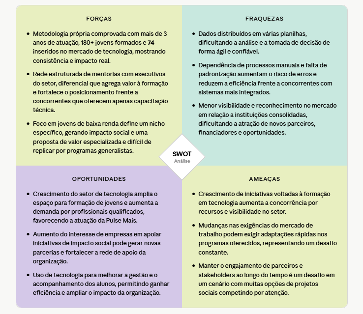<br>
  <p><b>Fonte:</b> Elaborado pelos autores, 2026</p>
</div>

&ensp;&ensp;&ensp;&ensp;**Forças** - O parceiro se diferencia de bootcamps gratuitos e programas governamentais por metodologia comprovada: 180 jovens formados, 74 empregados e retorno de R$ 2,71 por real investido.

&ensp;&ensp;&ensp;&ensp;**Fraquezas** - Dados descentralizados em planilhas dificultam análises e decisões. A visibilidade é limitada frente a instituições consolidadas, fraqueza que a organização busca superar.

&ensp;&ensp;&ensp;&ensp;**Oportunidades** - O setor de tecnologia em crescimento amplia parcerias. A centralização de dados pela plataforma representa a principal oportunidade de escalar o impacto com evidências concretas.

&ensp;&ensp;&ensp;&ensp;**Ameaças** - Iniciativas concorrentes disputam recursos. Com 39% das habilidades exigindo atualização até 2030, manter programas relevantes e engajamento de financiadores é um desafio.

### <a name="c2.1.3"></a>2.1.3. Solução 

&ensp;&ensp;&ensp;&ensp;**a) Problema a ser resolvido:** os dados dos alunos da Pulse Mais estão alocados em múltiplas planilhas dispersas e isoladas por projeto e ano, além de conversas no WhatsApp entre alunos e a equipe de operações. Essa dispersão impede o estabelecimento de um panorama macroscópico da jornada do jovem tanto dentro quanto fora da Pulse Mais, gera dependência e sobrecarga da memória individual da equipe, atrasa a consolidação de indicadores estratégicos, sobretudo de empregabilidade, e dificulta a análise de impacto a longo prazo.

&ensp;&ensp;&ensp;&ensp;**b) Dados disponíveis:**                                                                                        
&ensp;&ensp;&ensp;&ensp;&ensp;&ensp;b.1) TAPI (Termo de abertura de projeto Inteli);                                                                                            
&ensp;&ensp;&ensp;&ensp;&ensp;&ensp;b.2) Edital de seleção programa Pulse Mais 2026;                                                                                               
&ensp;&ensp;&ensp;&ensp;&ensp;&ensp;b.3) Site institucional Pulse Mais;                                                                                               
&ensp;&ensp;&ensp;&ensp;&ensp;&ensp;b.4) “Planilhão de jovens do Framework”.

&ensp;&ensp;&ensp;&ensp;**c) Solução proposta:** aplicação web centralizada que estabelecerá a Single Source of Truth (SSOT) da instituição. Essa plataforma, construída em HTML/CSS/JavaScript no front-end, Node.js no back-end e SQLite, contemplará repositório unificado, registro de jornada, prontuário digital com níveis de acesso, dashboard de indicadores, portal do aluno e filtros avançados de segmentação.

&ensp;&ensp;&ensp;&ensp;**d) Forma de utilização da solução:** a equipe interna utilizará a plataforma preponderantemente via computador para registrar frequência, atividades ministradas nos cursos, eventos, mentorias e indicadores de empregabilidade, com níveis de acesso diferenciados (gestão geral, coordenação, equipe operacional e psicólogo, este último com acesso restrito à saúde mental). Alunos e ex-alunos acessarão via celular ou computador para consultar e atualizar seus dados cadastrais e de perfil.

&ensp;&ensp;&ensp;&ensp;**e) Benefícios esperados:** com a centralização do prontuário do aluno em interface única, espera-se redução do tempo de busca por informações históricas, identificação precoce de riscos de evasão, decisões estratégicas baseadas em dados e não em percepção, melhoria da estratégia de empregabilidade, geração ágil de métricas para financiadores (custo por jovem formado, incremento de renda familiar, retorno por real investido) e fortalecimento da governança institucional.

&ensp;&ensp;&ensp;&ensp;**f) Critério de sucesso e como será avaliado:** a solução será considerada bem-sucedida se substituir com efetividade o "Planilhão" como fonte primária de dados, permitir a visualização integral da jornada dos alunos em uma única tela e gerar automaticamente os indicadores-chave no dashboard de monitoramento (jovens ativos, empregados ou bolsistas, índice de evasão, conectados, computadores doados). A avaliação ocorrerá em reuniões periódicas com os pontos focais da Pulse Mais ao final de cada sprint, mediante testes funcionais nas entregas.

### <a name="c2.1.4"></a>2.1.4. Value Proposition Canvas

&ensp;&ensp;&ensp;&ensp;O Canvas de Proposta de Valor a seguir mapeia a relação entre o perfil do cliente e a proposta de valor da aplicação web desenvolvida para a Pulse Mais, estruturado conforme o framework de Osterwalder et al. (2014). O objetivo é demonstrar o encaixe entre o problema central da organização, a fragmentação e descentralização dos dados dos jovens atendidos, e a solução proposta, uma plataforma web unificada que centraliza o registro, o monitoramento e a visualização integral da jornada de cada jovem. O cliente primário mapeado é a equipe interna da Pulse Mais, composta por gestores, coordenadores, assistentes e psicólogos voluntários, que hoje dependem de múltiplas planilhas isoladas e da memória individual dos colaboradores para operar a organização e tomar decisões estratégicas. A análise evidencia o alinhamento entre as dores operacionais da equipe, as tarefas que ela precisa realizar cotidianamente e os ganhos que a plataforma pode proporcionar em termos de eficiência, rastreabilidade e capacidade de demonstrar impacto social mensurável a doadores e investidores.Essa relação entre tarefas, dores e ganhos, bem como sua correspondência com as funcionalidades da solução proposta, pode ser visualizada de forma estruturada no Canvas de Proposta de Valor apresentado a seguir.

<div align="center">
  <p><b>Imagem 2 -</b> Canvas proposta de valor</p>
  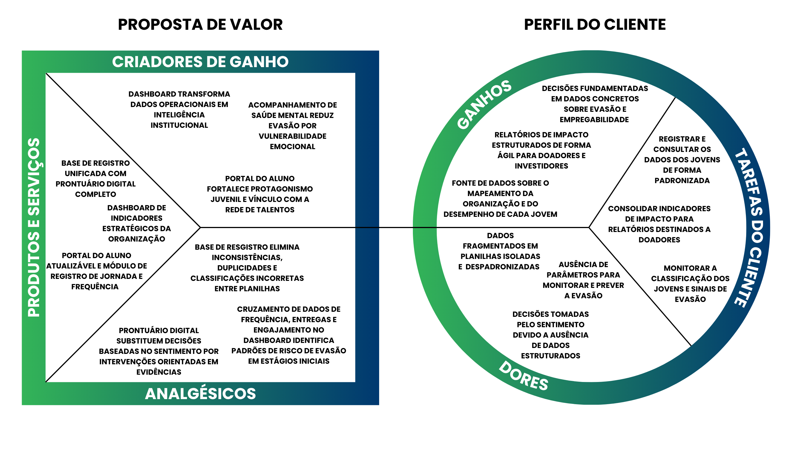<br>  
  <p><b>Fonte:</b> Elaborado pelos autores, 2026</p>
</div>

#### A. Perfil do cliente

&ensp;&ensp;&ensp;&ensp;O cliente primário da solução é a equipe interna da Pulse Mais, distribuída em gestão geral, que precisa de uma visão macro dos indicadores de impacto, a coordenação de projetos, responsável por acompanhar e intervir ativamente na jornada dos jovens, os assistentes e estagiários, que executam os registros operacionais do dia a dia e os psicólogos voluntários, que precisam de um espaço seguro para registrar observações sobre o bem-estar dos participantes. Além disso, o perfil inclui os próprios jovens e ex-alunos da rede, que acessariam a plataforma para manter seus dados atualizados e visualizar oportunidades. Em comum, todos esses perfis enfrentam hoje a mesma realidade, pautada na ausência de uma fonte única de verdade sobre os dados dos jovens, o que fragmenta o conhecimento institucional e compromete tanto a operação quanto a estratégia da organização.

**a) Tarefas do Cliente (Customer Jobs)**

&ensp;&ensp;&ensp;&ensp;As principais tarefas que a equipe da Pulse Mais busca realizar por meio da solução envolvem a gestão centralizada e contínua da jornada dos jovens atendidos pela organização em três níveis complementares. No nível operacional, a equipe precisa registrar dados cadastrais de forma padronizada, lançar presenças em aulas e eventos, confirmar entregas de atividades e anotar observações qualitativas sobre cada participante, tarefas hoje distribuídas entre múltiplas planilhas. No nível de acompanhamento, é necessário monitorar a classificação de cada jovem no framework da organização (conectado-capacitado-transformado), identificar sinais de risco de evasão e registrar observações de saúde mental com controle de acesso restrito. Já no nível estratégico, os gestores precisam consolidar indicadores-chave para relatórios de impacto destinados a doadores e investidores e acompanhar a trajetória pós-programa dos ex-alunos. Em síntese, a organização busca substituir uma operação baseada em planilhas dispersas por um sistema centralizado que permita decisões mais rápidas e embasadas em evidências.

**b) Dores (Pains)**

&ensp;&ensp;&ensp;&ensp;A dor central da Pulse Mais reside na fragmentação dos dados dos jovens, distribuídos em múltiplas planilhas isoladas por projeto e ano, sem padronização e frequentemente com dados contraditórios, como nomes duplicados, telefones desatualizados e classificações incorretas dentro do framework conectado-capacitado-transformado. Paralelamente, a ausência de parâmetros para cruzar dados inviabiliza o monitoramento efetivo da evasão, impedindo ações preventivas baseadas em evidências. Por fim, no campo da empregabilidade, a métrica mais estratégica da organização, as decisões ainda são tomadas majoritariamente pelo sentimento, pois não há registro estruturado sobre onde os jovens trabalham, qual sua remuneração ou se progrediram de aprendiz a efetivado.

**c) Ganhos (Gains)**

&ensp;&ensp;&ensp;&ensp;Os ganhos esperados pela equipe da Pulse Mais concentram-se, primeiramente, na conquista de uma fonte única de verdade sobre cada jovem, que elimine a dependência de planilhas dispersas e permita que qualquer colaborador acesse o histórico completo de um participante de forma imediata e confiável. Com essa centralização, espera-se que as decisões passem a ser fundamentadas em dados concretos, especialmente no que diz respeito à empregabilidade e ao risco de evasão. No nível operacional, a equipe busca ganhar agilidade no registro e na consulta de informações, dedicando mais atenção ao relacionamento com os jovens do que à administração de dados. Já no nível de impacto, a plataforma deve viabilizar relatórios estruturados para doadores com indicadores como custo por jovem formado e incremento de renda familiar, métricas hoje difíceis de consolidar. Por fim, o controle de acesso por perfil deve trazer segurança ao processo de registro, permitindo que gestores, psicológos e alunos operem em suas respectivas camadas de informação sem risco de exposição indevida, tornando a operação mais profissional e alinhada às boas práticas de governança que a organização busca consolidar.

#### B. Mapa de valor

&ensp;&ensp;&ensp;&ensp;O Mapa de Valor descreve como a aplicação web desenvolvida para a Pulse Mais cria valor concreto para sua equipe interna, estruturando a proposta em três dimensões complementares: os produtos e serviços que compõem a solução, os analgésicos que respondem diretamente aos problemas mapeados no perfil do cliente e os criadores de ganho que potencializam os resultados esperados pela organização. A solução é concebida como uma plataforma web centralizada, construída com HTML, CSS e JavaScript no front-end, Node.js no back-end e banco de dados SQLite, que substitui o ecossistema fragmentado de planilhas e conversas de mensagens por um sistema único, estruturado e acessível via desktop.

**a) Produtos e Serviços (Products & Services)**

&ensp;&ensp;&ensp;&ensp;A solução consiste em uma aplicação web centralizada que reúne em uma única interface todos os módulos necessários para gerir a jornada dos jovens da Pulse Mais do primeiro contato até o acompanhamento pós-programa. O núcleo é uma base de registro unificada que substitui as múltiplas planilhas em uso, consolidando dados pessoais, acadêmicos, de engajamento e de empregabilidade em um prontuário digital rastreável. Sobre essa base, têm-se um módulo de registro de jornada que permite lançar frequências, confirmar entregas de atividades e inserir anotações qualitativas, incluindo um espaço dedicado ao acompanhamento de saúde mental, onde psicólogos registram atualizações relevantes, indicam o nível de cuidado necessário e documentam encaminhamentos realizados. Além disso, a solução possui um dashboard de monitoramento que exibe de forma visual os indicadores estratégicos da organização (jovens ativos, empregados e bolsistas) e índice de evasão. Em conclusão, como entregáveis desejáveis, a solução prevê um módulo de comunicação para disparo de e-mails e automação de formulários cujas respostas alimentem o banco de dados.

**b) Analgésicos (Pain Relievers)**

&ensp;&ensp;&ensp;&ensp;A fragmentação dos dados é aliviada pela base de registro unificada, que elimina inconsistências de nomes duplicados, telefones desatualizados e classificações incorretas, garantindo que qualquer membro da equipe acesse a versão mais confiável do histórico de cada jovem. Já a dependência da memória dos colaboradores é aliviada pelo prontuário digital, que registra de forma padronizada todas as interações e marcos da jornada de cada participante, tornando o conhecimento institucional independente da rotatividade do time. A ausência de parâmetros para monitorar a evasão é aliviada, por sua vez, pelo cruzamento de dados de frequência, entregas e engajamento no dashboard, permitindo identificar padrões de risco em estágios iniciais e agir preventivamente. Ademais, a dificuldade de consolidar métricas de empregabilidade é aliviada por campos estruturados que registram onde o jovem trabalha, em qual modalidade (aprendiz, estagiário ou efetivado) e qual sua remuneração média, viabilizando pela primeira vez uma análise longitudinal do impacto real dos programas. Por fim, a exposição indevida de dados sensíveis é aliviada pelo controle de acesso por perfil, que garante que observações sensíveis permaneçam restritas aos responsáveis autorizados e que o fluxo entre gestão, psicólogo e aluno ocorra de forma segura.

**c) Criadores de Ganho (Gain Creators)**

&ensp;&ensp;&ensp;&ensp;Os ganhos da equipe da Pulse Mais são potencializados por elementos que criam capacidades organizacionais que a instituição ainda não possui. O dashboard de monitoramento de impacto transforma dados operacionais em inteligência institucional, permitindo decisões mais rápidas e a geração ágil de relatórios para doadores e investidores, fortalecendo a credibilidade da organização e sua capacidade de captação de recursos. Já o espaço estruturado de acompanhamento de saúde mental cria o ganho do cuidado integral e preventivo em que, ao registrar o nível de atenção que cada jovem necessita e os encaminhamentos realizados pelos psicólogos, a plataforma permite identificar vulnerabilidades emocionais antes que se convertam em evasão, conectando diretamente o bem-estar dos participantes à melhoria dos índices de retenção. Além disso, o controle de acesso por perfil cria o ganho da confiança institucional, profissionalizando a governança da organização e fortalecendo a cultura de transparência que a Pulse Mais elege como um de seus valores centrais. O portal do aluno, por fim, cria o ganho do protagonismo juvenil onde, ao visualizar seu histórico e se perceber como parte ativa de uma rede de talentos, o aluno tende a reforçar seu vínculo com a organização e a retornar futuramente como mentor ou multiplicador, ampliando o impacto da Pulse Mais de forma sustentável.

### <a name="c2.1.5"></a>2.1.5. Matriz de Riscos do Projeto

&ensp;&ensp;&ensp;&ensp;A Matriz de Riscos é uma ferramenta de gestão que permite classificar riscos conforme sua probabilidade de ocorrência e seu impacto potencial, facilitando a priorização de ações preventivas e corretivas. Neste projeto, os riscos envolvem dimensões técnicas, relacionadas ao desenvolvimento com HTML, CSS, JavaScript, Node.js e SQLite, operacionais, ligadas à migração e centralização de dados fragmentados e humanas, associadas à adesão da equipe da Pulse Mais e dos jovens à nova plataforma. A matriz a seguir permite identificar, classificar e planejar respostas concretas para minimizar impactos negativos, assegurando que a solução entregue cumpra os objetivos de centralização de dados, monitoramento de impacto e melhoria da gestão da jornada dos jovens atendidos pela organização.

<div align="center">
  <p><b>Imagem 3 -</b> Matriz de Riscos</p>
  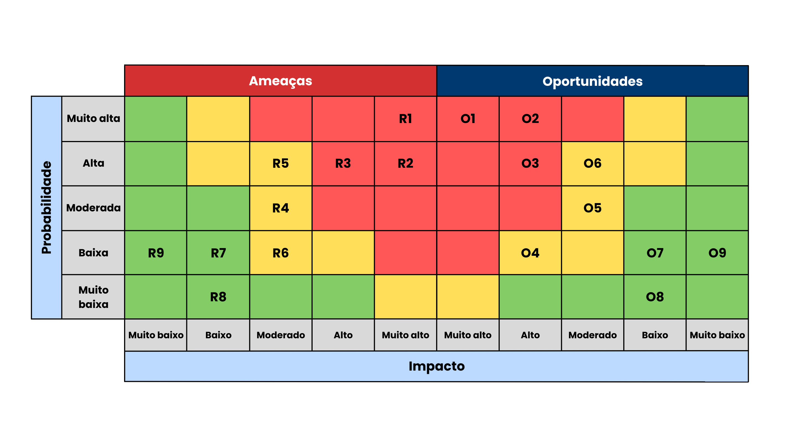<br>
  <p><b>Fonte:</b> Elaborado pelos autores, 2026</p>
</div>

#### A. Ameaças

&ensp;&ensp;&ensp;&ensp;As ameaças mapeadas neste projeto abrangem riscos de natureza técnica, operacional e humana, distribuídos entre diferentes níveis de criticidade. Os riscos vermelhos representam as ameaças com alta probabilidade de ocorrência combinada a impacto elevado sobre a entrega e o funcionamento da plataforma. Já os riscos amarelos possuem criticidade intermediária, exigindo monitoramento ativo. Por fim, os riscos verdes apresentam baixa probabilidade e baixo impacto, podendo ser gerenciados por rotinas periódicas de acompanhamento.

**a) Ameaças Vermelhas**

&ensp;&ensp;&ensp;&ensp;R1 - Inconsistência e perda de dados durante a migração das planilhas para o banco de dados.           
&ensp;&ensp;&ensp;&ensp;Os dados da Pulse Mais estão distribuídos em planilhas despadronizadas, com nomes duplicados e registros contraditórios. Uma migração mal executada pode resultar em perda de histórico ou sobrescrita incorreta de dados, comprometendo a confiabilidade da plataforma. A probabilidade é muito alta dado o estado atual das planilhas e o impacto é muito alto pois dados corrompidos inviabilizam toda a operação. O plano de ação é definir um dicionário de dados padronizado antes da migração, desenvolver um roteiro de importação com validações automáticas de integridade e realizar testes com dados anonimizados antes da importação definitiva, validando os resultados com a Pulse Mais.  
&ensp;&ensp;&ensp;&ensp;Probabilidade: Muito alta | Impacto: Muito alto

&ensp;&ensp;&ensp;&ensp;R2 - Baixa adesão da equipe interna da Pulse Mais à nova plataforma.                                 
&ensp;&ensp;&ensp;&ensp;A equipe está habituada a operar com planilhas e WhatsApp e a adoção de uma nova ferramenta exige mudança de comportamento. Sem engajamento ativo dos colaboradores, o sistema corre o risco de ser subutilizado logo após a entrega. A probabilidade é alta pois equipes pequenas e sobrecarregadas enfrentam resistência natural a mudanças de ferramenta e o impacto é muito alto pois a plataforma só gera valor se efetivamente utilizada. O plano de ação é conduzir ao menos duas sessões de teste de usabilidade com membros reais da equipe durante o desenvolvimento, coletar feedbacks estruturados e ajustar a interface com base nos resultados.                             
&ensp;&ensp;&ensp;&ensp;Probabilidade: Alta | Impacto: Muito alto

&ensp;&ensp;&ensp;&ensp;R3 - Divergência entre as expectativas da Pulse Mais e as funcionalidades entregues.                                
&ensp;&ensp;&ensp;&ensp;Em um projeto acadêmico desenvolvido em sprints com parceiro externo, requisitos levantados no kick-off podem ser interpretados de forma diferente, resultando em funcionalidades que não atendem ao fluxo operacional real, especialmente na classificação dos jovens no framework conectado-capacitado-transformado. A probabilidade é alta dado o contato pontual com o parceiro e o impacto é alto pois retrabalho nas sprints finais compromete a qualidade da entrega. O plano de ação é elaborar, a cada sprint, um documento descrevendo o comportamento esperado de cada funcionalidade e reservar momento nas sprint reviews para validação prática com a Pulse Mais.                                 
&ensp;&ensp;&ensp;&ensp;Probabilidade: Alta | Impacto: Alto 

**b) Ameaças Amarelas** 

&ensp;&ensp;&ensp;&ensp;R4 - Interface do dashboard não atendendo às necessidades reais da equipe gestora.                   
&ensp;&ensp;&ensp;&ensp;Indicadores mal escolhidos ou visualizações confusas podem tornar o dashboard subutilizado, fazendo com que a gestão continue recorrendo a processos manuais. A probabilidade é moderada pois os indicadores foram levantados no kick-off mas sua apresentação depende de validação e o impacto é moderado pois o núcleo da plataforma permanece funcional, mas a proposta de valor estratégica é reduzida. O plano de ação é apresentar um protótipo navegável do dashboard à equipe gestora ao menos uma sprint antes da implementação definitiva e ajustar indicadores e filtros com base nos feedbacks coletados.                                                                   
&ensp;&ensp;&ensp;&ensp;Probabilidade: Moderada | Impacto: Moderado 

&ensp;&ensp;&ensp;&ensp;R5 - Baixa adesão dos jovens ao portal do aluno por barreiras de usabilidade.         
&ensp;&ensp;&ensp;&ensp;O público da Pulse Mais acessa a internet predominantemente pelo celular e em condições de conectividade variável. Uma interface não responsiva pode resultar em abandono imediato do portal. A probabilidade é alta pois o desenvolvimento focado em desktop é o caminho natural de uma equipe acadêmica e o impacto é moderado pois a subutilização do portal aumenta o trabalho manual da equipe sem comprometer o núcleo da plataforma. O plano de ação é conduzir testes de usabilidade com ao menos três jovens do público-alvo antes da entrega final e implementar ajustes de responsividade com base nos resultados.  
&ensp;&ensp;&ensp;&ensp;Probabilidade: Alta | Impacto: Moderado

&ensp;&ensp;&ensp;&ensp;R6 - Tempo de carregamento elevado em dispositivos com conexão instável.        
&ensp;&ensp;&ensp;&ensp;Um front-end com imagens não otimizadas ou ausência de estados de carregamento pode gerar experiência lenta para usuários com conectividade variável, aumentando o risco de abandono da plataforma. A probabilidade é baixa pois otimização de performance raramente é priorizada em projetos acadêmicos e o impacto é moderado pois prejudica a experiência sem impedir o funcionamento. O plano de ação é realizar testes de carregamento simulando conexões lentas durante o desenvolvimento e implementar estados de carregamento visuais para evitar percepção de travamento.  
&ensp;&ensp;&ensp;&ensp;Probabilidade: Baixa | Impacto: Moderado

**c) Ameaças Verdes**

&ensp;&ensp;&ensp;&ensp;R7 - Bugs pontuais que permitam acesso a rotas não previstas.                        
&ensp;&ensp;&ensp;&ensp;Inconsistências no roteamento do front-end podem permitir acesso a páginas em estados inesperados sem comprometer o funcionamento geral. A probabilidade é baixa pois a equipe realiza revisões antes de cada integração e o impacto é baixo pois esses casos não afetam a integridade dos dados. O plano de ação é implementar rota de redirecionamento padrão para páginas não encontradas e testar navegação forçada em rotas não mapeadas antes de cada sprint     
&ensp;&ensp;&ensp;&ensp;Probabilidade: Baixa | Impacto: Baixo

&ensp;&ensp;&ensp;&ensp;R8 - Inconsistência entre a terminologia da interface e o vocabulário interno da Pulse Mais.                                      
&ensp;&ensp;&ensp;&ensp;Termos definidos durante o desenvolvimento podem não corresponder ao vocabulário consolidado pela organização, gerando confusão e aumentando a curva de adaptação. A probabilidade é muito baixa pois os termos centrais foram levantados no kick-off e o impacto é baixo pois trata-se de um ajuste superficial sem consequência sobre os dados. O plano de ação é revisar com a Pulse Mais os termos utilizados na interface na sprint review intermediária e realizar os ajustes necessários antes da entrega final.                          
&ensp;&ensp;&ensp;&ensp;Probabilidade: Muito baixa | Impacto: Baixo

&ensp;&ensp;&ensp;&ensp;R9 - Distorção de elementos visuais em resoluções de tela não testadas.                                   
&ensp;&ensp;&ensp;&ensp;Em dispositivos fora do padrão de desenvolvimento, elementos da interface podem se desalinhar ou perder legibilidade. A probabilidade é baixa pois a equipe realizará testes em diferentes resoluções e o impacto é muito baixo pois afeta apenas a estética sem comprometer funcionalidades ou dados. O plano de ação é adotar unidades relativas e breakpoints de responsividade desde o início do front-end e realizar testes visuais antes da entrega  
&ensp;&ensp;&ensp;&ensp;Probabilidade: Baixa | Impacto: Muito baixo

#### B. Oportunidades

&ensp;&ensp;&ensp;&ensp;As oportunidades mapeadas neste projeto representam eventos com potencial de impacto positivo sobre a solução e sobre a própria Pulse Mais, situações que podem gerar resultados além do esperado e ampliar significativamente o valor entregue pela plataforma. Assim como as ameaças, elas foram classificadas com base em probabilidade de ocorrência e impacto potencial, além de serem acompanhadas de planos de ação concretos para maximizar seu aproveitamento. As oportunidades vermelhas representam aquelas com alta probabilidade de ocorrência combinada a impacto elevado, capazes de transformar a plataforma de uma solução operacional em uma estratégia de longo prazo para a organização. Já as oportunidades amarelas possuem potencial relevante, mas dependem de condições externas ou de decisões que estão parcialmente fora do controle da equipe. Por fim, as oportunidades verdes, representam ganhos pontuais e complementares que enriquecem a entrega sem alterar seu escopo central.

**a) Oportunidades Vermelhas**

&ensp;&ensp;&ensp;&ensp;O1 - Consolidação da plataforma como ferramenta permanente de gestão da Pulse Mais.                                    
&ensp;&ensp;&ensp;&ensp;Por resolver um problema real e crítico da organização, a plataforma possui alto potencial de ser adotada permanentemente após o encerramento do projeto acadêmico. A probabilidade é muito alta pois a Pulse Mais não possui alternativa tecnológica estruturada e demonstrou forte motivação para resolver esse problema e o impacto é muito alto pois a adoção permanente transforma o trabalho da equipe em um legado institucional concreto. O plano de ação é entregar documentação de uso acessível a não-desenvolvedores e estruturar o código de forma modular para facilitar evoluções futuras por outras equipes ou desenvolvedores voluntários.          
&ensp;&ensp;&ensp;&ensp;Probabilidade: Muito alta | Impacto: Muito alto 

&ensp;&ensp;&ensp;&ensp;O2 - Uso dos dados centralizados para embasar o planejamento estratégico orientado por dados da Pulse Mais.                                       
&ensp;&ensp;&ensp;&ensp;A plataforma cria pela primeira vez a infraestrutura de dados necessária para que as metas da organização sejam monitoradas com base em evidências concretas. A probabilidade é alta pois os objetivos estratégicos da Pulse Mais dependem diretamente dos dados que a plataforma consolida e o impacto é muito alto pois posiciona a solução como motor de inteligência institucional que sustenta decisões estratégicas nos próximos anos. O plano de ação é mapear quais indicadores do planejamento estratégico podem ser alimentados pela plataforma e garantir que o dashboard os contemple como campos prioritários desde a primeira versão entregue.                                
&ensp;&ensp;&ensp;&ensp;Probabilidade: Alta | Impacto: Muito alto

&ensp;&ensp;&ensp;&ensp;O3 - Fortalecimento da credibilidade da Pulse Mais perante doadores por meio de relatórios de impacto gerados pela plataforma.                                 
&ensp;&ensp;&ensp;&ensp;A plataforma viabiliza a geração de relatórios com métricas qualitativas, como custo por jovem formado e incremento de renda familiar, muito mais precisos do que os produzidos atualmente. A probabilidade é alta pois os campos necessários estão previstos no MVP e o impacto é alto pois relatórios mais robustos fortalecem diretamente a capacidade de captação de recursos da organização. O plano de ação é validar com a Pulse Mais quais métricas são prioritárias para doadores e garantir que o dashboard permita exportar ou visualizar essas informações de forma clara.    
&ensp;&ensp;&ensp;&ensp;Probabilidade: Alta | Impacto: Alto

**b) Oportunidades Amarelas**

&ensp;&ensp;&ensp;&ensp;O4 - Ampliação do escopo da plataforma para outros programas e iniciativas da Pulse Mais.                                      
&ensp;&ensp;&ensp;&ensp;A arquitetura modular da plataforma abre possibilidade de expansão para outros contextos operacionais, como o gerenciamento da rede de mentores voluntários. A probabilidade é baixa pois depende de decisão estratégica da organização e disponibilidade técnica após o encerramento do projeto e o impacto é alto pois tornaria a plataforma o centro de toda a operação institucional. O plano de ação é estruturar o banco de dados com arquitetura extensível e documentar sugestões concretas de funcionalidades feitas em ciclos futuros.             
&ensp;&ensp;&ensp;&ensp;Probabilidade: Baixa | Impacto: Alto 

&ensp;&ensp;&ensp;&ensp;O5 - Utilização da plataforma como modelo de referência para outras ONGs com desafios similares.                               
&ensp;&ensp;&ensp;&ensp;Uma plataforma bem documentada e modular pode despertar o interesse de outras organizações sem fins lucrativos que enfrentam o mesmo problema de fragmentação de dados. A probabilidade é moderada pois depende de como a plataforma será divulgada após a entrega e o impacto é moderado pois não altera o produto, mas amplia o reconhecimento do projeto. O plano de ação é documentar o projeto de forma estruturada no repositório e registrar métricas de uso após a entrega para compor um caso de uso concreto e replicável.                
&ensp;&ensp;&ensp;&ensp;Probabilidade: Moderada | Impacto: Moderado 

&ensp;&ensp;&ensp;&ensp;O6 - Geração de percepções sobre padrões de evasão para intervenções preventivas estruturadas.                              
&ensp;&ensp;&ensp;&ensp;À medida que a plataforma acumula dados históricos, torna-se possível identificar combinações de fatores que precedem o abandono dos programas, informação que a organização hoje não possui de forma sistematizada. A probabilidade é moderada pois depende de uso consistente por ao menos um ciclo completo de programa e o impacto é alto pois reduzir a evasão é um dos objetivos estratégicos centrais da Pulse Mais. O plano de ação é estruturar os campos de frequência e engajamento de forma padronizada e historicizada, garantindo que os dados sejam comparáveis entre programas diferentes.                          
&ensp;&ensp;&ensp;&ensp;Probabilidade: Moderada | Impacto: Alto

**c) Oportunidades Verdes**

&ensp;&ensp;&ensp;&ensp;O7 - Redução do tempo gasto pela equipe em tarefas administrativas repetitivas.                                
&ensp;&ensp;&ensp;&ensp;A automação de formulários prevista como entregável desejável pode reduzir gradualmente o trabalho manual de entrada e consulta de informações. A probabilidade é baixa pois depende da adoção consistente da plataforma e da implementação dos módulos de automação e o impacto é baixo pois trata-se de um benefício incremental que não altera estruturalmente a capacidade operacional. O plano de ação é priorizar a automação nas sprints finais caso o MVP seja entregue no prazo e validar com a equipe quais tarefas consomem mais tempo para direcionar os esforços estrategicamente.                        
&ensp;&ensp;&ensp;&ensp;Probabilidade: Baixa | Impacto: Baixo

&ensp;&ensp;&ensp;&ensp;O8 - Fortalecimento do vínculo dos jovens com a Pulse Mais por meio do portal do aluno.                                      
&ensp;&ensp;&ensp;&ensp;Ao visualizar seu histórico de jornada, os jovens podem desenvolver senso de pertencimento e manter relação mais ativa com a organização após os programas. A probabilidade é muito baixa pois depende de engajamento espontâneo além do uso instrumental da ferramenta e o impacto é baixo pois é um benefício complementar sem influência direta nos indicadores operacionais. O plano de ação é incluir uma seção de linha do tempo da jornada no portal do aluno e validar com ao menos dois jovens durante os testes de usabilidade se essa funcionalidade gera percepção positiva de pertencimento.                     
&ensp;&ensp;&ensp;&ensp;Probabilidade: Muito baixa | Impacto: Baixo

&ensp;&ensp;&ensp;&ensp;O9 - Valorização do portfólio técnico dos membros da equipe pela parceria com organização de impacto social real.                                       
&ensp;&ensp;&ensp;&ensp;O desenvolvimento para um parceiro real com problema concreto representa experiência de portfólio mais rica do que projetos puramente acadêmicos. A probabilidade é baixa pois depende de como cada membro documenta sua contribuição individualmente e o impacto é muito baixo pois se concentra na dimensão profissional de cada integrante sem influência sobre o produto. O plano de ação é manter o repositório bem documentado ao longo do desenvolvimento e orientar os membros a descrever suas contribuições de forma clara e mensurável em seus perfis profissionais.                       
&ensp;&ensp;&ensp;&ensp;Probabilidade: Baixa | Impacto: Muito baixo

## <a name="c2.2"></a>2.2. Personas

### Joana Moura

&ensp;&ensp;&ensp;&ensp;Joana Moura está em um cargo de gestão dentro do projeto. Sua maior dificuldade no processo realizado todos os dias no trabalho é a descentralização dos arquivos e informações.

<div align="center">
  <p><b>Imagem 4 -</b> Persona 1</p>
  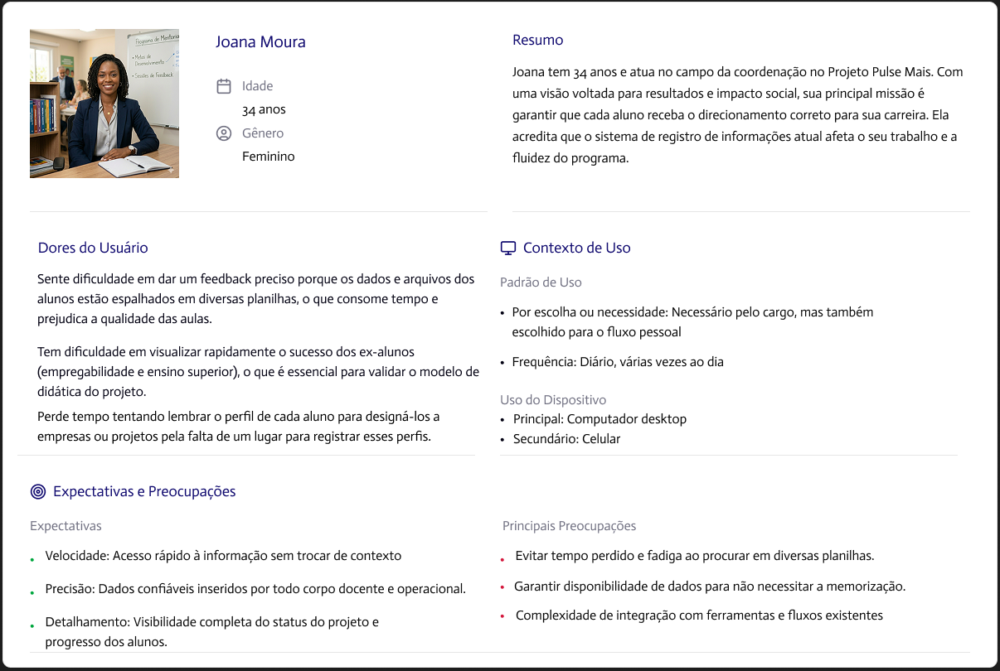<br>
  <p><b>Fonte:</b> Elaborado pelos autores, 2026</p>
</div>

### Diego Goia

&ensp;&ensp;&ensp;&ensp;Recém formado, Diego Goia trabalha como voluntário no Projeto Pulse Mais, tendo realizado o treinamento requerido pelo Projeto, a capacitação não é uma dúvida e seu trabalho apresenta resultados positivos. O fator que mais impede uma maior produtividade é o fato de que os registros das consultas são realizados e armazenados de forma analógica, ou seja, no papel.

<div align="center">
  <p><b>Imagem 5 -</b> Persona 2</p>
  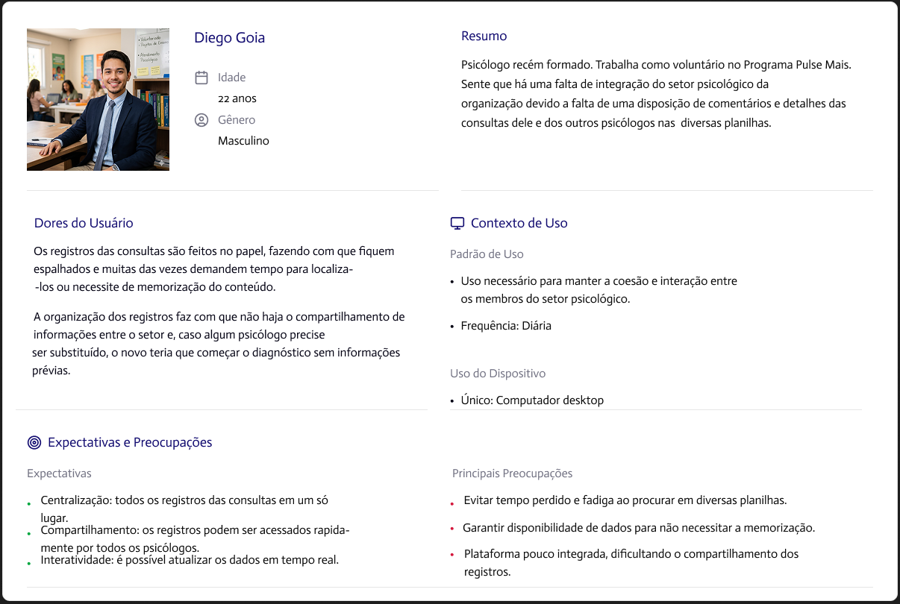<br>
  <p><b>Fonte:</b> Elaborado pelos autores, 2026</p>
</div>

### Henrique Vieira

&ensp;&ensp;&ensp;&ensp;Henrique, aluno do Projeto Pulse Mais, acredita que os cursos diponibilizados estão contribuindo em alavancar sua carreira no mercado de trabalho. Seu maior problema é o fato de que, quando trocou de número de celular, não recebeu nenhuma mensagem da Instituição por algumas semanas.

<div align="center">
  <p><b>Imagem 6 -</b> Persona 3</p>
  <br>
  <p><b>Fonte:</b> Elaborado pelos autores, 2026</p>
</div>

### Gabriela Almeida

&ensp;&ensp;&ensp;&ensp;Atuando como gestora na Pulse Mais, Gabriela se empenha em garantir o desenvolvimento individual dos alunos, fornecendo ajuda sempre que necessário e, sobretudo, prevenindo possíveis evasões. A desorganização dos dados dificulta a identificação de casos de evasão já que a análise se torna obsoleta e imprecisa devido à falta de centralização das planilhas. 

<div align="center">
  <p><b>Imagem 7 -</b> Persona 4</p>
  <br>
  <p><b>Fonte:</b> Elaborado pelos autores, 2026</p>
</div>

### Daniel Souza

&ensp;&ensp;&ensp;&ensp;Mentor do Projeto Pulse mais com foco em backend, atua como voluntário há um ano e conduz encontros a recorrentes a partir do terceiro módulo do programa. Como não tem históricos das mentorias, as vezes não consegue partir do ponto em que parou e pode acabar repetindo assuntos que já havia falado ou pular informações por achar que já as passou.

<div align="center">
  <p><b>Imagem 8 -</b> Persona 5</p>
  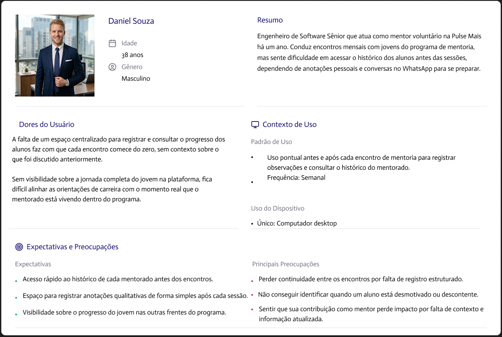<br>
  <p><b>Fonte:</b> Elaborado pelos autores, 2026</p>
</div>

## <a name="c2.3"></a>2.3. User Stories 

Identificação | US01
--- | ---
Persona | Joana Moura
User Story | "Como coordenadora, eu quero visualizar as informações e planilhas dos alunos, para que eu possa fornecer aos docentes um feedback mais assertivo e qualificado para o desenvolvimento dos alunos."
Critério de aceite 1 | CR1: Dado que estou na tela do aluno, quando clico em "Arquivos", então vejo a lista de documentos.
Critério de aceite 2 | CR2: Dado que os arquivos ainda não foram adicionados, quando clico em "Arquivos", então o sistema exibe a mensagem "Nenhum documento encontrado".
Critérios INVEST | **I:** o acesso das informações arquivadas depende apenas da entrada do usuário no site, isto é, visualizar as informações não está atrelado a outra história. <br><br> **N:** a via de acesso dessas informações pode ser alterada para melhorar a experiência do usuário. <br><br> **V:** esta história traz a habilidade do usuário de acessar arquivos em um só lugar, solucionando uma das dores do cliente e agregando valor ao projeto. <br><br> **E:** A história possui clareza técnica e funcional suficiente para que o time de desenvolvimento consiga mensurar o esforço necessário. Permite que a equipe atribua uma pontuação sem grandes incertezas. <br><br> **S:** a história contempla apenas uma feature do projeto que pode ser implementada em apenas uma sprint sem sobrecarga do time. <br><br> **T:** é possível realizar uma análise sobre caso foi possível acessar os arquivos ou não, ou seja, de forma binária.

Identificação | US02
--- | ---
Persona | Joana Moura
User Story | "Como coordenadora, eu quero registrar a presença dos alunos, para que eu consiga acompanhar o desenvolvimento deles."
Critério de aceite 1 | CR1: Dado que estou na home page, quando clico na aula, então o sistema permite definir o status do aluno naquele momento como presente.
Critério de aceite 2 | CR2: Dado que estou na home page, quando clico na aula, então o sistema permite definir o status do aluno naquele momento como ausente.
Critério de aceite 3 | CR3: Dado que estou na home page, quando clico em uma aula que ainda não foi registrada como "ministrada", então o sistema retorna com uma mensagem de "aula pendente".
Critérios INVEST | **I:** o acesso as aulas não necessita de outras dependências, como arquivos e relatórios psicológicos, podendo ser acessadas a qualquer momento pelo corpo docente. <br><br> **N:** a via de acesso dessas informações pode ser alterada para melhorar a experiência do usuário, seja para reduzir a quantidade de acessos realizados diretamente pela home page ou tornar a interface mais amigável. <br><br> **V:** esta história ilustra uma funcionalidade crucial e rapidamente acessível. Essa solução ameniza a dor do cliente e adiciona valor ao projeto. <br><br> **E:** o caminho a ser desenvolvido no sistema está explícito na história, isso significa que os desenvolvedores não terão problemas em dividir as etapas e funções. <br><br> **S:** uma única capacidade do produto está sendo documentada nessa história, algo alcançável em um curto período de desenvolvimento. <br><br> **T:** é possível analisar, binariamente, os resultados da funcionalidade.

Identificação | US03
--- | ---
Persona | Henrique Vieira
User Story | "Como aluno, quero alterar minhas informações de contato diretamente na plataforma, para que eu possa receber atualizações e frequentar consultas à distância sem dificuldades"
Critério de aceite 1 | CR1: Dado que estou na área do aluno, quando clico no meu perfil, então o sistema dispõe os dados cadastrais e de contato.
Critério de aceite 2 | CR2: Dado que estou no perfil, quando seleciono a opção de editar, então o sistema possibilita a atualização das informação.
Critério de aceite 3 | CR3: Dado que estou na seção de editar, quando realizo alguma mudança nas informações, então o sistema deve verificar se a formatação dos dados está correta.
Critério de aceite 4 | CR4: Dado que a alteração foi salva, quando retorno ao perfil, então o sistema apresenta os dados atualizados.

Identificação | US04
--- | ---
Persona | Joana Moura
User Story | "Como coordenadora, eu quero achar os alunos com base em seus perfis, para que eu possa designa-los a trabalhos e projetos que mais se adequem a eles."
Critério de aceite 1 | CR1: Dado que estou na home page, quando clico na ferramenta de pesquisa, então o sistema possibilita filtrar os alunos por caracterísiticas.
Critério de aceite 2 | CR2: Dado que estou nas opções de filtro, quando seleciono uma característica, então o sistema apresenta apenas os alunos com essas características.
Critério de aceite 3 | CR3: Dado que estou nas opções de filtro, quando seleciono um conjunto de características que nenhum aluno apresenta, então o sistema retorna uma mensagem de "não há um aluno com essas características".
Critérios INVEST | **I:** o filtro pode ser acessado a qualquer na home page momento pelo corpo docente. <br><br> **N:** pode haver a criação de novas áreas anteriores ao filtro acesso para melhorar a experiência do usuário e tornar a interface mais amigável. <br><br> **V:** a presença de um filtro pode, ao permitir que os alunos sejam direcionados para os melhores projetos para eles, facilitar e promover o desenvolvimento do aluno. <br><br> **E:** a adição do filtro possui parâmetros muito claros. Sendo assim, a compreensão de como dividir as tarefas não é um problema. <br><br> **S:** a feature, apesar de agregar muito valor e potencial ao projeto, mantém-se simples e direta. <br><br> **T:** os parâmetros podem ser testados facilmente para analisar se o filtro apresenta os resultados corretos.

Identificação | US05
--- | ---
Persona | Gabriela Almeida
User Story | "Como gestora, quero visualizar o histórico completo de cada jovem em uma única tela, para que eu possa acompanhar sua evolução sem precisar consolidar informações de planilhas diferentes"
Critério de aceite 1 | CR1: Dado que estou na área da gestão, quando acesso o perfil de um jovem, então o sistema exibe em uma única tela seu histórico de frequência, desempenho e bem-estar de forma organizada.
Critério de aceite 2 | CR2: Dado que estou visualizando o painel de um jovem, quando há indicadores de baixo engajamento, então o sistema destaca automaticamente esses dados para facilitar a identificação de risco de evasão.
Critério de aceite 3 | CR3: Dado que estou na área da gestão, quando acesso o histórico de um jovem, então o sistema exibe as informações atualizadas em tempo real sem necessidade de consolidação manual.
Critérios INVEST | **I:** a tela de histórico pode ser acessada de forma independente pela orientadora a partir do perfil de cada jovem. <br><br> **N:** o formato de exibição dos dados e os critérios de destaque para risco de evasão podem ser ajustados conforme o feedback das orientadoras. <br><br> **V:** a consolidação automática das informações elimina o trabalho manual com planilhas e permite identificar precocemente jovens em risco de evasão. <br><br> **E:** os elementos da tela (frequência, desempenho e bem-estar) são bem delimitados, facilitando a divisão e estimativa das tarefas de desenvolvimento. <br><br> **S:** a funcionalidade mantém-se enxuta, focada apenas na visualização consolidada e nos destaques automáticos. <br><br> **T:** os dados exibidos e os alertas de baixo engajamento podem ser testados a partir de perfis de jovens com diferentes cenários de histórico.

Identificação | US06
--- | ---
Persona | Joana Moura
User Story | "Como coordenadora, eu quero visualizar indicadores de impacto social, para que eu possa avaliar a eficácia da metodologia e ajustar minha didática para impulsionar as carreiras dos estudantes."
Critério de aceite 1 | CR1: Dado que estou na home page, quando clico na aba de monitoramento de impacto, então o sistema dispõe de dados de quantos ex-alunos estão trabalhando e quantos estão no ensino superior.
Critério de aceite 2 | CR2: Dado que os dados de impacto ainda não foram processados ou estão vazios, quando acesso a aba, então o sistema exibe a mensagem "Dados em processamento ou indisponíveis no momento".
Critérios INVEST | **I:** A visualização desses indicadores não impede o funcionamento de outras áreas (como presença ou arquivos), podendo ser desenvolvida como um módulo à parte. <br><br> **N:** Os tipos de indicadores (ex: tipos de cursos superiores ou setores de emprego) podem ser discutidos e alterados durante o refinamento para melhor atender à necessidade da Joana. <br><br> **V:** Fornece prova social e métricas de sucesso, fundamentais para a melhoria do projeto e para a captação de novos parceiros. <br><br> **E:** A história possui clareza sobre quais dados buscar, permitindo ao time mensurar o esforço de criação da interface e da lógica de contagem de dados. <br><br> **S:** Trata-se de uma tela de consulta de dados específicos, o que a torna realizável dentro de uma única sprint. <br><br> **T:** É possível validar se os números exibidos na tela correspondem fielmente aos dados presentes no banco de dados.

| Identificação | US07 
 --- | --- 
Persona | Daniel Souza 
User Story | "Como mentor, quero acessar o histórico dos meus mentorados antes das sessões, para que eu possa me preparar com contexto e sem depender de anotações pessoais ou conversas no WhatsApp" |
| Critério de aceite 1 | CR1: Dado que estou na área do mentor, quando acesso o perfil de um mentorado, então o sistema exibe o histórico completo de sessões anteriores com datas e tópicos discutidos.
Critério de aceite 2 | CR2: Dado que estou visualizando o histórico do mentorado, quando há mais de uma sessão registrada, então o sistema organiza as informações em ordem cronológica. 
Critério de aceite 3 | CR3: Dado que estou na área do mentor, quando acesso o perfil de um mentorado, então o sistema exibe as anotações registradas nas sessões anteriores de forma clara e acessível. 

Identificação | US08
--- | ---
Persona | Diego Goia
User Story | "Como psicólogo, quero confidencialidade nos dados da minha função que são disponibilizados para outros setores, para que não haja a possibilidade de acontecer uma quebra de sigilo ou um vazamento de informações pessoais."
Critério de aceite 1 | CR1: Dado que estou no portal do psicólogo, quando adiciono alguma planilha, então o sistema só expõe os dados para usuários com o meu mesmo cargo.
Critério de aceite 2 | CR2: Dado que outro setor está selecionando portal para entrar, quando essa pessoa clica em psicólogo, então o sistema bloqueia a visibilidade dos dados para esse usuário.
Critérios INVEST | **I:** a confidencialidade está presente a todo momento enquato o usuário navega pelo site, tornando privado a depender do nível e setor de acesso. <br><br> **N:** o momento de bloqueio do usuário pode ser alterado para antes mesmo de ele conseguir acessar o portal do psicólogo, ou depois, após reavaliação dos membros e a parceira. <br><br> **V:** o sigilo promovido pelo sistema é um dos requisitos inegociáveis ao se adicionar possíveis informações importantes, sendo uma das features mais importantes e valorosas do projeto.  <br><br> **E:** a implementação dessa feature é, em sua maior parte, apenas um remanejamento e especificação do banco de dados, isso quer dizer que a equipe de desenvolvimento consegue separar esse processo com facilidade. <br><br> **S:** as tasks não devem apresentar duração maior que 2 momentos de desenvolvimento (4 horas), sendo totalmente realizável em uma sprint. <br><br> **T:** é possível testar se os dados são disponibilizados sem o nível de acesso necessário.

Identificação | US09
--- | ---
Persona | Diego Goia
User Story | "Como membro do setor psicológico, quero que as alterações nos prontuários sejam vistas por todos do setor em tempo real, para haja uma maior colaboração e a comunicação seja ausente de ruídos."
Critério de aceite 1 | CR1: Dado que dois membros do setor estão em um mesmo relatório, quando o primeiro usuário faz uma atualização, então o sistema Alerta o segundo que a página precisa ser atualizada.
Critério de aceite 2 | CR2: Dado que a mensagem apareceu, quando atualizo a página, então é possível ver as alterações.
Critérios INVEST | **I:** a história foca no aspecto "ao vivo" da página e independe de disposição das consultas. <br><br> **N:** a forma de notificação do sistema pode ser negociada com o time de desenvolvimento. <br><br> **V:** permite o compartilhamento e o fluxo de informações dentro do setor, tornando-o mais ágil e eficiente e evita sobreposição e possível perda de informações. <br><br> **E:** a adição de um sistema de notificação não apresenta complexidade suficiente para incapacitar seu desenvolvimento em uma sprint.  <br><br> **S:** Trata-se de uma tela de consulta de dados específicos, o que a torna realizável dentro de uma única sprint.  <br><br> **T:** é possível testar ao abrir o mesmo relatório em duas máquinas e uma delas realiza uma alteração no documento.

Identificação | US10
--- | ---
Persona | Henrique Vieira
User Story | "Como aluno, quero receber notícias de eventos dentro da plataforma, para que o canal de informações seja mais claro e prático"
Critério de aceite 1 | CR1: Dado que estou na área do aluno, quando clico na aba de notificações, então o sistema apresenta os eventos programados e suas datas.
Critério de aceite 2 | CR2: Dado que um evento foi adicionado, quando acesso a área do aluno, então o sistema me notifica com alguma marcação que houve uma adição aos eventos.
Critério de aceite 3 | CR3: Dado que estou na aba de notificações, quando seleciono um evento, então o sistema disponibiliza um breve resumo com informações sobre o mesmo.

Identificação | US011
--- | ---
Persona | Henrique Vieira
User Story | "Como aluno, quero visualizar meu próximo compromisso já na home page, para que não haja a possibilidade de esquecimento"
Critério de aceite 1 | CR1: Dado que entrei no site, quando a home page termina de carregar, então o sistema mostra um card com a minha próxima consulta e a data.
Critério de aceite 2 | CR2: Dado que estou na home page, quando acesso o card da consulta, então o sistema apresenta informações como data e orientador.

Identificação | US12
--- | ---
Persona | Diego Goia
User Story | "Como psicólogo, quero realizar o relatório digital das consultas diretamente na plataforma, para que o processo de registro seja mais rápido, acessível e independente de papéis ou memorização"
Critério de aceite 1 | CR1: Dado que estou realizando uma consulta, quando eu preencher o campo de relatório e salvar, então o sistema deve guardar esse registro no perfil do aluno.
Critério de aceite 2 | CR2: Dado que o relatório foi salvo, quando acesso as informações do aluno na área do psicólogo, então é possível rever tudo que foi anotado.
Critérios INVEST | **I:** o módulo da criação de registros não precisa, necessariamente, de ferramentas de filtro ou de ordem definida. <br><br> **N:** os campos ou tópicos do relatório podem ser reavaliados perante decisões conjuntas com a parceira. <br><br> **V:** elimina o fator papel que está presente no padrão de registro atual e evita perda de tempo em procura ou memorização de informações. <br><br> **E:** o desenvolvimento de um formulário de entrada de dados com persistência em banco de dados é bem compreendido pelo time.  <br><br> **S:** foca em apenas uma forma de entrada de dados, algo alcançável dentro de duas semanas. <br><br> **T:** É possível verificar se o texto inserido no formulário foi corretamente salvo no banco de dados.

Identificação | US13
--- | --- 
Persona | Daniel Souza 
User Story | "Como mentor, quero registrar anotações qualitativas após cada sessão de mentoria, para que eu mantenha continuidade entre os encontros e acompanhe a evolução do mentorado" |
Critério de aceite 1 | CR1: Dado que finalizei uma sessão de mentoria, quando acesso a área de registro, então o sistema me permite adicionar anotações sobre o encontro de forma simples e rápida. 
Critério de aceite 2 | CR2: Dado que registrei uma anotação, quando acesso o perfil do mentorado novamente, então o sistema exibe a anotação vinculada à sessão correspondente. 
Critério de aceite 3 | CR3: Dado que estou registrando uma anotação, quando identifico sinais de desmotivação no mentorado, então o sistema me permite sinalizar esse estado para acompanhamento futuro.

Identificação | US14 
--- | --- 
Persona | Gabriela Almeida
User Story | "Como gestora, quero salvar os registros de gestão, para que eu mantenha um histórico estruturado e não perca informações importantes dos registros anteriores" 
Critério de aceite 1 | CR1: Dado que finalizei uma análise de gestão, quando acesso a área de registro, então o sistema me permite salvar os registros das planilhas de forma simples e vinculada ao perfil do jovem. 
Critério de aceite 2 | CR2: Dado que salvei um registro, quando acesso o perfil do jovem novamente, então o sistema exibe o histórico de anotações organizadas por data de atendimento.


# <a name="c3"></a>3. Projeto da Aplicação Web 

## <a name="c3.1"></a>3.1. Requisitos do Sistema 

&ensp;&ensp;&ensp;&ensp;Os requisitos do sistema definem o que a aplicação deve fazer, como deve se comportar e dentro de quais regras deve operar. São organizados em requisitos funcionais, não funcionais e regras de negócio. A `Matriz RF => RN => Endpoint` conecta essas camadas, relacionando cada funcionalidade às suas regras e ao endpoint de API correspondente.

### <a name="c3.1.1"></a>3.1.1. Requisitos Funcionais 

&ensp;&ensp;&ensp;&ensp;Esta seção apresenta os Requisitos Funcionais da plataforma web. Eles definem os comportamentos concretos e verificáveis que o sistema deve executar para solucionar a fragmentação de dados da ONG, traduzindo as necessidades operacionais da instituição em funcionalidades claras que guiam o desenvolvimento da solução.

| ID    | Descrição | Prioridade | Status       |
|-------|-----------|------------|--------------|
| RF001 | O sistema deve permitir o cadastro de um perfil único para cada jovem, contendo dados essenciais: nome completo, e-mail, telefone, CPF (quando disponível) | Alta | Planejado |
| RF002 | O sistema deve armazenar, por perfil, informações complementares: data de nascimento, localização, renda familiar per capita no momento de entrada | Alta | Planejado |
| RF003 | O sistema deve classificar cada jovem em uma das categorias da nomenclatura Pulse: Conectado, Capacitado ou Transformado, com base nos critérios definidos pela equipe, e permitir a atualização dessa classificação ao longo do tempo | Alta | Planejado |
| RF004 | O sistema deve registrar a participação do jovem em eventos (foi / não foi) e em cursos (fez / não fez), vinculando cada registro à data e ao nome da atividade correspondente | Média | Planejado |
| RF005 | O sistema deve registrar a frequência do jovem nas aulas ao vivo, indicando a porcentagem de presença, e sinalizar automaticamente jovens que ficarem abaixo do limiar mínimo configurável (75%) | Média | Planejado |
| RF006 | O sistema deve registrar e manter o histórico de empregabilidade do jovem: situação atual (empregado, bolsista, procurando, fora do mercado), área de atuação, tipo de vínculo (jovem aprendiz, estágio, efetivado) e renda antes e após o programa | Média | Planejado |
| RF007 | O sistema deve registrar o acesso do jovem ao ensino superior (ingressou, em qual instituição, em qual período) | Média | Planejado |
| RF008 | O sistema deve exibir um dashboard com os seguintes indicadores: total de jovens ativos nos programas, total de bolsistas, total de jovens empregados, índice de evasão (percentual), frequência em aulas, eventos e mentorias e quantidade de computadores doados | Alta | Planejado |
| RF009 | O sistema deve exibir uma página de perfil individual do jovem consolidando: dados gerais, histórico de programas e eventos, status de frequência, indicadores de empregabilidade e renda | Alta | Planejado |
| RF010 | O sistema deve disponibilizar uma seção de prontuário digital no perfil do jovem, com acesso restrito ao psicólogo principal e à coordenação/gestão, para registro de atualizações relevantes sobre o bem-estar do jovem | Média | Planejado |
| RF011 | O sistema deve sinalizar jovens com risco de evasão com base nas frequências em aulas e eventos | Média | Planejado | 
| RF012 | O sistema deve disponibilizar busca e parâmetros sobre a base de jovens, permitindo segmentar por: categoria (conectado/capacitado/transformado), status de empregabilidade, programa, presença e outros campos cadastrados | Alta | Planejado |
| RF013 | O sistema deve disponibilizar ao jovem uma área com acesso restrito onde ele possa visualizar seus próprios dados cadastrais e atualizar informações de perfil diretamente na plataforma, acessível via computador e dispositivo móvel | Alta | Planejado |
| RF014 | O sistema deve manter o histórico de empregos anteriores do jovem ao registrar um novo vínculo empregatício, sem sobrescrever os dados anteriores | Média | Planejado |
| RF015 | O sistema deve exibir parâmetros socioeconômicos como incremento de renda familiar e alunos transformados com emprego | Média | Planejado |
| RF016 | O sistema deve permitir o upload de planilhas Excel/Google Sheets com dados históricos de jovens, realizando a importação estruturada para o banco de dados central, com validação de duplicatas e inconsistências | Média | Planejado |
| RF017 | O sistema deve permitir a exportação de relatórios filtrados (ex.: lista de jovens por programa, indicadores de impacto por período) em formato de arquivo estruturado (ex.: CSV) | Baixa | Planejado |
| RF018 | O sistema deve distinguir tipos de usuário por rota/perfil simples, são eles "Gestão", "Coordenação", "Mentores", "Alunos", "Psicólogo Principal", sem autenticação real, restringindo acesso ao prontuário psicológico. | Alta | Planejado |
| RF019 | O sistema deve permitir que os mentores consultem o jovem que ele atenderá na mentoria | Média | Planejado |istema deve permitir que os mentores consultem o jovem que ele atenderá na mentoria | Média | Planejado |

### <a name="c3.1.2"></a>3.1.2. Regras de Negócio 

&ensp;&ensp;&ensp;&ensp;Esta seção apresenta as Regras de Negócio (RN) que representam as diretrizes operacionais e políticas da Pulse Mais transpostas para o código, garantindo a integridade dos dados, a conformidade com os critérios de elegibilidade dos programas e a segurança no tratamento de informações sensíveis.

| ID   | Descrição | RF associado |
|------|-----------|--------------|
| RN01 | Não é permitido cadastrar dois perfis com o mesmo CPF ou e-mail; o sistema deve rejeitar o cadastro e exibir mensagem de duplicata. | RF001 |
| RN02 | O código identificador gerado pela plataforma deve ser único, imutável após criação e gerado automaticamente como chave interna pelo banco de dados. | RF001 |
| RN03 | Os campos nome completo, e-mail e telefone são obrigatórios para conclusão do cadastro; o CPF é opcional no momento da criação, mas deve ser validado (formato XXX.XXX.XXX-XX) quando informado. | RF001 |
| RN04 | A data de nascimento deve ser registrada no formato DD/MM/AAAA; o sistema deve rejeitar entradas fora desse formato antes de persistir o dado. | RF002 |
| RN04b | O jovem deve ter entre 14 e 29 anos no momento do cadastro para ser elegível ao programa; o sistema deve calcular a idade com base na data de nascimento informada e bloquear o cadastro caso a condição não seja atendida. | RF002|
| RN05 | A renda familiar per capita deve ser registrada em reais (R$) no momento de entrada; alterações posteriores não devem sobrescrever o valor original — ambos devem ser preservados com data de registro. | RF002 |
| RN06 | Todo jovem deve ser classificado em exatamente uma das três categorias (Conectado, Capacitado ou Transformado); a categoria não pode ficar vazia após o cadastro inicial. | RF003 |
| RN07 | Toda alteração de categoria deve registrar automaticamente a data da mudança, o usuário responsável e a categoria anterior, formando um histórico de progressão auditável. | RF003 |
| RN08 | Cada registro de participação em evento ou curso deve conter obrigatoriamente: nome da atividade, data de realização e status de presença (participou / não participou). Registros sem data ou nome devem ser rejeitados. | RF004 |
| RN09 | O percentual de presença é calculado como (aulas assistidas / total de aulas da turma) × 100, arredondado para uma casa decimal. O cálculo deve ser atualizado automaticamente a cada novo registro de frequência. | RF005 |
| RN10 | Quando o percentual de presença ficar abaixo do limiar configurado (padrão: 75%), o sistema deve gerar automaticamente um alerta no perfil do jovem e no dashboard, sem necessidade de ação manual. | RF005, RF011 |
| RN11 | Na importação de CSV, o sistema deve associar cada linha ao perfil do jovem usando o código identificador ou CPF como chave. Linhas sem correspondência válida devem ser sinalizadas como erro e não importadas. | RF004, RF005 |
| RN12 | Ao registrar um novo vínculo empregatício, o vínculo anterior não deve ser excluído - deve ser marcado como "encerrado" com data de fim, mantendo integridade do histórico. | RF006, RF014 | 
| RN13 | O tipo de vínculo deve ser classificado em uma das categorias pré-definidas: jovem aprendiz, estágio ou efetivado. O sistema não deve aceitar valores fora dessas opções sem que a equipe expanda a lista via configuração. | RF006 |
| RN14 | Somente é possível registrar acesso ao ensino superior se o jovem já tiver sido classificado como "Transformado". O campo "instituição" é obrigatório quando o status for "ingressou". | RF007 |
| RN15 | O índice de evasão exibido no dashboard é calculado como (jovens que abandonaram / total inscritos no período) × 100, arredondado para uma casa decimal. | RF008 |
| RN15b |Os indicadores do dashboard devem sempre representar a situação atual do banco de dados, não sendo permitida a exibição de valores desatualizados ou previamente consolidados. | RF008 |
| RN16 | A página de perfil individual deve agregar dados de todas as seções do sistema em uma única visualização. Nenhuma seção pode exibir dados de outro jovem. | RF009 |
| RN17 | Usuários com perfil "Psicólogo" só podem visualizar e editar a seção de saúde mental dos jovens atribuídos a eles; acesso a qualquer outra seção deve ser bloqueado pelo sistema. | RF010, RF018 |
| RN18 | Usuários com perfil "Gestão" possuem acesso somente-leitura a todos os módulos. Usuários com perfil "Coordenação" podem visualizar e editar, mas não excluir registros permanentemente. | RF018 |
| RN19 | Campos do prontuário psicológico classificados como "Restrito_Psicologia" não devem ser exibidos em telas de listagem, dashboards ou qualquer componente de visualização global; sua exibição é permitida somente na tela de prontuário individual, acessada por perfis autorizados. | RF010, RFO18 |
| RN19b | Cada acesso ao conteúdo completo do prontuário psicológico deve gerar automaticamente um registro em historico_acoes, contendo: identificador do usuário que acessou, data e hora do acesso e identificador do jovem cujo prontuário foi visualizado. | RF010 |
| RN20 | O alerta de risco de evasão deve ser gerado automaticamente pelo sistema do coordenador no momento em que o jovem atingir qualquer critério de risco configurado pela equipe, sem necessidade de ação manual. | RF011 |
| RN20b | O alerta de risco de evasão deve ser removido automaticamente quando o jovem regularizar a situação que o originou — por exemplo, ao atingir novamente o percentual mínimo de presença ou entregar atividades pendentes. | RF011 |
| RN21 | Os filtros de busca devem funcionar de forma combinada (AND lógico). O resultado deve retornar apenas jovens que atendam simultaneamente a todos os critérios selecionados. | RF012 |
| RN22 | O jovem autenticado pelo portal do aluno só pode visualizar e editar seus próprios dados cadastrais. Tentativas de acesso a dados de outro jovem devem ser bloqueadas pelo sistema. Campos sensíveis, como registros de saúde mental, não devem ser visíveis no portal do aluno. | RF013 |
| RN23 | Na importação de planilhas, o sistema deve validar duplicatas via CPF ou e-mail. Registros duplicados devem ser sinalizados em relatório e aguardar confirmação manual antes de sobrescrever qualquer dado existente. | RF016 |
| RN24 | O mentor só pode consultar dados dos jovens com os quais possui um vínculo ativo registrado em vinculo_mentoria. O acesso é restrito a dados cadastrais básicos e ao histórico de sessões de mentoria; o mentor não pode visualizar registros de saúde mental, empregabilidade ou histórico de categorias. | RF019 |
| RN25 | Sessões de mentoria só podem ser registradas para pares mentor-jovem com vínculo ativo em vinculo_mentoria; o sistema deve rejeitar o registro de sessão caso o vínculo esteja com status "Finalizado" ou não exista. | RF008, RF019 |

### <a name="c3.1.3"></a>3.1.3. Requisitos Não Funcionais — 8 Eixos ISO/IEC 25010

&ensp;&ensp;&ensp;&ensp;Esta seção apresenta os Requisitos Não Funcionais (RNF) da plataforma web, organizados segundo os eixos da norma ISO/IEC 25010. Eles definem as qualidades e restrições que o sistema deve satisfazer além de suas funcionalidades centrais, estabelecendo critérios verificáveis que determinam como a plataforma deve se comportar. A tabela foi atualizada ao final da Sprint 4 para refletir o estado real da implementação: correções de decisões arquiteturais já consolidadas (driver de banco, ausência de middleware de autenticação) e adição de novos requisitos identificados durante o desenvolvimento do backend e do frontend.

| Eixo | Requisito | Métrica / Critério | Como atendido |
|------|-----------|--------------------|---------------|
| USAB — Usabilidade | Um usuário sem treinamento prévio deve conseguir realizar os fluxos principais do MVP — registrar a presença de um jovem, consultar seu perfil e acessar o dashboard de indicadores — sem auxílio externo em menos de 4 minutos | Velocidade de aprendizado: tempo para conclusão dos três fluxos principais sem auxílio < 4 minutos | Interface entregue em 11 páginas HTML integradas à API real (dashboard, cadastro, perfil do coordenador, lista de alunos, perfil do aluno, programas, mentoria, empregabilidade e ensino superior). Testes de usabilidade com observação e cronometragem a serem aplicados com ao menos três usuários reais da equipe da Pulse Mais na sprint 5 |
| CONF — Confiabilidade | O sistema deve estar disponível em ao menos 99% do tempo em dias úteis, desconsiderando janelas de manutenção programada pelo Supabase | Disponibilidade: (tempo disponível / tempo total em dias úteis) × 100 ≥ 99% | Verificação periódica via painel de status oficial do Supabase, com registro das ocorrências de indisponibilidade ao longo do ciclo de desenvolvimento |
| CONF — Confiabilidade | Operações de escrita que envolvem múltiplas tabelas devem usar transações explícitas do PostgreSQL, garantindo rollback automático em caso de erro parcial | 0 registros parciais detectados nos testes de falha simulada durante operações de escrita | Transações BEGIN/COMMIT/ROLLBACK implementadas em *jovemService.ts* (cadastro em jovem + categoria) e *empregabilidadeService.ts* (encerramento de vínculos anteriores + inserção do novo registro). Cenário de rollback coberto pelos testes unitários (CT10 — 333 testes aprovados) |
| CONF — Confiabilidade | Remoções de jovens devem ser lógicas (soft delete), preservando o histórico completo de categorias, acompanhamentos e frequências | 0 registros físicos deletados da tabela jovem em operações de remoção via API. Histórico acessível após remoção lógica | Implementado em *jovemService.ts* (função remover): atualiza o campo ativo = false em vez de executar DELETE. Decisão motivada pela restrição de chave estrangeira da tabela de categorias e pela necessidade de preservar a jornada histórica do jovem |
| DES — Desempenho | Os endpoints de leitura do sistema devem responder em p95 abaixo de 1 segundo com até 20 usuários simultâneos | Tempo de resposta em p95: 95% das requisições de leitura respondidas em menos de 1 segundo sob carga de 20 usuários simultâneos | Queries com projeção explícita (sem SELECT *), agregação paralela via Promise.all no dashboard (*dashboardService.ts*) e cálculo de frequência delegado ao SQL. Teste de carga com k6 (20 conexões simultâneas nos endpoints /dashboard e /jovens) previsto para antes da entrega final |
| SUP — Suportabilidade | O sistema deve permitir a aplicação de patches de segurança sem interrupção do serviço em 95% dos casos | Porcentagem de patches aplicados sem causar tempo de inatividade (downtime): (patches sem downtime / total de patches) × 100 ≥ 95% | Backend expõe apenas JSON via REST sem lógica de apresentação acoplada, permitindo atualizar dependências sem impacto no cliente. Supabase suporta migrations de schema sem bloqueio de leitura |
| SUP — Suportabilidade | A interface deve funcionar sem perda de funcionalidade em dispositivos móveis e computadores, com suporte a telas a partir de 360px de largura | Layout funcional verificado em 360px (mobile), 768px (tablet) e 1280px (desktop). Nenhum elemento crítico oculto ou inacessível em mobile | Implementado: todas as 11 páginas HTML usam media queries nos breakpoints 360px, 768px e 1280px, com *pulse.css* como folha de estilos base. Verificação funcional via DevTools cobrindo os fluxos de RF001, RF008, RF009, RF012 e RF013 |
| SEG — Segurança | 100% das rotas que retornam dados restritos, incluindo registros de registro_acompanhamento com visibilidade = 'Restrito_Psicologia', devem validar o perfil do usuário antes de responder, bloqueando acesso de perfis não autorizados | 0 respostas bem-sucedidas retornadas a perfis não autorizados nos testes. 100% das rotas restritas com validação de perfil implementada | Função validarPerfil (*helpers/validarPerfil.ts*) chamada nos services antes de qualquer acesso a dados sensíveis. Filtro AND visibilidade = 'Publico_Equipe' aplicado diretamente em SQL para perfis não-Psicólogo. Por decisão de escopo, não há middleware de autenticação: o id_usuario é recebido como parâmetro explícito na requisição e validado no controller |
| SEG — Segurança | Todo dado externo renderizado via innerHTML nas páginas da interface deve ser sanitizado para prevenir injeção de HTML e ataques XSS | 0 interpolações de dados externos em innerHTML sem uso de escHtml(). Cobertura: 100% das 11 páginas HTML | Função escHtml() implementada em todas as páginas do frontend, convertendo os caracteres &, <, > e " antes de qualquer inserção via innerHTML. Uso verificável em todas as chamadas de renderização dinâmica de dados vindos da API |
| CAP — Capacidade | O sistema deverá manter os logs operacionais e de auditoria acessíveis na plataforma por um período de até 7 dias, conforme as limitações do plano gratuito do provedor, devendo implementar rotinas de exportação a cada 5 dias para preservação histórica | Logs armazenados e acessíveis por 7 dias; exportação executada a cada 5 dias sem falha | Tabela historico_acoes implementada com o campo data_hora e persistência assíncrona via *auditoriaService.ts*. O *exportService.ts* está implementado e expõe o endpoint de exportação manual; a rotina de agendamento automático a cada 120 horas não foi implementada — pendente para sprint 5 |
| REST — Restrições de Design | A comunicação entre o frontend e o backend deve seguir rigorosamente o estilo arquitetural REST, com verbos HTTP semânticos e respostas JSON padronizadas | 100% das chamadas da interface ao backend utilizando verbos HTTP semânticos (GET, POST, PATCH, DELETE). Respostas com status codes padronizados (200, 201, 204, 404, 409, 422) | API REST implementada com Express.js. O banco de dados é acessado exclusivamente via driver pg (*pool.ts*) — e não via @supabase/supabase-js, conforme decisão técnica justificada pela necessidade de controle explícito de transações e pool de conexões. O frontend consome os endpoints via função apiFetch() com timeout de 600ms e fallback para mock em caso de TypeError ou AbortError |
| MAN — Manutenibilidade | A camada de serviço deve atingir cobertura de testes ≥ 80% de statements; toda alteração de contrato de API deve manter a suíte de testes integralmente verde | Cobertura de statements na camada de serviço ≥ 80%. 0 testes vermelhos após merge de qualquer branch | 333 testes aprovados em 29 suítes (Jest + Supertest), com 94% de cobertura de statements na camada de serviço — acima da meta de 80%. Testes unitários isolam a lógica de negócio via mocks de repositórios; testes de integração verificam o contrato HTTP sem subir porta TCP |
| RES — Resiliência de Interface | A interface deve tolerar indisponibilidade temporária da API, exibindo dados de fallback (mock) ao usuário quando o backend não responder dentro do prazo definido | 100% das páginas com dados dinâmicos implementam fallback. Timeout máximo de 600ms antes de acionar o mock | Função apiFetch() implementada em todas as páginas com AbortController configurado para 600ms. Em caso de TypeError (rede indisponível) ou AbortError (timeout), a função retorna null e a página exibe dados mock locais, mantendo a interface funcional |
| ORG — Organizacionais | O Produto Mínimo Viável deve estar com backend completo, suíte de testes automatizados e frontend integrado até o sprint 04 | Backend funcional com todos os endpoints documentados; cobertura de serviço ≥ 80%; ao menos 4 páginas de frontend integradas à API | Entregue na sprint 4: backend com 14 services e 29+ endpoints documentados, 333 testes aprovados (94% de cobertura), e 9 páginas de frontend integradas à API real. Sprint 5 será dedicada à conclusão das telas restantes, testes de usabilidade e documentação final |

#### Evolução dos RNFs: Do Conceitual ao Técnico

&ensp;&ensp;&ensp;&ensp;Esta subseção documenta como cada Requisito Não Funcional evoluiu de uma descrição de qualidade para decisões concretas de arquitetura e implementação, alinhadas aos eixos da ISO/IEC 25010. O registro cobre tanto o backend (Node.js + TypeScript + Express + PostgreSQL via Supabase) quanto o frontend (HTML + CSS + JavaScript vanilla), refletindo o estado real do sistema ao final da Sprint 4.

**1. Usabilidade (USAB)**

&ensp;&ensp;&ensp;&ensp;*Conceitual:* Um usuário sem treinamento deve concluir os três fluxos principais do MVP — registrar a presença de um jovem, consultar seu perfil e acessar o dashboard de indicadores — em menos de 4 minutos.

&ensp;&ensp;&ensp;&ensp;*Evolução técnica (backend + frontend):* No backend, usabilidade se traduz em um contrato de API previsível: os endpoints seguem nomenclatura RESTful semântica (GET /jovens, POST /jovens, GET /jovens/:id) e as respostas retornam apenas as colunas necessárias para cada operação, sem SELECT * (*jovemRepository.ts*: constante COLUNAS define projeção explícita). Validações de entrada com mensagens específicas ('nome é obrigatório', 'cpf já cadastrado') são lançadas antes de qualquer acesso ao banco (*jovemService.ts*), evitando que o frontend precise interpretar erros genéricos. No frontend, a interface segue o guia de estilos da seção 3.4 (paleta institucional, tipografia Poppins, ícones Lucide) e foi construída em 11 páginas HTML cobrindo todos os perfis do MVP. Feedback imediato de erro é exibido via componente de toast. A métrica de 4 minutos será aferida em testes de usabilidade com membros da equipe da Pulse Mais na sprint 5.

**2. Confiabilidade (CONF)**

&ensp;&ensp;&ensp;&ensp;*Conceitual:* Sistema disponível 99% do tempo em dias úteis; operações multi-tabelas com rollback automático em falha; histórico de jovens preservado mesmo após remoção.

&ensp;&ensp;&ensp;&ensp;*Evolução técnica (backend):* A disponibilidade é sustentada pela infraestrutura gerenciada do Supabase (PostgreSQL), que oferece replicação automática e backup diário. As transações PostgreSQL explícitas estão implementadas nas duas operações de escrita que afetam múltiplas tabelas simultaneamente: o cadastro de jovem, que insere em jovem e categoria atomicamente com BEGIN/COMMIT/ROLLBACK (*jovemService.ts*, função criar), e o registro de empregabilidade, que encerra vínculos anteriores e insere o novo registro na mesma transação (*empregabilidadeService.ts*, função criarRegistro). A remoção de jovens é implementada como soft delete (*jovemService.ts*, função remover): o campo ativo é marcado como false e nenhum dado histórico é deletado, preservando registros de categoria, acompanhamento e frequência associados. O pool de conexões é gerenciado via pg.Pool com SSL ativo (*pool.ts*).

**3. Desempenho (DES)**

&ensp;&ensp;&ensp;&ensp;*Conceitual:* Endpoints de leitura respondem com p95 abaixo de 1 segundo sob 20 usuários simultâneos.

&ensp;&ensp;&ensp;&ensp;*Evolução técnica (backend):* Três decisões concretas sustentam essa meta. Primeiro, nenhum repositório usa SELECT *: *jovemRepository.ts* define a constante COLUNAS com projeção explícita, e os demais repositórios listam os campos necessários em cada query. Segundo, o endpoint de dashboard agrega todos os indicadores em paralelo via Promise.all (*dashboardService.ts*, função obterIndicadores), evitando que queries independentes sejam executadas em sequência — o tempo total de resposta é determinado pela query mais lenta, não pela soma de todas. Terceiro, a taxa de presença por jovem é calculada diretamente em SQL com COUNT(*) FILTER (WHERE presente = true) (*frequenciaAulaRepository.ts*), sem trazer registros individuais para memória. O teste de carga com k6 (20 conexões simultâneas nos endpoints /dashboard e /jovens) está previsto para a sprint 5.

**4. Suportabilidade (SUP)**

&ensp;&ensp;&ensp;&ensp;*Conceitual:* Patches de segurança aplicáveis sem downtime em 95% dos casos; interface funcional em telas a partir de 360px de largura.

&ensp;&ensp;&ensp;&ensp;*Evolução técnica (backend + frontend):* O backend expõe apenas JSON via REST, sem lógica de apresentação acoplada, o que permite atualizar dependências e aplicar patches no servidor sem impacto direto no cliente. O Supabase suporta migrations de schema sem bloqueio de leitura. No frontend, a responsividade foi implementada em todas as 11 páginas com media queries nos breakpoints 360px (mobile), 768px (tablet) e 1280px (desktop), cobrindo os fluxos de RF001 (cadastro), RF008 (dashboard), RF009 (perfil do jovem) e RF013 (portal do aluno). A folha de estilos *pulse.css* centraliza os tokens de design, permitindo ajustes globais de espaçamento, cor e tipografia sem alterar os arquivos HTML individualmente.

**5. Segurança (SEG)**

&ensp;&ensp;&ensp;&ensp;*Conceitual:* 100% das rotas que retornam dados restritos validam o perfil do usuário; registros psicológicos acessíveis somente ao perfil Psicólogo; nenhum dado externo renderizado sem sanitização.

&ensp;&ensp;&ensp;&ensp;*Evolução técnica (backend + frontend):* No backend, o controle de acesso está implementado em duas camadas. A primeira é estrutural: o campo visibilidade na tabela registro_acompanhamento classifica cada registro como Publico_Equipe ou Restrito_Psicologia diretamente no schema. A segunda é comportamental: *registroAcompanhamentoRepository.ts* aplica o filtro AND visibilidade = 'Publico_Equipe' em SQL quando apenasPublico é true, e *registroService.ts* determina esse valor com base no perfil do usuário. Registros do tipo Acompanhamento_Psicologico têm visibilidade forçada para Restrito_Psicologia na função criar, independentemente do valor enviado pelo cliente. Por decisão de escopo do projeto, não há middleware de autenticação: o id_usuario é recebido como parâmetro explícito na requisição e validado no controller; a filtragem de visibilidade adota o comportamento mais restritivo por padrão. No frontend, toda interpolação de dados externos em innerHTML utiliza a função escHtml(), que escapa &, <, > e ", prevenindo ataques XSS em todas as 11 páginas.

**6. Capacidade (CAP)**

&ensp;&ensp;&ensp;&ensp;*Conceitual:* Logs operacionais e de auditoria acessíveis por 7 dias; exportação a cada 5 dias para preservação histórica além desse prazo.

&ensp;&ensp;&ensp;&ensp;*Evolução técnica (backend):* A auditoria está implementada pela tabela historico_acoes e pelo *auditoriaService.ts*, que persiste de forma assíncrona (sem await, sem bloquear a resposta ao cliente) toda operação de escrita sensível — criação, atualização e remoção de jovens e registros de acompanhamento —, registrando o usuário responsável, a tabela afetada, o valor anterior e o timestamp. O *exportService.ts* está implementado e expõe o endpoint GET /exportar para exportação manual de dados em CSV. A rotina de agendamento automático a cada 120 horas ainda não foi implementada (nenhum job de cron existe no código); a estrutura da tabela com o campo data_hora já suporta a query de arquivamento, e sua automação está prevista para sprint 5.

**7. Restrições de Design (REST)**

&ensp;&ensp;&ensp;&ensp;*Conceitual:* 100% das chamadas entre cliente e banco seguindo o estilo arquitetural REST, com verbos HTTP semânticos.

&ensp;&ensp;&ensp;&ensp;*Evolução técnica (backend + frontend):* O backend implementa uma API REST com Express.js, onde cada operação é vinculada a um verbo HTTP semântico: POST para criação, GET para leitura, PATCH para atualização parcial e DELETE para exclusão. Todos os handlers são *stateless*. O banco de dados é acessado exclusivamente via pg.Pool (*pool.ts*) — e não via @supabase/supabase-js: a decisão foi pelo driver pg diretamente, pela necessidade de controle explícito de transações (BEGIN/COMMIT/ROLLBACK) e pool de conexões, que o cliente oficial do Supabase não expõe com a mesma granularidade. No frontend, todos os endpoints são consumidos exclusivamente via função apiFetch(), que encapsula fetch() com AbortController (timeout 600ms), cabeçalho Content-Type: application/json e propagação de erros HTTP, garantindo que nenhuma página acesse a API de forma despadronizada.

**8. Organizacionais (ORG)**

&ensp;&ensp;&ensp;&ensp;*Conceitual:* MVP funcional com backend completo, testes automatizados e frontend integrado até o final da Sprint 04.

&ensp;&ensp;&ensp;&ensp;*Estado ao final da Sprint 4:* O critério de MVP foi atingido: (a) 14 services e 29+ endpoints documentados na Matriz RF → Endpoint estão implementados e acessíveis, cobrindo cadastro de jovens, dashboard, prontuário digital, frequência, empregabilidade, ensino superior, importação e exportação CSV; (b) 9 páginas de frontend estão integradas à API real; (c) a suíte de 333 testes aprovados valida os contratos de backend. Sprint 5 é dedicada à conclusão das telas restantes, execução dos testes de usabilidade e revisão final da documentação.

**9. Manutenibilidade (MAN)**

&ensp;&ensp;&ensp;&ensp;*Conceitual:* O código deve ser estruturado de forma a permitir alterações, correções e extensões sem risco de regressões não detectadas, com cobertura de testes como rede de proteção.

&ensp;&ensp;&ensp;&ensp;*Evolução técnica (backend):* A arquitetura em camadas (Controller → Service → Repository) isola responsabilidades: controllers tratam apenas o contrato HTTP, services concentram as regras de negócio e repositories encapsulam as queries SQL. A suíte de testes Jest + Supertest cobre as camadas de service (unitários com mocks de repositórios) e controller (integração via Supertest sem porta TCP). A cobertura de statements na camada de serviço atingiu 94% ao final da Sprint 4 — acima da meta de 80% definida para o artefato. A hierarquia de erros *AppError* → *NotFoundError* / *ConflictError* / *ValidationError* / *ForbiddenError* padroniza os status HTTP (404, 409, 422, 403) sem duplicação de lógica de resposta nos controllers.

**10. Resiliência de Interface (RES)**

&ensp;&ensp;&ensp;&ensp;*Conceitual:* A interface deve permanecer funcional e informativa mesmo quando o backend está temporariamente indisponível, evitando telas em branco ou erros não tratados para o usuário.

&ensp;&ensp;&ensp;&ensp;*Evolução técnica (frontend):* A função apiFetch(), presente em todas as 11 páginas HTML, utiliza AbortController com timeout de 600ms. Quando a requisição falha por TypeError (rede indisponível) ou AbortError (timeout excedido), a função retorna null sem lançar exceção, e cada página renderiza dados mock locais definidos na própria página. Esse comportamento garante que o coordenador, por exemplo, continue visualizando o dashboard com dados de referência durante uma instabilidade de rede, sem perda de contexto da interface.

### <a name="c3.1.4"></a>3.1.4. Matriz RF => RN => Endpoint 

&ensp;&ensp;&ensp;&ensp;A Matriz RF => RN => Endpoint é um artefato de rastreabilidade que conecta, em uma única estrutura, cada Requisito Funcional às Regras de Negócio que o governam e ao endpoint de API responsável por implementá-lo.

&ensp;&ensp;&ensp;&ensp;No contexto do Pulse Control, a matriz cumpre um papel especialmente relevante dado o volume e a heterogeneidade dos perfis de acesso da plataforma. Como a solução opera com cinco papéis distintos (Gestão, Coordenação, Psicólogo, Mentor e Aluno) e lida com dados de naturezas sensíveis diferentes, é fundamental que cada funcionalidade esteja ancorada às Regras de Negócio corretas antes mesmo de ser implementada.

&ensp;&ensp;&ensp;&ensp;A matriz a seguir apresenta o mapeamento consolidado, organizado por RF, com as RNs associadas e o endpoint correspondente indicando o método HTTP. Além disso, as Regras de negócio identificadas com sufixo "b" (ex.: RN04b, RN15b) representam sub-regras ou condições excepcionais derivadas da regra principal de mesmo número.

| RF    | RN associadas              | Endpoint(s)                                                                                                       | Método(s)              |
|-------|----------------------------|-------------------------------------------------------------------------------------------------------------------|------------------------|
| RF001 | RN01, RN02, RN03           | `/jovens`                                                                                                         | POST                   |
| RF002 | RN04, RN04b, RN05          | `/jovens` <br> `/jovens/{id}`                                                                                     | POST, PATCH            |
| RF003 | RN06, RN07                 | `/jovens` <br> `/jovens/{id}/categoria`                                                                           | POST, GET              |
| RF004 | RN08                       | `/frequencia` <br> `/frequencia/jovens/{id}/participacoes-evento`                                                 | POST, GET, DELETE      |
| RF005 | RN09, RN10                 | `/frequencia` <br> `/frequencia/jovens/{id}/frequencias-aula` <br> `/frequencia/jovens/{id}/taxa-presenca-aula`   | POST, GET, DELETE      |
| RF006 | RN12, RN13                 | `/jovens/{id}/empregabilidade`                                                                                    | POST, GET              |
| RF007 | RN14                       | `/jovens/{id}/ensino-superior`                                                                                    | POST, GET              |
| RF008 | RN15, RN15b                | `/dashboard`                                                                                                      | GET                    |
| RF009 | RN16                       | `/jovens/{id}`                                                                                                    | GET                    |
| RF010 | RN17, RN19, RN19b          | `/jovens/{id}/prontuario` <br> `/jovens/{id}/prontuario/{registroId}`                                             | POST, GET, PUT         |
| RF011 | RN10, RN20, RN20b          | `/jovens/{id}` <br> `/dashboard`                                                                                  | GET                    |
| RF012 | RN21                       | `/jovens`                                                                                                         | GET                    |
| RF013 | RN22                       | `/jovens/{id}`                                                                                                    | GET, PUT               |
| RF014 | RN12                       | `/jovens/{id}/empregabilidade`                                                                                    | POST                   |
| RF015 | RN05, RN06, RN15b          | `/dashboard`                                                                                                      | GET                    |
| RF016 | RN11, RN23                 | `/import`                                                                                                         | POST                   |
| RF017 | RN19, RN21, RN15b          | `/export`                                                                                                         | GET                    |
| RF018 | RN17, RN18, RN19           | `/usuarios` <br> `/usuarios/{id}`                                                                                 | GET, POST, PUT, DELETE |
| RF019 | RN24, RN25                 | `/mentor/{id}/mentorias` <br> `/mentorias` <br> `/mentorias/{id}/info`                                            | GET, POST, PUT         |


## <a name="c3.2"></a>3.2. Arquitetura 

### <a name="c3.2.1"></a>3.2.1. Arquitetura em Camadas 

&ensp;&ensp;&ensp;&ensp;A aplicação web da Pulse Mais foi estruturada seguindo o padrão de Arquitetura em Camadas derivado do MVC (Model-View-Controller). No MVC tradicional, a camada **Model** concentra toda a lógica não visual da aplicação — regras de negócio, acesso a dados e os contratos que definem as entidades do domínio. A camada **View** é responsável pela apresentação dos dados ao usuário. A camada **Controller** atua como intermediária, recebendo as entradas, acionando o Model e devolvendo a resposta adequada à View. No contexto de uma API REST, a View é substituída pelo corpo das respostas HTTP em formato JSON, enquanto o Model é expandido em subcamadas especializadas para acomodar a complexidade do sistema.

&ensp;&ensp;&ensp;&ensp;Essa expansão dá origem a uma arquitetura de seis camadas com responsabilidades estritamente delimitadas. O fluxo de execução percorre sempre a mesma direção — routes → controller → service → repository → banco —, sem que camadas superiores saltem camadas inferiores ou camadas inferiores conheçam as superiores.

&ensp;&ensp;&ensp;&ensp;**Routes:** equivalente à entrada do Controller no MVC clássico, define o mapeamento entre endpoints HTTP e os controllers correspondentes. Não contém lógica de negócio nem acesso a dados. Um arquivo agregador centraliza todas as rotas sob o prefixo `/api`, permitindo que cada vertical seja adicionada de forma isolada.

&ensp;&ensp;&ensp;&ensp;**Controllers:** recebem a requisição HTTP, extraem parâmetros e body, delegam o processamento ao service correspondente e devolvem a resposta com o status HTTP correto. Não contêm regras de negócio nem SQL, cumprindo apenas o papel de coordenação entre a camada de entrada e o Model expandido.

&ensp;&ensp;&ensp;&ensp;**Services:** primeira subcamada do Model expandido, responsável pelas **regras de negócio**. É aqui que reside a inteligência da aplicação: validações de domínio, orquestração de operações entre múltiplos repositories e decisões de fluxo. Lança erros tipados via subclasses de `AppError` — como `NotFoundError`, `ConflictError` e `ForbiddenError` —, que são capturados pelo middleware global e convertidos em respostas HTTP padronizadas. Por não conhecer nada sobre `req` ou `res`, o service pode ser testado isoladamente, sem subir o servidor.

&ensp;&ensp;&ensp;&ensp;**Repositories:** segunda subcamada do Model expandido, responsável pelo **acesso ao banco de dados**. É a única camada que executa queries SQL parametrizadas via `pg.Pool`, mapeando os resultados para as interfaces definidas em `models/` e isolando toda a lógica de persistência das demais camadas. Essa separação garante que uma mudança de banco de dados ou de query afeta apenas o repository, sem impactar o service que o consome.

&ensp;&ensp;&ensp;&ensp;**Models:** terceira subcamada do Model expandido, funcionando como **contrato formal** entre os componentes do sistema. Define as interfaces TypeScript e os enums compartilhados por todas as camadas — por exemplo, os tipos `IUsuario`, `IJovem` e o enum de perfis (`Gestao`, `Coordenacao`, `Psicologo`, `Mentor`, `Aluno`). Não contém lógica de execução; sua função é garantir que service, repository e controller falem sobre as mesmas estruturas de dados, tornando os erros de tipo detectáveis em tempo de compilação.

&ensp;&ensp;&ensp;&ensp;**Helpers e Middlewares:** camadas transversais com funcionalidades reutilizáveis independentes de entidade. O `asyncHandler` encapsula controllers assíncronos e repassa qualquer exceção não tratada ao middleware de erro sem necessidade de blocos try-catch repetidos. O `validarPerfil` centraliza a autorização por perfil de usuário, lançando `ForbiddenError` antes que a lógica de negócio seja executada. O `errorHandler` intercepta todos os erros da aplicação e os converte em respostas JSON padronizadas com o status HTTP correspondente ao tipo de `AppError` recebido.

&ensp;&ensp;&ensp;&ensp;A tabela abaixo sintetiza o relacionamento entre o MVC tradicional e a arquitetura expandida adotada no projeto:

| Camada MVC | Subcamadas no Pulse Mais | Responsabilidade |
|---|---|---|
| **Model** | Service | Regras de negócio e validações de domínio |
| **Model** | Repository | Acesso ao banco de dados via SQL parametrizado |
| **Model** | Models (interfaces) | Contratos TypeScript e enums compartilhados |
| **Controller** | Routes + Controllers | Recepção da requisição e delegação ao Model |
| **View** | Resposta JSON (HTTP) | Apresentação dos dados ao cliente da API |

&ensp;&ensp;&ensp;&ensp;Essa separação garante que alterações em uma subcamada do Model — como a reescrita de uma query no repository — não propaguem impacto para o service nem para o controller. Facilita também a localização de responsabilidades durante o desenvolvimento distribuído entre os membros da equipe e estabelece um padrão uniforme que qualquer integrante consegue seguir ao implementar uma nova vertical no sistema.


### <a name="c3.2.2"></a>3.2.2. Diagrama de Casos de Uso 

&ensp;&ensp;&ensp;&ensp;O diagrama de casos de uso é um artefato UML que representa, em alto nível, o que o sistema oferece e a quem, descrevendo o comportamento da plataforma do ponto de vista dos usuários sem entrar em detalhes de implementação. Seus elementos centrais são os atores, os casos de uso e as associações que os conectam. No projeto da Pulse Mais, os atores identificados são Gestão/ADM, Coordenação/Operacional, Psicólogo e Aluno, e os casos de uso estão organizados em quatro agrupamentos funcionais: Dashboard de Monitoramento, Página do Aluno, Prontuário Digital e Portal do Aluno.

&ensp;&ensp;&ensp;&ensp;O diagrama cumpre papéis práticos no projeto: delimita o escopo do MVP, deixando claro o que é responsabilidade do sistema; explicita os perfis de acesso e suas permissões, traduzindo visualmente a hierarquia de usuários — especialmente relevante dada a sensibilidade dos dados de saúde mental; e organiza os casos de uso em pacotes funcionais que facilitam o planejamento por sprints. Além disso, serve como linguagem comum entre a equipe, o corpo docente do Inteli e os pontos focais da Pulse Mais nas validações periódicas.

&ensp;&ensp;&ensp;&ensp;Do ponto de vista da qualidade de software, o diagrama torna os requisitos funcionais rastreáveis: cada caso de uso pode ser desdobrado em histórias de usuário, traduzido em critérios de aceite e validado por testes funcionais, alinhando-se aos atributos de adequação funcional previstos na ISO/IEC 25010.

<div align="center">
  <p><b>Imagem 9 -</b> Diagrama de casos de uso</p>
  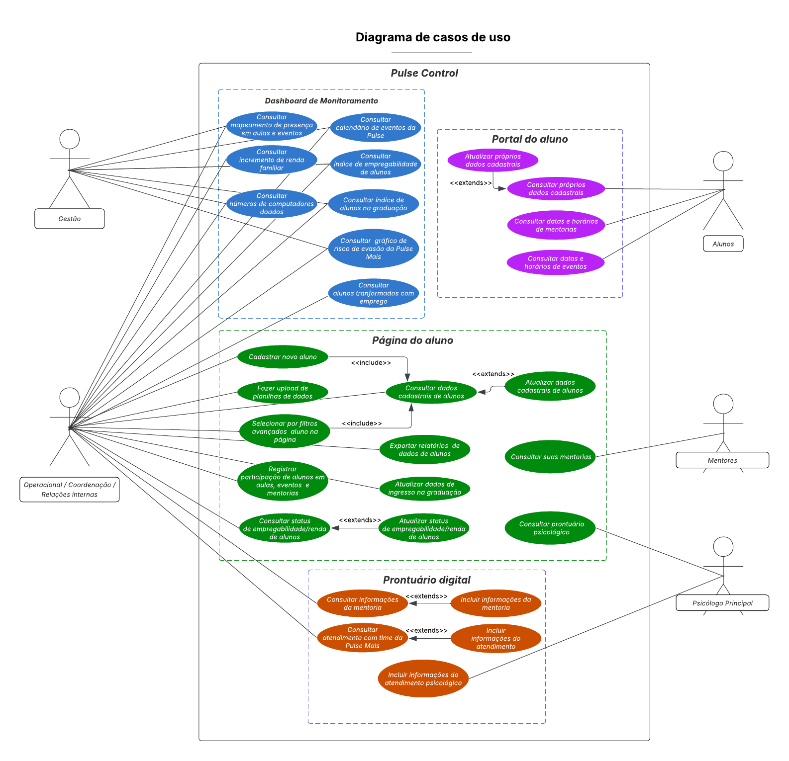<br>
  <p><b>Fonte:</b> Elaborado pelos autores, 2026</p>
</div>

### <a name="c3.2.3"></a>3.2.3. Diagrama de Classes do Domínio

&ensp;&ensp;&ensp;&ensp;O diagrama de classes apresenta a estrutura estática do domínio da Pulse Mais, mapeando as entidades centrais do sistema, seus atributos, métodos e os relacionamentos entre elas. A classe Estudante ocupa o centro do modelo, refletindo o foco do sistema no acompanhamento integral do jovem, desde seus dados pessoais e socioeconômicos até sua jornada de empregabilidade, formação e bem-estar. Em torno dela, organizam-se as entidades de suporte (Programa, Inscricao, Empregabilidade, Escolaridade, FrequenciaAula, SessaoMentoria, RegistroAcompanhamento, HistoricoClassificacao e ComputadorDoado) e os perfis de usuário que interagem com o sistema (Administrador, Coordenador, Psicologo, Mentor e Aluno), todos derivados da classe abstrata Usuario. O controle de acesso é tratado pelo atributo role em Usuario e pelo enum Visibilidade em RegistroAcompanhamento, garantindo que registros sensíveis, como os de acompanhamento psicológico, permaneçam acessíveis apenas aos perfis autorizados.

<div align="center">
  <p><b>Imagem 10 -</b> Diagrama de Classes</p>


```mermaid
classDiagram
    %% ==========================================
    %% CLASSES DE USUÁRIO E HERANÇA
    %% ==========================================
    class Usuario {
        #id : Integer
        #nome : String
        #email : String
        #papel : String
        #ativo : Boolean
        +obterPermissoes() : List~Permissao~
    }

    class Administrador {
        -nivelAcesso : String
        +gerenciarUsuarios() : void
        +importarPlanilha(arquivo) : void
        +exportarDados(formato) : Arquivo
        +gerarRelatorio(filtros) : Relatorio
        +visualizarDashboard() : Dashboard
    }

    class Psicologo {
        -crp : String
        -especialidade : String
        +listarTodosEstudantes() : List~Estudante~
        +visualizarPerfilEstudante(estudante) : Estudante
        +criarRegistro(estudante) : RegistroAcompanhamento
        +atualizarRegistro(registro) : void
        +visualizarHistoricoRegistros(estudante) : List~RegistroAcompanhamento~
        +exportarDados(formato) : Arquivo
    }

    class Coordenador {
        -departamento : String
        +importarPlanilha(arquivo) : void
        +listarEstudantes() : List~Estudante~
        +atualizarDadosEstudante(estudante) : void
        +gerenciarPrograma(programa) : void
        +gerarRelatorio(filtros) : Relatorio
        +exportarDados(formato) : Arquivo
        +visualizarDashboard() : Dashboard
    }

    class Mentor {
        -areaAtuacao : String
        +listarVinculos() : List~SessaoMentoria~
        +visualizarPerfilEstudanteVinculado(estudante) : Estudante
    }

    Usuario <|-- Administrador
    Usuario <|-- Psicologo
    Usuario <|-- Coordenador
    Usuario <|-- Mentor

    %% ==========================================
    %% ENTIDADES PRINCIPAIS
    %% ==========================================
    class Estudante {
        -id : Integer
        -nomeCompleto : String
        -cpf : String
        -dataNascimento : Date
        -email : String
        -telefone : String
        -endereco : String
        -rendaFamiliarPerCapita : Decimal
        -classificacaoPulse : ClassificacaoPulse
        -statusEmpregabilidade : StatusEmpregabilidade
        -dataMatricula : Date
        +obterPerfilCompleto() : List~PerfilEstudante~
        +obterProgramaAtual() : Programa
        +obterTaxaFrequencia() : Decimal
        +obterHistoricoEmpregos() : List~Empregabilidade~
        +obterRegistros() : List~RegistroAcompanhamento~
    }

    class Jovem {
        -idJovem : integer
        -nomeCompleto : String
        -email : String
        -telefone : String
        -cpf : String
        -dataNascimento : date
        -endereco : String
        -genero : String
        -rendaInicial : float
        -categoriaAtual : ClassificacaoPulse
        -statusGlobal : String
        +visualizarPerfil() : Student
        +visualizarProgramas() : List~Program~
        +atualizarPerfil()
    }

    class Programa {
        -id : Integer
        -nome : String
        -dataInicio : Date
        -dataFim : Date
        -descricao : String
        +listarEstudantes() : List~Estudante~
        +listarEventos() : List~Evento~
    }

    class Inscricao {
        -id : Integer
        -estudante : String
        -programa : String
        -dataInscricao : Date
        -statusConclusao : String
        -dataStatus : Date
    }

    class FrequenciaAula {
        -id : Integer
        -dataAula : Date
        -presente : Boolean
        -estudante : String
        -programa : String
    }

    class Evento {
        -id : Integer
        -nome : String
        -dataEvento : DateTime
        -descricao : String
        +registrarParticipante(estudante) : void
        +listarParticipantes() : List~Estudante~
    }

    class Empregabilidade {
        -id : Integer
        -nomeEmpresa : String
        -tipoContrato : tipoContrato
        -areaAtuacao : String
        -dataInicio : Date
        -dataFim : Date
        -salario : Decimal
        -estudante : String
        +estaActivo() : Boolean
        +obterDuracao() : Integer
    }

    class SessaoMentoria {
        -id : Integer
        -mentor : String
        -estudante : String
        -dataInicio : Date
        -ativo : Boolean
    }

    class ComputadorDoado {
        -id : Integer
        -dataDoacao : Date
        -dataDevolucao : Date
        -modelo : String
        -estudante : String
    }

    class HistoricoClassificacao {
        -id : Integer
        -classificacao : ClassificacaoPulse
        -alteradoEm : DateTime
        -alteradoPor : String
        -estudante : String
    }

    class Escolaridade {
        -id : Integer
        -instituicao : String
        -curso : String
        -tipoIngresso : String
        -situacao : String
        -dataIngresso : Date
        -ingressou : Boolean
        -estudante : String
        +validar() : Boolean
    }

    class RegistroAcompanhamento {
        -id : Integer
        -dataRegistro : DateTime
        -tipoRegistro : TipoRegistro
        -visibilidade : Visibilidade
        -conteudo : text
        -autor : Usuario
        -estudante : Estudante
        +criar() : void
        +atualizar() : void
        +verificarAcesso(usuario) : Boolean
    }

    %% ==========================================
    %% ENUMERADORES
    %% ==========================================
    class StatusEmpregabilidade {
        <<enumeration>>
        EMPREGADO
        PROCURANDO
    }

    class TipoContrato {
        <<enumeration>>
        JOVEM APRENDIZ
        ESTAGIO
        EFETIVADO
    }

    class ClassificacaoPulse {
        <<enumeration>>
        CONECTADO
        CAPACITADO
        TRANSFORMADO
    }

    class TipoRegistro {
        <<enumeration>>
        PSICOLOGICO
        MENTORIA
        ATENDIMENTO_EQUIPE
    }

    class Visibilidade {
        <<enumeration>>
        PUBLICO_EQUIPE
        RESTRITO_PSICOLOGIA
    }

    %% ==========================================
    %% RELACIONAMENTOS (ASSOCIAÇÕES E COMPOSIÇÕES)
    %% ==========================================
    Programa "1" *-- "0..*" Inscricao : Tem
    Estudante "1" -- "0..*" Inscricao : Tem
    
    Programa "1" *-- "0..*" FrequenciaAula : Registra
    Programa "1" -- "0..*" Evento : Tem
    Estudante "1" -- "0..*" Evento : Participa
    
    Estudante "1" *-- "0..*" Empregabilidade : Tem
    
    Mentor "1" *-- "0..*" SessaoMentoria : Tem
    Estudante "1" *-- "0..*" SessaoMentoria : Tem
    
    Estudante "1" -- "0..*" ComputadorDoado : Tem
    
    Estudante "1" *-- "0..*" HistoricoClassificacao : Tem
    Administrador "1" -- "0..*" HistoricoClassificacao : Cria
    
    Estudante "1" *-- "0..1" Escolaridade : Tem
    
    Estudante "1" *-- "0..*" RegistroAcompanhamento : Tem
    Psicologo "1" -- "0..*" RegistroAcompanhamento : Cria
    
    %% ==========================================
    %% DEPENDÊNCIAS (USO DE ENUMS)
    %% ==========================================
    Estudante ..> StatusEmpregabilidade : Usa
    Empregabilidade ..> TipoContrato : Usa
    HistoricoClassificacao ..> ClassificacaoPulse : Usa
    RegistroAcompanhamento ..> TipoRegistro : Usa
    RegistroAcompanhamento ..> Visibilidade : Usa
```
  <p><b>Fonte:</b> Elaborado pelos autores, 2026</p>
</div>

#### 3.2.3.1 Diagrama de classes arquitetural

&ensp;&ensp;&ensp;&ensp;O Diagrama de Classes Arquitetural representa a estrutura técnica da aplicação web do Pulse Control organizada em camadas, descrevendo como os componentes de software se relacionam entre si no código implementado. Diferente do Diagrama de Classes de Domínio, que modela as entidades do negócio e suas relações conceituais, o Diagrama de Classes Arquitetural foca nas responsabilidades de cada camada da aplicação e nos contratos entre elas.

&ensp;&ensp;&ensp;&ensp;O diagrama contempla seis agrupamentos, sendo eles o model, helpers, controller, service, repository e persistencia. O agrupamento model define as interfaces TypeScript e os enums compartilhados por todas as camadas, funcionando como fonte única da verdade sobre os tipos de dados do sistema. O agrupamento helpers expõe a função ValidarPerfil, utilizada pelos services para autorizar o acesso por perfil de usuário antes de qualquer operação. O agrupamento controller representa a borda HTTP da aplicação, contendo as classes responsáveis por receber requisições e devolver respostas. O agrupamento service concentra as regras de negócio e orquestra as chamadas aos repositories. O agrupamento repository define as interfaces de acesso a dados e suas implementações concretas, sendo a única camada que executa SQL. O agrupamento persistencia representa o pool de conexões com o banco PostgreSQL hospedado no Supabase.

&ensp;&ensp;&ensp;&ensp;As relações entre os agrupamentos seguem o fluxo unidirecional controller => service => repository => persistencia, com os services dependendo de interfaces de repository e não de implementações concretas, aplicando o princípio de Inversão de Dependência. Essa estrutura garante que alterações em uma camada não propaguem impacto para as demais e permite que cada vertical do projeto seja desenvolvida de forma independente pelos membros da equipe.

<div align="center">
  <p><b>Imagem 10 -</b> Diagrama de classes arquitetural - Coordenador</p>
  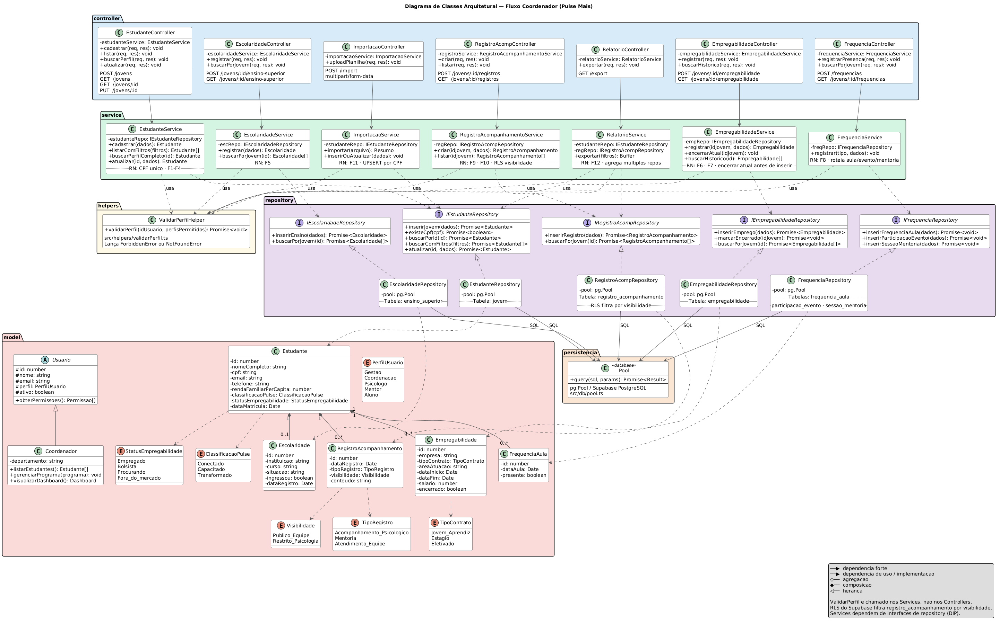<br>
  <p><b>Fonte:</b> Elaborado pelos autores, 2026</p>
</div>

<div align="center">
  <p><b>Imagem 11 -</b> Diagrama de classes arquitetural - Gestão</p>
  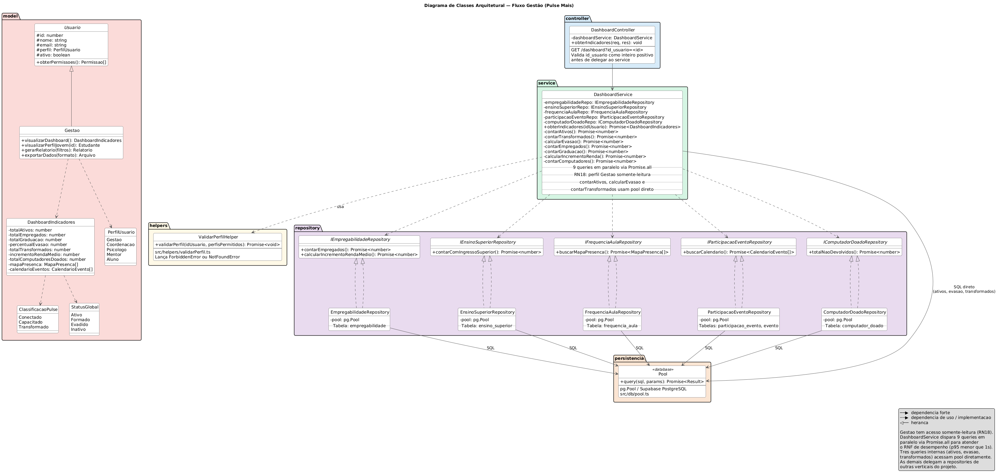<br>
  <p><b>Fonte:</b> Elaborado pelos autores, 2026</p>
</div>

<div align="center">
  <p><b>Imagem 12 -</b> Diagrama de classes arquitetural - Mentor</p>
  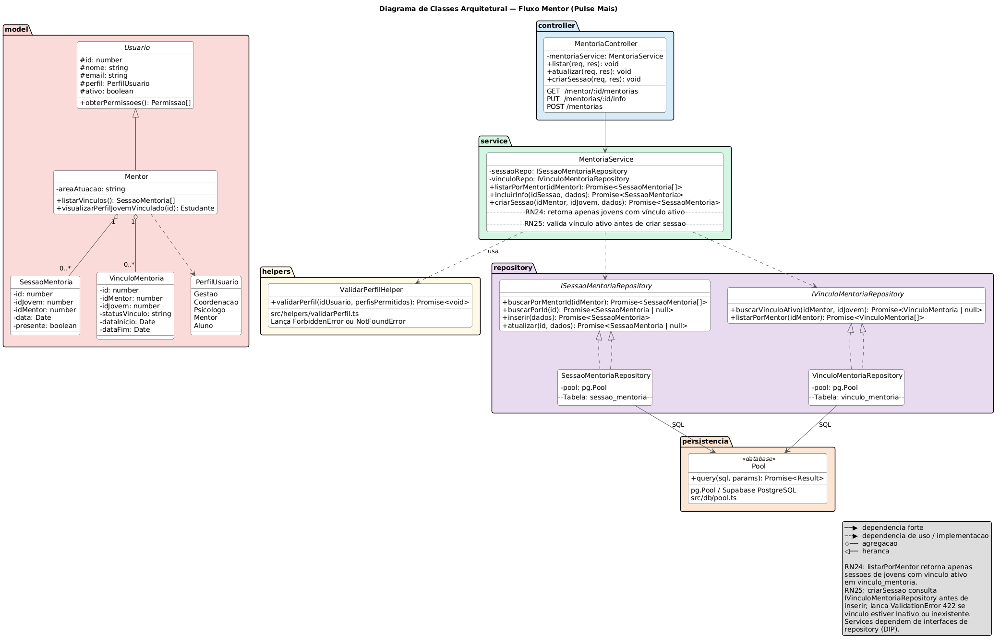<br>
  <p><b>Fonte:</b> Elaborado pelos autores, 2026</p>
</div>

<div align="center">
  <p><b>Imagem 13 -</b> Diagrama de classes arquitetural - Aluno</p>
  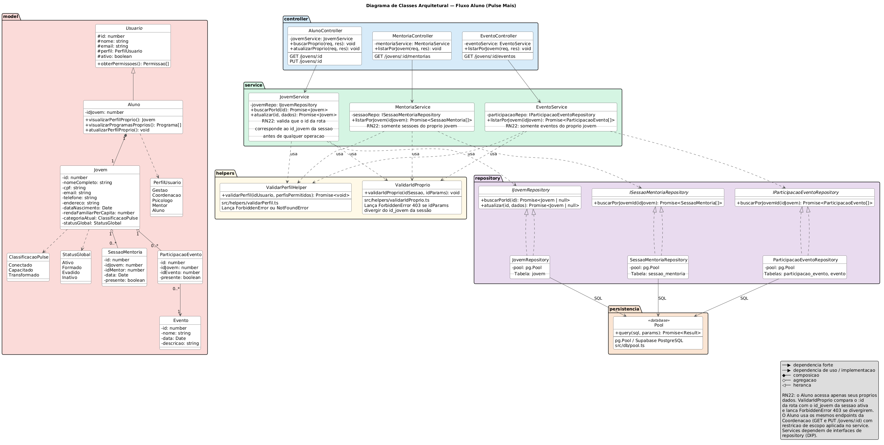<br>
  <p><b>Fonte:</b> Elaborado pelos autores, 2026</p>
</div>

<div align="center">
  <p><b>Imagem 14 -</b> Diagrama de classes arquitetural - Psicólogo</p>
  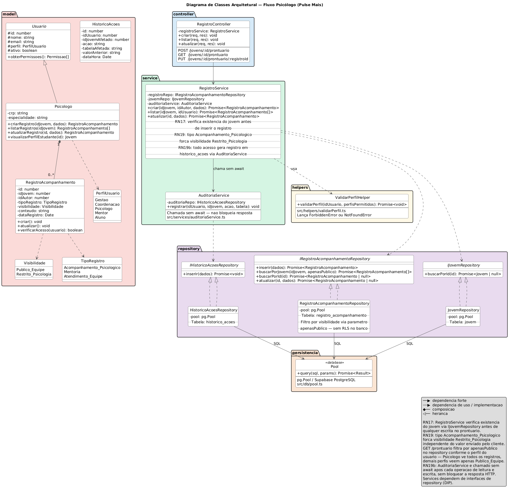<br>
  <p><b>Fonte:</b> Elaborado pelos autores, 2026</p>
</div>

### <a name="c3.2.4"></a>3.2.4. Diagrama de Sequência UML

#### 3.2.4.1 O que são diagramas de sequência?

&ensp;&ensp;&ensp;&ensp;Diagramas de sequência são representações UML que descrevem como diferentes partes do sistema conversam entre si ao longo do tempo para executar uma operação específica. Diferente de diagramas estáticos (classes, casos de uso), eles mostram a ordem temporal das interações: quem chama quem, em qual sequência, e quem responde.

##### Para que servem?

&ensp;&ensp;&ensp;&ensp;Servem para traduzir um caso de uso (descrição do que o sistema faz) em um fluxo técnico de execução (como o sistema faz). São a ponte entre o "o quê" do diagrama de casos de uso e o "como" da implementação real do código. Permitem que a equipe valide se a arquitetura prevista suporta cada cenário antes de programar, e identifique pontos de falha (onde validar perfil? Onde tratar erro? Onde registrar auditoria?).

##### Que tipo de informação mostram?

&ensp;&ensp;&ensp;&ensp;Cada diagrama mostra cinco elementos principais:

&ensp;&ensp;&ensp;&ensp;* **Atores e participantes:** quem inicia a interação (usuário) e quais componentes do sistema participam (Controller, Service, Repository, Supabase). Ficam alinhados horizontalmente no topo, cada um com sua linha de vida vertical (lifeline).

&ensp;&ensp;&ensp;&ensp;* **Mensagens síncronas (seta cheia):** chamadas em que o emissor espera resposta antes de continuar. Representam chamadas de função tradicionais.

&ensp;&ensp;&ensp;&ensp;* **Mensagens assíncronas (seta com cabeça aberta):** chamadas em que o emissor dispara e segue em frente sem esperar resposta. Tipicamente usadas para auditoria, notificações, processos em background.

&ensp;&ensp;&ensp;&ensp;* **Retornos tracejados:** respostas voltando ao emissor. Toda mensagem síncrona tem um retorno correspondente.

&ensp;&ensp;&ensp;&ensp;* **Fragmentos combinados:** caixas que agrupam mensagens com lógica condicional (alt para if/else, loop para repetição, par para paralelo) ou que referenciam outro diagrama (ref para sub-rotinas reutilizáveis.

##### Arquitetura representada nos diagramas do projeto

&ensp;&ensp;&ensp;&ensp;Todos os diagramas seguem a arquitetura em camadas adotada pela equipe:

* Ator (Usuário) => Controller => Service => Repository => Supabase

* Controller: recebe a requisição HTTP, valida formato, delega.

* Service: contém as regras de negócio, decide o que fazer.

* Repository: acessa o banco, executa queries.

* Supabase: banco de dados PostgreSQL com Row Level Security (RLS) aplicada.

&ensp;&ensp;&ensp;&ensp;Essa separação garante que cada camada tem uma responsabilidade única, facilitando manutenção e teste.

#### 3.2.4.2 Diagrama 1: Aluno

&ensp;&ensp;&ensp;&ensp;Ator coberto: Aluno (jovem da Pulse). Quatro fluxos do Portal do Aluno.

##### O que ele mostra

&ensp;&ensp;&ensp;&ensp;Esse diagrama materializa o RF013 (Portal do Aluno) e o conceito de "usuário secundário" definido no contrato. Os fluxos são propositalmente limitados - o aluno tem acesso restrito apenas a seus próprios dados:

* F1 (Consultar próprios dados cadastrais): GET simples, retorna o registro do próprio jovem. Note que ValidarPerfil é chamado mesmo aqui, garantindo que apenas o aluno (ou níveis superiores) acesse a rota.

* F2 (Atualizar próprios dados cadastrais): o fluxo mais elaborado do diagrama. Inclui alt para tratar "jovem encontrado" vs. "não encontrado" (HTTP 404). A escrita é seguida de auditoria assíncrona. Cobre o RF013 na parte de atualização.

* F3 (Consultar mentorias): lista sessões em que o jovem está vinculado.

* F4 (Consultar eventos): lista eventos em que o jovem participou ou pode participar, via JOIN entre evento e participacao_evento.

##### Impacto para o entendimento do projeto

&ensp;&ensp;&ensp;&ensp;Esse diagrama é o que estabelece o limite da participação do jovem no sistema. Apesar de o jovem ser a entidade central do domínio (toda a modelagem gira em torno dele), como usuário ele tem permissões mínimas: ver e atualizar a si mesmo, consultar suas mentorias e eventos. Isso reforça a divisão entre jovem-entidade (o registro completo gerenciado pela Pulse) e jovem-usuário (a versão limitada acessível via Portal).
&ensp;&ensp;&ensp;&ensp;Para a implementação, ele evidencia uma necessidade técnica importante: o sistema precisa garantir que o jovem só consiga acessar o próprio ID. Isso não é trivial sem autenticação real (restrição do contrato). Provavelmente será implementado via Row Level Security do Supabase, comparando o id_jovem da requisição com o usuario.id_jovem do perfil ativo.

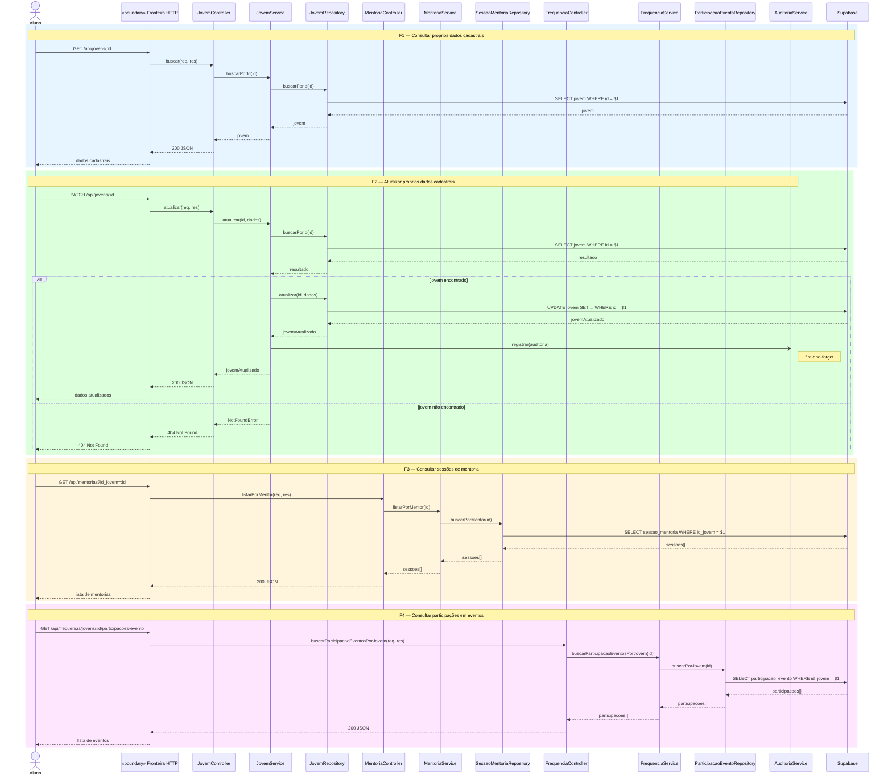
```mermaid
sequenceDiagram
    actor Aluno
    participant F as «boundary» Fronteira HTTP
    participant JCtrl as JovemController
    participant JSvc as JovemService
    participant JRepo as JovemRepository
    participant MCtrl as MentoriaController
    participant MSvc as MentoriaService
    participant SMRepo as SessaoMentoriaRepository
    participant FCtrl as FrequenciaController
    participant FSvc as FrequenciaService
    participant PEvRepo as ParticipacaoEventoRepository
    participant Audit as AuditoriaService
    participant DB as Supabase

    rect rgb(230, 245, 255)
        Note over Aluno,DB: F1 — Consultar próprios dados cadastrais
        Aluno->>F: GET /api/jovens/:id
        F->>JCtrl: buscar(req, res)
        JCtrl->>JSvc: buscarPorId(id)
        JSvc->>JRepo: buscarPorId(id)
        JRepo->>DB: SELECT jovem WHERE id = $1
        DB-->>JRepo: jovem
        JRepo-->>JSvc: jovem
        JSvc-->>JCtrl: jovem
        JCtrl-->>F: 200 JSON
        F-->>Aluno: dados cadastrais
    end

    rect rgb(220, 255, 220)
        Note over Aluno,Audit: F2 — Atualizar próprios dados cadastrais
        Aluno->>F: PATCH /api/jovens/:id
        F->>JCtrl: atualizar(req, res)
        JCtrl->>JSvc: atualizar(id, dados)
        JSvc->>JRepo: buscarPorId(id)
        JRepo->>DB: SELECT jovem WHERE id = $1
        DB-->>JRepo: resultado
        JRepo-->>JSvc: resultado
        alt jovem encontrado
            JSvc->>JRepo: atualizar(id, dados)
            JRepo->>DB: UPDATE jovem SET ... WHERE id = $1
            DB-->>JRepo: jovemAtualizado
            JRepo-->>JSvc: jovemAtualizado
            JSvc-)Audit: registrar(auditoria)
            Note right of Audit: fire-and-forget
            JSvc-->>JCtrl: jovemAtualizado
            JCtrl-->>F: 200 JSON
            F-->>Aluno: dados atualizados
        else jovem não encontrado
            JSvc-->>JCtrl: NotFoundError
            JCtrl-->>F: 404 Not Found
            F-->>Aluno: 404 Not Found
        end
    end

    rect rgb(255, 245, 220)
        Note over Aluno,DB: F3 — Consultar sessões de mentoria
        Aluno->>F: GET /api/mentorias?id_jovem=:id
        F->>MCtrl: listarPorMentor(req, res)
        MCtrl->>MSvc: listarPorMentor(id)
        MSvc->>SMRepo: buscarPorMentor(id)
        SMRepo->>DB: SELECT sessao_mentoria WHERE id_jovem = $1
        DB-->>SMRepo: sessoes[]
        SMRepo-->>MSvc: sessoes[]
        MSvc-->>MCtrl: sessoes[]
        MCtrl-->>F: 200 JSON
        F-->>Aluno: lista de mentorias
    end

    rect rgb(255, 230, 255)
        Note over Aluno,DB: F4 — Consultar participações em eventos
        Aluno->>F: GET /api/frequencia/jovens/:id/participacoes-evento
        F->>FCtrl: buscarParticipacaoEventosPorJovem(req, res)
        FCtrl->>FSvc: buscarParticipacaoEventosPorJovem(id)
        FSvc->>PEvRepo: buscarPorJovem(id)
        PEvRepo->>DB: SELECT participacao_evento WHERE id_jovem = $1
        DB-->>PEvRepo: participacoes[]
        PEvRepo-->>FSvc: participacoes[]
        FSvc-->>FCtrl: participacoes[]
        FCtrl-->>F: 200 JSON
        F-->>Aluno: lista de eventos
    end
```

<p align="center"><b>Diagrama 12 —</b> Diagrama de Sequência UML do Aluno. <b>Fonte:</b> Elaborado pelos autores, 2026</p>

#### 3.2.4.3 Diagrama 2: Dashboard

&ensp;&ensp;&ensp;&ensp;Ator coberto: Gestão e Coordenador. Um único fluxo, mas o mais denso do sistema.

##### O que ele mostra

&ensp;&ensp;&ensp;&ensp;O dashboard consolida sete indicadores diferentes em uma única tela, calculados em paralelo (na descrição) ou em sequência (na implementação atual representada). Cada indicador é uma chamada Service => Repository => Supabase => retorno:

* contarAtivos: total de jovens com status ativo.

* contarEmpregados: total em empregabilidade ativa.

* contarGraduacao: total em ensino_superior.

* calcularEvasao: percentual de jovens evadidos.

* contarComputadores: doações registradas.

* calcularIncrementoRenda: média da diferença entre renda_atual e renda_inicial.

* contarTransformados: jovens na categoria Transformado.

&ensp;&ensp;&ensp;&ensp;Mais duas operações complementares ao final: buscarMapaPresenca (frequência agrupada por jovem) e buscarCalendario (eventos ordenados por data).

##### Impacto para o entendimento do projeto

&ensp;&ensp;&ensp;&ensp;Esse diagrama responde diretamente ao RF008 e às métricas estratégicas que a Pulse usa para reportar a financiadores (ponto 14 da reunião: custo por jovem, incremento de renda). É o artefato que dá visibilidade ao impacto da Pulse Mais - não é só consulta operacional, é a tela que justifica a existência da organização.

&ensp;&ensp;&ensp;&ensp;Para quem vai implementar, ele alerta que o dashboard será o endpoint mais pesado do sistema em termos de banco: nove queries diferentes em uma única requisição. Isso amarra diretamente com o RNF de Desempenho (p95 < 1s com 20 usuários). Se cada query levar 200ms em sequência, o dashboard sozinho passa de 1.8s - viola o RNF. A solução natural é executar em paralelo ou usar views materializadas.

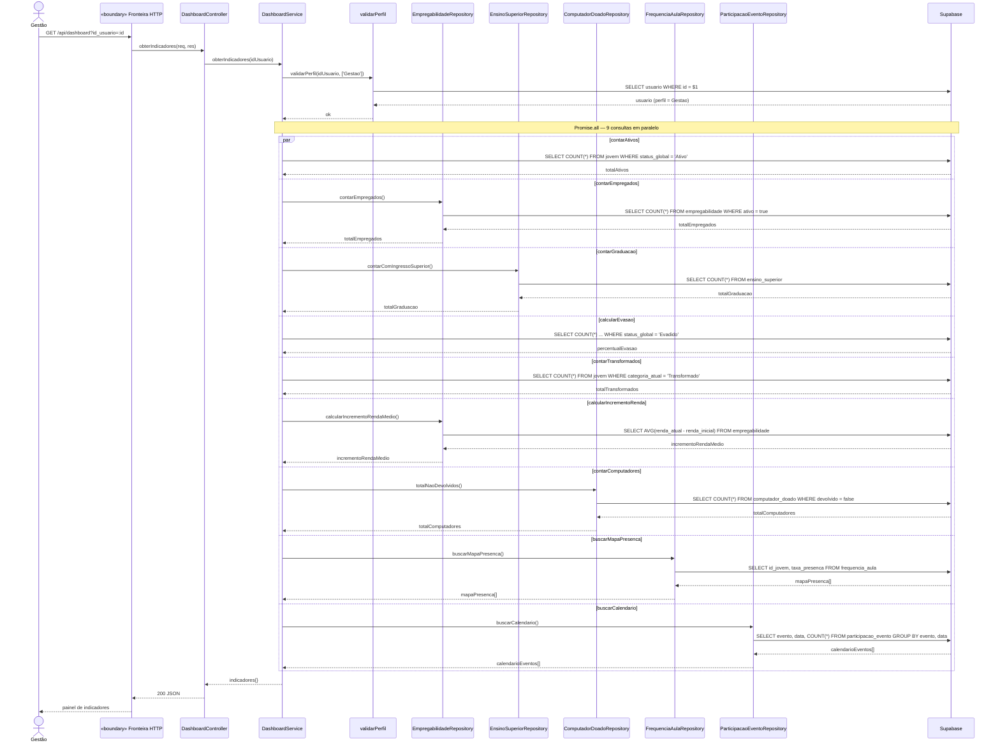
```mermaid
sequenceDiagram
    actor Gestao as Gestão
    participant F as «boundary» Fronteira HTTP
    participant DCtrl as DashboardController
    participant DSvc as DashboardService
    participant VP as validarPerfil
    participant EmpRepo as EmpregabilidadeRepository
    participant ESRepo as EnsinoSuperiorRepository
    participant CompRepo as ComputadorDoadoRepository
    participant FreqRepo as FrequenciaAulaRepository
    participant PEvRepo as ParticipacaoEventoRepository
    participant DB as Supabase

    Gestao->>F: GET /api/dashboard?id_usuario=:id
    F->>DCtrl: obterIndicadores(req, res)
    DCtrl->>DSvc: obterIndicadores(idUsuario)
    DSvc->>VP: validarPerfil(idUsuario, ['Gestao'])
    VP->>DB: SELECT usuario WHERE id = $1
    DB-->>VP: usuario (perfil = Gestao)
    VP-->>DSvc: ok

    Note over DSvc,DB: Promise.all — 9 consultas em paralelo

    par contarAtivos
        DSvc->>DB: SELECT COUNT(*) FROM jovem WHERE status_global = 'Ativo'
        DB-->>DSvc: totalAtivos
    and contarEmpregados
        DSvc->>EmpRepo: contarEmpregados()
        EmpRepo->>DB: SELECT COUNT(*) FROM empregabilidade WHERE ativo = true
        DB-->>EmpRepo: totalEmpregados
        EmpRepo-->>DSvc: totalEmpregados
    and contarGraduacao
        DSvc->>ESRepo: contarComIngressoSuperior()
        ESRepo->>DB: SELECT COUNT(*) FROM ensino_superior
        DB-->>ESRepo: totalGraduacao
        ESRepo-->>DSvc: totalGraduacao
    and calcularEvasao
        DSvc->>DB: SELECT COUNT(*) ... WHERE status_global = 'Evadido'
        DB-->>DSvc: percentualEvasao
    and contarTransformados
        DSvc->>DB: SELECT COUNT(*) FROM jovem WHERE categoria_atual = 'Transformado'
        DB-->>DSvc: totalTransformados
    and calcularIncrementoRenda
        DSvc->>EmpRepo: calcularIncrementoRendaMedio()
        EmpRepo->>DB: SELECT AVG(renda_atual - renda_inicial) FROM empregabilidade
        DB-->>EmpRepo: incrementoRendaMedio
        EmpRepo-->>DSvc: incrementoRendaMedio
    and contarComputadores
        DSvc->>CompRepo: totalNaoDevolvidos()
        CompRepo->>DB: SELECT COUNT(*) FROM computador_doado WHERE devolvido = false
        DB-->>CompRepo: totalComputadores
        CompRepo-->>DSvc: totalComputadores
    and buscarMapaPresenca
        DSvc->>FreqRepo: buscarMapaPresenca()
        FreqRepo->>DB: SELECT id_jovem, taxa_presenca FROM frequencia_aula
        DB-->>FreqRepo: mapaPresenca[]
        FreqRepo-->>DSvc: mapaPresenca[]
    and buscarCalendario
        DSvc->>PEvRepo: buscarCalendario()
        PEvRepo->>DB: SELECT evento, data, COUNT(*) FROM participacao_evento GROUP BY evento, data
        DB-->>PEvRepo: calendarioEventos[]
        PEvRepo-->>DSvc: calendarioEventos[]
    end

    DSvc-->>DCtrl: indicadores{}
    DCtrl-->>F: 200 JSON
    F-->>Gestao: painel de indicadores
```
<p align="center"><b>Diagrama 13 —</b> Diagrama de Sequência UML da Dashboard de Gestão e Coordenação. <b>Fonte:</b> Elaborado pelos autores, 2026</p>

#### 3.2.4.4 Diagrama 3: Coordenação

&ensp;&ensp;&ensp;&ensp;Ator coberto: Coordenação. Doze fluxos cobrindo praticamente todas as operações operacionais do sistema.

##### O que ele mostra

&ensp;&ensp;&ensp;&ensp;Esse é o diagrama mais extenso, retratando o perfil que mais usa o sistema no dia a dia. Cobre o ciclo de vida completo dos dados do jovem na Pulse:

* F1 a F4 (Cadastro e perfil): criar jovem (com validação de CPF duplicado via alt), filtrar lista por critérios, ver perfil consolidado, atualizar campos cadastrais. Espelha os RFs 001, 002, 003, 012, 009.

* F5 a F7 (Educação e trabalho): registrar ingresso em ensino superior, atualizar empregabilidade (com alt para encerrar vínculo anterior antes de inserir novo - coerente com o RF014 de histórico), consultar histórico completo. Cobre RFs 006, 007, 014.

* F8 (Presença): unifica três casos de uso em um único fluxo via alt por tipo (aula, evento, mentoria). Decisão de design eficiente: três caminhos de escrita usando a mesma estrutura. Cobre RFs 004 e 005.

* F9 e F10 (Registros de acompanhamento): incluir e consultar registros de mentoria ou atendimento de equipe - análogo ao prontuário do Psicólogo, mas com visibilidade=Publico_Equipe. A nota "RLS filtra" no F10 garante que Coordenação não enxergue registros restritos.

* F11 (Upload de planilha): único fluxo com loop, mostrando processamento linha por linha. Cobre o RF016 (Demais Entregáveis).

* F12 (Exportar relatório): leitura com filtros e geração de arquivo. Cobre o RF017.

##### Impacto para o entendimento do projeto

&ensp;&ensp;&ensp;&ensp;Esse diagrama é o mapa operacional do sistema: tudo que a Coordenação faz no dia a dia está aqui. Para quem vai implementar, ele permite dimensionar o esforço: existem 12 endpoints distintos, e a maioria segue um padrão muito parecido (validar => buscar/inserir/atualizar => auditar => responder). Isso indica forte oportunidade de criar helpers e abstrações em vez de codar cada fluxo do zero.
&ensp;&ensp;&ensp;&ensp;A presença de fragmentos alt em F1, F6 e F8 mostra os três pontos onde existe lógica condicional não-trivial: validação de duplicata, gestão de histórico, e roteamento por tipo de presença. Esses são os trechos que merecem mais atenção em testes.


```mermaid
sequenceDiagram
    actor Coord as Coordenação
    participant F as «boundary» Fronteira HTTP
    participant JCtrl as JovemController
    participant JSvc as JovemService
    participant JRepo as JovemRepository
    participant CatRepo as CategoriaRepository
    participant ESCtrl as EnsinoSuperiorController
    participant ESSvc as EnsinoSuperiorService
    participant ESRepo as EnsinoSuperiorRepository
    participant EmpCtrl as EmpregabilidadeController
    participant EmpSvc as EmpregabilidadeService
    participant EmpRepo as EmpregabilidadeRepository
    participant FCtrl as FrequenciaController
    participant FSvc as FrequenciaService
    participant FAulaRepo as FrequenciaAulaRepository
    participant PEvRepo as ParticipacaoEventoRepository
    participant RegCtrl as RegistroController
    participant RegSvc as RegistroService
    participant RegRepo as RegistroAcompanhamentoRepository
    participant ImpCtrl as ImportController
    participant ImpSvc as ImportService
    participant ExpCtrl as ExportController
    participant ExpSvc as ExportService
    participant Audit as AuditoriaService
    participant DB as Supabase

    rect rgb(230, 245, 255)
        Note over Coord,DB: F1 — Criar jovem (com validação de email/CPF duplicado)
        Coord->>F: POST /api/jovens
        F->>JCtrl: criar(req, res)
        JCtrl->>JSvc: criar(dados)
        JSvc->>JRepo: buscarPorEmail(email)
        JRepo->>DB: SELECT jovem WHERE email = $1
        DB-->>JRepo: resultado
        JRepo-->>JSvc: resultado
        alt email e CPF únicos
            JSvc->>JRepo: inserir(dados, client)
            JRepo->>DB: BEGIN → INSERT INTO jovem ...
            DB-->>JRepo: jovemCriado
            JRepo-->>JSvc: jovemCriado
            JSvc->>CatRepo: inserir(Conectado, client)
            CatRepo->>DB: INSERT INTO categoria ...
            DB-->>CatRepo: ok
            JSvc-->>JCtrl: COMMIT — jovemCriado
            JCtrl-->>F: 201 Created
            F-->>Coord: jovem criado
        else email ou CPF duplicado
            JSvc-->>JCtrl: ConflictError
            JCtrl-->>F: 409 Conflict
            F-->>Coord: 409 Conflict
        end
    end

    rect rgb(220, 255, 220)
        Note over Coord,DB: F2 — Filtrar lista de jovens
        Coord->>F: GET /api/jovens?categoria=...&status_global=...
        F->>JCtrl: listar(req, res)
        JCtrl->>JSvc: listar(filtros)
        JSvc->>JRepo: buscarComFiltros(filtros)
        JRepo->>DB: SELECT jovem WHERE ...
        DB-->>JRepo: jovens[]
        JRepo-->>JSvc: jovens[]
        JSvc-->>JCtrl: jovens[]
        JCtrl-->>F: 200 JSON
        F-->>Coord: lista filtrada
    end

    rect rgb(255, 245, 220)
        Note over Coord,DB: F3 — Ver perfil consolidado
        Coord->>F: GET /api/jovens/:id/perfil
        F->>JCtrl: buscarPerfilCompleto(req, res)
        JCtrl->>JSvc: obterPerfilCompleto(id)
        JSvc->>JRepo: buscarPorId(id)
        JRepo->>DB: SELECT jovem + registros relacionados WHERE id = $1
        DB-->>JRepo: perfilCompleto
        JRepo-->>JSvc: perfilCompleto
        JSvc-->>JCtrl: perfilCompleto
        JCtrl-->>F: 200 JSON
        F-->>Coord: perfil completo
    end

    rect rgb(255, 230, 255)
        Note over Coord,DB: F4 — Atualizar dados cadastrais
        Coord->>F: PATCH /api/jovens/:id
        F->>JCtrl: atualizar(req, res)
        JCtrl->>JSvc: atualizar(id, dados)
        JSvc->>JRepo: atualizar(id, dados)
        JRepo->>DB: UPDATE jovem SET ... WHERE id = $1
        DB-->>JRepo: jovemAtualizado
        JRepo-->>JSvc: jovemAtualizado
        JSvc-->>JCtrl: jovemAtualizado
        JCtrl-->>F: 200 JSON
        F-->>Coord: dados atualizados
    end

    rect rgb(230, 255, 255)
        Note over Coord,DB: F5 — Registrar ingresso em ensino superior
        Coord->>F: POST /api/jovens/:id/ensino-superior
        F->>ESCtrl: criar(req, res)
        ESCtrl->>ESSvc: criarRegistro(idJovem, dados)
        ESSvc->>ESRepo: inserir(dados)
        ESRepo->>DB: INSERT INTO ensino_superior ...
        DB-->>ESRepo: registro
        ESRepo-->>ESSvc: registro
        ESSvc-->>ESCtrl: registro
        ESCtrl-->>F: 201 Created
        F-->>Coord: registro criado
    end

    rect rgb(255, 255, 220)
        Note over Coord,DB: F6 — Atualizar empregabilidade (encerra vínculo anterior)
        Coord->>F: POST /api/jovens/:id/empregabilidade
        F->>EmpCtrl: criar(req, res)
        EmpCtrl->>EmpSvc: criarRegistro(idJovem, dados)
        EmpSvc->>EmpRepo: buscarAtivo(idJovem)
        EmpRepo->>DB: SELECT empregabilidade WHERE id_jovem = $1 AND ativo = true
        DB-->>EmpRepo: resultado
        EmpRepo-->>EmpSvc: resultado
        alt vínculo anterior existe
            EmpSvc->>EmpRepo: encerrar(idAnterior)
            EmpRepo->>DB: UPDATE empregabilidade SET ativo = false ...
            DB-->>EmpRepo: ok
        end
        EmpSvc->>EmpRepo: inserir(dados)
        EmpRepo->>DB: INSERT INTO empregabilidade ...
        DB-->>EmpRepo: novoRegistro
        EmpRepo-->>EmpSvc: novoRegistro
        EmpSvc-->>EmpCtrl: novoRegistro
        EmpCtrl-->>F: 201 Created
        F-->>Coord: empregabilidade criada
    end

    rect rgb(240, 240, 255)
        Note over Coord,DB: F7 — Consultar histórico de empregabilidade
        Coord->>F: GET /api/jovens/:id/empregabilidade
        F->>EmpCtrl: listar(req, res)
        EmpCtrl->>EmpSvc: obterHistorico(idJovem)
        EmpSvc->>EmpRepo: buscarPorJovem(idJovem)
        EmpRepo->>DB: SELECT * FROM empregabilidade WHERE id_jovem = $1
        DB-->>EmpRepo: historico[]
        EmpRepo-->>EmpSvc: historico[]
        EmpSvc-->>EmpCtrl: historico[]
        EmpCtrl-->>F: 200 JSON
        F-->>Coord: histórico completo
    end

    rect rgb(255, 240, 230)
        Note over Coord,DB: F8 — Registrar presença (alt por tipo)
        Coord->>F: POST /api/frequencia
        F->>FCtrl: registrar(req, res)
        FCtrl->>FSvc: registrar(payload)
        alt tipo = aula
            FSvc->>FAulaRepo: inserir(dados)
            FAulaRepo->>DB: INSERT INTO frequencia_aula ...
            DB-->>FAulaRepo: registro
            FAulaRepo-->>FSvc: registro
        else tipo = evento
            FSvc->>PEvRepo: inserir(dados)
            PEvRepo->>DB: INSERT INTO participacao_evento ...
            DB-->>PEvRepo: registro
            PEvRepo-->>FSvc: registro
        end
        FSvc-->>FCtrl: registro
        FCtrl-->>F: 201 Created
        F-->>Coord: presença registrada
    end

    rect rgb(230, 255, 240)
        Note over Coord,DB: F9 — Incluir registro de acompanhamento
        Coord->>F: POST /api/jovens/:id/prontuario
        F->>RegCtrl: criar(req, res)
        RegCtrl->>RegSvc: criar(idJovem, idUsuario, dados)
        RegSvc->>RegRepo: inserir(registro visibilidade=Publico_Equipe)
        RegRepo->>DB: INSERT INTO registro_acompanhamento ...
        DB-->>RegRepo: registro
        RegRepo-->>RegSvc: registro
        RegSvc-->>RegCtrl: registro
        RegCtrl-->>F: 201 Created
        F-->>Coord: registro criado
    end

    rect rgb(255, 230, 240)
        Note over Coord,DB: F10 — Consultar prontuário (RLS filtra por visibilidade)
        Coord->>F: GET /api/jovens/:id/prontuario?id_usuario=:uid
        F->>RegCtrl: listar(req, res)
        RegCtrl->>RegSvc: listar(idJovem, idUsuario)
        RegSvc->>RegRepo: buscarPorJovem(idJovem, perfil)
        RegRepo->>DB: SELECT registro_acompanhamento WHERE id_jovem = $1
        Note over DB: RLS filtra registros com visibilidade = Restrito_Psicologia
        DB-->>RegRepo: registros[] (Publico_Equipe apenas)
        RegRepo-->>RegSvc: registros[]
        RegSvc-->>RegCtrl: registros[]
        RegCtrl-->>F: 200 JSON
        F-->>Coord: prontuário visível
    end

    rect rgb(245, 245, 245)
        Note over Coord,DB: F11 — Upload de planilha de jovens
        Coord->>F: POST /api/import (multipart/form-data)
        F->>ImpCtrl: importarJovens(req, res)
        ImpCtrl->>ImpSvc: importarJovens(conteudo)
        loop para cada linha do CSV
            ImpSvc->>DB: INSERT INTO jovem ... (upsert linha a linha)
            DB-->>ImpSvc: resultado linha
        end
        ImpSvc-->>ImpCtrl: resumo importação
        ImpCtrl-->>F: 200 JSON
        F-->>Coord: resumo da importação
    end

    rect rgb(235, 255, 245)
        Note over Coord,DB: F12 — Exportar relatório de jovens
        Coord->>F: GET /api/export?categoria_atual=...&status_global=...
        F->>ExpCtrl: exportarJovens(req, res)
        ExpCtrl->>ExpSvc: exportarJovens(filtros)
        ExpSvc->>DB: SELECT * FROM jovem WHERE ...
        DB-->>ExpSvc: jovens[]
        ExpSvc-->>ExpCtrl: conteúdo CSV
        ExpCtrl-->>F: 200 text/csv
        F-->>Coord: arquivo CSV
    end
```
<p align="center"><b>Diagrama 14 —</b> Diagrama de Sequência UML dos processos executáveis pelo usuário Coordenação. <b>Fonte:</b> Elaborado pelos autores, 2026</p>

#### 3.2.4.5 Diagrama 4: Psicólogo e Mentor

&ensp;&ensp;&ensp;&ensp;Atores cobertos: Mentor e Psicólogo Principal. Quatro fluxos.

##### O que ele mostra

&ensp;&ensp;&ensp;&ensp;O diagrama abre com a sub-rotina ValidarPerfil, definida uma única vez e referenciada em todos os fluxos subsequentes via note over Service: ref ValidarPerfil(...). Essa decisão arquitetural é central: a autorização é tratada como serviço transversal, não duplicada em cada operação.

* F1 (Mentor consulta suas mentorias): fluxo de leitura simples. O Mentor solicita as sessões em que está vinculado; o sistema busca em sessao_mentoria filtrando por mentor_id. Espelha o RF019 e o método listBonds() da classe Mentor.

* F2 (Mentor inclui informações da mentoria): fluxo de escrita com auditoria assíncrona. O Mentor atualiza informações de uma sessão já existente (presença, observações). Note a seta Service-)Repository: auditoria - é assíncrona, não bloqueia o retorno ao usuário.

* F3 (Psicólogo inclui atendimento psicológico): fluxo de escrita sensível. Apresenta o padrão completo: validação de perfil, verificação prévia da existência do jovem, inserção com visibilidade=Restrito_Psicologia, auditoria assíncrona, e o fragmento alt cobrindo o caminho de erro (jovem não encontrado => HTTP 404).

* F4 (Psicólogo consulta prontuário): fluxo de leitura sensível. O diferencial está na nota "RLS filtra" - a Row Level Security do Supabase aplica o filtro de visibilidade no próprio banco, antes do dado sair. Isso amarra o diagrama ao RNF de Segurança da equipe.

##### Impacto para o entendimento do projeto

&ensp;&ensp;&ensp;&ensp;Esse diagrama é o que materializa o cuidado com dado sensível descrito no RF010 e nos RNFs. Para quem vai implementar, ele responde três perguntas práticas: (1) onde validar o perfil do Psicólogo? Na entrada do Service, antes de qualquer query. (2) Como garantir que dados psicológicos não vazem? Pela combinação de validação no Service + RLS no banco. (3) Como registrar quem acessou o quê? Auditoria assíncrona após cada operação.

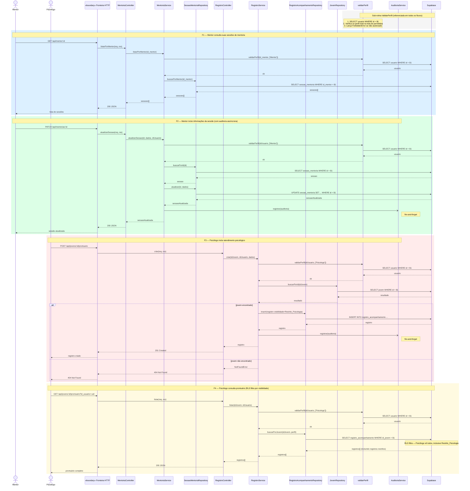
```mermaid
sequenceDiagram
    actor Mentor
    actor Psicologo as Psicólogo
    participant F as «boundary» Fronteira HTTP
    participant MCtrl as MentoriaController
    participant MSvc as MentoriaService
    participant SMRepo as SessaoMentoriaRepository
    participant RegCtrl as RegistroController
    participant RegSvc as RegistroService
    participant RegRepo as RegistroAcompanhamentoRepository
    participant JRepo as JovemRepository
    participant VP as validarPerfil
    participant Audit as AuditoriaService
    participant DB as Supabase

    rect rgb(245, 245, 245)
        Note over VP,DB: Sub-rotina ValidarPerfil (referenciada em todos os fluxos)
        Note over VP: 1. SELECT usuario WHERE id = $1<br/>2. Verifica se perfil está na lista de permitidos<br/>3. Lança ForbiddenError se não autorizado
    end

    rect rgb(220, 240, 255)
        Note over Mentor,DB: F1 — Mentor consulta suas sessões de mentoria
        Mentor->>F: GET /api/mentor/:id
        F->>MCtrl: listarPorMentor(req, res)
        MCtrl->>MSvc: listarPorMentor(id_mentor)
        MSvc->>VP: validarPerfil(id_mentor, ['Mentor'])
        VP->>DB: SELECT usuario WHERE id = $1
        DB-->>VP: usuario
        VP-->>MSvc: ok
        MSvc->>SMRepo: buscarPorMentor(id_mentor)
        SMRepo->>DB: SELECT sessao_mentoria WHERE id_mentor = $1
        DB-->>SMRepo: sessoes[]
        SMRepo-->>MSvc: sessoes[]
        MSvc-->>MCtrl: sessoes[]
        MCtrl-->>F: 200 JSON
        F-->>Mentor: lista de sessões
    end

    rect rgb(220, 255, 230)
        Note over Mentor,Audit: F2 — Mentor inclui informações da sessão (com auditoria assíncrona)
        Mentor->>F: PATCH /api/mentorias/:id
        F->>MCtrl: atualizarSessao(req, res)
        MCtrl->>MSvc: atualizarSessao(id, dados, idUsuario)
        MSvc->>VP: validarPerfil(idUsuario, ['Mentor'])
        VP->>DB: SELECT usuario WHERE id = $1
        DB-->>VP: usuario
        VP-->>MSvc: ok
        MSvc->>SMRepo: buscarPorId(id)
        SMRepo->>DB: SELECT sessao_mentoria WHERE id = $1
        DB-->>SMRepo: sessao
        SMRepo-->>MSvc: sessao
        MSvc->>SMRepo: atualizar(id, dados)
        SMRepo->>DB: UPDATE sessao_mentoria SET ... WHERE id = $1
        DB-->>SMRepo: sessaoAtualizada
        SMRepo-->>MSvc: sessaoAtualizada
        MSvc-)Audit: registrar(auditoria)
        Note right of Audit: fire-and-forget
        MSvc-->>MCtrl: sessaoAtualizada
        MCtrl-->>F: 200 JSON
        F-->>Mentor: sessão atualizada
    end

    rect rgb(255, 235, 235)
        Note over Psicologo,Audit: F3 — Psicólogo inclui atendimento psicológico
        Psicologo->>F: POST /api/jovens/:id/prontuario
        F->>RegCtrl: criar(req, res)
        RegCtrl->>RegSvc: criar(idJovem, idUsuario, dados)
        RegSvc->>VP: validarPerfil(idUsuario, ['Psicologo'])
        VP->>DB: SELECT usuario WHERE id = $1
        DB-->>VP: usuario
        VP-->>RegSvc: ok
        RegSvc->>JRepo: buscarPorId(idJovem)
        JRepo->>DB: SELECT jovem WHERE id = $1
        DB-->>JRepo: resultado
        JRepo-->>RegSvc: resultado
        alt jovem encontrado
            RegSvc->>RegRepo: inserir(registro visibilidade=Restrito_Psicologia)
            RegRepo->>DB: INSERT INTO registro_acompanhamento ...
            DB-->>RegRepo: registro
            RegRepo-->>RegSvc: registro
            RegSvc-)Audit: registrar(auditoria)
            Note right of Audit: fire-and-forget
            RegSvc-->>RegCtrl: registro
            RegCtrl-->>F: 201 Created
            F-->>Psicologo: registro criado
        else jovem não encontrado
            RegSvc-->>RegCtrl: NotFoundError
            RegCtrl-->>F: 404 Not Found
            F-->>Psicologo: 404 Not Found
        end
    end

    rect rgb(255, 250, 225)
        Note over Psicologo,DB: F4 — Psicólogo consulta prontuário (RLS filtra por visibilidade)
        Psicologo->>F: GET /api/jovens/:id/prontuario?id_usuario=:uid
        F->>RegCtrl: listar(req, res)
        RegCtrl->>RegSvc: listar(idJovem, idUsuario)
        RegSvc->>VP: validarPerfil(idUsuario, ['Psicologo'])
        VP->>DB: SELECT usuario WHERE id = $1
        DB-->>VP: usuario
        VP-->>RegSvc: ok
        RegSvc->>RegRepo: buscarPorJovem(idJovem, perfil)
        RegRepo->>DB: SELECT registro_acompanhamento WHERE id_jovem = $1
        Note over DB: RLS filtra — Psicólogo vê todos, inclusive Restrito_Psicologia
        DB-->>RegRepo: registros[] (incluindo registros restritos)
        RegRepo-->>RegSvc: registros[]
        RegSvc-->>RegCtrl: registros[]
        RegCtrl-->>F: 200 JSON
        F-->>Psicologo: prontuário completo
    end
```
<p align="center"><b>Diagrama 15 —</b> Diagrama de Sequência UML dos processos executáveis pelo usuário Psicólogo e pelo usuário Mentor. <b>Fonte:</b> Elaborado pelos autores, 2026</p>

### <a name="c3.2.5"></a>3.2.5. Diagrama de Atividades ou Estados 

Não se aplica

### <a name="c3.2.6"></a>3.2.6. Diagrama de Implantação 

Não se aplica

### <a name="c3.2.7"></a>3.2.7. Padrões de Projeto Aplicados 

&ensp;&ensp;&ensp;&ensp;O backend do Pulse Control foi estruturado em torno de decisões arquiteturais deliberadas, motivadas por necessidades reais que surgiram ao longo do desenvolvimento. Esta seção documenta os seis padrões de projeto identificados na implementação, descrevendo o problema concreto que motivou cada adoção, como o padrão foi aplicado no código e quais princípios SOLID ele sustenta.

#### 3.2.7.1 Repository Pattern

&ensp;&ensp;&ensp;&ensp;O backend persiste dados em quatorze entidades diferentes, sendo elas `jovem`, `usuario`, `programa`, `inscricao_programa`, `categoria`, `frequencia_aula`, `aula`, `participacao_evento`, `evento`, `empregabilidade`, `ensino_superior`, `registro_acompanhamento`, `sessao_mentoria`, `vinculo_mentoria`, `computador_doado` e `historico_acoes`. Durante o desenvolvimento, ficou claro que manter as consultas SQL espalhadas nos services e controllers tornaria qualquer mudança no esquema do banco um trabalho de busca e edição em múltiplos arquivos. Como resposta, criou-se a camada `src/repositories/`, onde cada arquivo cuida exclusivamente das operações de banco de uma entidade. A única exceção intencional é o `importService.ts`, que acessa o pool diretamente por se tratar de uma operação de importação em lote com lógica de fallback linha a linha, caso de uso que não se encaixa no modelo CRUD.

&ensp;&ensp;&ensp;&ensp;Além disso, um aspecto importante da implementação está pautado na característica de alguns repositórios em aceitarem um `PoolClient` opcional como segundo argumento. Tal fator permite que um service coordene uma transação e passe o mesmo client para múltiplos repositórios sem que eles precisem saber que fazem parte de uma operação maior. Como exemplo, o trecho abaixo, do `jovemRepository.ts`, mostra esse mecanismo:

``` ts
export async function inserir(
  dados: JovemCriacao,
  client?: PoolClient
): Promise<Jovem> {
  const executor = client ?? pool;

  const { rows } = await executor.query<Jovem>(
    `INSERT INTO jovem
       (nome, email, telefone, cpf, data_nascimento, endereco,
        genero, renda_inicial, categoria_atual, status_global,
        criado_em, atualizado_em)
     VALUES ($1, $2, $3, $4, $5, $6, $7, $8, 'Conectado', 'Ativo', NOW(), NOW())
     RETURNING ${COLUNAS}`,
    [
      dados.nome, dados.email, dados.telefone ?? null, dados.cpf ?? null,
      dados.data_nascimento ?? null, dados.endereco ?? null,
      dados.genero ?? null, dados.renda_inicial ?? null,
    ]
  );
  return rows[0];
}
```

&ensp;&ensp;&ensp;&ensp;Como solução, o `jovemService.ts` usa esse contrato para garantir que o cadastro do jovem e o INSERT inicial na tabela `categoria` (que registra a entrada na classificação `Conectado`) sejam atômicos, em que se um falhar, a transação é revertida e o banco não fica em estado inconsistente:

``` ts
const client = await pool.connect();
try {
  await client.query('BEGIN');
  const jovemCriado = await jovemRepo.inserir(dados, client);
  await categoriaRepo.inserir(
    { id_jovem: jovemCriado.id, categoria_adquirida: 'Conectado' },
    client
  );
  await client.query('COMMIT');
  return jovemCriado;
} catch (erro) {
  await client.query('ROLLBACK');
  throw erro;
} finally {
  client.release();
}
```

<div align="center">
  <p><b>Quadro 1:</b> Princípios SOLID relacionados ao Repository Pattern</p>
</div>

| Princípio | Aplicação no projeto |
|---|---|
| S - Single Responsibility | `jovemRepository.ts` só sabe persistir jovens, nunca validando CPF e nunca decididno visibilidade |
| O - Open/Closed | Adicionar uma nova consulta exige apenas uma nova função no repository, sem tocar nos services que já existem |
| D - Dependency Inversion | Os services chamam `jovemRepo.inserir(dados, client)` sem conhecer como o SQL é montado ou qual executor está sendo usado |

#### 3.2.7.2 Singleton Pattern

&ensp;&ensp;&ensp;&ensp;Criar um `pg.Pool` envolve abrir conexões TCP autenticadas com o banco e negociar SSL. Desse modo, fazer isso a cada requisição seria inviável, já por módulo criaria múltiplos pools competindo pelas mesmas conexões do banco sem nenhum controle central.

&ensp;&ensp;&ensp;&ensp;Como solução, o arquivo `src/db/pool.ts` resolve o problema instanciando o pool uma única vez e exportando a referência. Além disso, o sistema de módulos CommonJS do Node.js garante que qualquer `require` ou `import` desse arquivo receba sempre o mesmo objeto em cache, isso é o Singleton Pattern aplicado ao modelo de módulos do runtime, sem necessidade de nenhuma estrutura adicional:

``` ts
import { Pool } from 'pg';
import dotenv from 'dotenv';

dotenv.config();

const connectionString = process.env.DATABASE_URL;

if (!connectionString) {
  throw new Error('DATABASE_URL não definida no .env');
}

export const pool = new Pool({
  connectionString,
  ssl: { rejectUnauthorized: false }
});

pool.on('error', (err) => {
  console.error('Erro inesperado no pool do Postgres:', err);
});
```

&ensp;&ensp;&ensp;&ensp;A guarda `if (!connectionString)` é intenciona, o processo falha no carregamento do módulo, antes de qualquer requisição chegar, caso a variável de ambiente esteja ausente. Tal aspecto é preferível a uma falha silenciosa na primeira query. Dessa maneira, os quatorze repositórios da aplicação importam esse `pool` sem nenhum deles chamar `new Pool()`.

<div align="center">
  <p><b>Quadro 2:</b> Princípios SOLID relacionados ao Singleton Pattern</p>
</div>

| Princípio | Aplicação no projeto |
|---|---|
| S - Single Responsibility | `pool.ts` tem uma única função de criar, configurar e expor a conexão com o banco. Além disso, a validação de `DATABASE_URL` faz parte dessa responsabilidade |
| D - Dependency Inversion | Nenhum repositório conhece a string de conexão ou as opções de SSL, todos dependem do contrato público de `pool.ts`, um objeto `Pool` pronto para uso |

#### 3.2.7.3 Service Layer

&ensp;&ensp;&ensp;&ensp;O Pulse Control opera com cinco perfis, sendo eles a Gestão, Coordenação, Psicólogo, Mentor e Aluno, e cada um tem permissões diferentes sobre os dados da plataforma. Como exemplo, registros do tipo `Acompanhamento_Psicologico` devem ser restritos ao perfil Psicólogo, já sessões de mentoria só podem ser criadas por Mentores e o indicador de dashboard é exclusivo para Gestão. À medida que essas regras cresciam, colocá-las nos controllers significaria misturar lógica de negócio com tratamento de HTTP no mesmo arquivo, tornando cada endpoint difícil de manter e impossível de testar de forma isolada.

&ensp;&ensp;&ensp;&ensp;Como solução, a camada `src/services/` centraliza essas decisões, com o helper `src/helpers/validarPerfil.ts` compartilhado por múltiplos services e consultando o banco para verificar se o usuário tem o perfil necessário antes de qualquer operação sensível. Além disso, o trecho do `registroService.ts` mostra como o service concentra o controle de visibilidade do prontuário:

``` ts
export async function criar(
  idJovem: number,
  idUsuario: number,
  input: CriarRegistroInput
): Promise<RegistroAcompanhamento> {
  await validarPerfil(idUsuario, PERFIS_ESCRITA);

  if (!input.conteudo || input.conteudo.trim().length === 0) {
    throw new BadRequestError('conteúdo do registro não pode ser vazio');
  }

  let inputFinal = { ...input, id_autor: idUsuario };

  // Registros psicológicos nunca podem ser visíveis para toda a equipe
  if (inputFinal.tipo_registro === 'Acompanhamento_Psicologico') {
    inputFinal = { ...inputFinal, visibilidade: 'Restrito_Psicologia' };
  } else if (!inputFinal.visibilidade) {
    inputFinal = { ...inputFinal, visibilidade: 'Publico_Equipe' };
  }

  const registro = await registroRepo.criar(idJovem, inputFinal);

  // Auditoria fire-and-forget: falha não reverte a operação principal
  registrarAuditoria({
    id_usuario: idUsuario,
    id_jovem_afetado: idJovem,
    acao: `criou registro tipo=${inputFinal.tipo_registro}`,
    tabela_afetada: 'registro_acompanhamento',
  });

  return registro;
}
```

&ensp;&ensp;&ensp;&ensp;O `registrarAuditoria` é chamado deliberadamente sem `await`. Já a gravação no `historico_acoes` é um efeito colateral, sua falha não deve bloquear nem reverter a operação principal. Por fim, o `auditoriaService.ts` trata o erro internamente via `.catch`, preservando o contrato do service com o controller mesmo quando o log de auditoria falha.

<div align="center">
  <p><b>Quadro 3:</b> Princípios SOLID relacionados ao Service Layer</p>
</div>

| Princípio | Aplicação no projeto |
|---|---|
| S - Single Responsibility | O `registroController.ts` só extrai parâmetros da requisição HTTP e formata a resposta,  quem decide a visibilidade de um prontuário é exclusivamente o `registroService.ts` |
| O - Open/Closed | Uma nova regra de negócio, como bloquear Mentores de criar registros psicológicos, exige apenas uma linha adicional no service, sem alterar o controller ou o repository |
| D - Dependency Inversion | O controller não instancia nem conhece o repository, mas chama `service.criar(...)` e o service chama `registroRepo.criar(...)`, cada nível dependendo apenas da interface pública do nível abaixo |

#### 3.2.7.4 Factory Function

&ensp; O arquivo `src/app.ts` expõe uma função `createApp()` que monta toda a aplicação Express, registrando middlewares, declarando rotas e configurando o tratamento de erros, e retorna a instância sem iniciar o servidor. Desse modo, o `src/server.ts` é o único ponto que chama `app.listen()`:

``` ts
// app.ts
export function createApp() {
  const app = express();
  app.use(express.json());
  app.get('/api/health', (_req, res) => res.json({ status: 'ok' }));
  app.use('/api', api);
  app.use((_req, _res, next) => next(new NotFoundError('rota')));
  app.use(errorHandler);
  return app;
}

// server.ts
const app = createApp();
app.listen(port, () => console.log(`API rodando em http://localhost:${port}`));
```

&ensp; Separar a criação da aplicação do ato de escutar uma porta é a decisão que torna os testes de integração possíveis sem nenhuma adaptação pois qualquer arquivo de teste pode chamar `createApp()` e passar o resultado direto para o Supertest, que monta conexões internas sem abrir socket TCP real.

<div align="center">
  <p><b>Quadro 4:</b> Princípios SOLID relacionados ao Factory Function</p>
</div>

| Princípio | Aplicação no projeto |
|---|---|
| S - Single Responsibility | `app.ts` configura a aplicação e `server.ts` a inicializa, com nenhum dos dois misturando a responsabilidades do outro |

#### 3.2.7.5 Middleware de Tratamento de Erros

&ensp;&ensp;&ensp;&ensp;Controllers Express precisam lidar com o fato de que funções assíncronas não encaminham exceções ao middleware de erro automaticamente, dessa forma, sem tratamento, uma Promise rejeitada derruba o processo. Por essa vereda, a abordagem ingênua é envolver cada handler em `try/catch` e chamar `next(err)` manualmente, o que resulta em repetição de código em todo controller.

&ensp;&ensp;&ensp;&ensp;Como solução, o projeto resolve isso com o helper `asyncHandler`, que envolve qualquer função assíncrona e encaminha automaticamente qualquer exceção ao pipeline do Express:

``` ts
export const asyncHandler =
  (fn: AsyncFn): RequestHandler =>
  (req, res, next) => {
    Promise.resolve(fn(req, res, next)).catch(next);
  };
```

&ensp;&ensp;&ensp;&ensp;No lado oposto da cadeia, o middleware `errorHandler` recebe o erro e decide o status HTTP com base no tipo:

``` ts
export const errorHandler: ErrorRequestHandler = (err, req, res, _next) => {
  const status = err instanceof AppError ? err.status : 500;
  const publicMessage = status === 500 ? 'erro interno do servidor' : err.message;
  res.status(status).json({ error: publicMessage });
};
```

&ensp;&ensp;&ensp;&ensp;O elo entre os dois é a hierarquia de erros tipados em `AppError.ts`, em que cada subclasse carrega seu próprio código HTTP. Dessa forma, `NotFoundError` retorna 404, `ConflictError` retorna 409, `ValidationError` retorna 422, `ForbiddenError` retorna 403. Portanto, qualquer service pode lançar o tipo correto e o `errorHandler` converte automaticamente para a resposta HTTP adequada, sem `if/else` espalhado pelos controllers.

``` ts
export class NotFoundError extends AppError {
  constructor(recurso = 'recurso') { super(404, `${recurso} não encontrado`); }
}
export class ConflictError extends AppError {
  constructor(message: string) { super(409, message); }
}
export class ValidationError extends AppError {
  constructor(message: string) { super(422, message); }
}
export class ForbiddenError extends AppError {
  constructor(message = 'acesso negado') { super(403, message); }
}
```

<div align="center">
  <p><b>Quadro 5:</b> Princípios SOLID relacionados ao  Middleware de Tratamento de Erros</p>
</div>

| Princípio | Aplicação no projeto |
|---|---|
| S - Single Responsibility | `asyncHandler` só encaminha erros, `errorHandler` só os formata para HTTP e `AppError` só carrega o contrato de status + mensagem, fazendo com que cada peça tenha uma função |
| O - Open/Closed | Adicionar um novo tipo de erro (ex.: `RateLimitError` com status 429) exige apenas criar uma subclasse de `AppError`,com nenhum controller ou `errorHandler` precisando ser alterado |

#### 3.2.7.6 Facade Aggregator no Dashboard

&ensp;&ensp;&ensp;&ensp;O endpoint de dashboard da plataforma precisa consolidar nove indicadores diferentes para a tela de gestão, sendo eles o total de jovens ativos, taxa de evasão, média de incremento de renda, jovens empregados, jovens com graduação, jovens na categoria Transformado, computadores doados, mapa de presença por jovem e calendário de eventos. Desse modo, buscar esses dados sequencialmente tornaria o endpoint lento ou expor nove rotas separadas jogaria a responsabilidade de agregação para o cliente.

&ensp;&ensp;&ensp;&ensp;&ensp;O `dashboardService.ts` aplica o Facade Pattern, a função `obterIndicadores` apresenta uma interface única para o controller enquanto esconde internamente o uso de `Promise.all` para disparar todas as consultas em paralelo:

``` ts
export async function obterIndicadores(idUsuario: number): Promise<DashboardIndicadores> {
  await validarPerfil(idUsuario, ['Gestao']);

  const [
    totalAtivos, totalEmpregados, totalGraduacao, percentualEvasao,
    totalTransformados, incrementoRendaMedio, totalComputadoresDoados,
    mapaPresenca, calendarioEventos,
  ] = await Promise.all([
    contarAtivos(),
    contarEmpregados(),
    contarGraduacao(),
    calcularEvasao(),
    contarTransformados(),
    calcularIncrementoRenda(),
    contarComputadores(),
    frequenciaAulaRepo.buscarMapaPresenca(),
    participacaoEventoRepo.buscarCalendario(),
  ]);

  return { totalAtivos, totalEmpregados, /* ... */ };
}
```

&ensp;&ensp;&ensp;&ensp;O controller chama `dashboardService.obterIndicadores(idUsuario)` e recebe o objeto completo em uma única await.Já a paralelização via `Promise.all` é uma decisão de implementação interna do service, invisível para o controller.

<div align="center">
  <p><b>Quadro 6:</b> Princípios SOLID relacionados ao Facade Aggregator</p>
</div>

| Princípio | Aplicação no projeto |
|---|---|
| S - Single Responsibility | O `dashboardController.ts` não sabe quais repositórios existem nem como os indicadores são calculados, sua única responsabilidade é chamar o service e retornar o JSON |
| D - Dependency Inversion | O controller depende da interface pública de `dashboardService.obterIndicadores`, não dos cinco repositórios que o service usa internamente |

#### 3.2.7.7 Testabilidade e Alinhamento com o SWEBOK

&ensp;&ensp;&ensp;&ensp;Os padrões adotados formam um conjunto coeso que viabiliza a testabilidade da aplicação, com Jest e Supertest já configurados como dependências de desenvolvimento no `package.json`. Além disso, a `createApp()` permite instanciar a API em memória sem abrir porta, o `pool` Singleton permite trocar o banco por uma instância dedicada a testes apenas alterando `DATABASE_URL`, a separação em repositories permite truncar tabelas específicas no `beforeEach` sem efeito colateral em outros domínios e os erros tipados (`ValidationError`, `ConflictError`, `ForbiddenError`) garantem que cada cenário de negócio produza um status HTTP previsível e verificável em uma linha de assertion:

``` ts
import request from 'supertest';
import { createApp } from '../app';
import { pool } from '../db/pool';

const app = createApp();

describe('POST /api/jovens', () => {
  beforeEach(() =>
    pool.query('TRUNCATE TABLE historico_categorias, jovem RESTART IDENTITY CASCADE')
  );
  afterAll(() => pool.end());

  it('rejeita CPF duplicado com 409', async () => {
    const body = { nome: 'Ana', email: 'ana@pulse.com', cpf: '123.456.789-00' };
    await request(app).post('/api/jovens').send(body);
    const res = await request(app).post('/api/jovens').send(body);
    expect(res.status).toBe(409);
  });
});
```

&ensp;&ensp;&ensp;&ensp;Esse conjunto de padrões também se alinha às três áreas do SWEBOK relevantes para o projeto. Dessa maneira, em Software Design, a divisão em camadas horizontais (routes => controllers => services => repositories) atende aos princípios de separação de preocupações e baixo acoplamento, enquanto o helper `validarPerfil`, reutilizado por múltiplos services, exemplifica alta coesão. Já em Software Construction, a hierarquia de `AppError` elimina números mágicos de status HTTP e o `asyncHandler` elimina repetição de `try catch`, tornando a intenção do código explícita.

<div align="center">
  <p><b>Quadro 7:</b> Resumo dos padrões de projeto utilizados no backend</p>
</div>

| Padrão | Categoria | Princípios SOLID | Aplicação no projeto |
|---|---|---|---|
| Repository Pattern | Arquitetural | S, O, D | Centraliza SQL por entidade e suporta `PoolClient` externo para transações atômicas entre tabelas |
| Singleton Pattern | Criacional | S, D | `pool.ts` exporta uma única instância do `pg.Pool` compartilhada pelos quatorze repositórios da aplicação |
| Service Layer | Arquitetural | S, O, D | Concentra regras de negócio, controle de perfil via `validarPerfil` e auditoria fire-and-forget |
| Factory Function | Criacional | S | `createApp()` separa configuração de servidor de inicialização, habilitando testes em memória |
| Middleware de Erros | Comportamental | S, O | `asyncHandler` + `AppError` + `errorHandler` formam uma cadeia que converte exceções tipadas em respostas HTTP sem `try/catch` no controller |
| Facade Aggregator | Estrutural | S, D | `dashboardService.obterIndicadores` esconde `Promise.all` sobre nove fontes de dados por trás de uma interface única |

## <a name="c3.3"></a>3.3. Wireframes

&ensp;&ensp;&ensp;&ensp;O wireframe é uma representação esquemática de baixa fidelidade de uma interface digital cujo propósito é estruturar o layout, a hierarquia de informações e os fluxos de navegação antes que qualquer decisão estética seja tomada. Sua lógica é representar a solução em sua forma mais essencial, permitindo que a equipe teste hipóteses de navegação e colete feedback sem o custo e o tempo de um protótipo funcional, reduzindo o risco de retrabalho nas etapas subsequentes do desenvolvimento.

&ensp;&ensp;&ensp;&ensp;Para a aplicação da Pulse Mais, foram mapeadas cinco personas distintas que representam os diferentes perfis de usuários da plataforma, sendo eles a Joana Moura (coordenadora), Diego Goia (psicólogo), Henrique Vieira (aluno), Gabriela Almeida (gestora) e Daniel Souza (mentor). Contudo, em alinhamento com o propósito de um wireframe de ser rápido a fim de testar ideias e validar os fluxos mais críticos da solução, foram priorizadas, em conjunto com a orientação, três personas e suas respectivas User Stories. A US06, de Henrique Vieira, trata da necessidade do aluno de atualizar suas informações de contato diretamente na plataforma. Já a US07, de Joana Moura, aborda a visualização de indicadores de impacto social para que a coordenadora possa avaliar a eficácia da metodologia e embasar decisões estratégicas. Por fim, a US11, de Daniel Souza, contempla o acesso do mentor ao histórico dos seus mentorados antes das sessões, eliminando a dependência de anotações pessoais e mensagens para a preparação dos encontros.

&ensp;&ensp;&ensp;&ensp;Os wireframes a seguir apresentam as telas e os fluxos de navegação desenvolvidos com base nas User Stories priorizadas, organizados segundo um sistema de grid para garantir consistência no posicionamento dos elementos visuais ao longo das interfaces mapeadas.

&ensp;&ensp;&ensp;&ensp;Para acessar o wireframe completo <a href="https://www.figma.com/design/geXN2CCuTwc7Z5iohW6i9T/Wireframe---Pulse-Control?node-id=0-1&t=OvwsqsIVJVdSiAGU-1">Clique aqui</a>

### A. Tela Inicial

**a) Tela de Login e Seleção de Perfil**

&ensp;&ensp;&ensp;&ensp;A tela inicial da plataforma Pulse Mais é o ponto de entrada de todos os usuários do sistema. A interface reúne o formulário de autenticação e, após o acesso, apresenta a seleção do perfil correspondente ao papel de cada usuário na organização, entre as opções de Gestão, Coordenação, Mentor, Aluno e Psicólogo Principal. Dessa forma, o fluxo de entrada garante que cada usuário seja direcionado exclusivamente às funcionalidades compatíveis com sua função, assegurando a segregação de acesso prevista nos requisitos da plataforma.

<div align="center">
  <p><b>Imagem 15 -</b> Tela de Login e Seleção de Perfil</p>
  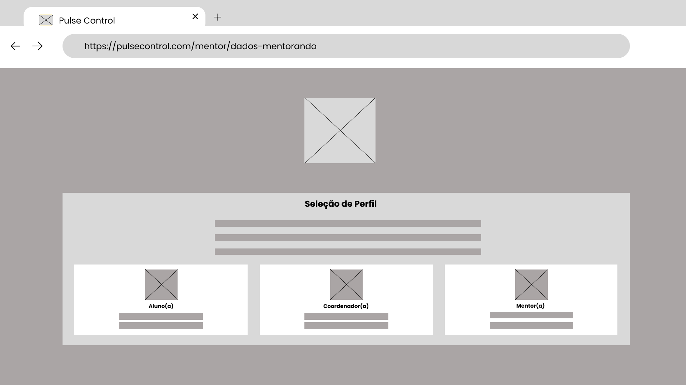<br>
  <p><b>Fonte:</b> Elaborado pelos autores, 2026</p>
</div>

### B. Fluxo do Aluno

&ensp;&ensp;&ensp;&ensp;As telas voltadas ao perfil do aluno concentram as funcionalidades de acompanhamento individual e acesso às oportunidades disponibilizadas pela Pulse Mais. É por meio dessas interfaces que o jovem visualiza seu progresso, atualiza seus dados pessoais e se mantém informado sobre os próximos eventos e atividades da organização. As três telas a seguir foram estruturadas em sequência lógica de navegação, partindo da visão geral do portal até as informações de perfil e agenda de eventos.

**a) Portal do Aluno**

&ensp;&ensp;&ensp;&ensp;A primeira tela do fluxo do aluno corresponde ao painel principal da plataforma, oferecendo uma visão consolidada do progresso e das informações mais relevantes para o jovem. A interface exibe indicadores individuais, como frequência e engajamento, além de um resumo das atividades recentes e dos próximos compromissos. Dessa forma, o portal funciona como ponto de entrada centralizado, permitindo que o aluno acompanhe sua jornada dentro da organização de forma clara e acessível.

<div align="center">
  <p><b>Imagem 16 -</b> Portal do Aluno</p>
  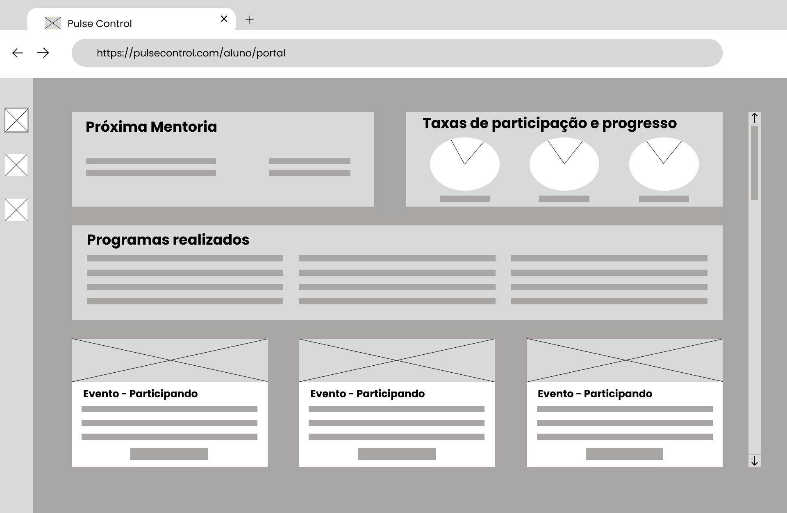<br>
  <p><b>Fonte:</b> Elaborado pelos autores, 2026</p>
</div>

**b) Eventos do Aluno**

&ensp;&ensp;&ensp;&ensp;A segunda tela apresenta a agenda de eventos, workshops e oportunidades disponibilizados pela Pulse Mais ao aluno. A interface lista os próximos eventos com suas respectivas datas e descrições, garantindo que o jovem tenha acesso centralizado às informações sobre as atividades da organização e possa se programar com antecedência para participar das iniciativas disponíveis.

<div align="center">
  <p><b>Imagem 17 -</b> Eventos do Aluno</p>
  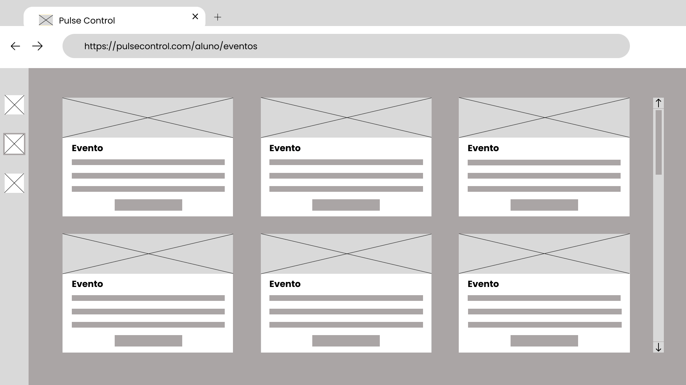<br>
  <p><b>Fonte:</b> Elaborado pelos autores, 2026</p>
</div>

**c) Perfil do Aluno**

&ensp;&ensp;&ensp;&ensp;A terceira tela exibe os dados individuais do aluno em uma interface organizada, contemplando informações cadastrais e de contato passíveis de atualização diretamente pelo próprio jovem. O painel permite que o aluno edite seus dados pessoais e visualize suas informações registradas na plataforma, em atendimento à US06, que trata da necessidade de manter os dados de contato atualizados sem depender da equipe interna da Pulse Mais.

<div align="center">
  <p><b>Imagem 18 -</b> Perfil do Aluno</p>
  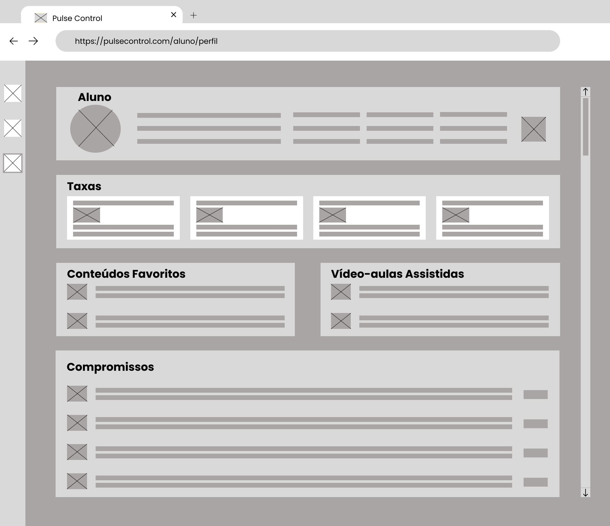<br>
  <p><b>Fonte:</b> Elaborado pelos autores, 2026</p>
</div>

### C. Fluxo da Coordenação

&ensp;&ensp;&ensp;&ensp;As telas voltadas ao perfil de coordenação concentram as funcionalidades de maior responsabilidade operacional e estratégica da plataforma. É por meio dessas interfaces que a equipe interna da Pulse Mais monitora indicadores de impacto, gerencia o histórico dos alunos, acompanha as mentorias ativas e comunica oportunidades à comunidade. As seis telas a seguir foram estruturadas em sequência lógica de navegação, partindo da visão macro dos dados institucionais até os perfis individuais dos usuários.

**a) Dashboard de Impacto - Empregabilidade e Renda**

&ensp;&ensp;&ensp;&ensp;A primeira tela do perfil de coordenação corresponde ao painel inicial do dashboard de impacto, com foco nos indicadores de empregabilidade e evolução financeira dos jovens atendidos. A interface exibe os índices de empregabilidade e de ingresso no ensino superior, bem como gráficos de variação da renda dos jovens, variação salarial e flutuação no número de jovens empregados. O objetivo dessa tela é oferecer à coordenação uma visão longitudinal do impacto real gerado pela organização, viabilizando a geração de relatórios para financiadores e embasando decisões estratégicas com dados concretos.

<div align="center">
  <p><b>Imagem 19 -</b> Dashboard de Impacto - Empregabilidade e Renda</p>
  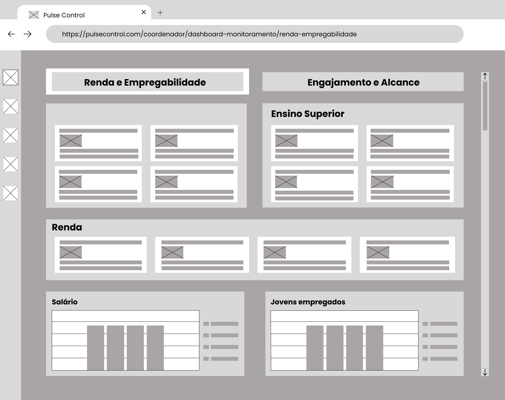<br>
  <p><b>Fonte:</b> Elaborado pelos autores, 2026</p>
</div>

**b) Dashboard de Impacto - Engajamento e Alcance**

&ensp;&ensp;&ensp;&ensp;A segunda tela complementa o dashboard de impacto com foco no engajamento e no alcance dos programas. Nesse painel, são apresentados os totais de jovens classificados em cada estágio do framework da Pulse Mais, que são os Conectados, jovens que iniciaram contato com a organização; Capacitados, aqueles que concluíram ao menos um ciclo de formação; e Transformados, os que já alcançaram inserção no mercado de trabalho ou no ensino superior. Além disso, a tela exibe o índice de jovens Transformados que estão empregados, a análise dos índices de evasão e as taxas gerais dos alunos referentes à participação em eventos e em aulas. Desse modo, essa visão integrada permite à coordenação identificar gargalos no percurso dos jovens e agir preventivamente sobre os pontos de maior risco de abandono.

<div align="center">
  <p><b>Imagem 20 -</b> Dashboard de Impacto - Engajamento e Alcance</p>
  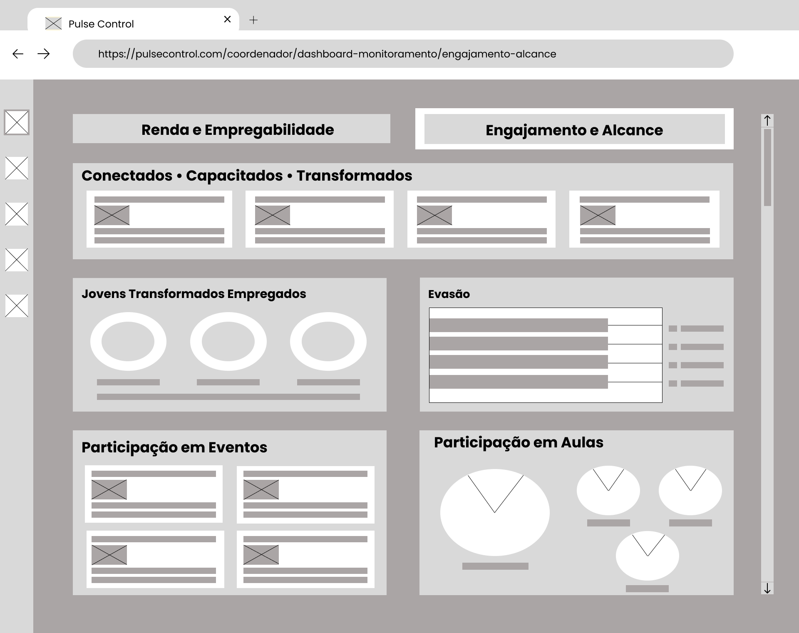<br>
  <p><b>Fonte:</b> Elaborado pelos autores, 2026</p>
</div>

**c) Página do Aluno**

&ensp;&ensp;&ensp;&ensp;A terceira tela concentra todas as informações de um aluno em uma única interface, em que é possível consultar dados de cada jovem através da barra de pesquisa. O painel conta com o perfil completo, incluindo dados cadastrais e de contato passíveis de atualização pela equipe interna da Pulse Mais, além de um segmento dedicado ao cadastro de novos alunos. Ademais, estão presentes funcionalidades de upload e download de documentos, taxas gerais do aluno pesquisado, tais como frequência e engajamento e uma linha do tempo interativa que registra e exibe a jornada do jovem dentro da organização desde sua entrada. Dessa maneira, a tela materializa as informações dos jovens de forma centralizada, sendo a interface que mais diretamente resolve a dor da fragmentação de dados levantada pela equipe da organização.

<div align="center">
  <p><b>Imagem 21 -</b> Página do Aluno</p>
  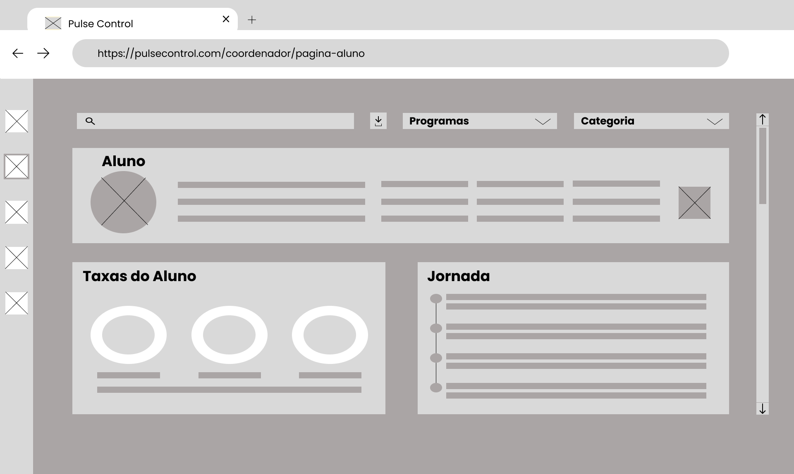<br>
  <p><b>Fonte:</b> Elaborado pelos autores, 2026</p>
</div>

**d) Dashboard de Mentoria**

&ensp;&ensp;&ensp;&ensp;A quarta tela é dedicada ao acompanhamento das mentorias em andamento. O dashboard apresenta todos os programas de mentoria ativos, com a relação de mentores e alunos inscritos em cada um. Além disso, a interface lista os mentores atualmente ativos na organização e exibe taxas gerais de mentoria, tais como frequência de sessões e alcance do programa. Por esse viés, essa visão centralizada permite à coordenação monitorar a saúde dos vínculos entre mentores e mentorados, identificar programas com baixa adesão e tomar decisões sobre redistribuição, reativação e atualização de mentorias.

<div align="center">
  <p><b>Imagem 22 -</b> Dashboard de Mentoria</p>
  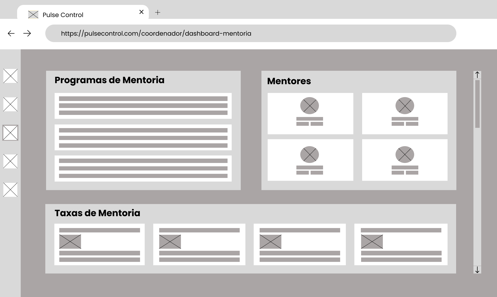<br>
  <p><b>Fonte:</b> Elaborado pelos autores, 2026</p>
</div>

**e) Página de Eventos**

&ensp;&ensp;&ensp;&ensp;A quinta tela funciona como um canal de comunicação estruturado entre a coordenação e a comunidade de alunos da Pulse Mais. Nela, são mapeados e publicados todos os eventos, workshops e vagas disponibilizados pela organização, consolidando em um único espaço as informações que hoje circulam de forma dispersa. A interface opera como uma newsletter interna, garantindo que oportunidades relevantes cheguem de forma organizada a todos os jovens da rede, independentemente do estágio em que se encontram na jornada.

<div align="center">
  <p><b>Imagem 23 -</b> Página de Eventos</p>
  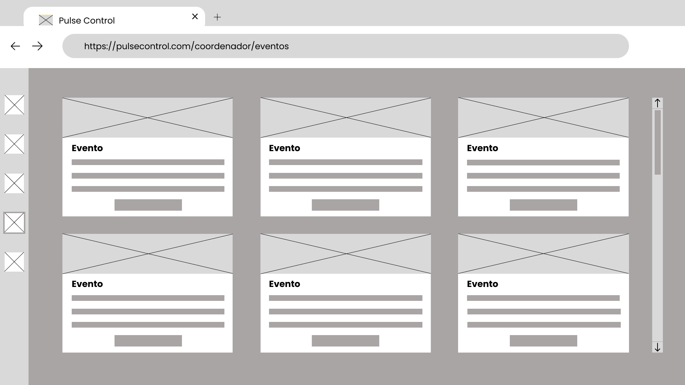<br>
  <p><b>Fonte:</b> Elaborado pelos autores, 2026</p>
</div>

**f) Perfil do Coordenador**

&ensp;&ensp;&ensp;&ensp;A sexta e última tela do perfil de coordenação exibe os dados individuais do coordenador em uma interface de distribuição estruturada. O painel conta com espaços para adição e exclusão de informações, taxas gerais do coordenador, tais como quantidade de relatórios elaborados e alunos acompanhados e um container de atividades recentes que indica qual dashboard ou tela está associada a cada ação registrada. Essa interface centraliza o histórico de atuação do coordenador na plataforma, promovendo rastreabilidade e transparência sobre as interações realizadas pela equipe interna.

<div align="center">
  <p><b>Imagem 24 -</b> Perfil do Coordenador</p>
  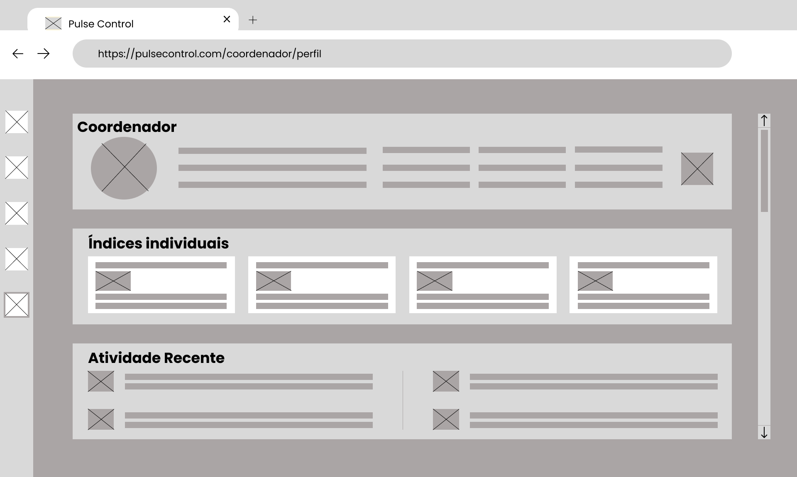<br>
  <p><b>Fonte:</b> Elaborado pelos autores, 2026</p>
</div>

### D. Fluxo do Mentor

&ensp;&ensp;&ensp;&ensp;As telas voltadas ao perfil do mentor concentram as funcionalidades de acompanhamento e preparação para as sessões de mentoria realizadas na plataforma Pulse Control. É por meio dessas interfaces que o mentor acessa o histórico de desenvolvimento de seus mentorados, consulta informações individuais dos jovens acompanhados e gerencia seus próximos compromissos de mentoria sem depender de anotações pessoais ou trocas de mensagens fora da plataforma. As três telas a seguir foram estruturadas em sequência lógica de navegação, partindo da visão geral da atuação do mentor até o acompanhamento detalhado dos mentorados e a agenda de encontros programados.

**a) Dados do Mentorando**

&ensp;&ensp;&ensp;&ensp;A tela de Dados do Mentorando concentra as principais informações do aluno acompanhado pelo mentor. Nela, é possível visualizar dados gerais do jovem, indicadores de participação e um resumo de sua trajetória dentro da Pulse Mais. A interface também apresenta informações relacionadas às atividades, eventos e mentorias realizadas pelo aluno. Assim, a tela facilita o acompanhamento do desenvolvimento do mentorando de maneira centralizada.

<div align="center">
  <p><b>Imagem 25 -</b> Dados do Mentorando</p>
  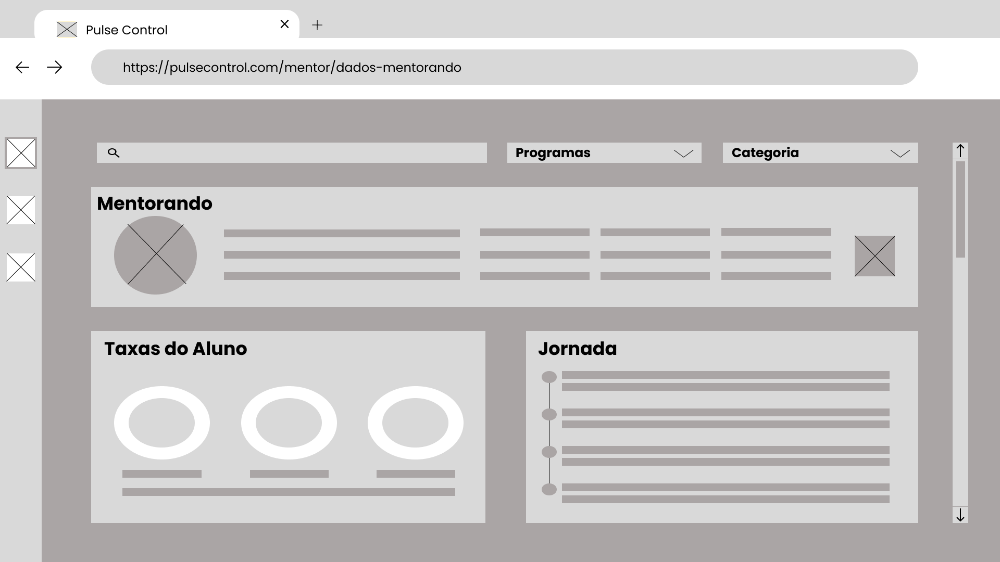<br>
  <p><b>Fonte:</b> Elaborado pelos autores, 2026</p>
</div>

**b) Dados Gerais do Mentor**

&ensp;&ensp;&ensp;&ensp;A tela de Dados Gerais organiza os compromissos de mentoria do mentor dentro da plataforma Pulse Mais. A interface apresenta os programas de mentoria em andamento, indicadores gerais das sessões e uma listagem dos encontros agendados. As sessões são exibidas de forma organizada, permitindo ao mentor acompanhar sua agenda e acessar rapidamente as chamadas de mentoria. Dessa maneira, a tela torna o gerenciamento dos encontros mais prático e acessível.

<div align="center">
  <p><b>Imagem 26 -</b> Dados Gerais</p>
  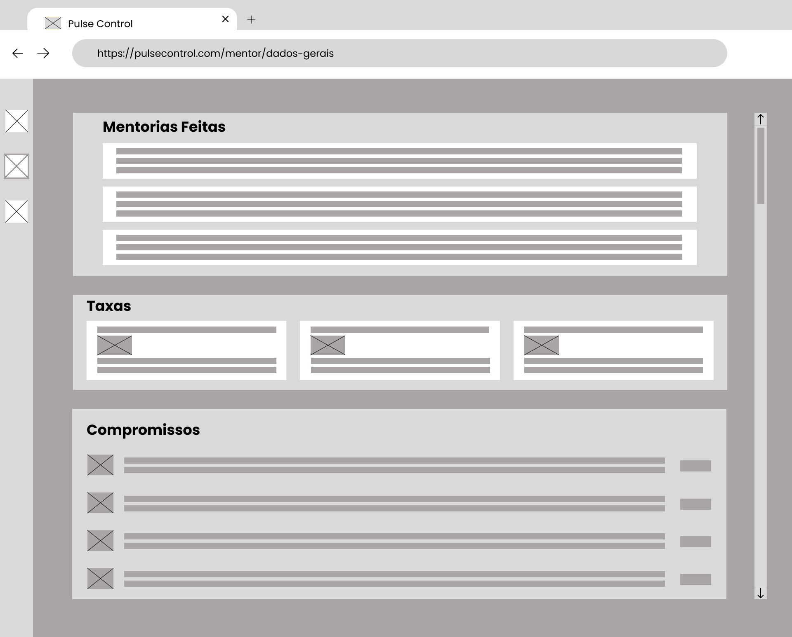<br>
  <p><b>Fonte:</b> Elaborado pelos autores, 2026</p>
</div>

**c) Perfil do Mentor**

&ensp;&ensp;&ensp;&ensp;A tela de Perfil do Mentor apresenta, de forma simples e organizada, as principais informações relacionadas ao mentor dentro da plataforma Pulse Mais. A interface reúne dados pessoais e profissionais, além de indicadores gerais sobre sua atuação nas mentorias. Também são exibidos registros recentes de atividades e materiais compartilhados com os mentorandos. Dessa forma, a tela oferece uma visão geral da participação do mentor na plataforma.

<div align="center">
  <p><b>Imagem 27 -</b> Perfil do Mentor</p>
  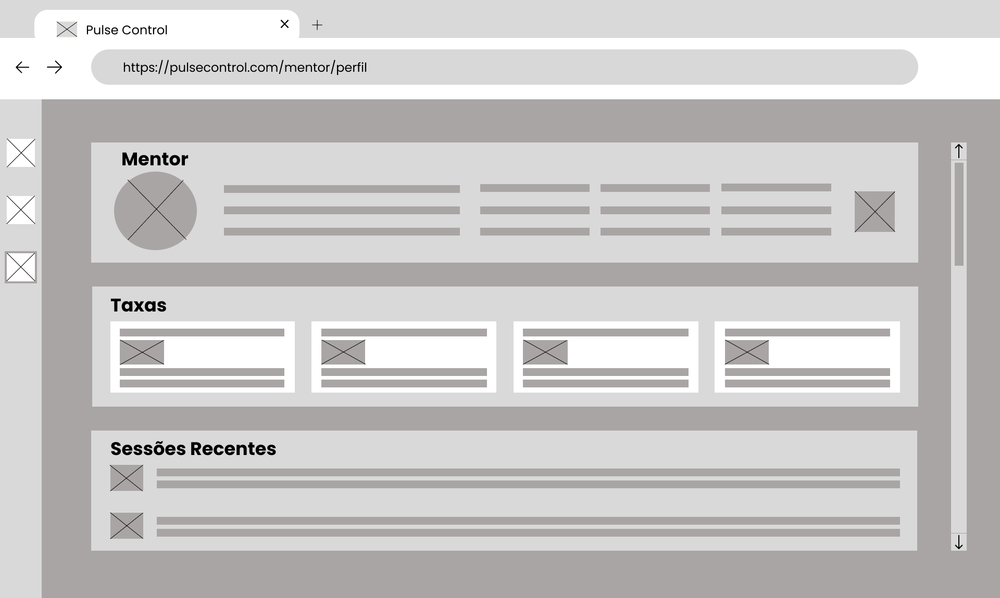<br>
  <p><b>Fonte:</b> Elaborado pelos autores, 2026</p>
</div>

## <a name="c3.4"></a>3.4. Guia de estilos

&ensp;&ensp;&ensp;&ensp;O guia de estilos é um documento de referência visual que consolida as decisões estéticas e de interface tomadas ao longo do projeto, funcionando como a fonte de verdade para a consistência visual da plataforma. Seu propósito é garantir que todos os elementos gráficos, tais como cores, tipografia, espaçamentos, iconografia e componentes, sejam aplicados de forma padronizada em todas as telas, independentemente de quem os desenvolva ou implemente.

&ensp;&ensp;&ensp;&ensp;Para o Pulse Control, o guia foi estruturado em cinco categorias, sendo elas a paleta de cores, tipografia, proporções e espaçamentos, iconografia e elementos de interface. Cada categoria apresenta os padrões definidos acompanhados de diretrizes objetivas de uso, garantindo que a identidade visual da plataforma seja mantida de forma coerente desde os protótipos até a implementação final. Por fim, as decisões refletem tanto a identidade da parceira Pulse Mais quanto as necessidades de legibilidade, acessibilidade e usabilidade identificadas durante o processo de design.

&ensp;&ensp;&ensp;&ensp;Para acessar o guia completo <a href="https://www.figma.com/design/KB1fg7pLeAaQn2OgnLmJlI/Untitled?node-id=0-1&t=6dnUXIb7RORRk303-1">Clique aqui</a>

<div align="center">
  <p><b>Imagem 28 -</b> Capa</p>
  <br>
  <p><b>Fonte:</b> Elaborado pelos autores, 2026</p>
</div>

### 3.4.1 Cores

&ensp;&ensp;&ensp;&ensp;A paleta de cores do Guia de Estilo do Pulse Control foi selecionada para refletir a identidade visual da plataforma, garantindo o contraste adequado e a legibilidade da interface. A seguir, apresentam-se as cores fundamentais do projeto, acompanhadas de seus respectivos códigos de identificação e diretrizes de aplicação no sistema.

<div align="center">
  <p><b>Imagem 29 -</b> Paleta de Cores</p>
  <br>
  <p><b>Fonte:</b> Elaborado pelos autores, 2026</p>
</div>

### 3.4.2 Tipografia

&ensp;&ensp;&ensp;&ensp;A tipografia do Guia de Estilo do Pulse control segue, em linhas gerais, o modelo apresentado pelo site da parceira. Os seis estilos foram definidos para suprir todas as necessidades do projeto e demonstrar um contraste entre sí, mesmo sendo de cores iguais.

<div align="center">
  <p><b>Imagem 30 -</b> Tipografia</p>
  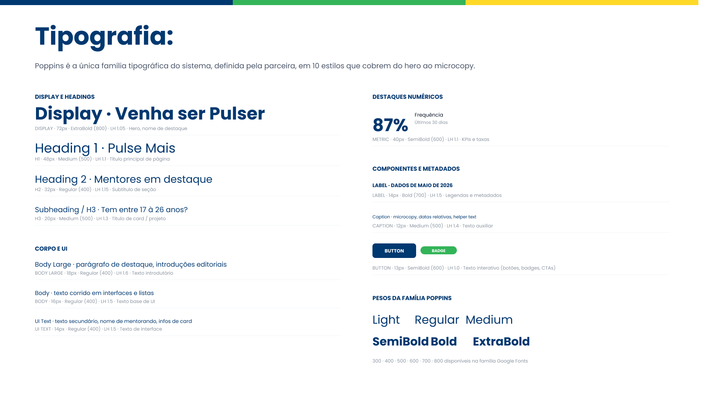<br>
  <p><b>Fonte:</b> Elaborado pelos autores, 2026</p>
</div>

### 3.4.3 Proporções

&ensp;&ensp;&ensp;&ensp;As proporções e o sistema de espaçamento foram definidos para assegurar a harmonia visual e o alinhamento consistente em todas as telas do sistema. O modelo adota uma lógica de escala que orienta o dimensionamento dos componentes e a distribuição do conteúdo de forma equilibrada.

<div align="center">
  <p><b>Imagem 31 -</b> Proporções</p>
  <br>
  <p><b>Fonte:</b> Elaborado pelos autores, 2026</p>
</div> 

### 3.4.4 Iconografia

&ensp;&ensp;&ensp;&ensp;A iconografia foi integralmente extraída da biblioteca open source Lucide, selecionada por sua linguagem visual limpa e alinhada à identidade da plataforma. Os ícones adotados cobrem as principais ações e categorias de navegação do sistema, além de serem acompanhados de seus nomes de referência. 

<div align="center">
  <p><b>Imagem 32 -</b> Iconografia</p>
  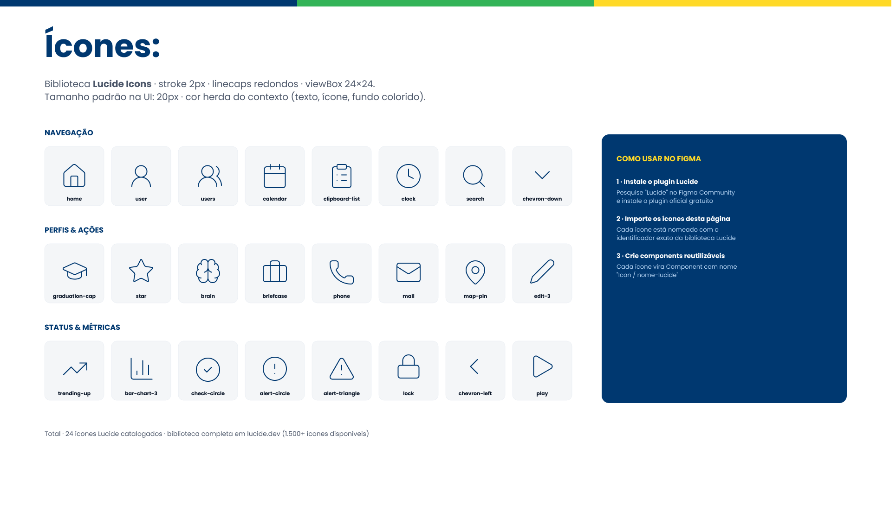<br>
  <p><b>Fonte:</b> Elaborado pelos autores, 2026</p>
</div>

### 3.4.5 Elementos

&ensp;&ensp;&ensp;&ensp;Os elementos de interface (UI) compreendem os componentes padronizados que estruturam o layout, tais como botões, formulários e cartões. A definição visual e de estados desses blocos construtivos visa garantir a consistência da plataforma e uma navegação intuitiva para o usuário.

<div align="center">
  <p><b>Imagem 33 -</b> Elementos</p>
  <br>
  <p><b>Fonte:</b> Elaborado pelos autores, 2026</p>
</div>

### <a name="c3.5"></a>3.5 Protótipo de alta fidelidade

&ensp;&ensp;&ensp;&ensp;O protótipo de alta fidelidade é a representação visual mais próxima do produto final, incorporando as decisões estéticas definidas no guia de estilos (cores, tipografia, proporções, iconografia e elementos) sobre os fluxos e layouts estruturados nos wireframes. Seu propósito é materializar a experiência de uso real de cada perfil antes da implementação, permitindo a validação de interfaces, hierarquias visuais e interações com maior precisão e menor custo de retrabalho.

&ensp;&ensp;&ensp;&ensp;Para o Pulse Control, os protótipos foram desenvolvidos para as cinco personas mapeadas no projeto, sendo elas o Coordenador, Aluno, Mentor, Psicólogo e Gestor, cada uma com suas respectivas telas e fluxos prioritários. A tela de seleção de perfil, exibida acima, serve como ponto de entrada comum a todos os usuários, direcionando cada um à sua experiência personalizada na plataforma.

&ensp;&ensp;&ensp;&ensp;Para acessar o protótipo completo <a href="https://www.figma.com/design/HmHL8U6MvXTEBJkMsYEpeK/Prot%C3%B3tipo-de-Alta-fidelidade---Pulse-Control?node-id=0-1&t=nYw54Vd5OA6dy5sX-1">Clique aqui</a>

<div align="center">
  <p><b>Imagem 34 -</b> Seleção de Perfil</p>
  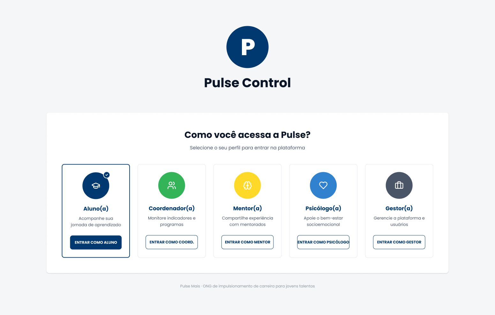<br>
  <p><b>Fonte:</b> Elaborado pelos autores, 2026</p>
</div>

### 3.5.1 Protótipo do Coordenador

&ensp;&ensp;&ensp;&ensp;O protótipo do Coordenador foi desenvolvido para atender às necessidades da persona Joana Moura, cuja principal demanda é a visualização consolidada de indicadores de impacto social e o acompanhamento operacional dos jovens da plataforma.

&ensp;&ensp;&ensp;&ensp;A interface contempla seis telas principais, o perfil do coordenador, que centraliza dados de acesso e configurações da conta, o dashboard de impacto, divida em métricas de renda & empregabilidade e engajamento & alcance, o fluxo de eventos, que permite o gerenciamento e a visualização das atividades em andamento, o dashboard de mentoria, que consolida indicadores sobre os vínculos e sessões ativas e a página de perfil individual do aluno, que oferece uma visão completa da trajetória e dos dados de cada jovem cadastrado.

<div align="center">
  <p><b>Imagem 35 -</b> Coordenador Perfil</p>
  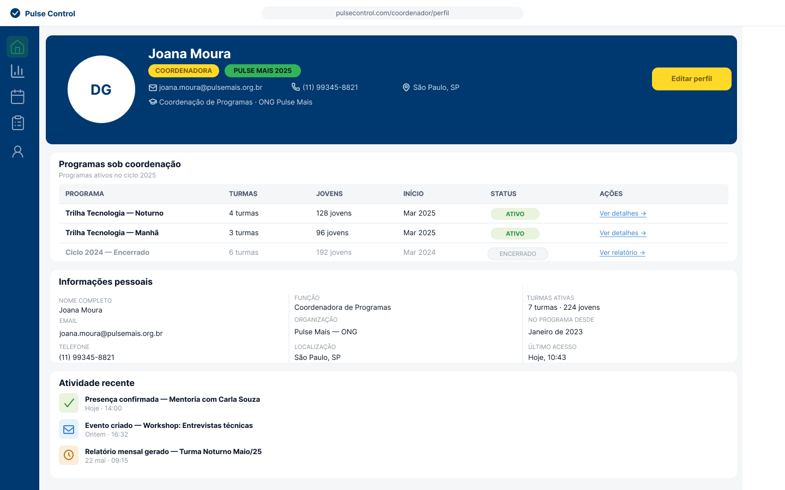<br>
  <p><b>Fonte:</b> Elaborado pelos autores, 2026</p>
</div>

<div align="center">
  <p><b>Imagem 36 -</b> Dashboard de Impacto (Engajamento e Alcance)</p>
  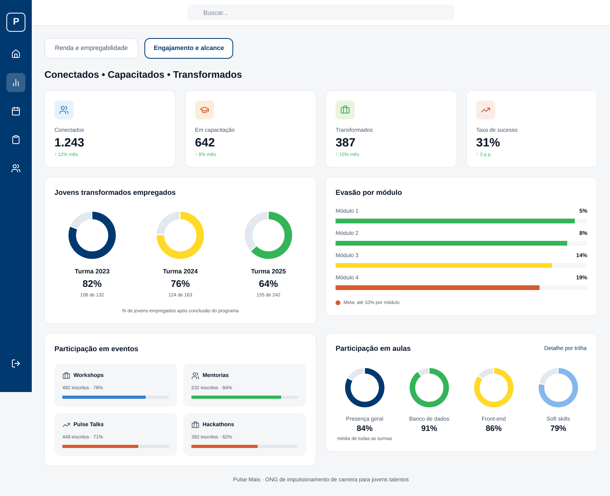<br>
  <p><b>Fonte:</b> Elaborado pelos autores, 2026</p>
</div>

<div align="center">
  <p><b>Imagem 37 -</b> Dashboard de Impacto (Renda e Empregabilidade)</p>
  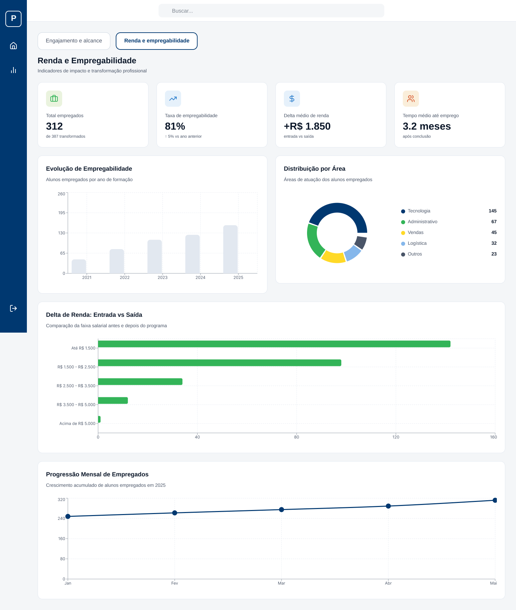<br>
  <p><b>Fonte:</b> Elaborado pelos autores, 2026</p>
</div>

<div align="center">
  <p><b>Imagem 38 -</b> Fluxo de Eventos</p>
  <br>
  <p><b>Fonte:</b> Elaborado pelos autores, 2026</p>
</div>

<div align="center">
  <p><b>Imagem 39 -</b> Dashboard de Mentoria</p>
  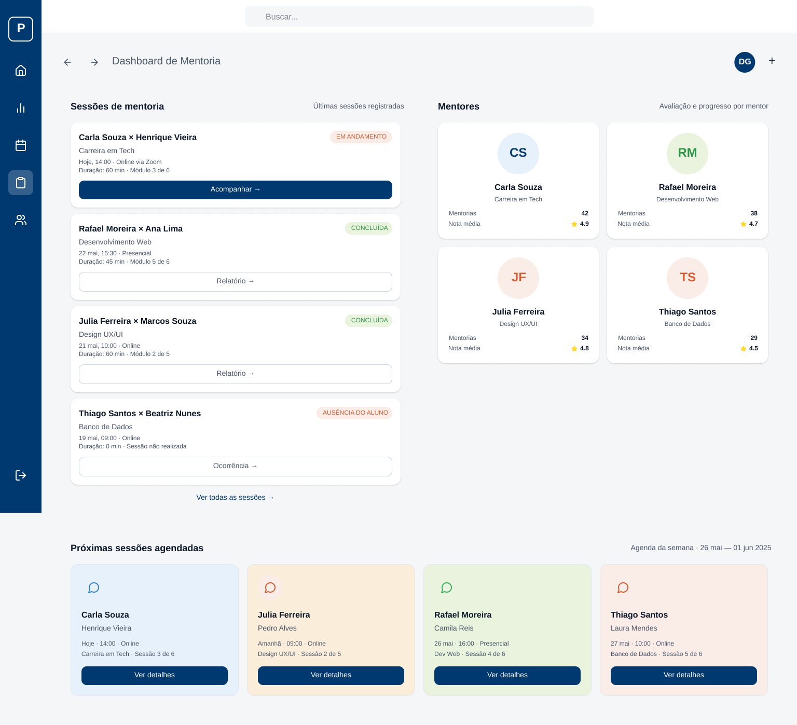<br>
  <p><b>Fonte:</b> Elaborado pelos autores, 2026</p>
</div>

<div align="center">
  <p><b>Imagem 40 -</b> Página do Aluno</p>
  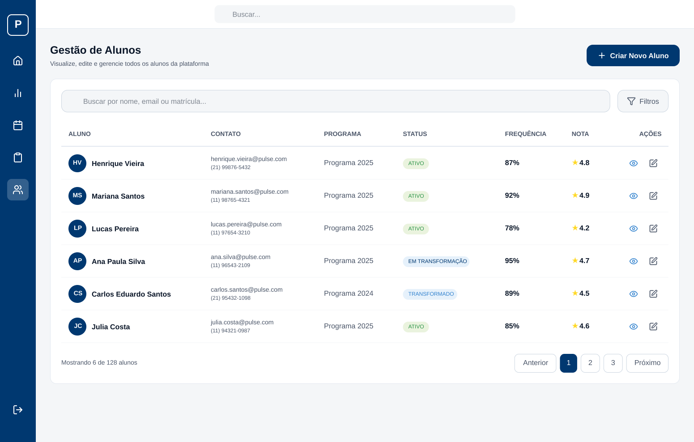<br>
  <p><b>Fonte:</b> Elaborado pelos autores, 2026</p>
</div>

### 3.5.2 Protótipo do Aluno

&ensp;&ensp;&ensp;&ensp;O protótipo do Aluno foi desenvolvido para atender às necessidades da persona Henrique Vieira, cujo principal ponto de contato com a plataforma é o acompanhamento da própria trajetória e a manutenção dos dados cadastrais atualizados.                                     

&ensp;&ensp;&ensp;&ensp;A interface contempla três telas principais, o dashboard, que apresenta ao jovem um resumo dos seus indicadores de engajamento, frequência e progresso no programa, o perfil, que concentra os dados pessoais e de contato editáveis pelo próprio aluno e a página de eventos, que exibe as atividades disponíveis e as inscrições realizadas, permitindo ao jovem acompanhar e planejar sua participação nas iniciativas da Pulse Mais.

<div align="center">
  <p><b>Imagem 41 -</b> Dashboard do Aluno</p>
  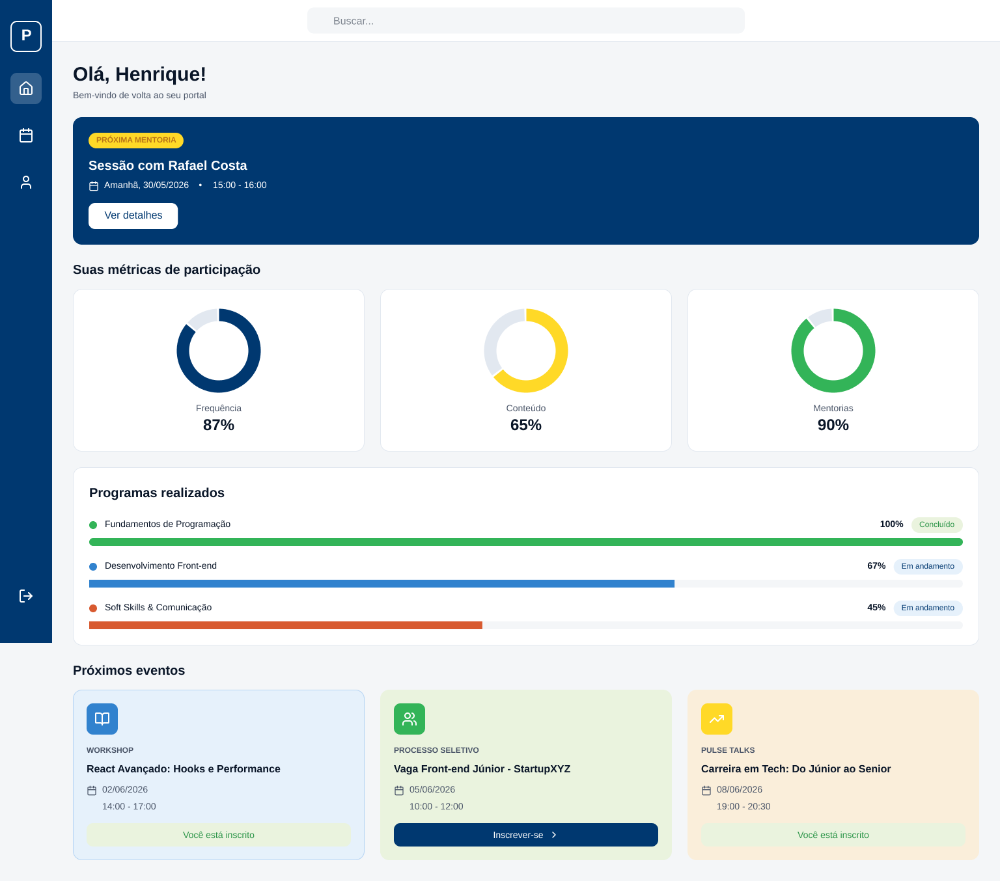<br>
  <p><b>Fonte:</b> Elaborado pelos autores, 2026</p>
</div>

<div align="center">
  <p><b>Imagem 42 -</b> Perfil do Aluno</p>
  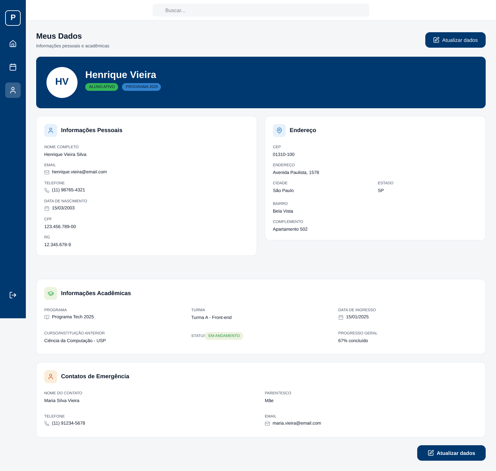<br>
  <p><b>Fonte:</b> Elaborado pelos autores, 2026</p>
</div>

<div align="center">
  <p><b>Imagem 43 -</b> Página de Eventos</p>
  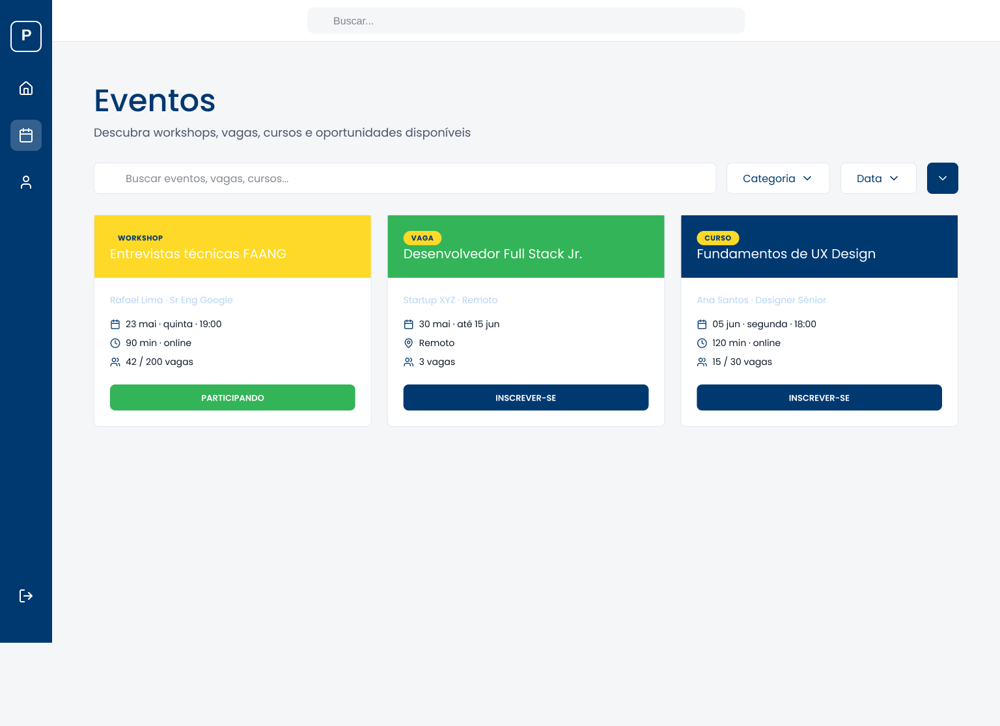<br>
  <p><b>Fonte:</b> Elaborado pelos autores, 2026</p>
</div>

### 3.5.3 Protótipo do Mentor

&ensp;&ensp;&ensp;&ensp;O protótipo do Mentor foi desenvolvido para atender às necessidades da persona Daniel Souza, cuja rotina na plataforma gira em torno do acompanhamento dos mentorados e da gestão dos encontros de mentoria.                                                                    

&ensp;&ensp;&ensp;&ensp;A interface contempla três telas principais, o dashboard, que apresenta os programas de mentoria em andamento, os indicadores gerais das sessões e a agenda de encontros agendados, a página de dados do mentorando, que reúne o perfil e o histórico do jovem vinculado e o perfil do mentor, que centraliza suas informações pessoais e profissionais, além de um resumo de sua atuação.

<div align="center">
  <p><b>Imagem 44 -</b> Dashboard do Mentor</p>
  <br>
  <p><b>Fonte:</b> Elaborado pelos autores, 2026</p>
</div>

<div align="center">
  <p><b>Imagem 45 -</b> Dados do Mentorando</p>
  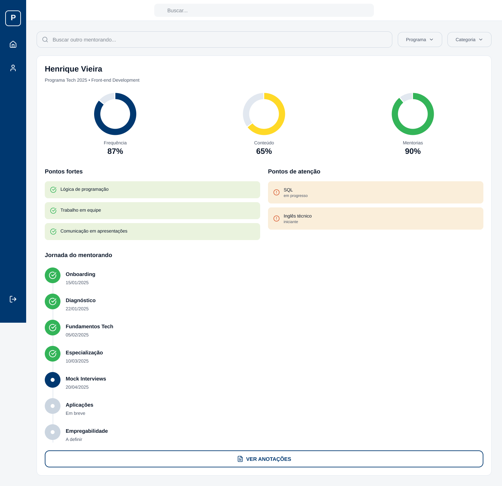<br>
  <p><b>Fonte:</b> Elaborado pelos autores, 2026</p>
</div>

<div align="center">
  <p><b>Imagem 46 -</b> Perfil do Mentor</p>
  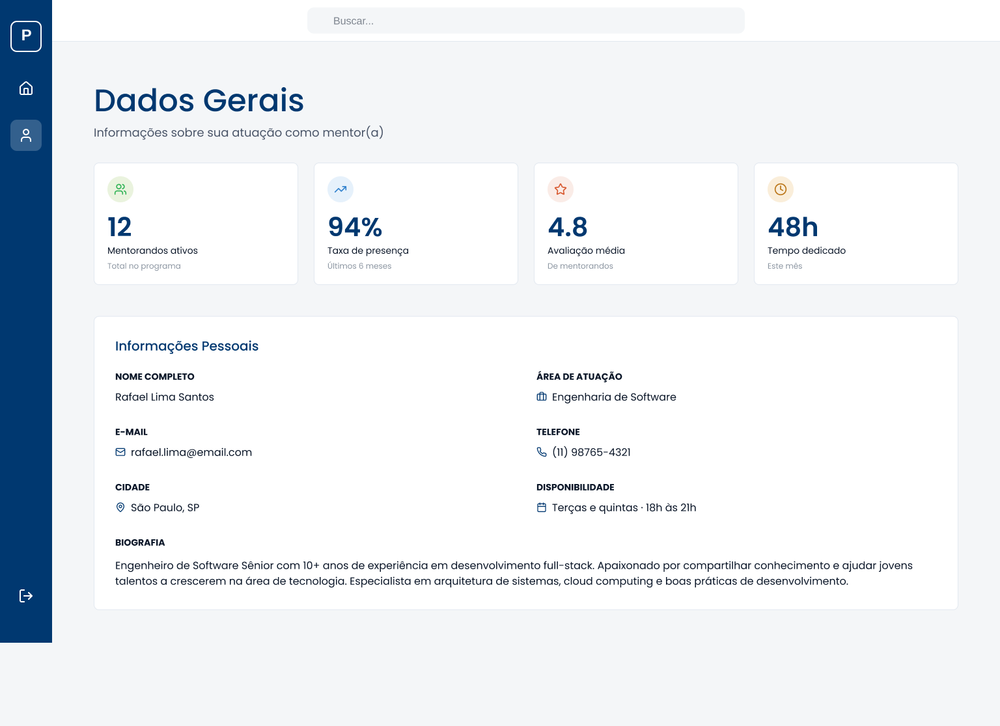<br>
  <p><b>Fonte:</b> Elaborado pelos autores, 2026</p>
</div>

### 3.5.4 Protótipo do Psicólogo

&ensp;&ensp;&ensp;&ensp;O protótipo do Psicólogo foi desenvolvido para atender às necessidades da persona Diego Goia, cuja atuação na plataforma está centrada no acompanhamento da saúde mental dos jovens que lhe são atribuídos.                                                                    

&ensp;&ensp;&ensp;&ensp;A interface contempla três telas principais, o dashboard, que apresenta um panorama dos jovens sob acompanhamento e os alertas de risco mais recentes, o perfil do psicólogo, que organiza seus dados profissionais e fornece indicadores sobre sua atuação nos atendimentos e o prontuário, que concentra os registros de saúde mental do jovem com visibilidade restrita ao perfil autorizado, garantindo a confidencialidade das informações e a conformidade com as regras de acesso definidas no sistema.

<div align="center">
  <p><b>Imagem 47 -</b> Dashboard do Psicólogo</p>
  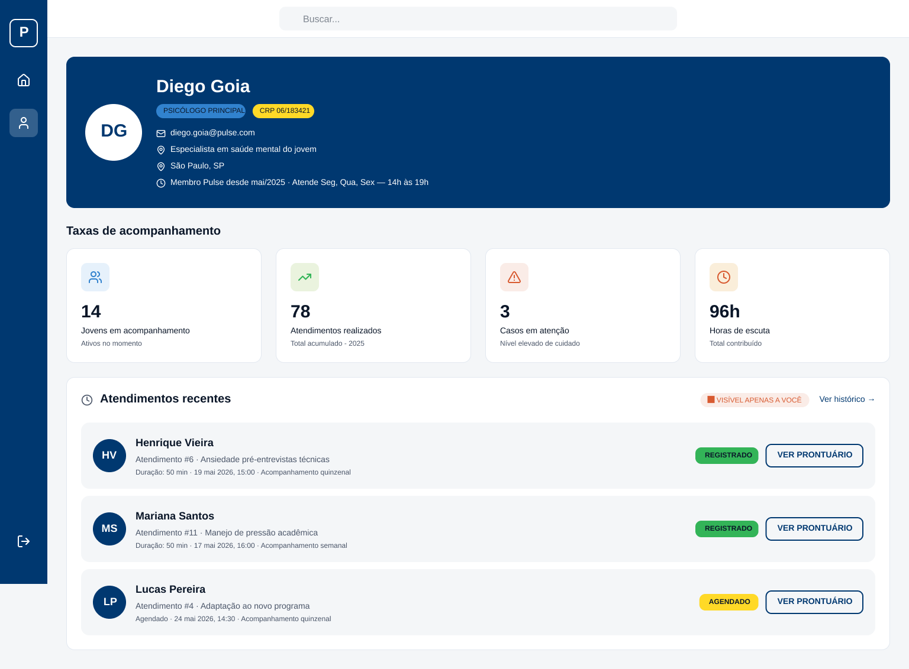<br>
  <p><b>Fonte:</b> Elaborado pelos autores, 2026</p>
</div>

<div align="center">
  <p><b>Imagem 48 -</b> Perfil do Psicólogo</p>
  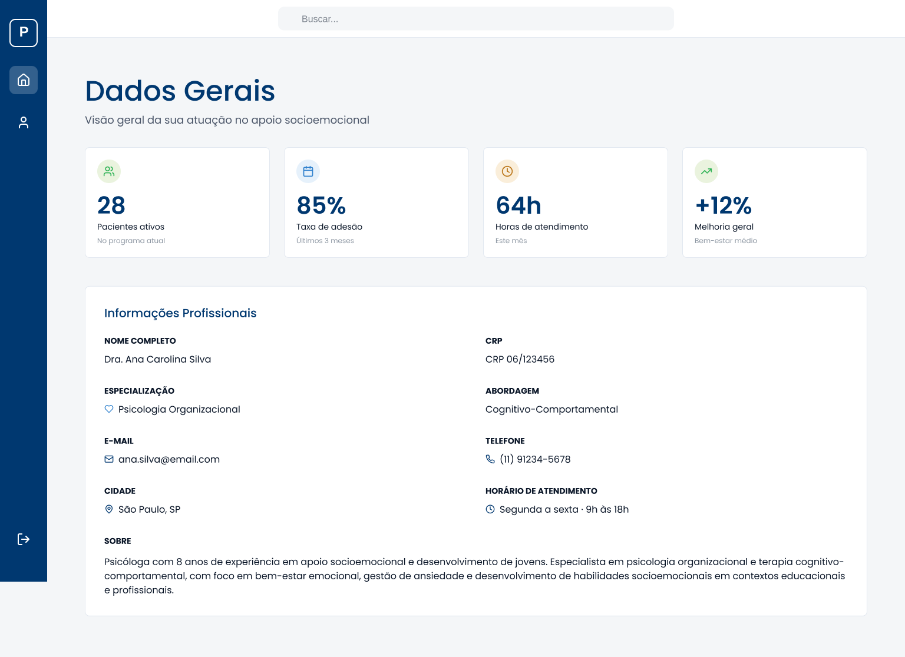<br>
  <p><b>Fonte:</b> Elaborado pelos autores, 2026</p>
</div>

<div align="center">
  <p><b>Imagem 49 -</b> Prontuário do Psicólogo</p>
  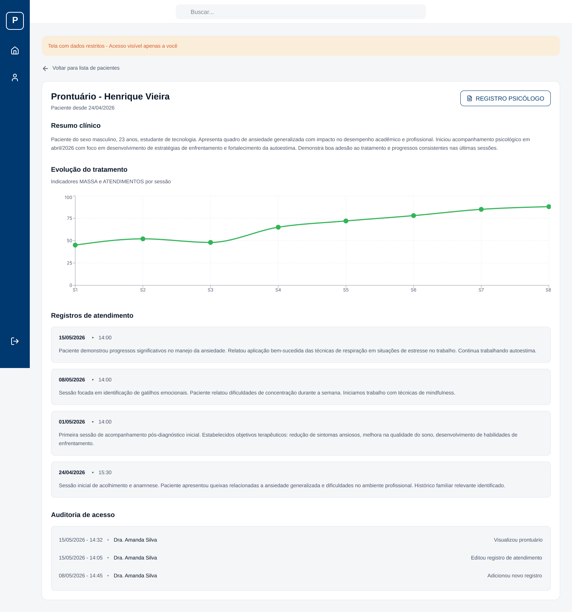<br>
  <p><b>Fonte:</b> Elaborado pelos autores, 2026</p>
</div>

### 3.5.5 Protótipo Gestor

&ensp;&ensp;&ensp;&ensp;O protótipo do Gestor foi desenvolvido para atender às necessidades da persona Gabriela Almeida, cujo papel na plataforma é estratégico e orientado à leitura consolidada de dados para embasar decisões institucionais. 

&ensp;&ensp;&ensp;&ensp;A interface contempla duas telas principais, o dashboard do gestor, que contempla o panorama geral da plata forma e a dashboard de impacto que reúne os principais indicadores de impacto da organização, engajamento, empregabilidade, frequência e progressão dos jovens no framework da Pulse Mais, em uma visualização clara e de fácil interpretação.

<div align="center">
  <p><b>Imagem 50 -</b> Dashboard do Gestor</p>
  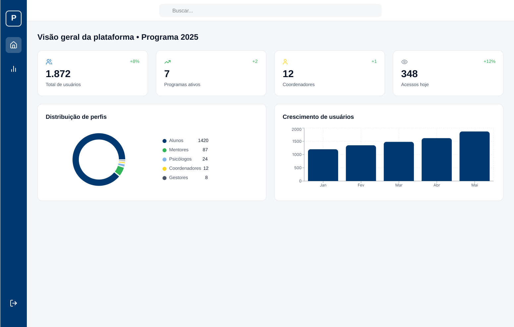<br>
  <p><b>Fonte:</b> Elaborado pelos autores, 2026</p>
</div>

<div align="center">
  <p><b>Imagem 51 -</b> Dashboard de Impacto (Engajamento e Alcance)</p>
  <br>
  <p><b>Fonte:</b> Elaborado pelos autores, 2026</p>
</div>

<div align="center">
  <p><b>Imagem 52 -</b> Dashboard de Impacto (Renda e Empregabilidade)</p>
  <br>
  <p><b>Fonte:</b> Elaborado pelos autores, 2026</p>
</div>

## <a name="c3.6"></a> 3.6. Modelagem do Banco de bados 

### <a name="c3.6.1"></a>3.6.1. Modelo Entidade-Relacionamento (ER) 

&ensp;&ensp;&ensp;&ensp;O Modelo Entidade-Relacionamento (ER) conceitual representa a estrutura de informação do domínio da Pulse Mais em seu nível mais abstrato, independente de qualquer tecnologia de banco de dados. A notação adotada de forma consistente em todo o modelo é a de Peter Chen, escolhida por sua expressividade semântica, já que ela distingue visualmente entidades (retângulos), atributos (elipses), relacionamentos (losangos) e permite a representação de atributos multivalorados e entidades fracas, elementos presentes neste domínio. Abaixo, está o modelo aplicado na solução, adicionado ao sumário de conceituação dos símbolos.

<div align="center">
  <p><b>Imagem 53 -</b> MER Conceitual</p>
  <br>
  <p><b>Fonte:</b> Elaborado pelos autores, 2026</p>
</div>

<div align="center">
  <p><b>Imagem 54 -</b> MER Conceitual</p>
  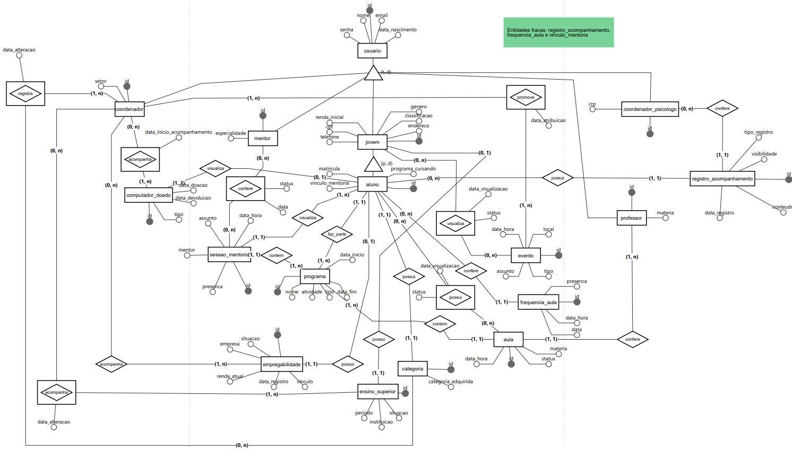<br>
  <p><b>Fonte:</b> Elaborado pelos autores, 2026</p>
</div>

### <a name="c3.6.2"></a>3.6.2. Diagrama Entidade-Relacionamento (DER)

&ensp;&ensp;&ensp;&ensp;O Diagrama Entidade-Relacionamento representa a estrutura lógica do banco de dados da plataforma, exibindo todas as entidades do sistema, seus atributos, chaves primárias (PK), chaves estrangeiras (FK) e os relacionamentos entre elas com as respectivas cardinalidades. O diagrama serve como mapa central do modelo de dados, permitindo visualizar como as informações dos jovens, usuários, programas, mentorias e registros de acompanhamento estão organizadas e interligadas. Ele foi construído de forma coerente com o Diagrama de Classes, garantindo que as entidades, atributos e associações definidas no nível de design do sistema se reflitam fielmente na estrutura do banco.

<div align="center">
  <p><b>Imagem 56 -</b> Diagrama Entidade-Relacionamento</p>


```mermaid
erDiagram

    jovem {
        int id PK
        varchar nome
        varchar email
        varchar telefone
        varchar cpf
        date data_nascimento
        varchar endereco
        varchar genero
        decimal renda_inicial
        varchar categoria_atual
        datetime criado_em
        datetime atualizado_em
        varchar status_global
    }

    usuario {
        int id PK
        int id_jovem FK
        varchar nome
        varchar email
        varchar perfil
        datetime criado_em
    }

    programa {
        int id PK
        varchar nome
        text descricao
        date data_inicio
        date data_fim
    }

    aula {
        int id PK
        int id_programa FK
        varchar nome
        datetime data
    }

    evento {
        int id PK
        varchar nome
        datetime data
        text descricao
    }

    categoria {
        int id PK
        int id_jovem FK
        int id_usuario FK
        varchar categoria_adquirida
        varchar categoria_anterior
        datetime data_inclusao
    }

    inscricao_programa {
        int id PK
        int id_jovem FK
        int id_programa FK
        varchar status_conclusao
        date data_matricula
        date data_status
    }

    frequencia_aula {
        int id PK
        int id_jovem FK
        int id_aula FK
        varchar aula
        date data
        boolean presente
    }

    participacao_evento {
        int id PK
        int id_jovem FK
        int id_evento FK
        varchar evento
        date data
        boolean presente
    }

    empregabilidade {
        int id PK
        int id_jovem FK
        varchar situacao
        varchar vinculo
        varchar empresa
        varchar area_atuacao
        decimal renda_atual
        date data_registro
        smallint encerrado
        date data_final
    }

    ensino_superior {
        int id PK
        int id_jovem FK
        smallint ingressou
        varchar situacao
        varchar instituicao
        date data_registro
    }

    historico_acoes {
        int id PK
        int id_usuario FK
        int id_jovem_afetado FK
        varchar acao
        varchar tabela_afetada
        text valor_anterior
        datetime data_hora
    }

    registro_acompanhamento {
        int id PK
        int id_jovem FK
        int id_autor FK
        varchar tipo_registro
        text conteudo
        varchar visibilidade
        datetime data_registro
    }

    vinculo_mentoria {
        int id PK
        int id_mentor FK
        int id_jovem FK
        varchar status_vinculo
        date data_inicio
        date data_fim
    }

    computador_doado {
        int id PK
        int id_jovem FK
        date data_doacao
        date data_devolucao
        varchar modelo
    }

    sessao_mentoria {
        int id PK
        int id_jovem FK
        int id_mentor FK
        date data
        boolean presente
    }

    %% usuario e jovem
    jovem |o--o| usuario : "possui conta"

    %% perfil do jovem
    jovem ||--o{ categoria : "tem"
    usuario |o--o{ categoria : "registra mudança"
    jovem ||--o{ empregabilidade : "possui"
    jovem ||--o| ensino_superior : "registra"

    %% programas e inscrições
    jovem ||--o{ inscricao_programa : "inscreve-se"
    programa ||--o{ inscricao_programa : "recebe"

    %% aulas e frequência
    programa ||--o{ aula : "contém"
    jovem ||--o{ frequencia_aula : "tem frequência"
    aula |o--o{ frequencia_aula : "gera registros"

    %% eventos e participação
    jovem ||--o{ participacao_evento : "participa"
    evento |o--o{ participacao_evento : "possui registros"

    %% acompanhamento
    jovem ||--o{ registro_acompanhamento : "tem"
    usuario ||--o{ registro_acompanhamento : "escreve"

    %% mentoria
    usuario ||--o{ vinculo_mentoria : "atua como mentor"
    jovem ||--o{ vinculo_mentoria : "tem vínculo"

    usuario ||--o{ sessao_mentoria : "conduz"
    jovem ||--o{ sessao_mentoria : "participa"

    %% computador doado
    jovem ||--o| computador_doado : "recebe"

    %% auditoria
    usuario ||--o{ historico_acoes : "gera"
    jovem |o--o{ historico_acoes : "é afetado"
```

  <p><b>Fonte:</b> Elaborado pelos autores, 2026</p>
</div>

### <a name="c3.6.3"></a>3.6.3. Modelo Relacional e Modelo Físico 

&ensp;&ensp;&ensp;&ensp;O modelo relacional traduz o DER para uma representação orientada à implementação, descrevendo cada tabela com suas colunas, tipos de dados e restrições. O modelo físico, por sua vez, é a materialização dessa estrutura em linguagem SQL, composto pelas migrations DDL numeradas e reproduzíveis que criam as tabelas na ordem correta de dependências, aplicando as constraints NOT NULL, UNIQUE, FOREIGN KEY e CHECK que garantem a integridade dos dados em conformidade com as regras de negócio definidas. As migrations foram estruturadas para que o banco possa ser recriado do zero em qualquer ambiente, executando os scripts em sequência sem erros.

Segue as tabelas feitas em PostgreSQL:

```sql
CREATE TABLE IF NOT EXISTS jovem (
    id               SERIAL PRIMARY KEY,
    nome             VARCHAR(100)   NOT NULL,
    email            VARCHAR(100)   NOT NULL UNIQUE,
    telefone         VARCHAR(20),
    cpf              VARCHAR(14)    UNIQUE,
    data_nascimento  DATE,
    endereco         VARCHAR(200),
    genero           VARCHAR(30),
    renda_inicial    DECIMAL(10,2),
    categoria_atual  VARCHAR(20)    NOT NULL
                         CHECK (categoria_atual IN ('Conectado', 'Capacitado', 'Transformado')),
    status_global    VARCHAR(20)
                         CHECK (status_global IN ('Ativo', 'Formado', 'Evadido', 'Inativo')),
    criado_em        TIMESTAMP      NOT NULL DEFAULT NOW(),
    atualizado_em    TIMESTAMP
);

CREATE TABLE IF NOT EXISTS usuario (
    id        SERIAL PRIMARY KEY,
    id_jovem  INTEGER UNIQUE REFERENCES jovem(id) ON DELETE SET NULL,
    nome      VARCHAR(100) NOT NULL,
    email     VARCHAR(100) NOT NULL UNIQUE,
    perfil    VARCHAR(20)  NOT NULL
                  CHECK (perfil IN ('Gestao', 'Coordenacao', 'Mentor', 'Psicologo', 'Aluno')),
    criado_em TIMESTAMP    NOT NULL DEFAULT NOW()
);

CREATE TABLE IF NOT EXISTS programa (
    id          SERIAL PRIMARY KEY,
    nome        VARCHAR(100) NOT NULL,
    descricao   TEXT,
    data_inicio DATE,
    data_fim    DATE
);

CREATE TABLE IF NOT EXISTS aula (
    id          SERIAL PRIMARY KEY,
    id_programa INTEGER      NOT NULL REFERENCES programa (id) ON DELETE CASCADE,
    nome        VARCHAR(100) NOT NULL,
    data        TIMESTAMP    NOT NULL
);

CREATE TABLE IF NOT EXISTS evento (
    id        SERIAL PRIMARY KEY,
    nome      VARCHAR(100) NOT NULL,
    data      TIMESTAMP    NOT NULL,
    descricao TEXT
);

CREATE TABLE IF NOT EXISTS categoria (
    id                  SERIAL PRIMARY KEY,
    id_jovem            INTEGER     NOT NULL REFERENCES jovem (id)    ON DELETE CASCADE,
    id_usuario          INTEGER              REFERENCES usuario (id)  ON DELETE SET NULL,
    categoria_adquirida VARCHAR(20) NOT NULL
                            CHECK (categoria_adquirida IN ('Conectado', 'Capacitado', 'Transformado')),
    categoria_anterior  VARCHAR(20)
                            CHECK (categoria_anterior IN ('Conectado', 'Capacitado', 'Transformado')),
    data_inclusao       TIMESTAMP   NOT NULL DEFAULT NOW()
);

CREATE TABLE IF NOT EXISTS inscricao_programa (
    id               SERIAL PRIMARY KEY,
    id_jovem         INTEGER     NOT NULL REFERENCES jovem (id)    ON DELETE CASCADE,
    id_programa      INTEGER     NOT NULL REFERENCES programa (id) ON DELETE CASCADE,
    status_conclusao VARCHAR(20) NOT NULL
                         CHECK (status_conclusao IN ('Em andamento', 'Concluido', 'Evadido')),
    data_matricula   DATE,
    data_status      DATE
);

CREATE TABLE IF NOT EXISTS frequencia_aula (
    id       SERIAL PRIMARY KEY,
    id_jovem INTEGER      NOT NULL REFERENCES jovem (id) ON DELETE CASCADE,
    id_aula  INTEGER      REFERENCES aula (id) ON DELETE SET NULL,
    aula     VARCHAR(100) NOT NULL,
    data     DATE,
    presente BOOLEAN NOT NULL
);

CREATE TABLE IF NOT EXISTS participacao_evento (
    id        SERIAL PRIMARY KEY,
    id_jovem  INTEGER      NOT NULL REFERENCES jovem (id)   ON DELETE CASCADE,
    id_evento INTEGER      REFERENCES evento (id) ON DELETE SET NULL,
    evento    VARCHAR(100) NOT NULL,
    data      DATE,
    presente  BOOLEAN NOT NULL
);

CREATE TABLE IF NOT EXISTS empregabilidade (
    id            SERIAL PRIMARY KEY,
    id_jovem      INTEGER     NOT NULL REFERENCES jovem (id) ON DELETE CASCADE,
    situacao      VARCHAR(20) NOT NULL
                      CHECK (situacao IN ('Empregado', 'Procurando')),
    vinculo       VARCHAR(20)
                      CHECK (vinculo IN ('Jovem Aprendiz', 'Estagio', 'Efetivado')),
    empresa       VARCHAR(100),
    area_atuacao  VARCHAR(100),
    renda_atual   DECIMAL(10,2),
    data_registro DATE        NOT NULL,
    encerrado     SMALLINT    NOT NULL DEFAULT 0 CHECK (encerrado IN (0, 1)),
    data_final    DATE
);

CREATE TABLE IF NOT EXISTS ensino_superior (
    id            SERIAL PRIMARY KEY,
    id_jovem      INTEGER     NOT NULL UNIQUE REFERENCES jovem (id) ON DELETE CASCADE,
    ingressou     SMALLINT    NOT NULL CHECK (ingressou IN (0, 1)),
    situacao      VARCHAR(20) NOT NULL
                      CHECK (situacao IN ('Bolsista', 'Pagante')),
    instituicao   VARCHAR(100),
    data_registro DATE        NOT NULL
);

CREATE TABLE IF NOT EXISTS historico_acoes (
    id               SERIAL PRIMARY KEY,
    id_usuario       INTEGER      NOT NULL REFERENCES usuario (id),
    id_jovem_afetado INTEGER      REFERENCES jovem (id) ON DELETE SET NULL,
    acao             VARCHAR(100) NOT NULL,
    tabela_afetada   VARCHAR(50),
    valor_anterior   TEXT,
    data_hora        TIMESTAMP    NOT NULL DEFAULT NOW()
);

CREATE TABLE IF NOT EXISTS registro_acompanhamento (
    id            SERIAL PRIMARY KEY,
    id_jovem      INTEGER     NOT NULL REFERENCES jovem (id)    ON DELETE CASCADE,
    id_autor      INTEGER     NOT NULL REFERENCES usuario (id)  ON DELETE CASCADE,
    tipo_registro VARCHAR(30) NOT NULL
                      CHECK (tipo_registro IN (
                          'Acompanhamento_Psicologico',
                          'Mentoria',
                          'Atendimento_Equipe'
                      )),
    visibilidade  VARCHAR(25) NOT NULL DEFAULT 'Publico_Equipe'
                      CHECK (visibilidade IN ('Publico_Equipe', 'Restrito_Psicologia')),
    conteudo      TEXT        NOT NULL,
    data_registro TIMESTAMP   NOT NULL DEFAULT NOW()
);

CREATE TABLE IF NOT EXISTS vinculo_mentoria (
    id             SERIAL PRIMARY KEY,
    id_mentor      INTEGER     NOT NULL REFERENCES usuario (id) ON DELETE CASCADE,
    id_jovem       INTEGER     NOT NULL REFERENCES jovem (id)   ON DELETE CASCADE,
    status_vinculo VARCHAR(20) NOT NULL DEFAULT 'Ativo'
                       CHECK (status_vinculo IN ('Ativo', 'Finalizado')),
    data_inicio    DATE        NOT NULL,
    data_fim       DATE
);

CREATE TABLE IF NOT EXISTS computador_doado (
    id             SERIAL PRIMARY KEY,
    id_jovem       INTEGER NOT NULL UNIQUE REFERENCES jovem (id) ON DELETE CASCADE,
    data_doacao    DATE    NOT NULL,
    data_devolucao DATE
);

CREATE TABLE IF NOT EXISTS sessao_mentoria (
    id        SERIAL PRIMARY KEY,
    id_jovem  INTEGER  NOT NULL REFERENCES jovem (id)    ON DELETE CASCADE,
    id_mentor INTEGER  NOT NULL REFERENCES usuario (id)  ON DELETE CASCADE,
    data      DATE,
    presente  BOOLEAN NOT NULL
);
```

### <a name="c3.6.4"></a>3.6.4. Consultas SQL e lógica proposicional

&ensp;&ensp;&ensp;&ensp;A seção 3.6.4 apresenta um conjunto de consultas SQL utilizadas pelo back-end da aplicação web, analisadas sob a perspectiva da lógica proposicional. O objetivo desta abordagem é tornar explícita a estrutura lógica subjacente a cada query, formalizando as condições booleanas presentes nas cláusulas `WHERE`, `JOIN`, `FILTER`, `ON CONFLICT` e `EXISTS` como proposições atômicas, representadas pelas variáveis $A$, $B$ $C$, $D$ e $E$, cujas combinações por conjunção ($\land$), disjunção ($\lor$), ($\lnot$) e ($\equiv$) são verificadas por meio de tabelas verdade, permitindo rastrear de maneira sistemática sob quais condições cada operação retorna ou modifica registros no banco de dados.

### 3.6.4.1 - F2: Listagem de jovens com filtros compostos (RF012 - RN21)

**Origem no back-end:** `jovemRepository.ts` → `buscarComFiltos()`

**Endpoint:** `GET /jovens` - Diagrama de Sequência UML da Coordenação (F2)

**Expressão SQL**

```sql
SELECT j.id, j.nome, j.email, j.telefone, j.cpf,
       j.data_nascimento, j.endereco, j.genero,
       j.renda_inicial, j.categoria_atual,
       j.status_global, j.criado_em, j.atualizado_em
FROM jovem j
WHERE j.categoria_atual = $1
  AND j.status_global   = $2
  AND EXISTS (
        SELECT 1 FROM inscricao_programa ip
         WHERE ip.id_jovem   = j.id
           AND ip.id_programa = $3
      )
ORDER BY j.criado_em DESC;
```

**Descrição**

&ensp;&ensp;&ensp;&ensp;Esta consulta implementa a busca segmentada de jovens descrita no RF012. A RN21 determina que os filtros devem operar como `AND` lógico, em que o resultado deve retornar somente jovens que atendam simultaneamente a todos os critérios selecionados. O uso de `EXISTS` com subconsulta em `inscricao_programa` filtra jovens matriculados em um programa específico, evitando duplicatas caso o jovem tenha múltiplas inscrições. Quando nenhum filtro é informado, a cláusula `WHERE` é omitida e todos os jovens são retornados.

**Proposições lógicas**

- $A$: A categoria do jovem corresponde ao filtro informado ($j.categoria\_atual = \$1$)
- $B$: O status global do jovem corresponde ao filtro informado ($j.status\_global = \$2$)
- $C$: O jovem possui inscrição no programa especificado ($\exists$ linha em $inscricao\_programa$ com $ip.id\_jovem = j.id \land ip.id\_programa = \$3$)

&ensp;&ensp;&ensp;&ensp;O jovem só aparece na listagem se, ao mesmo tempo, a categoria dele bate com o filtro escolhido, o status global bate com o filtro escolhido e ele está matriculado no programa informado. Se qualquer um dos três não for verdade, ele fica fora do resultado.

**Expressão lógica proposicional**

$$A \land B \land C$$

**Tabela Verdade**

| $A$ | $B$ | $C$ | $A \land B$ | $A \land B \land C$ | Resultado       |
|-----|-----|-----|-------------|---------------------|-----------------|
| F   | F   | F   | F           | F                   | Não retornado   |
| F   | F   | V   | F           | F                   | Não retornado   |
| F   | V   | F   | F           | F                   | Não retornado   |
| F   | V   | V   | F           | F                   | Não retornado   |
| V   | F   | F   | F           | F                   | Não retornado   |
| V   | F   | V   | F           | F                   | Não retornado   |
| V   | V   | F   | V           | F                   | Não retornado   |
| V   | V   | V   | V           | V                   | Jovem retornado |

### 3.6.4.2 - F6: Encerramento de vínculos empregatícios (RF006 e RF014 - RN12)

**Origem no back-end:** `empregabilidadeRepository.ts` → `encerrarAtivos()`

**Endpoint:** `POST /jovens/:id/empregabilidade` - Diagrama de Sequência UML da Coordenação (F6).

**Expressão SQL**

```sql
UPDATE empregabilidade
   SET encerrado = 1
 WHERE id_jovem  = $1
   AND encerrado = 0;
```

**Descrição**

&ensp;&ensp;&ensp;&ensp;Esta instrução `UPDATE` implementa diretamente a RN12, em que ao registrar um novo vínculo empregatício, o vínculo anterior não deve ser excluído mas sim marcado como `encerrado`, mantendo integridade do histórico." A condição `encerrado = 0` é logicamente equivalente a $\lnot(encerrado = 1)$, ou seja, somente vínculos ainda ativos são afetados. A operação é executada dentro de um bloco `BEGIN … COMMIT` no service que invoca esta função, onde se falhar, o `ROLLBACK` garante que nenhum vínculo seja encerrado sem que o novo seja inserido, preservando a consistência dos dados.

**Proposições lógicas**

- $A$: O vínculo pertence ao jovem informado ($id\_jovem = \$1$)
- $B$: O vínculo ainda está ativo ($encerrado = 0$), equivalente a $\lnot(encerrado = 1)$

**Expressão lógica proposicional**

$$A \land \lnot(\lnot B) = A \land B$$

&ensp;&ensp;&ensp;&ensp;Um vínculo empregatício só é encerrado se ele pertence ao jovem correto e ainda está ativo. A condição 'está ativo' é expressa no banco como a negação de estar encerrado, ou seja, encerrado = 0 é o oposto de encerrado = 1. Vínculos que já foram encerrados anteriormente não são tocados.

**Tabela Verdade**

| $A$ (jovem correto) | $B$ (vínculo ativo) | $A \land B$ | Resultado                     |
|---------------------|---------------------|-------------|-------------------------------|
| F                   | F                   | F           | Não atualizado                |
| F                   | V                   | F           | Não atualizado (outro jovem)  |
| V                   | F                   | F           | Não atualizado (já encerrado) |
| V                   | V                   | V           | `encerrado = 1`               |

### 3.6.4.3 - F8: Remoção de registro de frequência (RF005 - RN09)

**Origem no back-end:** `frequenciaAulaRepository.ts` → `remover()`.

**Endpoint:** operação de correção de lançamento de frequência - Diagrama de Sequência UML da Coordenação (F8).

**Expressão SQL**

```sql
DELETE FROM frequencia_aula
WHERE id = $1;
```

**Descrição**

&ensp;&ensp;&ensp;&ensp;Esta instrução `DELETE` remove um registro de frequência específico pelo seu identificador primário. É utilizada para corrigir lançamentos incorretos de presença/ausência sem sobrescrever o registro original. O `rowCount` retornado pelo driver PostgreSQL é verificado pelo repository, em que se `rowCount = 0`, a função retorna `false`, sinalizando ao service que o registro não existia (HTTP 404). A operação é irreversível, portanto o service verifica a existência do registro antes de delegar ao repository.

**Proposições lógicas**

- $A$: O registro de frequência com o identificador informado existe ($id = \$1$)

**Expressão lógica proposicional**

$$A$$

&ensp;&ensp;&ensp;&ensp;O registro de frequência é removido quando ele existe com o identificador informado. Se não existir, nenhuma linha é removida e o sistema sinaliza que o registro não foi encontrado.

**Tabela Verdade**

| $A$ | Resultado                                           |
|-----|-----------------------------------------------------|
| F   | `rowCount = 0` → retorna `false` → HTTP 404         |
| V   | Registro deletado → `rowCount = 1` → retorna `true` |

### 3.6.4.4 - F2: Busca de jovens por status e nome (RF012 - RN21)

**Origem no back-end:** `jovemRepository.ts` → `buscarComFiltros()`

**Endpoint:** `GET /jovens` - Diagrama de Sequência UML da Coordenação (F2).

**Expressão SQL**

```sql
SELECT j.id, j.nome, j.email, j.categoria_atual, j.status_global
FROM jovem j
WHERE j.status_global IN ('Evadido', 'Inativo')
  AND j.categoria_atual IS NOT NULL
  AND (j.nome LIKE '%Silva%' OR j.nome NOT LIKE '%teste%')
ORDER BY j.criado_em DESC;
```

**Descrição**

&ensp;&ensp;&ensp;&ensp;Esta consulta identifica jovens com situação de evasção ou inatividade que possuem categoria definida, cujo nome contém um sobrenome de busca (`LIKE '%Silva%'`) ou cujo nome não é um registro de teste (`NOT LIKE '%teste%'`). O operador `IN ('Evadido', 'Inativo')` é semanticamente equivalente à disjunção $A \lor B$ sobre o campo `status_global`. Já `IS NOT NULL` verifica que o campo `categoria_atual` foi preenchido. Por fim, O par `LIKE`/`NOT LIKE` dentro do `OR` demonstra as duas formas de correspondência parcial, a inclusiva (busca por substring) e exclusiva (rejeição por padrão). Desse modo, a RN21 é satisfeita pois as três condições externas são combinadas com `AND`.

**Proposições lógicas**

- $A$: O status do jovem é `'Evadido'` ($status\_global = \text{'Evadido'}$)
- $B$: O status do jovem é `'Inativo'` ($status\_global = \text{'Inativo'}$)
- $C$: A categoria está definida ($categoria\_atual\ IS\ NOT\ NULL$), equivalente a $\lnot(categoria\_atual\ IS\ NULL)$
- $D$: O nome contém o sobrenome buscado ($nome\ LIKE\ \%Silva\%$)
- $E$: O nome não contém o padrão de teste ($nome\ NOT\ LIKE\ \%teste\%$), equivalente a $\lnot(nome\ LIKE\ \%teste\%)$

**Expressão lógica proposicional**

$$(A \lor B) \land C \land (D \lor E)$$

&ensp;&ensp;&ensp;&ensp;Um jovem aparece no relatório se o status dele ser 'Evadido' ou 'Inativo', se ele tem uma categoria definida e se o nome dele contém o sobrenome buscado ou não possui a palavra 'teste'. Se o status for ativo, se não tiver categoria ou se o nome for de teste sem o sobrenome, o jovem fica fora.

**Tabela Verdade — casos representativos**

| $A$ | $B$ | $C$ | $D$ | $E$ | $A \lor B$ | $D \lor E$ | $(A \lor B) \land C \land (D \lor E)$ | Resultado                            |
|-----|-----|-----|-----|-----|------------|------------|---------------------------------------|--------------------------------------|
| F   | F   | V   | V   | V   | F          | V          | F                                     | Não retornado (status ativo)         |
| F   | V   | F   | V   | V   | V          | V          | F                                     | Não retornado (sem categoria)        |
| F   | V   | V   | F   | F   | V          | F          | F                                     | Não retornado (nome "teste", sem sobrenome) |
| V   | F   | V   | V   | F   | V          | V          | V                                     | Retornado (Evadido, tem sobrenome)   |
| F   | V   | V   | F   | V   | V          | V          | V                                     | Retornado (Inativo, sem "teste")     |
| V   | F   | V   | V   | V   | V          | V          | V                                     | Retornado (Evadido, ambos os LIKE)   |

### 3.6.4.5 - F11: Importação de jovens via CSV (RF016 - RN11 e RN23)

**Origem no back-end:** `importService.ts` → `importarJovens()`

**Endpoint:** `POST /import` - Diagrama de Sequência UML da Coordenação (F11).

**Expressão SQL**

```sql
INSERT INTO jovem
  (nome, email, telefone, cpf, data_nascimento,
   endereco, renda_inicial)
VALUES ($1, $2, $3, $4, $5, $6, $7)
ON CONFLICT (cpf) DO UPDATE SET
  nome            = EXCLUDED.nome,
  email           = EXCLUDED.email,
  telefone        = EXCLUDED.telefone,
  data_nascimento = EXCLUDED.data_nascimento,
  endereco        = EXCLUDED.endereco,
  renda_inicial   = EXCLUDED.renda_inicial,
  atualizado_em   = NOW();
```

**Descrição**

&ensp;&ensp;&ensp;&ensp;Esta instrução realiza um upsert na tabela `jovem` durante a importação de planilhas históricas. Cada linha é associada ao jovem pelo CPF como chave, em que se o CPF já existe, os dados são atualizados (`ON CONFLICT DO UPDATE`) e se não existe, um novo registro é inserido. Linhas sem `cpf` ou sem `nome` são puladas pelo `importService` antes de chegarem ao banco, validando a RN23. Por fim, as duas condições (CPF novo e CPF existente) são mutuamente exclusivas, $B = \lnot A$, tornando a disjunção uma tautologia ($A \lor \lnot A = \top$). Desse modo, a R11 é válidada pelo O `ON CONFLICT`, onde o histórico do jovem é preservado via `UPDATE`, sem geração de duplicatas.

**Proposições lógicas**

- $A$: O CPF da linha não existe na base ($\lnot\ conflito$)
- $B$: O CPF da linha já existe na base ($conflito\ detectado$), sendo $B \equiv \lnot A$

**Expressão lógica proposicional**

$$A \lor B \equiv A \lor \lnot A \equiv \top$$

&ensp;&ensp;&ensp;&ensp;Se o CPF ainda não existe na base, o jovem é cadastrado. Se o CPF já existe, os dados são atualizados. As duas situações são mutuamente exclusivas, um CPF ou é novo ou já existe, nunca os dois ao mesmo tempo, então a operação nunca falha por falta de condição.

**Tabela Verdade**

| $A$ (CPF novo) | $B = \lnot A$ (CPF existe) | $A \lor B$ | Ação executada    |
|----------------|----------------------------|------------|-------------------|
| V              | F                          | V          | jovem cadastrado  |
| F              | V                          | V          | dados atualizados |
| V              | V                          | V          | contradição       |
| F              | F                          | F          | contradição       |

### 3.6.4.6 - F12: Exportação de relatório com filtros opcionais (RF017 - RN21 e RN15b)

**Origem no back-end:** `exportService.ts` → `exportarJovens()`.

**Endpoint:** `GET /export` - Diagrama de Sequência UML da Coordenação (F12).

**Expressão SQL**

```sql
SELECT
  j.id, j.nome, j.email, j.telefone, j.cpf,
  j.data_nascimento, j.endereco, j.renda_inicial,
  j.categoria_atual, j.status_global, j.criado_em,
  e.situacao    AS emprego_situacao,
  e.empresa     AS emprego_empresa,
  e.vinculo     AS emprego_vinculo,
  e.renda_atual AS emprego_renda_atual
FROM jovem j
LEFT JOIN empregabilidade e
       ON e.id_jovem = j.id AND e.encerrado = 0
WHERE j.categoria_atual = $1
  AND j.status_global   = $2
ORDER BY j.nome;
```

**Descrição**

&ensp;&ensp;&ensp;&ensp;Esta consulta gera o CSV de exportação de jovens com dados de empregabilidade ativa anexados. O `LEFT JOIN` garante que todos os jovens sejam incluídos no relatório, mesmo aqueles sem vínculo empregatício, esses recebem `NULL` nas colunas de emprego. A RN15b é atendida pois os dados são calculados diretamente na query sem cache. Já a RN21 determina que os filtros opcionais de `categoria_atual` e `status_global` se combinam com `AND`, fazendo com que somente jovens que atendam simultaneamente a ambos os critérios são incluídos no arquivo. Esta consulta introduz uma distinção lógica, onde a proposição que controla o retorno da linha ($A \land C \land D$) é diferente da que controla o preenchimento das colunas de emprego ($A \land B$).

**Proposições lógicas**

- $A$: O jovem está cadastrado na base ($j$ existe — âncora do `LEFT JOIN`, sempre verdadeiro para linhas retornadas)
- $B$: O jovem possui vínculo empregatício ativo ($e.id\_jovem = j.id \land e.encerrado = 0$)
- $C$: A categoria do jovem corresponde ao filtro ($j.categoria\_atual = \$1$) - opcional
- $D$: O status do jovem corresponde ao filtro ($j.status\_global = \$2$) - opcional

**Expressão lógica proposicional - retorno da linha:**

$$A \land C \land D$$

**Expressão lógica proposicional - preenchimento das colunas de emprego:**

$$A \land B$$

&ensp;&ensp;&ensp;&ensp;O jovem precisa existir na base, ter a categoria do filtro e ter o status do filtro. Se os dados de emprego aparecem preenchidos ou em branco, independentemente de o jovem ter passado pelos filtros, os campos de emprego só são preenchidos se ele tiver um vínculo empregatício ativo. Caso contrário, aparecem como nulo. Portanto, um jovem pode aparecer no relatório mas com os campos de emprego em branco.

**Tabela Verdade - retorno da linha ($A \land C \land D$)**

| $A$ | $C$ | $D$ | $A \land C$ | $A \land C\land D$ | Resultado                                       |
|-----|-----|-----|-------------|--------------------|-------------------------------------------------|
| F   | F   | F   | F           | F                  | Linha não retornada                             |
| F   | F   | V   | F           | F                  | Linha não retornada                             |
| F   | V   | F   | F           | F                  | Linha não retornada                             |
| F   | V   | V   | F           | F                  | Linha não retornada                             |
| V   | F   | F   | F           | F                  | Linha não retornada (sem filtros)               |
| V   | F   | V   | F           | F                  | Linha não retornada (filtro $C$ falhou)         |
| V   | V   | F   | V           | F                  | Linha não retornada (filtro $D$ falhou)         |
| V   | V   | V   | V           | V                  | Linha retornada                                 |

**Tabela Verdade - preenchimento das colunas de emprego ($A \land B$)**

| $A$ | $B$ | $A \land B$ | Resultado            |
|-----|-----|-------------|----------------------|
| F   | F   | F           | Coluna não retornada |
| F   | V   | F           | Coluna não retornada |
| V   | F   | F           | `NULL`               |
| V   | V   | V           | Coluna preenchida    |

## <a name="c3.7"></a>3.7. WebAPI e endpoints 

&ensp;&ensp;&ensp;&ensp;A documentação completa dos endpoints da plataforma Pulse Control está disponível em formato navegável no arquivo [`webapi-docs.html`], cobrindo todos os 21 endpoints implementados no MVP. Para cada endpoint são documentados o endereço, método HTTP, headers, parâmetros de entrada, body, formato de resposta, status codes possíveis (200, 201, 400, 401, 403, 404, 409, 422, 500) e vinculação explícita ao RF correspondente.
 
&ensp;&ensp;&ensp;&ensp;Além disso, A API segue o padrão REST com base em `http://localhost:3000/api`, com todos os endpoints retornando JSON, com exceção de `GET /export` que retorna `text/csv`.Já os erros seguem o formato `{ "error": "mensagem curta" }`, enquanto os tipos dos campos seguem o DDL do modelo físico em PostgreSQL. Por fim, o campo `presente` das tabelas `frequencia_aula`, `participacao_evento` e `sessao_mentoria` utiliza o tipo `BOOLEAN` nativo do PostgreSQL (conversão realizada na sprint 4 — ver seção 4.2); os campos `encerrado` (`empregabilidade`) e `ingressou` (`ensino_superior`) permanecem representados como `SMALLINT` com valores `1` (verdadeiro) e `0` (falso).

&ensp;&ensp;&ensp;&ensp; Para acessar o aqruivo, siga a instrução abaixo:
```
g05/
├── documentos/
│   ├── outros/
│   │   └── webapi-docs.html    # Documentação da Web API
```
 
&ensp;&ensp;&ensp;&ensp;Os endpoints estão organizados nos seguintes grupos:
 
| Grupo | Endpoints |
|-------|-----------|
| Jovem | `POST /jovens` · `GET /jovens` · `GET /jovens/:id` · `PATCH /jovens/:id` · `POST /jovens/:id/categoria` · `GET /jovens/:id/categoria` |
| Portal do Aluno | `GET /alunos/:id` · `PATCH /alunos/:id` |
| Eventos e Programas | `POST /participacoes-evento` · `GET /participacoes-evento` · `POST /inscricoes-programa` · `GET /inscricoes-programa` |
| Frequência | `POST /frequencias-aula` · `GET /jovens/:id/frequencias` |
| Empregabilidade | `POST /jovens/:id/empregabilidade` · `GET /jovens/:id/empregabilidade` · `POST /jovens/:id/renda-empregabilidade` |
| Ensino Superior | `POST /jovens/:id/ensino-superior` |
| Prontuário e Acomp. | `POST /jovens/:id/prontuario` · `GET /jovens/:id/prontuario` · `POST /jovens/:id/registro-acompanhamento` · `GET /jovens/:id/registro-acompanhamento` |
| Mentoria | `GET /mentores/:id/jovens` · `POST /sessoes-mentoria` |
| Dashboard | `GET /dashboard` · `GET /jovens/:id/dashboard` |
| Importação | `POST /import` |
| Exportação | `GET /export` |
| Usuários | `POST /usuarios` · `GET /usuarios/:id` |
 

## <a name="c3.8"></a> 3.8. Autenticação, Autorização e Resiliência 

### 3.8.1. Autenticação

&ensp;&ensp;&ensp;&ensp;Por decisão de escopo do projeto, o Pulse Control **não implementa autenticação real** — isto é, não há formulário de login, nem validação de credenciais, nem persistência de senha com hash. Essa decisão está formalizada no RF018, que define que o sistema deve "distinguir tipos de usuário por rota/perfil simples, sem autenticação real", e foi acordada com a organização parceira considerando o contexto acadêmico do MVP e a ausência de infraestrutura de identidade pré-existente na Pulse Mais.

&ensp;&ensp;&ensp;&ensp;Em lugar de um fluxo de autenticação clássico, a identificação do usuário responsável por cada operação é feita por meio do campo `id_usuario`, recebido como parâmetro explícito da requisição — via `req.query.id_usuario` ou `req.body.id_usuario`, conforme o verbo HTTP. O controller extrai e converte esse valor para inteiro e lança `ValidationError` (HTTP 400) caso esteja ausente ou não seja numérico. A existência do usuário no banco é confirmada imediatamente na camada de serviço pelo helper `validarPerfil` (descrito na seção 3.8.3), que executa `SELECT perfil FROM usuario WHERE id = $1` antes de qualquer operação de escrita. O principal trade-off dessa abordagem é a ausência de garantia de identidade na camada de rede: qualquer cliente que conheça um `id_usuario` válido pode operar em nome daquele usuário sem apresentar credencial alguma. Para o escopo atual do MVP, esse risco é aceito; a introdução de middleware de autenticação (JWT, OAuth 2.0 ou session-based) está prevista como evolução natural do sistema antes da disponibilização em produção.

### 3.8.2. Controle de sessão

&ensp;&ensp;&ensp;&ensp;O sistema não mantém estado de sessão no servidor: não há tabela de sessões, não há JWT e não há cookie de autenticação. Cada requisição é inteiramente **stateless** — o backend trata cada chamada de forma independente, recebendo o `id_usuario` novamente a cada request. No frontend, o identificador do usuário selecionado na tela inicial é armazenado no `localStorage` do navegador pelo helper `getSession()`, presente em todas as páginas da MPA. Esse valor é lido a cada chamada à API e enviado como parâmetro na requisição.

&ensp;&ensp;&ensp;&ensp;Os trade-offs dessa decisão são deliberados. Do lado positivo, a abordagem elimina qualquer necessidade de infraestrutura de gerenciamento de sessão (Redis, banco de sessões, expiração automática), simplifica o desenvolvimento e mantém o servidor completamente sem estado, facilitando escalabilidade horizontal. Do lado negativo, a ausência de sessão persistida no servidor implica que não há mecanismo de revogação de acesso: uma vez que um `id_usuario` é conhecido pelo cliente, não existe forma de invalida-lo remotamente sem remover o próprio registro do banco. Também não há registro automático de início e encerramento de sessão, o que limita a rastreabilidade de quem estava operando o sistema em um dado momento — lacuna parcialmente compensada pela tabela `historico_acoes`, que registra o `id_usuario` responsável por cada operação de escrita sensível (seção 3.2.7 e eixo CAP em 3.1.3).

### 3.8.3. Autorização

&ensp;&ensp;&ensp;&ensp;O controle de autorização do Pulse Control está implementado em duas camadas complementares no backend, garantindo que nenhuma decisão de acesso dependa do frontend.

&ensp;&ensp;&ensp;&ensp;A **primeira camada é comportamental**, implementada pelo helper `src/helpers/validarPerfil.ts`. Essa função recebe o `id_usuario` extraído da requisição e um array de `perfisPermitidos` declarado no controller de cada rota. Ela executa `SELECT perfil FROM usuario WHERE id = $1` e verifica se o perfil retornado está entre os permitidos: caso o usuário não exista, lança `NotFoundError` (HTTP 404); caso o perfil não esteja autorizado, lança `ForbiddenError` (HTTP 403). Esse helper é invocado no início de toda operação de escrita sensível, antes de qualquer acesso ao banco de dados da operação principal, garantindo que a validação de perfil seja a primeira verificação executada. As regras de negócio RN17 e RN18 são aplicadas por essa camada: perfis `Gestão` têm acesso somente-leitura a todos os módulos, e o acesso ao prontuário psicológico é restrito ao perfil `Psicologo` e à `Coordenacao`.

&ensp;&ensp;&ensp;&ensp;A **segunda camada é estrutural**, implementada diretamente no schema do banco e nas queries SQL. O campo `visibilidade` na tabela `registro_acompanhamento` classifica cada registro como `'Publico_Equipe'` ou `'Restrito_Psicologia'`, com o valor padrão `'Publico_Equipe'` definido no schema (`DEFAULT 'Publico_Equipe'`). O `registroAcompanhamentoRepository` aplica o filtro `AND visibilidade = 'Publico_Equipe'` em SQL quando o parâmetro `apenasPublico` é `true`, impedindo que registros restritos apareçam em qualquer listagem não autorizada. No `registroService.ts`, registros do tipo `Acompanhamento_Psicologico` têm a visibilidade forçada para `'Restrito_Psicologia'` na função `criar`, independentemente do valor enviado pelo cliente — decisão que implementa a RN19 (RF010): campos classificados como `Restrito_Psicologia` nunca devem ser exibidos em dashboards ou listagens globais, somente na tela de prontuário individual acessada por perfis autorizados. O `auditoriaService.ts` registra de forma assíncrona todo acesso ao prontuário completo em `historico_acoes`, implementando a RN19b.

### 3.8.4. Estratégias de Resiliência

&ensp;&ensp;&ensp;&ensp;Esta subseção descreve as estratégias de tratamento de falha adotadas no Pulse Control, distinguindo explicitamente o que já está **implementado** no código entregue do que é **aplicável e previsto** como evolução. As estratégias endereçam os eixos RNF de Resiliência de Interface (RES), Confiabilidade (CONF) e Restrições de Design (REST), definidos na seção 3.1.3.

&ensp;&ensp;&ensp;&ensp;**Timeout e fallback mock — implementado (RES).** A função `apiFetch()`, presente em todas as 11 páginas da MPA, encapsula toda comunicação com a API por meio de `AbortController`. O timeout é diferenciado por tipo de operação: 600 ms para requisições de leitura (`GET`) e 8 000 ms para operações de escrita (`POST`, `PUT`, `PATCH`, `DELETE`). Quando a requisição falha por `TypeError` (rede inacessível) ou `AbortError` (timeout excedido), o comportamento diverge conforme a natureza da chamada. Para leituras, a função retorna dados mock locais definidos em cada página — por exemplo, um objeto `{ id: 1, nome: 'Joana Moura', perfil: 'Coordenacao' }` para o topbar — garantindo que a interface permaneça funcional e não exiba telas em branco mesmo com o backend indisponível. Para escritas, a função lança um erro `503` explicitamente, sem simular sucesso: o frontend exibe uma mensagem de erro ao usuário ("API indisponível. Verifique se o servidor está rodando") e não registra a operação como concluída, prevenindo a ilusão de persistência de dados que não foram salvos. Essa distinção implementa diretamente o eixo RES, que exige que a interface permaneça informativa e funcional durante instabilidades.

&ensp;&ensp;&ensp;&ensp;**Transações com ROLLBACK — implementado (CONF).** Operações que escrevem em múltiplas tabelas de forma atômica são protegidas por transações explícitas no PostgreSQL. Em `jovemService.ts`, a criação de um jovem envolve dois inserts sequenciais (`jovem` + `categoria` inicial como "Conectado"), executados dentro de um bloco `BEGIN / COMMIT`. Se qualquer insert falhar, o bloco `catch` executa `ROLLBACK`, desfazendo ambas as operações e garantindo que o banco nunca fique em estado parcial — por exemplo, um jovem criado sem categoria associada. O mesmo padrão é aplicado em `empregabilidadeService.ts` para operações que atualizam situações de emprego. Esse mecanismo implementa o eixo CONF, que exige que o sistema mantenha consistência de dados mesmo diante de falhas intermediárias.

&ensp;&ensp;&ensp;&ensp;**Idempotência em operações críticas — implementado por semântica REST (REST).** Os verbos `PUT` e `DELETE` expostos pela API são idempotentes por definição do protocolo HTTP: executar `PUT /api/jovens/:id` ou `DELETE /api/jovens/:id` múltiplas vezes com o mesmo payload produz o mesmo estado final no banco. Isso torna retentativas manuais ou automáticas seguras para essas operações — um cliente que não recebeu confirmação de uma atualização pode reenviar a requisição sem risco de duplicação ou corrupção de dados. A idempotência não está explicitamente verificada por middleware, mas decorre da arquitetura RESTful adotada (eixo REST) e dos handlers de atualização que executam `UPDATE ... WHERE id = $1` sem efeito acumulativo.

&ensp;&ensp;&ensp;&ensp;**Retry com backoff exponencial — aplicável, não implementado.** Uma estratégia de retry automático com espera crescente entre tentativas (ex.: 1 s, 2 s, 4 s) seria aplicável às operações de leitura quando `apiFetch()` recebe `AbortError` por timeout. Atualmente, cada falha resulta em fallback imediato para mock, sem nova tentativa ao backend. A implementação de retry seria benéfica em cenários de instabilidade transitória da rede — onde uma segunda tentativa após breve espera teria alta probabilidade de sucesso —, e pode ser adicionada diretamente dentro de `apiFetch()` sem alteração de interface, envolvendo a chamada `fetch` em um laço com contador de tentativas e `setTimeout` progressivo.

&ensp;&ensp;&ensp;&ensp;**Circuit breaker — aplicável, não implementado.** Um circuit breaker monitoraria a taxa de falhas consecutivas das chamadas à API e, ao atingir um limiar configurável, abriria o circuito: as requisições seguintes retornariam imediatamente o fallback mock sem nem tentar alcançar o backend, evitando sobrecarga em um servidor em recuperação. Após um período de espera, o circuito passaria ao estado "semi-aberto" para verificar se o servidor voltou a responder. No contexto atual do MVP, onde o backend e o frontend rodam localmente no mesmo ambiente de desenvolvimento, a necessidade de circuit breaker é baixa; ele passa a ser relevante quando a API for hospedada em infraestrutura externa e sujeita a falhas de disponibilidade independentes do cliente.

## <a name="c3.9"></a>3.9. Matriz de Rastreabilidade (RTM) 

&ensp;&ensp;&ensp;&ensp;A Matriz de Rastreabilidade é o instrumento que garante a integridade vertical do sistema, conectando cada requisito funcional às regras de negócio que o regulam, ao endpoint que o implementa, à tela que o expõe e aos casos de teste que o verificam. Seu propósito é evidenciar que nenhum requisito foi implementado sem cobertura de teste e que nenhum teste existe sem um requisito que o justifique.

&ensp;&ensp;&ensp;&ensp;A matriz a seguir apresenta o mapeamento consolidado, organizado por vertical e RF, com as RNs associadas, o endpoint correspondente, a tela vinculada, o caso de teste executado e a evidência obtida. Regras de negócio identificadas com sufixo "b" representam sub-regras ou condições excepcionais derivadas da regra principal de mesmo número. Ademais, os identificadores de teste seguem os prefixos definidos na seção 5.1, com CT para testes unitários de service (white-box) e CI para testes de integração de endpoint via Supertest (black-box). Por fim, a suíte completa resultou em 333 testes aprovados em 29 suítes, com cobertura de 94% de statements.

---

### Vertical Jovem / Categoria

| Persona | RF | RN | Endpoint | Tela | ID Teste | Tipo | Evidência |
|---------|----|----|----------|------|----------|------|-----------|
| Joana Moura (Coordenação) | RF001, RF003 | RN03, RN06 | POST /api/jovens | Cadastro do Jovem | CT-JOV-01 | unitário | CPF opcional é aceito e categoria inicial Conectado é inserida atomicamente em transação com o jovem |
| Joana Moura (Coordenação) | RF001 | RN03 | POST /api/jovens | Cadastro do Jovem | CT-JOV-02 | unitário | CPF válido é aceito e unicidade é verificada antes do INSERT |
| Joana Moura (Coordenação) | RF001 | RN03 | POST /api/jovens | Cadastro do Jovem | CT-JOV-03 | unitário | Nome vazio ou ausente lança ValidationError antes de qualquer acesso ao banco |
| Joana Moura (Coordenação) | RF001 | RN03 | POST /api/jovens | Cadastro do Jovem | CT-JOV-04 | unitário | E-mail vazio ou ausente lança ValidationError |
| Joana Moura (Coordenação) | RF001 | RN03 | POST /api/jovens | Cadastro do Jovem | CT-JOV-05 | unitário | Telefone vazio ou ausente lança ValidationError |
| Joana Moura (Coordenação) | RF001 | RN03 | POST /api/jovens | Cadastro do Jovem | CT-JOV-06 | unitário | CPF informado com dígito verificador inválido lança ValidationError sem consultar o banco |
| Joana Moura (Coordenação) | RF002 | RN04b | POST /api/jovens | Cadastro do Jovem | CT-JOV-07 | unitário | Data de nascimento resultando em idade fora de 14–29 anos lança ValidationError |
| Joana Moura (Coordenação) | RF001 | RN01 | POST /api/jovens | Cadastro do Jovem | CT-JOV-08 | unitário | E-mail já cadastrado lança ConflictError e o repositório de inserção não é chamado |
| Joana Moura (Coordenação) | RF001 | RN01 | POST /api/jovens | Cadastro do Jovem | CT-JOV-09 | unitário | CPF já cadastrado lança ConflictError e o repositório de inserção não é chamado |
| Joana Moura (Coordenação) | RF001 | — | POST /api/jovens | Cadastro do Jovem | CT-JOV-10 | unitário | Falha na inserção da categoria reverte a transação; ROLLBACK e release são chamados (cobre RNF de Confiabilidade) |
| Joana Moura (Coordenação) | RF009 | RN16 | GET /api/jovens/:id | Perfil do Jovem | CT-JOV-11 | unitário | Retorna o objeto Jovem quando encontrado pelo repositório |
| Joana Moura (Coordenação) | RF009 | RN16 | GET /api/jovens/:id | Perfil do Jovem | CT-JOV-12 | unitário | Lança NotFoundError quando o jovem não existe |
| Joana Moura (Coordenação) | RF012 | RN21 | GET /api/jovens | Lista de Jovens | CT-JOV-13 | unitário | Filtros são repassados ao repositório e o resultado é o array retornado pelo mock |
| Joana Moura (Coordenação) | RF002 | RN16 | PATCH /api/jovens/:id | Perfil do Jovem | CT-JOV-14 | unitário | Retorna o jovem atualizado com os campos modificados corretamente |
| Joana Moura (Coordenação) | RF002 | RN05 | PATCH /api/jovens/:id | Perfil do Jovem | CT-JOV-15 | estático | Campo renda_inicial é excluído do tipo JovemAtualizacao; TypeScript impede envio em tempo de compilação |
| Joana Moura (Coordenação) | RF002 | RN16 | PATCH /api/jovens/:id | Perfil do Jovem | CT-JOV-16 | unitário | Lança NotFoundError antes de chamar repo.atualizar quando jovem não existe |
| Joana Moura (Coordenação) | RF009 | — | DELETE /api/jovens/:id | Perfil do Jovem | CT-JOV-17 | unitário | Executa soft delete e registra auditoria (operação CRUD sem RN específica) |
| Joana Moura (Coordenação) | RF009 | — | DELETE /api/jovens/:id | Perfil do Jovem | CT-JOV-18 | unitário | Busca prévia retornando null lança NotFoundError sem chamar remover |
| Joana Moura (Coordenação) | RF009 | — | DELETE /api/jovens/:id | Perfil do Jovem | CT-JOV-19 | unitário | repo.remover retornando false lança NotFoundError |
| Joana Moura (Coordenação) | RF009 | RN16 | GET /api/jovens/:id/perfil-completo | Perfil do Jovem | CT-JOV-20 | unitário | Agrega categorias, taxa de frequência e registros do próprio jovem sem misturar dados de outros |
| Joana Moura (Coordenação) | RF009 | RN16 | GET /api/jovens/:id/perfil-completo | Perfil do Jovem | CT-JOV-21 | unitário | Lança NotFoundError sem consultar categorias quando jovem inexistente |
| Joana Moura (Coordenação) | RF003 | RN07 | POST /api/jovens/:id/categoria | Perfil do Jovem | CT-JOV-22 | unitário | Insere registro com categoria_anterior e id_usuario corretos e atualiza jovem.categoria_atual |
| Joana Moura (Coordenação) | RF003 | RN07 | POST /api/jovens/:id/categoria | Perfil do Jovem | CT-JOV-23 | unitário | Lança NotFoundError sem inserir registro de categoria quando jovem inexistente |
| Joana Moura (Coordenação) | RF003 | RN07 | GET /api/jovens/:id/categoria | Perfil do Jovem | CT-JOV-24 | unitário | Retorna histórico em ordem cronológica com categoria_anterior preenchido nas transições |
| Joana Moura (Coordenação) | RF003 | RN07 | GET /api/jovens/:id/categoria | Perfil do Jovem | CT-JOV-25 | unitário | Lança NotFoundError sem consultar categorias quando jovem inexistente |
| Joana Moura (Coordenação) | RF012 | RN21 | GET /api/jovens | Lista de Jovens | CI-JOV-01 | integração | Responde 200 com lista de jovens retornada pelo service mockado |
| Joana Moura (Coordenação) | RF012 | RN21 | GET /api/jovens | Lista de Jovens | CI-JOV-02 | integração | Responde 422 quando o parâmetro de filtro é inválido |
| Joana Moura (Coordenação) | RF012 | RN21 | GET /api/jovens | Lista de Jovens | CI-JOV-03 | integração | Responde 422 quando o tipo do parâmetro não corresponde ao esperado |
| Joana Moura (Coordenação) | RF012 | RN21 | GET /api/jovens | Lista de Jovens | CI-JOV-04 | integração | Responde 200 com array vazio quando nenhum jovem atende aos filtros |
| Joana Moura (Coordenação) | RF009 | RN16 | GET /api/jovens/:id | Perfil do Jovem | CI-JOV-05 | integração | Responde 200 com os dados do jovem encontrado |
| Joana Moura (Coordenação) | RF009 | RN16 | GET /api/jovens/:id | Perfil do Jovem | CI-JOV-06 | integração | Responde 422 quando o id da URL não é numérico positivo |
| Joana Moura (Coordenação) | RF009 | RN16 | GET /api/jovens/:id | Perfil do Jovem | CI-JOV-07 | integração | Responde 404 quando o service lança NotFoundError |
| Joana Moura (Coordenação) | RF009 | RN16 | GET /api/jovens/:id/perfil-completo | Perfil do Jovem | CI-JOV-08 | integração | Responde 200 com perfil consolidado contendo todas as seções |
| Joana Moura (Coordenação) | RF009 | RN16 | GET /api/jovens/:id/perfil-completo | Perfil do Jovem | CI-JOV-09 | integração | Responde 404 quando jovem não existe |
| Joana Moura (Coordenação) | RF009 | RN16 | GET /api/jovens/:id/perfil-completo | Perfil do Jovem | CI-JOV-10 | integração | Responde 422 quando o id é inválido |
| Joana Moura (Coordenação) | RF001 | RN03 | POST /api/jovens | Cadastro do Jovem | CI-JOV-11 | integração | Responde 201 com o jovem criado quando o payload é válido |
| Joana Moura (Coordenação) | RF001 | RN03 | POST /api/jovens | Cadastro do Jovem | CI-JOV-12 | integração | Responde 422 quando campos obrigatórios estão ausentes |
| Joana Moura (Coordenação) | RF001 | RN01 | POST /api/jovens | Cadastro do Jovem | CI-JOV-13 | integração | Responde 409 quando o e-mail informado já existe |
| Joana Moura (Coordenação) | RF002 | RN16 | PATCH /api/jovens/:id | Perfil do Jovem | CI-JOV-14 | integração | Responde 200 com o jovem atualizado quando o payload é válido |
| Joana Moura (Coordenação) | RF002 | RN16 | PATCH /api/jovens/:id | Perfil do Jovem | CI-JOV-15 | integração | Responde 422 quando o payload contém campo não pertencente a JovemAtualizacao |
| Joana Moura (Coordenação) | RF002 | RN16 | PATCH /api/jovens/:id | Perfil do Jovem | CI-JOV-16 | integração | Responde 404 quando o id informado não existe |
| Joana Moura (Coordenação) | RF009 | — | DELETE /api/jovens/:id | Perfil do Jovem | CI-JOV-17 | integração | Responde 204 sem body ao remover o jovem com sucesso |
| Joana Moura (Coordenação) | RF009 | — | DELETE /api/jovens/:id | Perfil do Jovem | CI-JOV-18 | integração | Responde 422 quando o id é inválido |
| Joana Moura (Coordenação) | RF009 | — | DELETE /api/jovens/:id | Perfil do Jovem | CI-JOV-19 | integração | Responde 404 quando o id informado não existe |
| Joana Moura (Coordenação) | RF003 | RN07 | GET /api/jovens/:id/categoria | Perfil do Jovem | CI-JOV-20 | integração | Responde 200 com o histórico de categorias do jovem |
| Joana Moura (Coordenação) | RF003 | RN07 | GET /api/jovens/:id/categoria | Perfil do Jovem | CI-JOV-21 | integração | Responde 422 quando o id é inválido |
| Joana Moura (Coordenação) | RF003 | RN07 | GET /api/jovens/:id/categoria | Perfil do Jovem | CI-JOV-22 | integração | Responde 404 quando o jovem informado não existe |
| Joana Moura (Coordenação) | RF003 | RN07 | POST /api/jovens/:id/categoria | Perfil do Jovem | CI-JOV-23 | integração | Responde 201 ao registrar nova categoria com sucesso |
| Joana Moura (Coordenação) | RF003 | RN07 | POST /api/jovens/:id/categoria | Perfil do Jovem | CI-JOV-24 | integração | Responde 422 quando o enum da categoria é inválido |
| Joana Moura (Coordenação) | RF003 | RN07 | POST /api/jovens/:id/categoria | Perfil do Jovem | CI-JOV-25 | integração | Responde 422 quando o campo categoria está ausente |
| Joana Moura (Coordenação) | RF003 | RN07 | POST /api/jovens/:id/categoria | Perfil do Jovem | CI-JOV-26 | integração | Responde 422 quando id_usuario está ausente |
| Joana Moura (Coordenação) | RF003 | RN07 | POST /api/jovens/:id/categoria | Perfil do Jovem | CI-JOV-27 | integração | Responde 404 quando o jovem informado não existe |

---

### Vertical Usuário

| Persona | RF | RN | Endpoint | Tela | ID Teste | Tipo | Evidência |
|---------|----|----|----------|------|----------|------|-----------|
| Gabriela Almeida (Gestão) | RF018 | RN18 | POST /api/usuarios | Gestão de Usuários | CT-USU-01 | unitário | Retorna o usuário criado pelo repository quando nome, e-mail e perfil são válidos |
| Gabriela Almeida (Gestão) | RF018 | RN18 | POST /api/usuarios | Gestão de Usuários | CT-USU-02 | unitário | Lança BadRequestError e não chama o repository quando nome tem menos de 2 caracteres |
| Gabriela Almeida (Gestão) | RF018 | RN18 | POST /api/usuarios | Gestão de Usuários | CT-USU-03 | unitário | Lança BadRequestError e não chama o repository quando nome está vazio |
| Gabriela Almeida (Gestão) | RF018 | RN18 | POST /api/usuarios | Gestão de Usuários | CT-USU-04 | unitário | Lança BadRequestError e não chama o repository quando e-mail não tem formato válido |
| Gabriela Almeida (Gestão) | RF018 | RN18 | POST /api/usuarios | Gestão de Usuários | CT-USU-05 | unitário | Lança BadRequestError quando perfil não pertence aos valores permitidos pelo enum PerfilUsuario |
| Gabriela Almeida (Gestão) | RF018 | RN18 | POST /api/usuarios | Gestão de Usuários | CT-USU-06 | unitário | Lança BadRequestError quando perfil é Aluno e id_jovem não é informado |
| Gabriela Almeida (Gestão) | RF018 | RN18 | POST /api/usuarios | Gestão de Usuários | CT-USU-07 | unitário | Retorna usuário criado com perfil Aluno e id_jovem correto quando o vínculo é informado |
| Gabriela Almeida (Gestão) | RF018 | RN18 | GET /api/usuarios/:id | Gestão de Usuários | CT-USU-08 | unitário | Retorna o usuário correspondente quando o repository encontra o registro |
| Gabriela Almeida (Gestão) | RF018 | RN18 | GET /api/usuarios/:id | Gestão de Usuários | CT-USU-09 | unitário | Lança NotFoundError quando o repository retorna null |
| Gabriela Almeida (Gestão) | RF018 | RN18 | GET /api/usuarios | Gestão de Usuários | CT-USU-10 | unitário | Retorna a lista completa de usuários devolvida pelo repository |
| Gabriela Almeida (Gestão) | RF018 | RN18 | PUT /api/usuarios/:id | Gestão de Usuários | CT-USU-11 | unitário | Retorna o usuário com os campos atualizados quando os dados são válidos |
| Gabriela Almeida (Gestão) | RF018 | RN18 | PUT /api/usuarios/:id | Gestão de Usuários | CT-USU-12 | unitário | Lança BadRequestError quando o e-mail de atualização é inválido |
| Gabriela Almeida (Gestão) | RF018 | RN18 | PUT /api/usuarios/:id | Gestão de Usuários | CT-USU-13 | unitário | Lança BadRequestError quando o perfil de atualização não pertence aos permitidos |
| Gabriela Almeida (Gestão) | RF018 | RN18 | PUT /api/usuarios/:id | Gestão de Usuários | CT-USU-14 | unitário | Lança NotFoundError quando o repository retorna null para o id informado |
| Gabriela Almeida (Gestão) | RF018 | RN18 | DELETE /api/usuarios/:id | Gestão de Usuários | CT-USU-15 | unitário | Chama repository.remover com o id correto sem lançar erro quando o registro existe |
| Gabriela Almeida (Gestão) | RF018 | RN18 | DELETE /api/usuarios/:id | Gestão de Usuários | CT-USU-16 | unitário | Lança NotFoundError quando o repository retorna false |
| Gabriela Almeida (Gestão) | RF018 | RN18 | GET /api/usuarios | Gestão de Usuários | CI-USU-01 | integração | Responde 200 com array contendo os usuários do service mockado |
| Gabriela Almeida (Gestão) | RF018 | RN18 | GET /api/usuarios/:id | Gestão de Usuários | CI-USU-02 | integração | Responde 200 com o objeto do usuário quando o service retorna o registro |
| Gabriela Almeida (Gestão) | RF018 | RN18 | GET /api/usuarios/:id | Gestão de Usuários | CI-USU-03 | integração | Responde 404 com campo error quando o service lança NotFoundError |
| Gabriela Almeida (Gestão) | RF018 | RN18 | GET /api/usuarios/:id | Gestão de Usuários | CI-USU-04 | integração | Responde 404 para id não numérico (comportamento documentado do bug B12) |
| Gabriela Almeida (Gestão) | RF018 | RN18 | POST /api/usuarios | Gestão de Usuários | CI-USU-05 | integração | Responde 201 com o corpo do usuário criado e header Location |
| Gabriela Almeida (Gestão) | RF018 | RN18 | POST /api/usuarios | Gestão de Usuários | CI-USU-06 | integração | Responde 400 quando o service lança BadRequestError por payload inválido |
| Gabriela Almeida (Gestão) | RF018 | RN18 | POST /api/usuarios | Gestão de Usuários | CI-USU-07 | integração | Responde 409 quando o service lança ConflictError por e-mail duplicado |
| Gabriela Almeida (Gestão) | RF018 | RN18 | PUT /api/usuarios/:id | Gestão de Usuários | CI-USU-08 | integração | Responde 200 com o objeto do usuário atualizado |
| Gabriela Almeida (Gestão) | RF018 | RN18 | PUT /api/usuarios/:id | Gestão de Usuários | CI-USU-09 | integração | Responde 400 quando o service lança BadRequestError |
| Gabriela Almeida (Gestão) | RF018 | RN18 | PUT /api/usuarios/:id | Gestão de Usuários | CI-USU-10 | integração | Responde 404 quando o service lança NotFoundError para id inexistente |
| Gabriela Almeida (Gestão) | RF018 | RN18 | DELETE /api/usuarios/:id | Gestão de Usuários | CI-USU-11 | integração | Responde 204 sem body ao remover usuário com sucesso |
| Gabriela Almeida (Gestão) | RF018 | RN18 | DELETE /api/usuarios/:id | Gestão de Usuários | CI-USU-12 | integração | Responde 404 quando o service lança NotFoundError |

---

### Vertical Registro de Acompanhamento e Auditoria

| Persona | RF | RN | Endpoint | Tela | ID Teste | Tipo | Evidência |
|---------|----|----|----------|------|----------|------|-----------|
| Diego Goia (Psicólogo) | RF010 | RN17, RN19 | GET /api/jovens/:id/prontuario | Prontuário Digital | CT-REG-01 | unitário | Psicólogo recebe apenasPublico=false e acessa registros restritos |
| Joana Moura (Coordenação) | RF010 | RN17, RN19 | GET /api/jovens/:id/prontuario | Prontuário Digital | CT-REG-02 | unitário | Coordenação recebe apenasPublico=true e vê apenas registros públicos |
| Joana Moura (Coordenação) | RF010 | RN17 | GET /api/jovens/:id/prontuario | Prontuário Digital | CT-REG-03 | unitário | Perfil não autorizado interrompe o fluxo antes de consultar o usuário |
| Joana Moura (Coordenação) | RF010 | RN19 | GET /api/jovens/:id/prontuario | Prontuário Digital | CT-REG-04 | unitário | Usuário inexistente lança NotFoundError antes de consultar registros |
| Diego Goia (Psicólogo) | RF010 | RN19 | POST /api/jovens/:id/prontuario | Prontuário Digital | CT-REG-05 | unitário | Atendimento_Equipe persiste com visibilidade Publico_Equipe |
| Diego Goia (Psicólogo) | RF010 | RN19 | POST /api/jovens/:id/prontuario | Prontuário Digital | CT-REG-06 | unitário | Acompanhamento_Psicologico força Restrito_Psicologia sobrescrevendo o input |
| Diego Goia (Psicólogo) | RF010 | RN19 | POST /api/jovens/:id/prontuario | Prontuário Digital | CT-REG-07 | unitário | Conteúdo em branco lança BadRequestError antes do INSERT |
| Diego Goia (Psicólogo) | RF010 | RN19b | POST /api/jovens/:id/prontuario | Prontuário Digital | CT-REG-08 | unitário | auditoriaService.registrar é invocado com id_usuario, id_jovem_afetado e tabela_afetada corretos |
| Diego Goia (Psicólogo) | RF010 | RN19b | PUT /api/jovens/:id/prontuario/:registroId | Prontuário Digital | CT-REG-09 | unitário | Retorna registro com conteúdo atualizado e repository chamado com dados corretos |
| Diego Goia (Psicólogo) | RF010 | RN19 | PUT /api/jovens/:id/prontuario/:registroId | Prontuário Digital | CT-REG-10 | unitário | Mudança para Acompanhamento_Psicologico força Restrito_Psicologia no payload |
| Diego Goia (Psicólogo) | RF010 | RN19 | PUT /api/jovens/:id/prontuario/:registroId | Prontuário Digital | CT-REG-11 | unitário | Registro inexistente na busca inicial lança NotFoundError |
| Diego Goia (Psicólogo) | RF010 | RN19 | PUT /api/jovens/:id/prontuario/:registroId | Prontuário Digital | CT-REG-12 | unitário | repo.atualizar retornando null lança NotFoundError |
| Joana Moura (Coordenação) | RF010 | RN17 | GET /api/jovens/:id/prontuario | Prontuário Digital | CT-REG-13 | unitário | Não-Psicólogo em registro Restrito_Psicologia recebe ForbiddenError |
| Diego Goia (Psicólogo) | RF010 | RN17 | GET /api/jovens/:id/prontuario | Prontuário Digital | CT-REG-14 | unitário | Psicólogo acessa registro Restrito_Psicologia e recebe o objeto completo |
| Joana Moura (Coordenação) | RF010 | RN19 | GET /api/jovens/:id/prontuario | Prontuário Digital | CT-REG-15 | unitário | Registro inexistente em verificarAcesso lança NotFoundError |
| Diego Goia (Psicólogo) | RF010 | RN19b | POST /api/jovens/:id/prontuario | Prontuário Digital | CT-AUD-01 | unitário | historicoRepo.inserir é chamado com todos os parâmetros mapeados corretamente após a criação do registro |
| Diego Goia (Psicólogo) | RF010 | RN19b | POST /api/jovens/:id/prontuario | Prontuário Digital | CT-AUD-02 | unitário | Rejeição do repositório de auditoria não propaga erro nem interrompe a resposta HTTP; console.error chamado internamente |
| Diego Goia (Psicólogo) | RF010 | RN19b | POST /api/jovens/:id/prontuario | Prontuário Digital | CT-AUD-03 | unitário | Campos opcionais id_jovem_afetado e valor_anterior são enviados como null quando omitidos na chamada ao auditoriaService |
| Diego Goia (Psicólogo) | RF010 | RN17, RN19 | GET /api/jovens/:id/prontuario | Prontuário Digital | CI-REG-01 | integração | Responde 200 com array de registros e service chamado com id_jovem e id_usuario corretos |
| Joana Moura (Coordenação) | RF010 | RN19 | GET /api/jovens/:id/prontuario | Prontuário Digital | CI-REG-02 | integração | Responde 422 quando id_usuario está ausente na query string |
| Joana Moura (Coordenação) | RF010 | RN19 | GET /api/jovens/:id/prontuario | Prontuário Digital | CI-REG-03 | integração | Responde 422 quando id_usuario tem valor inválido (zero ou negativo) |
| Joana Moura (Coordenação) | RF010 | RN17 | GET /api/jovens/:id/prontuario | Prontuário Digital | CI-REG-04 | integração | Responde 403 quando o service rejeita com ForbiddenError |
| Diego Goia (Psicólogo) | RF010 | RN19, RN19b | POST /api/jovens/:id/prontuario | Prontuário Digital | CI-REG-05 | integração | Responde 201 com body contendo id e id_jovem e header Location correto |
| Diego Goia (Psicólogo) | RF010 | RN19 | POST /api/jovens/:id/prontuario | Prontuário Digital | CI-REG-06 | integração | Responde 201 quando id_usuario é fornecido via query param |
| Diego Goia (Psicólogo) | RF010 | RN19 | POST /api/jovens/:id/prontuario | Prontuário Digital | CI-REG-07 | integração | Responde 422 quando nem id_autor nem id_usuario são informados |
| Joana Moura (Coordenação) | RF010 | RN17 | POST /api/jovens/:id/prontuario | Prontuário Digital | CI-REG-08 | integração | Responde 403 quando o service rejeita com ForbiddenError |
| Diego Goia (Psicólogo) | RF010 | RN19b | PUT /api/jovens/:id/prontuario/:registroId | Prontuário Digital | CI-REG-09 | integração | Responde 200 com conteúdo atualizado |
| Diego Goia (Psicólogo) | RF010 | RN19b | PUT /api/jovens/:id/prontuario/:registroId | Prontuário Digital | CI-REG-10 | integração | Responde 200 quando id_usuario é fornecido via query param |
| Diego Goia (Psicólogo) | RF010 | RN19 | PUT /api/jovens/:id/prontuario/:registroId | Prontuário Digital | CI-REG-11 | integração | Responde 422 quando id_usuario está ausente |
| Diego Goia (Psicólogo) | RF010 | RN19 | PUT /api/jovens/:id/prontuario/:registroId | Prontuário Digital | CI-REG-12 | integração | Responde 404 quando o service rejeita com NotFoundError |

---

### Vertical Programa / Mentoria

| Persona | RF | RN | Endpoint | Tela | ID Teste | Tipo | Evidência |
|---------|----|----|----------|------|----------|------|-----------|
| Joana Moura (Coordenação) | RF004 | RN08 | POST /api/programas | Gestão de Programas | CT-PM-01 | unitário | Nome e data_inicio válidos retornam programa criado; repo.criar chamado uma vez |
| Joana Moura (Coordenação) | RF004 | RN08 | POST /api/programas | Gestão de Programas | CT-PM-02 | unitário | Nome ausente ou vazio lança BadRequestError antes de qualquer acesso ao repository |
| Joana Moura (Coordenação) | RF004 | RN08 | POST /api/programas | Gestão de Programas | CT-PM-03 | unitário | data_inicio ausente lança BadRequestError antes de qualquer acesso ao repository |
| Joana Moura (Coordenação) | RF004 | RN08 | GET /api/programas/:id | Gestão de Programas | CT-PM-04 | unitário | Retorna programa quando repository encontra o registro |
| Joana Moura (Coordenação) | RF004 | RN08 | GET /api/programas/:id | Gestão de Programas | CT-PM-05 | unitário | Lança NotFoundError quando repository retorna null |
| Joana Moura (Coordenação) | RF004 | RN08 | PUT /api/programas/:id | Gestão de Programas | CT-PM-06 | unitário | Retorna programa atualizado quando id existe |
| Joana Moura (Coordenação) | RF004 | RN08 | PUT /api/programas/:id | Gestão de Programas | CT-PM-07 | unitário | buscarPorId nula lança NotFoundError sem chamar repo.atualizar |
| Joana Moura (Coordenação) | RF004 | RN08 | POST /api/jovens/:id/inscricao | Gestão de Programas | CT-PM-08 | unitário | Jovem sem inscrição anterior é inscrito com status "Em andamento" |
| Joana Moura (Coordenação) | RF004 | RN08 | POST /api/jovens/:id/inscricao | Gestão de Programas | CT-PM-09 | unitário | id_programa ausente lança BadRequestError antes de qualquer consulta |
| Joana Moura (Coordenação) | RF004 | RN08 | POST /api/jovens/:id/inscricao | Gestão de Programas | CT-PM-10 | unitário | Jovem já inscrito lança ConflictError; inscricaoRepo.criar não é chamado |
| Joana Moura (Coordenação) | RF004 | RN08 | POST /api/jovens/:id/inscricao | Gestão de Programas | CT-PM-11 | unitário | Programa inexistente lança NotFoundError antes de verificar duplicata |
| Daniel Souza (Mentor) | RF019 | RN25 | POST /api/mentorias | Dashboard de Mentoria | CT-PM-12 | unitário | Perfil não-Mentor lança erro de validarPerfil; sessaoRepo.criar não é chamado |
| Daniel Souza (Mentor) | RF019 | RN25 | POST /api/mentorias | Dashboard de Mentoria | CT-PM-13 | unitário | Perfil Mentor cria sessão; sessaoRepo.criar é chamado com os dados corretos |
| Daniel Souza (Mentor) | RF019 | RN25 | PUT /api/mentorias/:id/info | Dashboard de Mentoria | CT-PM-14 | unitário | Sessão inexistente lança NotFoundError após validação de perfil |
| Daniel Souza (Mentor) | RF019 | RN25 | PUT /api/mentorias/:id/info | Dashboard de Mentoria | CT-PM-15 | unitário | Perfil não-Mentor lança erro de validarPerfil antes de consultar o repository |
| Joana Moura (Coordenação) | RF004 | RN08 | GET /api/programas | Gestão de Programas | CI-PM-01 | integração | Responde 200 com array de programas |
| Joana Moura (Coordenação) | RF004 | RN08 | POST /api/programas | Gestão de Programas | CI-PM-02 | integração | Responde 201 ao criar programa com payload válido |
| Joana Moura (Coordenação) | RF004 | RN08 | POST /api/programas | Gestão de Programas | CI-PM-03 | integração | Responde 400 quando campo obrigatório está ausente |
| Joana Moura (Coordenação) | RF004 | RN08 | GET /api/programas/:id | Gestão de Programas | CI-PM-04 | integração | Responde 200 com programa quando encontrado |
| Joana Moura (Coordenação) | RF004 | RN08 | GET /api/programas/:id | Gestão de Programas | CI-PM-05 | integração | Responde 404 quando programa inexistente |
| Joana Moura (Coordenação) | RF004 | RN08 | PUT /api/programas/:id | Gestão de Programas | CI-PM-06 | integração | Responde 200 ao atualizar programa existente |
| Joana Moura (Coordenação) | RF004 | RN08 | PUT /api/programas/:id | Gestão de Programas | CI-PM-07 | integração | Responde 404 quando programa inexistente |
| Joana Moura (Coordenação) | RF004 | RN08 | GET /api/programas/:id/alunos | Gestão de Programas | CI-PM-08 | integração | Responde 200 com lista de alunos do programa |
| Joana Moura (Coordenação) | RF004 | RN08 | GET /api/programas/:id/alunos | Gestão de Programas | CI-PM-09 | integração | Responde 404 quando programa inexistente |
| Joana Moura (Coordenação) | RF004 | RN08 | GET /api/programas/:id/eventos | Gestão de Programas | CI-PM-10 | integração | Responde 200 com lista de eventos do programa |
| Joana Moura (Coordenação) | RF004 | RN08 | GET /api/programas/:id/eventos | Gestão de Programas | CI-PM-11 | integração | Responde 404 quando programa inexistente |
| Joana Moura (Coordenação) | RF004 | RN08 | GET /api/jovens/:id/inscricao | Gestão de Programas | CI-PM-12 | integração | Responde 200 com lista de inscrições do jovem |
| Joana Moura (Coordenação) | RF004 | RN08 | POST /api/jovens/:id/inscricao | Gestão de Programas | CI-PM-13 | integração | Responde 201 ao criar inscrição válida |
| Joana Moura (Coordenação) | RF004 | RN08 | POST /api/jovens/:id/inscricao | Gestão de Programas | CI-PM-14 | integração | Responde 400 quando campos obrigatórios estão ausentes |
| Joana Moura (Coordenação) | RF004 | RN08 | POST /api/jovens/:id/inscricao | Gestão de Programas | CI-PM-15 | integração | Responde 409 quando jovem já inscrito no programa |
| Joana Moura (Coordenação) | RF004 | RN08 | POST /api/jovens/:id/inscricao | Gestão de Programas | CI-PM-16 | integração | Responde 404 quando programa informado não existe |
| Daniel Souza (Mentor) | RF019 | RN24 | GET /api/mentor/:id/mentorias | Dashboard de Mentoria | CI-PM-17 | integração | Responde 200 com sessões do mentor autenticado |
| Daniel Souza (Mentor) | RF019 | RN25 | PUT /api/mentorias/:id/info | Dashboard de Mentoria | CI-PM-18 | integração | Responde 200 ao atualizar sessão existente |
| Daniel Souza (Mentor) | RF019 | RN25 | PUT /api/mentorias/:id/info | Dashboard de Mentoria | CI-PM-19 | integração | Responde 404 quando sessão inexistente |

---

### Vertical Frequência em Aula e Participação em Eventos

| Persona | RF | RN | Endpoint | Tela | ID Teste | Tipo | Evidência |
|---------|----|----|----------|------|----------|------|-----------|
| Joana Moura (Coordenação) | RF005 | RN09 | POST /api/frequencia (tipo aula) | Registro de Presença | CT-FREQ-S01 | unitário | Registra frequência válida em aula com presente=true |
| Joana Moura (Coordenação) | RF005 | RN09 | POST /api/frequencia (tipo aula) | Registro de Presença | CT-FREQ-S02 | unitário | Registra falta válida em aula com presente=false |
| Joana Moura (Coordenação) | RF005 | RN09 | POST /api/frequencia (tipo aula) | Registro de Presença | CT-FREQ-S03 | unitário | Rejeita registro de aula sem id_jovem |
| Joana Moura (Coordenação) | RF005 | RN09 | POST /api/frequencia (tipo aula) | Registro de Presença | CT-FREQ-S04 | unitário | Rejeita registro de aula sem id_aula |
| Joana Moura (Coordenação) | RF005 | RN09 | POST /api/frequencia (tipo aula) | Registro de Presença | CT-FREQ-S05 | unitário | Rejeita registro de aula sem nome da aula ou data |
| Joana Moura (Coordenação) | RF005 | RN09 | GET /api/frequencia/jovens/:id/taxa-presenca-aula | Dashboard — Engajamento | CT-FREQ-S06 | unitário | Retorna taxa de presença calculada pelo repository |
| Joana Moura (Coordenação) | RF004 | RN08 | POST /api/frequencia (tipo evento) | Registro de Presença | CT-EVT-S01 | unitário | Registra participação válida em evento com presente=true |
| Joana Moura (Coordenação) | RF004 | RN08 | POST /api/frequencia (tipo evento) | Registro de Presença | CT-EVT-S02 | unitário | Registra ausência válida em evento com presente=false |
| Joana Moura (Coordenação) | RF004 | RN08 | POST /api/frequencia (tipo evento) | Registro de Presença | CT-EVT-S03 | unitário | Rejeita evento sem id_jovem ou id_evento |
| Joana Moura (Coordenação) | RF004 | RN08 | POST /api/frequencia (tipo evento) | Registro de Presença | CT-EVT-S04 | unitário | Rejeita evento sem nome do evento ou data |
| Joana Moura (Coordenação) | RF004 | RN08 | GET /api/frequencia/jovens/:id/taxa-participacao-evento | Dashboard — Engajamento | CT-EVT-S05 | unitário | Retorna taxa de participação calculada pelo repository |
| Joana Moura (Coordenação) | RF004, RF005 | RN08, RN09 | POST /api/frequencia | Registro de Presença | CT-GER-S01 | unitário | Rejeita payload sem presente booleano |
| Joana Moura (Coordenação) | RF004, RF005 | RN08, RN09 | POST /api/frequencia | Registro de Presença | CT-GER-S02 | unitário | Rejeita tipo diferente de aula ou evento |
| Joana Moura (Coordenação) | RF005 | RN09 | POST /api/frequencia (tipo aula) | Registro de Presença | CT-FREQ-I01 | integração | Responde 201 ao registrar frequência válida em aula |
| Joana Moura (Coordenação) | RF005 | RN09 | POST /api/frequencia (tipo aula) | Registro de Presença | CT-FREQ-I02 | integração | Responde 422 quando payload de aula está incompleto |
| Joana Moura (Coordenação) | RF005 | RN09 | POST /api/frequencia (tipo aula) | Registro de Presença | CT-FREQ-I03 | integração | Responde 404 quando jovem ou aula não encontrados |
| Joana Moura (Coordenação) | RF005 | RN09 | GET /api/frequencia/jovens/:id/frequencias-aula | Perfil do Jovem | CT-FREQ-I04 | integração | Responde 200 ao consultar frequências de aula de um jovem |
| Joana Moura (Coordenação) | RF005 | RN09 | GET /api/frequencia/jovens/:id/frequencias-aula | Perfil do Jovem | CT-FREQ-I05 | integração | Responde 422 quando id da rota é inválido |
| Joana Moura (Coordenação) | RF005 | RN09 | GET /api/frequencia/jovens/:id/frequencias-aula | Perfil do Jovem | CT-FREQ-I06 | integração | Responde 404 quando jovem inexistente |
| Joana Moura (Coordenação) | RF005 | RN09 | GET /api/frequencia/jovens/:id/taxa-presenca-aula | Dashboard — Engajamento | CT-FREQ-I07 | integração | Responde 200 com taxa de presença em aulas |
| Joana Moura (Coordenação) | RF005 | RN09 | GET /api/frequencia/jovens/:id/taxa-presenca-aula | Dashboard — Engajamento | CT-FREQ-I08 | integração | Responde 422 quando id da rota é inválido |
| Joana Moura (Coordenação) | RF005 | RN09 | GET /api/frequencia/jovens/:id/taxa-presenca-aula | Dashboard — Engajamento | CT-FREQ-I09 | integração | Responde 404 quando jovem inexistente |
| Joana Moura (Coordenação) | RF005 | RN09 | DELETE /api/frequencia/frequencias-aula/:id | Perfil do Jovem | CT-FREQ-I10 | integração | Responde 204 ao remover frequência de aula existente |
| Joana Moura (Coordenação) | RF005 | RN09 | DELETE /api/frequencia/frequencias-aula/:id | Perfil do Jovem | CT-FREQ-I11 | integração | Responde 422 quando id da rota é inválido |
| Joana Moura (Coordenação) | RF005 | RN09 | DELETE /api/frequencia/frequencias-aula/:id | Perfil do Jovem | CT-FREQ-I12 | integração | Responde 404 quando registro inexistente |
| Joana Moura (Coordenação) | RF004 | RN08 | POST /api/frequencia (tipo evento) | Registro de Presença | CT-EVT-I01 | integração | Responde 201 ao registrar participação válida em evento |
| Joana Moura (Coordenação) | RF004 | RN08 | POST /api/frequencia (tipo evento) | Registro de Presença | CT-EVT-I02 | integração | Responde 422 quando payload de evento está incompleto |
| Joana Moura (Coordenação) | RF004 | RN08 | POST /api/frequencia (tipo evento) | Registro de Presença | CT-EVT-I03 | integração | Responde 404 quando jovem ou evento não encontrados |
| Joana Moura (Coordenação) | RF004 | RN08 | GET /api/frequencia/jovens/:id/participacoes-evento | Perfil do Jovem | CT-EVT-I04 | integração | Responde 200 ao consultar participações em eventos |
| Joana Moura (Coordenação) | RF004 | RN08 | GET /api/frequencia/jovens/:id/participacoes-evento | Perfil do Jovem | CT-EVT-I05 | integração | Responde 422 quando id da rota é inválido |
| Joana Moura (Coordenação) | RF004 | RN08 | GET /api/frequencia/jovens/:id/participacoes-evento | Perfil do Jovem | CT-EVT-I06 | integração | Responde 404 quando jovem inexistente |
| Joana Moura (Coordenação) | RF004 | RN08 | GET /api/frequencia/jovens/:id/taxa-participacao-evento | Dashboard — Engajamento | CT-EVT-I07 | integração | Responde 200 com taxa de participação em eventos |
| Joana Moura (Coordenação) | RF004 | RN08 | GET /api/frequencia/jovens/:id/taxa-participacao-evento | Dashboard — Engajamento | CT-EVT-I08 | integração | Responde 422 quando id da rota é inválido |
| Joana Moura (Coordenação) | RF004 | RN08 | GET /api/frequencia/jovens/:id/taxa-participacao-evento | Dashboard — Engajamento | CT-EVT-I09 | integração | Responde 404 quando jovem inexistente |
| Joana Moura (Coordenação) | RF004 | RN08 | DELETE /api/frequencia/participacoes-evento/:id | Perfil do Jovem | CT-EVT-I10 | integração | Responde 204 ao remover participação em evento existente |
| Joana Moura (Coordenação) | RF004 | RN08 | DELETE /api/frequencia/participacoes-evento/:id | Perfil do Jovem | CT-EVT-I11 | integração | Responde 422 quando id da rota é inválido |
| Joana Moura (Coordenação) | RF004 | RN08 | DELETE /api/frequencia/participacoes-evento/:id | Perfil do Jovem | CT-EVT-I12 | integração | Responde 404 quando registro inexistente |

---

### Vertical Empregabilidade

| Persona | RF | RN | Endpoint | Tela | ID Teste | Tipo | Evidência |
|---------|----|----|----------|------|----------|------|-----------|
| Joana Moura (Coordenação) | RF006 | RN12, RN13 | GET /api/jovens/:id/empregabilidade | Perfil do Jovem — Empregabilidade | CI-EMP-01 | integração | Responde 200 com array do histórico de empregabilidade |
| Joana Moura (Coordenação) | RF006 | RN12, RN13 | POST /api/jovens/:id/empregabilidade | Perfil do Jovem — Empregabilidade | CI-EMP-02 | integração | Responde 201 com header Location ao criar vínculo válido |
| Joana Moura (Coordenação) | RF006 | RN12 | POST /api/jovens/:id/empregabilidade | Perfil do Jovem — Empregabilidade | CI-EMP-03 | integração | Responde 422 quando situacao informada é inválida |

---

### Vertical Ensino Superior

| Persona | RF | RN | Endpoint | Tela | ID Teste | Tipo | Evidência |
|---------|----|----|----------|------|----------|------|-----------|
| Joana Moura (Coordenação) | RF007 | RN14 | GET /api/jovens/:id/ensino-superior | Perfil do Jovem — Ensino Superior | CI-ENS-01 | integração | Responde 200 com array do histórico de ensino superior |
| Joana Moura (Coordenação) | RF007 | RN14 | POST /api/jovens/:id/ensino-superior | Perfil do Jovem — Ensino Superior | CI-ENS-02 | integração | Responde 201 com header Location quando ingressou=true e instituicao preenchida |
| Joana Moura (Coordenação) | RF007 | RN14 | POST /api/jovens/:id/ensino-superior | Perfil do Jovem — Ensino Superior | CI-ENS-03 | integração | Responde 201 quando ingressou=false e campos opcionais omitidos |
| Joana Moura (Coordenação) | RF007 | RN14 | POST /api/jovens/:id/ensino-superior | Perfil do Jovem — Ensino Superior | CI-ENS-04 | integração | Responde 422 quando ingressou=false e situacao é informada (viola RN14) |

---

### Vertical Importação, Exportação e Computador Doado

| Persona | RF | RN | Endpoint | Tela | ID Teste | Tipo | Evidência |
|---------|----|----|----------|------|----------|------|-----------|
| Joana Moura (Coordenação) | RF016 | RN11 | POST /api/import | Upload de Planilha | CT-IMP-S01 | unitário | 1 linha válida resulta em importados=1 e erros=[] |
| Joana Moura (Coordenação) | RF016 | RN11 | POST /api/import | Upload de Planilha | CT-IMP-S02 | unitário | CSV vazio ou só com cabeçalho lança ValidationError |
| Joana Moura (Coordenação) | RF016 | RN23 | POST /api/import | Upload de Planilha | CT-IMP-S03 | unitário | Linha sem cpf é pulada com erro acumulado, sem abortar |
| Joana Moura (Coordenação) | RF016 | RN23 | POST /api/import | Upload de Planilha | CT-IMP-S04 | unitário | Linha sem nome é pulada com erro acumulado |
| Joana Moura (Coordenação) | RF016 | RN11 | POST /api/import | Upload de Planilha | CT-IMP-S05 | unitário | Erro do pool.query é capturado; a linha conta como erro sem abortar |
| Joana Moura (Coordenação) | RF016 | RN23 | POST /api/import | Upload de Planilha | CT-IMP-S06 | unitário | 2 válidas mais 1 sem cpf resulta em importados=2 e erros com 1 item |
| Joana Moura (Coordenação) | RF016 | RN11 | POST /api/import | Upload de Planilha | CT-IMP-S07 | unitário | renda_inicial string numérica é convertida para Number |
| Joana Moura (Coordenação) | RF016 | RN11 | POST /api/import | Upload de Planilha | CT-IMP-S08 | unitário | renda_inicial vazia é convertida para null |
| Joana Moura (Coordenação) | RF016 | RN23 | POST /api/import | Upload de Planilha | CT-IMP-S09 | unitário | Número da linha no erro corresponde à posição i+2 |
| Joana Moura (Coordenação) | RF017 | RN21 | GET /api/export | Exportação de Relatórios | CT-EXP-S01 | unitário | Sem filtros: query sem WHERE e valores=[] |
| Joana Moura (Coordenação) | RF017 | RN21 | GET /api/export | Exportação de Relatórios | CT-EXP-S02 | unitário | categoria_atual filtra com j.categoria_atual = $1 |
| Joana Moura (Coordenação) | RF017 | RN21 | GET /api/export | Exportação de Relatórios | CT-EXP-S03 | unitário | status_global filtra com j.status_global = $1 |
| Joana Moura (Coordenação) | RF017 | RN21 | GET /api/export | Exportação de Relatórios | CT-EXP-S04 | unitário | Ambos filtros: AND com $1 e $2 na ordem correta |
| Joana Moura (Coordenação) | RF017 | RN21 | GET /api/export | Exportação de Relatórios | CT-EXP-S05 | unitário | Sem linhas: gerarCsv é chamado com array vazio e retorna string vazia |
| Joana Moura (Coordenação) | RF017 | RN21 | GET /api/export | Exportação de Relatórios | CT-EXP-S06 | unitário | Com linhas: retorna o CSV produzido por gerarCsv |
| Joana Moura (Coordenação) | RF017 | RN15b | GET /api/export | Exportação de Relatórios | CT-EXP-S07 | unitário | SQL inclui LEFT JOIN empregabilidade com encerrado = 0 |
| Gabriela Almeida (Gestão) | RF008 | RN15b | GET /api/dashboard | Dashboard de Impacto | CT-CD-S01 | unitário | computadorDoadoRepository.listarPorJovem retorna array de computadores doados ao jovem; método chamado pelo dashboardService via Promise.all |
| Gabriela Almeida (Gestão) | RF008 | RN15b | GET /api/dashboard | Dashboard de Impacto | CT-CD-S02 | unitário | computadorDoadoRepository.listarPorJovem retorna array vazio quando não há computadores para o jovem |
| Gabriela Almeida (Gestão) | RF008 | RN15b | GET /api/dashboard | Dashboard de Impacto | CT-CD-S03 | unitário | computadorDoadoRepository.criar: INSERT RETURNING * retorna o objeto persistido |
| Gabriela Almeida (Gestão) | RF008 | RN15b | GET /api/dashboard | Dashboard de Impacto | CT-CD-S04 | unitário | computadorDoadoRepository.criar: data_devolucao undefined é normalizada para null antes do INSERT |
| Gabriela Almeida (Gestão) | RF008 | RN15b | GET /api/dashboard | Dashboard de Impacto | CT-CD-S05 | unitário | computadorDoadoRepository.totalNaoDevolvidos retorna o número correto de registros sem devolução; método chamado pelo dashboardService |
| Gabriela Almeida (Gestão) | RF008 | RN15b | GET /api/dashboard | Dashboard de Impacto | CT-CD-S06 | unitário | computadorDoadoRepository.totalNaoDevolvidos: SQL filtra por data_devolucao IS NULL garantindo contagem correta |
| Joana Moura (Coordenação) | RF016 | RN11, RN23 | POST /api/import | Upload de Planilha | CT-IMP-I01 | integração | Responde 200 ao enviar CSV válido via multipart com body contendo importados e erros |
| Joana Moura (Coordenação) | RF016 | RN11 | POST /api/import | Upload de Planilha | CT-IMP-I02 | integração | Responde 422 quando a requisição é feita sem arquivo |
| Joana Moura (Coordenação) | RF016 | RN23 | POST /api/import | Upload de Planilha | CT-IMP-I03 | integração | Responde 422 quando CSV enviado não contém colunas obrigatórias |
| Joana Moura (Coordenação) | RF016 | RN11 | POST /api/import | Upload de Planilha | CT-IMP-I04 | integração | Responde 200 com erros parciais quando algumas linhas são inválidas |
| Joana Moura (Coordenação) | RF017 | RN21 | GET /api/export | Exportação de Relatórios | CT-EXP-I01 | integração | Responde 200 com headers Content-Type text/csv e Content-Disposition corretos |
| Joana Moura (Coordenação) | RF017 | RN21 | GET /api/export | Exportação de Relatórios | CT-EXP-I02 | integração | Responde 200 com CSV vazio quando nenhum jovem corresponde aos filtros |

---

### Vertical Aula

| Persona | RF | RN | Endpoint | Tela | ID Teste | Tipo | Evidência |
|---------|----|----|----------|------|----------|------|-----------|
| Joana Moura (Coordenação) | RF005 | RN09 | POST /api/aulas | Gestão de Aulas | CT-AULA-S01 | unitário | Cria aula válida vinculada a programa existente; programa é consultado antes da criação |
| Joana Moura (Coordenação) | RF005 | RN09 | POST /api/aulas | Gestão de Aulas | CT-AULA-S02 | unitário | Rejeita aula sem nome válido ou com nome composto apenas por espaços (ValidationError) |
| Joana Moura (Coordenação) | RF005 | RN09 | POST /api/aulas | Gestão de Aulas | CT-AULA-S03 | unitário | Rejeita aula associada a programa inexistente (NotFoundError) |
| Joana Moura (Coordenação) | RF005 | RN09 | DELETE /api/aulas/:id | Gestão de Aulas | CT-AULA-S04 | unitário | Retorna NotFoundError ao tentar remover aula inexistente |
| Joana Moura (Coordenação) | RF005 | RN09 | GET /api/aulas | Gestão de Aulas | CI-AULA-01 | integração | Responde 200 ao listar aulas com filtro id_programa e repassa o filtro ao service |
| Joana Moura (Coordenação) | RF005 | RN09 | POST /api/aulas | Gestão de Aulas | CI-AULA-02 | integração | Responde 201 ao criar aula com header Location apontando para /api/aulas/:id |
| Joana Moura (Coordenação) | RF005 | RN09 | DELETE /api/aulas/:id | Gestão de Aulas | CI-AULA-03 | integração | Responde 404 quando o service lança NotFoundError ao remover aula inexistente |

---

### Vertical Evento

| Persona | RF | RN | Endpoint | Tela | ID Teste | Tipo | Evidência |
|---------|----|----|----------|------|----------|------|-----------|
| Joana Moura (Coordenação) | RF004 | RN08 | GET /api/eventos | Gestão de Eventos | CT-EVENTO-S01 | unitário | Lista eventos com filtro de busca e retorna métricas agregadas de total_inscritos e taxa_presenca |
| Joana Moura (Coordenação) | RF004 | RN08 | POST /api/eventos | Gestão de Eventos | CT-EVENTO-S02 | unitário | Cria evento válido com nome e data; repository é chamado e retorna o objeto criado |
| Joana Moura (Coordenação) | RF004 | RN08 | POST /api/eventos | Gestão de Eventos | CT-EVENTO-S03 | unitário | Rejeita criação de evento com data inválida (ValidationError) |
| Joana Moura (Coordenação) | RF004 | RN08 | GET /api/eventos/:id | Gestão de Eventos | CT-EVENTO-S04 | unitário | Retorna NotFoundError ao buscar evento inexistente |
| Gabriela Almeida (Gestão) | RF004 | RN08 | GET /api/eventos | Dashboard de Impacto | CI-EVENTO-01 | integração | Responde 200 com métricas agregadas (total_inscritos e taxa_presenca) ao filtrar por busca |
| Joana Moura (Coordenação) | RF004 | RN08 | POST /api/eventos | Gestão de Eventos | CI-EVENTO-02 | integração | Responde 201 ao criar evento com header Location apontando para /api/eventos/:id |
| Joana Moura (Coordenação) | RF004 | RN08 | POST /api/eventos | Gestão de Eventos | CI-EVENTO-03 | integração | Responde 422 quando o service lança ValidationError por payload inválido |


# <a name="c4"></a>4. Desenvolvimento da Aplicação Web

## 4.1 Primeira versão da Aplicação WEB

### a) O que foi implementado

#### I. Backend

&ensp;&ensp;&ensp;&ensp;Nesta sprint, o foco do desenvolvimento foi construir a base do servidor que sustenta toda a aplicação. O backend foi organizado em camadas bem definidas, cada uma com uma responsabilidade clara, garantindo que o código seja fácil de manter e de expandir nas próximas sprints.

##### I.I `controllers/`

&ensp;&ensp;&ensp;&ensp;A pasta controllers/ concentra os arquivos responsáveis por receber as requisições HTTP e coordenar o fluxo entre a camada de roteamento e a camada de serviços.

&ensp;&ensp;&ensp;&ensp;Para a entidade Usuario foi criado o arquivo usuarioController.ts, contendo as funções listar, buscar, criar, atualizar e remover. Cada função extrai os parâmetros necessários da requisição, delega a lógica ao service correspondente e devolve a resposta com o status HTTP adequado, 200 para leituras, 201 com header Location para criações, 204 para remoções e os códigos de erro correspondentes quando regras de negócio são violadas.

&ensp;&ensp;&ensp;&ensp;Para a entidade Jovem foi criado o arquivo jovemController.ts, contendo as funções listar, buscar, buscarPerfilCompleto, criar atualizar e remover. Cada função extrai os parâmetros necessários da requisição, identificador de rota e filtros de query string valida o formato desses parâmetros, delega a lógica ao service correspondente e devolve a resposta com o status HTTP adequado. A validação de parâmetros malformados é realizada no próprio controller antes de qualquer chamada ao service, resultando em status 422.

&ensp;&ensp;&ensp;&ensp;Além disso, implementaram-se os controllers para os módulos de empregabilidade e ensino superior, cada um contendo duas funções, `listar`, que extrai o `id` do jovem dos parâmetros da requisição, delega ao service a busca do histórico e retorna a resposta com status 200 e `criar`, que recebe o body da requisição, delega ao service a criação do registro e retorna a resposta com status 201 e cabeçalho `Location` apontando para o recurso criado.

&ensp;&ensp;&ensp;&ensp;Para as entidades de Registro de Acompanhamento e Auditoria, foram criados os arquivos registroAcompanhamento.ts e historicoAcoes.ts, que definem a estrutura dos dados que o sistema armazena e manipula. Esses arquivos funcionam como um contrato entre as camadas do projeto, garantindo que informações como o tipo do registro, sua visibilidade e o autor responsável estejam sempre bem definidas e consistentes ao longo de toda a aplicação.

&ensp;&ensp;&ensp;&ensp;Para os domínios de Frequência e Dashboard, foram criados os arquivos frequenciaController.ts e dashboardController.ts. O controlador de frequência serve como porta de entrada para o registro e a consulta de presenças em aulas e eventos, recebendo os dados da requisição, delegando o processamento ao service e retornando HTTP 201 para criações, 200 para leituras e 204 para remoções. O controlador do dashboard serve para centralizar a requisição dos indicadores estratégicos do sistema, recebendo o identificador do usuário via query param, repassando ao service e devolvendo os indicadores consolidados com HTTP 200. A validação de perfil é responsabilidade do service, não do controller.

&ensp;&ensp;&ensp;&ensp;Para os domínios de Programa, Inscrição e Mentoria foram criados os arquivos programaController.ts e mentoriaController.ts. O controlador de programa concentra as funções de listar, buscar, criar e atualizar programas, além de listar os alunos inscritos e os eventos de um programa, e de criar e listar as inscrições de um jovem; cada função extrai os parâmetros da requisição, delega ao service correspondente e devolve a resposta com o status HTTP adequado, retornando 200 para leituras e 201 com cabeçalho Location para criações de programa e de inscrição. O controlador de mentoria expõe a função de listar as sessões de um mentor a partir do identificador recebido na rota e a função de atualizar uma sessão de mentoria, repassando ao service o perfil do usuário extraído da requisição para que a regra de autorização seja aplicada na camada de negócio.

##### I.II `db/`

A pasta db/ contém a configuração da conexão com o banco de dados hospedado no Supabase.

Foi implementado um pool de conexões PostgreSQL utilizando a biblioteca pg, configurado a partir da variável de ambiente DATABASE_URL para preservar as credenciais fora do controle de versão. O módulo exporta o pool centralizado, que é consumido por todos os repositories da aplicação, garantindo que a lógica de acesso a dados não precise gerenciar conexões individualmente. Também foi implementada uma validação de startup que interrompe a inicialização do servidor com mensagem explícita caso a variável de ambiente não esteja definida.

Para a inicialização do banco de dados foi criado o arquivo migrate.ts, responsável por provisionar o schema completo da aplicação no Supabase. O DDL foi sincronizado com o schema real do banco por meio de introspecção via information_schema, garantindo que a execução do script reproduza fielmente a estrutura efetivamente utilizada pela aplicação. O script abre uma conexão a partir do pool configurado em pool.ts e executa, dentro de uma única transação, a criação de todas as tabelas do sistema, usuário, jovem, categoria, programa, inscrição em programa, aula, frequência de aula, evento, participação em evento, empregabilidade, ensino superior, vínculo de mentoria, sessão de mentoria, registro de acompanhamento, computador doado e histórico de ações. Cada tabela é criada com CREATE TABLE IF NOT EXISTS, tornando a execução idempotente: rodar o script novamente sobre um banco já provisionado não altera as tabelas existentes. As restrições de domínio são aplicadas via cláusulas CHECK,refletindo os enums do projeto e restringindo os campos de natureza booleana aos valores 0 e 1, as chaves estrangeiras das tabelas dependentes da entidade jovem utilizam ON DELETE CASCADE, e a chave estrangeira de usuário para jovem utiliza ON DELETE SET NULL, adicionada após a criação das duas tabelas para resolver a dependência circular. Em caso de falha em qualquer comando, a transação é integralmente revertida via ROLLBACK.

##### I.III `models/`

&ensp;&ensp;&ensp;&ensp;A pasta models/ reúne as definições de tipos e interfaces TypeScript que estabelecem os contratos de dados da aplicação.

&ensp;&ensp;&ensp;&ensp;Para a entidade Usuario foram criadas a interface Usuario, que descreve a estrutura completa do registro no banco, e os tipos auxiliares CriarUsuarioInput e AtualizarUsuarioInput, que omitem campos gerados automaticamente como id e criado_em. Também foram centralizados nesta pasta os enums utilizados em todo o projeto: PerfilUsuario, ClassificacaoPulse, StatusGlobal, StatusInscricao, SituacaoEmpregabilidade, TipoContrato, SituacaoEnsinoSuperior, TipoRegistro e Visibilidade. Esses tipos são importados por todas as verticais do projeto, funcionando como fonte única da verdade sobre os valores aceitos pelo sistema.

&ensp;&ensp;&ensp;&ensp;Foi também criada a interface ComputadorDoado, que descreve a estrutura completa do registro na tabela computador_doado com os campos id, id_jovem, data_doacao, data_devolucao (tipado como string | null) e modelo. Foi criada também a interface auxiliar CriarComputadorDoadoDTO, que omite o campo id gerado automaticamente pelo banco.

&ensp;&ensp;&ensp;&ensp;Para a entidade Jovem foram criadas a interface Jovem, que descreve a estrutura completa do registro no banco e os tipos auxiliares JovemCriacao e JovemAtualizacao, que omitem campos gerados automaticamente como id, criado_em e atualizado_em. O tipo JovemAtualizacao omite também os campos cpf e data_nascimento, refletindo a regra de imutabilidade desses dados após o cadastro. Foram igualmente definidos o tipo JovemFiltros, que descreve os parâmetros aceitos na listagem filtrada (categoria, status global e programa), e o tipo JovemPerfilCompleto, que agrega o jovem aos seus dados relacionados, categorias, taxa de frequência, registros de acompanhamento, empregabilidade, ensino superior e programa atual. Para a entidade auxiliar Categoria foram criadas a interface Categoria e o tipo CategoriaCriacao. As interfaces espelham as restrições de nulidade definidas no banco de dados.

&ensp;&ensp;&ensp;&ensp;Foram definidas as interfaces TypeScript que estabelecem os contratos de dados para as entidades de empregabilidade e ensino superior. A interface `Empregabilidade` descreve a estrutura completa do registro no banco, com campos como `situacao` (enum `SituacaoEmpregabilidade`), `vinculo` (enum `TipoContrato`), `empresa`, `area_atuacao`, `renda_atual`, `data_registro` e o indicador `encerrado`. A interface `EnsinoSuperior` cobre os campos `ingressou`, `situacao` (enum `SituacaoEnsinoSuperior`), `instituicao`, `periodo` e `data_registro`. Ambas as interfaces importam seus respectivos enums do arquivo centralizado `enums.ts`, garantindo consistência de tipagem em todo o projeto.

&ensp;&ensp;&ensp;&ensp;Para estruturar os dados da jornada do aluno e do impacto do projeto, foram criadas as interfaces `Aula`, `Evento`, `FrequenciaAula` e `ParticipacaoEvento`, que espelham exatamente as colunas das tabelas correspondentes no banco. Para cada entidade foram desenvolvidos DTOs de criação e, onde aplicável, de atualização com campos opcionais, garantindo que os dados da requisição tenham o formato correto antes de serem persistidos e excluindo campos gerados automaticamente pelo banco, como `id`.

&ensp;&ensp;&ensp;&ensp;Para os domínios de Programa, Inscrição e Mentoria foram criadas as interfaces Programa, Inscricao, SessaoMentoria e VinculoMentoria, que descrevem a estrutura completa dos respectivos registros no banco. A interface Programa cobre os campos nome, descricao, data_inicio e data_fim; a interface Inscricao cobre id_jovem, id_programa, status_conclusao (enum StatusInscricao), data_matricula e data_status. As interfaces SessaoMentoria e VinculoMentoria descrevem, respectivamente, as sessões realizadas entre mentor e jovem e o vínculo de acompanhamento entre eles. Foram também definidos os tipos auxiliares de criação e atualização que omitem o identificador gerado automaticamente e, no caso das atualizações, tornam os campos opcionais. Os enums utilizados são importados do arquivo centralizado enums.ts.

##### I.IV `repositories/`

&ensp;&ensp;&ensp;&ensp;A pasta repositories/ concentra os arquivos responsáveis pelo acesso direto ao banco de dados.

&ensp;&ensp;&ensp;&ensp;Para a entidade Usuario foram implementadas as operações de busca por ID, listagem, inserção, atualização parcial e remoção no arquivo usuarioRepository.ts, utilizando o pool de conexões configurado em db/. Todas as queries utilizam parâmetros tipados com a notação $1, $2 para prevenir injeção de SQL. A função de atualização foi implementada com construção dinâmica de cláusula SET, permitindo que apenas os campos enviados na requisição sejam modificados, sem sobrescrever os demais. Conflitos de unicidade de email são interceptados via código de erro 23505 do PostgreSQL e convertidos em ConflictError antes de subir para o service.

&ensp;&ensp;&ensp;&ensp;Foi também implementado o computadorDoadoRepository.ts, que expõe três operações: listarPorJovem, que retorna todos os computadores associados a um jovem ordenados por data de doação; criar, que executa um INSERT com RETURNING * e lança erro explícito caso o resultado esteja vazio; e totalNaoDevolvidos, que retorna a contagem de registros com data_devolucao IS NULL, utilizada pelo dashboard. Todas as queries utilizam parâmetros posicionais ($1, $2...) para prevenir injeção de SQL.

&ensp;&ensp;&ensp;&ensp;Para a entidade Jovem foi criado o arquivo `jovemRepository.ts`, com as operações de busca por identificador, busca por CPF, listagem com filtros dinâmicos, inserção, atualização parcial e remoção lógica. Todas as queries são executadas com parâmetros tipados para prevenir injeção de SQL. A listagem filtrada emprega uma subconsulta de existência para o filtro por programa, evitando que um jovem com múltiplas inscrições no mesmo programa seja retornado em duplicidade. A atualização monta dinamicamente a cláusula de alteração apenas com os campos enviados. Para a entidade auxiliar Categoria foi criado o arquivo categoriaRepository.ts, com as operações de inserção e listagem por jovem. As funções de inserção de ambos os repositories aceitam, opcionalmente, um cliente de transação, permitindo que a criação do jovem e de sua primeira categoria ocorra de forma atômica.

&ensp;&ensp;&ensp;&ensp;Implementaram-se os repositórios responsáveis pelo acesso direto ao banco de dados para as entidades de empregabilidade e ensino superior. No repositório de empregabilidade, foram criadas três funções: `buscarPorJovem`, que retorna o histórico completo de vínculos de um jovem ordenado por data decrescente; `encerrarAtivos`, que executa um `UPDATE` em todos os registros ativos do jovem dentro de uma transação; e `inserir`, que persiste um novo registro e retorna o objeto criado. No repositório de ensino superior, foram implementadas as funções `buscarPorJovem` e `inserir`, seguindo a mesma estrutura. Todas as queries utilizam parâmetros tipados para prevenção de injeção de SQL, e os resultados são mapeados para as interfaces definidas em `models/`.

&ensp;&ensp;&ensp;&ensp;Para a comunicação com o banco nos domínios de Frequência e Eventos, foram desenvolvidos os repositórios `frequenciaAulaRepository.ts` e `participacaoEventoRepository.ts`. Além das operações básicas de inserção, busca e remoção, esses repositórios servem para alimentar o dashboard com consultas analíticas construídas diretamente no PostgreSQL, cálculo de taxa de presença via `COUNT(*) FILTER` e `ROUND`, mapa de engajamento agregado por jovem via `GROUP BY`, e calendário de eventos com total de participantes via `JOIN`. Todas as consultas utilizam parâmetros tipados (`$1`, `$2`) para prevenção de injeção de SQL.

&ensp;&ensp;&ensp;&ensp;Para os domínios de Programa, Inscrição e Mentoria foram desenvolvidos os repositórios programaRepository.ts, inscricaoRepository.ts, sessaoMentoriaRepository.ts e vinculoMentoriaRepository.ts. O repositório de programa implementa as operações de listagem, busca por identificador, inserção e atualização parcial via COALESCE, além das consultas de listagem de jovens inscritos e de aulas de um programa, ambas com JOIN para compor os dados de retorno. O repositório de inscrição implementa a busca das inscrições de um jovem, a busca por jovem e programa para verificação de duplicidade, e a inserção. Os repositórios de mentoria implementam, respectivamente, a busca de sessões por mentor, a busca por identificador, a inserção e a atualização parcial de sessões, e a busca de vínculos por mentor e por mentor e jovem. Todas as queries utilizam parâmetros tipados com a notação $1, $2 para prevenir injeção de SQL.

&ensp;&ensp;&ensp;&ensp;Para as entidades de registro e auditoria, foram criados os arquivos registroAcompanhamentoRepository.ts e historicoAcoesRepository.ts, responsáveis por toda a comunicação com o banco de dados. O repositório de registro implementa operações de busca, criação e atualização, incluindo um filtro de visibilidade que limita quais registros cada perfil de usuário pode visualizar. O repositório de auditoria concentra a gravação de cada ação realizada no sistema, registrando quem fez, o que fez e quando.

##### I.V `routes/`

&ensp;&ensp;&ensp;&ensp;A pasta routes/ define o mapeamento entre os endpoints da API e os controllers responsáveis por cada operação.
  
&ensp;&ensp;&ensp;&ensp;Para a entidade Usuario foram declaradas as rotas GET /usuarios, GET /usuarios/:id, POST /usuarios, PUT /usuarios/:id e DELETE /usuarios/:id, seguindo as convenções REST. Foi também implementado o arquivo agregador index.ts, que centraliza o registro de todas as rotas do projeto sob o prefixo /api, permitindo que cada vertical adicione sua route de forma isolada sem alterar a configuração do app.ts. Todas as rotas fazem uso do middleware asyncHandler para capturar erros assíncronos sem a necessidade de blocos try/catch explícitos nos controllers.

&ensp;&ensp;&ensp;&ensp;Foram também criados importRoutes.ts e exportRoutes.ts. O primeiro declara a rota POST / com o middleware multer em memoryStorage para receber o arquivo CSV no campo arquivo, seguido do asyncHandler envolvendo o controller. O segundo declara a rota GET / com asyncHandler envolvendo o controller de exportação. Ambos foram registrados em src/routes/index.ts com os prefixos /import e /export, resultando nos endpoints POST /api/import e GET /api/export.

&ensp;&ensp;&ensp;&ensp;Para a entidade Jovem foi criado o arquivo jovemRoutes.ts, declarando as rotas GET /jovens, GET /jovens/:id, GET /jovens/:id/perfil-completo, GET /jovens/:id/categoria, POST /jovens, POST /jovens/:id/categoria, PATCH /jovens/:id e DELETE /jovens/:id, seguindo as convenções REST. A rota de perfil completo foi declarada antes da rota de identificador simples, de modo que o roteamento associe corretamente o caminho mais específico. Todas as rotas fazem uso do middleware asyncHandler para capturar erros assíncronos sem a necessidade de blocos try/catch explícitos no controller.

&ensp;&ensp;&ensp;&ensp;Para a composição da API foi criado o arquivo index.ts, responsável por agregar e montar todos os roteadores das verticais do sistema sob um roteador central. Nele são registradas as rotas de usuários, jovens, frequência, dashboard, programas, mentorias, importação, exportação, empregabilidade e ensino superior, além das rotas de registros de acompanhamento e de inscrições. As rotas de registros, inscrições, empregabilidade e ensino superior são montadas como sub-recursos do jovem, sob caminhos aninhados que expõem o identificador do jovem do path pai (por exemplo, /jovens :id/prontuario e /jovens/:id/inscricoes). O roteador central resultante é exportado e montado pela instância Express sob o prefixo /api, de modo que toda a superfície da API fique acessível a partir de um único ponto de composição.

&ensp;&ensp;&ensp;&ensp;Foram declaradas as rotas para os módulos de empregabilidade e ensino superior. Para cada módulo, mapearam-se dois endpoints sob o prefixo `/api/jovens/:id`: `GET /empregabilidade` e `POST /empregabilidade` para o módulo de empregabilidade; `GET /ensino-superior` e `POST /ensino-superior` para o módulo de ensino superior. Ambos os arquivos utilizam `Router` com a opção `mergeParams: true`, permitindo o acesso ao parâmetro `id` do jovem herdado da rota pai, e o middleware `asyncHandler` para captura de erros assíncronos sem blocos `try/catch` explícitos nos controllers.

&ensp;&ensp;&ensp;&ensp;Para os domínios de Frequência e Dashboard, foram criados os arquivos `frequenciaRoutes.ts` e `dashboardRoutes.ts`. O primeiro organiza sete rotas que cobrem criação de presenças, consulta de histórico e taxas por jovem, e remoção de registros individuais de aula e evento. O segundo expõe uma única rota de leitura para a consolidação dos indicadores, com acesso restrito ao perfil Gestão validado na camada de serviço. Todas as rotas utilizam o middleware `asyncHandler` para captura automática de erros assíncronos.

&ensp;&ensp;&ensp;&ensp;Para os domínios de Programa, Inscrição e Mentoria foram criados os arquivos programaRoutes.ts e mentoriaRoutes.ts. O arquivo de programa exporta dois roteadores: o roteador de programa, com as rotas GET /programas, GET /programas/:id, POST /programas, PUT /programas/:id, GET /programas/:id/alunos e GET /programas/:id/eventos; e o roteador de inscrição, com as rotas GET /:id/inscricao e POST /:id/inscricao, montado sob o caminho do jovem no agregador para acessar o identificador do jovem do path pai. O arquivo de mentoria também exporta dois roteadores: o roteador de mentor, com a rota GET /mentor/:id/mentorias (fluxo F1 do Mentor), e o roteador de sessão, com a rota PUT /mentorias/:id/info (fluxo F2 do Mentor). Todas as rotas utilizam o middleware asyncHandler para captura automática de erros assíncronos.

##### I.VI `services/`

&ensp;&ensp;&ensp;&ensp;A pasta services/ concentra a lógica de negócio da aplicação.
  
&ensp;&ensp;&ensp;&ensp;Para a entidade Usuario foi implementado o arquivo usuarioService.ts, que realiza validação de formato de email via expressão regular, verificação de perfil válido contra os valores do enum PerfilUsuario e exigência de id_jovem quando o perfil informado for Aluno, antes de delegar a operação ao repository. Em caso de violação de regra ou ausência de registro, são lançadas as classes de erro customizadas BadRequestError, NotFoundError e ConflictError, capturadas pelo middleware global de tratamento de erros e convertidas na resposta HTTP correspondente.

&ensp;&ensp;&ensp;&ensp;Foram também implementados importService.ts e exportService.ts. O importService utiliza o helper parseCsv para converter o CSV em array de objetos tipados, lança ValidationError se o arquivo estiver vazio e processa cada linha individualmente — pulando linhas sem cpf ou nome com erro acumulado, sem abortar o processo. Para as demais linhas, executa UPSERT via ON CONFLICT (cpf) DO UPDATE com atualizado_em = NOW(), retornando o total de importados e a lista de erros. O exportService constrói dinamicamente a cláusula WHERE com filtros opcionais, executa LEFT JOIN com a tabela empregabilidade filtrando por encerrado = 0 e converte o resultado em string CSV via helper gerarCsv.

&ensp;&ensp;&ensp;&ensp;Para a entidade Jovem foi criado o arquivo jovemService.ts, que realiza a validação dos campos obrigatórios (nome, e-mail e CPF) e a verificação de CPF duplicado antes de delegar a operação de criação ao repository. A criação de um jovem e de sua primeira classificação Pulse (Conectado) é executada dentro de uma transação, de modo que ambas as inserções sejam confirmadas em conjunto ou integralmente revertidas em caso de falha. A remoção foi implementada como remoção lógica, alterando o estado global do jovem para inativo e preservando o histórico associado. O service expõe ainda o método de obtenção do perfil completo, que dispara em paralelo as consultas aos dados relacionados do jovem, e integra-se ao auditoriaService nas operações de escrita e ao frequenciaAulaRepository no cálculo da taxa de frequência. Em caso de violação de regra ou ausência de registro, são lançadas as classes de erro customizadas ValidationError, ConflictError e NotFoundError.

&ensp;&ensp;&ensp;&ensp;Desenvolveram-se os services responsáveis pela lógica de negócio dos módulos de empregabilidade e ensino superior. No service de empregabilidade, a função `criarRegistro` gerencia uma transação completa (`BEGIN` / `COMMIT` / `ROLLBACK`): antes de inserir o novo vínculo, encerram-se todos os registros ativos do jovem na mesma transação, garantindo consistência dos dados em caso de falha. Foram implementadas também as funções auxiliares `estaAtivo`, que verifica o estado do campo `encerrado`, e `obterDuracao`, que calcula em dias o tempo decorrido desde o registro. No service de ensino superior, aplicou-se a regra de negócio central do módulo por meio da função `validar`: os campos `situacao` e `instituicao` só podem ser preenchidos quando `ingressou` for `true`, caso contrário é lançado um `ValidationError` capturado pelo middleware global de erros.

&ensp;&ensp;&ensp;&ensp;Para os domínios de Frequência e Dashboard, foram implementados os arquivos `frequenciaService.ts` e `dashboardService.ts`. O service de frequência serve como ponto único de entrada para o registro de presenças (Fluxo F8), decidindo se o dado deve ser salvo na tabela de aulas ou de eventos conforme o campo `tipo` recebido no body, com validação de campos obrigatórios por tipo antes de qualquer acesso ao banco. O service do dashboard serve para consolidar os indicadores estratégicos da Pulse Mais: valida que o usuário possui perfil `Gestao`, dispara em paralelo via `Promise.all` as nove queries de indicadores e agrega os resultados em um único objeto de resposta, delegando os cálculos a repositórios de múltiplas verticais do projeto.

&ensp;&ensp;&ensp;&ensp;Para os domínios de Programa, Inscrição e Mentoria foram implementados os arquivos programaService.ts e mentoriaService.ts. O service de programa concentra a validação dos campos obrigatórios na criação (nome e data de início), a verificação de existência do programa antes de operações sobre ele e a regra de unicidade de inscrição, que impede que um jovem seja inscrito duas vezes no mesmo programa lançando ConflictError caso já exista. Implementa ainda os métodos de listagem de jovens inscritos e de eventos de um programa. O service de mentoria aplica a regra de autorização por perfil por meio do helper validarPerfil, exigindo o perfil Mentor antes de criar ou atualizar uma sessão de mentoria, e verifica a existência da sessão antes de atualizá-la. Em caso de violação de regra ou ausência de registro, são lançadas as classes de erro customizadas NotFoundError, ConflictError e BadRequestError, capturadas pelo middleware global de tratamento de erros.

&ensp;&ensp;&ensp;&ensp;Para a vertical de prontuário, foram criados o registroService.ts e o auditoriaService.ts, que concentram as regras de negócio da aplicação. O registroService.ts garante que apenas usuários com o perfil adequado consigam criar ou visualizar registros, e que registros de acompanhamento psicológico sejam sempre tratados com visibilidade restrita, independentemente do que for enviado pelo usuário. O auditoriaService.ts registra automaticamente cada operação de escrita realizada no sistema de forma que esse registro não interfere na velocidade de resposta ao usuário.

##### I.VII `app.ts` e `server.ts`

&ensp;&ensp;&ensp;&ensp;O arquivo app.ts configura a instância Express central da aplicação por meio da função createApp, exportada sem chamada a listen. Nele são registrados o middleware de parse de JSON e as rotas de cada entidade sob o prefixo /api, além de uma rota GET /api/health para verificação de disponibilidade do servidor. O middleware de tratamento de erros errorHandler é registrado por último, garantindo que todas as exceções lançadas pelas camadas subjacentes sejam convertidas em respostas HTTP padronizadas. O arquivo server.ts, por sua vez, importa a instância configurada de app.ts e inicia o servidor na porta definida pela variável de ambiente PORT, com fallback para a porta 3000. A separação entre os dois arquivos segue o padrão recomendado pelo material do curso, permitindo que a instância do app seja importada em testes sem subir uma porta TCP.

#### II. Protótipo de alta fidelidade e guia de estilos

&ensp;&ensp;&ensp;&ensp;Foi desenvolvido o guia de estilos do projeto a partir do Manual de Identidade Visual da Pulse Mais, estendendo a identidade institucional do parceiro para o contexto de um produto digital. A paleta oficial de três cores, azul escuro (#003870), verde (#33B458) e amarelo (#FFD927), foi tratada como conjunto de cores de marca e ampliada com uma paleta de sistema, contemplando neutros para fundos, textos e divisores, além de cores semânticas para os estados de sucesso, aviso, erro e informação. Definiu-se a tipografia Poppins, da identidade institucional, organizada em uma hierarquia de estilos de texto adequada à leitura em telas de dashboard. As decisões de cor, tipografia, espaçamento e raios de borda foram registradas como variáveis no Figma, permitindo consistência entre telas e a posterior adoção de modos de tema.

&ensp;&ensp;&ensp;&ensp;Sobre essa fundação, os wireframes de baixa fidelidade existentes foram convertidos em um protótipo de alta fidelidade no Figma, cobrindo as telas de todos os perfis. As restrições de acesso por perfil foram refletidas visualmente, de modo que o Mentor não visualize dados de saúde mental, o Psicólogo acesse apenas os jovens atribuídos e o Aluno consulte somente os próprios dados. Os componentes do guia de estilos foram aplicados de forma uniforme entre os perfis, e os estados de interação dos elementos (padrão, hover, ativo e desabilitado) foram configurados. O contraste de cores foi verificado segundo o padrão WCAG AA.

#### III. Diagramas e Matrizes

&ensp;&ensp;&ensp;&ensp;A elaboração e revisão dos diagramas de sequência e dos diagramas de classes (domínio e arquitetural) constituiu etapa estruturante para o desenvolvimento da aplicação web, na medida em que traduziu os requisitos funcionais em decisões técnicas concretas antes da escrita de qualquer linha de código.

&ensp;&ensp;&ensp;&ensp;O diagrama de classes de domínio estabeleceu os contratos entre as entidades do sistema, definindo atributos, relações de composição, agregação e herança que orientaram diretamente a criação das interfaces TypeScript na pasta models/ e a estrutura das tabelas no banco de dados. Além disso, o diagrama funcionou como especificação formal da camada de dados, reduzindo ambiguidades sobre nomes de campos, tipos e cardinalidades durante a implementação. Ademais, o diagrama de classes arquitetural teve importância no mapeamento das classes dentro da lógica estendida da aquitetura MVC (models, controllers, repositories, services etc).

&ensp;&ensp;&ensp;&ensp;Os diagramas de sequência, por sua vez, detalharam o fluxo de interação entre as camadas Controller, Service, Repository e Supabase para cada caso de uso do sistema. Cada fluxo tornou explícito onde aplicar a sub-rotina ValidarPerfil, quais operações exigem transação no banco, onde registrar auditoria de forma assíncrona e quais caminhos de erro devem ser tratados com fragmentos alt. Essas decisões aparecem implementadas diretamente nos services e repositories do projeto, tornando os diagramas de sequência o elo entre a modelagem e o código entregue nesta sprint.

&ensp;&ensp;&ensp;&ensp;Além disso, foram elaboradas a Matriz RF ⇒ RN ⇒ Endpoint para os, cobrindo os fluxos de registros da aplicação. Para cada requisito, foram identificadas as regras de negócio associadas, os endpoints definidos nos diagramas de sequência e os métodos HTTP correspondentes.

&ensp;&ensp;&ensp;&ensp;Com base nisso, foi construída também a Matriz de Rastreabilidade (RTM, seção 3.9) para os mesmos requisitos, expandindo a estrutura com as colunas de persona, tela, caso de teste e evidência esperada. O prontuário recebeu tratamento especial, sendo dividido em casos de teste distintos para separar as operações de escrita e leitura, já que cada uma tem validações diferentes. Para cada requisito, foi incluído um caso de teste verificando o controle de acesso por perfil. Por fim, os casos de teste foram documentados como previsão, com código sequencial CT, uma vez que a execução efetiva está prevista para a próxima sprint.

#### IV. Evolução dos RNFs e Matrizes (RF ⇒ RN ⇒ Endpoint e Rastreabilidade)

### b) O que não foi concluído

&ensp;&ensp;&ensp;&ensp;Permanece pendente a resolução dos imports de pool, AppError e asyncHandler nos arquivos da Pessoa 7 (importService.ts, exportService.ts, importController.ts, importRoutes.ts), que dependem da entrega da infraestrutura da Pessoa 1 (src/db/pool.ts, src/errors/AppError.ts, src/helpers/asyncHandler.ts). Esses imports serão resolvidos no merge entre as branches na próxima sprint. O endpoint de computador_doado (controller, service e route) também não foi implementado nesta sprint, ficando para a Sprint 4.

&ensp;&ensp;&ensp;&ensp;A suíte de testes automatizados da vertical ainda não foi escrita. A validação da sprint foi realizada por meio de um roteiro manual de dez cenários, todos aprovados. Previsão de conclusão: próxima sprint.

&ensp;&ensp;&ensp;&ensp;Integração com o front-end: a exibição e edição dos dados de empregabilidade e ensino superior na interface não foram realizadas nesta sprint. Previsão de conclusão: sprint 4.

&ensp;&ensp;&ensp;&ensp;Nos domínios de Programa e Mentoria, a validação de perfil do service de mentoria depende do perfil do usuário extraído da requisição, que ainda é obtido de forma provisória enquanto o middleware de autenticação não está disponível. A aplicação definitiva da regra de autorização — restringindo a criação e a atualização de sessões ao perfil Mentor a partir de um usuário autenticado — fica pendente da entrega da camada de autenticação. Previsão de conclusão: sprint em que a autenticação for entregue.

### c) Dificuldades técnicas enfrentadas

&ensp;&ensp;&ensp;&ensp;Identificou-se dificuldade na tradução prática dos conceitos apresentados nas aulas de Back-end I e II para a implementação concreta dos arquivos do projeto. Conceitos como a separação de responsabilidades entre camadas, o funcionamento do pool de conexões e a propagação de erros via middleware foram compreendidos no nível teórico durante os auto-estudos, mas exigiram iterações adicionais para serem aplicados corretamente na estrutura do projeto Pulse Mais. Em particular, a configuração do pool com SSL para o Supabase e o conflito entre o tipo de módulo CommonJS e a sintaxe de importação ESM no arquivo migrate.ts demandaram investigação e ajustes no tsconfig.json e no package.json para que o servidor subisse sem erros impeditivos.

&ensp;&ensp;&ensp;&ensp;Identificou-se dificuldade na configuração do middleware multer em conjunto com o asyncHandler na camada de rotas. Verificou-se que o multer precisa ser aplicado diretamente na declaração da rota antes do controller para que req.file esteja disponível no momento da execução. A solução foi encadear upload.single('arquivo') antes do asyncHandler na rota. Identificou-se também inconsistência entre o tipo do campo encerrado inicialmente tratado como boolean e o tipo real no modelo físico, que utiliza SMALLINT com valores 0 e 1. A query do exportService foi corrigida para filtrar por encerrado = 0.

&ensp;&ensp;&ensp;&ensp;Identificou-se também que a operação de remoção física de um jovem era recusada pelo banco por violar a restrição de chave estrangeira da tabela de categorias, que mantém registros dependentes. Avaliou-se que, no domínio de uma organização social que acompanha a jornada de jovens ao longo do tempo, a exclusão definitiva de um registro acarretaria a perda de histórico relevante. Optou-se, portanto, pela remoção lógica, alterando o estado global do jovem para inativo e preservando integralmente os dados associados.

&ensp;&ensp;&ensp;&ensp;Nos endpoints de Frequência, Eventos e Dashboard, a principal dificuldade técnica foi converter regras institucionais subjetivas (como "nível de engajamento") em consultas SQL matemáticas e robustas. Para evitar lentidão em cenários com centenas de alunos, foi necessário aplicar funções avançadas de agregação do PostgreSQL. Com isso, o processamento das contagens filtradas foi delegado diretamente ao banco de dados, poupando a memória da aplicação. Além disso, a implementação do padrão Facade no serviço do Dashboard exigiu cautela arquitetural: o disparo de múltiplas consultas paralelas via Promise.all precisou ser rigorosamente otimizado para não esgotar o limite de conexões simultâneas (pool exhaustion).

&ensp;&ensp;&ensp;&ensp;Nos domínios de Programa e Mentoria, identificou-se a necessidade de separar os roteadores de um mesmo arquivo para que recursos relacionados fossem montados em pontos distintos da API. As inscrições, embora pertençam ao domínio de programa, precisavam ser expostas como sub-recurso do jovem, sob o caminho do identificador do jovem, enquanto as operações de programa ficavam sob o próprio prefixo de programas. A solução foi exportar roteadores nomeados separados a partir do mesmo arquivo de rotas, montando cada um no ponto adequado do agregador. Identificou-se também que a aplicação da regra de autorização por perfil na mentoria dependia da disponibilidade do perfil do usuário na requisição, o que exigiu repassar esse dado do controller ao service de forma explícita enquanto a camada de autenticação não está consolidada.

&ensp;&ensp;&ensp;&ensp;A principal dificuldade foi implementar o controle de visibilidade dos registros de forma que a restrição ocorresse de maneira segura, sem depender do que o cliente envia na requisição. Foi necessário estruturar a lógica de forma que o sistema decidisse autonomamente, com base no perfil do usuário autenticado, quais registros retornar, garantindo que dados psicológicos restritos nunca chegassem a perfis não autorizados, mesmo em cenários de uso indevido da API.

&ensp;&ensp;&ensp;&ensp;Uma segunda dificuldade foi assegurar que a regra de visibilidade restrita se mantivesse válida também nas atualizações de registros já existentes, e não apenas na criação. Isso exigiu que o sistema sempre consultasse o estado atual do registro antes de aplicar qualquer alteração, tornando a validação robusta independentemente do fluxo que originou a operação.


### d) Próximos passos

&ensp;&ensp;&ensp;&ensp;A sprint seguinte será dedicada à entrega da suíte de testes automatizados da WebAPI, ao início do desenvolvimento do front-end e à complementação da documentação técnica e estratégica do projeto. Na frente de testes, será implementada a cobertura mínima de 80% na camada de serviço por meio de testes unitários vinculados explicitamente às regras de negócio já mapeadas, seguindo o padrão Arrange-Act-Assert para garantir determinismo e rastreabilidade. Em paralelo, serão escritos testes de integração para os endpoints principais, cobrindo os cenários de sucesso, falha de validação, violação de regra de negócio e recurso não encontrado. Na frente de interface, será iniciada a construção das telas da aplicação, com integração aos endpoints já disponíveis no backend.

&ensp;&ensp;&ensp;&ensp;Na frente de documentação técnica, os diagramas de arquitetura, de classes, de sequência e de implantação serão revisados para refletir fielmente o estado atual do código, sem componentes ausentes ou inconsistências em relação ao que foi entregue. O modelo entidade-relacionamento, o diagrama ER e as migrations DDL também serão atualizados, assim como a documentação dos endpoints da WebAPI na seção 3.7.

&ensp;&ensp;&ensp;&ensp;Por fim, será desenvolvido o Estudo de Mercado e o Plano de Marketing. Isso inclui a elaboração do resumo executivo, da análise de mercado com dados quantitativos e tendências setoriais, da análise da concorrência com identificação de diferenciais competitivos, da segmentação e perfil do público-alvo, da proposta de valor e da estratégia de diferenciação, além das quatro dimensões do mix de marketing — produto, preço, praça e promoção.


## 4.2. Segunda versão da aplicação web 

### a) O que foi implementado

#### I. Alinhamento entre banco de dados, código e documentação

&ensp;&ensp;&ensp;&ensp;O foco estruturante desta sprint foi consolidar a primeira versão funcional em um sistema integrado e consistente, eliminando as divergências acumuladas entre o schema real do banco hospedado no Supabase, os arquivos de definição versionados no repositório (database.sql e migrate.ts), a documentação do modelo de dados no WAD (seções 3.6.2 e 3.6.3) e o código da aplicação. O schema efetivo do banco foi inspecionado por introspecção via information_schema, e cada divergência identificada foi resolvida na direção correta: quando o código dependia de uma estrutura ausente, o banco e os arquivos DDL foram atualizados; quando a documentação descrevia algo que não correspondia à realidade, o WAD foi corrigido.

&ensp;&ensp;&ensp;&ensp;No nível do schema, foram incorporadas ao database.sql as colunas que o código já utilizava mas que não constavam na definição versionada: id_usuario e categoria_anterior na tabela categoria (necessárias à regra RN07, que exige o registro do usuário responsável e da categoria anterior em cada progressão), e modelo na tabela computador_doado. Além disso, o campo presente das tabelas frequencia_aula, participacao_evento e sessao_mentoria — que sustenta os registros de participação e frequência dos RF004 e RF005 (RN08, RN09) — foi convertido de SMALLINT com CHECK (presente IN (0, 1)) para o tipo BOOLEAN nativo do PostgreSQL, eliminando a representação numérica artificial de um dado essencialmente booleano; a seção 3.7 foi atualizada em conformidade. A conversão foi aplicada ao banco real do Supabase por meio de migração que primeiro remove a restrição CHECK existente e em seguida executa ALTER COLUMN ... TYPE BOOLEAN USING (presente <> 0), preservando integralmente os dados já registrados.

&ensp;&ensp;&ensp;&ensp;O script migrate.ts foi atualizado em duas frentes: os blocos CREATE TABLE passaram a declarar presente BOOLEAN diretamente, e foi adicionado, antes do COMMIT da transação, um bloco de alterações incrementais idempotentes que detecta bancos provisionados com a versão anterior do schema e aplica as conversões de tipo e as colunas novas via ALTER TABLE, removendo dinamicamente as restrições CHECK legadas quando presentes. Dessa forma, a execução do script produz o mesmo schema final tanto em um banco vazio quanto em um banco já provisionado, mantendo a idempotência que caracterizava a versão original. As seções 3.6.2 (Diagrama Entidade-Relacionamento) e 3.6.3 (modelo físico) do WAD foram atualizadas para refletir fielmente o schema resultante, incluindo tipos, colunas e políticas de ON DELETE.

#### II. Remoção do placeholder de usuário e rastreabilidade das operações

&ensp;&ensp;&ensp;&ensp;A primeira versão utilizava o valor id_usuario: 0 como placeholder nas operações de escrita do jovemService.ts, o que violava a integridade referencial com a tabela usuario e impedia a rastreabilidade real das ações. Diante da decisão de projeto de não haver middleware de autenticação, adotou-se o padrão de identificação explícita: as funções criar, atualizar, remover e mudarCategoria do service passaram a receber o parâmetro idUsuario, e o jovemController.ts foi atualizado para extrair id_usuario do body ou da query string da requisição, validando sua presença e formato antes de qualquer chamada ao service e respondendo com status 422 quando ausente ou inválido. A inserção da categoria inicial "Conectado" no cadastro de um novo jovem, por ser uma ação gerada automaticamente pelo sistema e não por um usuário, passou a registrar id_usuario como null, distinção que preserva a semântica da auditoria: ações de usuários são atribuídas a usuários reais, ações do sistema são identificáveis como tais. A mudança atende diretamente à RN07 (histórico de progressão auditável com usuário responsável) e fortalece a trilha de auditoria em historico_acoes exigida pelo eixo CAP dos RNFs e pela RN19b.

&ensp;&ensp;&ensp;&ensp;Como apoio às validações de cadastro, foram implementados os helpers validarCpf.ts, que verifica os dígitos verificadores do CPF pelo algoritmo oficial antes de qualquer consulta ao banco; parsearDataBr.ts, que converte datas no formato DD/MM/AAAA com validação de calendário; e calcularIdade.ts, que aplica a regra RN04b exigindo que o jovem tenha entre 14 e 29 anos no momento do cadastro.

#### III. Suíte de testes automatizados

&ensp;&ensp;&ensp;&ensp;Foi entregue a suíte de testes automatizados prevista como próximo passo da sprint anterior, cobrindo todas as verticais do backend — Jovem/Categoria, Usuário, Programa/Mentoria, Frequência em Aula e Eventos, Registro de Acompanhamento e Auditoria, Empregabilidade, Ensino Superior, Dashboard e Importação/Exportação/Computador Doado — com estratégias de isolamento distintas por camada, conforme detalhado na seção 5.1. Os testes unitários de service substituem repositórios, pool de conexões e serviço de auditoria por mocks do Jest, de modo que nenhuma query alcance o banco real, e validam diretamente as regras de negócio mapeadas na seção 3.1.2; na vertical Jovem, por exemplo: obrigatoriedade de nome, e-mail e telefone e CPF validado por dígitos verificadores quando presente (RN03 — RF001), unicidade de e-mail e CPF (RN01 — RF001), formato DD/MM/AAAA e faixa etária de 14 a 29 anos (RN04 e RN04b — RF002), categoria inicial "Conectado" (RN06 — RF003), registro de categoria_anterior e id_usuario nas progressões (RN07 — RF003) e reversão transacional via ROLLBACK quando a inserção da categoria inicial falha (eixo CONF dos RNFs). Os testes de integração de controller, construídos com Supertest sobre a instância exportada por createApp sem abertura de porta TCP, verificam o contrato HTTP de cada endpoint documentado na seção 3.7 — códigos de status 200, 201 com header Location, 204, 404, 409 e 422 — com o service completamente mockado. O mapeamento consolidado de cada caso de teste para sua RN e RF correspondente está na seção 5.1.4.

&ensp;&ensp;&ensp;&ensp;A execução completa da suíte resulta em 333 testes aprovados em 29 suítes, sem falhas. A configuração de cobertura no jest.config.ts foi direcionada à camada de serviço, onde reside a lógica de negócio, atingindo 94% de statements — acima da meta de 80% definida para o artefato. As evidências de execução e o relatório de cobertura estão documentados na seção 5.1.4.

#### IV. Front-end da vertical do coordenador integrado à API

&ensp;&ensp;&ensp;&ensp;Nesta sprint foi iniciada a camada de interface da aplicação, com a entrega do front-end da vertical do coordenador já conectado à WebAPI. O ambiente foi preparado na pasta src/view/, com a folha de estilos pulse.css construída a partir do guia de estilos da seção 3.4 (paleta institucional, tipografia Poppins, espaçamentos e raios de borda) e a biblioteca de ícones Lucide. As telas seguem os wireframes do fluxo da Coordenação (seção 3.3) e o protótipo de alta fidelidade do Coordenador (seção 3.5.1).

&ensp;&ensp;&ensp;&ensp;Foram implementadas quatro páginas integradas aos endpoints reais via fetch sobre http://localhost:3000/api: o dashboard Pulse Control (dashboard.html), que consome os indicadores consolidados do sistema (RF008, com cômputo on-the-fly conforme RN15b); o perfil do coordenador (perfil-coordenador.html), que consome GET /jovens e GET /usuarios/:id para exibir a base de jovens com busca e segmentação (RF012 — RN21) e os dados do usuário logado, respeitando o escopo de edição do perfil Coordenação (RN18 — RF018); a tela de cadastro de aluno (cadastrar-aluno.html), que envia POST /api/jovens com os campos essenciais e complementares do perfil (RF001 e RF002), tratando na interface os retornos de validação 422 (RN03, RN04b) e de duplicata 409 (RN01); e a página do aluno (perfil-aluno.html), que exibe os dados cadastrais do próprio jovem (RF013 — RN22). A separação entre interface e API mantém a comunicação exclusivamente via endpoints REST documentados na seção 3.7, e o layout responde aos critérios de responsividade do eixo SUP dos RNFs (telas a partir de 360px).

<div align="center">
  <p><b>Imagem -</b> Tela de início</p>
  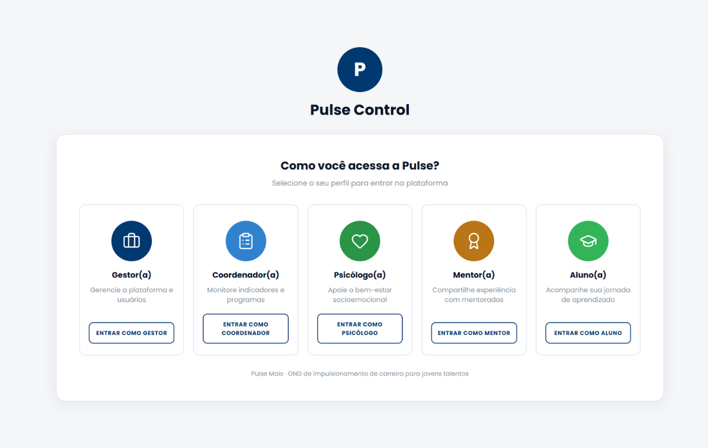<br>
  <p><b>Fonte:</b> Elaborado pelos autores, 2026</p>
</div>

<div align="center">
  <p><b>Imagem -</b> Home</p>
  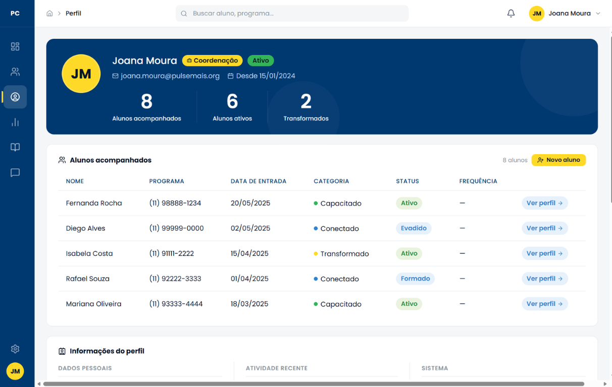<br>
  <p><b>Fonte:</b> Elaborado pelos autores, 2026</p>
</div>

<div align="center">
  <p><b>Imagem -</b> Programas e Eventos</p>
  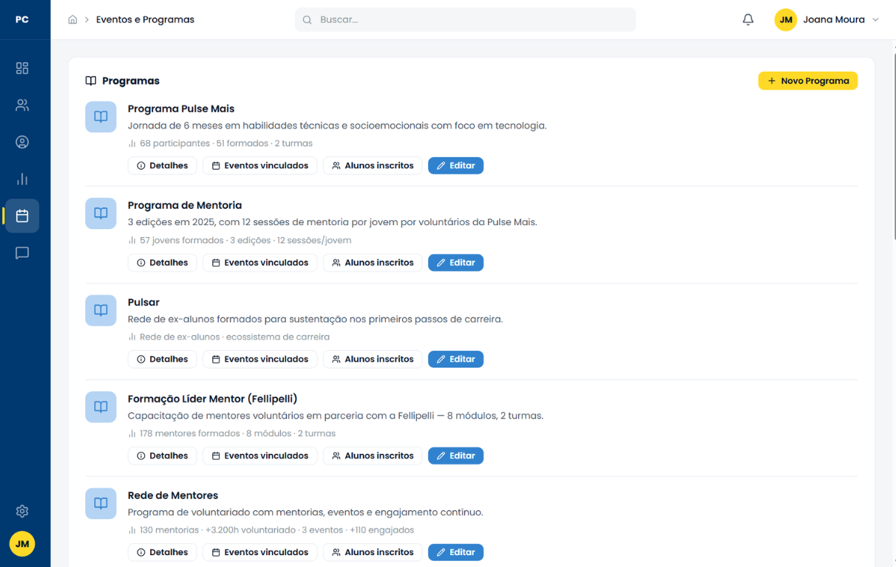<br>
  <p><b>Fonte:</b> Elaborado pelos autores, 2026</p>
</div>

<div align="center">
  <p><b>Imagem -</b> Dashboard de Mentoria</p>
  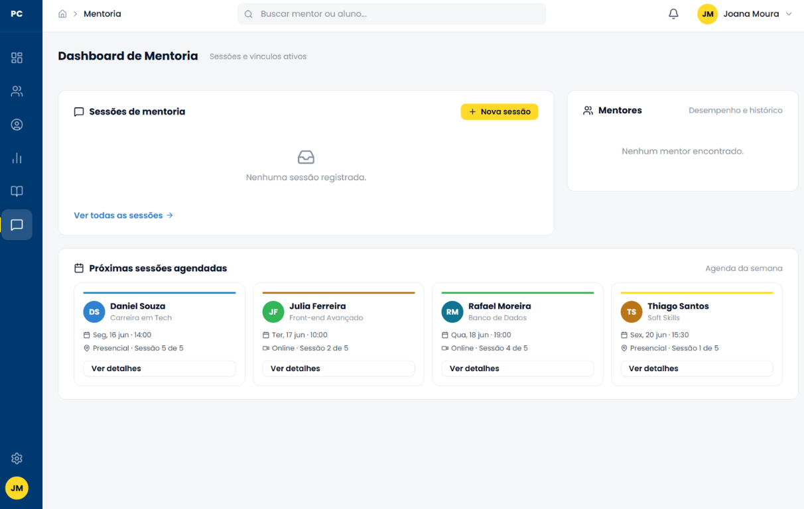<br>
  <p><b>Fonte:</b> Elaborado pelos autores, 2026</p>
</div>

<div align="center">
  <p><b>Imagem -</b> Perfil</p>
  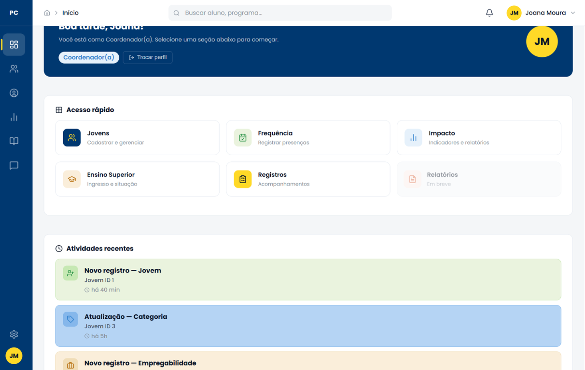<br>
  <p><b>Fonte:</b> Elaborado pelos autores, 2026</p>
</div>

<div align="center">
  <p><b>Imagem -</b> Configurações</p>
  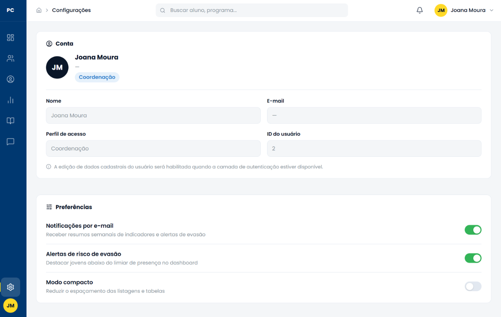<br>
  <p><b>Fonte:</b> Elaborado pelos autores, 2026</p>
</div>

#### V. Atualização da documentação técnica e estratégica

&ensp;&ensp;&ensp;&ensp;Em paralelo ao código, a documentação foi revisada para refletir o estado real do sistema, conforme previsto nos próximos passos da sprint anterior: os diagramas de sequência UML (seção 3.2.4) foram atualizados perante as mudanças da sprint 4 e o feedback do artefato; o DER (seção 3.6.2) foi revisado de acordo com o feedback do artefato 9 e realinhado ao schema físico; a seção 5.1 foi preenchida com o relatório completo de testes de todas as verticais, incluindo tabelas CT/CI → RN → RF e evidências de execução; e a seção 6 recebeu o Estudo de Mercado e Plano de Marketing, com resumo executivo (6.1) e Business Model Canvas.

### b) O que não foi concluído

&ensp;&ensp;&ensp;&ensp;A integração do perfil completo do jovem com os dados de programa e de empregabilidade permanece parcial: as funções obterProgramaAtual e obterHistoricoEmpregos do jovemService.ts estão implementadas como pontos de extensão que retornam valores vazios, aguardando a integração com os repositórios das verticais correspondentes. Previsão de conclusão: sprint 5.

&ensp;&ensp;&ensp;&ensp;Na frente de interface, as telas dos perfis Mentor, Psicólogo e Gestor ainda não foram implementadas — o front-end entregue cobre a vertical do coordenador e a página do aluno. Os testes de usabilidade previstos no eixo USAB dos RNFs e na seção 5.2 (guerrilha e SUS) dependem dessas telas e estão previstos para a sprint 5.

&ensp;&ensp;&ensp;&ensp;Conforme decisão de escopo do projeto, não haverá middleware de autenticação. A identificação do usuário responsável pelas operações de escrita é feita por parâmetro explícito na requisição, padrão já consolidado nesta sprint; a filtragem de visibilidade dos registros de acompanhamento, por consequência, mantém o comportamento mais restritivo (apenas registros de visibilidade pública de equipe), por segurança (RN19 — RF010). A seção 3.8 (Autenticação, Autorização e Resiliência) deverá registrar formalmente essa decisão na sprint 5.

### c) Dificuldades técnicas enfrentadas

&ensp;&ensp;&ensp;&ensp;A principal dificuldade foi a conversão do campo presente de SMALLINT para BOOLEAN em um banco já populado. A primeira tentativa de migração falhou com o erro operator does not exist: boolean = integer, revelando dois obstáculos sobrepostos: a expressão de conversão comparava a coluna com um literal inteiro, inválido quando a coluna já havia sido convertida em ambiente parcialmente migrado, e a restrição CHECK (presente IN (0, 1)) herdada do schema original impedia a alteração de tipo enquanto existisse. A solução foi reordenar a migração para remover a restrição antes do ALTER COLUMN e adotar a expressão USING (presente <> 0), robusta para os dois estados possíveis do banco. O mesmo tratamento foi incorporado ao bloco incremental do migrate.ts, com remoção dinâmica da constraint pelo nome real registrado no catálogo do PostgreSQL.

&ensp;&ensp;&ensp;&ensp;A mudança de assinatura das funções do service para receber idUsuario propagou-se em cascata pela suíte de testes: todas as chamadas existentes nos testes unitários acusaram erro de compilação por argumento ausente, e oito testes de controller passaram a receber 422 em vez dos status esperados, pois as requisições simuladas não enviavam o novo parâmetro obrigatório. A correção exigiu revisão sistemática de cada caso de teste, atualizando argumentos e asserções sem alterar a lógica verificada — exercício que evidenciou o valor da suíte como rede de proteção contra mudanças de contrato.

&ensp;&ensp;&ensp;&ensp;O relatório de cobertura inicialmente agregava arquivos de infraestrutura sem lógica testável (script de migração, inicialização do servidor, repositórios cuja função é exclusivamente executar SQL parametrizado), diluindo o indicador da camada onde a meta de 80% se aplica. A configuração collectCoverageFrom do Jest foi ajustada para refletir o escopo definido no artefato, concentrando a medição na camada de serviço.

### d) Próximos passos

&ensp;&ensp;&ensp;&ensp;A próxima sprint será dedicada à versão final da aplicação: conclusão das telas dos perfis restantes (Mentor, Psicólogo, Gestor e Aluno) com integração aos endpoints já testados, integração do perfil completo com as verticais de programa e empregabilidade, execução dos testes de usabilidade (seção 5.2) sobre os fluxos principais do MVP conforme o eixo USAB dos RNFs, e revisão final da documentação — incluindo o preenchimento da seção 3.8 com a decisão de autorização adotada — para garantir que diagramas, modelo de dados e descrição dos endpoints permaneçam fiéis ao código entregue. A suíte de testes será mantida como critério de aceite contínuo: toda alteração de contrato deverá manter os testes verdes e a cobertura da camada de serviço acima da meta estabelecida.

## 4.3. Versão final da aplicação web 

&ensp;&ensp;&ensp;&ensp;A versão final da aplicação web Pulse Control corresponde à entrega consolidada da Sprint 5, que completou os fluxos de negócio iniciados na sprint anterior e implementou as funcionalidades ausentes para todos os perfis do sistema: Coordenação, Gestão, Psicólogo, Mentor e Aluno. A Sprint 4 havia entregue a infraestrutura de testes, o alinhamento entre banco e código, e o front-end inicial da vertical do Coordenador (dashboard, listagem básica de alunos, cadastro de aluno e página do aluno). A Sprint 5 expandiu sobre essa base para cobrir os demais perfis e completar os fluxos de escrita e de gestão operacional do sistema.


### (a) O que foi refinado ou adicionado durante a Sprint 5

##### a.1) Edição de Aluno e Expansão da Busca com Filtros

&ensp;&ensp;&ensp;&ensp;A Sprint 4 entregou o formulário de criação de aluno via `POST /api/jovens`. A Sprint 5 complementou esse fluxo com a tela de **edição de aluno**, que aciona `PATCH /api/jovens/:id` com os campos pré-preenchidos a partir dos dados retornados pela API. Ao mesmo tempo, a funcionalidade de busca — que na sprint anterior operava apenas com segmentação básica por categoria (RF012) — foi expandida para suportar **filtros combinados** por categoria (`Conectado`, `Capacitado`, `Transformado`), status global e programa, todos transmitidos via query string ao endpoint `GET /api/jovens` e renderizados dinamicamente sem recarregamento de página.

##### a.2) Programas e Eventos

&ensp;&ensp;&ensp;&ensp;Foram implementadas as telas de **criação e edição de programas**, acessíveis à Coordenação, que se comunicam com os endpoints `POST /api/programas` e `PATCH /api/programas/:id`. Da mesma forma, a **criação e edição de eventos** foi entregue com formulário que coleta nome, data, tipo e capacidade máxima, persistindo via `POST /api/eventos` e `PATCH /api/eventos/:id`. O perfil Aluno recebeu a funcionalidade de **inscrição em eventos**, registrando a participação via `POST /api/frequencia` com `tipo = evento` e exibindo o status atual de cada evento (inscrito, presente, ausente) na sua área.

##### a.3) Importação e Exportação de CSV

&ensp;&ensp;&ensp;&ensp;A funcionalidade de **importação de planilhas** foi entregue permitindo que a Coordenação faça upload de um arquivo CSV com dados de jovens via `POST /api/import` (multipart/form-data). O sistema processa cada linha em modo upsert — atualizando o registro se o CPF já existir, inserindo se for novo — e retorna um resumo com o total de linhas processadas, inseridas e atualizadas. Erros por linha são registrados no resumo sem interromper o processamento das demais. A **exportação** gera um arquivo CSV filtrado via `GET /api/export`, respeitando os parâmetros de listagem (`categoria_atual`, `status_global`), entregue com header `Content-Type: text/csv` e disparado como download direto no navegador.

##### a.4) Registro de Situação — Empregabilidade e Ensino Superior

&ensp;&ensp;&ensp;&ensp;Foram entregues formulários dedicados para **registro de situação de empregabilidade** (`POST /api/jovens/:id/empregabilidade`) e **ingresso em ensino superior** (`POST /api/jovens/:id/ensino-superior`). O fluxo de empregabilidade encerra automaticamente o vínculo anterior ativo antes de inserir o novo registro, garantindo que apenas um vínculo empregatício fique marcado como ativo por jovem em cada momento, conforme a regra de negócio estabelecida no backend.

##### a.5) Perfil do Psicólogo — Registros de Atendimento

&ensp;&ensp;&ensp;&ensp;A tela de prontuário do Psicólogo foi implementada com o formulário de **criação de registros de atendimento**, acessível via modal disparado pelo botão "Novo Registro". O formulário coleta o conteúdo clínico e a visibilidade do registro (`Publico_Equipe` ou `Restrito_Psicologia`) e persiste via `POST /api/jovens/:id/prontuario`. Registros com visibilidade restrita são filtrados na consulta dos demais perfis pelo mecanismo de RLS do Supabase, garantindo que apenas o Psicólogo visualize o conteúdo sigiloso. A listagem do prontuário aplica um badge visual diferenciado por tipo de visibilidade.

##### a.6) Perfil do Mentor — Anotação de Mentorias

&ensp;&ensp;&ensp;&ensp;O Mentor passou a contar com a funcionalidade de **anotação de sessões de mentoria**, permitindo registrar observações, presença e duração de cada sessão via `PATCH /api/mentorias/:id`. A Coordenação recebeu a tela de **acompanhamento de mentorias**, que consolida a visão de todas as sessões ativas por programa, com indicadores de frequência e progresso dos vínculos mentor-jovem. O dado de auditoria associado à atualização da sessão é gravado de forma assíncrona via fire-and-forget, sem impactar o tempo de resposta da operação principal.

##### a.7) Edição de Perfil Próprio

&ensp;&ensp;&ensp;&ensp;Todos os perfis passaram a contar com a funcionalidade de **edição do próprio perfil**, acessível pela página de perfil de cada usuário. O formulário permite atualizar nome, telefone, cidade, área de atuação e os campos específicos de cada perfil (CRP para Psicólogo, disponibilidade para Mentor). A operação utiliza `PATCH /api/usuarios/:id` com os campos pré-preenchidos a partir da sessão ativa, e o `sessionStorage` é atualizado imediatamente após o retorno bem-sucedido da API para refletir as alterações na topbar e na sidebar sem exigir recarregamento de página.

##### a.8) Filtro de Dados por Programa e Ano

&ensp;&ensp;&ensp;&ensp;Os dashboards do Mentor e do Psicólogo passaram a suportar **filtro por programa e por ano**, permitindo segmentar os indicadores exibidos conforme o contexto de atuação de cada usuário. O filtro é transmitido como parâmetro de query nas chamadas à API, e os gráficos Chart.js são recalculados e rerenderizados sem recarregar a página.


### (b) Pendências remanescentes

&ensp;&ensp;&ensp;&ensp;As pendências listadas abaixo foram identificadas ao longo da Sprint 5 e não foram resolvidas dentro do seu escopo, seja por limitação de tempo, por dependência de decisões de produto ainda em aberto ou por se tratarem de melhorias planejadas para versões futuras do sistema.

 ##### b.1) Autenticação real por senha  
 o sistema opera com seleção de perfil sem verificação de credenciais. A implementação de autenticação com hash e token JWT foi identificada como requisito para uma versão de produção, mas está fora do escopo do MVP acadêmico, conforme delimitado pelo RF018.

 ##### b.2) Notificações proativas
 o ícone de sino de notificações está presente na topbar, mas o sistema de alertas (como alerta de risco de evasão por baixa frequência) não foi implementado. A lógica de cálculo de risco existe no dashboard, mas não dispara notificações ativas.

 ##### b.3) Paginação na listagem de alunos
 a tela de listagem carrega todos os jovens em uma única requisição. Para bases de dados maiores, seria necessário implementar paginação via `LIMIT` e `OFFSET` no endpoint e controles de navegação na interface.

 ##### b.4) Validação de formulários no front-end 
 as validações de campos obrigatórios e formatos (CPF, e-mail, data) são realizadas integralmente no backend. O front-end exibe os erros retornados pela API, mas não previne o envio de formulários com campos inválidos antes da requisição.


### (c) Dificuldades técnicas enfrentadas

##### c.1) Rerenderização de gráficos Chart.js sem sobreposição de instâncias
As telas de prontuário e de dados do mentorando utilizam Chart.js para exibir evolução temporal dos registros. Ao trocar o jovem selecionado sem recarregar a página, a instância anterior do gráfico permanecia ativa e sobrepunha a nova renderização, causando distorção visual. A solução foi manter uma referência à instância do gráfico em uma variável de módulo e chamar `chartInstance.destroy()` antes de criar uma nova instância a cada atualização.

##### c.2) Sincronização de estado entre sessão e interface após edição de perfil 
Como o sistema usa `sessionStorage` sem autenticação real, alterações no nome ou em outros campos do usuário não eram refletidas automaticamente na topbar e na sidebar sem recarregar a página. A solução foi sobrescrever os campos correspondentes na sessão armazenada imediatamente após o retorno bem-sucedido do `PATCH /api/usuarios/:id`, propagando a mudança para os elementos da interface sem exigir recarregamento.

##### c.3) Controle de visibilidade de registros clínicos no front-end 
O RLS do Supabase filtra registros com `visibilidade = Restrito_Psicologia` na camada de banco, mas a interface do Psicólogo precisava distinguir visualmente os registros restritos dos públicos para que o usuário soubesse o que outros perfis poderiam ver. A solução foi incluir o campo `visibilidade` no retorno da API e aplicar um badge diferenciado por tipo de registro na listagem do prontuário.

##### c.4) Processamento de CSV com encodings variados 
O módulo de importação recebeu arquivos gerados por diferentes versões do Excel com encodings distintos (UTF-8 com BOM e Latin-1). A leitura direta do buffer produzia caracteres corrompidos nos campos de nome e endereço. A solução foi detectar e remover o BOM no início do arquivo e tentar a decodificação em UTF-8 com fallback para Latin-1.

##### c.5) Encerramento automático do vínculo empregatício anterior
O endpoint de registro de empregabilidade precisava encerrar o vínculo ativo anterior antes de inserir o novo, garantindo que apenas um registro ficasse marcado como ativo por jovem. Em cenários de concorrência ou de registros históricos inconsistentes, a sequência buscarAtivo → encerrar → inserir podia resultar em múltiplos registros ativos caso a operação de encerramento falhasse silenciosamente. A solução foi envolver as três operações em uma transação explícita no repository, com rollback automático em caso de falha em qualquer uma das etapas.
 
# <a name="c5"></a>5. Testes

## 5.1. Relatório de testes de integração de endpoints automatizados

&ensp;&ensp;&ensp;&ensp;A suíte de testes automatizados da WebAPI foi implementada com Jest, cobrindo duas abordagens complementares, sendo elas testes unitários de Service (white-box), que exercitam ramos internos, exceções e regras de negócio com conhecimento da implementação e testes de integração de endpoints (black-box), via Jest e Supertest, que verificam apenas o contrato HTTP, status, corpo e efeito observável, sem depender da implementação interna.

---

### 5.1.1. Estratégia de Testes

&ensp;&ensp;&ensp;&ensp;Adotou-se uma estratégia de testes separada por camada da arquitetura. A camada de Service foi testada como white-box em testes unitários, isolando a lógica de negócio de suas dependências por meio de mocks dos repositories (via jest.mock), de modo que nenhum teste de Service dependesse do banco de dados real. A camada de Controller foi testada como black-box em testes de integração, exercitando o contrato HTTP de cada endpoint por meio do Supertest contra a instância da aplicação, sem subir uma porta TCP. A camada de Repository não foi testada isoladamente, sendo coberta de forma indireta pelos testes que mockam suas funções e verificam as chamadas recebidas.

Todos os testes seguem o padrão AAA (Arrange, Act, Assert), com as três fases explicitadas em cada caso. Garantiu-se o determinismo da suíte, os testes não dependem da ordem de execução, do relógio do sistema, de acesso a rede externa nem de dados residuais entre execuções. Os repositories foram substituídos por mocks via jest.mock, e os dados de entrada foram construídos em memória em cada teste, sem qualquer acesso ao banco real.

---

### 5.1.2. Testes Unitários de Service (white-box)

#### 5.1.2.1 Vertical Jovem/Categoria

&ensp;&ensp;&ensp;&ensp;Os testes unitários desta vertical concentram-se em jovemService.ts, exercitando as validações de cadastro (obrigatoriedade de campos, formato de CPF, formato de data de nascimento, faixa etária e unicidade de e-mail), a transação de criação com a categoria inicial, a imutabilidade de renda_inicial após criação, o registro de histórico ao mudar de categoria e a montagem do perfil consolidado. Cada caso está vinculado a uma Regra de Negócio da seção 3.1.2 e cobre tanto o caminho de sucesso quanto o caminho de falha correspondente. A suíte desta vertical soma 24 testes unitários e 27 testes de integração (51 no total), distribuídos em tests/jovemService.test.ts e tests/jovemController.test.ts.

##### 5.1.2.1.1 Tabela de casos de teste unitários - Jovem/Categoria (CT -> RN)

| ID | Vertical | Service / método | RN coberta | Caminho | O que verifica |
|----|----------|-----------------|------------|---------|----------------|
| CT01 | Jovem | jovemService.criar | RN03, RN06 | sucesso | CPF ausente é aceito; insere jovem e categoria inicial Conectado em transação atômica; COMMIT chamado |
| CT02 | Jovem | jovemService.criar | RN03 | sucesso | CPF válido é aceito e unicidade é verificada antes do INSERT |
| CT03 | Jovem | jovemService.criar | RN03 | falha (Validation) | nome vazio ou ausente lança ValidationError antes de qualquer acesso ao banco |
| CT04 | Jovem | jovemService.criar | RN03 | falha (Validation) | e-mail vazio ou ausente lança ValidationError |
| CT05 | Jovem | jovemService.criar | RN03 | falha (Validation) | telefone vazio ou ausente lança ValidationError |
| CT06 | Jovem | jovemService.criar | RN03 | falha (Validation) | CPF informado com dígito verificador inválido lança ValidationError sem consultar o banco |
| CT07 | Jovem | jovemService.criar | RN04b | falha (Validation) | data_nascimento em DD/MM/AAAA resultando em idade acima de 29 anos lança ValidationError |
| CT08 | Jovem | jovemService.criar | RN01 | falha (Conflict) | e-mail já cadastrado lança ConflictError; inserir não é chamado |
| CT09 | Jovem | jovemService.criar | RN01 | falha (Conflict) | CPF já cadastrado lança ConflictError; inserir não é chamado |
| CT10 | Jovem | jovemService.criar | CONF-RNF | falha (rollback) | falha na inserção da categoria reverte a transação; ROLLBACK e release são chamados |
| CT11 | Jovem | jovemService.buscarPorId | RN16 | sucesso | retorna o objeto Jovem quando encontrado |
| CT12 | Jovem | jovemService.buscarPorId | RN16 | falha (NotFound) | lança NotFoundError quando jovem não existe |
| CT13 | Jovem | jovemService.listar | RN21 | sucesso | repassa filtros ao repo; resultado é o array retornado pelo mock |
| CT14 | Jovem | jovemService.atualizar | RN16 | sucesso | retorna jovem atualizado com os campos corretos |
| CT15 | Jovem | jovemService.atualizar | RN05 | garantia estática | renda_inicial excluída de JovemAtualizacao; TypeScript impede envio em tempo de compilação (sem caso de teste em execução) |
| CT16 | Jovem | jovemService.atualizar | RN16 | falha (NotFound) | lança NotFoundError antes de chamar atualizar no repo |
| CT17 | Jovem | jovemService.remover | RN16 | sucesso | executa soft delete e registra auditoria |
| CT18 | Jovem | jovemService.remover | RN16 | falha (NotFound) | busca prévia nula lança NotFoundError sem chamar remover |
| CT19 | Jovem | jovemService.remover | RN16 | falha (NotFound) | repo.remover retornando false lança NotFoundError |
| CT20 | Jovem | jovemService.obterPerfilCompleto | RN16 | sucesso | agrega categorias, taxa de frequência e registros do próprio jovem; nenhum dado de outro jovem presente |
| CT21 | Jovem | jovemService.obterPerfilCompleto | RN16 | falha (NotFound) | lança NotFoundError e não consulta categorias |
| CT22 | Jovem | jovemService.mudarCategoria | RN07 | sucesso | insere registro com categoria_anterior e id_usuario corretos; atualiza jovem.categoria_atual |
| CT23 | Jovem | jovemService.mudarCategoria | RN07 | falha (NotFound) | lança NotFoundError sem inserir registro de categoria |
| CT24 | Jovem | jovemService.listarCategorias | RN07 | sucesso | retorna histórico em ordem cronológica com categoria_anterior preenchido nas transições |
| CT25 | Jovem | jovemService.listarCategorias | RN07 | falha (NotFound) | lança NotFoundError sem consultar categorias |

##### 5.1.2.1.2 Detalhamento dos 5 casos prioritários - Vertical Jovem/Categoria

**CT01 - CPF opcional e categoria inicial Conectado (cobre RN03 e RN06)**

- **RN coberta:** RN03 define CPF como campo opcional no cadastro. RN06 define que todo jovem recém-criado recebe categoria inicial Conectado, registrada atomicamente com o jovem.
- **Arrange:** body sem campo cpf; mocks de buscarPorEmail e buscarPorCpf retornam null; jovemRepo.inserir retorna fixture de Jovem; categoriaRepo.inserir retorna fixture de Categoria; pool.connect retorna client com query e release mockados.
- **Act:** invoca jovemService.criar com os dados preparados.
- **Assert:** resultado é igual ao jovem retornado pelo mock; buscarPorCpf não é chamado; categoriaRepo.inserir é chamado com categoria_adquirida igual a Conectado; mockClient.query recebe a chamada COMMIT.
- **Determinismo:** todas as dependências são mocks fixos em memória; nenhum dado persiste entre testes; beforeEach limpa os mocks via jest.clearAllMocks.
- **Caminho de falha:** se categoriaRepo.inserir lançar erro, ROLLBACK é chamado e o erro é propagado (coberto por CT10).

---

**CT07 - Faixa etária fora de 14–29 anos (cobre RN04b)**

- **RN coberta:** RN04b exige que o jovem tenha entre 14 e 29 anos no momento do cadastro; entradas fora dessa faixa devem ser rejeitadas com HTTP 422.
- **Arrange:** body com data_nascimento igual a "15/06/1980" em formato DD/MM/AAAA, que resulta em aproximadamente 45 anos; demais campos obrigatórios válidos.
- **Act:** invoca jovemService.criar com os dados preparados.
- **Assert:** a promessa rejeita com instância de ValidationError; jovemRepo.inserir não é chamado.
- **Determinismo:** a data de nascimento escolhida (1980) está suficientemente afastada no passado para que o cálculo de idade produza sempre um valor acima de 29, independentemente do dia em que o teste é executado; nenhum mock de relógio é necessário.
- **Caminho de falha:** ValidationError com status 422 é o único resultado esperado para essa entrada.

---

**CT08 - E-mail duplicado barrado antes do INSERT (cobre RN01)**

- **RN coberta:** RN01 exige que e-mail seja único na tabela jovem; tentativas de cadastro com e-mail já existente devem ser rejeitadas com HTTP 409 sem criar registro.
- **Arrange:** jovemRepo.buscarPorEmail configurado para retornar uma fixture de Jovem existente, simulando e-mail duplicado.
- **Act:** invoca jovemService.criar com dados válidos e e-mail que já existe.
- **Assert:** a promessa rejeita com instância de ConflictError; jovemRepo.inserir não é chamado.
- **Determinismo:** buscarPorEmail retorna valor fixo determinado pelo mock; nenhum acesso ao banco real ocorre.
- **Caminho de falha:** ConflictError com status 409 é o resultado esperado.

---

**CT10 - Rollback em falha da inserção de categoria (cobre confiabilidade transacional)**

- **RN coberta:** a atomicidade da transação que cria jovem e categoria é um requisito de confiabilidade; falha em qualquer etapa não deve deixar o banco em estado parcial.
- **Arrange:** jovemRepo.inserir retorna fixture de Jovem com sucesso; categoriaRepo.inserir é configurado para lançar Error genérico simulando falha de banco.
- **Act:** invoca jovemService.criar com dados válidos.
- **Assert:** a promessa rejeita com o erro original; mockClient.query recebe a chamada ROLLBACK; mockClient.release é chamado para liberar a conexão.
- **Determinismo:** o erro é injetado via mock; não depende de estado externo.
- **Caminho de falha:** qualquer erro não tratado dentro do bloco try propaga após ROLLBACK.

---

**CT22 - Histórico de categoria com categoria_anterior e id_usuario (cobre RN07)**

- **RN coberta:** RN07 exige que toda mudança de categoria registre a categoria anterior e o identificador do usuário responsável na tabela categoria.
- **Arrange:** jovem com categoria_atual igual a Conectado retornado por buscarPorId; categoriaRepo.inserir e jovemRepo.atualizar retornam fixtures com valores corretos.
- **Act:** invoca jovemService.mudarCategoria com id 1, nova categoria Capacitado e idUsuario 1.
- **Assert:** categoriaRepo.inserir é chamado com objeto contendo categoria_adquirida igual a Capacitado, categoria_anterior igual a Conectado e id_usuario igual ao identificador recebido na requisição (idUsuario); jovemRepo.atualizar é chamado com categoria_atual igual a Capacitado.
- **Determinismo:** todos os retornos são fixos via mock; a categoria anterior é derivada do fixture estático, não do banco.
- **Caminho de falha:** se jovem não existir, NotFoundError é lançado antes de qualquer inserção (coberto por CT23).


##### 5.1.2.1.3 Evidência de cobertura - Vertical Jovem/Categoria

&ensp;&ensp;&ensp;&ensp;Após a execução do comando `npx jest --coverage`, o relatório gerado pelo Jest/Istanbul indicou alta cobertura para `jovemService.ts`, com 86,95% de statements, 78,37% de branches, 87,5% de functions e 90,98% de lines. Esses resultados evidenciam que os principais fluxos de cadastro, validação, atualização, remoção, mudança de categoria e montagem do perfil consolidado foram exercitados pelos testes unitários, incluindo caminhos de sucesso e falha. As ramificações não cobertas concentram-se em cenários condicionais mais específicos, sem comprometer a validação das regras centrais da vertical.

<div align="center">
  <p><b>Imagem 55 -</b> Cobertura unitária da vertical Jovem/Categoria</p>
  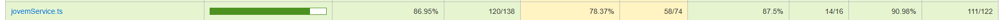
  
  <p><b>Fonte:</b> Relatório de cobertura gerado pelo comando <code>npx jest --coverage</code>, 2026.</p>
</div>

#### 5.1.2.2 Vertical Usuário

&ensp;&ensp;&ensp;&ensp;Implementou-se a suíte unitária de `usuarioService.ts` cobrindo todos os métodos públicos expostos pelo service: `criar`, `buscarPorId`, `listarTodos`, `atualizar` e `remover`. O repositório `usuarioRepository` foi substituído integralmente por mock via `jest.mock`, garantindo que nenhum teste acesse o banco de dados. Os dezesseis casos de teste exercitam tanto os caminhos de sucesso quanto os caminhos de falha de cada validação de negócio, verificando o tipo de erro lançado e a ausência de chamada ao repository quando a validação antecipa a rejeição.

##### 5.1.2.2.1 Tabela de casos de teste unitários (CT -> RN)

| ID | Vertical | Service / método | RN coberta | Caminho | O que verifica |
|----|----------|-----------------|------------|---------|----------------|
| CT01 | Usuario | usuarioService.criar | RN18 | sucesso | Retorna o usuario criado pelo repository quando todos os campos são válidos |
| CT02 | Usuario | usuarioService.criar | RN18 | falha (BadRequest) | Lança BadRequestError quando nome tem menos de 2 caracteres |
| CT03 | Usuario | usuarioService.criar | RN18 | falha (BadRequest) | Lança BadRequestError quando nome está vazio |
| CT04 | Usuario | usuarioService.criar | RN18 | falha (BadRequest) | Lança BadRequestError quando email não tem formato válido |
| CT05 | Usuario | usuarioService.criar | RN18 | falha (BadRequest) | Lança BadRequestError quando perfil não pertence aos valores permitidos |
| CT06 | Usuario | usuarioService.criar | RN18 | falha (BadRequest) | Lança BadRequestError quando perfil é Aluno e id_jovem não é informado |
| CT07 | Usuario | usuarioService.criar | RN18 | sucesso | Retorna usuario criado com perfil Aluno quando id_jovem é informado |
| CT08 | Usuario | usuarioService.buscarPorId | RN18 | sucesso | Retorna o usuario quando repository encontra o registro |
| CT09 | Usuario | usuarioService.buscarPorId | RN18 | falha (NotFound) | Lança NotFoundError quando repository retorna null |
| CT10 | Usuario | usuarioService.listarTodos | RN18 | sucesso | Retorna a lista completa devolvida pelo repository |
| CT11 | Usuario | usuarioService.atualizar | RN18 | sucesso | Retorna o usuario atualizado quando dados são válidos |
| CT12 | Usuario | usuarioService.atualizar | RN18 | falha (BadRequest) | Lança BadRequestError quando email de atualização é inválido |
| CT13 | Usuario | usuarioService.atualizar | RN18 | falha (BadRequest) | Lança BadRequestError quando perfil de atualização não é válido |
| CT14 | Usuario | usuarioService.atualizar | RN18 | falha (NotFound) | Lança NotFoundError quando repository retorna null para o id informado |
| CT15 | Usuario | usuarioService.remover | RN18 | sucesso | Chama repository.remover com o id correto sem lançar erro |
| CT16 | Usuario | usuarioService.remover | RN18 | falha (NotFound) | Lança NotFoundError quando repository retorna false |

##### 5.1.2.2.2 Detalhamento dos 5 casos prioritários

**CT01 - criar usuario com sucesso (cobre RN18)**

- **RN coberta:** RN18, o sistema deve validar os dados do usuário antes de persistir, aceitando apenas registros com nome válido, email no formato correto e perfil pertencente ao conjunto permitido.
- **Arrange:** configurou-se o mock de `usuarioRepository.criar` para retornar uma fixture de `Usuario` com perfil `Gestao`. O input contém nome com ao menos dois caracteres, email válido e perfil reconhecido.
- **Act:** invocou-se `usuarioService.criar` com o input preparado.
- **Assert:** verificou-se que o resultado é idêntico à fixture retornada pelo mock e que `repository.criar` foi chamado exatamente uma vez com o mesmo input.
- **Determinismo:** nenhum acesso ao banco; o mock retorna valor fixo independente de estado externo; `jest.clearAllMocks` em `beforeEach` impede contaminação entre casos.
- **Caminho de falha:** não aplicável a este caso — exercita o caminho de sucesso.

---

**CT06 - Aluno sem id_jovem lança BadRequestError (cobre RN18)**

- **RN coberta:** RN18, usuários com perfil Aluno devem estar vinculados a um jovem cadastrado; o campo `id_jovem` é obrigatório para este perfil.
- **Arrange:** preparou-se um input com `perfil: 'Aluno'` e sem o campo `id_jovem`.
- **Act:** invocou-se `usuarioService.criar` com o input preparado.
- **Assert:** verificou-se que a promise rejeita com instância de `BadRequestError` e que `repository.criar` não foi chamado, a validação antecipa a rejeição sem acesso ao banco.
- **Determinismo:** validação ocorre em memória no service; nenhuma dependência externa.
- **Caminho de falha:** BadRequestError / HTTP 400.

---

**CT09 - buscarPorId lança NotFoundError quando registro ausente (cobre RN18)**

- **RN coberta:** RN18, o sistema deve retornar erro identificável quando um recurso não é encontrado, permitindo que o controller devolva o status HTTP correto ao cliente.
- **Arrange:** configurou-se `usuarioRepository.buscarPorId` para retornar `null`, simulando ausência de registro no banco.
- **Act:** invocou-se `usuarioService.buscarPorId(999)`.
- **Assert:** verificou-se que a promise rejeita com instância de `NotFoundError`.
- **Determinismo:** mock retorna `null` de forma fixa; nenhum acesso ao banco.
- **Caminho de falha:** NotFoundError / HTTP 404.

---

**CT14 - atualizar lança NotFoundError quando repository retorna null (cobre RN18)**

- **RN coberta:** RN18, operações de atualização devem falhar com erro identificável quando o registro alvo não existe, evitando atualização silenciosa sobre id inexistente.
- **Arrange:** configurou-se `usuarioRepository.atualizar` para retornar `null`, simulando id não encontrado no banco.
- **Act:** invocou-se `usuarioService.atualizar(999, { nome: 'X' })`.
- **Assert:** verificou-se que a promise rejeita com instância de `NotFoundError`.
- **Determinismo:** mock retorna `null` de forma fixa; dados de entrada são literais sem dependência de estado.
- **Caminho de falha:** NotFoundError / HTTP 404.

---

**CT16 - remover lança NotFoundError quando repository retorna false (cobre RN18)**

- **RN coberta:** RN18, operações de remoção devem sinalizar quando o registro não existe, permitindo que o controller informe ao cliente que o recurso não foi encontrado.
- **Arrange:** configurou-se `usuarioRepository.remover` para retornar `false`, simulando que nenhuma linha foi afetada pelo DELETE no banco.
- **Act:** invocou-se `usuarioService.remover(999)`.
- **Assert:** verificou-se que a promise rejeita com instância de `NotFoundError`.
- **Determinismo:** mock retorna `false` de forma fixa; nenhuma dependência de estado externo.
- **Caminho de falha:** NotFoundError / HTTP 404.

---

##### 5.1.2.2.3 Evidência de cobertura - Vertical Usuário

&ensp;&ensp;&ensp;&ensp;Na vertical de Usuário, o relatório de cobertura apresentou 100% em statements, branches, functions e lines para `usuarioService.ts`. Esse resultado demonstra que todos os métodos públicos do service foram exercitados pelos testes unitários, incluindo criação, listagem, busca por ID, atualização, remoção e validações de perfil, e-mail, nome e vínculo com jovem quando o perfil é `Aluno`.

<div align="center">
  <p><b>Imagem 56 -</b> Cobertura unitária da vertical Usuário</p>
  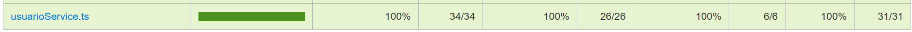
  <p><b>Fonte:</b> Relatório de cobertura gerado pelo comando <code>npx jest --coverage</code>, 2026.</p>
</div>

---

#### 5.1.2.3 Vertical Registro e Auditoria

&ensp;&ensp;&ensp;&ensp;Os testes unitários desta vertical cobrem dois services interdependentes, sendo eles `registroService.ts`, responsável pelas operações de ciclo de vida do prontuário digital e `auditoriaService.ts`, responsável pelo registro assíncrono de ações no histórico da plataforma. Em `registroService`, exercitam-se as regras de visibilidade diferenciada por perfil, o forçamento automático da visibilidade `Restrito_Psicologia` para o tipo `Acompanhamento_Psicologico` e os caminhos de `ForbiddenError` e `NotFoundError` para perfil não autorizado e recurso inexistente, respectivamente. Já em `auditoriaService`, verificam-se o mapeamento correto dos parâmetros passados ao `historicoAcoesRepository` e a tolerância à omissão de campos opcionais.

##### 5.1.2.3.1 Tabela de casos de teste unitários (CT -> RN)

| ID   | Vertical | Service / método                          | RN coberta  | Caminho                   | O que verifica |
|------|----------|-------------------------------------------|-------------|---------------------------|----------------|
| CT01 - REG | Registro | registroService.listar                    | RN19, RN17  | sucesso (Psicólogo)       | Psicólogo recebe `apenasPublico=false`, acessando registros restritos |
| CT02 - REG | Registro | registroService.listar                    | RN19, RN17  | sucesso (Coordenação)     | Coordenação recebe `apenasPublico=true`, vendo apenas registros públicos |
| CT03 - REG | Registro | registroService.listar                    | RN17        | falha (ForbiddenError)    | Perfil não autorizado interrompe o fluxo antes de consultar o usuário |
| CT04 - REG | Registro | registroService.listar                    | RN19        | falha (NotFoundError)     | Usuário inexistente lança NotFoundError antes de consultar registros |
| CT05 - REG | Registro | registroService.criar                     | RN19        | sucesso (Atendimento_Equipe) | `Atendimento_Equipe` grava corretamente com visibilidade `Publico_Equipe` |
| CT06 - REG | Registro | registroService.criar                     | RN19        | sucesso (forçamento)      | `Acompanhamento_Psicologico` força visibilidade para `Restrito_Psicologia`, sobrescrevendo valor do input |
| CT07 - REG | Registro | registroService.criar                     | RN19        | falha (BadRequestError)   | Conteúdo em branco ou com apenas espaços lança BadRequestError antes do INSERT |
| CT08 - REG | Registro | registroService.criar                     | RN19b       | sucesso (auditoria)       | `auditoriaService.registrar` é invocado com `id_usuario`, `id_jovem_afetado` e `tabela_afetada` corretos após criação bem-sucedida |
| CT09 - REG | Registro | registroService.atualizar                 | RN19b       | sucesso                   | Retorna registro com `conteudo` atualizado; `atualizar` do repo é chamado com os dados corretos |
| CT10 - REG | Registro | registroService.atualizar                 | RN19        | sucesso (forçamento)      | Mudança de tipo para `Acompanhamento_Psicologico` força `Restrito_Psicologia` no payload enviado ao repo |
| CT11 - REG | Registro | registroService.atualizar                 | RN19        | falha (NotFoundError)     | Registro inexistente (buscarPorId retorna null) lança NotFoundError antes de chamar atualizar |
| CT12 - REG | Registro | registroService.atualizar                 | RN19        | falha (NotFoundError)     | `repo.atualizar` retornando null lança NotFoundError (registro removido entre busca e atualização) |
| CT13 - REG | Registro | registroService.verificarAcesso           | RN17        | falha (ForbiddenError)    | Usuário não-Psicólogo tentando acessar registro `Restrito_Psicologia` recebe ForbiddenError |
| CT14 - REG | Registro | registroService.verificarAcesso           | RN17        | sucesso                   | Psicólogo acessa corretamente registro `Restrito_Psicologia` e recebe o objeto de registro |
| CT15 - REG | Registro | registroService.verificarAcesso           | RN19        | falha (NotFoundError)     | Registro inexistente lança NotFoundError |
| CT16 - AUD | Auditoria | auditoriaService.registrar               | RN19b       | sucesso                   | `historicoRepo.inserir` é chamado com todos os campos mapeados corretamente |
| CT17 - AUD | Auditoria | auditoriaService.registrar               | RN19b       | falha absorvida           | Rejeição do repo não propaga erro nem lança exceção; `console.error` é chamado internamente |
| CT18 - AUD | Auditoria | auditoriaService.registrar               | RN19b       | sucesso (campos opcionais) | Campos opcionais `id_jovem_afetado` e `valor_anterior` são enviados como `null` quando omitidos |

##### 5.1.2.3.2 Detalhamento dos 5 casos prioritários

**CT06 - REG: Forçamento de `Restrito_Psicologia` em `Acompanhamento_Psicologico` (cobre RN19)**

- **RN coberta:** RN19 estabelece que registros do tipo `Acompanhamento_Psicologico` devem ter visibilidade obrigatoriamente igual a `Restrito_Psicologia`, independentemente do valor informado pelo chamador.
- **Arrange:** `registroRepoMock.criar` configurado para retornar uma fixture de `RegistroAcompanhamento` com `tipo_registro = 'Acompanhamento_Psicologico'` e `visibilidade = 'Restrito_Psicologia'`; o input fornecido ao service contém `visibilidade = 'Publico_Equipe'` deliberadamente para validar a sobrescrita.
- **Act:** invoca `registroService.criar(10, 2, input)`.
- **Assert:** `registroRepoMock.criar` é chamado com payload contendo `visibilidade: 'Restrito_Psicologia'`; o campo `tipo_registro` do resultado retornado é igual a `'Acompanhamento_Psicologico'`.
- **Determinismo:** todos os retornos são determinados pelos mocks; nenhum estado externo interfere na sobrescrita de visibilidade, que é uma transformação pura sobre o input.
- **Caminho de falha:** não há caminho de falha neste caso; o cenário de falha complementar é CT07 (conteúdo vazio).

---

**CT08 - REG: `auditoriaService.registrar` disparado após criação (cobre RN19b)**

- **RN coberta:** RN19b exige que cada operação de escrita no prontuário gere automaticamente um registro na tabela `historico_acoes` contendo o identificador do usuário, o jovem afetado e a tabela modificada.
- **Arrange:** `registroRepoMock.criar` retorna fixture de `RegistroAcompanhamento`; `auditoriaService` é completamente mockado via `jest.mock`; o input possui `tipo_registro = 'Atendimento_Equipe'` e conteúdo não vazio.
- **Act:** invoca `registroService.criar(10, 2, input)`.
- **Assert:** `auditoriaService.registrar` é chamado com objeto contendo `id_usuario: 2`, `id_jovem_afetado: 10` e `tabela_afetada: 'registro_acompanhamento'`.
- **Determinismo:** `auditoriaService.registrar` é um mock sem efeito colateral real; `jest.clearAllMocks` em `beforeEach` garante ausência de contaminação entre casos.
- **Caminho de falha:** N/A neste caso — a chamada ao serviço de auditoria é fire-and-forget e o comportamento de falha é coberto por CT17.

---

**CT10 - REG: Forçamento de `Restrito_Psicologia` na atualização (cobre RN19)**

- **RN coberta:** RN19 exige que a restrição de visibilidade psicológica seja aplicada também em atualizações; a mudança de tipo para `Acompanhamento_Psicologico` deve forçar `Restrito_Psicologia` independentemente do estado anterior.
- **Arrange:** `registroRepoMock.buscarPorId` retorna fixture com `tipo_registro = 'Atendimento_Equipe'`; `registroRepoMock.atualizar` retorna fixture com `tipo_registro = 'Acompanhamento_Psicologico'` e `visibilidade = 'Restrito_Psicologia'`; o payload de atualização contém apenas `{ tipo_registro: 'Acompanhamento_Psicologico' }`.
- **Act:** invoca `registroService.atualizar(5, 2, { tipo_registro: 'Acompanhamento_Psicologico' })`.
- **Assert:** `registroRepoMock.atualizar` é chamado com payload contendo `visibilidade: 'Restrito_Psicologia'`, evidenciando que o service inseriu o campo correto antes de persistir.
- **Determinismo:** fixtures estáticos em memória; `jest.clearAllMocks` em `beforeEach`; nenhuma dependência de relógio ou banco.
- **Caminho de falha:** CT11 cobre o caso em que o registro não existe; CT12 cobre o caso em que `atualizar` retorna null.

---

**CT13 - REG: ForbiddenError para não-Psicólogo em registro restrito (cobre RN17)**

- **RN coberta:** RN17 determina que o acesso ao prontuário psicológico (`Restrito_Psicologia`) é exclusivo do perfil Psicólogo; qualquer outro perfil deve receber rejeição com HTTP 403.
- **Arrange:** `registroRepoMock.buscarPorId` retorna fixture com `visibilidade = 'Restrito_Psicologia'`; `usuarioRepoMock.buscarPorId` retorna fixture de usuário com `perfil = 'Coordenacao'`.
- **Act:** invoca `registroService.verificarAcesso(5, 2)`.
- **Assert:** a promessa rejeita com instância de `ForbiddenError`.
- **Determinismo:** fixtures em memória; `jest.clearAllMocks` em `beforeEach`; nenhum dado real é consultado.
- **Caminho de falha:** `ForbiddenError` é o único resultado esperado para combinação registro restrito + perfil não autorizado.

---

**CT17 - AUD: Fire-and-forget absorve falha do repositório (cobre RN19b)**

- **RN coberta:** RN19b. O serviço de auditoria não pode bloquear nem degradar o fluxo principal; falhas na persistência do histórico devem ser absorvidas silenciosamente.
- **Arrange:** `historicoRepoMock.inserir` configurado para rejeitar com `new Error('DB down')`; `console.error` espionado com `jest.spyOn` e implementação vazia para suprimir output.
- **Act:** invoca `auditoriaService.registrar(...)` sem `await`; em seguida, executa `await Promise.resolve()` para flush da microtask queue e resolução do `.catch` interno.
- **Assert:** a chamada a `registrar` não lança exceção sincrônica (verificado via `expect(() => ...).not.toThrow()`); `console.error` é chamado pelo handler interno.
- **Determinismo:** a rejeição é injetada pelo mock; nenhum banco real é envolvido; `consoleSpy.mockRestore()` garante limpeza após o caso.
- **Caminho de falha:** qualquer propagação da rejeição seria falha do próprio serviço de auditoria (comportamento indesejado que este teste previne por regressão).

##### 5.1.2.3.3 Evidência de cobertura — Vertical Registro e Auditoria

&ensp;&ensp;&ensp;&ensp;A vertical de Registro e Auditoria envolve dois services principais: `registroService.ts` e `auditoriaService.ts`. No relatório de cobertura, `auditoriaService.ts` apresentou 100% de cobertura em todas as métricas, enquanto `registroService.ts` apresentou 97,91% de statements, 92,30% de branches, 100% de functions e 100% de lines. Esses percentuais indicam que os testes cobrem os principais fluxos de criação, atualização, verificação de acesso, visibilidade restrita e registro assíncrono de auditoria, incluindo cenários de autorização, recurso inexistente e falhas absorvidas pelo serviço de auditoria.

<div align="center">
  <p><b>Imagem 57 -</b> Cobertura unitária da vertical Registro e Auditoria</p>
  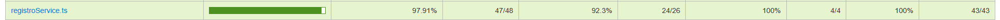
  <p><b>Fonte:</b> Relatório de cobertura gerado pelo comando <code>npx jest --coverage</code>, 2026.</p>
</div>

<div align="center">
  <p><b>Imagem 58 -</b> Cobertura unitária da vertical Registro e Auditoria</p>
  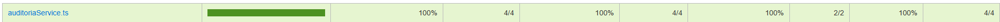
  <p><b>Fonte:</b> Relatório de cobertura gerado pelo comando <code>npx jest --coverage</code>, 2026.</p>
</div>

---

#### 5.1.2.4 Vertical Programa/Mentoria

&ensp;&ensp;&ensp;&ensp;Os testes unitários desta vertical concentram-se em `programaService.ts` e `mentoriaService.ts`, exercitando as validações de criação de programa (obrigatoriedade de nome e data_inicio), a detecção de inscrição duplicada de jovem em programa, a propagação de NotFoundError para recursos inexistentes e o controle de acesso por perfil nas operações de sessão de mentoria. Os repositories `programaRepository`, `inscricaoRepository` e `sessaoMentoriaRepository` foram substituídos integralmente por mocks via `jest.mock`, garantindo que nenhum teste acesse o banco de dados real. A suíte desta vertical soma 15 testes unitários.

##### 5.1.2.4.1 Tabela de casos de teste unitários - Programa/Mentoria (CT -> RN)

| ID | Vertical | Service / método | RN coberta | Caminho | O que verifica |
|----|----------|-----------------|------------|---------|----------------|
| CT-PM01 | Programa | programaService.criar | RN08 | sucesso | nome e data_inicio válidos retornam programa criado; repo.criar é chamado uma vez |
| CT-PM02 | Programa | programaService.criar | RN08 | falha (BadRequest) | nome ausente ou vazio lança BadRequestError antes de qualquer acesso ao repo |
| CT-PM03 | Programa | programaService.criar | RN08 | falha (BadRequest) | data_inicio ausente lança BadRequestError antes de qualquer acesso ao repo |
| CT-PM04 | Programa | programaService.buscarPorId | RN08 | sucesso | retorna programa quando repo encontra o registro |
| CT-PM05 | Programa | programaService.buscarPorId | RN08 | falha (NotFound) | lança NotFoundError quando repo retorna null |
| CT-PM06 | Programa | programaService.atualizar | RN08 | sucesso | retorna programa atualizado quando id existe |
| CT-PM07 | Programa | programaService.atualizar | RN08 | falha (NotFound) | buscarPorId nula lança NotFoundError sem chamar repo.atualizar |
| CT-PM08 | Programa | programaService.inserirInscricao | RF004, RN08 | sucesso | jovem sem inscrição anterior é inscrito com status "Em andamento" |
| CT-PM09 | Programa | programaService.inserirInscricao | RF004, RN08 | falha (BadRequest) | id_programa ausente lança BadRequestError antes de qualquer consulta |
| CT-PM10 | Programa | programaService.inserirInscricao | RF004, RN08 | falha (Conflict) | jovem já inscrito lança ConflictError; inscricaoRepo.criar não é chamado |
| CT-PM11 | Programa | programaService.inserirInscricao | RF004, RN08 | falha (NotFound) | programa inexistente lança NotFoundError antes de verificar duplicata |
| CT-PM12 | Mentoria | mentoriaService.criarSessao | RN25 | falha (Forbidden) | usuário sem perfil Mentor lança erro de validarPerfil; sessaoRepo.criar não é chamado |
| CT-PM13 | Mentoria | mentoriaService.criarSessao | RN25 | sucesso | usuário com perfil Mentor cria sessão; sessaoRepo.criar é chamado com os dados corretos |
| CT-PM14 | Mentoria | mentoriaService.atualizarSessao | RN25 | falha (NotFound) | sessão inexistente lança NotFoundError após validação de perfil |
| CT-PM15 | Mentoria | mentoriaService.atualizarSessao | RN25 | falha (Forbidden) | usuário sem perfil Mentor lança erro de validarPerfil antes de consultar o repo |

##### 5.1.2.4.2 Detalhamento dos 5 casos prioritários - Vertical Programa/Mentoria

**CT-PM02 - nome ausente ou vazio barrado antes do INSERT (cobre RN08)**

- **RN coberta:** RN08 exige que todo registro de participação contenha os campos obrigatórios; analogamente, a criação de programa requer nome não vazio como pré-condição de persistência.
- **Arrange:** body com campo `nome` igual a string vazia (`""`) ou omitido; demais campos preenchidos com valores válidos; `programaRepo.criar` configurado para retornar fixture (não deve ser chamado).
- **Act:** invoca `programaService.criar` com os dados preparados.
- **Assert:** a promessa rejeita com instância de `BadRequestError`; `programaRepo.criar` não é chamado.
- **Determinismo:** validação ocorre em memória no service antes de qualquer I/O; nenhuma dependência de estado externo.
- **Caminho de falha:** BadRequestError com status 400 é o único resultado esperado para essa entrada.

---

**CT-PM10 - inscrição duplicada barrada antes do INSERT (cobre RF004, RN08)**

- **RN coberta:** RN08 exige unicidade da participação: um jovem não pode ter dois registros de inscrição ativa no mesmo programa.
- **Arrange:** `inscricaoRepo.buscarPorJovemEPrograma` configurado para retornar uma fixture de `Inscricao` existente, simulando inscrição prévia; `programaRepo.buscarPorId` retorna fixture de programa válido; `inscricaoRepo.criar` configurado (não deve ser chamado).
- **Act:** invoca `programaService.inserirInscricao(1, { id_programa: 1 })`.
- **Assert:** a promessa rejeita com instância de `ConflictError`; `inscricaoRepo.criar` não é chamado.
- **Determinismo:** buscarPorJovemEPrograma retorna valor fixo determinado pelo mock; nenhum acesso ao banco real.
- **Caminho de falha:** ConflictError com status 409.

---

**CT-PM11 - programa inexistente barrado antes da verificação de duplicata (cobre RF004, RN08)**

- **RN coberta:** não é possível inscrever um jovem em programa inexistente; a verificação de existência do programa antecede qualquer consulta à tabela de inscrições.
- **Arrange:** `programaRepo.buscarPorId` configurado para retornar `null`; `inscricaoRepo.buscarPorJovemEPrograma` configurado (não deve ser chamado).
- **Act:** invoca `programaService.inserirInscricao(1, { id_programa: 99 })`.
- **Assert:** a promessa rejeita com instância de `NotFoundError`; `inscricaoRepo.buscarPorJovemEPrograma` não é chamado.
- **Determinismo:** mock retorna null de forma fixa; a ordem de verificação é determinada pelo fluxo do service.
- **Caminho de falha:** NotFoundError com status 404.

---

**CT-PM12 - perfil não-Mentor impedido de criar sessão (cobre RN25)**

- **RN coberta:** RN25 exige que sessões de mentoria só sejam registradas por usuários com perfil Mentor; o sistema deve rejeitar o registro caso o perfil seja diferente.
- **Arrange:** `validarPerfil` mockado para lançar erro quando perfil não corresponde a `['Mentor']`; `sessaoRepo.criar` configurado (não deve ser chamado); `idUsuario` corresponde a usuário sem perfil Mentor.
- **Act:** invoca `mentoriaService.criarSessao(dadosSessao, idUsuarioSemPerfil)`.
- **Assert:** a promessa rejeita com o erro lançado por `validarPerfil`; `sessaoRepo.criar` não é chamado.
- **Determinismo:** `validarPerfil` é mockado com retorno fixo; nenhum acesso ao banco.
- **Caminho de falha:** o erro de `validarPerfil` é propagado diretamente (status 403).

---

**CT-PM14 - sessão inexistente lança NotFoundError (cobre RN25)**

- **RN coberta:** RN25 implica que apenas sessões existentes podem ser atualizadas; tentativa de atualizar sessão inexistente deve ser rejeitada com erro identificável.
- **Arrange:** `validarPerfil` mockado para não lançar erro (usuário é Mentor válido); `sessaoRepo.buscarPorId` configurado para retornar `null`; `sessaoRepo.atualizar` configurado (não deve ser chamado).
- **Act:** invoca `mentoriaService.atualizarSessao(999, dadosAtualizacao, idMentor)`.
- **Assert:** a promessa rejeita com instância de `NotFoundError`; `sessaoRepo.atualizar` não é chamado.
- **Determinismo:** buscarPorId retorna null fixo via mock; validarPerfil não bloqueia; nenhuma dependência de estado.
- **Caminho de falha:** NotFoundError com status 404.

---

##### 5.1.2.4.3 Evidência de cobertura - Vertical Programa/Mentoria

&ensp;&ensp;&ensp;&ensp;Na vertical Programa/Mentoria, o relatório indicou **100% de cobertura** em `programaService.ts` e `mentoriaService.ts` para statements, branches, functions e lines. Isso evidencia que os testes unitários exercitaram os fluxos principais de criação, atualização, busca, inscrição em programa, detecção de duplicidade, controle de acesso por perfil e operações relacionadas às sessões de mentoria.

<div align="center">
  <p><b>Imagem 59 -</b> Cobertura unitária da vertical Programa/Mentoria</p>
  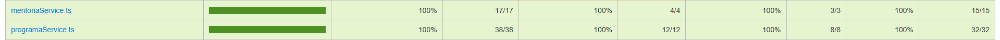
  <p><b>Fonte:</b> Relatório de cobertura gerado pelo comando <code>npx jest --coverage</code>, 2026.</p>
</div>

---

#### 5.1.2.5 Vertical Frequência em Aula e Eventos

&ensp;&ensp;&ensp;&ensp;Na vertical de frequência em aulas e participação em eventos, foram definidos testes unitários para validar o comportamento do `frequenciaService`. Os testes verificam se o service direciona corretamente o registro conforme o tipo informado (`aula` ou `evento`), se aceita tanto presença quanto ausência, se rejeita dados obrigatórios ausentes e se aciona os repositories corretos.

##### 5.1.2.5.1 Tabela de casos de teste unitários — Frequência Aula/Evento

| ID | Vertical | Service / método | RN coberta | RF correspondente | Caminho | O que verifica |
|---|---|---|---|---|---|---|
| CT-FREQ-S01 | Frequência em aula | `frequenciaService.registrar` | RN09 | RF005 | Sucesso | Registra frequência válida em aula com `presente: true`. |
| CT-FREQ-S02 | Frequência em aula | `frequenciaService.registrar` | RN09 | RF005 | Sucesso | Registra falta válida em aula com `presente: false`. |
| CT-FREQ-S03 | Frequência em aula | `frequenciaService.registrar` | RN09 | RF005 | Falha 422 | Rejeita registro de aula sem `id_jovem`. |
| CT-FREQ-S04 | Frequência em aula | `frequenciaService.registrar` | RN09 | RF005 | Falha 422 | Rejeita registro de aula sem `id_aula`. |
| CT-FREQ-S05 | Frequência em aula | `frequenciaService.registrar` | RN09 | RF005 | Falha 422 | Rejeita registro de aula sem `aula` ou `data`. |
| CT-EVT-S01 | Participação em evento | `frequenciaService.registrar` | RN08 | RF004 | Sucesso | Registra participação válida em evento com `presente: true`. |
| CT-EVT-S02 | Participação em evento | `frequenciaService.registrar` | RN08 | RF004 | Sucesso | Registra ausência válida em evento com `presente: false`. |
| CT-EVT-S03 | Participação em evento | `frequenciaService.registrar` | RN08 | RF004 | Falha 422 | Rejeita evento sem `id_jovem` ou `id_evento`. |
| CT-EVT-S04 | Participação em evento | `frequenciaService.registrar` | RN08 | RF004 | Falha 422 | Rejeita evento sem `evento` ou `data`. |
| CT-GER-S01 | Frequência/Eventos | `frequenciaService.registrar` | RN08/RN09 | RF004/RF005 | Falha 422 | Rejeita payload sem `presente` booleano. |
| CT-GER-S02 | Frequência/Eventos | `frequenciaService.registrar` | RN08/RN09 | RF004/RF005 | Falha 422 | Rejeita `tipo` diferente de `aula` ou `evento`. |
| CT-FREQ-S06 | Frequência em aula | `calcularTaxaPresencaAula` | RN09 | RF005 | Sucesso | Retorna taxa de presença calculada pelo repository. |
| CT-EVT-S05 | Participação em evento | `calcularTaxaParticipacaoEvento` | RN08 | RF004 | Sucesso | Retorna taxa de participação calculada pelo repository. |

##### 5.1.2.5.2 Detalhamento dos 5 casos prioritários

**CT-FREQ-S01 - Registro válido de frequência em aula (cobre RN09)**

- **RN coberta:** RN09 — o percentual de presença em aulas deve ser calculado a partir dos registros de presença.
- **Arrange:** prepara-se um payload com `tipo: 'aula'`, `id_jovem`, `id_aula`, `aula`, `data` e `presente: true`, além do mock do repository retornando o registro criado.
- **Act:** chama-se `frequenciaService.registrar`.
- **Assert:** verifica-se se `frequenciaAulaRepository.inserir` foi chamado com os dados corretos e se o retorno corresponde ao registro criado.
- **Determinismo:** utiliza dados fixos e repository mockado, sem banco real ou rede externa.
- **Caminho de falha:** não se aplica, pois é cenário de sucesso.

**CT-FREQ-S02 - Registro válido de falta em aula (cobre RN09)**

- **RN coberta:** RN09 — a taxa de presença depende do registro correto de presenças e ausências.
- **Arrange:** prepara-se um payload de aula com `presente: false`, representando uma ausência válida.
- **Act:** chama-se `frequenciaService.registrar`.
- **Assert:** verifica-se se o repository foi chamado mesmo com `presente: false`, garantindo que ausência não seja tratada como campo vazio.
- **Determinismo:** utiliza entrada fixa e mock do repository, sem dependência de estado externo.
- **Caminho de falha:** não se aplica, pois `false` é valor válido para o campo `presente`.

**CT-FREQ-S05 - Registro de aula sem nome da aula ou data (cobre RN09)**

- **RN coberta:** RN09 — o cálculo de presença depende de registros vinculados à aula e à data correspondente.
- **Arrange:** prepara-se payload de aula sem `aula` ou sem `data`.
- **Act:** chama-se `frequenciaService.registrar`.
- **Assert:** verifica-se o lançamento de `ValidationError` com status 422 e a ausência de chamada ao repository.
- **Determinismo:** utiliza payload inválido fixo e mocks limpos a cada teste.
- **Caminho de falha:** falha de validação por ausência de campo obrigatório.

**CT-EVT-S01 - Registro válido de participação em evento (cobre RN08)**

- **RN coberta:** RN08 — cada participação em evento ou curso deve conter atividade, data e status de presença.
- **Arrange:** prepara-se um payload com `tipo: 'evento'`, `id_jovem`, `id_evento`, `evento`, `data` e `presente: true`, além do mock do repository retornando o registro criado.
- **Act:** chama-se `frequenciaService.registrar`.
- **Assert:** verifica-se se `participacaoEventoRepository.inserir` foi chamado corretamente e se o retorno corresponde ao registro criado.
- **Determinismo:** utiliza dados fixos e repository mockado, sem acesso ao banco real.
- **Caminho de falha:** não se aplica, pois é cenário de sucesso.

**CT-EVT-S04 - Registro de evento sem nome do evento ou data (cobre RN08)**

- **RN coberta:** RN08 — registros de evento devem conter nome da atividade, data e status de presença.
- **Arrange:** prepara-se payload de evento sem `evento` ou sem `data`.
- **Act:** chama-se `frequenciaService.registrar`.
- **Assert:** verifica-se o lançamento de `ValidationError` com status 422 e a ausência de chamada ao repository.
- **Determinismo:** utiliza entrada fixa, mocks isolados e nenhuma dependência externa.
- **Caminho de falha:** falha de validação por payload incompleto.

---

##### 5.1.2.5.3 Evidência de cobertura - Vertical Frequência em Aula e Eventos

&ensp;&ensp;&ensp;&ensp;Para a vertical de Frequência em Aula e Eventos, o relatório de cobertura apresentou 100% em statements, branches, functions e lines para `frequenciaService.ts`. Esse resultado demonstra que os testes unitários cobrem integralmente os fluxos do service responsável por direcionar registros de presença conforme o tipo informado (`aula` ou `evento`), validar campos obrigatórios, aceitar corretamente `presente: true` e `presente: false`, calcular taxas e tratar remoções de registros existentes ou inexistentes.

<div align="center">
  <p><b>Imagem 60 -</b> Cobertura unitária da vertical Frequência em Aula e Eventos</p>
  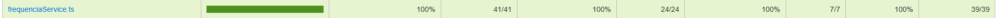
  <p><b>Fonte:</b> Relatório de cobertura gerado pelo comando <code>npx jest --coverage</code>, 2026.</p>
</div>

---

#### 5.1.2.6 Vertical Importação, Exportação e Computador Doado
 
&ensp;&ensp;&ensp;&ensp;Nesta vertical foram implementados testes unitários para os services de importação e exportação, para os helpers de manipulação de CSV (`parseCsv` e `gerarCsv`) e para o repositório de computador doado. Em todos os casos, o pool de conexões e as dependências foram substituídos por mocks via `jest.mock`, de modo que nenhum teste tocasse o banco de dados real. O `importService` foi exercitado quanto ao processamento linha a linha, ao acúmulo de erros sem aborto do fluxo e à conversão de tipos antes do INSERT; o `exportService` quanto à construção dinâmica da cláusula `WHERE`, à ordem correta dos parâmetros e à presença do `LEFT JOIN`; e o `computadorDoadoRepository` quanto às operações de listagem, criação e contagem de computadores não devolvidos, consumida pelo dashboard.
 
##### 5.1.2.6.1 Tabela de casos de teste unitários - Importação/Exportação/Computador Doado
 
| ID | Vertical | Service / método | RN coberta | Caminho | O que verifica |
|---|---|---|---|---|---|
| CT-IMP-S01 | Importação | `importService.importarJovens` | RN11 | Sucesso | 1 linha válida resulta em importados=1 e erros=[]. |
| CT-IMP-S02 | Importação | `importService.importarJovens` | RN11 | Falha (Validation) | CSV vazio ou só com cabeçalho lança ValidationError. |
| CT-IMP-S03 | Importação | `importService.importarJovens` | RN23 | Falha (validação linha) | Linha sem `cpf` é pulada com erro acumulado, sem abortar. |
| CT-IMP-S04 | Importação | `importService.importarJovens` | RN23 | Falha (validação linha) | Linha sem `nome` é pulada com erro acumulado. |
| CT-IMP-S05 | Importação | `importService.importarJovens` | RN11 | Falha (erro de banco) | Erro do `pool.query` é capturado; a linha conta como erro sem abortar. |
| CT-IMP-S06 | Importação | `importService.importarJovens` | RN23 | Misto | 2 válidas + 1 sem `cpf` → importados=2 e erros com 1 item. |
| CT-IMP-S07 | Importação | `importService.importarJovens` | RN11 | Sucesso | `renda_inicial` string numérica é convertida para Number. |
| CT-IMP-S08 | Importação | `importService.importarJovens` | RN11 | Sucesso | `renda_inicial` vazia é convertida para null. |
| CT-IMP-S09 | Importação | `importService.importarJovens` | RN23 | Falha (validação linha) | O número da linha no erro corresponde à posição i+2. |
| CT-EXP-S01 | Exportação | `exportService.exportarJovens` | RN21 | Sucesso | Sem filtros: query sem WHERE e valores=[]. |
| CT-EXP-S02 | Exportação | `exportService.exportarJovens` | RN21 | Sucesso | `categoria_atual` filtra com `j.categoria_atual = $1`. |
| CT-EXP-S03 | Exportação | `exportService.exportarJovens` | RN21 | Sucesso | `status_global` filtra com `j.status_global = $1`. |
| CT-EXP-S04 | Exportação | `exportService.exportarJovens` | RN21 | Sucesso | Ambos filtros: AND com `$1` e `$2` na ordem correta. |
| CT-EXP-S05 | Exportação | `exportService.exportarJovens` | RN21 | Sucesso (vazio) | Sem linhas: `gerarCsv` é chamado com `[]` e retorna ''. |
| CT-EXP-S06 | Exportação | `exportService.exportarJovens` | RN21 | Sucesso | Com linhas: retorna o CSV produzido por `gerarCsv`. |
| CT-EXP-S07 | Exportação | `exportService.exportarJovens` | RN15b | Sucesso | SQL inclui `LEFT JOIN empregabilidade` com `encerrado = 0`. |
| CT-CD-S01 | Computador Doado | `computadorDoadoRepository.listarPorJovem` | RN15b | Sucesso | Retorna array de computadores doados ao jovem. |
| CT-CD-S02 | Computador Doado | `computadorDoadoRepository.listarPorJovem` | RN15b | Sucesso (vazio) | Retorna array vazio quando não há computadores. |
| CT-CD-S03 | Computador Doado | `computadorDoadoRepository.criar` | RN15b | Sucesso | INSERT RETURNING * retorna o objeto persistido. |
| CT-CD-S04 | Computador Doado | `computadorDoadoRepository.criar` | RN15b | Sucesso | `data_devolucao` undefined é normalizada para null. |
| CT-CD-S05 | Computador Doado | `computadorDoadoRepository.totalNaoDevolvidos` | RN15b | Sucesso | COUNT retorna o número correto de não devolvidos. |
| CT-CD-S06 | Computador Doado | `computadorDoadoRepository.totalNaoDevolvidos` | RN15b | Sucesso | SQL filtra por `data_devolucao IS NULL`. |
| CT-CSV-S01 | Helper | `parseCsv` | — | Sucesso | CSV válido retorna array de objetos tipados. |
| CT-CSV-S02 | Helper | `parseCsv` | — | Sucesso (vazio) | CSV só com cabeçalho retorna array vazio. |
| CT-CSV-S03 | Helper | `parseCsv` | — | Sucesso | Valores com espaços externos são trimeados. |
| CT-CSV-S04 | Helper | `parseCsv` | — | Sucesso | Linhas em branco são ignoradas pelo parser. |
| CT-CSV-S05 | Helper | `gerarCsv` | — | Sucesso | Array com dados gera CSV com cabeçalho e conteúdo. |
| CT-CSV-S06 | Helper | `gerarCsv` | — | Sucesso (vazio) | Array vazio retorna string vazia sem cabeçalho. |
 
Os helpers `parseCsv` e `gerarCsv` não estão vinculados a uma RN específica por serem funções puras de infraestrutura, mas são necessários à cobertura dos services que os consomem (RN11, RN21).
 
##### 5.1.2.6.2 Detalhamento dos 5 casos prioritários - Importação/Exportação/Computador Doado
 
**CT-IMP-S01 - Importação de linha válida (cobre RN11)**
 
- **RN coberta:** RN11 — na importação de CSV, cada linha é associada ao jovem usando o CPF como chave; linhas válidas são importadas.
- **Arrange:** o helper `parseCsv` é mockado para retornar uma única linha válida e o `pool.query` é mockado para resolver com sucesso.
- **Act:** chama-se `importService.importarJovens` com um conteúdo de CSV irrelevante, dado que o parse está mockado.
- **Assert:** verifica-se que `importados` é 1, que `erros` está vazio e que `pool.query` foi chamado uma vez.
- **Determinismo:** sem data real, sem banco e com mocks fixos definidos no próprio teste.
- **Caminho de falha:** não se aplica, pois é cenário de sucesso.

**CT-IMP-S02 - Importação com CSV vazio (cobre RN11)**
 
- **RN coberta:** RN11 — um CSV sem dados não deve resultar em importação.
- **Arrange:** o `parseCsv` é mockado para retornar um array vazio.
- **Act:** chama-se `importService.importarJovens` com string vazia.
- **Assert:** verifica-se que a promessa é rejeitada com `ValidationError` e que `pool.query` nunca é chamado.
- **Determinismo:** mock fixo, sem dependência externa.
- **Caminho de falha:** `ValidationError`, convertida em HTTP 422 pelo middleware global.

**CT-IMP-S03 - Linha sem CPF é pulada (cobre RN23)**
 
- **RN coberta:** RN23 — registros sem dado de identificação válido devem ser sinalizados e não importados.
- **Arrange:** o `parseCsv` é mockado para retornar uma linha com o campo `cpf` vazio.
- **Act:** chama-se `importService.importarJovens`.
- **Assert:** verifica-se que `importados` é 0, que há um erro acumulado contendo "campos obrigatórios ausentes" e que `pool.query` não foi chamado para aquela linha.
- **Determinismo:** mock fixo, sem banco.
- **Caminho de falha:** erro acumulado na lista de retorno, sem lançar exceção — o processamento não é abortado.

**CT-EXP-S04 - Exportação com ambos os filtros (cobre RN21)**
 
- **RN coberta:** RN21 — os filtros de busca operam de forma combinada (AND lógico), retornando apenas jovens que atendam simultaneamente a todos os critérios.
- **Arrange:** o `pool.query` é mockado para retornar zero linhas e o `gerarCsv` é mockado.
- **Act:** chama-se `exportService.exportarJovens` com `categoria_atual` e `status_global` preenchidos.
- **Assert:** verifica-se que o SQL contém `j.categoria_atual = $1`, `j.status_global = $2` e o operador `AND`, e que o array de valores está na ordem correta `['Conectado', 'Ativo']`.
- **Determinismo:** mock fixo do pool; nenhuma query real é executada.
- **Caminho de falha:** não se aplica, pois é cenário de sucesso de construção de query.

**CT-EXP-S07 - Exportação inclui LEFT JOIN com empregabilidade ativa (cobre RN15b)**
 
- **RN coberta:** RN15b — os dados do relatório são computados diretamente na consulta, sem cache, refletindo o estado atual.
- **Arrange:** o `pool.query` é mockado retornando uma linha de exportação.
- **Act:** chama-se `exportService.exportarJovens` sem filtros.
- **Assert:** verifica-se que o SQL contém `LEFT JOIN empregabilidade` e a condição `encerrado = 0`, garantindo que apenas o vínculo empregatício ativo seja anexado ao relatório.
- **Determinismo:** mock fixo, sem banco real.
- **Caminho de falha:** não se aplica, pois é cenário de sucesso.

##### 5.1.2.6.3 Evidência de cobertura - Vertical Importação, Exportação e Computador Doado

&ensp;&ensp;&ensp;&ensp;Na vertical de Importação, Exportação e Computador Doado, o recorte de cobertura dos services evidenciou `importService.ts` e `exportService.ts`. O `exportService.ts` apresentou 100% de cobertura em statements, branches, functions e lines. Já o `importService.ts` apresentou 81,66% de statements, 59,32% de branches, 100% de functions e 83,92% de lines. A diferença em branches indica que ainda existem caminhos condicionais específicos da importação que poderiam ser ampliados em testes futuros, embora os principais fluxos de importação válida, CSV vazio, linhas inválidas, erros acumulados e conversão de tipos já estejam cobertos.

<div align="center">
  <p><b>Imagem 61 -</b> Cobertura unitária da vertical Importação, Exportação e Computador Doado</p>
  
  <p><b>Fonte:</b> Relatório de cobertura gerado pelo comando <code>npx jest --coverage</code>, 2026.</p>
</div>

<div align="center">
  <p><b>Imagem 62 -</b> Cobertura unitária da vertical Importação, Exportação e Computador Doado</p>
  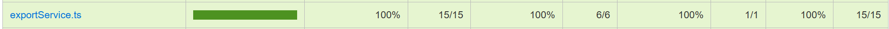
  <p><b>Fonte:</b> Relatório de cobertura gerado pelo comando <code>npx jest --coverage</code>, 2026.</p>
</div>

---

#### 5.1.2.7 Vertical Aula

&ensp;&ensp;&ensp;&ensp;A vertical de aula foi estruturada para organizar os registros de aulas vinculadas a programas, permitindo que o sistema consulte, crie, atualize e remova aulas que posteriormente podem ser utilizadas nos fluxos de frequência. Os testes unitários desta vertical concentram-se em `aulaService.ts`, exercitando validações de identificador, obrigatoriedade de nome, validação de data, verificação de existência do programa associado e tratamento de aula inexistente. 

&ensp;&ensp;&ensp;&ensp;Os repositórios `aulaRepository` e `programaRepository` foram substituídos por mocks com `jest.mock`, garantindo que os testes unitários não acessem o banco de dados real. A suíte valida tanto caminhos de sucesso quanto caminhos de falha, assegurando que entradas inválidas sejam rejeitadas antes da persistência.

##### 5.1.2.7.1 Tabela de casos de teste unitários - Aula (CT → RN)

| ID | Vertical | Service / método | RN coberta | Caminho | O que verifica |
|----|----------|------------------|------------|---------|----------------|
| CT-AULA-S01 | Aula | `aulaService.criar` | RN09 | sucesso | Cria aula válida vinculada a um programa existente; consulta o programa antes de criar a aula. |
| CT-AULA-S02 | Aula | `aulaService.criar` | RN09 | falha (ValidationError) | Rejeita aula sem nome válido ou com nome composto apenas por espaços. |
| CT-AULA-S03 | Aula | `aulaService.criar` | RN09 | falha (NotFoundError) | Rejeita aula associada a programa inexistente. |
| CT-AULA-S04 | Aula | `aulaService.remover` | RN09 | falha (NotFoundError) | Retorna erro lógico ao tentar remover aula inexistente. |

##### 5.1.2.7.2 Detalhamento dos casos prioritários - Vertical Aula

**CT-AULA-S01 - Criação de aula válida vinculada a programa existente (cobre RN09)**

- **RN coberta:** RN09, os registros de presença em aulas dependem da existência de aulas identificáveis, com vínculo a um programa e data definida.
- **Arrange:** `programaRepository.buscarPorId` é mockado para retornar um programa existente; `aulaRepository.criar` é mockado para retornar uma aula criada com `id`, `id_programa`, `nome` e `data`.
- **Act:** invoca-se `aulaService.criar` com `id_programa`, `nome` e `data` válidos.
- **Assert:** verifica-se que o programa foi consultado com o id correto, que `aulaRepository.criar` foi chamado e que o resultado retornado contém o identificador da aula criada.
- **Determinismo:** todas as dependências externas são substituídas por mocks; não há acesso ao banco real, rede ou dados persistidos.
- **Caminho de falha:** não se aplica neste caso, pois o cenário exercita o fluxo de sucesso.

---

**CT-AULA-S02 - Aula sem nome válido (cobre RN09)**

- **RN coberta:** RN09, para que a aula possa ser usada como base de frequência, o registro precisa ter identificação textual válida.
- **Arrange:** prepara-se um payload com `id_programa` e `data` válidos, mas com `nome` contendo apenas espaços.
- **Act:** invoca-se `aulaService.criar` com o payload inválido.
- **Assert:** verifica-se que a promise rejeita com `ValidationError` e que `aulaRepository.criar` não é chamado.
- **Determinismo:** a validação ocorre em memória no service, antes de qualquer dependência externa.
- **Caminho de falha:** `ValidationError`, convertido pelo middleware global em HTTP 422 quando usado via endpoint.

---

**CT-AULA-S03 - Aula vinculada a programa inexistente (cobre RN09)**

- **RN coberta:** RN09, uma aula só pode ser criada se estiver associada a um programa existente, mantendo a consistência entre programa, aula e frequência.
- **Arrange:** `programaRepository.buscarPorId` é mockado para retornar `null`, simulando programa inexistente.
- **Act:** invoca-se `aulaService.criar` com `id_programa` inexistente e demais campos válidos.
- **Assert:** verifica-se que a promise rejeita com `NotFoundError`.
- **Determinismo:** o retorno `null` é definido pelo mock; nenhum banco real é acessado.
- **Caminho de falha:** `NotFoundError`, convertido pelo middleware global em HTTP 404.

---

**CT-AULA-S04 - Remoção de aula inexistente (cobre RN09)**

- **RN coberta:** RN09, operações sobre aulas inexistentes devem ser sinalizadas de forma explícita, evitando remoções silenciosas.
- **Arrange:** `aulaRepository.remover` é mockado para retornar `false`, simulando ausência de linha afetada no banco.
- **Act:** invoca-se `aulaService.remover(999)`.
- **Assert:** verifica-se que a promise rejeita com `NotFoundError`.
- **Determinismo:** o retorno do repository é fixo por mock; não há dependência de estado externo.
- **Caminho de falha:** `NotFoundError`, convertido pelo middleware global em HTTP 404.

---

##### 5.1.2.7.3 Evidência de cobertura - Vertical Aula

&ensp;&ensp;&ensp;&ensp;Na vertical Aula, o relatório de cobertura apresentou 100% em statements, branches, functions e lines para `aulaService.ts`. Esse resultado indica que os testes unitários cobrem todos os caminhos previstos no service, incluindo listagem, busca por ID, criação, atualização, remoção, validação de nome, validação de data e verificação da existência do programa associado antes da criação ou atualização de uma aula.

<div align="center">
  <p><b>Imagem 63 -</b> Cobertura unitária da vertical Aula</p>
  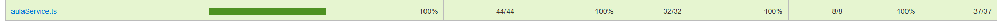
  <p><b>Fonte:</b> Relatório de cobertura gerado pelo comando <code>npx jest --coverage</code>, 2026.</p>
</div>

---

#### 5.1.2.8 Vertical Evento

&ensp;&ensp;&ensp;&ensp;A vertical de evento foi estruturada para organizar o cadastro e a consulta de eventos da Pulse Mais, com suporte a filtros e métricas agregadas relacionadas à participação dos jovens. Os testes unitários desta vertical concentram-se em `eventoService.ts`, verificando listagem com busca, criação de evento válido, validação de data inválida e tratamento de evento inexistente.

&ensp;&ensp;&ensp;&ensp;O `eventoRepository` foi substituído por mock com `jest.mock`, garantindo que a suíte unitária não dependa do banco de dados real. O módulo também contempla eventos com métricas agregadas, como `total_inscritos` e `taxa_presenca`, utilizadas para apoiar o acompanhamento da participação dos jovens.

##### 5.1.2.8.1 Tabela de casos de teste unitários - Evento (CT → RN)

| ID | Vertical | Service / método | RN coberta | Caminho | O que verifica |
|----|----------|------------------|------------|---------|----------------|
| CT-EVENTO-S01 | Evento | `eventoService.listar` | RN08 | sucesso | Lista eventos com filtro de busca e métricas agregadas de participação. |
| CT-EVENTO-S02 | Evento | `eventoService.criar` | RN08 | sucesso | Cria evento válido com nome e data. |
| CT-EVENTO-S03 | Evento | `eventoService.criar` | RN08 | falha (ValidationError) | Rejeita criação de evento com data inválida. |
| CT-EVENTO-S04 | Evento | `eventoService.buscarPorId` | RN08 | falha (NotFoundError) | Retorna erro lógico ao buscar evento inexistente. |

##### 5.1.2.8.2 Detalhamento dos casos prioritários - Vertical Evento

**CT-EVENTO-S01 - Listagem de eventos com busca e métricas agregadas (cobre RN08)**

- **RN coberta:** RN08, a participação em eventos deve estar associada a uma atividade identificável e permitir acompanhamento da presença.
- **Arrange:** `eventoRepository.listar` é mockado para retornar um evento com `total_inscritos` e `taxa_presenca`.
- **Act:** invoca-se `eventoService.listar` com filtro `{ busca: 'Carreiras' }`.
- **Assert:** verifica-se que o repository foi chamado com o filtro correto e que o retorno contém as métricas agregadas.
- **Determinismo:** os dados retornados são fixtures fixas em memória; não há acesso ao banco real.
- **Caminho de falha:** não se aplica neste caso, pois o cenário exercita o fluxo de sucesso.

---

**CT-EVENTO-S02 - Criação de evento válido (cobre RN08)**

- **RN coberta:** RN08, registros de participação dependem de eventos identificáveis, com nome e data válidos.
- **Arrange:** `eventoRepository.criar` é mockado para retornar um evento criado com `id`, `nome`, `data` e `descricao`.
- **Act:** invoca-se `eventoService.criar` com `nome` e `data` válidos.
- **Assert:** verifica-se que `eventoRepository.criar` foi chamado e que o resultado retornado contém o identificador do evento criado.
- **Determinismo:** o retorno do repository é fixo por mock; não há dependência de banco ou estado externo.
- **Caminho de falha:** não se aplica neste caso, pois o cenário exercita o fluxo de sucesso.

---

**CT-EVENTO-S03 - Criação de evento com data inválida (cobre RN08)**

- **RN coberta:** RN08, cada evento precisa possuir data válida para que a participação seja registrada corretamente.
- **Arrange:** prepara-se um payload com `nome` válido e `data: 'data-invalida'`.
- **Act:** invoca-se `eventoService.criar` com o payload inválido.
- **Assert:** verifica-se que a promise rejeita com `ValidationError` e que `eventoRepository.criar` não é chamado.
- **Determinismo:** a validação é feita em memória antes de qualquer acesso externo.
- **Caminho de falha:** `ValidationError`, convertido pelo middleware global em HTTP 422 quando usado via endpoint.

---

**CT-EVENTO-S04 - Busca de evento inexistente (cobre RN08)**

- **RN coberta:** RN08, operações sobre eventos inexistentes devem retornar erro identificável para evitar respostas ambíguas.
- **Arrange:** `eventoRepository.buscarPorId` é mockado para retornar `null`.
- **Act:** invoca-se `eventoService.buscarPorId(999)`.
- **Assert:** verifica-se que a promise rejeita com `NotFoundError`.
- **Determinismo:** o retorno `null` é definido pelo mock; nenhum banco real é acessado.
- **Caminho de falha:** `NotFoundError`, convertido pelo middleware global em HTTP 404.

---

##### 5.1.2.8.3 Evidência de cobertura -  Vertical Evento

&ensp;&ensp;&ensp;&ensp;Na vertical Evento, o relatório indicou 100% de cobertura em `eventoService.ts` para statements, branches, functions e lines. Com isso, os testes unitários demonstram cobertura completa dos fluxos do service, incluindo listagem com filtros e métricas agregadas, busca por ID, criação, atualização, remoção e validações de nome e data. A cobertura também reforça que os cenários de erro, como evento inexistente e data inválida, foram exercitados sem acesso ao banco real.

<div align="center">
  <p><b>Imagem 64 -</b> Cobertura unitária da vertical Evento</p>
  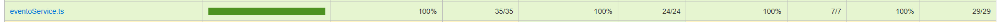
  <p><b>Fonte:</b> Relatório de cobertura gerado pelo comando <code>npx jest --coverage</code>, 2026.</p>
</div>

#### 5.1.2.9 Vertical Dashboard

&ensp;&ensp;&ensp;&ensp;Os testes unitários desta vertical concentram-se em `dashboardService.ts`, cobrindo as quatro funções exportadas pelo service: `obterIndicadores`, `obterDashboardEmpregabilidade`, `obterDashboardEngajamento` e `obterDashboardEnsinoSuperior`. O `dashboardService` apresenta uma particularidade arquitetural relevante para os testes: parte dos indicadores é calculada por queries diretas ao `pool.query` (contarAtivos, contarTransformados, calcularEvasao), enquanto os demais são delegados a repositories externos de outras verticais. Por isso, o isolamento exige dois mecanismos complementares: `jest.mock` nos cinco repositories delegados e um `mockImplementation` no `pool.query` que inspeciona o SQL recebido para retornar o fixture correto por query.

&ensp;&ensp;&ensp;&ensp;Cada factory de mock, `configurarPoolIndicadores`, `configurarPoolEmpregabilidade`, `configurarPoolEngajamento` e `configurarPoolEnsinoSuperior`, encapsula o discriminador por SQL e é configurada por caso de teste. A ordem das verificações dentro de cada `mockImplementation` é deliberada: guards mais específicos (presença de `"este_ano"`, `"GROUP BY instituicao"`, `"COUNT(DISTINCT"`) precedem os genéricos (`"ORDER BY ano"`) para evitar falsos positivos decorrentes de substrings compartilhadas entre SQLs distintos.

&ensp;&ensp;&ensp;&ensp;A suíte desta vertical soma 14 testes unitários distribuídos nas quatro funções, cobrindo os caminhos de sucesso, os dois guards de divisão por zero de cada função agregadora, o limite de 100% da taxa de ingresso e o comportamento de categoria ausente via nullish coalescing.

##### Tabela de casos de teste unitários - Dashboard (CT → RN)

| ID | Vertical | Service / método | RN coberta | Caminho | O que verifica |
|----|----------|-----------------|------------|---------|----------------|
| CT-DASH-01 | Dashboard | dashboardService.obterIndicadores | RN15, RN15b, RN18 | sucesso | Perfil Gestao autorizado; retorna os 9 indicadores com valores corretos via Promise.all |
| CT-DASH-02 | Dashboard | dashboardService.obterIndicadores | RN18 | falha (ForbiddenError) | Usuário sem perfil Gestao recebe ForbiddenError antes de qualquer consulta ao banco |
| CT-DASH-03 | Dashboard | dashboardService.obterIndicadores | RN15 | sucesso (guard) | percentualEvasao retorna 0 quando não há jovens cadastrados, sem divisão por zero |
| CT-DASH-04 | Dashboard | dashboardService.obterIndicadores | RN15 | sucesso | percentualEvasao calculado corretamente: 1 de 4 evadidos = 25% |
| CT-DASH-05 | Dashboard | dashboardService.obterDashboardEmpregabilidade | RN15b | sucesso | Retorna todos os indicadores de empregabilidade com taxaEmpregabilidade e taxaVariacao calculados |
| CT-DASH-06 | Dashboard | dashboardService.obterDashboardEmpregabilidade | RN15b | sucesso (guard) | taxaVariacao retorna 0 quando anoPassado é zero, sem divisão por zero |
| CT-DASH-07 | Dashboard | dashboardService.obterDashboardEmpregabilidade | RN15b | sucesso (guard) | taxaEmpregabilidade retorna 0 quando totalTransformados é zero, sem divisão por zero |
| CT-DASH-08 | Dashboard | dashboardService.obterDashboardEngajamento | RN15b | sucesso | Retorna contagens por categoria, taxaSucesso e métricas de participação em eventos e aulas |
| CT-DASH-09 | Dashboard | dashboardService.obterDashboardEngajamento | RN15b | sucesso (guard) | taxaSucesso retorna 0 quando banco retorna array vazio de categorias, sem divisão por zero |
| CT-DASH-10 | Dashboard | dashboardService.obterDashboardEngajamento | RN15b | sucesso | Categorias ausentes no retorno do banco derivam para 0 via nullish coalescing |
| CT-DASH-11 | Dashboard | dashboardService.obterDashboardEnsinoSuperior | RN15b | sucesso | Retorna todos os indicadores de ensino superior com taxaIngresso e taxaVariacao calculados |
| CT-DASH-12 | Dashboard | dashboardService.obterDashboardEnsinoSuperior | RN15b | sucesso (guard) | taxaVariacao retorna 0 quando anoPassado é zero, sem divisão por zero |
| CT-DASH-13 | Dashboard | dashboardService.obterDashboardEnsinoSuperior | RN15b | sucesso (guard) | taxaIngresso retorna 0 quando totalTransformados é zero, sem divisão por zero |
| CT-DASH-14 | Dashboard | dashboardService.obterDashboardEnsinoSuperior | RN15b | sucesso (limite) | taxaIngresso é limitada a 100% quando ingressantes excede transformados (evita taxa logicamente impossível) |

##### Detalhamento dos 5 casos prioritários - Vertical Dashboard

**CT-DASH-01 - obterIndicadores com perfil Gestao autorizado (cobre RN15, RN15b, RN18)**

- **RN coberta:** RN18 exige que apenas o perfil Gestao acesse o dashboard; RN15 define o cálculo do índice de evasão; RN15b exige que os indicadores reflitam o estado atual do banco.
- **Arrange:** `validarPerfil` mockado para resolver sem erro; `pool.query` configurado via `configurarPoolIndicadores` com 5 ativos, 3 transformados, 2 de 10 evadidos; cinco repositories externos mockados com valores fixos.
- **Act:** invoca-se `dashboardService.obterIndicadores(1)`.
- **Assert:** objeto retornado contém os 9 campos com valores corretos; `validarPerfil` é chamado com `(1, ['Gestao'])`; arrays `mapaPresenca` e `calendarioEventos` têm comprimento 1.
- **Determinismo:** todos os valores são fixos em memória via mocks; `jest.clearAllMocks` em `beforeEach` impede contaminação entre casos.
- **Caminho de falha:** CT-DASH-02 cobre a rejeição por perfil não autorizado.

---

**CT-DASH-02 - ForbiddenError quando usuário não é Gestao (cobre RN18)**

- **RN coberta:** RN18, acesso ao dashboard restrito ao perfil Gestao; qualquer outro perfil deve receber ForbiddenError antes de qualquer consulta ao banco.
- **Arrange:** `validarPerfil` mockado para rejeitar com `ForbiddenError`; todos os repositories configurados mas não devem ser chamados.
- **Act:** invoca-se `dashboardService.obterIndicadores(99)`.
- **Assert:** a promise rejeita com instância de `ForbiddenError`; `empregabilidadeRepo.contarEmpregados` e `frequenciaAulaRepo.buscarMapaPresenca` não são chamados — a rejeição ocorre antes do `Promise.all`.
- **Determinismo:** erro injetado pelo mock; nenhum banco real é acessado.
- **Caminho de falha:** ForbiddenError é o único resultado esperado.

---

**CT-DASH-03 - percentualEvasao = 0 quando total de jovens é zero (cobre RN15)**

- **RN coberta:** RN15 define o índice de evasão como `(evadidos / total) × 100`; quando `total = 0`, o sistema deve retornar 0 sem tentar a divisão.
- **Arrange:** `pool.query` configurado com `total = '0'` e `evadidos = '0'`; o guard `if (total === 0) return 0` em `calcularEvasao` deve ser acionado.
- **Act:** invoca-se `dashboardService.obterIndicadores(1)`.
- **Assert:** `resultado.percentualEvasao` é 0; `totalAtivos` e `totalTransformados` também são 0.
- **Determinismo:** todos os valores são fixos; o guard é uma operação puramente aritmética sem dependência de estado externo.
- **Caminho de falha:** não se aplica — o caso exercita o caminho de proteção.

---

**CT-DASH-06 - taxaVariacao = 0 quando anoPassado é zero (cobre RN15b)**

- **RN coberta:** RN15b, os indicadores devem refletir o estado atual do banco sem falhas aritméticas; quando não há dados do ano anterior, a variação deve ser zero em vez de `Infinity` ou `NaN`.
- **Arrange:** `pool.query` configurado via `configurarPoolEmpregabilidade` com `anoPassado = '0'`; o guard `anoPassado > 0 ? ... : 0` em `obterDashboardEmpregabilidade` deve ser acionado.
- **Act:** invoca-se `dashboardService.obterDashboardEmpregabilidade()`.
- **Assert:** `resultado.taxaVariacao` é 0.
- **Determinismo:** `anoPassado` é fixo via mock; nenhuma dependência de relógio ou banco real.
- **Caminho de falha:** não se aplica — o caso exercita o caminho de proteção.

---

**CT-DASH-09 - taxaSucesso = 0 quando banco retorna categorias vazias (cobre RN15b)**

- **RN coberta:** RN15b, o dashboard de engajamento deve ser resiliente a bases de dados sem jovens cadastrados, retornando 0 em vez de `NaN`.
- **Arrange:** `pool.query` configurado via `configurarPoolEngajamento` com `categorias = []`; `Object.fromEntries` produz um mapa vazio e `total = 0 + 0 + 0 = 0`, acionando o guard `total > 0 ? ... : 0`.
- **Act:** invoca-se `dashboardService.obterDashboardEngajamento()`.
- **Assert:** `resultado.taxaSucesso` é 0; `conectados`, `capacitados` e `transformados` são todos 0.
- **Determinismo:** fixture fixa sem dependência de estado externo; `jest.clearAllMocks` em `beforeEach` garante isolamento.
- **Caminho de falha:** não se aplica — o caso exercita o caminho de proteção.

### 5.1.3. Testes de Integração de Endpoints (black-box)

#### 5.1.3.1 Vertical Jovem/Categoria

&ensp;&ensp;&ensp;&ensp;Os testes de integração desta vertical exercitam os oito endpoints sob /api/jovens por meio do Supertest, verificando status HTTP, headers e estrutura do body. O jovemService é completamente mockado; nenhum teste acessa o banco. Os casos são identificados com prefixo CI para distingui-los dos testes unitários CT.

##### 5.1.3.1.1 Tabela de cobertura de endpoints — Jovem/Categoria

| Endpoint | Método | Sucesso (200/201) | Validação (422) | Regra violada (409) | Não encontrado (404) |
|----------------------------------|--------|-------------------|-----------------|---------------------|----------------------|
| /api/jovens | GET | CI01 | CI02, CI03 | N/A¹ | N/A¹ |
| /api/jovens | POST | CI11 (201) | CI12 | CI13 | N/A² |
| /api/jovens/:id | GET | CI05 | CI06 | N/A¹ | CI07 |
| /api/jovens/:id | PATCH | CI14 | CI15 | N/A³ | CI16 |
| /api/jovens/:id | DELETE | CI17 (204) | CI18 | N/A¹ | CI19 |
| /api/jovens/:id/perfil-completo | GET | CI08 | CI10 | N/A¹ | CI09 |
| /api/jovens/:id/categoria | GET | CI20 | CI21 | N/A¹ | CI22 |
| /api/jovens/:id/categoria | POST | CI23 (201) | CI24, CI25, CI26 | N/A⁴ | CI27 |

¹ Operação sem regra de unicidade ou sem identificador de recurso na rota.
² POST de criação não retorna 404 porque não busca recurso por identificador prévio.
³ A atualização parcial (PATCH /jovens/:id) não valida unicidade — CPF e e-mail não pertencem a JovemAtualizacao.
⁴ Mudança de categoria não gera conflito de unicidade; valores fora do enum retornam 422.


#### 5.1.3.2 Vertical Empregabilidade

&ensp;&ensp;&ensp;&ensp;Os testes de integração desta vertical exercitam os dois endpoints sob `/api/jovens/:id/empregabilidade` por meio do Supertest, verificando status HTTP, headers e estrutura do body. O `empregabilidadeService` é completamente mockado com `jest.mock`; nenhum teste acessa o banco. A rota é registrada com `mergeParams: true`, permitindo que o controller acesse `req.params.id` do segmento pai `/jovens/:id`.

##### 5.1.3.2.1 Tabela de cobertura de endpoints - Empregabilidade (CI → RF)

| Endpoint | Método | RF | Sucesso (200/201) | Validação (422) |
|---|---|---|---|---|
| /api/jovens/:id/empregabilidade | GET | RF006 | CI28 | N/A¹ |
| /api/jovens/:id/empregabilidade | POST | RF006 | CI29 (201) | CI30 |

¹ `obterHistorico` não executa validação de body; o controller retorna diretamente o resultado do service.

##### 5.1.3.2.2 Detalhamento dos casos prioritários - Vertical Empregabilidade (integração)

**CI28 - GET /api/jovens/:id/empregabilidade retorna 200 com array**

- **RF coberto:** RF006 define o endpoint de consulta ao histórico de empregabilidade de um jovem.
- **Arrange:** `empregabilidadeService.obterHistorico` mockado para retornar array com uma fixture de `Empregabilidade`; app Express montado com `supertest`.
- **Act:** `GET /api/jovens/1/empregabilidade`.
- **Assert:** status 200; body é array com ao menos um elemento contendo os campos da fixture.
- **Determinismo:** service substituído por mock fixo; sem acesso ao banco real.

---

**CI29 - POST /api/jovens/:id/empregabilidade retorna 201 com Location**

- **RF coberto:** RF006 — criação de novo registro de empregabilidade.
- **Arrange:** `empregabilidadeService.criarRegistro` mockado para retornar fixture de `Empregabilidade` com `situacao: 'Empregado'`; body da requisição com `{ situacao: 'Empregado' }`.
- **Act:** `POST /api/jovens/1/empregabilidade` com body acima.
- **Assert:** status 201; header `Location` igual a `/api/jovens/1/empregabilidade`; body corresponde à fixture.
- **Determinismo:** sem acesso ao banco; Location header derivado do id fornecido na rota.

---

**CI30 - POST /api/jovens/:id/empregabilidade com situacao inválida retorna 422**

- **RF coberto:** RF006 — rejeição de dados inválidos antes da persistência.
- **Arrange:** `empregabilidadeService.criarRegistro` mockado para lançar `ValidationError('situacao inválida')`; body com `{ situacao: 'Invalido' }`.
- **Act:** `POST /api/jovens/1/empregabilidade` com body acima.
- **Assert:** status 422; body contém campo `error` com a mensagem do `ValidationError`.
- **Determinismo:** middleware `errorHandler` captura `AppError` e serializa status e mensagem de forma determinística.

---

#### 5.1.3.3 Vertical Ensino Superior

&ensp;&ensp;&ensp;&ensp;Os testes de integração desta vertical exercitam os dois endpoints sob `/api/jovens/:id/ensino-superior` por meio do Supertest, verificando status HTTP, headers e estrutura do body. O `ensinoSuperiorService` é completamente mockado com `jest.mock`; nenhum teste acessa o banco. O caso CI34 verifica especificamente que o middleware `errorHandler` converte `ValidationError` (lançado pelo service ao violar RN14) em HTTP 422 com corpo `{ error: "..." }`.

##### 5.1.3.3.1 Tabela de cobertura de endpoints - Ensino Superior (CI → RF)

| Endpoint | Método | RF | Sucesso (200/201) | Validação (422) |
|---|---|---|---|---|
| /api/jovens/:id/ensino-superior | GET | RF007 | CI31 | N/A¹ |
| /api/jovens/:id/ensino-superior | POST | RF007 | CI32 (201), CI33 (201) | CI34 |

¹ `obterHistorico` não executa validação de body; o controller retorna diretamente o resultado do service.

##### 5.1.3.3.2 Detalhamento dos casos prioritários - Vertical Ensino Superior (integração)

**CI31 - GET /api/jovens/:id/ensino-superior retorna 200 com array**

- **RF coberto:** RF007 — consulta ao histórico de ensino superior de um jovem.
- **Arrange:** `ensinoSuperiorService.obterHistorico` mockado para retornar array com fixture de `EnsinoSuperior`; app montado com `supertest`.
- **Act:** `GET /api/jovens/1/ensino-superior`.
- **Assert:** status 200; body é array com ao menos um elemento contendo os campos da fixture.
- **Determinismo:** service substituído por mock fixo; sem acesso ao banco real.

---

**CI32 - POST /api/jovens/:id/ensino-superior com ingressou=true retorna 201**

- **RF coberto:** RF007 — criação de registro de ensino superior com ingresso confirmado.
- **Arrange:** `ensinoSuperiorService.criarRegistro` mockado para retornar fixture com `ingressou: true, situacao: 'Bolsista', instituicao: 'USP'`; body da requisição com os mesmos valores.
- **Act:** `POST /api/jovens/1/ensino-superior` com body acima.
- **Assert:** status 201; header `Location` igual a `/api/jovens/1/ensino-superior`; body corresponde à fixture.
- **Determinismo:** sem acesso ao banco; Location header derivado do id fornecido na rota.

---

**CI33 - POST /api/jovens/:id/ensino-superior com ingressou=false e sem opcionais retorna 201**

- **RF coberto:** RF007 — criação de registro sem ingresso e sem campos opcionais.
- **Arrange:** `ensinoSuperiorService.criarRegistro` mockado para retornar fixture com `ingressou: false, situacao: null, instituicao: null`; body com `{ ingressou: false }`.
- **Act:** `POST /api/jovens/1/ensino-superior` com body acima.
- **Assert:** status 201; body contém `ingressou: false` e campos opcionais nulos.
- **Determinismo:** mock retorna fixture fixa independentemente do body recebido.

---

**CI34 - POST /api/jovens/:id/ensino-superior com ingressou=false e situacao informada retorna 422**

- **RF coberto:** RF007 / RN14 — rejeição de dados que violam a regra de preenchimento condicional.
- **Arrange:** `ensinoSuperiorService.criarRegistro` mockado para lançar `ValidationError('situacao não pode ser informada quando ingressou é false')`; body com `{ ingressou: false, situacao: 'Bolsista' }`.
- **Act:** `POST /api/jovens/1/ensino-superior` com body acima.
- **Assert:** status 422; body contém campo `error` com a mensagem do `ValidationError`.
- **Determinismo:** middleware `errorHandler` captura `AppError` e serializa status e mensagem de forma determinística; RN14 é a única regra que pode produzir 422 nesta rota.

---

#### 5.1.3.4 Vertical Usuário

&ensp;&ensp;&ensp;&ensp;Implementou-se a suíte de integração de `usuarioController.ts` via Supertest, exercitando os cinco endpoints da vertical de Usuario. O service foi inteiramente mockado via `jest.mock`, de modo que nenhum teste acessa o banco ou a camada de repository. A instância da aplicação foi criada em `beforeAll` via `createApp`, garantindo que o mesmo app seja reutilizado entre os casos sem subir uma porta TCP. Os mocks são limpos em `beforeEach` via `jest.clearAllMocks`, assegurando isolamento entre casos.

##### 5.1.3.4.1 Tabela de cobertura de endpoints (cenários-chave)

| Endpoint | Método | Sucesso (200/201) | Validação (400) | Regra violada (409) | Não encontrado (404) |
|----------|--------|-------------------|-----------------|---------------------|----------------------|
| /api/usuarios | GET | CT-C01 | N/A¹ | N/A¹ | N/A¹ |
| /api/usuarios/:id | GET | CT-C02 | N/A² | N/A² | CT-C03 |
| /api/usuarios/:id | GET | N/A | N/A | N/A | CT-C04³ |
| /api/usuarios | POST | CT-C05 | CT-C06 | CT-C07 | N/A⁴ |
| /api/usuarios/:id | PUT | CT-C08 | CT-C09 | N/A⁵ | CT-C10 |
| /api/usuarios/:id | DELETE | CT-C11 | N/A⁶ | N/A⁶ | CT-C12 |

¹ GET de listagem não busca recurso por id — não há cenário 400, 409 ou 404 aplicável.  
² GET por id não cria recurso — não há cenário 400 ou 409 aplicável.  
³ CT-C04 cobre o comportamento documentado no bug B12: id não-numérico resulta em 404 (não 422) porque o controller não valida o formato do parâmetro :id.  
⁴ POST de criação não busca recurso existente — não há cenário 404 aplicável.  
⁵ PUT não verifica duplicidade de email — conflito é tratado no service e seria 409, mas o service está mockado; o cenário de conflict não é exercitado nesta suíte.  
⁶ DELETE não recebe body nem valida campos — não há cenário 400 ou 409 aplicável.

#### 5.1.3.5 Vertical Registro e Auditoria

&ensp;&ensp;&ensp;&ensp;Os testes de integração desta vertical exercitam os três endpoints sob `/api/jovens/:id/prontuario` por meio do Supertest, verificando exclusivamente o contrato HTTP, estrutura do corpo e  o header `Location`. Os cenários cobrem o retorno bem-sucedido com lista e objeto, rejeição por ausência ou invalidade de identificador de usuário (422), rejeição por perfil não autorizado (403) e recurso não encontrado (404). Por fim, a ausência do cenário de conflito de unicidade (409) é estrutural, o prontuário não possui chave única além do identificador gerado pelo banco, de modo que esse cenário não se aplica a nenhum dos endpoints desta vertical.

##### 5.1.3.5.1 Tabela de cobertura de endpoints (cenários-chave)

| Endpoint                                      | Método | Sucesso (200/201)   | Validação (422)       | Regra violada (403/409) | Não encontrado (404) |
|-----------------------------------------------|--------|---------------------|-----------------------|-------------------------|----------------------|
| `/api/jovens/:id/prontuario`                  | GET    | CI01                | CI02, CI03            | CI04 (403)¹             | N/A²                 |
| `/api/jovens/:id/prontuario`                  | POST   | CI05, CI06          | CI07                  | CI08 (403)¹             | N/A³                 |
| `/api/jovens/:id/prontuario/:registroId`      | PUT    | CI09, CI10          | CI11                  | N/A⁴                   | CI12                 |

¹ O cenário de regra violada nesta vertical produz HTTP 403 (ForbiddenError) não 409, pois a RN17 governa controle de acesso por perfil, não há conflito de unicidade no prontuário.
² GET de listagem não busca recurso por identificador individual de registro, ausência de dados retorna lista vazia com 200, não 404.
³ POST de criação não busca recurso existente por identificador prévio, não há cenário 404 aplicável.
⁴ PUT não valida unicidade de campos, conflito (409) não se aplica a esta operação. O cenário de recurso inexistente está coberto por CI12.

---

#### 5.1.3.6 Vertical Programa/Mentoria

&ensp;&ensp;&ensp;&ensp;Os testes de integração desta vertical exercitam os endpoints sob `/api/programas`, `/api/jovens/:id/inscricao`, `/api/mentor/:id/mentorias` e `/api/mentorias/:id/info` por meio do Supertest, verificando status HTTP, headers e estrutura do body. O `programaService` e o `mentoriaService` são completamente mockados via `jest.mock`; nenhum teste acessa o banco. Os casos são identificados com prefixo CI-PM para distingui-los das demais verticais.

##### 5.1.3.6.1 Tabela de cobertura de endpoints - Programa/Mentoria

| Endpoint | Método | Sucesso (200/201) | Validação (422/400) | Regra violada (409) | Não encontrado (404) |
|----------|--------|-------------------|---------------------|---------------------|----------------------|
| /api/programas | GET | CI-PM01 | N/A¹ | N/A¹ | N/A¹ |
| /api/programas | POST | CI-PM02 (201) | CI-PM03 | N/A² | N/A³ |
| /api/programas/:id | GET | CI-PM04 | N/A⁴ | N/A⁴ | CI-PM05 |
| /api/programas/:id | PUT | CI-PM06 | N/A⁴ | N/A⁴ | CI-PM07 |
| /api/programas/:id/alunos | GET | CI-PM08 | N/A⁴ | N/A⁴ | CI-PM09 |
| /api/programas/:id/eventos | GET | CI-PM10 | N/A⁴ | N/A⁴ | CI-PM11 |
| /api/jovens/:id/inscricao | GET | CI-PM12 | N/A¹ | N/A¹ | N/A¹ |
| /api/jovens/:id/inscricao | POST | CI-PM13 (201) | CI-PM14 | CI-PM15 | CI-PM16 |
| /api/mentor/:id/mentorias | GET | CI-PM17 | N/A¹ | N/A¹ | N/A¹ |
| /api/mentorias/:id/info | PUT | CI-PM18 | N/A⁴ | N/A⁴ | CI-PM19 |

¹ Operação de listagem sem identificador de recurso ou sem regra de unicidade — cenários 400, 409 e 404 não se aplicam.  
² POST `/api/programas` não verifica unicidade de nome — não há regra de conflito definida para criação de programas com mesmo nome.  
³ POST de criação não busca recurso existente — não há cenário 404 aplicável.  
⁴ Endpoint de leitura ou atualização sem validação de payload no controller — validação ocorre no service mockado.

#### 5.1.3.7 Vertical Frequência Aula/Evento

&ensp;&ensp;&ensp;&ensp;Na vertical de frequência e eventos, os testes de integração foram estruturados para validar os endpoints do módulo `/api/frequencia`. A abordagem foi black-box: os testes verificam o comportamento HTTP esperado, sem avaliar diretamente a implementação interna do service ou repository.

##### 5.1.3.7.1 Tabela de cobertura de endpoints

| Endpoint | Método | Sucesso 200/201/204 | Validação 422 | Regra violada 409 | Não encontrado 404 |
|---|---|---|---|---|---|
| `/api/frequencia` — tipo aula | POST | CT-FREQ-I01 | CT-FREQ-I02 | N/A¹ | CT-FREQ-I03 |
| `/api/frequencia` — tipo evento | POST | CT-EVT-I01 | CT-EVT-I02 | N/A¹ | CT-EVT-I03 |
| `/api/frequencia/jovens/:id/frequencias-aula` | GET | CT-FREQ-I04 | CT-FREQ-I05 | N/A² | CT-FREQ-I06 |
| `/api/frequencia/jovens/:id/participacoes-evento` | GET | CT-EVT-I04 | CT-EVT-I05 | N/A² | CT-EVT-I06 |
| `/api/frequencia/jovens/:id/taxa-presenca-aula` | GET | CT-FREQ-I07 | CT-FREQ-I08 | N/A² | CT-FREQ-I09 |
| `/api/frequencia/jovens/:id/taxa-participacao-evento` | GET | CT-EVT-I07 | CT-EVT-I08 | N/A² | CT-EVT-I09 |
| `/api/frequencia/frequencias-aula/:id` | DELETE | CT-FREQ-I10 | CT-FREQ-I11 | N/A² | CT-FREQ-I12 |
| `/api/frequencia/participacoes-evento/:id` | DELETE | CT-EVT-I10 | CT-EVT-I11 | N/A² | CT-EVT-I12 |

¹ O cenário 409 foi marcado como N/A porque não há, no WAD, uma regra de negócio específica de conflito para frequência ou evento, como bloqueio de registro duplicado. Caso essa regra seja implementada futuramente, o teste deverá ser adicionado.

² Endpoints de consulta, cálculo e remoção não possuem regra de conflito prevista; os cenários principais são sucesso, validação de parâmetro e recurso não encontrado.

##### 5.1.3.7.2 Descrição dos principais cenários de integração

- **CT-FREQ-I01:** deve retornar 201 ao registrar uma frequência válida em aula com `presente: true` ou `presente: false`.
- **CT-FREQ-I02:** deve retornar 422 quando o payload de aula estiver incompleto, por exemplo sem `id_jovem`, `id_aula`, `aula`, `data` ou `presente` booleano.
- **CT-FREQ-I03:** deve retornar 404 quando jovem ou aula não forem encontrados, caso essa validação esteja implementada no service.
- **CT-EVT-I01:** deve retornar 201 ao registrar participação válida em evento com `id_jovem`, `id_evento`, `evento`, `data` e `presente` booleano.
- **CT-EVT-I02:** deve retornar 422 quando o payload de evento estiver incompleto, por exemplo sem `id_jovem`, `id_evento`, `evento`, `data` ou `presente` booleano.
- **CT-EVT-I03:** deve retornar 404 quando jovem ou evento não forem encontrados, caso essa validação esteja implementada no service.
- **CT-FREQ-I04:** deve retornar 200 ao consultar frequências de aula de um jovem.
- **CT-EVT-I04:** deve retornar 200 ao consultar participações em eventos de um jovem.
- **CT-FREQ-I07:** deve retornar 200 com a taxa de presença em aulas.
- **CT-EVT-I07:** deve retornar 200 com a taxa de participação em eventos.
- **CT-FREQ-I10:** deve retornar 204 ao remover uma frequência de aula existente.
- **CT-EVT-I10:** deve retornar 204 ao remover uma participação em evento existente.
---

#### 5.1.3.8 Vertical Importação, Exportação e Computador Doado
 
&ensp;&ensp;&ensp;&ensp;Nesta vertical, os testes de integração foram implementados para os endpoints `POST /api/import` e `GET /api/export` por meio do Supertest, executados contra a instância da aplicação obtida de `createApp`, sem subida de porta TCP. Os services correspondentes foram mockados, de modo que os testes verificassem exclusivamente o contrato HTTP — status, headers e formato do corpo. No endpoint de importação, o arquivo CSV foi enviado como buffer via `.attach()`, exercitando o middleware `multer`; no endpoint de exportação, verificaram-se os headers `Content-Type: text/csv` e `Content-Disposition: attachment; filename=relatorio.csv`, bem como o repasse correto dos filtros recebidos via query string ao service.
 
##### 5.1.3.8.1 Tabela de cobertura de endpoints — Importação/Exportação
 
| Endpoint | Método | Sucesso 200/201/204 | Validação 422 | Regra violada 409 | Não encontrado 404 |
|---|---|---|---|---|---|
| `/api/import` | POST | CT-IMP-I01, CT-IMP-I04 | CT-IMP-I02, CT-IMP-I03 | N/A¹ | N/A² |
| `/api/export` | GET | CT-EXP-I01, CT-EXP-I02 | N/A³ | N/A³ | N/A³ |
 
¹ A importação não retorna 409: registros duplicados por CPF são tratados via UPSERT (`ON CONFLICT DO UPDATE`) e sinalizados na lista de erros do corpo, não por conflito HTTP.
² O POST de importação não busca recurso por id, portanto não há cenário 404.
³ O endpoint de exportação é somente leitura com filtros opcionais; não há corpo a validar (422), não há regra de conflito (409) e a ausência de resultados retorna 200 com CSV vazio em vez de 404.
 
##### 5.1.3.8.2 Descrição dos principais cenários de integração
 
- **CT-IMP-I01:** deve retornar 200 ao enviar um CSV válido via `.attach('arquivo', ...)`, com o corpo contendo `{ importados, erros }` e o service chamado uma vez.
- **CT-IMP-I02:** deve retornar 422 quando a requisição é feita sem arquivo, com a propriedade `error` no corpo mencionando "CSV" e sem que o service seja chamado.
- **CT-IMP-I03:** deve retornar 422 quando o `importService` lança `ValidationError` para um CSV vazio.
- **CT-IMP-I04:** deve retornar 200 mesmo com erros parciais, com o corpo contendo a lista de erros — comportamento que satisfaz a RN23.
- **CT-EXP-I01:** deve retornar 200 com `Content-Type: text/csv`, `Content-Disposition: attachment; filename=relatorio.csv` e o corpo igual ao CSV produzido pelo service.
- **CT-EXP-I02:** deve retornar 200 com `Content-Type: text/csv` e corpo vazio quando não há jovens correspondentes, confirmando que a ausência de resultados gera um CSV vazio em vez de erro.

#### 5.1.3.9 Vertical Aula

&ensp;&ensp;&ensp;&ensp;Os testes de integração da vertical de aula exercitam os endpoints sob `/api/aulas` por meio do Supertest, verificando status HTTP, headers e repasse correto de parâmetros para a camada de service. O `aulaService` é completamente mockado com `jest.mock`, de modo que nenhum teste acessa banco de dados ou repository. A aplicação de teste monta as rotas com `express.json()`, registra `aulaRoutes` em `/api/aulas` e utiliza o `errorHandler` para converter erros da aplicação em respostas HTTP.

##### 5.1.3.9.1 Tabela de cobertura de endpoints — Aula

| Endpoint | Método | Sucesso (200/201/204) | Validação (422) | Regra violada (409) | Não encontrado (404) |
|----------|--------|------------------------|-----------------|---------------------|----------------------|
| `/api/aulas` | GET | CI-AULA01 | Previsto¹ | N/A² | N/A³ |
| `/api/aulas/:id` | GET | Previsto | Previsto¹ | N/A² | Previsto |
| `/api/aulas` | POST | CI-AULA02 | Previsto | N/A² | Previsto⁴ |
| `/api/aulas/:id` | PUT | Previsto | Previsto | N/A² | Previsto |
| `/api/aulas/:id` | DELETE | Previsto | Previsto¹ | N/A² | CI-AULA03 |

¹ O service possui validação de identificador e data, mas esses cenários ainda podem ser ampliados nos testes de integração.

² Não há, no WAD, regra de negócio de conflito para aulas, como bloqueio de duplicidade de nome ou data. Por isso, o cenário 409 foi marcado como N/A.

³ A listagem retorna array, ainda que vazio; ausência de aulas não caracteriza recurso inexistente.

⁴ A criação de aula pode retornar 404 quando o programa informado não existe; esse comportamento está coberto no teste unitário CT-AULA-S03 e pode ser adicionado futuramente à suíte de integração.

##### 5.1.3.9.2 Detalhamento dos casos prioritários - Vertical Aula (integração)

**CI-AULA01 - GET `/api/aulas?id_programa=1` retorna 200**

- **RN coberta:** RN09 — aulas vinculadas a programas servem como base para registros de frequência.
- **Arrange:** `aulaService.listar` é mockado para retornar array vazio; a aplicação Express é montada com `/api/aulas` e `errorHandler`.
- **Act:** executa-se `GET /api/aulas?id_programa=1` com Supertest.
- **Assert:** status HTTP 200; `aulaService.listar` é chamado com objeto contendo `id_programa: 1`.
- **Determinismo:** service mockado; nenhuma porta TCP é aberta e nenhum banco é acessado.

---

**CI-AULA02 - POST `/api/aulas` retorna 201 com header Location**

- **RN coberta:** RN09 — criação de aula válida para posterior controle de frequência.
- **Arrange:** `aulaService.criar` é mockado para retornar aula criada com `id: 10`.
- **Act:** executa-se `POST /api/aulas` com body contendo `id_programa`, `nome` e `data`.
- **Assert:** status HTTP 201; header `Location` igual a `/api/aulas/10`.
- **Determinismo:** o id retornado é fixo no mock; não há acesso ao banco real.

---

**CI-AULA03 - DELETE `/api/aulas/:id` retorna 404 quando aula não existe**

- **RN coberta:** RN09 — operações sobre aulas inexistentes devem retornar erro identificável.
- **Arrange:** `aulaService.remover` é mockado para rejeitar com `NotFoundError('aula')`.
- **Act:** executa-se `DELETE /api/aulas/999`.
- **Assert:** status HTTP 404, gerado pelo `errorHandler` a partir do erro lançado pelo service.
- **Determinismo:** erro injetado por mock; nenhum dado real é consultado.

---

#### 5.1.3.10 Vertical Evento

&ensp;&ensp;&ensp;&ensp;Os testes de integração da vertical de evento exercitam os endpoints sob `/api/eventos` por meio do Supertest, verificando status HTTP, headers e estrutura do body. O `eventoService` é completamente mockado com `jest.mock`, garantindo que a suíte valide o contrato HTTP sem depender de banco ou repository. A aplicação de teste monta `eventoRoutes` em `/api/eventos` e utiliza o middleware `errorHandler` para serializar erros da aplicação.

##### 5.1.3.10.1 Tabela de cobertura de endpoints - Evento

| Endpoint | Método | Sucesso (200/201/204) | Validação (422) | Regra violada (409) | Não encontrado (404) |
|----------|--------|------------------------|-----------------|---------------------|----------------------|
| `/api/eventos` | GET | CI-EVENTO01 | Previsto¹ | N/A² | N/A³ |
| `/api/eventos/:id` | GET | Previsto | Previsto¹ | N/A² | Previsto |
| `/api/eventos` | POST | CI-EVENTO02 | CI-EVENTO03 | N/A² | N/A⁴ |
| `/api/eventos/:id` | PUT | Previsto | Previsto | N/A² | Previsto |
| `/api/eventos/:id` | DELETE | Previsto | Previsto¹ | N/A² | Previsto |

¹ O service valida datas e identificadores, mas nem todos os cenários de validação foram exercitados nos testes de integração atuais.

² Não há regra de negócio de conflito para eventos, como bloqueio de duplicidade. Por isso, o cenário 409 foi marcado como N/A.

³ A listagem retorna array, ainda que vazio; ausência de eventos não caracteriza recurso inexistente.

⁴ A criação de evento não busca recurso prévio por identificador, portanto não há cenário 404 aplicável ao POST.

##### 5.1.3.10.2 Detalhamento dos casos prioritários - Vertical Evento (integração)

**CI-EVENTO01 - GET `/api/eventos?busca=Carreiras` retorna 200 com métricas**

- **RN coberta:** RN08 — eventos precisam permitir acompanhamento da participação dos jovens.
- **Arrange:** `eventoService.listar` é mockado para retornar evento com `total_inscritos` e `taxa_presenca`.
- **Act:** executa-se `GET /api/eventos?busca=Carreiras`.
- **Assert:** status HTTP 200; o primeiro item do body contém `total_inscritos: 100` e `taxa_presenca: 78`.
- **Determinismo:** retorno fixo por mock; não há acesso ao banco.

---

**CI-EVENTO02 - POST `/api/eventos` retorna 201 com header Location**

- **RN coberta:** RN08 — criação de evento válido para posterior registro de participação.
- **Arrange:** `eventoService.criar` é mockado para retornar evento criado com `id: 1`.
- **Act:** executa-se `POST /api/eventos` com body contendo `nome` e `data`.
- **Assert:** status HTTP 201; header `Location` igual a `/api/eventos/1`.
- **Determinismo:** o id retornado é fixo por mock; não há persistência real.

---

**CI-EVENTO03 - POST `/api/eventos` retorna 422 para payload inválido**

- **RN coberta:** RN08 — eventos precisam conter dados mínimos válidos para serem usados no controle de participação.
- **Arrange:** `eventoService.criar` é mockado para rejeitar com `ValidationError('nome e obrigatorio')`.
- **Act:** executa-se `POST /api/eventos` com body vazio.
- **Assert:** status HTTP 422, serializado pelo `errorHandler` a partir do `ValidationError`.
- **Determinismo:** erro injetado por mock; nenhum banco real é acessado.

---

### 5.1.4. Evidências de Execução

#### Resultado da execução (npm test)

&ensp;&ensp;&ensp;&ensp;Saída obtida em 2026-06-12 após integração de todas as suítes:

```
Test Suites: 29 passed, 29 total
Tests:       333 passed, 333 total
Snapshots:   0 total
Time:        24.368 s, estimated 27 s
Ran all test suites.
Relatório de cobertura (npx jest --coverage)
```

&ensp;&ensp;&ensp;&ensp;A cobertura foi medida com o collectCoverageFrom do jest.config.ts restrito a src/services/**/*.ts, concentrando o relatório na camada onde reside a lógica de negócio e à qual se aplica a meta do artefato (≥ 80% em Statements). A camada de Service alcançou 94% de Statements, 77.75% de Branches, 94.95% de Functions e 95.36% de Lines, superando a meta estabelecida.

&ensp;&ensp;&ensp;&ensp;A maioria dos services atinge 100% em todas as métricas, incluindo aulaService.ts, eventoService.ts, frequenciaService.ts, usuarioService.ts, programaService.ts, mentoriaService.ts, exportService.ts e auditoriaService.ts. As principais exceções estão em ramos condicionais específicos de dashboardService.ts, importService.ts, jovemService.ts, registroService.ts, empregabilidadeService.ts e ensinoSuperiorService.ts, que ainda assim permanecem acima da meta mínima de cobertura.

&ensp;&ensp;&ensp;&ensp;A saída completa do relatório, gerada por npx jest --coverage, é apresentada a seguir.

<div align="center">
  <p><b>Imagem 65 -</b> Relatório de cobertura da camada Service (npm test -- --coverage)</p>
  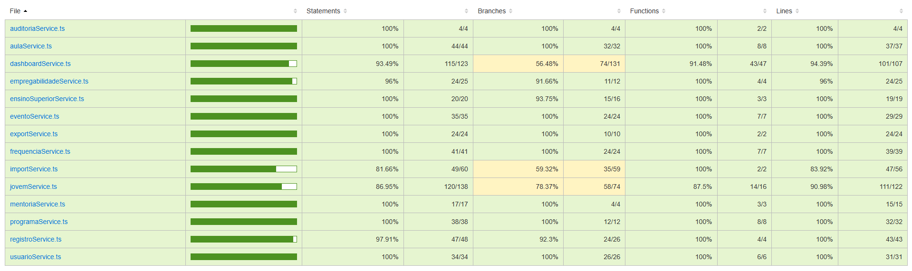<br>
  <p><b>Fonte:</b> Elaborado pelos autores, 2026</p>
</div>

#### Mapeamento consolidado CT/CI -> RN -> RF

| ID | Tipo | RN coberta | RF correspondente | Endpoint | O que verifica |
|----|------|------------|-------------------|----------|----------------|
| CT01 | unitário | RN03, RN06 | RF001, RF003 | POST /api/jovens | CPF opcional; categoria Conectado inserida atomicamente |
| CT02 | unitário | RN03 | RF001 | POST /api/jovens | CPF válido aceito; unicidade verificada |
| CT03 | unitário | RN03 | RF001 | POST /api/jovens | Rejeita nome vazio |
| CT04 | unitário | RN03 | RF001 | POST /api/jovens | Rejeita e-mail vazio |
| CT05 | unitário | RN03 | RF001 | POST /api/jovens | Rejeita telefone vazio |
| CT06 | unitário | RN03 | RF001 | POST /api/jovens | Rejeita CPF com dígito verificador inválido |
| CT07 | unitário | RN04b | RF002 | POST /api/jovens | Rejeita idade fora de 14–29 anos |
| CT08 | unitário | RN01 | RF001 | POST /api/jovens | Rejeita e-mail duplicado |
| CT09 | unitário | RN01 | RF001 | POST /api/jovens | Rejeita CPF duplicado |
| CT10 | unitário | CONF-RNF | RF001 | POST /api/jovens | Rollback em falha de categoria |
| CT11 | unitário | RN16 | RF009 | GET /api/jovens/:id | Retorna jovem quando encontrado |
| CT12 | unitário | RN16 | RF009 | GET /api/jovens/:id | NotFoundError quando inexistente |
| CT13 | unitário | RN21 | RF012 | GET /api/jovens | Filtros AND repassados ao repo |
| CT14 | unitário | RN16 | RF002 | PATCH /api/jovens/:id | Retorna jovem atualizado |
| CT15 | estático | RN05 | RF002 | PATCH /api/jovens/:id | renda_inicial excluída do tipo; garantia TypeScript |
| CT16 | unitário | RN16 | RF002 | PATCH /api/jovens/:id | NotFoundError quando inexistente |
| CT17 | unitário | RN16 | RF002 | DELETE /api/jovens/:id | Soft delete e auditoria |
| CT18 | unitário | RN16 | RF002 | DELETE /api/jovens/:id | NotFoundError (busca prévia) |
| CT19 | unitário | RN16 | RF002 | DELETE /api/jovens/:id | NotFoundError (repo.remover false) |
| CT20 | unitário | RN16 | RF009 | GET /api/jovens/:id/perfil-completo | Agrega categorias, frequência e registros |
| CT21 | unitário | RN16 | RF009 | GET /api/jovens/:id/perfil-completo | NotFoundError quando inexistente |
| CT22 | unitário | RN07 | RF003 | POST /api/jovens/:id/categoria | Histórico com categoria_anterior e id_usuario |
| CT23 | unitário | RN07 | RF003 | POST /api/jovens/:id/categoria | NotFoundError quando jovem inexistente |
| CT24 | unitário | RN07 | RF003 | GET /api/jovens/:id/categoria | Histórico em ordem cronológica |
| CT25 | unitário | RN07 | RF003 | GET /api/jovens/:id/categoria | NotFoundError quando jovem inexistente |
| CI01–CI04 | integração | RN21 | RF012 | GET /api/jovens | Filtros válidos e inválidos |
| CI05–CI07 | integração | RN16 | RF009 | GET /api/jovens/:id | 200, 422, 404 |
| CI08–CI10 | integração | RN16 | RF009 | GET /api/jovens/:id/perfil-completo | 200, 404, 422 |
| CI11–CI13 | integração | RN01, RN03 | RF001 | POST /api/jovens | 201, 422, 409 |
| CI14–CI16 | integração | RN16 | RF002 | PATCH /api/jovens/:id | 200, 422, 404 |
| CI17–CI19 | integração | RN16 | RF002 | DELETE /api/jovens/:id | 204, 422, 404 |
| CI20–CI22 | integração | RN07 | RF003 | GET /api/jovens/:id/categoria | 200, 422, 404 |
| CI23–CI27 | integração | RN07 | RF003 | POST /api/jovens/:id/categoria | 201, 422 (3 casos), 404 |
| CT-PM01 | unitário | RN08 | RF004 | POST /api/programas | nome e data_inicio válidos; repo.criar chamado |
| CT-PM02 | unitário | RN08 | RF004 | POST /api/programas | Rejeita nome vazio |
| CT-PM03 | unitário | RN08 | RF004 | POST /api/programas | Rejeita data_inicio ausente |
| CT-PM04 | unitário | RN08 | RF004 | GET /api/programas/:id | Retorna programa quando encontrado |
| CT-PM05 | unitário | RN08 | RF004 | GET /api/programas/:id | NotFoundError quando inexistente |
| CT-PM06 | unitário | RN08 | RF004 | PUT /api/programas/:id | Retorna programa atualizado |
| CT-PM07 | unitário | RN08 | RF004 | PUT /api/programas/:id | NotFoundError quando inexistente |
| CT-PM08 | unitário | RF004, RN08 | RF004 | POST /api/jovens/:id/inscricao | Inscreve com status "Em andamento" |
| CT-PM09 | unitário | RF004, RN08 | RF004 | POST /api/jovens/:id/inscricao | Rejeita id_programa ausente |
| CT-PM10 | unitário | RF004, RN08 | RF004 | POST /api/jovens/:id/inscricao | ConflictError em inscrição duplicada |
| CT-PM11 | unitário | RF004, RN08 | RF004 | POST /api/jovens/:id/inscricao | NotFoundError em programa inexistente |
| CT-PM12 | unitário | RN25 | RF019 | POST /api/mentorias | Perfil não-Mentor impedido de criar sessão |
| CT-PM13 | unitário | RN25 | RF019 | POST /api/mentorias | Mentor válido cria sessão com dados corretos |
| CT-PM14 | unitário | RN25 | RF019 | PUT /api/mentorias/:id/info | NotFoundError em sessão inexistente |
| CT-PM15 | unitário | RN25 | RF019 | PUT /api/mentorias/:id/info | Perfil não-Mentor impedido de atualizar sessão |
| CI-PM01 | integração | RN08 | RF004 | GET /api/programas | 200 com array de programas |
| CI-PM02–03 | integração | RN08 | RF004 | POST /api/programas | 201 sucesso; 400 campo obrigatório ausente |
| CI-PM04–05 | integração | RN08 | RF004 | GET /api/programas/:id | 200 sucesso; 404 inexistente |
| CI-PM06–07 | integração | RN08 | RF004 | PUT /api/programas/:id | 200 sucesso; 404 inexistente |
| CI-PM08–09 | integração | RN08 | RF004 | GET /api/programas/:id/alunos | 200 sucesso; 404 inexistente |
| CI-PM10–11 | integração | RN08 | RF004 | GET /api/programas/:id/eventos | 200 sucesso; 404 inexistente |
| CI-PM12 | integração | RF004, RN08 | RF004 | GET /api/jovens/:id/inscricao | 200 com lista de inscrições |
| CI-PM13–16 | integração | RF004, RN08 | RF004 | POST /api/jovens/:id/inscricao | 201; 400 validação; 409 duplicata; 404 programa |
| CI-PM17 | integração | RN24 | RF019 | GET /api/mentor/:id/mentorias | 200 com sessões do mentor |
| CI-PM18–19 | integração | RN25 | RF019 | PUT /api/mentorias/:id/info | 200 sucesso; 404 sessão inexistente |
| P-WAD-PUT | — | WAD/Matriz usa PATCH; código expõe PUT | Alinhamento de equipe |
| P-WAD-perfil | — | GET /perfil-completo não consta na Matriz RF→Endpoint | Atualizar WAD |

---

| ID | Tipo | RN coberta | RF correspondente | Endpoint | O que verifica |
|----|------|------------|-------------------|----------|----------------|
| CT01 | unitário | RN18 | RF018 | POST /api/usuarios | Retorna o usuario criado pelo repository quando nome, email e perfil são válidos |
| CT02 | unitário | RN18 | RF018 | POST /api/usuarios | Lança BadRequestError e não chama o repository quando nome tem menos de 2 caracteres |
| CT03 | unitário | RN18 | RF018 | POST /api/usuarios | Lança BadRequestError e não chama o repository quando nome está vazio |
| CT04 | unitário | RN18 | RF018 | POST /api/usuarios | Lança BadRequestError e não chama o repository quando email não contém o formato válido |
| CT05 | unitário | RN18 | RF018 | POST /api/usuarios | Lança BadRequestError e não chama o repository quando perfil não pertence aos valores permitidos pelo enum PerfilUsuario |
| CT06 | unitário | RN18 | RF018 | POST /api/usuarios | Lança BadRequestError e não chama o repository quando perfil é Aluno e id_jovem não é informado |
| CT07 | unitário | RN18 | RF018 | POST /api/usuarios | Retorna usuario criado com perfil Aluno e id_jovem correto quando o vínculo com o jovem é informado |
| CT08 | unitário | RN18 | RF018 | GET /api/usuarios/:id | Retorna o usuario correspondente ao id quando o repository encontra o registro |
| CT09 | unitário | RN18 | RF018 | GET /api/usuarios/:id | Lança NotFoundError quando o repository retorna null para o id informado |
| CT10 | unitário | RN18 | RF018 | GET /api/usuarios | Retorna a lista completa de usuarios devolvida pelo repository |
| CT11 | unitário | RN18 | RF018 | PUT /api/usuarios/:id | Retorna o usuario com os campos atualizados quando os dados de entrada são válidos |
| CT12 | unitário | RN18 | RF018 | PUT /api/usuarios/:id | Lança BadRequestError e não chama o repository quando o email de atualização não tem formato válido |
| CT13 | unitário | RN18 | RF018 | PUT /api/usuarios/:id | Lança BadRequestError e não chama o repository quando o perfil de atualização não pertence aos valores permitidos |
| CT14 | unitário | RN18 | RF018 | PUT /api/usuarios/:id | Lança NotFoundError quando o repository retorna null ao tentar atualizar um id inexistente |
| CT15 | unitário | RN18 | RF018 | DELETE /api/usuarios/:id | Chama repository.remover com o id correto sem lançar erro quando o registro existe |
| CT16 | unitário | RN18 | RF018 | DELETE /api/usuarios/:id | Lança NotFoundError quando o repository retorna false indicando que nenhuma linha foi removida |
| CT-C01 | integração | RN18 | RF018 | GET /api/usuarios | Responde 200 com array contendo os usuarios retornados pelo service mockado |
| CT-C02 | integração | RN18 | RF018 | GET /api/usuarios/:id | Responde 200 com o objeto do usuario quando o service mockado retorna o registro |
| CT-C03 | integração | RN18 | RF018 | GET /api/usuarios/:id | Responde 404 com campo error quando o service lança NotFoundError |
| CT-C04 | integração | RN18 | RF018 | GET /api/usuarios/:id | Responde 404 quando o id é não-numérico, documentando o comportamento atual do bug B12 — o controller não valida o formato do parâmetro e repassa NaN ao service |
| CT-C05 | integração | RN18 | RF018 | POST /api/usuarios | Responde 201 com o corpo do usuario criado e header Location apontando para /api/usuarios/:id |
| CT-C06 | integração | RN18 | RF018 | POST /api/usuarios | Responde 400 com campo error quando o service lança BadRequestError por payload inválido |
| CT-C07 | integração | RN18 | RF018 | POST /api/usuarios | Responde 409 com campo error quando o service lança ConflictError por email já cadastrado |
| CT-C08 | integração | RN18 | RF018 | PUT /api/usuarios/:id | Responde 200 com o objeto do usuario atualizado quando o service mockado retorna o registro modificado |
| CT-C09 | integração | RN18 | RF018 | PUT /api/usuarios/:id | Responde 400 com campo error quando o service lança BadRequestError por email inválido no body |
| CT-C10 | integração | RN18 | RF018 | PUT /api/usuarios/:id | Responde 404 com campo error quando o service lança NotFoundError para id inexistente |
| CT-C11 | integração | RN18 | RF018 | DELETE /api/usuarios/:id | Responde 204 sem body quando o service executa a remoção sem erro |
| CT-C12 | integração | RN18 | RF018 | DELETE /api/usuarios/:id | Responde 404 com campo error quando o service lança NotFoundError para id inexistente |

---

| ID | Tipo | RN coberta | RF correspondente | Endpoint | O que verifica |
|------|-------------|--------------|-------------------|--------------------------------------------------|----------------|
| CT01 - REG | unitário | RN19, RN17 | RF010 | GET /api/jovens/:id/prontuario | Psicólogo recebe apenasPublico=false, acessando registros restritos |
| CT02 - REG | unitário | RN19, RN17 | RF010 | GET /api/jovens/:id/prontuario | Coordenação recebe apenasPublico=true, vendo apenas registros públicos |
| CT03 - REG | unitário | RN17 | RF010 | GET /api/jovens/:id/prontuario | Perfil não autorizado interrompe fluxo antes de consultar o usuário |
| CT04 - REG | unitário | RN19 | RF010 | GET /api/jovens/:id/prontuario | Usuário inexistente lança NotFoundError antes de consultar registros |
| CT05 - REG | unitário | RN19 | RF010 | POST /api/jovens/:id/prontuario | Atendimento_Equipe persiste com visibilidade Publico_Equipe |
| CT06 - REG | unitário | RN19 | RF010 | POST /api/jovens/:id/prontuario | Acompanhamento_Psicologico força Restrito_Psicologia, sobrescrevendo input |
| CT07 - REG | unitário | RN19 | RF010 | POST /api/jovens/:id/prontuario | Conteúdo em branco lança BadRequestError antes do INSERT |
| CT08 - REG | unitário | RN19b | RF010 | POST /api/jovens/:id/prontuario | auditoriaService.registrar é chamado com id_usuario, id_jovem_afetado e tabela_afetada corretos |
| CT09 - REG | unitário | RN19b | RF010 | PUT /api/jovens/:id/prontuario/:registroId | Retorna registro com conteúdo atualizado com repo chamado com os dados corretos |
| CT10 - REG | unitário | RN19 | RF010 | PUT /api/jovens/:id/prontuario/:registroId | Mudança para Acompanhamento_Psicologico força Restrito_Psicologia no payload |
| CT11 - REG | unitário | RN19 | RF010 | PUT /api/jovens/:id/prontuario/:registroId | Registro inexistente na busca inicial lança NotFoundError |
| CT12 - REG | unitário | RN19 | RF010 | PUT /api/jovens/:id/prontuario/:registroId | repo.atualizar retornando null lança NotFoundError |
| CT13 - REG | unitário | RN17 | RF010 | GET /api/jovens/:id/prontuario | Não-Psicólogo em registro Restrito_Psicologia recebe ForbiddenError |
| CT14 - REG | unitário | RN17 | RF010 | GET /api/jovens/:id/prontuario | Psicólogo acessa registro Restrito_Psicologia e recebe o objeto completo |
| CT15 - REG | unitário | RN19 | RF010 | GET /api/jovens/:id/prontuario | Registro inexistente em verificarAcesso lança NotFoundError |
| CT16 - AUD | unitário | RN19b | RF010 | POST/PUT /api/jovens/:id/prontuario | historicoRepo.inserir chamado com todos os parâmetros mapeados corretamente |
| CT17 - AUD | unitário | RN19b | RF010 | POST/PUT /api/jovens/:id/prontuario | Rejeição do repositório de auditoria não propaga erro; console.error chamado internamente |
| CT18 - AUD | unitário | RN19b | RF010 | POST/PUT /api/jovens/:id/prontuario | Campos opcionais id_jovem_afetado e valor_anterior enviados como null quando omitidos |
| CI01 | integração | RN19, RN17 | RF010 | GET /api/jovens/:id/prontuario | HTTP 200 com array de registros; service chamado com (id_jovem, id_usuario) corretos |
| CI02 | integração | RN19 | RF010 | GET /api/jovens/:id/prontuario | HTTP 422 quando id_usuario está ausente na query string |
| CI03 | integração | RN19 | RF010 | GET /api/jovens/:id/prontuari` | HTTP 422 quando id_usuario=0 (valor inválido) |
| CI04 | integração | RN17 | RF010 | GET /api/jovens/:id/prontuario | HTTP 403 quando service rejeita com ForbiddenError |
| CI05 | integração | RN19, RN19b | RF010 | POST /api/jovens/:id/prontuario | HTTP 201 com body { id, id_jovem } e header Location corretos |
| CI06 | integração | RN19 | RF010 | POST /api/jovens/:id/prontuario | HTTP 201 quando id_usuario fornecido via query param |
| CI07 | integração | RN19 | RF010 | POST /api/jovens/:id/prontuario | HTTP 422 quando nem id_autor nem id_usuario são informados |
| CI08 | integração | RN17 | RF010 | POST /api/jovens/:id/prontuario | HTTP 403 quando service rejeita com ForbiddenError |
| CI09 | integração | RN19b | RF010 | PUT /api/jovens/:id/prontuario/:registroId | HTTP 200 com conteúdo atualizado; service chamado com (registroId, id_usuario, payload) corretos |
| CI10 | integração | RN19b | RF010 | PUT /api/jovens/:id/prontuario/:registroId | HTTP 200 quando id_usuario fornecido via query param |
| CI11 | integração | RN19 | RF010 | PUT /api/jovens/:id/prontuario/:registroId | HTTP 422 quando id_usuario está ausente |
| CI12 | integração | RN19 | RF010 | PUT /api/jovens/:id/prontuario/:registroId | HTTP 404 quando service rejeita com NotFoundError |

---

| ID | Tipo | RN coberta | RF correspondente | Endpoint | O que verifica |
|----|------|------------|-------------------|----------|----------------|
| CT-FREQ-S01 | unitário | RN09 | RF005 | POST /api/frequencia (tipo aula) | Registra frequência válida em aula com presente: true |
| CT-FREQ-S02 | unitário | RN09 | RF005 | POST /api/frequencia (tipo aula) | Registra falta válida em aula com presente: false |
| CT-FREQ-S03 | unitário | RN09 | RF005 | POST /api/frequencia (tipo aula) | Rejeita registro de aula sem id_jovem |
| CT-FREQ-S04 | unitário | RN09 | RF005 | POST /api/frequencia (tipo aula) | Rejeita registro de aula sem id_aula |
| CT-FREQ-S05 | unitário | RN09 | RF005 | POST /api/frequencia (tipo aula) | Rejeita registro de aula sem nome da aula ou data |
| CT-EVT-S01 | unitário | RN08 | RF004 | POST /api/frequencia (tipo evento) | Registra participação válida em evento com presente: true |
| CT-EVT-S02 | unitário | RN08 | RF004 | POST /api/frequencia (tipo evento) | Registra ausência válida em evento com presente: false |
| CT-EVT-S03 | unitário | RN08 | RF004 | POST /api/frequencia (tipo evento) | Rejeita evento sem id_jovem ou id_evento |
| CT-EVT-S04 | unitário | RN08 | RF004 | POST /api/frequencia (tipo evento) | Rejeita evento sem nome do evento ou data |
| CT-GER-S01 | unitário | RN08, RN09 | RF004, RF005 | POST /api/frequencia | Rejeita payload sem presente booleano |
| CT-GER-S02 | unitário | RN08, RN09 | RF004, RF005 | POST /api/frequencia | Rejeita tipo diferente de aula ou evento |
| CT-FREQ-S06 | unitário | RN09 | RF005 | GET /api/frequencia/jovens/:id/taxa-presenca-aula | Retorna taxa de presença calculada pelo repository |
| CT-EVT-S05 | unitário | RN08 | RF004 | GET /api/frequencia/jovens/:id/taxa-participacao-evento | Retorna taxa de participação calculada pelo repository |
| CT-FREQ-I01 | integração | RN09 | RF005 | POST /api/frequencia (tipo aula) | HTTP 201 ao registrar frequência válida em aula |
| CT-FREQ-I02 | integração | RN09 | RF005 | POST /api/frequencia (tipo aula) | HTTP 422 quando payload de aula está incompleto |
| CT-FREQ-I03 | integração | RN09 | RF005 | POST /api/frequencia (tipo aula) | HTTP 404 quando jovem ou aula não encontrados |
| CT-EVT-I01 | integração | RN08 | RF004 | POST /api/frequencia (tipo evento) | HTTP 201 ao registrar participação válida em evento |
| CT-EVT-I02 | integração | RN08 | RF004 | POST /api/frequencia (tipo evento) | HTTP 422 quando payload de evento está incompleto |
| CT-EVT-I03 | integração | RN08 | RF004 | POST /api/frequencia (tipo evento) | HTTP 404 quando jovem ou evento não encontrados |
| CT-FREQ-I04 | integração | RN09 | RF005 | GET /api/frequencia/jovens/:id/frequencias-aula | HTTP 200 ao consultar frequências de aula de um jovem |
| CT-EVT-I04 | integração | RN08 | RF004 | GET /api/frequencia/jovens/:id/participacoes-evento | HTTP 200 ao consultar participações em eventos de um jovem |
| CT-FREQ-I07 | integração | RN09 | RF005 | GET /api/frequencia/jovens/:id/taxa-presenca-aula | HTTP 200 com taxa de presença em aulas |
| CT-EVT-I07 | integração | RN08 | RF004 | GET /api/frequencia/jovens/:id/taxa-participacao-evento | HTTP 200 com taxa de participação em eventos |
| CT-FREQ-I10 | integração | RN09 | RF005 | DELETE /api/frequencia/frequencias-aula/:id | HTTP 204 ao remover frequência de aula existente |
| CT-EVT-I10 | integração | RN08 | RF004 | DELETE /api/frequencia/participacoes-evento/:id | HTTP 204 ao remover participação em evento existente |
| CT-IMP-S01–S09 | unitário | RN11, RN23 | RF016 | POST /api/import | Processamento de CSV linha a linha; UPSERT por CPF e acúmulo de erros |
| CT-EXP-S01–S07 | unitário | RN21, RN15b | RF017 | GET /api/export | WHERE dinâmico com filtros AND e LEFT JOIN empregabilidade |
| CT-CD-S01–S06 | unitário | RN15b | RF008 | (consumido pelo dashboard) | Listagem, criação e contagem de computadores doados |
| CT-CSV-S01–S06 | unitário | — | RF016, RF017 | POST /api/import, GET /api/export | Helpers puros de parse e geração de CSV |
| CT-IMP-I01–I04 | integração | RN11, RN23 | RF016 | POST /api/import | Upload multipart, validação de arquivo e erros parciais |
| CT-EXP-I01–I02 | integração | RN21 | RF017 | GET /api/export | Headers de download e CSV vazio sem resultados |

## 5.2. Testes de usabilidade

&ensp;&ensp;&ensp;&ensp;Esta seção documenta a avaliação de usabilidade da plataforma Pulse Control na Sprint 5, com foco na observação de tarefas associadas aos principais perfis previstos no sistema. A validação foi organizada a partir de testes de guerrilha, apresentados na seção 5.2.1, nos quais participantes executaram fluxos reais da interface enquanto a equipe registrava sucessos, dificuldades e pontos de atrito. Essa abordagem permitiu complementar as validações técnicas já realizadas, observando aspectos da experiência do usuário que não são capturados por testes automatizados, como clareza da navegação, compreensão dos rótulos, localização de botões e facilidade de conclusão das tarefas.

&ensp;&ensp;&ensp;&ensp;Ao final de cada sessão, os participantes responderam ao **Questionário SUS (System Usability Scale)** — instrumento padronizado composto por 10 afirmações avaliadas em escala Likert de 1 a 5, cuja pontuação final varia de 0 a 100. O limiar de aceitabilidade estabelecido pela literatura é de **≥ 68 pontos**, correspondendo à faixa "Bom" na escala de adjetivos de Bangor et al. (2009); pontuações abaixo desse valor indicam necessidade de revisão prioritária da interface. Os resultados quantitativos do SUS, as tabelas de tabulação por tarefa e as ocorrências detalhadas com sua respectiva priorização de correção são apresentados nas subseções a seguir.

### 5.2.1. Relatório de testes de guerrilha

#### 5.2.1.1. Introdução

&ensp;&ensp;&ensp;&ensp;Os testes de guerrilha foram conduzidos com o objetivo de avaliar, de forma rápida e prática, a usabilidade das principais funcionalidades da plataforma antes da entrega final. A metodologia foi escolhida por permitir a observação direta de usuários realizando tarefas representativas do sistema, sem treinamento prévio e sem orientação passo a passo durante a navegação. Dessa forma, foi possível identificar pontos de atrito na interface, dificuldades de compreensão e oportunidades de melhoria nos fluxos de Coordenador, Psicólogo, Gestor e Aluno.

&ensp;&ensp;&ensp;&ensp;As sessões foram realizadas presencialmente no ambiente do Inteli, com estudantes convidados a simular os perfis de uso definidos para a plataforma. Os participantes possuíam familiaridade geral com tecnologia e interfaces web, funcionando como público proxy para validar a clareza dos fluxos antes de testes com usuários finais da Pulse Mais. Cada participante recebeu um enunciado de tarefa, executou o fluxo de forma autônoma e teve sua navegação observada pela equipe. Os resultados foram registrados por etapa, indicando sucesso, sucesso com dificuldade ou fracasso, e posteriormente consolidados em uma tabela de ocorrências com severidade, resumo do problema, participantes afetados e potenciais melhorias.

#### 5.2.1.2. Registro dos testes

&ensp;&ensp;&ensp;&ensp;Esta subseção apresenta o registro dos testes de usabilidade realizados na plataforma Pulse Control, considerando as quatro tarefas definidas para os principais perfis de usuário do sistema. As tarefas foram tabuladas em planilha pública e complementadas por evidências em imagem, permitindo documentar o desempenho dos participantes, as dificuldades encontradas e as heurísticas de Nielsen relacionadas a cada fluxo testado.

##### a) Tarefas testadas

| # | Tarefa | Perfil simulado | Enunciado apresentado ao participante | Critério de sucesso |
|---|--------|-----------------|----------------------------------------|---------------------|
| 1 | Cadastrar aluno | Coordenador | Suponha que você é um coordenador da Pulse Mais, utilize o sistema para cadastrar um aluno. | Aluno criado no sistema após o preenchimento das informações obrigatórias. |
| 2 | Criar anotação no prontuário | Psicólogo | Suponha que você é um psicólogo da Pulse Mais, utilize o sistema para anotar no prontuário de um jovem. | Anotação registrada no prontuário do jovem. |
| 3 | Exportar arquivo CSV | Gestor | Suponha que você é um gestor da Pulse Mais, utilize o sistema para importar e exportar os dados para uma planilha em CSV. | Arquivo CSV exportado com sucesso. |
| 4 | Editar perfil | Aluno | Suponha que você é um aluno da Pulse Mais, utilize o sistema para editar as informações do seu perfil. | Dados do perfil atualizados com sucesso. |

##### b) Etapas de navegação esperadas por tarefa

**Tarefa 1 — Cadastrar aluno**

- **Etapa 1:** Escolher o perfil de coordenador na tela inicial.
- **Etapa 2:** Clicar em "Alunos" na sidebar.
- **Etapa 3:** Clicar em "Criar novo aluno".
- **Etapa 4:** Preencher as informações obrigatórias do aluno.
- **Fluxo ideal esperado:** O participante deve acessar o perfil de coordenador, localizar a área de alunos, iniciar o cadastro e preencher os campos obrigatórios até concluir a criação do novo aluno.

**Tarefa 2 — Criar anotação no prontuário do psicólogo**

- **Etapa 1:** Escolher o perfil de psicólogo na tela inicial.
- **Etapa 2:** Clicar em "Ver prontuário".
- **Etapa 3:** Anotar "teste" em Registro Psicólogo.
- **Etapa 4:** Voltar para a tela inicial do psicólogo.
- **Fluxo ideal esperado:** O participante deve acessar o perfil de psicólogo, abrir o prontuário de um jovem, registrar uma anotação e retornar à tela inicial do perfil.

**Tarefa 3 — Exportar arquivo CSV**

- **Etapa 1:** Escolher o perfil de gestor na tela inicial.
- **Etapa 2:** Encontrar a aba onde está o botão de exportar.
- **Etapa 3:** Clicar em "Exportar" na parte superior da página.
- **Etapa 4:** Voltar para a tela inicial do gestor.
- **Fluxo ideal esperado:** O participante deve acessar o perfil adequado, localizar a área de dados/relatórios, exportar o arquivo CSV e retornar à tela inicial sem precisar de orientação externa.

**Tarefa 4 — Editar perfil**

- **Etapa 1:** Escolher o perfil de aluno na tela inicial.
- **Etapa 2:** Clicar em "Meu Perfil".
- **Etapa 3:** Clicar em "Atualizar Dados" e editar nome e endereço.
- **Etapa 4:** Voltar para a tela inicial do aluno.
- **Fluxo ideal esperado:** O participante deve acessar o perfil de aluno, abrir a área de perfil, editar os dados solicitados e retornar à tela inicial mantendo o fluxo sem interrupções.

---

##### c) Tabela de registro

&ensp;&ensp;&ensp;&ensp;A tabela de tabulação dos testes de usabilidade foi organizada em duas partes complementares. A primeira apresenta o registro dos testes por tarefa, indicando o perfil simulado, o enunciado apresentado aos participantes, as etapas esperadas do fluxo, o resultado obtido e as observações feitas durante a navegação. Essa estrutura permitiu acompanhar, de forma individual, como cada participante realizou as tarefas propostas na plataforma.

&ensp;&ensp;&ensp;&ensp;A segunda parte da tabela consolida as principais ocorrências identificadas durante os testes. Nela, os problemas foram agrupados por tarefa, classificados por severidade e descritos a partir das dificuldades observadas, além de incluir possíveis melhorias para a interface. Dessa forma, a tabulação funciona tanto como registro da execução dos testes quanto como base para a análise posterior dos problemas de usabilidade e compreensão encontrados.

Tabela de registro completa: [Planilha de tabulação dos testes de usabilidade](https://docs.google.com/spreadsheets/d/1uHPvt4k4Tcx8MKDstYSu2CiIyKFZZzZlotousquMAs8/edit?usp=sharing)

---

##### d) Evidências dos testes

&ensp;&ensp;&ensp;&ensp;As imagens a seguir registram a execução dos testes de usabilidade realizados com estudantes do Inteli na plataforma Pulse Control. Para cada tarefa, foram reunidas evidências da interface utilizada e, quando disponível, registros do momento do teste com os participantes. O objetivo desta subseção é documentar a realização das tarefas, contextualizar o fluxo observado e indicar os principais pontos percebidos durante a navegação, sem aprofundar ainda a análise de causas e melhorias.

###### Evidências — Tarefa 1: Cadastrar aluno

<div align="center">
  <p><b>Imagem 66 -</b> Evidências da tarefa de cadastro de aluno no perfil Coordenador</p>
  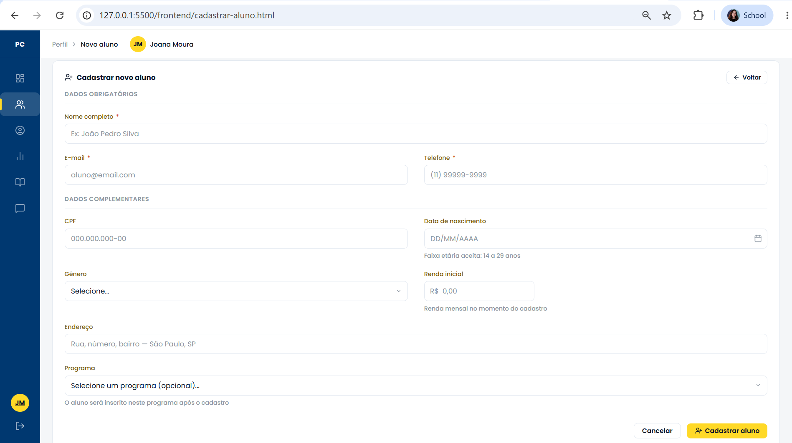<br>
  <p><b></b> Print da interface de cadastro de aluno</p>
</div>

<div align="center">
  <p><b>Imagem 67 -</b> Registro do participante durante a tarefa</p>
  <br>
</div>


&ensp;&ensp;&ensp;&ensp;Essas evidências registram a tarefa de cadastro de aluno no perfil de Coordenador. O participante deveria acessar a área de alunos, localizar a opção de criação e preencher os dados obrigatórios para concluir o cadastro.

&ensp;&ensp;&ensp;&ensp;Durante os testes, a tarefa foi concluída pelos participantes, mas foram observadas dificuldades pontuais na localização do botão de criação de aluno. Também foi identificado um problema no retorno de mensagem de erro durante o preenchimento, em que a interface indicava inconsistência relacionada ao CPF quando a dificuldade estava associada ao telefone. Esses registros foram mantidos como evidência porque ajudam a demonstrar em que ponto do fluxo surgiram dúvidas ou ruídos de compreensão.

&ensp;&ensp;&ensp;&ensp;Como melhoria, a equipe pretende aumentar o destaque visual do botão de criação de aluno, tornando-o mais fácil de localizar no fluxo da Coordenação. Também será necessário revisar as mensagens de erro do formulário, garantindo que cada validação indique corretamente o campo com problemano momento do cadastro.

###### Evidências — Tarefa 2: Criar anotação no prontuário do psicólogo

<div align="center">
  <p><b>Imagem 68 -</b> Evidências da tarefa de anotação no prontuário do psicólogo</p>
  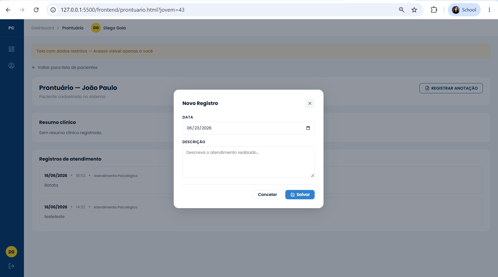<br>
  <sub></sub>
  <p><b></b> Print da interface de prontuário</p>
</div>

<div align="center">
  <p><b>Imagem 69 -</b> Registro do participante durante a tarefa</p>
  <br>
</div>


&ensp;&ensp;&ensp;&ensp;As evidências registram a tarefa de criação de anotação no prontuário, realizada no perfil de Psicólogo. O participante deveria acessar o prontuário de um jovem, inserir uma anotação de teste e retornar à tela inicial do perfil.

&ensp;&ensp;&ensp;&ensp;A maioria dos participantes conseguiu concluir a tarefa, mas alguns demonstraram dúvida em relação à nomenclatura utilizada na interface para registrar uma anotação. Também foi observado que um participante tentou utilizar o ícone de “home” para retornar à tela inicial, mas essa ação não estava implementada no fluxo. Esses registros ajudam a evidenciar pontos em que a interface gerou interpretação diferente da esperada pela equipe.

&ensp;&ensp;&ensp;&ensp;Como melhoria, a equipe pretende revisar a nomenclatura da ação de registro no prontuário, utilizando um termo mais direto, como “Registrar anotação”. Além disso, será avaliada a implementação do ícone de “home” como alternativa de retorno à tela inicial.

###### Evidências — Tarefa 3: Exportar arquivo CSV

<div align="center">
  <p><b>Imagem 70 -</b> Evidências da tarefa de exportação de arquivo CSV no perfil Gestor</p>
  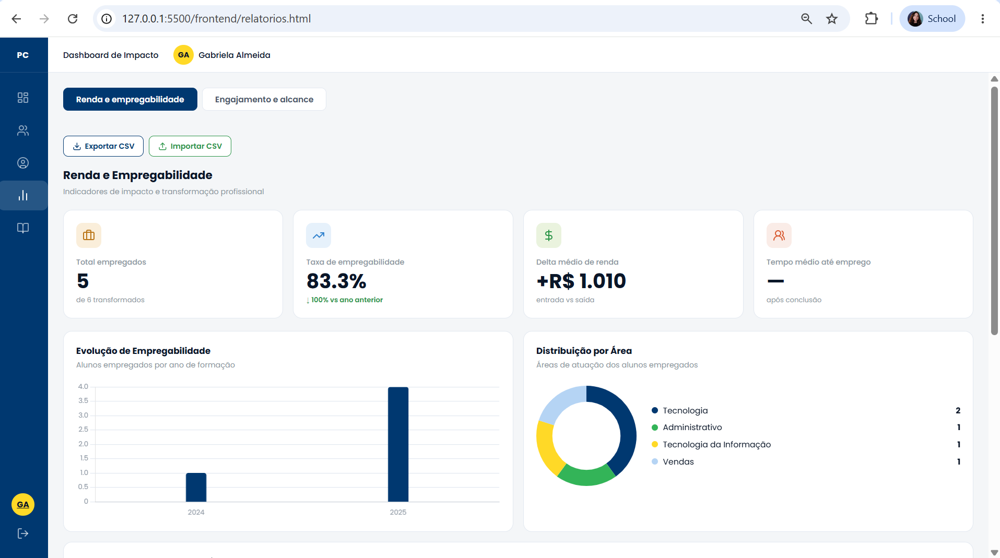<br>
  <p><b></b> Print da interface com botão de exportação</p>
</div>

<div align="center">
  <p><b>Imagem 71 -</b> Registro do participante durante a tarefa</p>
  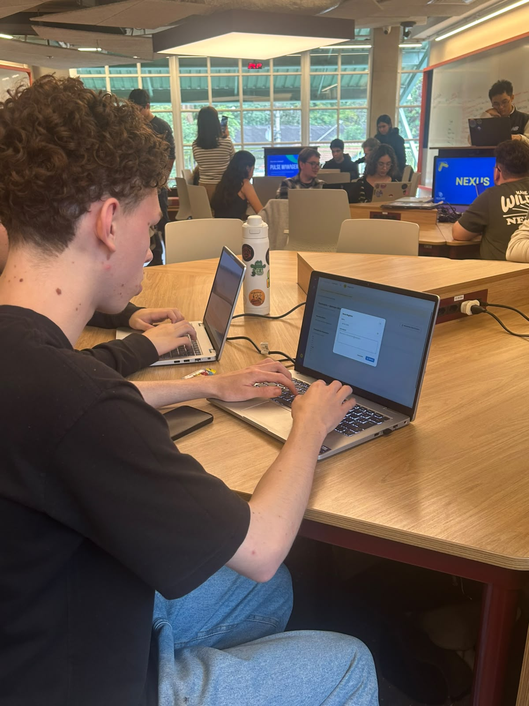<br>
</div>


&ensp;&ensp;&ensp;&ensp;As evidências registram a tarefa de exportação de arquivo CSV, realizada no perfil de Gestor. O participante deveria localizar a área em que os dados estavam disponíveis, acionar a exportação e retornar à tela inicial do perfil.

&ensp;&ensp;&ensp;&ensp;Nos testes, o botão de exportação foi encontrado com mais facilidade depois que os participantes chegaram à página correta. A principal dificuldade observada esteve no caminho até essa tela, especialmente na identificação da área da plataforma em que a exportação estava disponível. Por isso, as evidências desta tarefa registram tanto a tela de exportação quanto o momento de navegação, permitindo relacionar a dificuldade ao fluxo entre páginas, e não apenas ao botão de exportar.

&ensp;&ensp;&ensp;&ensp;Como melhoria, a equipe pretende tornar o acesso à exportação de CSV mais evidente dentro da navegação e avaliará a possibilidade de implementação de uma área específica para relatórios ou dados. A intenção é reduzir a quantidade de tentativas necessárias até encontrar a tela correta.

###### Evidências — Tarefa 4: Editar perfil

<div align="center">
  <p><b>Imagem 72 -</b> Evidências da tarefa de edição de perfil no acesso de Aluno</p>
  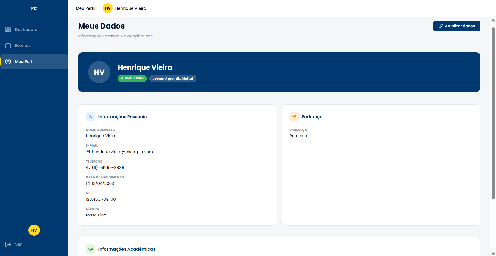<br>
  <p><b></b> Print da interface com botão de atualizar perfil do aluno</p>
</div>

<div align="center">
  <p><b>Imagem 73 -</b> Registro do participante durante a tarefa</p>
  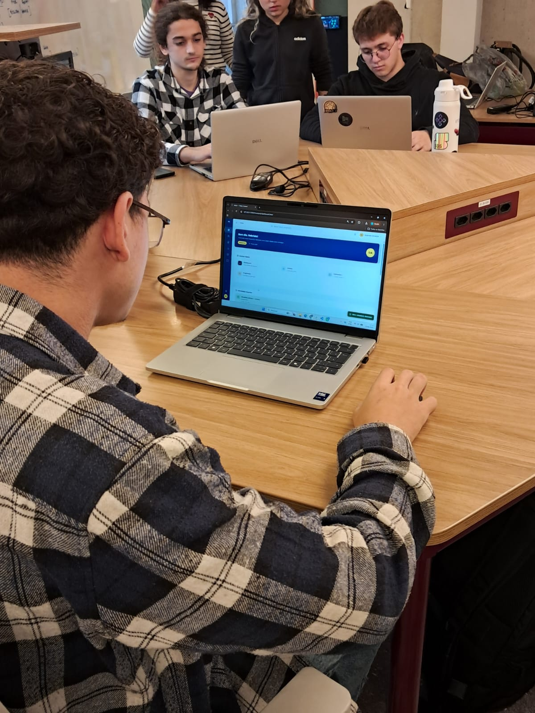
</div>


&ensp;&ensp;&ensp;&ensp;As evidências registram a tarefa de edição de perfil no acesso de Aluno. O participante deveria acessar a área “Meu Perfil”, clicar na opção de atualização de dados, editar as informações solicitadas e retornar à tela inicial.

&ensp;&ensp;&ensp;&ensp;Nesta tarefa, os participantes conseguiram concluir o fluxo sem dificuldades relevantes. A área de perfil foi localizada com facilidade e o botão de atualização foi percebido como intuitivo. Por isso, as evidências desta tarefa foram registradas principalmente para comprovar a execução do teste e demonstrar um fluxo que, na observação realizada, apresentou boa compreensão por parte dos participantes.

&ensp;&ensp;&ensp;&ensp;Como a tarefa foi concluída sem dificuldades relevantes, a equipe pretende manter a estrutura geral do fluxo de edição de perfil. Os próximos ajustes, se necessários, devem se concentrar apenas em refinamentos visuais e na consistência dos botões e textos da interface.

##### e) Registro detalhado por participante

**Tarefa 1 — Cadastrar aluno — Registro dos participantes**

| # | Participante | Perfil | Resultado da tarefa | Etapa 1 | Etapa 2 | Etapa 3 | Etapa 4 | Heurística(s) relacionada(s) | Observações |
|---|---|---|---|---|---|---|---|---|---|
| 1 | Sophia | T28, facilidade com web | sucesso | Fácil, intuitivo | Fácil | Dificuldade de encontrar o botão de criar aluno | Fácil preenchimento | 5 — Prevenção de erros | — |
| 2 | Gabriel | 19 anos, T28, facilidade com web | sucesso | Localizou o perfil facilmente | Fácil | Dúvida de onde achar o botão | Fácil preenchimento | 5 — Prevenção de erros | — |
| 3 | Arthur Dantas | 19 anos, T24 | sucesso | Localizou o perfil facilmente | Encontrou o botão facilmente | Sem dificuldades | Fácil preenchimento | — | — |
| 4 | Gabriel Scatolin | 18 anos, T28 | sucesso | Localizou o perfil facilmente | Encontrou o botão facilmente, porém considerou o acesso pouco intuitivo | Sem dificuldades | Fácil preenchimento | 5 — Prevenção de erros | — |
| 5 | Felipe Strava | 19 anos, T28 | sucesso | Localizou o perfil facilmente | Encontrou o botão facilmente | Sem dificuldades | Fácil preenchimento | 5 — Prevenção de erros | No campo de telefone estava aparecendo CPF; não é possível editar o aluno após criá-lo |
| 6 | João Paulo | 20 anos, T28 | sucesso | Localizou o perfil facilmente | Encontrou o botão facilmente | Sem dificuldades | Fácil preenchimento | — | — |

**Tarefa 2 — Criar anotação no prontuário do psicólogo — Registro dos participantes**

| # | Participante | Perfil | Resultado da tarefa | Etapa 1 | Etapa 2 | Etapa 3 | Etapa 4 | Heurística(s) relacionada(s) | Observações |
|---|---|---|---|---|---|---|---|---|---|
| 1 | Sophia | T28, facilidade com web | sucesso | Intuitivo, fácil | Bem visível | Fácil de encontrar | Intuitivo | — | — |
| 2 | Gabriel | T28 | sucesso | Intuitivo, fácil | Bem visível | Sugeriu alterar o nome do campo para "registrar prontuário" | Intuitivo | 2 — Correspondência entre o sistema e o mundo real | — |
| 3 | Arthur Dantas | 19 anos, T24 | sucesso | Ok | Demorou para encontrar o local; função pouco intuitiva | Ok | Ok | 2 — Correspondência entre o sistema e o mundo real | — |
| 4 | Gabriel Scatolin | 18 anos, T28 | sucesso | Ok | Encontrou o botão facilmente | Ok | Ok | — | — |
| 5 | Rafael Stucci | 18 anos, T28 | sucesso com dificuldade | Ok | Encontrou o prontuário | Não achou intuitivo; demorou um pouco para completar a etapa | Clicou na casinha no canto superior, evidenciando desorientação | 2 — Correspondência entre o sistema e o mundo real | Sentiu falta de indicador visual no gráfico; considera o dashboard um painel de dados; consegue visualizar registros de outros pacientes, evidenciando problema de privacidade |

**Tarefa 3 — Exportar arquivo CSV — Registro dos participantes**

| # | Participante | Perfil | Resultado da tarefa | Etapa 1 | Etapa 2 | Etapa 3 | Etapa 4 | Heurística(s) relacionada(s) | Observações |
|---|---|---|---|---|---|---|---|---|---|
| 1 | Peter | — | sucesso | Acessa sem dificuldades | Acessa a aba com dificuldade visual | Encontra o CSV sem problemas | Volta intuitivamente | 7 — Flexibilidade e eficiência de uso | — |
| 2 | Gaby | — | sucesso com dificuldade | Ação rápida | Não encontra a sidebar; não localiza o ícone correto; demonstrou frustração | Importa após algumas tentativas | Ao acessar a página certa, encontra o botão rapidamente | 7 — Flexibilidade e eficiência de uso | — |
| 3 | Maria | — | sucesso | Acessa rapidamente | Fluxo entre telas para localizar o CSV é confuso | Botão em lugar óbvio na página | Volta sem problemas | 7 — Flexibilidade e eficiência de uso | — |
| 4 | Vitor | — | sucesso | Encontra o perfil sem problemas | Acha a página em poucos cliques | Encontra o CSV | Volta intuitivamente | — | — |
| 5 | Lucas | — | sucesso | Perfil facilmente localizável | Acha a página após alguns cliques na sidebar | Botão em lugar óbvio na página | Volta sem problemas | — | — |

**Tarefa 4 — Editar perfil — Registro dos participantes**

| # | Participante | Perfil | Resultado da tarefa | Etapa 1 | Etapa 2 | Etapa 3 | Etapa 4 | Heurística(s) relacionada(s) | Observações |
|---|---|---|---|---|---|---|---|---|---|
| 1 | Peter | — | sucesso | Acha sem problemas | Acha o perfil sem dificuldades | Botão em posição intuitiva | Fluxo sem interrupções | — | — |
| 2 | Gaby | — | sucesso | Acha sem problemas | Fluxo rápido | Posição intuitiva | Fluxo sem interrupções | — | — |
| 3 | Maria | — | sucesso | Acha rapidamente | Perfil encontrado na sidebar sem problemas | Botão em posição intuitiva | Fluxo sem interrupções | — | — |
| 4 | Vitor | — | sucesso | Acha sem problemas | Encontra o perfil facilmente | Botão em posição intuitiva | Fluxo sem interrupções | — | — |
| 5 | Lucas | — | sucesso | Acha sem problemas | Encontra o perfil facilmente | Botão em posição intuitiva | Fluxo sem interrupções | — | — |

---

#### 5.2.1.3. Análise dos resultados

&ensp;&ensp;&ensp;&ensp;A consolidação dos registros evidencia que as quatro tarefas foram concluídas pela maioria dos participantes, mas com graus distintos de fluidez. A Tarefa 4 (editar perfil) apresentou o melhor desempenho, com todos os participantes concluindo o fluxo sem dificuldades relevantes e descrevendo o botão de atualização como intuitivo. As Tarefas 1 (cadastrar aluno) e 2 (criar anotação no prontuário) foram concluídas com sucesso na quase totalidade dos casos, porém concentraram a maior parte das dificuldades pontuais observadas. A Tarefa 3 (exportar CSV) registrou a maior fricção de navegação, com participantes relatando dificuldade não na ação de exportar em si, mas no caminho entre telas até localizar a página correta.

&ensp;&ensp;&ensp;&ensp;O padrão recorrente identificado em todas as tarefas problemáticas foi a dificuldade de localização dos elementos de ação, e não a complexidade de execução das ações em si. Na Tarefa 1, a fricção concentrou-se na etapa de localização do botão de criação de aluno, citada por mais de um participante; observou-se ainda um problema de feedback de erro, em que a interface sinalizava inconsistência no campo de CPF quando a dificuldade estava no telefone, relacionado à heurística de prevenção de erros (heurística 5 de Nielsen). Na Tarefa 2, a fricção esteve associada à nomenclatura do módulo e à orientação entre telas, com participantes sugerindo renomear a ação para um termo mais direto e um deles tentando usar o ícone de "home" para retornar, evidenciando ruído de correspondência entre o sistema e o mundo real (heurística 2). Na Tarefa 3, a dificuldade concentrou-se na navegação até a tela de exportação, relacionada à flexibilidade e eficiência de uso (heurística 7). Registrou-se também, no fluxo do prontuário, uma ocorrência de visualização de registros de outros pacientes por um participante, configurando um problema de privacidade de maior severidade que extrapola a usabilidade e atinge o controle de acesso por perfil.

**Lista priorizada de melhorias**

| ID | Tarefa | Tipo do problema | Descrição do problema | Participantes afetados | Severidade (0–4) | Melhoria proposta | Decisão |
|----|--------|------------------|------------------------|------------------------|------------------|-------------------|---------|
| M01 | T2 — Prontuário | Privacidade / controle de acesso | Participante conseguiu visualizar registros de prontuário de outros pacientes, violando a restrição de acesso por perfil | Rafael Stucci | 4 — Catastrófico | Reforçar o filtro de visibilidade por `id_usuario`/perfil no backend e garantir que o prontuário só retorne registros do jovem em contexto | Corrigir |
| M02 | T1 — Cadastrar aluno | Usabilidade (feedback de erro) | Mensagem de erro indicava inconsistência no campo de CPF quando o problema estava no telefone | Felipe Strava | 3 — Grave | Revisar as mensagens de validação do formulário para que cada erro aponte corretamente o campo correspondente | Corrigir |
| M03 | T3 — Exportar CSV | Usabilidade (navegação) | Dificuldade de localizar a tela em que a exportação está disponível; fluxo entre telas considerado confuso | Gaby, Maria, Peter | 3 — Grave | Tornar o acesso à exportação mais evidente na navegação e avaliar uma área dedicada a relatórios/dados | Corrigir |
| M04 | T1 — Cadastrar aluno | Usabilidade (visibilidade) | Dificuldade de localizar o botão de criação de aluno; acesso considerado pouco intuitivo | Sophia, Gabriel, Gabriel Scatolin | 2 — Simples | Aumentar o destaque visual e a hierarquia do botão de criação de aluno no fluxo da Coordenação | Corrigir |
| M05 | T2 — Prontuário | Compreensão de conteúdo | Nomenclatura da ação de registro pouco clara; dúvida sobre onde registrar a anotação | Gabriel, Arthur Dantas, Rafael Stucci | 2 — Simples | Renomear a ação para um termo mais direto, como "Registrar anotação" | Corrigir |
| M06 | T2 — Prontuário | Usabilidade (navegação) | Participante tentou usar o ícone de "home" para retornar, ação não implementada no fluxo | Rafael Stucci | 1 — Cosmético | Avaliar a implementação do ícone de "home" como alternativa de retorno à tela inicial | Adiado |
| M07 | T1 — Cadastrar aluno | Usabilidade (funcionalidade) | Não é possível editar o aluno após a criação | Felipe Strava | 2 — Simples | Disponibilizar a edição do cadastro do jovem após a criação | Adiado |

&ensp;&ensp;&ensp;&ensp;Considerando a priorização por severidade, a equipe definiu como foco desta sprint a correção do problema de privacidade no prontuário (M01), por ser catastrófico e comprometer o controle de acesso por perfil, seguido dos problemas graves de feedback de erro no cadastro (M02) e de navegação até a exportação (M03), além dos ajustes de visibilidade e nomenclatura de severidade 2 (M04 e M05), por serem de baixo custo e alto impacto na clareza dos fluxos; os itens M06 e M07 foram adiados por terem severidade menor e não comprometerem a conclusão das tarefas.

---

### 5.2.2. Relatório de testes SUS (System Usability Scale)

&ensp;&ensp;&ensp;&ensp;O System Usability Scale (SUS) é um questionário padronizado criado por John Brooke em 1986, amplamente adotado na indústria como método de aferição quantitativa da percepção de usabilidade de sistemas interativos. O instrumento consiste em dez afirmações de polaridade alternada, respondidas em escala Likert de 1 a 5. Já o cálculo do resultado segue uma fórmula padronizada, em que para as afirmações negativas, subtrai-se 1 e para as positivas, subtrai-se a nota de 5. Além disso, a soma dos dez valores ajustados é multiplicada por 2.5, produzindo uma pontuação final de 0 a 100 por participante.

&ensp;&ensp;&ensp;&ensp;No contexto do Pulse Control, o SUS foi aplicado ao término de cada sessão de teste de guerrilha descrita na seção 5.2.1, imediatamente após a tentativa de execução das tarefas pelos participantes. Nessa sequência, as dez afirmações foram adaptadas ao escopo da plataforma, de acordo com as mecânicas efetivamente testadas (cadastro de alunos, registro de prontuário, exportação de dados em CSV e edição de perfil), preservando integralmente a lógica de cálculo e as propriedades métricas do instrumento original. Por fim, o resultado obtido é confrontado com a média de referência de 68 pontos e com os problemas identificados qualitativamente nos testes, permitindo correlacionar percepção subjetiva com evidências de navegação observadas e compor uma análise integrada de usabilidade da plataforma.

#### **a) Afirmações aplicadas**

&ensp;&ensp;&ensp;&ensp;As afirmações foram formuladas de modo a mapear as funcionalidades dos quatro fluxos testados sem citá-los explicitamente, uma vez que nem todos os participantes executaram as quatro tarefas. Essa generalização preserva a validade metodológica do instrumento, garantindo que cada participante avalie a experiência efetivamente vivenciada, independentemente do conjunto de tarefas que tenha realizado.

| # | Afirmação | Polaridade |
|---|-----------|------------|
| 1 | Acho que o Pulse Control seria uma ferramenta útil para o uso frequente por quem integra a Pulse Mais | Positivo |
| 2 | Achei o Pulse Control mais complexo do que o necessário para realizar o que me foi pedido | Negativo |
| 3 | As tarefas que realizei foram fáceis de executar | Positivo |
| 4 | Precisaria do apoio de outra pessoa para conseguir usar o Pulse Control com segurança | Negativo |
| 5 | Senti que as funcionalidades que utilizei estavam bem organizadas | Positivo |
| 6 | Percebi inconsistências na forma como o Pulse Control se comporta entre uma tela e outra | Negativo |
| 7 | Acredito que a maioria das pessoas aprenderia a usar o Pulse Control rapidamente | Positivo |
| 8 | Achei a navegação para chegar ao que precisava confusa ou difícil de seguir | Negativo |
| 9 | Me senti confiante ao executar as tarefas propostas | Positivo |
| 10 | Precisei me adaptar bastante antes de conseguir completar o que me foi pedido | Negativo |

#### **b) Respostas por participante**

&ensp;&ensp;&ensp;&ensp;O questionário foi respondido por doze participantes, em que cada um respondeu apenas as afirmações referentes às tarefas que efetivamente executou, e o score individual foi calculado conforme a fórmula padronizada do SUS mencionada anteriormente. Além disso, a coluna "Tarefas realizadas" registra o subconjunto de fluxos navegado por cada tester, evidenciando quais tarefas foram realizadas em cada avaliação.

| Participante | Tarefas realizadas | Q1 | Q2 | Q3 | Q4 | Q5 | Q6 | Q7 | Q8 | Q9 | Q10 | Resultado |
|---|---|---|---|---|---|---|---|---|---|---|----|---|
| Sophia | Cadastrar aluno e registro do prontuário | 5 | 2 | 5 | 2 | 4 | 2 | 5 | 2 | 5 | 1 | 87.5 |
| Gabriel | Cadastrar aluno e registro do prontuário | 5 | 2 | 4 | 2 | 4 | 2 | 5 | 3 | 5 | 2 | 80.0 |
| Arthur Dantas | Cadastrar aluno e registro do prontuário | 5 | 2 | 4 | 2 | 4 | 2 | 5 | 2 | 5 | 1 | 85.0 |
| Gabriel Scatolin | Cadastrar aluno e registro do prontuário | 5 | 3 | 4 | 2 | 4 | 2 | 5 | 2 | 5 | 1 | 82.5 |
| Felipe Strava | Cadastrar aluno | 5 | 1 | 5 | 1 | 4 | 1 | 5 | 2 | 5 | 1 | 95.0 |
| João Paulo | Cadastrar aluno | 5 | 1 | 5 | 2 | 4 | 1 | 5 | 1 | 5 | 2 | 92.5 |
| Rafael Stucci | Registro do prontuário | 3 | 4 | 2 | 3 | 3 | 3 | 3 | 4 | 2 | 3 | 40.0 |
| Peter | Exportar CSV e editar perfil do aluno | 5 | 2 | 5 | 1 | 4 | 1 | 5 | 2 | 5 | 2 | 90.0 |
| Gaby | Exportar CSV e editar perfil do aluno | 4 | 3 | 4 | 3 | 3 | 3 | 4 | 4 | 3 | 2 | 57.5 |
| Maria | Exportar CSV e editar perfil do aluno | 5 | 3 | 4 | 2 | 3 | 2 | 4 | 3 | 4 | 2 | 70.0 |
| Vitor | Exportar CSV e editar perfil do aluno | 5 | 1 | 5 | 1 | 5 | 1 | 5 | 1 | 5 | 1 | 100.0 |
| Lucas | Exportar CSV e editar perfil do aluno | 5 | 1 | 5 | 1 | 5 | 1 | 4 | 1 | 5 | 1 | 97.5 |
| Média | - | 4.8 | 2.1 | 4.3 | 1.8 | 3.9 | 1.8 | 4.6 | 2.3 | 4.5 | 1.6 | 81.5 |
 
#### **c) Cálculo e resultado**

&ensp;&ensp;&ensp;&ensp;O cálculo do score SUS exige um tratamento prévio das notas antes da soma, em razão da polaridade alternada das afirmações. Como mencionado acima, para as afirmações ímpares, subtrai-se 1 da nota atribuída e para as pares subtrai-se a nota de 5, invertendo a escala e fazendo com que uma discordância também resulte em uma contribuição elevada. Após isso, os dez valores ajustados são então somados, produzindo um total no intervalo de 0 a 40, que é multiplicado por 2.5 para gerar o valor final de 0 a 100 por participante, o que corresponde a média aritmética dos resultados individuais. 

&ensp;&ensp;&ensp;&ensp;A tabela a seguir apresenta a faixa de referência consagrada na literatura para a interpretação do resultado:

| Resultado | Classificação |
| --- | --- |
| ≥ 80.3 | Excelente |
| Entre 80.2 e 69 | Acima da média |
| 68 | Média de mercado |
| Entre 67 e 51 | Abaixo da média |
| < 51 | Ruim |

&ensp;&ensp;&ensp;&ensp;Aplicando-se o procedimento citado acima aos doze participantes e calculando-se a média dos valores individuais, obteve-se um resultado consolidado de 81.5 pontos para a plataforma solução, o que posiciona o Pulse Control na faixa de excelência, superando com folga a média de mercado de 68 pontos e ultrapassando o limiar de 80.3 que caracteriza uma usabilidade percebida como excelente. Dessa forma, o resultado indica que a plataforma é compreensível, confiável e eficiente para os fluxos avaliados. Ainda assim, a dispersão entre os scores individuais, que variam de 40 a 100, revela um ponto de atenção concentrado na navegação e na localização de elementos de ação.

#### **d) Análise**

&ensp;&ensp;&ensp;&ensp;O score consolidado de 81.5 pontos posiciona o Pulse Control na faixa de excelência da escala SUS, superando tanto a média de mercado de 68 quanto o limiar de 80.3 que delimita esse patamar. A leitura item a item, contudo, é mais informativa do que o número agregado, permitindo identificar com precisão as dimensões em que a plataforma já apresenta desempenho sólido e o único eixo que concentra a fricção residual observada nos testes.

&ensp;&ensp;&ensp;&ensp;As afirmações com maior contribuição ajustada foram a Q1 (intenção de uso frequente, média 4.8), a Q7 (facilidade de aprendizado para novos usuários, média 4.6) e a Q9 (confiança durante a execução, média 4.5), todas próximas do teto da escala. Esse conjunto sinaliza que a plataforma é percebida como útil, adotável e segura para quem a opera, atributos especialmente relevantes para um sistema que será utilizado por cinco perfis distintos, muitos sem experiência prévia com ferramentas de gestão estruturada. Ademais, as afirmações relacionadas à necessidade de apoio externo (Q4, média 1.8) e à curva de adaptação (Q10, média 1.6) obtiveram as contribuições mais altas após inversão, confirmando que os participantes se sentiram autônomos e não dependentes de suporte para concluir as tarefas.

&ensp;&ensp;&ensp;&ensp;Por outro lado, o único eixo de desempenho abaixo da tendência geral foi a afirmação Q8 (clareza da navegação, média 2.3), que registrou a menor contribuição ajustada dentre as afirmações negativas. Esse resultado é coerente com o padrão observado nos testes de guerrilha da seção 5.2.1, em que a dificuldade não esteve na execução das ações em si, mas na localização dos elementos que as disparam, como o botão de cadastro de aluno, o botão de registro no prontuário e o botão de exportação de CSV sendo os pontos de fricção recorrentes em quase todos os participantes que os enfrentaram. Trata-se, portanto, de um problema de visibilidade e hierarquia visual, não de complexidade funcional.

&ensp;&ensp;&ensp;&ensp;Os dois menores valores individuais, Rafael Stucci (40.0) e Gaby (57.5),reforçam esse diagnóstico por distintos motivos. O primeiro tester enfrentou múltiplas dificuldades no fluxo do prontuário, em que não localizou o botão de registro intuitivamente, adotou um modelo mental alternativo ao tentar retornar entre telas e propôs a renomeação do módulo "dashboard" para "painel de dados", evidenciando uma quebra de expectativa terminológica além da navegacional. Gaby, por sua vez, acumulou frustração após tentativas malsucedidas de localizar o botão de exportação de CSV, o que penalizou tanto a percepção de clareza (Q8) quanto a de confiança (Q9). Em contraste, os quatro participantes que não relataram nenhuma dificuldade (Felipe Strava, João Paulo, Vitor e Lucas) produziram scores entre 92.5 e 100.0, confirmando que, quando os elementos de ação são encontrados sem obstáculos, a experiência com a plataforma é avaliada como próxima do teto da escala.

&ensp;&ensp;&ensp;&ensp;Portanto, a consistência entre os resultados quantitativos do SUS e as evidências qualitativas dos testes de guerrilha valida a priorização de melhorias estabelecida na seção 5.2.1, como a revisão da visibilidade e do destaque visual dos botões de ação primários, em especial nos fluxos de cadastro, prontuário e exportação, é a intervenção com maior potencial de elevar tanto a experiência dos usuários mais sensíveis quanto a homogeneidade dos resultados em futuras rodadas de avaliação.

# <a name="c6"></a>6. Estudo de Mercado e Plano de Marketing

&ensp;&ensp;&ensp;&ensp;Esta seção apresenta o estudo de mercado e o plano de marketing do Pulse Control, analisando o contexto competitivo em que a plataforma se insere, identificando os segmentos de público-alvo e mapeando oportunidades de crescimento e de replicabilidade da solução para além da Pulse Mais. A análise parte do problema central que motivou o projeto que consiste na fragmentação de dados e a ausência de uma fonte única de verdade sobre a jornada dos jovens, e examina como esse desafio se manifesta em escala mais ampla no terceiro setor brasileiro, onde quase 900 mil organizações enfrentam dificuldades operacionais semelhantes. Dessa forma, a seção está organizada em seis blocos sequenciais que juntos sustentam a viabilidade estratégica da plataforma e orientam as decisões de crescimento e de captação de recursos da organização parceira.

## 6.1 Resumo Executivo

&ensp;&ensp;&ensp;&ensp;O Pulse Control é um site de gestão socioeducacional desenvolvida para a Pulse Mais, ONG voltada ao suporte de jovens em situação de vulnerabilidade. A plataforma resolve um problema operacional crítico da organização, que consiste na fragmentação de dados em múltiplas planilhas isoladas, o que inviabiliza uma visão consolidada do progresso de cada beneficiário e dificulta a prestação de contas a financiadores.

&ensp;&ensp;&ensp;&ensp;Além disso, o projeto insere-se em um mercado em expansão. Como comprovação, o Brasil registrou mais de 897 mil organizações ativas em 2024 e o mercado global de software para o terceiro setor foi estimado em US$ 2,5 bilhões, com projeção de crescimento a 8,5% ao ano até 2033. No contexto nacional, pressões regulatórias como a LGPD ampliam a demanda por soluções estruturadas de gestão de dados, enquanto o modelo SaaS reduz barreiras de adoção para organizações de orçamento restrito.

&ensp;&ensp;&ensp;&ensp;Ademais, a proposta de valor da aplicação organiza-se em quatro diferenciais complementares, sendo eles a centralização da jornada do jovem em uma fonte única de dados íntegra, a geração de alertas de evasão com base no monitoramento de frequência, a consolidação automática de indicadores de impacto que fortalecem a captação de recursos e o controle de acesso por perfil, que garante a confidencialidade de dados sensíveis. Frente aos concorrentes diretos, a plataforma se especializa na jornada do jovem e no controle de visibilidade por perfil. Já frente aos concorrentes indiretos, entrega segurança, rastreabilidade e continuidade institucional que ferramentas improvisadas não conseguem oferecer.

&ensp;&ensp;&ensp;&ensp;Por fim, os objetivos estratégicos do projeto são substituir o modelo fragmentado da Pulse Mais por uma infraestrutura informacional centralizada, reduzir o retrabalho da equipe interna, ampliar o acompanhamento preventivo dos jovens e habilitar a demonstração do impacto social com dados precisos, fortalecendo sua posição junto a parceiros e financiadores.

## 6.2 Análise de Mercado

### 6.2.1 Visão Geral do Setor

&ensp;&ensp;&ensp;&ensp;O Pulse Control insere-se no mercado de software de gestão, no modelo SaaS, voltado a organizações do terceiro setor, área de base ampla e em crescimento constante. Como métrica, o Brasil registrou 897.054 organizações da sociedade civil ativas em 2024, aumento de 2% em relação ao ano anterior e de aproximadamente 17% na última década. Desse modo, observou-se que essas organizações operam, em sua maioria, com equipes reduzidas e orçamentos restritos, com quase 90% sequer registrando trabalhadores com vínculo formal, o que converte a eficiência operacional em necessidade e não em diferencial supérfluo.

&ensp;&ensp;&ensp;&ensp;No aspecto tecnológico, dois movimentos ampliaram o acesso a soluções desse tipo, sendo eles a popularização da computação em nuvem e a consolidação dos modelos de assinatura, que reduziram custos antes restritivos e aproximaram sistemas de gestão das ONGs de pequeno e médio porte.

&ensp;&ensp;&ensp;&ensp;Em conclusão, no aspecto regulatório, dois marcos legais pressionam o setor à adoção de software estruturado, o Marco Regulatório das Organizações da Sociedade Civil (Lei nº 13.019/2014), que disciplina parcerias com a administração pública e exige transparência e prestação de contas e a Lei Geral de Proteção de Dados (Lei nº 13.709/2018, que permanece um desafio relevante para grande parte do terceiro setor. Para uma aplicação como o Pulse Control, que processa inscrições, mentorias e dados sensíveis de jovens e de atendimento psicológico, esse cenário constitui um requisito de projeto, em que conformidade e rastreabilidade tornam-se diferenciais perante financiadores e parceiros.

### 6.2.2 Tamanho e Crescimento do Mercado

&ensp;&ensp;&ensp;&ensp;Constatou-se a inexistência de um indicador público específico para o mercado brasileiro de software de gestão destinado a ONGs, o que demandou o uso de dados globais combinados a indicadores nacionais. No âmbito mundial, o mercado de software de gestão para organizações sem fins lucrativos foi estimado em cerca de US$ 2,5 bilhões em 2024, com projeção de US$ 4,9 bilhões até 2033, a uma taxa média de crescimento de 8,5% ao ano. Em recortes mais amplos de software para o terceiro setor, as estimativas variam de US$ 6,16 bilhões (2024) a US$ 14,51 bilhões (2033), com crescimento próximo a 10% ao ano. Como tais projeções oscilam conforme a metodologia de cada consultoria, recomenda-se interpretá-las como ordem de grandeza e não como valores exatos.

&ensp;&ensp;&ensp;&ensp;No Brasil, o mercado interno de software e serviços movimentou aproximadamente US$ 30 bilhões em 2024 e o segmento de soluções de gestão (ERP e CRM) alcançou cerca de US$ 5,6 bilhões, com crescimento de 11,6%. Além disso, o modelo SaaS destaca-se como o vetor mais dinâmico, com projeções do mercado brasileiro dobrando até 2027, atingindo aproximadamente US$ 22 bilhões, com crescimento anual de 15%. Cruzando esses dados com a base de quase 900 mil organizações ativas, identifica-se um mercado amplo e ainda pouco atendido digitalmente. Desse modo, para o Pulse Control, há espaço efetivo de crescimento, condicionado à adoção de modelos de preço compatíveis com a baixa capacidade de pagamento característica do setor.

### 6.2.3 Tendências de Mercado

&ensp;&ensp;&ensp;&ensp;No plano tecnológico, destacam-se as tendências de adoção de inteligência artificial, sobretudo generativa, e de ferramentas de automação low-code, que permitem a organizações de equipe reduzida operar com maior eficiência, segurança e alcance. Soma-se a esse movimento a consolidação da migração para a nuvem e dos modelos de assinatura.

&ensp;&ensp;&ensp;&ensp;Já no plano comportamental, observa-se o aumento da cobrança por transparência e por mensuração de impacto. A transformação digital consolidou-se como caminho para conferir clareza ao uso de recursos e aos resultados das ações, tornando os dados cada vez mais centrais à tomada de decisão. Identificou-se, contudo, resistência cultural relevante, onde parte das organizações teme descaracterizar sua essência ao se digitalizar e demonstra insegurança diante desse formato. Por esse motivo, usabilidade e simplicidade constituem fatores determinantes para a adoção ou o abandono de um sistema.

&ensp;&ensp;&ensp;&ensp;Por fim, no plano mercadológico e regulatório, a LGPD permanece como desafio prático para boa parte do terceiro setor e o fortalecimento da ANPD, em processo de transformação em agência reguladora, tende a elevar a exigência de conformidade, o que favorece soluções concebidas para o tratamento seguro de dados pessoais desde a concepção. Acrescenta-se a agenda ESG e a expansão de parcerias entre ONGs, coletivos e empresas, que pressionam por maior profissionalização da gestão.

&ensp;&ensp;&ensp;&ensp;Portanto, conclui-se que essas tendências convergem favoravelmente ao Pulse Control, voltado à gestão de programas, mentorias, ao tratamento de dados sensíveis de menores e de atendimento psicológico. Como risco competitivo, é identificado que as grandes plataformas globais priorizam a captação de recursos, deixando uma lacuna em gestão de beneficiários e de programas educacionais, espaço em que o projeto se posiciona.

## 6.3 Público-Alvo

### 6.3.1 Segmentação de Mercado 

&ensp;&ensp;&ensp;&ensp;O Pulse Control atende prioritariamente o terceiro setor, mais especificamente organizações não governamentais e organizações da sociedade civil que atuam na formação e empregabilidade de jovens. Dessa forma, identificou-se que esse segmento compartilha uma dor comum, a fragmentação de dados em planilhas isoladas e a ausência de uma fonte única de verdade sobre a jornada dos beneficiários.

&ensp;&ensp;&ensp;&ensp;Além disso, foram delimitados três segmentos de mercado potencialmente atendidos pela solução. O primeiro é composto por ONGs de impacto social com foco em educação e qualificação profissional, que necessitam comprovar resultados a doadores e mantenedores por meio de indicadores consolidados. Já o segundo abrange programas de empregabilidade e aceleração de carreiras voltados a cidadãos de baixa renda, que demandam o acompanhamento contínuo da evolução de cada participante desde o ingresso até a inserção no mercado de trabalho. Por fim, o terceiro segmento corresponde a institutos e fundações empresariais que financiam projetos sociais e exigem prestação de contas baseada em dados.

&ensp;&ensp;&ensp;&ensp;Logo, concluiu-se que o segmento primário, no escopo atual do projeto, é a própria Pulse Mais e organizações de perfil análogo, ou seja, instituições de pequeno e médio porte que já possuem metodologia de formação estruturada, mas carecem de infraestrutura tecnológica para centralizar e analisar os dados gerados ao longo da jornada dos jovens. Esse recorte foi priorizado por concentrar a dor de fragmentação de informação que a aplicação se propõe a resolver.

### 6.3.2 Perfil do Público-Alvo 

&ensp;&ensp;&ensp;&ensp;Caracterizou-se o público-alvo em duas frentes complementares, sendo elas os usuários primários, responsáveis pela operação da plataforma e os usuários secundários, beneficiários diretos dos programas.

&ensp;&ensp;&ensp;&ensp;Sob o aspecto demográfico, os usuários primários são profissionais da equipe interna da organização, como gestores, coordenadores, psicólogos e mentores,majoritariamente entre 25 a 50 anos, com escolaridade superior e familiaridade moderada com ferramentas digitais de gestão. Já os usuários secundários são os jovens atendidos, de baixa renda, em geral entre 14 a 29 anos, com alta fluência em tecnologia móvel, porém acesso limitado a equipamentos próprios.

&ensp;&ensp;&ensp;&ensp;Sob o aspecto comportamental, observou-se que os usuários primários trabalham sob pressão por resultados mensuráveis e dependem da memória individual da equipe para recuperar o histórico dos jovens, o que gera retrabalho e perda de informação. Os jovens, por sua vez, esperam autonomia para consultar e atualizar seus próprios dados sem depender de intermediários.

&ensp;&ensp;&ensp;&ensp;Quanto às necessidades específicas, foi identificado que a principal dor da equipe organizacional é a impossibilidade de visualizar a jornada completa de um jovem em uma única tela e de extrair indicadores de impacto de forma ágil. Dessa forma, a expectativa central é a substituição das planilhas dispersas por uma plataforma que ofereça visão consolidada, acompanhamento preventivo de evasão e relatórios confiáveis para a tomada de decisão e a prestação de contas.

## 6.4 Posicionamento e Branding

### 6.4.1 Proposta de Valor

&ensp;&ensp;&ensp;&ensp;A aplicação entrega, como valor principal a centralização do acompanhamento socioeducacional dos jovens participantes dos programas da Pulse Mais, substituindo planilhas maçantes e fragmentadas por uma plataforma que atua como uma fonte única, segura e rastreável de informação.

&ensp;&ensp;&ensp;&ensp;Para o jovens, psicólogos e mentores, o valor está no acesso organizado porém simples da própria trajetória, em que o jovem acompanha suas mentorias, eventos e agendamentos, o psicólogo visualiza os prontuários apenas dos alunos que ele está acompanhando, com segurança e sigilo e o mentor acompanha suas sessões de forma contínua e organizada. Dessa forma, a plataforma garante a privacidade de informações sensíveis por restrição de perfis de acesso, reforçando o comprometimento com a segurança.

&ensp;&ensp;&ensp;&ensp;Já para a coordenação e gestão, o valor se encontra na visão consolidada e em tempo real da jornada de cada jovem, permitindo decisões estratégicas baseadas em dados, redução de retrabalho e demonstração de impacto social a financiadores.

&ensp;&ensp;&ensp;&ensp;Em síntese, o projeto entrega continuidade, segurança e visibilidade a um processo que hoje fica alheio à memória institucional e ferramentas improvisadas, assegurando que nenhum jovem se perca por falha de registro e que a instituição comprove, com dados, o impacto do seu trabalho.

### 6.4.2 Posicionamento e Diferenciação

&ensp;&ensp;&ensp;&ensp;O projeto pretende ser percebido como uma plataforma segura e intuitiva de gestão socioeducacional, ou seja, não como um ERP genérico ou uma planilha digitalizada, mas uma ferramenta desenhada para a Pulse Mais e seu compromisso com o cuidado humano.

&ensp;&ensp;&ensp;&ensp;Como concorrentes diretos, mapeou-se os sistemas de gestão para ONGs, como Akna, Monday e plataformas de CRM social. Já como concorrentes indiretos, têm-se soluções improvisadas usadas no setor, como Google Planilhas, Excel e grupos de WhatsApp, ferramentas gratuitas e familiares, mas frágeis em segurança, rastreabilidade e continuidade.

&ensp;&ensp;&ensp;&ensp;Já como atributos da marca foram identificados a confiabilidade, sigilo e simplicidade de uso. Diferentemente dos concorrentes diretos, frequentemente caros e genéricos, a aplicação se especializa na jornada do jovem e no controle de acesso por perfil, garantindo que dados psicológicos só sejam vistos por quem tem direito. Frente aos concorrentes indiretos, oferece o que planilhas não conseguem, a segurança de dados sensíveis, histórico unificado e auditoria.

&ensp;&ensp;&ensp;&ensp;Além disso, ao desenvolver a identidade pretendida, foi encontrado como resultado uma marca próxima e humana, que comunica cuidado e profissionalismo ao mesmo tempo que é visualmente acessível, sem o tom corporativo frio de softwares empresariais modernos.

&ensp;&ensp;&ensp;&ensp;Por fim, como percepção de valor desejada, o Pulse Control tem como premissa que gestores enxerguem a plataforma como aliada estratégica que comprova impacto e que jovens e profissionais a sintam como um espaço confiável. Em termos do mapa C-D, a aplicação busca distintividade (nicho socioeducacional) com centralidade crescente na categoria de gestão social.

## 6.5 Business Model Canvas

&ensp;&ensp;&ensp;&ensp;O Business Model Canvas é uma ferramenta visual que organiza os nove elementos fundamentais de um modelo de negócios em um único quadro. Para organizações do terceiro setor como a Pulse Mais, ele cumpre um papel importante, mostrando como a organização cria valor para quem atende, quais recursos e parcerias são necessários para isso e de onde vêm os recursos financeiros que sustentam a operação.

&ensp;&ensp;&ensp;&ensp;Preencher o canvas com base nas análises realizadas nas seções anteriores permite enxergar o projeto de forma integrada, conectando as funcionalidades da plataforma às necessidades reais dos usuários, as atividades da equipe à proposta de valor entregue ao público-alvo e as fontes de receita à estrutura de custos da organização. Cada bloco do canvas, portanto, não é preenchido como parte de um modelo coerente que justifica as decisões de desenvolvimento tomadas ao longo das sprints.

<div align="center">
  <p><b>Imagem 66 -</b> Canvas de Modelo de Negócio</p>
  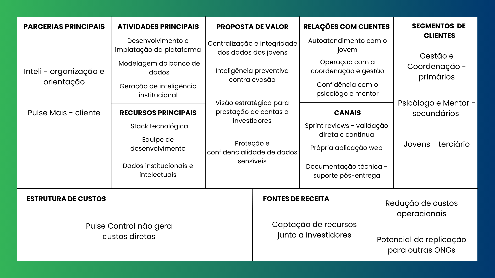<br>
  <p><b>Fonte:</b> Elaborado pelos autores, 2026</p>
</div>

### 6.5.1 Segmentos de Clientes (Customer Segments)

&ensp;&ensp;&ensp;&ensp;O segmento primário e definidor do Pulse Control é a própria Pulse Mais como organização, que contrata, valida e se beneficia da plataforma em sua totalidade. Enquanto ONG sem fins lucrativos com metodologia proprietária de transformação social, a Pulse Mais possui um problema de gestão de dados de escala e complexidade suficientes para justificar o desenvolvimento de uma solução tecnológica dedicada. Dessa forma, o valor que o Pulse Control entrega a esse segmento é sistêmico pois a plataforma transforma a infraestrutura informacional da organização inteira, substituindo um modelo fragmentado por uma base de dados unificada que habilita novos padrões de tomada de decisão e acompanhamento de impacto.

&ensp;&ensp;&ensp;&ensp;Já o segundo segmento de clientes é composto pelos perfis internos da Pulse Mais que utilizam a plataforma como ferramenta central de trabalho nos níveis estratégico e operacional, caracterizada por uma demanda de visão consolidada e monitoramento de indicadores de impacto para reportar a financiadores. Já a equipe de Coordenação caracteriza-se por uma demanda de eficiência operacional no registro e acompanhamento da jornada de cada jovem, interagindo com o sistema de forma intensiva e rotineira. Desse modo, ambos os perfis compartilham a necessidade de uma plataforma que substitua as planilhas por uma interface unificada, mas diferem na profundidade de sua interação com o sistema.

&ensp;&ensp;&ensp;&ensp;Por fim, o terceiro segmento de clientes do Pulse Control é composto pelos especialistas que atuam em dimensões específicas do desenvolvimento do jovem, sendo eles o Psicólogo, responsável pelo suporte à saúde mental, e o Mentor, responsável pelo acompanhamento profissional. Ambos os perfis caracterizam-se por demandas de acesso contextualizado e confidencial às informações dos jovens sob sua responsabilidade, sem exposição ao universo de dados da organização. Portanto, o valor entregue a esse segmento não é a precisão do acesso. onde cada especialista encontra na plataforma as informações necessárias para conduzir seus atendimentos sem risco de exposição de dados sensíveis de terceiros.

&ensp;&ensp;&ensp;&ensp;Por fim, o quarto segmento de clientes é composto pelos jovens atendidos pelos programas, beneficiários finais de toda a cadeia de valor que a ONG mobiliza. Embora não sejam os contratantes da plataforma, os jovens são usuários diretos, se posicionando como agentes ativos na manutenção de seus dados e beneficiários indiretos das funcionalidades de acompanhamento que a plataforma oferece à equipe da ONG.

### 6.5.2 Proposta de Valor (Value Proposition)

&ensp;&ensp;&ensp;&ensp;A dimensão mais fundamental da proposta de valor do Pulse Control é a substituição das múltiplas planilhas isoladas por uma plataforma web que opera como Single Source of Truth institucional, consolidando em um único sistema integrado todas as dimensões da jornada do aluno atendido pela ONG. Essa dimensão da proposta de valor materializa-se na criação de um perfil único por jovem, composto por dados cadastrais padronizados, histórico de participação em programas e eventos, registros de frequência, histórico de empregabilidade com preservação de vínculos encerrados, registro de acesso ao ensino superior e prontuário digital de saúde mental. Todos esses dados, historicamente dispersos em arquivos separados e inacessíveis de forma consolidada, passam a coexistir em um formato único e auditável.

&ensp;&ensp;&ensp;&ensp;A segunda dimensão da proposta de valor é a capacidade de transformar dados operacionais de frequência e engajamento em alertas preventivos que permitem à equipe da Pulse Mais identificar jovens em risco de abandono antes que a evasão efetivamente ocorra. Essa dimensão se materializa no mecanismo de sinalização automática de risco, que monitora continuamente o percentual de presença de cada jovem, e gera um alerta imediato no perfil individual e no dashboard sempre que esse índice cair abaixo do limiar configurável de 75%. Ademais, o alerta é removido de forma igualmente automática quando o jovem regularizar sua situação, eliminando a necessidade de monitoramento manual e substituindo uma gestão reativa por uma abordagem estruturalmente preventiva que age sobre o risco antes de sua conversão em perda real.

&ensp;&ensp;&ensp;&ensp;Já A terceira dimensão consiste na entrega de um conjunto consolidado de indicadores de impacto que permite à equipe de gestão reportar resultados a financiadores com dados precisos e em tempo real, substituindo um processo dependente de consolidações manuais sujeitas a imprecisões. Essa dimensão se materializa no dashboard estratégico da plataforma, que consolida automaticamente os indicadores prioritários para prestação de contas, como o total de jovens ativos nos programas, o total de jovens empregados, o índice de evasão, a frequência agregada, eventos e mentorias e a quantidade de computadores doados.

&ensp;&ensp;&ensp;&ensp;Por último, têm-se a capacidade de gerenciar dados de naturezas sensíveis radicalmente distintas no mesmo sistema sem comprometer a confidencialidade de nenhum deles, por meio de um modelo de controle de acesso estruturado em cinco perfis com permissões exclusivas. Essa dimensão se materializa na distinção operacional entre os perfis de Gestão, que possui acesso somente-leitura a todos os módulos exceto o prontuário psicológico, de Coordenação, que pode visualizar e editar mas não excluir permanentemente, de Psicólogo, que acessa exclusivamente o prontuário dos jovens sob sua responsabilidade, de Mentor, que visualiza apenas dados cadastrais básicos e histórico de sessões dos jovens com vínculo ativo e de Aluno, que acessa e edita apenas seus próprios dados por meio do portal dedicado. Dessa forma, informações sensíveis permanecem restritas aos perfis autorizados, assegurando que a Pulse Mais ofereça suporte individualizado com responsabilidade institucional.

### 6.5.3 Canais (Channels)

&ensp;&ensp;&ensp;&ensp;O canal primário pelo qual a Pulse Mais avalia a proposta de valor do Pulse Control ao longo de seu desenvolvimento são as reuniões periódicas de sprint review, realizadas ao final de cada ciclo com os pontos focais da ONG. Nessas sessões, funcionalidades entregues são apresentadas e testadas em tempo real pela equipe interna da organização, que valida se o comportamento do sistema corresponde ao fluxo operacional real, ajusta prioridades para a sprint seguinte e sinaliza divergências entre as expectativas e o produto construído. Esse canal informa o cliente sobre o progresso do projeto e retroalimenta ativamente o backlog de desenvolvimento, garantindo que cada entrega incremental reduza o risco de desalinhamento acumulado. Complementam esse canal os testes de usabilidade conduzidos com membros reais da equipe, que avaliam a funcionalidade e a adequação da interface aos hábitos operacionais da organização.

&ensp;&ensp;&ensp;&ensp;Além disso, a própria plataforma web, acessível via navegador em desktop e dispositivos móveis, torna-se um dos canais, sem necessidade de instalação ou configuração por parte do usuário final. A entrega ocorre de forma incremental a cada sprint, com módulos progressivamente integrados e disponíveis para uso pela equipe da Pulse Mais conforme o desenvolvimento avança. Já o ponto de entrada único da plataforma é a tela de seleção de perfil, que direciona cada usuário à sua interface específica, garantindo que a entrega da proposta de valor seja calibrada para as necessidades e os limites de acesso de cada segmento de cliente. Para os jovens, o canal se estende ao portal do aluno, que reconhece a realidade do público-alvo e assegura que a proposta de valor chegue ao usuário em qualquer dispositivo disponível.

&ensp;&ensp;&ensp;&ensp;Por fim, o canal de suporte após a entrega da plataforma é composto pela documentação técnica produzida ao longo do projeto. O WAD registra toda a arquitetura da solução, os padrões de codificação adotados, as regras implementadas e os fluxos de cada módulo, viabilizando que outros desenvolvedores realizem manutenções e evoluções futuras sem depender da equipe original. Esse canal de suporte é estratégico para a longevidade da solução pois sem ele, o risco mapeado na Matriz de Riscos de que a plataforma seja subutilizada após a entrega, dado que a equipe está habituada a operar com planilhas e mensagens, aumenta significativamente, comprometendo a principal oportunidade identificada no projeto, que é a consolidação do Pulse Control como ferramenta oficial de gestão da Pulse Mais.

### 6.5.4 Relacionamento com Clientes (Customer Relationships)

&ensp;&ensp;&ensp;&ensp;A relação que o Pulse Control estabelece com o perfil de Coordenação é uma relação operacional e assistida, desenhada para que a equipe que gerencia o dia a dia dos programas encontre na plataforma a interface central de trabalho para todas as suas atividades de registro e acompanhamento. Essa relação se materializa nas telas de cadastro e atualização de perfis de jovens, registro de frequência em aulas e eventos, gestão de empregabilidade e ensino superior, busca parametrizada por múltiplos filtros combinados e visualização do perfil consolidado de cada jovem em uma única tela. Portanto, o perfil de Coordenação interage com a plataforma de forma intensiva e rotineira, o que torna a usabilidade da interface vetor crítico da qualidade dessa relação.

&ensp;&ensp;&ensp;&ensp;Já com o perfil de Gestão, há uma relação estratégica e de leitura, projetada para que a equipe encontre na plataforma o instrumento de monitoramento de impacto e tomada de decisão baseada em evidências. Essa relação se materializa principalmente no acesso ao dashboard de indicadores, que entrega em tempo real os números que a gestão utiliza para avaliar a efetividade dos programas e reportar resultados a financiadoresa. Além disso, o modelo de leitura não é uma decisão arquitetural que preserva a integridade dos dados e delimita com clareza as responsabilidades de cada perfil dentro da organização.

&ensp;&ensp;&ensp;&ensp;Ademais, com o Psicólogo e Mentor existe uma especialização de escopo deliberadamente restrito, que garante a cada perfil acesso exclusivamente às informações necessárias para o exercício de suas funções sem exposição a dados que não lhes dizem respeito. Para o Psicólogo, essa relação se materializa no prontuário digital, onde o mesmo pode registrar e consultar acompanhamentos de saúde mental dos jovens sob sua responsabilidade. Para o Mentor, manifesta-se na visualização dos dados cadastrais básicos e do histórico de sessões de mentoria dos jovens com quem mantém vínculo registrado no sistema. Em ambos os casos, o relacionamento é mediado por restrições técnicas que impedem o acesso a informações fora do escopo de cada papel, protegendo tanto o jovem quanto a integridade institucional da Pulse Mais.

&ensp;&ensp;&ensp;&ensp;Por fim, entre a aplicação e o Aluno é de autoatendimento, estruturada para garantir que o jovem possa visualizar a atualizar seus dados de forma direta, sem depender da mediação da equipe. Essa relação se materializa no Portal do Aluno, que oferece ao jovem uma área de acesso restrito e personalizado acessível tanto por computador quanto por dispositivo móvel, na qual pode consultar seus dados cadastrais e atualizar informações de perfil. O modelo é deliberadamente autossuficiente para reduzir a carga operacional da equipe de coordenação e garantir que a base de dados permaneça atualizada com informações fornecidas diretamente pela fonte, eliminando a camada de intermediação humana que historicamente tornava esse processo lento e sujeito a inconsistências.

### 6.5.5 Fontes de Receita (Revenue Streams)

&ensp;&ensp;&ensp;&ensp;A principal fonte de receita que o Pulse Control habilita para a Pulse Mais é indireta e decorre da capacidade do dashboard estratégico de consolidar indicadores de impacto de forma precisa . Desse modo, organizações financiadoras, tomam decisões de alocação de recursos com base em evidências mensuráveis de transformação social. Portanto, ao substituir a consolidação manual de planilhas por indicadores automatizados, a solução reduz o esforço de prestação de contas da Pulse Mais e aumenta a credibilidade dos números, tornando a ONG mais competitiva no processo de captação de financiamento e, consequentemente, ampliando a base de recursos que sustenta a continuidade de seus programas.

&ensp;&ensp;&ensp;&ensp;A segunda fonte de receita é a redução de custos operacionais gerada pela centralização dos dados e pela automação de processos anteriormente manuais, o que libera tempo e energia da equipe interna para atividades de maior valor estratégico. Embora essa fonte não se materialize como entrada financeira direta, opera como receita implícita ao elevar a produtividade da organização sem acréscimo de despesa. Dessa maneira, o tempo antes consumido na consolidação de planilhas e na busca manual por dados dispersos é redirecionado para a ampliação da capacidade de atendimento e para o aprofundamento das relações com jovens, mentores e parceiros, gerando um ganho de eficiência que possui equivalente financeiro mensurável.

&ensp;&ensp;&ensp;&ensp;Por fim, têm-se a prospectiva que decorre do potencial de replicação da plataforma para outras organizações do terceiro setor com perfil operacional semelhante ao da Pulse Mais, ou seja, ONGs que gerenciam programas de capacitação e inserção profissional de jovens e enfrentam o mesmo problema estrutural de fragmentação de dados. Assim, a arquitetura em camadas adotada, a documentação técnica produzida e a generalidade do modelo de dados implementado posicionam a aplicação como uma solução com potencial de adaptação para outros contextos institucionais. Embora esse potencial não se converta em receita no horizonte imediato do projeto acadêmico, representa uma oportunidade concreta de sustentabilidade de longo prazo que poderia ser explorada pela Pulse Mais por meio de licenciamento, parceria ou oferta de serviço gerenciado a organizações do mesmo ecossistema.

### 6.5.6 Recursos Principais (Main Resources)

&ensp;&ensp;&ensp;&ensp;A proposta de valor do Pulse Control exige como recurso primário toda a camada tecnológica que sustenta a existência e a operação da plataforma. Essa camada compreende a stack definida em  HTML, CSS, JavaScript, Node.js com TypeScript e PostgreSQL via Supabase, que juntos formam a espinha dorsal técnica da solução. Além disso, a arquitetura em camadas organiza o código em responsabilidades específicas, garantindo baixo acoplamento, alta coesão e testabilidade independente por vertical de desenvolvimento. Complementam esse recurso a infraestrutura gerenciada do Supabasa e o repositório como ambiente de rastreabilidade do código.

&ensp;&ensp;&ensp;&ensp;Já como recurso secundáro, têm-se o capital humano que constrói, valida e operacionaliza a plataforma. No eixo de construção, esse recurso é composto pela equipe de desenvolvimento, com cada um responsável por verticais específicas do sistema a cada sprint, orientados pelo corpo docente em decisões arquiteturais, revisões e validações de qualidade técnica. No eixo de validação e domínio, o recurso é composto pelos pontos focais da Pulse Mais que, ao longo de cada sprint review, asseguram que as entregas resolvam efetivamente as dores operacionais da organização.

&ensp;&ensp;&ensp;&ensp;Além disso, como recurso insubstituível, há o ativo de dados que a Pulse Mais acumulou ao longo de sua operação e que a plataforma tem como missão centralizar, estruturar e preservar. Esse ativo é composto primariamente pelas planilhas, a fonte de dados legada que concentra, de forma despadronizada, o histórico de informações de todos os jovens atendidos pela organização. É sobre esse ativo, com todas as suas inconsistências, que o processo de migração estruturada previsto opera, com validação de duplicatas e roteiro de importação com verificações automáticas de integridade.

&ensp;&ensp;&ensp;&ensp;A proposta de valor do Pulse Control exige, por fim, o recurso mais difícil de replicar, que consiste no capital intelectual acumulado pela Pulse Mais em seu período ativo. Do lado da ONG, esse capital se manifesta no framework conectado-capacitado-transformado, que estrutura toda a lógica de classificação e acompanhamento de jovens e no Tripé de Transformação, que orienta quais dimensões da jornada do jovem a plataforma deve ser capaz de registrar e monitorar, além das métricas estratégicas que a organização utiliza para reportar a financiadores, as quais definem os indicadores obrigatórios do dashboard.

### 6.5.7 Atividades Principais (Main Activities)

&ensp;&ensp;&ensp;&ensp;A atividade mais fundamental que a proposta de valor do Pulse Control exige é o próprio desenvolvimento iterativo da aplicação web que substitui as múltiplas planilhas dispersas da Pulse Mais por uma Single Source of Truth. Essa atividade compreende a implementação e o refinamento contínuo de todos os módulos que compõem o MVP, como o cadastro e a centralização de perfis únicos de jovens com dados cadastrais padronizados, o módulo de registro de jornada, que captura frequência, participação, sessões de mentoria e entrega de atividades, o prontuário digital com controle de acesso restrito por perfil, o dashboard de monitoramento de impacto, que consolida em tempo real os principais indicadores estratégicos e o portal do aluno, que permite ao próprio jovem visualizar e atualizar seus dados diretamente na plataforma. 

&ensp;&ensp;&ensp;&ensp;Além disso, a proposta de valor do Pulse Control depende criticamente da atividade de modelagem, estruturação e governança do banco de dados que consolida, pela primeira vez na história da Pulse Mais, todo o histórico de jornada dos jovens em um repositório único, íntegro e auditável. Essa atividade compreende a definição do modelo entidade-relacionamento que mapeia as entidades centrais do domínio, a implementação do modelo físico em PostgreSQL via Supabase e a execução do processo de migração dos dados das planilhas para a nova estrutura. 

&ensp;&ensp;&ensp;&ensp;A proposta determina, além do desenvolvimento técnico, a atividade de garantir que a equipe interna da Pulse Mais adote a plataforma de forma consistente e sustentável, superando a resistência à mudança de uma operação historicamente baseada em planilhas e mensagens. Essa atividade compreende a produção de documentação de uso acessível a não-desenvolvedores, a realização de testes de usabilidade com usuários reais da equipe da Pulse Mais e a revisão iterativa de vocabulário e terminologia da interface para assegurar sua aderência ao vocabulário institucional da organização. 

&ensp;&ensp;&ensp;&ensp;Por fim, há a atividade contínua de transformar dados operacionais em inteligência institucional acionável para os diferentes perfis de usuário. Para o perfil de Gestão, essa atividade se materializa no dashboard estratégico que consolida os indicadores que a Pulse Mais utiliza para reportar impacto a financiadores. Já para o perfil de Coordenação, manifesta-se no acompanhamento operacional de frequências, no monitoramento de risco de evasão, na gestão dos vínculos e sessões de mentoria e na visualização do perfil individual completo de cada jovem em uma única tela. Por fim, para o perfil de Psicólogo, concentra-se no prontuário digital com registros de saúde mental de visibilidade restrita, que permite identificar vulnerabilidades emocionais antes que se convertam em evasão.

### 6.5.8 Parcerias Principais (Main Partnerships)

&ensp;&ensp;&ensp;&ensp;A Pulse Mais é a cliente da plataforma e, simultaneamente, a principal parceira estratégica e a razão de existência do Pulse Control. Organização sem fins lucrativos com mais de três anos de atuação e metodologia própria comprovada, a Pulse Mais atua como provedora do problema real que confere sentido à solução e do domínio operacional necessário para validar cada requisito. Dessa forma, os recursos que o projeto adquire dessa parceria incluem os dados históricos, o conhecimento tácito da equipe interna sobre os fluxos operacionais, o framework de mensuração de impacto conectado-capacitado-transformado e as métricas estratégicas prioritárias para doadores, que orientam diretamente o design da aplicação. Além disso, as atividades que a Pulse Mais realiza em favor do projeto compreendem a validação e priorização de funcionalidades a cada sprint review conduzida pelos pontos focais da ONG, a modelagem implícita do domínio ao compartilhar as regras que regem o controle e, fundamentalmente, a execução dos programas de formação, mentoria e conexão profissional cujos dados são o objeto central do sistema.

&ensp;&ensp;&ensp;&ensp;Ademais, o Inteli é o parceiro fundacional e insubstituível do Pulse Control, sendo a relação entre as duas instituições. Como provedor central do projeto, o Inteli disponibiliza capital humano na forma da equipe de desenvolvimento, orientação técnica pelo corpo docente, infraestrutura de desenvolvimento e a legitimidade acadêmica que posiciona a solução além de uma iniciativa artesanal. Já os recursos adquiridos dessa parceria incluem o enquadramento metodológico que garante entregas em sprints cadenciadas e revisadas, a definição e supervisão da stack tecnológica, além dos padrões de codificação documentados. Por fim, as atividades que o Inteli realiza em favor do projeto abrangem o desenvolvimento técnico integral da plataforma, a validação da conformidade com os requisitos, a estruturação dos testes e a produção da documentação técnica que viabiliza a manutenção futura da solução por terceiros ou desenvolvedores da própria Pulse Mais.

### 6.5.9 Estrutura de Custos (Cost Structure)

&ensp;&ensp;&ensp;&ensp;O Pulse Control, em sua natureza e configuração atual, não gera custos diretos para a Pulse Mais. Essa é uma característica estrutural do projeto e decorre de três fatores que atuam de forma simultânea e complementar. 

&ensp;&ensp;&ensp;&ensp;O primeiro é o contexto de origem acadêmica da solução, em que a aplicação é desenvolvida integralmente no âmbito do Instituto de Tecnologia e Liderança, como projeto parceiro com problema e cliente real. Isso significa que todo o capital humano responsável pela construção da plataforma é inteiramente provido pelo Inteli como parte de sua proposta pedagógica, sem qualquer bônus financeiro para a Pulse Mais. Desse modo, o desenvolvimento da solução, que em um modelo de mercado envolveria contratação e gerenciamento de equipe, arquitetura de software e ciclos de validação, ocorre aqui como co-criação entre instituição de ensino e organização. 

&ensp;&ensp;&ensp;&ensp;O segundo fator é a deliberada escolha por ferramentas e infraestruturas gratuitas pois a stack tecnológica adotada é composta integralmente por tecnologias de código aberto ou com planos gratuitos suficientes para o escopo do projeto.

&ensp;&ensp;&ensp;&ensp;O terceiro e último fator é o perfil organizacional da Pulse Mais como beneficiária da solução, em que a organização é uma ONG sem fins lucrativos e a parceria com o Inteli foi estruturada precisamente para que a solução tecnológica seja entregue de forma gratuita e sustentável.

&ensp;&ensp;&ensp;&ensp;Em síntese, o modelo de negócio do Pulse Control é estruturalmente orientado à minimização total de custos para o cliente e essa característica decorre da combinação entre a natureza acadêmica do projeto, as decisões arquiteturais que priorizaram tecnologias abertas e o propósito social que orienta ambas as instituições envolvidas. Portanto, o valor entregue pela plataforma é integralmente gerado sem despesas, o que o torna um dos diferenciais mais concretos e relevantes de seu modelo de valor.

## 6.6 Estratégia de Marketing 

### 6.6.1 Produto/Serviço

&ensp;&ensp;&ensp;&ensp;O Pulse Control é uma aplicação web desenvolvida para centralizar e monitorar a jornada dos jovens atendidos pela Pulse Mais. A plataforma permite cadastrar e consultar informações do jovem, visualizar seu histórico em um perfil individual e registrar dados importantes da trajetória educacional, como presença em aulas, participação em eventos e envolvimento em atividades da organização. Também contempla o Portal do Aluno, onde o próprio jovem pode acessar informações personalizadas e manter seus dados atualizados.

&ensp;&ensp;&ensp;&ensp;Além disso, a solução apoia o acompanhamento individualizado por meio de mentorias relacionadas ao bem-estar dos participantes. Ademais, mentores podem consultar informações dos jovens vinculados e registrar acompanhamentos, enquanto psicólogos possuem espaço para prontuários e observações sensíveis, respeitando diferentes níveis de acesso. Com isso, a equipe consegue acompanhar frequência, engajamento, sinais de desmotivação e situações que possam exigir intervenção preventiva.

&ensp;&ensp;&ensp;&ensp;Logo, o principal diferencial da aplicação está na integração dessas informações com métricas e indicadores estratégicos. Por esse caminho, a interface reúne gráficos sobre retenção, empregabilidade e impacto social, permitindo que a ONG compreenda melhor sua atuação na vida dos jovens de baixa renda. Assim, o sistema se torna uma ferramenta de gestão, acompanhamento individualizado e demonstração de impacto para parceiros e financiadores.

### 6.6.2 Preço

&ensp;&ensp;&ensp;&ensp;Por ser desenvolvida em contexto acadêmico e destinada a uma organização sem fins lucrativos, o Pulse Control é entregue gratuitamente à Pulse Mais como resultado da parceria educacional com o Inteli. No MVP, não há cobrança de licença, tendo como foco ampliar o impacto social da ONG e não gerar receita para o grupo desenvolvedor.

&ensp;&ensp;&ensp;&ensp;Caso a Pulse Mais decida manter ou evoluir a plataforma após o encerramento do projeto, os custos futuros dependerão da própria organização. Esses custos podem envolver hospedagem, banco de dados, manutenção técnica, correção de erros e desenvolvimento de novas funcionalidades. Além disso, a continuidade também poderá ser viabilizada por parceiros, financiadores, voluntários técnicos ou profissionais contratados pela ONG.

&ensp;&ensp;&ensp;&ensp;Dessa forma, a justificativa desse modelo está no tipo de valor gerado, em que, para a Pulse Mais, o retorno esperado está na economia de tempo, na redução de retrabalho, na centralização dos dados e na melhoria dos relatórios de impacto. Já para o grupo desenvolvedor, o retorno é formativo e social, através da construção de uma solução real para uma organização de impacto.

### 6.6.3 Praça (Distribuição)

&ensp;&ensp;&ensp;&ensp;A Pulse Control será disponibilizada como aplicação web acessível por navegador, sem necessidade de instalação, permitindo o uso em computadores e dispositivos móveis. A hospedagem deverá ocorrer em um ambiente de deploy conectado ao banco de dados PostgreSQL/Supabase, evitando que a ONG dependa de infraestrutura própria para testar e validar a solução.

&ensp;&ensp;&ensp;&ensp;Já a distribuição ocorrerá em duas etapas, primeiro, em ambiente de homologação, para que a equipe da Pulse Mais valide os fluxos principais, como o cadastro de jovens, registro de frequência, participação em eventos, acompanhamento de mentorias, consulta ao perfil individual e visualização de dashboards. Em seguida, caso a organização decida continuar com a solução, o acesso poderá ser liberado progressivamente em ambiente de uso controlado, conforme os perfis de Gestão, Coordenação, Mentores, Psicólogos e Alunos.

&ensp;&ensp;&ensp;&ensp;Por fim, os canais de acesso serão o link direto da aplicação, compartilhado internamente pela equipe da Pulse Mais, e a documentação de uso organizada por perfil. Dessa maneira, a adoção gradual prioriza os usuários operacionais responsáveis pelo cadastro e acompanhamento diário, substituindo progressivamente as planilhas dispersas por uma fonte única de dados.

### 6.6.4 Promoção

&ensp;&ensp;&ensp;&ensp;A estratégia de promoção do Pulse Control organiza-se em quatro frentes complementares, considerando que a adoção depende tanto da decisão institucional da Pulse Mais quanto do engajamento cotidiano de sua equipe.

&ensp;&ensp;&ensp;&ensp;A primeira frente é a comunicação interna à ONG. Antes de qualquer divulgação externa, é necessário que a liderança da Pulse Mais compreenda o valor da plataforma e formalize sua adoção. Para isso, recomenda-se a apresentação do MVP em reunião com a coordenação e gestão, evidenciando como a solução reduz retrabalho, centraliza dados e fortalece a prestação de contas a financiadores. Materiais de apoio como pitch deck e vídeo demonstrativo podem ser utilizados nessa etapa.

&ensp;&ensp;&ensp;&ensp;A segunda frente é o onboarding da equipe operacional. A adoção real da plataforma depende de que coordenadores, psicólogos, mentores e demais usuários compreendam os fluxos de cada perfil. Para isso, propõe-se a realização de sessões de treinamento presencial ou remoto, acompanhadas de guias de uso organizados por perfil e de documentação acessível para consulta autônoma. Essa etapa é crítica para substituir progressivamente as planilhas dispersas pela plataforma como fonte primária de dados.

&ensp;&ensp;&ensp;&ensp;A terceira frente envolve as redes sociais institucionais da Pulse Mais. Caso a organização decida divulgar publicamente a adoção da solução, os canais institucionais — como LinkedIn e Instagram — podem ser utilizados para comunicar a modernização da gestão, reforçando a imagem da ONG como organização comprometida com transparência e inovação social. Essa divulgação fortalece a credibilidade junto a parceiros e potenciais financiadores.

&ensp;&ensp;&ensp;&ensp;A quarta frente é a divulgação para o ecossistema de impacto social. A médio prazo, a solução pode ser apresentada em eventos, comunidades e redes voltadas ao terceiro setor, como fóruns de inovação social, aceleradoras de impacto e programas de financiamento coletivo. Essa exposição amplia o reconhecimento da plataforma e abre espaço para replicabilidade em organizações com perfil semelhante ao da Pulse Mais.


# <a name="c7"></a> 7. Conclusões e trabalhos futuros 

## 7.1. Conclusão: objetivos x resultados

A plataforma Pulse Control nasceu para resolver um problema concreto da Pulse Mais: os dados dos jovens estavam espalhados em planilhas isoladas, sem nenhuma visão unificada da jornada de cada participante. Ao final da Sprint 5, a solução entregou o que foi proposto na seção 2: um sistema web centralizado com backend em Node.js/TypeScript conectado a banco de dados PostgreSQL via Supabase, 14 serviços de negócio, 29+ endpoints REST documentados e 16 páginas de frontend cobrindo os cinco perfis previstos — Coordenador, Gestor, Psicólogo, Mentor e Aluno. O cadastro unificado de jovens substitui o "planilhão" como fonte primária de dados (RF001–RF003), o dashboard exibe os indicadores-chave em tempo real (RF008), o prontuário digital com acesso restrito ao psicólogo está implementado e auditado (RF010), e o portal do aluno permite que o jovem visualize e edite seus próprios dados (RF013). A trilha de categorias Conectado–Capacitado–Transformado registra automaticamente data, usuário responsável e categoria anterior a cada progressão (RN07), e a suíte de testes com 333 casos aprovados e 94% de cobertura na camada de serviço garante que as regras de negócio estejam verificadas e protegidas contra regressões.

**Pontos fortes**

A separação em camadas tornou o código testável e fácil de estender: adicionar um novo endpoint não exige mexer na lógica de negócio existente. A sanitização contra XSS em todas as 16 páginas e o soft delete de jovens — que preserva o histórico mesmo após a desativação do registro — mostram atenção à segurança e à integridade dos dados. O fallback automático para dados mock quando a API não responde dentro de 600ms mantém a interface funcional mesmo em conexões instáveis, algo relevante para o público jovem atendido. A responsividade desde 360px cobre o acesso majoritariamente mobile. O registro assíncrono de auditoria em `historico_acoes` garante rastreabilidade dos acessos ao prontuário sem impactar o tempo de resposta das operações normais.

**Pontos a melhorar**

A limitação mais importante é a ausência de autenticação real: o sistema confia no perfil declarado pelo cliente na requisição, o que impede o uso em produção com segurança. A integração do perfil do jovem com os históricos de empregabilidade e programa está incompleta — as funções `obterProgramaAtual` e `obterHistoricoEmpregos` do [jovemService.ts](src/services/jovemService.ts) ainda retornam valores vazios, então o perfil consolidado (RF009) não exibe esses dados na interface. Os indicadores socioeconômicos de incremento de renda (RF015) também não chegaram ao frontend. A rotina automática de exportação de logs a cada 120 horas, prevista nos RNFs, não foi implementada. E o processo de migração real dos dados do "planilhão" para o banco não foi executado no projeto, o que significa que a substituição efetiva das planilhas ainda depende de uma operação de onboarding dos dados históricos a ser realizada pela própria organização.

## 7.2. Plano de ação a partir dos testes

Os testes de guerrilha da Sprint 5 (seção 5.2.1) revelaram dois padrões de dificuldade: falta de orientação contextual nos fluxos de navegação entre perfis e ausência de feedback visual após ações concluídas. Junto com as lacunas técnicas identificadas ao longo do desenvolvimento, esses achados apontam para as seguintes ações prioritárias.

A mais urgente é resolver a autenticação (RF018, RF010). Hoje o sistema aceita qualquer perfil declarado na requisição, o que é arriscado em produção. A ação proposta é implementar autenticação com JWT ou sessão no servidor, validando o perfil antes de qualquer acesso ao banco. Sem isso, a plataforma não deve ser disponibilizada para uso real.

Com prioridade alta, estão três itens. O primeiro é completar a integração do perfil do jovem (RF009): conectar o [jovemService.ts](src/services/jovemService.ts) aos repositórios de empregabilidade e inscrição para que os históricos apareçam no frontend, onde hoje ficam em branco. O segundo é melhorar a navegação do perfil Psicólogo: os testes mostraram desorientação no meio do fluxo de criação de anotação — adicionar um indicador de contexto e um botão "Cancelar" explícito já resolveria o problema. O terceiro é executar a migração real dos dados do "planilhão": o [importService.ts](src/services/importService.ts) já está pronto, falta aplicá-lo aos dados reais da Pulse Mais com validação de duplicatas (RN23) e relatório de inconsistências antes de persistir qualquer dado.

Com prioridade menor, dois ajustes agregam valor sem grande esforço: exibir os indicadores de incremento de renda (RF015) no dashboard e no perfil do jovem, consumindo campos que já existem na API de empregabilidade; e configurar um job agendado com `node-cron` para disparar a exportação de logs a cada 120 horas automaticamente, sem depender de ação manual.

Por fim, no nível cosmético, o fluxo de cadastro de aluno não exibe nenhum feedback visual após o salvamento bem-sucedido — um toast ou modal de confirmação com link para o perfil criado já eliminaria essa lacuna.

## 7.3. Trabalhos futuros

Ao longo do desenvolvimento, o grupo identificou melhorias que não couberam no escopo do MVP, mas que representam passos naturais para tornar a plataforma utilizável em produção pela equipe da Pulse Mais.

A primeira e mais urgente é a implementação de autenticação real. O sistema atual distingue perfis por parâmetro declarado na requisição, o que é suficiente para um ambiente acadêmico controlado, mas inviável em produção. Uma autenticação simples com usuário e senha, ou integração com o Google — já usado pela equipe da Pulse Mais — resolveria essa limitação sem grandes mudanças na arquitetura existente.

A segunda melhoria é a execução da migração real dos dados do "planilhão" para o banco da plataforma. O serviço de importação já está implementado, faltando apenas aplicá-lo aos dados reais da organização para que a plataforma substitua efetivamente as planilhas como fonte primária de informação.

O grupo também identificou a necessidade de completar a exibição do histórico de empregabilidade e do programa atual no perfil do jovem, que atualmente retorna vazio por pendência de integração entre serviços já implementados no backend.

Por fim, a adição de notificações simples por e-mail para alertas de risco de evasão permitiria que a equipe fosse avisada automaticamente, sem precisar acessar o dashboard diariamente — funcionalidade de baixa complexidade técnica e alto impacto operacional para uma organização com equipe reduzida.

# <a name="c8"></a> 8. Referências 

INTELI. TAPI 1AMD2 - Termo de Abertura do Projeto Inteli: Pulse Mais. São Paulo: Inteli, 2026.

PULSE MAIS. Relatório de Atividades. São Paulo: Pulse Mais, 2025.

PULSE MAIS. Apresentação Executiva 2026 PULSE MAIS. São Paulo: Pulse Mais, 2026.

PORTER, Michael E. Competitive Strategy: Techniques for Analyzing Industries and Competitors. New York: Free Press, 1980.

PINGBACK. Como fazer uma análise SWOT. Disponível em: https://pingback.com/br/resources/como-fazer-uma-analise-swot/. Acesso em: 1 maio 2026.

OSTERWALDER, Alexander; PIGNEUR, Yves; BERNARDA, Gregory; SMITH, Alan. Value Proposition Design: How to Create Products and Services Customers Want. 1. ed. Hoboken: Wiley, 2014.

FERRAMENTAS DA QUALIDADE. Matriz de Riscos: matriz de probabilidade e impacto. Disponível em: https://ferramentasdaqualidade.org/matriz-de-riscos-matriz-de-probabilidade-e-impacto/. Acesso em: 1 maio 2026.

GARRETT, Jesse James. The Elements of User Experience: User-Centered Design for the Web and Beyond. 2. ed. Berkeley: New Riders, 2010.

LEVIN, Oscar. Discrete Mathematics: An Open Introduction. 3. ed. [S. l.]: Open SUNY Textbooks, 2022.

FROST, Brad. Atomic Design. 1. ed. Pittsburgh: Brad Frost, 2016.

FOWLER, Martin. UML Essencial: um breve guia para a linguagem padrão de modelagem de objetos. 3. ed. Porto Alegre: Bookman, 2005.

INSTITUTO DE PESQUISA ECONÔMICA APLICADA (IPEA). Brasil possui mais de 897 mil organizações da sociedade civil ativas. Brasília, 5 fev. 2025. Disponível em: https://www.ipea.gov.br/portal/categorias/45-todas-as-noticias/noticias/15591-brasil-possui-mais-de-897-mil-organizacoes-da-sociedade-civil-ativas. Acesso em: 4 jun. 2026.

OBSERVATÓRIO DO TERCEIRO SETOR. Mapa das OSCs: Brasil tem 815 mil organizações da sociedade civil (dados de vínculos formais de trabalho, base 2020). 2021. Disponível em: https://observatorio3setor.org.br/mapa-das-oscs-brasil-815-mil-organizacoes-sociedade-civil/. Acesso em: 4 jun. 2026.

BRASIL. Lei nº 13.019, de 31 de julho de 2014. Estabelece o regime jurídico das parcerias entre a administração pública e as organizações da sociedade civil (MROSC). Brasília: Presidência da República, 2014. Disponível em: http://www.planalto.gov.br/ccivil_03/_ato2011-2014/2014/lei/l13019.htm. Acesso em: 4 jun. 2026.

BRASIL. Lei nº 13.709, de 14 de agosto de 2018. Lei Geral de Proteção de Dados Pessoais (LGPD). Brasília: Presidência da República, 2018. Disponível em: http://www.planalto.gov.br/ccivil_03/_ato2015-2018/2018/lei/l13709.htm. Acesso em: 4 jun. 2026.

DIÁRIO DO COMÉRCIO. Após cinco anos em vigor, LGPD ainda é desafio para pequenas empresas e terceiro setor. 20 set. 2025. Disponível em: https://diariodocomercio.com.br/legislacao/lgpd-desafios-pequenas-empresas-terceiro-setor/. Acesso em: 4 jun. 2026.

VERIFIED MARKET REPORTS. Nonprofit Management Software Market Size, Trends & Forecast. 2025. Disponível em: https://www.verifiedmarketreports.com/product/nonprofit-management-software-market/. Acesso em: 4 jun. 2026.

VERIFIED MARKET REPORTS. Global Nonprofit Software Market Size. 2025. Disponível em: https://www.verifiedmarketreports.com/product/nonprofit-software-market/. Acesso em: 4 jun. 2026.

ASSOCIAÇÃO BRASILEIRA DAS EMPRESAS DE SOFTWARE (ABES); IDC. Estudo do Mercado Brasileiro de Software 2024/2025. Disponível em: https://brasilpaisdigital.com.br/brasil-retorna-ao-grupo-das-dez-maiores-potencias-globais-do-mercado-de-tecnologia-aponta-novo-estudo-da-abes/. Acesso em: 4 jun. 2026.

EBANX. Mercado de SaaS na América Latina deve dobrar até 2027. 2025. Disponível em: https://www.ecommercebrasil.com.br/noticias/mercado-de-saas-na-america-latina-deve-dobrar-ate-2027-aponta-ebanx. Acesso em: 4 jun. 2026.

CODEBIT. Como a tecnologia está transformando o terceiro setor: inovação, impacto e eficiência para ONGs. 16 out. 2025. Disponível em: https://codebit.com.br/blog/terceiro-setor/como-a-tecnologia-esta-transformando-o-terceiro-setor-inovacao-impacto-e-eficiencia-para-ongs. Acesso em: 4 jun. 2026.

GERANDO FALCÕES. Transformação Digital e o terceiro setor. 2022. Disponível em: https://blog.gerandofalcoes.com/transformacao-digital-no-terceiro-setor/. Acesso em: 4 jun. 2026.

ASSIS E MENDES ADVOGADOS. Aplicação da LGPD às entidades do terceiro setor. Disponível em: https://assisemendes.com.br/aplicacao-da-lgpd-as-entidades-do-terceiro-setor/. Acesso em: 4 jun. 2026.

RH PRA VOCÊ. Transformação digital e ESG: os caminhos do terceiro setor em 2025. 20 dez. 2024. Disponível em: https://rhpravoce.com.br/colab/transformacao-digital-esg-terceiro-setor. Acesso em: 4 jun. 2026.

# <a name="c9"></a> 9. Anexos

Não se aplica
